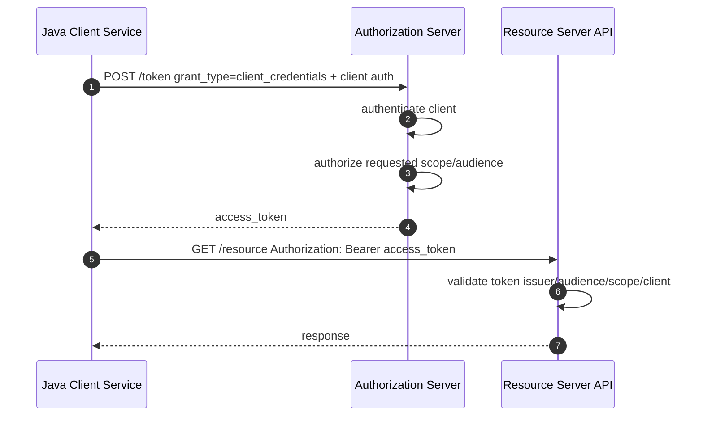
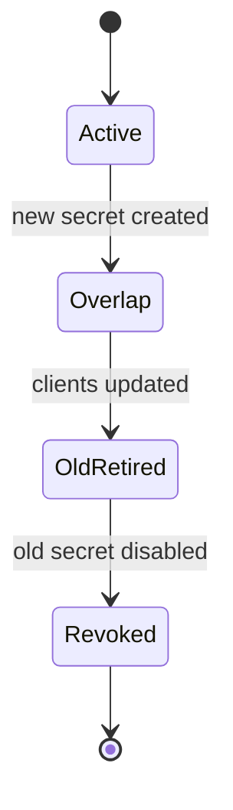
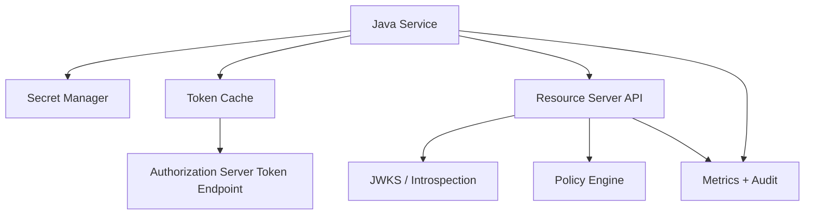

# Part 024 — Client Credentials Flow

> Target part ini: memahami dan mengimplementasikan OAuth 2.x Client Credentials Flow untuk machine-to-machine authentication di Java systems. Fokusnya adalah service identity, client authentication, token acquisition, token caching, scope/audience design, secret rotation, runtime isolation, observability, dan failure modes di microservices.

Client Credentials Flow dipakai ketika tidak ada user interaktif.

Contoh:

```txt
billing-worker calls invoice-api
order-service calls pricing-service
nightly-job calls report-api
integration-adapter calls partner-api
```

Dalam flow ini, client memakai credential miliknya sendiri untuk meminta access token.
Token mewakili **client/service identity**, bukan user identity.

Mental model:

```txt
Client authenticates as itself.
Authorization server issues access token for that client.
Resource server authorizes based on client identity, scope, audience, and policy.
```

---

## 1. What Problem It Solves

Tanpa client credentials, service-to-service auth sering menjadi:

- static API key tersebar di banyak service;
- Basic Auth ke setiap API;
- shared secret yang sama dipakai semua caller;
- mTLS saja tanpa authorization semantics;
- internal network dianggap trusted;
- token user dipakai untuk batch/background job;
- long-lived admin token disimpan di config.

Client Credentials Flow menyediakan pola standar:

```txt
service credential -> token endpoint -> short-lived access token -> protected API
```

Keuntungannya:

- credential utama tidak dikirim ke setiap resource server;
- access token bisa short-lived;
- resource server menerima format auth yang seragam;
- scope dan audience bisa dikontrol;
- revocation/rotation dapat dipusatkan;
- audit bisa membedakan caller service.

---

## 2. What It Does Not Solve

Client Credentials bukan user authentication.

Tidak cocok untuk:

```txt
User clicked approve order.
User created case.
User requested personal data export.
```

Kalau action butuh user accountability, token client credentials saja tidak cukup.
Anda membutuhkan salah satu dari:

- user access token;
- token exchange / on-behalf-of;
- explicit actor context;
- signed audit context;
- workflow task assignment identity;
- service account plus separately verified business actor.

Rule:

```txt
Client credentials answers: which service is calling?
It does not answer: which human initiated this action?
```

---

## 3. Basic Flow



Token request:

```http
POST /oauth2/token HTTP/1.1
Host: idp.example.com
Content-Type: application/x-www-form-urlencoded
Authorization: Basic base64(client_id:client_secret)

grant_type=client_credentials&scope=pricing:read
```

Token response:

```json
{
  "access_token": "eyJ...",
  "token_type": "Bearer",
  "expires_in": 300,
  "scope": "pricing:read"
}
```

---

## 4. Identity Model

A production-grade client credentials design starts with a domain model.

```txt
ServiceClient
  id
  client_id
  display_name
  owner_team
  environment
  tenant_id? / organization_id?
  allowed_grants
  allowed_scopes
  allowed_audiences
  auth_method
  status
  created_at
  rotated_at

ClientCredential
  id
  client_id
  credential_type
  secret_hash / jwk_thumbprint / cert_thumbprint
  active_from
  expires_at
  status

ServiceAccountPolicy
  client_id
  resource
  action/scope
  conditions
```

Do not treat OAuth client registration as mere IdP UI configuration.
It is part of your platform identity model.

---

## 5. Client Authentication Methods

Client credentials flow requires client authentication.
Common methods:

| Method | Description | Fit |
|---|---|---|
| `client_secret_basic` | client id/secret in HTTP Basic | common server-side service |
| `client_secret_post` | client id/secret in body | only if provider requires it |
| `private_key_jwt` | signed JWT assertion | stronger non-shared-secret model |
| mTLS client auth | certificate-based client authentication | high-trust service mesh/API |
| workload identity federation | cloud/runtime identity exchange | cloud-native workloads |

Prefer stronger methods when operating at scale:

```txt
small/internal: client_secret_basic may be acceptable
large/high-risk: private_key_jwt or mTLS
cloud-native: workload identity federation where available
```

---

## 6. Secret-Based Client Authentication

With `client_secret_basic`, the secret is a long-lived credential.
Handle it like a production secret:

```txt
Store in secret manager.
Inject at runtime.
Do not bake into image.
Do not log.
Do not commit.
Rotate periodically.
Support overlapping old/new secret.
Limit blast radius per client/environment.
```

Bad:

```yaml
client-secret: orders-secret-123
```

Better:

```yaml
client-secret: ${ORDERS_CLIENT_SECRET}
```

Even better:

```txt
runtime secret reference from Vault / AWS Secrets Manager / Azure Key Vault / Kubernetes Secret sealed/encrypted pipeline
```

But remember: Kubernetes Secret is not automatically a complete secret-management solution.
It must be protected by RBAC, encryption at rest, access policies, and deployment discipline.

---

## 7. Private Key JWT

`private_key_jwt` lets the client authenticate by signing a JWT assertion.
The authorization server verifies it with the client's registered public key.

Conceptual assertion:

```json
{
  "iss": "orders-worker",
  "sub": "orders-worker",
  "aud": "https://idp.example.com/oauth2/token",
  "jti": "random-one-time-id",
  "exp": 1783078800,
  "iat": 1783078500
}
```

Properties:

- private key remains with client;
- AS stores public key/JWK;
- assertion is short-lived;
- `jti` can prevent replay;
- key rotation can use JWK set.

Java signing example shape:

```java
public String clientAssertion(PrivateKey key, String keyId, String clientId, URI tokenEndpoint) {
    Instant now = Instant.now();

    return Jwts.builder()
        .issuer(clientId)
        .subject(clientId)
        .audience().add(tokenEndpoint.toString()).and()
        .id(UUID.randomUUID().toString())
        .issuedAt(Date.from(now))
        .expiration(Date.from(now.plusSeconds(300)))
        .signWith(key, Jwts.SIG.RS256)
        .header().keyId(keyId).and()
        .compact();
}
```

The exact implementation depends on your JWT library and IdP requirements.
Do not invent your own signature format.

---

## 8. mTLS Client Authentication

mTLS can be used for OAuth client authentication and for certificate-bound tokens.

Model:

```txt
Client proves possession of private key during TLS handshake.
Authorization server maps certificate to OAuth client.
Issued token can be bound to certificate.
Resource server rejects token unless caller presents same certificate.
```

This significantly reduces bearer-token replay risk.

Trade-offs:

- certificate lifecycle is operationally heavy;
- termination boundary must be controlled;
- resource server must see/verify client certificate or trusted binding;
- debugging is harder;
- service mesh integration must be designed carefully.

---

## 9. Scope and Audience Design

Bad scope design:

```txt
scope=api
scope=read
scope=admin
```

Better:

```txt
pricing:read
pricing:quote
orders:create
orders:status:read
case:assignment:write
```

Audience answers:

```txt
Who is this token intended for?
```

Scope answers:

```txt
What operation category is allowed?
```

Subject/client answers:

```txt
Who is the caller?
```

Resource server policy should combine all three:

```txt
issuer == trusted_idp
audience contains pricing-api
client_id == orders-service
scope contains pricing:quote
client status == active
```

---

## 10. Claims for Machine Tokens

Typical machine token claims:

```json
{
  "iss": "https://idp.example.com/realms/acme",
  "sub": "client:orders-service",
  "aud": "pricing-api",
  "azp": "orders-service",
  "client_id": "orders-service",
  "scope": "pricing:read pricing:quote",
  "exp": 1783078800,
  "iat": 1783078500,
  "jti": "..."
}
```

Be careful with `sub`.
Some providers set `sub` to internal service account user.
Some set `client_id` or `azp` separately.
Design your resource server converter based on provider contract.

Invariant:

```txt
Resource server must extract service identity from a provider-specific, validated, documented claim mapping.
```

---

## 11. Access Token Lifetime

Client credentials access tokens should usually be short-lived.
Common range:

```txt
5 to 15 minutes for normal service calls
1 to 5 minutes for high-risk APIs
longer only with explicit risk acceptance
```

Short lifetime reduces leaked token blast radius.
But too short increases token endpoint load and failure coupling.

Decision:

| Lifetime | Benefit | Risk |
|---|---|---|
| very short | smaller leak window | token endpoint pressure |
| medium | balanced | moderate leak window |
| long | fewer token calls | high replay impact |

Use caching.
Do not request a new token on every API call.

---

## 12. Token Caching

Bad pattern:

```txt
Every outbound request calls /token first.
```

This causes:

- higher latency;
- token endpoint load;
- outage coupling;
- rate limit failures;
- thundering herd at expiry.

Better:

```txt
Cache token by client registration + audience + scope set.
Refresh before expiry with jitter.
Use single-flight refresh to avoid stampede.
```

Java token cache shape:

```java
record TokenCacheKey(String registrationId, String audience, Set<String> scopes) {}

record CachedToken(String value, Instant expiresAt) {
    boolean isUsable(Clock clock) {
        return Instant.now(clock).isBefore(expiresAt.minusSeconds(30));
    }
}
```

Single-flight concept:

```java
public CompletionStage<CachedToken> token(TokenCacheKey key) {
    CachedToken cached = cache.get(key);
    if (cached != null && cached.isUsable(clock)) {
        return CompletableFuture.completedFuture(cached);
    }
    return inFlight.computeIfAbsent(key, this::fetchAndCache)
        .whenComplete((t, e) -> inFlight.remove(key));
}
```

---

## 13. Spring Security OAuth2 Client

Spring Security supports OAuth2 Client role and client credentials grant.

Configuration:

```yaml
spring:
  security:
    oauth2:
      client:
        registration:
          pricing:
            provider: keycloak
            client-id: orders-service
            client-secret: ${ORDERS_SERVICE_CLIENT_SECRET}
            authorization-grant-type: client_credentials
            scope:
              - pricing:read
              - pricing:quote
        provider:
          keycloak:
            issuer-uri: https://idp.example.com/realms/acme
```

Authorized client manager:

```java
@Configuration
class OAuthClientCredentialsConfig {

    @Bean
    OAuth2AuthorizedClientManager authorizedClientManager(
        ClientRegistrationRepository clientRegistrationRepository,
        OAuth2AuthorizedClientService authorizedClientService
    ) {
        OAuth2AuthorizedClientProvider provider = OAuth2AuthorizedClientProviderBuilder.builder()
            .clientCredentials()
            .build();

        AuthorizedClientServiceOAuth2AuthorizedClientManager manager =
            new AuthorizedClientServiceOAuth2AuthorizedClientManager(
                clientRegistrationRepository,
                authorizedClientService
            );

        manager.setAuthorizedClientProvider(provider);
        return manager;
    }
}
```

Token acquisition:

```java
@Service
final class PricingTokenProvider {

    private final OAuth2AuthorizedClientManager manager;

    PricingTokenProvider(OAuth2AuthorizedClientManager manager) {
        this.manager = manager;
    }

    String accessToken() {
        OAuth2AuthorizeRequest request = OAuth2AuthorizeRequest
            .withClientRegistrationId("pricing")
            .principal("orders-service")
            .build();

        OAuth2AuthorizedClient client = manager.authorize(request);
        if (client == null || client.getAccessToken() == null) {
            throw new IllegalStateException("Unable to authorize pricing client");
        }
        return client.getAccessToken().getTokenValue();
    }
}
```

---

## 14. Spring WebClient Integration

Use a filter to attach token automatically.

```java
@Configuration
class PricingWebClientConfig {

    @Bean
    WebClient pricingWebClient(
        OAuth2AuthorizedClientManager authorizedClientManager
    ) {
        ServletOAuth2AuthorizedClientExchangeFilterFunction oauth =
            new ServletOAuth2AuthorizedClientExchangeFilterFunction(authorizedClientManager);

        oauth.setDefaultClientRegistrationId("pricing");

        return WebClient.builder()
            .baseUrl("https://pricing-api.internal")
            .apply(oauth.oauth2Configuration())
            .build();
    }
}
```

Usage:

```java
@Service
class PricingClient {

    private final WebClient pricingWebClient;

    PricingClient(WebClient pricingWebClient) {
        this.pricingWebClient = pricingWebClient;
    }

    Mono<PriceQuote> quote(QuoteRequest request) {
        return pricingWebClient.post()
            .uri("/quotes")
            .bodyValue(request)
            .retrieve()
            .bodyToMono(PriceQuote.class);
    }
}
```

Production concern:

```txt
Default client registration is convenient.
It can be dangerous if the same WebClient is reused for multiple audiences.
```

Create separate clients per downstream audience.

---

## 15. RestClient / Synchronous Client Pattern

In synchronous Spring MVC apps, use `RestClient` or HTTP client with explicit token provider.

```java
@Service
class PricingRestClient {

    private final RestClient restClient;
    private final PricingTokenProvider tokens;

    PricingRestClient(RestClient.Builder builder, PricingTokenProvider tokens) {
        this.restClient = builder
            .baseUrl("https://pricing-api.internal")
            .build();
        this.tokens = tokens;
    }

    PriceQuote quote(QuoteRequest request) {
        return restClient.post()
            .uri("/quotes")
            .header(HttpHeaders.AUTHORIZATION, "Bearer " + tokens.accessToken())
            .body(request)
            .retrieve()
            .body(PriceQuote.class);
    }
}
```

Explicit is sometimes better for architecture review.
It makes token boundary visible.

---

## 16. JAX-RS Client Filter Pattern

For Jakarta/JAX-RS clients:

```java
@Provider
public class OAuthClientCredentialsFilter implements ClientRequestFilter {

    private final MachineTokenProvider tokenProvider;

    public OAuthClientCredentialsFilter(MachineTokenProvider tokenProvider) {
        this.tokenProvider = tokenProvider;
    }

    @Override
    public void filter(ClientRequestContext requestContext) {
        MachineToken token = tokenProvider.tokenFor("pricing-api", Set.of("pricing:quote"));
        requestContext.getHeaders().putSingle(
            HttpHeaders.AUTHORIZATION,
            "Bearer " + token.value()
        );
    }
}
```

Token provider must cache and refresh safely.
Do not block every request on token endpoint.

---

## 17. Resource Server Validation

The downstream API must validate machine token.

Spring Security resource server:

```java
@Configuration
class PricingApiSecurityConfig {

    @Bean
    SecurityFilterChain api(HttpSecurity http) throws Exception {
        return http
            .authorizeHttpRequests(auth -> auth
                .requestMatchers(HttpMethod.POST, "/quotes")
                    .access(hasClientScope("orders-service", "pricing:quote"))
                .anyRequest().authenticated()
            )
            .oauth2ResourceServer(oauth -> oauth.jwt(jwt -> jwt
                .jwtAuthenticationConverter(machineJwtConverter())
            ))
            .build();
    }

    private AuthorizationManager<RequestAuthorizationContext> hasClientScope(
        String clientId,
        String scope
    ) {
        return (authentication, context) -> {
            Authentication auth = authentication.get();
            boolean allowed = auth.getName().equals(clientId)
                && auth.getAuthorities().stream()
                    .anyMatch(a -> a.getAuthority().equals("SCOPE_" + scope));
            return new AuthorizationDecision(allowed);
        };
    }

    private Converter<Jwt, ? extends AbstractAuthenticationToken> machineJwtConverter() {
        return jwt -> {
            String clientId = Optional.ofNullable(jwt.getClaimAsString("client_id"))
                .orElse(jwt.getClaimAsString("azp"));

            Collection<GrantedAuthority> authorities = extractScopes(jwt);
            return new JwtAuthenticationToken(jwt, authorities, clientId);
        };
    }

    private Collection<GrantedAuthority> extractScopes(Jwt jwt) {
        String scope = jwt.getClaimAsString("scope");
        if (scope == null || scope.isBlank()) return List.of();
        return Arrays.stream(scope.split(" "))
            .map(s -> new SimpleGrantedAuthority("SCOPE_" + s))
            .toList();
    }
}
```

Also validate audience.
Spring configuration often validates issuer automatically from `issuer-uri`, but audience validation may need explicit validator.

```java
@Bean
JwtDecoder jwtDecoder(OAuth2ResourceServerProperties properties) {
    NimbusJwtDecoder decoder = JwtDecoders.fromIssuerLocation(properties.getJwt().getIssuerUri());

    OAuth2TokenValidator<Jwt> audienceValidator = jwt -> {
        return jwt.getAudience().contains("pricing-api")
            ? OAuth2TokenValidatorResult.success()
            : OAuth2TokenValidatorResult.failure(new OAuth2Error("invalid_token", "Missing audience", null));
    };

    decoder.setJwtValidator(new DelegatingOAuth2TokenValidator<>(
        JwtValidators.createDefaultWithIssuer(properties.getJwt().getIssuerUri()),
        audienceValidator
    ));

    return decoder;
}
```

---

## 18. Authorization Policy for Services

Do not rely only on scopes.

A better resource server policy uses:

```txt
issuer
client_id / azp / sub
scope
resource/audience
environment
tenant
route/method
business context
```

Example policy table:

```sql
create table service_access_policy (
    id uuid primary key,
    resource_service text not null,
    caller_client_id text not null,
    required_scope text not null,
    http_method text not null,
    path_pattern text not null,
    tenant_id uuid,
    enabled boolean not null default true,
    created_at timestamptz not null,
    unique (resource_service, caller_client_id, required_scope, http_method, path_pattern, tenant_id)
);
```

This is useful when external IdP scope mapping is too coarse.

---

## 19. Multi-Tenant Client Credentials

Question:

```txt
Is the client global, tenant-scoped, or environment-scoped?
```

Models:

| Model | Example | Pros | Cons |
|---|---|---|---|
| global client | `orders-service` | simple | weak tenant isolation |
| tenant client | `orders-service-acme` | strong isolation | many registrations |
| environment client | `orders-service-prod` | avoids env confusion | still tenant policy needed |
| tenant + env client | `orders-service-acme-prod` | strong | operational overhead |

For regulated systems, prefer explicit tenant/environment binding in token or local policy.

Example claims:

```json
{
  "client_id": "orders-service-prod",
  "aud": "pricing-api-prod",
  "tenant": "acme",
  "scope": "pricing:quote"
}
```

But do not blindly trust custom claims unless issuer mapping and signature validation are correct.

---

## 20. Environment Separation

Never reuse same OAuth client across:

```txt
dev
staging
production
```

Reasons:

- prod resource server may accept staging token;
- logs/metrics become ambiguous;
- secret rotation blast radius expands;
- test systems can call production APIs;
- audit cannot distinguish environment boundary.

Rules:

```txt
Separate issuer or realm per environment.
Separate client registration per environment.
Separate audience per environment.
Separate secrets/keys per environment.
Reject tokens from non-prod issuer in prod.
```

---

## 21. Secret Rotation

Secret rotation must be designed before incident.

Rotation states:



Practical runbook:

```txt
1. Create new credential while old remains valid.
2. Deploy new secret to service.
3. Verify token acquisition with new secret.
4. Monitor old secret usage.
5. Disable old secret after rollout window.
6. Alert if old secret is used after retirement.
```

For `private_key_jwt`, rotation uses JWKs:

```txt
publish new public key
start signing with new key id
keep old public key until old assertions expire
remove old key
```

---

## 22. Token Endpoint Failure Modes

If token endpoint is down, your service calls may fail.

Mitigations:

```txt
Cache tokens until near expiry.
Refresh early with jitter.
Use circuit breaker for token endpoint.
Avoid synchronized refresh across pods.
Expose token acquisition metrics.
Fail closed for protected calls.
```

Do not use expired token as fallback unless you have explicit emergency policy.
For security-critical APIs, expired token must fail.

Metrics:

```txt
oauth_token_request_count
oauth_token_request_latency
oauth_token_request_failure_count
oauth_token_cache_hit_ratio
oauth_token_refresh_in_flight
oauth_token_seconds_until_expiry
oauth_token_invalid_client_count
```

---

## 23. Thundering Herd at Expiry

Common production bug:

```txt
100 pods start at same time.
All obtain token expiring at same time.
All refresh at same time.
Authorization server rate-limits them.
Downstream calls fail.
```

Defense:

```txt
jitter refresh threshold
single-flight per pod
distributed lock only if necessary
stagger deployments
cache per scope/audience
```

Example:

```java
boolean shouldRefresh(CachedToken token) {
    long jitter = ThreadLocalRandom.current().nextLong(15, 60);
    return Instant.now(clock).isAfter(token.expiresAt().minusSeconds(60 + jitter));
}
```

---

## 24. Service Account vs Workload Identity

Client credentials often use static secret.
Modern platforms may prefer workload identity.

Examples:

```txt
AWS IAM role -> token exchange
Azure Managed Identity -> token acquisition
GCP Workload Identity -> federated token
Kubernetes service account -> projected token -> federation
SPIFFE ID -> mTLS identity -> OAuth token
```

Pattern:

```txt
runtime identity proves workload
authorization server exchanges/asserts identity
resource server receives OAuth access token
```

This reduces static secrets, but increases platform dependency.

Decision:

| Approach | Good For | Main Risk |
|---|---|---|
| client secret | simple services | secret leakage |
| private key JWT | stronger client auth | key lifecycle |
| mTLS | high assurance internal APIs | cert lifecycle |
| workload federation | cloud-native | platform coupling |

---

## 25. Do Not Use User Tokens for Service Jobs

Bad pattern:

```txt
Nightly job uses admin user's refresh token.
```

Problems:

- user leaves company;
- MFA/password change breaks job;
- audit says admin did actions they did not do;
- broad privileges leak;
- revocation semantics are wrong.

Use service client:

```txt
nightly-report-worker
scope=reports:generate
resource=report-api
policy=only scheduled report operations
```

If human accountability matters, record actor separately:

```json
{
  "service_client": "report-worker",
  "business_actor": "system:scheduler",
  "job_id": "...",
  "reason": "monthly-statement-generation"
}
```

---

## 26. Delegation vs Impersonation

Client credentials can easily become hidden impersonation.

Bad:

```txt
orders-service calls case-api with client token and header X-User-Id: alice
```

If `case-api` trusts `X-User-Id`, orders-service can impersonate anyone.

Better options:

```txt
Token exchange / on-behalf-of token.
Signed actor context.
Explicit service action model.
Resource server validates both service and actor.
```

Authentication invariant:

```txt
A resource server must know whether a request is service-owned, user-owned, or service-on-behalf-of-user.
```

---

## 27. Client Credentials and Token Exchange

Client credentials often pairs with token exchange.

Example:

```txt
frontend user token -> orders-service
orders-service needs pricing-api token with narrower audience
orders-service exchanges incoming token for downstream token
```

Do not replace this with plain client credentials if downstream needs user context.

Client credentials is correct when:

```txt
operation is owned by service itself.
no user-specific authorization is needed.
service policy is sufficient.
```

Token exchange is better when:

```txt
operation is initiated by user.
downstream must enforce user authorization.
audit must preserve user subject.
```

Token exchange gets its own deeper coverage later in microservice authentication sections.

---

## 28. Auditing Machine Calls

Resource server audit event should include:

```json
{
  "event": "api_access_granted",
  "resource_service": "pricing-api",
  "caller_client_id": "orders-service",
  "issuer": "https://idp.example.com/realms/prod",
  "audience": "pricing-api",
  "scope": ["pricing:quote"],
  "method": "POST",
  "path": "/quotes",
  "request_id": "...",
  "decision": "allow"
}
```

For denial:

```json
{
  "event": "api_access_denied",
  "reason": "missing_scope",
  "caller_client_id": "orders-service",
  "required_scope": "pricing:quote"
}
```

Never log raw access token.

---

## 29. Observability for Client Credentials

Client side:

```txt
- token cache hit ratio
- token acquisition latency
- token acquisition error by error code
- calls by downstream audience
- 401/403 rate from downstream
- secret rotation success/failure
```

Authorization server:

```txt
- token requests by client_id
- invalid_client count
- invalid_scope count
- rate limited clients
- credential usage by key id / secret version
```

Resource server:

```txt
- accepted/rejected tokens by issuer/audience/client
- missing scope decisions
- expired token decisions
- unknown kid/JWKS failures
```

---

## 30. Security Headers and Network Boundary

OAuth token does not remove the need for transport security.

Rules:

```txt
Token endpoint over HTTPS.
Resource API over HTTPS/mTLS where appropriate.
No token over plaintext internal network.
No token in query parameter.
No token in logs.
No token forwarded to unrelated service.
```

Internal network is not a sufficient trust boundary.
Kubernetes namespace is not an authentication boundary.
VPC is not an authorization model.

---

## 31. Client Credentials with API Gateway

Gateway can validate tokens before forwarding.

But resource server should still know the trust contract.

Models:

| Model | Description | Risk |
|---|---|---|
| gateway validates only | API trusts headers | header spoofing if bypass possible |
| gateway + API validates | defense in depth | extra validation cost |
| gateway introspects opaque token | centralized validation | gateway dependency |
| service mesh identity + OAuth | strong internal identity | complexity |

If API trusts gateway headers:

```txt
Ensure API is not reachable except through gateway.
Strip inbound identity headers at gateway.
Sign forwarded identity or use mTLS.
Audit gateway decision.
```

---

## 32. Opaque Token vs JWT for Machine Auth

JWT:

- resource server validates locally;
- fast;
- no introspection call;
- revocation harder;
- claim leakage possible.

Opaque token:

- resource server calls introspection;
- central revocation easier;
- adds latency/dependency;
- token content hidden from client.

Decision:

| Need | Prefer |
|---|---|
| high throughput internal APIs | JWT |
| immediate revocation | opaque/introspection |
| sensitive claims | opaque |
| offline validation | JWT |
| centralized policy | opaque/introspection |

For client credentials, JWT with short lifetime is common.
High-risk partner APIs may prefer opaque token + introspection.

---

## 33. Introspection Pattern

Resource server introspects token:

```http
POST /oauth2/introspect HTTP/1.1
Authorization: Basic base64(resource_server:secret)
Content-Type: application/x-www-form-urlencoded

token=2YotnFZFEjr1zCsicMWpAA
```

Response:

```json
{
  "active": true,
  "client_id": "orders-service",
  "scope": "pricing:quote",
  "aud": "pricing-api",
  "exp": 1783078800
}
```

Rules:

```txt
Cache positive introspection only briefly.
Do not cache negative results too long.
Protect introspection client credential.
Fail closed when introspection is unavailable unless policy says otherwise.
```

---

## 34. Failure Modes

| Failure Mode | Root Cause | Mitigation |
|---|---|---|
| service impersonation | shared client id | unique client per service |
| environment confusion | same issuer/client across env | env-specific issuer/client/audience |
| token endpoint overload | no caching | cache + jitter + single-flight |
| broad access | generic scope | granular scope + resource policy |
| secret leak | config/log/repo exposure | secret manager + rotation |
| stale secret use | no rotation telemetry | versioned credentials + alerts |
| wrong API accepts token | no audience validation | required audience validator |
| lost user accountability | using client token for user action | token exchange or actor context |
| confused deputy | service forwards action blindly | downstream policy + actor model |
| gateway bypass | API trusts headers | network isolation + API validation |

---

## 35. Design Review Questions

Ask these before approving a client credentials integration:

```txt
1. What service identity is represented by this client?
2. Who owns the client registration?
3. Which environment is it valid in?
4. Which audiences can receive tokens for it?
5. Which scopes are allowed?
6. How is the credential stored?
7. How is it rotated?
8. How long do tokens live?
9. Is token caching implemented safely?
10. Does downstream API validate issuer, audience, expiry, and scope?
11. Does this operation need user accountability?
12. How is abuse detected?
13. What happens if token endpoint is down?
14. What happens if the secret leaks?
15. How do we revoke this service immediately?
```

---

## 36. Minimal Production Blueprint



Blueprint:

```txt
- one client per service/environment
- secret/private key from secret manager
- short-lived access token
- token cache with jitter
- explicit audience
- granular scopes
- resource server validates issuer/audience/scope/client
- no raw token logs
- credential rotation runbook
- token endpoint SLO and alerts
```

---

## 37. Implementation Checklist

### Client side

```txt
[ ] Client registration is service/environment-specific.
[ ] Credential is not in source code or container image.
[ ] Token is cached by audience/scope.
[ ] Refresh uses jitter.
[ ] Token endpoint failures are observable.
[ ] Access token is never logged.
[ ] Separate clients are used for separate audiences where appropriate.
```

### Authorization server

```txt
[ ] Client credentials grant enabled only for machine clients.
[ ] Allowed scopes are minimal.
[ ] Token lifetime is short.
[ ] Credential rotation is supported.
[ ] invalid_client events are monitored.
[ ] Token audience is explicit.
```

### Resource server

```txt
[ ] Validates issuer.
[ ] Validates expiry.
[ ] Validates audience.
[ ] Validates scope.
[ ] Extracts client identity correctly.
[ ] Distinguishes service calls from user calls.
[ ] Denies unknown clients.
[ ] Logs allow/deny decisions without token material.
```

---

## 38. Testing Strategy

| Test | Expected |
|---|---|
| valid client token | accepted |
| expired token | rejected |
| wrong issuer | rejected |
| wrong audience | rejected |
| missing scope | rejected |
| wrong client id | rejected |
| staging token in prod | rejected |
| token endpoint unavailable with cached token | uses valid cached token |
| token endpoint unavailable without cached token | fail closed |
| secret rotation overlap | both old/new work during overlap |
| old secret after retirement | rejected and alerted |
| raw token in logs | absent |

Example validator test:

```java
@Test
void rejectsWrongAudience() {
    Jwt jwt = jwtBuilder()
        .issuer("https://idp.example.com/realms/prod")
        .audience(List.of("orders-api"))
        .claim("client_id", "orders-service")
        .claim("scope", "pricing:quote")
        .build();

    OAuth2TokenValidatorResult result = pricingAudienceValidator.validate(jwt);

    assertThat(result.hasErrors()).isTrue();
}
```

---

## 39. Incident Runbook: Leaked Client Secret

When a client secret leaks:

```txt
1. Identify affected client_id, environment, scopes, audiences.
2. Check token issuance logs for unusual activity.
3. Create replacement credential.
4. Deploy replacement credential.
5. Disable leaked credential.
6. Revoke active tokens if possible.
7. Increase monitoring for affected client.
8. Review access logs for resource servers.
9. Document blast radius and remediation.
10. Fix root cause: repo leak, log leak, CI leak, secret access policy.
```

If tokens are JWT and cannot be individually revoked:

```txt
Short lifetime limits blast radius.
Emergency key/issuer/client disable may be required.
Resource servers can block affected client_id temporarily.
```

---

## 40. Mental Model Summary

Client Credentials Flow is not “login without user”.
It is **service identity authentication**.

Correct design binds:

```txt
service runtime
  -> client credential
  -> client_id
  -> allowed scopes/audiences
  -> short-lived access token
  -> resource server policy
  -> audit event
```

The top 1% engineering question is not:

```txt
Can the service get a token?
```

It is:

```txt
Can we prove exactly which service can do exactly which action, against which resource, under which environment/tenant, and can we revoke/observe it during failure or compromise?
```

---

## 41. References

- RFC 6749 — OAuth 2.0 Authorization Framework, Client Credentials Grant: https://datatracker.ietf.org/doc/html/rfc6749#section-4.4
- RFC 9700 — Best Current Practice for OAuth 2.0 Security: https://datatracker.ietf.org/doc/rfc9700/
- RFC 7662 — OAuth 2.0 Token Introspection: https://datatracker.ietf.org/doc/html/rfc7662
- RFC 8705 — OAuth 2.0 Mutual-TLS Client Authentication and Certificate-Bound Access Tokens: https://datatracker.ietf.org/doc/html/rfc8705
- Spring Security OAuth2 Client: https://docs.spring.io/spring-security/reference/servlet/oauth2/client/index.html
- Spring Security Client Authentication Support: https://docs.spring.io/spring-security/reference/servlet/oauth2/client/client-authentication.html
- Spring Authorization Server: https://docs.spring.io/spring-authorization-server/reference/overview.html
