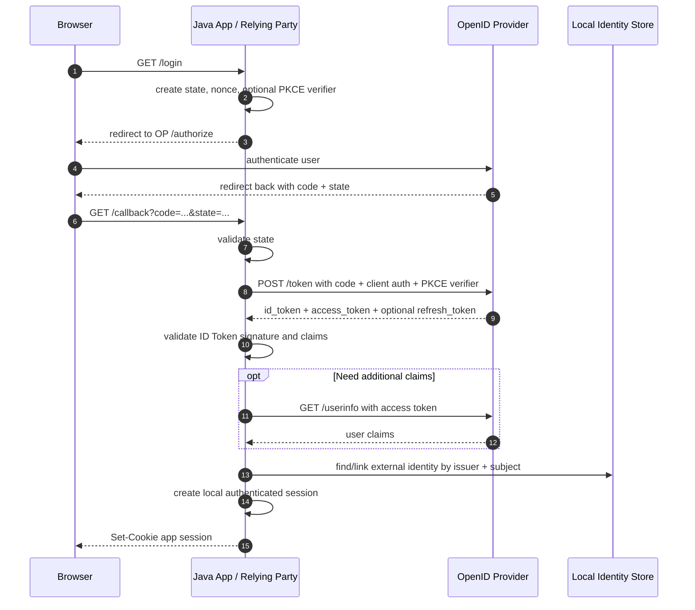
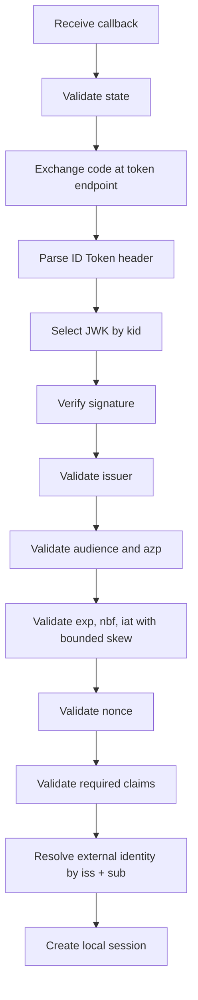
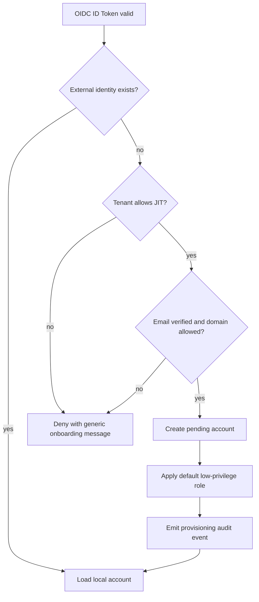

# Part 025 — OpenID Connect Authentication

> Target part ini: memahami dan mengimplementasikan OpenID Connect sebagai authentication protocol di Java systems. Fokusnya adalah pemisahan OAuth vs OIDC, validasi ID Token, session establishment, account linking, claim handling, Spring Security `oauth2Login`, custom callback handling, logout semantics, multi-tenant provider routing, dan failure modes yang sering muncul di production.

OpenID Connect adalah cara standar untuk menjawab pertanyaan:

```txt
"Siapa user ini, siapa yang mengautentikasinya, kapan autentikasi terjadi, dan bagaimana relying party bisa memverifikasi hasilnya?"
```

OAuth 2.0 sendiri tidak menjawab pertanyaan itu secara lengkap. OAuth memberi client access token untuk mengakses protected resource. OIDC menambahkan identity layer di atas OAuth 2.0 melalui **ID Token**, **standard claims**, **discovery**, dan aturan validasi authentication result.

Mental model paling ringkas:

```txt
OAuth access token  -> untuk API/resource access
OIDC ID Token      -> untuk authentication result kepada client/RP
UserInfo endpoint  -> sumber profile claims tambahan, bukan bukti login utama
```

Kalau aplikasi Java menerima access token lalu menganggapnya sebagai bukti login user, itu bukan OIDC yang benar. Itu hanya kebetulan bekerja sampai provider, audience, tenant, atau threat model berubah.

---

## 1. Problem yang Diselesaikan OIDC

Sebelum OIDC, banyak aplikasi membuat login eksternal seperti ini:

```txt
1. redirect user ke provider
2. provider callback membawa token
3. aplikasi decode token atau panggil profile API
4. email dari profile dianggap user identity
5. login berhasil
```

Masalahnya:

- token mungkin access token untuk API, bukan authentication assertion;
- token mungkin diterbitkan untuk client lain;
- email mungkin belum verified;
- user bisa berganti email;
- beberapa provider bisa mengembalikan email yang sama;
- callback bisa diserang login CSRF;
- authorization code bisa ditukar oleh attacker jika redirect/client salah;
- account linking bisa takeover jika hanya berbasis email;
- logout lokal tidak otomatis logout dari provider;
- tenant routing salah bisa membuat user dari organisasi lain masuk ke tenant yang salah.

OIDC memberi struktur formal:

```txt
Authorization Server / OpenID Provider authenticates End-User.
Relying Party receives ID Token.
Relying Party validates issuer, audience, signature, expiry, nonce, and claims.
Relying Party maps external subject to local account.
Relying Party creates local application session.
```

Dalam istilah OIDC:

| Istilah | Makna |
|---|---|
| OP | OpenID Provider; identity provider yang mengautentikasi user. |
| RP | Relying Party; aplikasi Java yang menerima hasil autentikasi. |
| End-User | Human user yang login. |
| ID Token | JWT berisi claims tentang authentication event dan user subject. |
| Access Token | Token untuk mengakses resource server/API. |
| UserInfo | Endpoint untuk mengambil claims tambahan. |
| Discovery | Metadata endpoint agar RP tahu issuer, authorization endpoint, token endpoint, JWK Set URI, dan capability OP. |

Invariant utama:

```txt
A user is not authenticated to the application until the RP validates the OIDC response and binds it to a local subject/session.
```

---

## 2. OAuth vs OIDC: Jangan Dicampur

OAuth menjawab:

```txt
Can this client access this resource with this token?
```

OIDC menjawab:

```txt
Did this OpenID Provider authenticate this End-User for this Relying Party?
```

Perbedaan artifact:

| Artifact | Dipakai oleh | Fungsi | Jangan Dipakai Untuk |
|---|---|---|---|
| Authorization Code | Client/RP | One-time code untuk token exchange | Bukti login langsung |
| Access Token | Resource Server | API authorization | Login session RP tanpa validasi OIDC |
| Refresh Token | Client/RP | Mendapat access token baru | Dibaca resource server |
| ID Token | Client/RP | Authentication result | API authorization |
| UserInfo response | Client/RP | Claims tambahan | Satu-satunya bukti login |

Rule of thumb:

```txt
Login uses ID Token.
API access uses Access Token.
Long-lived continuity uses session or refresh token, depending on app type.
```

Salah satu kesalahan enterprise yang mahal adalah menaruh authorization role internal langsung dari ID Token ke aplikasi tanpa policy mapping. ID Token membuktikan authentication result. Authorization aplikasi tetap domain policy.

---

## 3. Authorization Code + OIDC Flow

OIDC di aplikasi server-side biasanya memakai Authorization Code Flow dengan `scope=openid` dan, untuk public/modern clients, PKCE.



Perhatikan pemisahan dua session:

```txt
OP session  = session user dengan provider
RP session  = session user dengan aplikasi Java
```

OIDC login tidak otomatis berarti semua aplikasi lokal memiliki session yang sama. SSO terjadi karena RP lain bisa redirect ke OP dan OP sudah punya session user, lalu OP menerbitkan authentication result baru untuk RP tersebut.

---

## 4. Core Data Model

Minimal model untuk OIDC login production-grade:

```sql
create table external_identity (
    id uuid primary key,
    account_id uuid not null,
    tenant_id uuid,
    provider_key varchar(100) not null,
    issuer varchar(500) not null,
    subject varchar(500) not null,
    email varchar(320),
    email_verified boolean,
    display_name varchar(300),
    linked_at timestamptz not null,
    last_login_at timestamptz,
    status varchar(40) not null,
    unique (issuer, subject),
    unique (provider_key, subject)
);

create table oidc_login_attempt (
    id uuid primary key,
    correlation_id varchar(80) not null,
    provider_key varchar(100) not null,
    tenant_hint varchar(200),
    state_hash varchar(128) not null,
    nonce_hash varchar(128) not null,
    pkce_verifier_hash varchar(128),
    redirect_uri varchar(1000) not null,
    return_to varchar(1000),
    created_at timestamptz not null,
    expires_at timestamptz not null,
    consumed_at timestamptz,
    status varchar(40) not null
);
```

Kenapa `issuer + subject`, bukan email?

Karena OIDC subject (`sub`) adalah identifier user dalam konteks issuer. Email adalah attribute. Email bisa berubah, bisa tidak verified, bisa direcycle oleh domain tertentu, dan bisa sama di dua issuer berbeda.

Correct identity key:

```txt
external_identity_key = (issuer, subject)
```

Bukan:

```txt
external_identity_key = email
external_identity_key = preferred_username
external_identity_key = name
```

---

## 5. ID Token Anatomy

ID Token biasanya JWT.

Contoh claims konseptual:

```json
{
  "iss": "https://idp.example.com/realms/acme",
  "sub": "2f0d3f27-7f2c-42e3-9a2d-2f8f6c3b3b12",
  "aud": "billing-web",
  "azp": "billing-web",
  "exp": 1783051200,
  "iat": 1783050900,
  "auth_time": 1783050850,
  "nonce": "b0d5...",
  "acr": "urn:example:mfa",
  "amr": ["pwd", "otp"],
  "email": "sari@example.com",
  "email_verified": true,
  "name": "Sari Wijaya"
}
```

Claims yang paling penting:

| Claim | Fungsi |
|---|---|
| `iss` | Issuer. Harus cocok dengan provider configuration. |
| `sub` | Stable subject identifier dalam issuer. |
| `aud` | Client/RP yang dituju. Harus mengandung client id aplikasi. |
| `azp` | Authorized party; penting saat multiple audience. |
| `exp` | Expiration. Token expired harus ditolak. |
| `iat` | Issued-at. Berguna untuk skew dan audit. |
| `nonce` | Mengikat authorization request dengan ID Token. |
| `auth_time` | Waktu autentikasi user di OP. Penting untuk step-up. |
| `acr` | Authentication Context Class Reference. Level/context auth. |
| `amr` | Authentication Methods References. Metode auth seperti pwd, otp, hwk. |
| `email_verified` | Apakah email sudah diverifikasi oleh OP. |

Rule:

```txt
ID Token claims are inputs to local authentication mapping.
They are not automatically local account truth.
```

---

## 6. ID Token Validation Pipeline

Validation pipeline harus deterministik.



Pseudocode:

```java
public final class OidcAuthenticationVerifier {

    private final JwtVerifier jwtVerifier;
    private final LoginAttemptRepository attempts;
    private final ExternalIdentityRepository identities;
    private final AccountSessionService sessions;

    public LoginResult completeCallback(OidcCallback callback) {
        LoginAttempt attempt = attempts.consumeByState(callback.state())
                .orElseThrow(() -> new InvalidLoginCallbackException("Invalid login response"));

        TokenResponse tokens = exchangeAuthorizationCode(callback.code(), attempt);

        IdToken idToken = jwtVerifier.verify(tokens.idToken(), VerificationPolicy.builder()
                .issuer(attempt.provider().issuer())
                .audience(attempt.provider().clientId())
                .nonceHash(attempt.nonceHash())
                .maxClockSkewSeconds(60)
                .build());

        ExternalIdentity externalIdentity = identities.findByIssuerAndSubject(
                        idToken.issuer(),
                        idToken.subject())
                .orElseGet(() -> provisionOrLinkIdentity(idToken, attempt));

        return sessions.createBrowserSession(externalIdentity.accountId(), SessionCreationContext.from(attempt));
    }
}
```

Important invariant:

```txt
State protects the callback.
Nonce protects the ID Token binding.
PKCE protects the authorization code.
Issuer/audience/signature protect token origin and recipient.
```

Jangan menghapus salah satu karena “provider sudah trusted”. Trusted provider tetap bisa menerima request attacker jika RP tidak mengikat request dan response dengan benar.

---

## 7. Discovery and Metadata

OIDC Discovery memungkinkan RP mengambil provider metadata dari issuer.

Biasanya:

```txt
https://issuer.example.com/.well-known/openid-configuration
```

Metadata penting:

```json
{
  "issuer": "https://idp.example.com/realms/acme",
  "authorization_endpoint": "https://idp.example.com/realms/acme/protocol/openid-connect/auth",
  "token_endpoint": "https://idp.example.com/realms/acme/protocol/openid-connect/token",
  "userinfo_endpoint": "https://idp.example.com/realms/acme/protocol/openid-connect/userinfo",
  "jwks_uri": "https://idp.example.com/realms/acme/protocol/openid-connect/certs",
  "response_types_supported": ["code"],
  "subject_types_supported": ["public", "pairwise"],
  "id_token_signing_alg_values_supported": ["RS256"]
}
```

Production rules:

- pin allowed issuers, jangan menerima issuer dinamis dari request user;
- cache metadata dengan TTL yang masuk akal;
- cache JWKS, tapi refresh saat `kid` tidak ditemukan;
- jangan fallback ke `alg=none`;
- buat algorithm allowlist;
- catat provider metadata version/hash untuk troubleshooting;
- failure saat discovery/JWKS outage harus jelas: login baru bisa gagal, session existing tidak harus putus.

---

## 8. Spring Security OAuth2 Login

Spring Security menyediakan `oauth2Login()` untuk login via OAuth 2.0 Provider atau OIDC Provider.

Minimal config:

```java
@Configuration
@EnableWebSecurity
class SecurityConfig {

    @Bean
    SecurityFilterChain web(HttpSecurity http) throws Exception {
        return http
                .authorizeHttpRequests(auth -> auth
                        .requestMatchers("/", "/login/**", "/assets/**").permitAll()
                        .anyRequest().authenticated())
                .oauth2Login(oauth -> oauth
                        .loginPage("/login")
                        .userInfoEndpoint(userInfo -> userInfo
                                .oidcUserService(oidcUserService())))
                .logout(logout -> logout
                        .logoutUrl("/logout")
                        .deleteCookies("APPSESSION"))
                .build();
    }

    @Bean
    OAuth2UserService<OidcUserRequest, OidcUser> oidcUserService() {
        OidcUserService delegate = new OidcUserService();

        return request -> {
            OidcUser oidcUser = delegate.loadUser(request);
            // Map issuer + subject to local identity.
            // Do not trust email as the primary key.
            return oidcUser;
        };
    }
}
```

Example application config:

```yaml
spring:
  security:
    oauth2:
      client:
        registration:
          keycloak:
            client-id: billing-web
            client-secret: ${OIDC_CLIENT_SECRET}
            scope:
              - openid
              - profile
              - email
        provider:
          keycloak:
            issuer-uri: https://idp.example.com/realms/acme
```

What Spring handles:

- authorization redirect;
- callback endpoint;
- token exchange;
- default ID Token validation for OIDC provider metadata;
- user principal creation;
- integration into `SecurityContext`;
- session establishment for browser app.

What you still own:

- local account linking;
- tenant mapping;
- domain policy;
- role/authority mapping;
- verified-email policy;
- disabled/suspended account policy;
- audit events;
- logout semantics;
- provider outage behavior;
- privilege drift handling.

---

## 9. Mapping OIDC User to Local Principal

A safe mapper does not simply convert all claims into authorities.

```java
public final class LocalOidcPrincipalMapper {

    public LocalPrincipal map(OidcUser oidcUser, String registrationId) {
        OidcIdToken idToken = oidcUser.getIdToken();

        String issuer = idToken.getIssuer().toString();
        String subject = idToken.getSubject();

        ExternalIdentity identity = externalIdentities
                .findActiveByIssuerAndSubject(issuer, subject)
                .orElseThrow(() -> new AuthenticationServiceException("External account is not linked"));

        Account account = accounts.findActiveById(identity.accountId())
                .orElseThrow(() -> new DisabledException("Account is not active"));

        Set<GrantedAuthority> authorities = authorizationPolicy.loadAuthorities(account.id());

        return new LocalPrincipal(
                account.id(),
                account.tenantId(),
                issuer,
                subject,
                authorities,
                idToken.getIssuedAt());
    }
}
```

Recommended authority policy:

```txt
OIDC claims can suggest attributes.
Local policy decides authorities.
```

Anti-pattern:

```java
// Bad: every incoming role claim becomes local authority.
return oidcUser.getClaimAsStringList("roles")
        .stream()
        .map(SimpleGrantedAuthority::new)
        .toList();
```

Better:

```java
// Better: map external groups through controlled local policy.
Set<String> externalGroups = oidcUser.getClaimAsStringList("groups");
return groupMappingPolicy.map(providerKey, tenantId, externalGroups);
```

Even better for critical apps:

```txt
External IdP authenticates.
Local authorization system authorizes.
Group claims are synchronization hints, not absolute runtime truth.
```

---

## 10. Account Linking and JIT Provisioning

OIDC login has two distinct operations:

```txt
Authentication: OP says this is issuer X subject Y.
Linking/provisioning: application decides which local account that external subject maps to.
```

Safe linking strategies:

| Strategy | Use Case | Risk |
|---|---|---|
| Admin pre-link | High assurance enterprise apps | Operational overhead |
| Invite-based link | B2B SaaS onboarding | Invite takeover if weak |
| Verified domain + verified email | Workforce tenant onboarding | Domain ownership mistakes |
| Self-service link after local login | Consumer account linking | Session fixation/linking CSRF |
| JIT provisioning | Large enterprise SSO | Attribute mapping drift |

Never auto-link purely by email unless you fully control the IdP/domain and require verified email.

Safer JIT provisioning flow:



Critical invariant:

```txt
A newly linked identity should start with least privilege unless an explicit trusted mapping grants more.
```

---

## 11. Multi-Tenant OIDC Provider Routing

Multi-tenant systems usually have multiple identity configurations.

Examples:

```txt
tenant A -> Azure Entra ID
tenant B -> Okta
tenant C -> Keycloak realm C
tenant D -> internal username/password
```

Provider routing can be based on:

- tenant slug in login URL: `/t/acme/login`;
- email domain discovery after user enters email;
- invite link containing tenant context;
- explicit organization selector;
- dedicated custom domain per tenant.

Avoid this:

```txt
User supplies arbitrary issuer URL -> app fetches metadata -> app trusts it.
```

That turns login into dynamic trust injection.

Better:

```txt
tenant_id -> configured provider registration -> pinned issuer -> pinned client_id -> allowed redirect_uri
```

Example model:

```java
public record TenantIdentityProvider(
        TenantId tenantId,
        String providerKey,
        URI issuer,
        String clientId,
        SecretRef clientSecret,
        Set<String> allowedEmailDomains,
        boolean jitProvisioningEnabled,
        boolean requireEmailVerified
) {}
```

The login attempt must store the selected provider:

```txt
login_attempt.provider_key = selected provider
callback validates state
callback uses provider_key from stored attempt, not from query parameter
```

---

## 12. Logout Semantics

Logout has at least three levels:

| Logout Type | What It Ends | What It Does Not End |
|---|---|---|
| Local logout | RP/application session | OP session |
| OP logout | Provider session | Other RP sessions unless logout protocols are used |
| Federated/single logout | Multiple RP sessions | Not always reliable in browser/network failure |

For many enterprise apps, local logout is enough for application session termination but not enough for “user fully logged out of SSO”.

OIDC RP-Initiated Logout lets RP request OP logout.

Conceptual flow:

```txt
POST/GET /logout at RP
RP destroys local session
RP redirects browser to OP end_session_endpoint with id_token_hint and post_logout_redirect_uri
OP ends OP session if policy allows
OP redirects back
```

But production caveats:

- not all providers implement all logout specs equally;
- front-channel logout is browser-dependent;
- third-party cookie restrictions affect some logout/session mechanisms;
- logout endpoint must not become open redirect;
- local session must be invalidated even if OP logout fails;
- access/refresh tokens held server-side must be revoked or discarded.

Recommended invariant:

```txt
Local logout must be complete without depending on provider logout success.
```

---

## 13. OIDC with JAX-RS / Non-Spring Stack

For JAX-RS/Jersey services, you usually should not hand-roll full OIDC login unless you have a strong reason. Prefer a battle-tested library or push login to a BFF/gateway.

But understanding the pieces matters.

Callback resource skeleton:

```java
@Path("/auth/oidc")
public final class OidcCallbackResource {

    private final OidcLoginService loginService;

    @GET
    @Path("/callback")
    public Response callback(
            @QueryParam("code") String code,
            @QueryParam("state") String state,
            @QueryParam("error") String error,
            @Context HttpServletRequest request) {

        if (error != null) {
            return Response.status(302)
                    .location(URI.create("/login?error=external_login_failed"))
                    .build();
        }

        LoginSession session = loginService.complete(code, state, request);

        NewCookie cookie = new NewCookie.Builder("APPSESSION")
                .value(session.id())
                .path("/")
                .httpOnly(true)
                .secure(true)
                .sameSite(NewCookie.SameSite.STRICT)
                .maxAge((int) session.maxAge().toSeconds())
                .build();

        return Response.status(302)
                .cookie(cookie)
                .location(session.safeReturnUri())
                .build();
    }
}
```

Do not do token validation in controller code directly. Put it behind a service with explicit policy:

```java
public interface OidcTokenVerifier {
    VerifiedIdToken verify(String rawIdToken, ExpectedOidcContext expected);
}
```

The verifier owns:

- metadata lookup;
- JWKS cache;
- signature validation;
- algorithm allowlist;
- issuer/audience validation;
- nonce validation;
- clock skew;
- claim normalization;
- error classification.

---

## 14. ID Token vs UserInfo

UserInfo can be useful when:

- ID Token is intentionally thin;
- profile claims are not present in ID Token;
- provider returns updated user attributes via UserInfo;
- app needs claims such as name, locale, picture, organization hints.

But UserInfo response is not a replacement for ID Token validation.

Correct order:

```txt
1. validate ID Token
2. identify issuer + subject
3. optionally call UserInfo with access token
4. ensure UserInfo subject matches ID Token subject
5. map claims using local policy
```

Important check:

```java
if (!idToken.subject().equals(userInfo.subject())) {
    throw new AuthenticationServiceException("UserInfo subject mismatch");
}
```

---

## 15. Failure Modes

### 15.1 Access Token Used as Login Proof

Symptom:

```txt
Application decodes access token and logs user in.
```

Why dangerous:

- access token may be opaque or not intended for RP;
- audience may be API, not web client;
- token may not contain authentication context;
- token substitution becomes easier.

Fix:

```txt
Use OIDC ID Token for login.
Use access token only for resource access.
```

### 15.2 Missing State Validation

Symptom:

```txt
Callback accepts any code.
```

Impact:

- login CSRF;
- attacker can bind victim browser to attacker-controlled account;
- wrong tenant/provider callback accepted.

Fix:

```txt
Generate high-entropy state.
Store it server-side or in protected cookie.
Consume it once.
Bind it to provider, redirect URI, return URL, nonce, and PKCE verifier.
```

### 15.3 Missing Nonce Validation

Symptom:

```txt
ID Token signature is valid, but nonce is ignored.
```

Impact:

- replay or token injection in some flows;
- callback not strongly bound to original auth request.

Fix:

```txt
Generate nonce per authorization request.
Store hash.
Validate ID Token nonce.
Consume login attempt.
```

### 15.4 Auto-Link by Email

Symptom:

```txt
If email matches an account, login succeeds.
```

Impact:

- takeover via unverified email;
- takeover through different issuer;
- account collision across tenants.

Fix:

```txt
Primary link = issuer + subject.
Email can be an onboarding hint only under strict policy.
```

### 15.5 Trusting Roles Directly

Symptom:

```txt
roles claim becomes admin authority.
```

Impact:

- external IdP misconfiguration becomes app compromise;
- role semantics differ across tenants;
- group explosion creates privilege drift.

Fix:

```txt
Map external groups/roles through local controlled policy.
Critical roles require explicit local grant or approval workflow.
```

### 15.6 Stale Claims

Symptom:

```txt
User removed from IdP group but existing app session remains privileged.
```

Fix options:

- short app session;
- periodic entitlement refresh;
- webhook/SCIM deprovisioning;
- local policy revocation version;
- critical action step-up/re-check.

### 15.7 Provider Metadata Drift

Symptom:

```txt
Provider rotates signing key or changes endpoint.
Login starts failing.
```

Fix:

- JWKS cache refresh on unknown `kid`;
- alert on metadata fetch failure;
- staged provider config validation;
- runbook for cert/key rollover.

---

## 16. Production Observability

Emit structured audit events:

```json
{
  "event_type": "OIDC_LOGIN_SUCCESS",
  "correlation_id": "auth-01J...",
  "provider_key": "acme-entra",
  "issuer": "https://login.microsoftonline.com/.../v2.0",
  "subject_hash": "sha256:...",
  "account_id": "acc_123",
  "tenant_id": "tenant_acme",
  "amr": ["pwd", "mfa"],
  "acr": "...",
  "email_verified": true,
  "ip_hash": "sha256:...",
  "user_agent_hash": "sha256:...",
  "outcome": "success"
}
```

Never log:

- raw authorization code;
- raw access token;
- raw refresh token;
- raw ID Token;
- full subject if it is considered sensitive;
- full email unless your privacy policy allows it.

Metrics:

```txt
auth_oidc_login_started_total{provider,tenant}
auth_oidc_login_success_total{provider,tenant}
auth_oidc_login_failure_total{provider,tenant,reason}
auth_oidc_callback_state_invalid_total{provider}
auth_oidc_token_exchange_latency_seconds{provider}
auth_oidc_jwks_refresh_total{provider,outcome}
auth_oidc_account_link_created_total{provider,tenant}
```

Operational dashboards should show:

- provider outage;
- invalid state spike;
- token exchange latency;
- JWKS refresh failure;
- JIT provisioning spike;
- account linking failure;
- tenant/provider mismatch;
- logout failure.

---

## 17. Testing Matrix

| Test | Expected Result |
|---|---|
| Valid OIDC callback | Local session created. |
| Callback with invalid state | Deny, no token exchange. |
| Callback replay with same state | Deny. |
| ID Token wrong issuer | Deny. |
| ID Token wrong audience | Deny. |
| ID Token expired | Deny. |
| ID Token signed with disallowed alg | Deny. |
| ID Token nonce mismatch | Deny. |
| UserInfo `sub` differs from ID Token `sub` | Deny. |
| Email not verified but tenant requires verified email | Deny or pending onboarding. |
| Existing external identity disabled | Deny. |
| Account suspended locally | Deny even if OP login succeeds. |
| Unknown external identity and JIT disabled | Deny. |
| Unknown external identity and JIT enabled | Create least-privilege account. |
| Provider JWKS unknown kid | Refresh JWKS once, then validate/deny. |
| Token endpoint timeout | Fail login cleanly, no local session. |
| Return URL points outside allowed origin | Redirect to safe default. |

---

## 18. Implementation Checklist

For every OIDC login implementation:

- [ ] Use Authorization Code Flow.
- [ ] Use PKCE unless your framework/provider makes a deliberate, justified exception.
- [ ] Require `scope=openid`.
- [ ] Generate and validate `state`.
- [ ] Generate and validate `nonce`.
- [ ] Pin issuer per provider/tenant config.
- [ ] Validate ID Token signature using JWKS.
- [ ] Allowlist signing algorithms.
- [ ] Validate `iss`, `aud`, `exp`, `iat`, and `nonce`.
- [ ] Validate `azp` when relevant.
- [ ] Link local identity by `issuer + subject`.
- [ ] Treat email as attribute, not primary key.
- [ ] Require `email_verified` where email drives onboarding.
- [ ] Keep local account status authoritative.
- [ ] Map roles/groups through local policy.
- [ ] Use safe return URL validation.
- [ ] Never log raw tokens/codes.
- [ ] Emit structured audit events.
- [ ] Document logout semantics.
- [ ] Test provider key rotation.
- [ ] Test callback replay.

---

## 19. Architecture Decision Matrix

| Requirement | Preferred Pattern |
|---|---|
| Browser app with enterprise login | OIDC Authorization Code + local session |
| SPA needing strong token safety | BFF + OIDC at backend |
| Mobile login | Authorization Code + PKCE + platform secure storage |
| Internal admin app | OIDC + MFA/step-up + local authorization |
| B2B SaaS tenant SSO | Per-tenant OIDC/SAML provider config + JIT policy |
| Need account lifecycle sync | OIDC login + SCIM/webhook provisioning |
| Need API access after login | OIDC login + access token or backend token exchange |
| Need high assurance | OIDC + `acr`/`amr` policy + WebAuthn/passkey step-up |

---

## 20. Mental Model Summary

OIDC is not “JWT login”.

OIDC is a protocol-level contract:

```txt
OP authenticates user.
RP validates authentication result.
RP maps external subject to local account.
RP creates its own session.
```

The most important invariants:

```txt
ID Token proves authentication to the RP.
Access Token authorizes API access.
Issuer + subject identifies external identity.
Email is an attribute.
State protects callback integrity.
Nonce binds ID Token to authentication request.
Local policy remains authoritative for local account status and authorization.
```

If these invariants hold, OIDC becomes a clean authentication boundary.
If they are violated, OIDC becomes a complicated way to create account takeover bugs.

---

## References

- OpenID Foundation — OpenID Connect Core 1.0: https://openid.net/specs/openid-connect-core-1_0.html
- OpenID Foundation — OpenID Connect Discovery 1.0: https://openid.net/specs/openid-connect-discovery-1_0.html
- OpenID Foundation — OpenID Connect RP-Initiated Logout 1.0: https://openid.net/specs/openid-connect-rpinitiated-1_0.html
- Spring Security Reference — OAuth2 Login: https://docs.spring.io/spring-security/reference/servlet/oauth2/login/index.html
- Spring Security Reference — Advanced OAuth2 Login Configuration: https://docs.spring.io/spring-security/reference/servlet/oauth2/login/advanced.html
- RFC 7636 — Proof Key for Code Exchange by OAuth Public Clients: https://datatracker.ietf.org/doc/html/rfc7636
- RFC 9700 — Best Current Practice for OAuth 2.0 Security: https://www.rfc-editor.org/info/rfc9700
- NIST SP 800-63B-4 — Authentication and Authenticator Management: https://csrc.nist.gov/pubs/sp/800/63/b/4/final
