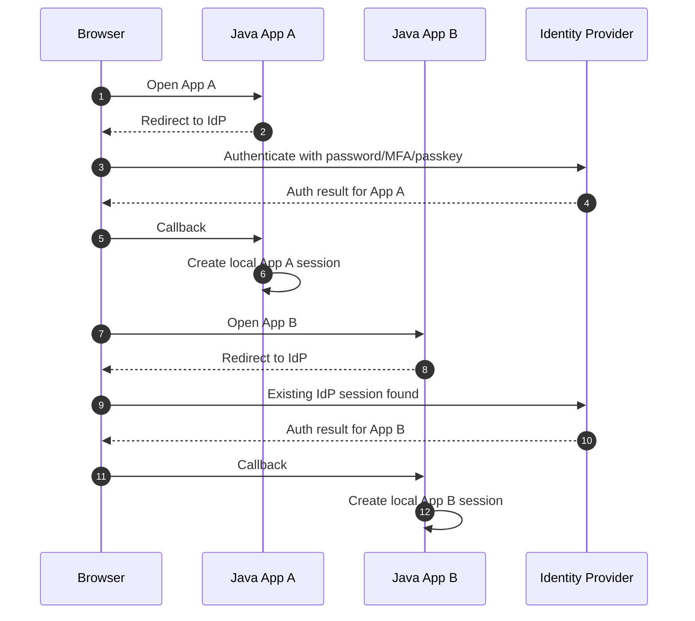
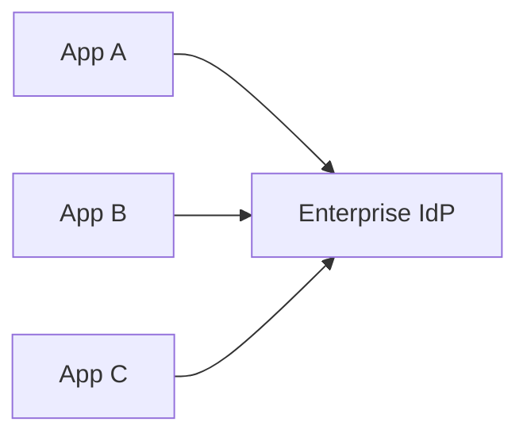
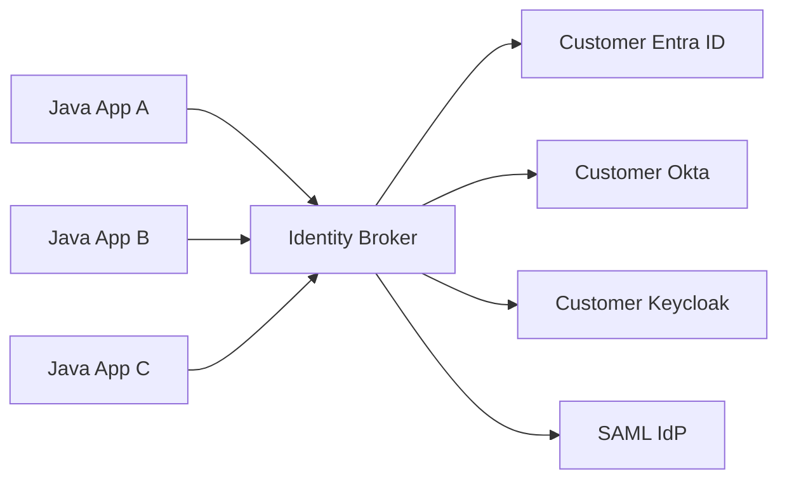
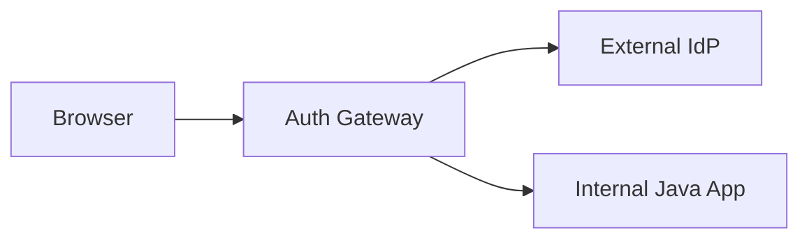
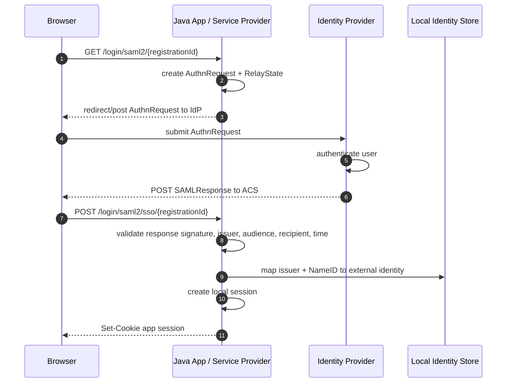
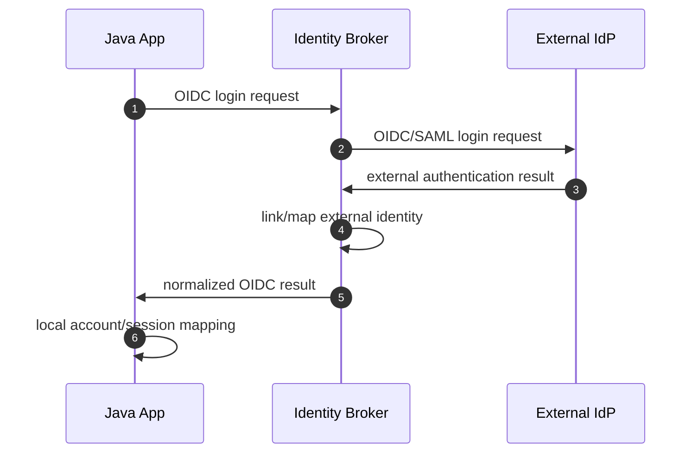
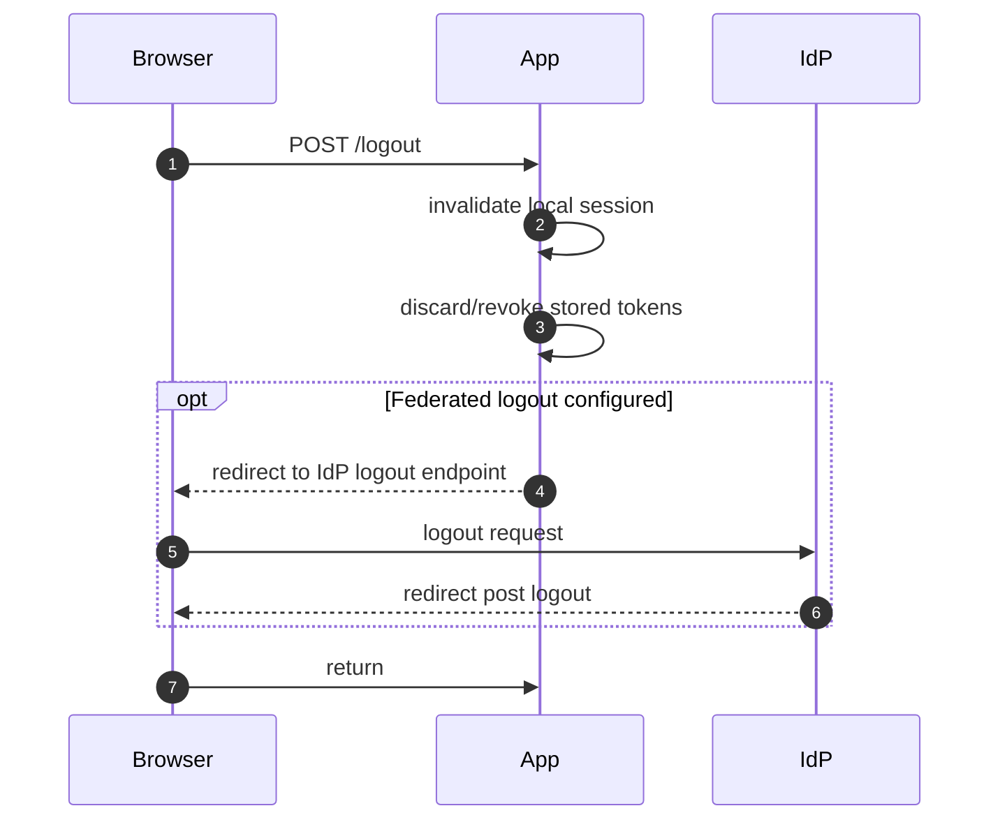
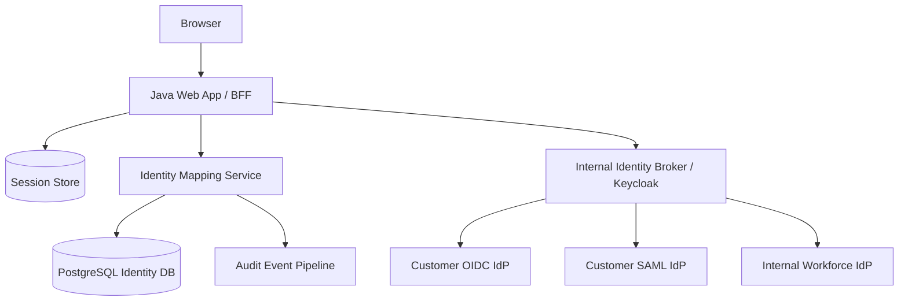

# Part 026 — SSO & Federated Login

> Target part ini: memahami dan mengimplementasikan Single Sign-On dan federated login untuk Java enterprise systems. Fokusnya adalah trust relationship, OIDC vs SAML, tenant/provider routing, identity brokering, metadata/certificate lifecycle, JIT provisioning, attribute mapping, logout/deprovisioning, Spring Security integration, dan failure modes yang sering menghancurkan B2B SaaS atau internal enterprise app.

SSO sering dijelaskan terlalu dangkal:

```txt
Login sekali, masuk ke banyak aplikasi.
```

Itu benar, tapi tidak cukup untuk engineer yang harus membangun sistem production-grade.

Mental model yang lebih tepat:

```txt
SSO is repeated local authentication based on a shared upstream authentication session and a configured trust relationship.
```

Aplikasi tetap punya session lokal. Bedanya, aplikasi tidak meminta password sendiri. Aplikasi mempercayai hasil autentikasi dari identity provider yang sudah dikonfigurasi.

Federated login berarti trust boundary diperluas:

```txt
Application trusts an external identity system for authentication result,
but application remains responsible for local account mapping, tenant isolation, authorization, audit, and session lifecycle.
```

---

## 1. SSO Is Not One Session Everywhere

Kesalahan paling umum:

```txt
Jika user sudah login di IdP, berarti user otomatis login di semua aplikasi.
```

Yang sebenarnya terjadi:



There are at least three session layers:

| Session | Owner | Purpose |
|---|---|---|
| Browser cookie/session at IdP | IdP | Remember user authentication at IdP. |
| Local app session | App/RP/SP | Remember user authentication inside app. |
| Downstream API token/cache | App/API | Access protected resources. |

Logout and revocation are hard because each layer has its own lifecycle.

---

## 2. Core Actors

Terminology differs by protocol.

| Concept | OIDC Term | SAML Term | Meaning |
|---|---|---|---|
| Identity system | OpenID Provider / OP | Identity Provider / IdP | Authenticates user. |
| Application | Relying Party / RP | Service Provider / SP | Trusts identity result. |
| User | End-User | Principal/Subject | Human being authenticating. |
| Login result | ID Token | SAML Assertion | Authentication statement/claims. |
| Config document | Discovery metadata | Metadata XML | Endpoints, keys, capabilities. |
| Callback URL | Redirect URI | Assertion Consumer Service / ACS | Where provider sends response. |

In Java apps, these terms map to security components:

```txt
OIDC RP / SAML SP -> Spring Security filter chain or gateway/BFF
External subject  -> local ExternalIdentity record
Local subject     -> application Account/Principal
Local session     -> HttpSession/cookie/session store
```

---

## 3. Federation Trust Contract

Federation is not “allow login from Google/Okta/Entra/Keycloak”.
Federation is a configured trust contract.

A trust contract defines:

- which issuer/entity is trusted;
- which protocol is used;
- which client/entity ID represents your app;
- which redirect/ACS URLs are valid;
- which signing keys/certificates are trusted;
- whether responses/assertions must be signed;
- whether assertions/tokens must be encrypted;
- which claims/attributes are required;
- how external subject maps to local account;
- which tenant the provider belongs to;
- how provider metadata is updated;
- how deprovisioning works;
- how incidents are handled.

If any of these are implicit, the system is not production-grade.

---

## 4. Federation Topologies

### 4.1 Direct Per-App Federation

Each app integrates directly with each IdP.



Pros:

- simple for a small number of apps;
- no extra broker dependency;
- app has direct provider control.

Cons:

- duplicated configuration;
- inconsistent attribute mapping;
- inconsistent logout behavior;
- hard certificate rotation;
- hard tenant onboarding.

### 4.2 Central Identity Broker

Apps integrate with one internal broker, broker integrates with external IdPs.



Pros:

- centralized trust management;
- consistent claim normalization;
- easier tenant onboarding;
- centralized MFA/step-up policy;
- apps see one internal OIDC provider;
- good fit for B2B SaaS.

Cons:

- broker becomes critical dependency;
- misconfiguration impacts many apps;
- more complex audit chain;
- account linking can be centralized but dangerous if wrong.

### 4.3 Gateway-Terminated Federation

Gateway handles login, apps receive trusted headers or internal tokens.



Use carefully. Trusted headers are only safe if apps cannot be reached except through gateway and header injection is blocked.

Invariant:

```txt
If application trusts headers for identity, network and gateway boundary become part of authentication system.
```

---

## 5. OIDC Federation Pattern

OIDC federation for app login uses the same core OIDC mechanics from Part 025:

```txt
RP redirects to OP.
OP authenticates user.
OP returns authorization code.
RP exchanges code.
RP validates ID Token.
RP maps issuer + subject to local identity.
RP creates local session.
```

Enterprise additions:

- per-tenant provider configuration;
- domain-based or invite-based tenant routing;
- claim mapping;
- JIT provisioning;
- external group mapping;
- session policy per tenant;
- required `acr`/`amr` for sensitive apps;
- provider metadata lifecycle;
- break-glass login.

Good OIDC tenant config:

```yaml
tenants:
  acme:
    identityProvider:
      protocol: oidc
      providerKey: acme-entra
      issuer: https://login.microsoftonline.com/11111111-2222-3333-4444-555555555555/v2.0
      clientId: acme-billing-web
      clientSecretRef: vault://identity/acme/client-secret
      allowedEmailDomains:
        - acme.example
      jitProvisioning: true
      requireEmailVerified: true
      requiredAcr: urn:example:mfa
```

Bad config:

```yaml
issuerFromUserInput: true
trustAnyEmailDomain: true
autoAdminByGroupName: Admins
```

---

## 6. SAML 2.0 Federation Pattern

SAML remains common in enterprise SSO.

SAML is XML-based and uses assertions.

Core objects:

| Object | Meaning |
|---|---|
| Entity ID | Stable identifier for IdP or SP. |
| SP metadata | Your app's SAML identity, ACS URL, certs. |
| IdP metadata | IdP entity ID, SSO endpoint, signing certs. |
| AuthnRequest | SP asks IdP to authenticate user. |
| SAML Response | IdP response containing assertion. |
| Assertion | Authentication statement and attributes. |
| ACS URL | Assertion Consumer Service callback endpoint. |
| NameID | Subject identifier. |
| RelayState | State carried through login. |

SP-initiated SAML flow:



Critical SAML validations:

- response/assertion signature;
- issuer/entity ID;
- audience restriction;
- recipient/ACS URL;
- destination;
- time window: `NotBefore`, `NotOnOrAfter`;
- `InResponseTo` for SP-initiated flows;
- replay detection/assertion ID cache;
- NameID format and stability;
- assertion encryption if required;
- trusted signing certificate;
- metadata validity/rotation.

SAML mistakes are often catastrophic because XML signature validation is subtle. Do not parse SAML manually.

---

## 7. Spring Security for SAML2 Login

Spring Security supports SAML 2.0 Login with `RelyingPartyRegistration`.

Example configuration shape:

```yaml
spring:
  security:
    saml2:
      relyingparty:
        registration:
          acme:
            signing:
              credentials:
                - private-key-location: classpath:credentials/sp.key
                  certificate-location: classpath:credentials/sp.crt
            assertingparty:
              metadata-uri: https://idp.acme.example/saml/metadata
```

Security config:

```java
@Configuration
@EnableWebSecurity
class SamlSecurityConfig {

    @Bean
    SecurityFilterChain web(HttpSecurity http) throws Exception {
        return http
                .authorizeHttpRequests(auth -> auth
                        .requestMatchers("/", "/login/**", "/saml2/**").permitAll()
                        .anyRequest().authenticated())
                .saml2Login(saml -> saml
                        .loginPage("/login"))
                .logout(logout -> logout
                        .logoutUrl("/logout"))
                .build();
    }
}
```

Spring handles the protocol plumbing, but your application still owns:

- mapping NameID/attributes to local account;
- tenant routing;
- account status;
- JIT provisioning;
- authorization mapping;
- deprovisioning;
- audit;
- break-glass access;
- metadata and certificate operations.

Custom mapping concept:

```java
public final class SamlPrincipalMapper {

    public LocalPrincipal map(Saml2AuthenticatedPrincipal saml) {
        String registrationId = saml.getRelyingPartyRegistrationId();
        String nameId = saml.getName();
        String issuer = saml.getFirstAttribute("issuer"); // often retrieved from authentication context/provider config

        ExternalIdentity identity = externalIdentities
                .findByProviderAndSubject(registrationId, nameId)
                .orElseThrow(() -> new AuthenticationServiceException("SAML identity is not linked"));

        Account account = accounts.requireActive(identity.accountId());
        return LocalPrincipal.from(account, registrationId, nameId);
    }
}
```

In real implementation, use the authenticated SAML token/context exposed by Spring rather than trusting arbitrary `issuer` attribute.

---

## 8. OIDC vs SAML Decision Matrix

| Dimension | OIDC | SAML 2.0 |
|---|---|---|
| Encoding | JSON/JWT/HTTP | XML/XML Signature |
| Common for | Modern web/mobile/API identity | Enterprise SSO legacy/current |
| App type | Web, SPA+BFF, mobile, API-adjacent | Browser SSO mostly |
| Token artifact | ID Token | SAML Assertion |
| Metadata | Discovery JSON | Metadata XML |
| Java support | Strong in Spring Security and IdPs | Strong but more complex |
| Operational complexity | Medium | Medium-high due XML/certs |
| Best fit | New integrations | Enterprise customers requiring SAML |

Pragmatic rule:

```txt
Prefer OIDC for new integrations.
Support SAML when enterprise customers require it.
Hide both behind a local identity abstraction.
```

Your domain model should not care whether external identity came from OIDC or SAML:

```java
public record ExternalAuthenticationResult(
        String providerKey,
        String protocol,
        String issuer,
        String subject,
        Map<String, Object> attributes,
        Instant authenticatedAt,
        Set<String> authenticationMethods
) {}
```

Then local mapping is protocol-agnostic:

```txt
ExternalAuthenticationResult -> ExternalIdentity -> Account -> LocalPrincipal -> Session
```

---

## 9. Identity Brokering

An identity broker sits between applications and external identity providers.

In this model:

```txt
Apps trust broker.
Broker trusts external IdPs.
Broker normalizes identities and claims.
```

Keycloak is a common example of an identity broker because it supports OpenID Connect, OAuth 2.0, SAML, social login, identity brokering, realms, clients, mappers, and federation concepts.

Broker flow:



Broker advantages:

- apps integrate once;
- external IdP differences are centralized;
- SAML can be converted to internal OIDC;
- claim mapping can be standardized;
- external provider onboarding can be operationalized;
- MFA/step-up can be centralized;
- tenant identity policy can be managed consistently.

Broker risks:

- broker misconfiguration impacts all apps;
- broker becomes high-value target;
- broker outage blocks login;
- broker local subject design can hide upstream subject changes;
- debugging requires end-to-end correlation across app, broker, and external IdP.

Broker invariant:

```txt
The broker simplifies application integration, but it does not remove the application's responsibility to map identity to local account and policy.
```

---

## 10. Tenant Routing

B2B SSO needs deterministic tenant routing before redirecting to provider.

Routing inputs:

| Input | Example | Risk |
|---|---|---|
| Tenant subdomain | `acme.app.example` | Good if domain ownership is controlled. |
| Login URL | `/t/acme/login` | Good if tenant slug is stable. |
| Email domain | `user@acme.example` | Risky with shared domains and aliases. |
| Invite link | Signed invite token | Good if invite lifecycle is secure. |
| User selection | Organization picker | Good with anti-enumeration design. |
| Custom domain | `portal.acme.example` | Good but operationally heavier. |

Bad approach:

```txt
User enters email -> app extracts domain -> automatically trusts matching external IdP -> logs user in.
```

Better approach:

```txt
User enters email -> app resolves possible tenant hints -> user chooses tenant or invite confirms tenant -> app uses preconfigured provider -> app validates issuer/entity ID -> app maps external subject.
```

Tenant isolation invariant:

```txt
Provider selection must be derived from trusted tenant configuration, not from mutable identity claims alone.
```

---

## 11. Attribute Mapping

External IdPs emit attributes/claims:

```txt
email
email_verified
name
given_name
family_name
groups
roles
department
employee_id
tenant_id
```

Attribute mapping should be explicit per provider/tenant.

Example mapping config:

```yaml
attributeMappings:
  subject:
    source: oidc.sub
  email:
    source: oidc.email
    requireVerified: true
  displayName:
    source: oidc.name
  externalGroups:
    source: oidc.groups
  localRoles:
    mapping:
      "Billing Admins": BILLING_ADMIN
      "Billing Viewers": BILLING_VIEWER
```

Do not assume group names are globally meaningful.

```txt
"Admins" in customer A is not the same authority as "Admins" in customer B.
```

Group mapping should include provider and tenant context:

```txt
(provider_key, tenant_id, external_group) -> local_role
```

For high-risk roles:

- require explicit local approval;
- require step-up at action time;
- periodically review mappings;
- log every mapping change;
- show effective authorization in admin UI.

---

## 12. JIT Provisioning

Just-In-Time provisioning creates local accounts during first successful SSO login.

Good for:

- large enterprise rollout;
- reducing manual onboarding;
- teams with strong IdP governance;
- low-risk default access.

Dangerous for:

- admin roles;
- regulated systems without approval workflow;
- tenants with weak domain control;
- external collaborators and contractors;
- identity providers that do not guarantee stable/verified identifiers.

JIT policy should answer:

```txt
Who can be created?
Which tenant?
Which default role?
Which claims are required?
What happens if attributes are missing?
How is deprovisioning handled?
Can disabled users come back?
```

Safe default:

```txt
JIT creates active account with minimal access or pending account requiring approval.
```

Unsafe default:

```txt
JIT creates active account with role inferred directly from external group name.
```

---

## 13. Deprovisioning

Login is not enough. You need lifecycle removal.

Common deprovisioning models:

| Model | Description | Risk |
|---|---|---|
| Login-time check only | User removed from IdP cannot login again | Existing sessions remain. |
| Short session TTL | Limits stale access window | Poor UX if too short. |
| SCIM provisioning | IdP pushes create/update/delete | Integration complexity. |
| Webhook/event | IdP/broker notifies app | Delivery/retry complexity. |
| Periodic sync | App syncs directory/groups | Staleness window. |
| Admin local revoke | App admin disables account | Manual process. |

Production-grade approach often combines:

```txt
short-ish sessions + local disable flag + periodic entitlement refresh + SCIM/webhook where available
```

Invariant:

```txt
Local account status must be checked on every session use or at least on bounded refresh, not only at SSO login time.
```

For critical systems, implement session revocation version:

```sql
alter table account add column authz_version bigint not null default 0;
alter table app_session add column authz_version_at_login bigint not null;
```

On request:

```java
if (session.authzVersionAtLogin() < account.currentAuthzVersion()) {
    throw new SessionRequiresRefreshException();
}
```

---

## 14. Logout and Single Logout

SSO logout is rarely perfect.

Logout types:

| Type | Protocol | Reliability |
|---|---|---|
| Local logout | App-specific | Reliable if app owns session. |
| OIDC RP-Initiated Logout | OIDC | Provider-dependent. |
| OIDC Front-channel Logout | OIDC | Browser-dependent. |
| OIDC Back-channel Logout | OIDC | Better server-side but requires support. |
| SAML Single Logout | SAML | Complex and often unevenly supported. |

Safe stance:

```txt
Always guarantee local logout.
Treat federated logout as best-effort unless explicitly certified in your environment.
```

Local logout sequence:



Important:

- logout must be CSRF-protected if it changes state;
- post-logout redirect must be allowlisted;
- local session must be gone before external redirect;
- failure to call IdP logout must not preserve local session;
- logout event should be audited.

---

## 15. Break-Glass Access

Enterprise SSO sometimes fails:

- customer IdP outage;
- expired SAML cert;
- bad metadata upload;
- DNS/TLS issue;
- wrong redirect URI;
- broker outage;
- IdP conditional access misconfiguration;
- customer admin locked everyone out.

Regulated/enterprise systems need break-glass strategy.

Options:

| Option | Notes |
|---|---|
| Local emergency admin account | Strong MFA, hardware key, heavily audited. |
| Separate internal IdP | Avoids dependency on customer IdP. |
| Support-assisted temporary recovery | Requires approval workflow. |
| Tenant admin recovery code | Risky; must be protected. |

Break-glass account requirements:

- not used for daily work;
- phishing-resistant MFA where possible;
- restricted IP/device where feasible;
- dual control for activation;
- short-lived access;
- loud audit/alerting;
- mandatory post-incident review.

Never let break-glass become a permanent bypass around SSO policy.

---

## 16. Common Failure Modes

### 16.1 Tenant Confusion

Symptom:

```txt
User from tenant A logs into tenant B because email/domain/issuer mapping is ambiguous.
```

Fix:

```txt
Bind login attempt to tenant and provider before redirect.
Validate callback against stored tenant/provider.
Map external identity within tenant boundary.
```

### 16.2 IdP-Initiated Login Without Context

SAML often supports IdP-initiated login.

Risk:

- no `InResponseTo` binding;
- weak RelayState handling;
- wrong tenant/app selection;
- account confusion.

Fix:

```txt
Prefer SP-initiated login.
If IdP-initiated is required, restrict provider, validate destination/audience, map tenant deterministically, and use safe RelayState policy.
```

### 16.3 RelayState / Return URL Open Redirect

Symptom:

```txt
RelayState or return_to can be external URL.
```

Impact:

- phishing;
- token/code leakage in poorly designed flows;
- post-login redirect abuse.

Fix:

```txt
Store return target server-side.
Allow only relative paths or allowlisted origins.
```

### 16.4 Certificate Rollover Outage

Symptom:

```txt
SAML IdP rotates signing certificate; login fails for everyone.
```

Fix:

- monitor metadata expiry;
- support overlapping old/new certificates;
- stage metadata validation;
- notify tenant admins before expiry;
- create runbook.

### 16.5 Attribute Mapping Drift

Symptom:

```txt
IdP group renamed; users lose/gain wrong access.
```

Fix:

- map by stable group ID where possible;
- detect unknown groups;
- audit mapping changes;
- show diff before applying metadata/mapping updates.

### 16.6 Email-Based Account Takeover

Symptom:

```txt
Any SSO provider asserting same email links to existing account.
```

Fix:

```txt
Use issuer/entity ID + subject/NameID as primary external identity key.
Treat email as claim requiring verified/trusted context.
```

### 16.7 Local Disabled Account Still Logs In

Symptom:

```txt
SSO succeeds and application ignores local suspension.
```

Fix:

```txt
After external authentication, always check local account status before session creation.
```

### 16.8 Broker Hides Upstream Change

Symptom:

```txt
External IdP subject changes, broker still maps to old internal subject incorrectly.
```

Fix:

- preserve upstream issuer+subject in audit;
- model broker identity and upstream identity separately;
- log account-link changes;
- require admin approval for re-linking.

---

## 17. Reference Architecture for Java B2B SaaS SSO



Responsibilities:

| Component | Responsibility |
|---|---|
| Java App/BFF | Start login, create local session, enforce local policy. |
| Broker | External provider integration and normalization. |
| Identity Mapping Service | Map external identity to account/tenant. |
| PostgreSQL | Durable account/link/session metadata. |
| Session Store | Local browser session. |
| Audit Pipeline | Immutable authentication/federation events. |

This architecture keeps protocols at the edge and domain identity inside your platform.

---

## 18. Production Tables

Useful identity tables:

```sql
create table identity_provider_config (
    id uuid primary key,
    tenant_id uuid not null,
    provider_key varchar(120) not null,
    protocol varchar(20) not null, -- oidc, saml
    issuer_or_entity_id varchar(1000) not null,
    metadata_url varchar(1000),
    client_or_sp_entity_id varchar(500) not null,
    status varchar(40) not null,
    jit_enabled boolean not null default false,
    require_verified_email boolean not null default true,
    created_at timestamptz not null,
    updated_at timestamptz not null,
    unique (tenant_id, provider_key)
);

create table external_identity_link (
    id uuid primary key,
    tenant_id uuid not null,
    account_id uuid not null,
    provider_config_id uuid not null,
    protocol varchar(20) not null,
    external_issuer varchar(1000) not null,
    external_subject varchar(1000) not null,
    email varchar(320),
    email_verified boolean,
    status varchar(40) not null,
    first_seen_at timestamptz not null,
    last_seen_at timestamptz,
    unique (provider_config_id, external_subject)
);

create table identity_provider_key_history (
    id uuid primary key,
    provider_config_id uuid not null,
    key_id varchar(300),
    certificate_fingerprint varchar(200),
    first_seen_at timestamptz not null,
    last_seen_at timestamptz not null,
    status varchar(40) not null
);
```

Why keep key history?

- helps debug cert rollover;
- helps investigate suspicious assertions;
- gives audit evidence for trust chain changes;
- supports proactive expiry alerting.

---

## 19. Observability

Events:

```txt
FEDERATION_LOGIN_STARTED
FEDERATION_LOGIN_SUCCESS
FEDERATION_LOGIN_FAILED
FEDERATION_ACCOUNT_LINK_CREATED
FEDERATION_ACCOUNT_LINK_DISABLED
FEDERATION_JIT_PROVISIONED
FEDERATION_ATTRIBUTE_MAPPING_CHANGED
FEDERATION_METADATA_REFRESHED
FEDERATION_CERTIFICATE_EXPIRING
FEDERATION_LOGOUT_STARTED
FEDERATION_LOGOUT_COMPLETED
```

Metrics:

```txt
auth_federated_login_success_total{tenant,provider,protocol}
auth_federated_login_failure_total{tenant,provider,protocol,reason}
auth_federation_metadata_refresh_total{tenant,provider,outcome}
auth_saml_assertion_validation_failure_total{tenant,provider,reason}
auth_oidc_token_validation_failure_total{tenant,provider,reason}
auth_jit_provisioning_total{tenant,provider,outcome}
auth_external_group_mapping_unknown_total{tenant,provider}
```

Alerts:

- login failure spike per provider;
- metadata refresh failure;
- SAML certificate expiring in N days;
- unknown signing key/certificate;
- invalid audience/destination spike;
- JIT provisioning spike;
- admin role mapping changed;
- IdP/broker latency spike.

---

## 20. Security Review Checklist

For each federated provider:

- [ ] Provider belongs to exactly one tenant or explicitly configured tenant set.
- [ ] Issuer/entity ID is pinned.
- [ ] Redirect URI/ACS URL is exact and HTTPS.
- [ ] OIDC uses Authorization Code + state + nonce + PKCE where appropriate.
- [ ] SAML response/assertion signature validation is enforced.
- [ ] SAML audience, recipient, destination, and time window are validated.
- [ ] Replay detection exists for SAML assertion IDs or login responses where applicable.
- [ ] External identity key is issuer/entity + subject/NameID, not email.
- [ ] Email is verified/trusted before onboarding decisions.
- [ ] JIT provisioning defaults to least privilege.
- [ ] Group/role mapping is explicit and tenant-scoped.
- [ ] Local disabled/suspended account blocks login.
- [ ] Session TTL and deprovisioning strategy are defined.
- [ ] Logout behavior is documented honestly.
- [ ] Break-glass access exists and is heavily controlled.
- [ ] Metadata/certificate expiry is monitored.
- [ ] Tokens/assertions are never logged raw.
- [ ] Audit events include correlation ID across app, broker, IdP.

---

## 21. Testing Matrix

| Scenario | Expected Result |
|---|---|
| Valid OIDC login for configured tenant | Local session created for correct tenant. |
| OIDC callback for wrong tenant/provider | Denied. |
| OIDC ID Token wrong issuer | Denied. |
| OIDC ID Token wrong audience | Denied. |
| Valid SAML response signed by trusted cert | Local session created. |
| SAML response unsigned when signing required | Denied. |
| SAML assertion expired | Denied. |
| SAML audience mismatch | Denied. |
| SAML recipient/ACS mismatch | Denied. |
| Replay same SAML assertion | Denied. |
| Unknown external identity and JIT disabled | Denied. |
| Unknown external identity and JIT enabled | Created with least privilege/pending state. |
| External group unknown | No privilege granted; audit/metric emitted. |
| Local account disabled | Denied even if IdP succeeds. |
| Provider metadata cert rotated | New cert accepted only after trusted metadata refresh. |
| RelayState external URL | Ignored or rejected. |
| IdP outage | Existing sessions continue; new login fails cleanly. |
| Break-glass login used | Access allowed only under strict controls; alert emitted. |

---

## 22. Architecture Decision Matrix

| Need | Recommendation |
|---|---|
| New application SSO | Prefer OIDC. |
| Enterprise customer requires SAML | Support SAML through Spring Security or broker. |
| Many apps and many IdPs | Use identity broker. |
| B2B SaaS tenant SSO | Per-tenant provider config + deterministic tenant routing. |
| High assurance admin console | SSO + local account status + step-up + break-glass. |
| Strong deprovisioning | SSO + SCIM/webhook/periodic sync + session refresh. |
| Avoid protocol leakage into domain | Normalize into `ExternalAuthenticationResult`. |
| Reduce app complexity | Broker converts external OIDC/SAML to internal OIDC. |

---

## 23. Mental Model Summary

SSO does not remove authentication complexity. It moves part of it to a trust relationship.

Federated login has four distinct decisions:

```txt
1. Which provider is trusted for this tenant?
2. Did the provider produce a valid authentication result?
3. Which local account does this external subject map to?
4. What is that local account allowed to do now?
```

The most important invariants:

```txt
Provider selection is tenant configuration, not user input.
OIDC/SAML proof validates authentication result, not local authorization.
External identity key is issuer/entity + subject/NameID.
Email is an attribute, not an identity root.
Local account status remains authoritative.
JIT provisioning starts least-privilege.
Federated logout is best-effort unless proven otherwise.
```

If you preserve these invariants, SSO becomes a controlled authentication boundary.
If you break them, SSO becomes an account takeover and tenant isolation problem with a polished login screen.

---

## References

- OpenID Foundation — OpenID Connect Core 1.0: https://openid.net/specs/openid-connect-core-1_0.html
- OpenID Foundation — OpenID Connect Discovery 1.0: https://openid.net/specs/openid-connect-discovery-1_0.html
- OpenID Foundation — OpenID Connect RP-Initiated Logout 1.0: https://openid.net/specs/openid-connect-rpinitiated-1_0.html
- OASIS — SAML 2.0 Technical Overview: https://docs.oasis-open.org/security/saml/Post2.0/sstc-saml-tech-overview-2.0.html
- OASIS — Security Assertion Markup Language 2.0 Standard: https://www.oasis-open.org/standard/saml/
- Spring Security Reference — OAuth2 Login: https://docs.spring.io/spring-security/reference/servlet/oauth2/login/index.html
- Spring Security Reference — SAML 2.0 Login Overview: https://docs.spring.io/spring-security/reference/servlet/saml2/login/overview.html
- Spring Boot Reference — SAML 2.0: https://docs.spring.io/spring-boot/reference/security/saml2.html
- Keycloak Documentation — Server Administration Guide: https://www.keycloak.org/docs/latest/server_admin/index.html
