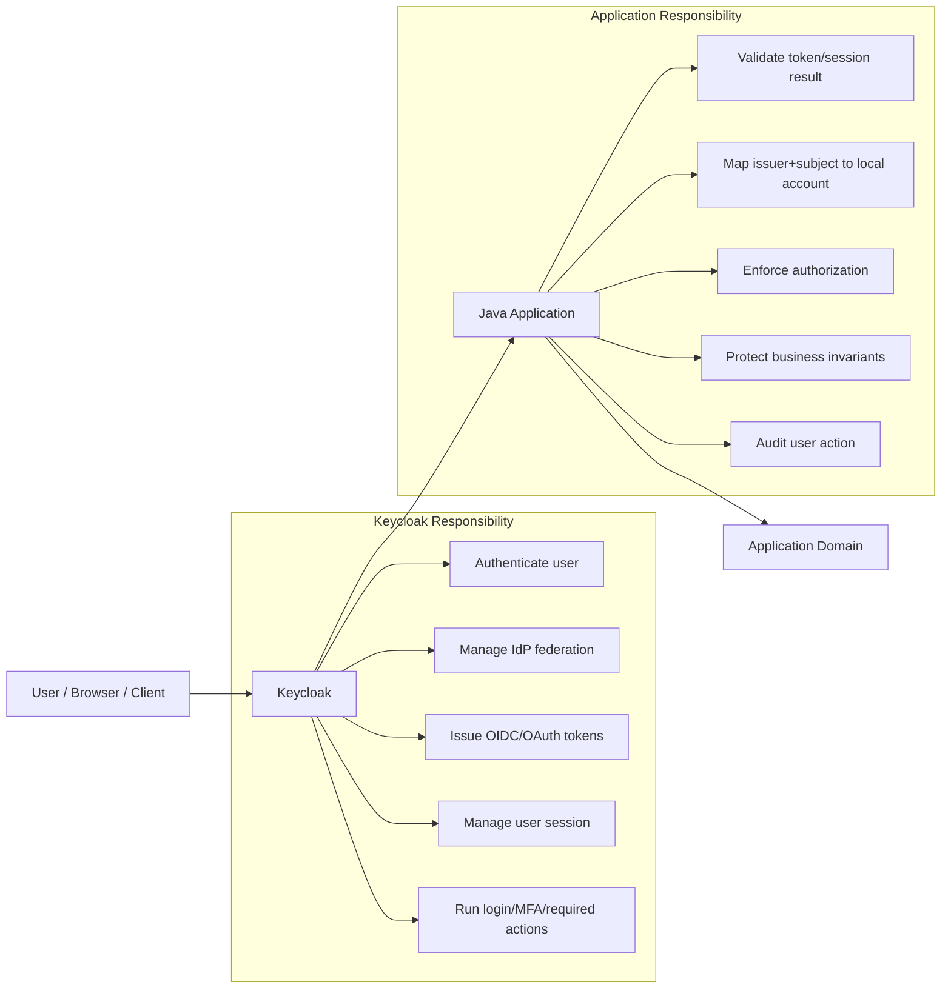
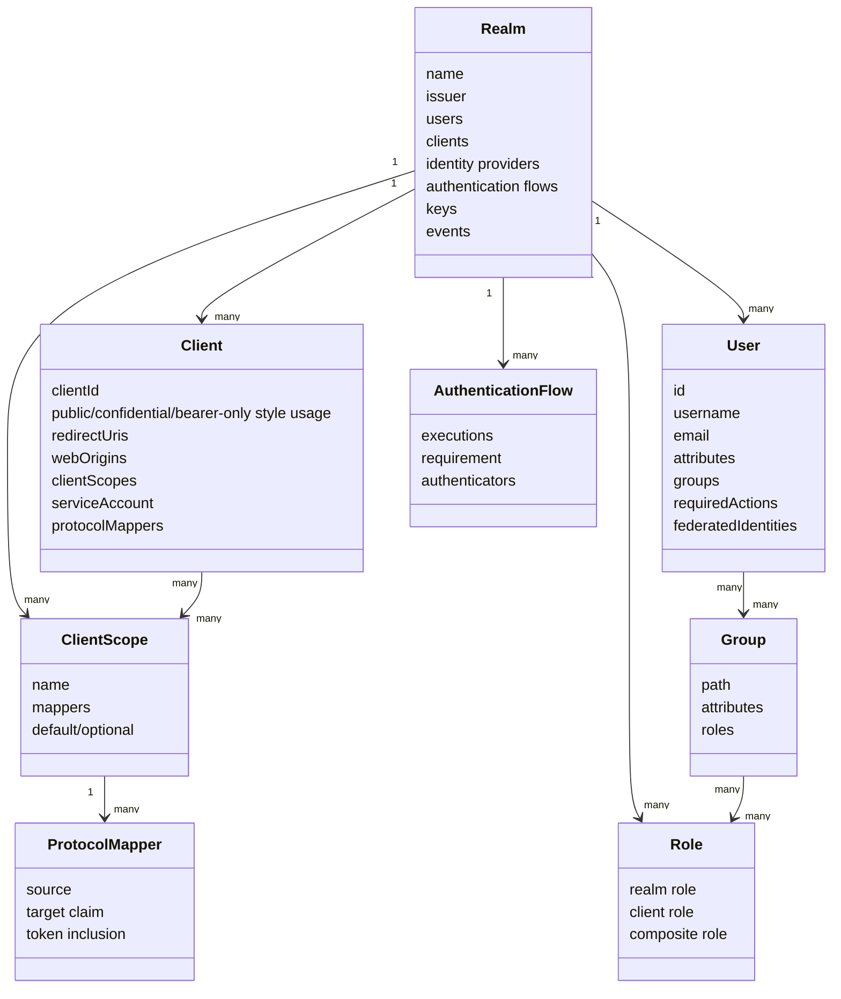
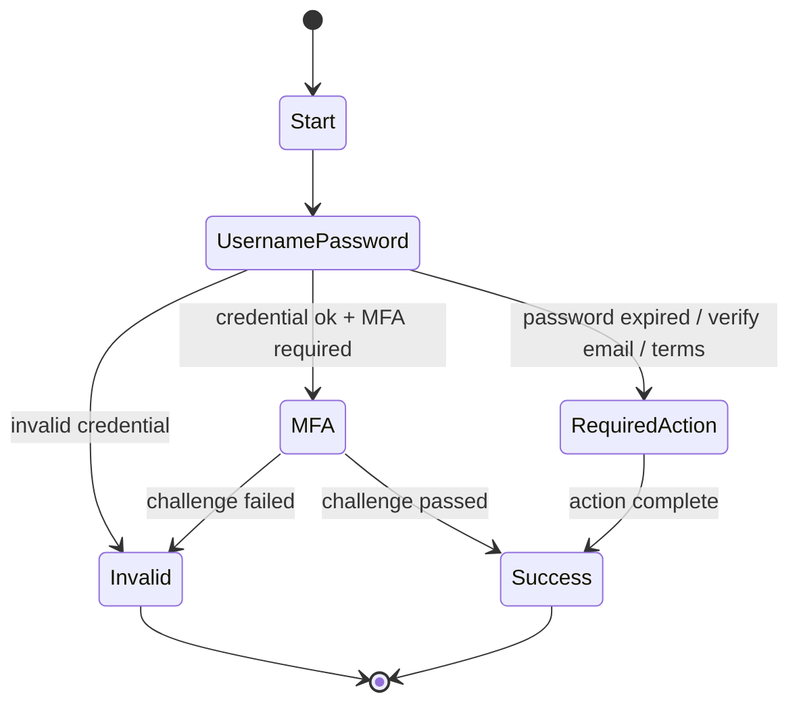
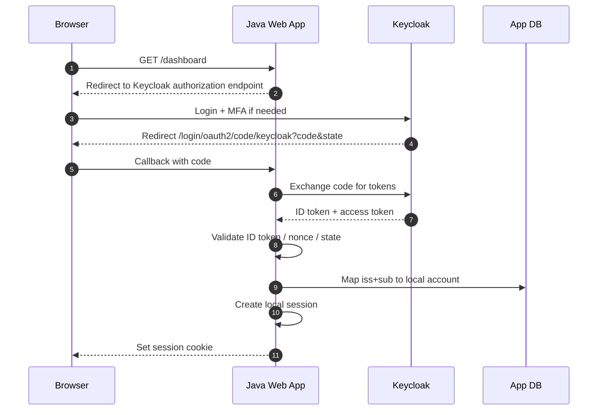
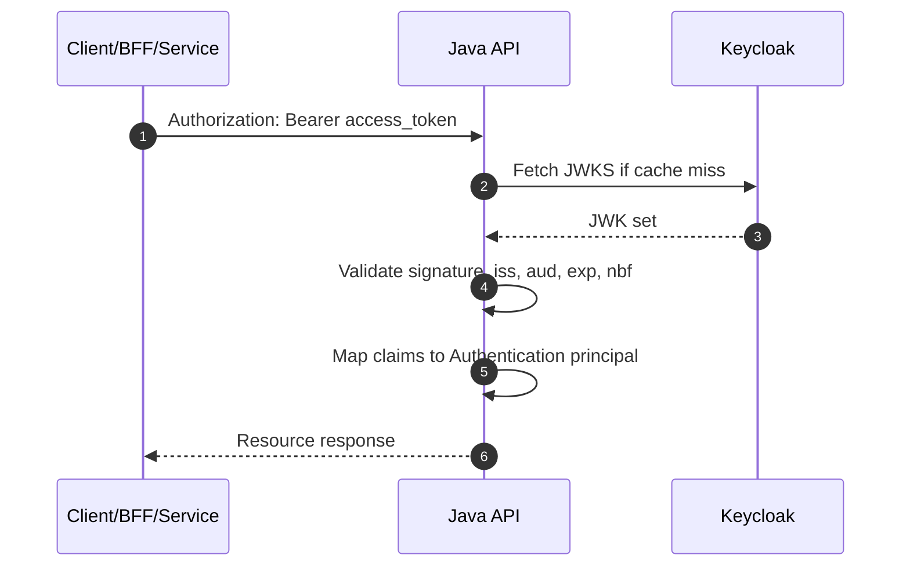
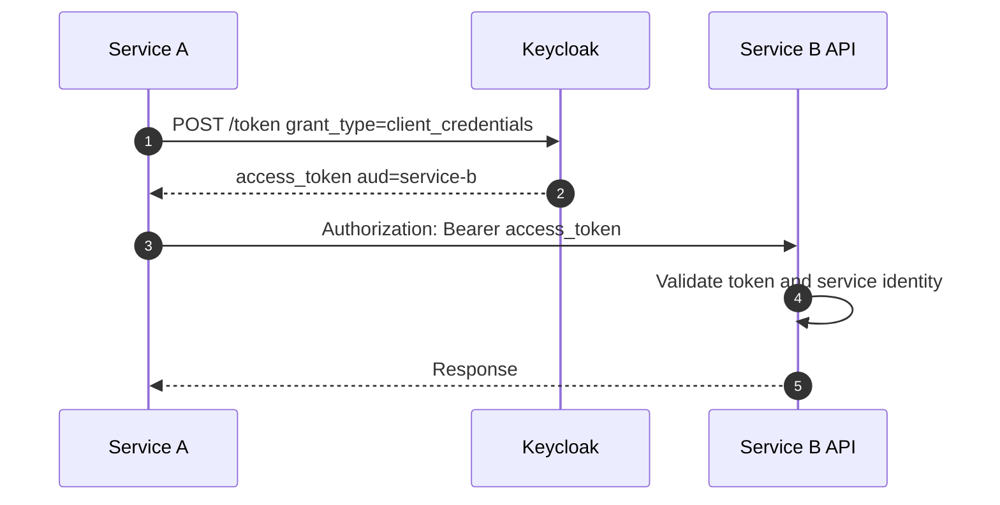
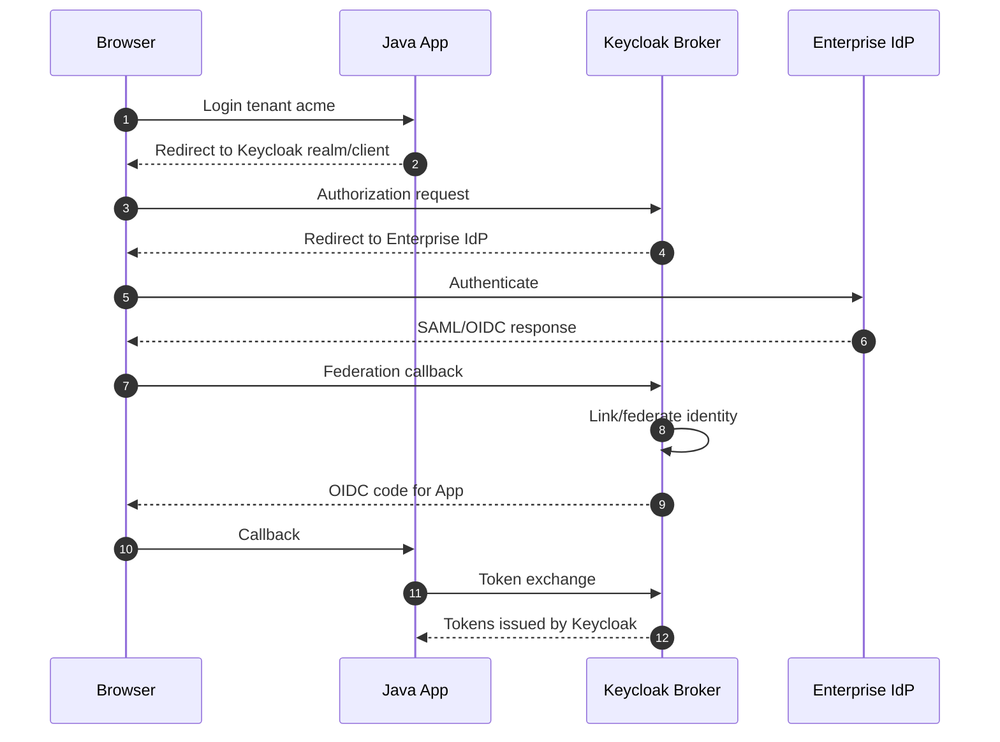
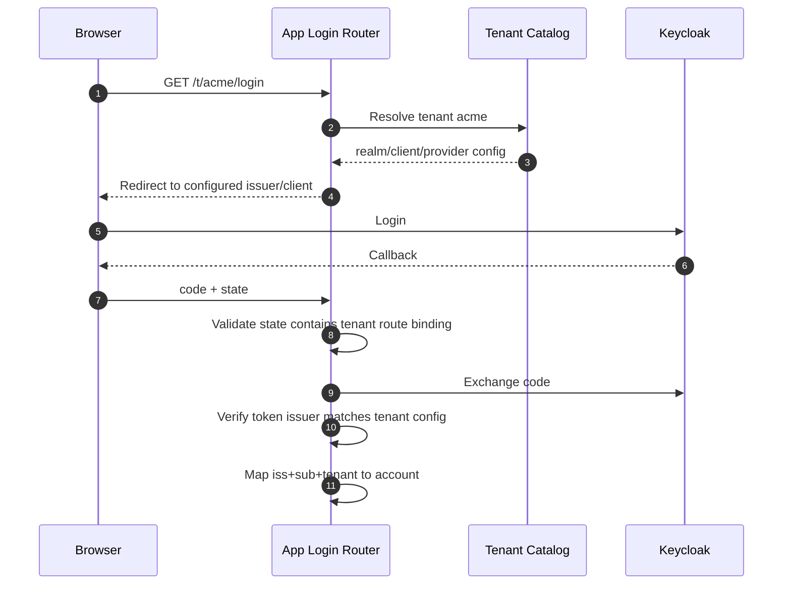

# Part 027 — Keycloak Integration Pattern

> Target part ini: memahami cara mengintegrasikan Java application dengan Keycloak secara production-grade. Fokusnya bukan “cara klik console sampai login berhasil”, tetapi bagaimana membuat kontrak identity yang stabil: realm, client, scope, protocol mapper, token, role mapping, tenant routing, authentication flow, observability, automation, dan failure mode.

Keycloak sering diperlakukan sebagai:

```txt
Login page + token issuer.
```

Itu terlalu kecil.

Mental model yang lebih tepat:

```txt
Keycloak is an identity control plane that externalizes authentication, federation,
credential policy, user session, token issuance, and protocol-level identity contracts.
```

Aplikasi Java tidak boleh “menyerahkan semua keamanan” ke Keycloak. Aplikasi tetap bertanggung jawab atas:

- validasi token;
- mapping local account;
- authorization domain;
- tenant isolation;
- audit;
- session lokal bila aplikasi browser-based;
- failure handling saat IdP lambat/down;
- migration dan rollback.

Keycloak menyelesaikan banyak bagian autentikasi, tetapi bukan alasan untuk berhenti berpikir.

---

## 1. Boundary: Apa yang Dilakukan Keycloak, Apa yang Tetap Milik Aplikasi

Dalam desain production-grade, kita harus memisahkan empat lapisan:



Keycloak boleh menjadi source of authentication result. Ia tidak otomatis menjadi source of truth untuk semua domain permission.

Contoh pemisahan yang sehat:

| Concern | Ideal owner | Catatan |
|---|---|---|
| Password policy | Keycloak | Jangan implementasi ulang password hashing di setiap app. |
| MFA enrollment | Keycloak | App cukup meminta `acr`/LoA bila perlu step-up. |
| OIDC token issuance | Keycloak | App memvalidasi issuer, audience, expiry, signature. |
| Employee active status | HR/Directory/IdP | Bisa disinkronkan ke Keycloak. |
| Account mapping | Application | Gunakan `iss + sub`, bukan email saja. |
| Domain permission | Application/domain authorization service | Jangan paksa semua permission domain kompleks menjadi realm role. |
| Audit business action | Application | Keycloak tahu login; app tahu user approve quote/order/case. |

Invariant penting:

```txt
Keycloak authenticates identity. The application authorizes business action.
```

Jika invariant ini dilanggar, tim biasanya berakhir dengan role explosion, token terlalu besar, mapper tidak stabil, dan authorization yang sulit diaudit.

---

## 2. Keycloak Objects yang Harus Dipahami Engineer

Keycloak punya banyak istilah. Jangan hafalkan semua UI. Pahami object model-nya.



### 2.1 Realm

Realm adalah security boundary utama.

Realm menentukan:

- issuer URL;
- key material/JWKS;
- user namespace;
- sessions;
- clients;
- authentication flows;
- identity providers;
- event configuration;
- token settings.

Rule of thumb:

```txt
Jika dua aplikasi tidak boleh saling mempercayai token dari issuer yang sama,
jangan taruh mereka di realm yang sama tanpa desain audience/scope yang kuat.
```

### 2.2 Client

Client merepresentasikan aplikasi atau service yang berinteraksi dengan Keycloak.

Contoh:

| Sistem | Client type konseptual | Flow umum |
|---|---|---|
| Web app server-side | Confidential client | Authorization Code + PKCE |
| SPA murni | Public client | Authorization Code + PKCE; lebih baik BFF untuk token handling |
| Mobile app | Public client | Authorization Code + PKCE |
| Backend service | Confidential client | Client Credentials |
| API/resource server | Resource server | Validate access token; bukan login UI |
| CLI internal | Public/confidential tergantung distribusi secret | Device flow atau auth code + PKCE |

Client configuration bukan sekadar administrative setup. Itu bagian dari security contract.

### 2.3 Client Scope

Client scope adalah cara mengelola claim dan scope agar tidak diduplikasi di banyak client.

Gunakan client scope untuk:

- claim umum seperti `tenant_id`, `account_id`, `preferred_username`;
- audience mapper;
- group/role mapping yang stabil;
- default claims untuk family aplikasi tertentu;
- optional scope untuk progressive claim release.

Jangan membuat mapper copy-paste di setiap client tanpa versioning. Itu menghasilkan drift.

### 2.4 Protocol Mapper

Protocol mapper mengubah data user/session/client menjadi claim token.

Mapper adalah tempat banyak sistem rusak karena claim dianggap “detail kecil”.

Contoh claim contract:

```json
{
  "iss": "https://id.example.com/realms/acme",
  "sub": "f7e2a7a1-3d2e-4c1d-9b8f-...",
  "aud": ["order-api"],
  "azp": "order-web",
  "tenant_id": "tnt_123",
  "account_id": "acc_456",
  "acr": "urn:example:loa:2",
  "scope": "openid profile order.read order.write"
}
```

Checklist mapper:

- claim name stabil;
- data type stabil;
- tidak memasukkan PII berlebihan;
- tidak memasukkan permission ribuan item;
- `aud` sesuai resource server;
- role/group mapping tidak menyebabkan token bloat;
- claim multi-tenant tidak bisa dipalsukan dari user attribute bebas;
- perubahan mapper diperlakukan seperti breaking API change.

### 2.5 Authentication Flow

Authentication flow menentukan bagaimana user login.

Contoh flow:



Production rule:

```txt
Authentication flow is business-critical infrastructure. Treat flow changes like code changes.
```

Jangan ubah browser flow production lewat console tanpa review, staging test, dan rollback path.

---

## 3. Integration Topology

Ada tiga topology yang paling sering dipakai.

### 3.1 Browser Web App dengan OIDC Login



Java app di sini biasanya memakai `oauth2Login()` Spring Security.

App tidak menaruh access token di JavaScript. Browser hanya memegang session cookie app.

### 3.2 API Resource Server dengan Bearer Token



Java API biasanya memakai Spring Security Resource Server atau JAX-RS filter dengan JOSE library.

### 3.3 Machine-to-Machine Client Credentials



Rule:

```txt
Client credentials authenticate a client/service, not an end user.
```

Jika service A bertindak “atas nama user”, jangan palsukan user claim. Gunakan token exchange/delegation pattern yang eksplisit, atau desain audit `actor` dan `subject` terpisah.

---

## 4. Realm Strategy

Realm strategy adalah keputusan arsitektur, bukan preferensi UI.

### 4.1 Realm per Environment

Minimal sehat:

```txt
dev realm != staging realm != production realm
```

Alasannya:

- issuer berbeda;
- signing keys berbeda;
- test users tidak bercampur dengan production users;
- redirect URI dan client secrets tidak bocor lintas environment;
- event/audit terpisah;
- rollback lebih aman.

Anti-pattern:

```txt
Satu realm dipakai dev, staging, production dengan client berbeda.
```

Itu sering menghasilkan accidental trust: service staging menerima token production atau sebaliknya karena issuer sama.

### 4.2 Realm per Tenant

Cocok jika:

- tenant enterprise butuh custom IdP/federation sendiri;
- kebijakan MFA/password berbeda secara legal/contractual;
- data identity harus diisolasi kuat;
- admin tenant tidak boleh melihat tenant lain;
- per-tenant key rotation/issuer diperlukan;
- onboarding/offboarding tenant harus independen.

Trade-off:

| Realm per tenant | Dampak |
|---|---|
| Isolation kuat | Operasional lebih berat. |
| Issuer unik | App harus dynamic issuer resolution. |
| Policy fleksibel | Drift antar realm mudah terjadi. |
| Tenant export/import mudah | Realm config harus versioned. |
| Blast radius kecil | Automation wajib matang. |

### 4.3 Single Realm Multi-Tenant

Cocok jika:

- semua tenant memakai policy yang hampir sama;
- tenant count sangat banyak;
- isolasi cukup di application domain;
- identity admin tidak diberikan ke tenant;
- login experience seragam.

Tetapi app harus menjaga tenant invariant:

```txt
Authenticated user may belong to multiple tenants.
The selected tenant is an application context, not just a token claim.
```

Jangan menganggap `tenant_id` tunggal di token cukup untuk semua skenario B2B SaaS.

### 4.4 Decision Matrix

| Pertanyaan | Lebih condong ke |
|---|---|
| Apakah setiap tenant punya enterprise IdP sendiri? | Realm per tenant atau identity brokering yang kuat |
| Apakah admin tenant butuh mengelola user sendiri? | Realm per tenant atau delegated admin custom |
| Apakah tenant count ribuan? | Single realm atau segmented realms |
| Apakah tenant punya compliance boundary keras? | Realm per tenant |
| Apakah app harus menerima token dari banyak issuer? | Dynamic issuer resolver |
| Apakah role/claim sama di semua tenant? | Single realm lebih sederhana |

---

## 5. Client Configuration Pattern

Client configuration adalah kontrak keamanan. Simpan sebagai code/config, review seperti source code.

### 5.1 Browser/Web Client

Untuk Java web app server-side:

```txt
client_id: order-web
client_type: confidential
flow: authorization code + PKCE
redirect_uri: https://app.example.com/login/oauth2/code/keycloak
web_origins: exact origin only
client_secret: stored in secret manager
```

Checklist:

- redirect URI exact, bukan wildcard longgar;
- PKCE aktif;
- implicit flow off;
- direct access grant off kecuali benar-benar diperlukan;
- standard flow on;
- access token lifespan pendek;
- refresh token policy jelas;
- client secret rotation procedure ada;
- backchannel logout bila diperlukan;
- valid post-logout redirect URI ketat.

### 5.2 Resource Server Client

Untuk API:

```txt
client_id: order-api
role: resource server / audience target
expected_audience: order-api
```

Resource server tidak perlu login redirect. Ia memvalidasi token.

Checklist:

- issuer exact;
- audience exact;
- algorithm allowlist;
- JWKS cache;
- role/authority converter eksplisit;
- clock skew kecil dan terkontrol;
- token error response tidak membocorkan detail berlebihan.

### 5.3 Machine Client

Untuk service-to-service:

```txt
client_id: billing-worker
grant: client_credentials
client_auth: private_key_jwt / mTLS / client_secret_basic depending on maturity
scope: billing.read order.read
```

Checklist:

- secret bukan environment variable plaintext jika bisa pakai secret manager;
- scope minimal;
- audience target jelas;
- token cache bounded;
- failure fallback tidak bypass auth;
- rotation tested.

---

## 6. Token Claim Contract

Claim token adalah API contract antara IdP dan resource server.

Jangan desain claim dari tampilan Keycloak. Desain dari kebutuhan resource server.

### 6.1 Minimal Access Token Claims

```json
{
  "iss": "https://id.example.com/realms/acme-prod",
  "sub": "f7e2a7a1-3d2e-4c1d-9b8f-...",
  "aud": ["order-api"],
  "azp": "order-web",
  "exp": 1783062600,
  "iat": 1783062300,
  "jti": "token-id",
  "scope": "order.read order.write",
  "tenant_id": "tnt_123",
  "account_id": "acc_456"
}
```

Resource server minimal memvalidasi:

```txt
signature && alg allowlisted && iss exact && aud contains expected API && exp valid && nbf valid && required claims present
```

### 6.2 Jangan Memakai Email sebagai Primary Key

Buruk:

```txt
local_user = findByEmail(token.email)
```

Lebih aman:

```txt
external_identity = findByIssuerAndSubject(token.iss, token.sub)
```

Email bisa berubah. Email juga bisa sama di provider berbeda. Untuk federation, `sub` hanya unik dalam issuer.

Invariant:

```txt
Global external identity key = issuer + subject.
```

### 6.3 Role Claims dari Keycloak

Keycloak umum menaruh role di struktur seperti:

```json
{
  "realm_access": {
    "roles": ["offline_access", "uma_authorization", "platform-admin"]
  },
  "resource_access": {
    "order-api": {
      "roles": ["order-reader", "order-operator"]
    }
  }
}
```

Jangan langsung menganggap semua realm role adalah authority aplikasi.

Lebih baik:

- resource server hanya membaca role dari client/resource yang relevan;
- role prefix eksplisit;
- role mapping code-reviewed;
- authorization domain tetap punya permission model sendiri bila kompleks.

Contoh converter Spring:

```java
import org.springframework.core.convert.converter.Converter;
import org.springframework.security.core.GrantedAuthority;
import org.springframework.security.core.authority.SimpleGrantedAuthority;
import org.springframework.security.oauth2.jwt.Jwt;

import java.util.*;
import java.util.stream.Collectors;

public final class KeycloakClientRoleConverter implements Converter<Jwt, Collection<GrantedAuthority>> {
    private final String clientId;

    public KeycloakClientRoleConverter(String clientId) {
        this.clientId = Objects.requireNonNull(clientId);
    }

    @Override
    @SuppressWarnings("unchecked")
    public Collection<GrantedAuthority> convert(Jwt jwt) {
        Map<String, Object> resourceAccess = jwt.getClaim("resource_access");
        if (resourceAccess == null) {
            return List.of();
        }

        Object clientAccessRaw = resourceAccess.get(clientId);
        if (!(clientAccessRaw instanceof Map<?, ?> clientAccess)) {
            return List.of();
        }

        Object rolesRaw = clientAccess.get("roles");
        if (!(rolesRaw instanceof Collection<?> roles)) {
            return List.of();
        }

        return roles.stream()
                .filter(String.class::isInstance)
                .map(String.class::cast)
                .map(role -> "ROLE_" + clientId.toUpperCase(Locale.ROOT).replace('-', '_') + "_" + role.toUpperCase(Locale.ROOT).replace('-', '_'))
                .map(SimpleGrantedAuthority::new)
                .collect(Collectors.toUnmodifiableSet());
    }
}
```

Production concern:

```txt
Authority mapping is part of authorization. Test it like business logic.
```

---

## 7. Spring Security Integration: Browser Login

Spring Security should integrate with Keycloak through standard OAuth2/OIDC support, not old vendor-specific adapters.

### 7.1 Configuration

Example `application.yml`:

```yaml
spring:
  security:
    oauth2:
      client:
        registration:
          keycloak:
            provider: keycloak
            client-id: order-web
            client-secret: ${ORDER_WEB_CLIENT_SECRET}
            authorization-grant-type: authorization_code
            scope:
              - openid
              - profile
              - email
              - order
            redirect-uri: "{baseUrl}/login/oauth2/code/{registrationId}"
        provider:
          keycloak:
            issuer-uri: https://id.example.com/realms/acme-prod
```

Security config:

```java
import org.springframework.context.annotation.Bean;
import org.springframework.context.annotation.Configuration;
import org.springframework.security.config.annotation.web.builders.HttpSecurity;
import org.springframework.security.web.SecurityFilterChain;

@Configuration
class WebSecurityConfig {

    @Bean
    SecurityFilterChain web(HttpSecurity http) throws Exception {
        http
            .authorizeHttpRequests(auth -> auth
                .requestMatchers("/", "/assets/**", "/health").permitAll()
                .anyRequest().authenticated()
            )
            .oauth2Login(oauth -> oauth
                .loginPage("/oauth2/authorization/keycloak")
            )
            .logout(logout -> logout
                .logoutUrl("/logout")
                .deleteCookies("SESSION")
                .invalidateHttpSession(true)
            );

        return http.build();
    }
}
```

### 7.2 Local Account Mapping

Jangan biarkan `OidcUser` menjadi domain user langsung.

Buat mapping layer:

```java
public record ExternalIdentityKey(String issuer, String subject) {}

public record AuthenticatedAccount(
        String accountId,
        String tenantId,
        ExternalIdentityKey externalIdentity,
        String displayName,
        Set<String> authorities
) {}
```

Service:

```java
import org.springframework.security.oauth2.core.oidc.user.OidcUser;
import java.util.Objects;

public final class OidcAccountResolver {
    private final ExternalIdentityRepository identities;
    private final AccountRepository accounts;

    public OidcAccountResolver(ExternalIdentityRepository identities, AccountRepository accounts) {
        this.identities = identities;
        this.accounts = accounts;
    }

    public AuthenticatedAccount resolve(OidcUser oidcUser) {
        String issuer = oidcUser.getIssuer().toString();
        String subject = oidcUser.getSubject();

        var identity = identities.findByIssuerAndSubject(issuer, subject)
                .orElseThrow(() -> new UnlinkedExternalIdentityException(issuer, subject));

        var account = accounts.findActiveById(identity.accountId())
                .orElseThrow(() -> new DisabledLocalAccountException(identity.accountId()));

        return new AuthenticatedAccount(
                account.id(),
                account.primaryTenantId(),
                new ExternalIdentityKey(issuer, subject),
                account.displayName(),
                account.authorities()
        );
    }
}
```

Failure mode:

```txt
OIDC login success != local account allowed.
```

Local account may be disabled, tenant membership may be suspended, or terms may be missing.

### 7.3 Custom OIDC User Service

```java
import org.springframework.security.oauth2.client.oidc.userinfo.OidcUserRequest;
import org.springframework.security.oauth2.client.oidc.userinfo.OidcUserService;
import org.springframework.security.oauth2.core.oidc.user.OidcUser;
import org.springframework.security.oauth2.core.oidc.user.DefaultOidcUser;
import org.springframework.security.core.GrantedAuthority;

import java.util.Collection;

public final class MappingOidcUserService extends OidcUserService {
    private final OidcAccountResolver resolver;

    public MappingOidcUserService(OidcAccountResolver resolver) {
        this.resolver = resolver;
    }

    @Override
    public OidcUser loadUser(OidcUserRequest userRequest) {
        OidcUser oidc = super.loadUser(userRequest);
        AuthenticatedAccount account = resolver.resolve(oidc);

        Collection<? extends GrantedAuthority> authorities = account.authorities().stream()
                .map(org.springframework.security.core.authority.SimpleGrantedAuthority::new)
                .toList();

        return new DefaultOidcUser(authorities, oidc.getIdToken(), oidc.getUserInfo(), "sub");
    }
}
```

Use this only if you need custom mapping. Keep it small. Do not put business authorization checks in OIDC user loading except local account eligibility.

---

## 8. Spring Security Integration: Resource Server

For API:

```yaml
spring:
  security:
    oauth2:
      resourceserver:
        jwt:
          issuer-uri: https://id.example.com/realms/acme-prod
```

Security config:

```java
import org.springframework.context.annotation.Bean;
import org.springframework.context.annotation.Configuration;
import org.springframework.security.config.annotation.web.builders.HttpSecurity;
import org.springframework.security.oauth2.server.resource.authentication.JwtAuthenticationConverter;
import org.springframework.security.web.SecurityFilterChain;

@Configuration
class ApiSecurityConfig {

    @Bean
    SecurityFilterChain api(HttpSecurity http) throws Exception {
        var jwtAuthConverter = new JwtAuthenticationConverter();
        jwtAuthConverter.setJwtGrantedAuthoritiesConverter(new KeycloakClientRoleConverter("order-api"));

        http
            .securityMatcher("/api/**")
            .authorizeHttpRequests(auth -> auth
                .requestMatchers("/api/internal/health").permitAll()
                .requestMatchers("/api/orders/**").hasRole("ORDER_API_ORDER_OPERATOR")
                .anyRequest().authenticated()
            )
            .oauth2ResourceServer(oauth -> oauth
                .jwt(jwt -> jwt.jwtAuthenticationConverter(jwtAuthConverter))
            );

        return http.build();
    }
}
```

### 8.1 Audience Validation

Do not rely on signature only.

```java
import org.springframework.context.annotation.Bean;
import org.springframework.security.oauth2.core.*;
import org.springframework.security.oauth2.jwt.*;

class JwtValidationConfig {

    @Bean
    JwtDecoder jwtDecoder() {
        NimbusJwtDecoder decoder = JwtDecoders.fromIssuerLocation("https://id.example.com/realms/acme-prod");

        OAuth2TokenValidator<Jwt> issuer = JwtValidators.createDefaultWithIssuer("https://id.example.com/realms/acme-prod");
        OAuth2TokenValidator<Jwt> audience = token -> {
            if (token.getAudience().contains("order-api")) {
                return OAuth2TokenValidatorResult.success();
            }
            return OAuth2TokenValidatorResult.failure(new OAuth2Error(
                    "invalid_token",
                    "Missing required audience",
                    null
            ));
        };

        decoder.setJwtValidator(new DelegatingOAuth2TokenValidator<>(issuer, audience));
        return decoder;
    }
}
```

Invariant:

```txt
A token issued by the right issuer is still invalid for this API if audience does not include this API.
```

### 8.2 Startup Coupling

If app uses issuer discovery at startup, availability of Keycloak may affect app startup. For critical resource servers, decide explicitly:

| Strategy | Trade-off |
|---|---|
| `issuer-uri` discovery | Simple, validates metadata, can couple startup. |
| `jwk-set-uri` explicit | Less startup coupling, more manual config. |
| cached JWKS | Better resilience, must handle key rotation. |
| introspection | Central revocation, latency and IdP dependency per request/cache. |

Do not discover architecture accidentally through outage.

---

## 9. JAX-RS / Jersey Resource Server Filter

If using JAX-RS/Jersey without Spring Security, implement a container request filter.

```java
import jakarta.annotation.Priority;
import jakarta.ws.rs.Priorities;
import jakarta.ws.rs.container.ContainerRequestContext;
import jakarta.ws.rs.container.ContainerRequestFilter;
import jakarta.ws.rs.core.HttpHeaders;
import jakarta.ws.rs.core.Response;
import jakarta.ws.rs.ext.Provider;

import java.io.IOException;

@Provider
@Priority(Priorities.AUTHENTICATION)
public final class BearerTokenAuthenticationFilter implements ContainerRequestFilter {
    private final AccessTokenVerifier verifier;

    public BearerTokenAuthenticationFilter(AccessTokenVerifier verifier) {
        this.verifier = verifier;
    }

    @Override
    public void filter(ContainerRequestContext request) throws IOException {
        String header = request.getHeaderString(HttpHeaders.AUTHORIZATION);
        if (header == null || !header.startsWith("Bearer ")) {
            request.abortWith(Response.status(Response.Status.UNAUTHORIZED).build());
            return;
        }

        String token = header.substring("Bearer ".length()).trim();
        try {
            AuthenticatedPrincipal principal = verifier.verify(token);
            request.setSecurityContext(new AuthenticatedSecurityContext(principal, request.getSecurityContext().isSecure()));
        } catch (InvalidTokenException ex) {
            request.abortWith(Response.status(Response.Status.UNAUTHORIZED).build());
        }
    }
}
```

Verifier responsibilities:

```txt
parse compact JWT
select JWK by kid from trusted issuer JWKS
validate alg allowlist
verify signature
validate exp/nbf/iat with bounded skew
validate iss exact
validate aud exact
validate tenant/account claims
return immutable principal
```

Do not decode JWT with Base64 and trust the payload.

---

## 10. Keycloak Authentication Flow Customization

Custom flow is powerful. It is also dangerous.

### 10.1 Common Flow Changes

| Need | Keycloak area | Risk |
|---|---|---|
| Force MFA | Browser flow / required actions / policies | User lockout if recovery weak. |
| Email verification | Required action | Delivery dependency blocks login. |
| Terms acceptance | Required action | App may also need local terms version. |
| Password reset | Credential reset flow | Enumeration and takeover risk. |
| IdP-first login | Identity provider redirector | Wrong tenant/provider routing. |
| Conditional OTP | Conditional authenticators | Policy ambiguity. |
| Custom risk check | Custom authenticator SPI | Must be maintained across upgrades. |

### 10.2 Flow as Code Review Artifact

Represent flow in text:

```yaml
browser-flow:
  executions:
    - cookie: alternative
    - identity-provider-redirector: alternative
    - username-password-form: required
    - conditional-otp:
        requirement: conditional
        condition: user_has_otp_or_risk_requires_mfa
    - required-actions: required
```

Before changing flow, answer:

- What users are affected?
- Is there a break-glass path?
- What happens if email/SMS/TOTP provider is down?
- Can an attacker trigger expensive path repeatedly?
- Are error messages generic?
- Are events emitted?
- Is rollback tested?

### 10.3 Direct Access Grants

Direct access grant/resource owner password credential style flows should normally be disabled.

Why:

- app handles user password directly;
- phishing surface increases;
- MFA/federation often breaks or becomes awkward;
- modern OAuth guidance moves away from password grant;
- audit semantics are weaker.

Use Authorization Code + PKCE for interactive users.

---

## 11. Identity Brokering and Federation

Keycloak can act as broker between app and upstream IdP.



Benefits:

- app trusts one issuer: Keycloak;
- upstream protocol differences hidden;
- account linking centralized;
- per-tenant IdP routing possible.

Risks:

- Keycloak becomes identity chokepoint;
- wrong mapper can mix tenant identity;
- upstream `email` claim may be unverified;
- auto-linking can create account takeover;
- logout semantics across IdPs remain hard.

Rule:

```txt
Brokered login still requires local account mapping discipline.
```

---

## 12. Multi-Tenant Routing Pattern

For B2B SaaS, user may begin login with tenant hint:

```txt
https://app.example.com/t/acme/login
```

Flow:



Security requirements:

- `state` binds login attempt to tenant route;
- callback validates expected issuer for tenant;
- local account membership checked after authentication;
- do not choose tenant solely from token claim if URL state says another tenant;
- prevent open redirects in post-login target;
- tenant config changes audited.

Data model:

```sql
create table tenant_identity_provider_config (
    tenant_id           varchar(64) primary key,
    provider_type       varchar(32) not null, -- KEYCLOAK_REALM, OIDC_EXTERNAL, SAML_EXTERNAL
    issuer_uri          text not null,
    client_id           varchar(255) not null,
    enabled             boolean not null default true,
    created_at          timestamptz not null default now(),
    updated_at          timestamptz not null default now()
);

create table external_identity_link (
    id                  uuid primary key,
    tenant_id           varchar(64) not null,
    account_id          varchar(64) not null,
    issuer              text not null,
    subject             varchar(255) not null,
    email_at_link_time  varchar(320),
    linked_at           timestamptz not null default now(),
    unique (issuer, subject),
    unique (tenant_id, account_id, issuer)
);
```

---

## 13. Service Account Pattern

Keycloak service account is useful for machine clients.

Example use cases:

- scheduled job calls internal API;
- backend service calls billing provider adapter;
- worker consumes command queue and calls resource service;
- deployment automation calls admin API.

Principles:

```txt
Service account is not an admin shortcut.
```

Checklist:

- one service account per deployable/service;
- no shared “backend-client” across all services;
- minimal client roles/scopes;
- explicit audience;
- short-lived access token;
- client secret/private key stored in secret manager;
- rotation tested;
- service identity logged as actor;
- user subject not invented.

Audit model for service action:

```json
{
  "event_type": "ORDER_SYNCED",
  "actor_type": "SERVICE_ACCOUNT",
  "actor_client_id": "billing-worker",
  "subject_type": "ORDER",
  "subject_id": "ord_123",
  "tenant_id": "tnt_123",
  "correlation_id": "..."
}
```

When service acts on behalf of user:

```json
{
  "actor_type": "SERVICE_ACCOUNT",
  "actor_client_id": "report-exporter",
  "on_behalf_of_user": "acc_456",
  "delegation_source": "user_requested_export"
}
```

Do not collapse actor and subject.

---

## 14. Admin API and Automation

Manual console changes do not scale.

Use automation for:

- realm creation;
- client creation;
- redirect URI updates;
- client scope/mappers;
- roles/groups baseline;
- event settings;
- authentication flow definitions;
- identity provider config;
- environment promotion.

Possible tools:

- Keycloak Admin REST API;
- `kcadm.sh`;
- Terraform provider;
- GitOps pipeline with realm export/import;
- custom reconciler.

The important principle is not tool choice. The principle is:

```txt
Identity configuration is production configuration. Version, review, diff, promote, and rollback it.
```

Example config shape:

```yaml
realm: acme-prod
clients:
  - clientId: order-web
    type: confidential
    redirects:
      - https://order.example.com/login/oauth2/code/keycloak
    defaultScopes:
      - openid
      - profile
      - email
      - tenant-context
  - clientId: order-api
    type: resource-server
    audiences:
      - order-api
clientScopes:
  - name: tenant-context
    mappers:
      - name: tenant-id
        claim: tenant_id
        source: user_attribute:tenant_id
        token: access_token
```

Review checklist:

- Does this change alter issuer/audience/claim contract?
- Does it widen redirect URI or CORS origin?
- Does it add PII to token?
- Does it change MFA requirement?
- Does it grant admin role?
- Does it affect all tenants or one tenant?
- Is rollback possible without invalidating all sessions?

---

## 15. Observability and Audit

Keycloak emits login/admin events. Application emits domain events. You need both.

### 15.1 Keycloak Events to Monitor

Track at least:

- login success/failure;
- invalid user credentials;
- user disabled;
- brute force detection;
- token refresh;
- logout;
- reset password;
- update password;
- update TOTP/WebAuthn credential;
- identity provider login;
- admin role/client/mapper changes;
- client secret rotation;
- realm key changes.

### 15.2 Application Auth Events

Application should emit:

```json
{
  "event_type": "AUTHENTICATION_ACCEPTED",
  "issuer": "https://id.example.com/realms/acme-prod",
  "subject": "f7e2a7a1...",
  "account_id": "acc_456",
  "tenant_id": "tnt_123",
  "client_id": "order-web",
  "acr": "loa2",
  "session_id_hash": "...",
  "ip_hash": "...",
  "user_agent_hash": "...",
  "correlation_id": "...",
  "time": "2026-07-03T12:00:00Z"
}
```

For failures:

```json
{
  "event_type": "TOKEN_REJECTED",
  "reason_code": "AUDIENCE_MISMATCH",
  "issuer": "https://id.example.com/realms/acme-prod",
  "client_id": "unknown-or-azp",
  "api": "order-api",
  "correlation_id": "..."
}
```

Do not log raw tokens.

### 15.3 Metrics

Useful metrics:

```txt
keycloak_login_success_total
keycloak_login_failure_total
application_token_rejected_total{reason}
application_jwks_fetch_total{result}
application_jwt_validation_latency_seconds
application_oidc_callback_failure_total{reason}
application_unlinked_identity_total
application_forbidden_after_auth_total
application_session_created_total
application_logout_total
```

Alerts:

- spike in invalid credentials;
- spike in token audience mismatch;
- JWKS fetch failure;
- callback state mismatch;
- admin config changes outside change window;
- unusual client credentials token volume;
- service account used from unknown network.

---

## 16. Operational Design

### 16.1 Key Rotation

JWT validation relies on Keycloak realm keys.

Operational rules:

- resource servers must cache JWKS but refresh on unknown `kid`;
- old keys must remain available long enough for issued tokens to expire;
- emergency rotation has playbook;
- metrics show unknown `kid` spike;
- staged rotation is tested.

Failure mode:

```txt
Key rotated, old key removed immediately, all still-valid tokens fail.
```

### 16.2 TLS and Proxy Boundary

Keycloak behind reverse proxy needs correct hostname/proxy configuration.

Risks:

- issuer URL generated with internal host;
- redirect URI mismatch;
- cookies not secure;
- mixed scheme HTTP/HTTPS;
- callback loops;
- origin mismatch.

Invariant:

```txt
The issuer URL seen by clients and resource servers must be stable, external, HTTPS, and exact.
```

### 16.3 Availability

Decide what happens when Keycloak is unavailable:

| Flow | If Keycloak down | User-visible behavior |
|---|---|---|
| Existing local app session | Should continue until session expiry | App still usable. |
| New browser login | Fails | Friendly auth unavailable page. |
| Access token validation with cached JWKS | Continues | API usable until key cache/token expiry. |
| Introspection per request | Degraded/fails | API dependency on IdP. |
| Client credentials token acquisition | Fails if no cached token | Service may degrade. |
| Refresh token flow | Fails | User may need re-login later. |

Do not make every API request synchronously dependent on Keycloak unless revocation centrality is more important than latency/resilience.

---

## 17. Common Failure Modes

### 17.1 Accepting Token from Wrong Audience

Symptom:

```txt
Token minted for account-api works against order-api.
```

Cause:

```txt
Resource server validates signature and issuer but not audience.
```

Fix:

```txt
Validate aud. Use audience mapper/client scope. Add regression test.
```

### 17.2 Auto-Linking by Email

Symptom:

```txt
External IdP user with same email gets linked to existing account.
```

Cause:

```txt
App trusts email as identity proof.
```

Fix:

```txt
Use issuer+subject. Require verified email and explicit linking flow.
```

### 17.3 Realm Drift

Symptom:

```txt
Staging works, production fails because mapper/flow differs.
```

Cause:

```txt
Manual console changes.
```

Fix:

```txt
Realm-as-code, diff, promotion pipeline, config tests.
```

### 17.4 Token Bloat

Symptom:

```txt
Authorization header too large; gateway rejects request.
```

Cause:

```txt
Groups/roles/permissions dumped into JWT.
```

Fix:

```txt
Use compact scopes/roles, application authorization lookup, opaque token when needed.
```

### 17.5 Keycloak Role as Domain Permission

Symptom:

```txt
Every business rule becomes Keycloak role.
```

Cause:

```txt
Identity platform used as domain authorization engine.
```

Fix:

```txt
Keep identity roles coarse. Put fine-grained domain decisions in application/authorization service.
```

### 17.6 Old Adapter Dependency

Symptom:

```txt
Application tied to deprecated vendor adapter; upgrade blocked.
```

Fix:

```txt
Use standard Spring Security OAuth2/OIDC Resource Server/Login or standard Jakarta/JAX-RS token validation.
```

---

## 18. Production Readiness Checklist

### Realm

- [ ] Separate realm/config per environment.
- [ ] Issuer URL stable and HTTPS.
- [ ] Realm keys rotation policy documented.
- [ ] Login/admin events enabled and exported.
- [ ] Brute-force protection policy reviewed.
- [ ] Password/MFA policy reviewed.
- [ ] Required actions tested.

### Client

- [ ] Redirect URIs exact.
- [ ] Wildcard origins avoided.
- [ ] PKCE enabled for interactive clients.
- [ ] Implicit/password grants disabled unless justified.
- [ ] Client secret/private key stored securely.
- [ ] Service account scope minimal.
- [ ] Token lifespan reviewed.

### Token

- [ ] Resource server validates signature.
- [ ] Resource server validates issuer.
- [ ] Resource server validates audience.
- [ ] Resource server validates expiry/not-before.
- [ ] Authority converter explicit.
- [ ] Token does not contain excessive PII.
- [ ] Token does not contain unbounded permission lists.

### Application

- [ ] Local account mapping uses `iss + sub`.
- [ ] Disabled local account rejected after successful IdP login.
- [ ] Tenant membership checked.
- [ ] Authorization is not outsourced accidentally.
- [ ] Auth events emitted.
- [ ] Raw tokens redacted from logs.
- [ ] Callback state/nonce tested.

### Operations

- [ ] Realm config versioned.
- [ ] Client/mapper changes reviewed.
- [ ] Key rotation tested.
- [ ] JWKS cache behavior tested.
- [ ] Keycloak outage behavior known.
- [ ] Emergency admin access exists.
- [ ] Secret rotation tested.

---

## 19. Reference Architecture

```mermaid
flowchart TB
    Browser[Browser]
    Web[Java Web App / BFF]
    API[Java Resource Server]
    Worker[Java Worker]
    KC[Keycloak]
    DB[(Application DB)]
    Redis[(Session/Cache)]
    SIEM[SIEM / Audit Pipeline]

    Browser --> Web
    Web --> KC
    KC --> Web
    Web --> Redis
    Web --> DB
    Web --> API
    Worker --> KC
    Worker --> API
    API --> KC
    API --> DB

    KC --> SIEM
    Web --> SIEM
    API --> SIEM
    Worker --> SIEM
```



Design notes:

- Browser app uses BFF/session cookie.
- BFF uses OIDC login with Keycloak.
- API validates Keycloak access token as resource server.
- Worker uses client credentials.
- App DB stores local account, tenant membership, and external identity link.
- Redis stores local sessions/cache, not raw long-lived tokens.
- SIEM receives both Keycloak events and application events.

---

## 20. Implementation Drill

Build this in a lab:

```txt
System:
- Keycloak realm: acme-dev
- Clients:
  - order-web: confidential auth-code+PKCE
  - order-api: resource server audience
  - billing-worker: client credentials
- Claims:
  - tenant_id
  - account_id
  - aud=order-api
- Java apps:
  - Spring Boot web app with oauth2Login
  - Spring Boot resource server with audience validator
  - JAX-RS resource server filter variant
- DB:
  - external_identity_link
  - account
  - tenant_membership
```

Test scenarios:

1. valid login creates local session;
2. valid Keycloak user but no local link fails safely;
3. disabled local account cannot login;
4. token with wrong audience rejected;
5. token from staging issuer rejected in production API;
6. client credentials token cannot impersonate user;
7. rotated key accepted after JWKS refresh;
8. old key removed only after token expiry window;
9. role mapping regression test catches renamed role;
10. raw token never appears in logs.

---

## 21. What Top Engineers Remember

Keycloak integration is not “install Keycloak and add dependency”. It is identity contract engineering.

The durable mental model:

```txt
Realm defines issuer boundary.
Client defines application trust contract.
Client scope/protocol mapper defines token API.
Authentication flow defines login state machine.
Application maps identity to domain account.
Resource server validates token for itself.
Authorization remains domain-owned.
Configuration changes are production changes.
```

If you hold these invariants, Keycloak becomes a strong authentication platform. If you ignore them, Keycloak becomes a centralized source of invisible coupling.

---

## References

- Keycloak Server Administration Guide: https://www.keycloak.org/docs/latest/server_admin/index.html
- Keycloak securing applications with OpenID Connect: https://www.keycloak.org/securing-apps/oidc-layers
- Keycloak planning for securing applications and services: https://www.keycloak.org/securing-apps/overview
- Keycloak Admin REST API: https://www.keycloak.org/docs-api/latest/rest-api/index.html
- Keycloak adapter deprecation notice: https://www.keycloak.org/2022/02/adapter-deprecation
- Spring Security OAuth2 Resource Server JWT: https://docs.spring.io/spring-security/reference/servlet/oauth2/resource-server/jwt.html
- OpenID Connect Core 1.0: https://openid.net/specs/openid-connect-core-1_0.html
- OAuth 2.0 Security Best Current Practice RFC 9700: https://www.rfc-editor.org/info/rfc9700
