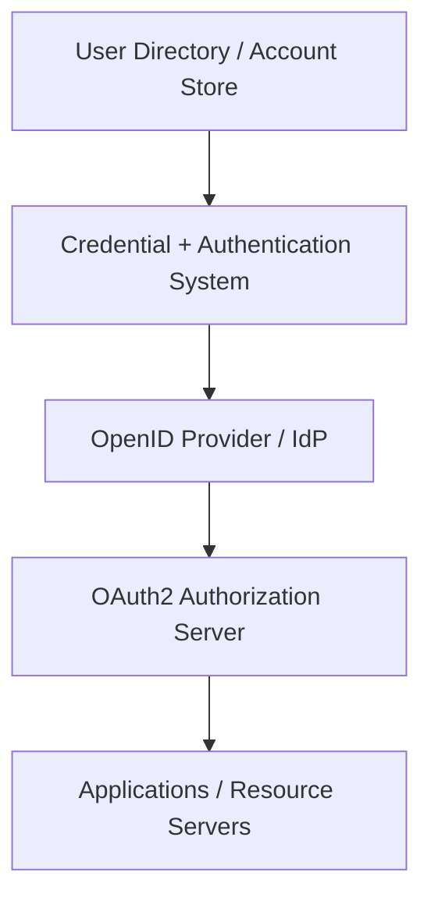
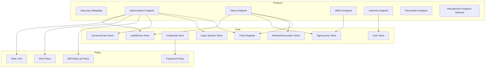
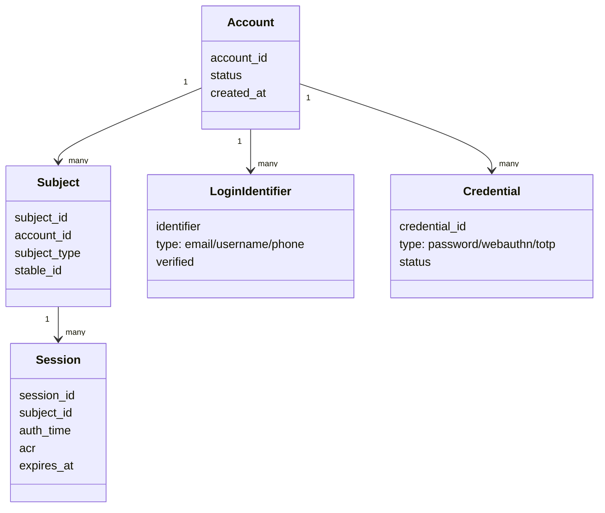
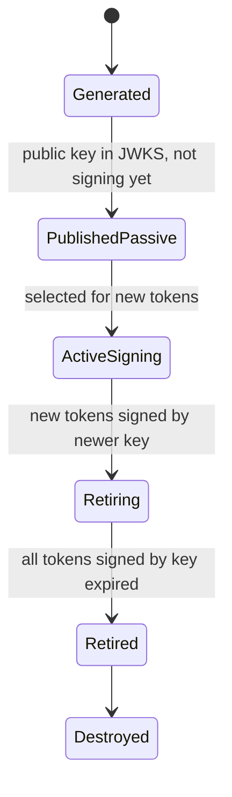
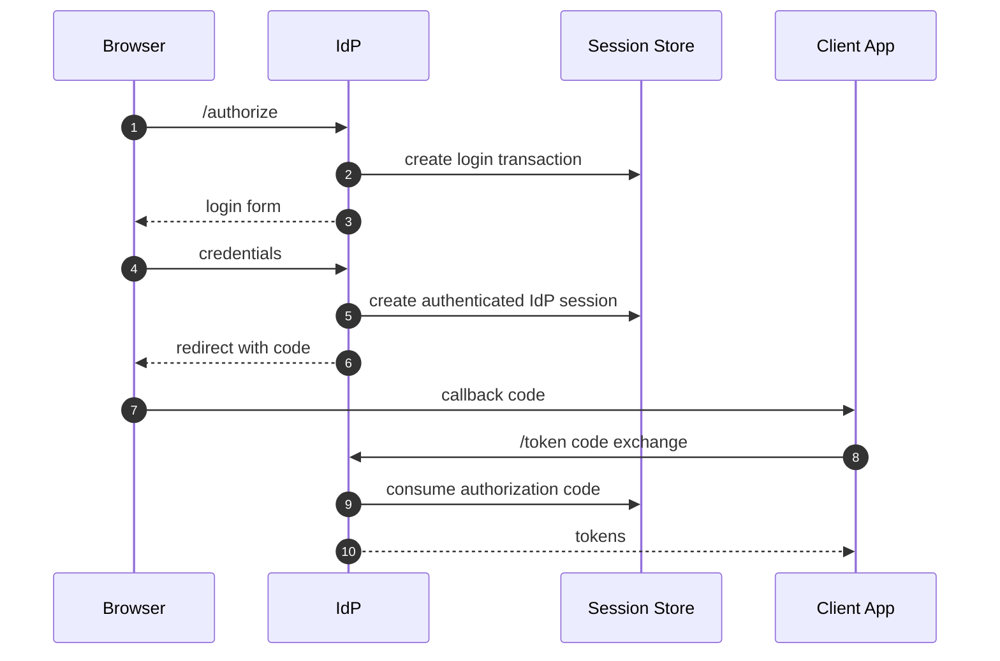
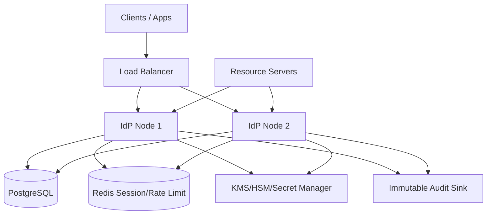
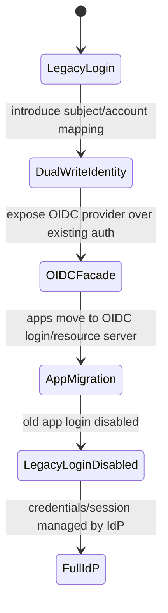

# Part 028 — Custom Identity Provider Pattern

> Target part ini: memahami kapan masuk akal membangun Identity Provider sendiri di Java, kapan harus menghindarinya, dan apa minimal sistem yang harus ada jika keputusan itu memang benar. Fokusnya bukan membuat “JWT issuer sederhana”, tetapi membangun authorization server / OIDC provider yang punya trust boundary, key lifecycle, client registry, login session, token semantics, audit, dan failure model yang benar.

Kalimat paling berbahaya dalam authentication engineering:

```txt
Kita cuma butuh login dan generate JWT.
```

Itu bukan Identity Provider. Itu token vending machine.

Mental model yang benar:

```txt
An Identity Provider is a security authority that authenticates subjects,
manages authentication sessions, applies credential and risk policy,
issues protocol-compliant tokens, publishes trust metadata,
and maintains lifecycle/audit controls for clients, users, keys, and sessions.
```

Membangun IdP sendiri bukan sekadar menulis endpoint `/login` dan `/token`. Anda membangun root of trust untuk seluruh estate aplikasi.

---

## 1. Default Answer: Jangan Build IdP Sendiri

Untuk kebanyakan organisasi, jawaban sehat adalah:

```txt
Use a mature IdP unless identity itself is your product or platform control plane.
```

Gunakan Keycloak, Entra ID, Okta, Auth0, Ping, ForgeRock, Cognito, atau provider matang lain jika kebutuhan Anda umum:

- SSO enterprise;
- password login;
- MFA;
- passkeys;
- social login;
- SAML/OIDC federation;
- client credentials;
- token issuance;
- user management;
- admin console;
- audit events;
- brute-force protection.

Membangun sendiri berarti Anda harus memelihara:

- protocol correctness;
- cryptographic key management;
- MFA/recovery security;
- phishing and abuse resistance;
- session lifecycle;
- client lifecycle;
- federation edge cases;
- compliance evidence;
- incident response;
- migration compatibility;
- patching terhadap OAuth/OIDC security updates.

Jika tim tidak punya ownership jangka panjang, custom IdP adalah technical debt dengan blast radius security.

---

## 2. Kapan Custom IdP Masuk Akal

Ada kasus valid.

### 2.1 Identity adalah Produk

Contoh:

- Anda membangun platform SaaS yang menyediakan identity untuk customer apps.
- Anda menjual developer platform dengan OAuth/OIDC sebagai fitur utama.
- Anda butuh multi-tenant authorization server sebagai product surface.
- Anda memiliki domain identity khusus yang tidak cocok dengan IdP umum.

### 2.2 Compliance / Sovereignty / Deployment Constraint

Contoh:

- environment disconnected/air-gapped;
- regulator melarang IdP eksternal;
- data residency sangat ketat;
- identity harus embedded di product yang on-prem customer;
- authorization server harus deterministik dan deployable sebagai appliance.

### 2.3 Existing Platform Constraint

Contoh:

- legacy IAM sudah ada, tetapi perlu OIDC facade;
- mainframe/LDAP/custom credential store perlu modern protocol gateway;
- Anda tidak ingin mengganti credential store, hanya membungkusnya dengan standar.

### 2.4 Internal Machine Identity Control Plane

Kadang yang dibutuhkan bukan full human IdP, tetapi service identity issuer:

- workload token issuer;
- short-lived service tokens;
- internal client registry;
- mTLS-bound token issuer;
- controlled API gateway token service.

Ini lebih sempit dan lebih masuk akal dibanding membangun full consumer identity platform.

---

## 3. Jangan Salah Scope: Auth Server vs IdP vs User Directory

Tiga hal ini sering dicampur.



| Komponen | Tugas |
|---|---|
| User directory | Menyimpan account/profile/link identity. |
| Authenticator system | Memverifikasi password/passkey/MFA/recovery. |
| OAuth2 authorization server | Mengeluarkan access token untuk clients/resource servers. |
| OpenID Provider / IdP | Mengeluarkan ID Token dan membuktikan authentication user. |
| Application | Memvalidasi token dan melakukan authorization domain. |

Custom IdP production-grade setidaknya harus jelas mana yang Anda bangun.

Jika Anda hanya butuh API internal service token, jangan bangun full OIDC login server.

Jika Anda butuh login user enterprise, jangan bangun token issuer yang tidak punya session, MFA, recovery, dan federation.

---

## 4. Minimal Viable IdP: Bukan Minimal Demo

Minimal viable IdP production-grade harus memiliki bagian berikut:



Minimal means:

```txt
Small surface, strict correctness, clear non-goals.
```

Not:

```txt
Half-implemented OAuth with JWTs.
```

---

## 5. Protocol Surface

### 5.1 Discovery Metadata

Clients need to discover issuer endpoints and capabilities.

For OAuth authorization server metadata:

```txt
/.well-known/oauth-authorization-server
```

For OIDC discovery:

```txt
/.well-known/openid-configuration
```

Example:

```json
{
  "issuer": "https://id.example.com",
  "authorization_endpoint": "https://id.example.com/oauth2/authorize",
  "token_endpoint": "https://id.example.com/oauth2/token",
  "jwks_uri": "https://id.example.com/oauth2/jwks",
  "userinfo_endpoint": "https://id.example.com/oidc/userinfo",
  "response_types_supported": ["code"],
  "grant_types_supported": ["authorization_code", "client_credentials", "refresh_token"],
  "subject_types_supported": ["public"],
  "id_token_signing_alg_values_supported": ["RS256", "ES256"],
  "scopes_supported": ["openid", "profile", "email"],
  "token_endpoint_auth_methods_supported": ["client_secret_basic", "private_key_jwt"]
}
```

Invariant:

```txt
Issuer in metadata must exactly equal iss in tokens and expected issuer in clients.
```

### 5.2 Authorization Endpoint

Handles browser redirect:

```txt
GET /oauth2/authorize?
  response_type=code&
  client_id=order-web&
  redirect_uri=https://app.example.com/callback&
  scope=openid%20profile&
  state=...&
  nonce=...&
  code_challenge=...&
  code_challenge_method=S256
```

Responsibilities:

- validate client id;
- validate redirect URI exact match;
- validate response type;
- validate PKCE requirement;
- preserve state;
- authenticate user if no login session;
- perform MFA/step-up if required;
- handle consent/grant if needed;
- issue short-lived authorization code;
- bind code to client, redirect URI, nonce, PKCE challenge, user session, and requested scope.

Authorization code record:

```sql
create table oauth_authorization_code (
    code_hash           bytea primary key,
    client_id           varchar(255) not null,
    subject             varchar(255) not null,
    redirect_uri        text not null,
    scope               text not null,
    nonce               varchar(255),
    code_challenge      varchar(255) not null,
    challenge_method    varchar(16) not null,
    auth_time           timestamptz not null,
    expires_at          timestamptz not null,
    consumed_at         timestamptz,
    created_at          timestamptz not null default now()
);
```

Authorization code invariant:

```txt
Code is single-use, short-lived, client-bound, redirect-uri-bound, and PKCE-bound.
```

### 5.3 Token Endpoint

Handles back-channel exchange:

```txt
POST /oauth2/token
Content-Type: application/x-www-form-urlencoded
Authorization: Basic base64(client_id:client_secret)

grant_type=authorization_code&code=...&redirect_uri=...&code_verifier=...
```

Responsibilities:

- authenticate client;
- validate grant type;
- validate authorization code not expired/consumed;
- validate redirect URI matches code;
- validate PKCE verifier;
- mark code consumed atomically;
- issue ID Token when `openid` scope present;
- issue access token with correct audience/scope;
- issue refresh token only if policy allows;
- store refresh token family/rotation state;
- emit audit event.

Atomic consumption:

```sql
update oauth_authorization_code
set consumed_at = now()
where code_hash = :code_hash
  and consumed_at is null
  and expires_at > now();
```

If update count is zero:

```txt
Reject. Possible replay, expired code, or race.
```

### 5.4 JWKS Endpoint

Publishes public keys:

```txt
GET /oauth2/jwks
```

Example shape:

```json
{
  "keys": [
    {
      "kty": "RSA",
      "kid": "2026-07-rsa-1",
      "use": "sig",
      "alg": "RS256",
      "n": "...",
      "e": "AQAB"
    }
  ]
}
```

Rules:

- private keys never leave secure key storage;
- `kid` stable and unique;
- new key published before used;
- old key retained until all tokens signed by it expire;
- clients refresh JWKS on unknown `kid`;
- key rotation tested.

### 5.5 UserInfo Endpoint

OIDC UserInfo returns claims about authenticated end-user based on access token.

Responsibilities:

- validate bearer access token;
- verify token audience/scope allows userinfo;
- return claims consistent with `sub`;
- avoid excessive PII;
- enforce pairwise/public subject strategy if applicable.

### 5.6 Revocation Endpoint

Revocation lets clients invalidate refresh/access tokens depending on token type and implementation.

Responsibilities:

- authenticate client;
- validate token ownership/client binding;
- revoke refresh token family when reuse/compromise detected;
- emit security event;
- return safe response semantics.

### 5.7 Introspection Endpoint

Useful for opaque tokens or central revocation.

Trade-off:

| JWT local validation | Introspection |
|---|---|
| Low latency | Central control |
| Less IdP dependency | Per-request/cache dependency |
| Revocation harder | Revocation easier |
| Token leaks expose claims | Opaque token possible |

---

## 6. Client Registry

Client registry is one of the most security-critical tables.

```sql
create table oauth_client (
    client_id               varchar(255) primary key,
    client_name             varchar(255) not null,
    client_type             varchar(32) not null, -- PUBLIC, CONFIDENTIAL
    client_auth_method      varchar(64) not null, -- none, client_secret_basic, private_key_jwt, tls_client_auth
    secret_hash             bytea,
    redirect_uris           jsonb not null,
    allowed_scopes          jsonb not null,
    allowed_grant_types     jsonb not null,
    allowed_audiences       jsonb not null,
    require_pkce            boolean not null default true,
    access_token_ttl_sec    integer not null,
    refresh_token_ttl_sec   integer,
    enabled                 boolean not null default true,
    created_at              timestamptz not null default now(),
    updated_at              timestamptz not null default now()
);
```

Design rules:

- redirect URI exact match;
- public clients never have reusable client secret;
- confidential clients must authenticate;
- PKCE required for auth code flow;
- scopes/audiences allowlisted per client;
- client secret stored hashed, not plaintext;
- admin changes audited;
- disabled client cannot exchange code or refresh token;
- different deployable = different client.

Client registry invariant:

```txt
A client can only receive tokens for scopes, audiences, and redirect URIs explicitly registered for that client.
```

---

## 7. User, Subject, and Account Model

Do not conflate login identifier, account id, and subject.



Stable subject rules:

- `sub` must not change when email changes;
- `sub` must not reveal internal sequential ID if avoidable;
- `sub` uniqueness is scoped to issuer;
- deletion/anonymization policy must be explicit;
- account merge/split must not accidentally reassign `sub`.

For multi-tenant systems:

```txt
subject may be global, tenant-scoped, or pairwise depending on privacy model.
```

Do not choose casually. It affects every client forever.

---

## 8. Token Issuance Model

### 8.1 Access Token

Access token is for resource server.

Claims:

```json
{
  "iss": "https://id.example.com",
  "sub": "usr_7f2c...",
  "aud": ["order-api"],
  "azp": "order-web",
  "scope": "order.read order.write",
  "exp": 1783062600,
  "iat": 1783062300,
  "nbf": 1783062300,
  "jti": "at_01J...",
  "tenant_id": "tnt_123"
}
```

Do not include:

- full profile;
- raw permissions list with thousands of items;
- secrets;
- password/MFA internals;
- mutable attributes that resource server treats as truth without freshness check.

### 8.2 ID Token

ID Token is for client/RP to verify authentication result.

Claims:

```json
{
  "iss": "https://id.example.com",
  "sub": "usr_7f2c...",
  "aud": "order-web",
  "azp": "order-web",
  "exp": 1783062600,
  "iat": 1783062300,
  "auth_time": 1783062000,
  "nonce": "n-0S6_WzA2Mj",
  "acr": "urn:example:loa:2",
  "amr": ["pwd", "otp"]
}
```

Invariant:

```txt
ID Token is consumed by client. Access token is consumed by resource server.
```

### 8.3 Refresh Token

Refresh token is a long-lived credential. Treat it like a secret.

Store server-side:

```sql
create table oauth_refresh_token (
    token_hash          bytea primary key,
    token_family_id     uuid not null,
    client_id           varchar(255) not null,
    subject             varchar(255) not null,
    scope               text not null,
    issued_at           timestamptz not null,
    expires_at          timestamptz not null,
    consumed_at         timestamptz,
    revoked_at          timestamptz,
    replaced_by_hash    bytea
);
```

Rotation logic:

```txt
On refresh:
1. Hash presented refresh token.
2. Find token row.
3. Reject if expired/revoked/consumed.
4. Mark consumed atomically.
5. Issue new refresh token in same family.
6. If consumed token is reused later, revoke family.
```

---

## 9. Key Management

Key management decides whether your IdP is trustworthy.

### 9.1 Key Lifecycle



Rules:

- generate keys in secure environment;
- store private keys encrypted or in KMS/HSM where possible;
- publish public key before using private key for signing;
- keep old public key until token expiry window passes;
- emergency revoke process exists;
- `kid` cannot be attacker-controlled;
- algorithm allowlist enforced;
- do not support `none` algorithm;
- do not confuse HMAC symmetric keys with RSA/ECDSA public-key validation.

### 9.2 Java Signing Abstraction

```java
public interface TokenSigner {
    SignedToken sign(TokenClaims claims);
    JwkSet publicJwks();
    String activeKeyId();
}

public record SignedToken(String value, String keyId, Instant expiresAt) {}
```

Implementation must hide private key access from business code.

Application service should not know how RSA/ECDSA signing works. It should request token issuance from a dedicated service.

---

## 10. Authentication Session Model

OIDC auth code flow requires browser login session.



Tables:

```sql
create table idp_browser_session (
    session_id_hash     bytea primary key,
    subject             varchar(255) not null,
    auth_time           timestamptz not null,
    acr                 varchar(128),
    amr                 jsonb not null,
    ip_hash             bytea,
    user_agent_hash     bytea,
    expires_at          timestamptz not null,
    revoked_at          timestamptz
);

create table oauth_login_transaction (
    transaction_id_hash bytea primary key,
    client_id           varchar(255) not null,
    redirect_uri        text not null,
    state_hash          bytea,
    nonce               varchar(255),
    scope               text not null,
    code_challenge      varchar(255),
    expires_at          timestamptz not null,
    completed_at        timestamptz
);
```

Security rules:

- rotate session id after login;
- bind transaction to browser session;
- expire transaction quickly;
- prevent login CSRF with `state`;
- preserve `nonce` into ID Token;
- generic error response;
- rate limit credentials and transaction creation;
- do not store raw state if avoidable.

---

## 11. Consent and Grant Store

For first-party internal systems, consent may not be needed. For third-party clients, consent is critical.

Grant record:

```sql
create table oauth_grant (
    grant_id        uuid primary key,
    subject         varchar(255) not null,
    client_id       varchar(255) not null,
    scopes          jsonb not null,
    audiences       jsonb not null,
    granted_at      timestamptz not null,
    revoked_at      timestamptz,
    unique (subject, client_id)
);
```

Consent page must show:

- application name;
- requested scopes;
- data access meaning;
- tenant/workspace context;
- grant duration if applicable.

Anti-pattern:

```txt
All clients are trusted forever because they are registered.
```

Registration and user/admin consent are different controls.

---

## 12. Spring Authorization Server Pattern

For Java, do not implement OAuth/OIDC protocol from scratch unless you are truly building an identity product and have protocol expertise.

A more reasonable custom IdP stack:

```txt
Spring Authorization Server + Spring Security + durable stores + custom domain model + hardened operations
```

Spring Authorization Server provides framework support for OAuth 2.1 / OIDC provider behavior, but you still own:

- client registration persistence;
- user authentication;
- consent persistence;
- token customization;
- key management;
- UI/login journey;
- operational hardening;
- audits;
- tenant model;
- migrations.

### 12.1 Skeleton Config

```java
import com.nimbusds.jose.jwk.JWKSet;
import com.nimbusds.jose.jwk.RSAKey;
import com.nimbusds.jose.jwk.source.ImmutableJWKSet;
import com.nimbusds.jose.jwk.source.JWKSource;
import com.nimbusds.jose.proc.SecurityContext;
import org.springframework.context.annotation.Bean;
import org.springframework.context.annotation.Configuration;
import org.springframework.core.annotation.Order;
import org.springframework.security.config.Customizer;
import org.springframework.security.config.annotation.web.builders.HttpSecurity;
import org.springframework.security.oauth2.server.authorization.config.annotation.web.configuration.OAuth2AuthorizationServerConfiguration;
import org.springframework.security.oauth2.server.authorization.config.annotation.web.configurers.OAuth2AuthorizationServerConfigurer;
import org.springframework.security.oauth2.server.authorization.settings.AuthorizationServerSettings;
import org.springframework.security.web.SecurityFilterChain;

@Configuration
class AuthorizationServerConfig {

    @Bean
    @Order(1)
    SecurityFilterChain authorizationServerSecurityFilterChain(HttpSecurity http) throws Exception {
        OAuth2AuthorizationServerConfiguration.applyDefaultSecurity(http);

        http.getConfigurer(OAuth2AuthorizationServerConfigurer.class)
            .oidc(Customizer.withDefaults());

        http.exceptionHandling(exceptions -> exceptions
            .authenticationEntryPoint((request, response, authException) ->
                response.sendRedirect("/login"))
        );

        return http.build();
    }

    @Bean
    AuthorizationServerSettings authorizationServerSettings() {
        return AuthorizationServerSettings.builder()
            .issuer("https://id.example.com")
            .build();
    }

    @Bean
    JWKSource<SecurityContext> jwkSource(RSAKey activeSigningKey) {
        return new ImmutableJWKSet<>(new JWKSet(activeSigningKey));
    }
}
```

This is not production complete. It is the starting point.

Production work begins when you replace in-memory defaults with durable, audited, versioned components.

---

## 13. Token Customization Without Breaking Contracts

Token customization should be explicit.

Bad:

```txt
Add every user attribute to token because downstream might need it.
```

Good:

```txt
Only add claims that are stable, necessary, documented, and validated by resource servers.
```

Example claim policy:

| Claim | Token | Stability | Notes |
|---|---|---|---|
| `sub` | ID/access | Permanent | Never email. |
| `tenant_id` | access | Contextual | Verify membership. |
| `account_id` | access | Stable local domain id | Avoid if external clients do not need it. |
| `acr` | ID/access | Per authentication | Required for step-up. |
| `amr` | ID | Per authentication | Useful for audit. |
| `roles` | access | Moderate | Avoid unbounded list. |
| `email` | ID/UserInfo | Mutable | Do not use as key. |

Contract file:

```yaml
issuer: https://id.example.com
accessToken:
  signingAlg: RS256
  requiredClaims:
    - iss
    - sub
    - aud
    - exp
    - iat
    - jti
  customClaims:
    tenant_id:
      type: string
      requiredForAudiences: [order-api, billing-api]
    account_id:
      type: string
      requiredForAudiences: [order-api]
idToken:
  requiredClaims:
    - iss
    - sub
    - aud
    - exp
    - iat
    - nonce
```

---

## 14. Security Controls You Must Implement

### 14.1 Rate Limiting

Limit:

- login attempts by account;
- login attempts by IP/subnet/device;
- authorization transactions by client/IP;
- token endpoint failures by client;
- refresh token reuse events;
- password reset initiation;
- MFA challenge attempts;
- client credentials failures.

### 14.2 Generic Errors

Do not leak:

- account exists;
- password correct but MFA failed;
- client id valid;
- redirect URI nearly correct;
- refresh token reused vs expired in public response.

Log precise internal reason. Return safe external reason.

### 14.3 Secret Storage

Secrets:

- client secrets;
- pepper;
- signing private keys;
- SMTP/SMS credentials;
- federation client secrets;
- database credentials.

Do not put them in Git or logs. Rotate them.

### 14.4 Admin Security

Custom IdP admin plane is high-value.

Required:

- admin MFA/passkey;
- least privilege admin roles;
- approval workflow for high-risk changes;
- immutable audit log;
- break-glass accounts;
- IP/device restrictions if possible;
- no shared admin account;
- admin API scoped tokens.

Admin changes that must emit high severity events:

- signing key change;
- client redirect URI change;
- client secret reset;
- grant type change;
- MFA policy disable;
- user credential reset;
- admin role assignment;
- federation config change.

---

## 15. Federation and External IdP Support

If custom IdP supports federation, complexity increases sharply.

You need:

- upstream OIDC client support;
- upstream SAML support if enterprise requires it;
- metadata refresh;
- certificate rollover;
- claim mapping;
- account linking;
- tenant/provider routing;
- IdP-initiated vs SP-initiated behavior decision;
- JIT provisioning;
- deprovisioning story.

Account linking rules:

```txt
Never link solely by unverified email.
Link by provider issuer/entity + subject/nameID.
Require explicit linking or admin-approved policy.
```

Federation mapping table:

```sql
create table federated_identity_link (
    id                  uuid primary key,
    account_id          varchar(64) not null,
    provider_id         varchar(255) not null,
    upstream_issuer     text not null,
    upstream_subject    varchar(512) not null,
    email_at_link_time  varchar(320),
    linked_at           timestamptz not null default now(),
    unique (upstream_issuer, upstream_subject)
);
```

---

## 16. Compliance and Evidence

An IdP is audited differently from a normal app.

Evidence you may need:

- password hashing parameters;
- MFA policy;
- failed login throttling;
- session timeout policy;
- token lifetime policy;
- key rotation records;
- admin access logs;
- client registration approval;
- user recovery logs;
- account deactivation propagation;
- incident response records;
- vulnerability management;
- dependency patching.

If you cannot produce evidence, your IdP is not enterprise-grade.

---

## 17. Testing Strategy

### 17.1 Protocol Tests

Test:

- discovery metadata exact issuer;
- authorization code flow;
- PKCE S256 required;
- invalid redirect rejected;
- code reuse rejected;
- wrong client cannot redeem code;
- wrong redirect URI cannot redeem code;
- expired code rejected;
- missing nonce fails OIDC client test;
- JWKS contains active and retiring keys;
- token contains correct `aud`;
- refresh rotation reuse revokes family.

### 17.2 Security Regression Tests

Test:

- account enumeration generic response;
- timing tolerance;
- brute-force throttling;
- login CSRF state mismatch;
- token alg confusion;
- unknown `kid` behavior;
- open redirect attempts;
- client secret brute force;
- admin privilege escalation;
- token replay detection where applicable.

### 17.3 Interop Tests

Test with:

- Spring Security OAuth2 Login;
- Spring Security Resource Server;
- a standard OIDC client library;
- API gateway JWT validation;
- mobile/SPA PKCE client if supported;
- conformance suite if public OIDC provider behavior matters.

### 17.4 Chaos Tests

Test:

- database failover during token exchange;
- Redis/session store down during login;
- key store unavailable;
- clock skew between nodes;
- duplicate code exchange race;
- partial transaction commit;
- JWKS cache stale;
- node restart during login transaction.

---

## 18. Observability

IdP observability must answer:

```txt
Who authenticated, through what method, for which client, with what assurance,
from what risk context, and what token/session/grant was created or rejected?
```

Events:

```json
{
  "event_type": "AUTHORIZATION_CODE_ISSUED",
  "client_id": "order-web",
  "subject": "usr_123",
  "scope": "openid profile order.read",
  "acr": "loa2",
  "auth_time": "2026-07-03T12:00:00Z",
  "correlation_id": "..."
}
```

```json
{
  "event_type": "TOKEN_EXCHANGE_REJECTED",
  "client_id": "order-web",
  "reason_code": "PKCE_VERIFICATION_FAILED",
  "ip_hash": "...",
  "correlation_id": "..."
}
```

Metrics:

```txt
idp_authorization_request_total{client_id,result}
idp_token_request_total{grant_type,client_id,result}
idp_login_attempt_total{result,method}
idp_mfa_challenge_total{result,method}
idp_refresh_reuse_detected_total{client_id}
idp_jwks_request_total
idp_signing_key_active_info{kid}
idp_token_issue_latency_seconds{grant_type}
idp_rate_limited_total{dimension}
idp_admin_change_total{change_type}
```

Never log raw authorization codes, refresh tokens, access tokens, ID tokens, passwords, OTPs, or client secrets.

---

## 19. Deployment Architecture



Deployment requirements:

- all nodes share durable authorization/token/session state where needed;
- stateless validation possible through JWKS;
- sticky session not required for correctness;
- rate limiting shared across nodes;
- signing keys consistent;
- clock synchronized;
- health checks distinguish liveness/readiness;
- migrations backward compatible;
- blue-green deployment does not break token validation.

---

## 20. Migration Pattern: From Custom Login to IdP

Many teams already have custom username/password login. Safer migration:



Steps:

1. Normalize account/user/credential model.
2. Introduce stable subject id.
3. Add external identity link table if needed.
4. Add OAuth/OIDC facade using Authorization Server framework.
5. Migrate one low-risk client.
6. Add resource server validation.
7. Migrate browser apps.
8. Disable direct legacy session creation.
9. Harden MFA/recovery.
10. Retire legacy auth endpoints.

Avoid big-bang migration.

---

## 21. Decision Matrix

| Requirement | Build custom IdP? | Better option |
|---|---:|---|
| Standard employee SSO | No | Use enterprise IdP. |
| SaaS with customer SAML/OIDC federation | Usually no | Keycloak/Okta/Auth0/Ping unless identity is core product. |
| Internal machine token issuer only | Maybe | Narrow custom authorization server. |
| Air-gapped product appliance | Maybe | Keycloak embedded/distributed or custom if constraints demand. |
| Consumer login with MFA/passkeys/recovery | Usually no | Mature CIAM provider. |
| OIDC facade over legacy IAM | Maybe | Spring Authorization Server / Keycloak custom provider. |
| Need custom claims | No | Use mappers/token customization in IdP. |
| Need custom login UI | No | Customize IdP theme/UI. |
| Need domain authorization | No | Build authorization service, not IdP. |
| Identity is product differentiator | Yes, maybe | Build with protocol expertise and long-term team. |

---

## 22. Anti-Patterns

### 22.1 JWT Issuer Masquerading as IdP

```txt
/login validates password and returns JWT.
```

Missing:

- discovery;
- JWKS lifecycle;
- client registry;
- redirect URI validation;
- PKCE;
- refresh rotation;
- consent;
- logout/session model;
- audit;
- admin security;
- protocol interop.

### 22.2 One Shared Client for Everything

```txt
client_id=platform, used by all apps.
```

Breaks:

- audience isolation;
- secret rotation;
- audit attribution;
- least privilege;
- incident containment.

### 22.3 Email as Subject

```txt
sub = email
```

Breaks:

- email change;
- recycled email;
- multiple providers;
- privacy;
- account merge/split.

### 22.4 Long-Lived Access Tokens

```txt
access token valid for 30 days because refresh is hard.
```

Breaks:

- revocation;
- breach containment;
- privilege freshness;
- logout semantics.

### 22.5 Key Rotation Without Overlap

```txt
new key active, old key deleted immediately.
```

Breaks all valid tokens signed by old key.

### 22.6 Admin Console Without Audit

If admin can change client redirect URI, signing key, MFA policy, or client secret without immutable audit, the IdP is not defensible.

---

## 23. Minimal Production Checklist

### Protocol

- [ ] OIDC discovery correct.
- [ ] OAuth authorization server metadata correct.
- [ ] JWKS endpoint correct.
- [ ] Auth code + PKCE implemented.
- [ ] Client credentials implemented if needed.
- [ ] Refresh rotation implemented if refresh tokens exist.
- [ ] Revocation endpoint implemented if refresh tokens exist.
- [ ] ID Token and access token semantics separated.
- [ ] Issuer stable and exact.

### Client

- [ ] Client registry durable.
- [ ] Redirect URI exact.
- [ ] Scopes/audience allowlisted.
- [ ] Client secrets hashed or private key auth used.
- [ ] Public clients cannot use secrets.
- [ ] Disabled clients cannot exchange tokens.
- [ ] Admin changes audited.

### User/Auth

- [ ] Stable subject not email.
- [ ] Password hashing adaptive.
- [ ] MFA policy exists.
- [ ] Recovery flow hardened.
- [ ] Rate limiting exists.
- [ ] Generic errors implemented.
- [ ] Session fixation prevented.

### Token/Key

- [ ] Signing keys managed securely.
- [ ] Key rotation lifecycle tested.
- [ ] `kid` unique.
- [ ] Algorithm allowlist enforced.
- [ ] Access token TTL short.
- [ ] Refresh token stored hashed.
- [ ] Reuse detection implemented.

### Operations

- [ ] Audit events exported.
- [ ] Metrics/alerts exist.
- [ ] Dependency patch process exists.
- [ ] Incident runbook exists.
- [ ] Backup/restore tested.
- [ ] Clock sync enforced.
- [ ] Blue-green deployment tested.

---

## 24. Implementation Drill

Build a constrained custom authorization server:

```txt
Scope:
- First-party clients only.
- Authorization Code + PKCE.
- Client Credentials.
- OIDC ID Token.
- JWT access token.
- Refresh token rotation.
- JWKS + discovery.
- No third-party consent at first.
- No SAML federation at first.
```

Deliverables:

1. PostgreSQL schema for clients, users, credentials, sessions, codes, refresh tokens, keys, audit events.
2. Spring Authorization Server skeleton.
3. Custom login page using Spring Security.
4. Password hashing with adaptive encoder.
5. Authorization code storage with atomic consumption.
6. JWT customization with `tenant_id`, `account_id`, `acr`.
7. JWKS key rotation simulation.
8. Spring Resource Server test client.
9. OIDC login test client.
10. Security regression suite.

Acceptance tests:

```txt
- invalid redirect rejected
- code reuse rejected
- PKCE mismatch rejected
- wrong client cannot redeem code
- access token has expected audience
- ID Token has nonce
- refresh token reuse revokes family
- old signing key remains in JWKS until old tokens expire
- email change does not change sub
- disabled client cannot use token endpoint
```

---

## 25. What Top Engineers Remember

A custom IdP is one of the highest-risk systems you can own.

The durable model:

```txt
IdP = protocol authority + authentication session authority + token authority + key authority + client authority + audit authority.
```

If you build only token issuance, you did not build an IdP.

If you build a real IdP, keep scope small, standards-compliant, observable, testable, and operationally boring.

The best custom identity systems are not clever. They are explicit about trust, conservative about scope, boring about crypto, strict about contracts, and relentless about audit.

---

## References

- Spring Authorization Server Reference: https://docs.spring.io/spring-authorization-server/reference/overview.html
- Spring Security Reference: https://docs.spring.io/spring-security/reference/index.html
- OpenID Connect Core 1.0: https://openid.net/specs/openid-connect-core-1_0.html
- OAuth 2.0 Authorization Server Metadata RFC 8414: https://datatracker.ietf.org/doc/html/rfc8414
- OAuth 2.0 Token Revocation RFC 7009: https://datatracker.ietf.org/doc/html/rfc7009
- OAuth 2.0 Token Introspection RFC 7662: https://datatracker.ietf.org/doc/html/rfc7662
- OAuth 2.0 Security Best Current Practice RFC 9700: https://www.rfc-editor.org/info/rfc9700
- JSON Web Token Best Current Practices RFC 8725: https://www.rfc-editor.org/info/rfc8725
- NIST SP 800-63B-4 Authentication and Authenticator Management: https://csrc.nist.gov/pubs/sp/800/63/b/4/final
