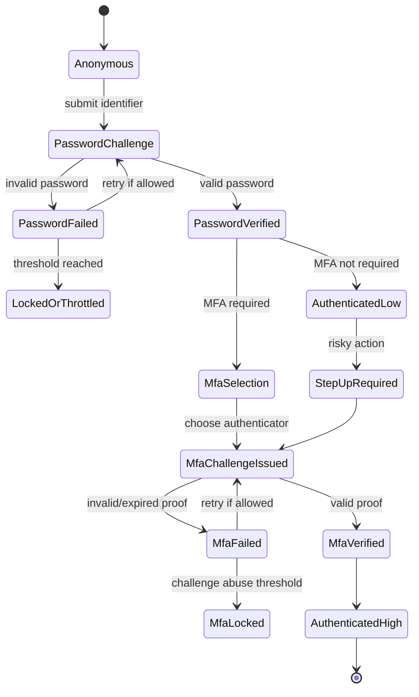
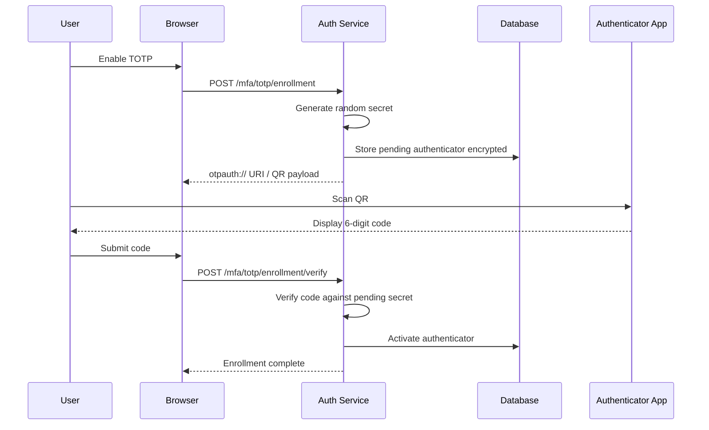
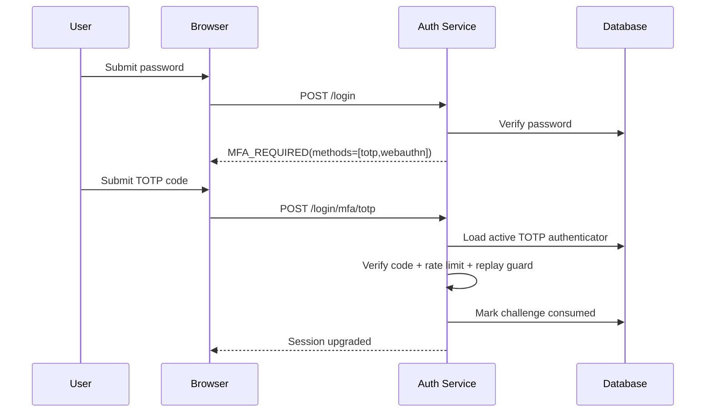
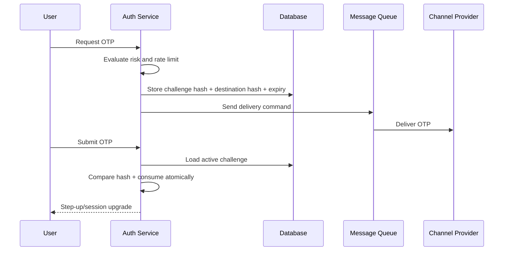
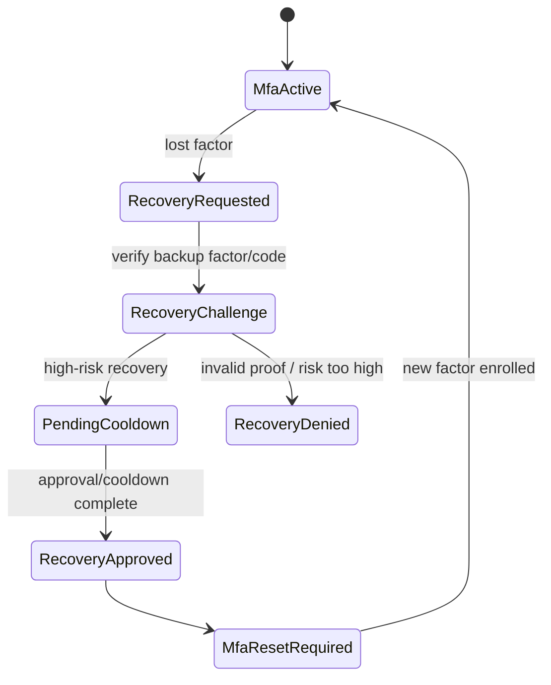
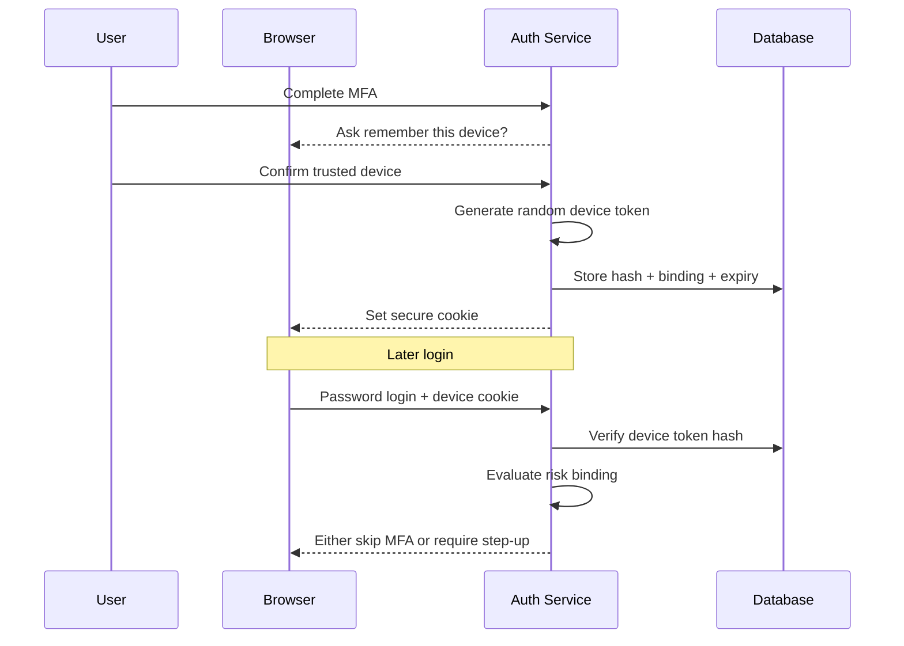
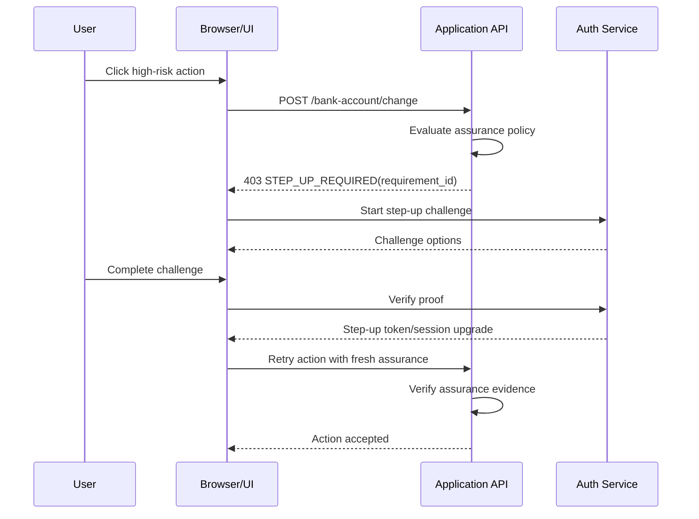
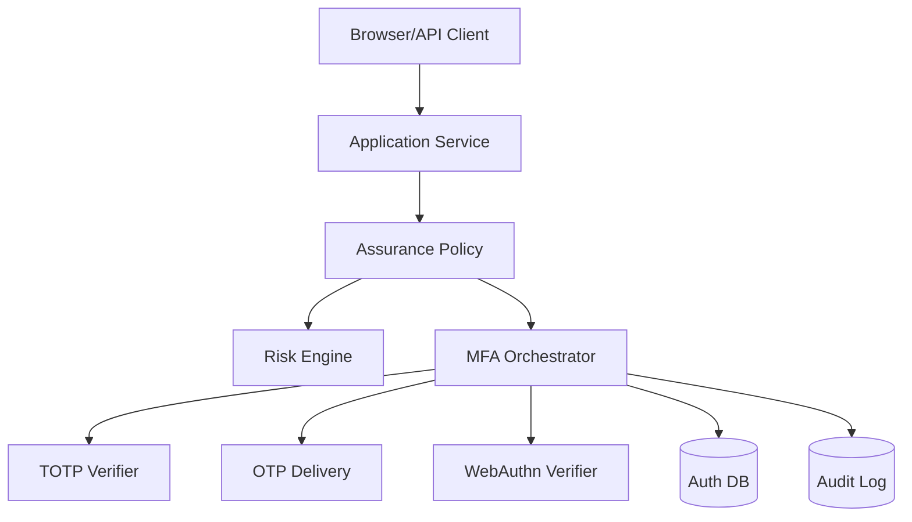

# Part 029 — MFA & Step-Up Authentication

> Target part ini: membangun MFA dan step-up authentication sebagai sistem autentikasi bertingkat, bukan sebagai checkbox “kirim OTP”. Kita akan memodelkan faktor, authenticator, challenge, recovery, trusted device, assurance, dan failure mode agar implementasi Java bisa defensible di production.

MFA sering gagal bukan karena tim tidak tahu cara membuat OTP.

MFA gagal karena tim salah memahami posisinya.

```txt
Password verifies knowledge.
MFA should raise assurance.
Step-up should bind assurance to risk and action.
Recovery must not be weaker than the protected account.
```

Kalau user memasukkan password lalu sistem mengirim kode 6 digit lewat channel yang sama-sama bisa dikuasai attacker, itu mungkin lebih baik daripada password saja, tetapi belum tentu cukup untuk sistem bernilai tinggi.

Mental model yang benar:

```txt
Authentication is not a boolean.
Authentication creates an assurance state.
Assurance can expire, degrade, or need elevation.
```

Dalam sistem enterprise, pertanyaan yang benar bukan:

```txt
Apakah user sudah login?
```

Tetapi:

```txt
Siapa subject ini?
Dengan authenticator apa dia dibuktikan?
Kapan terakhir dibuktikan?
Level assurance apa yang berlaku?
Action apa yang boleh dilakukan dengan assurance itu?
Apakah risiko saat ini mengharuskan step-up?
```

---

## 1. Problem yang Diselesaikan MFA

Password punya beberapa kelemahan struktural:

1. bisa digunakan ulang;
2. bisa ditebak;
3. bisa dicuri lewat phishing;
4. bisa bocor dari sistem lain;
5. bisa diambil malware;
6. bisa diisi otomatis oleh bot credential stuffing;
7. bisa diketahui support/admin/keluarga/rekan kerja;
8. sulit membedakan user sah dari attacker yang punya password benar.

MFA mencoba menambahkan bukti lain.

Namun MFA bukan satu jenis mekanisme. Ada beberapa kelas:

| Kelas | Contoh | Kekuatan | Risiko |
|---|---|---:|---|
| Something you know | Password, PIN | Rendah sampai sedang | Phishing, reuse, guessing |
| Something you have | TOTP app, hardware key, device cert | Sedang sampai tinggi | Device theft, backup leak, SIM swap |
| Something you are/do | Biometric local unlock | Bergantung implementasi | Tidak boleh dikirim ke server sebagai secret |
| Cryptographic possession | WebAuthn/passkey, smart card, mTLS cert | Tinggi | Recovery, device lifecycle |
| Out-of-band approval | Push approval, banking app approval | Sedang sampai tinggi | MFA fatigue, push bombing |

Yang sering salah:

```txt
MFA factor != delivery channel.
```

Email OTP bukan “faktor kepemilikan” yang kuat kalau email adalah kanal reset password utama dan sudah login di device yang sama.

SMS OTP bukan proof kuat terhadap user karena rentan SIM swap, number recycling, interception, dan social engineering.

TOTP lebih baik dari SMS/email OTP karena secret berada di authenticator app, tetapi TOTP masih bisa diphishing karena kode 6 digit bisa disalin real-time ke situs attacker.

WebAuthn/passkeys lebih kuat karena credential scoped ke origin/RP ID dan login dilakukan dengan tanda tangan challenge, bukan shared code yang diketik user.

---

## 2. Core Vocabulary

Gunakan istilah ini secara konsisten.

| Istilah | Makna |
|---|---|
| Account | Record lokal yang merepresentasikan user di sistem |
| Subject | Entitas yang diautentikasi pada saat runtime |
| Authenticator | Mekanisme/faktor yang bisa membuktikan subject |
| Factor | Kategori bukti: knowledge, possession, inherence |
| Challenge | Request sementara untuk membuktikan authenticator |
| Assurance | Tingkat keyakinan terhadap authentication event |
| Step-up | Elevasi assurance sebelum action berisiko |
| Recovery | Mekanisme mengembalikan akses saat authenticator hilang |
| Trusted device | Device/browser yang diberi perlakuan risiko lebih rendah |
| Reauthentication | Membuktikan kembali subject setelah waktu/risiko/action tertentu |

Jangan sebut semua OTP sebagai “MFA”. Lebih tepat:

```txt
OTP is one possible authenticator mechanism.
MFA is a policy outcome.
Step-up is a policy-triggered authentication transition.
```

---

## 3. Authentication Assurance State

Session tidak cukup menyimpan `authenticated = true`.

Session seharusnya membawa assurance state.

Contoh:

```java
public enum AssuranceLevel {
    ANONYMOUS,
    PASSWORD_ONLY,
    MFA_WEAK,
    MFA_STRONG,
    PHISHING_RESISTANT,
    ADMIN_REAUTHENTICATED
}
```

Lebih baik lagi, jangan hanya simpan enum. Simpan evidence.

```java
public record AuthenticationEvidence(
        UUID subjectId,
        UUID accountId,
        UUID tenantId,
        Instant authenticatedAt,
        Instant lastPasswordVerifiedAt,
        Instant lastMfaVerifiedAt,
        Set<String> authenticatorMethods,
        AssuranceLevel assuranceLevel,
        String authenticationSessionId,
        String deviceId,
        String ipAddress,
        String userAgent
) {}
```

Kenapa evidence penting?

Karena policy bisa bertanya:

```txt
Action: change payout bank account
Required:
- authenticated within last 10 minutes
- MFA method not email_otp
- phishing-resistant method preferred
- device risk not high
```

Kalau sistem hanya menyimpan `ROLE_USER`, policy seperti itu tidak bisa dibuat dengan benar.

---

## 4. Assurance is Time-Bound

Authentication bukan status permanen.

Contoh decay:

```txt
T+0m   password + TOTP verified
T+5m   user boleh melihat profile
T+20m  user masih login, tetapi butuh step-up untuk ubah email
T+8h   session idle timeout
T+30d  remember-me mungkin masih ada, tetapi assurance rendah
```

Representasi policy:

```java
public record StepUpRequirement(
        AssuranceLevel minimumLevel,
        Duration maxAge,
        Set<String> allowedMethods,
        boolean requireFreshPassword,
        boolean requirePhishingResistant
) {}
```

Contoh evaluator:

```java
public final class AssurancePolicy {

    public boolean satisfies(AuthenticationEvidence evidence,
                             StepUpRequirement requirement,
                             Instant now) {
        if (evidence.assuranceLevel().ordinal() < requirement.minimumLevel().ordinal()) {
            return false;
        }

        Instant reference = evidence.lastMfaVerifiedAt() != null
                ? evidence.lastMfaVerifiedAt()
                : evidence.authenticatedAt();

        if (reference == null || reference.plus(requirement.maxAge()).isBefore(now)) {
            return false;
        }

        if (!requirement.allowedMethods().isEmpty()) {
            boolean hasAllowed = evidence.authenticatorMethods().stream()
                    .anyMatch(requirement.allowedMethods()::contains);
            if (!hasAllowed) {
                return false;
            }
        }

        if (requirement.requirePhishingResistant()) {
            return evidence.authenticatorMethods().contains("webauthn")
                    || evidence.authenticatorMethods().contains("smart_card")
                    || evidence.authenticatorMethods().contains("certificate_bound");
        }

        return true;
    }
}
```

Ini lebih defensible daripada controller yang mengecek boolean random:

```java
if (!session.isMfaDone()) throw ...
```

---

## 5. MFA Flow sebagai State Machine

MFA harus dimodelkan sebagai state machine eksplisit.



Invariant penting:

```txt
A partially authenticated session must never be treated as fully authenticated.
```

Setelah password benar tetapi MFA belum selesai, session berada di status berbeda:

```txt
PASSWORD_VERIFIED_PENDING_MFA
```

Bukan:

```txt
AUTHENTICATED = true
```

Kalau tidak, bug umum muncul:

1. endpoint tertentu bisa diakses sebelum MFA selesai;
2. session fixation terjadi di boundary password → MFA;
3. remember-me dibuat sebelum MFA;
4. audit mencatat login sukses padahal MFA gagal;
5. attacker bisa menyelesaikan login dari challenge lama.

---

## 6. Domain Model MFA

Minimal table production-grade.

```sql
create table account_authenticator (
    id uuid primary key,
    tenant_id uuid not null,
    account_id uuid not null,
    method varchar(64) not null,
    label varchar(128),
    status varchar(32) not null,
    secret_hash bytea,
    secret_encrypted bytea,
    public_key_cose bytea,
    credential_id bytea,
    phone_e164 varchar(32),
    email varchar(320),
    added_at timestamptz not null,
    verified_at timestamptz,
    last_used_at timestamptz,
    disabled_at timestamptz,
    disabled_reason varchar(256),
    created_by_auth_event_id uuid,
    version bigint not null default 0
);

create index idx_authenticator_account
    on account_authenticator(tenant_id, account_id, status);

create unique index uq_active_webauthn_credential
    on account_authenticator(tenant_id, credential_id)
    where method = 'webauthn' and status = 'active';
```

Challenge table:

```sql
create table authentication_challenge (
    id uuid primary key,
    tenant_id uuid not null,
    account_id uuid,
    authentication_session_id uuid not null,
    method varchar(64) not null,
    purpose varchar(64) not null,
    challenge_hash bytea not null,
    destination_hash bytea,
    issued_at timestamptz not null,
    expires_at timestamptz not null,
    consumed_at timestamptz,
    failed_attempts int not null default 0,
    max_attempts int not null,
    status varchar(32) not null,
    risk_snapshot jsonb not null default '{}'::jsonb
);

create index idx_challenge_session
    on authentication_challenge(authentication_session_id, status, expires_at);
```

Recovery code table:

```sql
create table account_recovery_code (
    id uuid primary key,
    tenant_id uuid not null,
    account_id uuid not null,
    code_hash bytea not null,
    batch_id uuid not null,
    created_at timestamptz not null,
    used_at timestamptz,
    used_auth_event_id uuid,
    status varchar(32) not null
);

create index idx_recovery_code_account
    on account_recovery_code(tenant_id, account_id, status);
```

Trusted device:

```sql
create table trusted_device (
    id uuid primary key,
    tenant_id uuid not null,
    account_id uuid not null,
    device_token_hash bytea not null,
    label varchar(128),
    created_at timestamptz not null,
    last_seen_at timestamptz,
    expires_at timestamptz not null,
    revoked_at timestamptz,
    risk_binding jsonb not null default '{}'::jsonb
);

create unique index uq_trusted_device_token
    on trusted_device(tenant_id, device_token_hash)
    where revoked_at is null;
```

Catatan penting:

```txt
Do not store OTP code plaintext.
Do not store recovery code plaintext.
Do not store TOTP secret unencrypted.
Do not store trusted-device token plaintext.
```

---

## 7. MFA Method Matrix

| Method | Use Case | Strength | Weakness | Recommendation |
|---|---|---:|---|---|
| Email OTP | Low-risk account, fallback | Low | Email takeover, same channel as recovery | Avoid for high-risk MFA |
| SMS OTP | Legacy user base | Low-Medium | SIM swap, interception, number recycling | Use only as fallback/risk-based lower assurance |
| TOTP | General user MFA | Medium | Phishable, seed recovery risk | Good baseline |
| Push approval | Mobile app ecosystem | Medium | Push fatigue, approval confusion | Require number matching / transaction detail |
| Recovery codes | Account recovery | Medium | User stores poorly | Single-use, hashed, notify on use |
| WebAuthn/passkey | Passwordless/MFA | High | Recovery UX, account linking | Preferred modern method |
| Hardware security key | Admin/high-risk users | Very High | Loss, procurement | Strong admin requirement |
| Smart card/cert | Enterprise workforce | High | PKI complexity | Good for regulated enterprise |

Production policy contoh:

```txt
Default consumer user:
- TOTP or passkey recommended
- email OTP only for recovery bootstrap

Admin user:
- phishing-resistant MFA required
- recovery requires support workflow + second admin approval

Machine/service account:
- no human MFA
- use client credentials, mTLS, private_key_jwt, workload identity
```

---

## 8. TOTP Pattern

TOTP adalah OTP berbasis shared secret dan waktu. Secara umum mengikuti HOTP/TOTP: secret dibuat saat enrollment, user scan QR, authenticator app menghasilkan code berdasarkan time step, server memverifikasi code dengan window toleransi.

Flow registration:



Flow login:



### 8.1 TOTP Invariants

```txt
TOTP enrollment is not complete until the first code is verified.
A TOTP code should not be accepted repeatedly in the same time window for the same account.
TOTP secrets must be encrypted or protected with KMS/HSM-level controls.
TOTP verification must be rate-limited per account, IP, device, and challenge.
TOTP clock skew tolerance must be small and explicit.
```

### 8.2 Java TOTP Verification Shape

Jangan fokus pada library dulu. Fokus pada port interface.

```java
public interface TotpVerifier {
    boolean verify(String secretBase32, String submittedCode, Instant now);
}
```

Contoh service shape:

```java
public final class TotpMfaService {

    private final AuthenticatorRepository authenticators;
    private final ChallengeRepository challenges;
    private final TotpVerifier verifier;
    private final RateLimiter rateLimiter;
    private final AuditLogger audit;
    private final Clock clock;

    public MfaResult verifyTotp(VerifyTotpCommand command) {
        Instant now = clock.instant();

        AuthenticationChallenge challenge = challenges.findActive(command.challengeId())
                .orElseThrow(() -> MfaResult.invalid("Invalid or expired challenge").asException());

        if (challenge.isExpired(now) || challenge.isConsumed()) {
            audit.mfaFailed(command.accountId(), "totp", "expired_challenge");
            return MfaResult.invalid("Invalid or expired challenge");
        }

        rateLimiter.checkOrThrow(RateLimitKey.mfa(
                command.tenantId(), command.accountId(), command.ipAddress()));

        AccountAuthenticator authenticator = authenticators.findActiveTotp(
                command.tenantId(), command.accountId())
                .orElseThrow(() -> MfaResult.invalid("Invalid or expired challenge").asException());

        String secret = decryptSecret(authenticator.encryptedSecret());
        boolean valid = verifier.verify(secret, command.code(), now);

        if (!valid) {
            challenges.incrementFailedAttempts(challenge.id());
            audit.mfaFailed(command.accountId(), "totp", "invalid_code");
            return MfaResult.invalid("Invalid or expired challenge");
        }

        if (challenges.wasTotpTimeStepAlreadyUsed(
                command.accountId(), authenticator.id(), currentTotpStep(now))) {
            audit.mfaFailed(command.accountId(), "totp", "replay_same_step");
            return MfaResult.invalid("Invalid or expired challenge");
        }

        challenges.consume(challenge.id(), now);
        authenticators.markUsed(authenticator.id(), now);
        audit.mfaSucceeded(command.accountId(), "totp");

        return MfaResult.success(MfaEvidence.totp(authenticator.id(), now));
    }
}
```

Security details:

1. return generic message;
2. don't leak whether account has TOTP;
3. don't log submitted code;
4. don't allow unlimited retries;
5. don't accept old challenge after password reattempt;
6. bind challenge to authentication session;
7. bind challenge purpose: login, step-up, enrollment, recovery;
8. record audit event.

---

## 9. Email/SMS OTP Pattern

Email/SMS OTP sering dipakai karena mudah.

Tetapi harus diperlakukan sebagai lower assurance.

Flow:



### 9.1 OTP Code Generation

```java
public final class OtpGenerator {
    private final SecureRandom secureRandom = new SecureRandom();

    public String sixDigitCode() {
        int n = secureRandom.nextInt(1_000_000);
        return String.format("%06d", n);
    }
}
```

But generating code is the easy part.

The hard part is lifecycle.

```java
public record OtpChallenge(
        UUID id,
        UUID tenantId,
        UUID accountId,
        UUID authenticationSessionId,
        String method,
        String purpose,
        byte[] codeHash,
        byte[] destinationHash,
        Instant issuedAt,
        Instant expiresAt,
        int failedAttempts,
        int maxAttempts,
        ChallengeStatus status
) {}
```

### 9.2 Hashing OTP Codes

OTP is short. Hashing with unsalted SHA-256 is not enough if DB leaks because code space is tiny.

Use keyed hash / peppered MAC plus challenge-specific context.

```java
public final class OtpHasher {
    private final MacFactory macFactory;

    public byte[] hash(UUID challengeId, String code) {
        Mac mac = macFactory.hmacSha256();
        mac.update(challengeId.toString().getBytes(StandardCharsets.UTF_8));
        mac.update((byte) ':');
        mac.update(code.getBytes(StandardCharsets.UTF_8));
        return mac.doFinal();
    }

    public boolean matches(UUID challengeId, String submitted, byte[] expected) {
        byte[] actual = hash(challengeId, submitted);
        return MessageDigest.isEqual(actual, expected);
    }
}
```

### 9.3 Atomic Consume

Do not verify then consume in two separate non-atomic steps.

Bad:

```txt
select challenge
if code valid:
  update consumed_at
```

Race:

```txt
Request A verifies code
Request B verifies same code
Both update consumed_at
```

Use atomic transition:

```sql
update authentication_challenge
set consumed_at = now(), status = 'consumed'
where id = :challenge_id
  and status = 'active'
  and consumed_at is null
  and expires_at > now();
```

Then check affected row count.

---

## 10. Recovery Codes Pattern

Recovery codes are MFA bypass mechanisms.

Treat them as high-value credentials.

Good recovery code:

```txt
single-use
random
long enough
shown once
stored hashed
rate-limited
notified on use
regenerated as batch
revocable
visible in audit
```

Example format:

```txt
7J9K-M4Q2-P8RT
```

But format is UX. Entropy is what matters.

Java generator:

```java
public final class RecoveryCodeGenerator {
    private static final char[] ALPHABET = "ABCDEFGHJKLMNPQRSTUVWXYZ23456789".toCharArray();
    private final SecureRandom random = new SecureRandom();

    public String generate() {
        StringBuilder out = new StringBuilder();
        for (int group = 0; group < 3; group++) {
            if (group > 0) out.append('-');
            for (int i = 0; i < 4; i++) {
                out.append(ALPHABET[random.nextInt(ALPHABET.length)]);
            }
        }
        return out.toString();
    }
}
```

But for high-value accounts, use longer codes.

Recovery code verification:

```java
public RecoveryResult useRecoveryCode(UseRecoveryCodeCommand command) {
    rateLimiter.checkOrThrow(RateLimitKey.recoveryCode(
            command.tenantId(), command.accountId(), command.ipAddress()));

    List<RecoveryCodeRecord> active = repository.findActive(command.tenantId(), command.accountId());

    for (RecoveryCodeRecord record : active) {
        if (passwordEncoder.matches(command.code(), record.hash())) {
            boolean consumed = repository.consume(record.id(), command.authEventId(), clock.instant());
            if (!consumed) {
                return RecoveryResult.invalid();
            }

            audit.recoveryCodeUsed(command.accountId(), command.ipAddress());
            notifier.notifyRecoveryCodeUsed(command.accountId());
            return RecoveryResult.success(record.id());
        }
    }

    audit.recoveryCodeFailed(command.accountId(), command.ipAddress());
    return RecoveryResult.invalid();
}
```

Notice:

```txt
Recovery code success should notify user immediately.
Recovery code use should often force user to regenerate remaining codes.
Recovery code should not silently disable all MFA.
```

---

## 11. MFA Recovery is the Real Attack Surface

MFA makes login stronger, but recovery often makes system weaker.

Common broken recovery:

```txt
User loses TOTP.
Support asks birth date.
Support disables MFA.
Attacker logs in with stolen password.
```

That means effective security is not MFA strength.

```txt
Effective security = min(login strength, recovery strength)
```

Recovery policy by account class:

| Account Class | Allowed Recovery |
|---|---|
| Low-risk consumer | Recovery codes, verified email, cooldown |
| Business user | Recovery codes + admin approval |
| Tenant admin | Recovery codes + second tenant admin approval + cooldown |
| Internal operator | Hardware key backup + manager approval + security review |
| Break-glass account | Offline vault process, no self-service recovery |

Recovery state machine:



Important invariant:

```txt
Recovery should restore access into a constrained state, not directly into full assurance.
```

After recovery:

1. force password change if password compromise suspected;
2. revoke old sessions;
3. revoke old remembered devices;
4. require new MFA enrollment;
5. notify all verified channels;
6. delay high-risk actions for some accounts.

---

## 12. Trusted Device Pattern

Trusted device reduces MFA friction.

It must not become a silent second password.

Flow:



Trusted device token properties:

```txt
random >= 128 bits
stored only as hash/MAC
cookie HttpOnly + Secure + SameSite
bounded lifetime
revocable
bound to account + tenant
optionally bound to device fingerprint/risk signals
not accepted for high-risk actions without fresh step-up
```

Cookie example:

```http
Set-Cookie: td=opaque_random_value; Path=/; HttpOnly; Secure; SameSite=Lax; Max-Age=2592000
```

Important: device fingerprint is not a secret. It is risk context.

```txt
Device fingerprint can help risk scoring.
Device fingerprint must not replace authentication.
```

---

## 13. Step-Up Authentication Pattern

Step-up is not “MFA at login”.

Step-up means:

```txt
Before a sensitive action, require fresh authentication evidence with sufficient assurance.
```

Sensitive actions:

1. change password;
2. change email/phone;
3. disable MFA;
4. create API key;
5. view recovery codes;
6. add payout/bank account;
7. approve enforcement action;
8. export sensitive data;
9. impersonate user;
10. modify tenant security settings;
11. change authorization role;
12. approve irreversible workflow transition.

Step-up flow:



Step-up can be implemented as:

1. upgraded server-side session attribute;
2. short-lived step-up token;
3. transaction-bound approval record;
4. OAuth acr/amr claims from IdP;
5. WebAuthn assertion for action confirmation.

For high-risk actions, prefer transaction-bound challenge.

Example:

```txt
Approve transfer of $10,000 to ACME Bank ****1234
```

Not:

```txt
Enter MFA code
```

---

## 14. Spring Security Implementation Shape

There are multiple implementation choices.

Do not force MFA into `ROLE_MFA` unless you fully understand the consequence. Role is authorization attribute. MFA is authentication evidence.

Better: store evidence inside principal/session.

```java
public final class AuthenticatedUserPrincipal implements UserDetails {
    private final UUID accountId;
    private final UUID tenantId;
    private final String username;
    private final Set<GrantedAuthority> authorities;
    private final AuthenticationEvidence evidence;

    public AuthenticationEvidence evidence() {
        return evidence;
    }

    // UserDetails methods omitted
}
```

Policy check:

```java
@Component
public final class StepUpGuard {

    private final AssurancePolicy assurancePolicy;
    private final Clock clock;

    public void require(Authentication authentication, StepUpRequirement requirement) {
        AuthenticatedUserPrincipal principal =
                (AuthenticatedUserPrincipal) authentication.getPrincipal();

        if (!assurancePolicy.satisfies(principal.evidence(), requirement, clock.instant())) {
            throw new StepUpRequiredException(requirement);
        }
    }
}
```

Controller:

```java
@PostMapping("/tenant/{tenantId}/api-keys")
public ApiKeyResponse createApiKey(@PathVariable UUID tenantId,
                                   @RequestBody CreateApiKeyRequest request,
                                   Authentication authentication) {
    stepUpGuard.require(authentication, StepUpRequirements.CREATE_API_KEY);
    return apiKeyService.create(tenantId, request, authentication);
}
```

Exception handler:

```java
@RestControllerAdvice
public final class StepUpExceptionHandler {

    @ExceptionHandler(StepUpRequiredException.class)
    ResponseEntity<StepUpRequiredResponse> handle(StepUpRequiredException ex) {
        return ResponseEntity.status(HttpStatus.FORBIDDEN).body(
                new StepUpRequiredResponse(
                        "STEP_UP_REQUIRED",
                        ex.requirement().minimumLevel().name(),
                        ex.requirement().maxAge().toSeconds(),
                        ex.requirement().allowedMethods()
                )
        );
    }
}
```

Session upgrade after MFA:

```java
public void upgradeCurrentSession(MfaEvidence mfaEvidence) {
    Authentication current = SecurityContextHolder.getContext().getAuthentication();
    AuthenticatedUserPrincipal old = (AuthenticatedUserPrincipal) current.getPrincipal();

    AuthenticatedUserPrincipal upgraded = old.withEvidence(
            old.evidence().withMfa(
                    mfaEvidence.method(),
                    mfaEvidence.verifiedAt(),
                    mfaEvidence.toAssuranceLevel()
            )
    );

    Authentication upgradedAuth = new UsernamePasswordAuthenticationToken(
            upgraded,
            current.getCredentials(),
            current.getAuthorities()
    );

    SecurityContextHolder.getContext().setAuthentication(upgradedAuth);
}
```

Also persist session repository if server-side session is externalized.

---

## 15. Spring Security Filter Shape for Partial Authentication

A common architecture:

```txt
/login/password -> creates partial auth session
/login/mfa/*    -> completes MFA and upgrades session
/protected/**   -> requires full authentication
```

Filter idea:

```java
public final class MfaRequiredFilter extends OncePerRequestFilter {

    private final RequestMatcher protectedMatcher;

    @Override
    protected void doFilterInternal(HttpServletRequest request,
                                    HttpServletResponse response,
                                    FilterChain chain)
            throws ServletException, IOException {

        Authentication authentication = SecurityContextHolder.getContext().getAuthentication();

        if (requiresFullAuth(request) && isPartial(authentication)) {
            response.setStatus(HttpServletResponse.SC_FORBIDDEN);
            response.setContentType("application/json");
            response.getWriter().write("{\"code\":\"MFA_REQUIRED\"}");
            return;
        }

        chain.doFilter(request, response);
    }

    private boolean isPartial(Authentication authentication) {
        if (authentication == null || !authentication.isAuthenticated()) {
            return false;
        }
        Object principal = authentication.getPrincipal();
        return principal instanceof PartialAuthenticationPrincipal;
    }

    private boolean requiresFullAuth(HttpServletRequest request) {
        return protectedMatcher.matches(request);
    }
}
```

But avoid complicated partial-auth if possible. Many systems are cleaner with separate `authentication_session` stored server-side until MFA completes, and only create normal application session after MFA success.

Preferred pattern:

```txt
Password correct -> auth_session_id cookie with limited scope
MFA correct      -> rotate session -> full application session
```

Do not let partial session hit normal application endpoints.

---

## 16. Jakarta Security / JAX-RS Shape

In Jakarta Security, MFA can be implemented around `HttpAuthenticationMechanism`, but be careful: the API validates credentials; complex MFA orchestration often belongs in application auth service plus filters/interceptors.

Conceptual mechanism:

```java
@ApplicationScoped
public class MfaAwareAuthenticationMechanism implements HttpAuthenticationMechanism {

    @Inject IdentityStoreHandler identityStoreHandler;
    @Inject AuthenticationSessionService sessions;

    @Override
    public AuthenticationStatus validateRequest(HttpServletRequest request,
                                                HttpServletResponse response,
                                                HttpMessageContext context)
            throws AuthenticationException {

        if (isLoginPasswordRequest(request)) {
            Credential credential = extractPasswordCredential(request);
            CredentialValidationResult result = identityStoreHandler.validate(credential);

            if (result.getStatus() != CredentialValidationResult.Status.VALID) {
                return context.responseUnauthorized();
            }

            if (mfaRequired(result)) {
                sessions.createPartialSession(result, request, response);
                return context.responseUnauthorized();
            }

            return context.notifyContainerAboutLogin(
                    result.getCallerPrincipal(),
                    result.getCallerGroups()
            );
        }

        return context.doNothing();
    }
}
```

For JAX-RS high-risk endpoints, use annotation + filter:

```java
@NameBinding
@Retention(RetentionPolicy.RUNTIME)
@Target({ElementType.TYPE, ElementType.METHOD})
public @interface RequiresStepUp {
    String value();
}
```

```java
@Provider
@RequiresStepUp("CREATE_API_KEY")
public final class StepUpContainerRequestFilter implements ContainerRequestFilter {

    @Inject StepUpPolicyService policies;
    @Context SecurityContext securityContext;

    @Override
    public void filter(ContainerRequestContext requestContext) {
        if (!policies.currentSubjectSatisfies("CREATE_API_KEY", securityContext)) {
            throw new ForbiddenException("STEP_UP_REQUIRED");
        }
    }
}
```

---

## 17. Adaptive MFA / Risk-Based Challenge

Adaptive MFA uses risk signals to decide when challenge is required.

Signals:

1. new device;
2. new country/ASN;
3. impossible travel;
4. unusual time;
5. anonymous proxy/Tor/datacenter IP;
6. high failed attempt velocity;
7. password recently reset;
8. email recently changed;
9. session age;
10. tenant policy;
11. account role;
12. target action sensitivity;
13. known breached credential;
14. user agent anomaly;
15. device cookie absent/revoked;
16. admin impersonation mode.

Risk evaluator:

```java
public record RiskDecision(
        RiskLevel level,
        boolean requireMfa,
        boolean requirePhishingResistant,
        Set<String> allowedMethods,
        List<String> reasons
) {}
```

Example:

```java
public RiskDecision evaluate(LoginContext ctx) {
    List<String> reasons = new ArrayList<>();
    int score = 0;

    if (ctx.newDevice()) {
        score += 30;
        reasons.add("new_device");
    }
    if (ctx.impossibleTravel()) {
        score += 50;
        reasons.add("impossible_travel");
    }
    if (ctx.accountRole().isAdmin()) {
        score += 40;
        reasons.add("admin_account");
    }
    if (ctx.recentPasswordReset()) {
        score += 25;
        reasons.add("recent_password_reset");
    }

    if (score >= 80) {
        return new RiskDecision(
                RiskLevel.HIGH,
                true,
                true,
                Set.of("webauthn", "hardware_key"),
                reasons
        );
    }

    if (score >= 30) {
        return new RiskDecision(
                RiskLevel.MEDIUM,
                true,
                false,
                Set.of("totp", "webauthn", "recovery_code"),
                reasons
        );
    }

    return new RiskDecision(RiskLevel.LOW, false, false, Set.of(), reasons);
}
```

Important:

```txt
Risk engine must be explainable enough for incident review.
Risk score must not become untestable magic.
Risk challenge must be observable.
```

---

## 18. Challenge Orchestration

A robust challenge system separates:

1. policy decision;
2. challenge issuance;
3. proof verification;
4. assurance upgrade;
5. audit event;
6. side-effect continuation.

Component diagram:



Challenge command:

```java
public record StartChallengeCommand(
        UUID tenantId,
        UUID accountId,
        UUID authenticationSessionId,
        ChallengePurpose purpose,
        Set<String> allowedMethods,
        RiskDecision riskDecision,
        String ipAddress,
        String userAgent
) {}
```

Challenge response:

```java
public record ChallengeStarted(
        UUID challengeId,
        ChallengePurpose purpose,
        List<ChallengeOption> options,
        Instant expiresAt
) {}
```

Do not let client choose arbitrary method outside policy.

Bad:

```http
POST /mfa/challenge
{ "method": "email_otp" }
```

Better:

```http
POST /mfa/challenge
{ "requirementId": "create_api_key" }
```

Server decides allowed methods.

---

## 19. MFA Enrollment Policy

MFA enrollment is security-sensitive.

Enrollment should require existing authentication and often step-up.

```txt
To add MFA factor:
- require current password or current MFA
- create pending authenticator
- verify authenticator once
- activate authenticator
- notify user
```

To disable factor:

```txt
To disable MFA factor:
- require fresh step-up with another factor
- disallow removing last strong factor unless recovery policy satisfied
- notify user
- audit event
- revoke trusted devices if risk high
```

Prevent last-factor lockout:

```java
public void disableAuthenticator(UUID accountId, UUID authenticatorId) {
    List<AccountAuthenticator> active = repo.findActive(accountId);

    AccountAuthenticator target = active.stream()
            .filter(a -> a.id().equals(authenticatorId))
            .findFirst()
            .orElseThrow(NotFoundException::new);

    long remainingStrong = active.stream()
            .filter(a -> !a.id().equals(authenticatorId))
            .filter(AccountAuthenticator::isStrongMfa)
            .count();

    if (target.isStrongMfa() && remainingStrong == 0) {
        throw new PolicyViolationException("Cannot remove last strong MFA factor");
    }

    repo.disable(authenticatorId, clock.instant());
    audit.authenticatorDisabled(accountId, authenticatorId, target.method());
}
```

---

## 20. Push MFA and MFA Fatigue

Push approval is usable but dangerous if implemented as “approve/deny”.

Attack:

```txt
Attacker has password.
Attacker triggers repeated push approvals.
User gets tired/confused.
User taps approve.
```

Mitigations:

1. number matching;
2. transaction details;
3. rate limiting push prompts;
4. deny-with-report-abuse;
5. require biometric local unlock;
6. device binding;
7. challenge cooldown;
8. alert on prompt storm;
9. do not fallback silently to SMS;
10. admin accounts require phishing-resistant method instead.

Number matching flow:

```txt
Login screen shows: 42
Mobile app asks: choose number shown on browser
```

This reduces blind approval.

---

## 21. OAuth/OIDC `amr` and `acr`

In federated systems, authentication evidence may arrive from IdP.

Common claims:

```json
{
  "iss": "https://idp.example.com",
  "sub": "248289761001",
  "aud": "regulatory-case-platform",
  "auth_time": 1783098831,
  "acr": "urn:example:aal2",
  "amr": ["pwd", "otp"]
}
```

Use carefully:

| Claim | Meaning |
|---|---|
| `auth_time` | When end-user authentication occurred |
| `amr` | Authentication Methods References |
| `acr` | Authentication Context Class Reference |

Do not assume all IdPs use same semantics.

Create tenant trust mapping:

```sql
create table idp_assurance_mapping (
    tenant_id uuid not null,
    issuer varchar(512) not null,
    acr varchar(256),
    amr_required jsonb not null,
    local_assurance varchar(64) not null,
    primary key (tenant_id, issuer, acr)
);
```

Example:

```txt
issuer=https://corp-idp.example.com
acr=urn:corp:aal2
amr contains [pwd, fido]
=> local assurance PHISHING_RESISTANT
```

Without mapping, `acr` is just a string.

---

## 22. MFA for Admin and Operator Workflows

For admin workflows, MFA must integrate with authorization and audit.

Sensitive operations:

1. user impersonation;
2. tenant security config change;
3. role assignment;
4. enforcement case closure;
5. evidence export;
6. legal hold modification;
7. data deletion;
8. API key creation;
9. workflow override;
10. production break-glass.

Pattern:

```txt
Action request -> authorization check -> assurance check -> step-up -> action decision -> audit envelope
```

Audit envelope example:

```json
{
  "eventType": "TENANT_ADMIN_ROLE_ASSIGNED",
  "actorAccountId": "...",
  "targetAccountId": "...",
  "tenantId": "...",
  "authorizationDecisionId": "...",
  "authenticationEventId": "...",
  "assuranceLevel": "PHISHING_RESISTANT",
  "authMethods": ["pwd", "webauthn"],
  "freshAuthAgeSeconds": 84,
  "riskReasons": ["admin_action"],
  "ipAddress": "203.0.113.10",
  "userAgentHash": "...",
  "createdAt": "2026-07-03T10:00:00Z"
}
```

Authentication evidence should be part of audit, not separate trivia.

---

## 23. Transaction-Bound Step-Up

For high-value operations, ordinary MFA may be insufficient.

Problem:

```txt
User signs in with MFA.
Malware/browser injection changes target action.
Server only knows MFA happened, not what user approved.
```

Better:

```txt
Challenge includes action details.
User approves that exact action.
Server binds proof to action payload hash.
```

Domain:

```sql
create table step_up_authorization (
    id uuid primary key,
    tenant_id uuid not null,
    account_id uuid not null,
    action_type varchar(128) not null,
    action_hash bytea not null,
    challenge_id uuid not null,
    assurance_level varchar(64) not null,
    authorized_at timestamptz not null,
    expires_at timestamptz not null,
    consumed_at timestamptz
);
```

Action hash:

```java
public byte[] actionHash(String actionType, Object canonicalPayload) {
    byte[] payload = canonicalJson.serialize(canonicalPayload);
    MessageDigest sha256 = MessageDigest.getInstance("SHA-256");
    sha256.update(actionType.getBytes(StandardCharsets.UTF_8));
    sha256.update((byte) 0);
    sha256.update(payload);
    return sha256.digest();
}
```

Invariant:

```txt
A step-up authorization is valid only for the action payload it was created for.
```

---

## 24. Rate Limiting MFA

MFA can be abused.

Abuse types:

1. brute force OTP;
2. SMS cost explosion;
3. email spam;
4. push bombing;
5. recovery code guessing;
6. support workflow flooding;
7. trusted-device token stuffing.

Rate limit dimensions:

```txt
account_id
identifier_hash
ip / subnet
device_id
tenant_id
challenge_id
method
phone/email destination hash
```

Example Redis keys:

```txt
rl:mfa:verify:tenant:{tenantId}:account:{accountId}
rl:mfa:verify:tenant:{tenantId}:ip:{ipHash}
rl:mfa:send:tenant:{tenantId}:dest:{destHash}
rl:mfa:push:tenant:{tenantId}:account:{accountId}
```

Failure policy:

```txt
invalid OTP attempts > 5 per challenge => challenge locked
OTP send > 3 per 15m per destination => suppress send
MFA failures after valid password > threshold => require recovery or delay
push prompts > 3 per login => block and alert
```

Do not lock the entire account too aggressively, or attacker can create denial of service.

---

## 25. Observability

MFA must be observable.

Metrics:

```txt
auth_mfa_challenge_started_total{method,purpose,tenant}
auth_mfa_challenge_verified_total{method,purpose,tenant}
auth_mfa_challenge_failed_total{method,reason,tenant}
auth_mfa_recovery_code_used_total{tenant}
auth_mfa_step_up_required_total{action,tenant}
auth_mfa_step_up_completed_total{action,method,tenant}
auth_mfa_trusted_device_used_total{tenant}
auth_mfa_push_denied_total{tenant}
auth_mfa_delivery_failed_total{method,provider}
```

Logs:

```json
{
  "event": "mfa.challenge.failed",
  "tenantId": "...",
  "accountId": "...",
  "method": "totp",
  "purpose": "login",
  "reason": "invalid_code",
  "challengeId": "...",
  "ipHash": "...",
  "userAgentHash": "...",
  "riskLevel": "medium",
  "timestamp": "2026-07-03T10:10:00Z"
}
```

Never log:

1. OTP code;
2. TOTP secret;
3. recovery code;
4. trusted device token;
5. full phone/email if not needed;
6. raw biometric or authenticator secret.

Alert examples:

```txt
MFA verification failure spike by tenant
Push prompt storm for account
Recovery code use by admin
MFA disabled for tenant admin
High-risk action completed with weak assurance
Trusted-device use from impossible-travel location
```

---

## 26. Testing Strategy

Unit tests:

1. TOTP accepts current time window;
2. TOTP rejects wrong code;
3. TOTP rejects replay in same step if policy requires;
4. OTP challenge expires;
5. OTP consumed atomically;
6. recovery code single-use;
7. last strong factor cannot be removed;
8. step-up max age enforced;
9. trusted-device token hash verified;
10. risk policy selects correct method set.

Integration tests:

1. password success returns MFA required;
2. partial-auth cannot access protected endpoint;
3. successful MFA rotates/upgrades session;
4. invalid MFA returns generic error;
5. rate limit blocks repeated invalid OTP;
6. disabling MFA requires fresh step-up;
7. recovery code use notifies user;
8. high-risk endpoint returns `STEP_UP_REQUIRED`;
9. step-up token cannot be reused for different action;
10. audit event includes assurance evidence.

Race tests:

1. same OTP submitted concurrently;
2. same recovery code submitted concurrently;
3. disable factor while login challenge active;
4. trusted-device revoked while login in progress;
5. session upgraded in two concurrent requests.

Security regression tests:

```txt
No endpoint accepts PartialAuthenticationPrincipal except MFA endpoints.
No MFA code appears in logs.
No MFA secret appears in API response after enrollment screen.
No challenge can be verified after expiry.
No challenge from tenant A works in tenant B.
No step-up from action A authorizes action B.
```

---

## 27. Failure Modes

### 27.1 MFA Bypass via Partial Session

Symptom:

```txt
Password correct creates full session.
MFA page is shown by UI only.
API does not enforce MFA server-side.
```

Fix:

```txt
Do not create full session before MFA.
Or enforce partial-auth denylist/allowlist server-side.
```

### 27.2 Weak Recovery Nullifies Strong MFA

Symptom:

```txt
Admin uses hardware key.
Support can disable MFA after email verification only.
```

Fix:

```txt
Recovery assurance >= login assurance for high-risk accounts.
```

### 27.3 OTP Brute Force

Symptom:

```txt
6-digit OTP with unlimited retries.
```

Fix:

```txt
Challenge max attempts + account/IP/destination throttling + short TTL.
```

### 27.4 MFA Fatigue

Symptom:

```txt
Push prompt repeatedly sent until user approves.
```

Fix:

```txt
Number matching + prompt limit + report abuse + alert.
```

### 27.5 Trusted Device Becomes Permanent Bypass

Symptom:

```txt
Remember device token valid forever and enough for admin actions.
```

Fix:

```txt
Bounded lifetime + revocation + risk binding + never enough for high-risk action.
```

### 27.6 Tenant Confusion

Symptom:

```txt
MFA challenge issued under tenant A accepted under tenant B.
```

Fix:

```txt
Tenant id in every challenge, authenticator, session, and verification query.
```

### 27.7 Lost Device Lockout

Symptom:

```txt
User enrolled one authenticator. Device lost. No recovery path.
```

Fix:

```txt
Require backup method/recovery codes during enrollment.
```

### 27.8 Step-Up Not Fresh

Symptom:

```txt
User performed MFA 12 hours ago; still allowed to change payout account.
```

Fix:

```txt
Sensitive actions require max-age-bound assurance.
```

---

## 28. Production Checklist

MFA readiness:

```txt
[ ] MFA methods are classified by assurance strength.
[ ] Partial authentication cannot access protected endpoints.
[ ] Challenge records are tenant-bound and session-bound.
[ ] OTP/recovery codes are never stored plaintext.
[ ] TOTP secrets are encrypted/protected.
[ ] Verification is rate-limited by account/IP/challenge/destination.
[ ] Recovery code is single-use and audited.
[ ] Recovery does not silently disable all MFA.
[ ] Trusted device token is random, hashed, expiring, revocable.
[ ] High-risk actions require fresh step-up.
[ ] Step-up evidence includes method and timestamp.
[ ] Sensitive step-up can be action-bound.
[ ] All MFA events are auditable.
[ ] MFA disable/add/change requires fresh verification.
[ ] Last strong factor cannot be removed accidentally.
[ ] Admin users require phishing-resistant MFA where feasible.
[ ] OAuth/OIDC acr/amr mapping is tenant-specific.
[ ] MFA secrets/codes/tokens are redacted from logs.
[ ] Incident runbook exists for authenticator compromise.
```

---

## 29. What Top Engineers Internalize

MFA is not a UI screen.

MFA is a system of assurance transitions.

The hard parts are not QR code generation or sending SMS. The hard parts are:

1. partial authentication boundary;
2. authenticator lifecycle;
3. recovery strength;
4. step-up freshness;
5. tenant binding;
6. rate limiting;
7. auditability;
8. phishing resistance;
9. transaction binding;
10. operational recovery.

A mature authentication system does not ask:

```txt
Did MFA happen?
```

It asks:

```txt
Which subject was authenticated?
Which authenticator proved it?
At what time?
At what assurance level?
For what purpose?
Under what risk context?
Is that evidence sufficient for this action now?
```

That is the difference between “MFA enabled” and authentication engineering.

---

## 30. References

- NIST SP 800-63B-4, Digital Identity Guidelines: Authentication and Authenticator Management
- OWASP Authentication Cheat Sheet
- OWASP Multifactor Authentication Cheat Sheet
- OWASP Web Security Testing Guide: Testing Multi-Factor Authentication
- RFC 4226 — HOTP: An HMAC-Based One-Time Password Algorithm
- RFC 6238 — TOTP: Time-Based One-Time Password Algorithm
- RFC 8176 — Authentication Method Reference Values
- OpenID Connect Core 1.0
- Spring Security Reference Documentation
- Jakarta Security 4.0 Specification
