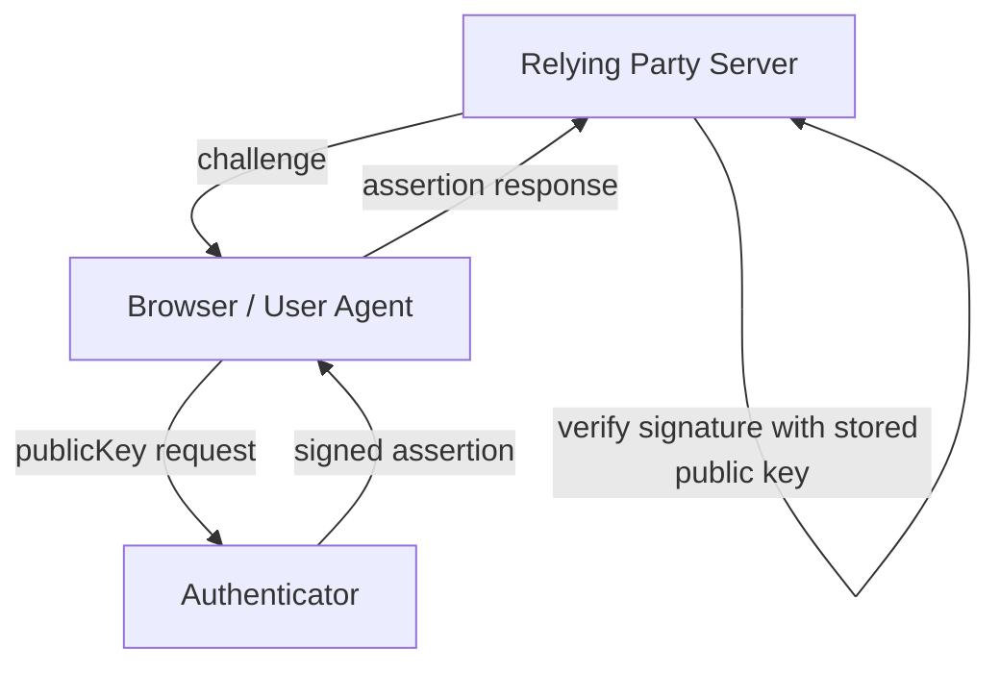
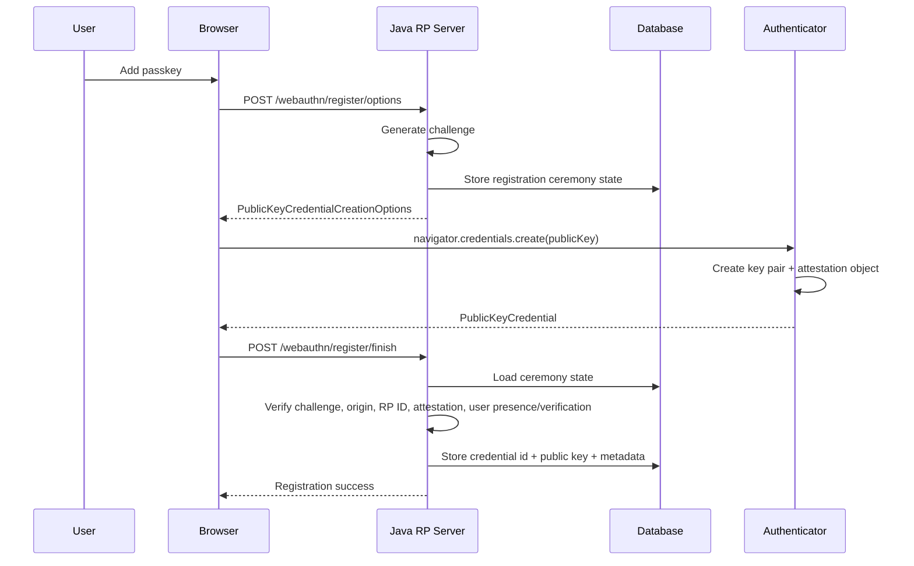
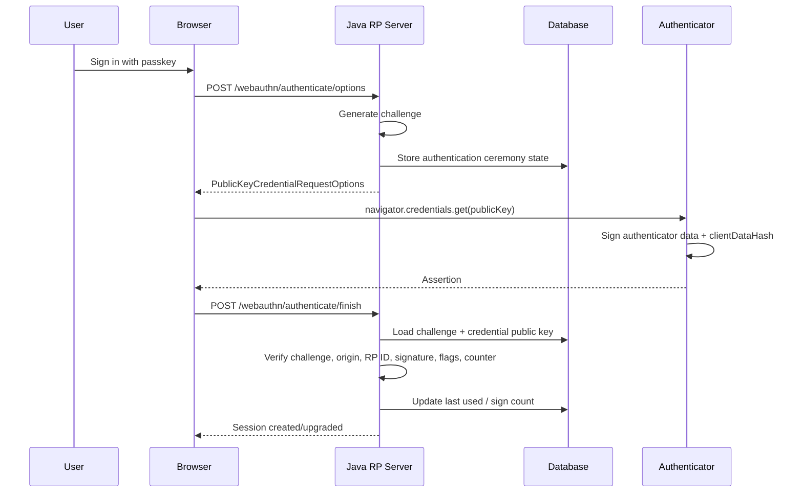
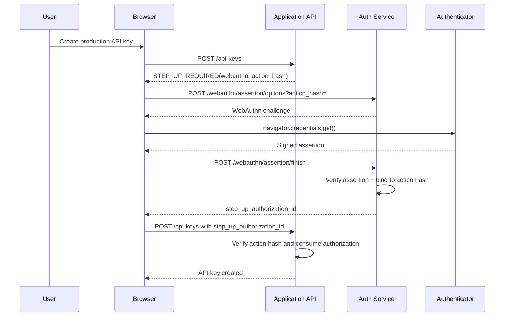

# Part 030 — WebAuthn & Passkeys

> Target part ini: memahami WebAuthn/passkeys sebagai public-key authentication system, bukan “login pakai fingerprint”. Kita akan membedah relying party, browser/client, authenticator, credential, registration ceremony, authentication ceremony, server-side verification, Java integration, recovery, observability, dan failure modes.

Passkey bukan magic.

Passkey adalah credential WebAuthn yang dikelola authenticator. Saat login, server mengirim challenge. Authenticator menandatangani challenge dengan private key. Server memverifikasi signature dengan public key yang pernah didaftarkan.

Mental model:

```txt
Password login:
  User sends shared secret to server.

WebAuthn login:
  Server sends challenge to user agent.
  Authenticator signs challenge with private key.
  Server verifies signature with stored public key.
```

Perubahan fundamental:

```txt
No shared password secret crosses the network.
Private key does not leave authenticator.
Credential is scoped to relying party identity.
Authentication is origin-aware.
```

Itulah mengapa WebAuthn/passkeys dapat menjadi phishing-resistant dibanding OTP yang bisa diketik ke situs attacker.

---

## 1. Vocabulary

| Istilah | Makna |
|---|---|
| Relying Party / RP | Aplikasi/server yang menerima WebAuthn authentication |
| RP ID | Domain scope untuk credential, misalnya `example.com` |
| Origin | Origin browser, misalnya `https://app.example.com` |
| User Agent / Client | Browser/platform yang menjalankan WebAuthn API |
| Authenticator | Device/software yang membuat dan memakai private key |
| Platform Authenticator | Built into device/OS, misalnya device passkey |
| Roaming Authenticator | External security key, misalnya USB/NFC/BLE key |
| Credential ID | Identifier credential public-key yang disimpan server |
| Public Key | Kunci publik credential, disimpan server |
| Private Key | Kunci privat, tetap di authenticator/provider |
| Challenge | Random nonce dari server untuk mencegah replay |
| Attestation | Bukti tentang authenticator saat registration, opsional/tergantung policy |
| Assertion | Bukti login: signature atas challenge/client data/authenticator data |
| User Presence / UP | User hadir, misalnya touch key |
| User Verification / UV | User diverifikasi lokal, misalnya biometric/PIN |
| Discoverable Credential | Credential yang bisa ditemukan tanpa server memberi credential ID; basis passkey UX |
| Resident Key | Istilah historis terkait discoverable credential |
| Signature Counter | Counter untuk membantu mendeteksi cloned authenticator pada beberapa tipe authenticator |

Jangan jelaskan ke user akhir dengan istilah “private key”. Tetapi engineer harus paham ini agar tidak membuat model data salah.

---

## 2. Why WebAuthn is Different

Password, OTP, dan recovery code adalah shared secrets atau copyable codes.

WebAuthn menggunakan asymmetric cryptography.



Security properties:

1. server tidak menyimpan password/passkey private secret;
2. credential scoped ke RP ID;
3. browser memasukkan origin ke client data;
4. challenge mencegah replay;
5. user presence/verification bisa diwajibkan;
6. phishing proxy lebih sulit karena RP ID/origin binding;
7. public key leak tidak cukup untuk login;
8. passkey bisa menjadi passwordless atau MFA factor.

Namun WebAuthn bukan silver bullet.

Masalah tetap ada:

1. account recovery;
2. credential sync policy;
3. device loss;
4. browser/platform compatibility;
5. enterprise attestation policy;
6. multi-tenant RP ID design;
7. account linking;
8. admin support workflows;
9. user education;
10. rollback/fallback security.

---

## 3. Registration Ceremony

Registration creates a credential.

Server membuat options, browser memanggil `navigator.credentials.create()`, authenticator membuat key pair, server memverifikasi response, lalu menyimpan public key dan credential metadata.



Important invariant:

```txt
A credential is not registered until server verifies the registration response.
```

Do not store credential just because browser returned something.

---

## 4. Authentication Ceremony

Authentication uses existing credential.



Important invariant:

```txt
An assertion proves possession of a private key for a registered credential under a specific challenge and origin.
```

---

## 5. RP ID and Origin Model

This is one of the most important design choices.

Example:

```txt
Origin: https://app.example.com
RP ID:  example.com
```

Credential scoped to RP ID can be used by eligible origins under that domain depending on browser rules and effective domain matching.

Common designs:

| Architecture | RP ID | Notes |
|---|---|---|
| Single app | `app.example.com` | Tight scope, simple |
| Multiple subapps | `example.com` | Allows use across `app.example.com`, `admin.example.com` if policy allows |
| Multi-tenant subdomain | `example.com` or tenant-specific | Be careful with tenant isolation |
| Custom domains | customer domain | Harder; requires dynamic RP config |
| Native/mobile | platform-specific integration | Needs explicit platform consideration |

Bad decision:

```txt
Use RP ID too broad without controlling all subdomains.
```

If `example.com` is RP ID but untrusted teams can host arbitrary apps under subdomains, origin/RP trust gets complicated.

Good principle:

```txt
RP ID should represent a security boundary you control.
```

---

## 6. Server-Side State

Registration ceremony state:

```sql
create table webauthn_registration_challenge (
    id uuid primary key,
    tenant_id uuid not null,
    account_id uuid not null,
    ceremony_id uuid not null,
    challenge_hash bytea not null,
    rp_id varchar(253) not null,
    origin varchar(512) not null,
    user_handle bytea not null,
    username varchar(320) not null,
    require_user_verification boolean not null,
    attestation_policy varchar(64) not null,
    issued_at timestamptz not null,
    expires_at timestamptz not null,
    consumed_at timestamptz,
    status varchar(32) not null
);
```

Credential table:

```sql
create table webauthn_credential (
    id uuid primary key,
    tenant_id uuid not null,
    account_id uuid not null,
    user_handle bytea not null,
    credential_id bytea not null,
    public_key_cose bytea not null,
    signature_count bigint,
    transports jsonb not null default '[]'::jsonb,
    backup_eligible boolean,
    backup_state boolean,
    user_verified_required boolean not null,
    attestation_type varchar(64),
    aaguid uuid,
    label varchar(128),
    status varchar(32) not null,
    created_at timestamptz not null,
    last_used_at timestamptz,
    disabled_at timestamptz,
    version bigint not null default 0
);

create unique index uq_webauthn_credential_id
    on webauthn_credential(tenant_id, credential_id)
    where status = 'active';

create index idx_webauthn_account
    on webauthn_credential(tenant_id, account_id, status);
```

Authentication ceremony state:

```sql
create table webauthn_authentication_challenge (
    id uuid primary key,
    tenant_id uuid not null,
    account_id uuid,
    ceremony_id uuid not null,
    challenge_hash bytea not null,
    rp_id varchar(253) not null,
    origin varchar(512) not null,
    require_user_verification boolean not null,
    purpose varchar(64) not null,
    issued_at timestamptz not null,
    expires_at timestamptz not null,
    consumed_at timestamptz,
    status varchar(32) not null,
    risk_snapshot jsonb not null default '{}'::jsonb
);
```

Why store challenge hash, not raw challenge?

```txt
Challenge is not as sensitive as password, but storing only hash reduces blast radius and enforces one-way verification discipline.
```

---

## 7. User Handle Design

WebAuthn uses user handle as stable opaque user identifier.

Do not use email.

Bad:

```txt
user_handle = alice@example.com
```

Better:

```txt
user_handle = random 32-byte stable id
```

Why?

1. email changes;
2. email reveals PII;
3. multi-tenant account linking becomes messy;
4. discoverable credential UX may expose account identity;
5. account merge/split gets hard.

Model:

```sql
create table account_webauthn_identity (
    tenant_id uuid not null,
    account_id uuid not null,
    user_handle bytea not null,
    display_name varchar(256) not null,
    created_at timestamptz not null,
    primary key (tenant_id, account_id),
    unique (tenant_id, user_handle)
);
```

Generate once per tenant/account.

```java
public byte[] generateUserHandle() {
    byte[] bytes = new byte[32];
    secureRandom.nextBytes(bytes);
    return bytes;
}
```

---

## 8. Registration Options Endpoint

Conceptual endpoint:

```http
POST /auth/webauthn/register/options
Authorization: session with step-up
Content-Type: application/json

{
  "label": "MacBook Pro",
  "purpose": "add_passkey"
}
```

Response shape:

```json
{
  "ceremonyId": "...",
  "publicKey": {
    "challenge": "base64url...",
    "rp": {
      "name": "Example Regulatory Platform",
      "id": "example.com"
    },
    "user": {
      "id": "base64url-user-handle",
      "name": "alice@example.com",
      "displayName": "Alice"
    },
    "pubKeyCredParams": [
      { "type": "public-key", "alg": -7 },
      { "type": "public-key", "alg": -257 }
    ],
    "timeout": 60000,
    "attestation": "none",
    "authenticatorSelection": {
      "residentKey": "preferred",
      "userVerification": "preferred"
    }
  }
}
```

Server considerations:

1. require existing authenticated session or recovery flow;
2. require step-up before adding passkey;
3. prevent duplicate credential id;
4. decide RP ID from tenant/app boundary;
5. decide attestation policy;
6. decide user verification policy;
7. store challenge state with expiry;
8. bind ceremony to account and tenant;
9. do not trust client-supplied RP ID/origin;
10. audit registration start and completion.

---

## 9. Registration Finish Endpoint

Conceptual:

```http
POST /auth/webauthn/register/finish
Content-Type: application/json

{
  "ceremonyId": "...",
  "credential": {
    "id": "...",
    "rawId": "...",
    "type": "public-key",
    "response": {
      "clientDataJSON": "...",
      "attestationObject": "..."
    }
  }
}
```

Verification checklist:

```txt
[ ] ceremony exists and is active
[ ] ceremony not expired
[ ] challenge matches
[ ] origin is expected
[ ] RP ID hash matches expected RP ID
[ ] credential type is public-key
[ ] user presence flag is set if required
[ ] user verification flag is set if required
[ ] attestation policy satisfied if required
[ ] credential id not already active
[ ] public key parsed and stored
[ ] sign count stored if available/applicable
[ ] ceremony consumed atomically
[ ] audit event emitted
```

Atomic consume:

```sql
update webauthn_registration_challenge
set consumed_at = now(), status = 'consumed'
where ceremony_id = :ceremony_id
  and tenant_id = :tenant_id
  and status = 'active'
  and consumed_at is null
  and expires_at > now();
```

---

## 10. Authentication Options Endpoint

Two modes exist:

### 10.1 Username-first

User enters identifier first. Server returns allowed credentials for that account.

```txt
identifier -> account -> credential ids -> navigator.credentials.get()
```

Pros:

1. easier account-specific policy;
2. can restrict allowed credentials;
3. familiar login UX.

Cons:

1. identifier step can leak enumeration if not designed carefully;
2. less passkey-native UX.

### 10.2 Discoverable Credential / Passkey-first

Server returns challenge without known account. Authenticator selects discoverable credential; server maps `userHandle` or credential id after assertion.

```txt
challenge -> authenticator selects account -> assertion -> server maps credential
```

Pros:

1. better passkey UX;
2. can support “Sign in with passkey” button;
3. user does not need to type identifier first.

Cons:

1. account mapping must be robust;
2. multi-tenant routing more complex;
3. fallback UX matters.

---

## 11. Authentication Finish Verification

Checklist:

```txt
[ ] ceremony exists and active
[ ] challenge matches stored challenge
[ ] origin matches expected origin
[ ] RP ID hash matches expected RP ID
[ ] credential id exists and is active
[ ] credential belongs to expected account/tenant if username-first
[ ] signature verifies with stored public key
[ ] user presence flag acceptable
[ ] user verification flag satisfies policy
[ ] sign count handled according to policy
[ ] ceremony consumed atomically
[ ] credential last_used_at updated
[ ] session created/upgraded
[ ] authentication event emitted
```

If discoverable credential:

```txt
credential id / user handle maps to account after assertion verification.
```

Do not authenticate based only on user handle before verifying signature.

---

## 12. Java Integration Options

There are three practical approaches:

| Approach | When to Use |
|---|---|
| Spring Security Passkeys | Spring app, want framework-integrated flow |
| Yubico java-webauthn-server | Need lower-level RP control or framework-neutral Java |
| IdP-managed passkeys | Use Keycloak/Okta/Auth0/etc; app consumes OIDC result |

Avoid writing WebAuthn cryptographic verification from scratch unless you are maintaining a security library. The server verification is full of subtle CBOR/COSE/client-data/authenticator-data details.

---

## 13. Spring Security Passkeys Shape

Spring Security provides passkey support built using WebAuthn. Treat it as an integration surface, not as an excuse to skip modeling.

Conceptual security config:

```java
@Configuration
@EnableWebSecurity
public class SecurityConfig {

    @Bean
    SecurityFilterChain security(HttpSecurity http) throws Exception {
        return http
                .authorizeHttpRequests(auth -> auth
                        .requestMatchers("/login", "/webauthn/**", "/assets/**").permitAll()
                        .anyRequest().authenticated()
                )
                .formLogin(Customizer.withDefaults())
                .webAuthn(webAuthn -> webAuthn
                        .rpName("Example Regulatory Platform")
                        .rpId("example.com")
                        .allowedOrigins("https://app.example.com")
                )
                .build();
    }
}
```

Production concerns still belong to you:

1. RP ID and origin config per environment;
2. credential repository schema;
3. tenant/account mapping;
4. enrollment policy;
5. recovery policy;
6. admin action step-up;
7. audit logging;
8. rollout/fallback plan;
9. rate limiting;
10. monitoring.

Framework support does not decide your trust boundary.

---

## 14. Yubico java-webauthn-server Shape

Yubico's Java library provides server-side RP operations. It is useful when you want explicit control.

Conceptual setup:

```java
public final class WebAuthnRelyingPartyFactory {

    public RelyingParty create(TenantWebAuthnConfig config,
                               CredentialRepository credentialRepository) {
        return RelyingParty.builder()
                .identity(RelyingPartyIdentity.builder()
                        .id(config.rpId())
                        .name(config.rpName())
                        .build())
                .credentialRepository(credentialRepository)
                .origins(config.allowedOrigins())
                .build();
    }
}
```

Credential repository conceptual mapping:

```java
public final class DatabaseCredentialRepository implements CredentialRepository {

    private final WebAuthnCredentialDao dao;

    @Override
    public Set<PublicKeyCredentialDescriptor> getCredentialIdsForUsername(String username) {
        Account account = dao.findAccountByUsername(username)
                .orElseThrow();

        return dao.findActiveCredentials(account.tenantId(), account.id()).stream()
                .map(c -> PublicKeyCredentialDescriptor.builder()
                        .id(new ByteArray(c.credentialId()))
                        .type(PublicKeyCredentialType.PUBLIC_KEY)
                        .build())
                .collect(Collectors.toSet());
    }

    @Override
    public Optional<ByteArray> getUserHandleForUsername(String username) {
        return dao.findUserHandleByUsername(username).map(ByteArray::new);
    }

    @Override
    public Optional<String> getUsernameForUserHandle(ByteArray userHandle) {
        return dao.findUsernameByUserHandle(userHandle.getBytes());
    }

    @Override
    public Optional<RegisteredCredential> lookup(ByteArray credentialId,
                                                 ByteArray userHandle) {
        return dao.findByCredentialIdAndUserHandle(
                        credentialId.getBytes(), userHandle.getBytes())
                .map(c -> RegisteredCredential.builder()
                        .credentialId(new ByteArray(c.credentialId()))
                        .userHandle(new ByteArray(c.userHandle()))
                        .publicKeyCose(new ByteArray(c.publicKeyCose()))
                        .signatureCount(c.signatureCount())
                        .build());
    }

    @Override
    public Set<RegisteredCredential> lookupAll(ByteArray credentialId) {
        return dao.findAllByCredentialId(credentialId.getBytes()).stream()
                .map(c -> RegisteredCredential.builder()
                        .credentialId(new ByteArray(c.credentialId()))
                        .userHandle(new ByteArray(c.userHandle()))
                        .publicKeyCose(new ByteArray(c.publicKeyCose()))
                        .signatureCount(c.signatureCount())
                        .build())
                .collect(Collectors.toSet());
    }
}
```

This is conceptual. Actual APIs can evolve; always align with the library version you use.

---

## 15. Registration Service Shape

```java
public final class WebAuthnRegistrationService {

    private final RelyingPartyProvider relyingParties;
    private final CeremonyRepository ceremonies;
    private final WebAuthnCredentialRepository credentials;
    private final Clock clock;
    private final AuditLogger audit;

    public RegistrationOptionsResponse start(StartPasskeyRegistrationCommand command) {
        requireFreshStepUp(command.authentication());

        TenantWebAuthnConfig config = resolveConfig(command.tenantId(), command.origin());
        RelyingParty rp = relyingParties.forTenant(command.tenantId(), config);

        StartRegistrationOptions options = StartRegistrationOptions.builder()
                .user(UserIdentity.builder()
                        .name(command.username())
                        .displayName(command.displayName())
                        .id(new ByteArray(command.userHandle()))
                        .build())
                .authenticatorSelection(AuthenticatorSelectionCriteria.builder()
                        .residentKey(ResidentKeyRequirement.PREFERRED)
                        .userVerification(UserVerificationRequirement.PREFERRED)
                        .build())
                .build();

        PublicKeyCredentialCreationOptions creationOptions = rp.startRegistration(options);

        ceremonies.saveRegistration(command.tenantId(), command.accountId(),
                command.origin(), config.rpId(), creationOptions, clock.instant());

        audit.passkeyRegistrationStarted(command.accountId(), command.tenantId());

        return RegistrationOptionsResponse.from(creationOptions);
    }

    public void finish(FinishPasskeyRegistrationCommand command) {
        RegistrationCeremony ceremony = ceremonies.findActive(command.ceremonyId())
                .orElseThrow(() -> new InvalidWebAuthnCeremonyException());

        RelyingParty rp = relyingParties.forTenant(ceremony.tenantId(), ceremony.config());

        RegistrationResult result = rp.finishRegistration(FinishRegistrationOptions.builder()
                .request(ceremony.creationOptions())
                .response(command.credential())
                .build());

        credentials.insert(WebAuthnCredentialRecord.from(ceremony, result, clock.instant()));
        ceremonies.consume(ceremony.id(), clock.instant());
        audit.passkeyRegistrationSucceeded(ceremony.accountId(), ceremony.tenantId());
    }
}
```

Important: wrap the final insert + ceremony consume in a transaction.

---

## 16. Authentication Service Shape

```java
public final class WebAuthnAuthenticationService {

    private final RelyingPartyProvider relyingParties;
    private final CeremonyRepository ceremonies;
    private final WebAuthnCredentialRepository credentials;
    private final SessionService sessions;
    private final AuditLogger audit;
    private final Clock clock;

    public AuthenticationOptionsResponse start(StartPasskeyAuthenticationCommand command) {
        TenantWebAuthnConfig config = resolveConfig(command.tenantId(), command.origin());
        RelyingParty rp = relyingParties.forTenant(command.tenantId(), config);

        StartAssertionOptions.StartAssertionOptionsBuilder builder = StartAssertionOptions.builder()
                .userVerification(UserVerificationRequirement.PREFERRED);

        command.username().ifPresent(builder::username);

        AssertionRequest request = rp.startAssertion(builder.build());

        ceremonies.saveAuthentication(command.tenantId(), command.accountId().orElse(null),
                command.origin(), config.rpId(), request, command.purpose(), clock.instant());

        return AuthenticationOptionsResponse.from(request);
    }

    public LoginResult finish(FinishPasskeyAuthenticationCommand command) {
        AuthenticationCeremony ceremony = ceremonies.findActive(command.ceremonyId())
                .orElseThrow(() -> new InvalidWebAuthnCeremonyException());

        RelyingParty rp = relyingParties.forTenant(ceremony.tenantId(), ceremony.config());

        AssertionResult result = rp.finishAssertion(FinishAssertionOptions.builder()
                .request(ceremony.assertionRequest())
                .response(command.assertion())
                .build());

        if (!result.isSuccess()) {
            audit.passkeyAuthenticationFailed(ceremony.tenantId(), "assertion_failed");
            throw new InvalidWebAuthnCeremonyException();
        }

        Account account = credentials.resolveAccount(
                ceremony.tenantId(),
                result.getCredentialId().getBytes(),
                result.getUserHandle().map(ByteArray::getBytes).orElse(null)
        );

        credentials.updateAfterSuccessfulAssertion(
                ceremony.tenantId(),
                result.getCredentialId().getBytes(),
                result.getSignatureCount(),
                clock.instant()
        );

        ceremonies.consume(ceremony.id(), clock.instant());

        AuthenticationEvidence evidence = AuthenticationEvidence.passkey(
                account.id(),
                ceremony.tenantId(),
                clock.instant(),
                result.isUserVerified()
        );

        audit.passkeyAuthenticationSucceeded(account.id(), ceremony.tenantId(), evidence);
        return sessions.create(account, evidence);
    }
}
```

Again, API details are illustrative. The architectural boundary is the point.

---

## 17. User Verification Policy

User verification means the authenticator locally verified the user, usually via biometric/PIN/device unlock.

Policy choices:

| Value | Meaning |
|---|---|
| `required` | Authentication fails if UV not performed |
| `preferred` | Ask for UV if available, but don't fail if missing |
| `discouraged` | Do not ask for UV |

Production guidance:

```txt
For passwordless login: prefer or require user verification depending risk.
For admin step-up: require user verification.
For high-risk transaction: require user verification and transaction binding if available.
For MFA after password: user presence may be acceptable for some lower-risk cases, but user verification is stronger.
```

Do not confuse biometric with server-side biometric storage. WebAuthn does not send biometric data to your server.

---

## 18. Attestation Policy

Attestation answers:

```txt
What kind of authenticator created this credential?
```

For most consumer apps:

```txt
attestation = none
```

Why?

1. less privacy impact;
2. simpler UX;
3. fewer metadata/compatibility issues;
4. passkey ecosystem is diverse.

For regulated enterprise/admin:

```txt
attestation may be required for approved hardware keys.
```

Example policy:

| Account Class | Attestation |
|---|---|
| Consumer user | None |
| Business user | None or indirect |
| Tenant admin | Prefer enterprise-approved authenticators |
| Internal operator | Require known hardware key / smart card policy |
| Break-glass | Hardware key with controlled issuance |

Failure mode:

```txt
Requiring strict attestation for all users can break passkey adoption.
Not requiring attestation for privileged operators can allow unmanaged authenticators.
```

---

## 19. Signature Counter Handling

Some authenticators maintain signature counters. They can help detect cloned authenticators.

But modern synced passkeys may behave differently from old hardware tokens.

Practical policy:

```txt
If counter increases: update stored counter.
If counter unexpectedly decreases or repeats for counter-capable credential: raise risk event.
Do not blindly lock all passkey users because counter semantics vary.
```

Example:

```java
public void handleCounter(WebAuthnCredential credential, long newCounter) {
    Long old = credential.signatureCount();

    if (old != null && old > 0 && newCounter > 0 && newCounter <= old) {
        audit.possibleCredentialClone(credential.accountId(), credential.id(), old, newCounter);
        riskEngine.raiseSignal(credential.accountId(), "webauthn_counter_anomaly");
    }

    credentialRepository.updateSignatureCount(credential.id(), Math.max(old == null ? 0 : old, newCounter));
}
```

---

## 20. Passkeys as Passwordless Login

Passwordless passkey login:

```txt
User clicks “Sign in with passkey”.
Browser presents account picker.
Authenticator signs challenge.
Server verifies assertion.
Server creates session.
```

This can remove password from normal login.

But you still need:

1. enrollment bootstrap;
2. account recovery;
3. device migration;
4. fallback policy;
5. support policy;
6. fraud detection;
7. step-up for sensitive operations;
8. break-glass/admin policy.

Do not replace password with “email magic link recovery” and then claim full phishing resistance. Effective assurance includes fallback.

---

## 21. Passkeys as MFA

Passkey can also be second factor after password.

```txt
Password verified -> WebAuthn assertion -> full session
```

Good for migration:

1. existing password users can enroll passkey;
2. passkey used as strong MFA;
3. later passkey-first/passwordless offered;
4. password can be de-emphasized for accounts with multiple passkeys;
5. high-risk users can require hardware-backed passkeys/security keys.

But avoid this anti-pattern:

```txt
Password + WebAuthn required every login, but recovery via email only.
```

Again:

```txt
Effective security = min(primary login, MFA, recovery)
```

---

## 22. Multi-Tenant WebAuthn

Multi-tenancy complicates WebAuthn.

Questions:

1. Is RP ID global or tenant-specific?
2. Are tenants on subdomains?
3. Do tenants use custom domains?
4. Can same human have accounts in multiple tenants?
5. Is credential shared across tenants or tenant-bound?
6. Who controls recovery?
7. Is IdP federation involved?

Design options:

### 22.1 Global RP ID + Tenant-Bound Account

```txt
RP ID: app.example.com or example.com
Credential table includes tenant_id.
Credential can be associated with one tenant account.
```

Simple but user may need multiple passkeys for multiple tenant accounts, depending account model.

### 22.2 Global Human Identity + Tenant Membership

```txt
One passkey authenticates person.
Authorization chooses tenant membership after login.
```

Good for SaaS with central identity.

Risk:

```txt
Compromise/recovery affects all tenant memberships.
```

### 22.3 Tenant IdP Handles Passkeys

```txt
Your app delegates login to tenant IdP via OIDC/SAML.
Tenant IdP owns WebAuthn/passkey policy.
Your app consumes acr/amr.
```

Good enterprise pattern.

Need trust mapping.

### 22.4 Custom Domain per Tenant

```txt
tenant-a.customer.com
```

Hard because RP ID and allowed origins become tenant-specific. Requires precise dynamic config and domain ownership validation.

Invariant:

```txt
Never accept a WebAuthn assertion under a tenant different from the configured RP/origin/account mapping.
```

---

## 23. Browser-Side Shape

Registration client snippet conceptual:

```javascript
async function registerPasskey() {
  const optionsResponse = await fetch('/auth/webauthn/register/options', {
    method: 'POST',
    headers: { 'Content-Type': 'application/json' },
    body: JSON.stringify({ label: 'My device' })
  });

  const options = await optionsResponse.json();
  options.publicKey.challenge = base64urlToBuffer(options.publicKey.challenge);
  options.publicKey.user.id = base64urlToBuffer(options.publicKey.user.id);

  const credential = await navigator.credentials.create({
    publicKey: options.publicKey
  });

  const payload = publicKeyCredentialToJSON(credential);

  await fetch('/auth/webauthn/register/finish', {
    method: 'POST',
    headers: { 'Content-Type': 'application/json' },
    body: JSON.stringify({
      ceremonyId: options.ceremonyId,
      credential: payload
    })
  });
}
```

Authentication client snippet:

```javascript
async function authenticateWithPasskey() {
  const optionsResponse = await fetch('/auth/webauthn/authenticate/options', {
    method: 'POST',
    headers: { 'Content-Type': 'application/json' },
    body: JSON.stringify({})
  });

  const options = await optionsResponse.json();
  options.publicKey.challenge = base64urlToBuffer(options.publicKey.challenge);

  if (options.publicKey.allowCredentials) {
    options.publicKey.allowCredentials = options.publicKey.allowCredentials.map(c => ({
      ...c,
      id: base64urlToBuffer(c.id)
    }));
  }

  const assertion = await navigator.credentials.get({
    publicKey: options.publicKey
  });

  await fetch('/auth/webauthn/authenticate/finish', {
    method: 'POST',
    headers: { 'Content-Type': 'application/json' },
    body: JSON.stringify({
      ceremonyId: options.ceremonyId,
      assertion: publicKeyCredentialToJSON(assertion)
    })
  });
}
```

Do not hand-roll all browser conversion badly. Use tested helpers where available, especially for ArrayBuffer/base64url conversion.

---

## 24. Rollout Strategy

Do not force passkeys overnight.

Mature rollout:

```txt
Phase 1: Add passkey as optional MFA for employees/admins.
Phase 2: Require phishing-resistant MFA for privileged roles.
Phase 3: Offer passkey-first login for normal users.
Phase 4: Introduce passwordless accounts with robust recovery.
Phase 5: Reduce password dependency for users with multiple strong authenticators.
```

Measure:

1. enrollment success rate;
2. authentication success rate;
3. platform/browser failures;
4. recovery frequency;
5. support tickets;
6. phishing incident reduction;
7. admin compliance;
8. fallback usage;
9. time-to-login;
10. user lockout rate.

---

## 25. Recovery for Passkeys

This is the hardest part.

Recovery options:

| Recovery | Security | UX | Notes |
|---|---:|---:|---|
| Multiple passkeys | High | Good | Encourage immediately |
| Recovery codes | Medium | Medium | Single-use, store hashed |
| Existing password + MFA | Medium | Familiar | Weakens passwordless story |
| Email magic link | Low-Medium | Easy | Risky for high-value accounts |
| Support recovery | Variable | Slow | Needs rigorous process |
| Enterprise admin reset | Medium-High | Good for workforce | Needs audit/approval |
| Hardware key backup | High | Medium | Strong for admins |

Policy:

```txt
Consumer: require at least one backup method before passwordless-only.
Admin: require two phishing-resistant authenticators if possible.
Break-glass: controlled hardware keys in vault process.
```

After recovery:

1. notify user;
2. list new credential enrollment;
3. revoke suspicious sessions;
4. consider cooldown for high-risk actions;
5. require adding backup passkey;
6. audit support involvement.

---

## 26. WebAuthn as Step-Up

WebAuthn is excellent for step-up.

Example high-risk action:

```txt
Create production API key
```

Flow:



For transaction binding, include action hash in server-side challenge state. Do not rely on the browser merely displaying text.

---

## 27. Observability

Metrics:

```txt
auth_webauthn_registration_started_total{tenant,rp_id}
auth_webauthn_registration_succeeded_total{tenant,rp_id,uv,attestation}
auth_webauthn_registration_failed_total{tenant,reason}
auth_webauthn_authentication_started_total{tenant,rp_id,mode}
auth_webauthn_authentication_succeeded_total{tenant,uv,discoverable}
auth_webauthn_authentication_failed_total{tenant,reason}
auth_webauthn_counter_anomaly_total{tenant}
auth_webauthn_credential_disabled_total{tenant,reason}
auth_webauthn_recovery_started_total{tenant}
```

Audit example:

```json
{
  "event": "webauthn.authentication.succeeded",
  "tenantId": "...",
  "accountId": "...",
  "credentialIdHash": "...",
  "rpId": "example.com",
  "origin": "https://app.example.com",
  "userVerified": true,
  "purpose": "login",
  "assuranceLevel": "PHISHING_RESISTANT",
  "ipHash": "...",
  "userAgentHash": "...",
  "createdAt": "2026-07-03T10:00:00Z"
}
```

Never log:

1. raw credential id if not necessary;
2. full clientDataJSON;
3. attestation object with unnecessary device-identifying details;
4. raw user handle if it is sensitive in your model;
5. session tokens.

---

## 28. Testing Strategy

Unit tests:

1. RP config resolution per tenant/environment;
2. challenge expiry;
3. challenge consume idempotency;
4. user handle generation uniqueness;
5. duplicate credential rejection;
6. origin allowlist enforcement;
7. RP ID mismatch rejection;
8. user verification required policy;
9. signature counter anomaly event;
10. disabled credential rejection.

Integration tests:

1. registration options created only after step-up;
2. registration finish stores credential;
3. authentication options generated for username-first flow;
4. discoverable credential login maps to correct account;
5. wrong origin fails;
6. wrong challenge fails;
7. expired ceremony fails;
8. replayed assertion fails because challenge consumed;
9. passkey step-up authorizes only bound action;
10. tenant A credential cannot login to tenant B.

Browser tests:

1. Chrome virtual authenticator;
2. Firefox/Safari compatibility if target market requires;
3. mobile platform authenticator;
4. roaming security key;
5. cross-device passkey flow;
6. cancellation UX;
7. account picker UX;
8. fallback path.

Security regression tests:

```txt
No passkey can be added without fresh authentication.
No disabled credential can authenticate.
No assertion under wrong origin is accepted.
No ceremony can be reused.
No credential from tenant A maps to tenant B.
No fallback recovery bypasses admin policy.
```

---

## 29. Failure Modes

### 29.1 Wrong RP ID

Symptom:

```txt
Works in dev, fails in prod/subdomain/custom domain.
```

Cause:

```txt
RP ID/origin configuration does not match deployment reality.
```

Fix:

```txt
Resolve RP config explicitly per environment/tenant.
Test with real domains over HTTPS.
```

### 29.2 Trusting Client-Supplied Origin/RP ID

Symptom:

```txt
Client sends origin or rpId in request; server uses it for verification.
```

Fix:

```txt
Server determines allowed origin/RP ID from tenant/app config.
```

### 29.3 Weak Recovery Breaks Passwordless

Symptom:

```txt
Passkey login is strong, but account recovery is email-only with no delay/audit.
```

Fix:

```txt
Recovery policy must match account risk.
```

### 29.4 Credential Registered to Wrong Account

Symptom:

```txt
User starts registration under account A, browser/session changes, credential stored under account B.
```

Fix:

```txt
Bind ceremony to account, tenant, session, and purpose.
```

### 29.5 Missing User Verification Policy

Symptom:

```txt
High-risk admin action accepts assertion without user verification.
```

Fix:

```txt
Require UV for admin/step-up/passwordless policy.
```

### 29.6 Passkey as MFA but Partial Session Leaks

Symptom:

```txt
Password success creates full session before passkey assertion.
```

Fix:

```txt
Use partial auth session or only create full session after WebAuthn success.
```

### 29.7 Tenant Confusion

Symptom:

```txt
A credential id is globally unique but query omits tenant_id.
```

Fix:

```txt
Every credential lookup includes tenant/security boundary.
```

### 29.8 Overly Strict Attestation Blocks Users

Symptom:

```txt
Many normal users cannot enroll passkeys.
```

Fix:

```txt
Use attestation none for normal users; enforce attestation only for managed high-risk roles.
```

### 29.9 Counter Handling False Lockout

Symptom:

```txt
Synced passkey counter behavior triggers mass lockout.
```

Fix:

```txt
Treat counter anomaly as risk signal unless policy clearly supports hard block.
```

---

## 30. Production Checklist

```txt
[ ] RP ID represents a domain/security boundary you control.
[ ] Allowed origins are explicit per environment/tenant.
[ ] Registration requires fresh authentication/step-up.
[ ] Registration challenge is stored, expires, and is consumed atomically.
[ ] Authentication challenge is stored, expires, and is consumed atomically.
[ ] Credential id and public key are stored correctly.
[ ] User handle is stable, opaque, non-PII.
[ ] Credential lookup includes tenant/account boundary.
[ ] Origin and RP ID are verified server-side.
[ ] User verification policy is explicit.
[ ] Attestation policy is explicit and risk-based.
[ ] Disabled credentials cannot authenticate.
[ ] Duplicate credential id cannot be active.
[ ] Passkey recovery policy is as strong as account risk requires.
[ ] Users are encouraged/required to register backup authenticators.
[ ] Admins require phishing-resistant MFA/passkeys/security keys.
[ ] Step-up can use WebAuthn and is max-age/action-bound where needed.
[ ] WebAuthn events are audited without leaking sensitive payloads.
[ ] Browser compatibility is tested.
[ ] Rollout metrics and support process exist.
```

---

## 31. What Top Engineers Internalize

WebAuthn/passkeys are not “biometric login”.

They are public-key authentication with browser-mediated origin binding and authenticator-mediated private key use.

The core security win is this:

```txt
The server no longer verifies a reusable secret typed by the user.
The server verifies a signature over a challenge under an RP-bound credential.
```

The hard parts are not cryptographic primitives; a library should handle them.

The hard parts are:

1. RP ID design;
2. origin policy;
3. tenant/account mapping;
4. enrollment authorization;
5. user handle privacy;
6. recovery design;
7. fallback assurance;
8. admin policy;
9. transaction step-up;
10. observability and incident response.

A weak implementation says:

```txt
We added passkeys.
```

A mature implementation says:

```txt
We know exactly which security boundary the credential is scoped to,
which account it binds to,
which ceremonies can create/use it,
which fallback can recover it,
and which actions require fresh phishing-resistant proof.
```

That is the difference between using WebAuthn and engineering authentication.

---

## 32. References

- W3C WebAuthn Level 3 — Web Authentication: An API for accessing Public Key Credentials
- W3C WebAuthn Level 2 Recommendation
- MDN Web Authentication API
- FIDO Alliance passkeys and FIDO2 materials
- Spring Security Passkeys Reference
- Yubico java-webauthn-server documentation
- NIST SP 800-63B-4, Authentication and Authenticator Management
- OWASP Multifactor Authentication Cheat Sheet
- OWASP Authentication Cheat Sheet
