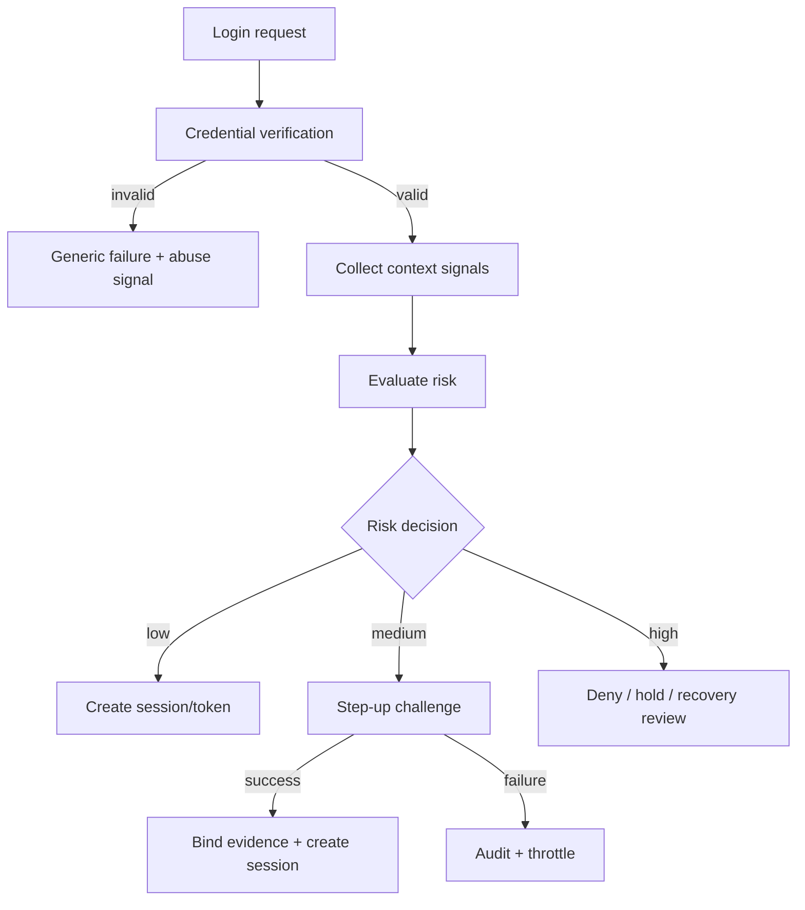
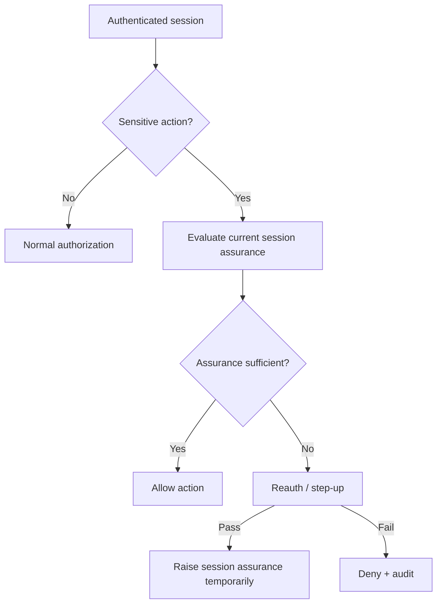
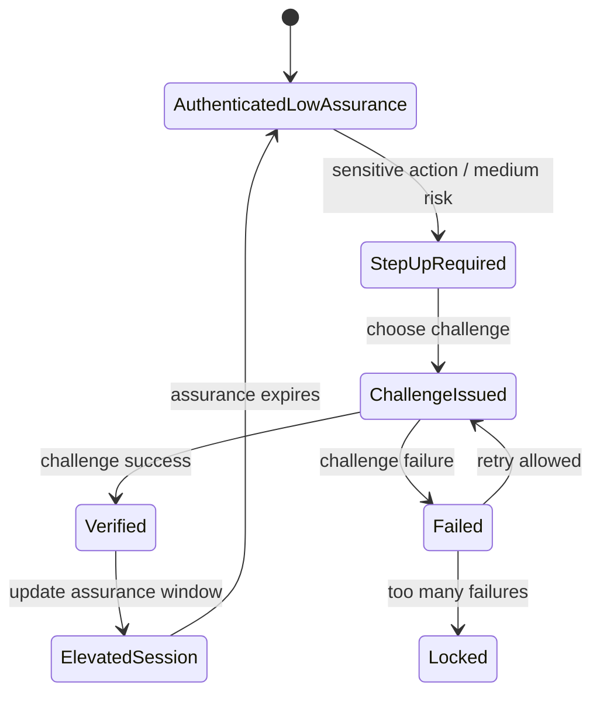
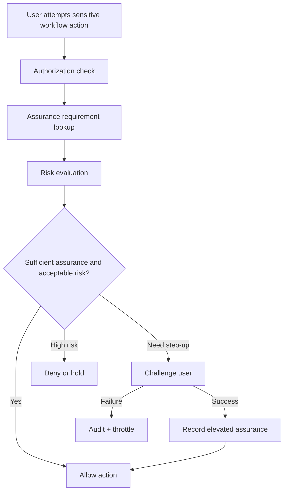

# Part 031 — Risk-Based Authentication

> Target part ini: membangun risk-based authentication yang bisa dipakai di sistem nyata: bukan sekadar “kalau IP beda, minta OTP”, tetapi sistem yang punya signal, scoring, decision, challenge orchestration, audit, privacy boundary, dan failure model yang jelas.

Risk-based authentication adalah pola untuk menyesuaikan proses autentikasi berdasarkan risiko konteks login.

Bentuk paling sederhana:

```txt
Normal login:
  password/passkey/session/token valid -> authenticated

Risk-based login:
  credential valid + context low risk -> authenticated
  credential valid + context medium risk -> step-up challenge
  credential valid + context high risk -> deny / hold / recovery review
```

Masalahnya: banyak implementasi risk-based auth gagal karena risk engine diperlakukan seperti if-else kecil.

Contoh buruk:

```java
if (!request.ip().equals(lastLoginIp)) {
  requireOtp();
}
```

Ini rapuh.

VPN, mobile carrier NAT, corporate proxy, IPv6 rotation, travel, remote work, dan privacy relay membuat IP bukan identitas. IP adalah signal, bukan bukti.

Mental model yang lebih benar:

```txt
Authentication decision = proof + context + policy + history + risk tolerance
```

Credential membuktikan kontrol atas authenticator.
Risk engine menilai apakah konteks penggunaan authenticator masuk akal.
Step-up menaikkan assurance saat konteks tidak cukup dipercaya.

---

## 1. Problem Yang Diselesaikan

Authentication biasa menjawab:

```txt
Apakah claimant bisa membuktikan kontrol atas authenticator?
```

Risk-based authentication menambah pertanyaan:

```txt
Apakah cara, lokasi, perangkat, waktu, pola, dan target aksi ini masuk akal untuk subject tersebut?
```

Contoh kasus:

| Kasus | Credential valid? | Risiko | Respons |
|---|---:|---:|---|
| User login dari device biasa, lokasi biasa | Ya | Rendah | Allow |
| User login dari browser baru setelah password benar | Ya | Medium | Step-up MFA |
| Login dari negara baru 3 menit setelah login domestik | Ya | Tinggi | Deny / hold |
| Session lama mencoba ganti MFA factor | Ya | Tinggi | Reauthentication + existing factor |
| API token valid dipakai dari region yang tidak pernah dipakai | Ya | Medium/Tinggi | Limit / revoke / alert |
| Banyak failed login lintas account dari IP yang sama | Tidak | Abuse | Throttle / block |

Risk-based auth tidak menggantikan authentication.

Ia mengatur **assurance transition**.

```txt
credential proof -> baseline assurance
context evaluation -> risk classification
policy decision -> allow / step-up / deny / review
```

---

## 2. Core Invariant

Risk-based authentication harus menjaga invariant berikut.

### Invariant 1 — Risk is advisory until policy consumes it

Risk score tidak boleh otomatis menjadi keputusan tanpa policy.

```txt
Risk engine: "login risk = 72 / high"
Policy engine: "for password login, high risk requires passkey or recovery review"
```

Kenapa?

Karena risiko yang sama bisa berarti keputusan berbeda.

| Context | High risk action | Decision |
|---|---|---|
| View public dashboard | Allow + log |
| Export customer data | Step-up |
| Change recovery email | Reauth + existing MFA + delay |
| Create admin API key | Step-up + approval |
| Suspected account takeover | Deny + reset session family |

### Invariant 2 — Risk signal is not identity

IP address, user agent, geolocation, ASN, timezone, device fingerprint, dan behavior bukan principal.

Mereka hanya signal.

```txt
Principal = subject yang berhasil dibuktikan melalui authenticator.
Signal = fakta lingkungan yang membantu menilai anomali.
```

### Invariant 3 — New device is not always attacker

Jika policy terlalu agresif, user sah akan terkunci.

Risk-based auth harus punya jalur recovery yang aman:

```txt
new device -> step-up -> verified -> bind device -> reduce future friction
```

Bukan:

```txt
new device -> deny forever
```

### Invariant 4 — Recovery must not bypass risk

Attackers sering menyerang recovery karena recovery cenderung lebih lemah dari login normal.

```txt
forgot password
change email
replace MFA
disable passkey
invite admin
rotate API key
```

Semua harus melewati risk policy.

### Invariant 5 — Risk data must be explainable enough for audit

Untuk sistem enterprise/regulatory, keputusan harus bisa dijelaskan.

Bukan:

```txt
denied because model said 0.87392
```

Minimal:

```txt
Denied because impossible travel + new device + high-risk ASN + failed MFA attempts.
```

### Invariant 6 — Do not leak risk decision details to attacker

Internal audit boleh detail.
User-facing response harus hati-hati.

```txt
Bad:
  "Login blocked because your IP is from ASN 12345 and impossible travel was detected."

Better:
  "We could not verify this sign-in. Please complete additional verification."
```

### Invariant 7 — Step-up must actually raise assurance

Meminta faktor yang mudah dicuri tidak selalu menaikkan assurance.

Contoh lemah:

```txt
Password compromised -> send OTP to compromised mailbox -> allow MFA reset
```

Step-up harus mempertimbangkan independensi faktor.

---

## 3. Risk-Based Auth Dalam Lifecycle Authentication

Risk engine bisa dipakai di banyak titik.



Risk evaluation juga muncul setelah login.



Contoh sensitive action:

- change password
- change email
- add/remove MFA factor
- create API key
- export data
- update payout bank account
- approve enforcement action
- impersonate user
- grant admin role

---

## 4. Data Model

Risk-based authentication butuh data historis. Tetapi data historis harus dibatasi supaya tidak menjadi privacy liability.

### 4.1 Core Tables

```sql
CREATE TABLE auth_risk_event (
  id UUID PRIMARY KEY,
  tenant_id UUID NOT NULL,
  subject_id UUID,
  account_id UUID,
  event_type TEXT NOT NULL,
  occurred_at TIMESTAMPTZ NOT NULL,

  ip_hash BYTEA,
  ip_prefix TEXT,
  asn INTEGER,
  country_code CHAR(2),
  region_code TEXT,
  city_hash BYTEA,

  user_agent_hash BYTEA,
  browser_family TEXT,
  os_family TEXT,
  device_id UUID,
  device_known BOOLEAN,

  credential_type TEXT,
  authenticator_id UUID,
  assurance_before TEXT,
  assurance_after TEXT,

  risk_score INTEGER,
  risk_level TEXT,
  decision TEXT,
  reason_codes TEXT[] NOT NULL DEFAULT '{}',

  correlation_id TEXT,
  request_id TEXT,
  trace_id TEXT
);

CREATE INDEX idx_auth_risk_event_subject_time
  ON auth_risk_event (tenant_id, subject_id, occurred_at DESC);

CREATE INDEX idx_auth_risk_event_ip_time
  ON auth_risk_event (tenant_id, ip_prefix, occurred_at DESC);
```

Catatan:

- Jangan simpan raw IP kalau tidak perlu.
- Simpan prefix/hashed value untuk korelasi abuse.
- Simpan `reason_codes`, bukan hanya score.
- Gunakan retention policy.

### 4.2 Known Device

```sql
CREATE TABLE trusted_device (
  id UUID PRIMARY KEY,
  tenant_id UUID NOT NULL,
  subject_id UUID NOT NULL,
  device_binding_id BYTEA NOT NULL,
  display_name TEXT,
  first_seen_at TIMESTAMPTZ NOT NULL,
  last_seen_at TIMESTAMPTZ NOT NULL,
  last_ip_prefix TEXT,
  last_country_code CHAR(2),
  assurance_level TEXT NOT NULL,
  trust_state TEXT NOT NULL,
  revoked_at TIMESTAMPTZ,
  revoked_reason TEXT,
  UNIQUE (tenant_id, subject_id, device_binding_id)
);
```

`device_binding_id` sebaiknya bukan fingerprint pasif yang agresif.

Lebih baik:

```txt
server-issued device cookie + signed binding + rotation + revocation
```

Daripada:

```txt
canvas fingerprint + font list + audio fingerprint + invasive tracking
```

Untuk enterprise system, passive fingerprinting ekstrem biasanya bermasalah secara privasi, tidak stabil, dan sulit dijelaskan.

### 4.3 Risk Profile Snapshot

```sql
CREATE TABLE subject_risk_profile (
  tenant_id UUID NOT NULL,
  subject_id UUID NOT NULL,
  updated_at TIMESTAMPTZ NOT NULL,

  usual_country_codes TEXT[] NOT NULL DEFAULT '{}',
  usual_asns INTEGER[] NOT NULL DEFAULT '{}',
  known_device_count INTEGER NOT NULL DEFAULT 0,
  last_successful_login_at TIMESTAMPTZ,
  last_mfa_success_at TIMESTAMPTZ,
  last_password_change_at TIMESTAMPTZ,
  last_recovery_change_at TIMESTAMPTZ,

  failed_login_count_1h INTEGER NOT NULL DEFAULT 0,
  failed_login_count_24h INTEGER NOT NULL DEFAULT 0,
  account_takeover_suspected BOOLEAN NOT NULL DEFAULT FALSE,

  PRIMARY KEY (tenant_id, subject_id)
);
```

Risk profile adalah cache/read model.

Source of truth tetap event.

---

## 5. Risk Signal Taxonomy

Risk signal harus diklasifikasi.

### 5.1 Network Signals

| Signal | Contoh | Kekuatan | Risiko salah |
|---|---|---:|---:|
| IP reputation | known proxy/botnet/VPN | Medium | Medium |
| ASN | cloud provider / residential ISP | Medium | Medium |
| Geo country | Indonesia, Singapore, US | Medium | High untuk VPN/travel |
| Impossible travel | Jakarta -> London dalam 10 menit | High | Medium |
| IP velocity | banyak account dari prefix sama | High untuk abuse | Medium |

IP bukan bukti attacker.
Tetapi IP velocity sangat berguna untuk abuse detection.

### 5.2 Device Signals

| Signal | Makna | Catatan |
|---|---|---|
| Known device cookie | Pernah diverifikasi | Lebih stabil daripada passive fingerprint |
| User-Agent family | Browser/OS | Mudah berubah dan dipalsukan |
| WebAuthn credential | Strong device-bound credential | Bagus untuk phishing resistance |
| Mobile app device binding | Device keypair / attestation | Kuat jika desain benar |
| Device trust age | Berapa lama device dikenal | Useful untuk step-up |

Device trust harus revocable.

```txt
trusted today does not mean trusted forever
```

### 5.3 Account Behavior Signals

| Signal | Makna |
|---|---|
| Failed attempts spike | Credential stuffing atau brute force |
| Password reset just happened | Increased account takeover risk |
| MFA factor recently changed | High risk for sensitive action |
| New email added | High risk for recovery path |
| Dormant account suddenly active | Risk may be elevated |
| Admin privileges newly granted | Step-up for critical operations |

### 5.4 Session Signals

| Signal | Makna |
|---|---|
| Session age | Reauth needed for sensitive action |
| Last MFA time | Step-up freshness |
| Authenticator type | Password vs passkey vs mTLS |
| Assurance level | Current confidence |
| Device binding mismatch | Possible hijack |
| IP/ASN jump mid-session | Possible proxy/mobile/VPN/hijack |

### 5.5 Action Signals

Risk tidak hanya bergantung pada login.

Aksi menentukan risk tolerance.

| Action | Risk tolerance |
|---|---:|
| View own profile | Low |
| Change password | Medium |
| Change recovery email | High |
| Disable MFA | High |
| Create admin user | Critical |
| Export regulated data | Critical |
| Approve enforcement sanction | Critical |

---

## 6. Risk Score Model Yang Bisa Dioperasikan

Jangan mulai dari machine learning.

Mulai dari deterministic scoring yang bisa diuji.

```java
public enum RiskLevel {
    LOW,
    MEDIUM,
    HIGH,
    CRITICAL
}

public record RiskReason(
    String code,
    int weight,
    String description
) {}

public record RiskAssessment(
    int score,
    RiskLevel level,
    List<RiskReason> reasons
) {
    public boolean hasReason(String code) {
        return reasons.stream().anyMatch(r -> r.code().equals(code));
    }
}
```

Contoh evaluator:

```java
public final class AuthenticationRiskEvaluator {

    public RiskAssessment evaluate(AuthRiskInput input) {
        List<RiskReason> reasons = new ArrayList<>();

        if (!input.knownDevice()) {
            reasons.add(new RiskReason(
                "NEW_DEVICE",
                25,
                "Login from device not previously verified for subject"
            ));
        }

        if (input.impossibleTravelDetected()) {
            reasons.add(new RiskReason(
                "IMPOSSIBLE_TRAVEL",
                60,
                "Login location is inconsistent with recent successful login"
            ));
        }

        if (input.highRiskAsn()) {
            reasons.add(new RiskReason(
                "HIGH_RISK_ASN",
                20,
                "Network ASN is associated with elevated abuse risk"
            ));
        }

        if (input.failedAttemptsForSubjectLastHour() >= 5) {
            reasons.add(new RiskReason(
                "SUBJECT_FAILED_ATTEMPT_SPIKE",
                30,
                "Subject has many recent failed authentication attempts"
            ));
        }

        if (input.passwordChangedRecently()) {
            reasons.add(new RiskReason(
                "RECENT_PASSWORD_CHANGE",
                15,
                "Password was changed recently"
            ));
        }

        int score = reasons.stream().mapToInt(RiskReason::weight).sum();
        return new RiskAssessment(score, classify(score, reasons), reasons);
    }

    private RiskLevel classify(int score, List<RiskReason> reasons) {
        if (reasons.stream().anyMatch(r -> r.code().equals("IMPOSSIBLE_TRAVEL")) && score >= 80) {
            return RiskLevel.CRITICAL;
        }
        if (score >= 70) return RiskLevel.HIGH;
        if (score >= 35) return RiskLevel.MEDIUM;
        return RiskLevel.LOW;
    }
}
```

Kenapa reason code penting?

Karena audit, debugging, dan policy butuh penjelasan.

```txt
score=75 is not actionable
reasons=[NEW_DEVICE, HIGH_RISK_ASN, SUBJECT_FAILED_ATTEMPT_SPIKE] is actionable
```

---

## 7. Risk Policy Engine

Risk score tidak langsung menentukan hasil. Policy yang menentukan.

```java
public enum AuthDecisionType {
    ALLOW,
    STEP_UP,
    DENY,
    HOLD_FOR_REVIEW
}

public record AuthDecision(
    AuthDecisionType type,
    String requiredAssuranceLevel,
    Set<String> allowedChallengeTypes,
    String userMessageCode,
    List<String> auditReasonCodes
) {}
```

Contoh policy:

```java
public final class AuthenticationRiskPolicy {

    public AuthDecision decide(LoginContext ctx, RiskAssessment risk) {
        if (risk.level() == RiskLevel.CRITICAL) {
            return new AuthDecision(
                AuthDecisionType.DENY,
                "AAL2",
                Set.of(),
                "AUTH_VERIFICATION_FAILED",
                reasonCodes(risk)
            );
        }

        if (risk.level() == RiskLevel.HIGH) {
            return new AuthDecision(
                AuthDecisionType.STEP_UP,
                "AAL2",
                Set.of("PASSKEY", "TOTP", "RECOVERY_REVIEW"),
                "AUTH_ADDITIONAL_VERIFICATION_REQUIRED",
                reasonCodes(risk)
            );
        }

        if (risk.level() == RiskLevel.MEDIUM && ctx.credentialType().equals("PASSWORD")) {
            return new AuthDecision(
                AuthDecisionType.STEP_UP,
                "AAL2",
                Set.of("TOTP", "PASSKEY"),
                "AUTH_ADDITIONAL_VERIFICATION_REQUIRED",
                reasonCodes(risk)
            );
        }

        return new AuthDecision(
            AuthDecisionType.ALLOW,
            ctx.currentAssuranceLevel(),
            Set.of(),
            "AUTH_OK",
            reasonCodes(risk)
        );
    }

    private List<String> reasonCodes(RiskAssessment risk) {
        return risk.reasons().stream().map(RiskReason::code).toList();
    }
}
```

---

## 8. Assurance Level Model

Risk-based auth lebih masuk akal jika session/token memiliki assurance.

```java
public enum AssuranceLevel {
    ANONYMOUS,
    AAL1,
    AAL2,
    AAL3
}
```

Simplified mapping:

| Evidence | Approx assurance |
|---|---|
| Anonymous request | Anonymous |
| Password only | AAL1-ish |
| Password + TOTP | AAL2-ish |
| Passkey with user verification | Strong phishing-resistant AAL2-ish / potentially stronger depending policy |
| Hardware-backed phishing-resistant authenticator under strict policy | Higher assurance candidate |
| mTLS workload credential | Service assurance, not user assurance |

Jangan asal mengklaim compliance.

AAL formal bergantung pada enrollment, proofing, authenticator requirements, verifier requirements, lifecycle, dan federation profile. Tetapi sebagai internal engineering model, `AAL1/AAL2/AAL3` berguna untuk menghindari boolean `authenticated=true` yang terlalu miskin.

```java
public record AuthSession(
    UUID sessionId,
    UUID subjectId,
    AssuranceLevel assuranceLevel,
    Instant authenticatedAt,
    Instant lastStepUpAt,
    Set<String> completedFactors,
    UUID deviceId
) {}
```

Sensitive action bisa meminta assurance freshness.

```java
public record AssuranceRequirement(
    AssuranceLevel minimumLevel,
    Duration maxAge,
    Set<String> acceptedFactors
) {}
```

Contoh:

```txt
Change display name:
  minimum=AAL1, maxAge=24h

Change password:
  minimum=AAL2, maxAge=15m

Disable MFA:
  minimum=AAL2, maxAge=5m, acceptedFactors must include existing enrolled factor

Create admin API key:
  minimum=AAL2, maxAge=5m, plus admin approval
```

---

## 9. Step-Up Orchestration

Step-up bukan redirect acak.

Step-up adalah state machine.



Step-up challenge harus terikat ke:

- subject
- session id
- tenant
- action
- redirect/continuation target
- expiration time
- nonce/challenge id

```sql
CREATE TABLE step_up_challenge (
  id UUID PRIMARY KEY,
  tenant_id UUID NOT NULL,
  subject_id UUID NOT NULL,
  session_id UUID NOT NULL,
  action_code TEXT NOT NULL,
  challenge_type TEXT NOT NULL,
  status TEXT NOT NULL,
  created_at TIMESTAMPTZ NOT NULL,
  expires_at TIMESTAMPTZ NOT NULL,
  verified_at TIMESTAMPTZ,
  attempt_count INTEGER NOT NULL DEFAULT 0,
  max_attempts INTEGER NOT NULL,
  risk_reason_codes TEXT[] NOT NULL DEFAULT '{}',
  continuation_token_hash BYTEA NOT NULL
);
```

Continuation target tidak boleh raw URL bebas.

Gunakan signed continuation token atau server-side record.

---

## 10. Device Binding Pattern

Device trust sering disalahpahami.

Ada tiga pendekatan umum.

### 10.1 Passive Fingerprint

Menggabungkan user-agent, screen size, fonts, canvas, timezone, dll.

Kelemahan:

- privacy risk tinggi
- tidak stabil
- bisa dipalsukan
- susah dijelaskan
- sering terpengaruh browser privacy protection

Gunakan hanya dengan sangat hati-hati, sebagai low-confidence signal.

### 10.2 Server-Issued Device Cookie

Setelah step-up berhasil, server membuat device binding.

```txt
device_cookie = random_id + signature / encrypted envelope
server stores hash(random_id)
```

Flow:

```mermaid
sequenceDiagram
  participant B as Browser
  participant A as App
  participant DB as Device Store

  B->>A: Login + MFA success
  A->>DB: create device binding
  A-->>B: Set-Cookie device=<opaque>; Secure; HttpOnly; SameSite=Lax
  B->>A: Future login with device cookie
  A->>DB: verify binding hash + subject + tenant
  A-->>A: reduce risk if still valid
```

Catatan:

- Device cookie bukan session cookie.
- Device cookie tidak membuktikan user hadir.
- Device cookie bisa dicuri jika endpoint/browser compromise.
- Device cookie harus revocable.

### 10.3 Public-Key Device Binding

Device membuat keypair; server menyimpan public key; device menandatangani challenge.

Ini lebih kuat, tetapi implementasi lebih kompleks.

WebAuthn/passkey adalah contoh standar untuk browser context.
Mobile app dapat memakai platform keystore/secure enclave, tetapi harus hati-hati dengan attestation dan portability.

---

## 11. Impossible Travel

Impossible travel terlihat sederhana, tapi banyak edge case.

Pseudo logic:

```java
public boolean impossibleTravel(LoginLocation previous, LoginLocation current, Instant previousAt, Instant currentAt) {
    if (previous == null || current == null) return false;
    if (previous.countryCode().equals(current.countryCode())) return false;

    double distanceKm = haversine(previous.lat(), previous.lon(), current.lat(), current.lon());
    double hours = Duration.between(previousAt, currentAt).toMinutes() / 60.0;
    if (hours <= 0.0) return true;

    double speedKmh = distanceKm / hours;
    return speedKmh > 900; // intentionally rough threshold
}
```

Masalah:

| Edge case | Dampak |
|---|---|
| VPN | Geo appears remote |
| Corporate proxy | Many users share egress |
| Mobile carrier NAT | IP geo inaccurate |
| Privacy relay | Location distorted |
| Cloud desktop/VDI | Login location != user physical location |
| Travel | Legitimate anomaly |

Jadi impossible travel sebaiknya menaikkan risk, bukan otomatis permanent block.

```txt
impossible travel + known passkey + verified device -> step-up
impossible travel + password only + new device + high-risk ASN -> deny/hold
```

---

## 12. Spring Security Integration

Risk-based auth bisa diintegrasikan pada beberapa titik.

### 12.1 Setelah Credential Verification

Untuk form/password login, custom `AuthenticationSuccessHandler` dapat mengevaluasi risk sebelum membuat final session.

Simplified pattern:

```java
@Component
public final class RiskAwareAuthenticationSuccessHandler implements AuthenticationSuccessHandler {

    private final RiskService riskService;
    private final StepUpService stepUpService;
    private final AuthenticationSuccessHandler defaultSuccessHandler;

    public RiskAwareAuthenticationSuccessHandler(
        RiskService riskService,
        StepUpService stepUpService
    ) {
        this.riskService = riskService;
        this.stepUpService = stepUpService;
        this.defaultSuccessHandler = new SavedRequestAwareAuthenticationSuccessHandler();
    }

    @Override
    public void onAuthenticationSuccess(
        HttpServletRequest request,
        HttpServletResponse response,
        Authentication authentication
    ) throws IOException, ServletException {

        LoginRiskContext ctx = LoginRiskContext.from(request, authentication);
        RiskAssessment assessment = riskService.evaluate(ctx);
        AuthDecision decision = riskService.decide(ctx, assessment);

        if (decision.type() == AuthDecisionType.ALLOW) {
            riskService.recordDecision(ctx, assessment, decision);
            defaultSuccessHandler.onAuthenticationSuccess(request, response, authentication);
            return;
        }

        if (decision.type() == AuthDecisionType.STEP_UP) {
            StepUpChallenge challenge = stepUpService.createChallenge(ctx, assessment, decision);
            riskService.recordDecision(ctx, assessment, decision);
            response.sendRedirect("/auth/step-up?challenge=" + challenge.publicId());
            return;
        }

        SecurityContextHolder.clearContext();
        riskService.recordDecision(ctx, assessment, decision);
        response.sendRedirect("/login?error=verification_required");
    }
}
```

Important caveat:

If credential succeeded but step-up is still pending, do not treat the user as fully authenticated for the whole app.

Patterns:

1. Store partial authentication in dedicated temporary state, not normal full session.
2. Or create session with low assurance and block protected actions until step-up.
3. Avoid giving normal application authorities before step-up is complete.

### 12.2 Authorization Manager for Sensitive Actions

Sensitive action needs assurance-aware authorization.

```java
public final class AssuranceAuthorizationManager
        implements AuthorizationManager<RequestAuthorizationContext> {

    private final AssuranceRequirement requirement;

    public AssuranceAuthorizationManager(AssuranceRequirement requirement) {
        this.requirement = requirement;
    }

    @Override
    public AuthorizationDecision check(
        Supplier<Authentication> authentication,
        RequestAuthorizationContext context
    ) {
        Authentication auth = authentication.get();
        if (auth == null || !auth.isAuthenticated()) {
            return new AuthorizationDecision(false);
        }

        AuthenticatedPrincipal principal = (AuthenticatedPrincipal) auth.getPrincipal();
        SessionAssurance assurance = principal.assurance();

        boolean sufficientLevel = assurance.level().compareTo(requirement.minimumLevel()) >= 0;
        boolean fresh = assurance.lastVerifiedAt().isAfter(Instant.now().minus(requirement.maxAge()));
        boolean factorOk = assurance.completedFactors().containsAll(requirement.acceptedFactors());

        return new AuthorizationDecision(sufficientLevel && fresh && factorOk);
    }
}
```

Jika gagal karena assurance, jangan return 403 biasa. Redirect ke step-up atau return structured `401 step_up_required` untuk API.

### 12.3 OAuth2 Resource Server

Untuk API, risk decision biasanya tidak dilakukan di semua request karena mahal.

Pendekatan:

- validate token setiap request
- evaluate risk di token issuance / token exchange / sensitive endpoint
- gunakan token claim untuk assurance dan auth time
- enforce reauth/step-up untuk sensitive action

Example claims:

```json
{
  "iss": "https://id.example.com/realms/acme",
  "sub": "01J...",
  "aud": "case-management-api",
  "scope": "case:read case:approve",
  "acr": "aal2",
  "amr": ["pwd", "otp"],
  "auth_time": 1783090100,
  "risk_level": "low",
  "tenant_id": "acme"
}
```

Do not trust arbitrary `risk_level` claim unless token issuer is trusted and audience is correct.

---

## 13. Jakarta Security Integration

With Jakarta Security, risk can be placed inside custom `HttpAuthenticationMechanism`.

```java
@ApplicationScoped
public class RiskAwareAuthenticationMechanism implements HttpAuthenticationMechanism {

    @Inject IdentityStoreHandler identityStoreHandler;
    @Inject RiskService riskService;
    @Inject StepUpService stepUpService;

    @Override
    public AuthenticationStatus validateRequest(
        HttpServletRequest request,
        HttpServletResponse response,
        HttpMessageContext context
    ) throws AuthenticationException {

        Optional<UsernamePasswordCredential> credential = extractCredential(request);
        if (credential.isEmpty()) {
            return context.doNothing();
        }

        CredentialValidationResult result = identityStoreHandler.validate(credential.get());
        if (result.getStatus() != CredentialValidationResult.Status.VALID) {
            riskService.recordFailure(request);
            return context.responseUnauthorized();
        }

        LoginRiskContext riskContext = LoginRiskContext.from(request, result);
        RiskAssessment assessment = riskService.evaluate(riskContext);
        AuthDecision decision = riskService.decide(riskContext, assessment);

        if (decision.type() == AuthDecisionType.ALLOW) {
            return context.notifyContainerAboutLogin(
                result.getCallerPrincipal(),
                result.getCallerGroups()
            );
        }

        if (decision.type() == AuthDecisionType.STEP_UP) {
            stepUpService.createChallenge(riskContext, assessment, decision);
            return context.redirect("/auth/step-up");
        }

        return context.responseUnauthorized();
    }
}
```

Principle:

```txt
credential validation remains separate from risk policy
risk policy decides final authentication status / assurance level
```

---

## 14. API Response Semantics

For browser:

```txt
low risk -> 302 /home
medium risk -> 302 /auth/step-up
high risk -> generic verification failure
```

For API:

```http
HTTP/1.1 401 Unauthorized
Content-Type: application/json
WWW-Authenticate: Bearer error="insufficient_authentication", error_description="additional verification required"

{
  "error": "step_up_required",
  "challenge_uri": "/auth/challenges/abc",
  "accepted_methods": ["passkey", "totp"]
}
```

For high-risk deny:

```http
HTTP/1.1 401 Unauthorized
Content-Type: application/json

{
  "error": "verification_failed"
}
```

Do not expose exact risk reasons in API response.
Audit log can store reasons.

---

## 15. Risk-Based Auth Untuk Regulated Case Management

Karena banyak enterprise Java systems dipakai untuk workflow sensitif, risk-based auth harus menyatu dengan action semantics.

Contoh enforcement lifecycle:

```txt
Read case -> normal session OK
Draft action -> AAL1 OK
Submit recommendation -> AAL2 required
Approve sanction -> AAL2 fresh + known device + no high risk signals
Override escalation -> AAL2 fresh + privileged role + supervisor approval
Export evidence -> AAL2 fresh + audit reason
```

Mermaid flow:



Key design:

```txt
Authentication risk informs workflow controls.
It must not be hidden inside login code only.
```

---

## 16. Observability

Risk-based auth without observability is impossible to tune.

### 16.1 Metrics

```txt
auth_risk_assessment_total{level="low"}
auth_risk_assessment_total{level="medium"}
auth_risk_assessment_total{level="high"}
auth_step_up_required_total{method="totp"}
auth_step_up_success_total{method="passkey"}
auth_step_up_failure_total{method="totp"}
auth_high_risk_deny_total{reason="impossible_travel"}
auth_known_device_bind_total
auth_known_device_revoke_total
auth_false_positive_report_total
```

### 16.2 Logs

Log internal event:

```json
{
  "event": "AUTH_RISK_DECISION",
  "tenant_id": "acme",
  "subject_id": "01J...",
  "risk_score": 75,
  "risk_level": "HIGH",
  "decision": "STEP_UP",
  "reason_codes": ["NEW_DEVICE", "HIGH_RISK_ASN", "FAILED_ATTEMPT_SPIKE"],
  "credential_type": "PASSWORD",
  "device_known": false,
  "correlation_id": "req-123"
}
```

Do not log:

- full IP if not required
- raw user agent if policy prohibits
- OTP codes
- tokens
- password values
- raw device fingerprint material

### 16.3 Dashboards

Useful dashboards:

| Dashboard | Purpose |
|---|---|
| Step-up conversion | Detect excessive friction |
| High-risk denies by reason | Tune policies |
| New device login trend | Detect attack or rollout issue |
| Failed MFA trend | Detect MFA fatigue / bot automation |
| Risk false positive reports | Reduce user pain |
| Risk reason distribution | Avoid one signal dominating incorrectly |

---

## 17. Privacy and Data Minimization

Risk-based auth is powerful but dangerous.

Minimize collection.

```txt
Collect what is needed.
Hash what can be hashed.
Aggregate where possible.
Expire aggressively.
Explain policy internally.
Restrict access to risk logs.
```

Bad pattern:

```txt
Collect every browser fingerprint property forever because maybe useful.
```

Better:

```txt
Store known-device binding, coarse geo, ASN, reason codes, and event history with retention.
```

Retention examples:

| Data | Suggested retention idea |
|---|---:|
| Failed login counters | hours/days |
| Risk event audit | 90 days / policy-dependent |
| Sensitive action audit | longer, compliance-dependent |
| Device binding | until revoked / inactive timeout |
| Raw enrichments | avoid or short retention |

---

## 18. Testing Strategy

### 18.1 Unit Tests

Risk evaluator must have deterministic tests.

```java
@Test
void newDeviceAndFailedAttemptsRequiresMediumRisk() {
    AuthRiskInput input = AuthRiskInput.builder()
        .knownDevice(false)
        .failedAttemptsForSubjectLastHour(6)
        .highRiskAsn(false)
        .impossibleTravelDetected(false)
        .build();

    RiskAssessment assessment = evaluator.evaluate(input);

    assertThat(assessment.level()).isEqualTo(RiskLevel.MEDIUM);
    assertThat(assessment.reasons())
        .extracting(RiskReason::code)
        .contains("NEW_DEVICE", "SUBJECT_FAILED_ATTEMPT_SPIKE");
}
```

### 18.2 Policy Tests

```java
@Test
void highRiskPasswordLoginRequiresStepUp() {
    RiskAssessment risk = new RiskAssessment(
        75,
        RiskLevel.HIGH,
        List.of(new RiskReason("NEW_DEVICE", 25, ""), new RiskReason("HIGH_RISK_ASN", 50, ""))
    );

    AuthDecision decision = policy.decide(passwordLogin(), risk);

    assertThat(decision.type()).isEqualTo(AuthDecisionType.STEP_UP);
    assertThat(decision.requiredAssuranceLevel()).isEqualTo("AAL2");
}
```

### 18.3 Integration Tests

Scenarios:

| Scenario | Expected |
|---|---|
| Known device + password | allow |
| New device + password | step-up |
| New device + passkey UV | allow or lower friction depending policy |
| Impossible travel + password | deny/step-up |
| Change MFA after fresh login only | require existing factor |
| High-risk action with stale MFA | step-up |
| Step-up success | assurance raised |
| Step-up failure | no assurance raised |

### 18.4 Abuse Simulation

Simulate:

- credential stuffing across many accounts
- one account from many IPs
- one IP against many accounts
- repeated MFA failure
- device cookie theft
- session hijack with IP jump
- recovery email replacement

---

## 19. Failure Modes

| Failure mode | Root cause | Consequence | Mitigation |
|---|---|---|---|
| Risk score used as identity | Signal confused with proof | Account takeover or false trust | Keep proof separate from risk |
| Step-up bypass | Sensitive endpoint ignores assurance | Privilege escalation | Central assurance enforcement |
| Overblocking | Policy too aggressive | User lockout, support load | Graceful step-up/recovery |
| Weak recovery path | Recovery bypasses MFA | Account takeover | Risk-aware recovery |
| Raw fingerprint hoarding | Excess data collection | Privacy/legal risk | Minimize and retain less |
| Risk detail leaked | Error messages expose signals | Attacker adapts | Generic user response |
| Device binding never expires | Stale trust | Long-term compromise | Expiry/revocation |
| Risk event not audited | No explainability | Cannot investigate | Structured event log |
| ML black box only | No reason code | Non-defensible decision | Deterministic baseline + explanations |
| IP-based hard deny | IP treated as proof | False positives | Use IP as signal only |

---

## 20. Anti-Patterns

### Anti-pattern: “MFA means no risk engine needed”

MFA does not solve:

- stolen session
- MFA fatigue
- recovery takeover
- SIM swap
- device theft
- malicious insider
- token replay

### Anti-pattern: “Risk-based auth means hidden ML model”

Start deterministic.
Only add ML when you have labels, observability, human review, and rollback.

### Anti-pattern: “New country equals attacker”

New country means anomaly.
It does not prove attacker.

### Anti-pattern: “Known device means safe”

Known device can be stolen, infected, shared, or controlled remotely.

### Anti-pattern: “Step-up with email OTP is strong enough for all actions”

Email may be compromised or recoverable by attacker.
Critical actions need stronger challenge and sometimes administrative approval.

---

## 21. Production Checklist

Before shipping risk-based auth:

- [ ] Risk signal taxonomy documented.
- [ ] Risk score has reason codes.
- [ ] Policy decision separated from scoring.
- [ ] User-facing error messages do not leak sensitive risk detail.
- [ ] Step-up state is bound to session, subject, tenant, action, and expiry.
- [ ] Sensitive actions enforce assurance centrally.
- [ ] Recovery flow goes through risk policy.
- [ ] Device trust is revocable and expires.
- [ ] Raw signals minimized and protected.
- [ ] Audit logs include reason codes and decisions.
- [ ] Metrics measure false positives and challenge success.
- [ ] Abuse simulation included in test suite.
- [ ] Incident runbook exists for account takeover spike.
- [ ] Support tooling can explain decision safely.

---

## 22. Minimal Implementation Roadmap

### Phase 1 — Baseline

- login event table
- failed/successful attempts
- known device cookie
- simple risk evaluator
- step-up for new device
- sensitive action assurance requirement

### Phase 2 — Abuse Controls

- IP prefix velocity
- subject velocity
- ASN reputation
- recovery path risk
- structured audit dashboard

### Phase 3 — Stronger Assurance

- passkey support
- phishing-resistant step-up
- transaction-bound challenge for critical actions
- admin review for suspicious recovery

### Phase 4 — Advanced

- device key binding
- adaptive policy by tenant
- supervised model / anomaly detection
- user self-service device management
- automated account takeover response

---

## 23. Reference Implementation Shape

Package layout:

```txt
com.example.auth.risk
  RiskAssessment.java
  RiskReason.java
  RiskLevel.java
  RiskSignal.java
  AuthRiskInput.java
  AuthenticationRiskEvaluator.java
  AuthenticationRiskPolicy.java
  RiskDecisionRecorder.java

com.example.auth.stepup
  StepUpChallenge.java
  StepUpService.java
  StepUpController.java
  AssuranceRequirement.java
  AssuranceAuthorizationManager.java

com.example.auth.device
  DeviceBinding.java
  DeviceBindingService.java
  DeviceCookieSigner.java
  TrustedDeviceRepository.java
```

Service boundary:

```txt
AuthService verifies credential.
RiskService evaluates context.
StepUpService orchestrates challenges.
SessionService raises/lowers assurance.
AuditService records decision.
```

Do not put all logic in one login controller.

---

## 24. Closing Mental Model

Risk-based authentication is not a magic security add-on.

It is a control loop:

```txt
observe context -> score risk -> apply policy -> challenge/deny/allow -> record outcome -> tune policy
```

The hardest part is not calculating the score.

The hardest part is preserving these boundaries:

```txt
proof != risk
risk != decision
authentication != authorization
session != assurance
recovery != bypass
```

If those boundaries stay clean, risk-based auth becomes a powerful production pattern.
If they collapse, the system becomes arbitrary, leaky, and hard to defend.

---

## References

- NIST SP 800-63B-4 — Digital Identity Guidelines: Authentication and Authenticator Management
- OWASP Authentication Cheat Sheet
- OWASP Multifactor Authentication Cheat Sheet
- OWASP Session Management Cheat Sheet
- Spring Security Reference — Servlet Authentication Architecture
- Spring Security Reference — OAuth2 Resource Server
