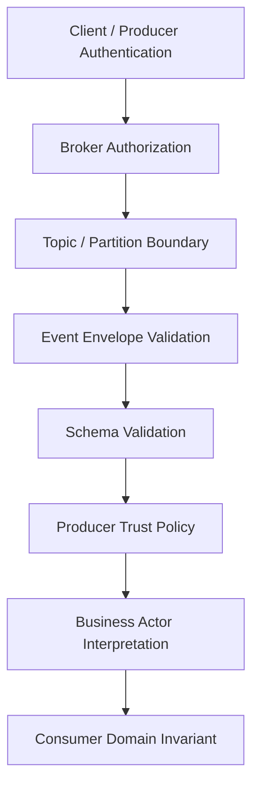
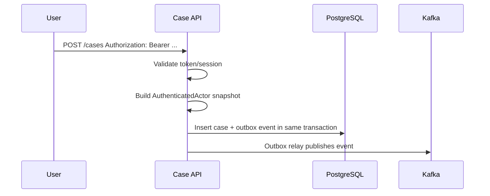
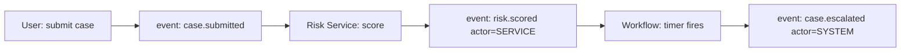

# Part 033 — Authentication in Event-Driven Systems

> Target part ini: memahami autentikasi di sistem event-driven: siapa producer-nya, siapa actor bisnisnya, bagaimana identitas dibawa di event, apa yang tidak boleh dibawa, bagaimana consumer memvalidasi event, dan bagaimana audit tetap benar walaupun request asli sudah selesai.

Autentikasi di REST biasanya mudah divisualisasikan:

```txt
request masuk -> validasi credential/token -> SecurityContext -> handler
```

Di event-driven system, event tidak datang sebagai “request user” langsung. Event bisa datang dari broker, queue, stream processor, retry topic, dead-letter topic, CDC connector, scheduler, atau service internal.

Pertanyaannya berubah:

```txt
Who produced this event?
Who was the original business actor?
Is the event allowed to represent that actor?
Is this event fresh, replayed, duplicated, or stale?
Can the consumer trust the identity metadata?
```

Jika pertanyaan ini tidak dijawab, sistem akan scalable tetapi audit dan enforcement-nya rapuh.

---

## 1. Core Distinction: Transport Identity vs Business Actor

Dalam event-driven system, minimal ada dua identity berbeda.

| Identity | Contoh | Diverifikasi oleh | Dipakai untuk |
|---|---|---|---|
| Transport/client identity | Kafka principal `User:case-service`, mTLS subject, SASL username | Broker / infrastructure | Apakah producer boleh publish ke topic |
| Business actor identity | `actorType=USER`, `actorId=user-123`, `tenantId=tenant-a` | Application contract + source-of-truth | Audit, traceability, downstream policy |

Kesalahan paling umum:

```txt
Consumer menerima event dengan actorId=user-123.
Consumer menganggap event itu benar karena ada actorId.
```

Padahal `actorId` di payload hanyalah data sampai terbukti berasal dari producer yang dipercaya dan topik yang benar.

Mental model aman:

```txt
Broker authentication proves producer/client identity.
Event metadata states business actor identity.
Consumer policy decides whether producer is allowed to assert that actor identity.
```

---

## 2. Event Authentication Stack

Event authentication bukan satu check. Ia adalah stack.



Layer-nya:

| Layer | Pertanyaan | Contoh kontrol |
|---|---|---|
| Network/TLS | Apakah koneksi terenkripsi dan peer valid? | TLS, mTLS |
| Broker auth | Siapa producer/consumer teknis? | SASL/SCRAM, mTLS, OAUTHBEARER |
| Broker authz | Client ini boleh publish/consume topic apa? | Kafka ACL, platform RBAC |
| Event envelope | Event valid dan lengkap? | `eventId`, `source`, `type`, `tenantId`, `actor` |
| Schema | Payload sesuai contract? | Avro/JSON Schema/Protobuf |
| Producer trust | Source boleh mengklaim actor ini? | allowlist producer-topic-eventType |
| Business decision | Consumer boleh memproses event ini? | domain invariant, policy engine |

Kafka mendukung SASL dengan mechanism seperti GSSAPI, PLAIN, SCRAM-SHA-256, SCRAM-SHA-512, dan OAUTHBEARER; SASL dapat berjalan dengan TLS melalui `SASL_SSL`. Ini menyelesaikan client-to-broker authentication, bukan otomatis menyelesaikan business actor propagation.

---

## 3. Event Identity Contract

Event identity harus eksplisit. Jangan berharap consumer menebak dari payload bisnis.

Minimal envelope untuk authentication-aware event:

```json
{
  "specversion": "1.0",
  "id": "evt_01HZP9VKFZ5M8S6B2V0J6C4P8H",
  "source": "urn:service:case-api",
  "type": "reg.case.created.v1",
  "time": "2026-07-03T10:15:30Z",
  "subject": "case/case_123",
  "tenantid": "tenant_a",
  "actor_type": "USER",
  "actor_id": "user_123",
  "actor_session_id": "sess_789",
  "auth_time": "2026-07-03T10:10:12Z",
  "auth_assurance": "aal2",
  "auth_methods": ["password", "totp"],
  "producer_client_id": "case-api",
  "correlation_id": "corr_abc",
  "causation_id": "cmd_xyz",
  "datacontenttype": "application/json",
  "data": {
    "caseId": "case_123",
    "createdBy": "user_123"
  }
}
```

CloudEvents mendefinisikan core context attributes seperti `id`, `source`, `type`, dan `specversion`, serta memperbolehkan extension attributes. Untuk authentication metadata, gunakan extension attribute yang jelas dan stabil.

| Metadata | Makna |
|---|---|
| `source` | sistem yang menghasilkan event |
| `producer_client_id` | client teknis yang publish |
| `actor_type` | siapa aktor bisnis: `USER`, `SERVICE`, `SYSTEM`, `JOB` |
| `actor_id` | id aktor bisnis |
| `tenantid` | tenant boundary event |
| `auth_time` | kapan actor diautentikasi |
| `auth_assurance` | strength authentication pada saat action |
| `correlation_id` | trace user journey |
| `causation_id` | command/event yang menyebabkan event ini |

Jangan campur `source` dengan `actor_id`. `source=case-api` tidak berarti actor bisnisnya `case-api`.

---

## 4. Never Put Bearer Tokens in Events

Anti-pattern terbesar:

```json
{
  "eventType": "CaseApproved",
  "accessToken": "eyJhbGciOi...",
  "caseId": "case_123"
}
```

Kenapa buruk:

1. Event dapat disimpan lama di log broker.
2. Token bisa bocor ke consumer yang tidak perlu.
3. Token expiry tidak cocok dengan event replay.
4. Refresh/revocation semantics kacau.
5. Token audience biasanya untuk API tertentu, bukan semua consumer.
6. Audit menjadi tergantung credential volatile.
7. DLQ, observability, dan debugging dapat mengekspos token.

Rule:

```txt
Event may carry an actor snapshot.
Event must not carry bearer credentials.
```

Yang boleh dibawa:

```json
{
  "actor_type": "USER",
  "actor_id": "user_123",
  "auth_assurance": "aal2",
  "auth_time": "2026-07-03T10:10:12Z"
}
```

Yang tidak boleh dibawa:

```txt
access token
refresh token
session id raw
password
API key
TOTP secret
recovery code
private key
full cookie header
Authorization header
```

---

## 5. Event Identity Is a Snapshot, Not a Live Login

Saat user melakukan action pukul 10:00, event mungkin diproses pukul 10:05, 12:00, atau replay minggu depan.

Event mewakili fakta:

```txt
At time T, actor A caused business event E under authentication context C.
```

Bukan:

```txt
Actor A is still authenticated now.
```

| Use case | Pakai actor snapshot? | Cek state terkini? |
|---|---:|---:|
| Audit log | Ya | Tidak wajib |
| Notification “case created by X” | Ya | Tidak wajib |
| Downstream materialized view | Ya | Kadang |
| Execute irreversible payment | Tidak cukup | Ya, butuh policy baru |
| Long-running approval after delay | Tidak cukup | Ya, step-up/revalidation mungkin perlu |
| Regulatory enforcement transition | Snapshot + current invariant | Ya |

Rule:

```txt
Event identity is evidence of causation.
It is not a universal authorization grant.
```

---

## 6. Producer-Side Pattern: Capture Auth Context at Command Boundary

Jangan biarkan event builder mengambil `SecurityContext` dari sembarang thread.

Capture authentication context di boundary command/request, lalu simpan sebagai immutable command context.



### Java model

```java
public enum ActorType {
    USER,
    SERVICE,
    SYSTEM,
    JOB
}

public record AuthenticatedActor(
        ActorType actorType,
        String actorId,
        String tenantId,
        String sessionId,
        Instant authTime,
        String assuranceLevel,
        List<String> authenticationMethods,
        String clientId
) {
    public AuthenticatedActor {
        Objects.requireNonNull(actorType, "actorType");
        Objects.requireNonNull(actorId, "actorId");
        Objects.requireNonNull(tenantId, "tenantId");
        Objects.requireNonNull(authTime, "authTime");
        authenticationMethods = List.copyOf(authenticationMethods == null ? List.of() : authenticationMethods);
    }
}

public record EventIdentity(
        String eventId,
        String source,
        String type,
        String subject,
        String tenantId,
        AuthenticatedActor actor,
        String correlationId,
        String causationId,
        Instant occurredAt
) {}
```

### Extract from Spring Security

```java
public final class AuthenticatedActorFactory {

    public AuthenticatedActor from(Authentication authentication, String tenantId) {
        if (authentication == null || !authentication.isAuthenticated()) {
            throw new IllegalStateException("Authenticated request required");
        }

        if (authentication instanceof JwtAuthenticationToken jwtAuth) {
            Jwt jwt = jwtAuth.getToken();
            return new AuthenticatedActor(
                    ActorType.USER,
                    jwt.getSubject(),
                    tenantId,
                    claim(jwt, "sid"),
                    jwt.getIssuedAt() != null ? jwt.getIssuedAt() : Instant.now(),
                    claim(jwt, "acr"),
                    listClaim(jwt, "amr"),
                    claim(jwt, "azp")
            );
        }

        return new AuthenticatedActor(
                ActorType.USER,
                authentication.getName(),
                tenantId,
                null,
                Instant.now(),
                "unknown",
                List.of(authentication.getClass().getSimpleName()),
                null
        );
    }

    private static String claim(Jwt jwt, String name) {
        Object value = jwt.getClaims().get(name);
        return value == null ? null : value.toString();
    }

    @SuppressWarnings("unchecked")
    private static List<String> listClaim(Jwt jwt, String name) {
        Object value = jwt.getClaims().get(name);
        if (value instanceof Collection<?> values) {
            return values.stream().map(Object::toString).toList();
        }
        return List.of();
    }
}
```

Invariant:

```txt
Authentication context is captured once at command boundary.
Outbox relay only publishes already captured event metadata.
Relay must not invent actor identity from its own service account.
```

---

## 7. Outbox Pattern for Identity Preservation

Jika service menyimpan state bisnis dan publish event, gunakan outbox untuk menjaga atomicity.

```sql
create table event_outbox (
    outbox_id uuid primary key,
    aggregate_type text not null,
    aggregate_id text not null,
    event_type text not null,
    event_version int not null,
    tenant_id text not null,

    actor_type text not null,
    actor_id text not null,
    actor_session_id text null,
    actor_auth_time timestamptz null,
    actor_assurance text null,
    actor_methods jsonb not null default '[]',
    actor_client_id text null,

    correlation_id text not null,
    causation_id text null,
    payload jsonb not null,
    headers jsonb not null default '{}',

    created_at timestamptz not null default now(),
    published_at timestamptz null,
    publish_attempts int not null default 0
);

create index idx_event_outbox_pending
    on event_outbox(created_at)
    where published_at is null;
```

Kenapa identity metadata disimpan di outbox?

```txt
HTTP request thread punya SecurityContext.
Outbox relay thread tidak punya SecurityContext user.
```

Jika relay membaca `SecurityContextHolder`, hasilnya salah atau kosong.

```java
@Transactional
public CaseId createCase(CreateCaseCommand command, AuthenticatedActor actor) {
    CaseEntity saved = caseRepository.save(CaseEntity.newDraft(
            command.caseType(),
            actor.tenantId(),
            actor.actorId()
    ));

    EventIdentity identity = new EventIdentity(
            EventIds.newId(),
            "urn:service:case-api",
            "reg.case.created.v1",
            "case/" + saved.id(),
            actor.tenantId(),
            actor,
            command.correlationId(),
            command.commandId(),
            Instant.now()
    );

    outboxRepository.append(identity, Map.of(
            "caseId", saved.id().toString(),
            "caseType", saved.caseType()
    ));

    return saved.id();
}
```

---

## 8. Kafka Producer Authentication

Kafka producer authentication memastikan client teknis yang publish ke broker adalah client yang dikenal.

| Mechanism | Kapan cocok | Catatan |
|---|---|---|
| mTLS | workload identity berbasis cert | Operasional cert lifecycle penting |
| SASL/SCRAM | service credential sederhana | Secret rotation harus rapi |
| SASL/OAUTHBEARER | integrasi OAuth/IdP | Token acquisition + refresh perlu dikelola |
| Kerberos/GSSAPI | enterprise legacy/AD-heavy | Kompleks, tetapi kuat untuk environment tertentu |

### Producer config with SASL/SCRAM

```java
Map<String, Object> props = new HashMap<>();
props.put(ProducerConfig.BOOTSTRAP_SERVERS_CONFIG, "kafka-1:9093,kafka-2:9093");
props.put(CommonClientConfigs.SECURITY_PROTOCOL_CONFIG, "SASL_SSL");
props.put(SaslConfigs.SASL_MECHANISM, "SCRAM-SHA-512");
props.put(SaslConfigs.SASL_JAAS_CONFIG, """
    org.apache.kafka.common.security.scram.ScramLoginModule required
    username="case-api"
    password="${KAFKA_CASE_API_SECRET}";
    """);
props.put(SslConfigs.SSL_TRUSTSTORE_LOCATION_CONFIG, "/etc/security/kafka/truststore.p12");
props.put(SslConfigs.SSL_TRUSTSTORE_PASSWORD_CONFIG, System.getenv("KAFKA_TRUSTSTORE_PASSWORD"));
```

Production note:

```txt
Do not hard-code JAAS secrets in source code.
Prefer secret manager / mounted secret / callback handler.
Rotate producer credentials independently per service.
```

Topic ACL principle:

```txt
case-api may write reg.case.* topics.
case-api must not write reg.payment.* topics.
notification-service may read case events.
notification-service must not write case decision events.
```

Broker-level authz is not a replacement for event validation, but it reduces blast radius.

---

## 9. Event Envelope Validation on Consumer Side

A consumer must not deserialize business payload and execute first.

Correct order:

```txt
1. Validate broker client context if available.
2. Validate topic -> event type mapping.
3. Validate envelope fields.
4. Validate schema version.
5. Validate tenant boundary.
6. Validate producer trust policy.
7. Check idempotency/replay.
8. Execute business handler.
```

```java
public final class EventEnvelopeValidator {

    private final ProducerTrustPolicy producerTrustPolicy;
    private final ProcessedEventRepository processedEvents;

    public void validate(EventEnvelope event, ConsumerContext consumerContext) {
        requireNonBlank(event.id(), "event.id");
        requireNonBlank(event.source(), "event.source");
        requireNonBlank(event.type(), "event.type");
        requireNonBlank(event.tenantId(), "event.tenantId");
        requireNonBlank(event.actor().actorId(), "actor.actorId");
        requireNonBlank(event.correlationId(), "correlationId");

        if (!producerTrustPolicy.canAssert(
                event.source(),
                event.type(),
                event.tenantId(),
                event.actor().actorType())) {
            throw new RejectedEventException("Producer is not trusted for event identity");
        }

        if (processedEvents.alreadyProcessed(event.id())) {
            throw new DuplicateEventException(event.id());
        }
    }

    private static void requireNonBlank(String value, String field) {
        if (value == null || value.isBlank()) {
            throw new RejectedEventException("Missing " + field);
        }
    }
}
```

Producer trust policy example:

```yaml
trustedEventSources:
  - source: "urn:service:case-api"
    eventTypes:
      - "reg.case.created.v1"
      - "reg.case.submitted.v1"
    actorTypes:
      - "USER"
      - "SERVICE"
    tenants: "*"

  - source: "urn:service:scheduler"
    eventTypes:
      - "reg.case.sla.expired.v1"
    actorTypes:
      - "SYSTEM"
    tenants: "*"
```

Invariant:

```txt
Not every producer may assert every actor type.
```

A scheduler may produce system events. It should not claim `actor_type=USER` unless there is a formally modeled delegated action.

---

## 10. Actor Types in Async Systems

Do not force all async events to look user-driven.

| Actor type | Meaning | Example |
|---|---|---|
| `USER` | Human user caused action | Case officer submits case |
| `SERVICE` | Service account caused action | Risk service recalculates score |
| `SYSTEM` | Platform/system rule caused action | SLA timer expired |
| `JOB` | Batch job caused action | nightly reconciliation |
| `EXTERNAL_PARTNER` | Partner system caused action | bank sends payment status |

Bad event:

```json
{
  "type": "reg.case.autoClosed.v1",
  "actor_id": "admin-user-1"
}
```

Better event:

```json
{
  "type": "reg.case.autoClosed.v1",
  "actor_type": "SYSTEM",
  "actor_id": "sla-auto-close-policy",
  "causation_id": "timer_123",
  "policy_version": "sla-close-v7"
}
```

Audit menjadi defensible karena mengatakan apa yang benar-benar terjadi.

---

## 11. Tenant Identity in Events

Every authentication-aware event in a multi-tenant system should carry tenant identity explicitly.

```json
{
  "tenantid": "tenant_a",
  "actor_id": "user_123",
  "subject": "case/case_123"
}
```

Consumer invariant:

```txt
event.tenantId must match aggregate tenant boundary.
```

Do not infer tenant only from topic name. Topic name can help partitioning, but payload/envelope still needs tenant identity for audit, replay, DLQ, and cross-region processing.

```java
if (!event.tenantId().equals(caseEntity.tenantId())) {
    throw new RejectedEventException("Tenant mismatch: event cannot mutate aggregate");
}
```

---

## 12. Idempotency and Replay Defense

Event-driven systems normally deliver at-least-once. Duplicates happen.

```sql
create table processed_event (
    consumer_name text not null,
    event_id text not null,
    tenant_id text not null,
    event_type text not null,
    source text not null,
    actor_id text not null,
    processed_at timestamptz not null default now(),
    primary key (consumer_name, event_id)
);
```

```java
@Transactional
public void handle(EventEnvelope event) {
    validator.validate(event, ConsumerContext.current());

    if (!processedEventRepository.tryMarkProcessing("notification-service", event)) {
        return; // duplicate; safe no-op
    }

    notificationService.sendCaseCreatedNotification(event);
}
```

Replay defense is not only about attack. It is also about operational correctness.

A replayed `PasswordResetRequested` or `MfaDisabled` event can become a security incident if consumer side effects are not idempotent.

---

## 13. Event Signing: When Broker Trust Is Not Enough

Broker authentication is enough for many internal systems if producers are controlled, ACLs are strong, topics are private, and event storage is protected.

Event signing becomes useful when:

| Scenario | Why sign? |
|---|---|
| External partner webhook to event bridge | Need proof payload came from partner |
| Cross-organization event exchange | Broker boundary not shared |
| Long-term audit evidence | Need tamper-evidence beyond broker ACL |
| Multi-hop event bus | Need source integrity after relay |
| Untrusted intermediary | Need end-to-end integrity |

Minimal signing model:

```txt
signature = HMAC(secret, canonical(event headers + payload hash))
```

Or asymmetric:

```txt
signature = Sign(privateKey, canonical(event headers + payload hash))
consumer verifies with producer public key
```

Event signing does not eliminate broker auth. It adds source integrity.

---

## 14. Spring Kafka: Injecting Authentication Metadata

Producer-side interceptor can add technical headers, but business actor should usually be constructed explicitly by application code.

```java
public final class EventHeaders {
    public static final String EVENT_ID = "ce_id";
    public static final String EVENT_SOURCE = "ce_source";
    public static final String EVENT_TYPE = "ce_type";
    public static final String TENANT_ID = "ce_tenantid";
    public static final String ACTOR_TYPE = "ce_actor_type";
    public static final String ACTOR_ID = "ce_actor_id";
    public static final String CORRELATION_ID = "correlation_id";

    private EventHeaders() {}
}
```

```java
public ProducerRecord<String, byte[]> toRecord(EventEnvelope event, byte[] payload) {
    ProducerRecord<String, byte[]> record = new ProducerRecord<>(
            topicFor(event.type()),
            event.tenantId() + ":" + event.subject(),
            payload
    );

    add(record, EventHeaders.EVENT_ID, event.id());
    add(record, EventHeaders.EVENT_SOURCE, event.source());
    add(record, EventHeaders.EVENT_TYPE, event.type());
    add(record, EventHeaders.TENANT_ID, event.tenantId());
    add(record, EventHeaders.ACTOR_TYPE, event.actor().actorType().name());
    add(record, EventHeaders.ACTOR_ID, event.actor().actorId());
    add(record, EventHeaders.CORRELATION_ID, event.correlationId());

    return record;
}
```

Consumer reconstruction:

```java
@KafkaListener(topics = "reg.case-events")
public void onMessage(ConsumerRecord<String, byte[]> record) {
    EventEnvelope envelope = envelopeReader.from(record.headers(), record.value());
    eventEnvelopeValidator.validate(envelope, ConsumerContext.kafka(record));
    caseEventHandler.handle(envelope, record.value());
}
```

Do not read `SecurityContextHolder` inside `@KafkaListener` and expect user identity. There is no HTTP request security context there unless you explicitly created one for internal processing.

---

## 15. Mapping Event Actor to SecurityContext: Use Sparingly

Sometimes downstream service code already depends on `Authentication`.

You may create an internal `Authentication` from event actor, but it must be explicit and scoped.

```java
public final class EventActorAuthentication extends AbstractAuthenticationToken {
    private final AuthenticatedActor actor;

    public EventActorAuthentication(AuthenticatedActor actor, Collection<GrantedAuthority> authorities) {
        super(authorities);
        this.actor = actor;
        setAuthenticated(true);
    }

    @Override
    public Object getCredentials() {
        return "event-actor-snapshot";
    }

    @Override
    public Object getPrincipal() {
        return actor;
    }

    @Override
    public String getName() {
        return actor.actorId();
    }
}
```

Scoped execution:

```java
public void withEventSecurityContext(EventEnvelope event, Runnable handler) {
    SecurityContext previous = SecurityContextHolder.getContext();
    SecurityContext context = SecurityContextHolder.createEmptyContext();

    try {
        context.setAuthentication(new EventActorAuthentication(event.actor(), List.of()));
        SecurityContextHolder.setContext(context);
        handler.run();
    } finally {
        SecurityContextHolder.clearContext();
        SecurityContextHolder.setContext(previous);
    }
}
```

Warning:

```txt
An event actor snapshot is not equivalent to a freshly authenticated user.
Do not grant live interactive privileges from it.
```

Better: pass `EventActor` explicitly through domain service methods.

---

## 16. Authorization in Consumers

Authentication metadata answers “who/what caused this event?”

Consumer authorization asks:

```txt
Is this consumer allowed to process this event and mutate this aggregate?
```

Do not assume upstream authorization is always enough.

```java
public void apply(CaseApproved event) {
    CaseRecord caseRecord = caseRepository.require(event.caseId());

    if (!caseRecord.tenantId().equals(event.tenantId())) {
        throw new RejectedEventException("Cross-tenant event rejected");
    }

    if (!caseRecord.isSubmitted()) {
        throw new RejectedEventException("Cannot approve non-submitted case");
    }

    // proceed
}
```

---

## 17. Long-Running Workflows and Authentication Drift

Event-driven workflows can outlive sessions, roles, and even employment.

```txt
Day 1: user submits enforcement case.
Day 3: risk scoring completes.
Day 7: decision workflow auto-escalates.
Day 10: user account is disabled.
```

Which actor should be in audit?

| Event | Actor |
|---|---|
| `case.submitted` | original user |
| `risk.scored` | risk service |
| `case.auto_escalated` | escalation policy/system |
| `case.final_decision_submitted` | current decision maker |

Do not propagate the original user forever as if they are doing every step.



Audit should say:

```txt
The user caused submission.
The risk service caused scoring.
The policy caused escalation.
```

---

## 18. Dead Letter Queue Security

DLQ often leaks sensitive metadata.

Rules:

1. Do not put credentials in event.
2. Redact sensitive payload fields before DLQ if possible.
3. Restrict DLQ consumers more tightly than normal topic consumers.
4. Treat DLQ replay as privileged operation.
5. Include rejection reason without dumping secrets.
6. Log event id, source, type, tenant, actor id, not full token/header.

DLQ replay must preserve original identity metadata.

```txt
Replay actor = operator who initiated replay.
Original actor = actor in original event.
```

Represent both:

```json
{
  "original_actor_id": "user_123",
  "replay_actor_id": "ops_456",
  "replay_reason": "fixed schema mapping bug",
  "replay_time": "2026-07-03T12:00:00Z"
}
```

---

## 19. Observability

Log these fields for every accepted/rejected event:

| Field | Purpose |
|---|---|
| `event_id` | idempotency, replay trace |
| `event_type` | policy and debugging |
| `source` | producer trust |
| `tenant_id` | isolation |
| `actor_type` | audit semantics |
| `actor_id` | causation |
| `consumer` | processing owner |
| `topic` / `partition` / `offset` | broker trace |
| `correlation_id` | user journey |
| `rejection_reason` | detection |

Metrics:

```txt
events.accepted.count{type,source,tenant}
events.rejected.count{reason,type,source}
events.duplicate.count{consumer,type}
events.cross_tenant_rejected.count{source,type}
events.missing_actor.count{source,type}
events.dlq.count{reason,type}
```

Alert examples:

```txt
source not in allowlist starts producing events
sudden spike in cross-tenant rejection
event type appears on unexpected topic
missing actor metadata after deployment
DLQ contains security-sensitive event type
```

---

## 20. Testing Strategy

Unit tests:

```txt
missing actor -> reject
missing tenant -> reject
unknown source -> reject
source cannot assert USER actor -> reject
duplicate event id -> no-op
cross-tenant aggregate mutation -> reject
```

Contract tests:

```txt
event type
schema version
required identity metadata
tenant metadata
auth assurance representation
correlation/causation id
```

Security regression fixture:

```json
{
  "id": "evt_attack_1",
  "source": "urn:service:notification-service",
  "type": "reg.case.approved.v1",
  "tenantid": "tenant_b",
  "actor_type": "USER",
  "actor_id": "admin-user"
}
```

Expected:

```txt
Rejected because notification-service cannot assert case.approved.
Rejected because aggregate tenant mismatch.
```

Replay tests:

```txt
same event twice -> side effect once
same event after consumer restart -> side effect once
DLQ replay -> original actor preserved + replay operator recorded
```

---

## 21. Failure Modes

| Failure mode | Cause | Impact | Control |
|---|---|---|---|
| Token-in-event leak | Bearer token serialized in payload/header | Credential compromise | Never put credentials in events; redaction |
| Actor spoofing | Consumer trusts `actorId` blindly | Audit fraud, privilege abuse | Producer trust policy |
| Cross-tenant replay | Event from tenant A mutates tenant B | Data breach | Tenant invariant check |
| SecurityContext misuse | Kafka listener reads stale ThreadLocal | Wrong principal | Explicit actor context; cleanup |
| Relay actor overwrite | Outbox relay uses service account as actor | Audit loss | Store actor in outbox |
| Infinite user propagation | Long workflow keeps original user for all actions | False audit | Model SERVICE/SYSTEM actors |
| Broker ACL too broad | Any service writes any topic | Event injection | Least privilege ACL |
| DLQ overexposure | DLQ accessible widely | Sensitive data leak | DLQ access control/redaction |
| Replay side effect | Duplicate event sends emails/payment twice | Operational/security damage | Idempotency table |
| Stale assurance misuse | Old `aal2` event used for new sensitive action | Policy bypass | Revalidate for sensitive action |

---

## 22. Production Checklist

```txt
[ ] Producer identity is authenticated at broker or gateway boundary.
[ ] Producer is authorized only for required topics.
[ ] Event envelope includes event id, source, type, time, tenant, actor, correlation id.
[ ] Bearer tokens, sessions, cookies, API keys, and secrets are never placed in events.
[ ] Consumer validates producer trust policy before business handling.
[ ] Consumer validates tenant boundary before aggregate mutation.
[ ] Event idempotency is implemented per consumer.
[ ] DLQ replay preserves original actor and records replay operator.
[ ] Long-running workflows model USER, SERVICE, SYSTEM, and JOB actors explicitly.
[ ] Audit logs include event id, source, actor, tenant, consumer, topic, partition, offset.
[ ] Security tests include spoofed actor, wrong source, wrong tenant, duplicate event.
[ ] Observability alerts detect unknown source, missing metadata, cross-tenant rejection.
```

---

## 23. Mental Model Summary

Event-driven authentication is not “validate JWT in consumer”.

The correct model:

```txt
Broker authenticates technical producer.
Envelope carries business actor snapshot.
Consumer validates source, tenant, event type, and producer trust.
Business handler enforces domain invariants.
Audit records causation without pretending the original session still exists.
```

The hardest part is keeping identities separate:

```txt
producer identity != actor identity
actor snapshot != live login
event source != tenant
replay operator != original actor
service action != user action
```

If you preserve those distinctions, event-driven authentication becomes defensible.

---

## References

- Apache Kafka Documentation — Authentication using SASL: https://kafka.apache.org/documentation/#security_sasl
- Apache Kafka Documentation — Security: https://kafka.apache.org/documentation/#security
- CloudEvents Specification: https://github.com/cloudevents/spec/blob/main/cloudevents/spec.md
- Spring for Apache Kafka Reference: https://docs.spring.io/spring-kafka/reference/
- Spring Security Resource Server JWT: https://docs.spring.io/spring-security/reference/servlet/oauth2/resource-server/jwt.html
- RFC 6750 — OAuth 2.0 Bearer Token Usage: https://datatracker.ietf.org/doc/html/rfc6750
- RFC 8725 — JWT Best Current Practices: https://www.rfc-editor.org/rfc/rfc8725
- RFC 9700 — OAuth 2.0 Security Best Current Practice: https://www.rfc-editor.org/rfc/rfc9700
