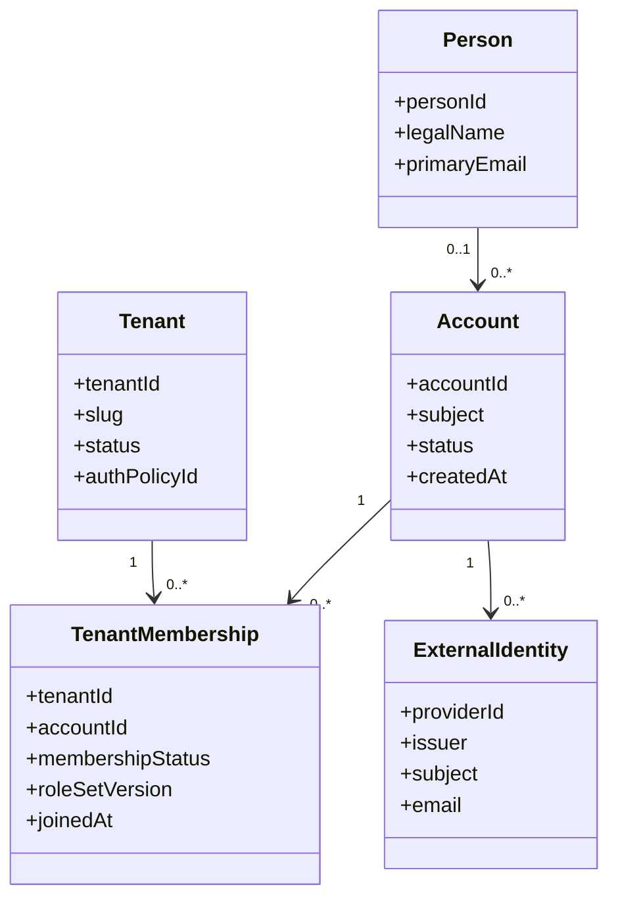
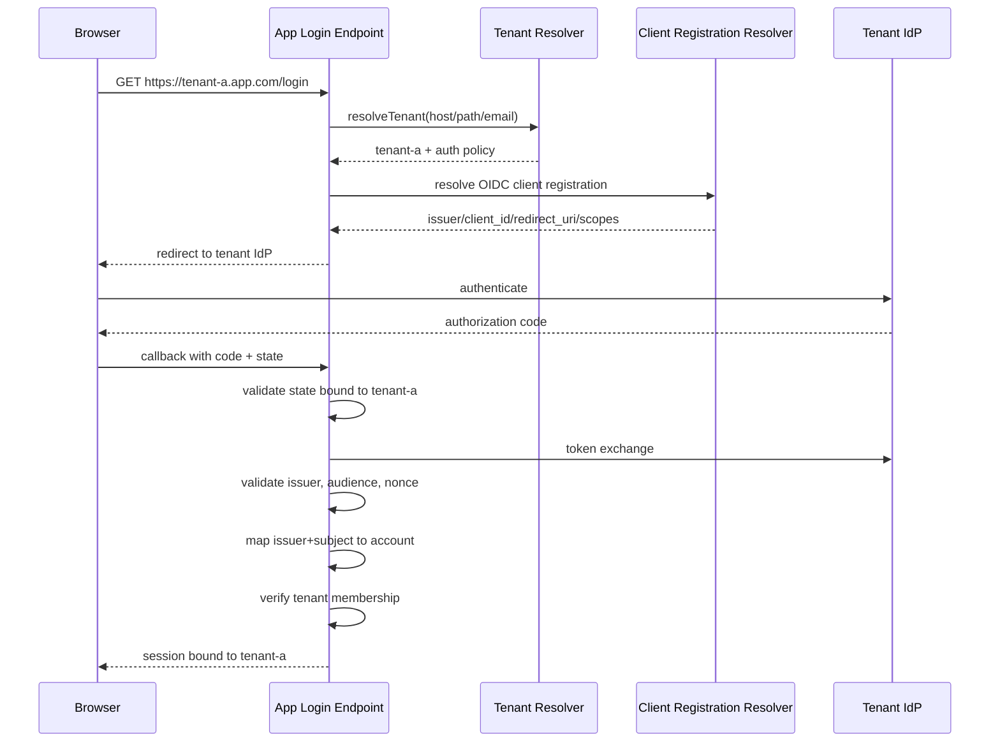
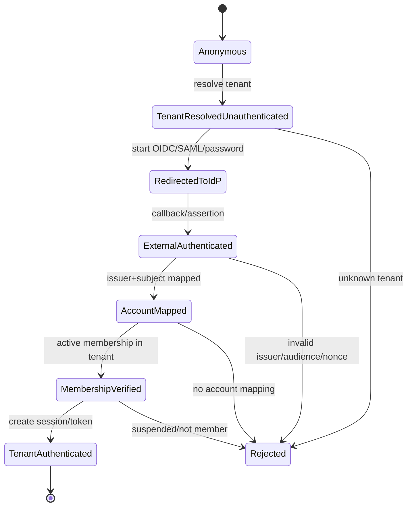
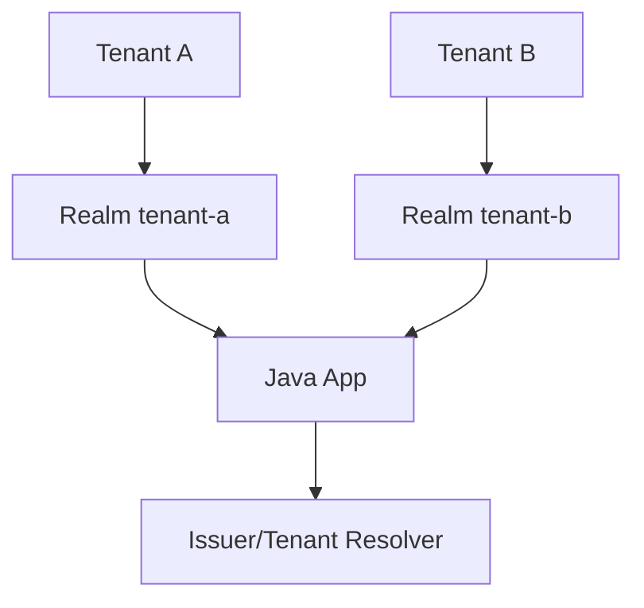
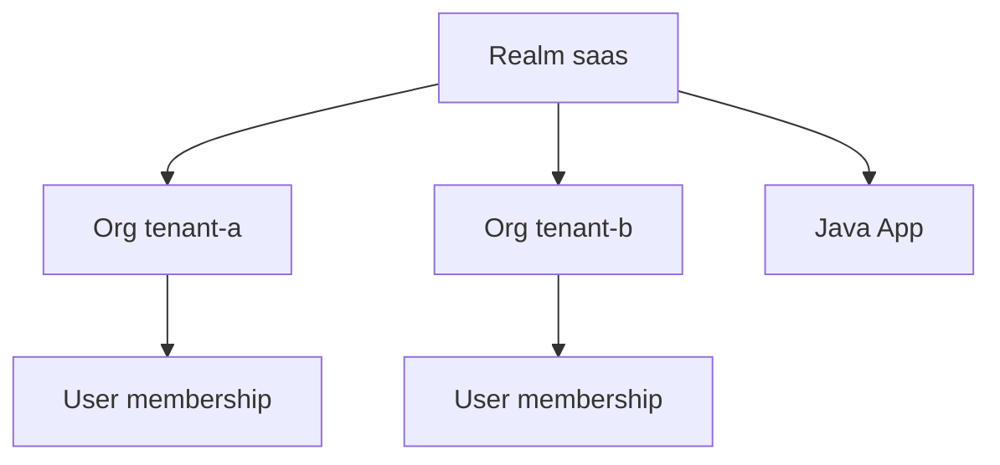

# Part 034 — Multi-Tenant Authentication

> Target part ini: membangun mental model dan implementation pattern untuk autentikasi multi-tenant: bagaimana tenant ditemukan, bagaimana token divalidasi per tenant, bagaimana user/account/membership dimodelkan, bagaimana session/token dibatasi tenant, dan bagaimana mencegah confused deputy serta cross-tenant login bug.

Multi-tenant authentication adalah salah satu tempat paling berbahaya untuk “asumsi kecil”.

Contoh asumsi kecil:

```txt
User email is globally unique.
Tenant can be inferred from subdomain.
All tenants use the same IdP.
Token issuer is enough.
One session can switch tenant safely.
Admin in tenant A is admin everywhere.
```

Asumsi seperti ini sering tidak meledak saat MVP. Ia meledak saat enterprise tenant, federation, SSO, custom domain, delegated admin, merger organisasi, atau regulatory audit masuk.

Autentikasi multi-tenant harus menjawab empat pertanyaan sebelum user dianggap authenticated untuk tenant tertentu:

```txt
Which tenant is this authentication attempt for?
Which identity provider is authoritative for that tenant?
Which account/membership does the external identity map to?
Which tenant boundary is bound to the resulting session/token?
```

---

## 1. Tenant Is a Security Boundary, Not a UI Filter

Tenant bukan sekadar kolom `tenant_id` di database.

Dalam authentication, tenant menentukan:

| Area | Dampak tenant |
|---|---|
| Login routing | IdP mana, realm mana, policy mana |
| Credential store | password/passkey milik tenant mana |
| Session binding | session valid untuk tenant apa |
| Token validation | issuer/JWKS/audience mana |
| MFA policy | factor dan step-up per tenant |
| Recovery flow | siapa boleh recover account |
| Audit | tenant context semua auth event |
| Rate limiting | per tenant + global abuse control |
| Authorization handoff | membership/role/scope tenant mana |

Invariant utama:

```txt
No authenticated principal exists without an explicit tenant context
unless the operation is intentionally tenant-discovery or global-admin scoped.
```

---

## 2. Identity Model: Person, Account, Membership

Jangan langsung samakan `User` dengan tenant user.

Production-grade model biasanya memisahkan:



Satu manusia bisa punya:

```txt
account berbeda di tenant berbeda
external identity berbeda per enterprise tenant
email sama tapi issuer berbeda
membership aktif di tenant A, suspended di tenant B
MFA requirement berbeda per tenant
```

Do not use email as global identity key.

Safer federated identity key:

```txt
(issuer, subject)
```

Safer tenant membership key:

```txt
(tenant_id, account_id)
```

---

## 3. Tenant Resolution Strategies

Tenant harus ditemukan sebelum authentication dapat diarahkan.

| Strategy | Example | Strength | Risk |
|---|---|---|---|
| Subdomain | `tenant-a.app.com` | Natural SaaS routing | custom domain complexity |
| Custom domain | `login.customer.com` | Enterprise-friendly | domain ownership proof needed |
| Path | `/t/tenant-a/login` | Simple | leak tenant in URL, routing mistakes |
| Header | `X-Tenant-Id` | API-friendly | spoofable unless boundary controlled |
| Login identifier | user enters email first | Good for IdP discovery | enumeration risk |
| Token issuer | `iss=https://idp/realms/a` | Strong post-auth | not available pre-login |
| Organization claim | `org_id=tenant-a` | Good if trusted IdP | must validate issuer/audience |

Use different resolution modes for different phases.

```txt
Pre-auth browser login:
  subdomain/custom domain/identity-first discovery

API request with token:
  issuer + audience + tenant claim validation

Internal service call:
  mTLS/service identity + explicit tenant context

Admin/global operation:
  explicit global scope + audited tenant selection
```

---

## 4. Tenant Resolution Flow



Critical checks:

```txt
state must bind tenant id
redirect_uri must match tenant/client registration
issuer must match tenant policy
subject must map to account
membership must be active for tenant
session must be bound to tenant
```

---

## 5. The Login Boundary: Unauthenticated but Tenant-Aware

Before authentication, user is not known.

But tenant may already be known. This is a special state:

```txt
TenantResolvedUnauthenticated
```

Do not treat it as authenticated.



This model prevents a subtle bug:

```txt
External identity is valid, but not valid for this tenant.
```

---

## 6. Tenant Binding in Sessions

A session must carry tenant context.

```java
public record TenantAuthenticatedPrincipal(
        String accountId,
        String tenantId,
        String subject,
        String issuer,
        String sessionId,
        String assuranceLevel,
        Set<String> roles,
        Instant authenticatedAt
) implements Serializable {}
```

Session invariant:

```txt
Every authenticated session is bound to exactly one active tenant context,
or is a clearly marked global-admin session with explicit tenant switching controls.
```

### Tenant switching

If user belongs to multiple tenants, there are two safer models.

#### Model A: One session per tenant

```txt
login tenant-a -> session tenant-a
switch tenant-b -> new auth/session or verified tenant switch event
```

Pros: clear audit, clear cookie/session semantics, simple authorization checks. Cons: more redirects and more session entries.

#### Model B: One global login + active tenant context

```txt
login once -> account session
select active tenant -> tenant-bound context inside session
```

Pros: better UX. Cons: higher risk of confused tenant context; every action must bind CSRF/state/request to active tenant.

For regulated workflows, prefer explicit tenant-bound session for sensitive operations.

---

## 7. Cookie Domain and Tenant Isolation

Cookie config can break tenant isolation.

Dangerous cookie:

```txt
Set-Cookie: SESSION=abc; Domain=.app.com; Path=/; Secure; HttpOnly; SameSite=Lax
```

This cookie is shared across subdomains.

If each tenant is on subdomain:

```txt
tenant-a.app.com
tenant-b.app.com
```

A broad cookie domain can cause session confusion if application routing is weak.

| Model | Cookie domain | Notes |
|---|---|---|
| Tenant-specific subdomain session | host-only cookie | Strong isolation |
| Central login domain | login cookie on login domain only | App receives tenant session after callback |
| BFF same origin | host-only session cookie | Recommended for browser apps |
| Cross-tenant dashboard | strict active tenant binding | More complex |

Rule:

```txt
Cookie scope must not be broader than the trust boundary you can enforce.
```

---

## 8. JWT Claims for Multi-Tenant Authentication

A tenant-aware access token should make boundary explicit.

```json
{
  "iss": "https://idp.example.com/realms/tenant-a",
  "sub": "f7b4a9d2-...",
  "aud": "case-api",
  "azp": "web-bff",
  "exp": 1783070400,
  "iat": 1783066800,
  "tenant_id": "tenant-a",
  "org_id": "tenant-a",
  "membership_id": "mbr_123",
  "membership_version": 42,
  "acr": "aal2",
  "amr": ["pwd", "otp"],
  "scope": "case:read case:write"
}
```

| Claim | Purpose |
|---|---|
| `iss` | IdP/realm authority |
| `sub` | stable subject under issuer |
| `aud` | resource server boundary |
| `azp` / `client_id` | client/application identity |
| `tenant_id` / `org_id` | tenant boundary |
| `membership_id` | account-tenant relationship |
| `membership_version` | detect stale role/membership |
| `acr` | authentication assurance |
| `amr` | authentication methods |

Never trust `tenant_id` alone without validating issuer and audience.

```txt
tenant_id is a claim.
issuer + signature + audience + trust config make it meaningful.
```

---

## 9. Issuer Strategies

### Strategy A: Realm/issuer per tenant

```txt
https://idp.example.com/realms/tenant-a
https://idp.example.com/realms/tenant-b
```

Pros:

```txt
strong isolation
separate keys/policies/clients
enterprise customization
simple tenant inference from iss
```

Cons:

```txt
operational overhead
many realms/clients
cross-tenant user journey harder
key rotation/config scaling
```

### Strategy B: Single issuer with tenant/org claim

```txt
iss=https://idp.example.com/realms/saas
org_id=tenant-a
```

Pros:

```txt
simpler operations
shared login UX
shared clients
better for many small tenants
```

Cons:

```txt
tenant isolation relies on claims/policy
misconfiguration can leak roles
custom enterprise federation harder
```

### Strategy C: Hybrid

```txt
small tenants -> shared realm/org model
enterprise tenants -> dedicated realm/issuer
regulated tenants -> dedicated IdP or brokered federation
```

Most real platforms end up hybrid.

---

## 10. Keycloak Multi-Tenant Patterns

Keycloak can be used in several tenant models.

| Pattern | How it works | Fit |
|---|---|---|
| Realm per tenant | each tenant has realm | strong isolation, enterprise |
| Single realm + groups/roles | tenants represented inside one realm | small/medium SaaS |
| Single realm + organizations | organization-aware CIAM style | SaaS tenant membership |
| Identity brokering | tenant IdP federated into platform | enterprise SSO |
| Dedicated Keycloak instance | tenant has instance | high isolation/regulatory |

Keycloak Organizations feature introduces organization-aware authentication behavior in a realm. That makes it relevant for SaaS/CIAM scenarios where a user authenticates in the context of an organization. But it does not eliminate application-side tenant authorization and data isolation.

### Realm per tenant mental model



### Single realm organization model



Decision rule:

```txt
If tenant-specific identity policy, federation, keys, compliance, or blast-radius isolation matters strongly, prefer dedicated issuer/realm.
If operational scale and uniform policy matter more, use shared issuer with strong organization/tenant claim controls.
```

---

## 11. Spring Security: Tenant-Aware JWT Validation

For resource servers, Spring Security can route authentication by request using `AuthenticationManagerResolver<HttpServletRequest>`. This is the right extension point when issuer/tenant varies per request.

```java
public interface TenantResolver {
    Optional<TenantAuthConfig> resolve(HttpServletRequest request);
}

public record TenantAuthConfig(
        String tenantId,
        String issuer,
        String jwkSetUri,
        Set<String> audiences
) {}
```

```java
@Bean
AuthenticationManagerResolver<HttpServletRequest> tenantAuthenticationManagerResolver(
        TenantResolver tenantResolver,
        JwtDecoderFactory<TenantAuthConfig> decoderFactory
) {
    ConcurrentMap<String, AuthenticationManager> managers = new ConcurrentHashMap<>();

    return request -> {
        TenantAuthConfig tenant = tenantResolver.resolve(request)
                .orElseThrow(() -> new BadCredentialsException("Unknown tenant"));

        return managers.computeIfAbsent(tenant.tenantId(), key -> {
            JwtAuthenticationProvider provider = new JwtAuthenticationProvider(decoderFactory.createDecoder(tenant));
            provider.setJwtAuthenticationConverter(tenantAwareJwtAuthenticationConverter(tenant));
            return provider::authenticate;
        });
    };
}
```

```java
@Bean
SecurityFilterChain apiSecurity(
        HttpSecurity http,
        AuthenticationManagerResolver<HttpServletRequest> resolver
) throws Exception {
    return http
            .csrf(csrf -> csrf.disable())
            .oauth2ResourceServer(oauth2 -> oauth2.authenticationManagerResolver(resolver))
            .authorizeHttpRequests(auth -> auth
                    .requestMatchers("/actuator/health").permitAll()
                    .anyRequest().authenticated()
            )
            .build();
}
```

Tenant-aware decoder:

```java
public final class TenantJwtDecoderFactory implements JwtDecoderFactory<TenantAuthConfig> {

    @Override
    public JwtDecoder createDecoder(TenantAuthConfig tenant) {
        NimbusJwtDecoder decoder = NimbusJwtDecoder.withJwkSetUri(tenant.jwkSetUri()).build();

        OAuth2TokenValidator<Jwt> withIssuer = JwtValidators.createDefaultWithIssuer(tenant.issuer());
        OAuth2TokenValidator<Jwt> withAudience = jwt -> {
            boolean ok = jwt.getAudience().stream().anyMatch(tenant.audiences()::contains);
            return ok
                    ? OAuth2TokenValidatorResult.success()
                    : OAuth2TokenValidatorResult.failure(new OAuth2Error("invalid_token", "Invalid audience", null));
        };
        OAuth2TokenValidator<Jwt> withTenant = jwt -> {
            String tenantId = jwt.getClaimAsString("tenant_id");
            return tenant.tenantId().equals(tenantId)
                    ? OAuth2TokenValidatorResult.success()
                    : OAuth2TokenValidatorResult.failure(new OAuth2Error("invalid_token", "Invalid tenant", null));
        };

        decoder.setJwtValidator(new DelegatingOAuth2TokenValidator<>(withIssuer, withAudience, withTenant));
        return decoder;
    }
}
```

Critical invariant:

```txt
Tenant resolution and token validation must agree.
```

If host says tenant A but token says tenant B, reject.

---

## 12. Tenant Context Filter

Even after authentication, application code needs tenant context. Use a scoped context with cleanup.

```java
public final class TenantContextHolder {
    private static final ThreadLocal<String> TENANT = new ThreadLocal<>();

    public static void set(String tenantId) {
        TENANT.set(Objects.requireNonNull(tenantId));
    }

    public static String requireTenantId() {
        String tenantId = TENANT.get();
        if (tenantId == null) {
            throw new IllegalStateException("Tenant context missing");
        }
        return tenantId;
    }

    public static void clear() {
        TENANT.remove();
    }
}
```

```java
public final class TenantContextFilter extends OncePerRequestFilter {

    @Override
    protected void doFilterInternal(
            HttpServletRequest request,
            HttpServletResponse response,
            FilterChain filterChain
    ) throws ServletException, IOException {
        try {
            Authentication authentication = SecurityContextHolder.getContext().getAuthentication();
            if (authentication instanceof JwtAuthenticationToken jwtAuth) {
                String tenantId = jwtAuth.getToken().getClaimAsString("tenant_id");
                TenantContextHolder.set(tenantId);
            }
            filterChain.doFilter(request, response);
        } finally {
            TenantContextHolder.clear();
        }
    }
}
```

Important:

```txt
ThreadLocal tenant context must be cleared exactly like SecurityContext.
```

Otherwise tenant leakage can happen across pooled servlet threads.

---

## 13. Tenant-Aware OIDC Login

Resource server validation handles API tokens. Interactive login needs dynamic OIDC client registration.

You need to bind:

```txt
login request tenant -> client registration -> state -> callback -> session tenant
```

State must bind tenant.

Bad:

```txt
state=randomOnly
```

Better:

```txt
state = signed(random + tenantId + redirectIntent + issuedAt)
```

On callback:

```txt
state tenant must equal tenant from callback route/session
issuer must equal tenant expected issuer
token nonce must match original login request
```

If state is not tenant-bound, login CSRF and tenant confusion become possible.

### Account linking rule

Never auto-link solely by email:

```txt
email=alice@example.com from issuer A
email=alice@example.com from issuer B
```

These can be different identities.

Safer auto-link precondition:

```txt
same verified issuer+subject already known
or explicit admin-approved federation mapping
or user-authenticated linking ceremony with step-up
```

---

## 14. Tenant-Aware Password Authentication

For local password login, tenant matters before credential lookup.

```sql
create table account_login_identifier (
    tenant_id text not null,
    identifier_normalized text not null,
    account_id uuid not null,
    primary key (tenant_id, identifier_normalized)
);

create table account_password_credential (
    credential_id uuid primary key,
    tenant_id text not null,
    account_id uuid not null,
    password_hash text not null,
    password_version int not null default 1,
    status text not null,
    created_at timestamptz not null,
    updated_at timestamptz not null,
    unique (tenant_id, account_id)
);
```

Login flow:

```txt
resolve tenant
normalize identifier
lookup (tenant_id, identifier)
if missing -> synthetic password verification
if found -> verify credential
check membership status
check tenant policy/MFA
create tenant-bound session
```

Generic response remains required:

```txt
Invalid username or password.
```

Do not reveal:

```txt
unknown tenant
unknown email in this tenant
email exists in another tenant
membership suspended
federated-only user
```

Those details can be shown only after stronger verification or admin flow.

---

## 15. Rate Limiting in Multi-Tenant Authentication

Rate limiting must combine global and tenant dimensions.

Dimensions:

```txt
source_ip
tenant_id
identifier_hash
tenant_id + identifier_hash
client_id
device_fingerprint
asn/country risk bucket
```

| Attack | Needed dimension |
|---|---|
| Credential stuffing across tenants | global IP/device/client |
| Targeted attack on one tenant | tenant_id + identifier |
| Tenant lockout DoS | per-identifier soft throttle, avoid hard lockout abuse |
| Enumeration via tenant discovery | tenant discovery endpoint throttle |

Redis key examples:

```txt
auth:rl:ip:203.0.113.10
auth:rl:tenant:tenant-a:ip:203.0.113.10
auth:rl:tenant:tenant-a:identifier:sha256(email)
auth:rl:client:web-bff
```

---

## 16. Multi-Tenant Authorization Handoff

Authentication should produce a tenant-bound principal. Authorization should not rediscover tenant from request again.

```java
public record AuthenticatedTenantPrincipal(
        String accountId,
        String tenantId,
        String membershipId,
        int membershipVersion,
        Set<String> authorities,
        String issuer,
        String subject
) {}
```

Handoff invariant:

```txt
Authentication validates identity and tenant membership.
Authorization evaluates permissions only within that authenticated tenant boundary.
```

Do not let controller accept tenant from user input and override authenticated tenant.

Bad:

```java
@GetMapping("/tenants/{tenantId}/cases/{caseId}")
public CaseDto get(@PathVariable String tenantId, @PathVariable String caseId) {
    return caseService.get(tenantId, caseId);
}
```

Better:

```java
@GetMapping("/cases/{caseId}")
public CaseDto get(@AuthenticationPrincipal AuthenticatedTenantPrincipal principal,
                   @PathVariable String caseId) {
    return caseService.get(principal.tenantId(), caseId);
}
```

If tenant appears in path for routing/UX, verify it equals authenticated tenant.

```java
if (!pathTenantId.equals(principal.tenantId())) {
    throw new AccessDeniedException("Tenant mismatch");
}
```

---

## 17. Data Layer Guardrails

Authentication mistakes should not be the only line of defense.

Every tenant-owned table needs tenant key.

```sql
create table regulatory_case (
    tenant_id text not null,
    case_id uuid not null,
    title text not null,
    status text not null,
    created_by_account_id uuid not null,
    created_at timestamptz not null,
    primary key (tenant_id, case_id)
);
```

Repository methods should require tenant id.

```java
Optional<CaseEntity> findByTenantIdAndCaseId(String tenantId, UUID caseId);
```

Dangerous method:

```java
Optional<CaseEntity> findByCaseId(UUID caseId);
```

It encourages cross-tenant bugs.

For high assurance, consider database-level tenant guardrails such as PostgreSQL row-level security. But do not use RLS as an excuse for sloppy application auth. Use it as defense-in-depth.

---

## 18. Multi-Tenant MFA Policy

MFA policy often varies by tenant.

| Tenant | Policy |
|---|---|
| small tenant | password + optional TOTP |
| enterprise tenant | SSO required + phishing-resistant MFA |
| regulator tenant | passkey required for decision approval |
| partner tenant | mTLS + client credentials for API access |

Authentication result should record assurance.

```json
{
  "tenant_id": "tenant-a",
  "acr": "aal2",
  "amr": ["federated", "webauthn"]
}
```

Sensitive operation can require step-up:

```java
if (!principal.assuranceLevel().atLeast("aal2")) {
    throw new StepUpRequiredException("AAL2 required for enforcement decision");
}
```

Tenant policy must be evaluated after tenant is resolved but before session/token is considered sufficient.

---

## 19. Confused Deputy in Multi-Tenant Auth

Classic cross-tenant confused deputy:

```txt
User is admin in tenant A.
Request includes tenantId=tenant B.
Service checks user has ADMIN somewhere.
Service mutates tenant B.
```

Correct check:

```txt
User has ADMIN membership in tenant B.
```

Bad authority:

```txt
ROLE_ADMIN
```

Better authority:

```txt
TENANT_ADMIN scoped to tenant_id=tenant-b
```

In Spring, avoid unscoped role checks for tenant-owned operations.

Bad:

```java
@PreAuthorize("hasRole('ADMIN')")
```

Better:

```java
@PreAuthorize("@tenantAuthz.canManageCase(authentication, #caseId)")
```

Where `tenantAuthz` loads aggregate tenant and compares against authenticated tenant membership.

---

## 20. Cross-Tenant Token Substitution

Attack:

```txt
Request host: tenant-a.app.com
Authorization token: valid token for tenant-b
```

If API only validates token signature, it may accept tenant B token on tenant A route.

Control:

```txt
resolvedTenantFromRequest == token.tenant_id == expected issuer mapping
```

```java
public void assertTenantConsistency(HttpServletRequest request, Jwt jwt) {
    String routeTenant = tenantResolver.resolveFromRequest(request)
            .orElseThrow(() -> new BadCredentialsException("Unknown tenant"));

    String tokenTenant = jwt.getClaimAsString("tenant_id");

    if (!routeTenant.equals(tokenTenant)) {
        throw new BadCredentialsException("Tenant mismatch");
    }
}
```

For APIs without tenant in host/path, token tenant can be the source of tenant context, but only after issuer/audience validation.

---

## 21. Tenant Discovery Without Enumeration

Identity-first login often asks for email first:

```txt
Enter your email to continue
```

Then system routes to correct tenant/IdP. Risk: attacker can enumerate tenant membership.

Bad response:

```txt
No enterprise SSO configured for alice@example.com
```

Better response:

```txt
If this account can sign in, we will continue to the appropriate sign-in method.
```

But UX often needs routing. Use layered mitigation:

```txt
generic response text
rate limiting per IP/email hash
delayed response normalization
tenant domain verification
optional email magic link for ambiguous routing
admin-controlled domain-to-tenant mapping
no disclosure of tenant membership before proof
```

For enterprise domains:

```txt
example.com -> tenant-a IdP
```

But domain ownership must be verified before routing all users of a domain.

---

## 22. Admin and Support Access

Support/admin access is where tenant auth often breaks.

Never model support as “super admin can become any user”.

Safer support session:

```txt
support_actor_id = employee_123
acting_tenant_id = tenant-a
impersonated_account_id = user_456 optional
reason_code = support_ticket_789
approval_id = approval_abc optional
expires_at = short TTL
```

Audit must record both:

```json
{
  "actor_type": "SUPPORT_OPERATOR",
  "actor_id": "employee_123",
  "tenant_id": "tenant-a",
  "on_behalf_of_account_id": "user_456",
  "reason": "support_ticket_789"
}
```

Invariant:

```txt
Support access must never erase the real authenticated operator.
```

For regulated systems, support access should require step-up, approval, short TTL, and immutable audit.

---

## 23. Observability

Log every authentication event with tenant context.

| Event | Required fields |
|---|---|
| tenant resolved | tenant_id, method, host/path/domain, correlation_id |
| login started | tenant_id, client_id, provider_id, correlation_id |
| login succeeded | tenant_id, account_id, issuer, subject hash, assurance |
| login failed | tenant_id if known, reason_class, identifier_hash |
| token rejected | route_tenant, token_issuer, token_tenant, reason |
| membership rejected | tenant_id, account_id, membership_status |
| tenant switch | from_tenant, to_tenant, account_id, assurance |
| support access | operator_id, tenant_id, target_account_id, reason |

Avoid logging raw tokens, passwords, cookies, authorization codes, or full SAML assertions.

Metrics:

```txt
auth.tenant_resolution.failure.count{method,reason}
auth.login.success.count{tenant,provider}
auth.login.failure.count{tenant,reason_class}
auth.token_rejected.count{reason,issuer,route_tenant}
auth.cross_tenant_mismatch.count{route_tenant,token_tenant}
auth.membership_rejected.count{tenant,status}
```

Alert examples:

```txt
sudden spike in tenant mismatch
unknown issuer tokens appear
login failures concentrated on one tenant
same account tries many tenants
support access outside business hours
```

---

## 24. Testing Matrix

Tenant resolution tests:

```txt
known subdomain -> tenant resolved
unknown subdomain -> generic reject
custom domain unverified -> reject
header tenant from public internet -> reject
host tenant A + path tenant B -> reject
```

Token validation tests:

```txt
token issuer A on tenant A route -> accept
token issuer B on tenant A route -> reject
token valid signature but wrong audience -> reject
token valid issuer but missing tenant claim -> reject
token tenant claim mismatch -> reject
expired token -> reject
unknown kid -> reject or refresh JWKS under bounded policy
```

Membership tests:

```txt
valid external identity but no tenant membership -> reject
suspended membership -> reject
membership version stale -> refresh or reject
admin in tenant A accessing tenant B -> reject
user belongs to A and B but active session A accessing B route -> reject unless explicit switch
```

Session tests:

```txt
session tenant A used on tenant B host -> reject
tenant switch rotates session or records switch event
logout tenant A does not leave active tenant A session elsewhere unless intended
cookie domain does not leak across tenant subdomains
```

Federation tests:

```txt
same email from two issuers does not auto-link
issuer subject change handled through explicit migration
SAML assertion audience mismatch rejected
OIDC state tenant mismatch rejected
```

---

## 25. Migration Path from Single-Tenant to Multi-Tenant Auth

Do not migrate by sprinkling `tenantId` everywhere randomly.

Recommended sequence:

```txt
1. Introduce tenant table and explicit default tenant.
2. Add tenant_id to auth/account/session tables.
3. Change identity keys from email/global user to tenant-aware account/membership.
4. Add tenant resolver at request boundary.
5. Bind sessions/tokens to tenant.
6. Update repositories to require tenant_id.
7. Add tenant mismatch detection logs in shadow mode.
8. Enforce tenant mismatch rejection.
9. Add per-tenant IdP/federation support.
10. Add operational dashboards and runbooks.
```

During transition, use compatibility checks:

```txt
legacy account without tenant -> mapped to default tenant
legacy session -> upgraded to tenant-bound session at next request
legacy token -> short TTL, migration-only acceptance
```

Never allow legacy global tokens indefinitely.

---

## 26. Failure Modes

| Failure mode | Cause | Impact | Control |
|---|---|---|---|
| Email as global identity | Same email across issuers/tenants | Account takeover/linking bug | Use `(issuer, subject)` |
| Tenant from untrusted header | Public client sends `X-Tenant-Id` | Cross-tenant access | Resolve at trusted gateway or validate strictly |
| Token accepted on wrong tenant host | Missing route-token tenant consistency | Data breach | Compare route tenant and token tenant |
| Shared cookie too broad | `Domain=.app.com` without controls | Session confusion | Host-only cookie / tenant-bound session |
| Unscoped admin role | `ROLE_ADMIN` global | Confused deputy | Tenant-scoped membership check |
| Realm explosion | realm per tiny tenant | Operational overload | Hybrid strategy |
| Shared realm leakage | bad group/role mapping | Cross-tenant privilege | org/tenant claim validation + app-side checks |
| Auto-link by email | federation convenience | Account takeover | Link by issuer+subject; explicit linking ceremony |
| Missing tenant in audit | logs only account id | non-defensible audit | log tenant every auth event |
| Stale membership token | role changed after token issued | privilege drift | short TTL, membership version, introspection/event revocation |

---

## 27. Production Checklist

```txt
[ ] Tenant is treated as a security boundary, not only a UI filter.
[ ] Tenant resolution is explicit before login routing.
[ ] OIDC/SAML state binds tenant and redirect intent.
[ ] Token issuer, audience, tenant claim, and request tenant are validated together.
[ ] Account mapping uses issuer+subject, not email alone.
[ ] Session is bound to tenant.
[ ] Cookie domain/path matches tenant isolation model.
[ ] Local password credential lookup is tenant-aware.
[ ] Rate limiting includes tenant, identifier, IP/device, and global dimensions.
[ ] Authorization receives tenant-bound principal from authentication.
[ ] Data repositories require tenant_id for tenant-owned objects.
[ ] Admin/support access records real operator and target tenant.
[ ] Logs and metrics include tenant context without leaking tokens.
[ ] Test suite includes wrong issuer, wrong tenant, wrong audience, same email/different issuer, and unscoped admin cases.
```

---

## 28. Mental Model Summary

Multi-tenant authentication is the process of producing this fact:

```txt
This subject, from this trusted identity authority,
is authenticated into this tenant boundary,
with this account membership,
under this assurance level,
for this session/token/client.
```

It is not enough to say:

```txt
JWT valid.
```

A valid JWT can still be wrong for the route, tenant, audience, membership, operation, or session.

The core invariant:

```txt
Every authenticated principal must be tenant-bound before it can touch tenant-owned state.
```

If your implementation preserves that invariant at login, token validation, session creation, repository access, event emission, and audit logging, the system becomes much easier to defend.

If not, multi-tenancy becomes a silent privilege escalation machine.

---

## References

- Spring Security Resource Server JWT: https://docs.spring.io/spring-security/reference/servlet/oauth2/resource-server/jwt.html
- Spring Security Multitenancy Resource Server: https://docs.spring.io/spring-security/reference/servlet/oauth2/resource-server/multitenancy.html
- Spring Security OAuth2 Login: https://docs.spring.io/spring-security/reference/servlet/oauth2/login/index.html
- OpenID Connect Core 1.0: https://openid.net/specs/openid-connect-core-1_0.html
- RFC 8725 — JWT Best Current Practices: https://www.rfc-editor.org/rfc/rfc8725
- RFC 9700 — OAuth 2.0 Security Best Current Practice: https://www.rfc-editor.org/rfc/rfc9700
- Keycloak Documentation: https://www.keycloak.org/documentation
- Keycloak Organizations announcement: https://www.keycloak.org/2024/06/announcement-keycloak-organizations
- OWASP Authentication Cheat Sheet: https://cheatsheetseries.owasp.org/cheatsheets/Authentication_Cheat_Sheet.html
- OWASP Session Management Cheat Sheet: https://cheatsheetseries.owasp.org/cheatsheets/Session_Management_Cheat_Sheet.html
