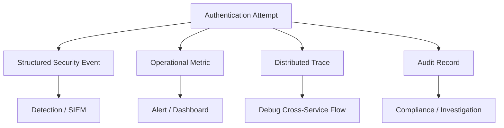
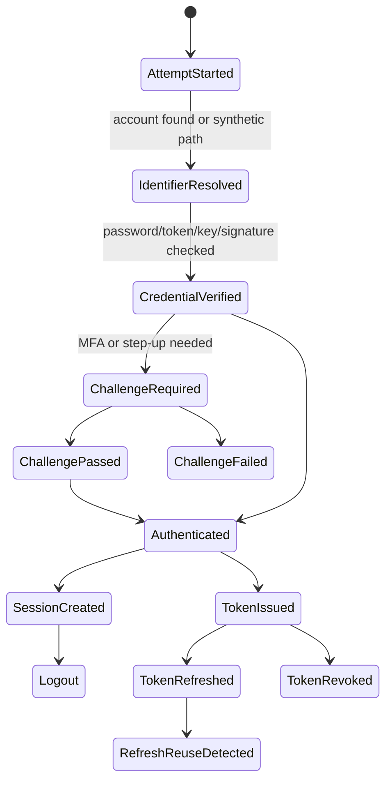
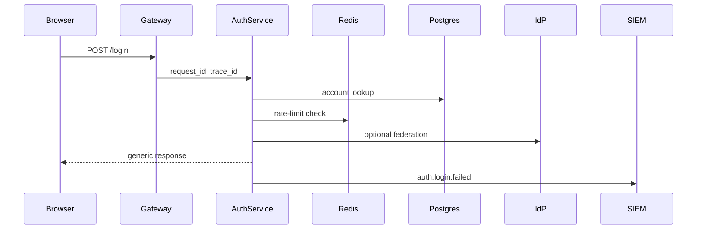
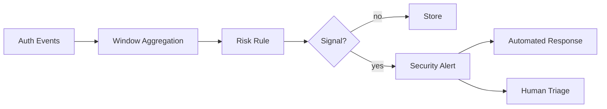
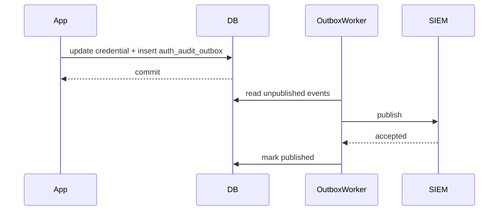

# Part 035 — Authentication Observability

> Target part ini: membangun authentication observability yang bisa dipakai untuk debugging, audit, threat detection, incident response, compliance evidence, dan architecture review. Fokusnya bukan “menambah log”, tetapi mendesain event model yang defensible, minim kebocoran data, dan bisa menjawab pertanyaan sulit saat sistem diserang.

Authentication yang tidak observable adalah black box.

Saat login gagal, token bocor, refresh token reuse terdeteksi, session diambil alih, MFA disalahgunakan, atau tenant tertukar, pertanyaan pertama dari tim engineering, security, compliance, dan bisnis biasanya bukan:

```txt
Apakah endpoint login return 401?
```

Pertanyaannya lebih berat:

```txt
Who tried to authenticate?
From where?
Using which factor?
Against which tenant/client?
Was the credential valid?
Was the account locked?
Was MFA required?
Was MFA passed?
Was the session created?
Was a token issued?
Which token family?
Was the refresh token reused?
Was the request blocked by rate limit?
Was this part of a larger attack pattern?
Which users are affected?
Can we prove what happened?
```

Kalau event auth tidak dirancang, jawaban akan menjadi spekulasi.

Top 1% engineer tidak melihat logging sebagai dekorasi. Mereka melihatnya sebagai bagian dari **control plane**.

```txt
Authentication control without observability is not controllable.
```

---

## 1. Mental model: observability auth bukan hanya log

Observability auth terdiri dari empat lapisan:

```txt
1. Structured event
   Fakta diskrit tentang kejadian authentication.

2. Metrics
   Agregasi kuantitatif untuk trend, alert, SLO, dan anomaly.

3. Traces
   Alur lintas service untuk request authentication/token/session.

4. Audit evidence
   Rekaman yang tahan review: siapa melakukan apa, kapan, terhadap boundary apa, dengan outcome apa.
```

Jangan campur semuanya ke satu konsep “log”.



### Perbedaan utama

| Output | Tujuan | Contoh | Retensi | Sensitivitas |
|---|---|---|---|---|
| Application log | Debug operasional | `login failed due to locked account` | pendek-menengah | sedang |
| Security event | Deteksi serangan | `credential_stuffing_suspected` | menengah-panjang | tinggi |
| Audit event | Bukti aksi | `session_created`, `password_changed` | panjang | tinggi |
| Metric | Agregasi | login failure rate | pendek-menengah | rendah jika label aman |
| Trace | Debug path | auth service -> redis -> db -> idp | pendek | sedang |

Invariant penting:

```txt
A security-relevant authentication transition must emit a structured event.
```

Kalau state berubah tetapi tidak ada event, sistem kehilangan bukti.

---

## 2. Apa yang wajib observable dalam authentication?

Authentication bukan satu event. Ia adalah rangkaian transition.



Setiap transition penting menghasilkan event.

### Event minimum

| Area | Event |
|---|---|
| Login | `auth.attempt.started`, `auth.login.succeeded`, `auth.login.failed` |
| Password | `auth.password.changed`, `auth.password.reset.requested`, `auth.password.reset.completed` |
| MFA | `auth.mfa.challenge.required`, `auth.mfa.challenge.succeeded`, `auth.mfa.challenge.failed`, `auth.mfa.factor.enrolled`, `auth.mfa.factor.removed` |
| Session | `auth.session.created`, `auth.session.rotated`, `auth.session.revoked`, `auth.session.expired` |
| Token | `auth.token.issued`, `auth.token.refreshed`, `auth.token.revoked`, `auth.refresh.reuse_detected` |
| API key | `auth.api_key.created`, `auth.api_key.used`, `auth.api_key.rotated`, `auth.api_key.revoked` |
| HMAC/mTLS | `auth.request_signature.failed`, `auth.client_cert.accepted`, `auth.client_cert.rejected` |
| OAuth/OIDC | `auth.oidc.callback.received`, `auth.oidc.login.succeeded`, `auth.oidc.login.failed`, `auth.federation.mapping.failed` |
| Abuse | `auth.rate_limited`, `auth.account.locked`, `auth.suspicious_activity.detected` |
| Admin | `auth.admin.session_revoked`, `auth.admin.factor_reset`, `auth.admin.account_disabled` |

Jangan hanya emit event saat sukses. Event gagal justru sering lebih penting.

---

## 3. Event auth harus menjawab 9 pertanyaan

Setiap event authentication sebaiknya bisa menjawab:

```txt
1. What happened?
2. When did it happen?
3. Who was attempting the action?
4. Which account/subject was affected?
5. Which tenant/client/application boundary?
6. Which authentication method/factor?
7. What was the outcome?
8. Why did the system decide that outcome?
9. How can we correlate this to request/session/token/trace?
```

Model field minimal:

```txt
event_id
occurred_at
event_type
severity
outcome
reason_code
request_id
trace_id
correlation_id
tenant_id
client_id
actor_subject_id
target_account_id
credential_id / authenticator_id / session_id_hash / token_family_id
authentication_method
assurance_level
source_ip_hash or source_ip_prefix
user_agent_hash
device_id_hash
risk_score
risk_reasons
```

Perhatikan penggunaan `*_hash`. Auth observability harus membantu investigasi tanpa menjadi database rahasia baru.

---

## 4. Jangan bocorkan secret ke observability

Log auth sering menjadi sumber kebocoran kedua setelah application database.

Tidak boleh masuk log:

```txt
password
password reset token
one-time password
TOTP secret
raw recovery code
raw session id
raw access token
raw refresh token
raw API key
HMAC shared secret
private key
authorization code
code_verifier
full client secret
full email if policy privacy melarang
full phone number
full precise geolocation jika tidak perlu
```

Boleh dicatat dengan bentuk aman:

```txt
subject_id internal
account_id internal
tenant_id
client_id
key prefix
credential id
factor id
session id hash
token jti hash
token family id
IP prefix or risk-normalized location
user agent hash
reason code
```

Contoh salah:

```java
log.info("login failed username={} password={}", username, password);
```

Contoh benar:

```java
log.info("auth.login.failed account_lookup={} tenant={} reason={} request_id={}",
    lookupResult.category(), tenantId, reasonCode, requestId);
```

Lebih baik lagi: structured event, bukan string bebas.

---

## 5. Taxonomy event: naming yang stabil

Gunakan nama event yang stabil dan machine-readable.

Format yang direkomendasikan:

```txt
auth.<object>.<verb>
```

Contoh:

```txt
auth.login.succeeded
auth.login.failed
auth.session.created
auth.session.revoked
auth.token.refreshed
auth.refresh.reuse_detected
auth.mfa.challenge.failed
auth.api_key.rotated
auth.rate_limit.exceeded
```

Jangan gunakan nama terlalu natural-language:

```txt
User logged in successfully from browser
Oops login failed
Bad token
```

Nama event harus bertahan selama bertahun-tahun karena downstream detection rule, dashboard, SIEM parser, dan audit report akan bergantung padanya.

---

## 6. Severity auth event

Severity bukan emosi. Severity adalah sinyal routing.

| Severity | Makna | Contoh |
|---|---|---|
| `INFO` | State transition normal | login success, logout |
| `NOTICE` | Security-relevant but expected | password changed, MFA enrolled |
| `WARN` | Suspicious or policy denied | repeated failures, rate limit |
| `ERROR` | System failed to enforce cleanly | IdP validation unavailable |
| `CRITICAL` | Active compromise signal | refresh token reuse, signing key compromise |

Jangan beri `ERROR` untuk semua login gagal. Itu akan membuat alert fatigue.

---

## 7. Reason code: bagian terpenting yang sering hilang

User-facing message harus generic.

```txt
Invalid credentials.
```

Internal event harus spesifik.

```txt
PASSWORD_MISMATCH
ACCOUNT_NOT_FOUND_SYNTHETIC_PATH
ACCOUNT_LOCKED
ACCOUNT_DISABLED
TENANT_NOT_FOUND
TENANT_MEMBERSHIP_MISSING
MFA_REQUIRED
MFA_CODE_INVALID
MFA_FACTOR_LOCKED
RATE_LIMITED_BY_ACCOUNT
RATE_LIMITED_BY_IP_PREFIX
TOKEN_EXPIRED
TOKEN_AUDIENCE_INVALID
TOKEN_ISSUER_INVALID
TOKEN_SIGNATURE_INVALID
REFRESH_TOKEN_REUSE_DETECTED
SESSION_NOT_FOUND
SESSION_REVOKED
API_KEY_HASH_NOT_FOUND
HMAC_NONCE_REPLAYED
CLIENT_CERT_UNTRUSTED
```

Reason code membuat sistem bisa:

- membedakan bug vs attack;
- membuat dashboard yang tajam;
- menjalankan detection rule;
- melakukan incident triage;
- menjaga generic response ke user tanpa kehilangan insight internal.

Invariant:

```txt
Generic outward response, specific internal reason code.
```

---

## 8. Auth event domain model di Java

Mulai dari record sederhana.

```java
package com.acme.auth.observability;

import java.time.Instant;
import java.util.List;
import java.util.Map;
import java.util.UUID;

public record AuthEvent(
    UUID eventId,
    Instant occurredAt,
    String eventType,
    AuthSeverity severity,
    AuthOutcome outcome,
    String reasonCode,

    String tenantId,
    String clientId,
    String actorSubjectId,
    String targetAccountId,

    String requestId,
    String correlationId,
    String traceId,

    String authenticationMethod,
    String assuranceLevel,
    String sessionIdHash,
    String tokenFamilyId,
    String credentialId,
    String authenticatorId,

    String sourceIpHash,
    String sourceIpPrefix,
    String userAgentHash,
    String deviceIdHash,

    Integer riskScore,
    List<String> riskReasons,
    Map<String, String> attributes
) {}
```

Enums:

```java
public enum AuthSeverity {
    INFO,
    NOTICE,
    WARN,
    ERROR,
    CRITICAL
}

public enum AuthOutcome {
    SUCCESS,
    FAILURE,
    DENIED,
    CHALLENGE_REQUIRED,
    REVOKED,
    EXPIRED,
    DETECTED
}
```

Publisher boundary:

```java
public interface AuthEventPublisher {
    void publish(AuthEvent event);
}
```

Jangan biarkan business code memilih sink langsung.

```txt
LoginService -> AuthEventPublisher -> Log/Kafka/DB/SIEM
```

Bukan:

```txt
LoginService -> log + kafka + db + metrics + SIEM SDK
```

---

## 9. Structured JSON logging

Untuk production, event auth sebaiknya structured.

```java
public final class JsonAuthEventPublisher implements AuthEventPublisher {
    private static final Logger log = LoggerFactory.getLogger("security.auth");
    private final ObjectMapper objectMapper;

    public JsonAuthEventPublisher(ObjectMapper objectMapper) {
        this.objectMapper = objectMapper;
    }

    @Override
    public void publish(AuthEvent event) {
        try {
            log.info(objectMapper.writeValueAsString(event));
        } catch (JsonProcessingException e) {
            log.error("auth_event_serialization_failed event_type={} event_id={}",
                event.eventType(), event.eventId(), e);
        }
    }
}
```

Dalam sistem besar, gunakan encoder structured logging native agar tidak double-encode string JSON. Tapi boundary-nya sama: output harus punya field stabil.

Contoh event:

```json
{
  "eventId": "68f52767-9b29-490d-9a0e-02a41c0e2f6b",
  "occurredAt": "2026-07-03T12:00:00Z",
  "eventType": "auth.login.failed",
  "severity": "WARN",
  "outcome": "FAILURE",
  "reasonCode": "PASSWORD_MISMATCH",
  "tenantId": "tenant_123",
  "clientId": "portal-web",
  "targetAccountId": "acct_987",
  "requestId": "req_abc",
  "correlationId": "corr_xyz",
  "authenticationMethod": "PASSWORD",
  "sourceIpPrefix": "203.0.113.0/24",
  "userAgentHash": "ua_3e5b...",
  "riskScore": 42,
  "riskReasons": ["FAILED_PASSWORD", "NEW_DEVICE"]
}
```

---

## 10. Correlation model

Authentication terjadi lintas boundary.



Minimal correlation identifiers:

| Field | Fungsi |
|---|---|
| `request_id` | satu HTTP request |
| `trace_id` | distributed trace lintas service |
| `correlation_id` | business/security journey lintas request |
| `session_id_hash` | satu login session tanpa membocorkan session id |
| `token_family_id` | refresh token lineage |
| `credential_id` | credential yang dipakai |
| `authenticator_id` | MFA/passkey factor |
| `tenant_id` | isolation boundary |
| `client_id` | OAuth/client/application boundary |

Rule:

```txt
Never log raw session/token identifiers; log stable hashes or internal IDs.
```

Hash untuk log harus pakai secret pepper berbeda dari password pepper.

```java
public interface SensitiveIdentifierHasher {
    String hashForTelemetry(String rawValue);
}
```

Contoh:

```java
public final class HmacSha256TelemetryHasher implements SensitiveIdentifierHasher {
    private final SecretKey key;

    public HmacSha256TelemetryHasher(SecretKey key) {
        this.key = key;
    }

    @Override
    public String hashForTelemetry(String rawValue) {
        try {
            Mac mac = Mac.getInstance("HmacSHA256");
            mac.init(key);
            byte[] digest = mac.doFinal(rawValue.getBytes(StandardCharsets.UTF_8));
            return Base64.getUrlEncoder().withoutPadding().encodeToString(digest);
        } catch (GeneralSecurityException e) {
            throw new IllegalStateException("telemetry hash failed", e);
        }
    }
}
```

---

## 11. MDC usage: berguna, tapi jangan berlebihan

MDC cocok untuk request-scoped fields:

```java
public final class RequestCorrelationFilter extends OncePerRequestFilter {
    @Override
    protected void doFilterInternal(
        HttpServletRequest request,
        HttpServletResponse response,
        FilterChain filterChain
    ) throws ServletException, IOException {
        String requestId = Optional.ofNullable(request.getHeader("X-Request-Id"))
            .filter(this::isSafeRequestId)
            .orElseGet(() -> UUID.randomUUID().toString());

        try {
            MDC.put("request_id", requestId);
            MDC.put("path", request.getRequestURI());
            filterChain.doFilter(request, response);
        } finally {
            MDC.clear();
        }
    }

    private boolean isSafeRequestId(String value) {
        return value.length() <= 128 && value.matches("[A-Za-z0-9._:-]+.");
    }
}
```

Bug kecil di atas: regex `+.` mengizinkan karakter ekstra karena titik wildcard. Versi benar:

```java
private boolean isSafeRequestId(String value) {
    return value != null
        && value.length() <= 128
        && value.matches("[A-Za-z0-9._:-]+");
}
```

MDC failure mode:

| Failure | Dampak |
|---|---|
| tidak dibersihkan | data request bocor ke request lain di thread pool |
| terlalu banyak PII | log menjadi liability |
| raw token masuk MDC | semua log downstream bocor token |
| async boundary tidak propagasi | trace/log kehilangan correlation |

Invariant:

```txt
MDC is for correlation, not for secrets.
```

---

## 12. Spring Security event integration

Spring Security menyediakan event untuk authentication success/failure. Untuk sistem enterprise, event bawaan biasanya perlu dipetakan ke schema internal.

```java
@Component
public final class SpringAuthenticationEventListener {
    private final AuthEventPublisher publisher;
    private final RequestContextExtractor requestContextExtractor;

    public SpringAuthenticationEventListener(
        AuthEventPublisher publisher,
        RequestContextExtractor requestContextExtractor
    ) {
        this.publisher = publisher;
        this.requestContextExtractor = requestContextExtractor;
    }

    @EventListener
    public void onSuccess(AuthenticationSuccessEvent event) {
        RequestContext ctx = requestContextExtractor.current();
        Authentication authentication = event.getAuthentication();

        publisher.publish(AuthEventBuilder.base("auth.login.succeeded")
            .severity(AuthSeverity.INFO)
            .outcome(AuthOutcome.SUCCESS)
            .reasonCode("AUTHENTICATION_SUCCEEDED")
            .tenantId(ctx.tenantId())
            .clientId(ctx.clientId())
            .actorSubjectId(resolveSubject(authentication))
            .requestId(ctx.requestId())
            .traceId(ctx.traceId())
            .authenticationMethod(resolveMethod(authentication))
            .sourceIpPrefix(ctx.sourceIpPrefix())
            .userAgentHash(ctx.userAgentHash())
            .build());
    }

    @EventListener
    public void onFailure(AbstractAuthenticationFailureEvent event) {
        RequestContext ctx = requestContextExtractor.current();

        publisher.publish(AuthEventBuilder.base("auth.login.failed")
            .severity(AuthSeverity.WARN)
            .outcome(AuthOutcome.FAILURE)
            .reasonCode(mapFailure(event.getException()))
            .tenantId(ctx.tenantId())
            .clientId(ctx.clientId())
            .requestId(ctx.requestId())
            .traceId(ctx.traceId())
            .sourceIpPrefix(ctx.sourceIpPrefix())
            .userAgentHash(ctx.userAgentHash())
            .build());
    }

    private String mapFailure(AuthenticationException exception) {
        if (exception instanceof BadCredentialsException) return "BAD_CREDENTIALS";
        if (exception instanceof LockedException) return "ACCOUNT_LOCKED";
        if (exception instanceof DisabledException) return "ACCOUNT_DISABLED";
        if (exception instanceof CredentialsExpiredException) return "CREDENTIAL_EXPIRED";
        return "AUTHENTICATION_FAILED";
    }
}
```

Jangan bergantung sepenuhnya pada event framework. Banyak transition penting terjadi di luar `AuthenticationSuccessEvent`:

- refresh token rotation;
- session revocation;
- password reset;
- MFA enrollment;
- API key rotation;
- IdP callback mapping;
- rate limit block;
- token introspection failure.

Gunakan explicit domain event untuk transition tersebut.

---

## 13. Observability di custom Spring filter

Untuk token/resource server, sering lebih baik instrumentasi di filter boundary.

```java
public final class BearerTokenObservationFilter extends OncePerRequestFilter {
    private final AuthEventPublisher publisher;
    private final SensitiveIdentifierHasher hasher;

    public BearerTokenObservationFilter(
        AuthEventPublisher publisher,
        SensitiveIdentifierHasher hasher
    ) {
        this.publisher = publisher;
        this.hasher = hasher;
    }

    @Override
    protected void doFilterInternal(
        HttpServletRequest request,
        HttpServletResponse response,
        FilterChain chain
    ) throws ServletException, IOException {
        try {
            chain.doFilter(request, response);
        } finally {
            Authentication authentication = SecurityContextHolder.getContext().getAuthentication();

            if (authentication instanceof JwtAuthenticationToken jwtAuth) {
                Jwt jwt = jwtAuth.getToken();

                publisher.publish(AuthEventBuilder.base("auth.token.accepted")
                    .severity(AuthSeverity.INFO)
                    .outcome(AuthOutcome.SUCCESS)
                    .tenantId(extractTenant(jwt))
                    .clientId(jwt.getClaimAsString("azp"))
                    .actorSubjectId(jwt.getSubject())
                    .reasonCode("JWT_ACCEPTED")
                    .attributes(Map.of(
                        "issuer", jwt.getIssuer().toString(),
                        "audience", String.join(",", jwt.getAudience()),
                        "jti_hash", hasher.hashForTelemetry(jwt.getId())
                    ))
                    .build());
            }
        }
    }
}
```

Tetapi hati-hati: event `auth.token.accepted` untuk setiap request bisa sangat mahal. Gunakan sampling atau emit metric untuk high-volume path, dan event detail untuk security-relevant transition.

Rule praktis:

```txt
Emit detailed event for state-changing auth transitions.
Emit metrics/sampled traces for high-volume repeated validation.
```

---

## 14. Jakarta/JAX-RS filter instrumentation

Untuk non-Spring stack:

```java
@Provider
@Priority(Priorities.AUTHENTICATION)
public final class JwtAuthenticationFilter implements ContainerRequestFilter {
    private final JwtVerifier verifier;
    private final AuthEventPublisher events;

    public JwtAuthenticationFilter(JwtVerifier verifier, AuthEventPublisher events) {
        this.verifier = verifier;
        this.events = events;
    }

    @Override
    public void filter(ContainerRequestContext requestContext) {
        RequestContext ctx = RequestContext.from(requestContext);
        String bearer = extractBearer(requestContext);

        if (bearer == null) {
            events.publish(AuthEventBuilder.base("auth.token.missing")
                .severity(AuthSeverity.INFO)
                .outcome(AuthOutcome.DENIED)
                .reasonCode("BEARER_TOKEN_MISSING")
                .requestId(ctx.requestId())
                .build());
            abortUnauthorized(requestContext);
            return;
        }

        try {
            VerifiedJwt jwt = verifier.verify(bearer);
            requestContext.setSecurityContext(new JwtSecurityContext(jwt));
        } catch (JwtVerificationException ex) {
            events.publish(AuthEventBuilder.base("auth.token.rejected")
                .severity(AuthSeverity.WARN)
                .outcome(AuthOutcome.DENIED)
                .reasonCode(ex.reasonCode())
                .requestId(ctx.requestId())
                .tenantId(ctx.tenantId())
                .build());
            abortUnauthorized(requestContext);
        }
    }
}
```

JAX-RS filter memberi boundary bagus untuk authentication, tetapi event domain tetap harus konsisten dengan stack lain.

---

## 15. Metrics: yang dihitung harus aman

Metric auth membantu alerting dan capacity planning.

Contoh metric:

```txt
auth_login_attempt_total{outcome, method, tenant_tier}
auth_login_failure_total{reason_code, method}
auth_rate_limited_total{dimension}
auth_mfa_challenge_total{factor_type, outcome}
auth_token_refresh_total{outcome}
auth_refresh_reuse_detected_total
auth_session_active_count{tenant_tier}
auth_password_hash_duration_seconds{algorithm}
auth_jwt_validation_duration_seconds{issuer}
auth_idp_callback_duration_seconds{provider}
```

Jangan gunakan label high-cardinality:

```txt
user_id
email
session_id
ip_address
raw_client_id jika jumlahnya sangat besar dan tidak terkendali
```

High-cardinality label membuat metrics backend mahal dan sering rusak.

Contoh Micrometer:

```java
public final class AuthMetrics {
    private final MeterRegistry registry;

    public AuthMetrics(MeterRegistry registry) {
        this.registry = registry;
    }

    public void recordLoginAttempt(String method, String outcome, String reasonCode) {
        Counter.builder("auth.login.attempt")
            .tag("method", safe(method))
            .tag("outcome", safe(outcome))
            .tag("reason", safeReason(reasonCode))
            .register(registry)
            .increment();
    }

    public <T> T timePasswordHash(String algorithm, Supplier<T> action) {
        return Timer.builder("auth.password.hash.duration")
            .tag("algorithm", safe(algorithm))
            .publishPercentileHistogram()
            .register(registry)
            .record(action);
    }
}
```

Metric invariant:

```txt
Metrics labels must be low-cardinality and non-secret.
```

---

## 16. Dashboard auth yang benar-benar berguna

Minimal dashboard:

### Login health

```txt
login attempts per minute
success rate
failure rate by reason
p95/p99 login latency
password hash duration
account lookup latency
session creation latency
```

### Abuse

```txt
rate-limited requests
top failure reason trend
password spray indicator
credential stuffing indicator
MFA failure spike
refresh token reuse detection
API key failure spike
HMAC nonce replay spike
```

### Token/session

```txt
active sessions
session revocation rate
refresh token rotation failure
expired token rejection
audience mismatch rejection
issuer mismatch rejection
JWKS refresh failures
```

### Federation

```txt
OIDC callback failures
state mismatch
nonce mismatch
IdP latency
JIT provisioning failure
SAML assertion validation failure
```

### Tenant

```txt
login success/failure by tenant tier
tenant resolution failures
cross-tenant token rejection
membership missing failures
```

Jangan buat dashboard yang hanya indah. Dashboard harus membantu triage.

---

## 17. Detection signals

Security detection auth umumnya berasal dari kombinasi event, bukan satu event.

### Credential stuffing

```txt
Many distinct account identifiers
from same IP prefix/device/user agent family
with password mismatch
within short window
```

Pseudo rule:

```sql
SELECT source_ip_prefix, COUNT(DISTINCT target_account_id) AS accounts, COUNT(*) AS failures
FROM auth_events
WHERE event_type = 'auth.login.failed'
  AND reason_code IN ('PASSWORD_MISMATCH', 'BAD_CREDENTIALS')
  AND occurred_at > now() - interval '10 minutes'
GROUP BY source_ip_prefix
HAVING COUNT(DISTINCT target_account_id) > 50
   AND COUNT(*) > 200;
```

### Password spraying

```txt
Same password campaign cannot be logged directly,
but pattern is many accounts, low frequency each,
same IP/device/user agent, generic bad credentials.
```

### Account takeover suspicion

```txt
Successful login from new device
after many failed attempts
followed by password/MFA/recovery changes.
```

### Refresh token theft

```txt
refresh token reuse detected
or same token family used from incompatible device/location.
```

### MFA fatigue

```txt
many push challenges
few approvals
then sudden success
from suspicious source.
```

### Tenant confusion attempt

```txt
token issuer valid
but tenant route mismatch or membership missing.
```

Detection model:



---

## 18. Audit table design

Untuk high-value systems, jangan bergantung hanya pada log pipeline. Simpan audit event penting di database atau append-only event store.

```sql
CREATE TABLE auth_audit_event (
    event_id UUID PRIMARY KEY,
    occurred_at TIMESTAMPTZ NOT NULL,
    event_type TEXT NOT NULL,
    severity TEXT NOT NULL,
    outcome TEXT NOT NULL,
    reason_code TEXT NOT NULL,

    tenant_id TEXT,
    client_id TEXT,
    actor_subject_id TEXT,
    target_account_id TEXT,

    request_id TEXT,
    correlation_id TEXT,
    trace_id TEXT,

    authentication_method TEXT,
    assurance_level TEXT,
    session_id_hash TEXT,
    token_family_id TEXT,
    credential_id TEXT,
    authenticator_id TEXT,

    source_ip_hash TEXT,
    source_ip_prefix TEXT,
    user_agent_hash TEXT,
    device_id_hash TEXT,

    risk_score INTEGER,
    risk_reasons JSONB NOT NULL DEFAULT '[]'::jsonb,
    attributes JSONB NOT NULL DEFAULT '{}'::jsonb
);

CREATE INDEX idx_auth_audit_event_time
    ON auth_audit_event (occurred_at DESC);

CREATE INDEX idx_auth_audit_event_account_time
    ON auth_audit_event (target_account_id, occurred_at DESC);

CREATE INDEX idx_auth_audit_event_tenant_time
    ON auth_audit_event (tenant_id, occurred_at DESC);

CREATE INDEX idx_auth_audit_event_type_time
    ON auth_audit_event (event_type, occurred_at DESC);

CREATE INDEX idx_auth_audit_event_reason_time
    ON auth_audit_event (reason_code, occurred_at DESC);
```

Partition by time untuk volume besar:

```sql
CREATE TABLE auth_audit_event_2026_07
    PARTITION OF auth_audit_event
    FOR VALUES FROM ('2026-07-01') TO ('2026-08-01');
```

Retention harus jelas:

| Event | Retention contoh |
|---|---:|
| low-risk login success | 30-90 hari |
| login failure aggregate | 90-180 hari |
| password/MFA change | 1-7 tahun tergantung regulasi |
| token/session revoke | 180 hari-1 tahun |
| admin security action | 1-7 tahun |
| compromise evidence | legal hold / incident policy |

---

## 19. Audit event reliability

Pertanyaan sulit:

```txt
Should authentication fail if audit event cannot be written?
```

Jawabannya tergantung event.

| Event | Jika audit gagal |
|---|---|
| login failed | jangan matikan login global, fallback log lokal |
| login success | idealnya emit; kalau sink down gunakan buffer/outbox |
| password changed | sebaiknya transactionally recorded |
| MFA removed | sebaiknya transactionally recorded |
| admin session revoke | sebaiknya transactionally recorded |
| key compromise action | wajib durable atau fail closed sesuai policy |

Pattern aman:

```txt
State change transaction -> audit outbox row -> async publisher -> SIEM/log sink
```



Outbox schema:

```sql
CREATE TABLE auth_audit_outbox (
    outbox_id UUID PRIMARY KEY,
    event_id UUID NOT NULL,
    occurred_at TIMESTAMPTZ NOT NULL,
    event_type TEXT NOT NULL,
    payload JSONB NOT NULL,
    published_at TIMESTAMPTZ,
    publish_attempts INTEGER NOT NULL DEFAULT 0,
    next_attempt_at TIMESTAMPTZ NOT NULL DEFAULT now()
);
```

---

## 20. Privacy and data minimization

Auth observability mudah berubah menjadi surveillance system.

Prinsip:

```txt
Collect enough to secure and audit.
Do not collect because it is interesting.
```

Data minimization examples:

| Data | Alternatif |
|---|---|
| full IP | prefix + hash |
| full email | account id + normalized domain if needed |
| raw user agent | parsed family + hash |
| precise geolocation | country/region risk category |
| raw device fingerprint | internal device id/hash |
| full token claim dump | allowlisted claim subset |

Token claim dump sangat berbahaya karena dapat berisi email, group, role, tenant, entitlement, dan identifier eksternal.

Gunakan allowlist:

```java
private static final Set<String> LOGGABLE_CLAIMS = Set.of(
    "iss", "aud", "azp", "typ", "jti", "tenant_id", "auth_time", "acr", "amr"
);
```

Bukan:

```java
log.info("jwt claims={}", jwt.getClaims());
```

---

## 21. Tracing authentication

Tracing membantu menjawab latency dan dependency path.

Contoh span:

```txt
POST /login
  auth.resolve_tenant
  auth.rate_limit.check
  auth.account.lookup
  auth.password.verify
  auth.mfa.evaluate
  auth.session.create
  auth.audit.publish
```

Tetapi trace attribute juga tidak boleh berisi secret.

Attribute aman:

```txt
auth.method=password
auth.outcome=failure
auth.reason_code=PASSWORD_MISMATCH
auth.tenant_tier=enterprise
auth.client_type=web
auth.assurance_level=aal2
```

Attribute berbahaya:

```txt
auth.password=...
auth.token=...
auth.email=...
auth.session_id=...
```

Dengan OpenTelemetry Java API:

```java
Span span = tracer.spanBuilder("auth.password.verify").startSpan();
try (Scope ignored = span.makeCurrent()) {
    span.setAttribute("auth.method", "password");
    span.setAttribute("auth.algorithm", passwordHash.algorithm());
    boolean matched = passwordVerifier.verify(rawPassword, passwordHash);
    span.setAttribute("auth.outcome", matched ? "success" : "failure");
    return matched;
} catch (RuntimeException ex) {
    span.recordException(ex);
    span.setStatus(StatusCode.ERROR);
    throw ex;
} finally {
    span.end();
}
```

---

## 22. Alerting: jangan alert semua hal

Alert harus actionable.

Bad alert:

```txt
Login failed.
```

Good alert:

```txt
Refresh token reuse detected for token family with active sessions.
Action: revoke token family, mark account risk, require re-auth.
```

Alert candidates:

| Signal | Severity | Automated response |
|---|---|---|
| refresh token reuse | critical | revoke family, require login |
| high credential stuffing | warn/critical | throttle IP/device/prefix |
| signing key validation failure spike | critical | freeze token issuance, inspect JWKS |
| admin MFA removed for many users | critical | suspend admin session |
| unusual tenant mismatch spike | warn | inspect routing/config |
| IdP callback state mismatch spike | warn/critical | check OAuth attack or cookie issue |
| password reset completion spike | warn | inspect campaign |

Alert payload harus memuat:

```txt
what happened
affected tenant/client/account count
time window
reason codes
sample correlation ids
suggested runbook
```

---

## 23. Observability for incident response

Saat token leak terjadi, Anda perlu query cepat:

```sql
-- Which sessions did this account create recently?
SELECT occurred_at, session_id_hash, source_ip_prefix, user_agent_hash, risk_score
FROM auth_audit_event
WHERE target_account_id = 'acct_123'
  AND event_type = 'auth.session.created'
  AND occurred_at > now() - interval '7 days'
ORDER BY occurred_at DESC;
```

```sql
-- Was refresh token reuse detected?
SELECT *
FROM auth_audit_event
WHERE token_family_id = 'rtf_abc'
  AND event_type = 'auth.refresh.reuse_detected';
```

```sql
-- Which accounts were targeted by same IP prefix?
SELECT target_account_id, count(*)
FROM auth_audit_event
WHERE source_ip_prefix = '203.0.113.0/24'
  AND event_type = 'auth.login.failed'
  AND occurred_at > now() - interval '1 hour'
GROUP BY target_account_id
ORDER BY count(*) DESC;
```

```sql
-- Which admin changed MFA factors?
SELECT occurred_at, actor_subject_id, target_account_id, reason_code, attributes
FROM auth_audit_event
WHERE event_type IN ('auth.mfa.factor.removed', 'auth.admin.factor_reset')
  AND occurred_at > now() - interval '30 days';
```

Observability yang bagus membuat incident response menjadi proses, bukan panik.

---

## 24. Failure modes

| Failure mode | Root cause | Dampak | Mitigasi |
|---|---|---|---|
| Raw token logged | debug logging careless | credential leak | redaction, allowlist, tests |
| Password logged | request dump middleware | catastrophic | disable body logging for auth routes |
| No reason code | generic events only | poor triage | internal reason taxonomy |
| High-cardinality metrics | user/session label | metrics outage/cost | cardinality review |
| Event missing on failure | only success logged | attack invisible | log success and failure transition |
| Audit sink down loses events | direct async fire-and-forget | evidence gap | outbox/buffer/fallback |
| MDC not cleared | thread reuse | privacy leak/wrong correlation | finally clear |
| Token claim dump | log all claims | PII leak | claim allowlist |
| Too many alerts | low-quality rules | alert fatigue | actionable thresholds/runbooks |
| Tenant missing in event | non-tenant-aware logging | investigation impossible | tenant required for tenant-owned action |
| Observability becomes auth dependency | synchronous SIEM call | login outage | async outbox except critical control |

---

## 25. Review checklist

Gunakan checklist ini saat review PR authentication:

```txt
[ ] Does every auth state transition emit a structured event?
[ ] Are outward messages generic but internal reason codes specific?
[ ] Are raw credentials/tokens/session ids never logged?
[ ] Are token claims allowlisted before logging?
[ ] Are event names stable and documented?
[ ] Are event IDs and timestamps generated server-side?
[ ] Are request_id, trace_id, tenant_id, client_id included where applicable?
[ ] Are metrics labels low-cardinality?
[ ] Are high-value audit events stored durably?
[ ] Does audit use outbox or reliable publication?
[ ] Are retention policies defined by event type?
[ ] Are events useful for incident response queries?
[ ] Are rate-limit, lockout, MFA, reset, token, and admin actions observable?
[ ] Are MDC and ThreadLocal values cleared after request?
[ ] Are alert rules actionable and tied to runbooks?
```

---

## 26. Production drills

### Drill 1 — Credential stuffing

Given:

```txt
10,000 login failures in 10 minutes
8,000 distinct account identifiers
50 IP prefixes
few success events
```

Task:

```txt
Design detection query.
Choose automated throttle dimensions.
Decide whether to lock accounts.
Explain why account lockout may help attacker.
```

Expected direction:

```txt
Throttle source/IP/device/client dimensions first.
Avoid mass account lockout.
Raise risk score.
Require step-up for suspicious successful login.
```

### Drill 2 — Refresh token reuse

Given:

```txt
refresh token family rtf_123 reused from new device
legitimate user still active
```

Task:

```txt
Which events are emitted?
Which sessions/tokens are revoked?
Which alert fires?
What user-facing action is required?
```

Expected direction:

```txt
auth.refresh.reuse_detected
auth.token.family_revoked
auth.session.revoked
force reauthentication and possibly step-up
```

### Drill 3 — Audit sink unavailable

Given:

```txt
SIEM endpoint down for 1 hour
login traffic normal
password changes continue
```

Task:

```txt
Which events can be buffered?
Which events must be durable in DB?
What dashboard shows backlog?
When should auth degrade or fail closed?
```

---

## 27. Final mental model

Authentication observability is not about printing more text.

It is about preserving the evidence of security decisions.

A good auth system can say:

```txt
This subject attempted this authentication method,
against this tenant and client,
from this risk context,
with this outcome and reason,
causing this session/token/factor transition,
correlated to this request/trace,
recorded without leaking secrets.
```

That sentence is the bar.

If your system cannot reconstruct it, you do not have production-grade authentication yet.

---

## References

- Spring Security Authentication Events: https://docs.spring.io/spring-security/reference/servlet/authentication/events.html
- Spring Security Observability: https://docs.spring.io/spring-security/reference/servlet/integrations/observability.html
- OWASP Logging Cheat Sheet: https://cheatsheetseries.owasp.org/cheatsheets/Logging_Cheat_Sheet.html
- OWASP Authentication Cheat Sheet: https://cheatsheetseries.owasp.org/cheatsheets/Authentication_Cheat_Sheet.html
- OWASP Session Management Cheat Sheet: https://cheatsheetseries.owasp.org/cheatsheets/Session_Management_Cheat_Sheet.html
- OpenTelemetry Semantic Conventions: https://opentelemetry.io/docs/concepts/semantic-conventions/
- OpenTelemetry Semantic Conventions for Events: https://opentelemetry.io/docs/specs/semconv/general/events/
- NIST SP 800-63B-4: https://pages.nist.gov/800-63-4/sp800-63b.html
- RFC 9700 — OAuth 2.0 Security Best Current Practice: https://www.rfc-editor.org/rfc/rfc9700
