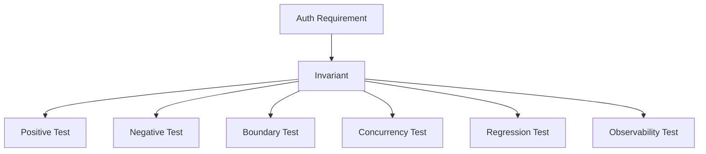

# Part 036 — Authentication Testing Strategy

> Target part ini: membangun strategi testing authentication yang tidak hanya mengecek “login sukses”, tetapi memverifikasi invariant, negative path, boundary, concurrency, abuse control, token/session lifecycle, OAuth/OIDC correctness, dan regression suite yang bisa menjaga sistem auth tetap aman saat code berubah.

Authentication code sering punya test seperti ini:

```txt
Given valid username/password
When login
Then status 200
```

Itu perlu, tetapi jauh dari cukup.

Authentication production-grade harus diuji seperti state machine dan security control.

Pertanyaan test yang benar:

```txt
Can an invalid credential create a session?
Can a disabled account authenticate through another path?
Can a token from tenant A be accepted on tenant B route?
Can expired JWT pass because clock skew too large?
Can refresh token rotation race issue two valid children?
Can OAuth callback without matching state login the user?
Can a CSRF request mutate session-authenticated state?
Can logs leak password/reset token/access token?
Can rate limiter be bypassed by casing/tenant/client dimension?
```

Authentication testing bukan hanya quality assurance. Ia adalah security assurance.

---

## 1. Mental model: test invariant, bukan happy path

Setiap authentication pattern punya invariant.

Contoh:

```txt
No authenticated principal without validated credential.
No session creation before full authentication and required challenge completion.
No token acceptance without issuer/audience/signature/expiry validation.
No tenant-owned state access without tenant-bound principal.
No refresh token reuse without family revocation.
No user-facing enumeration leak.
No secret in logs.
```

Test harus membuktikan invariant tersebut tetap benar.



Kalau test hanya happy path, Anda tidak sedang menguji auth. Anda hanya menguji demo flow.

---

## 2. Auth test pyramid

Authentication membutuhkan pyramid yang sedikit berbeda.

```txt
         Manual adversarial review
       Browser / E2E critical flows
     Protocol / contract tests
   Integration tests with real filter chain
 Unit tests for pure rules and state transitions
 Static checks / dependency checks / secret scanning
```

### Pembagian tanggung jawab

| Layer | Apa yang diuji | Contoh |
|---|---|---|
| Unit | pure logic | password policy, reason code mapping, JWT claim validator |
| State machine | transition | login attempt, MFA challenge, refresh rotation |
| Integration | framework wiring | Spring filter chain, session, CSRF, resource server |
| Contract | token/protocol | JWK, issuer, audience, OIDC callback, OpenAPI security scheme |
| Browser/E2E | browser boundary | cookie, SameSite, CSRF, redirect, logout |
| Abuse/regression | attack scenario | enumeration, rate limit, replay, tenant confusion |
| Observability | evidence | event emitted, no secret leaked, reason code present |

---

## 3. Test naming convention

Gunakan nama test yang membaca seperti security requirement.

Buruk:

```java
@Test
void loginTest() {}
```

Bagus:

```java
@Test
void login_doesNotCreateSession_whenPasswordIsInvalid() {}

@Test
void jwt_isRejected_whenAudienceDoesNotMatchResourceServer() {}

@Test
void refreshTokenRotation_revokesTokenFamily_whenOldRefreshTokenIsReused() {}

@Test
void passwordReset_returnsGenericResponse_whenAccountDoesNotExist() {}
```

Test name adalah dokumentasi sistem keamanan.

---

## 4. Unit test untuk domain authentication

Domain rules harus bisa diuji tanpa Spring container.

Contoh password verification service:

```java
public final class PasswordLoginService {
    private final AccountRepository accounts;
    private final PasswordVerifier verifier;
    private final RateLimiter rateLimiter;
    private final AuthEventPublisher events;
    private final SessionIssuer sessions;

    public LoginResult login(LoginCommand command) {
        RateLimitDecision limit = rateLimiter.check(command.rateLimitKey());
        if (limit.denied()) {
            events.publish(AuthEvents.rateLimited(command, limit));
            return LoginResult.genericFailure();
        }

        Account account = accounts.findByTenantAndIdentifier(
            command.tenantId(),
            command.identifier()
        ).orElse(Account.synthetic(command.tenantId()));

        PasswordVerification verification = verifier.verify(
            command.rawPassword(),
            account.passwordHash()
        );

        if (!account.exists() || !verification.matched() || !account.canLogin()) {
            events.publish(AuthEvents.loginFailed(command, account, verification.reasonCode()));
            return LoginResult.genericFailure();
        }

        Session session = sessions.issueFor(account);
        events.publish(AuthEvents.loginSucceeded(command, account, session));
        return LoginResult.success(session);
    }
}
```

Test invariant:

```java
class PasswordLoginServiceTest {
    @Test
    void login_returnsGenericFailureAndDoesNotCreateSession_whenAccountDoesNotExist() {
        AccountRepository accounts = new InMemoryAccountRepository();
        RecordingSessionIssuer sessions = new RecordingSessionIssuer();
        RecordingAuthEventPublisher events = new RecordingAuthEventPublisher();

        PasswordLoginService service = new PasswordLoginService(
            accounts,
            PasswordVerifier.syntheticSafe(),
            RateLimiter.allowAll(),
            events,
            sessions
        );

        LoginResult result = service.login(new LoginCommand(
            "tenant-a",
            "missing@example.com",
            "wrong-password",
            "req-1"
        ));

        assertThat(result.outwardStatus()).isEqualTo(LoginOutwardStatus.GENERIC_FAILURE);
        assertThat(sessions.issuedSessions()).isEmpty();
        assertThat(events.single().eventType()).isEqualTo("auth.login.failed");
        assertThat(events.single().reasonCode()).isEqualTo("ACCOUNT_NOT_FOUND_SYNTHETIC_PATH");
    }
}
```

Poin penting: test memverifikasi outward generic response dan internal reason code.

---

## 5. Test negative path lebih banyak dari positive path

Untuk auth, negative test harus dominan.

### Password login

```txt
valid password -> success
wrong password -> generic failure
missing account -> generic failure
locked account -> generic failure
disabled account -> generic failure
expired credential -> generic failure or change-required state
rate-limited account -> generic failure
rate-limited IP -> generic failure
MFA required -> no full session yet
MFA failed -> no full session
MFA passed -> session issued
```

### JWT validation

```txt
valid token -> accepted
expired token -> rejected
not-before future -> rejected
wrong audience -> rejected
wrong issuer -> rejected
unknown kid -> rejected
algorithm none -> rejected
HS/RS confusion -> rejected
missing subject -> rejected
wrong typ -> rejected
cross-tenant issuer -> rejected
malformed token -> rejected
```

### Session

```txt
login rotates session id
logout invalidates session
old session id cannot access
expired session cannot access
revoked session cannot access
privilege change invalidates or refreshes session authority
CSRF required for state-changing browser requests
```

---

## 6. Spring Security Test: filter chain harus diuji sebagai chain

Spring Security menyediakan test support untuk MockMvc dan method security. Jangan bypass filter chain untuk endpoint authentication.

Contoh setup:

```java
@SpringBootTest
@AutoConfigureMockMvc
class LoginSecurityIntegrationTest {
    @Autowired MockMvc mvc;

    @Test
    void protectedEndpoint_redirectsOrRejects_whenAnonymous() throws Exception {
        mvc.perform(get("/account"))
            .andExpect(status().isUnauthorized());
    }
}
```

Untuk form login:

```java
import static org.springframework.security.test.web.servlet.request.SecurityMockMvcRequestBuilders.formLogin;
import static org.springframework.security.test.web.servlet.response.SecurityMockMvcResultMatchers.authenticated;
import static org.springframework.security.test.web.servlet.response.SecurityMockMvcResultMatchers.unauthenticated;

@Test
void formLogin_authenticates_whenCredentialsAreValid() throws Exception {
    mvc.perform(formLogin("/login")
            .user("username", "alice@example.com")
            .password("password", "correct-password"))
        .andExpect(authenticated());
}

@Test
void formLogin_doesNotAuthenticate_whenPasswordInvalid() throws Exception {
    mvc.perform(formLogin("/login")
            .user("username", "alice@example.com")
            .password("password", "wrong-password"))
        .andExpect(unauthenticated());
}
```

Untuk endpoint protected:

```java
import static org.springframework.security.test.web.servlet.request.SecurityMockMvcRequestPostProcessors.user;

@Test
void accountEndpoint_returnsUserData_whenAuthenticated() throws Exception {
    mvc.perform(get("/account").with(user("alice").roles("USER")))
        .andExpect(status().isOk());
}
```

Catatan penting: `with(user(...))` bagus untuk authorization/method tests, tetapi bukan pengganti test login flow. Ia melewati credential verification.

---

## 7. CSRF tests untuk browser/session auth

Kalau memakai cookie-backed session, state-changing request harus diuji dengan CSRF.

```java
import static org.springframework.security.test.web.servlet.request.SecurityMockMvcRequestPostProcessors.csrf;

@Test
void transfer_isForbidden_withoutCsrfToken() throws Exception {
    mvc.perform(post("/transfer")
            .with(user("alice").roles("USER"))
            .param("amount", "100"))
        .andExpect(status().isForbidden());
}

@Test
void transfer_isAccepted_withValidCsrfToken() throws Exception {
    mvc.perform(post("/transfer")
            .with(user("alice").roles("USER"))
            .with(csrf())
            .param("amount", "100"))
        .andExpect(status().isOk());
}
```

Test juga invalid CSRF:

```java
@Test
void transfer_isForbidden_withInvalidCsrfToken() throws Exception {
    mvc.perform(post("/transfer")
            .with(user("alice").roles("USER"))
            .with(csrf().useInvalidToken()))
        .andExpect(status().isForbidden());
}
```

Invariant:

```txt
Browser ambient authority must be protected on state-changing requests.
```

---

## 8. Session fixation test

Session id harus berubah setelah login.

```java
@Test
void login_rotatesSessionId_toPreventSessionFixation() throws Exception {
    MockHttpSession preLoginSession = new MockHttpSession();
    String oldId = preLoginSession.getId();

    MvcResult result = mvc.perform(post("/login")
            .session(preLoginSession)
            .param("username", "alice@example.com")
            .param("password", "correct-password")
            .with(csrf()))
        .andExpect(status().is3xxRedirection())
        .andReturn();

    MockHttpSession postLoginSession = (MockHttpSession) result.getRequest().getSession(false);
    assertThat(postLoginSession).isNotNull();
    assertThat(postLoginSession.getId()).isNotEqualTo(oldId);
}
```

Jika framework/container tidak expose rotation secara langsung dalam test, test behavior:

```txt
old session no longer grants authenticated access
new session grants access
```

---

## 9. JWT validator unit tests dengan golden vectors

JWT tests harus deterministic.

Buat token factory test:

```java
public final class TestJwtFactory {
    private final RSAPrivateKey privateKey;
    private final String keyId;
    private final String issuer;

    public String token(Consumer<JWTClaimsSet.Builder> customizer) {
        try {
            JWTClaimsSet.Builder claims = new JWTClaimsSet.Builder()
                .issuer(issuer)
                .subject("user-123")
                .audience("orders-api")
                .issueTime(Date.from(Instant.parse("2026-07-03T10:00:00Z")))
                .expirationTime(Date.from(Instant.parse("2026-07-03T10:05:00Z")))
                .jwtID(UUID.randomUUID().toString());

            customizer.accept(claims);

            SignedJWT jwt = new SignedJWT(
                new JWSHeader.Builder(JWSAlgorithm.RS256).keyID(keyId).build(),
                claims.build()
            );
            jwt.sign(new RSASSASigner(privateKey));
            return jwt.serialize();
        } catch (JOSEException e) {
            throw new IllegalStateException(e);
        }
    }
}
```

Then tests:

```java
@Test
void jwt_isRejected_whenAudienceIsWrong() {
    String token = jwtFactory.token(c -> c.audience("billing-api"));

    assertThatThrownBy(() -> validator.validate(token))
        .isInstanceOf(TokenRejectedException.class)
        .hasMessageContaining("TOKEN_AUDIENCE_INVALID");
}

@Test
void jwt_isRejected_whenExpired() {
    String token = jwtFactory.token(c -> c.expirationTime(
        Date.from(Instant.parse("2026-07-03T09:00:00Z"))
    ));

    assertThatThrownBy(() -> validator.validate(token))
        .isInstanceOf(TokenRejectedException.class)
        .hasMessageContaining("TOKEN_EXPIRED");
}
```

Golden vector set:

```txt
valid_rs256.jwt
expired.jwt
wrong_audience.jwt
wrong_issuer.jwt
missing_sub.jwt
unknown_kid.jwt
alg_none.jwt
hs_rs_confusion.jwt
malformed.jwt
future_nbf.jwt
wrong_typ.jwt
cross_tenant.jwt
```

Setiap bug token yang pernah terjadi harus menjadi file vector baru.

---

## 10. Spring Resource Server tests

Untuk resource server:

```java
import static org.springframework.security.test.web.servlet.request.SecurityMockMvcRequestPostProcessors.jwt;

@Test
void ordersEndpoint_acceptsJwt_withRequiredScopeAndAudience() throws Exception {
    mvc.perform(get("/orders")
            .with(jwt().jwt(jwt -> jwt
                .issuer("https://idp.example.com/realms/acme")
                .subject("user-123")
                .audience(List.of("orders-api"))
                .claim("tenant_id", "tenant-a")
                .claim("scope", "orders:read"))))
        .andExpect(status().isOk());
}

@Test
void ordersEndpoint_rejectsJwt_withoutRequiredScope() throws Exception {
    mvc.perform(get("/orders")
            .with(jwt().jwt(jwt -> jwt
                .subject("user-123")
                .audience(List.of("orders-api"))
                .claim("scope", "profile"))))
        .andExpect(status().isForbidden());
}
```

Namun ini masih bypass signature validation karena test post-processor memasukkan authenticated JWT. Untuk validator behavior, gunakan integration test dengan real decoder/JWK.

Pattern:

```txt
Controller authorization test -> jwt() post-processor OK.
JWT validation correctness -> real token + real JwtDecoder.
```

---

## 11. OAuth/OIDC callback tests

OIDC callback adalah area rawan.

Test cases:

```txt
valid state + nonce + code -> login success
missing state -> reject
wrong state -> reject
state replay -> reject
missing nonce -> reject
nonce mismatch -> reject
code exchange fails -> generic failure
id token issuer mismatch -> reject
id token audience mismatch -> reject
email same but issuer+sub different -> no auto-link without policy
untrusted redirect after login -> reject
```

Pseudo integration test:

```java
@Test
void oidcCallback_rejects_whenStateDoesNotMatchLoginSession() throws Exception {
    MockHttpSession session = new MockHttpSession();
    session.setAttribute("oauth_state", "expected-state");

    mvc.perform(get("/login/oauth2/code/acme")
            .session(session)
            .param("state", "attacker-state")
            .param("code", "valid-looking-code"))
        .andExpect(status().isUnauthorized());

    assertThat(authEvents)
        .anyMatch(e -> e.eventType().equals("auth.oidc.login.failed")
            && e.reasonCode().equals("OAUTH_STATE_MISMATCH"));
}
```

Important invariant:

```txt
Authorization code callback must be bound to the browser login initiation context.
```

---

## 12. HMAC request signing tests

HMAC tests harus berbasis canonicalization golden vector.

```java
@Test
void canonicalRequest_isStable_forEquivalentHeaderCasing() {
    CanonicalRequest a = canonicalizer.canonicalize(request()
        .method("POST")
        .path("/v1/orders")
        .header("X-Date", "2026-07-03T10:00:00Z")
        .header("Content-Type", "application/json")
        .body("{\"a\":1}")
        .build());

    CanonicalRequest b = canonicalizer.canonicalize(request()
        .method("post")
        .path("/v1/orders")
        .header("x-date", "2026-07-03T10:00:00Z")
        .header("content-type", "application/json")
        .body("{\"a\":1}")
        .build());

    assertThat(a.value()).isEqualTo(b.value());
}

@Test
void signedRequest_isRejected_whenNonceReplayed() {
    SignedRequest request = signedRequestFactory.valid();

    assertThat(verifier.verify(request)).isEqualTo(SignatureDecision.accepted());
    assertThat(verifier.verify(request).reasonCode()).isEqualTo("HMAC_NONCE_REPLAYED");
}
```

Test dimensions:

```txt
method case
path normalization
query parameter ordering
duplicate query parameter
header casing
header whitespace
body hash
timestamp too old
timestamp too far in future
nonce replay
wrong key id
revoked key
rotated key grace window
```

---

## 13. API key tests

API key behavior:

```java
@Test
void apiKey_isStoredHashed_notRaw() {
    CreatedApiKey created = service.createKey("tenant-a", "partner-x");

    ApiKeyRecord record = repository.findByPrefix(created.prefix()).orElseThrow();

    assertThat(record.secretHash()).isNotBlank();
    assertThat(record.secretHash()).doesNotContain(created.rawSecret());
    assertThat(record.displayPrefix()).isEqualTo(created.prefix());
}

@Test
void apiKey_authenticates_byPrefixLookupAndConstantVerification() {
    CreatedApiKey key = service.createKey("tenant-a", "partner-x");

    ApiKeyAuthentication result = authenticator.authenticate(key.fullValue());

    assertThat(result.accepted()).isTrue();
    assertThat(result.tenantId()).isEqualTo("tenant-a");
}

@Test
void apiKey_isRejected_afterRevocation() {
    CreatedApiKey key = service.createKey("tenant-a", "partner-x");
    service.revoke(key.keyId());

    assertThat(authenticator.authenticate(key.fullValue()).reasonCode())
        .isEqualTo("API_KEY_REVOKED");
}
```

Do not test by asserting exact hash unless deterministic test key. Assert verification behavior and storage invariant.

---

## 14. Rate limiting tests

Rate limiting harus diuji multi-dimensi.

```java
@Test
void login_isRateLimited_byAccountAndIpPrefix() {
    LoginCommand command = command("tenant-a", "alice@example.com", "wrong", "203.0.113.10");

    for (int i = 0; i < 5; i++) {
        service.login(command);
    }

    LoginResult result = service.login(command);

    assertThat(result.outwardStatus()).isEqualTo(LoginOutwardStatus.GENERIC_FAILURE);
    assertThat(events.last().eventType()).isEqualTo("auth.rate_limit.exceeded");
    assertThat(events.last().reasonCode()).isEqualTo("RATE_LIMITED_BY_ACCOUNT_IP_PREFIX");
}
```

Bypass tests:

```txt
email casing changes do not bypass account limit
Unicode confusable identifier does not bypass normalization
same account across tenant respects tenant boundary
IP with different X-Forwarded-For cannot bypass trusted proxy config
client_id dimension applies to OAuth clients
missing tenant does not fall into global unrestricted bucket
```

---

## 15. Enumeration regression tests

Enumeration is not only message body. Test:

```txt
status code
response body
error code
redirect location
response time class
email/reset side effect
rate limit behavior
observable public behavior
```

Example:

```java
@Test
void resetPassword_responseIsEquivalent_forExistingAndMissingAccount() throws Exception {
    MvcResult existing = mvc.perform(post("/password/reset")
            .param("email", "alice@example.com"))
        .andExpect(status().isOk())
        .andReturn();

    MvcResult missing = mvc.perform(post("/password/reset")
            .param("email", "missing@example.com"))
        .andExpect(status().isOk())
        .andReturn();

    assertThat(existing.getResponse().getContentAsString())
        .isEqualTo(missing.getResponse().getContentAsString());
}
```

Timing equality is hard in unit tests. Jangan assert exact milliseconds. Test bahwa missing path melakukan synthetic verification atau equivalent work.

```java
@Test
void login_usesSyntheticPasswordVerification_whenAccountMissing() {
    SpyPasswordVerifier verifier = new SpyPasswordVerifier();

    service.login(command("missing@example.com", "wrong"));

    assertThat(verifier.invocations()).hasSize(1);
    assertThat(verifier.invocations().getFirst().hashType()).isEqualTo("SYNTHETIC_HASH");
}
```

---

## 16. Refresh token rotation race tests

Refresh rotation harus atomic.

Bad implementation:

```txt
read token active
issue child
mark old used
```

Dua thread bisa sama-sama issue child.

Test:

```java
@Test
void refreshRotation_allowsOnlyOneChild_underConcurrentReuse() throws Exception {
    RefreshToken initial = refreshTokens.issueInitial("acct-1", "client-a");

    int concurrency = 20;
    ExecutorService pool = Executors.newFixedThreadPool(concurrency);
    CountDownLatch start = new CountDownLatch(1);

    List<Future<RefreshResult>> futures = IntStream.range(0, concurrency)
        .mapToObj(i -> pool.submit(() -> {
            start.await();
            return service.refresh(initial.rawToken());
        }))
        .toList();

    start.countDown();

    List<RefreshResult> results = new ArrayList<>();
    for (Future<RefreshResult> future : futures) {
        results.add(future.get(5, TimeUnit.SECONDS));
    }

    long successes = results.stream().filter(RefreshResult::succeeded).count();
    long reuses = results.stream()
        .filter(r -> "REFRESH_TOKEN_REUSE_DETECTED".equals(r.reasonCode()))
        .count();

    assertThat(successes).isEqualTo(1);
    assertThat(reuses).isGreaterThanOrEqualTo(1);
    assertThat(refreshTokens.family(initial.familyId()).revoked()).isTrue();
}
```

This is not optional. Refresh rotation race bugs become real account takeover persistence bugs.

---

## 17. Multi-tenant auth tests

Tenant bugs are often authorization bugs born in authentication.

Test matrix:

```txt
token tenant matches route tenant -> accepted
token tenant differs route tenant -> rejected
token issuer tenant differs configured tenant -> rejected
same email in two tenants -> resolves correct membership
session created in tenant A cannot access tenant B
OIDC issuer+sub maps to tenant-specific account
client_id not allowed for tenant -> rejected
```

Spring Resource Server with tenant-aware validation:

```java
@Test
void tenantRoute_rejectsJwtFromDifferentTenant() throws Exception {
    mvc.perform(get("/tenants/tenant-b/orders")
            .with(jwt().jwt(jwt -> jwt
                .subject("user-123")
                .claim("tenant_id", "tenant-a")
                .audience(List.of("orders-api")))))
        .andExpect(status().isForbidden());
}
```

Better integration test uses real JWT with tenant A issuer against tenant B resolver.

---

## 18. Observability tests

Security tests must verify evidence.

```java
@Test
void loginFailure_emitsStructuredEvent_withSpecificReasonAndNoSecret() {
    service.login(command("alice@example.com", "wrong-password"));

    AuthEvent event = events.single();

    assertThat(event.eventType()).isEqualTo("auth.login.failed");
    assertThat(event.outcome()).isEqualTo(AuthOutcome.FAILURE);
    assertThat(event.reasonCode()).isEqualTo("PASSWORD_MISMATCH");
    assertThat(event.tenantId()).isEqualTo("tenant-a");

    String serialized = serialize(event);
    assertThat(serialized).doesNotContain("wrong-password");
    assertThat(serialized).doesNotContain("Authorization");
    assertThat(serialized).doesNotContain("refresh_token");
}
```

For logging:

```java
@Test
void authLogs_doNotContainRawAccessToken() {
    String token = jwtFactory.validToken();

    mvc.perform(get("/orders")
            .header("Authorization", "Bearer " + token))
        .andExpect(status().isOk());

    assertThat(logCapture.output()).doesNotContain(token);
}
```

---

## 19. Browser/E2E tests

Use browser tests sparingly for critical boundary behavior:

```txt
login creates Secure HttpOnly SameSite cookie
logout removes cookie and invalidates server session
back button does not reveal protected page after logout
CSRF token required for mutation
OAuth redirect preserves state
untrusted redirect_uri is rejected
passkey registration works only on valid origin/RP ID
```

Browser tests are slower but catch integration bugs that MockMvc may miss: cookie attributes, redirect behavior, JavaScript storage mistakes, and SameSite assumptions.

Pseudo Playwright flow:

```txt
open /login
submit credentials
expect redirected to /dashboard
inspect cookie flags via browser context
click logout
expect /dashboard returns login redirect
```

Do not overuse E2E for every role combination. Use it for browser security boundary.

---

## 20. Contract tests for auth APIs

If you expose auth endpoints, define contract.

OpenAPI security schemes examples:

```yaml
components:
  securitySchemes:
    bearerAuth:
      type: http
      scheme: bearer
      bearerFormat: JWT
    apiKeyAuth:
      type: apiKey
      in: header
      name: X-API-Key
```

Contract tests should verify:

```txt
401 vs 403 semantics
WWW-Authenticate header for bearer token failures
error response does not reveal account existence
OAuth callback accepts required parameters only
password reset response schema is generic
rate limit headers if exposed
```

Example:

```java
@Test
void protectedApi_returnsWwwAuthenticate_whenBearerTokenMissing() throws Exception {
    mvc.perform(get("/api/orders"))
        .andExpect(status().isUnauthorized())
        .andExpect(header().string("WWW-Authenticate", containsString("Bearer")));
}
```

---

## 21. Jakarta/JAX-RS authentication filter tests

For Jersey/JAX-RS, test filter directly and via integration.

Direct test:

```java
@Test
void jwtFilter_abortsUnauthorized_whenTokenMissing() throws IOException {
    ContainerRequestContext ctx = mock(ContainerRequestContext.class);
    JwtVerifier verifier = mock(JwtVerifier.class);
    RecordingAuthEventPublisher events = new RecordingAuthEventPublisher();

    JwtAuthenticationFilter filter = new JwtAuthenticationFilter(verifier, events);
    filter.filter(ctx);

    verify(ctx).abortWith(argThat(response -> response.getStatus() == 401));
    assertThat(events.single().reasonCode()).isEqualTo("BEARER_TOKEN_MISSING");
}
```

Integration test should start the application container and hit real endpoint.

Do not only unit-test filter methods if path matching, provider priority, exception mappers, and security context wiring are important.

---

## 22. Property-based tests

Property-based tests are useful for parsers and canonicalizers.

Targets:

```txt
identifier normalization
redirect URI validation
HMAC canonical request
scope parser
tenant slug parser
cookie domain/path rule
header parser
```

Example property:

```txt
For all valid redirect URIs in allowlist,
validator accepts exact URI.
For all URIs with different scheme/host/path confusion,
validator rejects.
```

With jqwik-style pseudo-code:

```java
@Property
void redirectValidator_rejectsHostSuffixConfusion(@ForAll("attackerHosts") String host) {
    URI uri = URI.create("https://app.example.com." + host + "/callback");

    assertThat(validator.isAllowed(uri)).isFalse();
}
```

Redirect validation bugs are often string-comparison bugs. Property testing finds weird edge cases humans do not enumerate.

---

## 23. Mutation testing for auth logic

Mutation testing is especially valuable for auth because a missing `!` can become a vulnerability.

Example mutants:

```txt
if token.expired -> if not expired
required audience contains -> does not contain
tenant equals -> not equals
rate limit denied -> allowed
session revoked -> not revoked
```

If tests still pass after such mutation, your tests are not protecting the invariant.

Run mutation testing selectively on auth domain packages, not entire monorepo.

---

## 24. Static and dependency checks

Auth code also needs automated static gates:

```txt
no logging of Authorization header
no logging of password fields
no use of insecure random for tokens
no hardcoded secrets
no JWT decode without verify
no deprecated crypto algorithms
no missing Secure/HttpOnly cookie flags
no direct string compare for secrets
no broad CORS wildcard with credentials
```

Dependency checks:

```txt
Spring Security version monitored
JWT/Jose library monitored
Keycloak adapter/library monitored
BouncyCastle/Nimbus monitored
Servlet container monitored
```

CI should fail on critical known vulnerabilities for auth libraries faster than for low-risk transitive dependencies.

---

## 25. Test data and secrets

Never use production-like secrets in tests.

Bad:

```txt
real IdP client secret copied into test property
real private key in repo
real API key format from partner
```

Good:

```txt
test-only generated RSA key
test-only client secret
deterministic local JWK set
fake password hash with known parameters
Testcontainers/ephemeral IdP realm
```

Example test JWK:

```java
@TestConfiguration
class TestJwtConfiguration {
    @Bean
    JwtDecoder jwtDecoder(TestJwkSet jwkSet) {
        return NimbusJwtDecoder.withPublicKey(jwkSet.publicKey()).build();
    }
}
```

Protect test fixtures too. A leaked test private key can become confusing if environments are misconfigured.

---

## 26. CI gates for authentication

Recommended CI stages:

```txt
compile
unit tests
auth domain invariant tests
Spring/Jakarta integration tests
contract tests
security regression tests
dependency vulnerability scan
secret scan
container image scan
selected E2E browser tests
```

For PRs touching auth packages:

```txt
run expanded auth suite
run mutation tests on changed auth packages if feasible
require security/code owner review
require threat-model checklist update if behavior changed
```

Path-sensitive CI:

```yaml
if changed_files contains:
  - src/main/java/**/auth/**
  - src/main/java/**/security/**
  - src/main/resources/application-security*.yml
  - infra/keycloak/**
then run auth-regression-suite
```

---

## 27. Authentication regression catalog

Maintain a catalog of past bugs.

Example:

```yaml
- id: AUTH-REG-001
  title: JWT accepted with wrong audience
  invariant: token audience must include resource server audience
  test: JwtValidatorTest.jwt_isRejected_whenAudienceIsWrong

- id: AUTH-REG-002
  title: Password reset endpoint revealed missing account
  invariant: recovery response must be generic
  test: PasswordResetControllerTest.resetPassword_responseIsEquivalent_forExistingAndMissingAccount

- id: AUTH-REG-003
  title: Refresh rotation race issued two valid children
  invariant: refresh token can be consumed once
  test: RefreshTokenConcurrencyTest.refreshRotation_allowsOnlyOneChild_underConcurrentReuse
```

Every incident adds a regression test. No exception.

---

## 28. Manual adversarial review checklist

Before major auth release:

```txt
[ ] Can I login as disabled/locked/deleted account through alternate flow?
[ ] Can I bypass MFA through password reset or social login?
[ ] Can I reuse OAuth state/code/nonce?
[ ] Can I access tenant B with tenant A token/session?
[ ] Can I use ID token as access token?
[ ] Can I use access token from another client/resource?
[ ] Can I keep session after password/MFA/admin privilege change?
[ ] Can I use old refresh token after rotation?
[ ] Can I enumerate accounts via login/reset/register?
[ ] Can I bypass rate limit by casing, tenant, proxy header, or client_id?
[ ] Are secrets absent from logs, traces, errors, and metrics?
[ ] Does logout remove browser state and server-side/session/token state?
[ ] Does degraded IdP/JWKS/Redis behavior fail safely?
```

This checklist should be used by engineers, not only security specialists.

---

## 29. Example auth test suite structure

```txt
src/test/java/com/acme/auth
├── domain
│   ├── PasswordLoginServiceTest.java
│   ├── LoginStateMachineTest.java
│   ├── RefreshTokenRotationTest.java
│   ├── RiskPolicyTest.java
│   └── IdentifierNormalizationPropertyTest.java
├── spring
│   ├── LoginSecurityIntegrationTest.java
│   ├── CsrfSessionSecurityTest.java
│   ├── ResourceServerSecurityTest.java
│   └── MethodSecurityTest.java
├── protocol
│   ├── JwtValidatorGoldenVectorTest.java
│   ├── HmacCanonicalRequestTest.java
│   ├── OidcCallbackSecurityTest.java
│   └── ApiKeyAuthenticationTest.java
├── tenant
│   ├── TenantAwareJwtValidationTest.java
│   └── TenantSessionIsolationTest.java
├── observability
│   ├── AuthEventEmissionTest.java
│   └── SecretRedactionTest.java
└── regression
    ├── AuthRegressionCatalogTest.java
    └── KnownIncidentRegressionTest.java
```

The structure tells future engineers what matters.

---

## 30. Final mental model

Authentication testing should make unsafe states unreachable.

A mature test suite proves:

```txt
Valid authentication paths work.
Invalid authentication paths fail safely.
Ambiguous identity paths are rejected.
State transitions are atomic.
Security events are emitted.
Secrets are not leaked.
Tenant/client/session/token boundaries are enforced.
Known attacks stay fixed.
```

The key shift:

```txt
Do not test that the login page works.
Test that identity cannot be forged, confused, replayed, leaked, or silently misbound.
```

That is the difference between application testing and authentication engineering.

---

## References

- Spring Security Testing Reference: https://docs.spring.io/spring-security/reference/servlet/test/index.html
- Spring Security Testing Method Security: https://docs.spring.io/spring-security/reference/servlet/test/method.html
- Spring Security `WithMockUser`: https://docs.spring.io/spring-security/reference/api/java/org/springframework/security/test/context/support/WithMockUser.html
- Spring Security Resource Server JWT: https://docs.spring.io/spring-security/reference/servlet/oauth2/resource-server/jwt.html
- OWASP Application Security Verification Standard: https://owasp.org/www-project-application-security-verification-standard/
- OWASP Web Security Testing Guide: https://owasp.org/www-project-web-security-testing-guide/
- OWASP Authentication Cheat Sheet: https://cheatsheetseries.owasp.org/cheatsheets/Authentication_Cheat_Sheet.html
- OWASP Session Management Cheat Sheet: https://cheatsheetseries.owasp.org/cheatsheets/Session_Management_Cheat_Sheet.html
- OWASP Logging Cheat Sheet: https://cheatsheetseries.owasp.org/cheatsheets/Logging_Cheat_Sheet.html
- RFC 8725 — JWT Best Current Practices: https://www.rfc-editor.org/rfc/rfc8725
- RFC 9700 — OAuth 2.0 Security Best Current Practice: https://www.rfc-editor.org/rfc/rfc9700
- RFC 7636 — Proof Key for Code Exchange: https://www.rfc-editor.org/rfc/rfc7636
