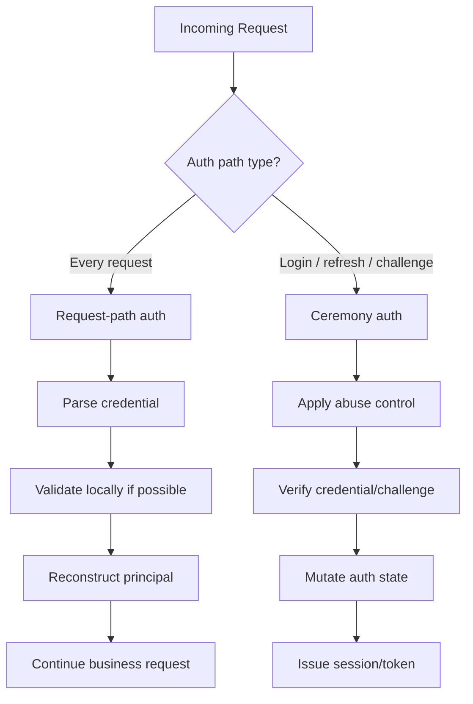
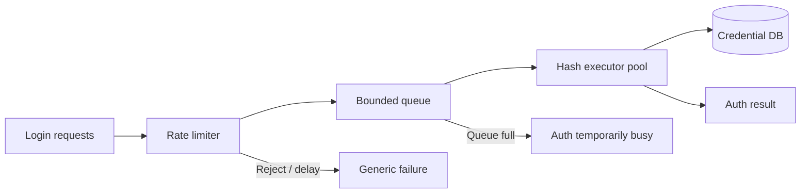
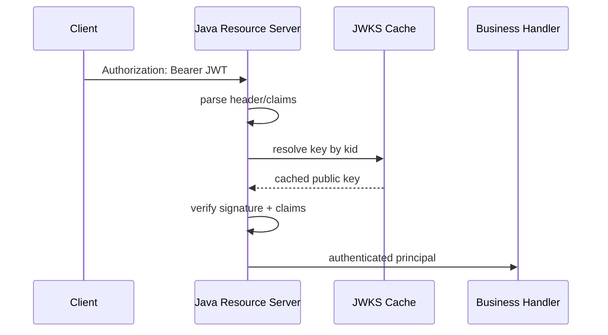
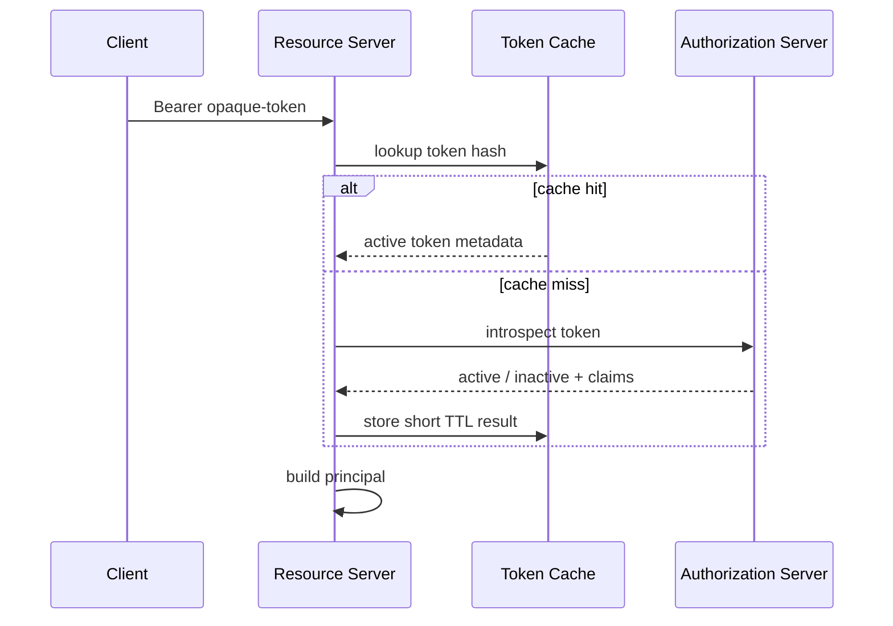
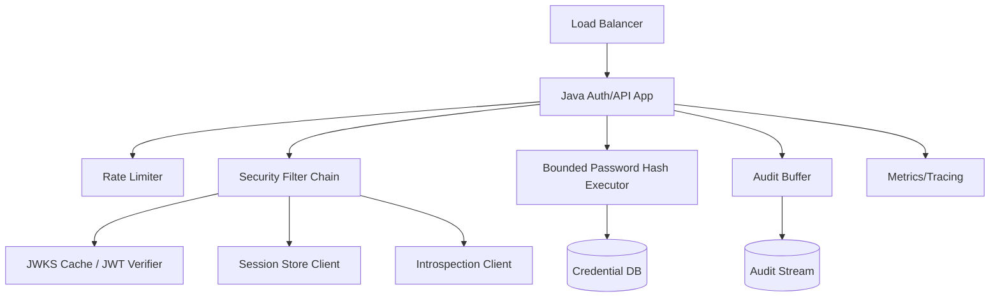

# Part 037 — Authentication Performance Engineering

> Target part ini: memahami authentication sebagai sistem performa kritis. Kita akan membedakan jalur auth yang memang harus mahal, seperti password hashing, dari jalur auth yang harus sangat murah, seperti request token validation. Tujuannya bukan membuat auth “secepat mungkin”, tetapi membuatnya aman, stabil, terukur, dan tidak menjadi titik runtuh seluruh platform.

Authentication punya karakter performa yang unik.

Di satu sisi, beberapa operasi sengaja dibuat mahal:

```txt
password verification
TOTP verification with abuse control
refresh token rotation with reuse detection
risk scoring
remote token introspection
federated login callback
```

Di sisi lain, beberapa operasi terjadi di hampir semua request dan harus murah:

```txt
session lookup
JWT signature verification
SecurityContext reconstruction
tenant resolution
authorization pre-check dependency
audit event enqueue
```

Kesalahan umum engineer adalah menyamakan semuanya sebagai “auth overhead”. Itu terlalu kasar.

Authentication performance engineering harus menjawab pertanyaan yang lebih presisi:

```txt
Which auth path is hot?
Which auth path is intentionally expensive?
Which path can be cached?
Which path must never be cached?
Which dependency is allowed to fail closed?
Which dependency must degrade gracefully?
Which latency spike can cause login storm?
Which CPU spike can become denial-of-service?
```

Kita tidak sedang mengoptimasi login page. Kita sedang melindungi control plane identitas.

---

## 1. Mental model: authentication has two performance classes

Pisahkan authentication path menjadi dua kelas besar.

```txt
Class A — request-path authentication
Runs on many or every API request.
Must be cheap, deterministic, and cache-aware.
Examples: JWT validation, session lookup, API key lookup, mTLS principal extraction.

Class B — ceremony authentication
Runs during explicit auth ceremonies.
May be expensive, stateful, and abuse-controlled.
Examples: password login, OAuth callback, MFA challenge, refresh rotation, recovery.
```

Diagramnya:



Invariant:

```txt
Request-path auth should not perform unpredictable expensive work.
Ceremony auth must be protected from concurrency, abuse, and resource exhaustion.
```

Kalau setiap API request melakukan remote introspection, database join besar, risk scoring penuh, atau password hash verification, sistem akan runtuh sebelum domain business code berjalan.

Kalau login ceremony tidak dibatasi, attacker bisa memakai password hashing sebagai CPU exhaustion primitive.

---

## 2. Performance objective: security first, then predictable latency

Tujuan performa auth bukan sekadar rendahnya latency.

Tujuan sebenarnya:

```txt
1. Security invariant tetap benar.
2. Auth path punya bounded resource usage.
3. Latency distribution dapat diprediksi.
4. Dependency failure tidak meruntuhkan seluruh platform.
5. Incident response dapat dilakukan tanpa full outage.
```

Contoh trade-off:

| Area | Faster choice | Safer / more controllable choice |
|---|---|---|
| Password hashing | Low work factor | Tuned adaptive cost + bounded executor |
| Token validation | Trust unsigned/weak token | Verify signature, issuer, audience, expiry |
| Opaque token | Cache forever | Bounded TTL + revocation semantics |
| Session store | Local memory only | Redis/DB with explicit failover model |
| JWKS | Fetch on every request | Cache with refresh + key rotation policy |
| Rate limiter | No limiter | Multi-dimensional limiter with graceful errors |

Performance engineering auth selalu berada di tension:

```txt
Too cheap => weak against attackers.
Too expensive => weak against denial-of-service.
```

Top engineer tidak bertanya “berapa cepat login?”. Ia bertanya “berapa biaya terburuk yang bisa dipaksa attacker per request?”.

---

## 3. Latency budget model

Mulai dari budget.

Contoh target internal:

```txt
GET /api/orders/{id}
P95 total latency: 120 ms
P99 total latency: 250 ms

Auth budget inside request:
P95: <= 5 ms
P99: <= 15 ms
```

Contoh login:

```txt
POST /login
P95 total latency: 500 ms
P99 total latency: 1500 ms

Password verification budget:
100 ms - 500 ms depending policy and hardware
```

Kenapa budget login boleh lebih mahal?

Karena password hashing memang defensive cost. Tetapi karena mahal, ia harus diberi pagar:

```txt
rate limit
bounded executor
queue limit
per-account throttling
per-IP/client throttling
synthetic verification budget
circuit breaker for downstream dependencies
```

Model sederhana:

```txt
request_latency = auth_latency + authorization_latency + business_latency + persistence_latency + serialization_latency
```

Untuk request-path auth:

```txt
auth_latency = parse + local_validation + context_mapping + optional_cache_lookup
```

Untuk login ceremony:

```txt
login_latency = limiter + account_lookup + hash_verify + state_transition + session_issue + audit_enqueue
```

Jangan ukur login dengan rata-rata. Ukur distribusi.

```txt
P50 tells you normal user experience.
P95 tells you capacity pressure.
P99 tells you tail risk.
Max tells you incident symptom.
```

---

## 4. Capacity model: authentication as a bottleneck

Kapasitas auth sering tidak sama dengan kapasitas API biasa.

Misal:

```txt
Password hash cost: 250 ms CPU-equivalent
Available login worker threads: 32
Theoretical max login verifications: 32 / 0.25 = 128 verifications/sec
```

Itu sebelum overhead database, Redis, audit, network, GC, dan contention.

Maka kapasitas aman mungkin:

```txt
safe_capacity = theoretical_capacity * safety_factor
safe_capacity = 128 * 0.5 = 64 login/sec
```

Jika bot mengirim 1000 login/sec, tanpa limiter sistem akan antri, latency naik, thread habis, dan endpoint lain ikut terdampak.

Karena itu password verification harus dibulkhead.



Invariant:

```txt
An attacker must not be able to consume unbounded CPU by forcing password verification.
```

---

## 5. Password hashing performance

Password hashing adalah bagian paling mudah disalahpahami.

Hash password harus cukup mahal untuk memperlambat offline cracking jika database credential bocor. Tetapi verifier juga harus mampu melayani user valid tanpa menjadi DoS amplifier.

Spring Security menyebut bcrypt, PBKDF2, scrypt, dan argon2 sebagai contoh adaptive one-way functions. Spring juga menekankan bahwa work factor perlu disesuaikan dengan sistem karena performa sangat bergantung pada hardware.

OWASP Password Storage Cheat Sheet merekomendasikan password disimpan dengan slow hashing seperti Argon2id, bcrypt, atau PBKDF2, bukan fast hash seperti SHA-256 langsung.

Mental model:

```txt
password_hash_cost is a security control
password_hash_executor is a capacity control
rate_limiter is an abuse control
rehash_policy is a migration control
```

### 5.1 Jangan jalankan password hashing sembarangan di request thread pool

Jika semua request memakai thread pool yang sama:

```txt
/login password verification consumes all web threads
/api/health fails
/api/orders fails
metrics scrape fails
load balancer marks instance unhealthy
traffic shifts to other pods
other pods collapse
```

Gunakan bounded executor khusus.

```java
import java.util.concurrent.*;

public final class PasswordHashExecutor {
    private final ThreadPoolExecutor executor;

    public PasswordHashExecutor(int workers, int queueSize) {
        this.executor = new ThreadPoolExecutor(
            workers,
            workers,
            0L,
            TimeUnit.MILLISECONDS,
            new ArrayBlockingQueue<>(queueSize),
            r -> {
                Thread t = new Thread(r);
                t.setName("password-hash-worker");
                t.setDaemon(true);
                return t;
            },
            new ThreadPoolExecutor.AbortPolicy()
        );
    }

    public <T> CompletableFuture<T> submit(Callable<T> task) {
        CompletableFuture<T> result = new CompletableFuture<>();
        try {
            executor.submit(() -> {
                try {
                    result.complete(task.call());
                } catch (Throwable ex) {
                    result.completeExceptionally(ex);
                }
            });
        } catch (RejectedExecutionException ex) {
            result.completeExceptionally(new AuthCapacityExceededException());
        }
        return result;
    }
}
```

Policy:

```txt
Queue full must not produce a distinct account-specific error.
Capacity failure must be logged as system event.
User response should stay generic.
```

### 5.2 Tune cost with benchmark, not folklore

Bad policy:

```txt
bcrypt 12 because blog said so
argon2 defaults because library said so
PBKDF2 iterations copied from old project
```

Better policy:

```txt
Benchmark on production-like hardware.
Choose target verification latency range.
Reserve CPU for peak login and attack conditions.
Document chosen parameters.
Re-evaluate during hardware/runtime upgrade.
```

Example benchmark dimensions:

```txt
algorithm
parameters
JDK version
container CPU limit
node CPU type
memory limit
concurrency
P50/P95/P99 verify latency
CPU saturation point
GC impact
```

Parameter decision record:

```mdx
## Password Hash Parameter ADR

Algorithm: Argon2id
Memory cost: ...
Iterations: ...
Parallelism: ...
Target P95 verification latency: ...
Measured hardware: ...
Date measured: ...
Maximum login verification concurrency per pod: ...
Reason: ...
Migration path: rehash-on-login
```

### 5.3 Synthetic verification must also be budgeted

Untuk mencegah account enumeration, sistem sering menjalankan synthetic hash verification ketika account tidak ditemukan.

```txt
Account exists: verify real password hash
Account missing: verify against synthetic hash
```

Ini benar secara security, tetapi mahal secara performa.

Tanpa limiter, attacker bisa mengirim username acak dan memaksa hash verification terus-menerus.

Invariant:

```txt
Enumeration defense must not become CPU exhaustion primitive.
```

Solusi:

```txt
rate limit before expensive verification
bounded hash executor
synthetic hash cached in memory
same general response semantics
audit high-cardinality identifier spray
```

### 5.4 Rehash-on-login jangan menjadi latency surprise

Saat menaikkan cost factor, sistem dapat melakukan rehash setelah login sukses.

```java
if (passwordEncoder.matches(rawPassword, storedHash)) {
    if (passwordEncoder.upgradeEncoding(storedHash)) {
        String newHash = passwordEncoder.encode(rawPassword);
        credentialRepository.updateHash(accountId, credentialVersion, newHash);
    }
}
```

Masalah:

```txt
verify old hash + encode new hash = double expensive operation
```

Untuk sistem high traffic, rehash perlu dirancang:

```txt
only after successful login
bounded executor
optimistic credential version update
optional async rehash with secure raw password handling constraints
progress metrics
rollback path
```

Hindari menyimpan raw password di queue atau message broker untuk async rehash. Itu memperbesar blast radius.

---

## 6. JWT validation performance

JWT sering dianggap “stateless dan cepat”. Itu hanya benar jika implementasinya tepat.

Hot path JWT validation:

```txt
1. Read Authorization header.
2. Parse compact token.
3. Enforce allowed algorithm.
4. Resolve key by kid.
5. Verify signature.
6. Validate issuer.
7. Validate audience.
8. Validate expiry / not-before / clock skew.
9. Map claims to principal.
10. Continue request.
```

Diagram:



Performance risk:

```txt
fetch JWKS on every request
parse enormous token
map huge claim graph
query DB for roles on every request
validate token against wrong tenant then retry all tenants
log token payload
```

### 6.1 JWKS cache strategy

JWKS fetch must not be on request critical path after warm-up.

Good strategy:

```txt
cache keys by issuer + kid
respect cache headers if safe
background refresh
refresh on unknown kid with rate limit
pin allowed issuer metadata
fail closed for invalid signature
avoid retry storm when IdP/JWKS endpoint is down
```

Bad strategy:

```txt
if kid unknown, fetch JWKS for every request
if fetch fails, accept token temporarily
if issuer unknown, try every configured issuer
```

Unknown `kid` is an attack vector for cache miss storm.

```txt
unknown_kid_rate_limiter[issuer, kid_hash, source] => allow limited refresh attempts
```

### 6.2 Token size matters

JWT is sent on every request.

Large tokens increase:

```txt
network overhead
header parsing cost
proxy/header limit risk
log leak risk
claim mapping cost
browser storage/cookie size risk
```

Keep access token claims minimal:

```txt
iss
sub
aud
exp
nbf
iat
jti if needed
tenant/member context if needed
coarse scopes/authorities
```

Do not pack entire authorization graph into JWT.

```txt
Bad: all permissions for every object
Better: coarse grant + resource-server-side authorization lookup/cache
```

### 6.3 Local JWT validation vs opaque introspection

| Aspect | JWT local validation | Opaque token introspection |
|---|---|---|
| Hot-path latency | Low after key cache warm | Network-dependent |
| Revocation immediacy | Harder | Easier |
| Token privacy | Claims visible to holder | Claims hidden |
| Dependency on IdP per request | No | Yes unless cached |
| Operational failure mode | Key cache / rotation | Introspection outage |

Decision rule:

```txt
Use local JWT validation when high request throughput and bounded token lifetime matter.
Use opaque token/introspection when immediate revocation and central control matter more.
Use caching carefully; otherwise introspection becomes IdP DDoS by design.
```

---

## 7. Opaque token introspection performance

Opaque tokens push validation to authorization server/introspection endpoint.

Hot path:



Risks:

```txt
introspection endpoint latency dominates API latency
IdP outage becomes API outage
attacker sends random tokens causing introspection storm
token cache stores raw token
revocation semantics broken by long cache TTL
```

Good practice:

```txt
hash token before cache key
do negative caching for random invalid tokens with very short TTL
use bounded connection pool to introspection endpoint
use timeout shorter than API timeout budget
cache active result no longer than acceptable revocation lag
track active/inactive/introspection_error separately
```

Example cache key:

```txt
sha256("opaque-token-cache:v1:" + token)
```

Never log raw opaque token.

---

## 8. Session store performance

Session auth shifts hot-path cost to session lookup.

Possible session store:

```txt
container memory
sticky session
Redis
relational database
hybrid cache + central store
```

Hot path:

```txt
cookie -> session id -> store lookup -> session record -> principal reconstruction
```

Risk:

```txt
Redis latency spike impacts every authenticated request
session object too large
session serialization is slow
session index updates become hot keys
logout requires slow global scan
concurrent session control does per-request write
```

### 8.1 Session object must be small

Bad session:

```txt
full User entity
roles from every tenant
preferences
cart
large serialized object graph
last activity update on every request
```

Good session:

```txt
sessionId
accountId
subjectId
tenantId/current tenant context
credentialVersion/authVersion
assuranceLevel
issuedAt
lastSeenAt maybe throttled
expiresAt
selected authorities snapshot or version pointer
```

If authorization data is large, store version pointer and cache separately.

### 8.2 Avoid write amplification

A common hidden cost:

```txt
Every request updates session lastAccessedTime.
```

In high traffic, this becomes write amplification to Redis/database.

Mitigations:

```txt
throttle last-seen updates
use sliding expiration carefully
separate idle timeout from audit heartbeat
batch/update asynchronously only when safe
avoid per-request large session serialization
```

### 8.3 Session indexing

Operations that need index:

```txt
revoke all sessions for account
revoke all sessions for tenant
list active sessions for user
concurrent session control
compromise response
```

Index design:

```txt
session:{sessionId} -> session record
account_sessions:{accountId} -> set of sessionIds
tenant_sessions:{tenantId} -> set of sessionIds, if operationally required
```

Failure mode:

```txt
session exists but index missing
index points to expired session
large tenant-wide session set causes slow revoke
```

Cleanup must be designed, not assumed.

---

## 9. API key lookup performance

API key verification hot path:

```txt
parse key prefix
lookup credential metadata by prefix
hash presented secret
constant-time compare
scope/client/tenant validation
rate limit/quota check
```

Avoid full-table secret scanning.

Good API key format:

```txt
ak_live_<public_prefix>_<secret_random>
```

Store:

```txt
id
public_prefix unique indexed
secret_hash
client_id
tenant_id
status
scope
created_at
rotated_at
last_used_at throttled
```

Performance invariant:

```txt
API key lookup must be O(1) or indexed O(log n), never scan-based.
```

Last-used tracking can create write pressure.

Better:

```txt
update last_used_at at most once per N minutes
emit audit event asynchronously
keep rate limiter counters in Redis or purpose-built store
```

---

## 10. HMAC signing performance

HMAC verification usually cheaper than password hashing, but it can become expensive if canonicalization is bad.

Hot path:

```txt
parse key id
lookup shared secret metadata
canonicalize request
compute payload hash or streaming digest
compute HMAC
constant-time compare
check timestamp/nonce
continue
```

Performance risks:

```txt
read huge body into memory
canonicalization allocates heavily
nonce store is unbounded
clock skew window too large
signature verification happens before body size limit
```

Good ordering:

```txt
1. Apply max request size.
2. Parse required signature headers.
3. Validate timestamp window.
4. Lookup key by key id.
5. Stream payload hash if needed.
6. Compute canonical signature.
7. Constant-time compare.
8. Store nonce with TTL.
```

Nonce store capacity:

```txt
nonce_entries = request_rate_per_client * replay_window_seconds
```

If client sends 100 req/s and replay window 300 seconds:

```txt
nonce_entries = 30,000 per client
```

For 10,000 clients, naive nonce store becomes huge.

Possible mitigations:

```txt
shorter replay window
per-client quota
nonce compaction
Bloom filter with false-positive trade-off where acceptable
idempotency key alignment
```

---

## 11. OAuth/OIDC callback performance

OAuth/OIDC login callback is not normally the hottest path, but it is dependency-heavy.

Operations:

```txt
state lookup
authorization code exchange
ID token validation
JWKS resolution
UserInfo call optional
account linking/provisioning
session creation
login audit
```

Risks:

```txt
IdP token endpoint slow
JWKS cold cache
UserInfo endpoint slow
account provisioning locks user table
email-domain tenant lookup slow
retry causes duplicate account linking
```

Design:

```txt
cache OIDC provider metadata/JWKS
avoid UserInfo call if ID token has required claims
make account linking idempotent
use unique constraint on issuer + subject
put provisioning behind explicit transaction boundary
separate interactive latency from async enrichment
```

Account linking invariant:

```txt
External identity key = issuer + subject
Never trust email alone as identity key.
```

---

## 12. Rate limiter performance

Rate limiter is both security control and performance dependency.

Dimensions:

```txt
source IP / network
normalized login identifier
account id if known
tenant id
client id
device fingerprint if defensible
route
credential type
```

Problem:

```txt
Too few dimensions => bypassable.
Too many dimensions => high cardinality and memory pressure.
```

Good limiter design:

```txt
cheap pre-limiter before expensive operations
stronger account limiter after account resolution
separate limiter for recovery, MFA, refresh, API key, introspection
bounded key cardinality
TTL on all counters
instrument rejection reason
```

Redis Lua pattern:

```lua
-- KEYS[1] = limiter key
-- ARGV[1] = max count
-- ARGV[2] = ttl seconds

local current = redis.call('INCR', KEYS[1])
if current == 1 then
  redis.call('EXPIRE', KEYS[1], ARGV[2])
end

if current > tonumber(ARGV[1]) then
  return 0
end

return 1
```

Be careful: a centralized Redis limiter can itself become bottleneck.

Mitigations:

```txt
local pre-filter for obvious abuse
sharded keys
bounded cardinality
separate Redis cluster/db for security counters if needed
fallback mode documented
```

---

## 13. Threading model in Java auth

### 13.1 Servlet stack

In servlet/Spring MVC apps:

```txt
request thread enters filter chain
SecurityContext is usually associated with current thread
business handler runs on same thread unless async boundary exists
```

Blocking auth operations consume request threads:

```txt
password hash
DB lookup
Redis lookup
remote introspection
OIDC token exchange
```

Use:

```txt
timeouts
connection pool limits
bulkheads
bounded executors
backpressure
```

### 13.2 Reactive stack

In reactive apps, blocking auth is more dangerous.

Bad:

```txt
Run password hash or JDBC call on event loop.
```

Better:

```txt
move blocking work to bounded scheduler
keep SecurityContext in reactive context, not ThreadLocal assumption
instrument scheduler queue
```

Even if this series mostly focuses on servlet/JAX-RS/Spring MVC patterns, the invariant is universal:

```txt
Do not run unpredictable blocking auth work on a scarce execution resource.
```

---

## 14. Caching strategy: what can and cannot be cached

| Data | Cache? | Notes |
|---|---:|---|
| JWKS public keys | Yes | By issuer + kid; handle rotation |
| OIDC discovery metadata | Yes | Refresh periodically |
| JWT validation result | Rarely | Usually unnecessary; risk token replay cache complexity |
| Opaque introspection active result | Yes, short TTL | TTL determines revocation lag |
| Opaque inactive result | Yes, very short TTL | Prevent random token storm |
| Session record | Yes | Must respect revocation/expiry |
| API key metadata | Yes | Must handle revocation/rotation lag |
| Password hash verification result | No | Credential verification must be fresh |
| MFA challenge result | No | Single-use/short-lived state |
| Risk score | Maybe | Cache signals, not final decision blindly |

Cache rule:

```txt
Cache public metadata aggressively.
Cache security decisions only with explicit revocation-lag acceptance.
Never cache raw secrets.
```

---

## 15. Backpressure and graceful degradation

Auth dependencies fail differently.

| Dependency | Failure impact | Fallback posture |
|---|---|---|
| Password DB | Login unavailable | Fail closed |
| Session Redis | Session auth unavailable or degraded | Usually fail closed for protected routes |
| JWKS endpoint | Existing cached keys may continue | Use cached keys until safe TTL; unknown kid fail closed |
| Introspection endpoint | Opaque token validation impaired | Fail closed unless explicit degraded policy exists |
| Audit pipeline | Security visibility reduced | Prefer local buffer/spool; do not block forever |
| Risk engine | Step-up quality reduced | Fall back to conservative policy |
| IdP token endpoint | Federated login unavailable | Existing sessions may continue |

Do not invent fallback during incident. Define it before incident.

Bad fallback:

```txt
IdP is down, so temporarily skip token validation.
```

Good fallback:

```txt
IdP is down.
Existing sessions continue until expiry.
New federated login unavailable.
Local break-glass admin path remains protected by hardware MFA.
Unknown JWT kid fails closed.
Cached known keys valid until configured maximum stale window.
```

---

## 16. Metrics: what to measure

Authentication metrics should be split by path and outcome.

### Request-path metrics

```txt
auth.request.count{mechanism, outcome, tenant, client_type}
auth.request.latency{mechanism}
auth.jwt.validation.latency{issuer, outcome}
auth.jwks.cache.hit{issuer}
auth.jwks.refresh.count{issuer, outcome}
auth.session.lookup.latency{store, outcome}
auth.opaque.introspection.latency{issuer, outcome}
```

### Ceremony metrics

```txt
auth.login.count{outcome, tenant, mechanism}
auth.login.latency{outcome}
auth.password.verify.latency{algorithm, outcome}
auth.password.hash.executor.queue_depth
auth.password.hash.executor.rejected
auth.mfa.challenge.count{factor, outcome}
auth.refresh.rotation.count{outcome}
auth.rate_limit.rejected{dimension, route}
```

### Security metrics

```txt
auth.enumeration_suspected.count
auth.credential_stuffing_suspected.count
auth.token_reuse_detected.count
auth.unknown_kid.count{issuer}
auth.invalid_audience.count
auth.invalid_issuer.count
auth.cross_tenant_rejected.count
```

Avoid high-cardinality labels:

```txt
Do not label metrics with raw username, email, token, session id, IP if cardinality/privacy risk is unacceptable.
```

Use hashed/bucketed fields in logs, not metrics labels.

---

## 17. SLO examples

Example SLOs:

```txt
Request-path authentication
99.9% of JWT validations complete under 20 ms excluding upstream network.
99.9% of session lookups complete under 25 ms.
JWKS cache hit ratio above 99.5% during steady state.

Login ceremony
99% of password login attempts complete under 1200 ms when dependencies healthy.
0 accepted sessions before full authentication completion.
Password hash executor rejection below 0.1% outside attack windows.

OAuth/OIDC
99% of callback handling completes under 2500 ms when IdP healthy.
0 callbacks accepted without matching state.
0 ID tokens accepted with invalid issuer/audience/signature/nonce.
```

Notice: security invariant SLOs are often zero-tolerance.

```txt
0 invalid token accepted
0 disabled account login accepted
0 cross-tenant token accepted
```

Latency may degrade. Security invariant must not.

---

## 18. Load testing scenarios

Do not load test only valid login.

Test matrix:

```txt
1. Valid login steady state
2. Invalid password storm against known account
3. Username spray against random identifiers
4. Credential stuffing across many accounts
5. Login + synthetic verification pressure
6. JWT valid high-throughput API requests
7. JWT unknown kid storm
8. Expired token storm
9. Opaque token random value storm
10. Session Redis latency injection
11. IdP JWKS outage during key rotation
12. Refresh token rotation race
13. MFA challenge flood
14. API key high-throughput usage
15. HMAC large payload signing
```

For every scenario measure:

```txt
P50/P95/P99 latency
CPU
memory
GC
thread pool usage
connection pool usage
queue depth
rate limiter rejection
business endpoint collateral damage
error semantics
security invariant
```

The last item matters most.

A load test that passes by accepting invalid tokens is a failed test.

---

## 19. Failure mode catalog

### 19.1 Hash cost too high

Symptoms:

```txt
login latency spike
CPU saturated
password hash executor queue grows
health checks fail
web request threads blocked
```

Controls:

```txt
bounded executor
rate limit before hash
capacity dashboard
feature flag for login challenge escalation
parameter ADR
```

### 19.2 Hash cost too low

Symptoms:

```txt
system performs well
but stolen hashes become easier to crack offline
```

Controls:

```txt
periodic hash parameter review
breached password defense
rehash-on-login
hardware-aware benchmark
```

### 19.3 JWKS cache miss storm

Symptoms:

```txt
unknown kid count spikes
JWKS endpoint QPS spikes
API latency increases
IdP rate limits resource servers
```

Controls:

```txt
unknown kid refresh limiter
issuer allowlist
cache warm-up
fail closed for unknown key
alerting
```

### 19.4 Introspection storm

Symptoms:

```txt
opaque introspection endpoint saturated
random token invalid rate high
resource servers slow
```

Controls:

```txt
negative cache short TTL
pre-parse token format
bounded pool
timeout
rate limit per source/client
```

### 19.5 Session store hot key

Symptoms:

```txt
Redis CPU spike
latency concentrated on session index keys
logout-all operation slow
```

Controls:

```txt
sharded indexes
async cleanup
bounded session listing
session record small
last-seen write throttling
```

### 19.6 Audit pipeline backpressure

Symptoms:

```txt
login path blocked on audit publish
audit queue full
dropped security events
```

Controls:

```txt
local bounded buffer
separate critical audit persistence
backpressure policy documented
drop policy only for non-critical telemetry
```

---

## 20. Implementation blueprint: auth performance guardrails

A production-grade Java auth system should have explicit guardrails:

```txt
Dedicated password hash executor
Per-route rate limiter
Per-account and per-source throttling
JWKS cache with refresh limiter
Token introspection cache with short TTL
Session store timeout and pool limit
Audit event async boundary
Metrics for every auth mechanism
Structured security logs
Capacity runbook
Load test suite
```

Architecture:



Key point:

```txt
Every expensive auth operation sits behind an explicit capacity boundary.
```

---

## 21. Production checklist

Use this checklist before deploying auth changes.

### Password/auth ceremony

```txt
[ ] Password algorithm and parameters documented.
[ ] Benchmark performed on production-like CPU/memory limits.
[ ] Hash verification uses bounded executor.
[ ] Queue full behavior tested.
[ ] Rate limiter runs before expensive verification.
[ ] Synthetic verification cannot be abused unboundedly.
[ ] Rehash-on-login measured and bounded.
[ ] Login storm load test executed.
```

### Token/resource server

```txt
[ ] JWT issuer/audience/expiry/signature validated.
[ ] JWKS cache exists and is warmed.
[ ] Unknown kid refresh is rate-limited.
[ ] Token size limits enforced.
[ ] Opaque token introspection has timeout and cache.
[ ] Invalid token storm tested.
[ ] Metrics split invalid_signature/expired/invalid_audience/unknown_kid.
```

### Session

```txt
[ ] Session record is small.
[ ] Store timeout is below endpoint timeout.
[ ] Last-seen write amplification controlled.
[ ] Revoke-all operation tested at realistic scale.
[ ] Session store outage behavior documented.
[ ] Concurrent session control measured.
```

### Operations

```txt
[ ] SLOs defined.
[ ] Alerts exist for latency, rejection, queue depth, unknown kid, introspection error.
[ ] Dashboards split request-path and ceremony auth.
[ ] Load tests include attack-like traffic.
[ ] Runbook includes capacity emergency steps.
```

---

## 22. Exercises

### Exercise 1 — Build an auth latency budget

Given:

```txt
API P95 target: 150 ms
Business handler P95: 90 ms
DB P95: 35 ms
Serialization P95: 8 ms
```

Define max auth P95 budget and decide whether remote token introspection per request is acceptable.

### Exercise 2 — Tune password verification capacity

Given:

```txt
Argon2id verify P95: 320 ms
Pod CPU limit: 2 vCPU
Expected peak valid login: 30/sec
Attack traffic: 500 invalid/sec
```

Design:

```txt
hash worker count
queue size
rate limiter dimensions
rejection semantics
metrics
```

### Exercise 3 — Unknown kid storm

Simulate JWTs with random `kid` values.

Verify:

```txt
JWKS endpoint is not called for every random kid
requests fail closed
unknown kid metric spikes
business endpoint remains healthy
```

### Exercise 4 — Redis session latency injection

Inject 200 ms Redis latency.

Observe:

```txt
session-authenticated endpoint P99
connection pool saturation
thread pool blocking
circuit breaker behavior
alert timing
```

---

## 23. Key takeaways

Authentication performance is not generic optimization.

The core rules:

```txt
Separate hot request-path auth from expensive ceremony auth.
Put every expensive auth operation behind a capacity boundary.
Tune password hashing with benchmark, not folklore.
Cache public metadata; cache security decisions only with explicit revocation trade-off.
Never let unknown kid, random token, or fake username traffic create unbounded expensive work.
Measure auth by mechanism, outcome, and latency distribution.
Security invariant beats latency target.
```

A system that logs in quickly but accepts weak tokens is broken.

A system that hashes passwords securely but collapses under username spray is also broken.

Production-grade auth is the balance: expensive for attackers, bounded for defenders, predictable for users.

---

## References

- Spring Security Reference — Password Storage: adaptive one-way functions and work factor tuning.
- Spring Security Reference — OAuth2 Resource Server JWT validation.
- OWASP Password Storage Cheat Sheet.
- OWASP Authentication Cheat Sheet.
- OWASP API Security — Lack of Resources and Rate Limiting.
- NIST SP 800-63B-4 — Digital Identity Guidelines: Authentication and Authenticator Management.
- RFC 6750 — OAuth 2.0 Bearer Token Usage.
- RFC 7009 — OAuth 2.0 Token Revocation.
- RFC 7662 — OAuth 2.0 Token Introspection.
- RFC 8725 — JSON Web Token Best Current Practices.
- RFC 9700 — Best Current Practice for OAuth 2.0 Security.
