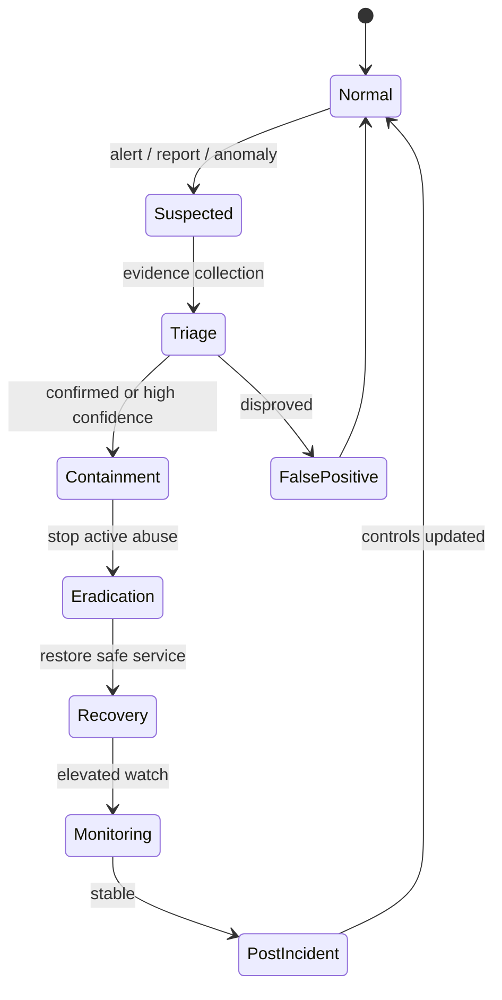
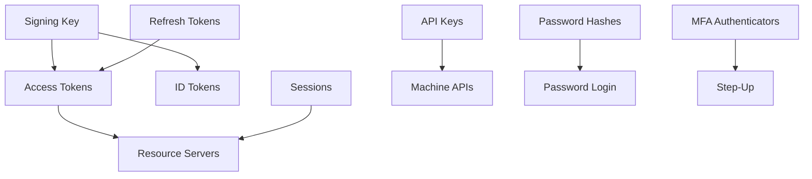
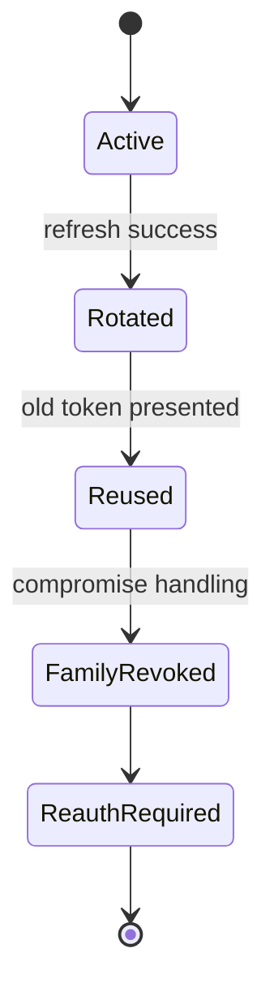

# Part 038 — Authentication Operational Runbook

> Target part ini: membangun runbook operasional untuk authentication incident. Fokusnya bukan teori incident response umum, tetapi langkah konkret saat sistem Java auth menghadapi key compromise, token leak, refresh-token reuse, session compromise, password hash breach, API key leak, IdP outage, account takeover campaign, dan tenant confusion.

Authentication system tidak selesai ketika fitur login bekerja.

Pertanyaan produksi yang lebih penting:

```txt
What happens when a signing key leaks?
What happens when access tokens appear in logs?
What happens when Redis session store is compromised?
What happens when refresh-token reuse is detected?
What happens when IdP JWKS endpoint is down?
What happens when one tenant's token is accepted by another tenant route?
What happens when password hashes are exfiltrated?
What happens when credential stuffing traffic rises 100x?
```

Kalau jawabannya “kita akan diskusikan saat terjadi”, sistem belum production-grade.

Runbook adalah desain sistem yang ditulis dalam bentuk tindakan.

---

## 1. Mental model: incident is a state transition

Authentication incident harus diperlakukan sebagai state machine.



Invariant:

```txt
Do not destroy evidence during containment.
Do not preserve availability by accepting invalid authentication.
Do not rotate one secret while leaving derived/session state valid without analysis.
Do not communicate certainty beyond evidence.
```

Authentication incident response is not just “rotate secret”. Often you must rotate secret, revoke dependent tokens, invalidate sessions, patch validation logic, preserve audit trail, and notify affected parties.

---

## 2. Severity classification

Use severity based on blast radius and authentication assurance impact.

| Severity | Condition | Example |
|---|---|---|
| SEV-1 | Active or likely compromise of authentication trust root | Signing private key leaked, verifier accepts invalid tokens, cross-tenant token acceptance |
| SEV-2 | Credential/session/token compromise affecting multiple users/clients | Token logs exposed, refresh-token reuse campaign, API key leak at major client |
| SEV-3 | Attack attempt with controls holding | Credential stuffing spike, enumeration spike, unknown `kid` storm failing closed |
| SEV-4 | Localized auth degradation | One IdP integration outage, MFA provider intermittent failure |

Severity is not only user count. One cross-tenant auth bypass can be SEV-1 with few observed requests.

---

## 3. First 15 minutes checklist

The first minutes should be boring and scripted.

```txt
[ ] Declare incident channel and commander.
[ ] Freeze risky deploys except approved emergency changes.
[ ] Preserve relevant logs, metrics, traces, audit events.
[ ] Identify suspected mechanism: password/session/JWT/OIDC/API key/mTLS/MFA/tenant.
[ ] Determine if invalid authentication is being accepted.
[ ] Determine if active abuse is ongoing.
[ ] Decide immediate containment: block, revoke, rotate, disable, degrade.
[ ] Record every action with timestamp and operator.
```

Do not start with a database migration or key rotation before understanding dependency graph.

Example dependency graph:



If a trust root is compromised, derived credentials may need revocation.

---

## 4. Evidence handling

Authentication evidence is sensitive.

Collect:

```txt
authentication audit events
security logs
resource server rejection logs
IdP admin events
JWKS/key rotation events
session creation/revocation events
refresh token rotation events
API key usage events
rate limiter metrics
network/proxy access logs
application deploy timeline
configuration changes
```

Avoid collecting raw secrets:

```txt
passwords
access tokens
refresh tokens
session ids
API key secrets
authorization codes
MFA codes
recovery codes
```

If secrets already exist in logs, treat log storage as contaminated.

Evidence record template:

```txt
Incident ID:
Time window:
Detected by:
Mechanism affected:
Tenants affected:
Users/clients affected:
Indicators:
Controls observed:
Immediate containment:
Open questions:
Evidence locations:
Access restrictions:
```

---

## 5. Runbook: JWT signing key compromise

### 5.1 Symptoms

```txt
private key exposed in repository, logs, build artifact, or secret manager incident
unexpected tokens signed with valid key
resource servers accepting tokens not issued by trusted IdP flow
unknown token issuance pattern
```

### 5.2 Immediate containment

```txt
[ ] Confirm key id (`kid`) and issuer.
[ ] Stop new token issuance with compromised key.
[ ] Generate new signing key pair in secure environment.
[ ] Publish new JWKS key if not already available.
[ ] Change active signing key.
[ ] Decide whether to remove compromised public key immediately or after emergency window.
[ ] Force resource servers to refresh JWKS cache.
[ ] Revoke/expire affected access tokens if possible.
[ ] Revoke refresh token families that could mint new access tokens.
[ ] Increase monitoring for old `kid` usage.
```

Critical decision:

```txt
Remove old key immediately => invalidates all tokens signed by it, may cause outage.
Keep old key briefly => attacker may continue using forged tokens.
```

For confirmed private key compromise, prefer security. Availability impact is acceptable compared to accepting forged tokens.

### 5.3 Java/Spring resource server considerations

Resource servers usually cache JWKS.

Containment requires:

```txt
cache eviction endpoint or restart
short emergency JWKS cache TTL
alert for old kid
issuer/audience validation verification
```

Pseudo-control:

```java
public interface JwksCacheControl {
    void evictIssuer(String issuer);
    void evictKey(String issuer, String kid);
}
```

Do not implement “accept token if JWKS unavailable” as emergency fallback.

### 5.4 Validation checklist after rotation

```txt
[ ] New tokens use new `kid`.
[ ] Old compromised `kid` is rejected or accepted only under explicit temporary window.
[ ] Resource servers refreshed key cache.
[ ] Tokens with wrong issuer rejected.
[ ] Tokens with wrong audience rejected.
[ ] Unsigned/none-alg tokens rejected.
[ ] Audit detects any old `kid` usage.
```

### 5.5 Post-incident hardening

```txt
[ ] Move signing to HSM/KMS if appropriate.
[ ] Reduce access to private key material.
[ ] Separate signing key by environment/tenant if needed.
[ ] Add secret scanning for key format.
[ ] Test emergency key rotation quarterly.
[ ] Document max JWKS cache staleness.
```

---

## 6. Runbook: access token leak

### 6.1 Symptoms

```txt
access tokens found in logs, analytics, browser crash reports, support tickets, URL query strings, referrer headers, third-party tooling
```

### 6.2 Triage questions

```txt
Are tokens JWT or opaque?
Are they expired?
What issuer/audience/client/tenant?
Were refresh tokens also leaked?
Was leakage continuous or one-time?
Who had access to the logs/tool?
Can leaked tokens be replayed from attacker environment?
```

### 6.3 Containment

For short-lived JWT access tokens:

```txt
[ ] Stop further leakage immediately.
[ ] Reduce token lifetime if systemic.
[ ] Revoke related refresh tokens if leak includes refresh token or long-lived path.
[ ] Add detection for leaked token `jti` if present.
[ ] Rotate session/token if user session path contaminated.
```

For opaque tokens:

```txt
[ ] Revoke token through token store/introspection source.
[ ] Invalidate cache entries in resource servers.
[ ] Search for related tokens from same session/client.
```

If tokens were logged, the log system becomes part of blast radius.

```txt
[ ] Restrict log access.
[ ] Create sanitized copy if investigation needs broad sharing.
[ ] Delete/expire contaminated logs according to legal/security policy.
[ ] Fix logger/redaction at source.
```

### 6.4 Prevention controls

```txt
Authorization header redaction
query parameter denylist
structured logging allowlist
HTTP client interceptor redaction
proxy/access-log redaction
support bundle scrubber
browser URL fragment/callback hygiene
```

---

## 7. Runbook: refresh token reuse detected

Refresh token rotation detects replay when an already-used refresh token appears again.

RFC 9700 describes refresh token rotation as issuing a new refresh token on each refresh and invalidating the previous one while retaining relationship information to detect compromise.

### 7.1 Signal

```txt
refresh_token_reuse_detected{client_id, tenant_id, token_family_id}
```

### 7.2 Immediate response

```txt
[ ] Mark token family compromised.
[ ] Revoke all descendants in family.
[ ] Revoke active access tokens associated with family if possible.
[ ] Terminate related sessions.
[ ] Require user/client re-authentication.
[ ] Notify user/client if policy requires.
[ ] Record source IP/device/client metadata for investigation.
```

State machine:



### 7.3 Common bug

Race condition creates false reuse:

```txt
Two legitimate refresh requests arrive concurrently.
Both see old token active.
Both issue new child.
```

Correct implementation needs atomic rotation.

```sql
UPDATE refresh_token
SET status = 'ROTATED', rotated_at = now()
WHERE id = :token_id
  AND status = 'ACTIVE';
```

Only one request should update one active token.

If affected rows = 0, investigate whether it is reuse, expiry, or already rotated.

---

## 8. Runbook: session compromise or session store compromise

### 8.1 Individual session compromise

Symptoms:

```txt
user reports suspicious activity
impossible travel
same session id used from different networks/devices
session id leaked in logs
```

Containment:

```txt
[ ] Revoke specific session id.
[ ] Rotate user's active sessions if necessary.
[ ] Revoke remember-me tokens.
[ ] Require re-authentication / MFA step-up.
[ ] Review account changes after suspected compromise time.
```

### 8.2 Session store compromise

If Redis/database session store is exposed:

```txt
[ ] Isolate session store network access.
[ ] Rotate session encryption/signing keys if used.
[ ] Revoke all sessions in affected environment.
[ ] Force global re-login.
[ ] Review whether session payload contained secrets.
[ ] Rotate downstream tokens stored in session.
[ ] Patch network/IAM/security group/config.
```

Global session purge should be tested before incident.

Pseudo-interface:

```java
public interface SessionIncidentService {
    int revokeSession(String sessionId, String reason);
    int revokeAllForAccount(String accountId, String reason);
    int revokeAllForTenant(String tenantId, String reason);
    int revokeAll(String environment, String reason);
}
```

### 8.3 Session purge failure modes

```txt
session index stale
Redis scan too slow
application local session cache not evicted
sticky sessions retain old context
logout event not propagated
```

Validation:

```txt
[ ] Old session cookie rejected.
[ ] Existing API request cannot continue with old SecurityContext after boundary.
[ ] All pods observe revocation.
[ ] Metrics show session recreation after login only.
```

---

## 9. Runbook: password hash database breach

A password hash breach is not the same as plaintext password breach, but it is serious.

### 9.1 Triage

```txt
Which tables/columns were accessed?
Were password hashes exfiltrated or only read?
Which algorithm/parameters?
Were salts included?
Was pepper used?
Was pepper exposed?
Were reset tokens/recovery codes/MFA secrets also exposed?
What time window?
```

### 9.2 Containment

```txt
[ ] Stop data exfiltration path.
[ ] Rotate database credentials and affected app secrets.
[ ] If pepper exposed, rotate pepper strategy carefully.
[ ] Invalidate password reset tokens/recovery codes if exposed.
[ ] Increase credential stuffing monitoring.
[ ] Force password reset for affected users if risk/policy requires.
[ ] Block known compromised passwords during reset.
[ ] Rehash credentials with upgraded parameters on reset/login.
```

If pepper is used and exposed, rotating it may require password reset or multi-pepper migration depending design.

### 9.3 User protection

Controls:

```txt
password reset campaign
MFA enrollment/step-up
breached password screening
suspicious login detection
session revocation after password reset
notification with concrete guidance
```

### 9.4 Post-incident hardening

```txt
[ ] Upgrade weak hashes.
[ ] Remove legacy hash acceptance after migration window.
[ ] Review DB access control.
[ ] Add anomaly detection for credential table reads.
[ ] Add canary credentials / honey hashes if appropriate.
[ ] Verify backup/security snapshot exposure.
```

---

## 10. Runbook: API key leak

API keys are common in machine-to-machine integrations.

### 10.1 Triage

```txt
Which API key prefix?
Which client/tenant/environment?
What scopes?
When was it last used?
Was it used from unusual IP/location?
Was it production or sandbox?
Was it logged in client code/repository/support ticket?
```

### 10.2 Containment

```txt
[ ] Disable leaked key.
[ ] Create replacement key with least privilege.
[ ] Notify client owner.
[ ] Monitor old key usage attempts.
[ ] Review actions performed by leaked key.
[ ] Rotate related webhook/HMAC secret if same client secret hygiene failed.
```

If client cannot rotate immediately:

```txt
temporary allowlist IP
scope reduction
short emergency overlap window
heightened monitoring
explicit expiry
```

Do not silently extend leaked key lifetime without risk acceptance.

### 10.3 Prevention

```txt
key prefix for lookup and identification
hashed secret storage
last-used throttled audit
secret scanning pattern
client self-service rotation
dual-key overlap rotation
scope minimization
```

---

## 11. Runbook: HMAC/webhook secret compromise

HMAC shared secret compromise lets attacker sign requests.

Containment:

```txt
[ ] Identify key id/client id.
[ ] Disable compromised secret or mark as retiring.
[ ] Issue new secret.
[ ] Support dual-signature overlap if required.
[ ] Reduce replay window if under attack.
[ ] Clear nonce cache if semantics require.
[ ] Monitor old key id usage.
[ ] Review signed requests during compromise window.
```

Validation:

```txt
[ ] Old secret rejected after cutoff.
[ ] New secret accepted.
[ ] Requests without timestamp rejected.
[ ] Replayed signatures rejected.
[ ] Canonicalization tests still pass.
```

---

## 12. Runbook: IdP outage

IdP outage can affect:

```txt
new login
token refresh
JWKS fetch
introspection
UserInfo
federated logout
admin API automation
```

Do not treat all as same.

### 12.1 Decision table

| Function | If IdP unavailable | Safe behavior |
|---|---|---|
| Existing session | Can continue until local expiry | Continue if session already established |
| JWT validation with cached key | Can continue for known keys | Continue until max stale key window |
| Unknown `kid` | Cannot validate | Fail closed |
| Opaque token introspection | Cannot verify active status | Usually fail closed |
| New federated login | Cannot complete | Show login unavailable |
| Token refresh | Cannot complete | Require retry; do not mint locally |
| Admin provisioning | Cannot complete | Queue only if idempotent and safe |

### 12.2 User-facing behavior

```txt
Do not show stack trace.
Do not reveal IdP internals.
Do not claim credentials are wrong.
Use clear temporary-unavailable message for login path.
Existing authenticated users may continue if policy allows.
```

### 12.3 Internal controls

```txt
IdP health dashboard
JWKS cache status
token endpoint error rate
introspection error rate
login callback failure rate
fallback admin/break-glass path
```

Break-glass access must be stronger, not weaker.

```txt
hardware MFA
small allowlisted group
separate audit
time-limited activation
post-use review
```

---

## 13. Runbook: account takeover campaign

Signals:

```txt
credential stuffing spike
many failed logins across many accounts
successful logins from unusual networks
MFA push fatigue pattern
password reset spike
risk score spike
known breached credential list usage
```

Containment:

```txt
[ ] Tighten rate limits for affected routes.
[ ] Enable step-up for suspicious logins.
[ ] Block obvious abusive networks/ASNs if reliable.
[ ] Require password reset for confirmed compromised accounts.
[ ] Revoke sessions for confirmed compromised accounts.
[ ] Disable risky recovery paths temporarily if abused.
[ ] Increase audit retention for incident window.
```

Do not globally lock accounts too aggressively. Account lockout can become attacker-driven denial-of-service.

Better:

```txt
progressive throttling
risk-based step-up
known breached password checks
user notification for confirmed suspicious successful login
support workflow for recovery
```

---

## 14. Runbook: account enumeration attack

Signals:

```txt
high volume of login/recovery attempts
identifier spray
response timing anomaly
registration lookup spike
forgot-password event spike
```

Containment:

```txt
[ ] Verify generic response behavior.
[ ] Check response timing distribution for known vs unknown accounts.
[ ] Tighten pre-auth rate limits.
[ ] Add CAPTCHA/challenge only where appropriate.
[ ] Monitor email/SMS sending volume.
[ ] Prevent notification flooding.
```

Validation:

```txt
Known and unknown account responses have equivalent semantics.
Recovery does not reveal account existence.
Registration does not reveal existing account unless intentionally designed and protected.
```

---

## 15. Runbook: MFA provider outage or MFA abuse

### 15.1 MFA provider outage

Questions:

```txt
Which factor is affected? TOTP? SMS? Email? Push? WebAuthn?
Are backup codes available?
Are high-risk actions blocked?
Can existing sessions continue?
```

Safe behavior:

```txt
Do not disable MFA globally as first action.
Prefer alternate enrolled factors.
Allow backup codes if designed.
For low-risk sessions, defer step-up if policy allows.
For high-risk/admin actions, fail closed.
```

### 15.2 MFA fatigue/push abuse

Containment:

```txt
[ ] Rate limit MFA challenges.
[ ] Require number matching or phishing-resistant factor if available.
[ ] Temporarily disable push for targeted accounts.
[ ] Notify affected users.
[ ] Revoke sessions if compromise confirmed.
```

---

## 16. Runbook: tenant confusion or cross-tenant auth bypass

This is one of the most severe auth incidents.

Symptoms:

```txt
token from tenant A accepted on tenant B endpoint
issuer/realm routing mismatch
email domain maps to wrong tenant
session tenant switched without revalidation
admin from one tenant sees another tenant resource
```

Immediate containment:

```txt
[ ] Disable affected route/client/tenant routing path if needed.
[ ] Add emergency check: token tenant must equal route/resource tenant.
[ ] Revoke sessions/tokens created through broken flow.
[ ] Identify all cross-tenant access events.
[ ] Preserve audit logs and data access logs.
[ ] Notify legal/compliance/security leadership.
```

Root cause classes:

```txt
issuer not validated per tenant
audience too broad
tenant taken from request parameter instead of authenticated principal
account linked by email alone
shared realm without tenant-bound membership check
resource server tries multiple issuers until one validates
```

Validation tests after fix:

```txt
[ ] Tenant A token rejected on Tenant B route.
[ ] Tenant B session cannot switch to Tenant A by parameter/header.
[ ] OIDC issuer + subject mapping is tenant-safe.
[ ] API key tenant binding enforced.
[ ] Audit event contains authenticated tenant and resource tenant.
```

---

## 17. Runbook: authentication logic regression in deployment

Symptoms:

```txt
sudden login failure spike after deploy
all JWTs rejected due to audience config
all sessions invalidated unexpectedly
CSRF token mismatch spike
OIDC callback broken due to redirect URI change
```

Containment:

```txt
[ ] Compare deploy/config timeline.
[ ] Roll back if security invariant remains safe.
[ ] If new version accepted invalid auth, revoke sessions/tokens created during window.
[ ] Run auth regression suite before redeploy.
[ ] Check feature flags and environment-specific config.
```

Important distinction:

```txt
Fail-closed regression: users cannot login, but invalid auth not accepted.
Fail-open regression: invalid/unauthorized auth accepted.
```

Fail-open requires deeper containment.

---

## 18. Operational commands and scripts

Production systems should expose safe internal operations.

Examples:

```txt
revoke session by id
revoke all sessions by account
revoke all sessions by tenant
revoke refresh token family
disable API key
rotate signing key
evict JWKS cache
force reauthentication for account/tenant
increase auth risk policy level
put IdP integration in maintenance mode
```

Guardrails:

```txt
admin authentication with step-up
authorization for operation type
dry-run support
idempotency key
audit event for every operation
bounded batch size
progress reporting
rollback where possible
```

Example operation record:

```json
{
  "operationId": "authop_20260703_001",
  "operation": "REVOKE_ACCOUNT_SESSIONS",
  "actor": "security-ops-user-id",
  "targetAccountId": "acc_123",
  "reason": "suspected_account_takeover",
  "dryRun": false,
  "startedAt": "2026-07-03T10:15:00Z",
  "completedAt": "2026-07-03T10:15:02Z",
  "affectedCount": 4
}
```

---

## 19. Audit event taxonomy for operations

Minimum operational audit events:

```txt
SIGNING_KEY_CREATED
SIGNING_KEY_ACTIVATED
SIGNING_KEY_RETIRED
JWKS_CACHE_EVICTED
SESSION_REVOKED
ACCOUNT_SESSIONS_REVOKED
TENANT_SESSIONS_REVOKED
REFRESH_TOKEN_FAMILY_REVOKED
API_KEY_DISABLED
MFA_FACTOR_RESET
PASSWORD_RESET_FORCED
BREAK_GLASS_ACCESS_USED
AUTH_POLICY_CHANGED
IDP_CONFIGURATION_CHANGED
TENANT_ROUTING_CHANGED
```

Every event should include:

```txt
actor
target
reason
correlation id
request id
before/after state if safe
timestamp
source system
approval reference if required
```

Never include raw secrets.

---

## 20. Communication model

Authentication incidents often require clear internal communication.

Internal update structure:

```txt
Status:
Impact:
Mechanism affected:
Known affected tenants/users/clients:
Containment completed:
Current risk:
Next action:
Open questions:
ETA policy:
```

Avoid vague statements:

```txt
Bad: We had an auth issue.
Better: We detected refresh-token reuse for client X and revoked affected token families. No evidence currently indicates signing key compromise.
```

External communication depends on legal/compliance policy. Technical team should provide precise facts and uncertainty boundaries.

---

## 21. Post-incident review

Post-incident review should produce engineering changes, not only timeline.

Questions:

```txt
Which invariant failed or was at risk?
Which detection fired?
Which detection was missing?
Which containment step was manual?
Which operation lacked tooling?
Which logs were insufficient?
Which secret/token appeared somewhere it should not?
Which test would have caught this before production?
Which architecture decision increased blast radius?
```

Output:

```txt
new regression tests
new alert
new runbook step
automated operation
auth model change
secret handling improvement
tenant isolation improvement
policy/ADR update
```

---

## 22. Runbook drill program

Runbooks rot unless tested.

Drills:

```txt
quarterly signing key rotation drill
monthly session revoke-all dry run in staging
refresh-token reuse simulation
JWT unknown kid storm simulation
IdP outage game day
API key leak tabletop
password hash breach tabletop
tenant confusion regression drill
MFA provider outage drill
```

For each drill measure:

```txt
time to detect
time to triage
time to contain
tooling gaps
operator confusion
missing permissions
log quality
customer impact estimate
```

---

## 23. Production readiness checklist

### Trust root and key operations

```txt
[ ] Signing keys have owner, lifecycle, rotation cadence.
[ ] Emergency key rotation tested.
[ ] JWKS cache eviction supported.
[ ] Resource servers fail closed on invalid/unknown keys.
[ ] Private key access audited.
```

### Token/session operations

```txt
[ ] Access token leak response documented.
[ ] Refresh token family revoke implemented.
[ ] Session revoke by account/tenant/global implemented.
[ ] Revocation propagates to all pods.
[ ] Existing sessions can be forced to reauthenticate.
```

### Credential operations

```txt
[ ] Password hash breach runbook exists.
[ ] Legacy hash migration plan exists.
[ ] Forced password reset process exists.
[ ] Recovery token invalidation exists.
[ ] MFA reset operation is audited and protected.
```

### Client/API operations

```txt
[ ] API key disable/rotate workflow exists.
[ ] HMAC secret rotation supports overlap/cutoff.
[ ] Client owner mapping exists.
[ ] Scope reduction can be applied quickly.
```

### Detection and evidence

```txt
[ ] Auth audit events are structured.
[ ] Logs redact secrets.
[ ] Token/session/API key IDs are represented by safe hashes/prefixes.
[ ] Incident queries are prewritten.
[ ] Evidence retention policy is known.
```

---

## 24. Exercises

### Exercise 1 — Signing key compromise tabletop

Assume:

```txt
JWT signing private key for production issuer leaked in CI logs.
Tokens are valid for 15 minutes.
JWKS cache TTL in resource servers is 1 hour.
```

Design:

```txt
containment steps
resource server cache refresh strategy
old key retirement decision
token/session impact
communications
post-incident hardening
```

### Exercise 2 — Refresh-token reuse drill

Simulate reuse of a rotated refresh token.

Verify:

```txt
token family revoked
active access tokens invalidated if supported
user forced to reauthenticate
audit event emitted
false-positive race condition avoided
```

### Exercise 3 — Session store compromise

Assume Redis session store exposed for 20 minutes.

Define:

```txt
blast radius
global session purge procedure
secret rotation
user impact
validation queries
post-incident controls
```

### Exercise 4 — Tenant confusion regression

Create a test where token from tenant A is replayed against tenant B route.

Expected:

```txt
request rejected
cross-tenant rejection audit event created
no resource access
metric increments
```

---

## 25. Key takeaways

Authentication operations must be designed before incident.

Core rules:

```txt
Runbook is part of architecture.
Key compromise requires dependent-token analysis.
Token leak requires log/tool blast-radius analysis.
Refresh-token reuse should revoke the whole token family.
Session compromise requires tested purge operations.
Password hash breach response depends on algorithm, parameter, pepper, and exposed recovery data.
IdP outage must not become reason to skip validation.
Tenant confusion is usually SEV-1 even with small observed impact.
Every emergency operation must be audited.
Every incident should produce tests and tooling improvements.
```

Production-grade authentication is not the absence of incidents.

It is the ability to contain incidents without guessing.

---

## References

- NIST SP 800-63B-4 — Digital Identity Guidelines: Authentication and Authenticator Management.
- OWASP Authentication Cheat Sheet.
- OWASP Password Storage Cheat Sheet.
- OWASP Logging Cheat Sheet.
- RFC 7009 — OAuth 2.0 Token Revocation.
- RFC 7662 — OAuth 2.0 Token Introspection.
- RFC 8725 — JSON Web Token Best Current Practices.
- RFC 9700 — Best Current Practice for OAuth 2.0 Security.
- Spring Security Reference — OAuth2 Resource Server, JWT validation, session management, password storage.
- Keycloak Server Administration and Securing Applications documentation.
