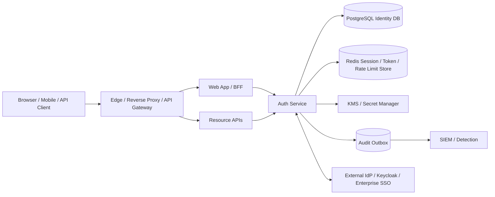
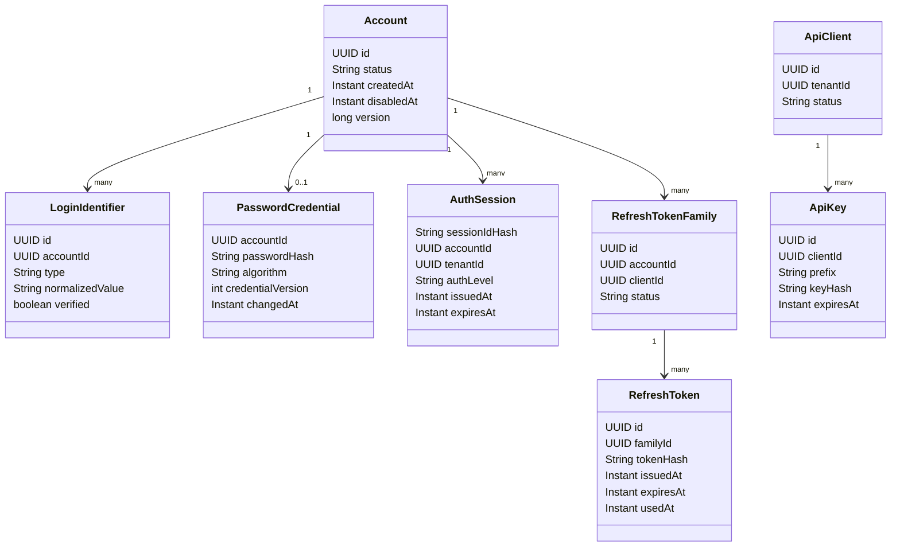
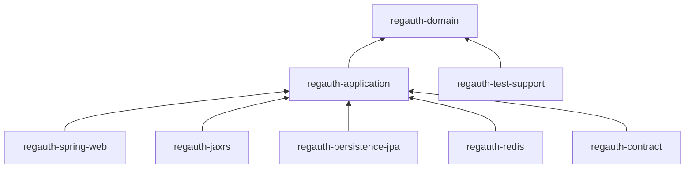
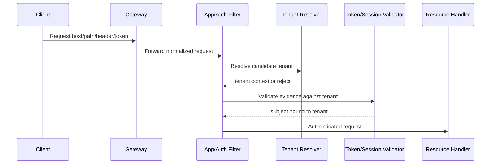
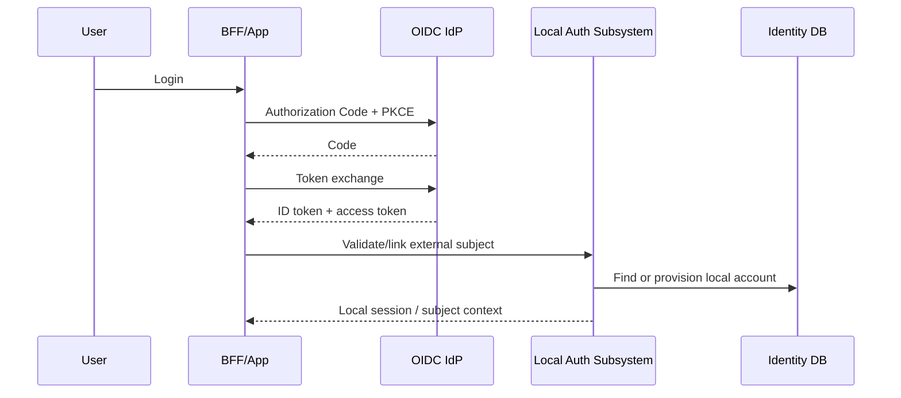

# Part 039 — Production Reference Implementation

> Target part ini: menyatukan seluruh pattern sebelumnya menjadi satu reference implementation yang bisa dipakai sebagai blueprint production-grade. Fokusnya bukan membuat demo login, tetapi membangun authentication subsystem yang punya boundary jelas, state model jelas, data model defensible, failure mode terukur, dan integrasi Java/Spring/Jakarta yang bisa diuji.

Kita akan membangun blueprint bernama:

```txt
RegAuth Reference Implementation
```

Bukan karena nama itu penting, tetapi karena authentication system harus diperlakukan seperti product subsystem, bukan potongan filter yang menempel di setiap service.

Reference implementation ini cocok untuk:

```txt
Enterprise web application
Regulatory case management platform
Internal workflow platform
B2B SaaS multi-tenant application
Microservice estate with central auth boundary
Hybrid browser + API + machine-to-machine access
```

Tidak semua organisasi harus membangun identity provider sendiri. Kalau kebutuhan utama adalah SSO, federation, social login, dan user lifecycle umum, gunakan IdP mature seperti Keycloak, Entra ID, Okta, Auth0, Ping, atau cloud IAM yang sesuai. Namun engineer top-tier tetap harus mampu memahami bagaimana implementasi internalnya bekerja, karena production incident tidak peduli apakah login berasal dari custom code, Spring Security, Keycloak, atau managed IdP.

---

## 1. The reference architecture

Authentication system kita terdiri dari beberapa komponen:



Core idea:

```txt
Authentication decision is centralized enough to be consistent,
but authentication evidence is represented in a portable way.
```

Do not copy login logic into every microservice.

Do not let every service invent its own token validation rules.

Do not let the gateway become the only place where identity is checked.

---

## 2. Scope of this implementation

This reference implementation covers:

```txt
1. Password login with hardened storage
2. Server-side browser sessions
3. JWT access-token validation for APIs
4. Opaque refresh-token rotation
5. API key authentication for machine clients
6. HMAC request signing for selected high-risk integrations
7. Multi-tenant identity binding
8. Audit event outbox
9. Observability and security events
10. Operational hooks for revocation and incident response
```

It intentionally does not reimplement everything:

```txt
1. It does not replace enterprise SSO for large federation cases.
2. It does not implement a full OAuth/OIDC authorization server from scratch.
3. It does not handle identity proofing/KYC.
4. It does not solve authorization policy by itself.
5. It does not treat JWT as a database replacement.
```

Authentication answers:

```txt
Who or what is this claimant?
What evidence was presented?
Was the evidence verified?
What authentication strength was achieved?
What subject should downstream systems see?
```

Authorization answers:

```txt
Can this subject perform this action on this resource under this tenant/context?
```

Keep those separate.

---

## 3. Non-negotiable invariants

Before writing code, freeze the invariants.

```txt
Invariant 1: No request becomes authenticated without a typed authentication evidence record.
Invariant 2: No credential secret is stored reversibly unless it is operationally unavoidable and protected by KMS.
Invariant 3: Passwords are never logged, emitted, traced, cached, or published to events.
Invariant 4: Token validation always checks issuer, audience, expiry, not-before, algorithm, key id, and tenant binding where applicable.
Invariant 5: Session id rotates after successful authentication and after privilege elevation.
Invariant 6: Refresh tokens are opaque, stored hashed, rotated atomically, and reuse-detected.
Invariant 7: API keys are stored hashed with lookup prefix and are never stored plaintext after creation.
Invariant 8: Authentication events are append-only from the business perspective.
Invariant 9: Rate limiting is enforced before expensive credential verification.
Invariant 10: Authentication failure reason is detailed internally but generic externally.
Invariant 11: Tenant resolution is explicit, not inferred casually from hostname/string parsing without validation.
Invariant 12: SecurityContext is request-scoped and must not leak across threads.
```

These invariants matter more than framework choice.

---

## 4. Bounded context model

Authentication is not a table named `users`.

It is a bounded context with several aggregates.



Important distinction:

```txt
Account       = local identity record
Person        = real-world human, often outside auth boundary
Subject       = authenticated runtime representation
Principal     = framework-level current identity representation
Credential    = secret or proof used to authenticate
Authenticator = device/app/mechanism that can produce proof
Session       = server-side continuity after authentication
Token         = portable assertion or reference for API access
```

Do not collapse these concepts into one `User` entity.

That shortcut works for demos and fails in enterprise systems.

---

## 5. Suggested Maven module layout

A production auth system should separate domain rules from framework adapters.

```txt
regauth/
  pom.xml
  regauth-domain/
    src/main/java/com/acme/regauth/domain/...
  regauth-application/
    src/main/java/com/acme/regauth/application/...
  regauth-persistence-jpa/
    src/main/java/com/acme/regauth/persistence/...
  regauth-redis/
    src/main/java/com/acme/regauth/redis/...
  regauth-spring-web/
    src/main/java/com/acme/regauth/spring/...
  regauth-jaxrs/
    src/main/java/com/acme/regauth/jaxrs/...
  regauth-contract/
    openapi/authentication.yaml
  regauth-test-support/
    src/test/java/com/acme/regauth/testsupport/...
```

Dependency direction:



Rules:

```txt
Domain must not depend on Spring Security.
Domain must not depend on Jakarta Servlet.
Application use cases may depend on ports/interfaces.
Adapters implement ports.
Framework principal mapping happens at the edge.
```

This keeps authentication logic testable without booting the web container.

---

## 6. PostgreSQL schema baseline

Use normalized tables. Avoid `users.password_hash` as the entire auth model.

### 6.1 Account

```sql
CREATE TABLE auth_account (
  id UUID PRIMARY KEY,
  status VARCHAR(32) NOT NULL,
  primary_tenant_id UUID,
  created_at TIMESTAMPTZ NOT NULL DEFAULT now(),
  updated_at TIMESTAMPTZ NOT NULL DEFAULT now(),
  disabled_at TIMESTAMPTZ,
  disabled_reason TEXT,
  version BIGINT NOT NULL DEFAULT 0,
  CONSTRAINT ck_auth_account_status CHECK (
    status IN ('ACTIVE', 'LOCKED', 'DISABLED', 'PENDING_VERIFICATION', 'DELETED')
  )
);

CREATE INDEX ix_auth_account_status ON auth_account(status);
```

Account status is separate from credential validity.

A disabled account may still have old credentials. Those credentials must not authenticate.

### 6.2 Login identifier

```sql
CREATE TABLE auth_login_identifier (
  id UUID PRIMARY KEY,
  account_id UUID NOT NULL REFERENCES auth_account(id),
  type VARCHAR(32) NOT NULL,
  normalized_value VARCHAR(512) NOT NULL,
  verified BOOLEAN NOT NULL DEFAULT false,
  verified_at TIMESTAMPTZ,
  created_at TIMESTAMPTZ NOT NULL DEFAULT now(),
  UNIQUE (type, normalized_value),
  CONSTRAINT ck_login_identifier_type CHECK (
    type IN ('EMAIL', 'USERNAME', 'PHONE', 'EXTERNAL_SUBJECT')
  )
);

CREATE INDEX ix_login_identifier_account ON auth_login_identifier(account_id);
```

Never authenticate against unnormalized email.

Normalize once, compare normalized values, display original values separately if needed.

### 6.3 Password credential

```sql
CREATE TABLE auth_password_credential (
  account_id UUID PRIMARY KEY REFERENCES auth_account(id),
  password_hash TEXT NOT NULL,
  password_algorithm VARCHAR(64) NOT NULL,
  credential_version INTEGER NOT NULL DEFAULT 1,
  password_changed_at TIMESTAMPTZ NOT NULL DEFAULT now(),
  password_expires_at TIMESTAMPTZ,
  must_change_password BOOLEAN NOT NULL DEFAULT false,
  last_rehash_at TIMESTAMPTZ,
  compromised_checked_at TIMESTAMPTZ,
  updated_at TIMESTAMPTZ NOT NULL DEFAULT now()
);
```

The hash string should include algorithm parameters when the library supports it.

The separate `password_algorithm` is useful for reporting and migration queries.

### 6.4 Session index

Actual session data may live in Redis. PostgreSQL keeps index/evidence.

```sql
CREATE TABLE auth_session_index (
  id UUID PRIMARY KEY,
  session_id_hash TEXT NOT NULL UNIQUE,
  account_id UUID NOT NULL REFERENCES auth_account(id),
  tenant_id UUID,
  auth_level VARCHAR(32) NOT NULL,
  status VARCHAR(32) NOT NULL,
  issued_at TIMESTAMPTZ NOT NULL,
  last_seen_at TIMESTAMPTZ NOT NULL,
  idle_expires_at TIMESTAMPTZ NOT NULL,
  absolute_expires_at TIMESTAMPTZ NOT NULL,
  revoked_at TIMESTAMPTZ,
  revoked_reason TEXT,
  user_agent_hash TEXT,
  ip_first_seen INET,
  ip_last_seen INET,
  CONSTRAINT ck_session_status CHECK (status IN ('ACTIVE', 'REVOKED', 'EXPIRED'))
);

CREATE INDEX ix_session_account_active
  ON auth_session_index(account_id, status, last_seen_at DESC);

CREATE INDEX ix_session_tenant_active
  ON auth_session_index(tenant_id, status, last_seen_at DESC);
```

Hash the session id before persisting.

If the database leaks, raw session takeover should not be immediate.

### 6.5 Refresh token family

```sql
CREATE TABLE auth_refresh_token_family (
  id UUID PRIMARY KEY,
  account_id UUID NOT NULL REFERENCES auth_account(id),
  client_id UUID NOT NULL,
  tenant_id UUID,
  status VARCHAR(32) NOT NULL,
  created_at TIMESTAMPTZ NOT NULL DEFAULT now(),
  revoked_at TIMESTAMPTZ,
  revoked_reason TEXT,
  latest_token_id UUID,
  version BIGINT NOT NULL DEFAULT 0,
  CONSTRAINT ck_refresh_family_status CHECK (
    status IN ('ACTIVE', 'REVOKED', 'COMPROMISED', 'EXPIRED')
  )
);
```

### 6.6 Refresh token

```sql
CREATE TABLE auth_refresh_token (
  id UUID PRIMARY KEY,
  family_id UUID NOT NULL REFERENCES auth_refresh_token_family(id),
  token_hash TEXT NOT NULL UNIQUE,
  issued_at TIMESTAMPTZ NOT NULL,
  expires_at TIMESTAMPTZ NOT NULL,
  used_at TIMESTAMPTZ,
  replaced_by_token_id UUID,
  reuse_detected_at TIMESTAMPTZ,
  created_from_ip INET,
  created_from_user_agent_hash TEXT
);

CREATE INDEX ix_refresh_token_family ON auth_refresh_token(family_id, issued_at DESC);
```

Refresh rotation must be atomic.

If two refresh attempts race, exactly one succeeds.

### 6.7 API client and API key

```sql
CREATE TABLE auth_api_client (
  id UUID PRIMARY KEY,
  tenant_id UUID NOT NULL,
  name VARCHAR(200) NOT NULL,
  status VARCHAR(32) NOT NULL,
  created_at TIMESTAMPTZ NOT NULL DEFAULT now(),
  disabled_at TIMESTAMPTZ,
  CONSTRAINT ck_api_client_status CHECK (status IN ('ACTIVE', 'DISABLED'))
);

CREATE TABLE auth_api_key (
  id UUID PRIMARY KEY,
  client_id UUID NOT NULL REFERENCES auth_api_client(id),
  key_prefix VARCHAR(32) NOT NULL UNIQUE,
  key_hash TEXT NOT NULL,
  status VARCHAR(32) NOT NULL,
  scopes TEXT[] NOT NULL DEFAULT '{}',
  created_at TIMESTAMPTZ NOT NULL DEFAULT now(),
  expires_at TIMESTAMPTZ,
  last_used_at TIMESTAMPTZ,
  revoked_at TIMESTAMPTZ,
  CONSTRAINT ck_api_key_status CHECK (status IN ('ACTIVE', 'REVOKED', 'EXPIRED'))
);

CREATE INDEX ix_api_key_client ON auth_api_key(client_id);
```

Only display an API key once at creation.

After that, store prefix + hash only.

### 6.8 Audit outbox

```sql
CREATE TABLE auth_audit_outbox (
  id UUID PRIMARY KEY,
  event_type VARCHAR(100) NOT NULL,
  aggregate_type VARCHAR(100) NOT NULL,
  aggregate_id UUID,
  tenant_id UUID,
  account_id UUID,
  actor_subject VARCHAR(512),
  client_id UUID,
  correlation_id VARCHAR(128),
  risk_score INTEGER,
  reason_code VARCHAR(128),
  occurred_at TIMESTAMPTZ NOT NULL,
  payload JSONB NOT NULL,
  published_at TIMESTAMPTZ,
  publish_attempts INTEGER NOT NULL DEFAULT 0
);

CREATE INDEX ix_auth_audit_outbox_unpublished
  ON auth_audit_outbox(occurred_at)
  WHERE published_at IS NULL;

CREATE INDEX ix_auth_audit_account_time
  ON auth_audit_outbox(account_id, occurred_at DESC);
```

Audit events are not just logs.

They are security evidence.

---

## 7. Redis key design

Redis is useful for volatile, high-throughput auth state.

Suggested keys:

```txt
session:{sessionIdHash}               -> session payload, TTL = idle timeout
session-index:account:{accountId}      -> set of session ids
rl:login:ip:{ipHash}:{window}          -> rate-limit counter
rl:login:id:{identifierHash}:{window}  -> rate-limit counter
rl:api-key:{keyPrefix}:{window}        -> API key throttling
jti:revoked:{jti}                      -> revoked token marker, TTL = token exp
risk:device:{deviceIdHash}             -> device risk state
nonce:hmac:{clientId}:{nonce}          -> replay nonce, TTL = replay window
```

Do not put plaintext identifiers in Redis keys.

Keys leak through metrics, debug tools, snapshots, and operations consoles.

Use deterministic HMAC hashing for key material:

```java
public interface StableHasher {
    String hashForLookup(String namespace, String value);
}
```

Example:

```java
public final class HmacStableHasher implements StableHasher {
    private final MacFactory macFactory;

    public HmacStableHasher(MacFactory macFactory) {
        this.macFactory = macFactory;
    }

    @Override
    public String hashForLookup(String namespace, String value) {
        byte[] input = (namespace + ":" + value).getBytes(StandardCharsets.UTF_8);
        byte[] digest = macFactory.hmacSha256(input);
        return Base64.getUrlEncoder().withoutPadding().encodeToString(digest);
    }
}
```

---

## 8. Runtime authentication context

Create your own runtime auth context instead of leaking framework objects everywhere.

```java
public record AuthenticatedSubject(
        String subjectId,
        String subjectType,
        UUID accountId,
        UUID tenantId,
        UUID clientId,
        AuthLevel authLevel,
        Set<String> scopes,
        Set<String> factors,
        Instant authenticatedAt,
        String sessionIdHash,
        String tokenId,
        String issuer,
        Map<String, String> attributes
) {
    public boolean isHuman() {
        return "HUMAN".equals(subjectType);
    }

    public boolean isService() {
        return "SERVICE".equals(subjectType);
    }
}
```

Framework-specific adapters can map into this object.

Spring Security `Authentication` becomes an adapter boundary, not the domain model.

```java
public final class AuthenticatedSubjectPrincipal {
    private final AuthenticatedSubject subject;

    public AuthenticatedSubjectPrincipal(AuthenticatedSubject subject) {
        this.subject = subject;
    }

    public AuthenticatedSubject subject() {
        return subject;
    }

    public String name() {
        return subject.subjectId();
    }
}
```

---

## 9. Spring Security filter-chain split

Most production systems need more than one `SecurityFilterChain`.

Example split:

```txt
/api/**          -> stateless bearer JWT / opaque token / API key
/internal/**     -> mTLS/service token only
/web/**          -> browser session + CSRF
/auth/**         -> login/logout/recovery endpoints
/actuator/**     -> management security
```

Do not force every endpoint through one giant chain.

```java
@Configuration
@EnableWebSecurity
class SecurityConfig {

    @Bean
    @Order(1)
    SecurityFilterChain apiChain(HttpSecurity http,
                                 JwtAuthenticationConverter jwtConverter) throws Exception {
        http
            .securityMatcher("/api/**")
            .csrf(csrf -> csrf.disable())
            .sessionManagement(sm -> sm.sessionCreationPolicy(SessionCreationPolicy.STATELESS))
            .oauth2ResourceServer(oauth2 -> oauth2
                .jwt(jwt -> jwt.jwtAuthenticationConverter(jwtConverter))
            )
            .authorizeHttpRequests(authz -> authz
                .requestMatchers("/api/public/**").permitAll()
                .anyRequest().authenticated()
            );
        return http.build();
    }

    @Bean
    @Order(2)
    SecurityFilterChain webChain(HttpSecurity http) throws Exception {
        http
            .securityMatcher("/web/**", "/auth/**")
            .csrf(Customizer.withDefaults())
            .sessionManagement(sm -> sm
                .sessionFixation(sf -> sf.migrateSession())
                .maximumSessions(5)
            )
            .authorizeHttpRequests(authz -> authz
                .requestMatchers("/auth/login", "/auth/recover").permitAll()
                .anyRequest().authenticated()
            )
            .formLogin(form -> form.disable())
            .logout(logout -> logout
                .logoutUrl("/auth/logout")
                .invalidateHttpSession(true)
                .deleteCookies("SESSION")
            );
        return http.build();
    }
}
```

Production note:

```txt
CSRF is disabled for stateless bearer APIs because credentials are not automatically attached by the browser.
CSRF remains enabled for browser session endpoints because cookies are automatically attached.
```

Do not blindly disable CSRF globally.

---

## 10. JWT decoder with issuer/audience validation

A resource server must not merely parse JWT.

It must validate it.

```java
@Configuration
class JwtResourceServerConfig {

    @Bean
    JwtDecoder jwtDecoder(AuthProperties props) {
        NimbusJwtDecoder decoder = NimbusJwtDecoder
            .withJwkSetUri(props.jwkSetUri())
            .build();

        OAuth2TokenValidator<Jwt> issuer = JwtValidators
            .createDefaultWithIssuer(props.issuer());

        OAuth2TokenValidator<Jwt> audience = jwt -> {
            List<String> audiences = jwt.getAudience();
            if (audiences.contains(props.requiredAudience())) {
                return OAuth2TokenValidatorResult.success();
            }
            OAuth2Error error = new OAuth2Error(
                "invalid_token",
                "Missing required audience",
                null
            );
            return OAuth2TokenValidatorResult.failure(error);
        };

        OAuth2TokenValidator<Jwt> tenant = jwt -> {
            Object tenantId = jwt.getClaims().get("tenant_id");
            if (tenantId instanceof String s && !s.isBlank()) {
                return OAuth2TokenValidatorResult.success();
            }
            return OAuth2TokenValidatorResult.failure(
                new OAuth2Error("invalid_token", "Missing tenant binding", null)
            );
        };

        decoder.setJwtValidator(new DelegatingOAuth2TokenValidator<>(issuer, audience, tenant));
        return decoder;
    }
}
```

Validation requirements:

```txt
Check signature.
Check algorithm allowlist.
Check issuer.
Check audience.
Check expiry.
Check not-before.
Check key id and JWK source.
Check tenant claim where multi-tenant.
Check token type where relevant.
Map authorities deliberately.
```

Common bug:

```txt
Accepting any token signed by the IdP, even if the audience is another API.
```

That is token substitution.

---

## 11. Password encoder configuration

Use adaptive password hashing with migration support.

```java
@Configuration
class PasswordConfig {

    @Bean
    PasswordEncoder passwordEncoder() {
        String current = "bcrypt";

        Map<String, PasswordEncoder> encoders = new HashMap<>();
        encoders.put("bcrypt", new BCryptPasswordEncoder(12));
        encoders.put("pbkdf2", Pbkdf2PasswordEncoder.defaultsForSpringSecurity_v5_8());
        encoders.put("argon2", Argon2PasswordEncoder.defaultsForSpringSecurity_v5_8());

        return new DelegatingPasswordEncoder(current, encoders);
    }
}
```

Operational rules:

```txt
Tune hash cost in staging with production-like CPU.
Bound concurrent password verification.
Do not run unlimited password hashes on request threads under attack.
Rehash on successful login when stored parameters are obsolete.
Never downgrade hash parameters silently.
```

A bounded verifier:

```java
public final class BoundedPasswordVerifier {
    private final PasswordEncoder encoder;
    private final ExecutorService executor;
    private final Duration timeout;

    public BoundedPasswordVerifier(PasswordEncoder encoder,
                                   ExecutorService executor,
                                   Duration timeout) {
        this.encoder = encoder;
        this.executor = executor;
        this.timeout = timeout;
    }

    public boolean matches(char[] rawPassword, String encodedHash) {
        String raw = new String(rawPassword);
        try {
            Future<Boolean> future = executor.submit(() -> encoder.matches(raw, encodedHash));
            return future.get(timeout.toMillis(), TimeUnit.MILLISECONDS);
        } catch (TimeoutException e) {
            return false;
        } catch (InterruptedException e) {
            Thread.currentThread().interrupt();
            return false;
        } catch (ExecutionException e) {
            return false;
        } finally {
            Arrays.fill(rawPassword, '\0');
        }
    }
}
```

Caveat:

```txt
String cannot be reliably wiped from JVM memory.
Use char[] at boundary where possible, but do not pretend this fully solves memory exposure.
```

---

## 12. Login use case

The login use case should be transactional where state changes occur.

External response remains generic.

```java
public final class PasswordLoginUseCase {
    private final LoginIdentifierRepository identifiers;
    private final AccountRepository accounts;
    private final PasswordCredentialRepository credentials;
    private final RateLimiter rateLimiter;
    private final BoundedPasswordVerifier passwordVerifier;
    private final SessionIssuer sessionIssuer;
    private final AuditPublisher auditPublisher;
    private final Clock clock;

    public LoginResult login(LoginCommand command) {
        NormalizedIdentifier normalized = NormalizedIdentifier.email(command.identifier());
        RateLimitDecision limit = rateLimiter.checkLogin(command.clientIp(), normalized.value());

        if (!limit.allowed()) {
            auditPublisher.authenticationFailed(command, "RATE_LIMITED");
            return LoginResult.genericFailure();
        }

        Optional<LoginIdentifierRecord> identifier = identifiers.findByTypeAndValue("EMAIL", normalized.value());

        // Synthetic path protects against trivial enumeration and timing differences.
        if (identifier.isEmpty()) {
            passwordVerifier.matches(command.password(), PasswordHashes.syntheticHash());
            auditPublisher.authenticationFailed(command, "UNKNOWN_IDENTIFIER");
            return LoginResult.genericFailure();
        }

        Account account = accounts.get(identifier.get().accountId());
        PasswordCredential credential = credentials.findByAccountId(account.id())
            .orElse(null);

        if (!account.canAuthenticate() || credential == null) {
            passwordVerifier.matches(command.password(), PasswordHashes.syntheticHash());
            auditPublisher.authenticationFailed(command, "ACCOUNT_NOT_AUTHENTICATABLE");
            return LoginResult.genericFailure();
        }

        boolean matched = passwordVerifier.matches(command.password(), credential.passwordHash());
        if (!matched) {
            rateLimiter.recordFailedLogin(command.clientIp(), normalized.value());
            auditPublisher.authenticationFailed(command, "BAD_CREDENTIAL");
            return LoginResult.genericFailure();
        }

        if (credential.mustChangePassword()) {
            auditPublisher.authenticationStepUpRequired(command, account.id(), "PASSWORD_CHANGE_REQUIRED");
            return LoginResult.passwordChangeRequired(account.id());
        }

        AuthSession session = sessionIssuer.issueFor(account, command.tenantId(), command.deviceContext());
        rateLimiter.recordSuccessfulLogin(command.clientIp(), normalized.value());
        auditPublisher.authenticationSucceeded(command, account.id(), session.id());

        return LoginResult.success(session.rawSessionId(), session.expiresAt());
    }
}
```

Design details:

```txt
The public response is generic.
The audit reason is specific.
The credential verification path runs even for unknown identifiers.
Rate limit is checked before expensive hashing.
Successful login issues a fresh session id.
Session id is never returned in JSON if cookie-based login is used.
```

---

## 13. Session issuer

A session issuer has to write both cookie-visible state and server-side state.

```java
public final class SessionIssuer {
    private final SecureRandom secureRandom = new SecureRandom();
    private final StableHasher hasher;
    private final SessionRepository sessions;
    private final Clock clock;

    public AuthSession issueFor(Account account, UUID tenantId, DeviceContext device) {
        byte[] random = new byte[32];
        secureRandom.nextBytes(random);

        String rawSessionId = Base64.getUrlEncoder().withoutPadding().encodeToString(random);
        String sessionHash = hasher.hashForLookup("session", rawSessionId);

        Instant now = clock.instant();
        AuthSession session = new AuthSession(
            UUID.randomUUID(),
            rawSessionId,
            sessionHash,
            account.id(),
            tenantId,
            AuthLevel.AAL1,
            now,
            now.plus(Duration.ofMinutes(30)),
            now.plus(Duration.ofHours(12)),
            device.userAgentHash(),
            device.ipAddress()
        );

        sessions.save(session);
        return session;
    }
}
```

Cookie writing belongs to the web adapter:

```java
public final class SessionCookieWriter {
    public void write(HttpServletResponse response, String rawSessionId, Duration maxAge) {
        ResponseCookie cookie = ResponseCookie.from("SESSION", rawSessionId)
            .httpOnly(true)
            .secure(true)
            .sameSite("Lax")
            .path("/")
            .maxAge(maxAge)
            .build();

        response.addHeader(HttpHeaders.SET_COOKIE, cookie.toString());
    }
}
```

Use `SameSite=None; Secure` only when cross-site cookie behavior is intentionally required.

---

## 14. Custom session authentication filter

If you do not use container `HttpSession`, implement a disciplined filter.

```java
public final class SessionAuthenticationFilter extends OncePerRequestFilter {
    private final SessionResolver sessionResolver;
    private final AuthenticationFactory authenticationFactory;

    public SessionAuthenticationFilter(SessionResolver sessionResolver,
                                       AuthenticationFactory authenticationFactory) {
        this.sessionResolver = sessionResolver;
        this.authenticationFactory = authenticationFactory;
    }

    @Override
    protected void doFilterInternal(HttpServletRequest request,
                                    HttpServletResponse response,
                                    FilterChain filterChain)
            throws ServletException, IOException {
        try {
            Optional<AuthenticatedSubject> subject = sessionResolver.resolve(request);
            subject.ifPresent(s -> {
                Authentication auth = authenticationFactory.fromSubject(s);
                SecurityContext context = SecurityContextHolder.createEmptyContext();
                context.setAuthentication(auth);
                SecurityContextHolder.setContext(context);
            });

            filterChain.doFilter(request, response);
        } finally {
            SecurityContextHolder.clearContext();
        }
    }
}
```

Invariant:

```txt
Every filter that sets SecurityContext must clear it.
```

Thread pools do not forgive context leaks.

---

## 15. Refresh token rotation

Refresh token rotation must be atomic.

Pseudo algorithm:

```txt
Input: presented refresh token
1. Hash token.
2. Locate token row by hash.
3. Lock token family row FOR UPDATE.
4. If family not ACTIVE -> fail.
5. If token used_at is not null -> mark family COMPROMISED; revoke descendants; fail.
6. If token expired -> fail.
7. Mark current token used_at = now.
8. Insert replacement token.
9. Set family.latest_token_id = replacement.
10. Issue new access token and return replacement refresh token.
```

JPA-style implementation:

```java
@Transactional
public RefreshResult rotate(String rawRefreshToken, ClientContext client) {
    String hash = hasher.hashForLookup("refresh", rawRefreshToken);
    RefreshToken token = refreshTokens.findByHash(hash)
        .orElseThrow(() -> new InvalidTokenException("invalid_refresh"));

    RefreshTokenFamily family = families.lockById(token.familyId())
        .orElseThrow(() -> new InvalidTokenException("invalid_refresh"));

    Instant now = clock.instant();

    if (!family.isActive()) {
        throw new InvalidTokenException("family_inactive");
    }

    if (token.usedAt() != null) {
        family.markCompromised(now, "REFRESH_REUSE");
        families.save(family);
        audit.refreshTokenReuseDetected(family, token, client);
        throw new InvalidTokenException("invalid_refresh");
    }

    if (token.expiresAt().isBefore(now)) {
        throw new InvalidTokenException("refresh_expired");
    }

    token.markUsed(now);
    RefreshToken replacement = RefreshToken.newToken(family.id(), tokenGenerator.generate(), now);
    token.replacedBy(replacement.id());
    family.latestTokenId(replacement.id());

    refreshTokens.save(token);
    refreshTokens.save(replacement);
    families.save(family);

    audit.refreshTokenRotated(family, token, replacement, client);

    return RefreshResult.of(accessTokenIssuer.issue(family.accountId(), client), replacement.rawToken());
}
```

Do not implement refresh token rotation with two independent non-transactional updates.

That creates replay races.

---

## 16. API key authentication filter

API key verification is not a password login.

It is client authentication.

```java
public final class ApiKeyAuthenticationFilter extends OncePerRequestFilter {
    private final ApiKeyVerifier verifier;
    private final AuthenticationFactory authenticationFactory;

    @Override
    protected void doFilterInternal(HttpServletRequest request,
                                    HttpServletResponse response,
                                    FilterChain chain)
            throws ServletException, IOException {
        String header = request.getHeader("X-API-Key");

        if (header == null || header.isBlank()) {
            chain.doFilter(request, response);
            return;
        }

        ApiKeyVerification verification = verifier.verify(header, request);
        if (!verification.success()) {
            response.setStatus(HttpServletResponse.SC_UNAUTHORIZED);
            return;
        }

        Authentication auth = authenticationFactory.fromApiClient(verification.client());
        SecurityContext context = SecurityContextHolder.createEmptyContext();
        context.setAuthentication(auth);

        try {
            SecurityContextHolder.setContext(context);
            chain.doFilter(request, response);
        } finally {
            SecurityContextHolder.clearContext();
        }
    }
}
```

Verifier:

```java
public final class ApiKeyVerifier {
    private final ApiKeyRepository keys;
    private final PasswordEncoder secretVerifier;

    public ApiKeyVerification verify(String rawKey, HttpServletRequest request) {
        ApiKeyParts parts = ApiKeyParts.parse(rawKey);
        ApiKeyRecord record = keys.findByPrefix(parts.prefix())
            .orElse(null);

        if (record == null) {
            syntheticVerify(rawKey);
            return ApiKeyVerification.failed();
        }

        if (!record.isActive()) {
            syntheticVerify(rawKey);
            return ApiKeyVerification.failed();
        }

        boolean matched = secretVerifier.matches(parts.secret(), record.keyHash());
        if (!matched) {
            return ApiKeyVerification.failed();
        }

        keys.markUsed(record.id(), Instant.now());
        return ApiKeyVerification.success(record.toClientSubject());
    }
}
```

API key format:

```txt
ak_live_7Z2V5H5X.7Xu8JtI5_very_long_random_secret
|       |          |
|       |          secret, shown once
|       lookup prefix
environment marker
```

Do not encode tenant, role, or scope as trusted plaintext in the key string.

Store metadata server-side.

---

## 17. HMAC request signing verifier

Use HMAC signing when the request body and selected headers must be bound to the client.

Canonical request:

```txt
METHOD\n
PATH\n
CANONICAL_QUERY\n
CANONICAL_HEADERS\n
SIGNED_HEADERS\n
SHA256_HEX_BODY
```

Header example:

```txt
Authorization: HMAC-SHA256 Credential=client_123, SignedHeaders=host;x-date;x-content-sha256, Signature=abc...
X-Date: 2026-07-03T13:00:00Z
X-Content-SHA256: <hex body hash>
X-Nonce: <random nonce>
```

Verifier skeleton:

```java
public final class HmacRequestVerifier {
    private final ClientSecretRepository secrets;
    private final NonceStore nonceStore;
    private final Clock clock;

    public VerificationResult verify(HttpServletRequest request, byte[] body) {
        HmacAuthorization auth = HmacAuthorization.parse(request.getHeader("Authorization"));
        ClientSecret secret = secrets.activeSecretFor(auth.credential())
            .orElseThrow(() -> new BadCredentialsException("invalid_signature"));

        Instant requestTime = Instant.parse(request.getHeader("X-Date"));
        if (Duration.between(requestTime, clock.instant()).abs().compareTo(Duration.ofMinutes(5)) > 0) {
            return VerificationResult.failed("timestamp_out_of_window");
        }

        String nonce = request.getHeader("X-Nonce");
        if (!nonceStore.markIfAbsent(auth.credential(), nonce, Duration.ofMinutes(5))) {
            return VerificationResult.failed("replay_detected");
        }

        String canonical = CanonicalRequest.from(request, body, auth.signedHeaders());
        byte[] expected = Hmac.sha256(secret.bytes(), canonical.getBytes(StandardCharsets.UTF_8));
        byte[] actual = Hex.decode(auth.signature());

        if (!MessageDigest.isEqual(expected, actual)) {
            return VerificationResult.failed("signature_mismatch");
        }

        return VerificationResult.success(secret.clientSubject());
    }
}
```

Rules:

```txt
Use constant-time comparison.
Bind body hash.
Bind host/path/query.
Bind selected headers.
Enforce timestamp window.
Enforce nonce uniqueness.
Version your canonicalization format.
Keep golden test vectors.
```

---

## 18. JAX-RS authentication adapter

In JAX-RS/Jersey systems, use `ContainerRequestFilter`.

```java
@Provider
@Priority(Priorities.AUTHENTICATION)
public final class BearerTokenRequestFilter implements ContainerRequestFilter {
    private final TokenVerifier verifier;

    public BearerTokenRequestFilter(TokenVerifier verifier) {
        this.verifier = verifier;
    }

    @Override
    public void filter(ContainerRequestContext requestContext) {
        String authorization = requestContext.getHeaderString(HttpHeaders.AUTHORIZATION);
        if (authorization == null || !authorization.startsWith("Bearer ")) {
            return;
        }

        String token = authorization.substring("Bearer ".length());
        AuthenticatedSubject subject = verifier.verify(token);

        SecurityContext original = requestContext.getSecurityContext();
        requestContext.setSecurityContext(new SecurityContext() {
            @Override
            public Principal getUserPrincipal() {
                return () -> subject.subjectId();
            }

            @Override
            public boolean isUserInRole(String role) {
                return subject.scopes().contains(role);
            }

            @Override
            public boolean isSecure() {
                return original != null && original.isSecure();
            }

            @Override
            public String getAuthenticationScheme() {
                return "Bearer";
            }
        });
    }
}
```

Keep the same domain verifier as Spring.

Only the adapter changes.

---

## 19. OpenAPI security contract

Document authentication schemes explicitly.

```yaml
components:
  securitySchemes:
    BearerAccessToken:
      type: http
      scheme: bearer
      bearerFormat: JWT
      description: OAuth2/OIDC access token issued for this API audience.

    SessionCookie:
      type: apiKey
      in: cookie
      name: SESSION
      description: Server-side browser session cookie. CSRF token required for unsafe methods.

    ApiKey:
      type: apiKey
      in: header
      name: X-API-Key
      description: Machine client API key. Must not represent an end user.

    HmacSignature:
      type: http
      scheme: HMAC-SHA256
      description: Request signature over method, path, query, selected headers, timestamp, nonce, and body hash.

security:
  - BearerAccessToken: []
```

For browser write endpoints:

```yaml
paths:
  /web/cases/{caseId}/submit:
    post:
      security:
        - SessionCookie: []
      parameters:
        - name: X-CSRF-Token
          in: header
          required: true
          schema:
            type: string
```

Do not let API documentation say merely:

```txt
Authorization required.
```

That is not a contract.

---

## 20. Audit event taxonomy

Use stable event types.

```txt
AUTH.LOGIN.SUCCEEDED
AUTH.LOGIN.FAILED
AUTH.LOGIN.RATE_LIMITED
AUTH.SESSION.ISSUED
AUTH.SESSION.REVOKED
AUTH.SESSION.EXPIRED
AUTH.PASSWORD.CHANGED
AUTH.PASSWORD.RESET.REQUESTED
AUTH.PASSWORD.RESET.COMPLETED
AUTH.MFA.CHALLENGE.REQUIRED
AUTH.MFA.CHALLENGE.SUCCEEDED
AUTH.MFA.CHALLENGE.FAILED
AUTH.REFRESH_TOKEN.ROTATED
AUTH.REFRESH_TOKEN.REUSE_DETECTED
AUTH.API_KEY.CREATED
AUTH.API_KEY.USED
AUTH.API_KEY.REVOKED
AUTH.HMAC.REPLAY_DETECTED
AUTH.TENANT_MISMATCH.DETECTED
AUTH.TOKEN.VALIDATION_FAILED
AUTH.KEY.ROTATED
AUTH.KEY.COMPROMISE.SUSPECTED
```

Audit event shape:

```json
{
  "eventType": "AUTH.LOGIN.FAILED",
  "occurredAt": "2026-07-03T13:00:00Z",
  "tenantId": "018f8b5c-...",
  "accountId": null,
  "actorSubject": null,
  "clientId": null,
  "correlationId": "req-abc",
  "reasonCode": "BAD_CREDENTIAL",
  "riskScore": 45,
  "source": {
    "ipHash": "h1...",
    "userAgentHash": "h2..."
  },
  "publicOutcome": "FAILED_GENERIC"
}
```

Never put raw password, raw token, raw API key, raw session id, OTP, or full recovery link in audit payload.

---

## 21. Authentication event publisher

Outbox publisher skeleton:

```java
public final class AuthenticationAuditPublisher {
    private final AuditOutboxRepository repository;
    private final Clock clock;

    public void loginFailed(LoginCommand command, String reasonCode) {
        AuditEvent event = AuditEvent.builder()
            .id(UUID.randomUUID())
            .eventType("AUTH.LOGIN.FAILED")
            .occurredAt(clock.instant())
            .tenantId(command.tenantId())
            .correlationId(command.correlationId())
            .reasonCode(reasonCode)
            .payload(Map.of(
                "identifierHash", command.identifierHash(),
                "ipHash", command.ipHash(),
                "userAgentHash", command.userAgentHash()
            ))
            .build();

        repository.save(event);
    }
}
```

Publish asynchronously:

```java
@Scheduled(fixedDelayString = "PT5S")
public void publishOutbox() {
    List<AuditEvent> batch = repository.findUnpublished(100);
    for (AuditEvent event : batch) {
        try {
            sink.publish(event);
            repository.markPublished(event.id(), Instant.now());
        } catch (Exception ex) {
            repository.incrementAttempts(event.id());
        }
    }
}
```

Do not let SIEM outage break login.

Do not let login transaction succeed without durable security event for high-value actions.

Balance based on criticality.

---

## 22. Rate limiter design

Use multiple dimensions:

```txt
IP address / subnet
Normalized identifier
Tenant
API client
Device fingerprint
Credential family
Endpoint class
```

Login rate limit algorithm:

```txt
1. Check cheap global overload guard.
2. Check IP/subnet counter.
3. Check identifier counter.
4. Check tenant counter.
5. If allowed, execute credential verification.
6. Record outcome.
7. Escalate risk/challenge if threshold crossed.
```

Redis Lua pattern:

```lua
local key = KEYS[1]
local limit = tonumber(ARGV[1])
local ttl = tonumber(ARGV[2])

local current = redis.call('INCR', key)
if current == 1 then
  redis.call('PEXPIRE', key, ttl)
end

if current > limit then
  return 0
end
return 1
```

Do not use one global login counter.

It will either be useless or become a DoS tool.

---

## 23. Tenant resolution pipeline

Tenant must be resolved before authentication validation is finalized.



Tenant sources:

```txt
Dedicated domain: tenant-a.example.com
Path segment: /t/{tenant}/...
Explicit header: X-Tenant-ID from trusted gateway only
OIDC issuer/realm
Token claim
Session binding
```

Rule:

```txt
A tenant hint is not trusted until cross-checked against authentication evidence.
```

---

## 24. Deployment configuration

Example environment variables:

```txt
AUTH_ISSUER=https://idp.example.com/realms/regauth
AUTH_JWKS_URI=https://idp.example.com/realms/regauth/protocol/openid-connect/certs
AUTH_REQUIRED_AUDIENCE=regauth-api
AUTH_COOKIE_NAME=SESSION
AUTH_COOKIE_SECURE=true
AUTH_COOKIE_SAMESITE=Lax
AUTH_SESSION_IDLE_TIMEOUT=PT30M
AUTH_SESSION_ABSOLUTE_TIMEOUT=PT12H
AUTH_REFRESH_TOKEN_TTL=P30D
AUTH_LOGIN_HASH_EXECUTOR_THREADS=16
AUTH_LOGIN_HASH_TIMEOUT=PT2S
AUTH_RATE_LIMIT_REDIS_PREFIX=auth
AUTH_AUDIT_OUTBOX_ENABLED=true
```

Secret configuration:

```txt
DB password                    -> secret manager
Redis password                 -> secret manager
API key pepper                 -> KMS/secret manager
Stable hashing key             -> KMS/secret manager
JWT signing private key        -> KMS/HSM if issuing locally
HMAC client secret             -> encrypted at rest or KMS-wrapped
Session cookie signing key     -> KMS/secret manager if used
```

Do not keep long-term auth secrets in Kubernetes ConfigMap.

---

## 25. Kubernetes deployment sketch

```yaml
apiVersion: apps/v1
kind: Deployment
metadata:
  name: regauth-service
spec:
  replicas: 3
  selector:
    matchLabels:
      app: regauth-service
  template:
    metadata:
      labels:
        app: regauth-service
    spec:
      containers:
        - name: app
          image: registry.example.com/regauth-service:2026.07.03
          ports:
            - containerPort: 8080
          env:
            - name: AUTH_ISSUER
              value: "https://idp.example.com/realms/regauth"
            - name: AUTH_REQUIRED_AUDIENCE
              value: "regauth-api"
          envFrom:
            - secretRef:
                name: regauth-secrets
          readinessProbe:
            httpGet:
              path: /actuator/health/readiness
              port: 8080
          livenessProbe:
            httpGet:
              path: /actuator/health/liveness
              port: 8080
          resources:
            requests:
              cpu: "500m"
              memory: "768Mi"
            limits:
              cpu: "2"
              memory: "1536Mi"
```

Readiness should fail when:

```txt
Database unavailable for auth-critical paths.
Redis unavailable if sessions/rate limiting require it.
JWKS cache has no usable key and issuer is unreachable.
KMS unavailable for required secret operations.
```

But avoid cascading outage:

```txt
If JWKS cache has valid non-expired keys, resource server can stay ready while issuer is temporarily unavailable.
```

---

## 26. Observability dashboard

Minimum metrics:

```txt
auth.login.attempts{tenant,outcome,reason}
auth.login.latency{tenant,outcome}
auth.password.hash.latency{algorithm}
auth.rate_limit.denied{dimension,tenant}
auth.session.active{tenant}
auth.session.revoked{reason,tenant}
auth.token.validation.failed{issuer,audience,reason}
auth.refresh.rotation{outcome,tenant}
auth.refresh.reuse_detected{tenant,client}
auth.api_key.used{client,tenant}
auth.hmac.replay_detected{client,tenant}
auth.idp.jwks.refresh.failed{issuer}
auth.audit.outbox.lag_seconds
auth.audit.outbox.unpublished_count
```

SLO examples:

```txt
p95 password login latency < 500 ms excluding IdP federation
p99 JWT validation latency < 25 ms when JWKS cached
Audit outbox lag p95 < 60 seconds
Token validation false accept rate = 0
Cross-tenant token acceptance = 0
Refresh-token reuse detection action latency < 5 seconds
```

The “false accept rate = 0” is not a normal SLO.

It is a correctness invariant.

---

## 27. Test architecture

Layer tests:

```txt
Domain tests: account/session/token state transitions
Application tests: login/refresh/revoke use cases
Persistence tests: PostgreSQL constraints and locking
Redis tests: TTL/rate limit/nonce semantics
Spring tests: filter-chain behavior and SecurityContext
JAX-RS tests: request filter and SecurityContext mapping
Contract tests: OpenAPI security scheme expectations
Browser tests: cookie/CSRF/session fixation
Security regression tests: enumeration/timing/replay/token confusion
Load tests: password hash, login storm, JWKS cache, session store
```

Example regression catalog:

```txt
REG-AUTH-001 Unknown email and wrong password return same public response.
REG-AUTH-002 Unknown email still executes synthetic password verification.
REG-AUTH-003 Session id changes after login.
REG-AUTH-004 Session id changes after step-up.
REG-AUTH-005 CSRF token required for unsafe browser session methods.
REG-AUTH-006 JWT with wrong audience is rejected.
REG-AUTH-007 JWT with wrong issuer is rejected.
REG-AUTH-008 JWT signed with unexpected algorithm is rejected.
REG-AUTH-009 Refresh token reuse marks family compromised.
REG-AUTH-010 API key plaintext is unavailable after creation.
REG-AUTH-011 HMAC replay nonce is rejected.
REG-AUTH-012 Tenant hint mismatch is rejected.
REG-AUTH-013 SecurityContext is cleared after request.
REG-AUTH-014 Audit event is written for every login failure.
REG-AUTH-015 Rate limiter blocks before password hash under attack.
```

---

## 28. Example Spring Security test

```java
@SpringBootTest
@AutoConfigureMockMvc
class JwtResourceServerSecurityTest {

    @Autowired MockMvc mvc;

    @Test
    void rejectsWrongAudience() throws Exception {
        Jwt jwt = Jwt.withTokenValue("token")
            .header("alg", "RS256")
            .claim("sub", "user-123")
            .claim("iss", "https://idp.example.com/realms/regauth")
            .claim("aud", List.of("another-api"))
            .claim("tenant_id", "tenant-1")
            .issuedAt(Instant.now())
            .expiresAt(Instant.now().plusSeconds(300))
            .build();

        mvc.perform(get("/api/cases")
                .with(jwt().jwt(jwt)))
            .andExpect(status().isUnauthorized());
    }
}
```

Test caveat:

```txt
Mocking a JWT can bypass real signature validation.
Use it for mapping/authorization tests.
Use real signed test vectors for decoder validation tests.
```

---

## 29. Production rollout plan

Rollout authentication changes in phases.

```txt
Phase 1: Observe only
  - Add audit events.
  - Add metrics.
  - Add validation in shadow mode.

Phase 2: Soft enforcement
  - Enforce on low-risk tenants/endpoints.
  - Log reason codes for failures.
  - Tune false reject cases.

Phase 3: Full enforcement
  - Reject invalid tokens/sessions/API keys.
  - Enable revocation workflows.
  - Enable incident runbooks.

Phase 4: Hardening
  - Rotate secrets.
  - Raise hash cost.
  - Add step-up.
  - Add tenant isolation tests.

Phase 5: Decommission legacy
  - Remove legacy login path.
  - Remove old token audiences.
  - Remove weak API keys.
  - Archive migration evidence.
```

Authentication migrations fail when teams try to flip everything at once.

---

## 30. Migration from legacy `users` table

Legacy table:

```sql
CREATE TABLE users (
  id BIGSERIAL PRIMARY KEY,
  email TEXT UNIQUE,
  password TEXT,
  role TEXT,
  enabled BOOLEAN
);
```

Migration target:

```txt
users.id              -> auth_account.id mapping table
users.email           -> auth_login_identifier
users.password        -> auth_password_credential legacy hash
users.enabled         -> auth_account.status
users.role            -> authorization system, not authentication system
```

Migration strategy:

```txt
1. Create new auth tables.
2. Backfill account and identifier records.
3. Store legacy password hashes with algorithm marker.
4. On successful login, verify legacy hash then rehash with modern encoder.
5. Stop writing to old password column.
6. Shadow-read new auth model.
7. Cut over login path.
8. Remove legacy password storage after retention window.
```

Never migrate password by asking everyone to reset on day one unless you have no safe verification path.

Forced reset causes support load and phishing opportunity.

---

## 31. Integration mode: external IdP first

Recommended enterprise default:

```txt
Use external IdP for primary authentication.
Use application auth subsystem for session, tenant binding, local account mapping, API keys, audit, risk, and service-specific controls.
```

Flow:



Local account key:

```txt
external_identity = issuer + subject
```

Do not link by email alone.

Email can change, be reassigned, or collide across providers.

---

## 32. Integration mode: local password auth

Use local password auth when:

```txt
1. You operate in isolated environment without external IdP.
2. You support local admin/break-glass accounts.
3. You have regulatory or operational need for local credential lifecycle.
4. You are building a dedicated identity platform with proper investment.
```

Local password auth requires:

```txt
Password storage policy
Password reset policy
MFA/recovery design
Credential stuffing defense
Enumeration defense
Audit events
Support procedures
Incident response
Hash migration
Abuse monitoring
```

A login form is not enough.

---

## 33. Break-glass account design

Break-glass accounts are dangerous but often necessary.

Rules:

```txt
Use dedicated accounts, not hidden shared passwords.
Require strongest available authenticator.
Store credentials in emergency vault with dual control.
Alert on every use.
Time-bound access after use.
Review after every use.
Exclude from normal SSO dependency if purpose is IdP outage recovery.
Do not grant broad database access by default.
```

Audit event:

```txt
AUTH.BREAK_GLASS.LOGIN.SUCCEEDED
AUTH.BREAK_GLASS.ACCESS.GRANTED
AUTH.BREAK_GLASS.ACCESS.EXPIRED
```

Break-glass is an operational control, not a shortcut around security.

---

## 34. Failure-mode table

| Failure | Likely Cause | Detection | Required Control |
|---|---|---|---|
| Unknown user response differs | Branch-specific errors | Enumeration test | Generic response + synthetic verify |
| Login CPU saturated | Hash cost + attack | Hash latency/queue metrics | Rate limit before hash + bounded executor |
| Wrong-audience token accepted | Missing audience validator | JWT negative tests | Explicit audience validation |
| Cross-tenant access | Tenant hint trusted | Tenant mismatch events | Tenant binding validation |
| Session persists after password change | No session version | User reports/audit | Credential version in session |
| Refresh replay not detected | Non-atomic rotation | Duplicate refresh events | Family lock + reuse detection |
| Token appears in logs | Logging headers/body | Secret scanner | Redaction filter |
| API key leak gives broad access | No scope/expiry | Usage anomaly | Scoped keys + rotation |
| HMAC replay accepted | No nonce store | Replay test | Nonce + timestamp window |
| IdP outage breaks all APIs | No JWKS cache | JWKS failure metrics | Cache valid keys |

---

## 35. Code review checklist

Ask these questions in every auth PR:

```txt
Does this code create a new way to authenticate?
Does it set or read SecurityContext?
Does it touch cookies, sessions, tokens, keys, or credentials?
Does it introduce a new public error response?
Does it add a new endpoint under /auth or login callback?
Does it parse JWT claims manually?
Does it trust headers from outside the trusted proxy boundary?
Does it log request headers or bodies?
Does it create background threads that might inherit context?
Does it introduce tenant resolution or mapping?
Does it bypass rate limiting?
Does it alter password/MFA/recovery lifecycle?
Does it write audit events?
```

If the answer to any of these is yes, security review is not optional.

---

## 36. Minimal production acceptance criteria

A reference implementation is production-candidate only if this is true:

```txt
[ ] Passwords are adaptively hashed with current parameters.
[ ] Login failure response is generic.
[ ] Credential verification is rate-limited.
[ ] Session id rotates after login.
[ ] Cookies use Secure, HttpOnly, SameSite, explicit Path.
[ ] CSRF protection is active for browser session writes.
[ ] JWT validation checks issuer and audience.
[ ] Refresh tokens are opaque, hashed, rotated, and reuse-detected.
[ ] API keys are hashed and scoped.
[ ] HMAC signatures include timestamp, nonce, body hash, and canonical request.
[ ] Tenant binding is explicit.
[ ] Audit events are durable.
[ ] SecurityContext is cleared after request.
[ ] Token/session/key revocation exists.
[ ] Key rotation has a documented runbook.
[ ] Tests include negative cases, not only happy path.
```

Production-grade authentication is mostly negative-space engineering.

The system is defined by what it refuses to accept.

---

## 37. Reference anchors

Use these as source anchors while implementing:

- [Spring Security Reference](https://docs.spring.io/spring-security/reference/index.html)
- [Spring Security Servlet Architecture](https://docs.spring.io/spring-security/reference/servlet/architecture.html)
- [Spring Security Authentication Architecture](https://docs.spring.io/spring-security/reference/servlet/authentication/architecture.html)
- [Spring Security OAuth2 Resource Server JWT](https://docs.spring.io/spring-security/reference/servlet/oauth2/resource-server/jwt.html)
- [Spring Security Password Storage](https://docs.spring.io/spring-security/reference/features/authentication/password-storage.html)
- [Jakarta Security 4.0](https://jakarta.ee/specifications/security/4.0/)
- [NIST SP 800-63B-4](https://pages.nist.gov/800-63-4/sp800-63b.html)
- [OWASP ASVS](https://owasp.org/www-project-application-security-verification-standard/)
- [OWASP Authentication Cheat Sheet](https://cheatsheetseries.owasp.org/cheatsheets/Authentication_Cheat_Sheet.html)
- [OWASP Password Storage Cheat Sheet](https://cheatsheetseries.owasp.org/cheatsheets/Password_Storage_Cheat_Sheet.html)
- [RFC 8725 JWT Best Current Practices](https://www.rfc-editor.org/rfc/rfc8725)
- [RFC 9700 OAuth 2.0 Security Best Current Practice](https://www.rfc-editor.org/rfc/rfc9700)
- [RFC 7636 PKCE](https://www.rfc-editor.org/rfc/rfc7636)
- [RFC 7009 OAuth Token Revocation](https://www.rfc-editor.org/rfc/rfc7009)
- [RFC 7662 OAuth Token Introspection](https://www.rfc-editor.org/rfc/rfc7662)
- [RFC 9421 HTTP Message Signatures](https://www.rfc-editor.org/rfc/rfc9421)

---

## 38. Closing mental model

A good authentication implementation is not “Spring Security configured correctly once”.

It is a set of continuously enforced contracts:

```txt
Credential contract
Session contract
Token contract
Tenant contract
Client contract
Audit contract
Operational contract
```

When those contracts are explicit, the system can evolve.

When those contracts are implicit, every new feature becomes a security regression candidate.

Part 040 will close the series with architecture review, decision matrix, anti-patterns, migration planning, and final checklist.
