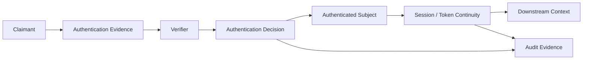
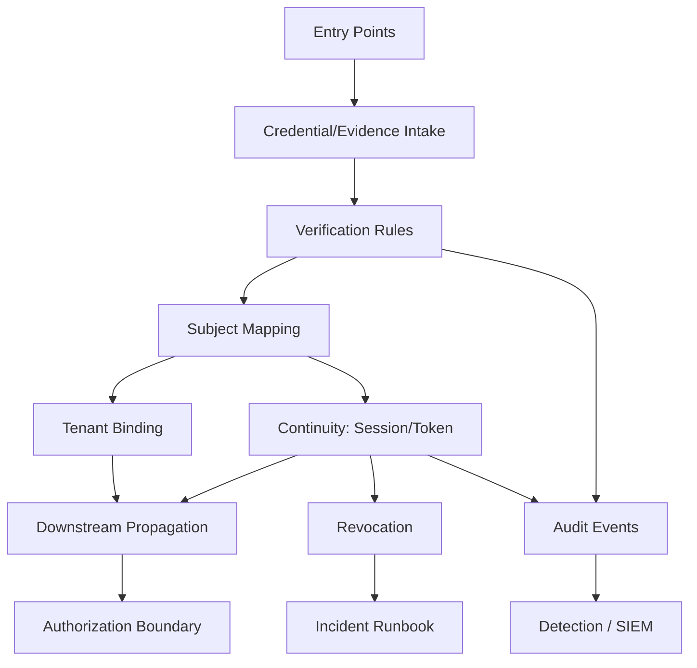
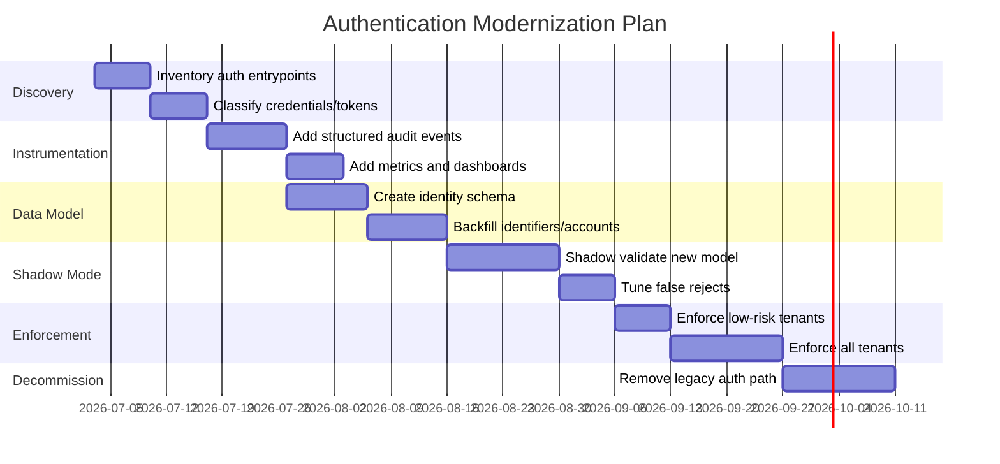

# Part 040 — Authentication Architecture Review

> Target part ini: menutup seri dengan cara berpikir arsitektural. Setelah semua pattern dipelajari, kita butuh kemampuan review: memilih pattern, menguji invariant, menemukan anti-pattern, menilai risiko, menyusun migration plan, dan memutuskan apakah desain authentication sudah layak production.

Authentication architecture review bukan ritual dokumen.

Ia adalah mekanisme untuk menjawab pertanyaan paling penting:

```txt
Can this system reliably distinguish legitimate claimants from attackers under real production conditions?
```

Kalau review hanya memeriksa apakah endpoint `/login` ada, review itu gagal.

Kalau review hanya memeriksa apakah JWT dipakai, review itu juga gagal.

Authentication harus direview sebagai lifecycle system.

---

## 1. Final mental model

Authentication bukan satu fitur.

Authentication adalah pipeline evidence-to-subject.



Every production design should answer:

```txt
Who is the claimant?
What evidence is presented?
Where is the evidence verified?
What makes the evidence valid?
What subject is produced?
How long does the subject remain authenticated?
How can authentication be revoked?
How is authentication observed?
How is the system recovered after compromise?
```

If any answer is vague, the architecture is not finished.

---

## 2. The authentication architecture equation

A practical formula:

```txt
Authentication Architecture =
  Evidence Model
+ Verification Boundary
+ Continuity Mechanism
+ Revocation Model
+ Tenant/Context Binding
+ Observability
+ Operational Recovery
```

Weak systems optimize only one component:

```txt
"We use JWT."
"We use Spring Security."
"We use Keycloak."
"We use MFA."
```

Strong systems define how all components interact.

---

## 3. Pattern decision matrix

| Pattern | Best For | Avoid When | Main Failure Mode | Production Control |
|---|---|---|---|---|
| Password login | Local human auth, break-glass, isolated systems | Enterprise SSO is available and sufficient | Credential stuffing, weak recovery | Hashing, rate limit, MFA, audit |
| Server session | Browser apps, BFF, admin portals | Pure API clients or mobile token-only flows | Session fixation, CSRF, stale privilege | Secure cookies, CSRF, rotation, revocation |
| JWT access token | Distributed APIs, resource servers | Need immediate revocation per request without introspection | Wrong audience/issuer, token leak | Strict validation, short TTL, audience binding |
| Opaque token | Centralized validation, revocation-sensitive APIs | Authorization server/introspection cannot scale | Introspection outage/latency | Cache, circuit breaker, HA AS |
| Refresh token rotation | Long-lived client continuity | Clients cannot store tokens safely | Replay race, token family compromise | Atomic rotation, reuse detection |
| API key | Machine client identification, simple B2B API | End-user auth or high-assurance delegation | Key leak, overbroad access | Hash, scope, expiry, rotation |
| HMAC signing | Webhooks, high-risk integrations, replay defense | Clients cannot canonicalize reliably | Signature mismatch, replay, proxy mutation | Canonical spec, nonce, timestamp, golden vectors |
| mTLS | Service identity, zero-trust workload boundary | Cert lifecycle cannot be operated | Expired cert, wrong trust boundary | PKI automation, SAN validation, rotation |
| OIDC login | SSO, federation, external identity | You need only service-to-service auth | Login CSRF, wrong token use, bad account linking | State, nonce, issuer+sub linking |
| SAML login | Enterprise legacy federation | New greenfield OIDC-compatible environment | Assertion validation flaws | Metadata, signature, audience, clock controls |
| WebAuthn/passkeys | Phishing-resistant human auth | User devices/recovery cannot be supported | Recovery bypass, RP ID mismatch | Strong recovery, RP binding, attestation policy |
| Risk-based auth | Adaptive controls, fraud/ATO detection | You cannot explain or audit decisions | Silent bias, false positives | Reason codes, policy governance, monitoring |

Use the simplest pattern that satisfies the risk model.

Do not choose the trendiest pattern.

---

## 4. Framework decision matrix

| Layer | Good Default | Why | Review Risk |
|---|---|---|---|
| Spring app authentication | Spring Security | Mature servlet/reactive security model | Misconfigured filter chains |
| Jakarta EE authentication | Jakarta Security | Standard EE API for mechanisms/stores/context | Vendor-specific behavior |
| OAuth/OIDC login | IdP + Spring OAuth2 Client | Avoid custom protocol implementation | Wrong account linking |
| Resource server | Spring Security OAuth2 Resource Server | Built-in JWT/opaque token support | Missing audience/tenant validation |
| Custom authorization server | Spring Authorization Server | Standards-based foundation | Operating IdP complexity |
| Enterprise IdP | Keycloak/managed IdP | Protocol and user lifecycle support | Realm/client mapper drift |
| JAX-RS APIs | ContainerRequestFilter + shared verifier | Framework-neutral integration | Inconsistent principal mapping |
| Session clustering | Spring Session/Redis | Externalized session state | Redis outage/TTL errors |
| Password storage | Spring PasswordEncoder | Adaptive hashing abstraction | Untuned cost or legacy fallback |

Frameworks reduce accidental complexity.

They do not remove architectural responsibility.

---

## 5. Authentication invariant catalog

Use this as your final invariant set.

### 5.1 Evidence invariants

```txt
[ ] Credentials are never accepted from untrusted locations accidentally.
[ ] Passwords, OTPs, API keys, refresh tokens, and session ids are never logged.
[ ] Token validation does not depend on unsigned claims.
[ ] HMAC verification binds method, path, query, headers, timestamp, nonce, and body hash.
[ ] Client certificate identity is taken from verified TLS state, not a raw external header.
```

### 5.2 Verification invariants

```txt
[ ] Password verification uses adaptive hashing.
[ ] Unknown account and bad credential paths are externally indistinguishable.
[ ] Rate limiting happens before expensive verification.
[ ] JWT validation checks signature, algorithm, issuer, audience, expiry, not-before, and tenant context.
[ ] OIDC login validates state and nonce.
[ ] SAML assertion validation checks signature, issuer, audience, destination, time window, and replay.
```

### 5.3 Continuity invariants

```txt
[ ] Session id rotates after login.
[ ] Session id rotates after step-up.
[ ] Session has idle and absolute expiry.
[ ] Access token TTL is short enough for risk model.
[ ] Refresh token rotation is atomic.
[ ] Refresh token reuse compromises the token family.
```

### 5.4 Context invariants

```txt
[ ] Tenant is explicitly resolved.
[ ] Tenant hint is cross-checked against authentication evidence.
[ ] User identity and service identity are not collapsed.
[ ] Delegation and impersonation are explicitly represented.
[ ] Authentication strength/auth level is available to sensitive workflows.
```

### 5.5 Operational invariants

```txt
[ ] Signing keys can be rotated.
[ ] Sessions can be revoked by account, tenant, client, and incident scope.
[ ] API keys can be revoked without deploy.
[ ] Audit events are durable and queryable.
[ ] Incident runbooks exist for key leak, token leak, session compromise, IdP outage, and account takeover.
```

These invariants should appear in tests, not only in architecture slides.

---

## 6. Architecture review diagram

Use this review map when interviewing a design.



Review each arrow.

Most authentication bugs are not inside crypto primitives.

They are in the arrows.

---

## 7. Anti-pattern catalog

### Anti-pattern 1: “JWT means stateless means simple”

JWT removes server-side lookup for access token validation.

It does not remove:

```txt
Key rotation
Audience validation
Issuer validation
Revocation strategy
Token leak response
Claim lifecycle
Tenant binding
Clock skew
JWKS cache behavior
```

A stateless token still has state in the real world.

That state is just distributed into keys, expiry, clients, logs, caches, and incident procedures.

### Anti-pattern 2: “User table equals identity model”

A `users` table cannot represent:

```txt
Multiple login identifiers
External IdP subjects
Credential versions
Multiple authenticators
Sessions
Recovery methods
Tenant memberships
Service accounts
API clients
Audit evidence
```

Use a real identity domain model.

### Anti-pattern 3: “Email is the account identity”

Email is an identifier.

It is not a stable subject.

Problems:

```txt
Email can change.
Email can be reassigned.
Email can be unverified.
Email can collide across IdPs.
Email normalization is provider-specific.
```

For federated login, link by:

```txt
issuer + subject
```

### Anti-pattern 4: “Disable CSRF because we use JWT somewhere”

CSRF depends on browser credential attachment.

If browser sends cookies automatically, CSRF matters.

If Authorization header is manually attached by JavaScript, CSRF is different but XSS risk rises.

Security config must follow credential transport, not fashion.

### Anti-pattern 5: “All services trust gateway headers”

Headers are safe only if:

```txt
They are stripped at the edge.
They are injected only by trusted proxy.
Internal network prevents bypass.
Services enforce trust boundary.
```

Otherwise, `X-User-Id` becomes an authentication bypass.

### Anti-pattern 6: “Refresh token is just long-lived JWT”

Long-lived self-contained refresh JWTs are difficult to revoke and detect reuse from.

Prefer opaque refresh tokens stored hashed with rotation/reuse detection.

### Anti-pattern 7: “MFA solves account takeover”

MFA helps, but attackers exploit:

```txt
Recovery flow
Session theft
MFA fatigue
SIM swap
OAuth consent abuse
Helpdesk reset
Device enrollment
Remembered devices
```

MFA is part of an assurance system, not a magic switch.

### Anti-pattern 8: “Authentication logs are enough”

Raw logs are not durable security evidence if:

```txt
They lack correlation id.
They lack reason code.
They contain secrets.
They are sampled.
They are overwritten quickly.
They cannot answer incident questions.
```

Use structured audit events.

### Anti-pattern 9: “Tenant comes from URL, token does not need tenant”

Tenant hint and token tenant must be reconciled.

Otherwise, cross-tenant confused deputy bugs appear.

### Anti-pattern 10: “Library default equals production safe”

Library defaults are starting points.

Production needs explicit decisions:

```txt
Cookie attributes
Session timeout
Password hash cost
JWT audience
Allowed algorithms
JWKS cache
Error semantics
Rate limit thresholds
Audit events
```

---

## 8. Review questions by authentication type

### 8.1 Password login review

```txt
How are identifiers normalized?
How is account enumeration prevented?
What hash algorithm and parameters are used?
How are parameters upgraded?
How is credential stuffing detected?
How is rate limiting dimensioned?
How is password reset protected?
What invalidates existing sessions after password change?
What is the support recovery path?
```

### 8.2 Session review

```txt
Where is session state stored?
Is session id rotated after login/step-up?
Are cookies Secure, HttpOnly, SameSite, Path-scoped?
Is CSRF protection enabled for unsafe browser requests?
What are idle and absolute timeouts?
How are sessions revoked?
How are concurrent sessions handled?
How is privilege drift prevented?
```

### 8.3 JWT review

```txt
Who issues the token?
Who is the intended audience?
Which algorithms are accepted?
How are keys rotated?
What happens when JWKS endpoint is down?
How short is access token TTL?
Which claims are trusted?
How is tenant binding enforced?
What is the revocation story?
```

### 8.4 OIDC/SSO review

```txt
Is Authorization Code + PKCE used?
Is state validated?
Is nonce validated?
How is external identity linked?
Is email auto-linking forbidden or tightly controlled?
How is JIT provisioning governed?
How does logout work?
How are disabled/deprovisioned users handled?
What is the break-glass path during IdP outage?
```

### 8.5 API key review

```txt
Is the key shown only once?
Is the key stored hashed?
Is there a lookup prefix?
Are scopes and tenant stored server-side?
Does the key expire?
Can it be rotated without downtime?
Is last-used metadata recorded?
Can leaked keys be detected?
```

### 8.6 HMAC review

```txt
Is canonicalization precisely specified?
Are method/path/query/header/body bound?
Is timestamp checked?
Is nonce uniqueness enforced?
Is comparison constant-time?
Are proxy header mutations accounted for?
Are there golden test vectors?
How are secrets rotated?
```

### 8.7 mTLS review

```txt
Where does TLS terminate?
Which CA is trusted?
Which certificate fields map to service identity?
Is SAN validation explicit?
How are certs issued and rotated?
What happens when cert expires?
Can a service bypass the gateway?
How is client cert identity propagated safely?
```

---

## 9. Migration strategy matrix

| From | To | Strategy | Major Risk |
|---|---|---|---|
| Legacy form login | Hardened session auth | Shadow audit, hash migration, session rotation | Enumeration behavior changes |
| Plain SHA password hash | BCrypt/Argon2/PBKDF2 | Rehash on successful login | Dormant accounts remain weak |
| Session-only monolith | Session+BFF/API tokens | Keep browser session at BFF, issue API token internally | Token leakage in frontend |
| Custom JWT issuer | IdP/OIDC | Accept both issuers temporarily, migrate clients | Audience/issuer confusion |
| API key without expiry | Scoped expiring keys | Dual-key rollout, last-used analysis | Breaking old clients |
| Long-lived JWT refresh | Opaque rotating refresh | Parallel token endpoint, revoke legacy | Client storage bugs |
| Single tenant auth | Multi-tenant auth | Add tenant binding shadow mode | Cross-tenant mismatch |
| Manual SSO integration | Standard OIDC client | Provider metadata, state/nonce test | Account relinking bugs |

Migration rule:

```txt
Never migrate authentication without shadow telemetry.
```

You need to know who will break before enforcement.

---

## 10. Reference migration plan: legacy to modern



Do not skip discovery.

Legacy systems often have hidden authentication paths:

```txt
Admin backdoor
Batch endpoint
Old mobile API
Support impersonation
Webhook shared secret
Basic Auth endpoint
Database direct access
Internal header trust
```

---

## 11. Production readiness scoring

Score each domain from 0 to 3.

```txt
0 = absent or ad hoc
1 = implemented but inconsistent
2 = implemented consistently with tests
3 = implemented, tested, observed, and operated with runbook
```

| Domain | Score Question |
|---|---|
| Identity model | Can it represent accounts, identifiers, credentials, authenticators, sessions, clients, tenants? |
| Password security | Are hashing, reset, recovery, breach defense, rate limiting tested? |
| Session security | Are cookies, CSRF, fixation, revocation, timeout, concurrency handled? |
| Token security | Are issuer/audience/algorithm/expiry/key rotation/revocation handled? |
| Federation | Are OIDC/SAML state, nonce, assertion, account linking, deprovisioning handled? |
| Machine auth | Are API keys, HMAC, mTLS, service identity, rotation handled? |
| Multi-tenancy | Are tenant resolution, binding, isolation, cross-tenant tests handled? |
| Observability | Are audit events, metrics, traces, dashboards, detection rules available? |
| Operations | Are runbooks, secret rotation, incident drills, break-glass controls ready? |
| Testing | Are negative tests and regression tests automated? |

Interpretation:

```txt
0-10   = prototype risk
11-20  = fragile production
21-25  = acceptable with remediation plan
26-30  = strong production posture
```

Be honest.

The score is useful only if it hurts a little.

---

## 12. Assurance mapping

Authentication design should map to assurance.

```txt
Low-risk public account:
  Password + session + rate limit may be acceptable.

Internal business workflow:
  SSO/OIDC + session + CSRF + audit + step-up for sensitive operations.

Regulatory enforcement case management:
  Enterprise SSO + strong MFA/passkey + tenant binding + audit + step-up + break-glass runbook.

Machine-to-machine API:
  OAuth client credentials or mTLS + audience-scoped token.

High-risk webhook:
  HMAC request signing + nonce + timestamp + body hash.

Administrative operation:
  Recent authentication + step-up + reason capture + audit + dual control where needed.
```

Authentication strength must match business consequence.

Do not require maximum friction everywhere.

Do not allow low assurance for irreversible actions.

---

## 13. Authentication vs authorization review boundary

Authentication architecture review must stop at the right boundary.

Authentication produces:

```txt
subject_id
subject_type
tenant_id
auth_time
auth_level
factors
client_id
scopes / coarse grants
issuer
session_id / token_id
```

Authorization consumes that context plus resource state:

```txt
action
resource
ownership
case status
tenant policy
delegation
separation of duties
risk state
regulatory constraints
```

Danger zone:

```txt
Putting business authorization into token claims permanently.
```

Example bad token:

```json
{
  "sub": "user-123",
  "can_approve_case_987": true
}
```

Better:

```txt
Token says who authenticated and at what assurance.
Authorization service decides whether current case state allows approval.
```

Authentication should not freeze dynamic business permissions into long-lived claims.

---

## 14. Threat-to-control traceability

Use this table in reviews.

| Threat | Control |
|---|---|
| Credential stuffing | Rate limit, breached password check, MFA, anomaly detection |
| Account enumeration | Generic response, synthetic verification, timing tests |
| Password database leak | Adaptive salted hashing, pepper, breach runbook |
| Session fixation | Session id rotation after auth/step-up |
| CSRF | SameSite + CSRF token + Origin checks |
| XSS token theft | Prefer BFF/session for browser, avoid localStorage tokens |
| JWT substitution | Audience/issuer/token-type validation |
| JWT alg confusion | Algorithm allowlist and library-safe decoder |
| Refresh token replay | Rotation, family tracking, reuse detection |
| API key leak | Hash, scope, expiry, last-used, rotation |
| HMAC replay | Timestamp, nonce, body hash |
| mTLS bypass | Network boundary, cert validation, header stripping |
| Phishing | WebAuthn/passkeys, transaction binding, IdP hardening |
| MFA fatigue | Number matching, rate limits, risk-based challenge |
| Recovery takeover | Strong recovery verification, audit, cooldown |
| Tenant confusion | Tenant binding and negative tests |
| SecurityContext leakage | Clear context, async propagation rules |
| IdP outage | JWKS cache, break-glass, degraded mode design |
| Key compromise | Rotation, dual validation window, revocation runbook |

Controls without mapped threats become theater.

Threats without mapped controls become accepted risk, whether you admit it or not.

---

## 15. Review artifact template

Use this template for a real architecture review.

```md
# Authentication Architecture Review

## 1. System Scope
- Applications:
- APIs:
- User types:
- Client types:
- Tenants:
- Environments:

## 2. Authentication Entry Points
| Entry Point | Client | Mechanism | Credential Transport | Trust Boundary |
|---|---|---|---|---|

## 3. Evidence Verification
| Mechanism | Verifier | Checks | Failure Response | Audit Event |
|---|---|---|---|---|

## 4. Subject Model
- Subject id:
- Account mapping:
- Tenant binding:
- Service identity:
- Delegation/impersonation:

## 5. Continuity
- Session/token type:
- TTL:
- Revocation:
- Rotation:
- Logout semantics:

## 6. Threat Model
| Threat | Control | Test | Owner |
|---|---|---|---|

## 7. Observability
- Audit events:
- Metrics:
- Alerts:
- Dashboards:
- Retention:

## 8. Operational Readiness
- Key rotation:
- Session purge:
- Token revocation:
- IdP outage:
- Break-glass:
- Incident runbook:

## 9. Open Risks
| Risk | Severity | Decision | Owner | Due Date |
|---|---|---|---|---|

## 10. Decision
- Approved:
- Approved with conditions:
- Rejected:
```

The template should produce decisions, not prose.

---

## 16. Architecture review example: B2B SaaS

Scenario:

```txt
B2B SaaS app.
Browser users login via enterprise SSO.
Public API supports machine clients.
Admin portal performs high-risk tenant operations.
System is multi-tenant.
```

Recommended architecture:

```txt
Browser login: OIDC Authorization Code + PKCE
Browser continuity: BFF session cookie, HttpOnly/Secure/SameSite
API access: audience-scoped JWT or opaque token
Machine clients: OAuth client credentials preferred; API key only for simpler integrations
High-risk webhooks: HMAC signing
Tenant model: issuer/client/claim/session binding
Admin step-up: WebAuthn/passkey or IdP MFA claim + recent auth check
Audit: durable auth event outbox
```

Reject:

```txt
SPA storing long-lived access and refresh tokens in localStorage.
Email-only account linking across IdPs.
JWT accepted by all APIs without audience separation.
One shared API key per tenant.
Tenant selected only by dropdown after login.
```

---

## 17. Architecture review example: internal regulatory platform

Scenario:

```txt
Internal enforcement lifecycle/case management platform.
Sensitive workflows.
Audit defensibility required.
Human users mostly internal and partner agencies.
Case transitions have legal consequence.
```

Recommended architecture:

```txt
Primary auth: Enterprise IdP / OIDC / SAML federation
Session: Server-side session via BFF/admin app
Step-up: Required for enforcement finalization, bulk export, permission elevation
Auth level: Stored in session and checked before sensitive workflows
Audit: Append-only structured auth events correlated with case events
Break-glass: Dual-controlled, alerting, time-bound
Service identity: mTLS or OAuth client credentials
Tenant/agency boundary: Explicit, not inferred from email domain only
```

Important invariant:

```txt
A user authenticated to the platform is not automatically authorized to act on every case.
```

Authentication context must support authorization, not replace it.

---

## 18. Secure defaults table

| Decision | Secure Default |
|---|---|
| Browser session cookie | `HttpOnly; Secure; SameSite=Lax; Path=/` |
| Cross-site cookie | `SameSite=None; Secure` only when required |
| Session timeout | Idle + absolute timeout |
| Password hash | Adaptive one-way hash, tuned in environment |
| Login error | Generic externally, specific internally |
| JWT TTL | Short-lived access token |
| Refresh token | Opaque, hashed, rotated |
| API key | Prefix + hashed secret + scope + expiry |
| HMAC replay | Timestamp + nonce store |
| OIDC flow | Authorization Code + PKCE |
| Account linking | `issuer + subject` |
| JWT validation | Issuer + audience + algorithm + expiry + tenant |
| Audit | Structured durable event, no secrets |
| Tenant | Explicit resolution + evidence binding |
| Secret storage | Secret manager/KMS, not config file |

---

## 19. Red flags in code review

Search for these patterns:

```txt
request.getHeader("X-User")
request.getHeader("X-Tenant")
JWT.decode(token)
claims.get("email") as account key
csrf.disable()
SessionCreationPolicy.STATELESS everywhere
localStorage.setItem("token")
logger.info("Authorization: {}", header)
new BCryptPasswordEncoder(4)
password.equals(storedHash)
Random instead of SecureRandom
@Async method reading SecurityContext implicitly
permitAll() on /auth/** without endpoint-specific review
catch Exception -> allow request
```

Not every occurrence is automatically a vulnerability.

Every occurrence requires explanation.

---

## 20. Performance review checklist

Authentication controls can become availability risks.

Check:

```txt
Password hash p95/p99 latency
Hash executor queue depth
Login rate limiter deny rate
Redis latency for session/token store
JWKS cache hit ratio
Token introspection latency
Audit outbox lag
IdP callback latency
Session store memory growth
Refresh rotation lock contention
API key lookup hot keys
HMAC body hashing cost for large payloads
```

A security mechanism that collapses under normal traffic becomes an outage.

A security mechanism that collapses under attack becomes an amplifier.

---

## 21. Operational review checklist

Ask:

```txt
Can we revoke all sessions for one account?
Can we revoke all sessions for one tenant?
Can we revoke all tokens for one client?
Can we rotate signing keys without downtime?
Can we detect refresh-token reuse?
Can we identify which API keys are unused?
Can we disable one IdP provider?
Can we operate during IdP outage?
Can we prove who authenticated before a sensitive action?
Can we find all auth events for a case/user/tenant/correlation id?
Can we purge leaked tokens from logs?
Can we notify affected users without revealing sensitive details?
```

If the answer is “manual database query”, the system may still work, but it is not mature.

---

## 22. Compliance and defensibility posture

For regulated systems, authentication must be explainable.

You need evidence for:

```txt
Who authenticated
When they authenticated
Which method/factor they used
Which tenant/context they entered
Which session/token/client was used
Whether step-up occurred
Which policy was applied
What failed and why
Who changed credential or authenticator state
How incident response was executed
```

Do not confuse log volume with defensibility.

Defensibility requires:

```txt
Completeness
Integrity
Correlation
Retention
Access control
Redaction
Reviewability
```

---

## 23. Maturity model

### Level 0 — Demo

```txt
One users table.
Plain login endpoint.
No rate limit.
No audit.
No revocation.
```

### Level 1 — Basic production

```txt
Password hashing.
Session/JWT validation.
Some logging.
Basic logout.
Framework defaults.
```

### Level 2 — Hardened production

```txt
Rate limiting.
Generic failures.
Session rotation.
JWT issuer/audience validation.
Refresh token rotation.
Audit events.
Security tests.
```

### Level 3 — Enterprise-ready

```txt
SSO/federation.
Multi-tenant binding.
MFA/step-up.
API client lifecycle.
Runbooks.
Dashboards.
Key rotation.
Incident drills.
```

### Level 4 — High-assurance / regulated

```txt
Phishing-resistant auth.
Strong recovery controls.
Formal threat-control traceability.
Immutable audit pipeline.
Operational evidence.
Continuous security regression testing.
Separation-of-duty integration.
```

Aim for the level your risk model demands.

Do not cargo-cult Level 4 into low-risk systems.

Do not run Level 1 for high-risk systems.

---

## 24. The final top-1% skill: choosing boundaries

A senior engineer can implement login.

A stronger engineer can configure Spring Security.

A top-tier engineer can choose the right boundary.

Boundary choices:

```txt
Local login vs external IdP
Session vs token
BFF vs SPA token storage
JWT vs opaque token
API key vs OAuth client credentials
HMAC vs mTLS
Gateway validation vs service validation
Tenant per realm vs tenant claim vs tenant table
Custom IdP vs Keycloak/managed IdP
Audit log vs audit event stream
```

Every boundary has consequences.

Example:

```txt
If JWT is validated only at gateway,
then internal services trust propagated identity.
That requires strong network boundary and header stripping.
If those are weak,
services must validate tokens themselves or use signed internal identity assertions.
```

Architecture is the art of making those consequences explicit.

---

## 25. Final synthesis by part

This is the compressed model of the full series:

```txt
001-004: Understand identity, trust boundary, threat model, and Java landscape.
005-008: Understand request pipeline, Spring/Jakarta architecture, and identity domain model.
009-012: Build password authentication safely with state machine, hashing, enumeration defense, and rate limiting.
013-016: Model session and token authentication with browser/security boundary awareness.
017-018: Treat JWT and refresh tokens as lifecycle systems, not string formats.
019-021: Handle machine authentication with API keys, HMAC signing, and mTLS.
022-028: Understand OAuth/OIDC/federation/Keycloak/custom IdP trade-offs.
029-031: Add assurance with MFA, WebAuthn/passkeys, and risk-based authentication.
032-034: Carry authentication safely through microservices, events, and tenants.
035-038: Make authentication observable, testable, performant, and operable.
039-040: Assemble and review the production architecture.
```

The learning objective was never “know all auth mechanisms”.

The objective is:

```txt
Given a real system, choose and implement the right authentication architecture,
explain the trade-offs,
prove the invariants,
and operate it under failure.
```

---

## 26. Final architecture checklist

Use this before approving production authentication.

```txt
Identity model
[ ] Account, identifier, credential, authenticator, session, token, API client, tenant are distinct concepts.
[ ] External identities are linked by issuer + subject.
[ ] Email is not the only account key.

Password auth
[ ] Adaptive hash.
[ ] Hash cost tuned.
[ ] Rate limit before hash.
[ ] Generic failure response.
[ ] Recovery flow hardened.

Session auth
[ ] Session id rotates after login and step-up.
[ ] Secure cookie attributes.
[ ] CSRF for browser writes.
[ ] Idle and absolute timeout.
[ ] Revocation by account/tenant/session.

Token auth
[ ] Issuer validated.
[ ] Audience validated.
[ ] Algorithm allowlisted.
[ ] Expiry and not-before checked.
[ ] Tenant binding checked.
[ ] JWKS cache behavior defined.

Refresh lifecycle
[ ] Opaque token.
[ ] Stored hashed.
[ ] Rotated atomically.
[ ] Reuse detected.
[ ] Family compromised on replay.

Federation
[ ] Authorization Code + PKCE.
[ ] State checked.
[ ] Nonce checked.
[ ] Account linking safe.
[ ] Deprovisioning handled.

Machine auth
[ ] API key lifecycle implemented.
[ ] HMAC canonicalization specified if used.
[ ] mTLS trust boundary documented if used.
[ ] Service identity separate from user identity.

Multi-tenancy
[ ] Tenant resolved explicitly.
[ ] Tenant hint checked against evidence.
[ ] Cross-tenant negative tests exist.

Observability
[ ] Structured audit events.
[ ] No secrets in logs.
[ ] Metrics for failures, latency, revocation, outbox.
[ ] Detection rules for abuse.

Operations
[ ] Key rotation runbook.
[ ] Token/session revocation runbook.
[ ] IdP outage runbook.
[ ] Break-glass account control.
[ ] Incident drills.

Testing
[ ] Negative tests.
[ ] Timing/enumeration regression.
[ ] Token confusion tests.
[ ] Session fixation tests.
[ ] Refresh replay tests.
[ ] Tenant isolation tests.
```

If you cannot test it, you probably cannot safely operate it.

---

## 27. Final exercises

### Exercise 1: Architecture review

Take an existing application and produce:

```txt
1. Authentication entrypoint inventory
2. Credential inventory
3. Session/token lifecycle diagram
4. Trust boundary diagram
5. Threat-to-control table
6. Top 10 authentication risks
7. 30-day remediation plan
```

### Exercise 2: Token validation negative test suite

Write tests for:

```txt
Wrong issuer
Wrong audience
Expired token
Future nbf
Missing tenant
Wrong tenant
Unexpected algorithm
Unknown kid
ID token used as access token
Access token for another API
```

### Exercise 3: Refresh token race test

Simulate two concurrent refresh requests using the same token.

Expected result:

```txt
One succeeds.
One fails.
Family is marked compromised if reuse is detected after rotation.
Audit event is emitted.
```

### Exercise 4: Tenant confusion drill

Create two tenants.

Try:

```txt
Tenant A token on Tenant B URL
Tenant A session with Tenant B header
Tenant A API key on Tenant B endpoint
Tenant A OIDC issuer on Tenant B client config
```

All should fail with generic external response and specific internal audit reason.

### Exercise 5: Incident drill

Run tabletop:

```txt
JWT signing key suspected leaked.
```

Produce:

```txt
Containment actions
Key rotation steps
Token revocation/expiry plan
Affected user/client scope
Communication plan
Audit queries
Post-incident hardening
```

---

## 28. What to learn next

After authentication, the natural next advanced series is authorization.

Recommended progression:

```txt
1. Java Authorization Pattern
2. Policy-as-Code and ABAC/ReBAC
3. Secure Workflow Authorization for Case Management
4. Audit-Defensible State Machines
5. Identity Governance and Access Review
6. Cryptographic Key Management in Java Systems
7. Secure Multi-Tenant Architecture
8. Zero Trust Service-to-Service Architecture
```

Authentication establishes the subject.

Authorization decides consequence.

Audit proves what happened.

Workflow controls what can happen next.

Those four must eventually converge.

---

## 29. Series completion

This is the final part of the planned series.

```txt
Series: Learn Java Authentication Pattern
Parts: 001-040
Status: Complete
Final Part: 040 — Authentication Architecture Review
```

You now have the full conceptual and implementation map:

```txt
Mental model
Threat model
Java framework model
Domain model
Password/session/token/API-key/HMAC/mTLS/OIDC/MFA/passkey patterns
Microservice/event/multi-tenant propagation
Observability/testing/performance/operations
Reference implementation
Architecture review
```

The most important final lesson:

```txt
Authentication is not proven by a successful login.
Authentication is proven by the system's behavior under invalid, hostile, ambiguous, expired, replayed, cross-tenant, compromised, and operationally degraded conditions.
```

That is the difference between a working feature and a defensible authentication architecture.
