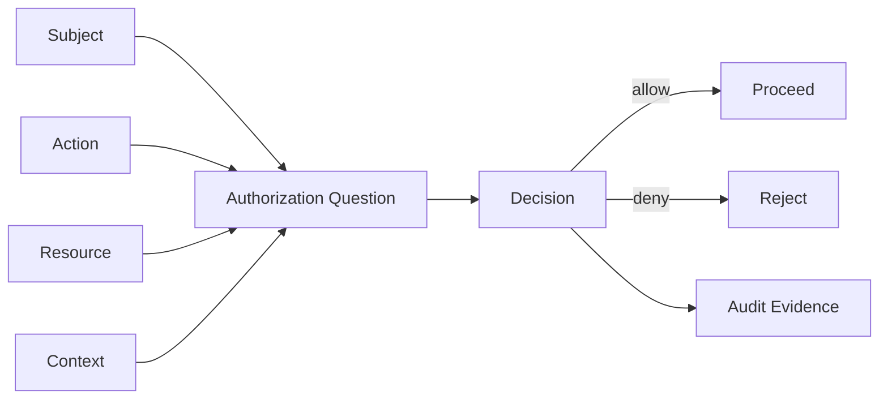
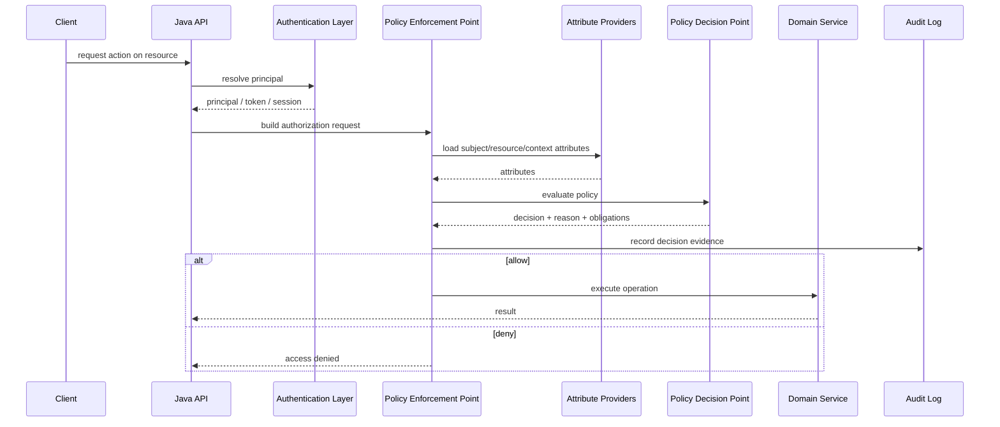
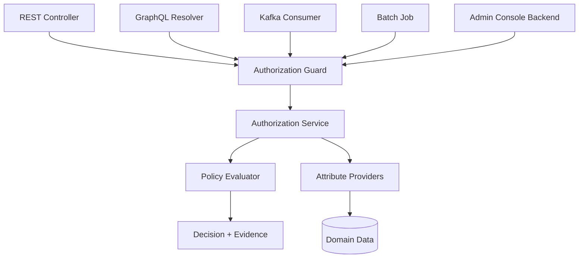

# Authorization Mental Model: Subject, Action, Resource, Context

Authorization adalah mekanisme yang menjawab satu pertanyaan kecil tetapi berbahaya:

> Bolehkah **subject** melakukan **action** terhadap **resource** tertentu dalam **context** tertentu?

Pertanyaan ini tampak sederhana. Di production system, ia menjadi salah satu sumber bug keamanan paling mahal karena jawaban authorization hampir selalu bergantung pada domain, status data, tenant, relationship, waktu, assignment, scope, workflow state, dan kondisi operasional.

Authentication menjawab: **siapa pemanggil ini?**

Authorization menjawab: **apa yang boleh dilakukan pemanggil ini, terhadap objek mana, dengan batasan apa, dan bagaimana sistem membuktikan keputusannya?**

Seri ini fokus pada authorization. Jadi kita tidak akan mengulang login, password, OAuth/OIDC handshake, MFA, session cookie, refresh token, atau identity provider setup kecuali ketika hal tersebut menjadi input authorization.

Tujuan part pertama ini adalah membangun model mental yang stabil. Kalau model mentalnya benar, pattern seperti RBAC, ABAC, ReBAC, policy-as-code, method security, object-level authorization, query scoping, OPA, Cedar, dan OpenFGA akan jauh lebih mudah dipahami.

---

## 1. Authorization Tidak Sama Dengan Mengecek Role

Kesalahan paling umum adalah mengira authorization hanya berarti:

```java
if (user.hasRole("ADMIN")) {
    // allow
}
```

Itu hanya satu bentuk paling kasar dari authorization.

Di sistem nyata, pertanyaannya biasanya lebih mirip ini:

```text
Can user:123 approve case:CASE-2026-0042
when:
  tenant = "financial-services-authority"
  case.status = "UNDER_REVIEW"
  case.assignedSupervisorId = user:123
  case.riskLevel = "HIGH"
  user.department = "ENFORCEMENT"
  user.clearance >= case.requiredClearance
  user is not the maker of the same case transition
  current time is within business operating window
  policy version = 2026.07.01
```

Di sini role saja tidak cukup. Role mungkin hanya menjawab bahwa user adalah `SUPERVISOR`. Ia belum menjawab:

- apakah user supervisor untuk case ini;
- apakah case masih berada pada status yang boleh di-approve;
- apakah user yang sama juga pembuat request, yang melanggar maker-checker;
- apakah tenant cocok;
- apakah clearance cukup;
- apakah approval sudah expired;
- apakah policy yang dievaluasi adalah policy versi terbaru;
- apakah sistem harus mencatat decision reason untuk audit.

Authorization production-grade bukan sekadar `role check`. Ia adalah **decision system**.

---

## 2. Empat Dimensi Dasar: Subject, Action, Resource, Context

Model dasar yang akan kita pakai di seluruh seri:



Authorization request minimal harus memiliki empat komponen:

| Dimensi | Pertanyaan | Contoh |
|---|---|---|
| Subject | Siapa/apa yang meminta akses? | user, service account, worker, delegated actor |
| Action | Operasi apa yang diminta? | read, create, approve, cancel, export, assign |
| Resource | Objek apa yang terkena operasi? | case, invoice, order, document, attachment |
| Context | Kondisi tambahan apa yang relevan? | tenant, time, IP, risk, workflow state, purpose |

Kalau salah satu dimensi hilang, authorization menjadi lemah.

Contoh lemah:

```java
boolean canApprove = user.hasRole("SUPERVISOR");
```

Contoh lebih benar:

```java
AuthorizationDecision decision = authorizationService.authorize(
    AuthorizationRequest.builder()
        .subject(Subject.user(userId))
        .action(Action.of("case.approve"))
        .resource(ResourceRef.of("case", caseId))
        .context(Context.of(
            "tenantId", tenantId,
            "caseStatus", caseStatus,
            "caseOwnerDepartment", ownerDepartment,
            "requesterDepartment", requesterDepartment,
            "makerUserId", makerUserId,
            "riskLevel", riskLevel
        ))
        .build()
);
```

Kita akan menyempurnakan model ini sepanjang seri.

---

## 3. Subject: Bukan Selalu User Manusia

Subject adalah entitas yang sedang meminta authority untuk melakukan action.

Di aplikasi enterprise, subject bisa berupa:

1. **Human user** — pegawai, customer, auditor, admin.
2. **Service account** — microservice memanggil service lain.
3. **Worker process** — batch job, Kafka consumer, scheduler.
4. **Delegated actor** — user A bertindak atas nama user B.
5. **External party** — partner, vendor, regulator, client app.
6. **Break-glass actor** — emergency access dengan audit khusus.
7. **System actor** — proses internal yang melakukan transition otomatis.

Jangan menyamakan `subject` dengan `username`.

### 3.1 Principal, Subject, Actor, Account

Istilah ini sering bercampur. Untuk engineering, pisahkan seperti ini:

| Istilah | Makna | Contoh |
|---|---|---|
| Principal | Identitas yang berhasil di-authenticate | `alice@company.com`, `svc-order-api` |
| Subject | Entitas yang hak aksesnya dievaluasi | user Alice, service Order API |
| Actor | Entitas yang melakukan aksi secara aktual | support agent membuka data customer |
| On-behalf-of | Subject melakukan aksi atas delegasi pihak lain | support agent bertindak atas customer |
| Account | Container administratif untuk identity | employee account, customer account |

Contoh:

```text
Alice adalah support agent.
Alice membuka order milik Bob atas permintaan Bob.

principal = alice@company.com
actor     = employee:alice
subject   = employee:alice
resource  = order:ORD-123 owned by customer:bob
context   = purpose="customer-support", requestedBy="customer:bob"
```

Dalam delegated authorization, kamu mungkin butuh dua subject:

```text
actor: siapa yang secara teknis melakukan aksi
beneficiary / onBehalfOf: untuk siapa aksi dilakukan
```

Kalau sistem hanya menyimpan `userId`, audit akan ambigu.

### 3.2 Subject Harus Punya Identity Boundary

Setiap subject harus jelas berasal dari trust boundary mana:

```text
internal employee
external customer
partner application
machine identity
batch processor
anonymous caller
```

Jangan gabungkan semuanya ke satu tabel `users` lalu berharap role menyelesaikan semua masalah. Dalam banyak sistem enterprise, `employee:123`, `customer:123`, dan `service:123` tidak boleh dianggap entitas sejenis walaupun ID numeriknya sama.

Gunakan subject type eksplisit.

```java
public enum SubjectType {
    HUMAN_USER,
    CUSTOMER,
    EMPLOYEE,
    SERVICE,
    WORKER,
    SYSTEM,
    ANONYMOUS
}

public record Subject(
    SubjectType type,
    String id,
    String tenantId,
    Set<String> roles,
    Set<String> scopes,
    Map<String, Object> attributes
) {}
```

Hal penting: `roles`, `scopes`, dan `attributes` bukan subject itu sendiri. Itu adalah fakta tentang subject.

---

## 4. Action: Jangan Terlalu CRUD-Sentris

Action adalah operasi yang ingin dilakukan.

Model buruk:

```text
read, write, delete
```

Model ini terlalu kasar untuk sistem bisnis.

Di domain nyata, action harus dekat dengan business capability:

```text
case.create
case.view
case.viewEvidence
case.addEvidence
case.submitForReview
case.approve
case.reject
case.escalate
case.assignInvestigator
case.export
case.close
case.reopen
```

Mengapa?

Karena `update` bisa berarti banyak hal:

- mengubah deskripsi case;
- menambah evidence;
- mengganti assignee;
- menaikkan risk level;
- melakukan approval;
- menutup case;
- menghapus attachment.

Semua punya risiko dan policy berbeda.

### 4.1 Action Sebaiknya Bernama Verb + Domain Object

Pattern yang praktis:

```text
<resourceType>.<businessOperation>
```

Contoh:

```text
order.create
order.view
order.cancel
order.refund
order.overridePrice
quote.approveDiscount
case.assign
case.escalate
document.download
document.share
report.exportSensitive
```

Untuk nested resource:

```text
case.evidence.add
case.evidence.download
case.note.createInternal
case.note.createExternal
```

### 4.2 Action Memiliki Risk Tier

Tidak semua action setara.

| Risk Tier | Contoh | Karakteristik |
|---|---|---|
| Low | view own profile | dampak kecil, reversible |
| Medium | update address | berdampak ke proses bisnis |
| High | approve payment, close case | state-changing, audit wajib |
| Critical | override policy, break-glass | emergency, dual approval, alert |

Risk tier berguna untuk:

- menentukan perlu tidaknya step-up authentication;
- menentukan logging detail;
- menentukan approval flow;
- menentukan cacheability;
- menentukan apakah fail-closed mutlak;
- menentukan monitoring dan alert.

### 4.3 Action Bukan Endpoint

Jangan mengikat permission langsung ke path API:

```text
GET /api/v1/cases/{id}
POST /api/v1/cases/{id}/approval
```

Itu detail transport.

Permission harus memodelkan maksud bisnis:

```text
case.view
case.approve
```

Kenapa?

Karena satu action bisa dieksekusi dari banyak entry point:

- REST API;
- GraphQL mutation;
- batch job;
- admin console;
- event consumer;
- internal service command.

Kalau authorization hanya dipasang di endpoint, jalur lain bisa bypass.

---

## 5. Resource: Authorization Selalu Tentang Objek Konkret

Resource adalah objek yang sedang dilindungi.

Contoh:

```text
case:CASE-2026-0042
order:ORD-9981
document:DOC-31
attachment:ATT-7
customer:CUST-443
report:MONTHLY-ENFORCEMENT-2026-06
```

Resource bukan hanya table atau class. Resource adalah **unit perlindungan**.

Satu aggregate bisa memiliki beberapa resource authorization boundary.

Contoh `Case`:

```text
Case
├── Case summary
├── Internal notes
├── Evidence files
├── Legal assessment
├── Sanction recommendation
├── Decision letter
└── Audit trail
```

Masing-masing bisa punya policy berbeda.

### 5.1 Resource Type vs Resource Instance

Pisahkan:

```text
resource type     = case
resource instance = case:CASE-2026-0042
```

Permission `case.view` belum cukup untuk melihat semua case. Ia hanya menyatakan capability umum. Untuk object-level authorization, sistem harus menjawab apakah subject boleh melihat **instance tertentu**.

Bug umum:

```java
@PreAuthorize("hasAuthority('case.view')")
@GetMapping("/cases/{caseId}")
public CaseDto getCase(@PathVariable String caseId) {
    return caseService.getCase(caseId);
}
```

Ini hanya function-level authorization. Belum object-level authorization.

Lebih aman:

```java
@GetMapping("/cases/{caseId}")
public CaseDto getCase(@PathVariable String caseId) {
    CaseRecord record = caseRepository.findRequired(caseId);
    authorizationService.verify(
        subjectProvider.currentSubject(),
        Action.of("case.view"),
        ResourceRef.of("case", caseId),
        AuthorizationContext.from(record)
    );
    return mapper.toDto(record);
}
```

Namun nanti kita akan lihat bahwa mengambil record dulu juga punya risiko. Untuk list/search, pattern yang lebih kuat adalah **query scoping**: hanya query data yang memang boleh dilihat.

### 5.2 Resource Identifier Harus Tenant-Safe

Object ID dari client adalah input tidak terpercaya.

Contoh rawan:

```sql
select * from cases where id = :caseId
```

Lebih baik minimal:

```sql
select *
from cases
where id = :caseId
  and tenant_id = :tenantId
```

Namun tenant filter saja belum cukup kalau di dalam tenant ada ownership, assignment, department, clearance, atau jurisdiction boundary.

Authorization yang matang akan bertanya:

```text
Apakah subject ini boleh melakukan action ini terhadap resource instance ini dalam tenant ini?
```

Bukan sekadar:

```text
Apakah resource ini ada?
```

---

## 6. Context: Tempat Aturan Bisnis Menjadi Security Boundary

Context adalah fakta tambahan yang relevan untuk decision.

Contoh context:

```text
tenantId
requestTime
requestIp
deviceTrustLevel
riskScore
caseStatus
caseClassification
requestPurpose
businessUnit
jurisdiction
channel
mfaLevel
tokenType
policyVersion
workflowStep
```

Context sering menentukan perbedaan antara allow dan deny.

Contoh:

```text
User boleh melihat case jika:
- user berada di tenant yang sama;
- user adalah assignee, supervisor, atau auditor;
- case tidak berstatus sealed;
- atau user memiliki break-glass access aktif;
- dan reason akses dicatat.
```

Tanpa context `case.status`, policy sealed case tidak bisa dievaluasi.

Tanpa context `requestPurpose`, audit support access menjadi lemah.

Tanpa context `mfaLevel`, high-risk approval tidak bisa memaksa step-up.

### 6.1 Context Bukan Tempat Sampah

Context harus digunakan untuk fakta request-time yang memang bukan bagian natural dari subject/action/resource.

Buruk:

```json
{
  "context": {
    "userId": "u-1",
    "resourceId": "case-1",
    "action": "case.approve"
  }
}
```

Lebih baik:

```json
{
  "subject": { "type": "employee", "id": "u-1" },
  "action": "case.approve",
  "resource": { "type": "case", "id": "case-1" },
  "context": {
    "caseStatus": "UNDER_REVIEW",
    "makerUserId": "u-9",
    "riskLevel": "HIGH",
    "mfaLevel": 2
  }
}
```

Cedar juga memisahkan `principal`, `action`, `resource`, dan `context`; best practice-nya adalah tidak menaruh informasi principal/action/resource ke dalam context. Prinsip yang sama sangat berguna walaupun kita tidak memakai Cedar.

### 6.2 Attribute Freshness

Context bisa stale.

Contoh:

```text
Token JWT memuat department="ENFORCEMENT".
User dipindah ke department lain 2 menit lalu.
Token masih berlaku 1 jam.
Apakah user masih boleh mengakses case enforcement?
```

Authorization harus tahu mana fakta yang boleh berasal dari token dan mana yang harus diambil real-time.

Rule praktis:

| Fakta | Boleh dari token? | Catatan |
|---|---:|---|
| subject id | Ya | identity binding |
| tenant id | Kadang | harus valid terhadap session/client |
| coarse role | Kadang | hati-hati revocation delay |
| high-risk permission | Sebaiknya tidak | ambil dari authoritative store |
| resource ownership | Tidak | harus dari data/resource store |
| workflow state | Tidak | mutable domain state |
| SoD relationship | Tidak | bergantung histori/action |
| risk score | Tidak selalu | tergantung freshness requirement |

---

## 7. Decision: Allow Bukan Satu-satunya Output

Model naif:

```java
boolean allowed = authorizationService.isAllowed(...);
```

Model ini sering tidak cukup.

Di sistem serius, authorization decision sebaiknya menyimpan:

```text
effect: ALLOW | DENY | NOT_APPLICABLE | INDETERMINATE
reasonCode
humanReadableReason
matchedPolicyId
policyVersion
obligations
advice
cacheTtl
attributesUsed
decisionTime
correlationId
```

Mengapa?

Karena production authorization butuh:

- audit;
- debugging;
- compliance evidence;
- troubleshooting false deny;
- safe rollout policy baru;
- shadow evaluation;
- SIEM integration;
- regression analysis.

### 7.1 Decision Semantics

Gunakan minimal empat state:

| Decision | Makna | Default handling |
|---|---|---|
| `ALLOW` | Policy secara eksplisit mengizinkan | lanjutkan operasi |
| `DENY` | Policy secara eksplisit menolak | reject |
| `NOT_APPLICABLE` | Tidak ada policy yang cocok | reject by default |
| `INDETERMINATE` | Evaluasi gagal/error/atribut kurang | reject untuk high-risk action |

`NOT_APPLICABLE` tidak boleh berubah menjadi allow.

`INDETERMINATE` tidak boleh diam-diam allow hanya karena PDP timeout.

### 7.2 Obligation dan Advice

Kadang decision tidak hanya allow/deny.

Contoh obligation:

```text
ALLOW, tetapi response harus meredact field `sanctionRecommendation`.
ALLOW, tetapi wajib menulis audit reason.
ALLOW, tetapi harus minta second approver sebelum commit.
ALLOW, tetapi export harus diberi watermark.
```

Advice adalah informasi tambahan yang tidak wajib untuk enforcement, tetapi berguna.

```text
ADVICE: user dapat meminta access melalui supervisor.
ADVICE: MFA level 2 diperlukan.
ADVICE: case sedang sealed oleh legal department.
```

Untuk Java, modelnya bisa seperti ini:

```java
public enum AuthorizationEffect {
    ALLOW,
    DENY,
    NOT_APPLICABLE,
    INDETERMINATE
}

public record AuthorizationDecision(
    AuthorizationEffect effect,
    String reasonCode,
    String reason,
    String policyId,
    String policyVersion,
    List<Obligation> obligations,
    Map<String, Object> evidence
) {
    public boolean isAllowed() {
        return effect == AuthorizationEffect.ALLOW;
    }
}

public record Obligation(
    String type,
    Map<String, Object> parameters
) {}
```

---

## 8. Authorization as a Pipeline

Authorization bukan satu `if` statement. Ia pipeline.



Setiap tahap punya failure mode:

| Tahap | Failure Mode | Dampak |
|---|---|---|
| Resolve principal | salah identity mapping | user dianggap orang lain |
| Build request | action/resource salah | policy mengevaluasi objek salah |
| Load attributes | stale/missing attribute | false allow atau false deny |
| Evaluate policy | timeout/error | fail-open risk |
| Enforce decision | decision diabaikan | bypass total |
| Audit | log tidak lengkap | compliance gagal |

---

## 9. Deny by Default dan Fail Closed

Aturan utama:

> Yang tidak secara eksplisit diizinkan harus ditolak.

OWASP Authorization Cheat Sheet menekankan deny-by-default, server-side enforcement, least privilege, dan centralized access control. OWASP API Security juga menempatkan Broken Object Level Authorization sebagai risiko API utama karena endpoint API sering menerima object identifier dari client.

Dalam desain Java:

```java
public void verify(AuthorizationDecision decision) {
    if (decision.effect() != AuthorizationEffect.ALLOW) {
        throw new AccessDeniedException(decision.reasonCode());
    }
}
```

Jangan tulis:

```java
if (decision.effect() == AuthorizationEffect.DENY) {
    throw new AccessDeniedException();
}
// NOT_APPLICABLE and INDETERMINATE accidentally pass
```

Ini bug fatal. `NOT_APPLICABLE` dan `INDETERMINATE` harus dianggap deny kecuali ada alasan kuat yang didokumentasikan.

### 9.1 Fail-Open vs Fail-Closed

Jika authorization service timeout, apa yang terjadi?

Untuk high-risk operation:

```text
approve payment
close enforcement case
export customer data
download confidential document
change role assignment
```

Jawabannya hampir selalu **fail-closed**.

Untuk low-risk availability-sensitive operation, mungkin ada strategi degraded mode:

```text
allow read-only access to cached public catalog
allow service health check
allow already-authorized local operation with short-lived decision cache
```

Tapi fail-open harus eksplisit, terukur, dan diaudit.

```java
public AuthorizationDecision onPdpTimeout(AuthorizationRequest request) {
    if (request.action().riskTier().isHighOrCritical()) {
        return AuthorizationDecision.deny(
            "AUTHZ_PDP_TIMEOUT_FAIL_CLOSED",
            "Authorization decision could not be obtained safely"
        );
    }

    return decisionCache.findFresh(request.cacheKey())
        .orElseGet(() -> AuthorizationDecision.deny(
            "AUTHZ_NO_FRESH_DECISION",
            "No fresh authorization decision available"
        ));
}
```

---

## 10. Centralized Decision, Distributed Enforcement

Ada dua ekstrem buruk:

### Ekstrem 1: Semua Check Tersebar

```java
if (user.hasRole("ADMIN")) { ... }
if (user.getDept().equals(case.getDept())) { ... }
if (case.getOwnerId().equals(user.getId())) { ... }
```

Masalah:

- logic duplikatif;
- policy drift antar endpoint;
- sulit diaudit;
- sulit dites menyeluruh;
- susah melakukan rollout policy;
- bypass mudah terjadi di jalur baru.

### Ekstrem 2: Semua Dipusatkan Tanpa Domain Awareness

```text
External PDP hanya tahu role dan path endpoint.
Ia tidak tahu status case, maker-checker, clearance, assignment, atau sealed state.
```

Masalah:

- decision terlalu kasar;
- object-level authorization tidak terjadi;
- business rule tetap bocor ke aplikasi;
- false allow/deny meningkat.

Model yang lebih sehat:

```text
Centralize decision contract and policy semantics.
Distribute enforcement to every execution path.
Keep domain facts close to authoritative data.
```



Authorization service boleh centralized sebagai library/internal service. Namun enforcement harus terjadi di semua jalur: controller, service command, worker, batch, scheduled operation, dan administrative tool.

---

## 11. Authorization Boundary di Java Application

Authorization bisa berada di beberapa layer:

| Layer | Contoh | Kelebihan | Risiko |
|---|---|---|---|
| API Gateway | route-level authz | konsisten untuk coarse check | tidak tahu domain object |
| Servlet/JAX-RS Filter | request authz | awal request | sering hanya path/method |
| Controller/Resource | endpoint authz | dekat HTTP input | rawan duplikasi |
| Method Security | service method authz | reusable | proxy/AOP pitfalls |
| Application Service | use-case authz | domain-aware | butuh disiplin |
| Domain Service | transition guard | kuat untuk invariant | tidak cocok untuk query filtering saja |
| Repository | query scoping | aman untuk list/search | policy bisa bocor ke persistence |
| Database RLS | last line defense | kuat untuk tenant/data boundary | kompleks debugging dan portability |
| Event Consumer | async command authz | mencegah bypass async | butuh authz snapshot/context |

Rule praktis:

1. Gateway/filter cocok untuk coarse-grained gate.
2. Service/application layer cocok untuk use-case authorization.
3. Repository/query layer wajib untuk list/search/export agar data unauthorized tidak pernah terambil.
4. Domain layer cocok untuk state transition invariant.
5. Database RLS bisa menjadi defense-in-depth untuk tenant/data isolation.

Tidak ada satu layer yang cukup untuk semua kasus.

---

## 12. Authorization as an Invariant

Top engineer tidak berpikir authorization sebagai dekorasi endpoint. Mereka berpikir authorization sebagai invariant sistem.

Contoh invariant:

```text
Invariant 1:
No user can read a case outside their tenant.

Invariant 2:
No user can approve a case they submitted.

Invariant 3:
No one can export sealed evidence without legal clearance.

Invariant 4:
Every access to confidential evidence must produce audit evidence.

Invariant 5:
A workflow transition must be authorized against the current persisted state, not stale client state.
```

Invariant ini harus hidup di:

- code;
- test suite;
- policy;
- database constraints jika relevan;
- audit log;
- operational dashboard;
- review checklist.

### 12.1 Dari Requirement ke Invariant

Requirement biasa:

```text
Supervisor can approve high-risk cases.
```

Terlalu longgar.

Invariant lebih aman:

```text
A case can be approved only if:
- subject is an active employee;
- subject has permission case.approve;
- subject belongs to same tenant as the case;
- subject is assigned as supervisor for the case or belongs to the authorized escalation group;
- case.status is UNDER_REVIEW;
- subject is not the user who submitted the case for approval;
- subject clearance is greater than or equal to case.requiredClearance;
- if case.riskLevel is HIGH or CRITICAL, subject has completed MFA level 2 in this session;
- decision is recorded with policy version and reason code.
```

Ini baru actionable.

---

## 13. Java Core Authorization Model

Kita mulai dari model sederhana tetapi extensible.

```java
package com.example.authz;

import java.time.Instant;
import java.util.List;
import java.util.Map;
import java.util.Set;

public record AuthorizationRequest(
    Subject subject,
    Action action,
    ResourceRef resource,
    AuthorizationContext context,
    Instant requestedAt,
    String correlationId
) {}

public record Subject(
    SubjectType type,
    String id,
    String tenantId,
    Set<String> roles,
    Set<String> scopes,
    Map<String, Object> attributes
) {}

public enum SubjectType {
    EMPLOYEE,
    CUSTOMER,
    SERVICE,
    WORKER,
    SYSTEM,
    ANONYMOUS
}

public record Action(
    String name,
    RiskTier riskTier
) {
    public static Action of(String name) {
        return new Action(name, RiskTier.MEDIUM);
    }
}

public enum RiskTier {
    LOW,
    MEDIUM,
    HIGH,
    CRITICAL;

    public boolean isHighOrCritical() {
        return this == HIGH || this == CRITICAL;
    }
}

public record ResourceRef(
    String type,
    String id,
    String tenantId,
    Map<String, Object> attributes
) {
    public static ResourceRef of(String type, String id) {
        return new ResourceRef(type, id, null, Map.of());
    }
}

public record AuthorizationContext(
    Map<String, Object> values
) {
    public Object get(String key) {
        return values.get(key);
    }
}

public record AuthorizationDecision(
    AuthorizationEffect effect,
    String reasonCode,
    String reason,
    String policyId,
    String policyVersion,
    List<Obligation> obligations,
    Map<String, Object> evidence
) {
    public boolean isAllowed() {
        return effect == AuthorizationEffect.ALLOW;
    }

    public static AuthorizationDecision allow(String reasonCode, String reason) {
        return new AuthorizationDecision(
            AuthorizationEffect.ALLOW,
            reasonCode,
            reason,
            null,
            null,
            List.of(),
            Map.of()
        );
    }

    public static AuthorizationDecision deny(String reasonCode, String reason) {
        return new AuthorizationDecision(
            AuthorizationEffect.DENY,
            reasonCode,
            reason,
            null,
            null,
            List.of(),
            Map.of()
        );
    }
}

public enum AuthorizationEffect {
    ALLOW,
    DENY,
    NOT_APPLICABLE,
    INDETERMINATE
}

public record Obligation(
    String type,
    Map<String, Object> parameters
) {}
```

Service contract:

```java
public interface AuthorizationService {
    AuthorizationDecision authorize(AuthorizationRequest request);

    default void verify(AuthorizationRequest request) {
        AuthorizationDecision decision = authorize(request);
        if (!decision.isAllowed()) {
            throw new AccessDeniedException(decision.reasonCode());
        }
    }
}
```

Custom exception:

```java
public class AccessDeniedException extends RuntimeException {
    private final String reasonCode;

    public AccessDeniedException(String reasonCode) {
        super("Access denied: " + reasonCode);
        this.reasonCode = reasonCode;
    }

    public String reasonCode() {
        return reasonCode;
    }
}
```

Model ini belum final. Nanti kita akan membahas:

- policy evaluator;
- attribute provider;
- relationship provider;
- decision cache;
- audit sink;
- Spring Security integration;
- JAX-RS integration;
- OPA/Cedar/OpenFGA integration.

Namun primitive-nya sudah benar.

---

## 14. Example: Regulatory Case Approval

Domain:

```text
Regulatory enforcement lifecycle platform.
A case can be submitted by investigator.
Supervisor can approve or reject.
High-risk case requires legal reviewer.
Maker cannot approve their own submission.
Sealed case requires special clearance.
```

Action:

```java
Action approveCase = new Action("case.approve", RiskTier.HIGH);
```

Resource:

```java
ResourceRef caseResource = new ResourceRef(
    "case",
    caseRecord.id(),
    caseRecord.tenantId(),
    Map.of(
        "status", caseRecord.status(),
        "riskLevel", caseRecord.riskLevel(),
        "classification", caseRecord.classification(),
        "requiredClearance", caseRecord.requiredClearance(),
        "assignedSupervisorId", caseRecord.assignedSupervisorId(),
        "submittedBy", caseRecord.submittedBy()
    )
);
```

Context:

```java
AuthorizationContext context = new AuthorizationContext(Map.of(
    "mfaLevel", session.mfaLevel(),
    "requestPurpose", "case-approval",
    "channel", "backoffice-web",
    "ipAddress", request.ipAddress()
));
```

Policy skeleton:

```java
public final class CaseApprovalPolicy implements AuthorizationPolicy {

    @Override
    public AuthorizationDecision evaluate(AuthorizationRequest request) {
        if (!request.action().name().equals("case.approve")) {
            return new AuthorizationDecision(
                AuthorizationEffect.NOT_APPLICABLE,
                "POLICY_NOT_APPLICABLE",
                "Policy does not handle this action",
                "case-approval-policy",
                "2026.07.01",
                List.of(),
                Map.of()
            );
        }

        Subject subject = request.subject();
        ResourceRef resource = request.resource();

        if (!"case".equals(resource.type())) {
            return AuthorizationDecision.deny(
                "AUTHZ_RESOURCE_TYPE_MISMATCH",
                "case.approve can only be applied to case resources"
            );
        }

        if (!subject.tenantId().equals(resource.tenantId())) {
            return AuthorizationDecision.deny(
                "AUTHZ_CROSS_TENANT_DENIED",
                "Subject and resource tenant do not match"
            );
        }

        if (!subject.roles().contains("CASE_SUPERVISOR")) {
            return AuthorizationDecision.deny(
                "AUTHZ_MISSING_SUPERVISOR_ROLE",
                "Subject is not a case supervisor"
            );
        }

        String status = (String) resource.attributes().get("status");
        if (!"UNDER_REVIEW".equals(status)) {
            return AuthorizationDecision.deny(
                "AUTHZ_INVALID_CASE_STATUS",
                "Case must be under review before approval"
            );
        }

        String submittedBy = (String) resource.attributes().get("submittedBy");
        if (subject.id().equals(submittedBy)) {
            return AuthorizationDecision.deny(
                "AUTHZ_MAKER_CHECKER_VIOLATION",
                "Submitter cannot approve their own case"
            );
        }

        String assignedSupervisorId = (String) resource.attributes().get("assignedSupervisorId");
        if (!subject.id().equals(assignedSupervisorId)) {
            return AuthorizationDecision.deny(
                "AUTHZ_NOT_ASSIGNED_SUPERVISOR",
                "Subject is not assigned as supervisor for this case"
            );
        }

        return AuthorizationDecision.allow(
            "AUTHZ_CASE_APPROVAL_ALLOWED",
            "Subject is allowed to approve this case"
        );
    }
}
```

Policy di atas masih local Java policy. Di part selanjutnya kita akan lihat kapan policy seperti ini cukup, kapan harus diganti menjadi ABAC engine, Cedar, OPA, atau ReBAC service.

---

## 15. Authorization Bugs Biasanya Muncul dari Missing Dimension

Hampir semua bug authorization bisa dilihat sebagai dimensi yang hilang.

| Bug | Dimensi Hilang | Contoh |
|---|---|---|
| BOLA/IDOR | resource instance | user bisa akses `/orders/{otherId}` |
| Broken function authz | action | endpoint admin tidak cek action privileged |
| Cross-tenant access | tenant context/resource boundary | query hanya by id |
| Maker-checker bypass | relationship/history context | submitter bisa approve sendiri |
| Stale permission | freshness context | revoked role masih ada di JWT |
| Field leak | resource sub-boundary | DTO mengembalikan confidential field |
| Async bypass | enforcement path | Kafka consumer tidak recheck command |
| Export leak | bulk resource scope | search result authorized tapi export tidak |
| Admin overreach | privilege constraint | global admin bisa akses tenant data tanpa purpose |

Ketika menemukan authorization bug, tanyakan:

```text
Subject-nya benar?
Action-nya terlalu kasar?
Resource instance-nya dicek?
Context pentingnya hilang?
Decision-nya fail-open?
Enforcement path-nya lengkap?
Audit-nya membuktikan apa?
```

---

## 16. Object-Level Authorization Harus Menjadi Default Thinking

API sering menerima object identifier dari client:

```http
GET /cases/CASE-2026-0042
PATCH /orders/ORD-123
DELETE /documents/DOC-9
POST /accounts/ACC-7/users
```

Setiap identifier adalah potensi attack surface.

Object ID tidak harus sequential untuk berbahaya. UUID pun tetap bisa bocor dari log, URL, referer, browser history, notification, export, atau API response lain.

Security bukan berasal dari sulit ditebaknya ID. Security berasal dari authorization check.

Bad assumption:

```text
ID kami UUID, jadi aman.
```

Correct assumption:

```text
Every object identifier supplied by client must be treated as untrusted and must be authorized.
```

---

## 17. Permission, Role, Scope, Entitlement: Jangan Dicampur

Istilah ini penting.

| Istilah | Fungsi | Contoh |
|---|---|---|
| Permission | capability atomik | `case.approve` |
| Role | paket permission untuk job/function | `CASE_SUPERVISOR` |
| Scope | authority delegated ke client/token | `cases:read` |
| Entitlement | hak bisnis/kontrak/subscription | `premium-reporting-enabled` |
| Policy | aturan evaluasi | supervisor can approve assigned case |
| Claim | pernyataan dalam token | `dept=ENFORCEMENT` |
| Attribute | fakta tentang subject/resource/context | clearance, riskLevel, tenantId |
| Relationship | koneksi subject-object/object-object | user is assignee of case |

Kesalahan umum:

```text
subscription plan dianggap role;
OAuth scope dianggap permission final;
JWT claim dianggap authoritative state;
role dianggap object-level access;
feature flag dianggap authorization.
```

Contoh perbedaan:

```text
User punya entitlement premium-reporting-enabled.
Token punya scope reports:read.
User punya role ANALYST.
Policy menyatakan ANALYST boleh export report hanya untuk department-nya.
Resource report punya classification CONFIDENTIAL.
Context menunjukkan request berasal dari managed device.
Decision akhirnya allow/deny.
```

Semua komponen punya tempat masing-masing.

---

## 18. Authorization Must Be Auditable

Untuk sistem enterprise, terutama regulated system, authorization bukan hanya harus benar. Ia harus bisa dibuktikan.

Audit minimal:

```json
{
  "eventType": "AUTHORIZATION_DECISION",
  "decisionId": "dec-20260703-000001",
  "correlationId": "req-abc",
  "subject": {
    "type": "EMPLOYEE",
    "id": "u-123",
    "tenantId": "t-1"
  },
  "action": "case.approve",
  "resource": {
    "type": "case",
    "id": "CASE-2026-0042",
    "tenantId": "t-1"
  },
  "effect": "DENY",
  "reasonCode": "AUTHZ_MAKER_CHECKER_VIOLATION",
  "policyId": "case-approval-policy",
  "policyVersion": "2026.07.01",
  "evaluatedAt": "2026-07-03T10:30:00Z"
}
```

Audit log tidak boleh membocorkan data sensitif sembarangan. Tetapi ia harus cukup untuk menjawab:

```text
Siapa mencoba melakukan apa?
Terhadap objek apa?
Kapan?
Berdasarkan policy versi mana?
Kenapa allow/deny?
Atribut apa yang dipakai?
Apa obligation yang diterapkan?
```

---

## 19. UI Authorization Bukan Security Boundary

UI boleh menyembunyikan tombol:

```text
Hide Approve button if user cannot approve.
```

Tapi server tetap wajib enforce.

Client-side authorization hanya untuk UX. Ia bukan security control yang decisive.

Rule:

```text
Every server-side action must be independently authorized.
```

Termasuk:

- REST endpoint;
- GraphQL resolver;
- form submit;
- file download;
- report export;
- websocket message;
- batch command;
- event handler;
- admin CLI;
- internal API.

---

## 20. Authorization Should Be Designed Before Endpoint Implementation

Design flow yang buruk:

```text
1. Buat endpoint.
2. Buat service.
3. Buat query.
4. Tambah @PreAuthorize belakangan.
```

Design flow yang lebih baik:

```text
1. Definisikan protected resources.
2. Definisikan actions/business capabilities.
3. Definisikan subject types.
4. Definisikan relationships dan attributes yang diperlukan.
5. Definisikan invariants.
6. Definisikan enforcement points.
7. Definisikan decision/audit contract.
8. Implement endpoint/service/query.
9. Tulis negative tests dan abuse tests.
```

Authorization adalah desain awal, bukan patch akhir.

---

## 21. Mini Case Study: `GET /cases/{id}`

Endpoint tampak sederhana:

```http
GET /cases/CASE-2026-0042
```

Pertanyaan authorization:

```text
Can subject view case CASE-2026-0042?
```

Policy:

```text
Allow if:
- same tenant;
- subject is assigned investigator; or
- subject is assigned supervisor; or
- subject is auditor with audit assignment; or
- subject has legal reviewer role and case requires legal review;
- case is not sealed unless subject has sealed-case clearance;
- confidential fields are redacted unless subject has clearance.
```

Di sini ada dua decision:

1. boleh melihat case sama sekali;
2. field apa yang boleh terlihat.

Jadi response authorization bukan sekadar allow/deny.

```mermaid
flowchart TD
    A[GET /cases/{id}] --> B[Load minimal case metadata]
    B --> C{Can view case?}
    C -->|deny| D[404 or 403]
    C -->|allow| E[Load case details]
    E --> F{Field-level policy}
    F --> G[Redact confidential fields]
    G --> H[Return DTO]
```

Catatan: kapan mengembalikan 403 vs 404 akan dibahas nanti. Untuk beberapa resource, menyatakan resource ada pun bisa menjadi information leak.

---

## 22. Practical Heuristics

Gunakan heuristik ini saat review desain:

### 22.1 Every Access Has a Verb

Kalau action-nya tidak bisa disebut jelas, policy akan kabur.

Buruk:

```text
manage case
```

Lebih baik:

```text
case.assignInvestigator
case.submitForReview
case.approve
case.close
case.reopen
case.exportEvidence
```

### 22.2 Every Resource Has an Owner or Boundary

Untuk setiap resource, tanyakan:

```text
Apa tenant boundary-nya?
Siapa owner-nya?
Apa parent resource-nya?
Apa classification-nya?
Apa lifecycle state-nya?
Apa relationship yang menentukan visibility?
```

### 22.3 Every Decision Must Have a Reason

`false` tidak cukup.

Buruk:

```java
return false;
```

Lebih baik:

```java
return AuthorizationDecision.deny(
    "AUTHZ_NOT_ASSIGNED_TO_CASE",
    "User is not assigned to this case"
);
```

### 22.4 Every Bypass Must Be Named

Kadang sistem perlu bypass:

```text
system migration
emergency data fix
break-glass incident response
legal hold export
```

Boleh, tapi harus menjadi named path:

```text
breakGlass.case.viewSealed
systemMigration.case.reindex
legalHold.document.export
```

Jangan memakai `ADMIN` sebagai sapu jagat.

---

## 23. Anti-Patterns yang Harus Dihindari

### 23.1 `isAdmin` Everywhere

```java
if (currentUser.isAdmin()) {
    return repository.findAll();
}
```

Masalah:

- admin menjadi implicit superuser;
- sulit audit;
- sulit membatasi tenant;
- rawan data exfiltration;
- tidak mendukung separation of duties.

Lebih baik:

```text
admin tetap subject yang harus melewati policy:
- admin action apa?
- resource apa?
- tenant apa?
- purpose apa?
- apakah break-glass?
```

### 23.2 Trusting Client-Supplied Attributes

```json
{
  "caseId": "CASE-1",
  "caseOwnerUserId": "u-123",
  "caseStatus": "UNDER_REVIEW"
}
```

Client tidak boleh menjadi sumber authoritative untuk atribut resource.

Resource attributes harus diambil dari database/domain service yang dipercaya.

### 23.3 Checking Authorization After Mutation

Buruk:

```java
caseRecord.approve(currentUser.id());
caseRepository.save(caseRecord);
authorizationService.verify(...);
```

Authorization harus sebelum state-changing operation. Untuk beberapa invariant, check juga harus dilakukan ulang saat commit jika state bisa berubah secara concurrent.

### 23.4 List Endpoint Tanpa Scope

Buruk:

```java
return caseRepository.findAll(pageable);
```

Lebih baik:

```java
CaseSearchScope scope = authorizationService.searchScopeFor(
    subject,
    Action.of("case.search"),
    tenantId
);
return caseRepository.search(scope, criteria, pageable);
```

### 23.5 Policy in UI Only

Hide button tidak cukup. Semua command harus authorized di server.

---

## 24. Mental Model Ringkas

Authorization bisa diringkas sebagai function:

```text
f(subject, action, resource, context) -> decision
```

Tetapi production-grade authorization adalah system:

```text
identity facts
+ domain facts
+ relationship facts
+ contextual facts
+ policy rules
+ enforcement point
+ audit evidence
+ failure semantics
= defensible authorization decision
```

---

## 25. Checklist Part 001

Gunakan checklist ini untuk menilai authorization design awal:

- [ ] Subject type eksplisit, bukan hanya `userId`.
- [ ] Action dimodelkan sebagai business capability, bukan hanya HTTP method.
- [ ] Resource instance dievaluasi, bukan hanya resource type.
- [ ] Tenant boundary masuk ke model authorization.
- [ ] Context penting terdefinisi dan sumbernya authoritative.
- [ ] Decision punya reason code dan policy version.
- [ ] Default adalah deny.
- [ ] Timeout/error tidak otomatis allow.
- [ ] UI bukan satu-satunya enforcement point.
- [ ] Batch/worker/internal API tidak bypass authorization.
- [ ] Object-level authorization dipikirkan untuk setiap endpoint berbasis ID.
- [ ] List/search/export memakai scoping, bukan filter UI.
- [ ] Field-level authorization dipikirkan untuk data sensitif.
- [ ] Audit decision cukup untuk investigasi.
- [ ] Privileged bypass diberi nama dan diaudit.

---

## 26. Latihan Desain

Ambil satu endpoint dari sistemmu:

```http
POST /cases/{caseId}/approve
```

Jawab:

1. Subject type apa saja yang mungkin memanggil endpoint ini?
2. Action business-nya apa?
3. Resource boundary-nya apa?
4. Resource attributes apa yang dibutuhkan?
5. Context request-time apa yang relevan?
6. Apa invariant yang tidak boleh dilanggar?
7. Apa reason code untuk deny utama?
8. Apakah decision boleh di-cache?
9. Apa audit evidence minimal?
10. Apa jalur bypass yang mungkin ada?

Kalau kamu tidak bisa menjawab 10 pertanyaan ini, authorization desainmu belum matang.

---

## 27. Kesimpulan

Part ini membangun dasar:

```text
Authorization = subject + action + resource + context -> decision + enforcement + audit
```

Kualitas authorization bukan ditentukan oleh banyaknya annotation atau banyaknya role. Kualitasnya ditentukan oleh apakah sistem mampu:

- memodelkan protected resources dengan benar;
- membedakan action bisnis secara presisi;
- mengevaluasi object-level access;
- memakai context yang authoritative;
- deny by default;
- enforce di semua jalur eksekusi;
- menghasilkan audit evidence yang bisa dipertanggungjawabkan.

Part berikutnya akan membahas taksonomi access control: RBAC, ABAC, ReBAC, PBAC, ACL, capability, scope, dan hybrid model. Tujuannya bukan menghafal istilah, tetapi memilih model authorization yang tepat untuk masalah domain yang tepat.

---

## References

- [OWASP Authorization Cheat Sheet](https://cheatsheetseries.owasp.org/cheatsheets/Authorization_Cheat_Sheet.html)
- [OWASP API Security 2023 — API1: Broken Object Level Authorization](https://owasp.org/API-Security/editions/2023/en/0xa1-broken-object-level-authorization/)
- [OWASP Top 10 2021 — A01 Broken Access Control](https://owasp.org/Top10/2021/A01_2021-Broken_Access_Control/)
- [NIST SP 800-162 — Guide to Attribute Based Access Control](https://nvlpubs.nist.gov/nistpubs/specialpublications/nist.sp.800-162.pdf)
- [Spring Security Reference — Authorization Architecture](https://docs.spring.io/spring-security/reference/servlet/authorization/architecture.html)
- [Cedar Policy Language — Using the Context](https://docs.cedarpolicy.com/bestpractices/bp-using-the-context.html)
