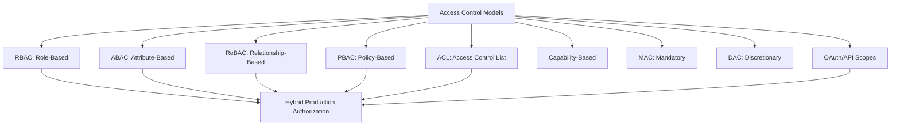
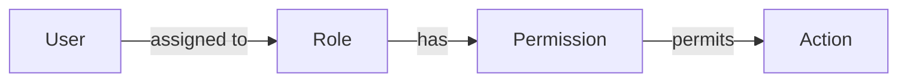
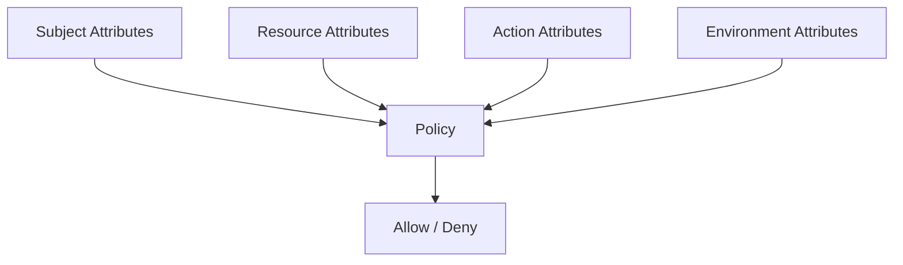
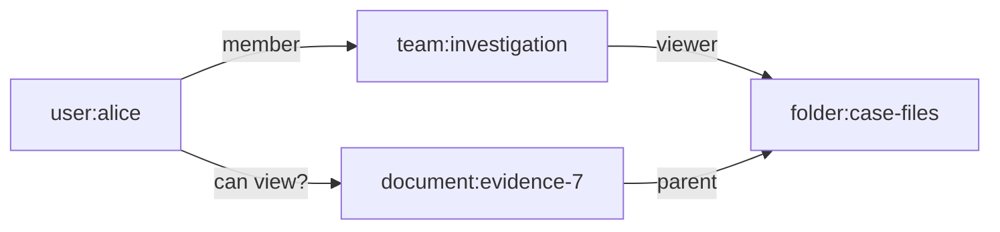
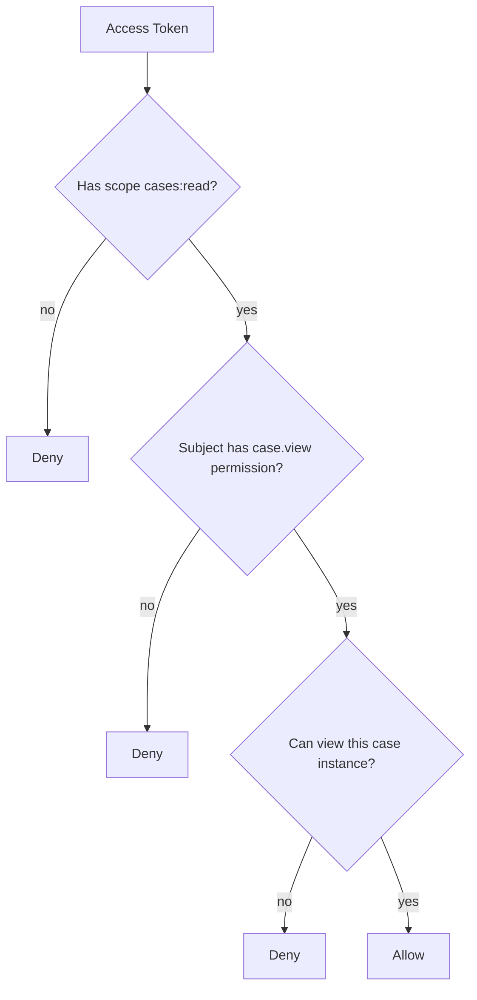
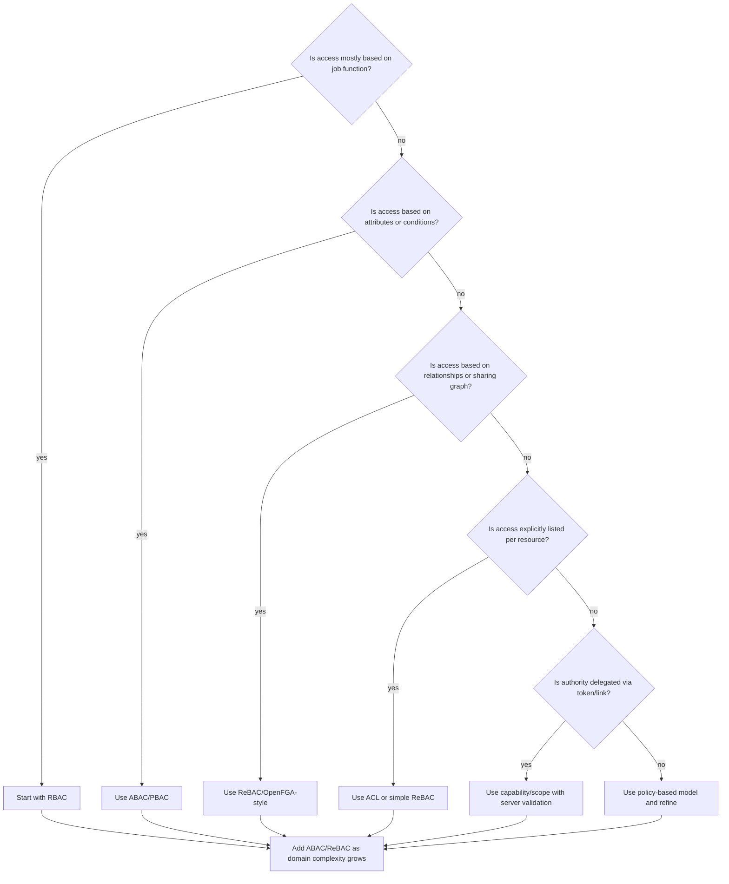
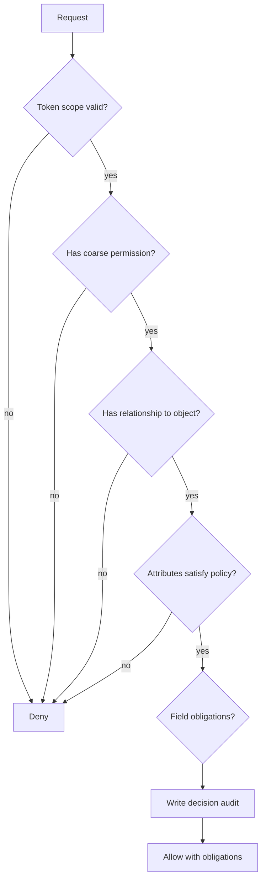

# Access Control Taxonomy: RBAC, ABAC, ReBAC, PBAC, ACL, Capabilities

Part sebelumnya membangun primitive:

```text
subject + action + resource + context -> decision
```

Sekarang kita akan membahas berbagai model access control. Tujuannya bukan menghafal akronim. Tujuannya adalah memilih model yang tepat untuk masalah yang tepat.

Di sistem Java enterprise, authorization yang baik hampir tidak pernah murni satu model. Biasanya ia hybrid:

```text
RBAC untuk coarse capability.
ABAC untuk condition dan policy constraint.
ReBAC untuk object relationship.
ACL untuk explicit sharing kecil.
Scope untuk delegated API access.
Policy-as-code untuk governability dan audit.
Database/query scoping untuk data-level enforcement.
```

Kesalahan besar adalah memilih model karena populer, bukan karena cocok dengan domain.

---

## 1. Peta Besar Access Control



Quick intuition:

| Model | Pertanyaan Utama | Cocok Untuk |
|---|---|---|
| RBAC | Role apa yang dimiliki subject? | organisasi, job function, coarse permission |
| ABAC | Atribut apa yang cocok dengan policy? | contextual, dynamic, compliance-heavy rules |
| ReBAC | Relasi apa yang menghubungkan subject dan object? | sharing, hierarchy, ownership graph |
| PBAC | Policy apa yang berlaku? | centralized governance, audit, externalized rules |
| ACL | Siapa yang secara eksplisit ada di list resource? | document/file sharing sederhana |
| Capability | Token/handle apa yang memberikan authority? | temporary delegated access, signed URL |
| Scope | Client/token diberi delegated authority apa? | OAuth/API integration |
| MAC | Label/classification apa yang wajib dipatuhi? | high-security/classified environments |
| DAC | Owner resource boleh memberi akses ke siapa? | collaborative apps, owner-managed sharing |

---

## 2. RBAC: Role-Based Access Control

RBAC menjawab:

> Apakah subject memiliki role yang memiliki permission untuk action ini?

Model dasar:



NIST/Sandhu RBAC model menekankan bahwa permission diasosiasikan dengan role, dan user di-assign ke role. Ini menyederhanakan manajemen permission karena perubahan job function bisa dilakukan lewat role assignment, bukan assign permission satu per satu ke user.

### 2.1 RBAC Primitive

```text
User/Subject
Role
Permission
Session
User-Role Assignment
Permission-Role Assignment
Role Hierarchy
Constraints
```

Contoh:

```text
Role: CASE_INVESTIGATOR
Permissions:
- case.viewAssigned
- case.addEvidence
- case.submitForReview

Role: CASE_SUPERVISOR
Permissions:
- case.viewTeam
- case.approve
- case.reject
- case.assignInvestigator

Role: LEGAL_REVIEWER
Permissions:
- case.viewLegalAssessment
- case.approveLegalPosition
```

### 2.2 RBAC di Java

Model sederhana:

```java
public record Role(String name) {}
public record Permission(String name) {}

public interface RoleRepository {
    Set<Role> findRolesBySubject(String subjectId, String tenantId);
}

public interface PermissionRepository {
    Set<Permission> findPermissionsByRoles(Set<Role> roles, String tenantId);
}

public final class RbacAuthorizer {
    private final RoleRepository roleRepository;
    private final PermissionRepository permissionRepository;

    public RbacAuthorizer(
        RoleRepository roleRepository,
        PermissionRepository permissionRepository
    ) {
        this.roleRepository = roleRepository;
        this.permissionRepository = permissionRepository;
    }

    public boolean hasPermission(Subject subject, String permissionName) {
        Set<Role> roles = roleRepository.findRolesBySubject(subject.id(), subject.tenantId());
        Set<Permission> permissions = permissionRepository.findPermissionsByRoles(roles, subject.tenantId());
        return permissions.contains(new Permission(permissionName));
    }
}
```

Ini cukup untuk coarse-grained gate:

```java
if (!rbacAuthorizer.hasPermission(subject, "case.approve")) {
    throw new AccessDeniedException("AUTHZ_MISSING_PERMISSION");
}
```

Tetapi belum cukup untuk object-level rule:

```text
Supervisor boleh approve hanya case yang assigned ke dia.
Submitter tidak boleh approve case miliknya sendiri.
Supervisor tenant A tidak boleh approve case tenant B.
```

### 2.3 Kapan RBAC Cocok

RBAC cocok ketika:

- struktur organisasi cukup stabil;
- permission mengikuti job function;
- admin ingin mengelola akses via role;
- policy tidak terlalu bergantung pada object relationship;
- audit butuh menjawab user punya role apa saat action terjadi;
- banyak endpoint memerlukan coarse-grained capability.

Contoh:

```text
Only users with REPORT_VIEWER can access reporting module.
Only CASE_SUPERVISOR can see approval queue.
Only USER_ADMIN can invite new employee.
```

### 2.4 Kapan RBAC Gagal

RBAC gagal ketika pertanyaan sebenarnya object-specific atau context-specific.

Contoh gagal:

```text
Can Alice view Bob's document?
Can investigator A edit case X?
Can supervisor approve case submitted by their own team member?
Can auditor export only cases in assigned jurisdiction?
```

Kalau dipaksa memakai role, muncul role explosion:

```text
CASE_SUPERVISOR_REGION_JAKARTA_HIGH_RISK_LEVEL_3
CASE_SUPERVISOR_REGION_BANDUNG_LOW_RISK_LEVEL_2
CASE_SUPERVISOR_TENANT_A_DEPARTMENT_ENFORCEMENT
```

Ini tanda modelnya salah.

### 2.5 RBAC Failure Modes

| Failure Mode | Gejala | Solusi |
|---|---|---|
| Role explosion | role terlalu banyak dan spesifik | pindahkan condition ke ABAC/ReBAC |
| Hidden superadmin | `ADMIN` bypass semua | privilege decomposition + audit |
| Permission drift | role berbeda antar service | central permission registry |
| Tenant leakage | role global dipakai untuk tenant-local data | tenant-scoped role assignment |
| Stale role | revoke tidak langsung efektif | short TTL, cache invalidation, authoritative check |
| UI-only role check | tombol disembunyikan tapi API terbuka | server-side enforcement |

---

## 3. ABAC: Attribute-Based Access Control

ABAC menjawab:

> Apakah atribut subject, resource, action, dan environment memenuhi policy?

NIST SP 800-162 mendeskripsikan ABAC sebagai model logical access control yang mengevaluasi rules terhadap attributes dari subject, object/resource, operation/action, dan environment.



Contoh atribut:

| Kategori | Contoh |
|---|---|
| Subject | department, clearance, employment status, role, jurisdiction |
| Resource | owner, tenant, classification, status, risk level |
| Action | action name, risk tier, read/write, bulk/single |
| Environment | time, device trust, IP range, MFA level, channel |

### 3.1 ABAC Policy Example

```text
Allow case.approve if:
- subject.department == resource.ownerDepartment
- subject.clearance >= resource.requiredClearance
- resource.status == UNDER_REVIEW
- action.riskTier in [HIGH, CRITICAL] implies context.mfaLevel >= 2
- subject.id != resource.submittedBy
```

Java local evaluator:

```java
public final class AbacCaseApprovalPolicy implements AuthorizationPolicy {

    @Override
    public AuthorizationDecision evaluate(AuthorizationRequest request) {
        if (!"case.approve".equals(request.action().name())) {
            return AuthorizationDecision.notApplicable("ABAC_CASE_APPROVAL_NOT_APPLICABLE");
        }

        String subjectDepartment = (String) request.subject().attributes().get("department");
        String ownerDepartment = (String) request.resource().attributes().get("ownerDepartment");
        if (!subjectDepartment.equals(ownerDepartment)) {
            return AuthorizationDecision.deny(
                "AUTHZ_DEPARTMENT_MISMATCH",
                "Subject department does not match resource owner department"
            );
        }

        int subjectClearance = (int) request.subject().attributes().get("clearance");
        int requiredClearance = (int) request.resource().attributes().get("requiredClearance");
        if (subjectClearance < requiredClearance) {
            return AuthorizationDecision.deny(
                "AUTHZ_INSUFFICIENT_CLEARANCE",
                "Subject clearance is lower than required resource clearance"
            );
        }

        String submittedBy = (String) request.resource().attributes().get("submittedBy");
        if (request.subject().id().equals(submittedBy)) {
            return AuthorizationDecision.deny(
                "AUTHZ_MAKER_CHECKER_VIOLATION",
                "Subject cannot approve their own submission"
            );
        }

        Integer mfaLevel = (Integer) request.context().values().getOrDefault("mfaLevel", 0);
        if (request.action().riskTier().isHighOrCritical() && mfaLevel < 2) {
            return AuthorizationDecision.deny(
                "AUTHZ_MFA_REQUIRED",
                "High-risk action requires MFA level 2"
            );
        }

        return AuthorizationDecision.allow(
            "AUTHZ_ABAC_POLICY_ALLOWED",
            "ABAC conditions matched"
        );
    }
}
```

### 3.2 Kapan ABAC Cocok

ABAC cocok ketika:

- decision bergantung pada banyak atribut;
- policy sering berubah;
- compliance rule penting;
- resource punya classification atau lifecycle state;
- akses bergantung pada waktu, lokasi, device, risk;
- tenant/jurisdiction/department boundaries kompleks;
- role saja menyebabkan role explosion.

Contoh:

```text
Only reviewers in the same jurisdiction can view high-risk case evidence.
Payment approval above 1B requires clearance level 4 and MFA.
Customer support can view customer data only with active support ticket.
Reports marked confidential require managed device and audit purpose.
```

### 3.3 ABAC Failure Modes

| Failure Mode | Gejala | Solusi |
|---|---|---|
| Attribute sprawl | terlalu banyak atribut tanpa ownership | attribute catalog + source of truth |
| Stale attributes | decision memakai claim lama | freshness policy |
| Null ambiguity | missing attribute dianggap cocok | explicit missing semantics |
| Policy opacity | sulit tahu kenapa deny | reason code + explainability |
| Performance issue | semua request load banyak data | attribute minimization + cache |
| Inconsistent attribute names | `dept`, `department`, `orgUnit` campur | canonical schema |

### 3.4 ABAC Tidak Berarti Semua Harus Dynamic

Jangan mengubah setiap permission menjadi expression rumit.

Buruk:

```text
allow if subject.role contains x and subject.attrA == y and resource.attrB != z and ...
```

Lebih baik:

```text
RBAC: user has capability case.approve
ABAC: action allowed only if case.status == UNDER_REVIEW and subject.clearance >= requiredClearance
ReBAC: subject must be assigned supervisor of the case
```

Hybrid lebih mudah diaudit daripada satu expression raksasa.

---

## 4. ReBAC: Relationship-Based Access Control

ReBAC menjawab:

> Apakah ada relationship yang membuat subject berhak terhadap resource?

Contoh:

```text
Alice can view document D because:
- Alice is member of team T;
- Team T is viewer of folder F;
- Document D is inside folder F.
```



ReBAC sangat cocok untuk sharing, ownership, hierarchy, nested resources, org graph, folder/document model, project membership, team-based access, dan delegated relationships.

### 4.1 Tuple Model

Banyak ReBAC system memakai tuple:

```text
object#relation@user
```

Contoh:

```text
case:CASE-1#owner@user:alice
case:CASE-1#assignee@user:bob
case:CASE-1#supervisor@user:carol
folder:F1#viewer@team:investigation
team:investigation#member@user:dina
document:D1#parent@folder:F1
```

Question:

```text
Is user:dina a viewer of document:D1?
```

Engine menelusuri relationship graph.

### 4.2 Zanzibar-Style Authorization

Google Zanzibar memperkenalkan model authorization global berbasis relationship tuple dan userset rewrite. Paper Zanzibar membahas authorization untuk banyak produk Google dengan konsistensi, relationship graph, namespace config, tuple store, dan check API.

Konsep utama:

```text
namespace/type
object
relation
userset
tuple
rewrite rule
check
expand
consistency token
```

Sederhana:

```text
viewer = owner OR editor OR parent.viewer
editor = owner OR direct_editor
```

### 4.3 OpenFGA Style Model

OpenFGA adalah sistem fine-grained authorization yang terinspirasi Zanzibar. Konsep dasarnya: authorization model + relationship tuples + check/list APIs.

Contoh model konseptual:

```text
type user

type team
  relations
    define member: [user]

type case
  relations
    define owner: [user]
    define assignee: [user]
    define supervisor: [user]
    define viewer: owner or assignee or supervisor
```

Java application tidak perlu menghitung graph sendiri. Ia bertanya:

```text
check(user:alice, relation=viewer, object=case:CASE-1)
```

### 4.4 Kapan ReBAC Cocok

ReBAC cocok ketika:

- access ditentukan oleh relationship, bukan hanya role;
- object memiliki parent/child hierarchy;
- sharing eksplisit diperlukan;
- user bisa tergabung dalam team/group/project;
- permission diwariskan dari parent object;
- `list objects user can access` penting;
- domain memiliki graph alami.

Contoh:

```text
User can view case if assigned to case.
User can view document if member of team that owns folder containing document.
User can approve quote if manager of salesperson who owns quote.
User can access workspace if member of organization that owns workspace.
```

### 4.5 ReBAC Failure Modes

| Failure Mode | Gejala | Solusi |
|---|---|---|
| Graph explosion | traversal mahal | bounded depth + indexing + caching |
| Stale relationships | revoked sharing masih berlaku | consistency token/watch/invalidation |
| Modeling confusion | relation terlalu abstrak | domain-specific relation names |
| Cycles | recursive relation tak terkendali | model validation |
| List performance | check satu-satu untuk ribuan object | list objects API/query integration |
| Split brain | DB relation dan authz tuple tidak sinkron | transactional outbox/saga repair |

---

## 5. PBAC: Policy-Based Access Control

PBAC menjawab:

> Policy mana yang berlaku dan apa hasil evaluasinya?

PBAC bukan model data tunggal seperti RBAC atau ReBAC. PBAC adalah pendekatan: authorization logic diekspresikan sebagai policy yang bisa dikelola, dites, di-version, diaudit, dan sering kali dievaluasi oleh engine khusus.

Contoh tools/approach:

```text
OPA/Rego
Cedar/Amazon Verified Permissions
XACML-style PDP/PEP architecture
Custom internal policy engine
Spring AuthorizationManager composition
```

### 5.1 Policy as Code

OPA memosisikan dirinya sebagai policy engine untuk mengelola policy di berbagai stack. Dengan OPA, policy ditulis dalam Rego dan aplikasi mengirim input untuk mendapat decision.

Cedar adalah policy language untuk menulis authorization policies dan membuat authorization decisions. Amazon Verified Permissions memakai Cedar sebagai managed authorization service. Cedar memisahkan principal, action, resource, dan context.

### 5.2 Kapan PBAC Cocok

PBAC cocok ketika:

- policy sering berubah tanpa deploy aplikasi;
- security/compliance team ikut mengelola policy;
- butuh audit policy version;
- banyak service harus konsisten;
- butuh shadow evaluation/canary policy;
- authorization rules kompleks tetapi harus explainable;
- ingin memisahkan policy decision dari business implementation.

### 5.3 PBAC Failure Modes

| Failure Mode | Gejala | Solusi |
|---|---|---|
| Policy divorced from domain | PDP tidak punya data domain | input contract + PIP design |
| Latency | call PDP tiap request mahal | local sidecar/cache/bundle |
| Fail-open | PDP timeout dianggap allow | fail-closed policy |
| Policy drift | app dan policy beda makna action | action/resource registry |
| Weak testing | policy berubah tanpa regression | policy unit + golden tests |
| Poor explainability | deny tidak jelas | reason code + decision log |

---

## 6. ACL: Access Control List

ACL menjawab:

> Apakah subject ada dalam daftar akses resource ini?

Contoh:

```text
document:DOC-1 ACL:
- user:alice -> owner
- user:bob -> editor
- team:legal -> viewer
```

ACL mudah dipahami dan cocok untuk resource yang memang dibagikan secara eksplisit.

### 6.1 ACL Table Design

```sql
create table document_acl (
    document_id uuid not null,
    subject_type varchar(32) not null,
    subject_id varchar(128) not null,
    permission varchar(64) not null,
    granted_by varchar(128) not null,
    granted_at timestamp not null,
    expires_at timestamp null,
    primary key (document_id, subject_type, subject_id, permission)
);
```

Java check:

```java
public boolean canViewDocument(Subject subject, UUID documentId) {
    return documentAclRepository.exists(
        documentId,
        subject.type().name(),
        subject.id(),
        "viewer"
    );
}
```

### 6.2 Kapan ACL Cocok

ACL cocok ketika:

- resource punya daftar eksplisit user/group yang boleh akses;
- sharing manual penting;
- jumlah subject per resource relatif kecil;
- inheritance sederhana atau tidak ada;
- audit grant/revoke penting.

Contoh:

```text
shared document
case evidence shared to external counsel
temporary access to report
project-specific invite list
```

### 6.3 Kapan ACL Tidak Cocok

ACL bermasalah ketika:

- inheritance kompleks;
- perlu group nesting;
- resource jutaan dan list besar;
- query `list all accessible objects` harus cepat;
- sharing mengikuti org hierarchy;
- ACL perlu condition dinamis.

Di titik itu, ReBAC biasanya lebih kuat.

---

## 7. Capability-Based Access Control

Capability-based access menjawab:

> Apakah caller memiliki capability/token/handle yang memberi authority untuk action ini?

Contoh umum:

```text
pre-signed URL untuk download file
one-time token untuk reset password
temporary upload token
invitation link
magic link
limited-use API key
```

Capability biasanya membawa authority di token itu sendiri atau di handle yang bisa divalidasi server.

### 7.1 Capability Example

```text
Download evidence file:
- token berlaku 5 menit;
- token terikat ke document ID;
- token terikat ke action document.download;
- token terikat ke subject atau session;
- token single-use atau limited-use;
- token bisa direvokasi.
```

Java-style validation:

```java
public record DownloadCapability(
    String tokenId,
    String subjectId,
    String resourceType,
    String resourceId,
    String action,
    Instant expiresAt,
    boolean singleUse
) {}

public void verifyCapability(DownloadCapability cap, Subject subject, String documentId) {
    if (Instant.now().isAfter(cap.expiresAt())) {
        throw new AccessDeniedException("AUTHZ_CAPABILITY_EXPIRED");
    }
    if (!cap.subjectId().equals(subject.id())) {
        throw new AccessDeniedException("AUTHZ_CAPABILITY_SUBJECT_MISMATCH");
    }
    if (!cap.resourceId().equals(documentId)) {
        throw new AccessDeniedException("AUTHZ_CAPABILITY_RESOURCE_MISMATCH");
    }
    if (!"document.download".equals(cap.action())) {
        throw new AccessDeniedException("AUTHZ_CAPABILITY_ACTION_MISMATCH");
    }
}
```

### 7.2 Capability Failure Modes

| Failure Mode | Risiko | Mitigasi |
|---|---|---|
| Token terlalu lama | leak menjadi akses panjang | short TTL |
| Token tidak resource-bound | dipakai untuk object lain | bind resource ID |
| Token tidak subject-bound | link bisa dipakai siapa saja | bind subject/session jika perlu |
| Tidak revocable | sulit cabut akses | server-side token registry |
| Log leak | token muncul di log/referrer | jangan taruh secret di URL jika tidak perlu |
| Overbroad capability | satu token untuk banyak aksi | least privilege capability |

---

## 8. OAuth/API Scopes

Scope menjawab:

> Client/token ini diberi delegated authority apa?

Scope sering muncul pada OAuth2 access token:

```text
orders:read
orders:write
cases:read
cases:approve
reports:export
```

Scope penting, tetapi jangan disalahpahami.

Scope biasanya membatasi **client/delegation**, bukan menggantikan object-level authorization.

Contoh:

```text
Token punya scope cases:read.
Artinya client boleh meminta read case.
Belum berarti user boleh membaca semua case.
```

Server tetap harus mengecek:

```text
scope allows action?
AND subject allowed on resource instance?
AND context policy satisfied?
```

### 8.1 Scope + RBAC + Object Authz



### 8.2 Scope Failure Modes

| Failure Mode | Contoh |
|---|---|
| Scope dianggap final authorization | `cases:read` membaca semua case |
| Scope terlalu kasar | `admin` scope di semua API |
| Scope tidak audience-bound | token service A dipakai service B |
| Scope tidak tenant-bound | token tenant A dipakai untuk tenant B |
| Scope tidak action-specific | `write` mencakup approve/delete/export |

---

## 9. DAC dan MAC

### 9.1 DAC: Discretionary Access Control

DAC berarti owner/resource controller bisa memberikan akses.

Contoh:

```text
Owner document membagikan document ke user lain.
Project owner invite member.
Case owner grants external counsel temporary view.
```

DAC sering diimplementasikan dengan ACL atau ReBAC.

Risiko DAC:

- owner memberi akses terlalu luas;
- privilege propagation sulit dikontrol;
- sharing tidak sesuai compliance;
- akses lama tidak dicabut.

Solusi:

- policy guard terhadap grant action;
- expiration;
- approval untuk sensitive resource;
- access review;
- audit grant/revoke.

### 9.2 MAC: Mandatory Access Control

MAC memakai label/classification yang wajib dipatuhi. User tidak bebas membagikan akses jika label melarang.

Contoh:

```text
resource.classification = SECRET
subject.clearance >= SECRET required
no write-down from high classification to low classification
```

MAC cocok untuk high-security domain, classified information, legal hold, sealed evidence, atau regulatory documents.

Dalam enterprise Java biasa, MAC sering muncul sebagai subset ABAC:

```text
allow if subject.clearance >= resource.classificationLevel
```

---

## 10. Comparison Matrix

| Model | Strength | Weakness | Java Implementation Style |
|---|---|---|---|
| RBAC | mudah dipahami, admin-friendly | role explosion, object-level lemah | role/permission tables, Spring authorities |
| ABAC | fleksibel, context-aware | attribute governance sulit | policy evaluator, OPA/Cedar, custom engine |
| ReBAC | kuat untuk relationship graph | graph complexity, consistency | OpenFGA/Zanzibar-style service, tuple store |
| PBAC | governance, versioning, audit | membutuhkan policy lifecycle | OPA/Cedar/custom PDP |
| ACL | sederhana untuk explicit sharing | sulit scale/inheritance | ACL table per resource |
| Capability | bagus untuk temporary delegation | leak/revocation risk | signed token/server-side capability registry |
| Scope | standar untuk API delegation | bukan object authz | OAuth2 resource server checks |
| MAC | kuat untuk classification | rigid | labels + clearance policy |
| DAC | user-managed sharing | over-sharing risk | ACL/ReBAC + grant policy |

---

## 11. How to Choose: Decision Tree



Rule praktis:

```text
Start simple, but do not start wrong.
```

Kalau domainnya jelas object-relationship-heavy, jangan mulai dengan role-only model. Kamu akan membayar migration cost besar.

---

## 12. Hybrid Authorization: Model yang Umum di Production

Contoh hybrid untuk regulatory case management:

```text
RBAC:
- CASE_INVESTIGATOR can submit case for review.
- CASE_SUPERVISOR can approve case.
- LEGAL_REVIEWER can review legal assessment.

ABAC:
- subject.clearance must be >= case.requiredClearance.
- case.status must be UNDER_REVIEW before approval.
- high-risk approval requires MFA level 2.

ReBAC:
- subject must be assigned investigator/supervisor of case.
- subject can view case if member of case team.

PBAC:
- policy stored/versioned centrally.
- decision logged with policy version.

ACL:
- external counsel can view specific evidence package.

Capability:
- temporary signed URL for evidence download.

Scope:
- API client must have cases:read or cases:approve scope.
```

Pipeline:



---

## 13. Model by Domain Shape

### 13.1 Admin Console

Typical model:

```text
RBAC + SoD constraints + audit
```

Why:

- admin action follows job function;
- privileged action needs strong audit;
- separation of duties matters.

### 13.2 Document Sharing

Typical model:

```text
ReBAC + ACL + capability links
```

Why:

- document/folder hierarchy;
- team membership;
- explicit sharing;
- temporary download links.

### 13.3 Payment Approval

Typical model:

```text
RBAC + ABAC + maker-checker + risk policy
```

Why:

- role defines approver capability;
- amount/currency/risk/region changes decision;
- submitter cannot approve.

### 13.4 Multi-Tenant SaaS

Typical model:

```text
tenant boundary + RBAC + ABAC + query scoping
```

Why:

- tenant isolation is invariant;
- roles are often tenant-local;
- resource visibility must be scoped at query level.

### 13.5 Regulatory Case Management

Typical model:

```text
RBAC + ABAC + ReBAC + workflow-state authorization + field-level authorization + audit
```

Why:

- case assignment and team relationship;
- classification/clearance;
- state transition guard;
- maker-checker;
- sealed evidence;
- regulatory audit.

---

## 14. Authorization Model Smells

### 14.1 Role Names Encode Resource Identity

```text
CASE_123_VIEWER
TENANT_ABC_REPORT_ADMIN
PROJECT_X_EDITOR
```

Ini ReBAC/ACL problem yang dipaksa masuk RBAC.

### 14.2 Policy Requires 20 Token Claims

Kalau token harus membawa semua atribut, attribute freshness akan buruk. Ambil fakta mutable dari authoritative source.

### 14.3 Every Service Defines Permission Differently

Jika service A memakai `case.approve`, service B memakai `approve_case`, service C memakai `CASE_APPROVER`, audit dan governance rusak.

Butuh action registry.

### 14.4 Authorization Happens Only at Gateway

Gateway tidak tahu object instance dan workflow state. Gateway bagus untuk coarse gate, bukan satu-satunya enforcement.

### 14.5 Object Check in Controller, Search Query Unscoped

Endpoint detail aman, tetapi list/export bocor.

```java
GET /cases/{id}       // checks object
GET /cases?status=x   // returns all tenant cases without assignment scope
```

List/search/export harus punya query scoping.

---

## 15. Java Architecture Patterns by Model

### 15.1 RBAC Package Structure

```text
com.example.security.authz.rbac
├── Role.java
├── Permission.java
├── RoleRepository.java
├── PermissionRepository.java
├── RbacAuthorizationProvider.java
└── RoleAssignmentService.java
```

### 15.2 ABAC Package Structure

```text
com.example.security.authz.abac
├── AttributeProvider.java
├── AttributeCatalog.java
├── Policy.java
├── PolicyEvaluator.java
├── Condition.java
└── AttributeResolutionException.java
```

### 15.3 ReBAC Package Structure

```text
com.example.security.authz.relationship
├── RelationshipTuple.java
├── RelationshipWriter.java
├── RelationshipChecker.java
├── RelationshipModelRegistry.java
└── RelationshipSyncProcessor.java
```

### 15.4 PBAC Package Structure

```text
com.example.security.authz.policy
├── PolicyDecisionPoint.java
├── PolicyEnforcementPoint.java
├── PolicyInformationPoint.java
├── PolicyAdministrationClient.java
├── DecisionLogSink.java
└── PolicyVersion.java
```

### 15.5 Common API

Terlepas dari model internal, application layer sebaiknya melihat API yang stabil:

```java
public interface AuthorizationService {
    AuthorizationDecision authorize(AuthorizationRequest request);
    void verify(AuthorizationRequest request);
}
```

Jangan biarkan controller tahu apakah decision berasal dari RBAC table, ABAC evaluator, OPA, Cedar, atau OpenFGA.

---

## 16. Designing Permission Names

Permission/action names harus:

- domain-specific;
- stable;
- tidak terlalu HTTP-oriented;
- tidak terlalu technical;
- bisa diaudit;
- bisa dipetakan ke UI dan API;
- bisa dipetakan ke policy engine.

Good:

```text
case.view
case.search
case.submitForReview
case.approve
case.reject
case.assignInvestigator
case.exportEvidence
case.viewSealedEvidence
case.reopen
```

Bad:

```text
GET_CASE
POST_APPROVE_ENDPOINT
WRITE_CASE
ADMIN_ACTION
MANAGE_CASE
```

Permission `manage` biasanya terlalu luas. Pecah menjadi action konkret.

---

## 17. Relationship Names

Relationship names harus merepresentasikan fakta domain, bukan implementation detail.

Good:

```text
case#assignee@user:alice
case#supervisor@user:bob
case#legal_reviewer@user:carol
case#team@team:enforcement-alpha
team#member@user:dina
folder#parent@case:CASE-1
document#parent@folder:F1
```

Bad:

```text
case#allowed@user:alice
object#access@user:bob
resource#thing@group:x
```

Semakin jelas relation, semakin mudah policy dan audit.

---

## 18. Attribute Catalog

ABAC membutuhkan attribute catalog.

Contoh:

| Attribute | Owner | Source | Freshness | Type | Required For |
|---|---|---|---|---|---|
| subject.department | HR/IAM | employee service | 5 min | string | case view/approve |
| subject.clearance | IAM/security | clearance service | immediate for revoke | int | confidential access |
| resource.classification | case service | case DB | real-time | enum | field redaction |
| resource.status | case service | case DB | real-time | enum | workflow transition |
| context.mfaLevel | authn/session | session store | request-time | int | high-risk action |
| context.requestPurpose | caller/API | request | request-time | enum | audit/support access |

Tanpa catalog, ABAC berubah menjadi kumpulan string map yang rapuh.

---

## 19. Policy Combining

Jika ada banyak policy, bagaimana hasil digabung?

Common combining algorithms:

| Algorithm | Makna |
|---|---|
| Deny overrides | satu deny cukup untuk deny |
| Permit overrides | satu allow cukup untuk allow |
| First applicable | policy pertama yang match menang |
| Consensus/majority | jarang untuk authz app biasa |
| Explicit priority | policy priority menentukan hasil |

Untuk high-security system, `deny overrides` sering lebih aman.

Contoh:

```text
Policy A: CASE_SUPERVISOR may approve assigned case -> ALLOW
Policy B: submitter cannot approve own case -> DENY
Final: DENY
```

Kalau permit overrides, maker-checker bisa bocor.

Java skeleton:

```java
public final class DenyOverridesCombiner {
    public AuthorizationDecision combine(List<AuthorizationDecision> decisions) {
        for (AuthorizationDecision decision : decisions) {
            if (decision.effect() == AuthorizationEffect.DENY) {
                return decision;
            }
        }

        for (AuthorizationDecision decision : decisions) {
            if (decision.effect() == AuthorizationEffect.ALLOW) {
                return decision;
            }
        }

        boolean hasIndeterminate = decisions.stream()
            .anyMatch(d -> d.effect() == AuthorizationEffect.INDETERMINATE);

        if (hasIndeterminate) {
            return AuthorizationDecision.deny(
                "AUTHZ_INDETERMINATE_DENIED",
                "At least one policy could not be evaluated"
            );
        }

        return AuthorizationDecision.deny(
            "AUTHZ_NO_APPLICABLE_POLICY",
            "No applicable policy allowed this request"
        );
    }
}
```

---

## 20. Migration Path: From Naive Role Checks to Mature Authorization

Banyak sistem Java mulai seperti ini:

```java
@PreAuthorize("hasRole('ADMIN')")
```

Jangan langsung rewrite semua ke OPA/OpenFGA. Migration harus aman.

### Step 1: Inventory Protected Actions

Buat daftar:

```text
endpoint -> business action -> resource type -> current check -> risk
```

### Step 2: Normalize Permission Names

Ubah dari:

```text
ROLE_ADMIN
ROLE_USER
CAN_DO_THING
```

menjadi:

```text
case.view
case.approve
document.download
report.export
```

### Step 3: Introduce AuthorizationService Facade

Controller/service tidak lagi langsung cek role.

```java
authorizationService.verify(request);
```

### Step 4: Add Object-Level Checks

Mulai dari endpoint high-risk:

```text
GET by id
PATCH by id
DELETE by id
approve/reject/cancel/export
```

### Step 5: Add Query Scoping

Search/list/export harus scoped.

### Step 6: Add Decision Logging

Simpan decision evidence untuk action high-risk.

### Step 7: Externalize Policy jika Perlu

Pindah ke OPA/Cedar/OpenFGA ketika alasan governance, consistency, atau relationship complexity sudah kuat.

---

## 21. Testing Implications by Model

| Model | Test Utama |
|---|---|
| RBAC | role-permission matrix, missing permission, role hierarchy |
| ABAC | attribute boundary, null/missing attribute, stale attribute |
| ReBAC | relationship graph, inheritance, cycle, revocation |
| PBAC | policy unit test, policy diff, shadow decision |
| ACL | grant/revoke, expiry, list accessible resources |
| Capability | expiry, subject binding, resource binding, replay |
| Scope | audience, action mapping, delegated client boundary |

Authorization test harus banyak negative test. Banyak tim hanya test allow path. Itu tidak cukup.

Contoh negative matrix:

```text
same role but different tenant -> deny
same tenant but not assigned -> deny
assigned but wrong status -> deny
supervisor but submitter same user -> deny
legal reviewer but insufficient clearance -> deny
valid permission but missing MFA -> deny
```

---

## 22. Production Recommendation

Untuk kebanyakan Java enterprise system, baseline yang sehat:

```text
1. Define canonical action/resource model.
2. Use RBAC for coarse capability.
3. Use object-level authorization for every resource instance access.
4. Use ABAC for context/state/classification constraints.
5. Use ReBAC for assignment, ownership, sharing, group/team hierarchy.
6. Use query scoping for list/search/export.
7. Use policy-as-code only when governance/scale justifies it.
8. Log decisions for high-risk actions.
9. Treat scopes as delegation boundary, not final authorization.
10. Deny by default.
```

---

## 23. Checklist Part 002

- [ ] Apakah problem ini sebenarnya role-based, attribute-based, relationship-based, atau hybrid?
- [ ] Apakah role mulai mengandung tenant/resource/context detail?
- [ ] Apakah permission names business-oriented?
- [ ] Apakah object-level authorization ada untuk detail endpoint?
- [ ] Apakah list/search/export memakai query scope?
- [ ] Apakah attribute source dan freshness jelas?
- [ ] Apakah relationship graph disimpan authoritative?
- [ ] Apakah token scope hanya dipakai sebagai delegation boundary?
- [ ] Apakah capability token short-lived dan resource-bound?
- [ ] Apakah policy combining jelas?
- [ ] Apakah deny overrides digunakan untuk constraint kritis?
- [ ] Apakah decision bisa diaudit?
- [ ] Apakah migration path tidak memecahkan sistem sekaligus?

---

## 24. Kesimpulan

Tidak ada satu access control model yang menang untuk semua sistem.

RBAC bagus untuk job function, tetapi lemah untuk object relationship.

ABAC bagus untuk context dan condition, tetapi bisa menjadi chaos tanpa attribute governance.

ReBAC bagus untuk relationship graph, tetapi membawa kompleksitas graph consistency dan query performance.

PBAC bagus untuk governance dan audit, tetapi membutuhkan policy lifecycle yang disiplin.

ACL bagus untuk explicit sharing sederhana, tetapi sulit untuk inheritance kompleks.

Capability bagus untuk temporary delegated authority, tetapi harus short-lived, bound, dan revocable.

Scope penting untuk OAuth/API delegation, tetapi bukan pengganti object-level authorization.

Model production biasanya hybrid. Keahlian senior bukan memilih akronim paling canggih. Keahlian senior adalah membaca bentuk domain, memilih primitive yang tepat, dan menjaga invariant authorization tetap benar saat sistem tumbuh.

Part berikutnya akan memisahkan authorization dari authentication, identity, entitlement, consent, delegation, subscription, feature flag, dan data visibility. Ini penting karena banyak sistem gagal bukan karena tidak punya authorization, tetapi karena mencampur terlalu banyak konsep menjadi satu flag atau satu role.

---

## References

- [NIST RBAC Model](https://tsapps.nist.gov/publication/get_pdf.cfm?pub_id=916402)
- [Sandhu et al. — Role-Based Access Control Models](https://csrc.nist.gov/csrc/media/projects/role-based-access-control/documents/sandhu96.pdf)
- [NIST SP 800-162 — Guide to Attribute Based Access Control](https://nvlpubs.nist.gov/nistpubs/specialpublications/nist.sp.800-162.pdf)
- [NIST CSRC Glossary — Attribute-Based Access Control](https://csrc.nist.gov/glossary/term/attribute_based_access_control)
- [OWASP Authorization Cheat Sheet](https://cheatsheetseries.owasp.org/cheatsheets/Authorization_Cheat_Sheet.html)
- [OWASP API Security 2023 — API1 Broken Object Level Authorization](https://owasp.org/API-Security/editions/2023/en/0xa1-broken-object-level-authorization/)
- [Zanzibar: Google's Consistent, Global Authorization System](https://www.usenix.org/system/files/atc19-pang.pdf)
- [OpenFGA Authorization Concepts](https://openfga.dev/docs/authorization-concepts)
- [OpenFGA Concepts](https://openfga.dev/docs/concepts)
- [Open Policy Agent](https://openpolicyagent.org/)
- [Cedar Policy Language Reference](https://docs.cedarpolicy.com/)
- [Amazon Verified Permissions and Cedar Terminology](https://docs.aws.amazon.com/verifiedpermissions/latest/userguide/terminology.html)
