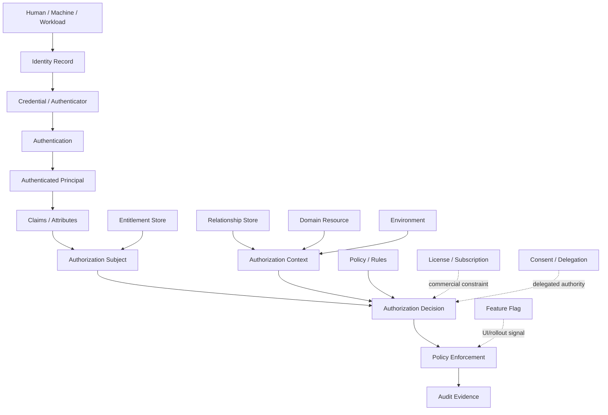
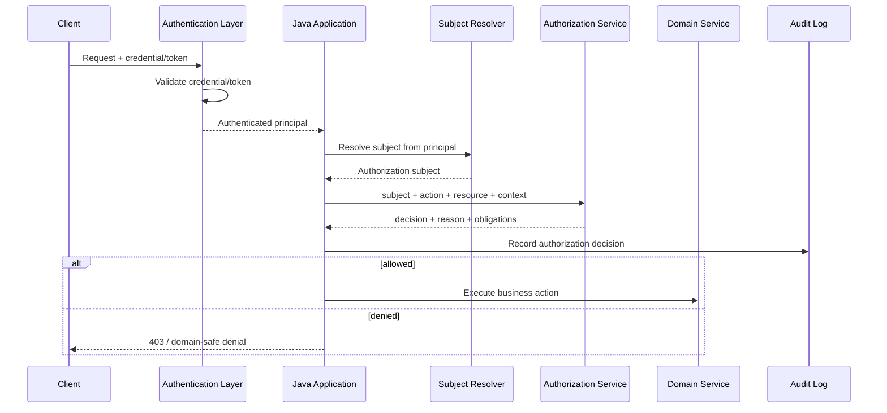
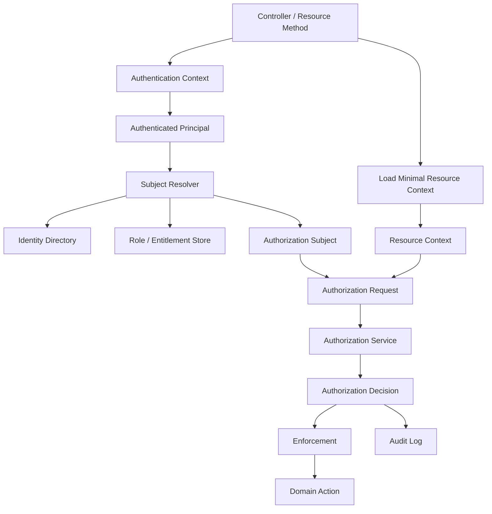

# Authorization vs Authentication vs Identity vs Entitlement

Part 001 membangun primitive authorization:

```text
subject + action + resource + context -> decision
```

Part 002 membahas taxonomy access control:

```text
RBAC, ABAC, ReBAC, PBAC, ACL, capability, scope, hybrid model
```

Sekarang kita perlu membersihkan batas konseptual. Banyak sistem Java enterprise gagal bukan karena tidak punya library security, tetapi karena mencampuradukkan beberapa konsep ini:

```text
identity
authentication
principal
claim
session
credential
scope
role
permission
entitlement
delegation
consent
license
feature flag
authorization decision
```

Kalau batasnya kabur, kode akan terlihat seperti ini:

```java
if (jwt.getClaim("role").equals("admin") && featureFlag.isEnabled("approve-case")) {
    approve(caseId);
}
```

Kode itu terlihat praktis, tetapi secara arsitektural berbahaya. Ia mencampur identitas, token claim, feature exposure, role, action authorization, dan domain transition ke dalam satu kondisi lokal tanpa decision reason, tanpa policy version, tanpa object-level check, dan tanpa audit.

Tujuan part ini adalah membuat batas mental yang presisi sehingga saat kita menulis authorization di Java, kita tahu data mana yang boleh dipercaya, data mana yang hanya sinyal, decision mana yang final, dan boundary mana yang harus diuji.

---

## 1. Peta Konsep



High-level distinction:

| Concept | Pertanyaan yang Dijawab | Output | Boleh Jadi Final Authorization? |
|---|---|---|---|
| Identity | Siapa entity ini dalam directory/domain? | identity record | Tidak |
| Authentication | Apakah caller berhasil membuktikan identitasnya? | authenticated principal | Tidak |
| Claim | Apa assertion yang dibawa token/session? | key-value assertion | Tidak sendirian |
| Role | Caller punya job/function grouping apa? | coarse capability | Tidak sendirian untuk object access |
| Permission | Action abstrak apa yang boleh dilakukan? | capability/action grant | Kadang, tetapi masih perlu resource/context |
| Scope | Delegated API access apa yang diminta token/client? | bounded API grant | Tidak sendirian untuk domain object |
| Entitlement | Hak eksplisit yang dimiliki subject menurut system of record | grant/business right | Input decision |
| Consent | Owner memberi izin apa ke pihak lain? | delegated permission | Input decision |
| License | Paket komersial/kontrak apa yang aktif? | commercial capability | Input decision |
| Feature Flag | Fitur apa yang diaktifkan untuk rollout/experiment? | exposure toggle | Bukan security control utama |
| Authorization | Boleh melakukan action terhadap resource pada context ini? | allow/deny + reason | Ya |

Intinya: **authentication menghasilkan principal; authorization menghasilkan decision**.

Principal bukan decision. Claim bukan decision. Role bukan decision. Feature flag bukan decision. License bukan decision. Semua itu bisa menjadi **input** authorization.

---

## 2. Identity: Record, Bukan Izin

Identity adalah representasi entity dalam sistem. Entity ini bisa berupa:

- human user;
- service account;
- workload identity;
- API client;
- organization;
- external partner;
- device;
- batch job;
- robotic process automation actor;
- integration connector.

Contoh identity record:

```json
{
  "id": "usr_123",
  "type": "HUMAN",
  "email": "supervisor@example.gov",
  "displayName": "Ayu Pratama",
  "organizationId": "org_fsa",
  "department": "ENFORCEMENT",
  "status": "ACTIVE",
  "createdAt": "2025-08-01T10:15:30Z"
}
```

Identity record menjawab:

```text
entity ini siapa menurut directory/domain?
```

Ia belum menjawab:

```text
apakah request saat ini benar-benar berasal dari entity itu?
apakah entity itu boleh approve case ini?
apakah entity itu boleh melihat field rahasia?
apakah izin itu masih aktif?
```

### Java modeling

Jangan biarkan identity record menjadi authorization decision object.

Buruk:

```java
public final class User {
    private UUID id;
    private String email;
    private Set<String> roles;

    public boolean canApproveCase() {
        return roles.contains("SUPERVISOR");
    }
}
```

Masalahnya: `User` menjadi campuran identity, role store, domain policy, dan action rule.

Lebih sehat:

```java
public record IdentityRecord(
        String identityId,
        IdentityType type,
        String displayName,
        String organizationId,
        IdentityStatus status
) {}

public enum IdentityType {
    HUMAN,
    SERVICE_ACCOUNT,
    WORKLOAD,
    EXTERNAL_CLIENT
}

public enum IdentityStatus {
    ACTIVE,
    SUSPENDED,
    DELETED
}
```

Lalu identity menjadi salah satu input pembentukan authorization subject:

```java
public record AuthorizationSubject(
        String subjectId,
        SubjectType subjectType,
        String tenantId,
        Set<String> roles,
        Set<String> permissions,
        Map<String, Object> attributes
) {}
```

Boundary penting:

```text
IdentityRecord: siapa entity ini.
AuthorizationSubject: representasi subject untuk evaluasi authorization.
```

Keduanya tidak harus sama.

---

## 3. Authentication: Bukti, Bukan Hak Akses

Authentication adalah proses membuktikan bahwa caller memang entity tertentu. Output-nya biasanya:

- session;
- authenticated principal;
- token validation result;
- `Authentication` object di Spring Security;
- `SecurityContext`;
- `Principal` di Jakarta/JAX-RS;
- mTLS certificate identity;
- workload identity assertion.

Authentication menjawab:

```text
Apakah caller ini berhasil membuktikan identitasnya?
```

Authorization menjawab:

```text
Apakah authenticated caller ini boleh melakukan action tertentu terhadap resource tertentu?
```

### Spring Security boundary

Di Spring Security, authentication information biasanya tersedia melalui `SecurityContextHolder` atau injected principal. Untuk authorization modern, Spring Security menyediakan `AuthorizationManager` sebagai komponen yang menentukan apakah `Authentication` tertentu punya akses ke object tertentu.

Jangan berhenti di:

```java
Authentication authentication = SecurityContextHolder.getContext().getAuthentication();
if (authentication.isAuthenticated()) {
    // dangerous if treated as authorization
}
```

`isAuthenticated()` tidak berarti boleh melakukan action domain. Ia hanya berarti caller sudah melewati authentication mechanism.

Lebih benar:

```java
public void approveCase(String caseId) {
    Authentication authentication = SecurityContextHolder.getContext().getAuthentication();
    CaseSummary caseSummary = caseRepository.getSummary(caseId);

    AuthorizationDecision decision = authorizationService.decide(
            AuthorizationRequest.builder()
                    .subject(subjectResolver.from(authentication))
                    .action("case.approve")
                    .resource(ResourceRef.of("case", caseId))
                    .context(Map.of(
                            "caseStatus", caseSummary.status(),
                            "assignedSupervisorId", caseSummary.assignedSupervisorId(),
                            "riskLevel", caseSummary.riskLevel()
                    ))
                    .build()
    );

    decision.requireAllowed();
    caseWorkflow.approve(caseId);
}
```

Authentication hanya menjadi input untuk subject resolution.

---

## 4. Principal: Runtime Representation, Bukan Domain Model Utuh

Principal adalah representasi caller yang sudah dikenali dalam runtime security context.

Contoh principal:

```java
public record AuthenticatedPrincipal(
        String principalId,
        PrincipalKind kind,
        String authenticationMethod,
        Instant authenticatedAt,
        Map<String, Object> claims
) {}
```

Principal sering terlalu miskin untuk authorization penuh.

Ia mungkin punya:

```text
sub = usr_123
email = supervisor@example.gov
roles = [SUPERVISOR]
tenant = fsa
```

Tetapi authorization mungkin butuh:

```text
case.assignedSupervisorId
case.requiredClearance
case.currentWorkflowState
case.tenantId
subject.currentDepartmentFromHR
subject.activeDelegations
currentRiskScore
policyVersion
currentTime
```

Jadi jangan masukkan seluruh domain object ke principal. Principal harus cukup untuk mengidentifikasi subject dan membawa assertion dasar, bukan menjadi cache raksasa berisi semua izin.

### Bad smell: fat principal

```java
public class UserPrincipal implements Principal {
    private String id;
    private String email;
    private List<String> roles;
    private List<String> permissions;
    private List<String> tenantIds;
    private List<String> caseIds;
    private Map<String, List<String>> objectPermissions;
    private List<Delegation> delegations;
    private List<FeatureFlag> featureFlags;
}
```

Kenapa buruk:

- token/session menjadi terlalu besar;
- data cepat stale;
- revocation sulit;
- permission object-level tidak scalable;
- security context menjadi coupling ke domain;
- update role/permission tidak langsung berlaku;
- audit sulit karena decision tidak dihitung pada saat action.

Lebih baik principal kecil, lalu enrichment dilakukan oleh authorization layer.

---

## 5. Claims: Assertion, Bukan Kebenaran Absolut

Claim adalah pernyataan yang dibawa oleh token/session.

Contoh JWT claims:

```json
{
  "sub": "usr_123",
  "iss": "https://idp.example.gov",
  "aud": "case-api",
  "exp": 1783071600,
  "tenant": "fsa",
  "roles": ["SUPERVISOR"],
  "scope": "case:read case:approve"
}
```

Claims berguna. Tetapi claims punya masalah:

1. **Staleness** — token diterbitkan sebelum role dicabut.
2. **Audience mismatch** — token untuk service A dipakai ke service B.
3. **Issuer trust** — issuer tidak tepat atau tidak tervalidasi.
4. **Overclaiming** — token terlalu banyak membawa role/permission.
5. **Missing context** — token tidak tahu resource state saat ini.
6. **Semantic drift** — `case:approve` di service A berarti berbeda dengan service B.
7. **Tenant confusion** — claim tenant dipakai tanpa cocokkan dengan resource tenant.

### Rule of thumb

```text
Claims are input assertions, not authorization verdicts.
```

Artinya claim boleh dipakai untuk:

- subject id;
- tenant hint;
- issuer;
- authentication method;
- coarse role;
- delegated scope;
- correlation terhadap session;
- client id;
- assurance level.

Tetapi claim tidak boleh sendirian menentukan:

- object ownership;
- resource tenant correctness;
- row visibility;
- workflow transition validity;
- separation of duties;
- field-level access;
- emergency override;
- maker-checker constraint;
- regulatory jurisdiction.

### Claim normalization pattern

Jangan sebarkan parsing JWT di seluruh service. Buat normalizer.

```java
public interface PrincipalClaimMapper {
    AuthenticatedPrincipal map(TokenClaims claims);
}

public final class JwtPrincipalClaimMapper implements PrincipalClaimMapper {
    @Override
    public AuthenticatedPrincipal map(TokenClaims claims) {
        return new AuthenticatedPrincipal(
                claims.requiredString("sub"),
                inferKind(claims),
                claims.optionalString("amr").orElse("unknown"),
                Instant.now(),
                Map.of(
                        "issuer", claims.requiredString("iss"),
                        "audience", claims.requiredStringList("aud"),
                        "tenantHint", claims.optionalString("tenant").orElse(null),
                        "rawRoles", claims.optionalStringList("roles"),
                        "rawScopes", claims.optionalStringList("scope")
                )
        );
    }
}
```

Kemudian authorization subject dibangun oleh resolver terpisah:

```java
public interface AuthorizationSubjectResolver {
    AuthorizationSubject resolve(AuthenticatedPrincipal principal);
}

public final class DefaultAuthorizationSubjectResolver implements AuthorizationSubjectResolver {
    private final IdentityDirectory identityDirectory;
    private final RoleRepository roleRepository;
    private final EntitlementRepository entitlementRepository;

    @Override
    public AuthorizationSubject resolve(AuthenticatedPrincipal principal) {
        IdentityRecord identity = identityDirectory.getActiveIdentity(principal.principalId());

        Set<String> roles = roleRepository.findActiveRoles(identity.identityId());
        Set<String> permissions = entitlementRepository.findEffectivePermissions(identity.identityId());

        return new AuthorizationSubject(
                identity.identityId(),
                SubjectType.fromIdentity(identity.type()),
                identity.organizationId(),
                roles,
                permissions,
                Map.of(
                        "identityStatus", identity.status().name(),
                        "authenticationMethod", principal.authenticationMethod()
                )
        );
    }
}
```

Ini memisahkan:

```text
Token parsing -> principal normalization -> subject enrichment -> authorization decision
```

---

## 6. Role: Coarse Function, Bukan Object Permission

Role adalah grouping berdasarkan fungsi atau tanggung jawab.

Contoh:

```text
CASE_OFFICER
CASE_SUPERVISOR
REGIONAL_ADMIN
AUDITOR
SYSTEM_INTEGRATION
```

Role bagus untuk coarse gate:

```text
hanya supervisor yang bisa masuk flow approval
```

Role buruk untuk object-level rule:

```text
supervisor mana pun boleh approve case mana pun
```

Di sistem enterprise, role harus dianggap sebagai syarat awal, bukan jawaban final.

```text
Role says: this subject belongs to a broad capability group.
Authorization says: this subject may perform this action on this specific resource in this context.
```

### Example: role is necessary but not sufficient

```java
public final class CaseApprovalPolicy {
    public boolean canApprove(AuthorizationSubject subject, CaseView c) {
        return subject.roles().contains("CASE_SUPERVISOR")
                && c.tenantId().equals(subject.tenantId())
                && c.assignedSupervisorId().equals(subject.subjectId())
                && c.status() == CaseStatus.PENDING_SUPERVISOR_APPROVAL
                && !c.createdBy().equals(subject.subjectId());
    }
}
```

Role hanya satu predicate. Authorization decision adalah kombinasi predicate.

---

## 7. Permission: Action Grant, Bukan Resource Binding Lengkap

Permission biasanya mendefinisikan action abstrak:

```text
case.read
case.create
case.update
case.submit
case.approve
case.close
evidence.upload
evidence.read_sensitive
report.export
user.invite
```

Permission menjawab:

```text
Apakah subject punya grant untuk jenis action ini?
```

Ia belum menjawab:

```text
Terhadap resource mana?
Dalam tenant apa?
Pada workflow state apa?
Dengan kondisi maker-checker apa?
Dengan batasan field apa?
```

### Permission naming

Gunakan permission sebagai domain capability, bukan nama endpoint.

Kurang baik:

```text
GET_/api/v1/cases/{id}
POST_/api/v1/cases/{id}/approve
```

Lebih baik:

```text
case.read
case.approve
case.evidence.read
case.evidence.read_sensitive
case.transition.close
```

Kenapa?

Endpoint bisa berubah. Domain capability lebih stabil.

### Permission namespace

Gunakan naming yang konsisten:

```text
<domain>.<resource>.<action>
<resource>.<action>
<resource>.<subresource>.<action>
<resource>.<transition>
```

Contoh:

```text
case.read
case.search
case.create
case.update
case.submit
case.approve
case.reject
case.close
case.reopen
case.assign
case.escalate
case.evidence.upload
case.evidence.download
case.evidence.redact
case.note.add
case.note.read_internal
report.case_export.generate
admin.user.suspend
```

Jangan gunakan permission terlalu generic:

```text
read
write
manage
admin
```

`manage` biasanya menjadi lubang hitam authorization.

---

## 8. Entitlement: Business Grant yang Bisa Diadministrasikan

Entitlement adalah hak akses yang diberikan kepada subject berdasarkan sumber administratif atau bisnis.

Contoh entitlement:

```text
User usr_123 is entitled to case.approve in tenant fsa for region jakarta until 2026-12-31.
User usr_456 is entitled to report.case_export.generate for department enforcement.
Service svc_billing is entitled to order.read for integration purpose.
```

Entitlement lebih operasional daripada permission. Permission adalah vocabulary. Entitlement adalah assignment/grant.

```text
Permission: case.approve
Entitlement: usr_123 has case.approve for tenant fsa region jakarta until date X
```

### Entitlement model

```java
public record Entitlement(
        String entitlementId,
        String subjectId,
        String permission,
        String tenantId,
        Map<String, String> constraints,
        Instant validFrom,
        Instant validUntil,
        String grantedBy,
        String grantReason,
        EntitlementStatus status
) {}
```

Example constraints:

```json
{
  "region": "JAKARTA",
  "department": "ENFORCEMENT",
  "maxCaseRisk": "HIGH",
  "requiresMfa": "true"
}
```

Entitlement bisa dievaluasi sebagai ABAC input.

```java
public boolean entitlementMatches(
        Entitlement e,
        AuthorizationSubject subject,
        AuthorizationRequest request,
        CaseView c,
        Instant now
) {
    return e.status() == EntitlementStatus.ACTIVE
            && e.permission().equals(request.action())
            && e.tenantId().equals(c.tenantId())
            && !now.isBefore(e.validFrom())
            && now.isBefore(e.validUntil())
            && Objects.equals(e.constraints().get("region"), c.region());
}
```

### Entitlement is not always role

Enterprise systems often need entitlements because roles become too coarse.

Example:

```text
Role: CASE_SUPERVISOR
Entitlement 1: approve high-risk cases in Jakarta region
Entitlement 2: view internal notes for Enforcement department
Entitlement 3: temporarily access case CASE-2026-0042 for peer review
```

Role describes job function. Entitlement describes granted authority.

---

## 9. Scope: Delegated API Boundary, Bukan Domain Authorization Lengkap

OAuth scopes sering disalahgunakan sebagai domain permissions. Scope berguna, tetapi scope punya meaning tertentu: ia membatasi apa yang token/client boleh coba lakukan dalam delegated API access.

Contoh:

```text
case.read
case.write
report.export
```

Scope menjawab:

```text
Apakah access token ini diberi delegated authority untuk API capability ini?
```

Scope belum menjawab:

```text
Apakah user boleh membaca case spesifik ini?
Apakah case tenant-nya sama?
Apakah user assigned ke case ini?
Apakah field sensitif boleh dibuka?
```

### Scope sebagai outer gate

```java
public void updateCase(String caseId, UpdateCaseCommand command) {
    requireTokenScope("case.write");

    CaseView caseView = caseRepository.getSummary(caseId);

    authorizationService.requireAllowed(
            AuthorizationRequest.forAction("case.update")
                    .resource("case", caseId)
                    .context(Map.of("caseStatus", caseView.status()))
    );

    caseApplicationService.update(caseId, command);
}
```

Flow-nya:

```text
Token scope allows API capability attempt.
Authorization decision allows specific resource action.
```

Scope tanpa resource check membuka Broken Object Level Authorization.

---

## 10. Consent: Owner-Granted Permission, Bukan Global Permission

Consent adalah izin yang diberikan oleh owner/data subject kepada pihak lain.

Contoh:

```text
Customer grants partner-app read access to invoices for 30 days.
Case owner shares evidence bundle with external legal counsel.
User delegates approval to deputy during leave.
```

Consent adalah input authorization yang biasanya punya:

- grantor;
- grantee;
- resource/resource pattern;
- action;
- purpose;
- expiry;
- revocation status;
- evidence/audit trail.

Model:

```java
public record ConsentGrant(
        String consentId,
        String grantorSubjectId,
        String granteeSubjectId,
        ResourceRef resource,
        Set<String> actions,
        String purpose,
        Instant validFrom,
        Instant validUntil,
        boolean revoked
) {}
```

Policy:

```java
public boolean consentAllows(ConsentGrant consent, AuthorizationRequest request, Instant now) {
    return !consent.revoked()
            && consent.granteeSubjectId().equals(request.subject().subjectId())
            && consent.resource().equals(request.resource())
            && consent.actions().contains(request.action())
            && !now.isBefore(consent.validFrom())
            && now.isBefore(consent.validUntil());
}
```

Consent tidak boleh dianggap sebagai global permission. Ia terikat purpose, resource, expiry, dan revocation.

---

## 11. Delegation: Acting For, Acting As, dan On-Behalf-Of

Delegation adalah authority transfer terbatas. Ini sering muncul dalam enterprise workflow.

Tiga model umum:

| Model | Makna | Risiko |
|---|---|---|
| Acting as | A benar-benar menjalankan sebagai B | Audit blur, high risk |
| Acting for | A bertindak atas nama B, tetapi identitas A tetap tercatat | Lebih audit-friendly |
| On-behalf-of | Service memanggil downstream membawa user context | Confused deputy, token propagation risk |

### Jangan hilangkan actor asli

Buruk:

```json
{
  "subject": "manager_123",
  "action": "case.approve"
}
```

Jika approval dilakukan oleh deputy, audit kehilangan actor asli.

Lebih baik:

```json
{
  "actor": "deputy_456",
  "effectiveSubject": "manager_123",
  "delegationId": "del_789",
  "action": "case.approve",
  "resource": "case:CASE-2026-0042"
}
```

### Java model

```java
public record ActingSubject(
        String actorSubjectId,
        String effectiveSubjectId,
        Optional<String> delegationId,
        DelegationMode mode
) {}

public enum DelegationMode {
    SELF,
    ACTING_FOR,
    ON_BEHALF_OF,
    SERVICE_ACCOUNT
}
```

Authorization request harus menyimpan keduanya:

```java
public record AuthorizationRequest(
        ActingSubject actingSubject,
        String action,
        ResourceRef resource,
        Map<String, Object> context
) {}
```

Decision reason harus menjelaskan delegation:

```json
{
  "decision": "ALLOW",
  "reasonCode": "ALLOWED_BY_ACTIVE_DELEGATION",
  "delegationId": "del_789",
  "actor": "deputy_456",
  "effectiveSubject": "manager_123"
}
```

---

## 12. License and Subscription: Commercial Gate, Bukan Security Boundary Sendiri

License/subscription menjawab:

```text
Apakah customer/tenant memiliki paket yang mencakup fitur ini?
```

Contoh:

```text
Tenant fsa has Advanced Case Analytics.
Tenant smb_basic does not have Bulk Export.
Tenant enterprise has Legal Hold module.
```

Ini relevan untuk authorization, tetapi bukan pengganti authorization.

```text
License says feature is commercially available to tenant.
Authorization says this subject may use it on this resource now.
```

### Example

```java
public void exportCases(CaseExportRequest request) {
    licenseService.requireTenantCapability(currentTenant(), "CASE_BULK_EXPORT");

    authorizationService.requireAllowed(
            AuthorizationRequest.forAction("report.case_export.generate")
                    .resource("tenant", currentTenant())
                    .context(Map.of("exportSize", request.estimatedRows()))
    );

    exportJobService.enqueue(request);
}
```

Commercial gate dulu boleh, tetapi security decision tetap harus ada.

---

## 13. Feature Flag: Rollout Control, Bukan Access Control Utama

Feature flag berguna untuk:

- gradual rollout;
- canary;
- A/B testing;
- operational kill switch;
- enabling feature per environment;
- migration toggle;
- dark launch.

Feature flag buruk sebagai authorization final:

```java
if (featureFlags.isEnabled("case-approval", user.id())) {
    approveCase(caseId);
}
```

Masalah:

- flag store biasanya tidak punya audit policy-level;
- flag tidak tahu resource state;
- flag tidak dirancang untuk least privilege;
- flag evaluation sering client-side;
- flag bisa diaktifkan untuk segment terlalu luas;
- flag lifecycle sering informal.

Gunakan feature flag sebagai **exposure/rollout guard**, bukan security policy.

```java
if (!featureFlags.isEnabled("case-approval-v2", subject.tenantId())) {
    throw new FeatureUnavailableException("case-approval-v2");
}

authorizationService.requireAllowed(
        AuthorizationRequest.forAction("case.approve")
                .resource("case", caseId)
                .context(context)
);
```

Boundary:

```text
Feature flag: apakah kode/fitur ini aktif untuk cohort ini?
Authorization: apakah subject boleh melakukan action terhadap resource ini?
```

---

## 14. Decision: Satu-Satunya Output yang Boleh Dipakai PEP

Authorization decision sebaiknya tidak boolean polos.

Minimal:

```java
public record AuthorizationDecision(
        DecisionEffect effect,
        String reasonCode,
        String policyId,
        String policyVersion,
        List<Obligation> obligations,
        List<String> matchedRules,
        boolean cacheable,
        Duration ttl
) {
    public void requireAllowed() {
        if (effect != DecisionEffect.ALLOW) {
            throw new AccessDeniedException(reasonCode);
        }
    }
}

public enum DecisionEffect {
    ALLOW,
    DENY,
    NOT_APPLICABLE,
    INDETERMINATE
}
```

Kenapa bukan boolean?

Karena production butuh:

- audit;
- debugging;
- policy versioning;
- denial reason;
- obligation seperti mask/redact;
- cacheability;
- distinction antara deny dan error;
- shadow evaluation;
- rollout;
- metric per reason code.

### Decision effect semantics

| Effect | Meaning | PEP Behavior |
|---|---|---|
| ALLOW | Policy mengizinkan | lanjutkan, terapkan obligation |
| DENY | Policy eksplisit menolak | block |
| NOT_APPLICABLE | Tidak ada policy relevan | default deny |
| INDETERMINATE | Evaluasi gagal/ambigu | default deny kecuali exceptional break-glass rule |

Rule aman:

```text
Only ALLOW allows.
Everything else denies.
```

---

## 15. Identity-to-Authorization Pipeline



Pipeline yang bersih:

1. Validate credential/token.
2. Create authenticated principal.
3. Normalize claims.
4. Resolve identity status.
5. Resolve roles/entitlements/relationships as needed.
6. Build authorization request.
7. Evaluate policy.
8. Enforce decision.
9. Apply obligations.
10. Record audit evidence.

---

## 16. Java Package Boundary

Struktur package yang sehat:

```text
com.example.security.authentication
  JwtAuthenticationFilter
  TokenValidator
  AuthenticatedPrincipal

com.example.security.identity
  IdentityRecord
  IdentityDirectory
  IdentityStatus

com.example.security.authorization
  AuthorizationService
  AuthorizationRequest
  AuthorizationDecision
  AuthorizationSubject
  ResourceRef
  DecisionEffect

com.example.security.authorization.policy
  PolicyEvaluator
  CasePolicy
  ReportPolicy

com.example.security.authorization.entitlement
  Entitlement
  EntitlementRepository
  EntitlementResolver

com.example.caseapp.application
  CaseApplicationService

com.example.caseapp.domain
  Case
  CaseStatus
  CaseTransition
```

Yang perlu dihindari:

```text
com.example.common.SecurityUtils.canApproveCase(...)
```

`SecurityUtils` biasanya menjadi tempat logic informal, tidak teruji, dan tidak ter-audit.

---

## 17. End-to-End Example: Case Approval

### Domain rule

```text
A case can be approved only if:
1. subject has case.approve permission;
2. subject belongs to same tenant as case;
3. case status is PENDING_SUPERVISOR_APPROVAL;
4. subject is assigned supervisor;
5. subject is not the maker of the submitted case;
6. subject clearance is at least required case clearance;
7. no active conflict-of-interest flag exists;
8. approval is within active delegation if acting for another subject.
```

### Request contract

```java
public record ResourceRef(String type, String id) {
    public static ResourceRef of(String type, String id) {
        return new ResourceRef(type, id);
    }
}

public record AuthorizationRequest(
        AuthorizationSubject subject,
        String action,
        ResourceRef resource,
        Map<String, Object> context,
        String correlationId
) {}
```

### Policy implementation

```java
public final class CaseApprovalAuthorizationPolicy implements AuthorizationPolicy {
    @Override
    public AuthorizationDecision evaluate(AuthorizationRequest request) {
        CaseAuthorizationContext ctx = CaseAuthorizationContext.from(request.context());
        AuthorizationSubject subject = request.subject();

        if (!subject.permissions().contains("case.approve")) {
            return deny("MISSING_PERMISSION");
        }

        if (!Objects.equals(subject.tenantId(), ctx.caseTenantId())) {
            return deny("TENANT_MISMATCH");
        }

        if (ctx.caseStatus() != CaseStatus.PENDING_SUPERVISOR_APPROVAL) {
            return deny("INVALID_CASE_STATE");
        }

        if (!Objects.equals(subject.subjectId(), ctx.assignedSupervisorId())) {
            return deny("NOT_ASSIGNED_SUPERVISOR");
        }

        if (Objects.equals(subject.subjectId(), ctx.submittedBy())) {
            return deny("MAKER_CHECKER_VIOLATION");
        }

        if (ctx.subjectClearance() < ctx.requiredClearance()) {
            return deny("INSUFFICIENT_CLEARANCE");
        }

        if (ctx.hasConflictOfInterest()) {
            return deny("CONFLICT_OF_INTEREST");
        }

        return allow("CASE_APPROVAL_POLICY_V1");
    }

    private AuthorizationDecision allow(String policyId) {
        return new AuthorizationDecision(
                DecisionEffect.ALLOW,
                "ALLOWED",
                policyId,
                "2026.07.03",
                List.of(),
                List.of("case-approval-main-rule"),
                false,
                Duration.ZERO
        );
    }

    private AuthorizationDecision deny(String reason) {
        return new AuthorizationDecision(
                DecisionEffect.DENY,
                reason,
                "CASE_APPROVAL_POLICY_V1",
                "2026.07.03",
                List.of(),
                List.of(),
                false,
                Duration.ZERO
        );
    }
}
```

### Application service enforcement

```java
public final class CaseApplicationService {
    private final CaseRepository caseRepository;
    private final AuthorizationService authorizationService;
    private final SubjectResolver subjectResolver;
    private final AuditSink auditSink;

    public void approveCase(String caseId, ApproveCaseCommand command) {
        AuthorizationSubject subject = subjectResolver.currentSubject();
        CaseApprovalView view = caseRepository.getApprovalView(caseId);

        AuthorizationRequest authzRequest = new AuthorizationRequest(
                subject,
                "case.approve",
                ResourceRef.of("case", caseId),
                Map.of(
                        "caseTenantId", view.tenantId(),
                        "caseStatus", view.status(),
                        "assignedSupervisorId", view.assignedSupervisorId(),
                        "submittedBy", view.submittedBy(),
                        "subjectClearance", subject.attributes().get("clearance"),
                        "requiredClearance", view.requiredClearance(),
                        "hasConflictOfInterest", view.conflictOfInterestSubjectIds().contains(subject.subjectId())
                ),
                command.correlationId()
        );

        AuthorizationDecision decision = authorizationService.decide(authzRequest);
        auditSink.record(authzRequest, decision);
        decision.requireAllowed();

        caseRepository.approve(caseId, subject.subjectId(), command.comment());
    }
}
```

Ini lebih panjang dari `hasRole("SUPERVISOR")`, tetapi jauh lebih defensible.

---

## 18. Error Semantics: 401, 403, 404, 409

Pemisahan authn/authz juga mempengaruhi response.

| Condition | HTTP Response | Meaning |
|---|---|---|
| Tidak ada credential/token | 401 | caller belum authenticated |
| Token invalid/expired | 401 | authentication gagal |
| Authenticated tapi tidak boleh action | 403 | authorization denied |
| Resource tidak boleh diketahui keberadaannya | 404 | conceal existence |
| Action valid tapi state conflict | 409 | bukan authorization, tetapi domain conflict |

Contoh:

```text
GET /cases/CASE-123
```

Kalau case ada tetapi tenant berbeda, pilihan response:

- `403` jika caller boleh tahu resource ada tetapi tidak punya access;
- `404` jika keberadaan resource sendiri sensitif.

Jangan asal pakai `403`. Untuk multi-tenant system, `404` sering lebih aman untuk object-level read karena mengurangi enumeration signal.

Namun audit internal harus tetap mencatat reason sebenarnya:

```json
{
  "externalStatus": 404,
  "internalReason": "TENANT_MISMATCH",
  "subject": "usr_123",
  "resource": "case:CASE-123"
}
```

---

## 19. Common Failure Modes

### 19.1 Authenticated means authorized

```java
if (authentication.isAuthenticated()) {
    return repository.findById(id);
}
```

Bug: semua authenticated user bisa read object.

Fix:

```java
return repository.findVisibleById(id, subject.tenantId(), subject.subjectId())
        .orElseThrow(NotFoundException::new);
```

### 19.2 Scope-only object access

```java
@PreAuthorize("hasAuthority('SCOPE_case.read')")
@GetMapping("/cases/{id}")
CaseDto getCase(@PathVariable String id) { ... }
```

Bug: scope membolehkan API attempt, bukan object access.

Fix:

```java
@PreAuthorize("hasAuthority('SCOPE_case.read')")
@GetMapping("/cases/{id}")
CaseDto getCase(@PathVariable String id) {
    authorizationService.requireAllowed("case.read", ResourceRef.of("case", id));
    return caseQueryService.getAuthorizedCase(id);
}
```

### 19.3 Role in JWT never refreshed

User role dicabut, tetapi token masih berlaku 8 jam.

Fix options:

- pendekkan token lifetime;
- gunakan introspection untuk high-risk action;
- gunakan permission version claim dan server-side version check;
- invalidasi session/token;
- evaluasi role dari server-side store untuk sensitive actions;
- gunakan event-driven cache invalidation.

### 19.4 Feature flag as security

```java
if (flags.enabled("admin-console", user.email())) {
    showAdminConsole();
}
```

Fix:

```text
feature flag controls exposure;
authorization controls access.
```

### 19.5 Permission naming drift

Service A:

```text
case.write = update metadata only
```

Service B:

```text
case.write = approve, reject, close
```

Fix: canonical permission registry.

---

## 20. Production Invariants

Pegang invariant ini:

```text
Authentication is never enough for domain action.
```

```text
Claims are assertions, not final authorization decisions.
```

```text
Roles are coarse grouping, not object-level grants.
```

```text
Scopes bound delegated API access, not resource ownership.
```

```text
Feature flags are rollout controls, not primary security controls.
```

```text
Licenses enable product capability, but authorization decides subject-resource action.
```

```text
Delegation must preserve both actor and effective subject.
```

```text
Only an ALLOW decision may pass the PEP.
```

```text
DENY, NOT_APPLICABLE, and INDETERMINATE must fail closed.
```

```text
Every high-risk authorization decision must be auditable with subject, action, resource, context, reason, and policy version.
```

---

## 21. Decision Table: Which Concept Should I Use?

| Requirement | Use | Do Not Use Alone |
|---|---|---|
| Verify caller identity | Authentication | Role |
| Represent caller in runtime | Principal | Domain entity with all permissions |
| Store user/person/service data | Identity record | SecurityContext |
| Coarse job-function grouping | Role | Object ownership |
| Define action vocabulary | Permission | Endpoint name only |
| Grant business rights | Entitlement | Feature flag |
| Bound delegated API token | Scope | Object-level authorization |
| Owner grants access | Consent/delegation | Global role |
| Commercial package check | License/subscription | Security allow |
| Gradual rollout | Feature flag | Authorization policy |
| Decide action on resource | Authorization decision | `isAuthenticated()` |

---

## 22. Minimal Reference Architecture



Important design choice:

```text
Load enough resource context to authorize before executing sensitive mutation.
```

For read/list endpoints, prefer query scoping so unauthorized rows are never loaded as visible results.

---

## 23. Checklist untuk Code Review

Saat review PR authorization, tanyakan:

1. Apakah code membedakan authentication dan authorization?
2. Apakah `isAuthenticated()` dipakai sebagai allow untuk domain action?
3. Apakah role/scope dipakai tanpa object-level check?
4. Apakah tenant resource dicocokkan dengan tenant subject?
5. Apakah action permission jelas dan domain-oriented?
6. Apakah decision punya reason code?
7. Apakah denial fail-closed?
8. Apakah feature flag dipakai sebagai security control?
9. Apakah delegation mencatat actor asli?
10. Apakah audit menyimpan subject/action/resource/context/policy version?
11. Apakah 401/403/404 semantics aman?
12. Apakah token claims bisa stale?
13. Apakah high-risk action membaca entitlements dari server-side source?
14. Apakah permission naming konsisten dengan registry?
15. Apakah test mencakup negative cases?

---

## 24. Exercise

Ambil endpoint berikut:

```http
POST /cases/{caseId}/approve
Authorization: Bearer <token>
```

Tulis minimal 12 authorization inputs yang diperlukan.

Expected categories:

```text
subject identity
subject roles
subject entitlements
subject tenant
resource tenant
resource status
resource assigned supervisor
resource maker/submittedBy
resource required clearance
current time
active delegation
conflict-of-interest flag
policy version
request correlation id
authentication assurance
```

Lalu klasifikasikan tiap input:

```text
identity
authentication claim
role
permission
entitlement
resource attribute
environment attribute
delegation
policy metadata
```

Tujuannya bukan menulis kode dulu. Tujuannya melatih mata untuk melihat bahwa authorization bukan satu `if`.

---

## 25. Summary

Pemisahan konsep ini adalah fondasi engineering authorization.

Authentication menghasilkan principal. Principal membawa identity dan claims. Claims adalah assertion. Role adalah grouping. Permission adalah action vocabulary. Entitlement adalah grant administratif/bisnis. Scope adalah delegated API boundary. Consent dan delegation adalah authority transfer terbatas. License adalah commercial gate. Feature flag adalah rollout control.

Authorization decision adalah satu-satunya output yang boleh dipakai PEP untuk membiarkan action berjalan.

Kalau boundary ini dijaga, sistem Java akan lebih mudah diuji, diaudit, dimigrasi, dan dikembangkan ke model yang lebih advanced seperti ABAC, policy-as-code, OPA, Cedar, atau OpenFGA.

---

## References

- OWASP Authorization Cheat Sheet — https://cheatsheetseries.owasp.org/cheatsheets/Authorization_Cheat_Sheet.html
- OWASP API Security Top 10 2023 — Broken Object Level Authorization — https://owasp.org/API-Security/editions/2023/en/0xa1-broken-object-level-authorization/
- Spring Security Reference — Authorization Architecture — https://docs.spring.io/spring-security/reference/servlet/authorization/architecture.html
- Spring Security Reference — Authentication Architecture — https://docs.spring.io/spring-security/reference/servlet/authentication/architecture.html
- NIST SP 800-162 — Guide to Attribute Based Access Control — https://csrc.nist.gov/pubs/sp/800/162/upd2/final
- OAuth 2.0 RFC 6749 — https://www.rfc-editor.org/rfc/rfc6749
- OAuth 2.0 Bearer Token Usage RFC 6750 — https://www.rfc-editor.org/rfc/rfc6750
