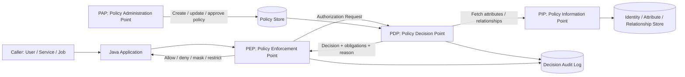
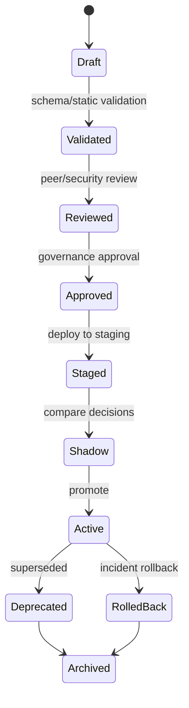
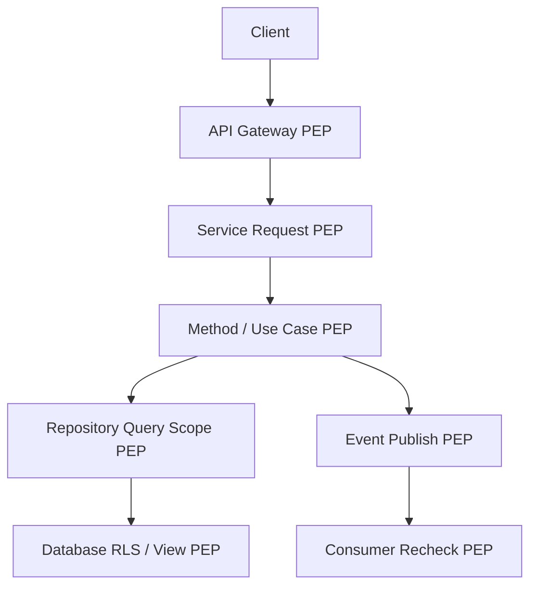

# PDP, PEP, PIP, PAP: Core Authorization Architecture

Part 003 memisahkan identity, authentication, principal, claim, scope, role, permission, entitlement, delegation, consent, license, feature flag, dan authorization decision.

Sekarang kita masuk ke arsitektur inti.

Authorization production-grade bukan sekadar fungsi:

```java
boolean allowed = user.hasRole("ADMIN");
```

Ia lebih tepat dianggap sebagai sistem decision + enforcement:

```text
PEP asks.
PDP decides.
PIP supplies facts.
PAP manages policies.
PEP enforces.
Audit records evidence.
```

Model ini populer dalam arsitektur policy-based access control dan distandarkan dalam terminologi XACML. Meskipun kita tidak harus memakai XACML, vocabulary PDP/PEP/PIP/PAP sangat berguna untuk mendesain authorization yang bersih di Java.

---

## 1. Big Picture



Komponen:

| Component | Responsibility | Tidak Boleh Menjadi |
|---|---|---|
| PEP | intercept dan enforce decision | tempat business policy tersebar |
| PDP | evaluate policy dan menghasilkan decision | data source raksasa tanpa boundary |
| PIP | menyediakan attribute/context/relationship | policy authoring UI |
| PAP | administrasi policy lifecycle | runtime hot path decision evaluator |
| Policy Store | menyimpan policy versioned | tempat menyimpan semua domain data |
| Audit | evidence decision | debug log informal |

Core invariant:

```text
PEP enforces; PDP decides; PIP informs; PAP administers.
```

---

## 2. Kenapa Perlu Arsitektur Ini?

Pada sistem kecil, authorization sering dimulai seperti ini:

```java
if (!currentUser.isAdmin()) {
    throw new AccessDeniedException();
}
```

Lalu domain tumbuh:

```java
if (!currentUser.isAdmin()
        && !currentUser.id().equals(case.assigneeId())
        && !currentUser.department().equals(case.department())
        && !case.status().equals("DRAFT")) {
    throw new AccessDeniedException();
}
```

Kemudian logic tersebar di controller, service, repository, mapper, UI, async worker, dan SQL query. Setelah beberapa bulan:

- tidak jelas policy sebenarnya apa;
- sulit membuktikan compliance;
- sulit melakukan access review;
- tidak ada reason code;
- negative test kurang;
- policy berubah tapi kode tersebar;
- setiap team menginterpretasikan role berbeda;
- endpoint baru lupa object-level authorization;
- event consumer menjalankan action tanpa recheck;
- audit hanya berisi `403` tanpa konteks.

PDP/PEP/PIP/PAP memaksa pemisahan tanggung jawab.

---

## 3. PEP: Policy Enforcement Point

PEP adalah tempat request dicegat dan keputusan diterapkan.

PEP tidak harus satu komponen. Dalam Java system, PEP bisa muncul di:

- API gateway;
- servlet filter;
- Spring Security filter chain;
- Spring `AuthorizationManager`;
- method security interceptor;
- JAX-RS `ContainerRequestFilter`;
- CDI/Spring AOP interceptor;
- application service guard;
- repository query scope;
- database row-level security;
- GraphQL resolver;
- Kafka consumer;
- scheduled job;
- export/report generator;
- file download handler.

### PEP responsibilities

PEP harus:

1. mengumpulkan request minimum untuk authorization;
2. memanggil PDP atau local policy evaluator;
3. menafsirkan decision effect;
4. fail closed untuk deny/not-applicable/error;
5. menerapkan obligations;
6. tidak membocorkan resource existence jika policy mengharuskan concealment;
7. mencatat audit evidence;
8. mencegah domain action berjalan saat denied.

PEP tidak boleh:

- mengarang policy sendiri secara tersebar;
- mengabaikan PDP error lalu allow;
- hanya mengandalkan UI hiding;
- hanya mengecek role/scope untuk object access;
- menjalankan mutation sebelum authorization;
- melakukan authorization setelah side effect.

### PEP example: application service guard

```java
public final class AuthorizationGuard {
    private final AuthorizationService authorizationService;
    private final AuthorizationAuditSink auditSink;

    public void requireAllowed(AuthorizationRequest request) {
        AuthorizationDecision decision = authorizationService.decide(request);
        auditSink.record(request, decision);

        if (decision.effect() != DecisionEffect.ALLOW) {
            throw AccessDenied.forReason(decision.reasonCode());
        }
    }
}
```

Use:

```java
public void assignCase(String caseId, String officerId) {
    CaseAssignmentView view = caseRepository.getAssignmentView(caseId);

    authorizationGuard.requireAllowed(
            AuthorizationRequest.builder()
                    .subject(subjectResolver.currentSubject())
                    .action("case.assign")
                    .resource(ResourceRef.of("case", caseId))
                    .context(Map.of(
                            "caseTenantId", view.tenantId(),
                            "caseStatus", view.status(),
                            "targetOfficerId", officerId,
                            "caseRegion", view.region()
                    ))
                    .build()
    );

    caseAssignmentService.assign(caseId, officerId);
}
```

Guard ini adalah PEP eksplisit.

---

## 4. PDP: Policy Decision Point

PDP adalah komponen yang mengevaluasi policy dan menghasilkan decision.

PDP menerima:

```text
subject
action
resource
context
policy version / environment
```

PDP mengembalikan:

```text
effect: allow/deny/not_applicable/indeterminate
reason code
matched policy/rules
obligations
advice
cacheability
policy version
decision id
```

### PDP interface Java

```java
public interface PolicyDecisionPoint {
    AuthorizationDecision decide(AuthorizationRequest request);
}
```

Decision:

```java
public record AuthorizationDecision(
        DecisionEffect effect,
        String reasonCode,
        String decisionId,
        String policyId,
        String policyVersion,
        List<String> matchedRules,
        List<Obligation> obligations,
        List<Advice> advice,
        DecisionCacheDirective cacheDirective
) {}

public enum DecisionEffect {
    ALLOW,
    DENY,
    NOT_APPLICABLE,
    INDETERMINATE
}

public record DecisionCacheDirective(
        boolean cacheable,
        Duration ttl,
        Set<String> invalidationKeys
) {}
```

### Boolean PDP is too weak

Buruk:

```java
boolean canApprove(User user, Case c);
```

Kenapa kurang:

- tidak ada reason code;
- tidak ada policy version;
- tidak bisa shadow evaluate;
- tidak bisa audit detail;
- tidak bisa obligations;
- tidak bisa distinguish deny vs missing data vs policy error;
- sulit observability.

Baik:

```java
AuthorizationDecision decide(AuthorizationRequest request);
```

---

## 5. PIP: Policy Information Point

PIP menyediakan fakta yang dibutuhkan PDP.

Fakta bisa berasal dari:

- identity directory;
- HR system;
- user profile;
- role store;
- entitlement store;
- relationship graph;
- organization hierarchy;
- tenant registry;
- resource metadata;
- classification registry;
- risk engine;
- device posture;
- location service;
- time service;
- workflow state;
- case assignment table;
- delegation store;
- consent store;
- license/subscription service.

### PIP design problem

Authorization sering gagal karena PIP tidak jelas.

Contoh policy:

```text
Supervisor may approve a case if assigned to the case and not the maker.
```

PDP butuh fakta:

```text
subject roles
case assignedSupervisorId
case submittedBy
case status
case tenantId
```

Pertanyaan engineering-nya:

```text
Siapa yang bertanggung jawab menyediakan fakta itu?
Apakah fakta itu harus preloaded oleh PEP?
Apakah PDP boleh fetch sendiri?
Apa freshness requirement-nya?
Apa yang terjadi kalau source unavailable?
Bolehkah attribute di-cache?
Bagaimana invalidation-nya?
```

### Two PIP patterns

#### Pattern A: PEP-assembled context

PEP mengumpulkan semua context lalu mengirim request lengkap ke PDP.

```java
AuthorizationRequest request = AuthorizationRequest.builder()
        .subject(subject)
        .action("case.approve")
        .resource(ResourceRef.of("case", caseId))
        .context(Map.of(
                "caseTenantId", caseView.tenantId(),
                "caseStatus", caseView.status(),
                "assignedSupervisorId", caseView.assignedSupervisorId(),
                "submittedBy", caseView.submittedBy()
        ))
        .build();
```

Cocok untuk:

- in-process PDP;
- resource attributes sudah tersedia;
- latency sensitif;
- policy sederhana/medium;
- ingin PDP pure function.

Risiko:

- PEP bisa lupa mengirim attribute;
- context contract harus ketat;
- duplikasi loading context di banyak endpoint.

#### Pattern B: PDP fetches through PIP

PEP hanya mengirim subject/action/resource, lalu PDP mengambil fakta dari PIP.

```java
AuthorizationDecision decision = pdp.decide(
        new AuthorizationRequest(subject, "case.approve", ResourceRef.of("case", caseId), Map.of())
);
```

PDP:

```java
CaseAuthorizationAttributes attrs = pip.caseAttributes(caseId);
```

Cocok untuk:

- centralized authorization service;
- policy kompleks;
- multiple applications share same PDP;
- ingin context loading konsisten.

Risiko:

- latency lebih tinggi;
- PDP coupling ke domain sources;
- availability PIP menjadi critical;
- cache invalidation lebih sulit;
- transaction consistency problem.

### Hybrid PIP

Production sering hybrid:

```text
PEP sends cheap, request-local facts.
PDP/PIP loads authoritative facts for high-risk attributes.
```

Contoh:

```text
PEP sends request IP and token assurance.
PDP loads active entitlements and case assignment from authoritative stores.
```

---

## 6. PAP: Policy Administration Point

PAP adalah tempat policy dibuat, direview, disetujui, dites, dan dipublikasikan.

PAP bisa berupa:

- admin UI;
- Git repository policy-as-code;
- database-backed policy management;
- IAM console;
- Cedar/AVP policy store;
- OPA bundle build pipeline;
- internal governance workflow;
- approval system untuk access policy changes.

### PAP responsibilities

PAP harus mendukung:

1. policy authoring;
2. validation;
3. versioning;
4. review/approval;
5. test cases;
6. diff impact analysis;
7. dry-run/shadow mode;
8. rollback;
9. deployment promotion;
10. audit trail policy changes.

### Policy lifecycle



Policy tanpa lifecycle akan menjadi konfigurasi liar.

---

## 7. Authorization Request Contract

Contract request harus stabil. Ini contoh yang cukup production-grade untuk Java.

```java
public record AuthorizationRequest(
        String requestId,
        AuthorizationSubject subject,
        String action,
        ResourceRef resource,
        Map<String, Object> context,
        Instant requestedAt,
        String environment,
        String correlationId
) {}

public record AuthorizationSubject(
        String subjectId,
        SubjectType subjectType,
        String tenantId,
        Set<String> roles,
        Set<String> permissions,
        Map<String, Object> attributes,
        ActingContext actingContext
) {}

public record ResourceRef(
        String type,
        String id,
        Optional<String> tenantId
) {}

public record ActingContext(
        String actorSubjectId,
        String effectiveSubjectId,
        Optional<String> delegationId,
        DelegationMode mode
) {}
```

### Request design rules

1. `action` harus domain capability, bukan endpoint mentah.
2. `resource.type` harus eksplisit.
3. `resource.id` harus stable identifier.
4. `tenantId` jangan hanya dari token; cocokan dengan resource.
5. `context` harus typed atau divalidasi.
6. `requestId` harus unik untuk audit correlation.
7. `requestedAt` sebaiknya server-side time.
8. `environment` membantu policy berbeda staging/prod jika perlu.
9. Delegation harus eksplisit.
10. Jangan masukkan secrets ke context.

### Typed context lebih baik daripada Map bebas

Map fleksibel tetapi rawan typo.

```java
public record CaseApprovalContext(
        String caseTenantId,
        CaseStatus caseStatus,
        String assignedSupervisorId,
        String submittedBy,
        int subjectClearance,
        int requiredClearance,
        boolean conflictOfInterest
) {}
```

Bisa dibungkus:

```java
public sealed interface AuthorizationContext
        permits CaseApprovalContext, CaseReadContext, ReportExportContext {}
```

Typed context memberi:

- compile-time safety;
- testability;
- IDE navigation;
- schema-like contract;
- easier refactoring.

Untuk external PDP seperti OPA/Cedar, typed context bisa dikonversi ke JSON.

---

## 8. Decision Contract

Decision harus cukup kaya untuk enforcement dan audit.

```java
public record AuthorizationDecision(
        DecisionEffect effect,
        String reasonCode,
        String messageKey,
        String policyId,
        String policyVersion,
        List<String> matchedRules,
        List<Obligation> obligations,
        List<Advice> advice,
        DecisionDiagnostics diagnostics,
        DecisionCacheDirective cacheDirective
) {
    public boolean allowed() {
        return effect == DecisionEffect.ALLOW;
    }
}
```

### Reason code

Gunakan reason code stabil, bukan free-text.

```text
ALLOWED_BY_CASE_SUPERVISOR_POLICY
DENIED_MISSING_PERMISSION
DENIED_TENANT_MISMATCH
DENIED_INVALID_WORKFLOW_STATE
DENIED_NOT_ASSIGNED_SUPERVISOR
DENIED_MAKER_CHECKER_VIOLATION
DENIED_INSUFFICIENT_CLEARANCE
DENIED_POLICY_NOT_APPLICABLE
DENIED_ATTRIBUTE_UNAVAILABLE
DENIED_PDP_TIMEOUT
```

Reason code dipakai untuk:

- audit;
- metrics;
- tests;
- incident analysis;
- UI error mapping;
- compliance evidence;
- policy diff.

### Obligations vs advice

Obligation adalah instruksi yang harus dipatuhi PEP agar allow valid.

Contoh obligations:

```text
MASK_FIELD: nationalId
REDACT_FIELD: internalInvestigatorNote
LIMIT_RESULT_TO: assigned_cases_only
REQUIRE_MFA_STEP_UP
WATERMARK_EXPORT
LOG_HIGH_RISK_ACCESS
```

Advice adalah rekomendasi non-mandatory.

```text
SHOW_WARNING: high-risk case access
SUGGEST_REASON_CAPTURE
```

Java model:

```java
public record Obligation(
        String type,
        Map<String, Object> parameters
) {}

public record Advice(
        String type,
        Map<String, Object> parameters
) {}
```

PEP invariant:

```text
If PEP cannot satisfy an obligation, it must deny or fail closed.
```

---

## 9. Local PDP vs Remote PDP vs Sidecar PDP

### Option A: In-process PDP

Policy evaluator berjalan di aplikasi Java.

```text
Java app -> local AuthorizationService -> allow/deny
```

Pros:

- latency rendah;
- mudah transactional context;
- type-safe;
- simple deployment;
- no network dependency.

Cons:

- policy tersebar per service;
- governance lebih sulit;
- policy update butuh deploy;
- consistency antar service sulit;
- audit consolidation perlu effort.

Cocok untuk:

- monolith/modular monolith;
- domain policy sangat dekat dengan code;
- early-stage architecture;
- high-performance local checks.

### Option B: Central remote PDP

```text
Java app -> Authorization Service/PDP -> allow/deny
```

Pros:

- centralized governance;
- consistent policy;
- easier audit;
- policy update independen dari app deploy;
- multi-service reuse.

Cons:

- network latency;
- availability dependency;
- context serialization;
- PIP coupling;
- harder transaction consistency;
- needs caching and resilience strategy.

Cocok untuk:

- enterprise multi-service;
- compliance-heavy authorization;
- cross-application policy;
- security team policy ownership.

### Option C: Sidecar PDP

```text
Java app -> localhost PDP sidecar -> allow/deny
sidecar receives policy bundles
```

Pros:

- low network latency compared to remote;
- policy externalized;
- service-local availability;
- works well with OPA-style deployment;
- policy bundle distribution.

Cons:

- operational complexity;
- sidecar version management;
- bundle sync consistency;
- local cache staleness;
- extra container/process.

Cocok untuk:

- Kubernetes microservices;
- OPA/Rego policy;
- platform-managed policy distribution;
- service mesh style architecture.

### Decision matrix

| Criterion | In-process | Remote PDP | Sidecar PDP |
|---|---:|---:|---:|
| Latency | best | variable | good |
| Central governance | weak-medium | strong | strong |
| Deployment simplicity | best | medium | complex |
| Policy update without app deploy | weak | strong | strong |
| Type safety | strong | medium | medium |
| Cross-service consistency | weak | strong | medium-strong |
| Availability dependency | app-local | network service | local sidecar |
| Operational burden | low | medium | high |

Tidak ada pilihan universal. Pilihan benar bergantung pada domain, latency, governance, dan failure tolerance.

---

## 10. Spring Security as PEP

Spring Security modern memakai `AuthorizationManager` untuk request-based, method-based, dan message-based authorization.

Contoh request-level outer gate:

```java
@Bean
SecurityFilterChain securityFilterChain(HttpSecurity http) throws Exception {
    return http
            .authorizeHttpRequests(auth -> auth
                    .requestMatchers(HttpMethod.GET, "/api/cases/**")
                    .hasAuthority("SCOPE_case.read")
                    .requestMatchers(HttpMethod.POST, "/api/cases/*/approve")
                    .hasAuthority("SCOPE_case.write")
                    .anyRequest().authenticated()
            )
            .oauth2ResourceServer(oauth -> oauth.jwt(Customizer.withDefaults()))
            .build();
}
```

Ini PEP untuk coarse API boundary. Tetapi object-level authorization tetap perlu di service/resource method.

### Custom AuthorizationManager

```java
public final class CaseResourceAuthorizationManager
        implements AuthorizationManager<RequestAuthorizationContext> {

    private final AuthorizationService authorizationService;
    private final SubjectResolver subjectResolver;

    @Override
    public AuthorizationDecision check(
            Supplier<Authentication> authentication,
            RequestAuthorizationContext context
    ) {
        String caseId = context.getVariables().get("caseId");
        AuthorizationSubject subject = subjectResolver.from(authentication.get());

        com.example.security.authorization.AuthorizationDecision decision =
                authorizationService.decide(
                        AuthorizationRequest.builder()
                                .subject(subject)
                                .action("case.read")
                                .resource(ResourceRef.of("case", caseId))
                                .context(Map.of("source", "http-request"))
                                .build()
                );

        return new AuthorizationDecision(decision.effect() == DecisionEffect.ALLOW);
    }
}
```

Note: nama `AuthorizationDecision` Spring bisa berbenturan dengan domain decision sendiri. Di real code, pakai package naming jelas atau adapter.

### Spring method PEP

```java
@PreAuthorize("@caseAuthz.canApprove(authentication, #caseId)")
public void approveCase(String caseId, ApproveCaseCommand command) {
    caseApplicationService.approve(caseId, command);
}
```

Bean guard:

```java
@Component("caseAuthz")
public final class CaseAuthorizationBean {
    private final AuthorizationGuard authorizationGuard;
    private final SubjectResolver subjectResolver;
    private final CaseRepository caseRepository;

    public boolean canApprove(Authentication authentication, String caseId) {
        AuthorizationSubject subject = subjectResolver.from(authentication);
        CaseApprovalView view = caseRepository.getApprovalView(caseId);

        AuthorizationRequest request = AuthorizationRequest.builder()
                .subject(subject)
                .action("case.approve")
                .resource(ResourceRef.of("case", caseId))
                .context(CaseApprovalContextMapper.toMap(view, subject))
                .build();

        return authorizationGuard.isAllowed(request);
    }
}
```

Caution:

```text
Method security is a PEP, not a replacement for clean policy design.
```

---

## 11. JAX-RS/Jakarta PEP

Untuk JAX-RS/Jersey, PEP umum adalah `ContainerRequestFilter`.

### Annotation

```java
@NameBinding
@Retention(RetentionPolicy.RUNTIME)
@Target({ElementType.TYPE, ElementType.METHOD})
public @interface RequiresPermission {
    String action();
    String resourceType();
    String pathParam() default "id";
}
```

### Resource method

```java
@Path("/cases")
public class CaseResource {

    @GET
    @Path("/{caseId}")
    @RequiresPermission(
            action = "case.read",
            resourceType = "case",
            pathParam = "caseId"
    )
    public CaseDto getCase(@PathParam("caseId") String caseId) {
        return caseQueryService.getCase(caseId);
    }
}
```

### Filter

```java
@Provider
@RequiresPermission(action = "", resourceType = "")
@Priority(Priorities.AUTHORIZATION)
public final class AuthorizationFilter implements ContainerRequestFilter {
    @Context
    private ResourceInfo resourceInfo;

    @Context
    private SecurityContext securityContext;

    private final AuthorizationService authorizationService;
    private final SubjectResolver subjectResolver;

    @Override
    public void filter(ContainerRequestContext requestContext) {
        RequiresPermission annotation = findAnnotation(resourceInfo);
        if (annotation == null) {
            return;
        }

        String resourceId = extractPathParam(requestContext, annotation.pathParam());
        AuthorizationSubject subject = subjectResolver.from(securityContext.getUserPrincipal());

        AuthorizationRequest request = AuthorizationRequest.builder()
                .subject(subject)
                .action(annotation.action())
                .resource(ResourceRef.of(annotation.resourceType(), resourceId))
                .context(Map.of(
                        "httpMethod", requestContext.getMethod(),
                        "path", requestContext.getUriInfo().getPath()
                ))
                .build();

        AuthorizationDecision decision = authorizationService.decide(request);
        if (decision.effect() != DecisionEffect.ALLOW) {
            requestContext.abortWith(Response.status(Response.Status.FORBIDDEN).build());
        }
    }
}
```

Filter-level PEP baik untuk coarse per-resource check. Untuk workflow state, field-level, atau query scoping, service/repository PEP tetap dibutuhkan.

---

## 12. Repository PEP: Query Scoping

Object-level read sering lebih aman dilakukan dengan query scoping.

Buruk:

```java
Case c = caseRepository.findById(caseId)
        .orElseThrow(NotFoundException::new);
authorizationGuard.requireAllowed("case.read", c);
return mapper.toDto(c);
```

Masalah: object sudah diload sebelum authorization. Bisa acceptable di beberapa domain, tetapi untuk list/search/bulk endpoint tidak scalable dan rawan leak.

Lebih baik untuk read:

```java
Optional<Case> findVisibleCase(String caseId, String subjectId, String tenantId);
```

SQL:

```sql
select c.*
from cases c
left join case_assignments a
  on a.case_id = c.id
where c.id = :caseId
  and c.tenant_id = :tenantId
  and (
    c.owner_id = :subjectId
    or a.assignee_id = :subjectId
    or exists (
      select 1
      from subject_permissions p
      where p.subject_id = :subjectId
        and p.permission = 'case.read_all_in_tenant'
        and p.tenant_id = c.tenant_id
    )
  )
```

Repository PEP tidak menggantikan PDP, tetapi untuk data visibility ia bisa menjadi enforcement by construction.

---

## 13. Database as PEP

Database bisa menjadi enforcement layer:

- row-level security;
- views;
- stored procedures;
- tenant predicates;
- column masking;
- separate schemas;
- database roles.

Keuntungan:

- dekat dengan data;
- sulit dibypass oleh aplikasi jika semua access lewat constrained interface;
- bagus untuk reporting/query-heavy systems.

Risiko:

- policy tersembunyi di DB;
- sulit test end-to-end jika tidak disiplin;
- context propagation sulit;
- migration kompleks;
- business policy tersebar antara app dan DB.

Rule:

```text
Database PEP is excellent as defense-in-depth and query scoping, but must be documented as part of the authorization architecture.
```

---

## 14. Multi-PEP Architecture

Production system biasanya punya banyak PEP.



Prinsip:

```text
Outer PEP reduces attack surface.
Inner PEP protects domain invariants.
Data PEP protects visibility.
Async PEP protects delayed side effects.
```

Jangan mengandalkan satu PEP luar untuk semua hal. Gateway tidak tahu workflow state domain. UI tidak trusted. Controller tidak cukup untuk worker. Repository tidak cukup untuk transition rule.

---

## 15. Failure Semantics

Authorization architecture harus mendefinisikan perilaku saat gagal.

| Failure | Safe Behavior |
|---|---|
| PDP returns DENY | deny |
| PDP returns NOT_APPLICABLE | deny by default |
| PDP timeout | deny unless explicitly approved break-glass path |
| PIP unavailable | deny for high-risk action |
| attribute missing | deny or explicit unknown-handling rule |
| policy parse error | do not activate policy |
| obligation unsupported | deny |
| audit sink unavailable | depends on action risk; high-risk should fail closed |
| cache stale beyond TTL | refresh or deny |

### Fail-open vs fail-closed

Default:

```text
Authorization must fail closed.
```

Exceptional cases:

- emergency healthcare access;
- life-safety system;
- public read endpoint;
- operational break-glass.

Even then, fail-open must be explicit, bounded, audited, and reviewed.

```java
if (decision.effect() == DecisionEffect.INDETERMINATE) {
    if (breakGlassPolicy.mayProceed(request)) {
        auditSink.recordBreakGlass(request, decision);
        return;
    }
    throw AccessDenied.forReason("DENIED_AUTHORIZATION_INDETERMINATE");
}
```

---

## 16. Caching Decisions

Authorization caching is dangerous if naive.

Bad cache key:

```text
subjectId + action
```

Why bad:

```text
case.read for case A != case.read for case B
case.approve when status=PENDING != when status=CLOSED
subject role now != subject role after revocation
```

Better cache key:

```text
subjectId
action
resourceType
resourceId
resourceVersion/contextVersion
policyVersion
entitlementVersion
relationshipVersion
```

Example:

```java
public record AuthorizationCacheKey(
        String subjectId,
        String action,
        String resourceType,
        String resourceId,
        String resourceVersion,
        String policyVersion,
        String entitlementVersion
) {}
```

Cache only if:

- decision is explicitly cacheable;
- TTL is short and risk-appropriate;
- invalidation keys are known;
- decision does not depend on rapidly changing context;
- deny caching does not create bad UX after grant;
- allow caching does not violate revocation requirement.

Rule:

```text
Do not cache high-risk write decisions unless the policy owner explicitly accepts the revocation delay.
```

---

## 17. Audit Architecture

Authorization audit should record decision evidence, not just denial.

Minimum:

```json
{
  "decisionId": "dec_01J...",
  "timestamp": "2026-07-03T10:15:30Z",
  "subjectId": "usr_123",
  "actorSubjectId": "usr_456",
  "action": "case.approve",
  "resourceType": "case",
  "resourceId": "CASE-2026-0042",
  "tenantId": "fsa",
  "effect": "DENY",
  "reasonCode": "DENIED_MAKER_CHECKER_VIOLATION",
  "policyId": "case-approval-policy",
  "policyVersion": "2026.07.03",
  "correlationId": "req_abc",
  "obligations": []
}
```

Do not log:

- secrets;
- full JWT;
- passwords;
- sensitive evidence content;
- unnecessary PII;
- raw documents.

Log enough for:

- incident investigation;
- access review;
- compliance evidence;
- policy debugging;
- anomaly detection;
- regression analysis.

---

## 18. Policy as Code Mapping

The same architecture maps well to OPA, Cedar, and custom Java policy.

### OPA-style

```text
PEP: Java service
PDP: OPA sidecar/server
PIP: input + OPA data bundle + external data fetch if used
PAP: GitOps policy repo + bundle build pipeline
Policy store: bundle registry
```

Java PEP sends JSON:

```json
{
  "input": {
    "subject": {
      "id": "usr_123",
      "roles": ["CASE_SUPERVISOR"],
      "tenant": "fsa"
    },
    "action": "case.approve",
    "resource": {
      "type": "case",
      "id": "CASE-2026-0042"
    },
    "context": {
      "caseStatus": "PENDING_SUPERVISOR_APPROVAL",
      "assignedSupervisorId": "usr_123",
      "submittedBy": "usr_999"
    }
  }
}
```

### Cedar-style

Cedar authorization request uses principal, action, resource, and context.

```text
principal: User::"usr_123"
action: Action::"case.approve"
resource: Case::"CASE-2026-0042"
context: { caseStatus: "PENDING_SUPERVISOR_APPROVAL" }
```

Mapping:

```text
PEP: Java application
PDP: Cedar engine / Amazon Verified Permissions
PIP: entities/context provider
PAP: policy store/admin workflow
```

### Custom Java policy

```text
PEP: guard/interceptor/filter
PDP: AuthorizationService + PolicyEvaluator
PIP: repositories/services
PAP: admin UI or Git-managed rules
```

Custom Java is valid. Externalized policy is not automatically better. It becomes better when governance, reuse, audit, and independent policy lifecycle justify the complexity.

---

## 19. Policy Conflict Handling

If multiple policies apply, define combining semantics.

Common options:

| Combining Rule | Meaning | Use Case |
|---|---|---|
| Deny overrides | any deny wins | high security/compliance |
| Allow overrides | any allow wins | permissive sharing, lower risk |
| First applicable | ordered policy list | firewall-like systems |
| Most specific wins | resource/user specific beats generic | enterprise exception model |
| Priority-based | explicit policy priority | admin-managed policy store |

Recommended default:

```text
Explicit deny overrides allow.
No applicable allow means deny.
```

Example:

```java
public AuthorizationDecision combine(List<AuthorizationDecision> decisions) {
    Optional<AuthorizationDecision> explicitDeny = decisions.stream()
            .filter(d -> d.effect() == DecisionEffect.DENY)
            .findFirst();

    if (explicitDeny.isPresent()) {
        return explicitDeny.get();
    }

    Optional<AuthorizationDecision> allow = decisions.stream()
            .filter(d -> d.effect() == DecisionEffect.ALLOW)
            .findFirst();

    return allow.orElseGet(() -> deny("DENIED_NO_APPLICABLE_POLICY"));
}
```

Be careful: some systems distinguish `implicit deny` and `explicit deny`. Use reason codes.

---

## 20. Testing PDP/PEP/PIP/PAP

### PEP tests

Test that PEP actually blocks side effects.

```java
@Test
void deniedDecisionPreventsCaseApproval() {
    when(authorizationService.decide(any()))
            .thenReturn(Decision.deny("DENIED_TEST"));

    assertThrows(AccessDeniedException.class,
            () -> service.approveCase("CASE-1", command));

    verify(caseRepository, never()).approve(any(), any(), any());
}
```

### PDP tests

Test policy truth table.

```java
@ParameterizedTest
@MethodSource("caseApprovalScenarios")
void evaluatesCaseApprovalPolicy(CaseApprovalScenario s) {
    AuthorizationDecision decision = policy.evaluate(s.request());
    assertThat(decision.effect()).isEqualTo(s.expectedEffect());
    assertThat(decision.reasonCode()).isEqualTo(s.expectedReason());
}
```

### PIP tests

Test attribute correctness and freshness.

```java
@Test
void loadsAssignmentFromAuthoritativeCaseTable() {
    CaseAuthorizationAttributes attrs = pip.caseAttributes("CASE-1");
    assertThat(attrs.assignedSupervisorId()).isEqualTo("usr_123");
}
```

### PAP tests

Policy deployment tests:

- schema validation;
- static validation;
- golden decision tests;
- backward compatibility tests;
- deny-by-default tests;
- shadow comparison;
- policy diff.

---

## 21. Observability

Metrics:

```text
authz_decision_total{effect, action, resource_type, reason_code}
authz_decision_latency_ms{pdp_mode, action}
authz_pip_latency_ms{source}
authz_pdp_error_total{error_type}
authz_obligation_unsupported_total{obligation_type}
authz_cache_hit_total{decision_type}
authz_policy_version_active{policy_id, version}
```

Logs:

```text
structured, reason-coded, correlation-aware, redacted
```

Traces:

```text
HTTP request span
  authorization decision span
    PIP identity span
    PIP entitlement span
    PIP resource span
  domain action span
```

Alert examples:

- sudden spike in `DENIED_TENANT_MISMATCH`;
- PDP timeout rate above threshold;
- policy version mismatch across services;
- unsupported obligation detected;
- allow rate unusually high after policy deploy;
- decision latency above SLA.

---

## 22. Anti-Patterns

### 22.1 PEP spread as random `if`

```java
if (user.isAdmin()) { ... }
if (roles.contains("SUPERVISOR")) { ... }
if (tenant.equals(case.tenant())) { ... }
```

Fix: central guard + policy evaluator + tests.

### 22.2 PDP without reason codes

```java
return false;
```

Fix: return `DENIED_TENANT_MISMATCH`, `DENIED_MISSING_PERMISSION`, etc.

### 22.3 PIP fetches everything

PDP calls every downstream service for every request.

Fix: attribute minimization, typed context, caching, preloading, risk-tiered evaluation.

### 22.4 PAP as direct DB edit

Admin updates policy row manually in production.

Fix: versioned policy lifecycle, validation, review, deployment pipeline.

### 22.5 Gateway-only authorization

Gateway checks token scope, service trusts it for all object access.

Fix: gateway coarse gate + service object-level PEP.

### 22.6 Fail-open on PDP timeout

```java
catch (Exception e) {
    return true;
}
```

Fix: fail closed with explicit break-glass exception path.

### 22.7 No async PEP

Command authorized at API time, but delayed worker executes days later after permission revoked.

Fix: store authorization snapshot and/or recheck at execution time depending on domain.

---

## 23. Production Checklist

Architecture:

- [ ] PEP locations are documented.
- [ ] PDP responsibility is explicit.
- [ ] PIP attribute sources are identified.
- [ ] PAP lifecycle exists for policy changes.
- [ ] Decision contract includes reason code and policy version.
- [ ] Deny-by-default is enforced.
- [ ] NOT_APPLICABLE fails closed.
- [ ] INDETERMINATE fails closed unless break-glass.
- [ ] Obligations are supported or denied.
- [ ] Audit includes subject/action/resource/context/decision.

Implementation:

- [ ] Controller/resource methods do not rely only on UI or client claims.
- [ ] Service layer protects mutations.
- [ ] Query scoping protects list/search/read visibility.
- [ ] Async consumers recheck or use valid authorization snapshot.
- [ ] Cache keys include resource/context/policy version where needed.
- [ ] PIP calls have timeout and fallback semantics.
- [ ] Policy tests cover allow and deny.
- [ ] Metrics exist for decision effects and reason codes.

Governance:

- [ ] Policy changes are versioned.
- [ ] Policy changes require review.
- [ ] Policy deploy can rollback.
- [ ] Shadow evaluation exists for high-risk changes.
- [ ] Access review can map entitlements to effective permissions.

---

## 24. Mini Case Study: Regulatory Case Approval

Requirement:

```text
Only the assigned supervisor can approve a submitted enforcement case.
The supervisor must be in the same tenant and region.
The supervisor must not be the maker.
High-risk cases require senior clearance.
A delegated deputy may approve only if delegation is active and explicitly includes case.approve.
All denials and approvals must be auditable.
```

Architecture:

```mermaid
flowchart TD
    API[POST /cases/{id}/approve]
    API --> PEP1[HTTP Scope PEP]
    PEP1 --> Service[CaseApplicationService]
    Service --> PEP2[Domain Action PEP]
    PEP2 --> PDP[Case Authorization PDP]
    PDP --> PIP1[Identity/Role PIP]
    PDP --> PIP2[Entitlement PIP]
    PDP --> PIP3[Case Attribute PIP]
    PDP --> PIP4[Delegation PIP]
    PDP --> Decision[Decision]
    Decision --> Audit[Audit Log]
    Decision --> Service
    Service --> Domain[Approve Case Transition]
```

Request:

```json
{
  "subject": {
    "id": "usr_123",
    "tenantId": "fsa",
    "roles": ["CASE_SUPERVISOR"],
    "permissions": ["case.approve"]
  },
  "action": "case.approve",
  "resource": {
    "type": "case",
    "id": "CASE-2026-0042"
  },
  "context": {
    "caseTenantId": "fsa",
    "caseRegion": "JAKARTA",
    "caseStatus": "PENDING_SUPERVISOR_APPROVAL",
    "assignedSupervisorId": "usr_123",
    "submittedBy": "usr_999",
    "caseRisk": "HIGH",
    "subjectClearance": 4,
    "requiredClearance": 4,
    "delegationId": null
  }
}
```

Decision:

```json
{
  "effect": "ALLOW",
  "reasonCode": "ALLOWED_ASSIGNED_SUPERVISOR",
  "policyId": "case-approval-policy",
  "policyVersion": "2026.07.03",
  "matchedRules": ["same-tenant", "assigned-supervisor", "not-maker", "clearance-ok"],
  "obligations": [
    {
      "type": "LOG_HIGH_RISK_ACCESS",
      "parameters": {
        "risk": "HIGH"
      }
    }
  ]
}
```

If `submittedBy = usr_123`, decision becomes:

```json
{
  "effect": "DENY",
  "reasonCode": "DENIED_MAKER_CHECKER_VIOLATION",
  "policyId": "case-approval-policy",
  "policyVersion": "2026.07.03"
}
```

That is the difference between production-grade authorization and a role check.

---

## 25. Summary

PDP/PEP/PIP/PAP gives authorization a clean architecture.

PEP intercepts and enforces. PDP evaluates policy. PIP provides facts. PAP manages policy lifecycle. Decision contract carries effect, reason, policy version, obligations, and cache semantics. Audit turns decisions into evidence.

For Java systems, this architecture maps naturally to Spring Security, JAX-RS filters, method guards, application services, repositories, databases, workers, and external policy engines such as OPA or Cedar. The important point is not the tool. The important point is separation of responsibility.

When this boundary is clear, authorization becomes testable, auditable, explainable, and evolvable.

---

## References

- OASIS XACML 3.0 Core Specification — https://docs.oasis-open.org/xacml/3.0/xacml-3.0-core-spec-os-en.html
- OWASP Authorization Cheat Sheet — https://cheatsheetseries.owasp.org/cheatsheets/Authorization_Cheat_Sheet.html
- Spring Security Reference — Authorization Architecture — https://docs.spring.io/spring-security/reference/servlet/authorization/architecture.html
- NIST SP 800-162 — Guide to Attribute Based Access Control — https://csrc.nist.gov/pubs/sp/800/162/upd2/final
- Open Policy Agent — https://www.openpolicyagent.org/
- Cedar Policy Language — https://docs.cedarpolicy.com/
- Amazon Verified Permissions — https://docs.aws.amazon.com/verifiedpermissions/
