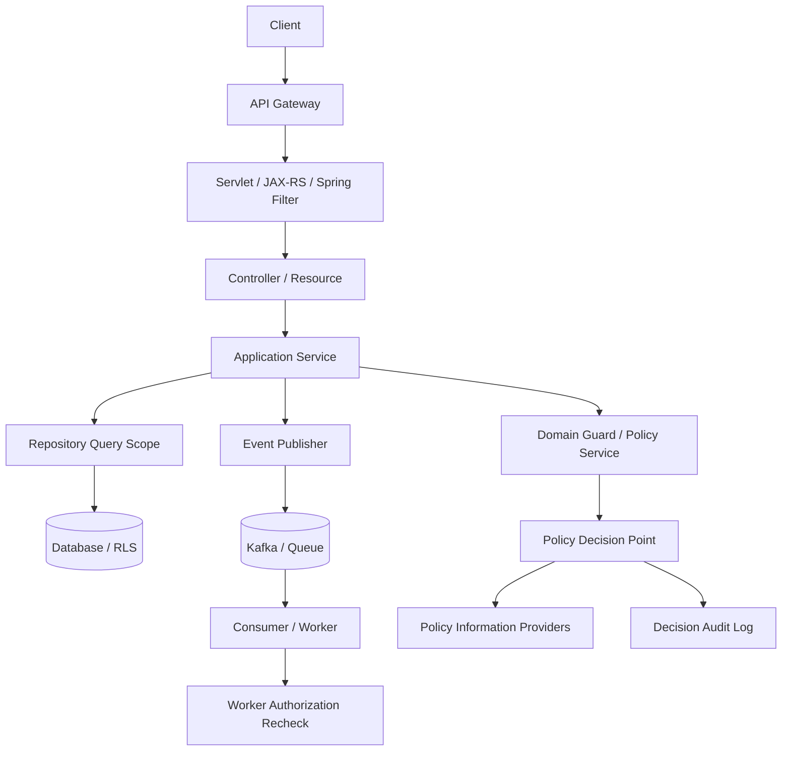
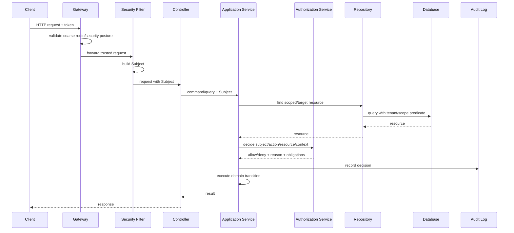
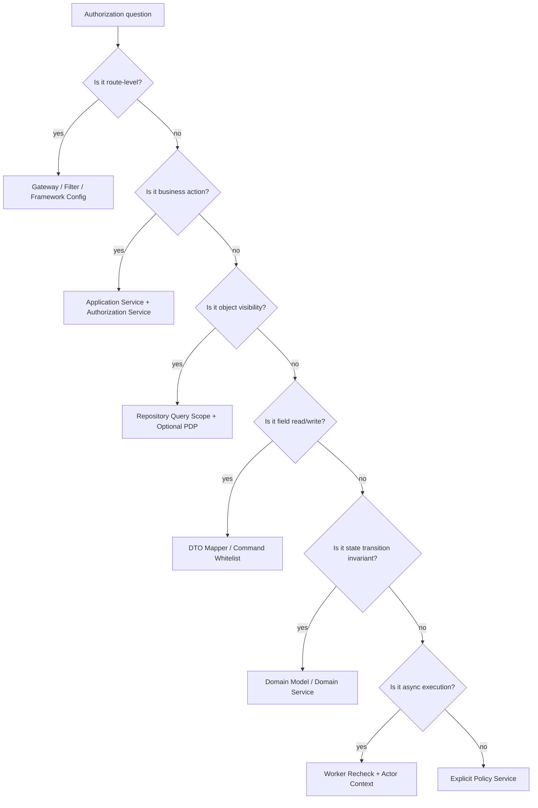

# Part 006 — Where Authorization Belongs in Java Applications

Pertanyaan paling sering dalam implementasi authorization:

> **Authorization sebaiknya ditaruh di mana? Gateway? Controller? Service? Repository? Database? Policy engine?**

Jawaban pendeknya: **di lebih dari satu tempat, tetapi dengan tanggung jawab yang berbeda.**

Jawaban panjangnya: authorization adalah decision + enforcement problem. Jika semua check ditaruh di controller, worker dan internal service bisa bypass. Jika semua check ditaruh di database, function-level dan workflow transition bisa hilang. Jika semua check ditaruh di gateway, object-level authorization hampir pasti tidak cukup karena gateway biasanya tidak punya domain object state. Jika semua check ditaruh di annotation, query/export/batch sering bocor.

Part ini membahas layering authorization dalam Java backend. Tujuannya adalah membangun arsitektur yang:

- tidak bergantung pada satu fragile guard;
- tidak menduplikasi policy secara liar;
- tetap perform di production;
- mudah dites;
- bisa diaudit;
- bisa berkembang dari monolith ke microservices;
- aman terhadap bypass path seperti async jobs, exports, dan internal calls.

---

## 1. Core Principle: Different Layers Enforce Different Questions

Authorization bukan satu pertanyaan. Ia rangkaian pertanyaan.

```text
Can this caller reach this route?
Can this caller perform this business action?
Can this caller access this specific object?
Can this caller see/write this field?
Can this caller transition this aggregate state?
Can this query return this data set?
Can this job still execute later?
```

Setiap layer cocok untuk pertanyaan tertentu.

| Layer | Pertanyaan yang Cocok | Pertanyaan yang Tidak Cocok |
|---|---|---|
| API Gateway | request authenticated? coarse route allowed? | object ownership, field masking |
| Servlet/JAX-RS Filter | request principal valid? route metadata? | deep domain state |
| Controller/Resource | request shape, route-level guard | complex business policy |
| Application Service | use-case/action authorization | SQL row filtering alone |
| Domain Model/Domain Service | state transition invariants | HTTP route concerns |
| Repository | object visibility/query scope | high-level business approval rules |
| Database/RLS | tenant isolation, row visibility | UX permission reason, workflow intent |
| Worker/Consumer | async execution authorization | initial user interaction only |
| Policy Engine | centralized decision | data fetching without PIP design |

Tidak ada satu layer yang cukup untuk semua.

---

## 2. Recommended Mental Model

Gunakan pembagian berikut:

```text
Coarse gate       -> boleh masuk route/use case?
Object scope      -> object/data mana yang boleh disentuh?
Domain invariant  -> action valid pada state/context ini?
Field policy      -> property mana yang boleh dibaca/ditulis?
Execution context -> sync/async/delegated/service call aman?
Audit trail       -> decision dapat dijelaskan?
```



---

## 3. Layer 1 — API Gateway Authorization

API gateway cocok untuk coarse-grained enforcement:

- reject unauthenticated traffic;
- validate token signature/introspection;
- enforce mTLS/service identity;
- block obvious route groups;
- protect admin routes from public internet;
- enforce rate limit per client/tenant;
- normalize identity headers for downstream;
- perform token exchange or actor propagation.

Gateway tidak cocok untuk fine-grained object authorization kecuali gateway punya domain-specific authorization plugin dan data access yang benar.

### Example Gateway Rule

```text
/admin/** requires authority route:admin
/api/internal/** requires service principal
/api/public/** permits anonymous
```

Ini berguna, tetapi tidak cukup.

```http
GET /api/orders/123
```

Gateway tahu path `/api/orders/{id}`. Gateway belum tentu tahu order `123` milik siapa, statusnya apa, tenant-nya apa, atau caller punya assignment apa.

### Gateway Anti-Pattern

```text
Because the gateway checks authorization, services trust all requests.
```

Ini berbahaya. Dalam microservices, service sering bisa dipanggil dari:

- internal service lain;
- async worker;
- test tool;
- admin job;
- misconfigured ingress;
- service mesh route;
- old endpoint;
- queue consumer.

Rule:

```text
Gateway authorization is a perimeter optimization, not the source of truth for domain authorization.
```

---

## 4. Layer 2 — Servlet Filter / Spring Security Filter / JAX-RS Filter

Filter adalah tempat bagus untuk membangun security context.

Tugas filter:

1. Extract token/session.
2. Validate authentication.
3. Build `Subject` or `Authentication`.
4. Attach trusted context to request.
5. Enforce simple route-level rule if metadata available.
6. Reject missing/invalid identity early.

### Spring Security Filter Chain

Spring Security modern menggunakan filter chain untuk request security dan `AuthorizationManager` untuk keputusan authorization request/method/message. Dalam servlet app, `AuthorizationFilter` berada di request pipeline dan menggunakan `AuthorizationManager` untuk menentukan akses.

Example:

```java
@Bean
SecurityFilterChain security(HttpSecurity http) throws Exception {
    http
        .authorizeHttpRequests(auth -> auth
            .requestMatchers("/health", "/public/**").permitAll()
            .requestMatchers("/admin/**").hasAuthority("route:admin")
            .anyRequest().authenticated()
        )
        .oauth2ResourceServer(oauth2 -> oauth2.jwt(Customizer.withDefaults()));

    return http.build();
}
```

Ini menjawab:

```text
Can this request reach this route group?
```

Belum menjawab:

```text
Can this user approve this exact case?
```

### Custom AuthorizationManager

```java
public final class TenantRouteAuthorizationManager
        implements AuthorizationManager<RequestAuthorizationContext> {

    private final TenantMembershipService membershipService;

    public TenantRouteAuthorizationManager(TenantMembershipService membershipService) {
        this.membershipService = membershipService;
    }

    @Override
    public AuthorizationDecision check(
        Supplier<Authentication> authentication,
        RequestAuthorizationContext context
    ) {
        Authentication auth = authentication.get();
        Subject subject = Subject.from(auth);
        String tenantId = context.getVariables().get("tenantId");

        boolean allowed = membershipService.isMember(subject.userId(), TenantId.of(tenantId));
        return new AuthorizationDecision(allowed);
    }
}
```

Use carefully. Route-level tenant check is useful, but object-level check still belongs deeper.

---

## 5. Layer 3 — Controller / Resource Method

Controller adalah adapter. Tugas utamanya:

- parse request;
- validate syntax;
- map authentication to `Subject`;
- call use case;
- map response;
- map errors.

Controller boleh melakukan simple guard, tetapi jangan menaruh seluruh domain authorization di controller.

### Thin Controller Pattern

```java
@RestController
@RequestMapping("/cases")
public class CaseController {

    private final CaseApplicationService caseService;
    private final SubjectResolver subjectResolver;

    @PostMapping("/{caseId}/approve")
    public ResponseEntity<CaseDto> approve(
        @PathVariable String caseId,
        Authentication authentication
    ) {
        Subject subject = subjectResolver.from(authentication);
        CaseDto result = caseService.approve(CaseId.of(caseId), subject);
        return ResponseEntity.ok(result);
    }
}
```

Controller tidak memutuskan siapa boleh approve. Ia meneruskan subject ke application service.

### Bad Controller Pattern

```java
@PostMapping("/{caseId}/approve")
public ResponseEntity<CaseDto> approve(@PathVariable String caseId, Authentication authentication) {
    if (!authentication.getAuthorities().contains(new SimpleGrantedAuthority("ROLE_SUPERVISOR"))) {
        throw new AccessDeniedException("forbidden");
    }

    CaseFile caze = caseRepository.findById(CaseId.of(caseId)).orElseThrow();
    caze.approve();
    caseRepository.save(caze);
    return ResponseEntity.ok(mapper.toDto(caze));
}
```

Masalah:

- role hardcoded;
- tidak cek tenant;
- tidak cek unit;
- tidak cek maker-checker;
- tidak cek status transition;
- controller bypassable oleh internal use case;
- sulit dites tanpa web layer.

---

## 6. Layer 4 — Application Service: The Best Default for Use-Case Authorization

Application service biasanya tempat terbaik untuk business action authorization.

Ia punya konteks:

- subject;
- command;
- target aggregate;
- transaction;
- repository;
- policy service;
- audit;
- event publishing.

### Pattern

```java
@Transactional
public CaseDto approve(CaseId caseId, Subject subject) {
    CaseFile caze = caseRepository.findByIdForUpdate(caseId)
        .orElseThrow(NotFoundException::new);

    ResourceRef resource = ResourceRef.caseFile(
        caze.id(),
        caze.tenantId(),
        caze.ownerUnitId(),
        caze.status(),
        caze.submittedBy()
    );

    authorization.require(
        subject,
        Action.CASE_APPROVE,
        resource,
        RequestContext.current()
    );

    caze.approveBy(subject.userId(), clock.instant());

    caseRepository.save(caze);
    audit.recordAuthorizationSuccess(subject, Action.CASE_APPROVE, resource);

    return caseMapper.toDto(caze, subject);
}
```

Kenapa di sini?

Karena approval bukan sekadar route access. Approval adalah use case dengan domain meaning.

### Application Service Rule

```text
Every command use case that mutates protected state must perform authorization inside the transaction boundary or immediately before the protected effect.
```

Kalau read + check + write dipisahkan terlalu jauh, policy bisa berubah atau object state bisa berubah.

---

## 7. Layer 5 — Domain Model and Domain Service

Domain layer bukan tempat membaca JWT atau Spring `Authentication`. Domain layer harus tetap framework-independent.

Tetapi domain layer boleh dan sering harus menegakkan domain invariant.

### Difference: Authorization vs Domain Invariant

Authorization:

```text
Is this subject allowed to approve this case?
```

Domain invariant:

```text
Can this case be approved from current state?
Can maker also be checker?
Can closed case be modified?
```

Kadang overlap. Jangan memaksa semua menjadi RBAC check.

### Domain Invariant Example

```java
public final class CaseFile {
    private CaseStatus status;
    private UserId submittedBy;
    private UserId approvedBy;

    public void approveBy(UserId approver, Instant approvedAt) {
        if (status != CaseStatus.SUBMITTED) {
            throw new InvalidCaseTransitionException("Only submitted case can be approved");
        }
        if (submittedBy.equals(approver)) {
            throw new SeparationOfDutiesViolation("Submitter cannot approve own case");
        }
        this.status = CaseStatus.APPROVED;
        this.approvedBy = approver;
    }
}
```

Application service still checks policy:

```java
authorization.require(subject, Action.CASE_APPROVE, resource, context);
caze.approveBy(subject.userId(), clock.instant());
```

Policy says whether subject has authority. Domain says whether action makes sense.

### Do Not Inject Security Framework Into Entity

Avoid:

```java
public void approve(Authentication authentication) { ... }
```

Better:

```java
public void approveBy(UserId approver, Instant approvedAt) { ... }
```

Domain should receive domain concepts, not web/security framework objects.

---

## 8. Layer 6 — Repository Query Scoping

Repository scoping is critical for reads, lists, search, exports, and detail fetches.

### Raw Repository Method

```java
Optional<CaseFile> findById(CaseId id);
```

This is dangerous if used from application code without guard.

### Scoped Repository Method

```java
Optional<CaseFile> findVisibleById(CaseId id, Subject subject);

Page<CaseFile> searchVisible(CaseSearchCriteria criteria, Subject subject, Pageable pageable);
```

Repository methods should make authorization visible in the API.

### Naming Convention

| Method Name | Meaning |
|---|---|
| `findById` | raw internal lookup, dangerous for protected resource |
| `findVisibleById` | applies read visibility scope |
| `findAssignableById` | applies assignment scope |
| `findMutableById` | applies write/mutation scope |
| `findForUpdateAuthorized` | locks and scopes inside transaction |
| `searchVisible` | applies list/search visibility |
| `exportVisible` | applies export-specific visibility |

### MyBatis Example

```xml
<select id="findVisibleCaseById" resultMap="CaseFileMap">
  select c.*
  from case_file c
  where c.id = #{caseId}
    and c.tenant_id = #{subject.tenantId}
    and (
      c.owner_user_id = #{subject.userId}
      or exists (
        select 1
        from case_assignment a
        where a.case_id = c.id
          and a.user_id = #{subject.userId}
      )
      or exists (
        select 1
        from unit_supervisor s
        where s.unit_id = c.owner_unit_id
          and s.user_id = #{subject.userId}
      )
    )
</select>
```

### JPA Specification Example

```java
public static Specification<CaseFileEntity> visibleTo(Subject subject) {
    return (root, query, cb) -> cb.and(
        cb.equal(root.get("tenantId"), subject.tenantId().value()),
        cb.or(
            cb.equal(root.get("ownerUserId"), subject.userId().value()),
            assignedTo(root, query, cb, subject),
            supervisedUnit(root, query, cb, subject)
        )
    );
}
```

Be careful with JPA Specifications. They can become unreadable and inconsistent. For high-risk queries, explicit SQL is often clearer.

---

## 9. Layer 7 — Database Enforcement and Row-Level Security

Database can enforce strong boundaries, especially tenant isolation.

PostgreSQL Row-Level Security can prevent accidental missing predicate, but it must be designed carefully.

### RLS Concept

```sql
alter table case_file enable row level security;

create policy tenant_isolation on case_file
using (tenant_id = current_setting('app.tenant_id')::uuid);
```

Before query:

```sql
set local app.tenant_id = '...';
```

Now even if application query forgets tenant predicate, database policy restricts rows.

### Java Transaction Setup

```java
@Transactional
public <T> T withTenant(TenantId tenantId, Supplier<T> work) {
    jdbcTemplate.update("select set_config('app.tenant_id', ?, true)", tenantId.value().toString());
    return work.get();
}
```

### RLS Benefits

- defense in depth;
- reduces missing tenant predicate incidents;
- protects reporting queries;
- protects ad hoc internal tools if configured correctly.

### RLS Risks

- session context leakage in connection pool;
- hard-to-debug empty results;
- superuser/bypass roles;
- policy performance;
- complex relationship checks can be expensive;
- not enough for workflow action authorization.

Rule:

```text
Database authorization is excellent for data isolation, but not sufficient for business action authorization.
```

---

## 10. Layer 8 — DTO Mapping and Field Authorization

Even if object access is allowed, field access may not be.

DTO mapper is an enforcement point.

### Avoid Entity Exposure

```java
@GetMapping("/cases/{id}")
public CaseFileEntity get(@PathVariable UUID id) {
    return repository.findById(id).orElseThrow();
}
```

This leaks whatever fields exist today and tomorrow.

### Policy-Aware Mapper

```java
public CaseDto toDto(CaseFile caze, Subject subject) {
    CaseResource resource = CaseResource.from(caze);

    return new CaseDto(
        caze.id().value(),
        caze.title(),
        caze.status().name(),
        visible(Action.CASE_READ_ASSIGNEE, subject, resource)
            ? caze.assignedInvestigator().map(UserId::value).orElse(null)
            : null,
        visible(Action.CASE_READ_RISK_SCORE, subject, resource)
            ? caze.riskScore().value()
            : null,
        visible(Action.CASE_READ_LEGAL_NOTES, subject, resource)
            ? caze.legalNotes().value()
            : "REDACTED"
    );
}

private boolean visible(Action action, Subject subject, CaseResource resource) {
    return authorization.decide(subject, action, resource, RequestContext.current()).allowed();
}
```

### Field Authorization Should Be Explicit

Avoid generic reflection magic for sensitive systems unless you have strong test coverage and explainability. It is usually better to be verbose and obvious.

---

## 11. Layer 9 — Event Publisher and Outbox

Authorization boundary does not end after database write. Events can leak data or trigger unauthorized effects.

### Bad Event

```java
publisher.publish(new CaseApprovedEvent(caze));
```

This may serialize too much.

### Better Event

```java
public record CaseApprovedEvent(
    CaseId caseId,
    TenantId tenantId,
    UserId approvedBy,
    Instant approvedAt,
    String authorizationDecisionId
) {}
```

Event should carry minimal necessary data. Subscribers should fetch what they are allowed to process.

### Outbox Pattern with Authorization Metadata

```java
outbox.save(new OutboxMessage(
    UUID.randomUUID(),
    "case.approved",
    json.serialize(new CaseApprovedEvent(
        caze.id(),
        caze.tenantId(),
        subject.userId(),
        clock.instant(),
        decision.id()
    )),
    caze.tenantId(),
    subject.userId(),
    decision.policyVersion()
));
```

Authorization metadata helps incident investigation.

---

## 12. Layer 10 — Worker / Consumer / Scheduler

Workers must not assume authorization already happened.

There are three cases:

### Case A — Worker Executes User-Requested Action

Example: export evidence requested by user.

Need actor context and often recheck.

```java
public void handle(ExportEvidenceRequested event) {
    Subject requester = subjectRepository.reconstruct(event.requestedBy(), event.tenantId());
    CaseFile caze = caseRepository.findById(event.caseId()).orElseThrow();

    authorization.require(
        requester,
        Action.EVIDENCE_EXPORT,
        ResourceRef.caseFile(caze),
        RequestContext.worker(event.requestId())
    );

    exporter.export(caze);
}
```

### Case B — Worker Executes System Action

Example: nightly risk recalculation.

Use service principal with limited purpose.

```java
Subject system = Subject.service("risk-scoring-worker", Set.of("risk:score:recalculate"));
```

Do not use omnipotent service account.

### Case C — Worker Reacts to Domain Event

Example: send notification after approval.

The worker may not need user authorization, but it must respect data visibility in notification payload.

```java
notificationService.sendCaseApprovedNotification(caze.id(), recipient);
```

Before sending details, check recipient visibility.

---

## 13. Layer 11 — Admin UI and Backoffice Tools

Backoffice tools are where authorization often gets weaker because they are “internal”. That assumption fails.

Admin systems need stronger controls:

- explicit admin permissions;
- scoped administration;
- just-in-time access;
- maker-checker for high-risk changes;
- audit trail;
- reason capture;
- break-glass workflow;
- entitlement review;
- no shared admin accounts.

### Admin Scope Example

Bad:

```java
if (subject.hasRole("ADMIN")) allow;
```

Better:

```text
allow if subject has USER_ROLE_GRANT
and subject.admin_scope contains target.tenant_id
and subject cannot grant permission higher than own grantable set
and subject is not modifying own privileged access
and change has approval when permission is high-risk
```

Admin is not one role. Admin is a set of constrained capabilities.

---

## 14. Policy Decision Placement

There are three major patterns.

### Pattern 1 — In-Process Authorization Service

```java
public final class DefaultAuthorizationService implements AuthorizationService {
    public Decision decide(Subject subject, Action action, ResourceRef resource, RequestContext context) {
        // Java policy logic
    }
}
```

Good for:

- monolith/modular monolith;
- low latency;
- simple deployment;
- type-safe domain policy.

Bad for:

- cross-service consistency;
- policy owned by security/governance team;
- dynamic policy changes;
- multi-language environments.

### Pattern 2 — External PDP

Java calls OPA/Cedar/custom PDP/OpenFGA.

Good for:

- centralized governance;
- policy-as-code;
- consistent multi-service enforcement;
- decision logging;
- complex authorization model.

Bad for:

- latency;
- availability dependency;
- input contract complexity;
- attribute fetching strategy.

### Pattern 3 — Hybrid

Common production pattern:

- route guard in framework;
- query scope in repository;
- Java domain invariant;
- external PDP for enterprise policy;
- relationship engine for ReBAC;
- database RLS for tenant isolation.

This is not overengineering if each layer has a narrow job.

---

## 15. Practical Layering Blueprint

For a Java service handling sensitive business resources:



Key detail: repository scoping may occur before PDP decision, because PDP often needs resource attributes. For high-risk writes, lock resource, decide, mutate, and commit in one transaction.

---

## 16. Read Path Layering

Example: view a case.

```text
GET /cases/{id}
```

Recommended flow:

1. Gateway validates token.
2. Filter builds subject.
3. Controller parses `caseId`.
4. Service calls `findVisibleById(caseId, subject)`.
5. If empty, return 404.
6. Mapper applies field-level redaction.
7. Audit read if sensitive.

```java
@Transactional(readOnly = true)
public CaseDto getCase(CaseId caseId, Subject subject) {
    CaseFile caze = caseRepository.findVisibleById(caseId, subject)
        .orElseThrow(NotFoundException::new);

    audit.recordRead(subject, Action.CASE_READ, ResourceRef.caseFile(caze));
    return caseMapper.toDto(caze, subject);
}
```

Notice there may not be a separate `authorization.require` if `findVisibleById` fully encodes read scope. But for explainability, you might still call PDP.

Trade-off:

- Query scoping is efficient and hides existence.
- PDP decision is explainable and consistent.
- Use both when risk justifies it.

---

## 17. Write Path Layering

Example: approve a case.

Recommended flow:

1. Gateway/filter authenticate.
2. Controller sends command + subject.
3. Service loads case with tenant boundary and lock.
4. Service calls authorization decision for `CASE_APPROVE`.
5. Domain validates transition and SoD invariant.
6. Save.
7. Audit decision and state change.
8. Publish minimal event.

```java
@Transactional
public CaseDto approve(CaseId caseId, Subject subject) {
    CaseFile caze = caseRepository.findByIdForUpdateWithinTenant(caseId, subject.tenantId())
        .orElseThrow(NotFoundException::new);

    ResourceRef resource = ResourceRef.caseFile(caze);

    Decision decision = authorization.decide(subject, Action.CASE_APPROVE, resource, RequestContext.current());
    if (decision.denied()) {
        audit.recordDenied(subject, Action.CASE_APPROVE, resource, decision);
        throw new AccessDeniedException("forbidden");
    }

    caze.approveBy(subject.userId(), clock.instant());
    caseRepository.save(caze);

    audit.recordAllowed(subject, Action.CASE_APPROVE, resource, decision);
    outbox.publish(CaseApprovedEvent.from(caze, subject, decision));

    return mapper.toDto(caze, subject);
}
```

---

## 18. List/Search Path Layering

List/search endpoints are not “just reads”. They are data discovery surfaces.

```java
@Transactional(readOnly = true)
public Page<CaseSummaryDto> search(CaseSearchRequest request, Subject subject, Pageable pageable) {
    CaseSearchCriteria criteria = CaseSearchCriteria.from(request);
    Page<CaseFile> cases = caseRepository.searchVisible(criteria, subject, pageable);
    return cases.map(caze -> summaryMapper.toDto(caze, subject));
}
```

### Dangerous Pattern

```java
Page<CaseFile> cases = caseRepository.search(criteria, pageable);
return cases.map(mapper::toDto);
```

If search returns unauthorized rows and mapper redacts fields, the mere presence of rows may leak sensitive existence. Scope first, redact second.

---

## 19. Export Path Layering

Export is usually higher risk than UI read.

User who can view one case in UI should not automatically export all evidence.

```java
@Transactional
public ExportJobId requestEvidenceExport(CaseId caseId, Subject subject, ExportReason reason) {
    CaseFile caze = caseRepository.findByIdWithinTenant(caseId, subject.tenantId())
        .orElseThrow(NotFoundException::new);

    Decision decision = authorization.decide(
        subject,
        Action.EVIDENCE_EXPORT,
        ResourceRef.caseFile(caze),
        RequestContext.current().withReason(reason.value())
    );

    if (decision.denied()) {
        audit.recordDenied(subject, Action.EVIDENCE_EXPORT, ResourceRef.caseFile(caze), decision);
        throw new AccessDeniedException("forbidden");
    }

    ExportJob job = ExportJob.create(caze.id(), subject.userId(), subject.tenantId(), decision.id(), reason);
    exportJobRepository.save(job);
    outbox.publish(new EvidenceExportRequested(job.id(), caze.id(), subject.userId(), subject.tenantId(), decision.id()));
    return job.id();
}
```

Export should usually require:

- specific export permission;
- reason capture;
- audit;
- async worker recheck;
- file expiration;
- recipient visibility check;
- watermarking or access log for sensitive documents.

---

## 20. Method Security: Useful but Not Enough

Spring `@PreAuthorize` is useful.

```java
@PreAuthorize("hasAuthority('case:approve')")
public CaseDto approve(CaseId caseId, Subject subject) { ... }
```

But it has limits:

- expression can become stringly-typed policy language;
- complex object loading inside expression is risky;
- proxy boundaries can surprise teams;
- self-invocation may bypass proxy-based method security;
- annotation does not automatically scope repository queries;
- annotation does not solve field-level redaction.

A good pattern is to use annotation for coarse function gate and explicit authorization service for object/domain decision.

```java
@PreAuthorize("hasAuthority('case:approve')")
@Transactional
public CaseDto approve(CaseId caseId, Subject subject) {
    CaseFile caze = caseRepository.findByIdForUpdateWithinTenant(caseId, subject.tenantId())
        .orElseThrow(NotFoundException::new);

    authorization.require(subject, Action.CASE_APPROVE, ResourceRef.caseFile(caze), context());
    caze.approveBy(subject.userId(), clock.instant());
    return mapper.toDto(caseRepository.save(caze), subject);
}
```

---

## 21. JAX-RS / Jersey Layering

For JAX-RS/Jersey, common enforcement points:

- `ContainerRequestFilter` for authentication and route-level auth;
- `DynamicFeature` for annotation-driven filters;
- CDI interceptor for method-level guards;
- explicit application service authorization for domain checks.

### Custom Annotation

```java
@Target({ElementType.METHOD, ElementType.TYPE})
@Retention(RetentionPolicy.RUNTIME)
public @interface RequiresPermission {
    String value();
}
```

### Filter

```java
@Provider
@Priority(Priorities.AUTHORIZATION)
public class PermissionFilter implements ContainerRequestFilter {

    @Context
    ResourceInfo resourceInfo;

    @Override
    public void filter(ContainerRequestContext requestContext) {
        RequiresPermission permission = resourceInfo.getResourceMethod()
            .getAnnotation(RequiresPermission.class);

        if (permission == null) {
            return;
        }

        Subject subject = (Subject) requestContext.getSecurityContext().getUserPrincipal();
        if (!subject.hasPermission(permission.value())) {
            throw new ForbiddenException();
        }
    }
}
```

This is route/function-level. Object-level still belongs deeper.

---

## 22. Layering Anti-Patterns

### Anti-Pattern 1 — Controller-Only Authorization

Symptoms:

- internal use cases bypass security;
- worker does not check authorization;
- tests focus on HTTP only;
- duplicate logic across controllers.

### Anti-Pattern 2 — Gateway-Only Authorization

Symptoms:

- services trust all internal calls;
- object-level bugs remain;
- route pattern rules become pseudo-policy;
- direct service invocation becomes critical incident.

### Anti-Pattern 3 — Repository-Only Authorization

Symptoms:

- action-level policy missing;
- write transitions under-protected;
- admin/action semantics hidden in SQL;
- hard to explain denial reason.

### Anti-Pattern 4 — Annotation-Only Authorization

Symptoms:

- string expressions grow complex;
- domain policy scattered;
- field-level rules missing;
- search/export bypass possible.

### Anti-Pattern 5 — Policy Engine Without Enforcement Discipline

Symptoms:

- PDP exists but many paths do not call it;
- input object inconsistent across services;
- decision not audited;
- fallback fail-open;
- PIP data stale or missing.

---

## 23. How to Choose the Right Layer

Use this decision guide.



---

## 24. Policy Duplication vs Defense in Depth

Layering can become duplication. The key is to separate responsibilities.

Bad duplication:

```text
Controller checks CASE_APPROVE with one rule.
Service checks CASE_APPROVE with different rule.
Repository checks partial rule.
```

Good defense in depth:

```text
Gateway: authenticated + route group.
Service: action policy.
Domain: transition invariant.
Repository: tenant/object visibility.
Mapper: field visibility.
Database: tenant isolation.
Worker: async recheck.
```

The rules are not duplicates because they answer different questions.

---

## 25. Recommended Package Structure

For a modular Java service:

```text
com.example.caseapp
  security/
    Subject.java
    SubjectResolver.java
    SecurityConfiguration.java
  authorization/
    Action.java
    AuthorizationRequest.java
    AuthorizationService.java
    Decision.java
    ResourceRef.java
    Obligation.java
    PolicyDecisionPoint.java
  casefile/
    api/
      CaseController.java
      CaseDto.java
      UpdateCaseRequest.java
    application/
      CaseApplicationService.java
      CaseAuthorizationFacade.java
    domain/
      CaseFile.java
      CaseStatus.java
      CasePolicyFacts.java
    infrastructure/
      CaseRepository.java
      JdbcCaseRepository.java
      CaseMapper.java
  audit/
    AuthorizationAuditLogger.java
  outbox/
    OutboxPublisher.java
```

Avoid mixing everything into `security` package. Authorization is cross-cutting, but domain-specific authorization belongs near the domain.

---

## 26. Minimal Production-Grade Authorization Service Contract

```java
public interface AuthorizationService {
    Decision decide(AuthorizationRequest request);

    default void require(AuthorizationRequest request) {
        Decision decision = decide(request);
        if (decision.denied()) {
            throw new AccessDeniedException(decision.safeMessage());
        }
    }
}
```

```java
public record AuthorizationRequest(
    Subject subject,
    Action action,
    ResourceRef resource,
    RequestContext context
) {}
```

```java
public record ResourceRef(
    ResourceType type,
    String id,
    TenantId tenantId,
    Map<String, Object> attributes
) {
    public static ResourceRef caseFile(CaseFile caze) {
        return new ResourceRef(
            ResourceType.CASE_FILE,
            caze.id().value(),
            caze.tenantId(),
            Map.of(
                "ownerUnitId", caze.ownerUnitId().value(),
                "status", caze.status().name(),
                "submittedBy", caze.submittedBy().value(),
                "classification", caze.classification().name()
            )
        );
    }
}
```

```java
public record Decision(
    DecisionId id,
    boolean allowed,
    String reasonCode,
    String policyId,
    int policyVersion,
    List<Obligation> obligations
) {
    public boolean denied() {
        return !allowed;
    }

    public String safeMessage() {
        return "forbidden";
    }
}
```

This contract is intentionally boring. Boring is good. It gives every layer the same language.

---

## 27. Testing Layered Authorization

Layering only works if tests cover each layer.

### Web Layer Test

```java
@Test
void adminRouteRequiresAdminAuthority() throws Exception {
    mockMvc.perform(get("/admin/users").with(jwt().authorities(new SimpleGrantedAuthority("user:read"))))
        .andExpect(status().isForbidden());
}
```

### Application Service Test

```java
@Test
void investigatorCannotApproveCase() {
    Subject investigator = subjects.investigator("tenant-a", "unit-1");
    CaseFile caze = fixtures.submittedCase("tenant-a", "unit-1");

    assertThatThrownBy(() -> service.approve(caze.id(), investigator))
        .isInstanceOf(AccessDeniedException.class);
}
```

### Repository Scope Test

```java
@Test
void searchVisibleDoesNotReturnOtherUnitCases() {
    Subject subject = subjects.investigator("tenant-a", "unit-1");
    fixtures.caseInUnit("tenant-a", "unit-1");
    fixtures.caseInUnit("tenant-a", "unit-2");

    Page<CaseFile> result = repository.searchVisible(CaseSearchCriteria.open(), subject, Pageable.unpaged());

    assertThat(result.getContent())
        .allSatisfy(caze -> assertThat(caze.ownerUnitId()).isEqualTo(UnitId.of("unit-1")));
}
```

### Mapper Redaction Test

```java
@Test
void riskScoreIsRedactedWithoutPermission() {
    Subject subject = subjects.investigator("tenant-a", "unit-1");
    CaseFile caze = fixtures.highRiskCase();

    CaseDto dto = mapper.toDto(caze, subject);

    assertThat(dto.riskScore()).isNull();
}
```

### Worker Test

```java
@Test
void exportWorkerRechecksAuthorization() {
    ExportEvidenceRequested event = fixtures.exportRequestedByRevokedUser();

    assertThatThrownBy(() -> worker.handle(event))
        .isInstanceOf(AccessDeniedException.class);
}
```

---

## 28. Operational Layering

Authorization is not only runtime code.

You also need:

- permission catalog;
- route inventory;
- resource inventory;
- access review process;
- policy versioning;
- decision logs;
- denied request monitoring;
- policy change approval;
- emergency override procedure;
- regression tests for high-risk actions.

Runtime layering without operational governance becomes permission drift.

---

## 29. Practical Review Checklist

When designing a Java endpoint, ask:

1. Is route access coarse-gated?
2. Is subject resolved from trusted context?
3. Is tenant context trusted and validated?
4. Is application service receiving subject explicitly?
5. Is object loaded through scoped query or checked after load?
6. Is business action authorized near the effect?
7. Is domain transition invariant enforced?
8. Are response fields redacted?
9. Are writable fields whitelisted?
10. Are list/search/export paths scoped?
11. Are async jobs carrying actor context?
12. Does worker recheck high-risk actions?
13. Is decision audited with reason/policy version?
14. Does failure fail closed for high-risk actions?
15. Are tests written at web/service/repository/mapper/worker layers?

---

## 30. What to Remember

Authorization belongs where the relevant facts exist.

- Gateway knows route and token, not domain object.
- Filter knows request and principal, not full business state.
- Controller knows request shape, not full policy.
- Application service knows use case, transaction, subject, and target object.
- Domain knows invariant and state transition.
- Repository knows data shape and query scope.
- Database knows rows and isolation.
- Mapper knows field exposure.
- Worker knows async execution context.
- Audit knows whether the system can defend the decision later.

A production-grade Java authorization architecture is not one big `if`. It is a set of narrow enforcement points connected by one consistent decision model.

---

## References

- OWASP Authorization Cheat Sheet — deny by default and server-side authorization: https://cheatsheetseries.owasp.org/cheatsheets/Authorization_Cheat_Sheet.html
- Spring Security Authorization Architecture — AuthorizationManager and authorization components: https://docs.spring.io/spring-security/reference/servlet/authorization/architecture.html
- Spring Security Servlet Authorization: https://docs.spring.io/spring-security/reference/servlet/authorization/index.html
- OWASP API Security 2023 — Broken Object Level Authorization: https://owasp.org/API-Security/editions/2023/en/0xa1-broken-object-level-authorization/
- OWASP API Security 2023 — Broken Object Property Level Authorization: https://owasp.org/API-Security/editions/2023/en/0xa3-broken-object-property-level-authorization/
- NIST SP 800-162 — Attribute Based Access Control: https://csrc.nist.gov/pubs/sp/800/162/upd2/final
