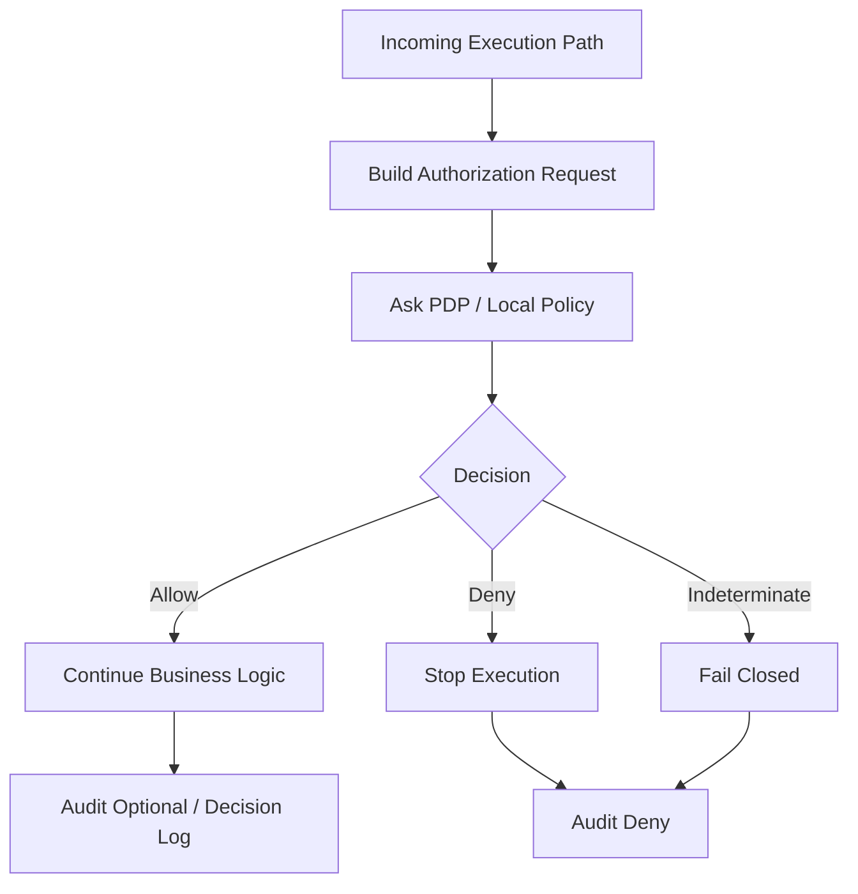
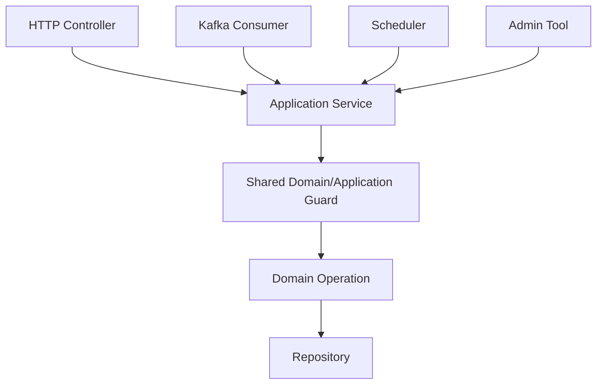
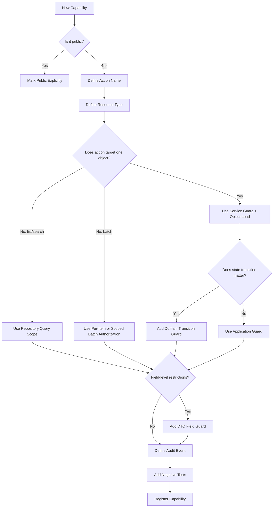
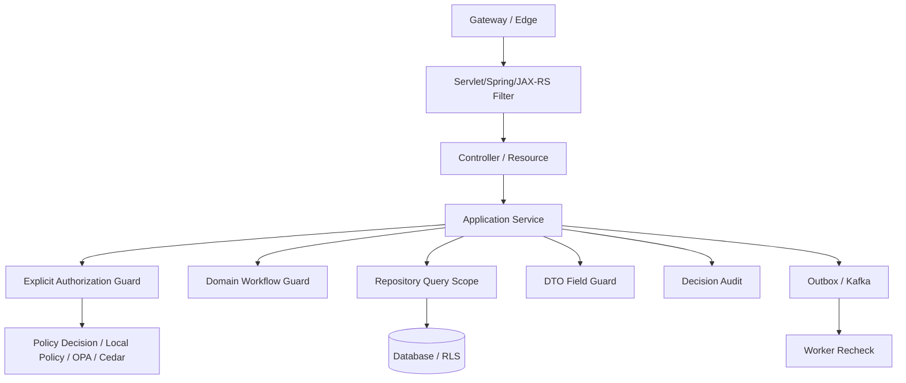

# Part 007 — Enforcement Point Patterns: Filter, Interceptor, Annotation, Guard, Query Scope

Di part sebelumnya kita sudah menjawab pertanyaan besar: **authorization harus hidup di beberapa layer, tetapi bukan dengan policy yang tersebar liar**.

Part ini lebih konkret. Kita akan membedah pattern **Policy Enforcement Point** atau **PEP** yang biasa dipakai di aplikasi Java production-grade:

- servlet filter;
- Spring Security filter chain;
- JAX-RS `ContainerRequestFilter`;
- JAX-RS/Jersey `DynamicFeature`;
- annotation-based guard;
- method interceptor / AOP;
- explicit guard object;
- domain transition guard;
- repository query scope;
- database policy boundary;
- DTO field guard;
- event/worker guard.

Targetnya bukan sekadar tahu “pakai annotation”. Targetnya adalah bisa menjawab:

> Untuk sebuah action tertentu, enforcement paling aman diletakkan di mana, dengan input apa, error semantics apa, audit apa, dan bagaimana memastikan tidak ada bypass path?

---

## 1. Core Mental Model

Authorization implementation terdiri dari dua hal yang sering dicampur:

1. **Decision** — apakah subject boleh melakukan action terhadap resource pada context tertentu?
2. **Enforcement** — apakah aplikasi benar-benar menghentikan eksekusi ketika decision menolak?

Banyak sistem punya decision logic, tetapi enforcement-nya lemah. Contoh:

```java
if (!user.isAdmin()) {
    log.warn("user is not admin");
}
performDangerousOperation();
```

Kode di atas **punya check**, tetapi tidak punya enforcement.

PEP yang benar harus memiliki empat sifat:

1. **fail-closed** — jika tidak bisa mengambil decision, request tidak lanjut;
2. **complete** — semua execution path penting melewati PEP;
3. **context-rich** — decision punya input yang cukup, bukan hanya role string;
4. **observable** — allow/deny/error tercatat dengan reason, subject, resource, action, policy version, dan correlation ID.



---

## 2. Why One Enforcement Pattern Is Never Enough

A common mistake: “we already have authorization in controller annotation.”

That may protect normal HTTP calls, but it does not automatically protect:

- scheduled jobs;
- Kafka consumers;
- internal service calls;
- batch exports;
- admin scripts;
- repository methods reused by another service;
- domain transition invoked from a saga;
- bulk update endpoint;
- report query;
- attachment download;
- GraphQL resolver;
- asynchronous command handler.

Authorization is not attached to HTTP. Authorization is attached to **capability execution**.

If a capability can be executed from multiple paths, enforcement must either:

- be placed below all paths; or
- be repeated consistently through a shared guard; or
- be made impossible to bypass by query/domain construction.



The lower the guard, the harder it is to bypass. But the lower the guard, the more domain-specific input it needs.

---

## 3. Pattern Selection Matrix

| Pattern | Best For | Weakness | Production Rule |
|---|---|---|---|
| API Gateway policy | Coarse endpoint gating, service perimeter | Usually lacks object state | Never rely on it for object-level authorization |
| Servlet/Spring filter | Request-level allow/deny | Hard to know domain resource state | Good for authentication, scopes, coarse roles, tenant presence |
| JAX-RS filter | Resource-method metadata, annotation-driven checks | Still shallow if object not loaded | Good for endpoint-level and method-level checks |
| Method annotation | Declarative service/controller checks | Easy to become stringly and shallow | Use for simple function-level checks or delegate to typed guard |
| AOP interceptor | Cross-cutting method enforcement | Proxy order and self-invocation pitfalls | Use carefully; test proxy boundaries |
| Explicit guard | Domain-rich authorization | Requires discipline | Preferred for important business capabilities |
| Repository query scope | List/search/read-by-id object filtering | Can hide bugs if used alone | Required for multi-tenant and object-level reads |
| Domain guard | State transition authorization | Needs current aggregate state | Required for lifecycle-sensitive writes |
| Database RLS/policy | Last-mile data isolation | Does not know business intent | Strong defense-in-depth, not full app auth |
| Worker guard | Async execution and delayed commands | Needs snapshot/recheck model | Mandatory for event-driven systems |

---

## 4. A Shared Authorization Kernel

Before exploring PEP patterns, define a small kernel. Without a common vocabulary, every layer invents its own version of authorization.

```java
package com.acme.security.authz;

import java.time.Instant;
import java.util.Map;
import java.util.Optional;
import java.util.Set;

public record PrincipalRef(
        String type,       // USER, SERVICE, SYSTEM
        String id,
        String tenantId,
        Set<String> roles,
        Set<String> scopes,
        Map<String, Object> claims
) {}

public record ResourceRef(
        String type,       // ORDER, CASE, QUOTE, DOCUMENT
        String id,
        String tenantId,
        Map<String, Object> attributes
) {}

public record AuthorizationRequest(
        PrincipalRef principal,
        String action,
        ResourceRef resource,
        Map<String, Object> context,
        String correlationId,
        Instant requestedAt
) {}

public enum DecisionEffect {
    ALLOW,
    DENY,
    INDETERMINATE
}

public record AuthorizationDecision(
        DecisionEffect effect,
        String reasonCode,
        String message,
        String policyId,
        String policyVersion,
        Map<String, Object> obligations
) {
    public boolean allowed() {
        return effect == DecisionEffect.ALLOW;
    }
}

public interface AuthorizationService {
    AuthorizationDecision decide(AuthorizationRequest request);
}
```

This kernel is intentionally boring. Boring is good. The most dangerous authorization system is one where every endpoint has a unique decision shape.

### Key design choice

Do not make the core decision API return only `boolean`.

A boolean cannot explain:

- why access was denied;
- which policy version evaluated;
- whether the decision is cacheable;
- whether masking/redaction is required;
- whether MFA/step-up is required;
- whether a special audit event is needed;
- whether the failure was policy denial or infrastructure failure.

A boolean is fine **inside** a low-level predicate. It is insufficient as the boundary between PEP and PDP.

---

## 5. PEP Pattern 1 — Servlet Filter

A servlet filter runs early in the HTTP request pipeline. It is good for coarse checks:

- request has authenticated principal;
- tenant header is present;
- service token has required scope;
- endpoint belongs to an allowlist;
- maintenance-mode deny;
- IP/network posture;
- coarse route-level policy.

It is usually bad for object-level authorization because the domain object is not loaded yet.

### Example: coarse authorization filter

```java
package com.acme.web.security;

import com.acme.security.authz.AuthorizationDecision;
import com.acme.security.authz.AuthorizationRequest;
import com.acme.security.authz.AuthorizationService;
import com.acme.security.authz.DecisionEffect;
import jakarta.servlet.FilterChain;
import jakarta.servlet.ServletException;
import jakarta.servlet.http.HttpServletRequest;
import jakarta.servlet.http.HttpServletResponse;
import org.springframework.web.filter.OncePerRequestFilter;

import java.io.IOException;
import java.time.Instant;
import java.util.Map;

public final class CoarseAuthorizationFilter extends OncePerRequestFilter {

    private final AuthorizationService authorizationService;
    private final PrincipalResolver principalResolver;
    private final RouteActionResolver routeActionResolver;

    public CoarseAuthorizationFilter(
            AuthorizationService authorizationService,
            PrincipalResolver principalResolver,
            RouteActionResolver routeActionResolver
    ) {
        this.authorizationService = authorizationService;
        this.principalResolver = principalResolver;
        this.routeActionResolver = routeActionResolver;
    }

    @Override
    protected void doFilterInternal(
            HttpServletRequest request,
            HttpServletResponse response,
            FilterChain filterChain
    ) throws ServletException, IOException {

        var action = routeActionResolver.resolve(request);

        // Some routes may be intentionally public, but that should be explicit.
        if (action.isPublic()) {
            filterChain.doFilter(request, response);
            return;
        }

        var principal = principalResolver.resolve(request)
                .orElseThrow(() -> new UnauthorizedException("missing_principal"));

        var authzRequest = new AuthorizationRequest(
                principal,
                action.name(),
                action.routeResource(),
                Map.of(
                        "http.method", request.getMethod(),
                        "http.path", request.getRequestURI(),
                        "client.ip", request.getRemoteAddr()
                ),
                request.getHeader("X-Correlation-Id"),
                Instant.now()
        );

        AuthorizationDecision decision = authorizationService.decide(authzRequest);

        if (decision.effect() == DecisionEffect.ALLOW) {
            filterChain.doFilter(request, response);
            return;
        }

        response.setStatus(HttpServletResponse.SC_FORBIDDEN);
        response.setContentType("application/json");
        response.getWriter().write("{\"error\":\"forbidden\",\"reason\":\"" + decision.reasonCode() + "\"}");
    }
}
```

### What this pattern should not do

Do not make the filter query every possible domain table to decide object-level access. That turns the filter into a fake application service.

A filter should not know how case assignment, quote approval, document sensitivity, or order fulfillment states work.

### Invariant

> A filter can enforce **coarse access**. It must not be the only place where resource ownership, tenant membership, assignment, lifecycle state, or field-level access is checked.

---

## 6. PEP Pattern 2 — Spring Security `AuthorizationManager`

Spring Security’s modern authorization architecture centers on `AuthorizationManager`, a component that determines whether an `Authentication` has access to a secured object.

This is useful because it gives you a framework-supported enforcement point instead of ad-hoc `if` checks.

### Request authorization example

```java
@Bean
SecurityFilterChain apiSecurity(HttpSecurity http,
                                AuthorizationManager<RequestAuthorizationContext> caseReadManager) throws Exception {
    return http
            .authorizeHttpRequests(authz -> authz
                    .requestMatchers(HttpMethod.GET, "/api/cases/{caseId}").access(caseReadManager)
                    .requestMatchers(HttpMethod.POST, "/api/cases").hasAuthority("case:create")
                    .anyRequest().denyAll()
            )
            .oauth2ResourceServer(oauth2 -> oauth2.jwt())
            .build();
}
```

### Custom manager skeleton

```java
public final class CaseReadAuthorizationManager
        implements AuthorizationManager<RequestAuthorizationContext> {

    private final AuthorizationService authorizationService;
    private final PrincipalMapper principalMapper;

    public CaseReadAuthorizationManager(AuthorizationService authorizationService,
                                        PrincipalMapper principalMapper) {
        this.authorizationService = authorizationService;
        this.principalMapper = principalMapper;
    }

    @Override
    public AuthorizationDecision check(Supplier<Authentication> authentication,
                                       RequestAuthorizationContext context) {
        var auth = authentication.get();
        var principal = principalMapper.from(auth);
        var caseId = context.getVariables().get("caseId");

        var request = AuthorizationRequests.forCaseRead(principal, caseId, context.getRequest());
        var decision = authorizationService.decide(request);

        return new AuthorizationDecision(decision.allowed());
    }
}
```

This is useful for request-level checks, but it still has a limitation: it usually receives **path variables**, not a fully loaded domain object.

For object-level checks, you often need a second guard in the application service or repository layer.

```java
public CaseDetails getCase(String caseId) {
    CaseRecord record = caseRepository.findVisibleCaseForCurrentPrincipal(caseId)
            .orElseThrow(NotFoundException::new);

    caseAuthorizationGuard.assertCanRead(currentPrincipal(), record);

    return mapper.toDetails(record);
}
```

The request-level manager blocks obvious invalid access. The repository and guard enforce object-level truth.

---

## 7. PEP Pattern 3 — JAX-RS `ContainerRequestFilter`

In JAX-RS/Jakarta REST, a `ContainerRequestFilter` can intercept incoming requests. If no name binding is applied, it can be global; with a name-binding annotation, it applies to matching resource classes or methods.

### Name-binding annotation

```java
package com.acme.api.authz;

import jakarta.ws.rs.NameBinding;
import java.lang.annotation.Retention;
import java.lang.annotation.Target;

import static java.lang.annotation.ElementType.METHOD;
import static java.lang.annotation.ElementType.TYPE;
import static java.lang.annotation.RetentionPolicy.RUNTIME;

@NameBinding
@Retention(RUNTIME)
@Target({TYPE, METHOD})
public @interface RequiresPermission {
    String action();
    String resourceType();
}
```

### Filter implementation

```java
package com.acme.api.authz;

import com.acme.security.authz.AuthorizationService;
import jakarta.annotation.Priority;
import jakarta.inject.Inject;
import jakarta.ws.rs.ForbiddenException;
import jakarta.ws.rs.Priorities;
import jakarta.ws.rs.container.ContainerRequestContext;
import jakarta.ws.rs.container.ContainerRequestFilter;
import jakarta.ws.rs.container.ResourceInfo;
import jakarta.ws.rs.core.Context;
import jakarta.ws.rs.ext.Provider;

import java.io.IOException;

@Provider
@RequiresPermission(action = "placeholder", resourceType = "placeholder")
@Priority(Priorities.AUTHORIZATION)
public final class PermissionFilter implements ContainerRequestFilter {

    @Context
    ResourceInfo resourceInfo;

    @Inject
    AuthorizationService authorizationService;

    @Inject
    JakartaPrincipalResolver principalResolver;

    @Override
    public void filter(ContainerRequestContext requestContext) throws IOException {
        RequiresPermission annotation = findAnnotation(resourceInfo);
        if (annotation == null) {
            return;
        }

        var principal = principalResolver.resolve(requestContext);
        var authzRequest = JaxRsAuthorizationRequests.from(
                principal,
                annotation.action(),
                annotation.resourceType(),
                requestContext
        );

        var decision = authorizationService.decide(authzRequest);
        if (!decision.allowed()) {
            throw new ForbiddenException("forbidden: " + decision.reasonCode());
        }
    }

    private RequiresPermission findAnnotation(ResourceInfo info) {
        var method = info.getResourceMethod();
        var type = info.getResourceClass();
        if (method != null && method.isAnnotationPresent(RequiresPermission.class)) {
            return method.getAnnotation(RequiresPermission.class);
        }
        if (type != null && type.isAnnotationPresent(RequiresPermission.class)) {
            return type.getAnnotation(RequiresPermission.class);
        }
        return null;
    }
}
```

### Usage

```java
@Path("/cases")
public class CaseResource {

    @GET
    @Path("/{caseId}")
    @RequiresPermission(action = "case.read", resourceType = "case")
    public CaseDto getCase(@PathParam("caseId") String caseId) {
        return caseService.getCase(caseId);
    }
}
```

### Problem

This still cannot safely decide if the user can read `caseId` unless:

- the filter loads the case;
- the filter delegates to a PDP that can load/check relationships;
- the service/repository also enforces visibility.

For most production systems, do not let JAX-RS filter become the final object-level authorization mechanism.

---

## 8. PEP Pattern 4 — JAX-RS/Jersey `DynamicFeature`

A `DynamicFeature` lets you register filters dynamically based on the resource method. This is cleaner when you do not want the filter to be globally registered for every request.

```java
@Provider
public final class AuthorizationFeature implements DynamicFeature {

    @Override
    public void configure(ResourceInfo resourceInfo, FeatureContext context) {
        var permission = resourceInfo.getResourceMethod().getAnnotation(RequiresPermission.class);
        if (permission == null) {
            permission = resourceInfo.getResourceClass().getAnnotation(RequiresPermission.class);
        }

        if (permission != null) {
            context.register(new PermissionFilter(permission));
        }
    }
}
```

This pattern is especially useful in Jersey when:

- resource methods have different authorization metadata;
- you want filter instances configured per method;
- you want startup-time validation of missing annotations;
- you want to build an endpoint-permission registry.

### Startup validation idea

At application startup, scan all resource methods:

- public endpoint must be annotated `@PublicEndpoint`;
- protected endpoint must be annotated `@RequiresPermission` or `@RequiresPolicy`;
- no endpoint is allowed to be “accidentally unclassified”.

```java
public enum EndpointClassification {
    PUBLIC,
    AUTHENTICATED,
    PERMISSION_REQUIRED,
    INTERNAL_ONLY
}
```

The most important benefit is not the dynamic registration itself. The benefit is **classification discipline**.

---

## 9. PEP Pattern 5 — Annotation-Based Guard

Annotation-based authorization looks clean:

```java
@RequiresPermission("quote.approve")
public Quote approveQuote(String quoteId) {
    ...
}
```

But annotation is only metadata. The real question is:

> What runtime mechanism reads the annotation, builds the authorization request, and stops execution?

Annotation-based guard is safe only if:

- there is an interceptor that always runs;
- proxy/self-invocation issues are understood;
- method parameters can be mapped to resource IDs;
- the policy does not require state that is not loaded;
- tests prove denial stops the method body.

### Rich annotation example

```java
@Retention(RUNTIME)
@Target({METHOD, TYPE})
public @interface RequiresPolicy {
    String action();
    String resourceType();
    String resourceIdParam() default "";
    boolean loadResource() default false;
}
```

### Why string expressions are dangerous

```java
@PreAuthorize("hasRole('ADMIN') or #case.ownerId == authentication.name")
```

This is convenient but can become:

- hard to refactor;
- hard to test as policy;
- inconsistent across methods;
- blind to tenant rules;
- too coupled to object shape;
- difficult to audit.

A better pattern is to use annotation only to route to a typed guard:

```java
@PreAuthorize("@caseSecurity.canApprove(authentication, #command)")
public ApprovalResult approve(ApproveCaseCommand command) {
    return caseApplicationService.approve(command);
}
```

Then the real policy lives in Java code that can be tested directly:

```java
@Component("caseSecurity")
public final class CaseSecurity {

    private final CaseRepository caseRepository;
    private final CaseAuthorizationPolicy policy;

    public boolean canApprove(Authentication authentication, ApproveCaseCommand command) {
        var principal = PrincipalMapper.from(authentication);
        var caseRecord = caseRepository.findById(command.caseId()).orElse(null);
        if (caseRecord == null) {
            return false;
        }
        return policy.canApprove(principal, caseRecord).allowed();
    }
}
```

---

## 10. PEP Pattern 6 — Method Interceptor / AOP

A method interceptor can enforce authorization before entering service methods.

```java
@Aspect
@Component
public final class RequiresPolicyAspect {

    private final AuthorizationService authorizationService;
    private final MethodAuthorizationRequestFactory requestFactory;

    @Around("@annotation(requiresPolicy)")
    public Object authorize(ProceedingJoinPoint joinPoint,
                            RequiresPolicy requiresPolicy) throws Throwable {
        var request = requestFactory.from(joinPoint, requiresPolicy);
        var decision = authorizationService.decide(request);

        if (!decision.allowed()) {
            throw new AccessDeniedException(decision.reasonCode());
        }

        return joinPoint.proceed();
    }
}
```

### AOP pitfalls

AOP is powerful, but it has sharp edges:

1. **self-invocation bypass** — method calls inside the same class may not go through proxy;
2. **proxy type issue** — interface proxy vs class proxy changes behavior;
3. **transaction order** — does authorization run before or after transaction opens?
4. **lazy loading** — policy may accidentally trigger database queries;
5. **exception mapping** — deny must become correct HTTP/gRPC error;
6. **annotation drift** — new methods may be added without annotation.

### Rule

Use AOP to remove boilerplate, not to hide authorization from developers.

For high-risk domain operations, prefer explicit guard calls even if annotation also exists.

---

## 11. PEP Pattern 7 — Explicit Application Guard

Explicit guard is the most boring and often the most reliable pattern.

```java
public final class QuoteApplicationService {

    private final QuoteRepository quoteRepository;
    private final QuoteAuthorizationGuard quoteAuthorizationGuard;
    private final QuoteWorkflow quoteWorkflow;

    public QuoteApprovalResult approve(ApproveQuoteCommand command) {
        var principal = command.principal();

        Quote quote = quoteRepository.findById(command.quoteId())
                .orElseThrow(QuoteNotFoundException::new);

        quoteAuthorizationGuard.assertCanApprove(principal, quote);

        Quote approved = quoteWorkflow.approve(quote, principal.userId(), command.reason());
        quoteRepository.save(approved);

        return QuoteApprovalResult.from(approved);
    }
}
```

### Guard implementation

```java
public final class QuoteAuthorizationGuard {

    private final AuthorizationService authorizationService;

    public void assertCanApprove(PrincipalRef principal, Quote quote) {
        var request = AuthorizationRequestBuilder.create()
                .principal(principal)
                .action("quote.approve")
                .resource(ResourceRefBuilder.fromQuote(quote))
                .context("quote.status", quote.status().name())
                .context("quote.ownerId", quote.ownerId())
                .context("quote.totalAmount", quote.totalAmount())
                .context("quote.currency", quote.currency())
                .build();

        var decision = authorizationService.decide(request);
        if (!decision.allowed()) {
            throw new ForbiddenOperationException(decision.reasonCode());
        }
    }
}
```

This is verbose, but it is readable, testable, and auditable.

### Why explicit guard is strong

- It sees loaded domain state.
- It runs near the operation.
- It can be tested without HTTP.
- It protects non-HTTP callers.
- It can express lifecycle rules.
- It is obvious in code review.

### Weakness

It relies on developer discipline. Therefore you need architectural tests.

```java
@AnalyzeClasses(packages = "com.acme")
public class AuthorizationArchitectureTest {

    @ArchTest
    static final ArchRule mutating_application_methods_should_use_guard = methods()
            .that().arePublic()
            .and().areDeclaredInClassesThat().haveSimpleNameEndingWith("ApplicationService")
            .and().haveNameMatching("create|update|delete|approve|reject|assign|close|cancel")
            .should().beAnnotatedWith(RequiresAuthorizationReview.class);
}
```

The exact rule depends on your architecture. The principle: authorization should be mechanically reviewable.

---

## 12. PEP Pattern 8 — Domain Transition Guard

Some authorization cannot be evaluated without current domain state.

Example: a regulatory case can be closed only if:

- principal is assigned investigator or supervisor;
- case status is `UNDER_REVIEW`;
- all mandatory evidence checks passed;
- principal is not the original submitter if separation of duties applies;
- jurisdiction matches principal authority;
- emergency override is not being abused.

This is more than endpoint authorization.

```java
public final class CaseWorkflow {

    private final CaseAuthorizationPolicy authorizationPolicy;

    public Case close(Case aggregate, PrincipalRef principal, CloseCaseCommand command) {
        var decision = authorizationPolicy.canClose(principal, aggregate, command);
        if (!decision.allowed()) {
            throw new ForbiddenStateTransitionException(decision.reasonCode());
        }

        aggregate.close(command.resolution(), principal.id());
        return aggregate;
    }
}
```

### Important design distinction

There are two kinds of rules:

1. **Authorization rules** — who may do this?
2. **Business validity rules** — is this transition valid at all?

They are related but not identical.

```java
if (!caseRecord.status().equals(CaseStatus.UNDER_REVIEW)) {
    throw new InvalidCaseStateException("case_not_under_review");
}

caseAuthorizationGuard.assertCanClose(principal, caseRecord);
```

Do not hide all business validation inside authorization. Otherwise denied decisions become semantically confusing.

### Example failure mapping

| Failure | HTTP | Reason |
|---|---:|---|
| unauthenticated | 401 | no principal |
| authenticated but not allowed | 403 | policy denial |
| object absent or invisible | 404 or 403 | avoid object enumeration |
| invalid transition for everyone | 409 | business conflict |
| policy engine unavailable | 503 or 403 fail-closed | infrastructure failure |

---

## 13. PEP Pattern 9 — Repository Query Scope

For read/list/search operations, the safest authorization is often **query scoping**.

Instead of:

```java
List<CaseRecord> cases = caseRepository.search(query);
return cases.stream()
        .filter(c -> guard.canRead(principal, c))
        .toList();
```

Prefer:

```java
List<CaseRecord> cases = caseRepository.searchVisibleTo(principal, query);
```

The database query should only return rows the principal is allowed to see.

### Example SQL predicate

```sql
select c.*
from regulatory_case c
left join case_assignment a on a.case_id = c.id
where c.tenant_id = :tenant_id
  and (
        c.owner_user_id = :principal_user_id
        or a.assignee_user_id = :principal_user_id
        or exists (
            select 1
            from user_jurisdiction uj
            where uj.user_id = :principal_user_id
              and uj.jurisdiction_code = c.jurisdiction_code
        )
  )
  and c.deleted_at is null
order by c.created_at desc
limit :limit offset :offset;
```

### Java specification-style scope

```java
public interface CaseVisibilityScope {
    Predicate toPredicate(CriteriaBuilder cb, Root<CaseEntity> root, PrincipalRef principal);
}

public final class DefaultCaseVisibilityScope implements CaseVisibilityScope {

    @Override
    public Predicate toPredicate(CriteriaBuilder cb, Root<CaseEntity> root, PrincipalRef principal) {
        Predicate tenant = cb.equal(root.get("tenantId"), principal.tenantId());
        Predicate owner = cb.equal(root.get("ownerUserId"), principal.id());
        Predicate assigned = cb.isMember(principal.id(), root.get("assignedUserIds"));

        return cb.and(tenant, cb.or(owner, assigned));
    }
}
```

### MyBatis-style pattern

```xml
<select id="searchVisibleCases" resultMap="CaseRecordMap">
  select c.*
  from regulatory_case c
  where c.tenant_id = #{principal.tenantId}
    and c.deleted_at is null
    <choose>
      <when test="principal.hasRole('CASE_SUPERVISOR')">
        and c.jurisdiction_code in
        <foreach item="j" collection="principal.jurisdictions" open="(" separator="," close=")">
          #{j}
        </foreach>
      </when>
      <otherwise>
        and exists (
          select 1
          from case_assignment a
          where a.case_id = c.id
            and a.assignee_user_id = #{principal.id}
        )
      </otherwise>
    </choose>
</select>
```

### Query scope invariant

> Any repository method returning domain objects to a user-facing path must either be scoped by principal or explicitly marked as internal/system-only.

---

## 14. PEP Pattern 10 — Database Row-Level Security Boundary

Database row-level security can enforce tenant or row visibility even if application code forgets a predicate.

This is defense-in-depth, especially for:

- multi-tenant SaaS;
- analytics/reporting queries;
- support tools;
- SQL-heavy systems;
- legacy applications with inconsistent repository guards.

But database policy usually does not know full business intent. It cannot easily distinguish:

- user opening a case;
- user approving a case;
- user exporting a case;
- system reconciliation job;
- legal hold process;
- break-glass investigation.

Therefore database policy should be treated as **last-mile data isolation**, not the full authorization model.

---

## 15. PEP Pattern 11 — DTO Field Guard

Some users may access the same object but not the same fields.

Example:

- investigator can see evidence summary;
- supervisor can see confidential notes;
- external party can see public case status only;
- finance role can see price and discount;
- sales role can see product configuration but not margin.

### Field masking

```java
public final class CaseDtoMapper {

    private final FieldAuthorizationService fieldAuthorizationService;

    public CaseDto toDto(PrincipalRef principal, CaseRecord record) {
        var fields = fieldAuthorizationService.allowedFields(principal, "case", record.id());

        return new CaseDto(
                record.id(),
                record.referenceNumber(),
                fields.canRead("status") ? record.status().name() : null,
                fields.canRead("confidentialNotes") ? record.confidentialNotes() : null,
                fields.canRead("evidenceSummary") ? record.evidenceSummary() : "REDACTED"
        );
    }
}
```

### Write field guard

Read filtering is not enough. Write operations need field-level authorization too.

```java
public void patchCase(PrincipalRef principal, String caseId, JsonMergePatch patch) {
    var requestedFields = patchInspector.extractTopLevelFields(patch);

    for (String field : requestedFields) {
        fieldAuthorizationGuard.assertCanWrite(principal, "case", caseId, field);
    }

    // Then apply patch.
}
```

### Anti-pattern

```java
objectMapper.updateValue(entity, requestBody);
```

This is mass assignment waiting to happen. Never let arbitrary JSON fields map directly into domain/entity state unless writable fields have been checked.

---

## 16. PEP Pattern 12 — Event and Worker Guard

Authorization is not finished when an HTTP request returns `202 Accepted`.

For async systems, there are two main models:

### Model A — Authorize before enqueue

```java
public JobId requestExport(PrincipalRef principal, ExportCasesCommand command) {
    exportAuthorizationGuard.assertCanRequestExport(principal, command);

    var job = ExportJob.create(
            command,
            principal.id(),
            principal.tenantId(),
            AuthorizationSnapshot.from(principal)
    );

    exportJobRepository.save(job);
    outbox.publish(ExportRequested.from(job));
    return job.id();
}
```

This proves that the requester was allowed to request the job at enqueue time.

### Model B — Recheck before execution

```java
public void handle(ExportRequested event) {
    var job = exportJobRepository.findById(event.jobId()).orElseThrow();
    var principal = principalDirectory.resolveHistoricalPrincipal(job.requestedBy());

    exportAuthorizationGuard.assertCanExecuteExport(principal, job);

    exportRunner.run(job);
}
```

This protects delayed execution when permissions changed after enqueue.

### Which is better?

Use both for high-risk actions:

1. authorize before enqueue to prevent unauthorized job creation;
2. store authorization-relevant snapshot for audit;
3. recheck before execution if access may be revoked;
4. define what happens if access is revoked after partial execution.

### Snapshot vs live recheck

| Choice | Pro | Con |
|---|---|---|
| Snapshot only | Reproducible decision, stable audit | May execute after revocation |
| Live recheck only | Honors current permission | Harder to explain historical decision |
| Snapshot + live recheck | Strongest control | More complex |

---

## 17. PEP Pattern 13 — Admin and Break-Glass Guard

Admin paths are often authorization weak spots.

A safe admin guard does not mean “admin can do anything”. It should model:

- admin role;
- tenant boundary;
- purpose of access;
- ticket/case reference;
- time-bound access;
- separation of duties;
- stronger audit;
- approval requirement;
- break-glass reason;
- after-the-fact review.

```java
public void assertCanBreakGlass(PrincipalRef principal, BreakGlassCommand command) {
    var decision = authorizationService.decide(
            AuthorizationRequestBuilder.create()
                    .principal(principal)
                    .action("case.break_glass.read")
                    .resource("case", command.caseId())
                    .context("reason", command.reason())
                    .context("ticketId", command.ticketId())
                    .context("durationMinutes", command.durationMinutes())
                    .context("requiresEnhancedAudit", true)
                    .build()
    );

    if (!decision.allowed()) {
        throw new ForbiddenOperationException(decision.reasonCode());
    }
}
```

The audit requirement is not a side concern. It is part of the authorization contract.

---

## 18. The “Double Check” Problem

Sometimes developers ask:

> Is it bad to check authorization twice?

No. It is bad to check **different policies inconsistently**.

A safe double-check pattern:

- gateway checks token audience/scope;
- controller or filter checks endpoint classification;
- service guard checks business action;
- repository scope restricts visible data;
- DTO mapper redacts fields;
- audit logs final decision.

An unsafe double-check pattern:

- controller checks `ROLE_MANAGER`;
- service checks `ROLE_SUPERVISOR`;
- repository filters by owner;
- UI hides button based on `canApprove`; 
- no one knows which rule is authoritative.

The solution is not fewer checks. The solution is **single policy vocabulary with multiple enforcement layers**.

---

## 19. Building a PEP Registry

For production systems, maintain a registry of protected capabilities.

```yaml
capabilities:
  - action: case.read
    resourceType: case
    pepLayers:
      - request
      - repository_scope
      - field_redaction
    risk: high
    audit: decision

  - action: case.close
    resourceType: case
    pepLayers:
      - service_guard
      - domain_transition
    risk: critical
    audit: mandatory

  - action: quote.approve
    resourceType: quote
    pepLayers:
      - service_guard
      - domain_transition
    risk: critical
    audit: mandatory
```

This registry helps with:

- code review;
- security review;
- test generation;
- policy migration;
- audit evidence;
- detecting unprotected endpoints;
- mapping business capability to technical enforcement.

---

## 20. Error Semantics at Enforcement Points

PEP must stop execution with correct semantics.

| Situation | Recommended Outcome | Notes |
|---|---|---|
| no principal | 401 | authentication missing/invalid |
| principal lacks endpoint permission | 403 | authenticated but denied |
| object not found | 404 | actual absence |
| object exists but invisible | 404 or 403 | choose based on enumeration risk |
| field denied | omit, mask, or 403 | depends on contract |
| policy engine timeout | fail closed | often 403/503 depending boundary |
| malformed authorization context | 500 or 403 | treat as engineering error |
| stale policy version | fail closed or use last-known-good | document explicitly |

Avoid leaking:

- whether a resource exists;
- whether another tenant owns it;
- which permission exactly would grant access;
- internal policy IDs to external clients;
- sensitive attribute values in denial messages.

But do log detailed internal reason codes.

---

## 21. Observability for PEP

At minimum, each high-risk PEP should emit structured logs:

```json
{
  "eventType": "authorization.decision",
  "effect": "DENY",
  "subjectType": "USER",
  "subjectId": "u_123",
  "tenantId": "t_001",
  "action": "case.close",
  "resourceType": "case",
  "resourceId": "case_789",
  "reasonCode": "case.not_assigned",
  "policyId": "case-workflow-policy",
  "policyVersion": "2026-07-03.4",
  "correlationId": "req_abc",
  "pep": "case-application-service",
  "timestamp": "2026-07-03T10:11:12Z"
}
```

For sensitive systems, do not log raw claims, tokens, evidence content, confidential notes, or full request payloads.

---

## 22. Testing PEP Correctness

You need tests for both **decision** and **enforcement**.

Decision test:

```java
@Test
void investigatorCannotCloseUnassignedCase() {
    var decision = policy.canClose(investigator, unassignedCase, closeCommand);
    assertThat(decision.effect()).isEqualTo(DENY);
    assertThat(decision.reasonCode()).isEqualTo("case.not_assigned");
}
```

Enforcement test:

```java
@Test
void deniedCloseDoesNotModifyCase() {
    assertThatThrownBy(() -> service.close(closeCommandByUnassignedUser))
            .isInstanceOf(ForbiddenOperationException.class);

    var caseAfter = repository.findById(caseId).orElseThrow();
    assertThat(caseAfter.status()).isEqualTo(UNDER_REVIEW);
    assertThat(auditLog).containsDecision("DENY", "case.close", caseId);
}
```

Filter test:

```java
mockMvc.perform(get("/api/cases/{id}", caseId)
        .with(jwt().authorities(new SimpleGrantedAuthority("case:read"))))
        .andExpect(status().isForbidden());
```

Repository scope test:

```java
@Test
void searchDoesNotReturnOtherTenantCases() {
    var results = caseRepository.searchVisibleTo(principalFromTenantA, SearchQuery.all());

    assertThat(results)
            .allMatch(c -> c.tenantId().equals("tenant-a"));
}
```

---

## 23. Production Anti-Patterns

### Anti-pattern 1 — UI-only authorization

Hiding a button is not authorization. It is UX.

### Anti-pattern 2 — Role check directly in controller

```java
if (user.hasRole("ADMIN")) { ... }
```

This spreads policy and creates drift.

### Anti-pattern 3 — `isAdmin` escape hatch

Every `isAdmin` shortcut eventually becomes an undocumented superpower.

### Anti-pattern 4 — Repository `findById` from user path

```java
caseRepository.findById(caseId)
```

For user-facing reads, prefer:

```java
caseRepository.findVisibleById(principal, caseId)
```

### Anti-pattern 5 — post-filtering only

Fetching too much and filtering in memory can leak through pagination, counts, timing, logs, and exports.

### Anti-pattern 6 — allow on PDP error

Fail-open authorization failures are security incidents waiting to happen.

### Anti-pattern 7 — policy without audit

If you cannot explain a deny or an allow later, your authorization system is operationally incomplete.

---

## 24. Practical Decision Tree

Use this when designing a new endpoint/capability.



---

## 25. Reference Implementation Structure

A clean package structure:

```text
com.acme.security.authz
  AuthorizationService.java
  AuthorizationRequest.java
  AuthorizationDecision.java
  PrincipalRef.java
  ResourceRef.java
  DecisionEffect.java

com.acme.security.authz.pep
  AuthorizationFilters.java
  MethodAuthorizationInterceptor.java
  ForbiddenOperationException.java

com.acme.casework.authz
  CaseAuthorizationGuard.java
  CaseAuthorizationPolicy.java
  CaseVisibilityScope.java
  CaseFieldPolicy.java

com.acme.casework.application
  CaseApplicationService.java

com.acme.casework.domain
  CaseWorkflow.java

com.acme.casework.persistence
  CaseRepository.java
  CaseQueryScopeMapper.java
```

Notice the split:

- generic authorization kernel in `security.authz`;
- domain-specific policies in domain module;
- framework PEP adapters in web/security modules;
- repository scoping in persistence module;
- application service orchestrates enforcement.

---

## 26. Checklist: Enforcement Point Readiness

For every protected capability, answer these questions:

- What is the action name?
- What is the resource type?
- Is the resource single object, collection, field, command, job, or transition?
- Which PEPs enforce it?
- Does the PEP have enough context?
- Is object-level authorization performed before returning data?
- Is query/list authorization enforced in the database query?
- Is batch authorization defined per item or as scoped set operation?
- Is field read/write authorization defined?
- Are async jobs authorized before enqueue and/or before execution?
- Is denial fail-closed?
- Is policy engine outage handled safely?
- Is decision logged with reason and correlation ID?
- Are negative tests present?
- Is the capability registered?

---

## 27. Final Mental Model

Enforcement point patterns are not alternatives where you pick exactly one. They are layers with different jobs.

A production-grade Java authorization system usually looks like this:



The guiding principle:

> Put coarse checks early, object checks near object access, transition checks near state change, query checks inside data retrieval, field checks at serialization/mutation boundary, and async checks where delayed work actually executes.

---

## References

- OWASP Authorization Cheat Sheet — centralized authorization routines, validate permission on every request, least privilege, deny by default.
- OWASP API Security 2023 — Broken Object Level Authorization and Broken Function Level Authorization.
- Spring Security Reference — Authorization Architecture and `AuthorizationManager`.
- Jakarta RESTful Web Services specification and `ContainerRequestFilter` API.
- Open Policy Agent documentation — policy decision APIs and decision logs.
- NIST SP 800-162 — ABAC concepts and subject/object/action/environment attributes.

---

## What Comes Next

Part 008 will define the **authorization request and decision contract** in depth: how to model subject, action, resource, context, obligations, reason codes, cacheability, policy version, audit correlation, batch decisions, and failure semantics.
