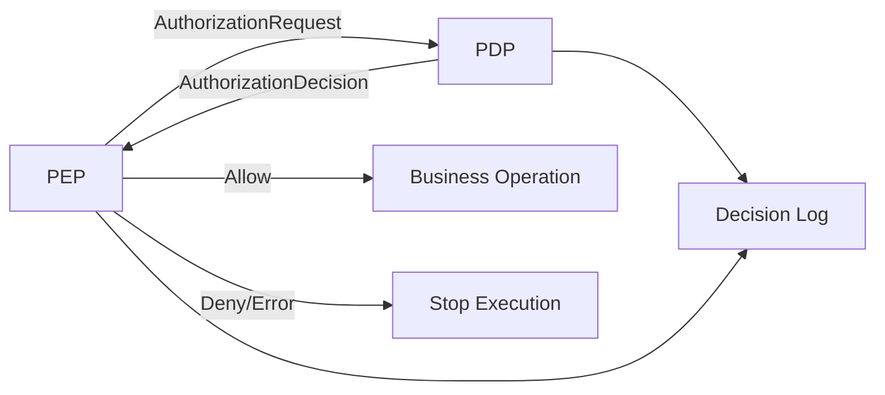
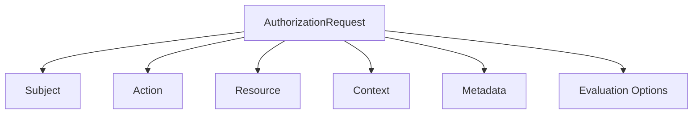
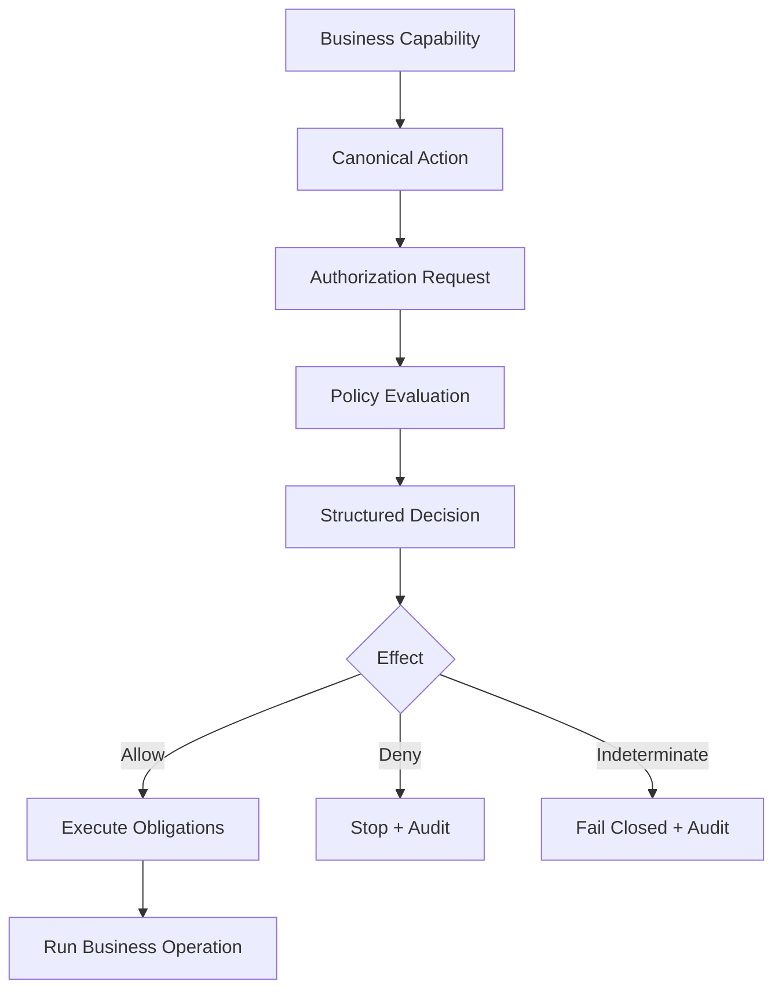

# Part 008 — Authorization Request and Decision Contract Design

Authorization gagal bukan hanya karena policy salah. Banyak sistem gagal karena **kontrak authorization request/decision buruk**.

Contoh kontrak yang terlalu miskin:

```java
boolean allowed = authz.can(userId, "APPROVE_QUOTE");
```

Pertanyaan yang tidak bisa dijawab oleh kontrak ini:

- approve quote yang mana?
- tenant mana?
- quote status apa?
- quote amount berapa?
- user bertindak sebagai role apa?
- apakah user adalah owner, assignee, supervisor, atau delegated approver?
- apakah request datang dari UI, batch job, API client, atau support console?
- policy versi berapa yang mengevaluasi?
- kenapa deny?
- apakah boleh retry?
- apakah decision boleh di-cache?
- apakah response perlu masking field tertentu?
- apakah allow membutuhkan obligation seperti audit enhanced atau MFA step-up?

Part ini membangun kontrak authorization yang cukup kuat untuk production Java systems.

---

## 1. Design Goal

Kontrak authorization harus memenuhi tujuh target:

1. **expressive** — cukup kaya untuk RBAC, ABAC, ReBAC, PBAC, dan object-level checks;
2. **stable** — tidak berubah setiap kali domain menambah field baru;
3. **typed enough** — tidak semua menjadi `Map<String, Object>` liar;
4. **auditable** — decision bisa dijelaskan setelah kejadian;
5. **cache-aware** — decision tahu kapan aman di-cache;
6. **failure-aware** — deny, indeterminate, timeout, dan invalid request dibedakan;
7. **portable** — bisa dipakai oleh local Java policy, OPA, Cedar, OpenFGA adapter, atau remote PDP.



---

## 2. Minimal Decision Is Not Enough

A minimal authorization API is tempting:

```java
boolean isAllowed(String userId, String permission);
```

It is acceptable only for low-risk feature toggles or toy examples.

In real systems, authorization is a decision record:

```java
AuthorizationDecision decision = authorizationService.decide(request);
```

The decision is not just “yes/no”. It is operational evidence.

---

## 3. Canonical Request Shape

A production-grade request shape usually has:

- subject/principal;
- action;
- resource;
- context/environment;
- request metadata;
- evaluation options.

```java
public record AuthorizationRequest(
        Subject subject,
        Action action,
        Resource resource,
        AuthorizationContext context,
        RequestMetadata metadata,
        EvaluationOptions options
) {}
```



---

## 4. Subject Contract

Subject is the actor being authorized.

Do not assume subject is always a human user. It can be:

- human user;
- service account;
- background job;
- system process;
- delegated actor;
- API client;
- support operator;
- break-glass session;
- external organization;
- machine/device identity.

```java
public enum SubjectType {
    USER,
    SERVICE,
    SYSTEM,
    API_CLIENT,
    JOB,
    EXTERNAL_PARTY
}

public record Subject(
        SubjectType type,
        String id,
        String tenantId,
        String organizationId,
        Set<String> roles,
        Set<String> scopes,
        Set<String> groups,
        Map<String, String> attributes,
        Delegation delegation,
        SessionContext session
) {}
```

### Required subject fields

| Field | Why It Matters |
|---|---|
| `type` | user vs service vs job have different rules |
| `id` | stable actor identity |
| `tenantId` | tenant isolation |
| `organizationId` | enterprise hierarchy |
| `roles` | RBAC input |
| `scopes` | token/API boundary input |
| `groups` | group membership / ReBAC input |
| `attributes` | ABAC input |
| `delegation` | acting-on-behalf-of semantics |
| `session` | authentication strength, MFA, device, time |

### Subject anti-pattern

```java
String userId = SecurityContextHolder.getContext().getAuthentication().getName();
```

This is not enough. It ignores tenant, actor type, session strength, role source, delegation, and claim freshness.

---

## 5. Delegation Contract

Delegation is where many authorization bugs hide.

Examples:

- support user acts on behalf of customer;
- supervisor approves on behalf of unavailable manager;
- system job executes a command requested by user;
- API client acts for an organization;
- service-to-service call propagates original user.

```java
public record Delegation(
        boolean delegated,
        String originalSubjectId,
        String actingSubjectId,
        String delegationReason,
        String delegationGrantId,
        Instant expiresAt
) {
    public static Delegation none() {
        return new Delegation(false, null, null, null, null, null);
    }
}
```

### Important distinction

There are two actors:

1. **requesting actor** — the immediate caller;
2. **effective actor** — the identity whose authority is being used.

Never collapse them without explicit semantics.

```json
{
  "subject": {
    "type": "USER",
    "id": "support_123",
    "tenantId": "platform",
    "delegation": {
      "delegated": true,
      "originalSubjectId": "customer_456",
      "actingSubjectId": "support_123",
      "delegationReason": "support_ticket",
      "delegationGrantId": "grant_789",
      "expiresAt": "2026-07-03T12:00:00Z"
    }
  }
}
```

Policy must define whether permissions come from original subject, acting subject, or an intersection.

---

## 6. Action Contract

Action names should be stable, domain-oriented, and granular enough.

Bad action names:

```text
READ
WRITE
MANAGE
DO_STUFF
ADMIN
POST_/api/v1/cases/{id}/close
```

Better action names:

```text
case.read
case.search
case.create
case.update_summary
case.assign
case.close
case.reopen
case.break_glass.read
case.evidence.attach
case.evidence.download
quote.approve
quote.discount.override
order.cancel
order.fulfillment.release
```

### Action naming rules

1. Use domain capability, not HTTP method.
2. Include resource type prefix.
3. Separate materially different risk levels.
4. Separate read, export, download, and share.
5. Separate update fields if field-level writes matter.
6. Separate normal admin and break-glass admin.
7. Keep names stable across endpoints.

### Action object

```java
public record Action(
        String name,
        ActionKind kind,
        RiskLevel riskLevel,
        Set<String> requiredAssurance
) {}

public enum ActionKind {
    READ,
    SEARCH,
    CREATE,
    UPDATE,
    DELETE,
    APPROVE,
    REJECT,
    ASSIGN,
    EXPORT,
    DOWNLOAD,
    EXECUTE,
    ADMINISTER
}

public enum RiskLevel {
    LOW,
    MEDIUM,
    HIGH,
    CRITICAL
}
```

---

## 7. Resource Contract

Resource is what the subject wants to act on.

It can be:

- concrete object: `case:case_123`;
- collection: `case:*`;
- field: `case:case_123#confidentialNotes`;
- relationship: `document:doc_1#viewer`;
- command target: `case-close-command`;
- job: `export-job:job_789`;
- tenant: `tenant:t_001`;
- policy/admin object: `role:case-supervisor`.

```java
public record Resource(
        String type,
        String id,
        String tenantId,
        String parentType,
        String parentId,
        Map<String, String> attributes,
        ResourceState state,
        DataClassification classification
) {}
```

### Loaded resource vs resource reference

Sometimes PEP only has an ID:

```java
Resource.ref("case", caseId, tenantId)
```

Sometimes it has a snapshot:

```java
Resource.fromCase(caseRecord)
```

Decision quality depends on resource richness.

| Resource Input | Good For | Weakness |
|---|---|---|
| type only | create/search action | cannot check object ownership |
| type + id | external PDP/ReBAC check | may need lookup |
| loaded snapshot | ABAC/state transition | may be stale if long-lived |
| query scope | list/search | not enough for write transition |

### Rule

For mutating object-level action, prefer loaded resource snapshot plus version.

```java
public record ResourceState(
        String lifecycleStatus,
        Long version,
        Instant createdAt,
        Instant updatedAt,
        String ownerSubjectId,
        String assignedSubjectId,
        Map<String, String> domainState
) {}
```

Version is useful for audit and race detection.

---

## 8. Context Contract

Context captures environment and request-specific information.

Examples:

- current time;
- request IP;
- device posture;
- authentication method;
- MFA status;
- risk score;
- source application;
- correlation ID;
- jurisdiction;
- transaction amount;
- requested fields;
- patch operations;
- export size;
- reason code submitted by user;
- support ticket ID;
- workflow transition.

```java
public record AuthorizationContext(
        Instant now,
        String sourceSystem,
        String channel,
        String clientIp,
        String userAgent,
        String correlationId,
        String requestId,
        Map<String, Object> attributes
) {}
```

### Context should be explicit

Avoid hidden global context inside policy.

Bad:

```java
policy.canApprove(quote);
```

Better:

```java
policy.canApprove(subject, quote, context);
```

Hidden context makes tests incomplete and audit weak.

---

## 9. Metadata Contract

Metadata is about evaluation, not business context.

```java
public record RequestMetadata(
        String requestId,
        String correlationId,
        String traceId,
        String pepId,
        String serviceName,
        String endpoint,
        String method,
        Instant receivedAt
) {}
```

Why this matters:

- trace denial across services;
- connect decision log to API request;
- identify which PEP enforced;
- debug missing attributes;
- satisfy audit evidence;
- compare shadow policy results.

---

## 10. Evaluation Options

PEP may need to tell PDP how to evaluate.

```java
public record EvaluationOptions(
        DecisionMode mode,
        boolean explain,
        boolean includeObligations,
        boolean allowCachedDecision,
        boolean shadowEvaluation,
        String requestedPolicyVersion
) {}

public enum DecisionMode {
    ENFORCE,
    DRY_RUN,
    SHADOW,
    EXPLAIN
}
```

### Use cases

| Option | Use Case |
|---|---|
| `ENFORCE` | normal runtime blocking decision |
| `DRY_RUN` | policy migration, do not block |
| `SHADOW` | compare new policy with old policy |
| `EXPLAIN` | admin/debug/audit explanation |
| `requestedPolicyVersion` | rollback, reproducible audit, test fixture |

Be careful: dry-run and shadow must not accidentally become allow.

---

## 11. Canonical Decision Shape

Decision should be structured, not boolean.

```java
public record AuthorizationDecision(
        DecisionEffect effect,
        String reasonCode,
        String humanMessage,
        String policyId,
        String policyVersion,
        DecisionSource source,
        List<Obligation> obligations,
        List<Advice> advice,
        CacheDirective cache,
        AuditDirective audit,
        DecisionDiagnostics diagnostics
) {
    public boolean allowed() {
        return effect == DecisionEffect.ALLOW;
    }
}
```

```java
public enum DecisionEffect {
    ALLOW,
    DENY,
    INDETERMINATE
}

public enum DecisionSource {
    LOCAL_POLICY,
    REMOTE_PDP,
    OPA,
    CEDAR,
    OPENFGA,
    DATABASE_POLICY,
    FALLBACK
}
```

---

## 12. Deny vs Indeterminate

Do not collapse all non-allow states into one category internally.

| Effect | Meaning | Enforcement |
|---|---|---|
| `ALLOW` | policy permits action | continue |
| `DENY` | policy evaluated and refused | stop |
| `INDETERMINATE` | no reliable decision | stop/fail closed |

Examples of `INDETERMINATE`:

- PDP timeout;
- malformed request;
- missing required attribute;
- policy bundle unavailable;
- schema mismatch;
- relationship store unavailable;
- conflicting policy versions.

PEP may return different external errors for deny vs indeterminate, but both should stop execution unless an explicitly approved fail-open path exists.

---

## 13. Reason Codes

Reason code is not just developer decoration. It is key to:

- audit;
- support diagnostics;
- policy testing;
- product UX;
- incident response;
- compliance reporting.

Bad reason codes:

```text
NO
FAILED
ERROR
NOT_ALLOWED
```

Better reason codes:

```text
principal.missing
principal.tenant_mismatch
case.not_assigned
case.status_not_under_review
case.jurisdiction_not_granted
quote.discount_limit_exceeded
policy.required_attribute_missing
pdp.timeout
resource.not_visible
field.confidential_notes.read_denied
```

### Reason code rules

1. Machine-readable.
2. Stable across releases.
3. Does not leak sensitive data externally.
4. Specific enough for audit.
5. Mapped to user-safe messages.
6. Covered by tests.

```java
public final class ReasonCodes {
    public static final String PRINCIPAL_MISSING = "principal.missing";
    public static final String TENANT_MISMATCH = "principal.tenant_mismatch";
    public static final String CASE_NOT_ASSIGNED = "case.not_assigned";
    public static final String CASE_STATUS_NOT_UNDER_REVIEW = "case.status_not_under_review";
    public static final String PDP_TIMEOUT = "pdp.timeout";

    private ReasonCodes() {}
}
```

---

## 14. Obligations

Obligation is something the PEP **must** do if it accepts the decision.

Examples:

- mask field;
- require audit log;
- require MFA step-up;
- require approval workflow;
- limit export row count;
- watermark download;
- attach legal basis;
- notify data owner;
- create break-glass review event.

```java
public record Obligation(
        String type,
        Map<String, Object> parameters
) {}
```

Example decision:

```json
{
  "effect": "ALLOW",
  "reasonCode": "case.read.allowed_with_redaction",
  "obligations": [
    {
      "type": "FIELD_REDACTION",
      "parameters": {
        "fields": ["confidentialNotes", "witnessIdentity"]
      }
    },
    {
      "type": "AUDIT_ENHANCED",
      "parameters": {
        "category": "sensitive_case_access"
      }
    }
  ]
}
```

### Critical rule

If the PEP cannot satisfy an obligation, it must not proceed.

```java
if (decision.allowed()) {
    obligationExecutor.executeAll(decision.obligations())
            .orElseThrow(() -> new AccessDeniedException("obligation.unsatisfied"));
    return businessOperation.run();
}
```

---

## 15. Advice

Advice is optional guidance. Unlike obligation, failure to apply advice does not necessarily block.

Examples:

- show warning banner;
- recommend MFA enrollment;
- suggest requesting additional role;
- warn that access expires soon;
- suggest narrower export filter.

```java
public record Advice(
        String type,
        String message,
        Map<String, Object> parameters
) {}
```

Do not put mandatory controls into advice.

---

## 16. Cache Directive

Authorization caching is dangerous when implicit.

Decision should say whether it is cacheable.

```java
public record CacheDirective(
        boolean cacheable,
        Duration ttl,
        Set<String> varyBy,
        Set<String> invalidationTopics
) {
    public static CacheDirective noStore() {
        return new CacheDirective(false, Duration.ZERO, Set.of(), Set.of());
    }
}
```

### Cache key components

A safe decision cache key often includes:

- subject ID;
- tenant ID;
- action;
- resource type;
- resource ID;
- resource version;
- policy version;
- relevant context attributes;
- relationship version/consistency token;
- authentication assurance level.

Bad cache key:

```text
userId + action
```

Better cache key:

```text
subjectType:user:userId:u123
tenant:t001
action:case.close
resource:case:c789
resourceVersion:42
policyVersion:2026-07-03.4
assurance:mfa
```

### Do not cache blindly

Do not cache decisions involving:

- high-risk break-glass;
- volatile risk score;
- near-expiry delegation;
- active incident response;
- field-level sensitive access with complex obligations;
- policy evaluation errors;
- indeterminate outcomes unless explicitly negative cached for short TTL.

---

## 17. Audit Directive

Not every allow decision needs full audit. Some actions do.

```java
public record AuditDirective(
        AuditLevel level,
        String category,
        boolean includePolicyTrace,
        boolean includeInputHash,
        Set<String> redactedAttributes
) {}

public enum AuditLevel {
    NONE,
    SUMMARY,
    DECISION,
    ENHANCED,
    FORENSIC
}
```

### Audit examples

| Action | Audit Level |
|---|---|
| `case.search` | summary or decision depending sensitivity |
| `case.read` | decision for sensitive cases |
| `case.close` | enhanced |
| `case.break_glass.read` | forensic |
| `quote.discount.override` | enhanced |
| `admin.role.assign` | forensic |

Audit must avoid leaking secrets. Prefer hashing large input documents and logging selected normalized attributes.

---

## 18. Diagnostics

Diagnostics are for internal systems, not end users.

```java
public record DecisionDiagnostics(
        String evaluationId,
        Duration latency,
        List<String> matchedPolicies,
        List<String> missingAttributes,
        List<String> warnings,
        String remoteDecisionId
) {}
```

Do not return diagnostics directly to untrusted clients.

Map external response separately:

```java
public ErrorResponse toExternalError(AuthorizationDecision decision) {
    return new ErrorResponse(
            "forbidden",
            userSafeMessage(decision.reasonCode()),
            requestId()
    );
}
```

---

## 19. Request JSON Example

A canonical JSON request:

```json
{
  "subject": {
    "type": "USER",
    "id": "u_123",
    "tenantId": "t_001",
    "organizationId": "org_001",
    "roles": ["case_investigator"],
    "scopes": ["case:read", "case:close"],
    "groups": ["team_enforcement_a"],
    "attributes": {
      "jurisdiction": "ID-JK",
      "employmentStatus": "active"
    },
    "delegation": {
      "delegated": false
    },
    "session": {
      "authenticationMethod": "oidc",
      "mfa": true,
      "assuranceLevel": "aal2"
    }
  },
  "action": {
    "name": "case.close",
    "kind": "APPROVE",
    "riskLevel": "CRITICAL"
  },
  "resource": {
    "type": "case",
    "id": "case_789",
    "tenantId": "t_001",
    "attributes": {
      "jurisdiction": "ID-JK",
      "sensitivity": "restricted"
    },
    "state": {
      "lifecycleStatus": "UNDER_REVIEW",
      "version": 42,
      "ownerSubjectId": "u_456",
      "assignedSubjectId": "u_123"
    },
    "classification": {
      "level": "RESTRICTED"
    }
  },
  "context": {
    "now": "2026-07-03T10:11:12Z",
    "sourceSystem": "case-api",
    "channel": "WEB",
    "clientIp": "203.0.113.10",
    "correlationId": "corr_abc",
    "attributes": {
      "closeReason": "evidence_complete"
    }
  },
  "metadata": {
    "pepId": "case-application-service",
    "serviceName": "case-service",
    "endpoint": "POST /cases/{caseId}/close",
    "method": "POST"
  },
  "options": {
    "mode": "ENFORCE",
    "explain": false,
    "includeObligations": true,
    "allowCachedDecision": false
  }
}
```

---

## 20. Decision JSON Example

```json
{
  "effect": "ALLOW",
  "reasonCode": "case.close.allowed_assigned_investigator",
  "humanMessage": "The assigned investigator may close an under-review case.",
  "policyId": "case-workflow-policy",
  "policyVersion": "2026-07-03.4",
  "source": "LOCAL_POLICY",
  "obligations": [
    {
      "type": "AUDIT_ENHANCED",
      "parameters": {
        "category": "case_lifecycle_change"
      }
    }
  ],
  "advice": [],
  "cache": {
    "cacheable": false,
    "ttl": "PT0S",
    "varyBy": []
  },
  "audit": {
    "level": "ENHANCED",
    "category": "case_lifecycle_change",
    "includePolicyTrace": true,
    "includeInputHash": true,
    "redactedAttributes": ["clientIp"]
  },
  "diagnostics": {
    "evaluationId": "eval_123",
    "latency": "PT0.004S",
    "matchedPolicies": ["case-close-assigned-investigator"],
    "missingAttributes": [],
    "warnings": []
  }
}
```

---

## 21. Batch Decision Contract

Batch authorization is common:

- bulk approve quotes;
- export selected cases;
- delete attachments;
- assign multiple tasks;
- list permitted actions for many resources.

Never fake batch authorization with one coarse decision unless the operation is truly set-scoped.

### Batch request

```java
public record BatchAuthorizationRequest(
        Subject subject,
        List<ResourceAction> items,
        AuthorizationContext context,
        RequestMetadata metadata,
        BatchEvaluationOptions options
) {}

public record ResourceAction(
        String itemId,
        Action action,
        Resource resource
) {}
```

### Batch decision

```java
public record BatchAuthorizationDecision(
        DecisionEffect aggregateEffect,
        List<ItemDecision> itemDecisions,
        BatchFailureMode failureMode
) {}

public record ItemDecision(
        String itemId,
        AuthorizationDecision decision
) {}

public enum BatchFailureMode {
    ALL_OR_NOTHING,
    PARTIAL_ALLOWED,
    DENY_ON_FIRST_FAILURE
}
```

### Batch semantics

| Mode | Meaning | Example |
|---|---|---|
| all-or-nothing | any denied item fails whole operation | bulk approval |
| partial allowed | allowed items proceed, denied returned | multi-download |
| deny-on-first-failure | stop early | high-risk mutation |

Define this explicitly in API contract.

---

## 22. List Permitted Actions Contract

UIs often need to know which buttons to show.

Do not expose raw internal policy. Provide permitted actions for a resource.

```java
public record PermittedActionsRequest(
        Subject subject,
        Resource resource,
        AuthorizationContext context
) {}

public record PermittedActionsResponse(
        String resourceType,
        String resourceId,
        Set<String> permittedActions,
        Map<String, AuthorizationDecision> decisions
) {}
```

Important:

- UI permitted actions are convenience, not enforcement;
- server must still recheck action execution;
- decisions should have short TTL;
- avoid exposing sensitive denial reasons to UI;
- use same action names as enforcement path.

---

## 23. Field Authorization Contract

Field-level authorization needs a distinct contract.

```java
public record FieldAuthorizationRequest(
        Subject subject,
        String action,
        Resource resource,
        Set<String> fields,
        AuthorizationContext context
) {}

public record FieldAuthorizationDecision(
        Map<String, AuthorizationDecision> fieldDecisions,
        FieldDefaultEffect defaultEffect
) {}

public enum FieldDefaultEffect {
    DENY_UNLISTED,
    ALLOW_UNLISTED
}
```

For sensitive systems, prefer `DENY_UNLISTED`.

Example:

```json
{
  "fieldDecisions": {
    "status": { "effect": "ALLOW" },
    "confidentialNotes": {
      "effect": "DENY",
      "reasonCode": "field.confidential_notes.read_denied"
    }
  },
  "defaultEffect": "DENY_UNLISTED"
}
```

---

## 24. Create Action Contract

Create authorization is different because the resource does not exist yet.

For create actions, resource is a **proposed resource**.

```java
Resource proposedCase = new Resource(
        "case",
        null,
        tenantId,
        null,
        null,
        Map.of(
                "jurisdiction", command.jurisdiction(),
                "classification", command.classification(),
                "initialAssignee", command.assigneeUserId()
        ),
        null,
        DataClassification.from(command.classification())
);
```

Policy can then decide:

- may this subject create cases in this tenant?
- may this subject create this classification?
- may this subject assign initial owner?
- may this subject create in this jurisdiction?
- may this API client create on behalf of another user?

Do not authorize create with only `case.create`. Creation payload matters.

---

## 25. Update/Patch Contract

Patch authorization must include changed fields and sometimes old/new values.

```java
public record PatchAuthorizationContext(
        Set<String> changedFields,
        Map<String, Object> oldValues,
        Map<String, Object> newValues,
        String patchType
) {}
```

Example policy:

- investigator can update summary;
- only supervisor can update classification;
- no one can update `tenantId`;
- assignee can be changed only through assignment workflow;
- discount override requires approval if above threshold.

### Dangerous pattern

```java
@PreAuthorize("hasAuthority('case.update')")
public CaseDto patch(String caseId, JsonNode patch) { ... }
```

This authorizes “update” but not **what is being updated**.

---

## 26. Resource Visibility and 404/403 Contract

Object-level authorization needs a consistent invisibility policy.

Options:

1. return 403 when object exists but user cannot access;
2. return 404 to avoid confirming existence;
3. return 404 for cross-tenant, 403 for same-tenant but insufficient action;
4. return problem details with generic message.

Example internal decision:

```java
DENY resource.not_visible
```

External response:

```json
{
  "error": "not_found",
  "message": "Resource was not found."
}
```

Internal audit still records the denial.

Choose one strategy per resource class and document it.

---

## 27. Policy Version and Reproducibility

Decision should include policy version.

Why?

- audit asks: why was user allowed on March 10?
- policy changed later;
- old decision must remain explainable;
- shadow policy comparison needs versions;
- cache invalidation depends on policy version;
- rollback needs traceability.

```java
public record PolicyIdentity(
        String policyId,
        String version,
        String bundleId,
        String checksum
) {}
```

For external policy engines, store:

- policy bundle version;
- schema version;
- model version;
- relationship consistency token if applicable;
- decision ID returned by PDP.

---

## 28. Schema Versioning

Authorization request contract itself needs versioning.

```json
{
  "schemaVersion": "authz.request.v1",
  "subject": { ... },
  "action": { ... },
  "resource": { ... }
}
```

### Compatibility rules

- Add optional fields freely.
- Do not rename existing fields without version bump.
- Do not change enum meaning silently.
- Missing field semantics must be explicit.
- Unknown fields should be ignored or rejected consistently.
- Policy tests must include request fixtures.

### Missing attribute semantics

This is critical.

If policy requires `resource.state.lifecycleStatus` and it is absent, should decision be:

- deny?
- indeterminate?
- allow because condition does not match?

For high-risk systems, missing required attributes should usually become `INDETERMINATE` or `DENY`, not silent allow.

---

## 29. Mapping to OPA

OPA input is usually JSON. Your Java contract can map naturally to OPA input.

```json
{
  "input": {
    "subject": { ... },
    "action": { "name": "case.close" },
    "resource": { ... },
    "context": { ... }
  }
}
```

Example Rego shape:

```rego
package acme.authz.case

default allow := false

allow if {
  input.action.name == "case.close"
  input.subject.tenantId == input.resource.tenantId
  input.resource.state.lifecycleStatus == "UNDER_REVIEW"
  input.resource.state.assignedSubjectId == input.subject.id
  input.subject.attributes.employmentStatus == "active"
}

deny_reason["principal.tenant_mismatch"] if {
  input.subject.tenantId != input.resource.tenantId
}
```

Do not send raw JWT as input. Normalize claims into your canonical subject contract.

---

## 30. Mapping to Cedar / Amazon Verified Permissions

Cedar uses principal, action, resource, and context concepts. A canonical authorization contract maps well:

```text
principal -> subject
operation -> action
resource -> resource
context -> context
```

Example conceptual mapping:

```java
public CedarRequest toCedar(AuthorizationRequest request) {
    return CedarRequest.builder()
            .principal(entityUid(request.subject()))
            .action(actionUid(request.action()))
            .resource(entityUid(request.resource()))
            .context(toCedarContext(request.context()))
            .entities(toCedarEntities(request))
            .build();
}
```

Keep your Java boundary canonical. Do not let Cedar-specific shapes leak into every service method.

---

## 31. Mapping to OpenFGA / Zanzibar-Style Checks

OpenFGA-style relationship checks usually look like:

```text
user:u_123 viewer document:doc_456
```

Your canonical request maps to:

- subject -> user;
- action -> relation or permission;
- resource -> object;
- context -> contextual tuples or caveats.

```java
public OpenFgaCheckRequest toOpenFga(AuthorizationRequest request) {
    return new OpenFgaCheckRequest(
            "user:" + request.subject().id(),
            relationFor(request.action().name()),
            request.resource().type() + ":" + request.resource().id(),
            contextualTuplesFor(request)
    );
}
```

ReBAC systems are excellent for relationship questions, but they may not fully answer ABAC/state questions unless contextual conditions are modeled.

---

## 32. Local Java Policy Example

A local policy can implement the same contract.

```java
public final class CaseAuthorizationPolicy {

    public AuthorizationDecision decide(AuthorizationRequest request) {
        if (!"case".equals(request.resource().type())) {
            return indeterminate("policy.resource_type_unsupported");
        }

        return switch (request.action().name()) {
            case "case.read" -> canRead(request);
            case "case.close" -> canClose(request);
            case "case.assign" -> canAssign(request);
            default -> deny("action.unsupported");
        };
    }

    private AuthorizationDecision canClose(AuthorizationRequest request) {
        if (!sameTenant(request)) {
            return deny("principal.tenant_mismatch");
        }
        if (!"UNDER_REVIEW".equals(request.resource().state().lifecycleStatus())) {
            return deny("case.status_not_under_review");
        }
        if (!request.subject().id().equals(request.resource().state().assignedSubjectId())) {
            return deny("case.not_assigned");
        }
        if (!request.subject().attributes().getOrDefault("employmentStatus", "unknown").equals("active")) {
            return deny("principal.not_active");
        }

        return allow("case.close.allowed_assigned_investigator")
                .withAudit(AuditLevel.ENHANCED, "case_lifecycle_change")
                .noCache();
    }
}
```

The same request shape can later be routed to OPA, Cedar, OpenFGA, or remote PDP without rewriting application services.

---

## 33. Fail-Closed Contract

PEP must define how to handle:

- deny;
- indeterminate;
- timeout;
- PDP unreachable;
- malformed request;
- missing subject;
- missing resource;
- obligation failure.

Example:

```java
public final class EnforcingAuthorizationClient {

    private final AuthorizationService delegate;

    public void assertAllowed(AuthorizationRequest request) {
        AuthorizationDecision decision;
        try {
            decision = delegate.decide(request);
        } catch (PolicyEngineUnavailableException ex) {
            throw new AccessDeniedException("authz.pdp_unavailable", ex);
        } catch (RuntimeException ex) {
            throw new AccessDeniedException("authz.evaluation_error", ex);
        }

        if (decision.effect() != DecisionEffect.ALLOW) {
            throw new AccessDeniedException(decision.reasonCode());
        }
    }
}
```

Do not allow infrastructure errors to become permission grants.

---

## 34. Contract Validation

Validate authorization requests before evaluation.

```java
public final class AuthorizationRequestValidator {

    public List<String> validate(AuthorizationRequest request) {
        List<String> errors = new ArrayList<>();

        if (request.subject() == null) errors.add("subject.required");
        if (request.action() == null || blank(request.action().name())) errors.add("action.required");
        if (request.resource() == null || blank(request.resource().type())) errors.add("resource.required");
        if (request.metadata() == null || blank(request.metadata().pepId())) errors.add("metadata.pep_id.required");

        if (request.subject() != null && blank(request.subject().tenantId())) {
            errors.add("subject.tenant_id.required");
        }

        return errors;
    }
}
```

Missing mandatory authorization input is not a business denial. It is a contract failure. In enforcement mode, treat it as fail-closed.

---

## 35. Testing the Contract

Contract tests should cover:

- request serialization;
- decision deserialization;
- missing field semantics;
- unknown enum handling;
- policy version propagation;
- reason code mapping;
- obligation execution;
- cache directive enforcement;
- audit log shape;
- batch partial deny;
- field-level deny;
- external PDP timeout.

Example:

```java
@Test
void missingResourceStateForCloseIsIndeterminate() {
    var request = validCaseCloseRequest()
            .withResource(resourceWithoutState())
            .build();

    var decision = authorizationService.decide(request);

    assertThat(decision.effect()).isEqualTo(DecisionEffect.INDETERMINATE);
    assertThat(decision.reasonCode()).isEqualTo("policy.required_attribute_missing");
}
```

---

## 36. Golden Fixtures

Maintain JSON fixtures for high-risk authorization decisions.

```text
src/test/resources/authz/fixtures/
  case-close-allowed-assigned-investigator.request.json
  case-close-allowed-assigned-investigator.decision.json
  case-close-denied-not-assigned.request.json
  case-close-denied-not-assigned.decision.json
  case-close-indeterminate-missing-state.request.json
  case-close-indeterminate-missing-state.decision.json
```

Golden fixtures are useful when:

- migrating from local Java policy to OPA;
- changing policy engine;
- adding new PDP version;
- comparing old/new policy in shadow mode;
- proving audit behavior.

---

## 37. Contract Anti-Patterns

### Anti-pattern 1 — Boolean-only decision

You lose reason, audit, policy version, obligations, and error semantics.

### Anti-pattern 2 — Raw JWT as authorization request

JWT is an authentication artifact. Authorization needs normalized, domain-relevant subject attributes.

### Anti-pattern 3 — Action names tied to URLs

URLs change. Business capabilities are more stable.

### Anti-pattern 4 — Resource ID only for stateful action

Cannot enforce lifecycle/state authorization.

### Anti-pattern 5 — Missing attribute means allow

This creates silent bypass.

### Anti-pattern 6 — Cache without policy version

Policy changes do not invalidate old decisions.

### Anti-pattern 7 — External error leaks internal policy

Clients should not learn confidential policy structure or object existence.

### Anti-pattern 8 — No obligation handling

Allow decision with unsatisfied mandatory obligation is not safe.

---

## 38. Production Checklist

Before introducing an authorization contract, check:

- Are subject, action, resource, context explicitly modeled?
- Can subject represent user, service, job, and delegated actor?
- Are action names domain-stable?
- Can resource represent type, ID, tenant, parent, state, classification, and version?
- Are context attributes explicit and testable?
- Does decision distinguish allow, deny, and indeterminate?
- Are reason codes stable and machine-readable?
- Are obligations mandatory and executable?
- Is advice optional?
- Is cacheability explicit?
- Does audit directive exist?
- Is policy version included?
- Is schema version included?
- Are batch and field decisions modeled?
- Is failure fail-closed?
- Are JSON fixtures maintained?
- Can the contract map to local Java policy, OPA, Cedar, and ReBAC checks?

---

## 39. Final Mental Model

A good authorization contract is not an implementation detail. It is the central protocol between business execution and security decision-making.



The better your contract, the less your system depends on scattered role checks.

The invariant:

> Authorization request must contain enough information to decide safely, and authorization decision must contain enough information to enforce, audit, cache, explain, and fail safely.

---

## References

- OWASP Authorization Cheat Sheet — validate permissions on every request, deny by default, least privilege, centralized authorization routines.
- OWASP API Security 2023 — BOLA and BFLA risks.
- NIST SP 800-162 — ABAC subject, object, operation, and environment attribute model.
- OASIS XACML 3.0 — PDP, PEP, PIP, PAP concepts, obligations, advice, decisions.
- Open Policy Agent documentation — policy decision API, input documents, decision logs.
- Cedar documentation and Amazon Verified Permissions — principal/action/resource/context policy model.
- OpenFGA documentation and Zanzibar paper — relationship tuple and check model.

---

## What Comes Next

Part 009 will move from request/decision mechanics into **domain permission modeling**: how to derive permissions from business capabilities, aggregate lifecycle, ownership, assignment, organization hierarchy, separation of duties, approval workflows, and enterprise governance.
