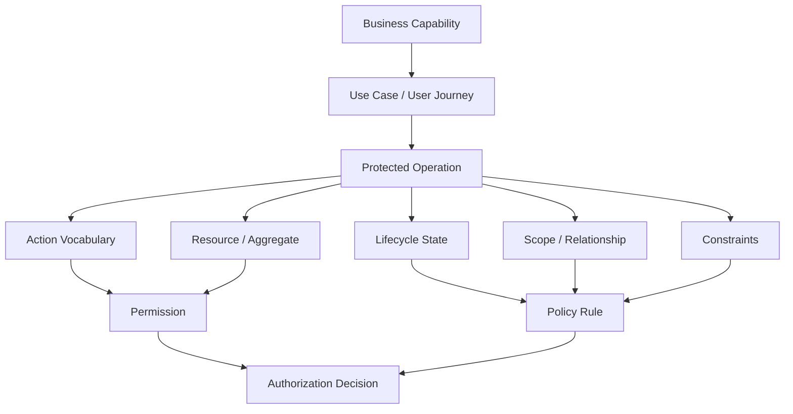
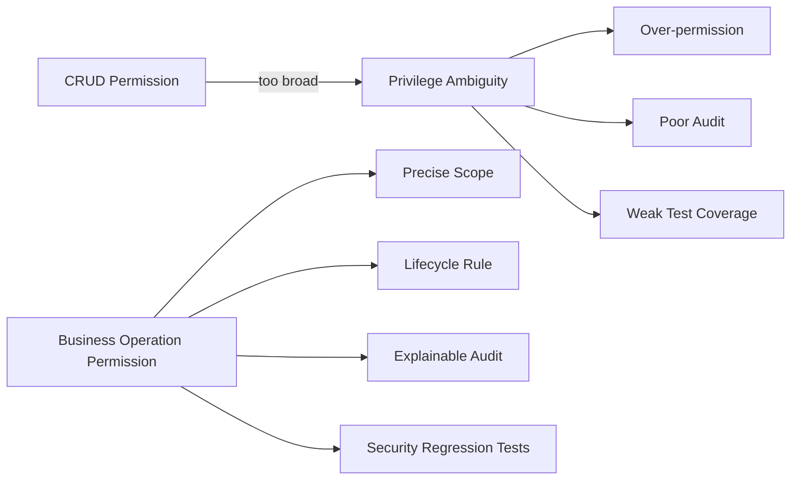
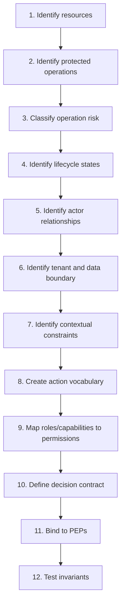
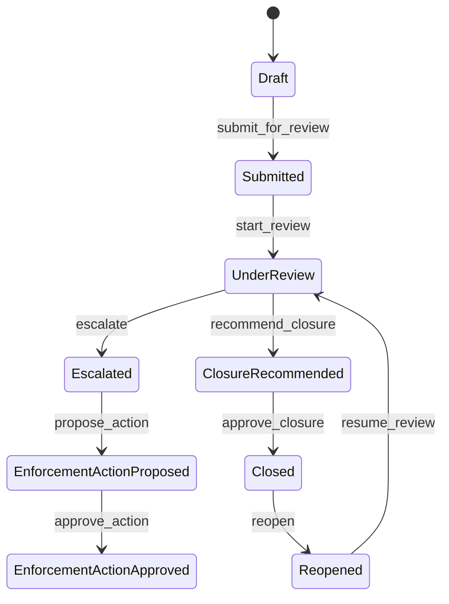
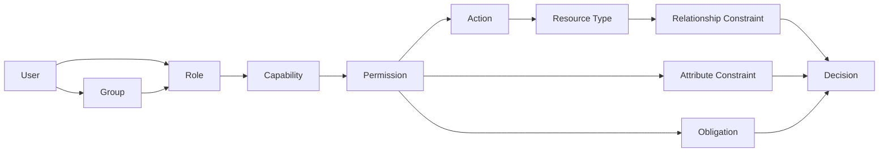
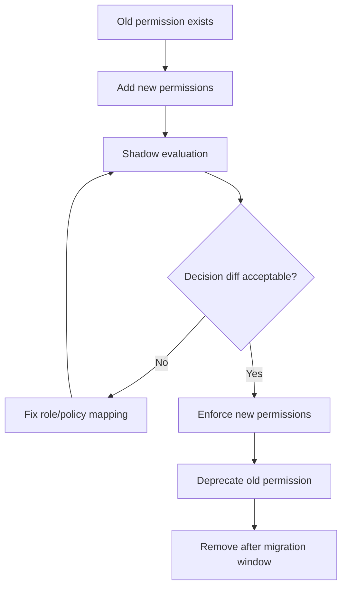

# Part 009 — Domain Permission Modeling: From Business Capability to Permission Graph

Authorization yang kuat tidak dimulai dari pertanyaan:

> role apa saja yang kita butuhkan?

Authorization yang kuat dimulai dari pertanyaan:

> business operation apa yang berisiko, terhadap resource apa, dalam state apa, oleh actor seperti apa, dengan scope dan evidence apa?

Kalau tim langsung membuat role seperti `ADMIN`, `SUPERVISOR`, `MAKER`, `CHECKER`, `OPERATOR`, `VIEWER`, biasanya sistem akan tampak cepat selesai pada sprint awal, lalu runtuh saat domain mulai nyata:

- user boleh approve quote, tetapi hanya quote di branch sendiri;
- user boleh melihat case, tetapi tidak boleh melihat evidence sensitif;
- user boleh assign case, tetapi tidak boleh assign ke dirinya sendiri;
- supervisor boleh override, tetapi hanya setelah escalation level 2;
- investigator boleh edit draft finding, tetapi tidak boleh edit setelah submitted;
- compliance officer boleh export report, tetapi export harus audited dan redacted;
- support engineer boleh impersonate read-only, tetapi tidak boleh melakukan state transition;
- service account boleh consume event, tetapi tidak boleh menjalankan command yang memerlukan human approval.

Masalahnya bukan Spring Security, bukan JWT, bukan annotation. Masalahnya adalah **permission model tidak berasal dari domain semantics**.

Part ini membangun cara berpikir untuk mengubah business capability menjadi permission graph yang siap diimplementasikan di Java.

---

## 1. Learning Target

Setelah part ini, targetnya bukan sekadar tahu istilah permission. Targetnya adalah mampu:

1. membedakan role, permission, capability, entitlement, scope, ownership, assignment, dan constraint;
2. menurunkan permission dari use case dan lifecycle state, bukan dari nama jabatan;
3. membuat action vocabulary yang stabil dan tidak meledak;
4. membangun permission graph yang bisa mendukung RBAC, ABAC, ReBAC, dan hybrid model;
5. mendesain permission agar cocok untuk API, UI, service layer, repository query, async worker, dan audit;
6. menghindari role explosion, hidden admin, dan stringly permission;
7. membuat model yang bisa dites sebagai security invariant.



---

## 2. Core Distinction: Capability, Permission, Role, Entitlement

Dalam production system, empat istilah ini harus dipisah.

| Concept | Makna | Contoh | Salah kaprah umum |
|---|---|---|---|
| Capability | Kemampuan bisnis yang ingin diberikan | Manage regulatory cases | Dianggap sama dengan role |
| Permission | Hak teknis melakukan action pada resource | `case.approve_closure` | Terlalu CRUD dan kehilangan business semantics |
| Role | Paket permission untuk tipe actor tertentu | `case_supervisor` | Dipakai sebagai decision langsung di semua layer |
| Entitlement | Hak efektif user setelah role, subscription, delegation, tenant, license, policy digabung | user A boleh approve case X | Dianggap statis seperti claim JWT |

Formula sederhananya:

```text
capability = bahasa bisnis
permission = bahasa sistem
authorization decision = permission + context + relationship + state + policy
entitlement = hasil efektif yang dialami user
```

Contoh:

```text
Capability:
  Close enforcement case

Protected operations:
  - submit closure recommendation
  - review closure recommendation
  - approve closure
  - reject closure
  - reopen closed case

Permissions:
  - case.closure.submit
  - case.closure.review
  - case.closure.approve
  - case.closure.reject
  - case.reopen

Contextual rules:
  - submitter cannot approve own recommendation
  - case must be in CLOSURE_RECOMMENDED state
  - approver must be assigned to same jurisdiction
  - sensitive evidence must already be reviewed
  - decision must be audited with reason
```

Perhatikan: permission bukan hanya `case.update`. Permission adalah **business operation**.

---

## 3. Jangan Mulai dari CRUD

CRUD berguna sebagai mnemonic teknis, tetapi buruk sebagai permission model enterprise.

CRUD terlalu miskin:

```text
case.create
case.read
case.update
case.delete
```

Apa arti `case.update`?

- edit title?
- change assignee?
- attach evidence?
- change risk score?
- submit for approval?
- close case?
- reopen case?
- mark as confidential?
- escalate to enforcement board?

Semua itu punya risiko berbeda, audit berbeda, separation of duty berbeda, dan lifecycle rule berbeda.

Model yang lebih benar:

```text
case.create_draft
case.view_summary
case.view_sensitive_details
case.edit_draft
case.submit_for_review
case.assign_investigator
case.change_priority
case.escalate
case.approve_enforcement_action
case.close
case.reopen
case.export
```

CRUD boleh tetap ada untuk low-risk internal resource, tetapi untuk domain utama, pakai **operation-level permission**.



---

## 4. Permission Modeling Pipeline

Gunakan pipeline berikut setiap kali mendesain authorization untuk domain baru.



Setiap langkah menghasilkan artifact kecil yang bisa direview.

---

## 5. Step 1 — Identify Resources by Aggregate, Not Table

Resource authorization sebaiknya mengikuti **domain aggregate**, bukan database table mentah.

Contoh regulatory case management:

| Database Table | Domain Resource | Authorization Meaning |
|---|---|---|
| `cases` | `case` | primary regulated case |
| `case_assignments` | `case_assignment` atau relationship | siapa berhak bekerja pada case |
| `evidence_files` | `evidence` | file, attachment, document, sensitive material |
| `findings` | `finding` | hasil investigasi |
| `enforcement_actions` | `enforcement_action` | action yang berdampak legal/regulatory |
| `case_notes` | `case_note` | komentar internal atau external |
| `audit_events` | `audit_event` | biasanya append-only dan protected |

Kesalahan umum: membuat permission berdasarkan table.

```text
cases.read
case_assignments.update
evidence_files.read
findings.update
```

Model seperti ini cepat bocor karena developer harus memahami detail storage untuk memahami access. Permission harus mengikuti bahasa domain:

```text
case.view
case.assign
case.escalate
evidence.view
finding.submit
finding.approve
enforcement_action.issue
```

Kalau satu business operation menyentuh banyak table, permission tetap satu.

```text
Operation: approve enforcement action
Tables touched:
  - enforcement_actions
  - cases
  - case_events
  - audit_events
  - notifications
Permission:
  enforcement_action.approve
```

---

## 6. Step 2 — Identify Protected Operations

Protected operation adalah operasi yang harus diputuskan oleh authorization sebelum dieksekusi.

Cara menemukannya:

1. ambil semua API endpoint;
2. ambil semua command/application service method;
3. ambil semua state transition;
4. ambil semua query/list/export/report;
5. ambil semua async job yang menjalankan efek bisnis;
6. ambil semua admin tool;
7. ambil semua field sensitif dan attachment;
8. ambil semua operation yang mengubah assignment, ownership, status, risk score, money, legal outcome, atau visibility.

Template inventaris:

| Operation | Resource | Command/Query | Risk | Needs Object Check | Needs State Check | Needs Audit |
|---|---|---:|---:|---:|---:|---:|
| View case summary | Case | Query | Medium | Yes | Sometimes | Yes |
| View sensitive evidence | Evidence | Query | High | Yes | Yes | Yes |
| Submit finding | Finding | Command | High | Yes | Yes | Yes |
| Approve enforcement action | EnforcementAction | Command | Critical | Yes | Yes | Yes |
| Export case report | Case/Report | Async Query | Critical | Yes | Yes | Yes |
| Reassign case | CaseAssignment | Command | High | Yes | Yes | Yes |

Untuk Java application service, protected operations sering muncul sebagai method:

```java
public interface CaseCommandService {
    CaseId createDraft(CreateCaseCommand command);
    void submitForReview(CaseId caseId, SubmitReviewCommand command);
    void assignInvestigator(CaseId caseId, AssignInvestigatorCommand command);
    void escalate(CaseId caseId, EscalateCaseCommand command);
    void approveClosure(CaseId caseId, ApproveClosureCommand command);
}
```

Setiap method di atas harus punya authorization story.

---

## 7. Step 3 — Classify Operation Risk

Tidak semua permission punya desain yang sama. Operasi low-risk bisa memakai role gate sederhana. Operasi critical butuh object-level check, separation of duty, audit, dan kadang step-up.

| Risk | Example | Typical Controls |
|---|---|---|
| Low | view own notification | authenticated + owner scope |
| Medium | view case summary | role + tenant + assignment/jurisdiction |
| High | edit finding | role + object + state + assignment + audit |
| Critical | approve enforcement action | role + object + state + SoD + reason + audit + possibly step-up |
| Break-glass | emergency access to sealed case | special policy + time-bound + enhanced audit + post-review |

Risk classification membantu menentukan enforcement depth.

```text
Low-risk operation:
  maybe request-level guard + query scope is enough

High-risk operation:
  request guard + service guard + state transition guard + audit

Critical operation:
  all high-risk controls + SoD + approval workflow + immutable evidence
```

---

## 8. Step 4 — Model Lifecycle State

Banyak authorization rule sebenarnya adalah **state transition rule**.

Contoh lifecycle case:



Permission tidak boleh hanya memeriksa action. Permission harus memeriksa **from-state** dan kadang **to-state**.

```text
case.closure.approve is allowed only if:
  resource.type == CASE
  action == case.closure.approve
  case.status == CLOSURE_RECOMMENDED
  subject != case.closureRecommendedBy
  subject has jurisdiction over case.jurisdiction
  subject has active role CASE_CLOSURE_APPROVER
```

Di Java, jangan sembunyikan rule state transition di controller.

Buruk:

```java
@PreAuthorize("hasRole('SUPERVISOR')")
@PostMapping("/cases/{id}/close")
public void close(@PathVariable UUID id) {
    service.close(id);
}
```

Lebih baik:

```java
public void approveClosure(PrincipalRef principal, CaseId caseId, ApproveClosureCommand command) {
    CaseRecord caseRecord = caseRepository.getRequired(caseId);

    authz.verify(AuthorizationRequest.command()
        .subject(principal)
        .action(Action.CASE_CLOSURE_APPROVE)
        .resource(ResourceRef.caseRef(caseRecord.id(), caseRecord.tenantId()))
        .resourceAttributes(CaseAttributes.from(caseRecord))
        .context(OperationContext.from(command))
        .build());

    caseRecord.approveClosure(command.reason(), principal.userId());
    caseRepository.save(caseRecord);
}
```

Lalu domain tetap menolak state transition yang tidak valid, meskipun caller punya permission.

```java
public void approveClosure(String reason, UserId approverId) {
    if (status != CaseStatus.CLOSURE_RECOMMENDED) {
        throw new InvalidCaseTransitionException(status, CaseStatus.CLOSED);
    }
    if (closureRecommendedBy.equals(approverId)) {
        throw new SeparationOfDutyViolation("Recommender cannot approve closure");
    }
    this.status = CaseStatus.CLOSED;
    this.closedBy = approverId;
    this.closedReason = reason;
}
```

Authorization dan domain invariant saling melengkapi. Authorization menjawab **boleh atau tidak**. Domain invariant menjawab **state transition ini valid atau tidak**.

---

## 9. Step 5 — Identify Actor Relationships

Object-level authorization sering bergantung pada relationship.

Contoh relationship:

| Relationship | Meaning | Example Rule |
|---|---|---|
| owner | creator/owner resource | owner can edit draft |
| assignee | orang yang sedang ditugaskan | assignee can submit finding |
| reviewer | assigned reviewer | reviewer can approve/reject submission |
| supervisor | manager of assignee/team | supervisor can reassign |
| member | member organization/project/team | member can view shared resource |
| jurisdiction officer | actor punya authority di jurisdiction tertentu | officer can view case in jurisdiction |
| delegated approver | actor menerima delegation sementara | delegate can approve within time window |
| support observer | support punya read-only access | support can view metadata only |

Dalam sistem kecil, relationship bisa dicek via query lokal. Dalam sistem besar, relationship bisa masuk ke ReBAC/OpenFGA/Zanzibar-style system.

Contoh relationship tuple:

```text
case:CASE-100#assignee@user:U-10
case:CASE-100#supervisor@user:U-20
case:CASE-100#viewer@group:regional-a-investigators#member
jurisdiction:JK-01#officer@user:U-30
```

Rule konseptual:

```text
user can case.view if user is assignee or reviewer or supervisor or officer of case.jurisdiction
user can case.edit_draft if user is owner and case.status == DRAFT
user can case.approve if user is reviewer and user != submittedBy
```

---

## 10. Step 6 — Identify Tenant and Data Boundary

Tenant boundary harus menjadi constraint paling awal.

Prinsipnya:

```text
never trust tenant_id from request as the authorization boundary
always derive tenant boundary from authenticated context and persisted resource
```

Buruk:

```java
@GetMapping("/tenants/{tenantId}/cases/{caseId}")
public CaseDto getCase(@PathVariable UUID tenantId, @PathVariable UUID caseId) {
    return caseRepository.findById(caseId)
        .map(mapper::toDto)
        .orElseThrow(NotFoundException::new);
}
```

Lebih baik:

```java
public CaseDto getCase(PrincipalRef principal, TenantId tenantIdFromRoute, CaseId caseId) {
    TenantId effectiveTenant = tenantResolver.requireAllowedTenant(principal, tenantIdFromRoute);

    CaseRecord caseRecord = caseRepository.findVisibleCase(
            principal.userId(),
            effectiveTenant,
            caseId
        )
        .orElseThrow(NotFoundException::new);

    authz.verify(AuthorizationRequest.query()
        .subject(principal)
        .action(Action.CASE_VIEW)
        .resource(ResourceRef.caseRef(caseRecord.id(), caseRecord.tenantId()))
        .resourceAttributes(CaseAttributes.from(caseRecord))
        .build());

    return mapper.toDto(caseRecord);
}
```

Untuk list/search endpoint, tenant filter harus terjadi **sebelum pagination**.

Buruk:

```sql
select * from cases
order by created_at desc
limit 50 offset 0;
-- lalu filter di Java
```

Benar:

```sql
select c.*
from cases c
where c.tenant_id = :tenant_id
  and exists (
      select 1
      from case_visibility v
      where v.case_id = c.id
        and v.user_id = :user_id
  )
order by c.created_at desc
limit :limit offset :offset;
```

Kalau filter dilakukan setelah pagination, user bisa melihat jumlah, timing, atau pola data yang tidak seharusnya diketahui.

---

## 11. Step 7 — Identify Contextual Constraints

Contextual constraints adalah kondisi tambahan di luar role dan permission dasar.

Contoh:

| Constraint | Example |
|---|---|
| State | case must be `UNDER_REVIEW` |
| Ownership | actor must be case owner |
| Assignment | actor must be assigned investigator |
| Separation of duty | submitter cannot approve own submission |
| Jurisdiction | actor must have authority over region |
| Data classification | sensitive evidence requires special clearance |
| Time | delegation valid until specific date |
| Channel | operation allowed only from backoffice console |
| Risk | high-risk action requires step-up authentication |
| Reason | approval requires non-empty reason |
| Quota | export limited per day |
| License/subscription | feature enabled for tenant |
| Emergency | break-glass requires incident ticket |

ABAC dari NIST memodelkan decision berdasarkan atribut subject, object, operation, dan environment. Dalam praktik Java, kita bisa mengelompokkan context seperti ini:

```java
public record AuthorizationContext(
    SubjectAttributes subject,
    ResourceAttributes resource,
    ActionAttributes action,
    EnvironmentAttributes environment,
    RequestMetadata request
) {}
```

Hindari context sebagai map liar tanpa schema.

Buruk:

```java
Map<String, Object> ctx = new HashMap<>();
ctx.put("s", user);
ctx.put("status", "x");
ctx.put("foo", true);
```

Lebih baik:

```java
public record CaseAuthorizationAttributes(
    TenantId tenantId,
    CaseStatus status,
    JurisdictionId jurisdictionId,
    UserId ownerId,
    UserId assigneeId,
    UserId submittedBy,
    Sensitivity sensitivity,
    boolean sealed
) {}
```

Policy yang butuh field baru harus menambah field secara sadar, bukan diam-diam mencari string key yang mungkin null.

---

## 12. Step 8 — Create Action Vocabulary

Action vocabulary adalah daftar action yang dikenal authorization system.

Action harus:

- stabil;
- domain-oriented;
- tidak terlalu generik;
- tidak terlalu granular sampai tidak bisa dikelola;
- versionable;
- mudah diaudit;
- mudah dibaca oleh engineer dan domain owner.

### 12.1 Naming Convention

Gunakan pola:

```text
<resource>.<operation>
<resource>.<subdomain>.<operation>
<resource>.<operation>.<variant>
```

Contoh:

```text
case.view
case.view_sensitive
case.create_draft
case.edit_draft
case.submit_for_review
case.assign
case.escalate
case.close
case.reopen

evidence.upload
evidence.view
evidence.view_sensitive
evidence.delete_draft
evidence.seal

finding.create
finding.submit
finding.review
finding.approve
finding.reject

enforcement_action.propose
enforcement_action.approve
enforcement_action.issue

report.export_case_summary
report.export_sensitive_evidence
```

### 12.2 Avoid UI-Centric Names

Buruk:

```text
button.submit.enabled
screen.case.detail.open
menu.admin.visible
```

UI permission bisa berubah saat desain UI berubah. Permission harus mengikuti operation.

Benar:

```text
case.submit_for_review
case.view
admin.user_access.manage
```

### 12.3 Avoid Role-Centric Names

Buruk:

```text
supervisor.approve
admin.delete
maker.submit
checker.approve
```

Role bisa berubah. Operation tetap.

Benar:

```text
case.closure.approve
case.assignment.update
finding.review
```

### 12.4 Avoid CRUD-Only Names for High-Risk Domain

Buruk:

```text
case.update
```

Lebih baik:

```text
case.edit_draft
case.change_priority
case.assign
case.escalate
case.approve_closure
```

---

## 13. Java Type-Safe Action Catalog

String permission raw mudah typo dan sulit direfactor.

Buruk:

```java
if (authz.can(user, "CASE_APROVE")) { // typo
    approve(caseId);
}
```

Lebih baik gunakan action catalog.

```java
public enum Action {
    CASE_VIEW("case.view"),
    CASE_VIEW_SENSITIVE("case.view_sensitive"),
    CASE_CREATE_DRAFT("case.create_draft"),
    CASE_EDIT_DRAFT("case.edit_draft"),
    CASE_SUBMIT_FOR_REVIEW("case.submit_for_review"),
    CASE_ASSIGN("case.assign"),
    CASE_ESCALATE("case.escalate"),
    CASE_CLOSURE_APPROVE("case.closure.approve"),
    CASE_REOPEN("case.reopen"),

    EVIDENCE_UPLOAD("evidence.upload"),
    EVIDENCE_VIEW("evidence.view"),
    EVIDENCE_VIEW_SENSITIVE("evidence.view_sensitive"),
    EVIDENCE_SEAL("evidence.seal"),

    REPORT_EXPORT_CASE_SUMMARY("report.export_case_summary"),
    REPORT_EXPORT_SENSITIVE_EVIDENCE("report.export_sensitive_evidence");

    private final String value;

    Action(String value) {
        this.value = value;
    }

    public String value() {
        return value;
    }
}
```

Untuk sistem besar, enum kadang terlalu kaku karena permission bisa dikelola di database. Kompromi yang sering bagus:

1. action canonical didefinisikan di code untuk operasi yang dieksekusi code;
2. role-to-permission assignment bisa dikelola di database;
3. startup validation memastikan semua permission di DB dikenal oleh catalog;
4. migration menambah permission baru secara eksplisit.

```java
public final class PermissionCatalog {
    private final Map<String, PermissionDefinition> definitions;

    public PermissionCatalog(Collection<PermissionDefinition> definitions) {
        this.definitions = definitions.stream()
            .collect(Collectors.toUnmodifiableMap(PermissionDefinition::name, d -> d));
    }

    public PermissionDefinition requireKnown(String name) {
        PermissionDefinition definition = definitions.get(name);
        if (definition == null) {
            throw new UnknownPermissionException(name);
        }
        return definition;
    }

    public boolean isKnown(String name) {
        return definitions.containsKey(name);
    }
}

public record PermissionDefinition(
    String name,
    ResourceType resourceType,
    OperationKind operationKind,
    RiskLevel riskLevel,
    boolean objectLevelRequired,
    boolean auditRequired,
    boolean stateCheckRequired
) {}
```

---

## 14. Permission Graph

RBAC sederhana melihat permission sebagai daftar datar:

```text
role -> permissions
```

Sistem enterprise butuh graph:



Graph ini memisahkan:

- siapa user itu;
- paket akses apa yang dimiliki user;
- business capability apa yang diberikan;
- action teknis apa yang diizinkan;
- resource type apa yang relevan;
- object relationship apa yang harus benar;
- attribute/context constraint apa yang harus benar;
- obligation apa yang harus dieksekusi.

Contoh model:

```text
user:U-10
  memberOf group:regional-a-investigators

group:regional-a-investigators
  assigned role:case_investigator

role:case_investigator
  grants capability:case_investigation

capability:case_investigation
  grants permission:case.view
  grants permission:case.edit_draft
  grants permission:evidence.upload
  grants permission:finding.submit

permission:finding.submit
  resourceType: finding
  requires:
    - case.status in [UNDER_REVIEW, ESCALATED]
    - user is assigned investigator of case
    - case.tenant == user.activeTenant
  obligations:
    - audit_decision
```

Di Java, graph bisa direpresentasikan sebagai read model authorization.

```java
public record EffectivePermission(
    UserId userId,
    TenantId tenantId,
    String permission,
    Set<String> scopes,
    Instant validFrom,
    Instant validUntil,
    String source,
    long policyVersion
) {}
```

Tetapi effective permission saja tidak cukup untuk object-level authorization. Ia harus digabung dengan resource attributes dan relationship check.

```java
public AuthorizationDecision decide(AuthorizationRequest request) {
    boolean hasBasePermission = permissionResolver
        .hasPermission(request.subject(), request.tenantId(), request.action().value());

    if (!hasBasePermission) {
        return AuthorizationDecision.deny("MISSING_PERMISSION");
    }

    RelationshipResult relationship = relationshipResolver.check(
        request.subject(),
        request.action(),
        request.resource()
    );

    if (!relationship.allowed()) {
        return AuthorizationDecision.deny("RELATIONSHIP_NOT_SATISFIED");
    }

    AttributeResult attributes = attributePolicy.evaluate(request);

    if (!attributes.allowed()) {
        return AuthorizationDecision.deny(attributes.reason());
    }

    return AuthorizationDecision.allow()
        .withObligation(Obligation.auditDecision())
        .build();
}
```

---

## 15. Role-to-Permission Mapping

Role adalah packaging mechanism, bukan business truth final.

Contoh role:

| Role | Base Permissions | Notes |
|---|---|---|
| `case_viewer` | `case.view`, `evidence.view` | still scoped by tenant/assignment |
| `case_investigator` | `case.view`, `case.edit_draft`, `evidence.upload`, `finding.submit` | cannot approve own finding |
| `case_reviewer` | `finding.review`, `finding.approve`, `finding.reject` | needs SoD |
| `case_supervisor` | `case.assign`, `case.escalate`, `case.change_priority` | jurisdiction constrained |
| `enforcement_approver` | `enforcement_action.approve`, `case.closure.approve` | high audit |
| `support_readonly` | `case.view_metadata` | redacted by default |

Jangan membuat role untuk setiap kombinasi constraint:

```text
case_investigator_jakarta_low_risk_sensitive_export_disabled
```

Itu role explosion.

Gunakan role untuk base permission, dan policy/attribute untuk constraint:

```text
role: case_investigator
permission: finding.submit
constraints:
  - tenant == active tenant
  - case.jurisdiction in subject.jurisdictions
  - subject is assigned to case
  - case.status permits submission
```

---

## 16. Scope Modeling

Scope menjawab: permission ini berlaku di wilayah mana?

Contoh scope:

| Scope Type | Example |
|---|---|
| global | all tenants, usually platform admin only |
| tenant | tenant A |
| organization | department/regional office |
| jurisdiction | legal/regulatory region |
| project/workspace | workspace member |
| resource | specific case/document |
| relationship | owner/assignee/reviewer |
| temporary | delegation until timestamp |

Representasi scope jangan ambigu.

Buruk:

```java
String scope = "ALL";
```

Lebih baik:

```java
public sealed interface AccessScope permits GlobalScope, TenantScope, JurisdictionScope,
        OrganizationScope, ResourceScope, RelationshipScope, TemporaryScope {}

public record GlobalScope() implements AccessScope {}
public record TenantScope(TenantId tenantId) implements AccessScope {}
public record JurisdictionScope(JurisdictionId jurisdictionId) implements AccessScope {}
public record OrganizationScope(OrganizationId organizationId) implements AccessScope {}
public record ResourceScope(ResourceRef resource) implements AccessScope {}
public record RelationshipScope(String relation) implements AccessScope {}
public record TemporaryScope(AccessScope delegate, Instant validUntil) implements AccessScope {}
```

Scope harus menjadi bagian dari audit dan cache key.

```text
decision cache key = subject + action + resource + relevant scope + policy version + attribute version
```

---

## 17. Delegation Modeling

Delegation bukan role assignment biasa.

Delegation harus punya:

- delegator;
- delegatee;
- permission/capability yang didelegasikan;
- scope;
- waktu valid;
- reason;
- approval status;
- revocation status;
- audit trail.

```java
public record Delegation(
    DelegationId id,
    UserId delegator,
    UserId delegatee,
    Set<String> permissions,
    AccessScope scope,
    Instant validFrom,
    Instant validUntil,
    String reason,
    DelegationStatus status
) {}
```

Rule penting:

```text
delegatee cannot receive more authority than delegator effectively has
```

Artinya delegation harus mengevaluasi effective authority delegator pada scope yang sama.

```java
public void createDelegation(UserId delegator, CreateDelegationCommand command) {
    for (String permission : command.permissions()) {
        authz.verify(AuthorizationRequest.command()
            .subject(PrincipalRef.user(delegator))
            .action(Action.DELEGATION_CREATE)
            .resource(ResourceRef.scope(command.scope()))
            .context(Map.of(
                "delegatedPermission", permission,
                "delegatee", command.delegatee()
            ))
            .build());

        authz.verify(AuthorizationRequest.command()
            .subject(PrincipalRef.user(delegator))
            .action(Action.from(permission))
            .resource(ResourceRef.scope(command.scope()))
            .build());
    }

    delegationRepository.save(...);
}
```

Delegation harus mudah dicabut dan tidak boleh hanya berada di JWT jangka panjang.

---

## 18. Separation of Duty Modeling

Separation of Duty adalah constraint bahwa actor yang sama tidak boleh melakukan kombinasi aksi tertentu.

Ada dua jenis utama:

| Type | Meaning | Example |
|---|---|---|
| Static SoD | user tidak boleh punya dua role sekaligus | user tidak boleh punya `requester` dan `approver` dalam domain sama |
| Dynamic SoD | user boleh punya dua role, tetapi tidak boleh menjalankan dua action pada object yang sama | user boleh submit dan approve secara umum, tapi tidak boleh approve submission sendiri |

Dynamic SoD lebih umum di sistem enterprise.

```text
allow finding.approve if:
  user has finding.approve
  finding.status == SUBMITTED
  finding.submittedBy != user.id
```

Jangan mengandalkan UI untuk menyembunyikan tombol approve. Rule harus ada di service/domain.

```java
public void approveFinding(PrincipalRef principal, FindingId findingId, ApproveFindingCommand command) {
    Finding finding = findingRepository.getRequired(findingId);

    authz.verify(AuthorizationRequest.command()
        .subject(principal)
        .action(Action.FINDING_APPROVE)
        .resource(ResourceRef.finding(finding.id(), finding.tenantId()))
        .resourceAttributes(FindingAttributes.from(finding))
        .build());

    finding.approve(principal.userId(), command.reason());
    findingRepository.save(finding);
}
```

Domain invariant tetap perlu:

```java
public void approve(UserId approver, String reason) {
    if (submittedBy.equals(approver)) {
        throw new SeparationOfDutyViolation("Submitter cannot approve own finding");
    }
    if (status != FindingStatus.SUBMITTED) {
        throw new InvalidFindingTransitionException(status, FindingStatus.APPROVED);
    }
    this.status = FindingStatus.APPROVED;
    this.approvedBy = approver;
    this.approvedReason = reason;
}
```

---

## 19. Permission Matrix Is a Review Tool, Not the Whole Model

Permission matrix berguna untuk diskusi dengan domain owner, security, compliance, dan QA.

Contoh matrix awal:

| Operation | Viewer | Investigator | Reviewer | Supervisor | Approver | Support |
|---|---:|---:|---:|---:|---:|---:|
| `case.view` | yes | yes | yes | yes | yes | metadata only |
| `case.view_sensitive` | no | assigned only | review only | jurisdiction only | yes | no |
| `case.edit_draft` | no | owner only | no | no | no | no |
| `case.assign` | no | no | no | jurisdiction | no | no |
| `finding.submit` | no | assigned only | no | no | no | no |
| `finding.approve` | no | no | not own | supervisor override | yes | no |
| `case.closure.approve` | no | no | no | no | not recommender | no |
| `report.export_sensitive_evidence` | no | no | no | no | approved export role | no |

Tetapi matrix tidak cukup karena tidak mengekspresikan:

- tenant;
- state;
- relationship;
- SoD;
- data classification;
- time-bounded delegation;
- obligations;
- deny reason;
- cacheability;
- audit level.

Karena itu matrix harus dikonversi menjadi policy rules dan tests.

---

## 20. Mapping Permission to API Endpoints

Setiap endpoint harus punya protected operation.

| Endpoint | Operation | Notes |
|---|---|---|
| `GET /cases/{id}` | `case.view` | object-level check |
| `GET /cases/{id}/evidence/{evidenceId}` | `evidence.view` or `evidence.view_sensitive` | depends classification |
| `POST /cases/{id}/submit-review` | `case.submit_for_review` | state transition |
| `POST /cases/{id}/assignments` | `case.assign` | relationship mutation |
| `POST /findings/{id}/approve` | `finding.approve` | dynamic SoD |
| `POST /reports/case-export` | `report.export_case_summary` | async query authorization |

Pattern Java:

```java
@Retention(RetentionPolicy.RUNTIME)
@Target({ElementType.METHOD})
public @interface RequiresAction {
    Action value();
}
```

Tetapi annotation tidak boleh menjadi satu-satunya enforcement untuk object-level operation.

```java
@RequiresAction(Action.CASE_VIEW)
@GET
@Path("/cases/{caseId}")
public Response getCase(@PathParam("caseId") UUID caseId) {
    CaseDto dto = caseQueryService.getCase(currentPrincipal(), new CaseId(caseId));
    return Response.ok(dto).build();
}
```

Application service tetap melakukan object-level check setelah resource atau visibility projection tersedia.

---

## 21. Mapping Permission to UI

UI authorization berguna untuk UX, bukan security boundary.

UI boleh bertanya:

```http
POST /authorization/batch-decide
```

Input:

```json
{
  "decisions": [
    { "action": "case.view", "resource": { "type": "case", "id": "CASE-100" } },
    { "action": "case.assign", "resource": { "type": "case", "id": "CASE-100" } },
    { "action": "case.closure.approve", "resource": { "type": "case", "id": "CASE-100" } }
  ]
}
```

Output:

```json
{
  "decisions": [
    { "action": "case.view", "effect": "ALLOW" },
    { "action": "case.assign", "effect": "DENY", "reasonCode": "NOT_SUPERVISOR_FOR_JURISDICTION" },
    { "action": "case.closure.approve", "effect": "DENY", "reasonCode": "CASE_NOT_CLOSURE_RECOMMENDED" }
  ]
}
```

Tetapi backend tetap memeriksa ulang saat command dijalankan.

```text
UI permission = hint
backend permission = enforcement
```

---

## 22. Mapping Permission to Repository Query

List/search harus memakai query scoping.

Contoh repository method:

```java
public interface CaseQueryRepository {
    Page<CaseSummaryRow> searchVisibleCases(
        UserId userId,
        TenantId tenantId,
        CaseSearchCriteria criteria,
        Pageable pageable
    );
}
```

SQL view/predicate:

```sql
select c.id, c.case_number, c.status, c.priority, c.created_at
from cases c
where c.tenant_id = :tenant_id
  and (
      c.owner_id = :user_id
      or c.assignee_id = :user_id
      or exists (
          select 1
          from jurisdiction_membership jm
          where jm.user_id = :user_id
            and jm.jurisdiction_id = c.jurisdiction_id
      )
  )
  and (:status is null or c.status = :status)
order by c.created_at desc
limit :limit offset :offset;
```

Authorization model harus eksplisit menentukan query scope untuk setiap list/search/report.

```text
case.search uses visible_case predicate
case.export uses exportable_case predicate + enhanced audit
```

---

## 23. Mapping Permission to Events and Workers

Command authorization sebelum publish event tidak cukup jika event dieksekusi nanti.

Contoh:

```java
public void requestSensitiveReport(PrincipalRef principal, ReportRequest command) {
    authz.verify(... REPORT_EXPORT_SENSITIVE_EVIDENCE ...);

    reportJobRepository.enqueue(new ReportJob(
        command.reportType(),
        principal.userId(),
        command.filters(),
        authorizationSnapshot.capture(principal, Action.REPORT_EXPORT_SENSITIVE_EVIDENCE)
    ));
}
```

Worker harus tahu apakah menggunakan:

1. authorization snapshot pada waktu request;
2. recheck current authorization pada waktu execution;
3. kombinasi snapshot + recheck untuk operasi critical.

Untuk regulatory systems, banyak operasi harus menyimpan snapshot agar audit bisa menjelaskan mengapa job boleh dibuat saat itu. Tetapi sebelum efek final, recheck kadang tetap diperlukan, terutama jika access dicabut sebelum job berjalan.

```java
public void executeReportJob(ReportJob job) {
    AuthorizationSnapshot snapshot = job.authorizationSnapshot();

    authz.verifySnapshot(snapshot);

    if (job.requiresFreshAuthorization()) {
        authz.verify(AuthorizationRequest.command()
            .subject(PrincipalRef.user(job.requestedBy()))
            .action(Action.REPORT_EXPORT_SENSITIVE_EVIDENCE)
            .resource(ResourceRef.report(job.id(), job.tenantId()))
            .context(job.executionContext())
            .build());
    }

    reportGenerator.generate(job);
}
```

---

## 24. Permission Lifecycle Governance

Permission bukan hanya code. Permission adalah contract jangka panjang antara engineering, security, compliance, product, support, dan operations.

Setiap permission perlu metadata:

```yaml
name: case.closure.approve
description: Approve a recommendation to close a regulatory case.
resourceType: case
riskLevel: critical
ownerTeam: enforcement-platform
introducedIn: 2026.07
objectLevelRequired: true
stateCheckRequired: true
auditRequired: true
sodRequired: true
allowedForRoles:
  - enforcement_approver
constraints:
  - case.status == CLOSURE_RECOMMENDED
  - subject.id != case.closureRecommendedBy
  - subject.jurisdictions contains case.jurisdictionId
obligations:
  - audit_decision
  - require_reason
```

Governance rules:

- permission baru harus punya owner;
- permission high/critical harus punya threat model;
- permission tidak boleh dihapus tanpa migration plan;
- permission rename adalah breaking change;
- wildcard permission harus dibatasi;
- role assignment harus direview berkala;
- emergency permission harus time-bound;
- permission drift harus dideteksi di CI.

---

## 25. Permission Migration Strategy

Saat sistem berkembang, permission berubah.

Contoh awal:

```text
case.update
```

Kemudian dipecah:

```text
case.edit_draft
case.change_priority
case.assign
case.escalate
case.closure.approve
```

Migration aman:

1. tambahkan permission baru ke catalog;
2. tambahkan mapping sementara dari permission lama ke permission baru;
3. jalankan dual-check atau shadow evaluation;
4. ukur decision diff;
5. update role assignment;
6. aktifkan enforcement permission baru;
7. hapus permission lama setelah tidak ada caller;
8. simpan audit migration.



---

## 26. Anti-Patterns

### 26.1 `ROLE_ADMIN` Everywhere

```java
@PreAuthorize("hasRole('ADMIN')")
```

Masalah:

- tidak menjelaskan operation;
- tidak object-level;
- sulit diaudit;
- sulit melakukan least privilege;
- mendorong admin superpower.

Lebih baik:

```java
@PreAuthorize("@caseGuard.canAssign(authentication, #caseId)")
```

Atau lebih eksplisit di service:

```java
authz.verify(commandRequest(principal, Action.CASE_ASSIGN, caseRecord));
```

### 26.2 Permission Named After UI

```text
case-detail-page-edit-button
```

UI berubah, permission rusak.

### 26.3 Role Explosion

```text
regional_case_supervisor_jakarta_sensitive_level_2_approver
```

Ini constraint yang disamarkan sebagai role. Pakai role + ABAC/ReBAC constraints.

### 26.4 Permission Without Resource

```java
authz.can(user, "case.close")
```

Tanpa resource, tidak bisa cek ownership, assignment, tenant, state, atau SoD.

### 26.5 Permission Without Audit Meaning

Jika audit log hanya menulis:

```text
user U-10 allowed permission case.update
```

Itu buruk. Audit harus menjelaskan:

```text
user U-10 allowed case.closure.approve on case CASE-100 because role=enforcement_approver, jurisdiction=JK-01, case.status=CLOSURE_RECOMMENDED, policyVersion=42
```

### 26.6 Permission As JWT Claim Forever

JWT claim seperti:

```json
{
  "permissions": ["case.approve", "case.export"]
}
```

berbahaya jika dianggap final untuk object-level authorization. Claim bisa stale, tidak tahu resource state, tidak tahu relationship, tidak tahu revocation.

Gunakan claim sebagai input, bukan final decision.

---

## 27. Implementation Blueprint

Minimal production-grade Java blueprint:

```java
public interface AuthorizationService {
    AuthorizationDecision decide(AuthorizationRequest request);

    default void verify(AuthorizationRequest request) {
        AuthorizationDecision decision = decide(request);
        if (!decision.allowed()) {
            throw new AccessDeniedException(decision.reasonCode());
        }
    }
}
```

Action/resource catalog:

```java
public record ProtectedOperation(
    Action action,
    ResourceType resourceType,
    OperationKind operationKind,
    RiskLevel riskLevel,
    boolean requiresObject,
    boolean requiresState,
    boolean requiresAudit,
    Set<String> requiredAttributes
) {}
```

Permission resolver:

```java
public interface PermissionResolver {
    boolean hasBasePermission(SubjectRef subject, TenantId tenantId, Action action);
}
```

Relationship resolver:

```java
public interface RelationshipResolver {
    RelationshipResult check(SubjectRef subject, Action action, ResourceRef resource);
}
```

Attribute policy evaluator:

```java
public interface AttributePolicyEvaluator {
    AttributeResult evaluate(AuthorizationRequest request);
}
```

Decision pipeline:

```java
public final class DefaultAuthorizationService implements AuthorizationService {
    private final PermissionCatalog catalog;
    private final PermissionResolver permissionResolver;
    private final RelationshipResolver relationshipResolver;
    private final AttributePolicyEvaluator attributePolicyEvaluator;
    private final AuthorizationAuditSink auditSink;

    @Override
    public AuthorizationDecision decide(AuthorizationRequest request) {
        ProtectedOperation operation = catalog.requireOperation(request.action());

        AuthorizationDecision decision = evaluate(operation, request);
        auditSink.record(request, decision);
        return decision;
    }

    private AuthorizationDecision evaluate(ProtectedOperation operation, AuthorizationRequest request) {
        if (operation.requiresObject() && request.resource().isUnspecified()) {
            return AuthorizationDecision.deny("RESOURCE_REQUIRED");
        }

        if (!permissionResolver.hasBasePermission(
                request.subject(), request.tenantId(), request.action())) {
            return AuthorizationDecision.deny("MISSING_BASE_PERMISSION");
        }

        if (!relationshipResolver.check(
                request.subject(), request.action(), request.resource()).allowed()) {
            return AuthorizationDecision.deny("RELATIONSHIP_DENIED");
        }

        AttributeResult attributeResult = attributePolicyEvaluator.evaluate(request);
        if (!attributeResult.allowed()) {
            return AuthorizationDecision.deny(attributeResult.reasonCode());
        }

        return AuthorizationDecision.allow()
            .reasonCode("ALLOWED_BY_POLICY")
            .policyVersion(attributeResult.policyVersion())
            .obligations(operation.requiresAudit()
                ? Set.of(Obligation.auditDecision())
                : Set.of())
            .build();
    }
}
```

---

## 28. Permission Modeling Checklist

Untuk setiap protected operation, jawab:

```text
[ ] Apa nama operation dalam bahasa domain?
[ ] Resource type apa yang dilindungi?
[ ] Apakah ini command atau query?
[ ] Apakah butuh object-level authorization?
[ ] Apakah butuh field-level authorization?
[ ] Apakah butuh query scoping?
[ ] State apa yang memperbolehkan operation ini?
[ ] Relationship apa yang harus benar?
[ ] Tenant/jurisdiction/organization boundary apa yang berlaku?
[ ] Apakah ada data classification?
[ ] Apakah ada separation of duty?
[ ] Apakah delegation boleh?
[ ] Apakah operation boleh dilakukan service account?
[ ] Apakah operation bisa dijalankan async?
[ ] Apakah decision boleh di-cache?
[ ] Reason code apa untuk deny?
[ ] Audit apa yang wajib?
[ ] Test negatif apa yang harus ada?
```

---

## 29. Practice: Regulatory Case Permission Model

Ambil domain berikut:

```text
A regulatory enforcement platform manages cases, evidence, findings, enforcement actions, and closure decisions.
Investigators work on assigned cases.
Reviewers review findings.
Approvers approve enforcement actions.
Supervisors assign and escalate cases.
Sensitive evidence requires clearance.
A user cannot approve their own submission.
Closed cases can only be reopened by a special approver.
```

Permission awal:

```text
case.view
case.view_sensitive
case.create_draft
case.edit_draft
case.submit_for_review
case.assign
case.escalate
case.closure.recommend
case.closure.approve
case.reopen

evidence.upload
evidence.view
evidence.view_sensitive
evidence.seal

finding.create
finding.submit
finding.review
finding.approve
finding.reject

enforcement_action.propose
enforcement_action.approve
enforcement_action.issue

report.export_case_summary
report.export_sensitive_evidence
```

Untuk `finding.approve`, rule:

```text
allow if:
  subject has permission finding.approve
  tenant matches
  finding.status == SUBMITTED
  subject is reviewer for finding.case OR subject is supervisor for jurisdiction
  subject.id != finding.submittedBy
  subject.clearance >= finding.sensitivity
obligations:
  audit_decision
  require_reason
```

Untuk `case.view_sensitive`, rule:

```text
allow if:
  subject has permission case.view_sensitive
  tenant matches
  subject is assigned/reviewer/supervisor/approver for case
  subject.clearance >= case.sensitivity
  case is not sealed OR subject has sealed_case.view
obligations:
  audit_sensitive_access
```

---

## 30. Summary

Permission modeling adalah proses menerjemahkan domain risk menjadi enforcement contract.

Prinsip utama:

1. jangan mulai dari role;
2. jangan berhenti di CRUD;
3. mulai dari protected business operation;
4. action harus domain-oriented;
5. resource harus aggregate-oriented;
6. permission harus digabung dengan scope, relationship, state, dan context;
7. tenant boundary harus by construction;
8. high-risk operation butuh audit dan negative tests;
9. UI authorization hanya hint;
10. service/domain/repository tetap harus enforce;
11. permission adalah artifact governance, bukan sekadar string di code.

Model yang baik membuat sistem lebih aman bukan karena semua orang mengingat rule, tetapi karena rule berubah menjadi structure, contract, graph, dan invariant.

---

## References

- OWASP Authorization Cheat Sheet — deny by default, least privilege, server-side authorization, centralized authorization routines.
- OWASP API Security 2023 — Broken Object Level Authorization sebagai risiko utama API.
- NIST RBAC model — user-role assignment, permission-role assignment, sessions, dan role hierarchy.
- NIST SP 800-162 — ABAC sebagai evaluasi atribut subject, object, operation, dan environment.
- Spring Security Authorization Architecture — `AuthorizationManager` sebagai komponen request/method/message authorization.
- Google Zanzibar paper — relationship-based global authorization model.
- OpenFGA documentation — relationship tuples, authorization model, check/list semantics.
- OPA documentation — policy decision API dan policy as code.
- Cedar / Amazon Verified Permissions documentation — principal, action, resource, context, permit/forbid policy model.
