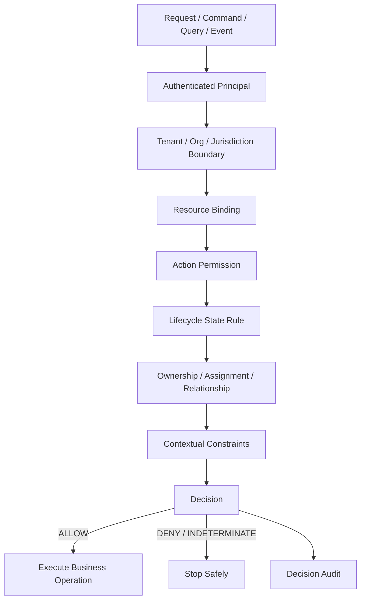

# Part 010 — Authorization Invariants and Failure Rules

Authorization yang matang bukan hanya kumpulan `if`, annotation, atau policy file.

Authorization yang matang punya **invariants**.

Invariant adalah aturan yang harus selalu benar, di semua endpoint, semua service, semua worker, semua tenant, semua state, semua edge case.

Contoh invariant:

```text
No user can read a case from another tenant.
No object write can happen without object-level authorization.
No approval can be performed by the same user who submitted the item.
No list endpoint can apply authorization after pagination.
No cached allow decision can outlive the policy or relationship state it depends on.
No background worker can execute a human command without authorization snapshot or recheck.
```

Tanpa invariant, authorization berubah menjadi serpihan logic. Serpihan logic pasti drift.

Part ini membangun catalog invariant dan failure rules untuk Java systems yang ingin production-grade.

---

## 1. Mental Model

Authorization harus dipikir sebagai safety system.



Jika salah satu step hilang, sistem harus berhenti aman.

```text
unknown principal       -> deny / 401
unknown tenant          -> deny / 403 or 404
unknown resource        -> 404 or hidden 404
unknown action          -> deny / configuration error
unknown policy          -> deny / indeterminate
unknown relationship    -> deny
unknown attribute       -> deny unless explicitly optional
PDP timeout             -> fail closed for protected operation
```

---

## 2. Invariant vs Rule vs Policy

| Concept | Meaning | Example |
|---|---|---|
| Rule | logic spesifik yang mengevaluasi decision | user must be case assignee |
| Policy | kumpulan rule untuk action/resource | policy for `case.close` |
| Invariant | property global yang tidak boleh dilanggar | cross-tenant access must be impossible |
| Failure rule | bagaimana sistem bertindak saat tidak yakin | indeterminate means deny |

Rule bisa berbeda per domain. Invariant biasanya lintas domain.

Contoh:

```text
Rule:
  reviewer can approve finding if finding.status == SUBMITTED

Policy:
  finding.approve policy combines role, relationship, state, SoD, audit obligation

Invariant:
  nobody can approve their own finding

Failure rule:
  if submittedBy is missing, deny rather than allow
```

---

## 3. Core Invariant Catalog

Gunakan catalog ini sebagai baseline review.

| # | Invariant | Why It Exists |
|---:|---|---|
| I-01 | Default decision is deny | prevents accidental exposure |
| I-02 | Authorization must run server-side | UI can be bypassed |
| I-03 | Every protected operation has a named action | audit and tests need stable semantics |
| I-04 | Every object access binds subject, action, resource, and tenant | prevents BOLA/IDOR |
| I-05 | Tenant boundary is derived from trusted context and persisted resource | prevents tenant parameter tampering |
| I-06 | List/search/report scopes are applied before pagination and aggregation | prevents data leakage |
| I-07 | Every state transition checks current state and authorized actor | prevents lifecycle bypass |
| I-08 | Critical write operations require audit with reason code | supports investigation and accountability |
| I-09 | Sensitive fields are masked by default unless explicitly allowed | prevents overexposure |
| I-10 | Batch operation authorization is per object or by safe scoped predicate | prevents partial hidden abuse |
| I-11 | Async execution uses authorization snapshot, recheck, or both | prevents delayed bypass |
| I-12 | Cached allow decisions are versioned and bounded | prevents stale privilege |
| I-13 | Break-glass access is time-bound, reasoned, and post-reviewed | prevents permanent emergency bypass |
| I-14 | Unknown policy/action/attribute cannot silently allow | prevents configuration drift |
| I-15 | Deny reason is safe to expose externally and detailed internally | prevents information disclosure |

---

## 4. I-01 — Default Decision Is Deny

Deny-by-default means allow only when all required facts are known and policy explicitly permits.

Buruk:

```java
public boolean can(Principal principal, Action action, ResourceRef resource) {
    Policy policy = policies.get(action);
    if (policy == null) {
        return true; // dangerous default
    }
    return policy.evaluate(principal, resource);
}
```

Benar:

```java
public AuthorizationDecision decide(AuthorizationRequest request) {
    Policy policy = policies.get(request.action());
    if (policy == null) {
        return AuthorizationDecision.deny("UNKNOWN_ACTION_OR_POLICY");
    }

    try {
        return policy.evaluate(request);
    } catch (MissingAttributeException e) {
        return AuthorizationDecision.deny("MISSING_REQUIRED_ATTRIBUTE");
    } catch (Exception e) {
        return AuthorizationDecision.indeterminate("POLICY_EVALUATION_ERROR");
    }
}
```

PEP harus memperlakukan `DENY` dan `INDETERMINATE` sebagai tidak boleh jalan, kecuali ada exception eksplisit yang sangat terbatas.

```java
public void verify(AuthorizationRequest request) {
    AuthorizationDecision decision = decide(request);
    if (decision.effect() != DecisionEffect.ALLOW) {
        throw new AccessDeniedException(decision.safeExternalReason());
    }
}
```

---

## 5. I-02 — Authorization Must Run Server-Side

UI check hanya meningkatkan UX.

```text
Button hidden != operation protected
Menu hidden   != API protected
Route guard   != object protected
```

Invariant:

```text
Every protected backend operation must verify authorization independently of UI state.
```

Contoh bug:

```javascript
if (user.role === 'SUPERVISOR') {
  showApproveButton();
}
```

Jika backend hanya menerima request:

```http
POST /findings/123/approve
```

maka attacker bisa memanggil endpoint langsung walaupun button tidak tampil.

Backend tetap harus check:

```java
public void approveFinding(PrincipalRef principal, FindingId findingId, ApproveFindingCommand command) {
    Finding finding = findingRepository.getRequired(findingId);

    authz.verify(AuthorizationRequest.command()
        .subject(principal)
        .action(Action.FINDING_APPROVE)
        .resource(ResourceRef.finding(finding.id(), finding.tenantId()))
        .resourceAttributes(FindingAttributes.from(finding))
        .context(OperationContext.from(command))
        .build());

    finding.approve(principal.userId(), command.reason());
}
```

---

## 6. I-03 — Every Protected Operation Has a Named Action

Named action membuat authorization bisa direview, dites, diaudit, dan dicari.

Buruk:

```java
if (user.isSupervisor()) {
    caseService.close(caseId);
}
```

Lebih baik:

```java
authz.verify(request(principal, Action.CASE_CLOSURE_APPROVE, caseRecord));
```

Benefit:

- QA bisa membuat matrix action;
- audit log punya semantic action;
- security bisa mencari semua usage `CASE_CLOSURE_APPROVE`;
- policy bisa dipindah ke OPA/Cedar/OpenFGA adapter;
- rename/migration bisa dikontrol.

Static check sederhana bisa mencari application service method tanpa authorization action.

Contoh ArchUnit-style rule:

```java
@AnalyzeClasses(packages = "com.acme.caseplatform")
class AuthorizationArchitectureTest {

    @ArchTest
    static final ArchRule command_services_should_not_be_called_from_controllers_directly =
        noClasses().that().resideInAPackage("..web..")
            .should().callMethodWhere(target ->
                target.getOwner().getPackageName().contains("application.command") &&
                !target.getName().equals("authorizeAndExecute")
            );
}
```

Intinya bukan harus persis seperti ini, tetapi harus ada mekanisme review bahwa protected operation punya named action.

---

## 7. I-04 — Object Access Binds Subject, Action, Resource, Tenant

BOLA/IDOR sering terjadi karena endpoint menerima object id lalu mengambil data tanpa cek hubungan object dengan subject.

Buruk:

```java
@GetMapping("/cases/{caseId}")
public CaseDto get(@PathVariable UUID caseId) {
    return caseRepository.findById(new CaseId(caseId))
        .map(mapper::toDto)
        .orElseThrow(NotFoundException::new);
}
```

Benar minimal:

```java
public CaseDto getCase(PrincipalRef principal, CaseId caseId) {
    CaseRecord caseRecord = caseRepository.getRequired(caseId);

    authz.verify(AuthorizationRequest.query()
        .subject(principal)
        .action(Action.CASE_VIEW)
        .resource(ResourceRef.caseRef(caseRecord.id(), caseRecord.tenantId()))
        .resourceAttributes(CaseAttributes.from(caseRecord))
        .build());

    return mapper.toDto(caseRecord);
}
```

Lebih kuat untuk query:

```java
public Optional<CaseSummaryRow> findVisibleCase(UserId userId, TenantId tenantId, CaseId caseId) {
    return jdbc.query("""
        select c.id, c.case_number, c.status, c.priority
        from cases c
        where c.id = :case_id
          and c.tenant_id = :tenant_id
          and exists (
              select 1
              from case_visibility v
              where v.case_id = c.id
                and v.user_id = :user_id
          )
        """, params, mapper).stream().findFirst();
}
```

Invariant:

```text
An object id from the request is never sufficient proof of access.
```

---

## 8. I-05 — Tenant Boundary Comes from Trusted Sources

Tenant parameter dari URL bukan bukti authority.

Buruk:

```java
GET /tenant/{tenantId}/cases/{caseId}
```

lalu:

```java
caseRepository.findByTenantIdAndCaseId(tenantId, caseId);
```

Masih belum cukup jika user tidak divalidasi sebagai member tenant tersebut.

Benar:

```java
public TenantId resolveEffectiveTenant(PrincipalRef principal, TenantId requestedTenant) {
    if (!membershipRepository.isActiveMember(principal.userId(), requestedTenant)) {
        throw new AccessDeniedException("TENANT_ACCESS_DENIED");
    }
    return requestedTenant;
}
```

Lalu resource tetap divalidasi:

```java
CaseRecord caseRecord = caseRepository.findByTenantAndId(effectiveTenant, caseId)
    .orElseThrow(NotFoundException::new);
```

Tenant invariant:

```text
All data access queries include effective tenant predicate, except explicitly reviewed global operations.
```

Untuk sistem multi-tenant, global operation harus rare dan mudah dicari:

```java
@GlobalTenantOperation(reason = "platform support tenant lookup", audit = true)
public TenantAdminView loadTenantForSupport(...) { ... }
```

---

## 9. I-06 — Scope Before Pagination, Aggregation, and Export

List endpoint bisa bocor walaupun detail endpoint aman.

Buruk:

```java
Page<CaseRecord> all = caseRepository.search(criteria, pageable);
List<CaseDto> visible = all.stream()
    .filter(c -> authz.can(principal, Action.CASE_VIEW, c))
    .map(mapper::toDto)
    .toList();
```

Masalah:

- total count bisa bocor;
- page kosong mencurigakan;
- timing bisa bocor;
- pagination menjadi salah;
- filter di memory mahal;
- developer bisa lupa filter di endpoint lain.

Benar:

```java
Page<CaseSummaryRow> page = caseRepository.searchVisibleCases(
    principal.userId(),
    effectiveTenant,
    criteria,
    pageable
);
```

SQL:

```sql
select c.id, c.case_number, c.status, c.priority
from cases c
where c.tenant_id = :tenant_id
  and exists (
      select 1
      from case_visibility v
      where v.case_id = c.id
        and v.user_id = :user_id
  )
  and (:status is null or c.status = :status)
order by c.created_at desc
limit :limit offset :offset;
```

Aggregation invariant:

```text
Counts, totals, charts, reports, and exports must be computed after authorization scope is applied.
```

Buruk:

```sql
select status, count(*) from cases group by status;
```

Benar:

```sql
select c.status, count(*)
from cases c
where c.tenant_id = :tenant_id
  and exists (
      select 1 from case_visibility v
      where v.case_id = c.id and v.user_id = :user_id
  )
group by c.status;
```

---

## 10. I-07 — State Transition Requires State-Aware Authorization

Permission tanpa state check menciptakan lifecycle bypass.

Buruk:

```java
if (authz.can(principal, Action.CASE_CLOSE)) {
    caseRecord.close();
}
```

Apa case boleh close dari `DRAFT`? Dari `ESCALATED`? Dari `ENFORCEMENT_ACTION_PROPOSED`?

Benar:

```java
authz.verify(AuthorizationRequest.command()
    .subject(principal)
    .action(Action.CASE_CLOSURE_APPROVE)
    .resource(ResourceRef.caseRef(caseRecord.id(), caseRecord.tenantId()))
    .resourceAttributes(new CaseAttributes(
        caseRecord.status(),
        caseRecord.jurisdictionId(),
        caseRecord.closureRecommendedBy(),
        caseRecord.sensitivity()
    ))
    .build());

caseRecord.approveClosure(principal.userId(), command.reason());
```

Domain method juga harus guard:

```java
public void approveClosure(UserId approver, String reason) {
    requireStatus(CaseStatus.CLOSURE_RECOMMENDED);
    requireDifferentUser(closureRecommendedBy, approver);
    requireNonBlank(reason);

    this.status = CaseStatus.CLOSED;
    this.closedBy = approver;
    this.closedAt = Instant.now(clock);
}
```

Invariant:

```text
Authorization decides who may attempt transition.
Domain model decides whether transition is valid.
Both are required.
```

---

## 11. I-08 — Critical Writes Require Audit

Critical operations without audit are operationally unsafe.

Critical examples:

- approve/reject;
- close/reopen;
- export sensitive data;
- change role/permission;
- create delegation;
- use break-glass;
- modify risk score;
- delete/seal/unseal evidence;
- reassign case;
- override workflow.

Audit invariant:

```text
Every critical decision records subject, action, resource, tenant, effect, reasonCode, policyVersion, relevant attributes, correlationId, and timestamp.
```

Example event:

```json
{
  "eventType": "AUTHORIZATION_DECISION",
  "effect": "ALLOW",
  "subject": "user:U-10",
  "tenant": "tenant:T-01",
  "action": "case.closure.approve",
  "resource": "case:CASE-100",
  "reasonCode": "ALLOWED_BY_CASE_CLOSURE_POLICY",
  "policyVersion": 42,
  "attributes": {
    "caseStatus": "CLOSURE_RECOMMENDED",
    "jurisdiction": "JK-01",
    "subjectRelation": "APPROVER",
    "sodSatisfied": true
  },
  "correlationId": "req-abc",
  "timestamp": "2026-07-03T10:15:30Z"
}
```

Jangan log sensitive data mentah. Audit harus cukup menjelaskan decision tanpa membocorkan evidence.

---

## 12. I-09 — Sensitive Fields Are Deny-by-Default

Endpoint object-level bisa benar, tetapi response field-level bocor.

Contoh DTO buruk:

```java
public record CaseDto(
    UUID id,
    String caseNumber,
    String status,
    String suspectName,
    String whistleblowerName,
    String internalRiskMemo,
    List<EvidenceDto> evidence
) {}
```

Jika semua field dikirim setelah `case.view`, user mungkin menerima data yang butuh permission berbeda.

Lebih baik:

```java
public CaseDto toDto(CaseRecord caseRecord, FieldAuthorization fieldAuthz) {
    return new CaseDto(
        caseRecord.id().value(),
        caseRecord.caseNumber(),
        caseRecord.status().name(),
        fieldAuthz.canView("suspectName") ? caseRecord.suspectName() : "REDACTED",
        fieldAuthz.canView("whistleblowerName") ? caseRecord.whistleblowerName() : "REDACTED",
        fieldAuthz.canView("internalRiskMemo") ? caseRecord.internalRiskMemo() : null,
        evidenceMapper.toVisibleEvidence(caseRecord.evidence(), fieldAuthz)
    );
}
```

Invariant:

```text
A broad object view permission does not imply sensitive field visibility.
```

Write-side invariant:

```text
A broad update permission does not imply all fields are writable.
```

Untuk PATCH:

```java
Set<String> requestedFields = patch.changedFields();
FieldAuthorizationDecision decision = fieldAuthz.decideWritableFields(
    principal,
    ResourceRef.caseRef(caseId, tenantId),
    requestedFields
);

if (!decision.allAllowed()) {
    throw new AccessDeniedException(decision.deniedFieldsSafeMessage());
}
```

---

## 13. I-10 — Batch Authorization Is Not Single Boolean Unless Predicate Is Safe

Batch endpoint rawan karena satu request menyentuh banyak object.

Buruk:

```java
@PostMapping("/cases/bulk-close")
public void bulkClose(@RequestBody List<UUID> caseIds) {
    if (!authz.can(currentUser(), Action.CASE_BULK_CLOSE)) {
        throw new AccessDeniedException();
    }
    caseService.closeAll(caseIds);
}
```

Masalah: user punya permission bulk, tetapi apakah semua case boleh ditutup?

Pilihan benar:

### Option A — Per-object check

```java
for (CaseRecord caseRecord : caseRepository.findAllByIds(caseIds)) {
    authz.verify(request(principal, Action.CASE_CLOSURE_APPROVE, caseRecord));
    caseRecord.approveClosure(principal.userId(), reason);
}
```

### Option B — Scoped predicate update

```sql
update cases c
set status = 'CLOSED'
where c.id = any(:case_ids)
  and c.status = 'CLOSURE_RECOMMENDED'
  and c.tenant_id = :tenant_id
  and exists (
      select 1
      from case_approver_scope s
      where s.user_id = :user_id
        and s.jurisdiction_id = c.jurisdiction_id
  );
```

Lalu pastikan jumlah affected rows sesuai expected policy.

```java
int updated = caseRepository.bulkCloseVisibleCases(...);
if (updated != requestedIds.size()) {
    throw new PartialAuthorizationFailure("Some cases were not authorized");
}
```

Invariant:

```text
Batch allow means all target objects are authorized, or unauthorized objects are explicitly rejected and audited.
```

---

## 14. I-11 — Async Execution Uses Snapshot, Recheck, or Both

Authorization check di request thread tidak otomatis valid saat job berjalan beberapa menit/jam kemudian.

Example:

```text
10:00 user requests sensitive export and is authorized
10:01 user's sensitive export permission is revoked
10:05 worker executes export
```

Apa yang harus terjadi?

Ada tiga model:

| Model | Meaning | Good For | Risk |
|---|---|---|---|
| Snapshot | execute based on authorization at request time | audit consistency, long approval workflow | access may be revoked before execution |
| Fresh recheck | evaluate current authorization at execution time | revocation-sensitive actions | decision differs from user expectation |
| Snapshot + recheck | require both request-time and execution-time safety | critical exports/actions | more complexity |

Invariant:

```text
Every async job that performs protected operation declares its authorization execution model.
```

Java model:

```java
public enum AuthorizationExecutionModel {
    REQUEST_TIME_SNAPSHOT,
    EXECUTION_TIME_RECHECK,
    SNAPSHOT_AND_RECHECK
}

public record AuthorizedJobEnvelope<T>(
    JobId jobId,
    UserId requestedBy,
    TenantId tenantId,
    Action action,
    T payload,
    AuthorizationSnapshot snapshot,
    AuthorizationExecutionModel executionModel
) {}
```

Worker:

```java
public void handle(AuthorizedJobEnvelope<ExportPayload> job) {
    switch (job.executionModel()) {
        case REQUEST_TIME_SNAPSHOT -> authz.verifySnapshot(job.snapshot());
        case EXECUTION_TIME_RECHECK -> authz.verify(currentRequestFrom(job));
        case SNAPSHOT_AND_RECHECK -> {
            authz.verifySnapshot(job.snapshot());
            authz.verify(currentRequestFrom(job));
        }
    }

    exportService.generate(job.payload());
}
```

---

## 15. I-12 — Cached Allow Decisions Are Versioned and Bounded

Authorization caching adalah performance tool, bukan correctness model.

Cache key buruk:

```text
userId + action
```

Kenapa salah?

- tidak memasukkan tenant;
- tidak memasukkan resource;
- tidak memasukkan state;
- tidak memasukkan relationship;
- tidak memasukkan policy version;
- tidak memasukkan attribute version;
- tidak membedakan sensitive context.

Cache key lebih baik:

```java
public record AuthorizationCacheKey(
    SubjectRef subject,
    TenantId tenantId,
    Action action,
    ResourceRef resource,
    String resourceVersion,
    String relationshipVersion,
    long policyVersion,
    Set<String> contextHashInputs
) {}
```

Cache directive:

```java
public record CacheDirective(
    boolean cacheable,
    Duration ttl,
    Set<String> dependsOn
) {}
```

Invariant:

```text
An allow decision may only be cached if all facts it depends on are represented by TTL or version invalidation.
```

Deny caching harus hati-hati. Deny sering berubah saat role/assignment baru diberikan. Deny cache TTL harus pendek atau invalidation-aware.

---

## 16. I-13 — Break-Glass Is Controlled, Not Magic Admin

Break-glass adalah emergency access. Ia bukan `ROLE_SUPER_ADMIN` biasa.

Break-glass harus punya:

- reason wajib;
- incident/ticket reference;
- duration pendek;
- approval atau post-review;
- enhanced audit;
- clear scope;
- notification;
- automatic expiry;
- no silent reuse.

```java
public record BreakGlassGrant(
    UserId userId,
    AccessScope scope,
    Set<Action> allowedActions,
    String incidentRef,
    String reason,
    Instant validUntil,
    UserId approvedBy
) {}
```

Rule:

```text
allow break_glass.case.view_sensitive if:
  active break-glass grant exists
  grant.scope covers resource
  grant.validUntil > now
  reason is present
  incidentRef is present
obligations:
  enhanced_audit
  notify_security
  schedule_post_review
```

Invariant:

```text
Emergency access increases audit, never decreases it.
```

---

## 17. I-14 — Unknown Facts Do Not Allow

A subtle production bug:

```java
if (caseRecord.sensitivity() == Sensitivity.PUBLIC) {
    return allow();
}
return subject.clearance().compareTo(caseRecord.sensitivity()) >= 0 ? allow() : deny();
```

Apa yang terjadi jika `caseRecord.sensitivity()` null?

Buruk:

```java
if (caseRecord.sensitivity() == null) {
    return allow();
}
```

Benar:

```java
if (caseRecord.sensitivity() == null) {
    return AuthorizationDecision.deny("MISSING_RESOURCE_SENSITIVITY");
}
```

Failure rule:

```text
Required attribute missing means deny or indeterminate, never allow.
```

Untuk policy external seperti OPA/Cedar, schema validation membantu mencegah input tidak lengkap. Di Java lokal, gunakan typed attributes dan validation.

```java
public record CaseAttributes(
    CaseStatus status,
    JurisdictionId jurisdictionId,
    Sensitivity sensitivity,
    UserId ownerId,
    UserId assigneeId
) {
    public CaseAttributes {
        Objects.requireNonNull(status, "status is required");
        Objects.requireNonNull(jurisdictionId, "jurisdictionId is required");
        Objects.requireNonNull(sensitivity, "sensitivity is required");
    }
}
```

---

## 18. I-15 — External Deny Reason Must Be Safe

Authorization error bisa membocorkan informasi.

Contoh:

```json
{
  "error": "DENIED_BECAUSE_CASE_IS_SEALED_AND_ASSIGNED_TO_USER_U999"
}
```

Itu memberi tahu attacker bahwa case ada, sealed, dan assignee tertentu.

Gunakan dua level reason:

```java
public record DenyReason(
    String externalCode,
    String internalCode,
    Map<String, Object> internalDetails
) {}
```

External:

```json
{
  "error": "ACCESS_DENIED"
}
```

Internal audit:

```json
{
  "externalCode": "ACCESS_DENIED",
  "internalCode": "CASE_SEALED_REQUIRES_SPECIAL_CLEARANCE",
  "internalDetails": {
    "caseId": "CASE-100",
    "requiredClearance": "SEALED_CASE",
    "subjectClearance": "STANDARD"
  }
}
```

Invariant:

```text
Deny response helps legitimate clients recover but does not reveal protected resource facts.
```

---

## 19. 401, 403, 404, and Hidden 404

Use status code intentionally.

| Situation | Typical Status | Notes |
|---|---:|---|
| no/invalid authentication | 401 | caller is not authenticated |
| authenticated but not allowed | 403 | caller known, action denied |
| resource does not exist | 404 | no such resource |
| resource exists but caller must not know | 404 | hidden 404 to prevent enumeration |
| policy service unavailable | 503 or 403 depending layer | operation must not execute |

Hidden 404 pattern:

```java
Optional<CaseRecord> visible = caseRepository.findVisibleCase(userId, tenantId, caseId);
if (visible.isEmpty()) {
    throw new NotFoundException();
}
```

But audit internally:

```text
resource_access_hidden_denied: user attempted case CASE-100 outside visibility scope
```

Trade-off:

- 403 is better for UX when user already knows resource exists;
- 404 is better against enumeration;
- internal audit must preserve true reason.

---

## 20. Fail-Closed vs Fail-Open

Default for authorization is fail-closed.

```text
if policy cannot decide safely -> operation does not execute
```

But production systems need nuance.

| Operation Type | Failure Mode |
|---|---|
| read sensitive data | fail closed |
| write business state | fail closed |
| export/report | fail closed |
| role/admin mutation | fail closed |
| health check | not authorization-protected or degraded |
| non-sensitive personalization | maybe fallback to empty |
| audit sink unavailable | usually block critical operation or use durable local buffer |

Do not generalize fail-open because PDP is down.

Buruk:

```java
try {
    return pdp.decide(request);
} catch (Exception e) {
    return AuthorizationDecision.allow("PDP_DOWN_ALLOWING_TEMPORARILY");
}
```

Lebih aman:

```java
try {
    return pdp.decide(request);
} catch (TimeoutException e) {
    if (request.action().riskLevel().isLow() && fallbackPolicy.canSafelyDenyWithEmptyResult(request)) {
        return AuthorizationDecision.deny("PDP_TIMEOUT_SAFE_DENY");
    }
    return AuthorizationDecision.indeterminate("PDP_TIMEOUT");
}
```

PEP:

```java
if (decision.effect() != DecisionEffect.ALLOW) {
    throw new AccessDeniedException("ACCESS_DENIED");
}
```

---

## 21. Confused Deputy Invariant

Confused deputy terjadi saat service dengan privilege lebih tinggi melakukan action atas nama caller tanpa membatasi authority caller.

Example:

```text
User cannot access evidence E.
User asks report-service to generate report for case containing E.
Report-service has database access and includes E.
```

Invariant:

```text
A service acting on behalf of a user must enforce the user's effective authorization, not only the service account's technical access.
```

Java command envelope:

```java
public record ActorContext(
    ServiceIdentity service,
    Optional<UserIdentity> onBehalfOf,
    TenantId tenantId,
    String correlationId
) {}
```

Decision rule:

```java
SubjectRef effectiveSubject = actorContext.onBehalfOf()
    .map(SubjectRef::user)
    .orElseGet(() -> SubjectRef.service(actorContext.service()));
```

For delegated service calls:

```text
service account may call downstream API
but downstream operation must evaluate on-behalf-of subject for user data access
```

---

## 22. Service Account Invariants

Service accounts should not become invisible superusers.

Rules:

```text
service account permissions are explicit
service account actions are scoped
service account cannot impersonate user without delegation contract
service account decisions are audited
service account secret rotation does not change authorization semantics
```

Example service action:

```text
billing-worker can invoice.generate for tenant scope assigned to billing system
billing-worker cannot case.view_sensitive unless explicitly needed and audited
```

Java:

```java
AuthorizationRequest request = AuthorizationRequest.command()
    .subject(SubjectRef.service("report-worker"))
    .action(Action.REPORT_GENERATE_SCHEDULED)
    .resource(ResourceRef.reportJob(job.id(), job.tenantId()))
    .context(Map.of("trigger", "SCHEDULED"))
    .build();
```

---

## 23. Admin Mutation Invariants

Changing authorization data is itself high-risk authorization.

Operations:

- assign role;
- remove role;
- create permission;
- change policy;
- grant delegation;
- approve access request;
- create break-glass grant;
- add user to tenant;
- change jurisdiction membership.

Invariant:

```text
Authorization administration is protected by stronger authorization than normal business actions.
```

Example:

```java
public void assignRole(PrincipalRef principal, AssignRoleCommand command) {
    authz.verify(AuthorizationRequest.command()
        .subject(principal)
        .action(Action.ACCESS_ROLE_ASSIGN)
        .resource(ResourceRef.user(command.targetUserId(), command.tenantId()))
        .context(Map.of(
            "role", command.roleName(),
            "scope", command.scope(),
            "reason", command.reason()
        ))
        .build());

    roleAssignmentPolicy.verifyAssignable(principal, command);
    roleAssignmentRepository.save(...);
}
```

Admin-specific invariants:

```text
grantor must have authority to grant within scope
grantor cannot grant permissions greater than their own grantable authority
critical role assignment requires approval
role assignment has owner/reason/expiry when temporary
all access mutations are audited
```

---

## 24. Time and Revocation Invariants

Authorization state changes over time.

Examples:

- user leaves organization;
- delegation expires;
- role revoked;
- case reassigned;
- case sealed;
- policy updated;
- tenant subscription disabled;
- jurisdiction membership expires.

Invariant:

```text
Time-bounded grants are evaluated against trusted server time.
```

Never trust client-provided time.

```java
Instant now = clock.instant();
if (delegation.validUntil().isBefore(now)) {
    return deny("DELEGATION_EXPIRED");
}
```

Revocation invariant:

```text
Revocation-sensitive permissions cannot depend only on long-lived tokens.
```

If JWT carries permissions, treat them as hints or short-lived facts. For high-risk operations, check current server-side authorization state.

---

## 25. Policy Version Invariant

Every decision should know which policy version evaluated it.

```java
public record AuthorizationDecision(
    DecisionEffect effect,
    String reasonCode,
    long policyVersion,
    Instant evaluatedAt,
    Set<Obligation> obligations
) {}
```

Why:

- audit investigation;
- rollback;
- explainability;
- decision cache invalidation;
- shadow evaluation;
- policy diff analysis.

Invariant:

```text
Allow decisions for critical operations must include policy version and relevant data versions.
```

Data versions may include:

- resource version;
- relationship graph revision;
- role assignment revision;
- delegation revision;
- attribute source version.

---

## 26. Executable Invariants

Invariants should become tests.

### 26.1 Unit Test for Deny-by-Default

```java
@Test
void unknownActionIsDenied() {
    AuthorizationRequest request = requestBuilder()
        .action(Action.raw("unknown.action"))
        .resource(ResourceRef.caseRef(CaseId.random(), TenantId.of("T-1")))
        .build();

    AuthorizationDecision decision = authz.decide(request);

    assertThat(decision.effect()).isEqualTo(DecisionEffect.DENY);
    assertThat(decision.reasonCode()).isEqualTo("UNKNOWN_ACTION_OR_POLICY");
}
```

### 26.2 Cross-Tenant Negative Test

```java
@Test
void userCannotViewCaseFromAnotherTenant() {
    PrincipalRef user = fixtures.userInTenant("T-1");
    CaseRecord caseInOtherTenant = fixtures.caseInTenant("T-2");

    AuthorizationDecision decision = authz.decide(AuthorizationRequest.query()
        .subject(user)
        .action(Action.CASE_VIEW)
        .resource(ResourceRef.caseRef(caseInOtherTenant.id(), caseInOtherTenant.tenantId()))
        .resourceAttributes(CaseAttributes.from(caseInOtherTenant))
        .build());

    assertThat(decision.allowed()).isFalse();
}
```

### 26.3 Separation of Duty Test

```java
@Test
void submitterCannotApproveOwnFinding() {
    PrincipalRef submitter = fixtures.reviewerAndSubmitter();
    Finding finding = fixtures.submittedFindingBy(submitter.userId());

    AuthorizationDecision decision = authz.decide(requestBuilder()
        .subject(submitter)
        .action(Action.FINDING_APPROVE)
        .resource(ResourceRef.finding(finding.id(), finding.tenantId()))
        .resourceAttributes(FindingAttributes.from(finding))
        .build());

    assertThat(decision.allowed()).isFalse();
    assertThat(decision.reasonCode()).isEqualTo("SOD_SUBMITTER_CANNOT_APPROVE");
}
```

### 26.4 Query Scoping Test

```java
@Test
void searchVisibleCasesDoesNotReturnOtherTenantCases() {
    UserId user = fixtures.userInTenant("T-1");
    fixtures.caseVisibleTo(user, "T-1");
    fixtures.caseInTenant("T-2");

    Page<CaseSummaryRow> page = repository.searchVisibleCases(
        user,
        TenantId.of("T-1"),
        CaseSearchCriteria.empty(),
        PageRequest.of(0, 20)
    );

    assertThat(page.getContent())
        .allMatch(row -> row.tenantId().equals(TenantId.of("T-1")));
}
```

---

## 27. Property-Based Authorization Tests

Authorization has combinatorial complexity. Property-based testing helps.

Example property:

```text
For any user, any case, if case.tenant != user.activeTenant, decision for case.view is never ALLOW.
```

Pseudo jqwik-style test:

```java
@Property
void crossTenantViewIsNeverAllowed(
    @ForAll("principals") PrincipalRef principal,
    @ForAll("cases") CaseRecord caseRecord
) {
    Assume.that(!caseRecord.tenantId().equals(principal.activeTenantId()));

    AuthorizationDecision decision = authz.decide(AuthorizationRequest.query()
        .subject(principal)
        .action(Action.CASE_VIEW)
        .resource(ResourceRef.caseRef(caseRecord.id(), caseRecord.tenantId()))
        .resourceAttributes(CaseAttributes.from(caseRecord))
        .build());

    Assertions.assertThat(decision.effect()).isNotEqualTo(DecisionEffect.ALLOW);
}
```

Another property:

```text
For any finding, if finding.submittedBy == principal.userId, finding.approve is never ALLOW.
```

```java
@Property
void submitterNeverApprovesOwnFinding(
    @ForAll("users") PrincipalRef principal,
    @ForAll("submittedFindings") Finding finding
) {
    Finding ownFinding = finding.withSubmittedBy(principal.userId());

    AuthorizationDecision decision = authz.decide(AuthorizationRequest.command()
        .subject(principal)
        .action(Action.FINDING_APPROVE)
        .resource(ResourceRef.finding(ownFinding.id(), ownFinding.tenantId()))
        .resourceAttributes(FindingAttributes.from(ownFinding))
        .build());

    Assertions.assertThat(decision.allowed()).isFalse();
}
```

Property tests catch forgotten edge cases better than matrix-only tests.

---

## 28. Mutation Testing for Authorization

A good authorization test should fail if a deny condition is removed.

Example policy:

```java
if (finding.submittedBy().equals(subject.userId())) {
    return deny("SOD_SUBMITTER_CANNOT_APPROVE");
}
```

If mutation testing removes this condition, test suite must fail.

Important mutation targets:

- remove tenant predicate;
- invert role check;
- remove state check;
- remove SoD check;
- replace `&&` with `||`;
- remove sensitivity check;
- remove repository visibility predicate;
- ignore policy version;
- catch exception and allow.

---

## 29. Invariant Review Checklist

For each feature, ask:

```text
[ ] What is the named action?
[ ] What resource is protected?
[ ] Does the operation require object-level authorization?
[ ] Does it require field-level authorization?
[ ] Does it require query scoping?
[ ] Is tenant boundary derived from trusted context?
[ ] Is authorization applied before pagination/aggregation/export?
[ ] Is current lifecycle state included in decision?
[ ] Are relationship constraints evaluated?
[ ] Is separation of duty needed?
[ ] Is decision auditable?
[ ] Are deny reasons safe externally?
[ ] What happens if PDP/cache/attribute source is down?
[ ] What happens if required attribute is missing?
[ ] Can decision be cached? With what version/TTL?
[ ] Is async execution snapshot/rechecked?
[ ] Are negative tests present?
[ ] Are property-based invariants useful here?
```

---

## 30. Failure Mode Table

| Failure | Unsafe Behavior | Safe Behavior |
|---|---|---|
| unknown action | allow | deny/config error |
| missing policy | allow | deny/indeterminate |
| PDP timeout | allow critical operation | deny/indeterminate |
| missing resource attributes | skip condition | deny |
| stale JWT permission | trust forever | recheck high-risk operation |
| cache stale | allow old permission | version/TTL/invalidation |
| relationship source down | assume member | deny or degraded empty result |
| audit sink down | execute silently | block critical or durable buffer |
| tenant id tampered | trust path param | resolve effective tenant server-side |
| list endpoint unscoped | filter after pagination | scope in query predicate |
| batch mixed objects | one global check | per-object or scoped predicate |
| async job delayed | execute as system | snapshot/recheck declared |
| sensitive field absent from policy | include by default | redact by default |

---

## 31. Production Design Pattern: Authorize-and-Execute

For high-risk commands, wrap authorization and execution into a consistent pattern.

```java
public final class AuthorizedCommandExecutor {
    private final AuthorizationService authz;
    private final AuthorizationAuditSink auditSink;

    public <T> T execute(AuthorizationRequest request, Supplier<T> operation) {
        AuthorizationDecision decision = authz.decide(request);
        auditSink.record(request, decision);

        if (!decision.allowed()) {
            throw new AccessDeniedException(decision.safeExternalReason());
        }

        enforceObligations(decision);
        return operation.get();
    }

    private void enforceObligations(AuthorizationDecision decision) {
        if (decision.requiresReason() && decision.reason().isBlank()) {
            throw new AccessDeniedException("REASON_REQUIRED");
        }
    }
}
```

Usage:

```java
public void approveClosure(PrincipalRef principal, CaseId caseId, ApproveClosureCommand command) {
    CaseRecord caseRecord = caseRepository.getRequired(caseId);

    AuthorizationRequest request = AuthorizationRequest.command()
        .subject(principal)
        .action(Action.CASE_CLOSURE_APPROVE)
        .resource(ResourceRef.caseRef(caseRecord.id(), caseRecord.tenantId()))
        .resourceAttributes(CaseAttributes.from(caseRecord))
        .context(OperationContext.of("reason", command.reason()))
        .build();

    executor.execute(request, () -> {
        caseRecord.approveClosure(principal.userId(), command.reason());
        caseRepository.save(caseRecord);
        return null;
    });
}
```

But avoid hiding too much. Engineers must still see action/resource/context explicitly.

---

## 32. Architecture Guardrails

Guardrails are mechanisms that make insecure code harder to write.

Examples:

### 32.1 Repository Naming

```java
findById(...)              // allowed only inside internal/domain repositories
findVisibleById(...)       // preferred for query/application use
searchVisibleCases(...)    // scoped list
```

### 32.2 Package Boundary

```text
web -> application
application -> authorization + domain + repository
domain -> no Spring Security dependency
repository -> no controller principal dependency
```

### 32.3 Annotations for Review, Not Sole Enforcement

```java
@ProtectedOperation(Action.CASE_CLOSURE_APPROVE)
public void approveClosure(...) { ... }
```

Then CI can scan protected operations.

### 32.4 No Raw SQL Without Tenant Predicate

Code review rule:

```text
Any query on tenant-owned table must include tenant predicate or documented exception.
```

### 32.5 No DTO Mapping Without Field Policy for Sensitive DTO

```java
@SensitiveDto
public record CaseDetailDto(...) {}
```

Mapping requires field authorization component.

---

## 33. Security Review Questions for Top-Level Engineers

A strong engineer asks:

1. What object-level invariant protects this endpoint?
2. What list/search/report equivalent exists, and is it scoped the same way?
3. What happens if the resource changes state between decision and write?
4. What happens if assignment changes while operation is in-flight?
5. Does this operation run in async worker later?
6. What is the external deny behavior?
7. What is audited and can we explain it six months later?
8. Can a service account become confused deputy?
9. Can cached allow survive revocation?
10. What negative test proves this cannot become IDOR/BOLA?

---

## 34. Summary

Authorization invariants are how you keep a large Java system safe as it grows.

Core lessons:

1. deny-by-default is not a slogan; it is a code path;
2. every protected operation needs named action;
3. object id is not proof of access;
4. tenant boundary must be derived and enforced in data access;
5. query scope must happen before pagination, aggregation, export;
6. state transitions require both authorization and domain invariant;
7. critical operations require audit;
8. sensitive fields are hidden by default;
9. batch and async flows need explicit authorization semantics;
10. cache correctness needs version/TTL/invalidation;
11. unknown facts must not allow;
12. invariants should be executable tests.

The practical standard is simple:

```text
If we cannot explain, test, and audit why this subject can perform this action on this resource in this context, the operation should not be allowed.
```

---

## References

- OWASP Authorization Cheat Sheet — deny by default, least privilege, server-side enforcement, centralized authorization routines.
- OWASP Top 10 Broken Access Control — common access control vulnerabilities and least privilege failure modes.
- OWASP API Security 2023 — Broken Object Level Authorization and object-level API protection.
- NIST SP 800-162 — ABAC attributes and access control decision factors.
- NIST RBAC model — roles, permissions, sessions, and role hierarchy.
- Spring Security Authorization Architecture — `AuthorizationManager` for request, method, and message authorization.
- Jakarta REST / JAX-RS request filters — request interception as enforcement point.
- OPA documentation — policy decision API, decision logging, and externalized policy model.
- Cedar / Amazon Verified Permissions documentation — policy validation, principal/action/resource/context, permit/forbid model.
- Zanzibar / OpenFGA model — relationship-based authorization and graph checks.
