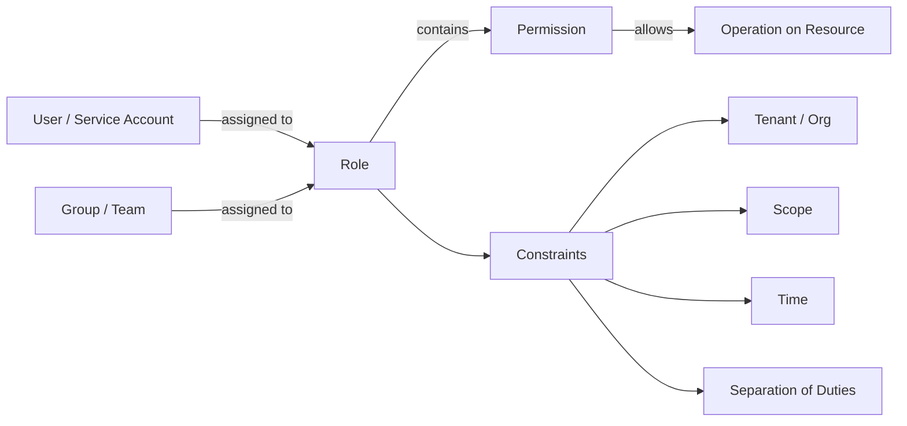
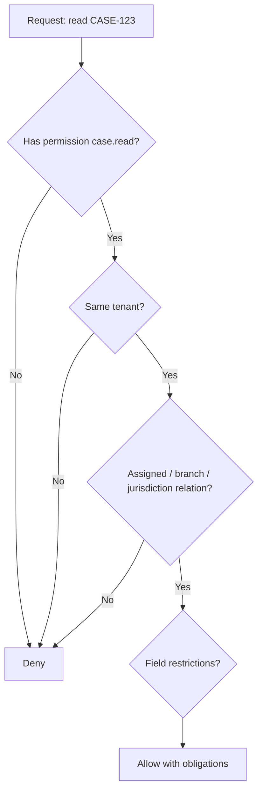
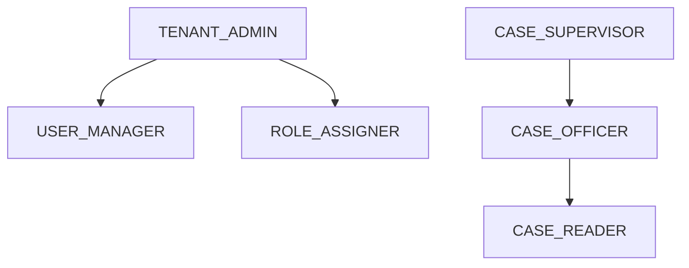
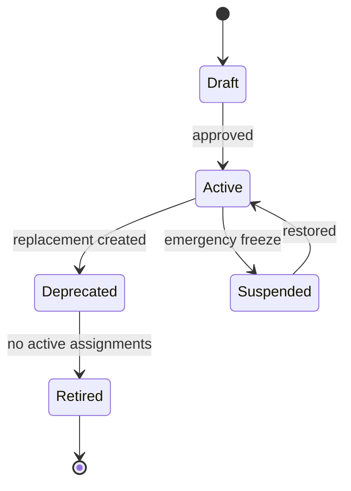
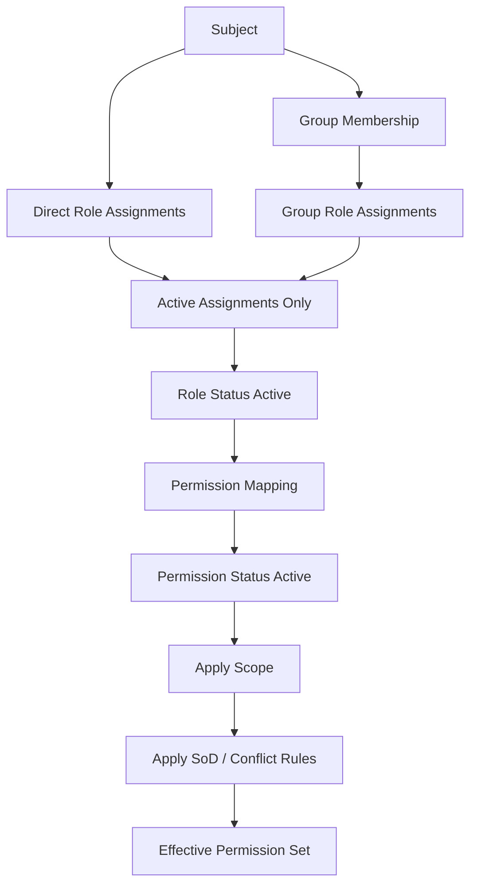
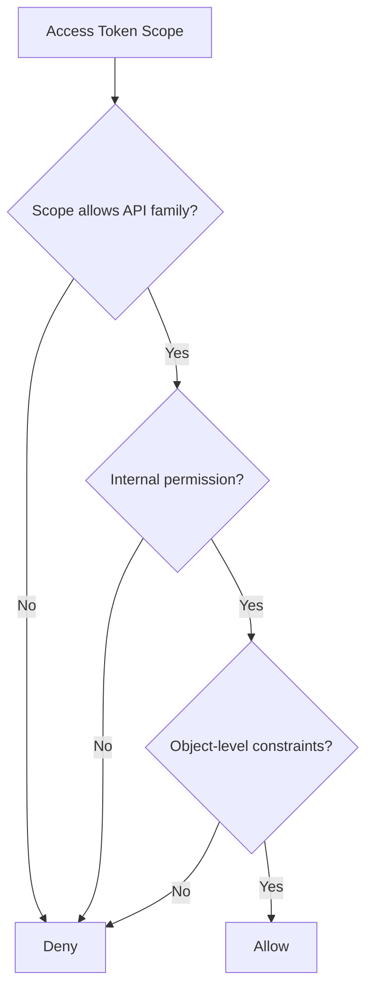

# Part 011 — RBAC Production Design: Roles, Permissions, Groups, Scopes

RBAC terlihat sederhana sampai sistem masuk production.

Awalnya hanya ada:

```text
ADMIN
USER
```

Lalu muncul:

```text
CASE_OFFICER
CASE_SUPERVISOR
REGIONAL_MANAGER
NATIONAL_MANAGER
AUDITOR
READ_ONLY_AUDITOR
EXTERNAL_AUDITOR
TEMPORARY_EXTERNAL_AUDITOR
TENANT_ADMIN
SUPER_ADMIN
BRANCH_ADMIN
QUALITY_REVIEWER
APPROVER
APPROVER_LEVEL_2
APPROVER_LEVEL_3
LEGAL_REVIEWER
COMPLIANCE_ANALYST
```

Setelah itu, setiap exception bisnis melahirkan role baru.

```text
CASE_SUPERVISOR_CAN_REOPEN
AUDITOR_CAN_EXPORT_BUT_NOT_DOWNLOAD_EVIDENCE
REGIONAL_MANAGER_READ_ONLY_EXCEPT_ESCALATED_CASES
APPROVER_LEVEL_2_FOR_HIGH_RISK_ONLY
```

Itu bukan RBAC matang. Itu role explosion.

Part ini membahas cara mendesain RBAC yang tetap berguna di sistem Java enterprise: jelas, terukur, bisa diaudit, bisa dimigrasikan, dan tidak berubah menjadi kuburan string role.

RBAC yang baik bukan sekadar `hasRole("ADMIN")`. RBAC yang baik adalah cara mengelola **business authority** secara konsisten.

---

## 1. Mental Model RBAC

RBAC memisahkan user dari permission melalui role.



Relasi dasarnya:

```text
User  -> Role
Role  -> Permission
Permission -> Action + Resource Type
```

Tetapi production RBAC hampir selalu membutuhkan relasi tambahan:

```text
User  -> Group
Group -> Role
Role  -> Permission
Role  -> Constraint
User  -> TenantMembership
RoleAssignment -> Tenant / Org / Scope / Validity Period
Permission -> Resource Type + Operation + Optional Qualifier
```

NIST RBAC reference model mendefinisikan elemen seperti users, roles, permissions, operations, objects, dan relasi assignment. Dari sana kita bisa ambil prinsip penting: permission tidak ditempel langsung ke user; user memperoleh permission melalui role assignment. OWASP juga menjelaskan RBAC sebagai model di mana akses diberikan/ditolak berdasarkan role yang diberikan ke user, dengan permission diasosiasikan ke role.

Dalam desain Java production, kita perlu menurunkan konsep itu menjadi model yang bisa dipakai di service, database, cache, audit, UI admin, dan test suite.

---

## 2. Apa yang Boleh Disebut Role?

Role harus merepresentasikan **job function** atau **authority bundle**, bukan kondisi bisnis kecil.

Good role:

```text
CASE_OFFICER
CASE_SUPERVISOR
AUDITOR
TENANT_ADMIN
BILLING_OPERATOR
COMPLIANCE_REVIEWER
```

Bad role:

```text
USER_CAN_EXPORT_CSV
USER_CAN_EDIT_CASE_OWNED_BY_BRANCH
APPROVER_WHEN_AMOUNT_LT_100M
CASE_OFFICER_FOR_STATUS_DRAFT_ONLY
```

Kenapa? Karena role harus stabil. Kondisi seperti `amount < 100M`, `case.status == DRAFT`, atau `resource.branchId == user.branchId` bukan role. Itu policy constraint.

Gunakan rule berikut:

| Jika berubah karena... | Model sebagai... |
|---|---|
| job responsibility | role |
| API operation | permission |
| tenant/org boundary | scope / assignment constraint |
| resource ownership | ReBAC/object rule |
| lifecycle status | ABAC/domain state rule |
| risk amount/classification | ABAC/context rule |
| temporary access | time-bound assignment |
| approval conflict | SoD constraint |
| paid feature access | entitlement/license |
| UI visibility | derived authorization/feature visibility |

Role adalah kategori tanggung jawab. Permission adalah kemampuan teknis/domain yang diberikan oleh role. Constraint adalah syarat saat permission digunakan.

---

## 3. Role, Permission, Scope, Claim, Entitlement

Jangan mencampur semua hal ke role.

| Concept | Meaning | Example | Should Be Used For |
|---|---|---|---|
| Role | bundle of responsibility | `CASE_SUPERVISOR` | job function |
| Permission | named protected capability | `case.close` | operation guard |
| Scope | delegated API boundary | `cases:write` | OAuth/API access envelope |
| Claim | identity/session attribute | `tenant_id`, `sub`, `amr` | identity/context input |
| Entitlement | product/business access right | `ADVANCED_REPORTING` | license/subscription |
| Feature flag | rollout/toggle state | `new_case_ui=true` | release management |
| Relationship | subject-resource link | user is case assignee | object-level auth |

Kesalahan umum:

```text
JWT claim role=ADMIN -> semua operasi internal allow
```

Lebih aman:

```text
JWT -> identity + tenant + coarse authorities
Application -> load role assignments
AuthorizationService -> derive permissions + evaluate constraints
Domain/repository -> enforce object-level access
```

Role dari token boleh menjadi input, tapi jangan jadikan token sebagai satu-satunya source of truth untuk authorization yang sensitif.

---

## 4. Permission Naming: Stable Semantic Contract

Permission harus named, stable, dan domain-centric.

Gunakan pola:

```text
<resource>.<action>
```

Contoh:

```text
case.create
case.read
case.update
case.assign
case.close
case.reopen
case.escalate
case.export
case.evidence.read
case.evidence.upload
case.evidence.delete
case.note.add
case.note.internal.read
finding.approve
finding.reject
report.generate
report.export
user.invite
role.assign
role.revoke
```

Permission bukan HTTP method.

Bad:

```text
GET_CASE
POST_CASE
PATCH_CASE
DELETE_CASE
```

Better:

```text
case.read
case.create
case.update
case.cancel
case.close
```

Kenapa? Karena domain action bisa muncul dari banyak interface:

```text
HTTP PATCH /cases/{id}/status
Kafka command: CaseCloseRequested
Batch job: auto-close stale case
Admin UI button: Close case
CLI command: close-case
```

Semua harus converge ke satu permission semantic: `case.close`.

---

## 5. Resource Type vs Resource Instance

RBAC kuat untuk resource type. RBAC lemah untuk resource instance.

```text
Can this user perform case.read in general?       -> RBAC works
Can this user read case CASE-123 specifically?   -> RBAC alone is not enough
```

Production rule:

```text
RBAC answers coarse capability.
Object-level authorization answers specific resource access.
```

Contoh:

```text
Role CASE_OFFICER includes permission case.read.
But officer can only read cases assigned to their branch or directly assigned to them.
```

Model:

```text
role permission: CASE_OFFICER -> case.read
object constraint: case.tenant_id == user.tenant_id
relationship constraint: case.assignee_id == user.id OR case.branch_id in user.branches
state constraint: sealed evidence requires special permission
```

Jadi `case.read` adalah necessary, not sufficient.



---

## 6. Role Granularity

Role terlalu besar membuat privilege escalation. Role terlalu kecil membuat role explosion.

Gunakan tiga level:

### 6.1 Business Role

Role yang terlihat di organisasi.

```text
Case Officer
Case Supervisor
Compliance Reviewer
External Auditor
Tenant Administrator
```

### 6.2 System Role

Role internal untuk platform.

```text
SYSTEM_MIGRATION
SYSTEM_INDEXER
SYSTEM_EVENT_REPLAYER
SYSTEM_REPORT_GENERATOR
```

### 6.3 Administrative Role

Role yang mengelola role/permission/access.

```text
ACCESS_ADMIN
ROLE_ADMIN
TENANT_ADMIN
SECURITY_AUDITOR
BREAK_GLASS_OPERATOR
```

Jangan gabungkan admin platform dengan admin business.

Bad:

```text
ADMIN can do everything
```

Better:

```text
TENANT_ADMIN can manage tenant-local users
ROLE_ADMIN can assign approved business roles
SECURITY_AUDITOR can read access logs
PLATFORM_ADMIN can configure platform settings
BREAK_GLASS_OPERATOR can request temporary emergency access
```

---

## 7. Tenant-Local Role Assignment

Dalam SaaS atau multi-tenant enterprise platform, role assignment harus scoped.

Bad:

```text
user_id | role
u-123   | CASE_SUPERVISOR
```

Better:

```text
user_id | tenant_id | role_code       | scope_type | scope_id | valid_from | valid_until
u-123   | t-001     | CASE_SUPERVISOR | BRANCH     | b-009    | 2026-01-01 | null
```

Kenapa penting?

Satu user bisa punya role berbeda di tenant berbeda.

```text
u-123 in Tenant A -> CASE_SUPERVISOR
u-123 in Tenant B -> EXTERNAL_AUDITOR
```

Satu user juga bisa punya role untuk scope berbeda:

```text
CASE_OFFICER for Branch Jakarta
CASE_SUPERVISOR for Branch Bandung
AUDITOR for Region West Java
```

Role assignment tanpa scope adalah blind spot.

---

## 8. Scope Model

Scope membatasi di mana role berlaku.

Common scope:

```text
GLOBAL
TENANT
REGION
BRANCH
DEPARTMENT
TEAM
PROJECT
CASE
ACCOUNT
JURISDICTION
DATA_CLASSIFICATION
```

Design table:

```sql
create table role_assignment (
    id uuid primary key,
    subject_id uuid not null,
    subject_type varchar(32) not null, -- USER, GROUP, SERVICE_ACCOUNT
    tenant_id uuid not null,
    role_code varchar(128) not null,
    scope_type varchar(64) not null,
    scope_id uuid,
    valid_from timestamptz not null,
    valid_until timestamptz,
    assignment_reason text,
    assigned_by uuid not null,
    approved_by uuid,
    created_at timestamptz not null,
    revoked_at timestamptz,
    revoked_by uuid,
    revoke_reason text,
    constraint_json jsonb not null default '{}'
);
```

Important constraints:

```sql
alter table role_assignment
add constraint ck_role_assignment_scope
check (
    (scope_type = 'TENANT' and scope_id is null)
    or (scope_type <> 'TENANT' and scope_id is not null)
);

alter table role_assignment
add constraint ck_role_assignment_validity
check (valid_until is null or valid_until > valid_from);
```

Scope harus ditafsirkan oleh authorization engine, bukan hanya disimpan.

---

## 9. Role Hierarchy

Role hierarchy sering menggoda:

```text
ADMIN > MANAGER > STAFF
```

Tetapi hierarchy bisa berbahaya jika tidak jelas.

Contoh sederhana:



Problem:

```text
CASE_SUPERVISOR inherits CASE_OFFICER.
CASE_OFFICER can submit a case.
CASE_SUPERVISOR can approve a case.
Now the same user can submit and approve unless SoD blocks it.
```

Jadi hierarchy harus dibatasi.

Rules:

```text
Use role hierarchy for read-only or truly monotonic permissions.
Avoid hierarchy across maker/checker boundaries.
Avoid hierarchy across administrative boundaries.
Avoid hierarchy where inherited permission changes SoD semantics.
Prefer explicit permission composition over deep hierarchy.
```

Good hierarchy:

```text
CASE_SUPERVISOR includes case.read, case.assign, case.comment.add
```

Risky hierarchy:

```text
CASE_SUPERVISOR inherits CASE_OFFICER including case.submit
```

---

## 10. Composite Role vs Role Hierarchy

Ada dua cara mengelompokkan permission.

### Role hierarchy

```text
Role A inherits Role B
```

### Composite role

```text
Role A includes permission set X, Y, Z
```

Composite role lebih eksplisit.

```text
CASE_SUPERVISOR = {
  case.read,
  case.assign,
  case.note.add,
  case.escalate,
  case.close
}
```

Hierarchy bisa lebih compact tapi lebih sulit diaudit.

Recommendation:

```text
Use composite roles as default.
Use hierarchy only when inheritance is stable, shallow, and auditable.
```

---

## 11. Permission Set / Bundle

Untuk menghindari duplikasi, gunakan permission set internal.

```text
CASE_READ_WORK = {
  case.read,
  case.evidence.read,
  case.note.read,
  case.timeline.read
}

CASE_WRITE_WORK = {
  case.update,
  case.note.add,
  case.evidence.upload
}

CASE_SUPERVISION = {
  case.assign,
  case.escalate,
  case.close,
  case.reopen
}
```

Role menjadi composition:

```text
CASE_OFFICER = CASE_READ_WORK + CASE_WRITE_WORK
CASE_SUPERVISOR = CASE_READ_WORK + CASE_SUPERVISION
```

Tetapi permission set jangan diekspos sebagai business role kecuali memang dipahami oleh admin.

---

## 12. Administrative RBAC

RBAC butuh RBAC untuk mengelola RBAC.

Pertanyaan:

```text
Who can create a role?
Who can assign a role?
Who can assign administrative roles?
Who can approve role assignment?
Who can revoke emergency access?
Who can view audit logs?
Who can modify permission-role mapping?
Who can assign role outside their own scope?
```

Minimum admin permissions:

```text
role.read
role.create
role.update
role.deprecate
role.permission.attach
role.permission.detach
role.assignment.request
role.assignment.approve
role.assignment.revoke
role.assignment.read
role.assignment.audit.read
access.review.run
access.review.approve
breakglass.request
breakglass.approve
breakglass.revoke
```

Do not let `TENANT_ADMIN` automatically assign `TENANT_ADMIN` to others unless explicitly intended.

Better:

```text
TENANT_ADMIN may invite users.
ACCESS_ADMIN may assign business roles.
SECURITY_ADMIN may assign admin roles.
SECURITY_AUDITOR may read assignments but not change them.
```

---

## 13. Separation of Duties

Separation of Duties atau SoD mencegah kombinasi authority yang berbahaya.

### Static SoD

User tidak boleh punya dua role sekaligus.

```text
PAYMENT_REQUESTER and PAYMENT_APPROVER cannot both be active for same tenant.
```

### Dynamic SoD

User boleh punya kedua role, tapi tidak boleh melakukan aksi tertentu pada object yang sama.

```text
A user who submitted a finding cannot approve the same finding.
```

Static SoD cocok untuk risiko besar yang sederhana. Dynamic SoD cocok untuk workflow.

Schema contoh:

```sql
create table role_conflict_rule (
    id uuid primary key,
    tenant_id uuid,
    role_a varchar(128) not null,
    role_b varchar(128) not null,
    scope_match_required boolean not null default true,
    severity varchar(32) not null,
    created_at timestamptz not null
);
```

Dynamic SoD tidak cukup di role assignment. Harus dievaluasi saat action.

```java
if (decision.baseAllowed()
        && finding.submittedBy().equals(subject.id())
        && action.equals("finding.approve")) {
    return AuthorizationDecision.deny("SOD_SUBMITTER_CANNOT_APPROVE");
}
```

---

## 14. Temporary Access

Temporary access jangan dibuat sebagai role baru.

Bad:

```text
TEMP_CASE_SUPERVISOR_FOR_INCIDENT_123
```

Better:

```text
role_assignment.valid_until = 2026-07-10T23:59:59Z
assignment_reason = "Incident INC-123 emergency access"
approved_by = security_manager
```

Temporary assignment wajib punya:

```text
valid_from
valid_until
reason
requester
approver
scope
audit trail
revocation path
notification
review after expiry
```

Break-glass access adalah temporary access dengan severity lebih tinggi.

```text
breakglass.request
breakglass.approve
breakglass.activate
breakglass.use
breakglass.revoke
breakglass.audit.read
```

Break-glass usage harus menghasilkan audit event yang jelas, bukan sekadar role biasa.

---

## 15. Service Account Roles

Service account tidak sama dengan human user.

Human user:

```text
subject_type = USER
interactive = true
requires SoD
requires access review
```

Service account:

```text
subject_type = SERVICE_ACCOUNT
interactive = false
requires workload identity
requires narrow technical permission
requires rotation and owner
```

Bad:

```text
service-account -> ADMIN
```

Better:

```text
case-indexer-sa -> case.read.indexable, search.index.write
report-worker-sa -> report.job.read, report.output.write
migration-sa -> schema.migrate during controlled window
```

Service account role harus lebih sempit daripada human role.

---

## 16. Group-Based Role Assignment

Group memudahkan operasi:

```text
Group: Jakarta Case Officers
Role: CASE_OFFICER
Scope: Branch Jakarta
```

Tetapi group membawa risiko:

```text
User added to group outside authorization system.
Authorization changes without role assignment audit.
Nested groups cause invisible permission.
Group membership from IdP has stale sync.
```

Rule:

```text
Group membership must be auditable.
Nested group resolution must be deterministic.
Effective permissions must explain group-derived roles.
Group-derived role assignments must still carry tenant/scope.
```

Effective permission explanation:

```json
{
  "permission": "case.read",
  "grantedBy": {
    "type": "GROUP_ROLE_ASSIGNMENT",
    "group": "Jakarta Case Officers",
    "role": "CASE_OFFICER",
    "scope": "BRANCH:b-009"
  }
}
```

---

## 17. Role Lifecycle

Role punya lifecycle. Jangan treat role sebagai enum abadi.



Role lifecycle fields:

```sql
create table role_definition (
    code varchar(128) primary key,
    display_name text not null,
    description text not null,
    tenant_id uuid,
    role_type varchar(32) not null, -- BUSINESS, ADMIN, SYSTEM
    status varchar(32) not null, -- DRAFT, ACTIVE, DEPRECATED, SUSPENDED, RETIRED
    risk_level varchar(32) not null,
    owner_team text not null,
    created_at timestamptz not null,
    approved_at timestamptz,
    deprecated_at timestamptz,
    replacement_role_code varchar(128)
);
```

Role status rule:

```text
DRAFT       -> cannot be assigned
ACTIVE      -> can be assigned
DEPRECATED  -> existing assignments may remain, new assignment blocked
SUSPENDED   -> ignored in effective permission calculation
RETIRED     -> no assignment, no use
```

---

## 18. Permission Lifecycle

Permission juga punya lifecycle.

Kenapa? Karena API berubah.

```text
case.download -> deprecated
case.evidence.download -> replacement
case.export -> split into case.export.metadata and case.export.full
```

Permission lifecycle:

```text
DRAFT
ACTIVE
DEPRECATED
REMOVED
```

Migration rule:

```text
Do not remove permission while code still checks it.
Do not check permission before it exists in role catalog.
Do not silently reuse permission name for different semantics.
```

Permission name is a contract.

---

## 19. Permission Matrix

RBAC harus punya permission matrix yang bisa dibaca manusia.

Contoh:

| Permission | Case Officer | Case Supervisor | Auditor | Tenant Admin |
|---|---:|---:|---:|---:|
| `case.read` | ✅ | ✅ | ✅ | ✅ |
| `case.create` | ✅ | ✅ | ❌ | ❌ |
| `case.assign` | ❌ | ✅ | ❌ | ❌ |
| `case.close` | ❌ | ✅ | ❌ | ❌ |
| `case.evidence.read` | ✅ | ✅ | ✅ | ❌ |
| `case.evidence.delete` | ❌ | ❌ | ❌ | ❌ |
| `role.assignment.approve` | ❌ | ❌ | ❌ | ✅ |

Tetapi matrix ini hanya menjelaskan role -> permission. Object-level rules tetap terpisah.

Tambahkan kolom constraints:

| Permission | Role | Constraint |
|---|---|---|
| `case.read` | CASE_OFFICER | assigned branch only |
| `case.close` | CASE_SUPERVISOR | same tenant, case status in `READY_TO_CLOSE`, not submitter |
| `case.export` | AUDITOR | no sealed evidence, export audit obligation |

---

## 20. Role Explosion

Role explosion terjadi saat role dipakai untuk menampung semua variasi.

Gejala:

```text
Role count grows faster than domain capability count.
Role names include branch, status, amount, tenant, time, feature, or exception.
Nobody can explain effective access.
Admin UI has hundreds of roles.
Two roles differ by one permission.
Each customer demands custom role copy.
```

Root cause:

```text
No clear separation between role, permission, scope, and constraint.
No ABAC/ReBAC layer.
No permission set abstraction.
No lifecycle/governance.
UI permission design leaked into backend role model.
```

Fix:

```text
Move branch/region into scope.
Move status/amount/classification into ABAC constraints.
Move object ownership into ReBAC/object-level authorization.
Move feature/package into entitlement.
Move temporary exception into time-bound assignment.
Move UI menu visibility into derived capability.
```

---

## 21. Role Design Heuristics

Use this test before creating a new role.

```text
1. Is this a stable job function?
2. Would a business owner understand this role name?
3. Will this role still exist in 12 months?
4. Is the difference from an existing role more than one permission?
5. Is the difference actually scope, state, relationship, or entitlement?
6. Can the role be reviewed during access certification?
7. Can we explain why a user has this role?
8. Can we revoke it without breaking unrelated access?
9. Does it create a SoD conflict?
10. Does it need approval before assignment?
```

If the answer is weak, do not create the role yet.

---

## 22. RBAC and Java Enum

A common Java design:

```java
public enum Permission {
    CASE_READ("case.read"),
    CASE_CREATE("case.create"),
    CASE_ASSIGN("case.assign"),
    CASE_CLOSE("case.close"),
    CASE_EXPORT("case.export"),
    ROLE_ASSIGNMENT_APPROVE("role.assignment.approve");

    private final String value;

    Permission(String value) {
        this.value = value;
    }

    public String value() {
        return value;
    }
}
```

Enum gives type safety. But pure enum has weaknesses:

```text
Cannot create tenant-specific permission without deploy.
Cannot deprecate permission with metadata.
Cannot store policy owner/risk level.
Cannot easily manage migration.
```

Production compromise:

```text
Java enum for code-owned protected actions.
Database catalog for metadata, ownership, lifecycle, role mapping.
CI test ensures enum and catalog stay consistent.
```

---

## 23. Database Catalog Model

Minimal RBAC schema:

```sql
create table permission_definition (
    code varchar(128) primary key,
    resource_type varchar(128) not null,
    action varchar(128) not null,
    description text not null,
    risk_level varchar(32) not null,
    status varchar(32) not null,
    owner_team text not null,
    created_at timestamptz not null,
    deprecated_at timestamptz
);

create table role_permission (
    role_code varchar(128) not null references role_definition(code),
    permission_code varchar(128) not null references permission_definition(code),
    constraint_json jsonb not null default '{}',
    created_at timestamptz not null,
    primary key (role_code, permission_code)
);
```

But production needs history.

```sql
create table role_permission_history (
    id uuid primary key,
    role_code varchar(128) not null,
    permission_code varchar(128) not null,
    operation varchar(16) not null, -- ATTACH, DETACH
    changed_by uuid not null,
    change_reason text not null,
    changed_at timestamptz not null,
    approval_id uuid
);
```

Without history, audit will fail.

---

## 24. Effective Permission Calculation

Effective permission is not simply `select permissions from roles`.

It must consider:

```text
active role assignments
assignment validity period
role status
permission status
group membership
scope
conflict rules
suspended users
tenant membership status
emergency access
revocation timestamp
policy version
```

Pseudo-flow:



Java shape:

```java
public record EffectivePermission(
        String permission,
        String tenantId,
        Scope scope,
        GrantSource source,
        Instant validUntil,
        Map<String, Object> constraints
) {}
```

Effective permissions should be explainable.

---

## 25. RBAC Decision Is Not Boolean Enough

`boolean allowed` is insufficient.

Need:

```text
allowed/denied
reason code
grant source
scope matched
constraints pending
obligations
policy version
cacheability
```

Example:

```json
{
  "decision": "ALLOW",
  "permission": "case.read",
  "grantSource": {
    "role": "CASE_OFFICER",
    "assignmentId": "ra-123",
    "scope": "BRANCH:b-009"
  },
  "obligations": ["FILTER_BY_SCOPE", "MASK_SEALED_EVIDENCE"],
  "policyVersion": "rbac-catalog:2026-07-03T10:00:00Z"
}
```

RBAC allow may still require downstream constraints.

---

## 26. UI Role Management

Admin UI must not expose raw unsafe operations.

Good access admin UX shows:

```text
role name
purpose
permissions included
risk level
scope required
approval required
SoD conflicts
active assignments
last review date
owner team
```

Bad UX:

```text
[ ] ADMIN
[ ] SUPER_ADMIN
[ ] CASE_READ_WRITE_DELETE_ALL
```

Admin UX should answer:

```text
What does this role allow?
Where does it apply?
Why does this user need it?
Who approved it?
When does it expire?
What conflicts does it create?
What will be revoked if removed?
```

---

## 27. Access Review / Recertification

RBAC without review decays.

Access review asks:

```text
Should this subject still have this role?
Is the scope still correct?
Is the role still needed for job function?
Is temporary access expired?
Is the approver independent?
Is this assignment unused?
```

Store last-used data carefully.

```text
Role assignment unused for 180 days -> review candidate.
Admin role assignment -> review every 30/90 days.
External auditor access -> review on engagement expiry.
Break-glass assignment -> review immediately after use.
```

Do not auto-revoke high-impact access without workflow unless business accepts the risk.

---

## 28. Mapping OAuth Scopes to RBAC

OAuth scopes are not the same as internal permissions.

External token:

```text
scope = cases:read cases:write
```

Internal permissions:

```text
case.read
case.create
case.update
case.close
case.evidence.read
case.evidence.upload
```

Mapping:

```text
OAuth scope = outer delegated API envelope
RBAC permission = internal protected business capability
Object-level policy = resource-specific allow/deny
```

Flow:



Do not expose internal permission catalog directly as public OAuth scopes unless the API is specifically designed that way.

---

## 29. Multi-Tenant Custom Roles

Enterprise customers often ask for custom roles.

There are three approaches:

### 29.1 Global fixed roles

```text
All tenants use same roles.
```

Good for simple SaaS. Bad for enterprise variation.

### 29.2 Tenant-local custom roles

```text
Tenant A defines custom role Case Auditor.
Tenant B defines custom role Regional Reviewer.
```

Flexible but needs governance.

### 29.3 Global templates + tenant customizations

```text
Platform provides role templates.
Tenant creates role based on template.
```

Best default for enterprise.

Template example:

```text
Template: CASE_AUDITOR
Default permissions: case.read, case.evidence.read, case.export.metadata
Tenant customization: remove case.export.metadata
```

Important rule:

```text
Tenant custom role can compose approved permissions.
Tenant cannot create new protected permission semantics.
```

Only engineering/security defines permission semantics.

---

## 30. Risk Classification

Not all permissions have equal risk.

Classify permission risk:

```text
LOW     read non-sensitive metadata
MEDIUM  update normal business data
HIGH    export data, approve, close, delete, assign privileged role
CRITICAL admin role assignment, break-glass, cross-tenant operation
```

Risk drives control:

| Risk | Control |
|---|---|
| LOW | role assignment may be manager-approved |
| MEDIUM | approval + access review |
| HIGH | dual approval + SoD + audit obligation |
| CRITICAL | security approval + expiry + real-time alert |

Role risk is max risk of included permissions plus administrative context.

---

## 31. Error Semantics

RBAC denial should not leak too much.

Internal decision:

```text
DENY_MISSING_PERMISSION case.close
DENY_ROLE_ASSIGNMENT_EXPIRED
DENY_ROLE_SUSPENDED
DENY_TENANT_MEMBERSHIP_INACTIVE
DENY_SOD_CONFLICT
```

External response:

```text
403 Forbidden
```

For object-level unknown resource, sometimes use `404 Not Found` to avoid resource enumeration. But internal audit should record the real reason.

---

## 32. RBAC Test Matrix

Minimum tests:

```text
role has expected permissions
role does not have forbidden permissions
deprecated role cannot be assigned
suspended role grants no permission
expired assignment grants no permission
group-derived role works
group-derived role is explainable
conflicting role assignment is rejected
role assignment outside admin scope is denied
permission catalog and Java enum are consistent
```

Example test:

```java
@Test
void caseOfficerDoesNotCloseCase() {
    var permissions = catalog.permissionsForRole("CASE_OFFICER");

    assertThat(permissions)
            .contains("case.read", "case.create", "case.update")
            .doesNotContain("case.close", "role.assignment.approve");
}
```

---

## 33. Common RBAC Anti-Patterns

### 33.1 Role as Boolean Feature Flag

```java
if (user.hasRole("NEW_UI")) { ... }
```

Use feature flag or entitlement instead.

### 33.2 Admin Shortcut

```java
if (user.hasRole("ADMIN")) return true;
```

This bypasses policy. Use explicit admin permissions and still apply tenant/object constraints where needed.

### 33.3 Role Names in Domain Code Everywhere

```java
if (user.hasRole("CASE_SUPERVISOR")) closeCase();
```

Better:

```java
authorization.require(subject, "case.close", caseResource);
```

### 33.4 Permission Directly on User

```text
user_permission table as primary model
```

This destroys reviewability unless used only for exceptional, governed grants.

### 33.5 Token Role as Truth

```java
jwt.getClaim("roles").contains("ADMIN")
```

Dangerous for revocation, tenant scoping, and stale roles.

---

## 34. Production Design Checklist

Before shipping RBAC, answer:

```text
Do roles represent stable job functions?
Are permissions named as domain capabilities?
Are scope and constraints modeled separately from role names?
Are role assignments tenant-scoped?
Can effective permission be explained?
Can access be revoked quickly?
Can temporary access expire automatically?
Are admin role assignments separately controlled?
Are SoD conflicts modeled?
Are high-risk permissions classified?
Is role/permission mapping versioned and audited?
Are Java constants and DB catalog validated by CI?
Are list/search/export endpoints object-scoped beyond RBAC?
Are group-derived permissions auditable?
Does the UI show blast radius before assignment/revocation?
```

If you cannot answer these, the RBAC model is not production-grade yet.

---

## 35. Key Takeaways

RBAC is useful, but only if it stays in its lane.

```text
Role       = stable authority bundle
Permission = named protected capability
Scope      = where assignment applies
Constraint = when/how permission can be used
Relationship = which specific object is accessible
Entitlement = product/business availability
```

The top engineering mistake is forcing all authorization dimensions into role names.

Do not build:

```text
CASE_SUPERVISOR_JAKARTA_CAN_CLOSE_HIGH_RISK_CASES_EXCEPT_OWN_CASES
```

Build:

```text
Role: CASE_SUPERVISOR
Permission: case.close
Scope: BRANCH Jakarta
ABAC: risk threshold rule
SoD: cannot close own submitted case
Object rule: same tenant + branch/jurisdiction
Audit: case.close decision logged
```

That is production-grade RBAC.

---

## References

- OWASP Authorization Cheat Sheet — https://cheatsheetseries.owasp.org/cheatsheets/Authorization_Cheat_Sheet.html
- OWASP Top 10 2021 A01 Broken Access Control — https://owasp.org/Top10/2021/A01_2021-Broken_Access_Control/
- NIST RBAC Project — https://csrc.nist.gov/projects/role-based-access-control
- NIST RBAC Reference Model PDF — https://tsapps.nist.gov/publication/get_pdf.cfm?pub_id=916402
- Spring Security Authorization Architecture — https://docs.spring.io/spring-security/reference/servlet/authorization/architecture.html
- Spring Security Authorize HttpServletRequests — https://docs.spring.io/spring-security/reference/servlet/authorization/authorize-http-requests.html
