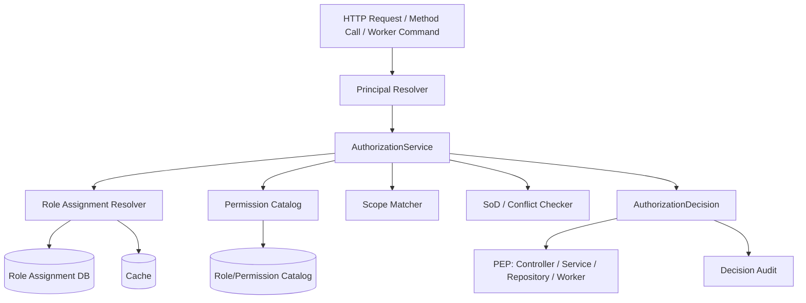

# Part 012 — Implementing RBAC in Java Services

Part sebelumnya mendesain RBAC secara konseptual. Sekarang kita implementasikan.

Targetnya bukan demo:

```java
@PreAuthorize("hasRole('ADMIN')")
```

Targetnya adalah implementation style yang bisa bertahan di sistem Java production:

```text
type-safe permission names
central AuthorizationService
role assignment dengan tenant/scope/validity
explainable effective permissions
consistent denial reasons
cacheable but revocable
works with Spring Security and JAX-RS
safe for service layer, repository query scoping, workers, and tests
```

Spring Security menyediakan infrastruktur penting seperti `AuthorizationManager`, request authorization, dan method security. Tetapi RBAC production-grade tetap membutuhkan domain permission model sendiri, karena framework tidak tahu tenant boundary, case assignment, workflow state, SoD, role lifecycle, atau audit semantics aplikasi kita.

---

## 1. Target Architecture



Core components:

| Component | Responsibility |
|---|---|
| `Subject` | authenticated caller abstraction |
| `Permission` | stable protected capability |
| `ResourceRef` | resource type/id/tenant/scope reference |
| `AuthorizationRequest` | subject + permission + resource + context |
| `AuthorizationDecision` | allow/deny/indeterminate + reason + obligations |
| `RoleAssignmentRepository` | direct/group/service role assignments |
| `PermissionCatalog` | role -> permission mapping and metadata |
| `EffectivePermissionService` | derives active effective permissions |
| `AuthorizationService` | central policy facade |
| `AuthorizationAuditSink` | records decision evidence |

---

## 2. Design Rule: Check Permission, Not Role

Bad:

```java
if (subject.hasRole("CASE_SUPERVISOR")) {
    caseService.close(caseId);
}
```

Better:

```java
authorization.require(subject, Permission.CASE_CLOSE, ResourceRef.caseId(caseId));
caseService.close(caseId);
```

Reason:

```text
Roles change.
Permission semantics should be stable.
```

A method should say what capability it needs, not which organizational job title currently grants that capability.

---

## 3. Permission Enum

Start with type-safe permission constants.

```java
package com.example.security.authz;

import java.util.Arrays;
import java.util.Map;
import java.util.function.Function;
import java.util.stream.Collectors;

public enum Permission {
    CASE_READ("case.read"),
    CASE_CREATE("case.create"),
    CASE_UPDATE("case.update"),
    CASE_ASSIGN("case.assign"),
    CASE_CLOSE("case.close"),
    CASE_REOPEN("case.reopen"),
    CASE_EXPORT("case.export"),

    CASE_EVIDENCE_READ("case.evidence.read"),
    CASE_EVIDENCE_UPLOAD("case.evidence.upload"),
    CASE_EVIDENCE_DELETE("case.evidence.delete"),

    ROLE_ASSIGNMENT_READ("role.assignment.read"),
    ROLE_ASSIGNMENT_REQUEST("role.assignment.request"),
    ROLE_ASSIGNMENT_APPROVE("role.assignment.approve"),
    ROLE_ASSIGNMENT_REVOKE("role.assignment.revoke");

    private static final Map<String, Permission> BY_VALUE = Arrays.stream(values())
            .collect(Collectors.toUnmodifiableMap(Permission::value, Function.identity()));

    private final String value;

    Permission(String value) {
        this.value = value;
    }

    public String value() {
        return value;
    }

    public static Permission parse(String raw) {
        var permission = BY_VALUE.get(raw);
        if (permission == null) {
            throw new IllegalArgumentException("Unknown permission: " + raw);
        }
        return permission;
    }
}
```

Why enum?

```text
compile-time discovery
refactor safety
central list
prevents typo-based authorization bugs
makes tests easier
```

Why not only enum?

```text
role mapping, lifecycle, risk, owner, approval metadata belong in catalog/database
```

---

## 4. Subject Model

Do not pass raw JWT or `Authentication` everywhere.

Create a domain-safe subject.

```java
package com.example.security.authz;

import java.time.Instant;
import java.util.Set;

public record Subject(
        String subjectId,
        SubjectType type,
        String tenantId,
        Set<String> authenticatedAuthorities,
        Instant authenticatedAt,
        String sessionId,
        boolean breakGlassActive
) {
    public boolean isHumanUser() {
        return type == SubjectType.USER;
    }

    public boolean isServiceAccount() {
        return type == SubjectType.SERVICE_ACCOUNT;
    }
}
```

```java
public enum SubjectType {
    USER,
    SERVICE_ACCOUNT,
    SYSTEM
}
```

Important:

```text
Subject is not the same as role assignment.
Subject is identity/context input.
Role assignment is authorization data.
```

---

## 5. Resource Reference

RBAC can check type-level permission, but production authorization needs resource context.

```java
package com.example.security.authz;

import java.util.Map;

public record ResourceRef(
        String type,
        String id,
        String tenantId,
        Map<String, Object> attributes
) {
    public static ResourceRef caseId(String tenantId, String caseId) {
        return new ResourceRef("case", caseId, tenantId, Map.of());
    }

    public static ResourceRef tenant(String tenantId) {
        return new ResourceRef("tenant", tenantId, tenantId, Map.of());
    }

    public ResourceRef withAttribute(String key, Object value) {
        var copy = new java.util.HashMap<>(attributes);
        copy.put(key, value);
        return new ResourceRef(type, id, tenantId, Map.copyOf(copy));
    }
}
```

For create operations, there may be no resource id yet.

```java
ResourceRef newCase = new ResourceRef(
        "case",
        null,
        tenantId,
        Map.of("branchId", request.branchId(), "caseType", request.caseType())
);
```

---

## 6. Authorization Request

```java
package com.example.security.authz;

import java.time.Instant;
import java.util.Map;

public record AuthorizationRequest(
        Subject subject,
        Permission permission,
        ResourceRef resource,
        Map<String, Object> context,
        String correlationId,
        Instant requestedAt
) {
    public static AuthorizationRequest of(
            Subject subject,
            Permission permission,
            ResourceRef resource,
            String correlationId
    ) {
        return new AuthorizationRequest(
                subject,
                permission,
                resource,
                Map.of(),
                correlationId,
                Instant.now()
        );
    }
}
```

Context examples:

```text
requestIp
deviceTrust
workflowAction
riskScore
exportFormat
apiClientId
mfaAgeSeconds
```

Keep context typed at higher-level code when possible. Map is acceptable at boundary but not ideal deep in domain logic.

---

## 7. Authorization Decision

```java
package com.example.security.authz;

import java.time.Duration;
import java.util.List;
import java.util.Map;

public record AuthorizationDecision(
        DecisionEffect effect,
        String reasonCode,
        String reasonMessage,
        List<String> obligations,
        Map<String, Object> evidence,
        boolean cacheable,
        Duration ttl
) {
    public boolean allowed() {
        return effect == DecisionEffect.ALLOW;
    }

    public static AuthorizationDecision allow(String reasonCode, Map<String, Object> evidence) {
        return new AuthorizationDecision(
                DecisionEffect.ALLOW,
                reasonCode,
                "Allowed",
                List.of(),
                Map.copyOf(evidence),
                true,
                Duration.ofMinutes(2)
        );
    }

    public static AuthorizationDecision deny(String reasonCode) {
        return new AuthorizationDecision(
                DecisionEffect.DENY,
                reasonCode,
                "Denied",
                List.of(),
                Map.of(),
                false,
                Duration.ZERO
        );
    }

    public static AuthorizationDecision indeterminate(String reasonCode) {
        return new AuthorizationDecision(
                DecisionEffect.INDETERMINATE,
                reasonCode,
                "Indeterminate",
                List.of(),
                Map.of(),
                false,
                Duration.ZERO
        );
    }
}
```

```java
public enum DecisionEffect {
    ALLOW,
    DENY,
    INDETERMINATE
}
```

Do not collapse `INDETERMINATE` into `ALLOW`.

Default failure rule:

```text
DENY and INDETERMINATE both stop execution.
Only ALLOW proceeds.
```

---

## 8. Role Assignment Entity

```java
package com.example.security.rbac;

import java.time.Instant;
import java.util.Map;

public record RoleAssignment(
        String id,
        String subjectId,
        String subjectType,
        String tenantId,
        String roleCode,
        Scope scope,
        Instant validFrom,
        Instant validUntil,
        String status,
        Map<String, Object> constraints
) {
    public boolean activeAt(Instant now) {
        if (!"ACTIVE".equals(status)) return false;
        if (validFrom.isAfter(now)) return false;
        return validUntil == null || validUntil.isAfter(now);
    }
}
```

```java
public record Scope(String type, String id) {
    public static Scope tenant() {
        return new Scope("TENANT", null);
    }

    public static Scope branch(String branchId) {
        return new Scope("BRANCH", branchId);
    }

    public static Scope region(String regionId) {
        return new Scope("REGION", regionId);
    }
}
```

---

## 9. Role Assignment Repository

Interface first:

```java
package com.example.security.rbac;

import java.time.Instant;
import java.util.List;

public interface RoleAssignmentRepository {
    List<RoleAssignment> findActiveAssignments(
            String tenantId,
            String subjectId,
            String subjectType,
            Instant at
    );

    List<RoleAssignment> findActiveGroupAssignments(
            String tenantId,
            String subjectId,
            Instant at
    );
}
```

SQL idea:

```sql
select ra.*
from role_assignment ra
where ra.tenant_id = :tenant_id
  and ra.subject_id = :subject_id
  and ra.subject_type = :subject_type
  and ra.status = 'ACTIVE'
  and ra.valid_from <= :now
  and (ra.valid_until is null or ra.valid_until > :now)
  and ra.revoked_at is null;
```

For group-derived assignments:

```sql
select ra.*
from group_membership gm
join role_assignment ra
  on ra.subject_type = 'GROUP'
 and ra.subject_id = gm.group_id
where gm.member_subject_id = :subject_id
  and gm.tenant_id = :tenant_id
  and gm.status = 'ACTIVE'
  and ra.status = 'ACTIVE'
  and ra.valid_from <= :now
  and (ra.valid_until is null or ra.valid_until > :now)
  and ra.revoked_at is null;
```

---

## 10. Permission Catalog

```java
package com.example.security.rbac;

import com.example.security.authz.Permission;
import java.util.Set;

public interface PermissionCatalog {
    Set<PermissionGrant> permissionsForRole(String roleCode);
    boolean roleIsActive(String roleCode);
    boolean permissionIsActive(Permission permission);
    String catalogVersion();
}
```

```java
public record PermissionGrant(
        Permission permission,
        String roleCode,
        GrantConstraint constraint
) {}
```

```java
public sealed interface GrantConstraint
        permits NoGrantConstraint, ScopeRequiredConstraint {
}

public record NoGrantConstraint() implements GrantConstraint {}

public record ScopeRequiredConstraint(String scopeType) implements GrantConstraint {}
```

In early systems, permission catalog may be config/YAML. In enterprise systems, store it in DB with migrations and audit.

---

## 11. Effective Permission Service

```java
package com.example.security.rbac;

import com.example.security.authz.Permission;
import com.example.security.authz.Subject;
import java.time.Clock;
import java.util.ArrayList;
import java.util.List;

public final class EffectivePermissionService {
    private final RoleAssignmentRepository roleAssignments;
    private final PermissionCatalog permissionCatalog;
    private final Clock clock;

    public EffectivePermissionService(
            RoleAssignmentRepository roleAssignments,
            PermissionCatalog permissionCatalog,
            Clock clock
    ) {
        this.roleAssignments = roleAssignments;
        this.permissionCatalog = permissionCatalog;
        this.clock = clock;
    }

    public List<EffectivePermission> effectivePermissions(Subject subject) {
        var now = clock.instant();
        var assignments = new ArrayList<RoleAssignment>();

        assignments.addAll(roleAssignments.findActiveAssignments(
                subject.tenantId(),
                subject.subjectId(),
                subject.type().name(),
                now
        ));

        if (subject.isHumanUser()) {
            assignments.addAll(roleAssignments.findActiveGroupAssignments(
                    subject.tenantId(),
                    subject.subjectId(),
                    now
            ));
        }

        var result = new ArrayList<EffectivePermission>();

        for (var assignment : assignments) {
            if (!assignment.activeAt(now)) continue;
            if (!permissionCatalog.roleIsActive(assignment.roleCode())) continue;

            for (var grant : permissionCatalog.permissionsForRole(assignment.roleCode())) {
                if (!permissionCatalog.permissionIsActive(grant.permission())) continue;

                result.add(new EffectivePermission(
                        grant.permission(),
                        assignment.tenantId(),
                        assignment.scope(),
                        assignment.roleCode(),
                        assignment.id(),
                        assignment.validUntil(),
                        permissionCatalog.catalogVersion()
                ));
            }
        }

        return List.copyOf(result);
    }
}
```

```java
package com.example.security.rbac;

import com.example.security.authz.Permission;
import java.time.Instant;

public record EffectivePermission(
        Permission permission,
        String tenantId,
        Scope scope,
        String grantedByRole,
        String assignmentId,
        Instant validUntil,
        String catalogVersion
) {}
```

This service derives permissions. It should not perform all object-level authorization.

---

## 12. Scope Matching

Scope matching is where many RBAC implementations break.

```java
package com.example.security.rbac;

import com.example.security.authz.ResourceRef;

public final class ScopeMatcher {

    public boolean matches(Scope scope, ResourceRef resource) {
        if (scope == null) return false;

        return switch (scope.type()) {
            case "TENANT" -> true;
            case "BRANCH" -> scope.id().equals(resource.attributes().get("branchId"));
            case "REGION" -> scope.id().equals(resource.attributes().get("regionId"));
            case "CASE" -> scope.id().equals(resource.id()) && "case".equals(resource.type());
            default -> false;
        };
    }
}
```

Important: scope matching requires resource attributes.

For read/update existing object, load minimal trusted resource metadata before authorization.

```java
CaseAccessProjection projection = caseRepository.findAccessProjection(caseId)
        .orElseThrow(NotFoundException::new);

ResourceRef resource = new ResourceRef(
        "case",
        projection.caseId(),
        projection.tenantId(),
        Map.of(
                "branchId", projection.branchId(),
                "regionId", projection.regionId(),
                "status", projection.status()
        )
);

authorization.require(subject, Permission.CASE_READ, resource);
```

Do not trust `branchId` from request body for existing resource authorization.

---

## 13. Authorization Service

```java
package com.example.security.authz;

import com.example.security.rbac.EffectivePermissionService;
import com.example.security.rbac.ScopeMatcher;
import java.util.Map;

public final class AuthorizationService {
    private final EffectivePermissionService effectivePermissionService;
    private final ScopeMatcher scopeMatcher;
    private final AuthorizationAuditSink auditSink;

    public AuthorizationService(
            EffectivePermissionService effectivePermissionService,
            ScopeMatcher scopeMatcher,
            AuthorizationAuditSink auditSink
    ) {
        this.effectivePermissionService = effectivePermissionService;
        this.scopeMatcher = scopeMatcher;
        this.auditSink = auditSink;
    }

    public AuthorizationDecision check(AuthorizationRequest request) {
        try {
            var subject = request.subject();
            var resource = request.resource();

            if (subject == null) {
                return record(request, AuthorizationDecision.deny("NO_SUBJECT"));
            }
            if (resource == null) {
                return record(request, AuthorizationDecision.deny("NO_RESOURCE"));
            }
            if (!subject.tenantId().equals(resource.tenantId())) {
                return record(request, AuthorizationDecision.deny("TENANT_MISMATCH"));
            }

            var effective = effectivePermissionService.effectivePermissions(subject);

            for (var grant : effective) {
                if (!grant.permission().equals(request.permission())) continue;
                if (!grant.tenantId().equals(resource.tenantId())) continue;
                if (!scopeMatcher.matches(grant.scope(), resource)) continue;

                return record(request, AuthorizationDecision.allow(
                        "RBAC_PERMISSION_GRANTED",
                        Map.of(
                                "permission", request.permission().value(),
                                "role", grant.grantedByRole(),
                                "assignmentId", grant.assignmentId(),
                                "scopeType", grant.scope().type(),
                                "scopeId", String.valueOf(grant.scope().id()),
                                "catalogVersion", grant.catalogVersion()
                        )
                ));
            }

            return record(request, AuthorizationDecision.deny("MISSING_PERMISSION"));
        } catch (RuntimeException ex) {
            return record(request, AuthorizationDecision.indeterminate("AUTHORIZATION_ERROR"));
        }
    }

    public void require(Subject subject, Permission permission, ResourceRef resource) {
        var request = AuthorizationRequest.of(
                subject,
                permission,
                resource,
                Correlation.currentId()
        );

        var decision = check(request);
        if (!decision.allowed()) {
            throw new AccessDeniedException(decision.reasonCode());
        }
    }

    private AuthorizationDecision record(AuthorizationRequest request, AuthorizationDecision decision) {
        auditSink.record(request, decision);
        return decision;
    }
}
```

Note the failure rule:

```text
catch exception -> INDETERMINATE -> require() denies
```

---

## 14. Access Denied Exception

```java
package com.example.security.authz;

public final class AccessDeniedException extends RuntimeException {
    private final String reasonCode;

    public AccessDeniedException(String reasonCode) {
        super("Access denied");
        this.reasonCode = reasonCode;
    }

    public String reasonCode() {
        return reasonCode;
    }
}
```

Do not expose internal reason code to untrusted clients by default.

Controller advice:

```java
@ExceptionHandler(AccessDeniedException.class)
ResponseEntity<ErrorResponse> handleAccessDenied(AccessDeniedException ex) {
    return ResponseEntity.status(403).body(new ErrorResponse(
            "FORBIDDEN",
            "You are not allowed to perform this operation."
    ));
}
```

Audit still stores `MISSING_PERMISSION`, `TENANT_MISMATCH`, etc.

---

## 15. Spring Security Integration: GrantedAuthority

Spring Security uses `GrantedAuthority` for authorities. A common mapping is:

```text
GrantedAuthority = permission string
```

Example:

```java
new SimpleGrantedAuthority("case.read")
new SimpleGrantedAuthority("case.close")
```

Then:

```java
@PreAuthorize("hasAuthority('case.read')")
```

However, this is only safe for coarse checks. It does not solve tenant/object access unless the expression calls a domain guard.

Better method guard:

```java
@PreAuthorize("@caseAuthorization.canRead(authentication, #caseId)")
public CaseDto getCase(String caseId) {
    return caseQueryService.getCase(caseId);
}
```

But even this can become scattered. Prefer explicit service guard for critical domain operations.

---

## 16. Spring Security AuthorizationManager Adapter

Spring Security’s authorization architecture uses `AuthorizationManager` for access decisions around secure objects like web requests and method invocations.

We can adapt our service.

```java
package com.example.security.spring;

import com.example.security.authz.AuthorizationService;
import com.example.security.authz.Permission;
import com.example.security.authz.ResourceRef;
import jakarta.servlet.http.HttpServletRequest;
import java.util.function.Supplier;
import org.springframework.security.authorization.AuthorizationDecision;
import org.springframework.security.authorization.AuthorizationManager;
import org.springframework.security.core.Authentication;
import org.springframework.security.web.access.intercept.RequestAuthorizationContext;

public final class PermissionAuthorizationManager
        implements AuthorizationManager<RequestAuthorizationContext> {

    private final AuthorizationService authorizationService;
    private final Permission permission;
    private final ResourceResolver resourceResolver;
    private final SpringSubjectMapper subjectMapper;

    public PermissionAuthorizationManager(
            AuthorizationService authorizationService,
            Permission permission,
            ResourceResolver resourceResolver,
            SpringSubjectMapper subjectMapper
    ) {
        this.authorizationService = authorizationService;
        this.permission = permission;
        this.resourceResolver = resourceResolver;
        this.subjectMapper = subjectMapper;
    }

    @Override
    public AuthorizationDecision check(
            Supplier<Authentication> authentication,
            RequestAuthorizationContext context
    ) {
        var auth = authentication.get();
        var request = context.getRequest();
        var subject = subjectMapper.toSubject(auth);
        var resource = resourceResolver.resolve(request);

        var decision = authorizationService.check(
                com.example.security.authz.AuthorizationRequest.of(
                        subject,
                        permission,
                        resource,
                        request.getHeader("X-Correlation-Id")
                )
        );

        return new AuthorizationDecision(decision.allowed());
    }

    public interface ResourceResolver {
        ResourceRef resolve(HttpServletRequest request);
    }
}
```

Configuration:

```java
@Bean
SecurityFilterChain securityFilterChain(HttpSecurity http,
                                        AuthorizationService authorizationService,
                                        SpringSubjectMapper subjectMapper) throws Exception {
    return http
            .authorizeHttpRequests(authz -> authz
                    .requestMatchers(HttpMethod.GET, "/api/cases/{caseId}")
                    .access(new PermissionAuthorizationManager(
                            authorizationService,
                            Permission.CASE_READ,
                            request -> ResourceRef.caseId(
                                    tenantFromRequest(request),
                                    pathVariable(request, "caseId")
                            ),
                            subjectMapper
                    ))
                    .anyRequest().authenticated()
            )
            .build();
}
```

Caveat:

```text
Request layer may not have trusted resource metadata.
For object-level checks, service/repository layer still needed.
```

---

## 17. Spring Method Security Guard

Use a bean method for object-aware authorization.

```java
@Component("authz")
public class MethodAuthorizationFacade {
    private final AuthorizationService authorization;
    private final CaseRepository caseRepository;
    private final SpringSubjectMapper subjectMapper;

    public boolean canReadCase(Authentication authentication, String caseId) {
        var projection = caseRepository.findAccessProjection(caseId)
                .orElse(null);
        if (projection == null) return false;

        var subject = subjectMapper.toSubject(authentication);
        var resource = new ResourceRef(
                "case",
                projection.caseId(),
                projection.tenantId(),
                Map.of("branchId", projection.branchId())
        );

        return authorization.check(AuthorizationRequest.of(
                subject,
                Permission.CASE_READ,
                resource,
                Correlation.currentId()
        )).allowed();
    }
}
```

Usage:

```java
@PreAuthorize("@authz.canReadCase(authentication, #caseId)")
public CaseDto readCase(String caseId) {
    return caseQueryService.readCase(caseId);
}
```

This is better than role string checks, but use carefully:

```text
Do not hide expensive DB queries in expressions without measuring.
Do not rely on method security for internal self-invocation if proxy is bypassed.
Do not use post-filtering as primary protection for large datasets.
```

---

## 18. JAX-RS / Jersey Authorization Filter

For JAX-RS systems:

```java
@NameBinding
@Retention(RetentionPolicy.RUNTIME)
@Target({ElementType.TYPE, ElementType.METHOD})
public @interface RequiresPermission {
    String value();
}
```

Filter:

```java
@Provider
@RequiresPermission("")
@Priority(Priorities.AUTHORIZATION)
public class PermissionFilter implements ContainerRequestFilter {
    private final AuthorizationService authorizationService;
    private final JaxRsSubjectResolver subjectResolver;
    private final JaxRsResourceResolver resourceResolver;

    @Context
    ResourceInfo resourceInfo;

    @Override
    public void filter(ContainerRequestContext requestContext) {
        var annotation = findAnnotation(resourceInfo);
        if (annotation == null) return;

        var permission = Permission.parse(annotation.value());
        var subject = subjectResolver.resolve(requestContext);
        var resource = resourceResolver.resolve(requestContext, resourceInfo);

        var decision = authorizationService.check(AuthorizationRequest.of(
                subject,
                permission,
                resource,
                requestContext.getHeaderString("X-Correlation-Id")
        ));

        if (!decision.allowed()) {
            requestContext.abortWith(Response.status(Response.Status.FORBIDDEN).build());
        }
    }

    private RequiresPermission findAnnotation(ResourceInfo info) {
        var method = info.getResourceMethod().getAnnotation(RequiresPermission.class);
        if (method != null) return method;
        return info.getResourceClass().getAnnotation(RequiresPermission.class);
    }
}
```

Resource:

```java
@GET
@Path("/cases/{caseId}")
@RequiresPermission("case.read")
public CaseDto getCase(@PathParam("caseId") String caseId) {
    return caseApplicationService.getCase(caseId);
}
```

Again: request filter is coarse. Object metadata may require service guard.

---

## 19. Service Layer Guard

For domain operations, explicit guard is the clearest.

```java
public final class CaseApplicationService {
    private final AuthorizationService authorization;
    private final CaseRepository caseRepository;
    private final CaseDomainService domainService;

    public void closeCase(Subject subject, String caseId) {
        var access = caseRepository.findAccessProjection(caseId)
                .orElseThrow(NotFoundException::new);

        var resource = new ResourceRef(
                "case",
                access.caseId(),
                access.tenantId(),
                Map.of(
                        "branchId", access.branchId(),
                        "status", access.status(),
                        "submittedBy", access.submittedBy()
                )
        );

        authorization.require(subject, Permission.CASE_CLOSE, resource);

        var aggregate = caseRepository.loadForUpdate(caseId)
                .orElseThrow(NotFoundException::new);

        domainService.close(aggregate, subject.subjectId());
        caseRepository.save(aggregate);
    }
}
```

Notice:

```text
Authorization runs before mutation.
Domain service still enforces domain invariants.
Repository uses tenant-safe query.
```

---

## 20. Repository Query Scoping

For list/search endpoints, checking `case.read` once is not enough.

Bad:

```java
authorization.require(subject, Permission.CASE_READ, ResourceRef.tenant(subject.tenantId()));
return caseRepository.search(criteria);
```

This could return all tenant cases.

Better:

```java
authorization.require(subject, Permission.CASE_READ, ResourceRef.tenant(subject.tenantId()));
var scopes = authorization.readScopes(subject, Permission.CASE_READ, "case");
return caseRepository.search(criteria.withAuthorizationScopes(scopes));
```

Scope object:

```java
public record AuthorizedScope(
        String tenantId,
        Set<String> branchIds,
        Set<String> regionIds,
        boolean tenantWide
) {}
```

SQL predicate:

```sql
where c.tenant_id = :tenant_id
  and (
      :tenant_wide = true
      or c.branch_id = any(:branch_ids)
      or c.region_id = any(:region_ids)
  )
```

Critical rule:

```text
Authorization predicate must be applied before pagination, sorting side effects, aggregation, and export.
```

---

## 21. Caching Effective Permissions

RBAC can be cached, but incorrectly cached authorization is a vulnerability.

Cache key should include:

```text
subject_id
tenant_id
subject_type
role_assignment_version
permission_catalog_version
group_membership_version
break_glass_state
```

Example:

```java
public record EffectivePermissionCacheKey(
        String tenantId,
        String subjectId,
        String subjectType,
        long roleAssignmentVersion,
        long groupMembershipVersion,
        String catalogVersion
) {}
```

Do not cache only by `userId`.

Bad:

```text
key = userId
```

Better:

```text
key = tenantId + subjectId + subjectType + assignmentVersion + groupVersion + catalogVersion
```

TTL guidance:

```text
Low-risk read permission: short TTL acceptable
High-risk admin permission: very short TTL or no cache
Break-glass: no long-lived allow cache
Revocation-sensitive systems: event invalidation required
```

---

## 22. Cache Invalidation

Whenever these change, invalidate effective permissions:

```text
role assignment created/revoked/expired
role status changed
permission mapping changed
permission status changed
group membership changed
user suspended
tenant membership changed
break-glass activated/revoked
```

Event shape:

```json
{
  "eventType": "RoleAssignmentRevoked",
  "tenantId": "t-001",
  "subjectId": "u-123",
  "assignmentId": "ra-999",
  "version": 42,
  "occurredAt": "2026-07-03T10:15:00Z"
}
```

Use versioning even with pub/sub invalidation. Events can be delayed, duplicated, or missed.

---

## 23. Audit Sink

```java
public interface AuthorizationAuditSink {
    void record(AuthorizationRequest request, AuthorizationDecision decision);
}
```

Implementation fields:

```text
correlation_id
subject_id
subject_type
tenant_id
permission
resource_type
resource_id
decision_effect
reason_code
granting_role
granting_assignment_id
scope_type
scope_id
catalog_version
requested_at
decided_at
service_name
endpoint
```

Audit should record deny decisions too, especially for high-risk operations.

Do not log sensitive resource attributes blindly.

---

## 24. Role Assignment Commands

Do not let arbitrary writes to `role_assignment` table.

Use commands:

```java
public record RequestRoleAssignmentCommand(
        String tenantId,
        String targetSubjectId,
        String targetSubjectType,
        String roleCode,
        Scope scope,
        String reason,
        Instant validUntil
) {}
```

Service:

```java
public final class RoleAssignmentApplicationService {
    private final AuthorizationService authorization;
    private final RolePolicy rolePolicy;
    private final RoleAssignmentRepository repository;

    public String requestAssignment(Subject actor, RequestRoleAssignmentCommand command) {
        authorization.require(
                actor,
                Permission.ROLE_ASSIGNMENT_REQUEST,
                ResourceRef.tenant(command.tenantId())
        );

        rolePolicy.validateAssignable(command.roleCode(), command.scope(), actor);
        rolePolicy.validateNoStaticConflict(command.targetSubjectId(), command.roleCode(), command.scope());
        rolePolicy.validateExpiryRequiredForHighRisk(command.roleCode(), command.validUntil());

        return repository.createPendingRequest(command, actor.subjectId());
    }
}
```

Role assignment is itself a protected business workflow.

---

## 25. Migration Strategy: From Hardcoded Roles

Legacy code often has:

```java
if (hasRole("ADMIN") || hasRole("SUPERVISOR")) { ... }
```

Migration steps:

```text
1. Inventory every role check.
2. Convert each check to named permission.
3. Build permission matrix preserving current behavior.
4. Introduce AuthorizationService facade.
5. Replace role checks with permission checks gradually.
6. Add audit logging in shadow mode.
7. Compare old decision vs new decision.
8. Enable new decision as enforcement.
9. Remove old role checks.
10. Add CI test for permission catalog.
```

Shadow mode:

```java
var oldAllowed = legacyRoleCheck(subject);
var newDecision = authorization.check(request);

if (oldAllowed != newDecision.allowed()) {
    metrics.counter("authz.shadow.diff",
            "permission", request.permission().value(),
            "old", String.valueOf(oldAllowed),
            "new", String.valueOf(newDecision.allowed()))
            .increment();
}

if (enforceNewAuthz) {
    requireAllowed(newDecision);
} else if (!oldAllowed) {
    throw new AccessDeniedException("LEGACY_DENY");
}
```

---

## 26. Catalog Consistency Test

Ensure Java enum and DB/YAML catalog match.

```java
@Test
void everyJavaPermissionExistsInCatalog() {
    var catalogPermissions = permissionCatalog.allPermissionCodes();

    for (var permission : Permission.values()) {
        assertThat(catalogPermissions)
                .as("catalog contains " + permission.value())
                .contains(permission.value());
    }
}

@Test
void catalogDoesNotContainUnknownCode() {
    var javaCodes = Arrays.stream(Permission.values())
            .map(Permission::value)
            .collect(Collectors.toSet());

    assertThat(permissionCatalog.allPermissionCodes())
            .allSatisfy(code -> assertThat(javaCodes).contains(code));
}
```

This catches drift before runtime.

---

## 27. Unit Test for AuthorizationService

```java
@Test
void allowsWhenPermissionGrantedInMatchingScope() {
    var subject = new Subject(
            "u-1",
            SubjectType.USER,
            "t-1",
            Set.of(),
            Instant.now(),
            "s-1",
            false
    );

    var resource = new ResourceRef(
            "case",
            "c-1",
            "t-1",
            Map.of("branchId", "b-1")
    );

    var decision = authorization.check(AuthorizationRequest.of(
            subject,
            Permission.CASE_READ,
            resource,
            "corr-1"
    ));

    assertThat(decision.allowed()).isTrue();
    assertThat(decision.reasonCode()).isEqualTo("RBAC_PERMISSION_GRANTED");
}

@Test
void deniesTenantMismatchEvenIfPermissionExists() {
    var resource = new ResourceRef("case", "c-1", "t-2", Map.of("branchId", "b-1"));

    var decision = authorization.check(AuthorizationRequest.of(
            subjectInTenantT1,
            Permission.CASE_READ,
            resource,
            "corr-1"
    ));

    assertThat(decision.allowed()).isFalse();
    assertThat(decision.reasonCode()).isEqualTo("TENANT_MISMATCH");
}
```

---

## 28. Integration Test for API

```java
@Test
void officerCannotCloseCase() throws Exception {
    mockMvc.perform(post("/api/cases/c-1/close")
                    .with(jwt().jwt(jwt -> jwt
                            .subject("u-officer")
                            .claim("tenant_id", "t-1"))))
            .andExpect(status().isForbidden());
}

@Test
void supervisorCanCloseCaseInScope() throws Exception {
    mockMvc.perform(post("/api/cases/c-2/close")
                    .with(jwt().jwt(jwt -> jwt
                            .subject("u-supervisor")
                            .claim("tenant_id", "t-1"))))
            .andExpect(status().isNoContent());
}
```

Do not only test happy path.

Add tests for:

```text
wrong tenant
wrong branch
expired assignment
revoked assignment
suspended role
deprecated permission
missing resource metadata
PDP/repository failure
```

---

## 29. Performance Considerations

Hot paths:

```text
role assignment lookup
permission catalog lookup
group membership expansion
scope matching
resource access projection loading
audit write
```

Optimization order:

```text
1. Keep permission catalog in memory with version.
2. Cache effective permissions per subject/tenant/version.
3. Load minimal resource projection, not full aggregate.
4. Batch authorize list/bulk operations.
5. Use query scoping for collections.
6. Make audit async only if loss semantics are acceptable.
```

Do not prematurely push all authorization into JWT because of performance. Stale authorization is worse than a few milliseconds of lookup in sensitive systems.

---

## 30. Failure Modeling

What if role repository is down?

```text
Sensitive write -> deny / indeterminate
Low-risk read with fresh cached allow -> maybe allow if policy permits
Admin operation -> deny
Break-glass activation -> deny unless emergency offline procedure exists
```

What if audit sink is down?

```text
High-risk operation -> fail closed if audit is mandatory
Low-risk operation -> allow with local fallback log if accepted by risk policy
```

What if cache is stale?

```text
Use versioned keys.
Use short TTL.
Invalidate on events.
Deny high-risk operation if version freshness cannot be established.
```

---

## 31. Common Implementation Mistakes

### 31.1 Checking Role at Controller Only

A worker, internal service, or batch job bypasses controller.

Fix:

```text
authorization must exist at application service / command boundary too
```

### 31.2 JWT Contains All Permissions

Large token, stale permission, hard revocation.

Fix:

```text
token carries identity and coarse claims; service resolves sensitive permissions
```

### 31.3 `ROLE_ADMIN` Bypass

```java
if (hasRole("ADMIN")) return true;
```

Fix:

```text
admin still needs explicit permission and tenant/resource constraints
```

### 31.4 List Endpoint Filters After Fetch

```java
return repository.search(criteria).stream()
        .filter(row -> authorization.canRead(subject, row))
        .toList();
```

Breaks pagination and may leak via count/timing.

Fix:

```text
push authorization scope into query predicate
```

### 31.5 Deny Reason Leaks Existence

```json
{"error":"User lacks case.read for case CASE-123 in tenant T-999"}
```

Fix:

```text
external: generic 403/404
internal audit: detailed reason
```

---

## 32. Production Checklist

Implementation is acceptable when:

```text
All protected operations use named Permission.
Role checks are not scattered across domain code.
Role assignments have tenant/scope/validity/status.
Effective permissions are explainable.
Permission catalog is versioned.
Java enum and catalog are checked in CI.
AuthorizationService returns structured decision.
Deny and indeterminate fail closed.
Audit logs include decision evidence.
Spring/JAX-RS integration delegates to domain AuthorizationService.
Object-level operations load trusted resource access projection.
List/search/export uses query scoping before pagination.
Cache key includes role/group/catalog version.
Revocation invalidates cache or has accepted bounded staleness.
Admin role assignment is protected by its own permissions.
Tests cover negative, stale, expired, tenant, and scope cases.
```

---

## 33. Key Takeaways

A production RBAC implementation in Java is not a filter with role strings.

It is a small authorization subsystem:

```text
Permission enum + catalog
Role assignment model
Effective permission resolver
Scope matcher
AuthorizationService
Framework adapters
Repository query scoping
Audit sink
Cache invalidation
Migration and tests
```

The core implementation rule:

```text
Application code asks: “does this subject have this permission on this resource?”
It should not ask: “does this user have this role string?”
```

That one shift makes the system easier to secure, test, audit, and evolve.

---

## References

- Spring Security Authorization Architecture — https://docs.spring.io/spring-security/reference/servlet/authorization/architecture.html
- Spring Security Authorize HttpServletRequests — https://docs.spring.io/spring-security/reference/servlet/authorization/authorize-http-requests.html
- Spring Security Method Security — https://docs.spring.io/spring-security/reference/servlet/authorization/method-security.html
- Spring Security AuthorizationManager API — https://docs.spring.io/spring-security/reference/api/java/org/springframework/security/authorization/AuthorizationManager.html
- OWASP Authorization Cheat Sheet — https://cheatsheetseries.owasp.org/cheatsheets/Authorization_Cheat_Sheet.html
- NIST Role-Based Access Control Project — https://csrc.nist.gov/projects/role-based-access-control
