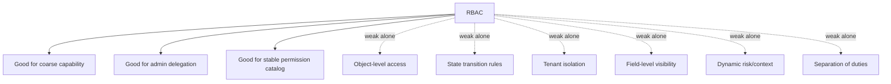
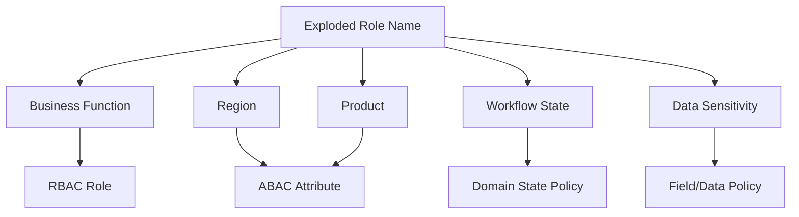
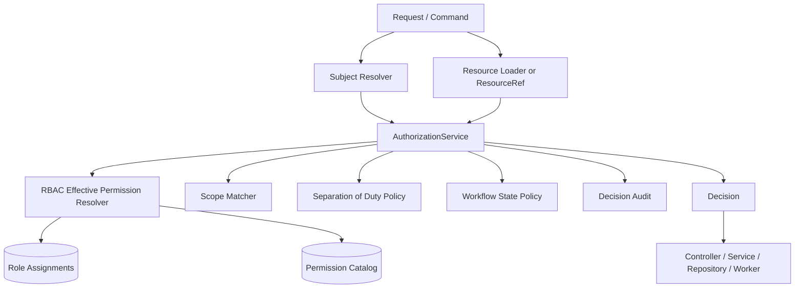

# Part 013 — RBAC Anti-Patterns: Role Explosion, Hidden Admin, Stringly Permission

RBAC kelihatan sederhana sampai sistem mulai punya:

```text
multi-tenant organization
regional authority
case assignment
approval workflow
temporary delegation
service accounts
support agents
break-glass users
regulatory audit
cross-product entitlements
custom customer roles
```

Di titik itu, RBAC yang awalnya hanya:

```java
if (user.hasRole("ADMIN")) { ... }
```

berubah menjadi hutan condition:

```java
if (user.hasRole("ADMIN") ||
    user.hasRole("CASE_MANAGER") ||
    user.hasRole("SUPER_USER") ||
    user.hasRole("OPS") ||
    user.hasRole("REGIONAL_APPROVER") ||
    user.hasRole("HQ_APPROVER") ||
    user.hasRole("TEMP_ESCALATION_USER") ||
    isOwner(user, caseId) ||
    isAssigned(user, caseId) ||
    featureFlags.isEnabled("new-case-workflow")) {
    // do sensitive thing
}
```

Itu bukan authorization model. Itu adalah akumulasi exception.

Bagian ini membahas anti-pattern RBAC yang paling sering menyebabkan broken access control pada sistem Java enterprise. Fokusnya bukan menyalahkan RBAC. RBAC tetap berguna. Masalahnya adalah memakai RBAC untuk semua bentuk authorization, lalu menyembunyikan constraint yang seharusnya eksplisit.

---

## 1. Mental Model: RBAC Is a Coarse-Grained Entitlement Model

RBAC menjawab:

```text
Apa kemampuan umum yang diberikan kepada subject karena subject memegang role tertentu?
```

RBAC tidak selalu cukup untuk menjawab:

```text
Apakah subject boleh mengakses object spesifik ini?
Apakah subject boleh melakukan action ini pada state object sekarang?
Apakah subject boleh approve pekerjaan yang dia buat sendiri?
Apakah subject boleh melihat field sensitif ini?
Apakah subject boleh bertindak lintas tenant?
Apakah subject masih boleh memakai role yang sudah dicabut 30 detik lalu?
```

NIST RBAC memodelkan relasi user, role, permission, operation, dan object. Itu bagus untuk role-permission assignment. Tetapi object-level relationship, workflow state, attribute freshness, dan separation-of-duty biasanya perlu layer tambahan.



Production rule:

> Use RBAC to grant broad capability. Use object/context checks to constrain actual execution.

---

## 2. Anti-Pattern #1 — Role Checks Instead of Permission Checks

### Symptom

```java
@PreAuthorize("hasRole('CASE_MANAGER')")
@PostMapping("/cases/{caseId}/escalate")
public ResponseEntity<Void> escalate(@PathVariable UUID caseId) {
    service.escalate(caseId);
    return ResponseEntity.noContent().build();
}
```

This code asks:

```text
Is the user a CASE_MANAGER?
```

But the actual question is:

```text
May this subject escalate this specific case right now?
```

Those are different questions.

### Why It Fails

A role is an organizational label. A permission is a protected capability. A domain action is a specific operation on a resource.

Role checks create tight coupling between endpoint behavior and organizational structure. When the organization changes, code changes. When code changes, authorization semantics become inconsistent.

### Better Model

```java
@RequirePermission(
    action = "case.escalate",
    resource = "case",
    idParam = "caseId"
)
@PostMapping("/cases/{caseId}/escalate")
public ResponseEntity<Void> escalate(@PathVariable UUID caseId) {
    service.escalate(caseId);
    return ResponseEntity.noContent().build();
}
```

Then the policy layer can decide:

```text
case.escalate is granted to:
- role: CASE_MANAGER, only for assigned cases
- role: REGIONAL_SUPERVISOR, only within same region
- role: HQ_ESCALATION_OFFICER, only for high-risk cases
- break-glass role, only with justification and audit obligation
```

The endpoint should not know all of that.

### Java Refactoring

Bad:

```java
if (principal.roles().contains("CASE_MANAGER")) {
    escalationService.escalate(caseId);
}
```

Better:

```java
AuthorizationDecision decision = authorizationService.check(
    AuthorizationRequest.builder()
        .subject(subject)
        .action("case.escalate")
        .resource(ResourceRef.caseRef(tenantId, caseId))
        .context(Context.of("channel", "api"))
        .build()
);

decision.requireAllowed();
escalationService.escalate(caseId);
```

Best for domain transition:

```java
public void escalate(EscalateCaseCommand command) {
    CaseRecord record = caseRepository.findForUpdate(command.caseId())
        .orElseThrow(NotFoundException::new);

    authorizationService.requireAllowed(
        AuthorizationRequest.builder()
            .subject(command.subject())
            .action("case.escalate")
            .resource(record.toResourceRef())
            .context(Context.of(
                "caseStatus", record.status(),
                "assignedUserId", record.assignedUserId(),
                "region", record.region(),
                "riskLevel", record.riskLevel()
            ))
            .build()
    );

    record.escalate(command.reason());
}
```

---

## 3. Anti-Pattern #2 — Stringly-Typed Permission Names

### Symptom

```java
if (authz.can(user, "cases:esclate", caseId)) {
    // typo: esclate
}
```

or:

```java
@PreAuthorize("hasAuthority('case:approve')")
```

with hundreds of string literals across controllers, tests, migrations, frontend configs, and admin UIs.

### Why It Fails

Stringly permissions cause:

```text
typos
orphaned permissions
silent deny
silent allow if wildcard exists
hard-to-refactor action names
inconsistent naming: case.approve vs cases:approve vs CASE_APPROVE
missing ownership metadata
missing risk classification
```

### Better Model

Use a typed permission catalog in code, backed by a database catalog when roles are configurable.

```java
public enum PermissionKey {
    CASE_READ("case.read", Risk.LOW),
    CASE_CREATE("case.create", Risk.MEDIUM),
    CASE_ASSIGN("case.assign", Risk.HIGH),
    CASE_ESCALATE("case.escalate", Risk.HIGH),
    CASE_APPROVE("case.approve", Risk.CRITICAL),
    CASE_DELETE("case.delete", Risk.CRITICAL),
    CASE_EVIDENCE_READ("case.evidence.read", Risk.HIGH),
    CASE_EVIDENCE_REDACTED_READ("case.evidence.redacted.read", Risk.MEDIUM);

    private final String key;
    private final Risk risk;

    PermissionKey(String key, Risk risk) {
        this.key = key;
        this.risk = risk;
    }

    public String key() {
        return key;
    }

    public Risk risk() {
        return risk;
    }
}
```

Then expose stable strings at integration boundary:

```java
public record PermissionDescriptor(
    String key,
    String title,
    String description,
    Risk risk,
    String resourceType,
    boolean requiresObjectCheck,
    boolean requiresAudit,
    boolean assignableToCustomRole
) {}
```

### Catalog Validation

At startup:

```java
@Component
final class PermissionCatalogValidator {

    private final PermissionCatalogRepository repository;

    @EventListener(ApplicationReadyEvent.class)
    void validate() {
        Set<String> codePermissions = Arrays.stream(PermissionKey.values())
            .map(PermissionKey::key)
            .collect(Collectors.toSet());

        Set<String> dbPermissions = repository.findAllKeys();

        Set<String> missingInDb = difference(codePermissions, dbPermissions);
        Set<String> unknownInDb = difference(dbPermissions, codePermissions);

        if (!missingInDb.isEmpty()) {
            throw new IllegalStateException("Missing permissions in DB: " + missingInDb);
        }

        if (!unknownInDb.isEmpty()) {
            throw new IllegalStateException("Unknown permissions in DB: " + unknownInDb);
        }
    }
}
```

Production invariant:

> A protected operation must reference a known permission from a validated catalog.

---

## 4. Anti-Pattern #3 — The Hidden Super Admin

### Symptom

```java
if (user.isSuperAdmin()) {
    return true;
}
```

or:

```java
if (roles.contains("ROOT")) {
    return AuthorizationDecision.allow();
}
```

### Why It Fails

A hidden super admin often bypasses:

```text
tenant boundary
separation of duties
approval restrictions
field-level masking
object-level checks
risk-based controls
auditing obligations
```

In many systems, the super admin role is added during early development and never modeled formally.

### Better Model

There are three different concepts that teams often collapse into `SUPER_ADMIN`:

| Concept | Meaning | Should bypass? |
|---|---|---|
| Platform operator | Maintains platform/configuration | No domain data access by default |
| Tenant administrator | Manages users/roles in tenant | No automatic access to all tenant data |
| Break-glass operator | Emergency override | Only with reason, expiry, audit, and post-review |

Break-glass should be explicit:

```java
public record BreakGlassContext(
    boolean active,
    String ticketId,
    String justification,
    Instant expiresAt,
    String approvedBy
) {
    public boolean usableAt(Instant now) {
        return active && expiresAt != null && now.isBefore(expiresAt);
    }
}
```

Decision with obligation:

```java
if (subject.breakGlass().usableAt(clock.instant())) {
    return AuthorizationDecision.allow(
        ReasonCode.BREAK_GLASS_OVERRIDE,
        List.of(
            Obligation.auditHighRisk(),
            Obligation.requireTicket(subject.breakGlass().ticketId()),
            Obligation.notifySecurityTeam()
        )
    );
}
```

But even break-glass may not bypass everything:

```text
never bypass legal hold deletion restrictions
never bypass cryptographic isolation without key grant
never bypass cross-tenant isolation silently
never bypass audit logging
never bypass post-incident review
```

### Guardrail

```java
public enum BypassClass {
    NONE,
    ADMIN_DELEGATED,
    BREAK_GLASS,
    SYSTEM_INTERNAL
}

public record AuthorizationDecision(
    Decision decision,
    ReasonCode reasonCode,
    BypassClass bypassClass,
    List<Obligation> obligations
) {}
```

Production invariant:

> Every bypass must be represented in the decision model and auditable as a bypass.

---

## 5. Anti-Pattern #4 — Role Explosion

### Symptom

You start with:

```text
ADMIN
USER
MANAGER
```

Then business adds region and department:

```text
JAKARTA_CASE_MANAGER
SURABAYA_CASE_MANAGER
BALI_CASE_MANAGER
JAKARTA_SUPERVISOR
SURABAYA_SUPERVISOR
BALI_SUPERVISOR
```

Then workflow state:

```text
JAKARTA_CASE_MANAGER_DRAFT
JAKARTA_CASE_MANAGER_REVIEW
JAKARTA_CASE_MANAGER_ESCALATED
```

Then product line:

```text
JAKARTA_RETAIL_CASE_MANAGER_REVIEW
JAKARTA_CORPORATE_CASE_MANAGER_REVIEW
```

Then data sensitivity:

```text
JAKARTA_RETAIL_CASE_MANAGER_REVIEW_PII
```

The role catalog becomes a compressed policy language.

### Why It Fails

Role explosion usually means the team is encoding attributes into role names.

```text
role = function + region + product + workflowState + dataSensitivity + delegationType
```

That is ABAC disguised as RBAC.

### Better Decomposition

Separate stable capability from dynamic constraint.

Bad:

```text
JAKARTA_RETAIL_CASE_APPROVER_HIGH_RISK
```

Better:

```text
role: CASE_APPROVER
permission: case.approve
subject.department: retail
subject.region: jakarta
resource.region: jakarta
resource.riskLevel: high
resource.status: pending_approval
policy: subject.region == resource.region && resource.status == 'pending_approval'
```



### Refactoring Algorithm

1. Export all roles.
2. Tokenize role names.
3. Classify tokens as business function, region, department, resource type, workflow state, sensitivity, or temporary access.
4. Convert business function to roles.
5. Convert resource/action capability to permissions.
6. Convert region/department/state/sensitivity to attributes.
7. Preserve old role names as aliases temporarily.
8. Run shadow evaluation: old RBAC decision vs new hybrid decision.
9. Remove alias after audit window.

Example role decomposition:

| Old role | New role | Permission | Attribute constraint |
|---|---|---|---|
| `JKT_CASE_APPROVER` | `CASE_APPROVER` | `case.approve` | `subject.region == resource.region == JKT` |
| `OPS_HIGH_RISK_VIEWER` | `RISK_ANALYST` | `case.read.highRisk` | `resource.riskLevel == HIGH` |
| `RETAIL_EVIDENCE_REVIEWER` | `EVIDENCE_REVIEWER` | `evidence.review` | `subject.department == resource.department` |

---

## 6. Anti-Pattern #5 — Wildcard Permission Abuse

### Symptom

```text
case.*
admin.*
*.*
```

or:

```java
if (permission.endsWith(".*")) {
    return requested.startsWith(permission.substring(0, permission.length() - 1));
}
```

### Why It Fails

Wildcards are operationally convenient but semantically dangerous. New permissions are automatically granted to old roles.

Example:

```text
Existing wildcard: case.*
New permission: case.deleteEvidencePermanently
Result: every case.* holder now gets destructive evidence deletion.
```

### Better Model

Use explicit permission groups instead of runtime wildcards.

```java
public record PermissionGroup(
    String key,
    Set<PermissionKey> permissions,
    boolean autoIncludeNewPermissions
) {}
```

For high-risk domains:

```java
PermissionGroup CASE_READ_ONLY = new PermissionGroup(
    "case.readOnly",
    Set.of(PermissionKey.CASE_READ, PermissionKey.CASE_EVIDENCE_REDACTED_READ),
    false
);
```

If a group auto-includes new permissions, require risk threshold:

```java
boolean mayAutoInclude(PermissionDescriptor permission) {
    return permission.risk() == Risk.LOW
        && !permission.requiresObjectCheck()
        && !permission.requiresAudit();
}
```

Production invariant:

> A new critical permission must not become reachable through an existing wildcard without explicit approval.

---

## 7. Anti-Pattern #6 — UI-Only Authorization

### Symptom

Frontend hides buttons:

```ts
if (user.roles.includes('APPROVER')) {
  showApproveButton();
}
```

Backend accepts request:

```java
@PostMapping("/cases/{id}/approve")
public void approve(@PathVariable UUID id) {
    service.approve(id);
}
```

### Why It Fails

UI authorization improves UX. It is not enforcement.

Attackers do not need the UI. They can call HTTP endpoints directly, replay requests, modify IDs, call mobile APIs, or use stale clients.

### Better Pattern

Use UI permission hints only as hints:

```java
@GetMapping("/cases/{id}/actions")
public AvailableActions actions(@PathVariable UUID id) {
    CaseSummary summary = caseQueryService.getSummary(id);

    return AvailableActions.from(
        authorizationService.batchCheck(List.of(
            request("case.read", summary),
            request("case.update", summary),
            request("case.assign", summary),
            request("case.approve", summary),
            request("case.escalate", summary)
        ))
    );
}
```

Then recheck on action execution:

```java
@PostMapping("/cases/{id}/approve")
public void approve(@PathVariable UUID id, @RequestBody ApproveRequest body) {
    caseApplicationService.approve(currentSubject(), id, body.reason());
}
```

Inside service:

```java
authorizationService.requireAllowed(
    subject,
    PermissionKey.CASE_APPROVE,
    record.toResourceRef(),
    record.toAuthzContext()
);
```

Production invariant:

> UI may predict authorization; backend must enforce authorization.

---

## 8. Anti-Pattern #7 — Endpoint-Level Authorization Without Object Binding

### Symptom

```java
@PreAuthorize("hasAuthority('case.read')")
@GetMapping("/cases/{caseId}")
public CaseDto get(@PathVariable UUID caseId) {
    return service.get(caseId);
}
```

This checks permission to read cases in general, but not this case.

### Why It Fails

This is classic object-level authorization failure.

```text
User has case.read.
User should only read assigned cases.
Endpoint allows any case ID.
Horizontal privilege escalation occurs.
```

### Better Pattern

Object-level check:

```java
public CaseDto get(UUID caseId) {
    CaseRecord record = repository.findById(caseId)
        .orElseThrow(NotFoundException::new);

    authorizationService.requireAllowed(
        subject,
        PermissionKey.CASE_READ,
        record.toResourceRef(),
        record.toAuthzContext()
    );

    return mapper.toDto(record);
}
```

For lists, authorize by construction:

```java
public Page<CaseSummary> search(CaseSearchCriteria criteria, Pageable pageable) {
    QueryScope scope = authorizationService.queryScope(
        subject,
        PermissionKey.CASE_READ,
        ResourceType.CASE,
        criteria.context()
    );

    return repository.search(criteria.withScope(scope), pageable);
}
```

Avoid:

```java
Page<CaseSummary> page = repository.search(criteria, pageable);
return page.filter(case -> authorizationService.canRead(subject, case));
```

Filtering after pagination leaks counts, page shapes, timing, and sometimes data.

---

## 9. Anti-Pattern #8 — Tenant ID From Request Is Trusted

### Symptom

```java
@GetMapping("/tenants/{tenantId}/cases/{caseId}")
public CaseDto get(@PathVariable UUID tenantId, @PathVariable UUID caseId) {
    return caseService.get(tenantId, caseId);
}
```

Then repository:

```java
select * from cases where tenant_id = :tenantId and id = :caseId
```

Looks safe, but only if caller is authorized for `tenantId`.

### Why It Fails

A tenant path parameter is not proof of tenant membership. It is attacker-controlled input.

### Better Pattern

Resolve authorized tenant scope from subject, then intersect with requested tenant.

```java
TenantScope tenantScope = tenantAccessResolver.resolve(subject);

if (!tenantScope.allows(requestedTenantId)) {
    throw new NotFoundException(); // avoid tenant enumeration
}

CaseRecord record = repository.findByTenantAndId(requestedTenantId, caseId)
    .orElseThrow(NotFoundException::new);
```

Prefer command model:

```java
public record TenantBoundResourceRef(
    UUID tenantId,
    String resourceType,
    UUID resourceId
) {}
```

Every resource ref must contain tenant boundary:

```java
public record ResourceRef(
    String type,
    UUID id,
    UUID tenantId,
    Map<String, Object> attributes
) {
    public ResourceRef {
        Objects.requireNonNull(type);
        Objects.requireNonNull(id);
        Objects.requireNonNull(tenantId, "tenantId is mandatory for tenant-scoped resources");
    }
}
```

Production invariant:

> Tenant scope must be derived from trusted subject membership, not trusted from request path.

---

## 10. Anti-Pattern #9 — Admin Role Can Manage Its Own Privileges

### Symptom

```java
@PreAuthorize("hasRole('TENANT_ADMIN')")
@PostMapping("/users/{userId}/roles")
public void assignRole(@PathVariable UUID userId, @RequestBody AssignRoleRequest request) {
    roleService.assign(userId, request.role());
}
```

This allows:

```text
admin assigns themselves higher privilege
admin removes audit role constraints
admin creates another admin account
admin grants break-glass role
admin grants role outside their authority
```

### Better Model

Administrative authorization is separate from business authorization.

```java
public record RoleAssignmentCommand(
    Subject actor,
    UUID targetUserId,
    String roleKey,
    Scope scope,
    Instant validUntil,
    String reason
) {}
```

Admin policy checks:

```text
actor may assign role R to target T only if:
- actor has role.admin.assign
- role R is assignable by actor's admin domain
- target is inside actor's manageable scope
- actor is not target for privileged roles
- assignment does not violate SoD
- high-risk role requires approval
- temporary access has expiry
```

Java skeleton:

```java
public void assignRole(RoleAssignmentCommand command) {
    RoleDescriptor role = roleCatalog.get(command.roleKey());
    UserDescriptor target = userDirectory.get(command.targetUserId());

    AuthorizationDecision decision = adminAuthorizationService.checkRoleAssignment(
        command.actor(),
        target,
        role,
        command.scope(),
        command.validUntil()
    );

    decision.requireAllowed();

    roleAssignmentRepository.insert(RoleAssignment.create(command));
    audit.logRoleAssignment(command, decision);
}
```

Production invariant:

> Managing authorization data is itself a high-risk authorization operation.

---

## 11. Anti-Pattern #10 — No Separation of Duties Model

### Symptom

```java
if (user.hasAuthority("case.approve")) {
    approve(caseId);
}
```

But business rule says:

```text
The creator of a case must not approve the same case.
```

### Why It Fails

RBAC can say a user is an approver. It cannot by itself say whether this specific approval creates a conflict.

### Better Model

```java
public final class SeparationOfDutyPolicy {

    public Optional<Denial> check(Subject subject, CaseRecord record, PermissionKey permission) {
        if (permission == PermissionKey.CASE_APPROVE
            && subject.userId().equals(record.createdBy())) {
            return Optional.of(new Denial(
                ReasonCode.SOD_CREATOR_CANNOT_APPROVE,
                "Creator cannot approve own case"
            ));
        }

        if (permission == PermissionKey.CASE_FINALIZE
            && subject.userId().equals(record.lastReviewedBy())) {
            return Optional.of(new Denial(
                ReasonCode.SOD_REVIEWER_CANNOT_FINALIZE,
                "Reviewer cannot finalize same case"
            ));
        }

        return Optional.empty();
    }
}
```

SoD can be:

| Type | Meaning | Example |
|---|---|---|
| Static SoD | same user must not hold conflicting roles | `TRADER` and `TRADE_APPROVER` |
| Dynamic SoD | same user may hold roles but cannot act in same transaction | creator cannot approve own case |
| Temporal SoD | action depends on previous actor/time | reviewer in last 24h cannot finalize |
| Contextual SoD | conflict depends on department/tenant/product | branch officer cannot approve branch exception |

---

## 12. Anti-Pattern #11 — Stale Role Assignment and Token Claims

### Symptom

JWT contains roles:

```json
{
  "sub": "user-123",
  "roles": ["CASE_APPROVER", "TENANT_ADMIN"],
  "exp": 1790000000
}
```

User's admin role is revoked, but token remains valid for 1 hour.

### Why It Fails

Authorization state changes faster than token expiry.

Common causes:

```text
roles embedded in long-lived JWT
role changes not propagated to services
local caches not invalidated
service workers using stale snapshots
batch jobs executing delayed commands without recheck
```

### Better Pattern

Use token claims as identity hints, not necessarily final authorization truth for high-risk operations.

```java
public enum PermissionFreshness {
    TOKEN_CLAIM_OK,
    CACHE_OK,
    MUST_READ_SOURCE_OF_TRUTH
}
```

Risk-based freshness:

```java
PermissionFreshness freshnessFor(PermissionKey permission) {
    return switch (permission.risk()) {
        case LOW -> PermissionFreshness.CACHE_OK;
        case MEDIUM -> PermissionFreshness.CACHE_OK;
        case HIGH, CRITICAL -> PermissionFreshness.MUST_READ_SOURCE_OF_TRUTH;
    };
}
```

Decision contains cache semantics:

```java
public record CacheDirective(
    boolean cacheable,
    Duration ttl,
    Set<String> invalidationTopics,
    String policyVersion,
    String subjectVersion
) {}
```

Production invariant:

> Critical permission revocation must take effect within a bounded and tested revocation window.

---

## 13. Anti-Pattern #12 — Role Assignment Without Scope

### Symptom

```sql
user_id | role
--------+-------------
u-123   | CASE_MANAGER
```

No tenant. No region. No department. No product. No validity. No assignment source.

### Why It Fails

Global roles become accidental global access.

### Better Schema

```sql
create table role_assignment (
    id uuid primary key,
    subject_id uuid not null,
    subject_type text not null,
    role_key text not null,
    tenant_id uuid,
    org_unit_id uuid,
    region_code text,
    resource_type text,
    resource_id uuid,
    assignment_source text not null,
    valid_from timestamptz not null,
    valid_until timestamptz,
    assigned_by uuid,
    reason text,
    created_at timestamptz not null,
    revoked_at timestamptz,
    revoked_by uuid,
    revoke_reason text
);
```

Scope matching:

```java
public boolean matches(RoleAssignment assignment, ResourceRef resource) {
    return tenantMatches(assignment, resource)
        && orgUnitMatches(assignment, resource)
        && regionMatches(assignment, resource)
        && resourceMatches(assignment, resource)
        && validityMatches(assignment, clock.instant())
        && assignment.revokedAt() == null;
}
```

Production invariant:

> A role assignment without scope must be treated as exceptional and high-risk.

---

## 14. Anti-Pattern #13 — Permission Matrix Exists Only in Wiki

### Symptom

Product team maintains permission matrix in Confluence or spreadsheet:

```text
Role X can do A, B, C.
Role Y can do B, D.
```

Code has different behavior.

### Why It Fails

Documentation drifts. Tests become outdated. Admin UI lies. Auditors cannot prove actual enforcement.

### Better Pattern: Executable Permission Matrix

Represent policy expectations as data-driven tests.

```yaml
- name: case manager can read assigned case
  subject:
    roles: [CASE_MANAGER]
    userId: u-1
  resource:
    type: case
    tenantId: t-1
    assignedUserId: u-1
    status: OPEN
  action: case.read
  expected: ALLOW

- name: case manager cannot approve own created case
  subject:
    roles: [CASE_APPROVER]
    userId: u-1
  resource:
    type: case
    tenantId: t-1
    createdBy: u-1
    status: PENDING_APPROVAL
  action: case.approve
  expected: DENY
  reason: SOD_CREATOR_CANNOT_APPROVE
```

JUnit runner:

```java
@ParameterizedTest
@MethodSource("permissionCases")
void permissionMatrixIsExecutable(PermissionTestCase testCase) {
    AuthorizationDecision decision = authorizationService.check(testCase.toRequest());
    assertThat(decision.decision()).isEqualTo(testCase.expected());
    if (testCase.reason() != null) {
        assertThat(decision.reasonCode()).isEqualTo(testCase.reason());
    }
}
```

Production invariant:

> The permission matrix must be executable, versioned, and tested in CI.

---

## 15. Anti-Pattern #14 — Allow-by-Default Migration

### Symptom

During migration from old RBAC to new policy engine:

```java
try {
    return policyEngine.check(request);
} catch (Exception e) {
    return AuthorizationDecision.allow("policy engine unavailable");
}
```

### Why It Fails

Fail-open may convert dependency failures into security incidents.

### Better Migration Mode

Use explicit mode per action risk:

```java
public enum MigrationMode {
    LEGACY_ONLY,
    DUAL_RUN_LEGACY_ENFORCE,
    DUAL_RUN_NEW_ENFORCE,
    NEW_ONLY
}
```

Dual-run example:

```java
AuthorizationDecision legacy = legacyRbac.check(request);
AuthorizationDecision modern = modernPolicy.check(request);

if (!legacy.sameOutcomeAs(modern)) {
    audit.logPolicyDiff(request, legacy, modern);
}

return switch (mode.forAction(request.action())) {
    case LEGACY_ONLY -> legacy;
    case DUAL_RUN_LEGACY_ENFORCE -> legacy;
    case DUAL_RUN_NEW_ENFORCE -> modern;
    case NEW_ONLY -> modern;
};
```

Fallback by risk:

```java
if (policyEngineUnavailable) {
    if (request.permission().risk().isCritical()) {
        return AuthorizationDecision.deny(ReasonCode.POLICY_ENGINE_UNAVAILABLE);
    }

    return localFallbackPolicy.check(request);
}
```

Production invariant:

> Migration must be observable before it is enforceable.

---

## 16. Anti-Pattern #15 — Authorization Hidden Inside Repository Helpers

### Symptom

```java
caseRepository.findVisibleCases(userId, filters);
```

But no one knows what “visible” means.

### Why It Fails

Hidden authorization logic is hard to audit and impossible to reuse consistently. It also encourages duplicate semantics:

```text
findVisibleCases
findReadableCases
findCasesForUser
findCasesForDashboard
findCasesForExport
```

Each function drifts.

### Better Pattern

Make query scope explicit:

```java
QueryScope scope = authorizationService.queryScope(
    subject,
    PermissionKey.CASE_READ,
    ResourceType.CASE,
    SearchContext.of(filters)
);

Page<CaseSummary> page = caseRepository.search(filters, scope, pageable);
```

Repository applies scope mechanically:

```java
public Page<CaseSummary> search(CaseFilters filters, QueryScope scope, Pageable pageable) {
    SqlBuilder sql = new SqlBuilder("select * from cases where 1=1");

    filters.applyTo(sql);
    scope.applyTo(sql); // tenant, assignment, region, classification predicates

    return jdbc.query(sql, pageable);
}
```

Production invariant:

> Repository may apply authorization predicates, but it should not invent authorization semantics.

---

## 17. Anti-Pattern #16 — Conflating Feature Flags With Authorization

### Symptom

```java
if (featureFlags.enabled("case-approval", user)) {
    approve(caseId);
}
```

### Why It Fails

Feature flags answer:

```text
Is feature rollout enabled for this user/cohort/environment?
```

Authorization answers:

```text
Is this subject allowed to perform this protected action on this resource?
```

Feature flags may reduce exposure. They do not establish authority.

### Correct Composition

```java
if (!featureFlags.enabled("case-approval-v2", subject)) {
    throw new NotFoundException();
}

authorizationService.requireAllowed(
    subject,
    PermissionKey.CASE_APPROVE,
    record.toResourceRef(),
    record.toAuthzContext()
);
```

Decision model can include feature flag context:

```java
Context.of(
    "feature.caseApprovalV2", featureFlags.enabled("case-approval-v2", subject),
    "deployment.ring", "canary"
)
```

But flag result should not replace authorization.

---

## 18. Anti-Pattern #17 — Treating Service Accounts as Trusted Internals

### Symptom

```java
if (principal.isServiceAccount()) {
    return true;
}
```

### Why It Fails

Microservices are not automatically trusted. Service accounts can be compromised. Internal endpoints are reachable through SSRF, lateral movement, misconfigured ingress, queue injection, or leaked credentials.

### Better Pattern

Service accounts also need permissions:

```java
AuthorizationRequest.builder()
    .subject(Subject.service("case-worker"))
    .action("case.recalculateSla")
    .resource(ResourceRef.caseRef(tenantId, caseId))
    .context(Context.of(
        "trigger", "kafka-event",
        "eventId", eventId,
        "originalActor", originalActorId,
        "commandAuthorizedAt", authorizedAt
    ))
    .build();
```

Distinguish:

| Mode | Meaning | Authorization requirement |
|---|---|---|
| Service acts as itself | maintenance/system task | service account permission |
| Service acts on behalf of user | delegated call | user permission + service delegation permission |
| Service processes authorized command | async command | command snapshot + recheck policy |

Production invariant:

> Internal service calls must have explicit authority, not implicit trust.

---

## 19. Anti-Pattern #18 — Inconsistent Deny Semantics

### Symptom

Sometimes denied access returns:

```text
403 Forbidden
404 Not Found
401 Unauthorized
200 with empty data
500 NullPointerException
```

No consistent reason code.

### Why It Fails

Inconsistent deny semantics create:

```text
resource enumeration leaks
bad client behavior
hard-to-debug incidents
impossible audit reconstruction
inconsistent monitoring
```

### Better Model

Decision reason is internal. HTTP mapping is separate.

```java
public enum ReasonCode {
    ALLOW,
    NOT_AUTHENTICATED,
    MISSING_PERMISSION,
    OUTSIDE_TENANT_SCOPE,
    OUTSIDE_RESOURCE_SCOPE,
    RESOURCE_STATE_NOT_ALLOWED,
    SOD_CONFLICT,
    POLICY_ENGINE_UNAVAILABLE,
    ATTRIBUTE_UNAVAILABLE,
    BREAK_GLASS_REQUIRED
}
```

HTTP mapping:

```java
public HttpStatus map(AuthorizationDecision decision) {
    return switch (decision.reasonCode()) {
        case NOT_AUTHENTICATED -> HttpStatus.UNAUTHORIZED;
        case OUTSIDE_TENANT_SCOPE, OUTSIDE_RESOURCE_SCOPE -> HttpStatus.NOT_FOUND;
        case MISSING_PERMISSION, RESOURCE_STATE_NOT_ALLOWED, SOD_CONFLICT -> HttpStatus.FORBIDDEN;
        case POLICY_ENGINE_UNAVAILABLE, ATTRIBUTE_UNAVAILABLE -> HttpStatus.SERVICE_UNAVAILABLE;
        default -> HttpStatus.FORBIDDEN;
    };
}
```

Client response:

```json
{
  "error": "access_denied",
  "message": "You are not allowed to perform this action.",
  "correlationId": "..."
}
```

Audit record:

```json
{
  "decision": "DENY",
  "reasonCode": "SOD_CONFLICT",
  "subjectId": "u-123",
  "action": "case.approve",
  "resourceType": "case",
  "resourceId": "c-789",
  "policyVersion": "2026.07.03-1"
}
```

---

## 20. Anti-Pattern Detection Checklist

Use this during code review.

### Endpoint Layer

```text
[ ] Does endpoint check permission, not role name?
[ ] Does object-specific operation bind resource id to subject authorization?
[ ] Does endpoint avoid trusting tenant id from request alone?
[ ] Does endpoint avoid UI-only authorization?
[ ] Does endpoint avoid wildcard permission assumptions?
```

### Service Layer

```text
[ ] Does protected domain transition call AuthorizationService?
[ ] Does authorization use current resource state?
[ ] Does SoD run before critical transition?
[ ] Does service avoid hidden admin bypass?
[ ] Does deny reason map to safe external response?
```

### Repository Layer

```text
[ ] Are list/search/export queries scoped before pagination?
[ ] Is query scope explicit and auditable?
[ ] Are tenant predicates mandatory?
[ ] Are bulk operations scoped?
[ ] Are counts and exports protected?
```

### Role Management

```text
[ ] Are role assignments scoped?
[ ] Are high-risk roles temporary or approved?
[ ] Can admin grant only roles inside own authority?
[ ] Is self-privilege escalation blocked?
[ ] Is access review possible from assignment records?
```

### Policy Lifecycle

```text
[ ] Are permission names cataloged and validated?
[ ] Is permission matrix executable?
[ ] Are policy changes versioned?
[ ] Is dual-run available for migration?
[ ] Are decision diffs logged?
```

---

## 21. Refactoring Legacy RBAC: A Safe Path

Do not rewrite authorization in one big bang. Authorization rewrites are dangerous because every bug is either a user-blocking outage or an access-control incident.

### Phase 1 — Inventory

Find role checks:

```bash
grep -R "hasRole\|hasAuthority\|ROLE_\|isAdmin\|SUPER_ADMIN" src/main/java
```

Create inventory:

| Location | Current check | Intended action | Resource | Object-level? | Risk |
|---|---|---|---|---|---|
| `CaseController.approve` | `ROLE_APPROVER` | `case.approve` | case | no | critical |
| `EvidenceController.download` | `ROLE_USER` | `evidence.download` | evidence | no | critical |

### Phase 2 — Introduce Permission Catalog

Add typed permission enum and descriptors.

Do not change behavior yet.

### Phase 3 — Wrap Existing Checks

```java
public AuthorizationDecision check(AuthorizationRequest request) {
    AuthorizationDecision legacy = legacyRbacAdapter.check(request);
    audit.log(request, legacy);
    return legacy;
}
```

### Phase 4 — Add Object-Level Checks for Critical Flows

Start with:

```text
read by id
update by id
delete
approve
export
evidence download
admin role assignment
```

### Phase 5 — Dual-Run New Policy

```java
DecisionComparison comparison = decisionComparator.compare(
    legacy.check(request),
    newPolicy.check(request)
);

audit.logComparison(comparison);
```

### Phase 6 — Enforce New Policy by Risk Tier

```text
low-risk read-only endpoints
medium-risk updates
high-risk approval/export/admin operations
critical break-glass/destructive operations
```

### Phase 7 — Remove Legacy Role Checks

A role check should remain only at boundary where it is truly coarse-grained and safe.

---

## 22. Reference Architecture After RBAC Refactor



RBAC remains useful, but it becomes one input to an authorization decision, not the entire authorization system.

---

## 23. Mini Case Study: Regulatory Case Approval

### Legacy Behavior

```java
@PreAuthorize("hasRole('CASE_APPROVER')")
@PostMapping("/cases/{id}/approve")
public void approve(@PathVariable UUID id) {
    caseService.approve(id);
}
```

Issues:

```text
no tenant check
no assignment check
no SoD
no workflow state check
no audit reason
no policy version
no resource classification
no break-glass handling
```

### Refactored Behavior

```java
public void approve(Subject subject, UUID caseId, String reason) {
    CaseRecord record = repository.findForUpdate(caseId)
        .orElseThrow(NotFoundException::new);

    AuthorizationRequest request = AuthorizationRequest.builder()
        .subject(subject)
        .permission(PermissionKey.CASE_APPROVE)
        .resource(record.toResourceRef())
        .context(Context.of(
            "status", record.status(),
            "tenantId", record.tenantId(),
            "region", record.region(),
            "createdBy", record.createdBy(),
            "assignedApprover", record.assignedApprover(),
            "riskLevel", record.riskLevel(),
            "reasonProvided", reason != null && !reason.isBlank()
        ))
        .build();

    AuthorizationDecision decision = authorizationService.check(request);
    decision.requireAllowed();

    record.approve(subject.userId(), reason);
    audit.logDomainAction(subject, record, "case.approve", decision);
}
```

Policy:

```text
allow case.approve if:
- subject has CASE_APPROVER role in same tenant
- resource.status == PENDING_APPROVAL
- subject.region == resource.region OR subject has HQ_APPROVER role
- subject.userId != resource.createdBy
- reasonProvided == true
- riskLevel HIGH requires senior approval role
```

This is no longer “role check”. It is authorization.

---

## 24. Practical Rules of Thumb

### Rule 1: Role Is Not Permission

Use roles to group permissions. Do not use roles as protected operation names.

### Rule 2: Permission Is Not Enough

For object-specific operations, permission must be constrained by resource relationship and context.

### Rule 3: Admin Is Not Root

Administration is a domain with its own permissions and constraints.

### Rule 4: Wildcards Are Debt

Wildcards grant future unknown permissions. Treat them as privileged constructs.

### Rule 5: Scope Is Mandatory

Global role assignment should be rare, explicit, and audited.

### Rule 6: Authorization Must Be Executable

A permission matrix that is not tested is documentation, not control.

### Rule 7: Failures Are Part of the Model

Policy engine timeout, attribute lookup failure, cache miss, and stale token are authorization scenarios, not infrastructure noise.

---

## 25. Summary

RBAC anti-patterns are usually caused by using a simple role model to express a complex authorization reality.

The strongest signal that RBAC is being abused:

```text
role names start containing region, product, workflow state, sensitivity, temporary status, or object relationship
```

The fix is not “remove RBAC”. The fix is to decompose authorization into the right dimensions:

```text
roles       -> coarse organizational responsibility
permissions -> protected capabilities
attributes  -> contextual constraints
relationships -> object-level access
state       -> workflow transition validity
SoD         -> conflict prevention
audit       -> defensibility
```

RBAC should remain a stable, explainable entitlement layer. But production authorization must go beyond RBAC.

---

## References

- OWASP Cheat Sheet Series — Authorization Cheat Sheet. Emphasizes deny-by-default, least privilege, centralized authorization, and validating permissions on every request.
- OWASP API Security Top 10 2023 — Broken Object Level Authorization. Describes object-level authorization failures as a leading API risk.
- NIST RBAC Project — Role Based Access Control. Defines the classical RBAC concepts and standards lineage.
- NIST SP 800-162 — Guide to Attribute Based Access Control. Defines ABAC using subject, object, operation, and environment attributes.
- Spring Security Reference — Authorization Architecture and `AuthorizationManager`.
