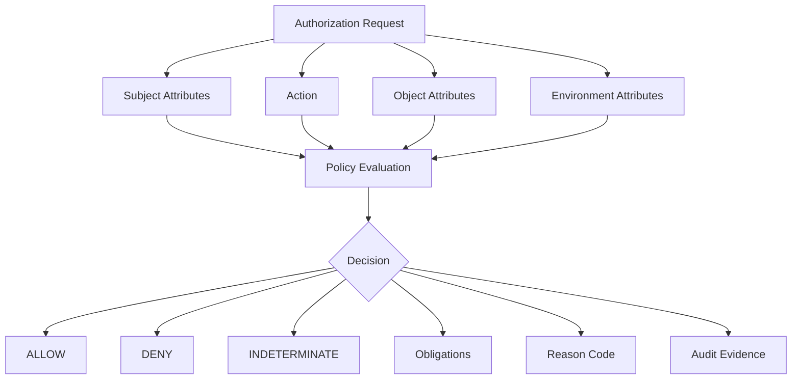
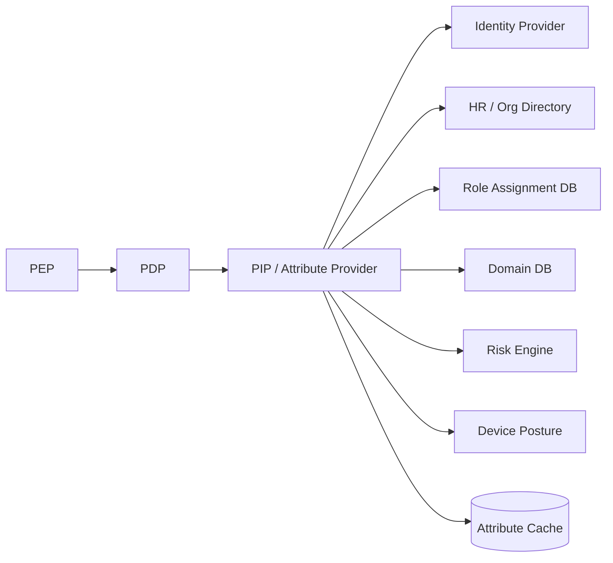
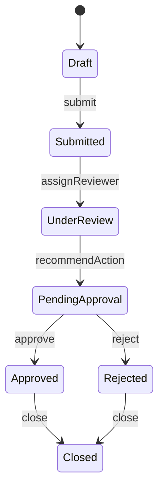

# Part 014 — ABAC Mental Model: Subject, Object, Action, Environment

RBAC menjawab:

```text
Apa yang boleh dilakukan seseorang karena role yang dia pegang?
```

ABAC menjawab:

```text
Apakah subject dengan atribut tertentu boleh melakukan action tertentu terhadap object dengan atribut tertentu, dalam kondisi environment tertentu, berdasarkan policy tertentu?
```

NIST SP 800-162 mendeskripsikan ABAC sebagai logical access control methodology yang mengevaluasi attributes terkait subject, object, requested operations, dan environment conditions terhadap policy/rules/relationships untuk menentukan operasi yang diizinkan.

Dalam sistem Java enterprise, ABAC menjadi penting ketika keputusan authorization bergantung pada konteks:

```text
same region
same department
resource classification
case status
risk level
time window
device posture
network zone
tenant membership
assignment relationship
creator vs approver conflict
customer segment
license tier
jurisdiction
emergency state
```

ABAC bukan “pakai expression string”. ABAC adalah cara memodelkan authorization sebagai evaluasi fakta.

---

## 1. Core Formula

Mental model paling sederhana:

```text
Decision = Policy(Subject Attributes, Object Attributes, Action, Environment Attributes)
```

Atau dalam request form:

```json
{
  "subject": {
    "id": "u-123",
    "type": "user",
    "tenantId": "t-001",
    "department": "enforcement",
    "region": "jakarta",
    "clearance": "restricted",
    "roles": ["CASE_REVIEWER"]
  },
  "action": "case.read",
  "object": {
    "type": "case",
    "id": "c-789",
    "tenantId": "t-001",
    "department": "enforcement",
    "region": "jakarta",
    "classification": "restricted",
    "status": "under_review",
    "assignedUserId": "u-123"
  },
  "environment": {
    "time": "2026-07-03T10:00:00+07:00",
    "channel": "api",
    "networkZone": "corporate",
    "riskScore": 12
  }
}
```

Policy:

```text
allow case.read if:
- subject.tenantId == object.tenantId
- subject.department == object.department
- subject.region == object.region
- subject.clearance >= object.classification
- subject is assigned to object OR subject has supervisor permission
- environment.riskScore < threshold
```



---

## 2. ABAC Is Not the Opposite of RBAC

A common mistake:

```text
RBAC vs ABAC
```

A better framing:

```text
RBAC is often one input into ABAC.
```

Roles can be subject attributes.

```json
{
  "subject": {
    "roles": ["CASE_APPROVER", "REGIONAL_SUPERVISOR"]
  }
}
```

Then ABAC policy uses those roles together with object and environment facts:

```text
allow case.approve if:
- "CASE_APPROVER" in subject.roles
- subject.tenantId == object.tenantId
- subject.region == object.region
- object.status == "PENDING_APPROVAL"
- subject.id != object.createdBy
```

This hybrid model avoids role explosion:

```text
CASE_APPROVER_JAKARTA_RETAIL_HIGH_RISK
```

becomes:

```text
role: CASE_APPROVER
subject.region: JAKARTA
subject.department: RETAIL
object.riskLevel: HIGH
```

---

## 3. The Four Attribute Domains

### 3.1 Subject Attributes

Subject attributes describe the caller.

Examples:

| Attribute | Meaning | Source |
|---|---|---|
| `subject.id` | user/service id | identity provider / service registry |
| `subject.type` | user, service, job, support agent | authentication layer |
| `subject.tenantIds` | tenant memberships | tenant directory |
| `subject.roles` | assigned roles | RBAC system |
| `subject.department` | organizational department | HR/user directory |
| `subject.region` | region/jurisdiction | HR/org service |
| `subject.clearance` | data access clearance | governance system |
| `subject.employmentStatus` | active/suspended/terminated | HR/identity lifecycle |
| `subject.riskScore` | current risk score | risk engine |
| `subject.breakGlassActive` | emergency access mode | privileged access management |

Java representation:

```java
public record SubjectAttributes(
    SubjectId id,
    SubjectType type,
    Set<TenantId> tenantIds,
    Set<String> roles,
    Optional<String> department,
    Optional<String> region,
    Clearance clearance,
    AccountStatus accountStatus,
    Optional<RiskScore> riskScore,
    Optional<BreakGlassContext> breakGlass
) {}
```

### 3.2 Object Attributes

Object attributes describe the protected resource.

Examples:

| Attribute | Meaning | Source |
|---|---|---|
| `object.type` | case, evidence, report, user | application model |
| `object.id` | resource id | request/resource lookup |
| `object.tenantId` | tenant boundary | resource table |
| `object.ownerId` | owner | resource table |
| `object.assignedUserId` | assigned actor | workflow/case table |
| `object.region` | jurisdiction | resource table |
| `object.department` | owning department | domain model |
| `object.status` | lifecycle state | aggregate state |
| `object.classification` | public/internal/restricted/secret | data classification |
| `object.createdBy` | creator | audit/domain field |
| `object.riskLevel` | risk classification | risk engine/domain field |

Java representation:

```java
public record ObjectAttributes(
    String type,
    UUID id,
    TenantId tenantId,
    Optional<UserId> ownerId,
    Optional<UserId> assignedUserId,
    Optional<String> region,
    Optional<String> department,
    Optional<String> status,
    Classification classification,
    Optional<UserId> createdBy,
    Optional<RiskLevel> riskLevel
) {}
```

### 3.3 Action Attributes

Action is not just a string. A production system should describe action metadata.

| Action | Category | Risk | Object check required? | Audit? |
|---|---|---|---|---|
| `case.read` | read | medium | yes | optional/yes depending sensitivity |
| `case.update` | write | high | yes | yes |
| `case.approve` | workflow | critical | yes | yes |
| `case.export` | bulk read | critical | yes | yes |
| `evidence.download` | data access | critical | yes | yes |
| `user.role.assign` | admin | critical | yes | yes |

Java:

```java
public record ActionDescriptor(
    String key,
    ActionCategory category,
    Risk risk,
    boolean requiresObjectCheck,
    boolean requiresAudit,
    boolean supportsBatch,
    Set<String> requiredAttributes
) {}
```

Action attributes matter because policy may vary by risk:

```java
boolean requiresFreshAttributes(ActionDescriptor action) {
    return action.risk() == Risk.HIGH || action.risk() == Risk.CRITICAL;
}
```

### 3.4 Environment Attributes

Environment attributes describe request conditions.

Examples:

| Attribute | Meaning |
|---|---|
| `environment.time` | current request time |
| `environment.channel` | api, ui, worker, batch, support-console |
| `environment.ipRange` | network location |
| `environment.networkZone` | public, corporate, vpn, internal |
| `environment.devicePosture` | managed/unmanaged, compliant/non-compliant |
| `environment.mfaAge` | time since MFA |
| `environment.riskScore` | session/request risk |
| `environment.deploymentRing` | canary/stable/internal |
| `environment.purpose` | operational, audit, investigation, support |
| `environment.correlationId` | audit/debug linking |

Java:

```java
public record EnvironmentAttributes(
    Instant now,
    String channel,
    Optional<String> networkZone,
    Optional<String> devicePosture,
    Optional<Duration> mfaAge,
    Optional<Integer> riskScore,
    Optional<String> purpose,
    String correlationId
) {}
```

---

## 4. ABAC Policy Examples

### Example 1 — Same Tenant Rule

```text
allow if subject.tenantIds contains object.tenantId
```

Java:

```java
boolean sameTenant(SubjectAttributes subject, ObjectAttributes object) {
    return subject.tenantIds().contains(object.tenantId());
}
```

This should be near-universal in tenant-scoped systems.

### Example 2 — Regional Case Review

```text
allow case.review if:
- subject has CASE_REVIEWER role
- subject.region == object.region
- object.status in [OPEN, UNDER_REVIEW]
```

Java:

```java
boolean mayReviewCase(SubjectAttributes s, ObjectAttributes o) {
    return s.roles().contains("CASE_REVIEWER")
        && s.region().isPresent()
        && o.region().isPresent()
        && s.region().get().equals(o.region().get())
        && Set.of("OPEN", "UNDER_REVIEW").contains(o.status().orElse(""));
}
```

### Example 3 — Clearance Rule

```text
allow evidence.read if subject.clearance >= object.classification
```

Java:

```java
public enum Classification {
    PUBLIC(0), INTERNAL(1), RESTRICTED(2), SECRET(3);

    private final int level;

    Classification(int level) {
        this.level = level;
    }

    public boolean atMost(Classification other) {
        return this.level <= other.level;
    }
}

boolean clearanceAllows(SubjectAttributes subject, ObjectAttributes object) {
    return object.classification().atMost(subject.clearance().classification());
}
```

### Example 4 — Maker-Checker / SoD Rule

```text
allow case.approve if subject.id != object.createdBy
```

Java:

```java
boolean notCreator(SubjectAttributes subject, ObjectAttributes object) {
    return object.createdBy()
        .map(createdBy -> !createdBy.equals(subject.id().asUserId()))
        .orElse(false);
}
```

### Example 5 — Environment Rule

```text
allow evidence.download if:
- subject is authorized for evidence
- networkZone == corporate OR mfaAge < 10 minutes
- request risk score < 50
```

Java:

```java
boolean safeDownloadEnvironment(EnvironmentAttributes env) {
    boolean corporate = env.networkZone().map("corporate"::equals).orElse(false);
    boolean recentMfa = env.mfaAge().map(age -> age.compareTo(Duration.ofMinutes(10)) < 0).orElse(false);
    boolean lowRisk = env.riskScore().map(score -> score < 50).orElse(false);

    return (corporate || recentMfa) && lowRisk;
}
```

---

## 5. ABAC Decision Semantics

A simple boolean is not enough.

Bad:

```java
boolean allowed = abac.evaluate(request);
```

Better:

```java
public enum Decision {
    ALLOW,
    DENY,
    INDETERMINATE
}

public record AuthorizationDecision(
    Decision decision,
    ReasonCode reasonCode,
    String policyId,
    String policyVersion,
    List<Obligation> obligations,
    List<String> evaluatedRules,
    List<String> missingAttributes,
    CacheDirective cacheDirective
) {
    public void requireAllowed() {
        if (decision != Decision.ALLOW) {
            throw new AccessDeniedException(reasonCode.name());
        }
    }
}
```

Why `INDETERMINATE`?

Because sometimes the system cannot decide safely:

```text
subject attributes unavailable
object not found
PIP timeout
policy parse error
classification missing
risk engine unavailable
clock unavailable
```

For high-risk operations, indeterminate should usually deny or fail closed.

```java
AuthorizationDecision normalize(AuthorizationDecision decision, Risk risk) {
    if (decision.decision() != Decision.INDETERMINATE) {
        return decision;
    }

    if (risk == Risk.HIGH || risk == Risk.CRITICAL) {
        return AuthorizationDecision.deny(ReasonCode.ATTRIBUTE_UNAVAILABLE);
    }

    return AuthorizationDecision.deny(ReasonCode.POLICY_INDETERMINATE);
}
```

---

## 6. Null Semantics: The Most Underrated ABAC Problem

ABAC fails quietly when attribute absence is not modeled.

Consider:

```java
subject.region().equals(object.region())
```

What if `subject.region` is missing?

Possible semantics:

| Missing value behavior | Meaning | Risk |
|---|---|---|
| Treat as wildcard | missing means all | dangerous |
| Treat as deny | missing means not authorized | safer |
| Treat as indeterminate | cannot decide | best for debugging |
| Use default | missing means configured default | only if explicit |

Production-grade ABAC should distinguish:

```text
attribute absent
attribute unavailable because service failed
attribute intentionally null
attribute unknown to policy schema
attribute stale
attribute redacted from evaluator
```

Java model:

```java
public sealed interface AttributeValue<T>
    permits AttributeValue.Present, AttributeValue.Absent, AttributeValue.Unavailable, AttributeValue.Redacted {

    record Present<T>(T value) implements AttributeValue<T> {}
    record Absent<T>(String reason) implements AttributeValue<T> {}
    record Unavailable<T>(String source, Throwable cause) implements AttributeValue<T> {}
    record Redacted<T>(String reason) implements AttributeValue<T> {}
}
```

Policy helper:

```java
public static <T> RuleResult equalsAttr(
    AttributeValue<T> left,
    AttributeValue<T> right,
    ReasonCode denyReason
) {
    if (left instanceof AttributeValue.Unavailable<T> || right instanceof AttributeValue.Unavailable<T>) {
        return RuleResult.indeterminate(ReasonCode.ATTRIBUTE_UNAVAILABLE);
    }

    if (left instanceof AttributeValue.Absent<T> || right instanceof AttributeValue.Absent<T>) {
        return RuleResult.deny(denyReason);
    }

    T l = ((AttributeValue.Present<T>) left).value();
    T r = ((AttributeValue.Present<T>) right).value();

    return Objects.equals(l, r)
        ? RuleResult.allow()
        : RuleResult.deny(denyReason);
}
```

Rule:

> Missing attribute must never silently become broad access.

---

## 7. Attribute Sources and PIP Design

In ABAC architecture, the Policy Information Point supplies attributes.



In Java, do not let every policy rule call random repositories. Centralize attribute retrieval.

```java
public interface AttributeProvider {
    AttributeBundle load(AuthorizationRequest request, AttributeLoadPlan plan);
}
```

Attribute load plan:

```java
public record AttributeLoadPlan(
    Set<String> subjectAttributes,
    Set<String> objectAttributes,
    Set<String> environmentAttributes,
    FreshnessRequirement freshnessRequirement
) {}
```

Why load plan matters:

```text
minimize DB calls
avoid fetching sensitive attributes unnecessarily
support batch authorization
declare missing attributes early
make policy dependencies visible
enable caching per attribute class
```

---

## 8. Freshness and Staleness

ABAC attributes have lifetimes.

| Attribute | Typical volatility | Caching strategy |
|---|---|---|
| subject id | stable | token/session |
| tenant membership | medium | cache with invalidation |
| role assignments | medium/high | short TTL + invalidation |
| employment status | high risk | source of truth for critical ops |
| object owner | medium | object DB read |
| object status | high | load current aggregate state |
| risk score | high | short TTL/live call |
| device posture | high | short TTL |
| time | always current | clock |

ABAC failure often occurs when a stale attribute is used for a critical decision.

Example:

```text
user transferred from Jakarta to Surabaya
cached subject.region remains Jakarta for 15 minutes
user approves Jakarta case after transfer
```

Decision should include attribute versions:

```java
public record AttributeMetadata(
    String source,
    Instant loadedAt,
    Optional<String> version,
    Duration ttl,
    Freshness freshness
) {}
```

And decision cache should reflect dependency:

```java
public record DecisionDependency(
    String attributeName,
    String source,
    Optional<String> version
) {}
```

Production invariant:

> A cached ABAC decision is valid only while all policy-relevant attributes remain valid.

---

## 9. ABAC Policy Composition

ABAC policies combine rules. The composition semantics must be explicit.

Common composition modes:

| Mode | Meaning | Example |
|---|---|---|
| permit-overrides | any allow wins unless explicit forbid | low-risk feature access |
| deny-overrides | any deny wins | security-sensitive controls |
| first-applicable | first matching rule wins | ordered firewall-like policies |
| consensus/all-must-allow | all required policies allow | critical actions |
| threshold | N of M policies allow | risk scoring |

For enterprise authorization, prefer deny-overrides for safety-critical constraints:

```text
allow if broad entitlement exists
AND tenant rule allows
AND object relationship rule allows
AND state rule allows
AND SoD rule allows
AND no explicit deny rule matches
```

Java composition:

```java
public final class PolicyComposer {

    public AuthorizationDecision allMustAllow(List<PolicyResult> results) {
        Optional<PolicyResult> indeterminate = results.stream()
            .filter(r -> r.decision() == Decision.INDETERMINATE)
            .findFirst();

        if (indeterminate.isPresent()) {
            return AuthorizationDecision.indeterminate(indeterminate.get().reasonCode());
        }

        Optional<PolicyResult> denied = results.stream()
            .filter(r -> r.decision() == Decision.DENY)
            .findFirst();

        if (denied.isPresent()) {
            return AuthorizationDecision.deny(denied.get().reasonCode());
        }

        return AuthorizationDecision.allow(ReasonCode.ALLOW);
    }
}
```

---

## 10. Obligations and Advice

ABAC decision may require additional behavior.

### Obligation

An obligation is mandatory for enforcement.

Examples:

```text
mask sensitive fields
write audit log
require justification
notify security team
attach watermark to export
limit result size
require secondary approval
```

Java:

```java
public sealed interface Obligation {
    record Audit(String level) implements Obligation {}
    record MaskFields(Set<String> fields) implements Obligation {}
    record RequireJustification() implements Obligation {}
    record LimitResultSize(int maxRows) implements Obligation {}
    record WatermarkExport(String subjectId) implements Obligation {}
}
```

PEP must enforce obligations:

```java
AuthorizationDecision decision = authorizationService.check(request);
decision.requireAllowed();

for (Obligation obligation : decision.obligations()) {
    obligationEnforcer.enforce(obligation, responseContext);
}
```

### Advice

Advice is optional or informational.

Examples:

```text
suggest MFA
warn about unusual access
show reason to admin UI
recommend temporary access request
```

Do not mix obligation and advice.

---

## 11. ABAC for Create Operations

Object does not exist yet.

Bad model:

```java
authz.check(subject, "case.create", caseId);
```

There is no `caseId`.

Create authorization uses intended object attributes.

```java
public record CreateCaseAttributes(
    TenantId tenantId,
    String region,
    String department,
    Classification classification,
    RiskLevel initialRiskLevel
) {}
```

Request:

```java
AuthorizationRequest request = AuthorizationRequest.builder()
    .subject(subject)
    .action("case.create")
    .object(ObjectAttributes.forCreate("case", Map.of(
        "tenantId", command.tenantId(),
        "region", command.region(),
        "department", command.department(),
        "classification", command.classification()
    )))
    .environment(environment)
    .build();
```

Policy:

```text
allow case.create if:
- subject belongs to tenant
- subject has case.create permission
- subject.region == intendedObject.region
- intendedObject.classification <= subject.clearance
```

Production invariant:

> Create authorization must evaluate the intended resource attributes before persistence.

---

## 12. ABAC for Update and Patch Operations

Updates are tricky because authorization may depend on:

```text
current object state
requested changes
resulting object state
field-level write permission
state transition validity
```

Patch example:

```json
{
  "assignedUserId": "u-456",
  "riskLevel": "HIGH",
  "status": "PENDING_APPROVAL"
}
```

A user may be allowed to update description but not risk level or assignee.

Represent update intent:

```java
public record UpdateIntent(
    ObjectAttributes before,
    Map<String, Object> patch,
    ObjectAttributes after
) {}
```

Authorization request:

```java
AuthorizationRequest request = AuthorizationRequest.builder()
    .subject(subject)
    .action("case.update")
    .object(before)
    .context(Context.of(
        "patchFields", patch.keySet(),
        "beforeStatus", before.status(),
        "afterStatus", after.status(),
        "riskChanged", !before.riskLevel().equals(after.riskLevel()),
        "assignmentChanged", !before.assignedUserId().equals(after.assignedUserId())
    ))
    .build();
```

Policy:

```text
allow case.update if:
- subject can read object
- subject can write all requested fields
- state transition is allowed
- risk change requires case.risk.update
- assignment change requires case.assign
```

Production invariant:

> Patch authorization must be field-aware and transition-aware.

---

## 13. ABAC for Read, Search, and Export

Single-object read:

```text
load object -> check subject/action/object/environment -> return or deny
```

Search/read-list:

```text
compute allowed query scope -> apply predicates in database -> paginate -> return
```

Export:

```text
compute query scope -> enforce export permission -> apply max rows/watermark/audit obligations -> async job snapshot
```

Do not fetch all and filter in memory.

ABAC query scope:

```java
public record QueryScope(
    TenantPredicate tenantPredicate,
    List<SqlPredicate> predicates,
    List<FieldMask> fieldMasks,
    List<Obligation> obligations
) {}
```

Example:

```java
QueryScope scope = authorizationService.queryScope(
    subject,
    "case.read",
    "case",
    environment
);

return caseRepository.search(criteria, scope, pageable);
```

Generated predicates:

```sql
where tenant_id = :tenantId
  and region = :subjectRegion
  and classification <= :subjectClearance
  and status <> 'SEALED'
```

---

## 14. ABAC and Domain State Machines

Authorization often depends on lifecycle state.

Example case lifecycle:



Permission alone is insufficient:

```text
case.approve only valid when object.status == PENDING_APPROVAL
```

Domain transition guard:

```java
public void approve(Subject subject, UUID caseId, String reason) {
    CaseRecord record = repository.findForUpdate(caseId)
        .orElseThrow(NotFoundException::new);

    if (record.status() != CaseStatus.PENDING_APPROVAL) {
        throw new DomainStateException("Case is not pending approval");
    }

    authorizationService.requireAllowed(
        subject,
        PermissionKey.CASE_APPROVE,
        record.toResourceRef(),
        record.toAuthzContext()
    );

    record.approve(subject.userId(), reason);
}
```

The system should have both:

```text
domain state invariant: transition is valid
authorization invariant: subject may perform transition
```

Do not use authorization to hide invalid domain transitions. Keep both explicit.

---

## 15. ABAC Policy Engine Styles

### 15.1 Hand-Coded Java Policies

Good for:

```text
small policy set
strong type safety
domain-rich logic
low latency
simple deployment
```

Bad for:

```text
frequent policy changes by non-developers
central governance across many services
policy diff/review independent of app release
```

Example:

```java
public final class CaseReadPolicy implements AuthorizationPolicy {

    @Override
    public PolicyResult evaluate(AuthorizationContext ctx) {
        SubjectAttributes s = ctx.subject();
        ObjectAttributes o = ctx.object();

        if (!s.tenantIds().contains(o.tenantId())) {
            return PolicyResult.deny(ReasonCode.OUTSIDE_TENANT_SCOPE);
        }

        if (!s.roles().contains("CASE_REVIEWER")) {
            return PolicyResult.deny(ReasonCode.MISSING_PERMISSION);
        }

        if (!Objects.equals(s.region().orElse(null), o.region().orElse(null))) {
            return PolicyResult.deny(ReasonCode.OUTSIDE_RESOURCE_SCOPE);
        }

        return PolicyResult.allow();
    }
}
```

### 15.2 Expression-Based Policies

Good for configurable rules:

```text
subject.region == object.region && action == 'case.read'
```

Risk:

```text
stringly typed attributes
injection risk if expression language misused
poor refactoring
unclear null semantics
hard debugging
```

Use only with schema validation.

### 15.3 External Policy Engines

Examples:

```text
OPA/Rego
Cedar/Amazon Verified Permissions
XACML engines
custom PDP service
```

Good for:

```text
central governance
multi-service consistency
policy-as-code
versioning and rollout
policy testing
```

Costs:

```text
network latency
availability dependency
input contract design
schema drift
operational complexity
policy language learning curve
```

The core mental model stays the same: subject, action, object, environment.

---

## 16. ABAC Contract in Java

A clean ABAC request type:

```java
public record AuthorizationRequest(
    SubjectRef subject,
    String action,
    ResourceRef resource,
    EnvironmentAttributes environment,
    Map<String, Object> context,
    EvaluationOptions options
) {}
```

Resource ref:

```java
public record ResourceRef(
    String type,
    UUID id,
    TenantId tenantId,
    Map<String, AttributeValue<?>> attributes
) {}
```

Evaluation options:

```java
public record EvaluationOptions(
    boolean explain,
    boolean collectObligations,
    FreshnessRequirement freshness,
    DecisionMode decisionMode
) {}
```

Authorization service:

```java
public interface AuthorizationService {
    AuthorizationDecision check(AuthorizationRequest request);

    default void requireAllowed(AuthorizationRequest request) {
        check(request).requireAllowed();
    }

    QueryScope queryScope(
        SubjectRef subject,
        String action,
        String resourceType,
        EnvironmentAttributes environment
    );
}
```

---

## 17. ABAC Performance Model

ABAC can be expensive because each decision may require many attributes.

Cost sources:

```text
subject lookup
role assignment lookup
object lookup
relationship lookup
risk engine call
device posture call
policy engine network call
decision logging
obligation processing
```

Optimization rules:

### Rule 1: Load Object Once

Do not load resource for authorization and then reload for business logic.

```java
CaseRecord record = repository.findForUpdate(caseId).orElseThrow();

authorizationService.requireAllowed(subject, action, record.toResourceRef(), record.toAuthzContext());

record.approve(subject.userId(), reason);
```

### Rule 2: Batch Decisions

For UI action menus:

```java
List<AuthorizationRequest> requests = actions.stream()
    .map(action -> request(subject, action, resource))
    .toList();

Map<String, AuthorizationDecision> decisions = authorizationService.batchCheck(requests);
```

### Rule 3: Push Query Scopes to DB

Do not evaluate 10,000 objects in Java if SQL can restrict safely.

### Rule 4: Cache Attributes, Not Just Decisions

Decision caching is hard because many attributes influence the result. Attribute caching can be safer if each attribute has version/TTL/invalidation.

### Rule 5: Classify Risk

Low-risk UI hints can tolerate short-lived cache. Critical mutations may require fresh reads.

---

## 18. ABAC Testing Strategy

ABAC has combinatorial complexity. Test by policy dimension, not by random examples.

### Permission Matrix Tests

```yaml
- name: reviewer can read same region assigned case
  subject:
    roles: [CASE_REVIEWER]
    region: JAKARTA
    tenantIds: [T1]
  object:
    tenantId: T1
    region: JAKARTA
    assignedUserId: U1
    classification: RESTRICTED
  action: case.read
  expected: ALLOW
```

### Negative Tests

```text
same role but different tenant -> deny
same role but different region -> deny
same role but missing clearance -> deny
same role but wrong status -> deny
same role but creator approving own case -> deny
missing attribute -> deny or indeterminate, never allow
```

### Property-Based Tests

Invariant:

```text
For any subject and object, if subject.tenantIds does not contain object.tenantId, decision must not be ALLOW.
```

Java pseudo-test:

```java
@Property
void crossTenantAccessIsNeverAllowed(@ForAll SubjectAttributes subject,
                                     @ForAll ObjectAttributes object) {
    assumeFalse(subject.tenantIds().contains(object.tenantId()));

    AuthorizationDecision decision = authorizationService.check(
        request(subject, "case.read", object)
    );

    assertThat(decision.decision()).isNotEqualTo(Decision.ALLOW);
}
```

### Missing Attribute Tests

```java
@Test
void missingRegionDoesNotBecomeWildcard() {
    SubjectAttributes subject = subjectBuilder()
        .region(Optional.empty())
        .roles(Set.of("CASE_REVIEWER"))
        .build();

    ObjectAttributes object = objectBuilder()
        .region(Optional.of("JAKARTA"))
        .build();

    AuthorizationDecision decision = authorizationService.check(
        request(subject, "case.read", object)
    );

    assertThat(decision.decision()).isNotEqualTo(Decision.ALLOW);
}
```

---

## 19. ABAC Anti-Patterns

### 19.1 Attribute Soup

Too many attributes, no schema, no owner, no lifecycle.

Fix:

```text
attribute catalog
attribute source ownership
attribute type
freshness rule
allowed values
privacy classification
```

### 19.2 Policy Hidden in Expressions

```text
subject.dept == object.dept && subject.region == object.region && ...
```

spread across database rows with no tests.

Fix:

```text
versioned policy package
schema validation
unit tests
decision logs
policy review
```

### 19.3 Missing Attribute Means Allow

Dangerous default.

Fix:

```text
missing critical attribute -> deny or indeterminate
```

### 19.4 ABAC Replaces Domain Logic

Do not use ABAC to decide whether a transition is valid in domain state machine.

Fix:

```text
domain validates state transition
authorization validates actor authority
```

### 19.5 No Explainability

If no one can explain why access was allowed, audit and debugging fail.

Fix:

```text
reason code
evaluated rules
policy version
attribute metadata
correlation id
```

---

## 20. When ABAC Is the Right Tool

Use ABAC when authorization depends on attributes such as:

```text
tenant
region
jurisdiction
department
data classification
risk level
workflow status
assignment
ownership
time
network
device posture
purpose
MFA freshness
```

ABAC is especially useful when role names start exploding:

```text
REGION_PRODUCT_STATUS_SENSITIVITY_ROLE
```

Replace role-name dimensions with attributes.

---

## 21. When ABAC Is Not Enough

ABAC can become awkward for graph-like sharing:

```text
user can view document because they are member of group that has access to folder that contains document
```

That is often better modeled by ReBAC/Zanzibar/OpenFGA-style relationship tuples.

ABAC can express some relationships as attributes, but deep graph expansion is not its strongest form.

Use:

| Problem | Better primary model |
|---|---|
| stable job responsibility | RBAC |
| context-dependent constraints | ABAC |
| sharing/collaboration graph | ReBAC |
| externalized governance | PBAC / policy-as-code |
| object-specific allow list | ACL/capability/ReBAC |
| query filtering | ABAC query scope + database predicates |

---

## 22. Mini Case Study: Regulatory Case Access

### Requirement

A regulatory case platform has these rules:

```text
1. User must belong to the same tenant.
2. User must have case.read capability.
3. User can read cases in their region.
4. HQ supervisor can read all regions inside same tenant.
5. Restricted cases require restricted clearance.
6. Sealed cases require explicit sealed-case permission.
7. Evidence fields must be masked unless evidence.read is allowed.
8. High-risk export requires MFA within 10 minutes.
```

### ABAC Design

Subject attributes:

```text
subject.tenantIds
subject.roles
subject.region
subject.clearance
subject.permissions
subject.mfaAge
```

Object attributes:

```text
object.tenantId
object.region
object.classification
object.status
object.riskLevel
object.hasEvidence
```

Environment attributes:

```text
environment.channel
environment.networkZone
environment.now
environment.requestPurpose
```

Policy sketch:

```text
allow case.read if:
- subject.tenantIds contains object.tenantId
- subject.permissions contains case.read
- (
    subject.region == object.region
    OR subject.permissions contains case.read.allRegions
  )
- subject.clearance >= object.classification
- object.status != SEALED OR subject.permissions contains case.read.sealed
```

Obligations:

```text
if subject.permissions does not contain evidence.read:
  mask fields: evidenceSummary, attachments, witnessNames

if object.classification == RESTRICTED:
  audit access
```

Java decision:

```java
AuthorizationDecision decision = AuthorizationDecision.allow(
    ReasonCode.ALLOW,
    List.of(
        Obligation.MaskFields.of("evidenceSummary", "attachments", "witnessNames"),
        Obligation.Audit.highSensitivity()
    ),
    "case-read-policy",
    "2026.07.03-1"
);
```

---

## 23. ABAC Implementation Checklist

Before implementing ABAC, answer these questions:

```text
[ ] What are the protected actions?
[ ] What object types exist?
[ ] Which attributes are policy-relevant?
[ ] Who owns each attribute source?
[ ] What is the type of each attribute?
[ ] What does missing mean?
[ ] What freshness is required per action risk?
[ ] Which policies are deny-overrides?
[ ] Which decisions require obligations?
[ ] How are decisions logged?
[ ] How are policies tested?
[ ] How are query scopes generated?
[ ] How are bulk/export operations constrained?
[ ] How are stale caches invalidated?
```

---

## 24. Summary

ABAC gives you a vocabulary for context-aware authorization.

The core model is simple:

```text
Subject + Action + Object + Environment -> Policy -> Decision
```

The hard parts are operational:

```text
attribute source ownership
attribute freshness
null semantics
policy composition
obligations
query scoping
performance
explainability
testing
```

ABAC should not become a bag of arbitrary expressions. Treat it as a typed decision system with explicit attributes, explicit policy semantics, explicit failure behavior, and explicit audit evidence.

In the next part, we will implement ABAC in Java without creating a policy mess.

---

## References

- NIST SP 800-162 — Guide to Attribute Based Access Control. Defines ABAC around subject, object, operation, and environment attributes.
- OWASP Cheat Sheet Series — Authorization Cheat Sheet. Recommends deny-by-default, least privilege, server-side checks, centralized authorization routines, and authorization tests.
- OWASP API Security Top 10 2023 — Broken Object Level Authorization. Highlights the risk of object-level authorization failures in APIs.
- Spring Security Reference — Authorization Architecture and `AuthorizationManager`.
