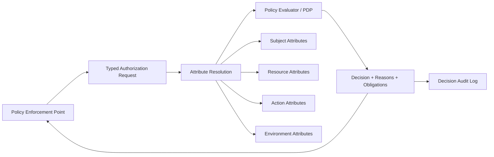
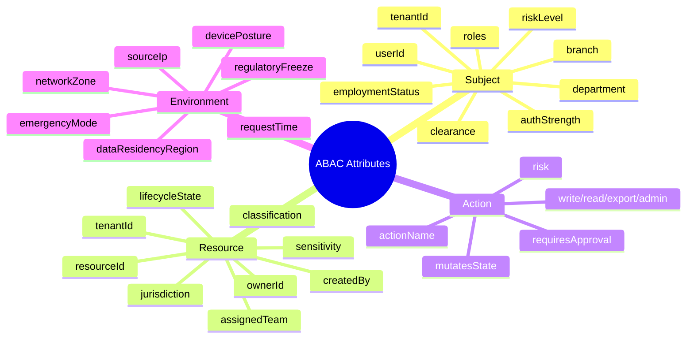
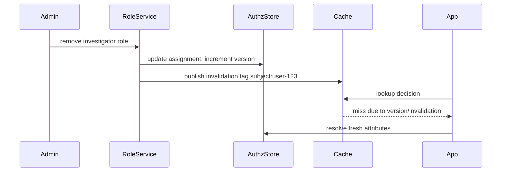
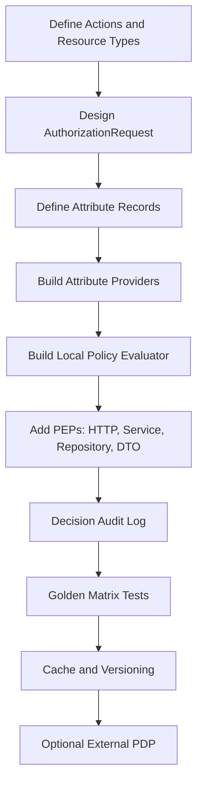

# Part 015 — Implementing ABAC in Java Without Creating a Policy Mess

ABAC is powerful because it lets authorization depend on facts:

- who the caller is,
- what resource is being accessed,
- what action is being attempted,
- what environment or transaction context applies.

ABAC is dangerous because every new fact can become a new implicit branch in the security model.

The main engineering problem is not “how do I write `if department == ownerDepartment`?” The real problem is this:

> How do we let authorization depend on rich domain context without scattering unreviewable business-security logic across controllers, services, repositories, serializers, workers, and SQL queries?

This part is about implementing ABAC in Java in a way that remains typed, explainable, testable, auditable, and resilient.

References used for this part:

- NIST SP 800-162, *Guide to Attribute Based Access Control (ABAC) Definition and Considerations*.
- OWASP Authorization Cheat Sheet.
- OWASP API Security 2023, especially broken object-level authorization.
- Spring Security authorization architecture and method security documentation.
- OPA policy decision API concepts.
- XACML terminology around PDP, PEP, PIP, PAP, obligations, and advice.

---

## 1. The Shape of a Good ABAC Implementation

A production-grade ABAC implementation has five explicit things:



| Component | Job | Common Java Implementation |
|---|---|---|
| PEP | Enforce decision before allowing operation | Spring `AuthorizationManager`, JAX-RS filter, service guard, repository scope |
| Authorization request | Describes subject/action/resource/context | Java `record`, immutable DTO, JSON contract |
| Attribute providers | Load and normalize attributes | Repository, cache, directory, risk service, case service |
| PDP / evaluator | Evaluates policy against attributes | Local Java evaluator, OPA, Cedar, XACML engine, custom DSL |
| Decision output | Allow/deny plus reasons and obligations | `AuthorizationDecision`, `ReasonCode`, `Obligation` |
| Audit sink | Stores evidence for later review | append-only table, event stream, SIEM |

ABAC becomes a mess when these concerns are mixed.

Bad version:

```java
if (user.getDepartment().equals(caseRecord.getDepartment())
        && caseRecord.getStatus() != CLOSED
        && !caseRecord.isRestricted()
        && LocalTime.now().isBefore(LocalTime.of(18, 0))) {
    return caseRecord;
}
```

Better version:

```java
AuthorizationDecision decision = authorizationService.decide(
    AuthorizationRequest.builder()
        .subject(SubjectRef.user(currentUser.id()))
        .action(Action.CASE_VIEW)
        .resource(ResourceRef.caseRecord(caseId))
        .context(RequestContext.from(httpRequest))
        .build()
);

decision.enforce();
```

Best version: the code above is only one of several PEPs. Search queries, exports, workers, field masking, state transitions, and admin tools all use the same decision vocabulary.

---

## 2. What ABAC Should and Should Not Own

ABAC should decide access. It should not become your domain model.

A clean boundary:

| Concern | Belongs In | Example |
|---|---|---|
| Business invariant | Domain/application layer | “A closed case cannot be modified.” |
| Authorization condition | Policy layer | “Only assigned investigator may modify an open case.” |
| Data derivation | Domain/read model | `case.classification = RESTRICTED` |
| Attribute loading | PIP/attribute provider | Load investigator assignment, tenant, branch, clearance |
| Enforcement | PEP | Block request, add query predicate, mask field |
| Audit evidence | Authorization/audit layer | Decision reason, policy version, attributes used |

A common mistake is to put everything that sounds conditional into ABAC.

For example:

```text
Policy: allow CASE_CLOSE if case.status == INVESTIGATION_COMPLETE
```

This is usually wrong. Whether a case can transition from `INVESTIGATION_COMPLETE` to `CLOSED` is a domain state-machine rule. Authorization should decide whether this subject may execute the close operation on that case.

A better split:

```text
Domain rule:
  CASE_CLOSE is valid only when case.status == INVESTIGATION_COMPLETE.

Authorization rule:
  CASE_CLOSE is allowed only when the subject has CASE_CLOSE permission,
  belongs to the case jurisdiction,
  is not the maker of the recommendation,
  and has required approval authority.
```

Keep state validity and access permission separate. They often interact, but they are not the same rule.

---

## 3. ABAC Decision Vocabulary

Start with a stable vocabulary.

```java
public enum Action {
    CASE_VIEW,
    CASE_CREATE,
    CASE_UPDATE,
    CASE_ASSIGN,
    CASE_ESCALATE,
    CASE_CLOSE,
    CASE_EXPORT,
    CASE_VIEW_RESTRICTED_EVIDENCE,
    CASE_REDACT_FIELD,
    CASE_APPROVE_RECOMMENDATION
}

public enum ResourceType {
    CASE,
    EVIDENCE,
    ORGANIZATION,
    REPORT,
    USER,
    TASK,
    COMMENT,
    ATTACHMENT
}

public record ResourceRef(
    ResourceType type,
    String id,
    String tenantId
) {
    public static ResourceRef caseRecord(String tenantId, String caseId) {
        return new ResourceRef(ResourceType.CASE, caseId, tenantId);
    }
}

public record SubjectRef(
    String subjectId,
    SubjectType type,
    String tenantId
) {}

public enum SubjectType {
    USER,
    SERVICE_ACCOUNT,
    SYSTEM_JOB,
    BREAK_GLASS_USER
}
```

Do not let each service invent its own action names.

Bad:

```text
case:read
read_case
viewCase
cases.view
CASE_VIEW
```

Good:

```text
CASE_VIEW
CASE_UPDATE
CASE_EXPORT
```

The policy vocabulary must survive refactors. If you rename an HTTP endpoint, the action should not change. If you split a service, the action should not change. If you migrate from REST to events, the action should not change.

---

## 4. Typed Authorization Request

ABAC request design should be explicit and narrow. Avoid passing arbitrary maps everywhere.

```java
import java.time.Instant;
import java.util.Map;
import java.util.Optional;

public record AuthorizationRequest(
    SubjectRef subject,
    Action action,
    ResourceRef resource,
    RequestContext context,
    EvaluationOptions options
) {
    public AuthorizationRequest {
        if (subject == null) throw new IllegalArgumentException("subject is required");
        if (action == null) throw new IllegalArgumentException("action is required");
        if (resource == null) throw new IllegalArgumentException("resource is required");
        if (context == null) throw new IllegalArgumentException("context is required");
        if (options == null) options = EvaluationOptions.defaults();
    }
}

public record RequestContext(
    String requestId,
    String correlationId,
    String tenantId,
    Instant requestTime,
    String sourceIp,
    Optional<String> userAgent,
    Optional<String> deviceId,
    Optional<String> authMethod,
    Map<String, String> labels
) {}

public record EvaluationOptions(
    boolean explain,
    boolean audit,
    boolean allowCache,
    boolean shadowMode
) {
    public static EvaluationOptions defaults() {
        return new EvaluationOptions(false, true, true, false);
    }
}
```

A typed request gives you:

1. compile-time safety,
2. easier tests,
3. stable logs,
4. clear migration path to external PDP,
5. safer serialization.

A raw map should be used only at the boundary with engines like OPA, not inside application code.

---

## 5. Attribute Model

ABAC uses four attribute groups:



Represent them with typed records, not unstructured maps.

```java
public record SubjectAttributes(
    String subjectId,
    String tenantId,
    Set<String> roles,
    Set<String> permissions,
    String departmentId,
    String branchId,
    ClearanceLevel clearance,
    EmploymentStatus employmentStatus,
    boolean mfaSatisfied,
    boolean breakGlassActive
) {}

public record CaseResourceAttributes(
    String caseId,
    String tenantId,
    String ownerUserId,
    String assignedTeamId,
    String jurisdictionId,
    Classification classification,
    CaseStatus status,
    String createdBy,
    boolean restricted,
    boolean sealed,
    boolean underLegalHold
) {}

public record ActionAttributes(
    Action action,
    ActionRisk risk,
    boolean readOperation,
    boolean writeOperation,
    boolean exportOperation,
    boolean approvalOperation
) {}

public record EnvironmentAttributes(
    Instant requestTime,
    String networkZone,
    boolean emergencyMode,
    boolean businessHours,
    String dataRegion,
    int requestRiskScore
) {}
```

If the resource type differs, use typed resource attribute variants.

```java
public sealed interface ResourceAttributes permits CaseResourceAttributesView, EvidenceResourceAttributesView {
    String resourceId();
    String tenantId();
    Classification classification();
}

public record CaseResourceAttributesView(
    String resourceId,
    String tenantId,
    Classification classification,
    CaseStatus status,
    String assignedTeamId,
    String jurisdictionId,
    boolean sealed
) implements ResourceAttributes {}

public record EvidenceResourceAttributesView(
    String resourceId,
    String tenantId,
    Classification classification,
    String caseId,
    EvidenceType evidenceType,
    boolean privileged
) implements ResourceAttributes {}
```

The evaluator should not need to know how to query the database. It should receive facts.

---

## 6. Attribute Providers

An attribute provider loads one category of facts.

```java
public interface AttributeProvider<T> {
    T resolve(AuthorizationRequest request);
}
```

Concrete providers:

```java
public final class SubjectAttributeProvider implements AttributeProvider<SubjectAttributes> {
    private final UserDirectoryClient userDirectory;
    private final RoleAssignmentRepository roleAssignments;
    private final PermissionResolver permissionResolver;

    @Override
    public SubjectAttributes resolve(AuthorizationRequest request) {
        SubjectRef subject = request.subject();

        UserProfile profile = userDirectory.getActiveProfile(subject.subjectId());
        Set<String> roles = roleAssignments.findRoles(subject.tenantId(), subject.subjectId());
        Set<String> permissions = permissionResolver.resolve(roles, subject.tenantId());

        return new SubjectAttributes(
            subject.subjectId(),
            subject.tenantId(),
            roles,
            permissions,
            profile.departmentId(),
            profile.branchId(),
            profile.clearance(),
            profile.employmentStatus(),
            profile.mfaSatisfied(),
            profile.breakGlassActive()
        );
    }
}
```

Resource provider:

```java
public final class CaseAttributeProvider implements AttributeProvider<CaseResourceAttributes> {
    private final CaseRepository caseRepository;

    @Override
    public CaseResourceAttributes resolve(AuthorizationRequest request) {
        ResourceRef resource = request.resource();

        CaseRecord row = caseRepository.findAuthorizationView(
            resource.tenantId(),
            resource.id()
        ).orElseThrow(() -> new ResourceNotFoundForAuthorization(resource));

        return new CaseResourceAttributes(
            row.caseId(),
            row.tenantId(),
            row.ownerUserId(),
            row.assignedTeamId(),
            row.jurisdictionId(),
            row.classification(),
            row.status(),
            row.createdBy(),
            row.restricted(),
            row.sealed(),
            row.underLegalHold()
        );
    }
}
```

Environment provider:

```java
public final class EnvironmentAttributeProvider implements AttributeProvider<EnvironmentAttributes> {
    private final BusinessCalendar businessCalendar;
    private final RiskService riskService;

    @Override
    public EnvironmentAttributes resolve(AuthorizationRequest request) {
        Instant now = request.context().requestTime();

        return new EnvironmentAttributes(
            now,
            NetworkClassifier.classify(request.context().sourceIp()),
            isEmergencyMode(request.context().tenantId()),
            businessCalendar.isBusinessHours(request.context().tenantId(), now),
            resolveDataRegion(request.context().tenantId()),
            riskService.score(request)
        );
    }
}
```

### Attribute Provider Rules

Attribute providers must be boring.

They should:

1. load facts,
2. normalize facts,
3. validate freshness,
4. expose provenance,
5. fail closed when mandatory facts are unavailable.

They should not:

1. decide authorization,
2. partially enforce access,
3. hide database filtering rules,
4. depend on controller-specific assumptions,
5. return ambiguous nulls.

---

## 7. Null Semantics

ABAC without null semantics becomes a bypass machine.

Consider:

```java
if (caseRecord.assignedTeamId().equals(subject.departmentId())) {
    allow();
}
```

What if `assignedTeamId` is null? What if `departmentId` is missing? What if the attribute service times out?

Define strict semantics:

| Situation | Safe Default |
|---|---|
| Mandatory subject attribute missing | Deny / indeterminate mapped to deny |
| Mandatory resource attribute missing | Deny or not-found response depending endpoint semantics |
| Optional attribute missing | Policy-specific fallback, explicitly declared |
| Attribute provider timeout | Indeterminate; PEP fails closed |
| Attribute source inconsistent | Deny and emit diagnostic |
| Attribute stale beyond TTL | Deny or force re-resolution |

A useful internal representation:

```java
public sealed interface AttributeValue<T> permits Present, Missing, Stale, Unavailable {}

public record Present<T>(T value) implements AttributeValue<T> {}
public record Missing<T>(String attributeName) implements AttributeValue<T> {}
public record Stale<T>(String attributeName, Instant observedAt) implements AttributeValue<T> {}
public record Unavailable<T>(String attributeName, String source, String reason) implements AttributeValue<T> {}
```

However, do not expose this complexity everywhere. Use it inside attribute resolution and diagnostics. Feed the evaluator a normalized model where mandatory missing values have already produced an indeterminate decision.

---

## 8. Decision Model

A decision is not just boolean.

```java
public enum DecisionEffect {
    ALLOW,
    DENY,
    INDETERMINATE
}

public record AuthorizationDecision(
    DecisionEffect effect,
    String reasonCode,
    String message,
    List<DecisionReason> reasons,
    List<Obligation> obligations,
    List<Advice> advice,
    CacheDirective cache,
    AuditDirective audit,
    String policyVersion
) {
    public boolean allowed() {
        return effect == DecisionEffect.ALLOW;
    }

    public void enforce() {
        if (!allowed()) {
            throw new AccessDeniedException(reasonCode);
        }
    }
}

public record DecisionReason(
    String code,
    String detail,
    boolean safeForClient
) {}

public record Obligation(
    String type,
    Map<String, String> parameters
) {}

public record Advice(
    String type,
    Map<String, String> parameters
) {}

public record CacheDirective(
    boolean cacheable,
    Duration ttl,
    Set<String> invalidationTags
) {}

public record AuditDirective(
    boolean required,
    AuditSeverity severity,
    boolean includeAttributes
) {}
```

### Deny vs Indeterminate

Use `DENY` when policy was evaluated and access is not permitted.

Use `INDETERMINATE` when policy could not be safely evaluated.

Examples:

| Condition | Decision |
|---|---|
| User lacks permission | DENY |
| User clearance below resource classification | DENY |
| Resource attribute service timed out | INDETERMINATE |
| Policy bundle unavailable | INDETERMINATE |
| Required resource attribute missing | INDETERMINATE or DENY depending data contract |
| Conflicting policies | INDETERMINATE unless combining algorithm resolves conflict |

At the PEP, map both to denial unless an explicitly approved exception exists.

```java
if (decision.effect() != DecisionEffect.ALLOW) {
    auditSink.recordDenied(request, decision);
    throw new AccessDeniedException("access_denied");
}
```

Do not leak `CASE_SEALED_BY_LEGAL` to unauthorized clients unless the API contract allows that information to be known.

---

## 9. Local Java ABAC Evaluator

Start simple if policy changes are owned by engineers and release cadence is acceptable.

```java
public interface PolicyRule {
    boolean supports(Action action, ResourceType resourceType);

    RuleEvaluation evaluate(ResolvedAuthorizationContext context);
}

public record ResolvedAuthorizationContext(
    SubjectAttributes subject,
    ResourceAttributes resource,
    ActionAttributes action,
    EnvironmentAttributes environment,
    AuthorizationRequest request
) {}

public record RuleEvaluation(
    DecisionEffect effect,
    String reasonCode,
    List<Obligation> obligations
) {}
```

Example policy rule:

```java
public final class CaseViewPolicy implements PolicyRule {
    @Override
    public boolean supports(Action action, ResourceType resourceType) {
        return action == Action.CASE_VIEW && resourceType == ResourceType.CASE;
    }

    @Override
    public RuleEvaluation evaluate(ResolvedAuthorizationContext ctx) {
        SubjectAttributes subject = ctx.subject();
        CaseResourceAttributesView resource = (CaseResourceAttributesView) ctx.resource();

        if (!subject.tenantId().equals(resource.tenantId())) {
            return deny("tenant_mismatch");
        }

        if (subject.employmentStatus() != EmploymentStatus.ACTIVE) {
            return deny("subject_not_active");
        }

        if (!subject.permissions().contains("CASE_VIEW")) {
            return deny("missing_permission");
        }

        if (resource.sealed() && !subject.permissions().contains("CASE_VIEW_SEALED")) {
            return deny("sealed_case_requires_special_permission");
        }

        if (!sameJurisdictionOrAssignedTeam(subject, resource)) {
            return deny("not_in_case_jurisdiction_or_team");
        }

        if (resource.classification().rank() > subject.clearance().rank()) {
            return deny("insufficient_clearance");
        }

        return allow();
    }

    private static RuleEvaluation allow() {
        return new RuleEvaluation(DecisionEffect.ALLOW, "allowed", List.of());
    }

    private static RuleEvaluation deny(String reason) {
        return new RuleEvaluation(DecisionEffect.DENY, reason, List.of());
    }
}
```

This is readable, testable, and refactorable.

But it has trade-offs:

| Benefit | Cost |
|---|---|
| Type-safe | Policy changes require deployment |
| Easy debugging | Policy ownership remains with engineers |
| JVM-native performance | Harder for compliance teams to inspect |
| Good IDE support | Cross-service consistency requires discipline |

Local Java ABAC is appropriate when:

1. rules are tightly coupled to domain code,
2. policy changes are infrequent,
3. engineering owns authorization,
4. latency must be minimal,
5. policy language governance is not mature yet.

---

## 10. Policy Composition

Most real ABAC decisions need more than one rule.

Example for `CASE_UPDATE`:

1. tenant must match,
2. subject must be active,
3. subject must have `CASE_UPDATE`,
4. resource status must be mutable,
5. subject must be owner, assigned investigator, supervisor, or delegated actor,
6. classification must be within clearance,
7. legal hold must block certain fields,
8. emergency mode may allow break-glass with audit obligation.

Represent composition explicitly.

```java
public final class CompositePolicy implements PolicyRule {
    private final List<PolicyRule> rules;
    private final CombiningAlgorithm combiningAlgorithm;

    @Override
    public RuleEvaluation evaluate(ResolvedAuthorizationContext context) {
        List<RuleEvaluation> evaluations = rules.stream()
            .filter(rule -> rule.supports(context.action().action(), context.request().resource().type()))
            .map(rule -> rule.evaluate(context))
            .toList();

        return combiningAlgorithm.combine(evaluations);
    }
}
```

Combining algorithms matter.

| Algorithm | Meaning | Use Case |
|---|---|---|
| deny-overrides | Any deny wins | High-safety systems |
| permit-overrides | Any allow wins | Rare; useful for fallback permits |
| first-applicable | First matching rule wins | Ordered firewall-like rules |
| all-must-allow | Every applicable rule must allow | Strong conjunctive policy |
| priority-based | Highest priority applicable rule wins | Policy admin systems |

Prefer deny-overrides or all-must-allow for sensitive enterprise systems.

```java
public final class DenyOverrides implements CombiningAlgorithm {
    @Override
    public RuleEvaluation combine(List<RuleEvaluation> evaluations) {
        Optional<RuleEvaluation> indeterminate = evaluations.stream()
            .filter(e -> e.effect() == DecisionEffect.INDETERMINATE)
            .findFirst();

        Optional<RuleEvaluation> deny = evaluations.stream()
            .filter(e -> e.effect() == DecisionEffect.DENY)
            .findFirst();

        if (deny.isPresent()) return deny.get();
        if (indeterminate.isPresent()) return indeterminate.get();

        boolean anyAllow = evaluations.stream()
            .anyMatch(e -> e.effect() == DecisionEffect.ALLOW);

        if (anyAllow) {
            return new RuleEvaluation(DecisionEffect.ALLOW, "allowed", List.of());
        }

        return new RuleEvaluation(DecisionEffect.DENY, "no_applicable_policy", List.of());
    }
}
```

---

## 11. Policy Result Obligations

Sometimes authorization is not just allow/deny.

Example:

```text
Allow case view, but redact witness identity.
Allow export, but require watermark and audit severity HIGH.
Allow break-glass access, but require incident ticket and post-access review.
Allow field update, but require supervisor notification.
```

These are obligations.

```java
public enum ObligationType {
    REDACT_FIELDS,
    WATERMARK_EXPORT,
    REQUIRE_AUDIT_NOTE,
    REQUIRE_POST_ACCESS_REVIEW,
    LIMIT_RESULT_SIZE,
    FORCE_STEP_UP_AUTH,
    MASK_ATTACHMENTS
}
```

PEP must enforce obligations. If it cannot enforce them, it must deny.

```java
public final class ObligationEnforcer {
    public void enforce(AuthorizationDecision decision, EnforcementCapability capability) {
        for (Obligation obligation : decision.obligations()) {
            if (!capability.supports(obligation.type())) {
                throw new AccessDeniedException("obligation_not_supported");
            }
        }
    }
}
```

This prevents a dangerous bug:

```text
PDP: allow with REDACT_FIELDS obligation
PEP: ignores obligation
User: receives full sensitive record
```

An obligation is part of the decision, not an optional hint.

---

## 12. ABAC in Spring Security

Spring Security can be used as the PEP. Use it for broad request/method enforcement, but do not pretend it solves every object-level rule automatically.

### 12.1 Request-Level Authorization

```java
@Bean
SecurityFilterChain securityFilterChain(HttpSecurity http,
                                        AuthorizationManager<RequestAuthorizationContext> caseAuthorizationManager)
        throws Exception {
    return http
        .authorizeHttpRequests(authz -> authz
            .requestMatchers(HttpMethod.GET, "/api/cases/{caseId}")
                .access(caseAuthorizationManager)
            .anyRequest().authenticated()
        )
        .build();
}
```

Custom `AuthorizationManager`:

```java
public final class CaseRequestAuthorizationManager
        implements AuthorizationManager<RequestAuthorizationContext> {

    private final AuthorizationService authorizationService;

    @Override
    public AuthorizationDecision check(
        Supplier<Authentication> authentication,
        RequestAuthorizationContext context
    ) {
        HttpServletRequest request = context.getRequest();
        String tenantId = request.getHeader("X-Tenant-Id");
        String caseId = context.getVariables().get("caseId");

        com.acme.authz.AuthorizationDecision decision = authorizationService.decide(
            AuthorizationRequest.builder()
                .subject(SubjectMapper.from(authentication.get(), tenantId))
                .action(Action.CASE_VIEW)
                .resource(ResourceRef.caseRecord(tenantId, caseId))
                .context(RequestContextMapper.from(request, tenantId))
                .build()
        );

        return new AuthorizationDecision(decision.allowed());
    }
}
```

This is good for simple object route checks.

But be careful: request matchers are weak if the operation later loads a different object or nested object. The service layer still needs object-level guard.

### 12.2 Method-Level Authorization

```java
@Service
public class CaseApplicationService {
    private final AuthorizationService authorizationService;
    private final CaseRepository caseRepository;

    @PreAuthorize("@caseAuthz.canView(authentication, #tenantId, #caseId)")
    public CaseDto viewCase(String tenantId, String caseId) {
        CaseRecord record = caseRepository.getRequired(tenantId, caseId);
        return CaseMapper.toDto(record);
    }
}
```

Bean guard:

```java
@Component("caseAuthz")
public class CaseAuthorizationBean {
    private final AuthorizationService authorizationService;

    public boolean canView(Authentication authentication, String tenantId, String caseId) {
        return authorizationService.decide(
            AuthorizationRequest.builder()
                .subject(SubjectMapper.from(authentication, tenantId))
                .action(Action.CASE_VIEW)
                .resource(ResourceRef.caseRecord(tenantId, caseId))
                .context(RequestContext.systemOrCurrent(tenantId))
                .build()
        ).allowed();
    }
}
```

The annotation is convenient, but it can hide control flow. For critical operations, explicit guard calls are often clearer.

```java
public CaseDto viewCase(String tenantId, String caseId) {
    authorizationService.enforce(currentSubject(), Action.CASE_VIEW, ResourceRef.caseRecord(tenantId, caseId));
    CaseRecord record = caseRepository.getRequired(tenantId, caseId);
    return mapper.toDto(record);
}
```

### 12.3 Use Method Security Carefully

Common pitfalls:

1. proxy bypass on self-invocation,
2. final/private methods not intercepted in expected ways,
3. authorization runs before resource loading, so object attributes may be unavailable,
4. post-filtering large collections is inefficient and can leak timing/metadata,
5. annotation expressions become untyped string programs.

Use method security where it improves clarity. Do not make it your only enforcement layer.

---

## 13. ABAC in JAX-RS / Jersey

JAX-RS applications can enforce ABAC using `ContainerRequestFilter` and custom annotations.

Annotation:

```java
@NameBinding
@Retention(RetentionPolicy.RUNTIME)
@Target({ElementType.TYPE, ElementType.METHOD})
public @interface RequiresAction {
    Action value();
    ResourceType resourceType();
    String idParam() default "id";
}
```

Resource:

```java
@Path("/tenants/{tenantId}/cases/{caseId}")
public class CaseResource {

    @GET
    @RequiresAction(value = Action.CASE_VIEW, resourceType = ResourceType.CASE, idParam = "caseId")
    public Response getCase(@PathParam("tenantId") String tenantId,
                            @PathParam("caseId") String caseId) {
        return Response.ok(caseService.getCase(tenantId, caseId)).build();
    }
}
```

Filter:

```java
@Provider
@RequiresAction(value = Action.CASE_VIEW, resourceType = ResourceType.CASE)
@Priority(Priorities.AUTHORIZATION)
public class AuthorizationFilter implements ContainerRequestFilter {
    @Context
    ResourceInfo resourceInfo;

    private final AuthorizationService authorizationService;

    @Override
    public void filter(ContainerRequestContext requestContext) {
        RequiresAction annotation = findAnnotation(resourceInfo);
        if (annotation == null) return;

        String tenantId = pathParam(requestContext, "tenantId");
        String resourceId = pathParam(requestContext, annotation.idParam());

        AuthorizationRequest request = AuthorizationRequest.builder()
            .subject(SubjectMapper.fromSecurityContext(requestContext.getSecurityContext(), tenantId))
            .action(annotation.value())
            .resource(new ResourceRef(annotation.resourceType(), resourceId, tenantId))
            .context(RequestContextMapper.from(requestContext, tenantId))
            .build();

        authorizationService.decide(request).enforce();
    }
}
```

This works for HTTP resource-level enforcement.

Still add service/repository enforcement for:

1. nested object access,
2. batch operations,
3. async operations,
4. entity transitions,
5. field-level redaction,
6. non-HTTP callers.

---

## 14. ABAC and Repository Query Scoping

ABAC for `GET /cases/{id}` is not enough. Search/list endpoints are where many authorization bugs hide.

Bad:

```java
List<CaseRecord> rows = caseRepository.search(criteria);
return rows.stream()
    .filter(row -> authorizationService.canView(subject, row))
    .map(mapper::toDto)
    .toList();
```

Problems:

1. query may load too much data,
2. pagination count may leak unauthorized data,
3. sorting may leak existence,
4. post-filtering may return short pages,
5. exports can bypass memory filters,
6. performance collapses at scale.

Better:

```java
CaseSearchScope scope = authorizationService.searchScope(
    subject,
    Action.CASE_VIEW,
    CaseSearchScopeRequest.forTenant(tenantId)
);

Page<CaseRecord> page = caseRepository.search(criteria, scope, pageable);
```

Scope model:

```java
public sealed interface CaseSearchScope permits DenyAllScope, TenantScope, AssignmentScope, JurisdictionScope {}

public record DenyAllScope() implements CaseSearchScope {}

public record TenantScope(String tenantId) implements CaseSearchScope {}

public record AssignmentScope(String tenantId, String subjectId) implements CaseSearchScope {}

public record JurisdictionScope(String tenantId, Set<String> jurisdictionIds) implements CaseSearchScope {}
```

Repository applies scope before pagination:

```java
public Page<CaseRecord> search(CaseSearchCriteria criteria,
                               CaseSearchScope scope,
                               Pageable pageable) {
    SqlBuilder sql = new SqlBuilder("select * from cases where 1=1");

    applyScope(sql, scope);
    applyCriteria(sql, criteria);
    applySort(sql, pageable.sort());
    applyLimitOffset(sql, pageable);

    return execute(sql);
}

private void applyScope(SqlBuilder sql, CaseSearchScope scope) {
    switch (scope) {
        case DenyAllScope ignored -> sql.and("1 = 0");
        case TenantScope s -> sql.and("tenant_id = :tenantId", "tenantId", s.tenantId());
        case AssignmentScope s -> sql.and("tenant_id = :tenantId and assigned_user_id = :subjectId",
            "tenantId", s.tenantId(),
            "subjectId", s.subjectId());
        case JurisdictionScope s -> sql.and("tenant_id = :tenantId and jurisdiction_id in (:jurisdictions)",
            "tenantId", s.tenantId(),
            "jurisdictions", s.jurisdictionIds());
    }
}
```

Authorization should be a query constructor, not only a row filter.

---

## 15. ABAC and Field-Level Authorization

ABAC often determines fields, not just records.

Example:

```text
Investigator can view case summary.
Supervisor can view risk score.
Legal officer can view privileged notes.
External reviewer can view redacted evidence only.
```

Decision with redaction obligation:

```java
AuthorizationDecision decision = authorizationService.decide(request);

decision.enforce();

CaseDto dto = mapper.toDto(record);
return redactionService.apply(dto, decision.obligations());
```

Redaction obligation:

```java
new Obligation(
    ObligationType.REDACT_FIELDS.name(),
    Map.of("fields", "witnessName,privilegedNotes,internalRiskScore")
)
```

Redaction service:

```java
public final class CaseRedactionService {
    public CaseDto apply(CaseDto dto, List<Obligation> obligations) {
        Set<String> fields = obligations.stream()
            .filter(o -> o.type().equals(ObligationType.REDACT_FIELDS.name()))
            .flatMap(o -> Arrays.stream(o.parameters().get("fields").split(",")))
            .collect(Collectors.toSet());

        return dto.withRedactions(fields);
    }
}
```

Rules:

1. redaction happens before serialization,
2. forbidden fields are not only hidden in UI,
3. patch/update rejects unauthorized fields,
4. export uses same redaction policy,
5. audit logs include redaction obligations but not sensitive values.

---

## 16. ABAC and Patch/Update Semantics

Write authorization is harder than read authorization.

`PATCH /cases/{id}` is not one action. It is a set of field-level mutations.

Example request:

```json
{
  "assignedTeamId": "team-123",
  "classification": "RESTRICTED",
  "summary": "Updated summary",
  "legalHold": true
}
```

Each field can require a different permission.

| Field | Required Ability |
|---|---|
| `summary` | `CASE_UPDATE_SUMMARY` |
| `assignedTeamId` | `CASE_ASSIGN` |
| `classification` | `CASE_RECLASSIFY` |
| `legalHold` | `CASE_SET_LEGAL_HOLD` |

Model patch as operations:

```java
public record FieldMutation(
    String path,
    Object oldValue,
    Object newValue,
    MutationKind kind
) {}

public enum MutationKind {
    ADD,
    REPLACE,
    REMOVE
}
```

Authorization request should include mutation context:

```java
AuthorizationRequest request = AuthorizationRequest.builder()
    .subject(subject)
    .action(Action.CASE_UPDATE)
    .resource(ResourceRef.caseRecord(tenantId, caseId))
    .context(context.withMutations(mutations))
    .build();
```

Policy evaluator:

```java
for (FieldMutation mutation : ctx.request().context().mutations()) {
    FieldPolicy fieldPolicy = fieldPolicyCatalog.require(mutation.path());

    if (!ctx.subject().permissions().contains(fieldPolicy.requiredPermission())) {
        return deny("unauthorized_field_update:" + mutation.path());
    }
}
```

Do not authorize update only at endpoint level.

Bad:

```java
@PreAuthorize("hasAuthority('CASE_UPDATE')")
@PatchMapping("/cases/{id}")
public CaseDto patch(...) { ... }
```

That lets a generic update permission mutate high-risk fields unless the mapper explicitly blocks it.

---

## 17. Caching ABAC Decisions

ABAC decisions are harder to cache than RBAC decisions because they depend on many attributes.

A decision cache key must include every fact that can change the decision.

Bad cache key:

```text
subjectId + action + resourceId
```

Better cache key:

```text
tenantId
subjectId
subjectVersion
permissionVersion
resourceId
resourceAuthzVersion
action
policyVersion
environmentClass
```

Example:

```java
public record DecisionCacheKey(
    String tenantId,
    String subjectId,
    long subjectAuthzVersion,
    String resourceType,
    String resourceId,
    long resourceAuthzVersion,
    Action action,
    String policyVersion,
    String environmentBucket
) {}
```

Decision cache rules:

| Rule | Reason |
|---|---|
| Never cache break-glass decisions for long | They are high-risk and context-sensitive |
| Avoid caching decisions involving emergency mode | Environment changes rapidly |
| Include policy version | Prevent stale policy results |
| Include resource authz version | Assignment/classification/status changes matter |
| Use short TTL | Authorization correctness beats cache hit rate |
| Cache denies carefully | Denial may become allow after assignment update |
| Emit cache hit/miss metrics | Latency and correctness debugging |

Decision caching is not a substitute for query scoping. Do not check 10,000 row-level decisions individually if one scoped query can do the job safely.

---

## 18. Attribute Freshness and Versioning

ABAC correctness depends on freshness.

Example stale bug:

1. user is removed from investigation team,
2. JWT still contains `team=alpha`,
3. service trusts JWT claim for team assignment,
4. user continues to access case for 30 minutes.

Fix: distinguish identity claims from authorization attributes.

| Data | Good Source |
|---|---|
| subject id | token claim |
| authentication method | token/session context |
| tenant selected | request + token/session binding |
| current role assignment | authorization store / cache with version |
| current case assignment | case authz projection |
| clearance | HR/directory projection |
| resource classification | resource authorization view |

Versioned attributes:

```java
public record VersionedSubjectAttributes(
    SubjectAttributes attributes,
    long authzVersion,
    Instant observedAt
) {}

public record VersionedResourceAttributes<T extends ResourceAttributes>(
    T attributes,
    long authzVersion,
    Instant observedAt
) {}
```

Every assignment/classification/role change should increment a version or emit an invalidation event.



---

## 19. External PDP Integration Shape

Even if you start with local Java rules, design the request/decision contract so you can move to an external PDP later.

OPA-style shape:

```json
{
  "input": {
    "subject": {
      "id": "user-123",
      "tenantId": "tenant-1",
      "roles": ["investigator"],
      "clearance": "restricted"
    },
    "action": "CASE_VIEW",
    "resource": {
      "type": "CASE",
      "id": "case-456",
      "tenantId": "tenant-1",
      "classification": "restricted",
      "assignedTeamId": "team-9"
    },
    "environment": {
      "requestTime": "2026-07-03T10:15:30Z",
      "networkZone": "corporate"
    }
  }
}
```

Java adapter:

```java
public interface PolicyDecisionClient {
    AuthorizationDecision decide(ResolvedAuthorizationContext context);
}

public final class OpaDecisionClient implements PolicyDecisionClient {
    private final HttpClient httpClient;
    private final ObjectMapper objectMapper;
    private final URI decisionEndpoint;

    @Override
    public AuthorizationDecision decide(ResolvedAuthorizationContext context) {
        OpaInput input = OpaInputMapper.from(context);
        HttpRequest request = HttpRequest.newBuilder(decisionEndpoint)
            .POST(HttpRequest.BodyPublishers.ofString(toJson(Map.of("input", input))))
            .header("Content-Type", "application/json")
            .timeout(Duration.ofMillis(50))
            .build();

        try {
            HttpResponse<String> response = httpClient.send(request, HttpResponse.BodyHandlers.ofString());
            return OpaDecisionMapper.from(response.body());
        } catch (IOException | InterruptedException e) {
            Thread.currentThread().interrupt();
            return indeterminate("pdp_unavailable");
        }
    }
}
```

External PDP failure rule:

```text
If PDP is unavailable and no safe cached allow exists, deny.
If PDP returns malformed decision, deny.
If PEP cannot enforce obligation, deny.
If policy version cannot be verified, deny.
```

For read-only low-risk endpoints, some organizations use stale cached decisions during PDP outages. That must be a deliberate risk decision, not a hidden fallback.

---

## 20. Testing ABAC

Test ABAC as a matrix of facts, not as one happy-path test.

### 20.1 Unit Test Rule

```java
@Test
void investigatorCanViewAssignedRestrictedCaseWhenClearanceIsSufficient() {
    ResolvedAuthorizationContext ctx = TestAuthzContext.builder()
        .subject(s -> s
            .permission("CASE_VIEW")
            .tenant("t1")
            .clearance(ClearanceLevel.RESTRICTED)
            .team("team-1"))
        .caseResource(r -> r
            .tenant("t1")
            .classification(Classification.RESTRICTED)
            .assignedTeam("team-1")
            .sealed(false))
        .action(Action.CASE_VIEW)
        .build();

    RuleEvaluation result = new CaseViewPolicy().evaluate(ctx);

    assertThat(result.effect()).isEqualTo(DecisionEffect.ALLOW);
}
```

### 20.2 Negative Test

```java
@Test
void investigatorCannotViewCaseFromDifferentTenantEvenWithPermission() {
    ResolvedAuthorizationContext ctx = TestAuthzContext.builder()
        .subject(s -> s.permission("CASE_VIEW").tenant("t1"))
        .caseResource(r -> r.tenant("t2"))
        .action(Action.CASE_VIEW)
        .build();

    RuleEvaluation result = new CaseViewPolicy().evaluate(ctx);

    assertThat(result.effect()).isEqualTo(DecisionEffect.DENY);
    assertThat(result.reasonCode()).isEqualTo("tenant_mismatch");
}
```

### 20.3 Property-Like Tests

Important invariant:

> No subject from tenant A may access a resource from tenant B.

```java
@Property
void crossTenantAccessIsAlwaysDenied(@ForAll("subjects") SubjectAttributes subject,
                                      @ForAll("caseResources") CaseResourceAttributesView resource) {
    assumeThat(subject.tenantId()).isNotEqualTo(resource.tenantId());

    RuleEvaluation result = policy.evaluate(context(subject, resource, Action.CASE_VIEW));

    assertThat(result.effect()).isNotEqualTo(DecisionEffect.ALLOW);
}
```

### 20.4 Golden Matrix

Create a permission matrix that can run as tests.

```yaml
- name: assigned investigator can view open case
  subject:
    permissions: [CASE_VIEW]
    tenantId: t1
    teamId: team-a
    clearance: restricted
  resource:
    tenantId: t1
    assignedTeamId: team-a
    classification: restricted
    sealed: false
  action: CASE_VIEW
  expected: ALLOW

- name: assigned investigator cannot view sealed case without sealed permission
  subject:
    permissions: [CASE_VIEW]
    tenantId: t1
    teamId: team-a
    clearance: restricted
  resource:
    tenantId: t1
    assignedTeamId: team-a
    classification: restricted
    sealed: true
  action: CASE_VIEW
  expected: DENY
```

If a compliance officer cannot read Java code, a YAML matrix can become the shared artifact between product, security, legal, and engineering.

---

## 21. ABAC Anti-Patterns

### 21.1 Policy Hidden in Controllers

Bad:

```java
@GetMapping("/cases/{id}")
public CaseDto get(@PathVariable String id) {
    CaseRecord record = repository.get(id);
    if (!currentUser.department().equals(record.department())) {
        throw new AccessDeniedException("denied");
    }
    return mapper.toDto(record);
}
```

Why bad:

1. not reused by export,
2. not reused by worker,
3. not visible in permission matrix,
4. hard to audit,
5. easy to bypass.

### 21.2 Trusting JWT Claims as Current Authorization Facts

JWT claims can identify the subject and session context. They should not be the only source for volatile authorization data.

Dangerous claims:

```json
{
  "roles": ["case_admin"],
  "department": "enforcement",
  "clearance": "restricted",
  "assignedCases": ["case-1", "case-2"]
}
```

These can become stale. Use short TTL, introspection, version checks, or server-side resolution.

### 21.3 Post-Filtering Search Results

Already covered, but worth repeating: post-filtering is not query authorization. It is a fallback for small in-memory collections, not a primary strategy.

### 21.4 ABAC as Unbounded Expression Engine

Bad:

```text
allow if eval(policyExpressionFromDatabase)
```

This creates:

1. injection risk,
2. no static validation,
3. no safe refactoring,
4. performance uncertainty,
5. unclear attribute dependencies.

If you use a policy language, use a real one with validation, testing, versioning, and governance.

### 21.5 Missing Reason Codes

A boolean deny is not enough for operations.

You need reason codes for:

1. audit,
2. support investigation,
3. policy debugging,
4. regression testing,
5. access review.

Do not expose all reasons to clients, but record them internally.

---

## 22. Practical Implementation Blueprint

A pragmatic ABAC implementation path for Java teams:



Recommended package structure:

```text
com.acme.authz
  ├── api
  │   ├── AuthorizationRequest.java
  │   ├── AuthorizationDecision.java
  │   ├── Action.java
  │   └── ResourceRef.java
  ├── attributes
  │   ├── SubjectAttributes.java
  │   ├── ResourceAttributes.java
  │   ├── EnvironmentAttributes.java
  │   └── AttributeProvider.java
  ├── policy
  │   ├── PolicyRule.java
  │   ├── PolicyEvaluator.java
  │   ├── CombiningAlgorithm.java
  │   └── rules
  ├── pep
  │   ├── spring
  │   ├── jaxrs
  │   ├── repository
  │   └── dto
  ├── audit
  │   ├── DecisionAuditEvent.java
  │   └── AuthorizationAuditSink.java
  └── testkit
      ├── TestAuthzContext.java
      └── PermissionMatrixRunner.java
```

Do not start by buying an external PDP. Start by making your internal model explicit. Externalization becomes easier when your request, attributes, actions, and decision semantics are already clean.

---

## 23. Production Checklist

Before calling an ABAC implementation production-grade, check:

- [ ] Every protected operation maps to a stable action.
- [ ] Every authorization request includes subject, action, resource, and context.
- [ ] Attribute providers are separated from policy rules.
- [ ] Mandatory missing attributes fail closed.
- [ ] Decisions include reason codes.
- [ ] Decisions include policy version.
- [ ] PEP enforces obligations or denies.
- [ ] Search/list/export use query scoping before pagination.
- [ ] Patch/update checks field-level mutations.
- [ ] JWT claims are not blindly trusted for volatile authorization facts.
- [ ] Decision caching includes policy and attribute versions.
- [ ] Cross-tenant invariant is tested.
- [ ] Negative tests outnumber happy-path tests.
- [ ] Audit logs are safe, structured, and correlated.
- [ ] Support tooling can explain why a decision happened.
- [ ] Fail-open behavior is prohibited unless explicitly approved.

---

## 24. Key Takeaways

ABAC is not an `if` statement style. It is an authorization architecture.

The core rules:

1. use stable action/resource vocabulary,
2. keep request and decision contracts explicit,
3. resolve attributes through dedicated providers,
4. separate facts from policy,
5. treat null/stale/unavailable attributes as security events,
6. enforce obligations,
7. scope queries before fetching data,
8. test negative cases aggressively,
9. design for explainability from day one.

The purpose of ABAC is not to create clever policies. The purpose is to make complex access rules safe enough to operate while the business keeps changing.
