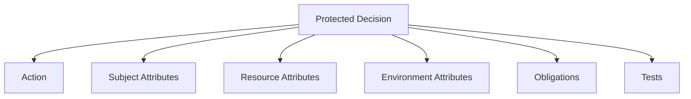
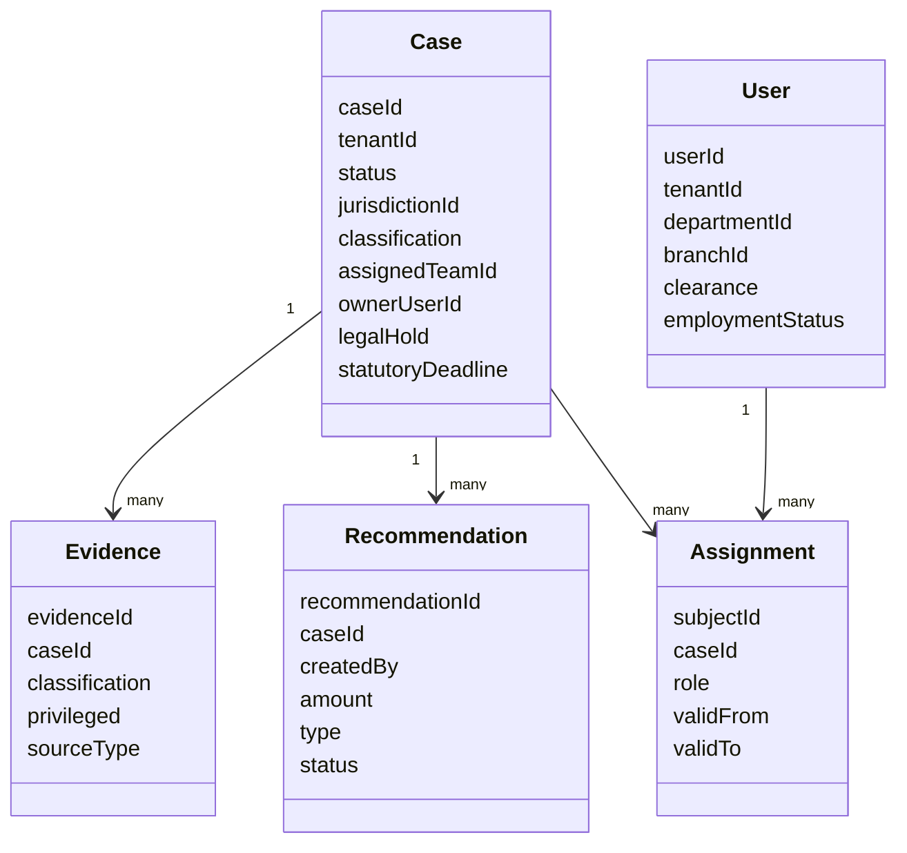
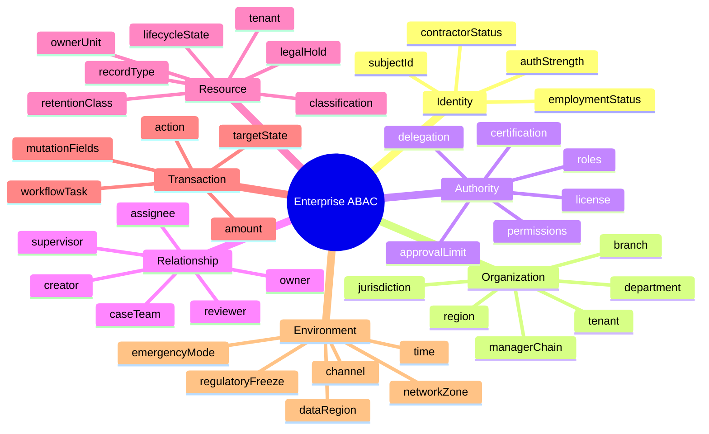
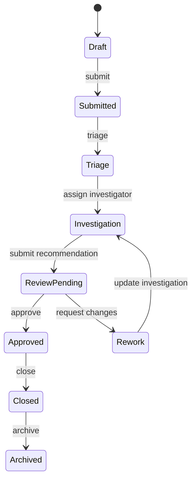
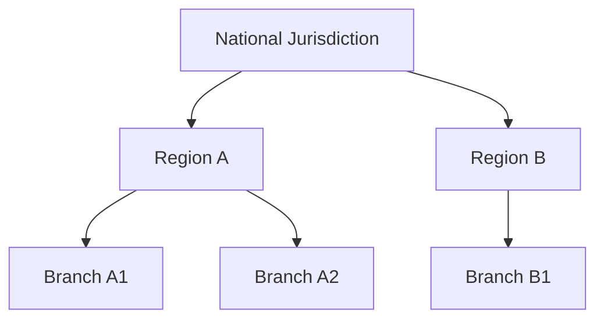
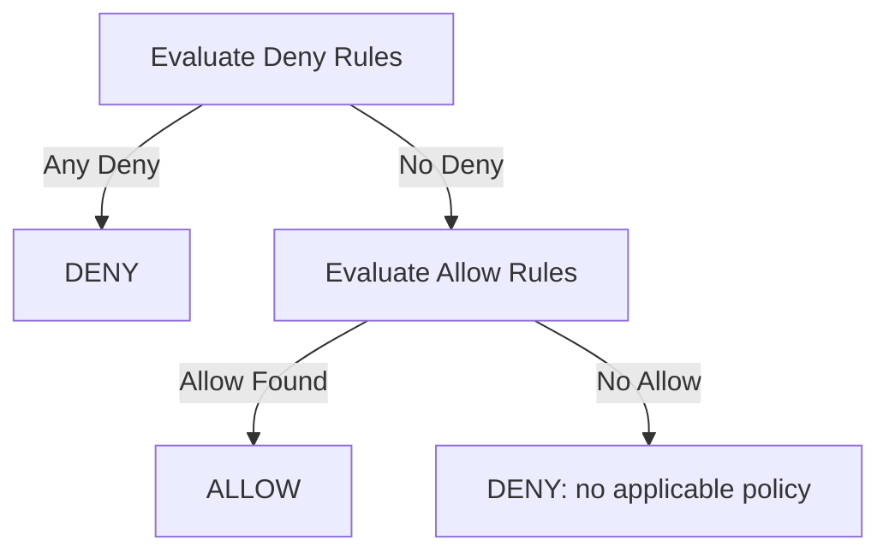
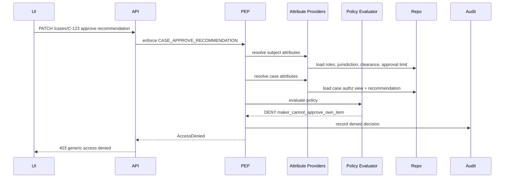

# Part 016 — ABAC Policy Modeling for Enterprise Workflows

Part 015 focused on implementation mechanics: typed requests, attribute providers, policy evaluators, obligations, caching, and testing.

This part focuses on modeling.

Enterprise authorization is rarely just this:

```text
role == ADMIN
```

It is more often this:

```text
An enforcement officer may approve a corrective action plan only when:
  - the case belongs to the officer's jurisdiction,
  - the officer is assigned to the responsible unit,
  - the officer did not create the recommendation,
  - the case is in REVIEW_PENDING state,
  - the entity is not under legal hold,
  - the case classification is within the officer's clearance,
  - the action happens before the statutory deadline,
  - and no separation-of-duty conflict exists.
```

That is ABAC territory.

A strong ABAC model turns messy organizational rules into explicit, composable, testable authorization policy.

---

## 1. Enterprise ABAC Starts with Protected Decisions

Do not start with attributes. Start with decisions.

A decision is a business-critical question:

```text
Can this subject perform this action on this resource now?
```

Examples:

| Domain | Protected Decision |
|---|---|
| Regulatory case management | Can investigator view case evidence? |
| Banking | Can relationship manager approve credit limit change? |
| Healthcare | Can clinician view restricted patient record? |
| Insurance | Can adjuster override claim payout? |
| HR | Can manager view salary field? |
| SaaS admin | Can workspace admin invite external user? |
| Marketplace | Can vendor export customer data? |

Then map each decision to attributes.



A policy model that starts from “which attributes do we have?” usually becomes accidental. A policy model that starts from “which decisions are risky?” becomes defensible.

---

## 2. Policy Modeling Template

Use a repeatable template for every protected operation.

```md
## Policy: CASE_APPROVE_RECOMMENDATION

### Intent
Allow authorized supervisors to approve case recommendations while preventing self-approval and jurisdiction bypass.

### Applies To
- Resource type: CASE
- Action: CASE_APPROVE_RECOMMENDATION
- Entry points: REST endpoint, workflow task completion, admin console, batch approval job

### Subject Attributes
- subject.id
- subject.tenantId
- subject.permissions
- subject.departmentId
- subject.jurisdictionIds
- subject.approvalLimit
- subject.employmentStatus
- subject.clearance

### Resource Attributes
- case.id
- case.tenantId
- case.status
- case.jurisdictionId
- case.classification
- case.recommendation.createdBy
- case.recommendation.amount
- case.legalHold

### Environment Attributes
- request.time
- request.channel
- emergencyMode

### Allow Conditions
- tenant matches
- subject is active
- subject has CASE_APPROVE_RECOMMENDATION
- case.status == REVIEW_PENDING
- subject.jurisdictionIds contains case.jurisdictionId
- subject.id != case.recommendation.createdBy
- subject.approvalLimit >= case.recommendation.amount
- subject.clearance >= case.classification
- case.legalHold == false

### Deny Conditions
- tenant mismatch
- inactive subject
- missing permission
- self-approval
- insufficient approval limit
- classification above clearance
- legal hold

### Obligations
- audit with severity HIGH
- record approving subject id and policy version

### Test Cases
- assigned supervisor approves normal recommendation: allow
- recommendation creator attempts approval: deny
- supervisor from wrong jurisdiction: deny
- legal hold active: deny
```

This template is simple, but it prevents the most common failure: policy rules existing only in engineers’ heads.

---

## 3. Model the Domain Before the Policy

ABAC policies depend on domain semantics. If the domain is unclear, the policy will be unclear.

For a regulatory case management system, core domain objects may look like this:



Authorization model depends on several domain facts:

1. a case has a lifecycle state,
2. evidence can be more sensitive than the case,
3. recommendations have authors,
4. users can be assigned to cases in different capacities,
5. jurisdiction constrains visibility,
6. legal hold constrains mutation,
7. classification constrains field/resource access.

ABAC cannot repair a weak domain model. It can only evaluate facts that exist.

---

## 4. Attribute Taxonomy for Enterprise Workflows

A useful enterprise taxonomy:



Not every policy needs all categories. But every high-risk enterprise workflow usually touches at least four.

---

## 5. Policy Pattern: Tenant Boundary

Tenant isolation should not be a policy preference. It should be an invariant.

```text
Deny if subject.tenantId != resource.tenantId.
```

Java representation:

```java
public final class TenantBoundaryRule implements PolicyRule {
    @Override
    public RuleEvaluation evaluate(ResolvedAuthorizationContext ctx) {
        if (!ctx.subject().tenantId().equals(ctx.resource().tenantId())) {
            return RuleEvaluation.deny("tenant_mismatch");
        }
        return RuleEvaluation.allow("tenant_match");
    }
}
```

SQL query scope:

```sql
where cases.tenant_id = :tenant_id
```

Test invariant:

```java
@Test
void tenantMismatchAlwaysDenies() {
    var ctx = context(
        subject().tenant("tenant-a"),
        caseResource().tenant("tenant-b"),
        Action.CASE_VIEW
    );

    assertDenied(policy.evaluate(ctx), "tenant_mismatch");
}
```

Do not implement tenant isolation only as ABAC if you can also enforce it structurally:

1. tenant column and indexes,
2. repository scope,
3. database row-level security if appropriate,
4. separate encryption keys if required,
5. tenant-aware object references,
6. tenant in audit events.

ABAC should reinforce tenant isolation, not be the only thing standing between tenants.

---

## 6. Policy Pattern: Lifecycle State Authorization

Enterprise workflows are state machines. Authorization often depends on state.

Example case lifecycle:



Naive policy:

```text
allow CASE_UPDATE if user has CASE_UPDATE
```

Better policy:

```text
allow CASE_UPDATE if:
  subject has CASE_UPDATE
  and case.status in [DRAFT, TRIAGE, INVESTIGATION, REWORK]
  and subject is assigned or supervisor
  and case.legalHold == false
```

Important split:

| Rule Type | Example | Belongs In |
|---|---|---|
| State transition validity | `Closed -> Investigation` is invalid | Domain state machine |
| Authority to execute transition | User may move `ReviewPending -> Approved` | Authorization policy |
| Side effects | Approval creates audit record | Application workflow |

In Java:

```java
public final class CaseUpdateStatePolicy implements PolicyRule {
    private static final Set<CaseStatus> MUTABLE_STATES = Set.of(
        CaseStatus.DRAFT,
        CaseStatus.TRIAGE,
        CaseStatus.INVESTIGATION,
        CaseStatus.REWORK
    );

    @Override
    public RuleEvaluation evaluate(ResolvedAuthorizationContext ctx) {
        CaseResourceAttributesView c = (CaseResourceAttributesView) ctx.resource();

        if (!MUTABLE_STATES.contains(c.status())) {
            return RuleEvaluation.deny("case_state_not_mutable");
        }

        if (c.legalHold()) {
            return RuleEvaluation.deny("case_under_legal_hold");
        }

        return RuleEvaluation.allow("case_state_mutable");
    }
}
```

Do not encode lifecycle rules as endpoint names. Encode them as domain state facts.

---

## 7. Policy Pattern: Assignment-Based Access

Assignment is common in case management, claims, ticketing, workflow engines, investigations, and approvals.

Example:

```text
A user can view a case if they are assigned as investigator, reviewer, supervisor, or case owner.
```

Assignment model:

```java
public enum AssignmentRole {
    OWNER,
    INVESTIGATOR,
    REVIEWER,
    SUPERVISOR,
    LEGAL_OBSERVER,
    EXTERNAL_AUDITOR
}

public record AssignmentAttribute(
    String resourceId,
    String subjectId,
    AssignmentRole role,
    Instant validFrom,
    Optional<Instant> validTo
) {
    boolean activeAt(Instant instant) {
        return !instant.isBefore(validFrom)
            && validTo.map(end -> instant.isBefore(end)).orElse(true);
    }
}
```

Policy:

```java
public final class CaseAssignmentPolicy implements PolicyRule {
    private static final Set<AssignmentRole> VIEW_ROLES = Set.of(
        AssignmentRole.OWNER,
        AssignmentRole.INVESTIGATOR,
        AssignmentRole.REVIEWER,
        AssignmentRole.SUPERVISOR,
        AssignmentRole.LEGAL_OBSERVER
    );

    @Override
    public RuleEvaluation evaluate(ResolvedAuthorizationContext ctx) {
        boolean assigned = ctx.subject().assignments().stream()
            .filter(a -> a.resourceId().equals(ctx.resource().resourceId()))
            .filter(a -> a.activeAt(ctx.environment().requestTime()))
            .anyMatch(a -> VIEW_ROLES.contains(a.role()));

        if (!assigned) {
            return RuleEvaluation.deny("subject_not_assigned_to_case");
        }

        return RuleEvaluation.allow("subject_assigned_to_case");
    }
}
```

Assignment should be time-bound when possible. Permanent assignment is often just role creep with a different name.

Assignment failure modes:

1. assignment deleted but cache still allows access,
2. assignment valid for case but reused for evidence from another case,
3. assignment role too broad,
4. external reviewer gets internal fields,
5. assignment not included in search query scope,
6. workflow reassignment does not invalidate decision cache.

---

## 8. Policy Pattern: Jurisdiction and Branch Hierarchy

Regulatory, banking, insurance, logistics, and public-sector systems often constrain access by jurisdiction.

Example:

```text
A provincial officer can view cases in their province.
A national supervisor can view cases in all provinces.
A branch officer can view cases assigned to their branch only.
```

Hierarchy:



Attribute model:

```java
public record JurisdictionAttributes(
    Set<String> directJurisdictionIds,
    Set<String> effectiveJurisdictionIds,
    boolean nationalAccess
) {}
```

Policy:

```java
if (!subject.jurisdiction().effectiveJurisdictionIds().contains(resource.jurisdictionId())) {
    return deny("outside_subject_jurisdiction");
}
```

Do not calculate hierarchy ad hoc in every request. Precompute effective jurisdiction where appropriate.

```text
subject direct jurisdiction: region-a
subject effective jurisdictions: region-a, branch-a1, branch-a2
```

Query scoping:

```sql
where cases.tenant_id = :tenant_id
  and cases.jurisdiction_id = any(:effective_jurisdictions)
```

Hierarchy policy edge cases:

1. temporary regional takeover,
2. cross-jurisdiction joint investigation,
3. national audit mode,
4. case transferred between branches,
5. historical access after transfer,
6. jurisdiction split/merge.

Model these explicitly. Do not hide them under `isAdmin`.

---

## 9. Policy Pattern: Classification and Clearance

Classification-based access is common in regulated systems.

Example levels:

```java
public enum Classification {
    PUBLIC(0),
    INTERNAL(1),
    CONFIDENTIAL(2),
    RESTRICTED(3),
    SECRET(4);

    private final int rank;

    Classification(int rank) {
        this.rank = rank;
    }

    public int rank() {
        return rank;
    }
}

public enum ClearanceLevel {
    PUBLIC(0),
    INTERNAL(1),
    CONFIDENTIAL(2),
    RESTRICTED(3),
    SECRET(4);

    private final int rank;

    ClearanceLevel(int rank) {
        this.rank = rank;
    }

    public boolean canAccess(Classification classification) {
        return rank >= classification.rank();
    }
}
```

Policy:

```java
if (!subject.clearance().canAccess(resource.classification())) {
    return deny("insufficient_clearance");
}
```

But real classification is not always linear.

You may also need compartments:

```java
public record SensitivityLabel(
    Classification classification,
    Set<String> compartments
) {}

public record SubjectClearance(
    ClearanceLevel level,
    Set<String> compartments
) {}
```

Rule:

```text
subject.level >= resource.classification
and subject.compartments contains all resource.compartments
```

Example:

```text
resource: RESTRICTED + [MARKET_ABUSE, WHISTLEBLOWER]
subject: RESTRICTED + [MARKET_ABUSE]
result: deny, missing WHISTLEBLOWER compartment
```

Field-level classification:

| Field | Classification |
|---|---|
| case number | INTERNAL |
| entity name | CONFIDENTIAL |
| whistleblower identity | RESTRICTED + WHISTLEBLOWER |
| internal risk score | RESTRICTED |
| legal memo | SECRET + LEGAL_PRIVILEGE |

Do not classify only the row if fields have different sensitivity.

---

## 10. Policy Pattern: Maker-Checker

Maker-checker prevents the same actor from creating and approving a high-risk change.

Example:

```text
A user who created a recommendation cannot approve that recommendation.
```

Policy:

```java
if (subject.subjectId().equals(resource.recommendation().createdBy())) {
    return deny("maker_cannot_checker");
}
```

But production maker-checker is more subtle.

Variants:

| Pattern | Meaning |
|---|---|
| Same-user SoD | Creator cannot approve own change |
| Same-team SoD | Member of creator team cannot approve |
| Hierarchical approval | Approver must be manager/supervisor |
| Amount-based approval | Approver must have approval limit |
| Multi-party approval | Two or more independent approvals required |
| Time-delayed approval | Approval allowed only after cooling period |
| Legal approval | Legal unit must approve high-risk record |

Policy model:

```java
public record ApprovalContext(
    String createdBy,
    String creatorTeamId,
    BigDecimal amount,
    ApprovalRisk risk,
    Set<String> priorApproverIds
) {}
```

Rule:

```java
public final class MakerCheckerPolicy implements PolicyRule {
    @Override
    public RuleEvaluation evaluate(ResolvedAuthorizationContext ctx) {
        ApprovalContext approval = ctx.resource().approvalContext();
        SubjectAttributes subject = ctx.subject();

        if (subject.subjectId().equals(approval.createdBy())) {
            return deny("maker_cannot_approve_own_item");
        }

        if (approval.priorApproverIds().contains(subject.subjectId())) {
            return deny("duplicate_approval_not_allowed");
        }

        if (subject.approvalLimit().compareTo(approval.amount()) < 0) {
            return deny("approval_limit_too_low");
        }

        return allow();
    }
}
```

Maker-checker must be checked at the moment of approval, not only at task assignment time.

Why?

1. assignment can change,
2. creator can transfer teams,
3. approval amount can change,
4. delegated authority can expire,
5. workflow task can be replayed.

---

## 11. Policy Pattern: Delegated Authority

Delegation allows one actor to act on behalf of another within limits.

Example:

```text
Supervisor delegates case review authority to deputy for 7 days.
```

Delegation attributes:

```java
public record DelegationAttribute(
    String delegatorId,
    String delegateId,
    Set<Action> actions,
    Set<ResourceType> resourceTypes,
    Optional<String> jurisdictionId,
    Instant validFrom,
    Instant validTo,
    String reason,
    boolean revocable
) {
    boolean activeAt(Instant t) {
        return !t.isBefore(validFrom) && t.isBefore(validTo);
    }
}
```

Delegation rule:

```java
boolean delegated = subject.delegations().stream()
    .filter(d -> d.delegateId().equals(subject.subjectId()))
    .filter(d -> d.actions().contains(ctx.action().action()))
    .filter(d -> d.resourceTypes().contains(ctx.request().resource().type()))
    .filter(d -> d.activeAt(ctx.environment().requestTime()))
    .anyMatch(d -> d.jurisdictionId().isEmpty()
        || d.jurisdictionId().get().equals(resource.jurisdictionId()));
```

Delegation should add audit obligations:

```java
return allowWithObligation(
    "delegated_authority_used",
    new Obligation("AUDIT_DELEGATION", Map.of(
        "delegatorId", delegation.delegatorId(),
        "delegateId", delegation.delegateId(),
        "reason", delegation.reason()
    ))
);
```

Delegation failure modes:

1. delegation wider than original authority,
2. delegation not time-bound,
3. delegation survives employment termination,
4. delegation bypasses SoD,
5. delegation not visible in audit,
6. delegation is applied to admin actions unintentionally.

Invariant:

```text
A delegate cannot receive more authority than the delegator could exercise.
```

That means delegation policy often needs recursive evaluation:

```text
Can delegator perform action on resource?
If no, delegate cannot perform it either.
```

---

## 12. Policy Pattern: Break-Glass Access

Break-glass is emergency access. It is not an admin shortcut.

A good break-glass policy requires:

1. explicit activation,
2. reason code or incident ticket,
3. limited duration,
4. limited scope,
5. high-severity audit,
6. notification,
7. post-access review,
8. no silent field-level bypass unless approved.

Policy:

```text
allow emergency access if:
  emergencyMode == true
  and subject.breakGlassActive == true
  and request includes incidentTicket
  and resource is within emergency scope
  and action is break-glass eligible
with obligations:
  AUDIT_HIGH
  NOTIFY_SECURITY
  REQUIRE_POST_ACCESS_REVIEW
```

Java:

```java
if (ctx.environment().emergencyMode() && ctx.subject().breakGlassActive()) {
    if (ctx.request().context().incidentTicket().isEmpty()) {
        return deny("break_glass_requires_incident_ticket");
    }

    if (!breakGlassCatalog.isEligible(ctx.action().action(), ctx.request().resource().type())) {
        return deny("action_not_break_glass_eligible");
    }

    return allowWithObligations("break_glass_allowed", List.of(
        Obligation.auditHigh(),
        Obligation.notifySecurity(),
        Obligation.requirePostAccessReview()
    ));
}
```

Break-glass should not be represented as `ROLE_SUPER_ADMIN`. It has different semantics: emergency, temporary, reviewed, high-friction.

---

## 13. Policy Pattern: Time and Deadline Constraints

Environment attributes often include time.

Examples:

```text
External reviewers may access documents only during review window.
Batch approval job may run only after market close.
Case escalation must happen before statutory deadline.
Temporary access expires at validTo.
```

Time policy:

```java
if (ctx.environment().requestTime().isAfter(resource.reviewWindow().validTo())) {
    return deny("review_window_expired");
}
```

Use injected clocks.

```java
public final class EnvironmentAttributeProvider {
    private final Clock clock;

    public EnvironmentAttributes resolve(AuthorizationRequest request) {
        return new EnvironmentAttributes(clock.instant(), ...);
    }
}
```

Never call `Instant.now()` deep inside policy rules. It makes tests brittle and decisions hard to reproduce.

Store decision time in audit:

```json
{
  "decisionTime": "2026-07-03T09:21:04Z",
  "policyVersion": "case-policy-2026.07.03",
  "reasonCode": "review_window_expired"
}
```

Time edge cases:

1. timezone vs UTC,
2. daylight saving changes,
3. clock skew between services,
4. replayed workflow commands,
5. long-running exports,
6. temporary access expiry during session.

Use server-side authoritative time. Do not trust client-provided timestamps for authorization.

---

## 14. Policy Pattern: Data Residency and Region

Some systems need region-aware authorization.

Example:

```text
EU personal data may be accessed only by users/processors authorized for EU region, unless legal transfer basis exists.
```

Attributes:

```java
public record DataResidencyAttributes(
    String resourceRegion,
    Set<String> subjectAllowedRegions,
    Optional<String> transferBasis,
    boolean crossBorderAccess
) {}
```

Policy:

```java
if (!subject.allowedRegions().contains(resource.dataRegion())) {
    if (request.transferBasis().isEmpty()) {
        return deny("data_region_not_permitted");
    }
    return allowWithObligation("cross_region_access_with_basis", Obligation.auditHigh());
}
```

Do not confuse latency region with legal data region. A record cached in Singapore might still be legally classified as EU personal data.

---

## 15. Policy Pattern: Risk-Based Constraints

ABAC can incorporate risk score.

Examples:

```text
Allow normal case view from corporate network.
Require step-up authentication for restricted evidence from unknown device.
Deny export when request risk score is high.
```

Policy effects:

| Risk Condition | Decision |
|---|---|
| low risk | allow |
| medium risk | allow with step-up obligation |
| high risk read | deny or require strong auth |
| high risk export | deny |

Obligation:

```java
if (ctx.environment().requestRiskScore() >= 70 && ctx.action().exportOperation()) {
    return deny("high_risk_export_blocked");
}

if (ctx.environment().requestRiskScore() >= 50 && !ctx.subject().mfaSatisfied()) {
    return allowWithObligation("step_up_required", Obligation.forceStepUpAuth());
}
```

Be careful: risk engines can be unavailable. Define fallback behavior.

For sensitive writes, missing risk score should usually be indeterminate mapped to deny.

---

## 16. Policy Pattern: Field-Level Write Constraints

Enterprise workflows often allow partial edits.

Example:

```text
Investigator can update summary and evidence notes.
Supervisor can update priority and assignment.
Legal officer can set legal hold.
Only classification officer can raise classification.
No one can lower classification without review.
```

Field policy catalog:

```java
public record FieldPolicy(
    String path,
    Set<Action> allowedActions,
    String requiredPermission,
    boolean highRisk,
    Optional<String> requiredClearance
) {}
```

YAML:

```yaml
fields:
  /summary:
    requiredPermission: CASE_UPDATE_SUMMARY
  /assignedTeamId:
    requiredPermission: CASE_ASSIGN
    highRisk: true
  /classification:
    requiredPermission: CASE_RECLASSIFY
    highRisk: true
  /legalHold:
    requiredPermission: CASE_SET_LEGAL_HOLD
    highRisk: true
```

Policy:

```java
for (FieldMutation mutation : mutations) {
    FieldPolicy fieldPolicy = catalog.require(mutation.path());

    if (!subject.permissions().contains(fieldPolicy.requiredPermission())) {
        return deny("field_update_not_allowed:" + mutation.path());
    }

    if (fieldPolicy.highRisk() && !subject.mfaSatisfied()) {
        return allowWithObligation("field_update_requires_step_up", Obligation.forceStepUpAuth());
    }
}
```

Mass assignment protection belongs here. If a field is unknown or not in catalog, reject it.

```java
if (!catalog.contains(mutation.path())) {
    return deny("unknown_or_unmanaged_field:" + mutation.path());
}
```

Default allow for unknown fields is a security bug.

---

## 17. Policy Pattern: Workflow Task Authorization

Workflow engines create another authorization dimension: task assignment and process state.

Example:

```text
A user can complete a review task only if:
  - the task is assigned to them or their candidate group,
  - the underlying case is in the correct state,
  - the user passes domain authorization for the intended outcome,
  - completing the task does not violate SoD.
```

Attributes:

```java
public record WorkflowTaskAttributes(
    String taskId,
    String processInstanceId,
    String taskDefinitionKey,
    Optional<String> assignee,
    Set<String> candidateGroups,
    String businessKey,
    String tenantId
) {}
```

Policy:

```java
boolean taskAssignedToSubject = task.assignee()
    .map(id -> id.equals(subject.subjectId()))
    .orElse(false);

boolean subjectInCandidateGroup = subject.groups().stream()
    .anyMatch(task.candidateGroups()::contains);

if (!taskAssignedToSubject && !subjectInCandidateGroup) {
    return deny("workflow_task_not_assigned_to_subject");
}
```

Then check domain authorization:

```java
AuthorizationDecision caseDecision = authorizationService.decide(
    AuthorizationRequest.builder()
        .subject(ctx.request().subject())
        .action(actionForTask(task.taskDefinitionKey()))
        .resource(ResourceRef.caseRecord(task.tenantId(), task.businessKey()))
        .context(ctx.request().context())
        .build()
);

if (!caseDecision.allowed()) {
    return deny("underlying_case_authorization_failed");
}
```

Do not rely only on workflow task assignment. A task can be assigned incorrectly. Domain authorization is still required.

---

## 18. Policy Pattern: Report, Export, and Analytics Authorization

Reports and exports are high-risk because they aggregate many records.

Policy question:

```text
Can the subject export this dataset with these filters and fields?
```

Attributes:

```java
public record ExportRequestAttributes(
    String reportType,
    Set<String> requestedFields,
    CaseSearchCriteria filters,
    int estimatedRowCount,
    String format,
    boolean includesPersonalData,
    boolean includesRestrictedData
) {}
```

Policy:

```java
if (!subject.permissions().contains("CASE_EXPORT")) {
    return deny("missing_export_permission");
}

if (export.estimatedRowCount() > subject.exportLimit()) {
    return deny("export_limit_exceeded");
}

if (export.includesRestrictedData() && !subject.permissions().contains("CASE_EXPORT_RESTRICTED")) {
    return deny("restricted_export_not_allowed");
}

if (!export.requestedFields().stream().allMatch(fieldCatalog::exportable)) {
    return deny("non_exportable_field_requested");
}
```

Obligations:

1. watermark file,
2. audit high severity,
3. store export manifest,
4. expire download link,
5. notify data owner,
6. apply field redaction,
7. require approval for large export.

Search scope still applies:

```text
export dataset = search criteria AND authorization scope
```

Never export first and filter later.

---

## 19. Policy Pattern: Service Account and System Job Authorization

Services and jobs are subjects too.

Subject types:

```java
public enum SubjectType {
    USER,
    SERVICE_ACCOUNT,
    SYSTEM_JOB,
    BREAK_GLASS_USER
}
```

Example policy:

```text
Nightly archival job may archive closed cases older than retention period.
It may not view restricted evidence payloads.
It may not modify open cases.
```

Policy attributes:

```java
public record ServiceAccountAttributes(
    String serviceId,
    String tenantId,
    Set<String> allowedActions,
    Set<String> allowedResourceTypes,
    Set<String> allowedTenants,
    boolean productionOnly
) {}
```

Rule:

```java
if (subject.type() == SubjectType.SYSTEM_JOB) {
    if (!subject.allowedActions().contains(ctx.action().action().name())) {
        return deny("system_job_action_not_allowed");
    }

    if (!subject.allowedTenants().contains(resource.tenantId())) {
        return deny("system_job_tenant_not_allowed");
    }
}
```

Do not let service accounts use human roles like `ADMIN`. Give them narrow machine permissions.

---

## 20. Policy Pattern: Legal Hold and Regulatory Freeze

Legal hold often blocks mutation even for privileged users.

```text
If case.legalHold == true:
  allow view according to normal policy,
  deny delete,
  deny evidence modification,
  deny classification lowering,
  allow legal notes by legal officer.
```

Policy:

```java
if (resource.legalHold() && ctx.action().writeOperation()) {
    if (!subject.permissions().contains("LEGAL_HOLD_WRITE_EXCEPTION")) {
        return deny("resource_under_legal_hold");
    }
}
```

Regulatory freeze can be environmental:

```java
if (ctx.environment().regulatoryFreezeActive()
        && Set.of(Action.CASE_CLOSE, Action.CASE_DELETE).contains(ctx.action().action())) {
    return deny("regulatory_freeze_active");
}
```

This is a good example of ABAC’s value: a rule can depend on resource state and environment state, not just role.

---

## 21. Policy Pattern: Ownership Is Not Enough

Ownership is a useful attribute, but dangerous as a sole rule.

Bad:

```text
allow if resource.ownerId == subject.id
```

Questions:

1. Can the owner delete after submission?
2. Can the owner view restricted evidence added by another unit?
3. Can the owner approve their own recommendation?
4. Can the owner export all attachments?
5. Does ownership survive transfer?
6. Can a suspended employee still own records?

Better:

```text
allow if:
  owner matches
  and subject is active
  and action is owner-eligible
  and resource state allows owner action
  and classification is within clearance
  and no SoD conflict exists
```

Ownership should be one predicate, not the whole policy.

---

## 22. Modeling Deny Rules Explicitly

Many teams model only allows. Sensitive systems need explicit denies.

Deny rules:

```text
deny if tenant mismatch

deny if subject inactive

deny if legal hold blocks write

deny if maker-checker conflict

deny if classification exceeds clearance

deny if delegated authority expired

deny if action requested after statutory deadline

deny if cross-region access lacks transfer basis
```

Use deny-overrides for high-risk domains.



This makes safety rules non-bypassable.

---

## 23. Policy Conflict Examples

Policy conflict is normal.

Example:

```text
Policy A: Supervisors can view all cases in jurisdiction.
Policy B: Sealed cases can be viewed only by legal officers.
```

A supervisor attempts to view sealed case.

If permit-overrides is used, access may be allowed. If deny-overrides is used, access is denied unless a specific legal-officer allow exists.

Preferred model:

```text
Deny: sealed case and subject lacks CASE_VIEW_SEALED
Allow: jurisdiction supervisor can view non-sealed cases
Allow: legal officer can view sealed cases
```

Conflict resolution should be deliberate, documented, and tested.

---

## 24. Policy Model as Executable Matrix

Enterprise ABAC needs a matrix that humans can review and machines can run.

Example:

```yaml
policies:
  - action: CASE_APPROVE_RECOMMENDATION
    resourceType: CASE
    cases:
      - name: supervisor in jurisdiction approves normal case
        subject:
          permissions: [CASE_APPROVE_RECOMMENDATION]
          employmentStatus: ACTIVE
          jurisdictionIds: [JKT]
          clearance: RESTRICTED
          approvalLimit: 1000000
          id: user-supervisor
        resource:
          tenantId: t1
          jurisdictionId: JKT
          classification: CONFIDENTIAL
          status: REVIEW_PENDING
          legalHold: false
          recommendation:
            createdBy: user-investigator
            amount: 500000
        expected: ALLOW

      - name: creator cannot approve own recommendation
        subject:
          permissions: [CASE_APPROVE_RECOMMENDATION]
          employmentStatus: ACTIVE
          jurisdictionIds: [JKT]
          clearance: RESTRICTED
          approvalLimit: 1000000
          id: user-investigator
        resource:
          tenantId: t1
          jurisdictionId: JKT
          classification: CONFIDENTIAL
          status: REVIEW_PENDING
          legalHold: false
          recommendation:
            createdBy: user-investigator
            amount: 500000
        expected: DENY
        reason: maker_cannot_approve_own_item
```

Runner:

```java
class PolicyMatrixTest {
    @ParameterizedTest
    @MethodSource("policyCases")
    void policyMatrix(PolicyCase testCase) {
        ResolvedAuthorizationContext ctx = PolicyCaseMapper.toContext(testCase);
        AuthorizationDecision decision = evaluator.evaluate(ctx);

        assertThat(decision.effect()).isEqualTo(testCase.expectedEffect());
        if (testCase.expectedReason() != null) {
            assertThat(decision.reasonCode()).isEqualTo(testCase.expectedReason());
        }
    }
}
```

This is one of the highest-leverage practices in authorization engineering.

---

## 25. Case Study: Regulatory Case Management Policy Set

Let’s define a concrete policy set.

### 25.1 Actions

```java
public enum CaseAction {
    CASE_VIEW,
    CASE_VIEW_RESTRICTED,
    CASE_CREATE,
    CASE_UPDATE_SUMMARY,
    CASE_ASSIGN,
    CASE_RECLASSIFY,
    CASE_ADD_EVIDENCE,
    CASE_VIEW_EVIDENCE,
    CASE_SUBMIT_RECOMMENDATION,
    CASE_APPROVE_RECOMMENDATION,
    CASE_CLOSE,
    CASE_EXPORT,
    CASE_SET_LEGAL_HOLD,
    CASE_BREAK_GLASS_VIEW
}
```

### 25.2 Resource Attributes

```java
public record CaseAuthzView(
    String caseId,
    String tenantId,
    CaseStatus status,
    String jurisdictionId,
    String branchId,
    String assignedTeamId,
    String ownerUserId,
    Classification classification,
    Set<String> compartments,
    boolean sealed,
    boolean legalHold,
    String createdBy,
    Optional<RecommendationAuthzView> recommendation,
    Optional<Instant> statutoryDeadline
) {}
```

### 25.3 Subject Attributes

```java
public record UserAuthzView(
    String userId,
    String tenantId,
    EmploymentStatus employmentStatus,
    Set<String> permissions,
    Set<String> jurisdictionIds,
    Set<String> branchIds,
    Set<String> teamIds,
    ClearanceLevel clearance,
    Set<String> compartments,
    BigDecimal approvalLimit,
    boolean mfaSatisfied,
    List<DelegationAttribute> delegations
) {}
```

### 25.4 Policy: View Case

```text
Allow CASE_VIEW if:
  - tenant matches
  - subject active
  - subject has CASE_VIEW
  - subject jurisdiction contains case jurisdiction OR subject assigned team matches case team
  - subject clearance >= case classification
  - if case sealed, subject has CASE_VIEW_SEALED
  - if compartments exist, subject has all required compartments
```

### 25.5 Policy: Update Summary

```text
Allow CASE_UPDATE_SUMMARY if:
  - all CASE_VIEW base constraints pass
  - subject has CASE_UPDATE_SUMMARY
  - case.status in [DRAFT, TRIAGE, INVESTIGATION, REWORK]
  - legalHold == false
  - subject is assigned investigator or supervisor
```

### 25.6 Policy: Assign Case

```text
Allow CASE_ASSIGN if:
  - tenant matches
  - subject active
  - subject has CASE_ASSIGN
  - subject is supervisor for case jurisdiction or branch
  - target assignee belongs to same tenant
  - target assignee has required clearance
  - case.status not in [CLOSED, ARCHIVED]
```

Assignment authorization needs both source resource and target subject attributes.

```java
public record AssignmentRequestContext(
    String targetUserId,
    String targetTeamId,
    AssignmentRole assignmentRole
) {}
```

### 25.7 Policy: Approve Recommendation

```text
Allow CASE_APPROVE_RECOMMENDATION if:
  - tenant matches
  - subject active
  - subject has CASE_APPROVE_RECOMMENDATION
  - case.status == REVIEW_PENDING
  - subject jurisdiction contains case jurisdiction
  - subject.id != recommendation.createdBy
  - subject.approvalLimit >= recommendation.amount
  - subject clearance >= case classification
  - legalHold == false
  - mfa satisfied for high-risk recommendation
```

### 25.8 Policy: Export

```text
Allow CASE_EXPORT if:
  - subject has CASE_EXPORT
  - query scope is restricted to subject effective jurisdiction/team/assignment
  - requested fields are exportable
  - estimated row count within limit
  - restricted fields require CASE_EXPORT_RESTRICTED
  - export channel is approved
with obligations:
  - watermark export
  - audit high severity
  - expire download
  - record manifest
```

---

## 26. Diagram: End-to-End Enterprise ABAC Decision



Internal audit knows the reason. The client receives a safe generic message.

---

## 27. Policy Modeling Heuristics

Use these heuristics when designing enterprise ABAC:

### 27.1 Start With Deny Invariants

Before allows, define absolute denies:

```text
tenant mismatch
inactive subject
resource under legal hold for write
maker-checker conflict
classification above clearance
expired delegation
unknown field mutation
PDP indeterminate
```

### 27.2 Separate Visibility, Operation, and Mutation

`CASE_VIEW`, `CASE_UPDATE`, and `CASE_UPDATE_FIELD_X` are different.

### 27.3 Model Relationships Explicitly

`ownerId`, `assignedTeamId`, `createdBy`, `reviewerId`, `candidateGroup`, and `delegatorId` are security-relevant relationships. Do not leave them as incidental columns.

### 27.4 Treat Search as a First-Class Operation

For every `VIEW` policy, define the matching `SEARCH_SCOPE` policy.

### 27.5 Treat Export as More Dangerous Than View

Export multiplies impact. It deserves separate permissions, limits, obligations, and audit.

### 27.6 Use Obligations Instead of Hidden Side Effects

If access is allowed only with redaction, watermarking, step-up auth, or post-review, return that as explicit decision data.

### 27.7 Make Policy Cases Executable

If a policy cannot be turned into tests, it is not precise enough.

---

## 28. Common Modeling Mistakes

### Mistake 1: “Admin Can Do Everything”

This destroys SoD, auditability, and blast-radius control.

Better:

```text
Admin can manage configuration.
Admin cannot approve own case.
Admin cannot bypass legal hold.
Admin cannot view sealed evidence unless explicitly authorized.
```

### Mistake 2: One Permission Per Endpoint

Endpoints are transport shape. Authorization is domain shape.

Bad:

```text
PATCH /case/{id} requires CASE_PATCH
```

Better:

```text
CASE_UPDATE_SUMMARY
CASE_ASSIGN
CASE_RECLASSIFY
CASE_SET_LEGAL_HOLD
```

### Mistake 3: Field-Level Policy Only in UI

UI hiding is usability, not security.

### Mistake 4: Forgetting Workers and Batch Jobs

A scheduled job can mutate thousands of records. Treat it as a subject with narrow permissions.

### Mistake 5: No Policy Version in Audit

Without policy version, you cannot reconstruct why a decision was made later.

### Mistake 6: Resource Attributes Loaded After Authorization

If policy needs resource classification, assignment, legal hold, or state, load an authorization projection before deciding.

### Mistake 7: Ambiguous Policy Language

“Senior officer may approve high-risk cases when appropriate” is not executable.

Convert to:

```text
subject.permissions contains CASE_APPROVE_HIGH_RISK
and subject.approvalLimit >= recommendation.amount
and case.riskRating in [HIGH, CRITICAL]
and subject.id != recommendation.createdBy
```

---

## 29. ABAC Policy Review Checklist

For each policy, ask:

- [ ] What action is protected?
- [ ] What resource type is protected?
- [ ] Which entry points invoke this action?
- [ ] Which subject attributes are required?
- [ ] Which resource attributes are required?
- [ ] Which environment attributes are required?
- [ ] Which attributes are mandatory?
- [ ] What happens if each mandatory attribute is missing?
- [ ] What are absolute deny rules?
- [ ] What are allow rules?
- [ ] Which rules are state-dependent?
- [ ] Which rules are relationship-dependent?
- [ ] Which rules are time-dependent?
- [ ] Does the policy affect fields, not just records?
- [ ] Does the policy affect search/list/export?
- [ ] Are there obligations?
- [ ] Can the PEP enforce all obligations?
- [ ] Is the decision audited?
- [ ] Is the client error safe?
- [ ] Does the policy have executable matrix tests?
- [ ] Does the policy have negative tests?
- [ ] How is cache invalidated when attributes change?

---

## 30. Key Takeaways

Enterprise ABAC modeling is about turning messy real-world authority into precise executable rules.

The strongest models have these properties:

1. protected decisions are named explicitly,
2. domain attributes are stable and typed,
3. tenant boundary is invariant,
4. lifecycle state is part of authorization but not confused with domain validity,
5. assignments and jurisdiction are first-class security relationships,
6. classification/clearance rules support row and field-level decisions,
7. maker-checker and SoD rules are explicit denies,
8. delegation cannot exceed delegator authority,
9. break-glass is temporary, audited, and reviewed,
10. export/report access is stricter than normal view,
11. policies are backed by executable test matrices.

A top-tier engineer does not treat authorization as scattered conditionals. They model authority as a system: facts, decisions, invariants, obligations, failure behavior, and evidence.
