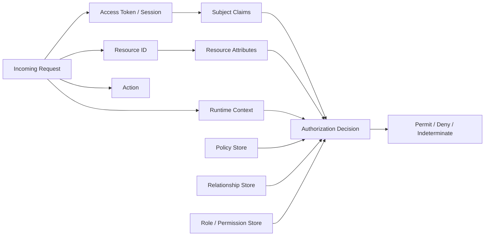
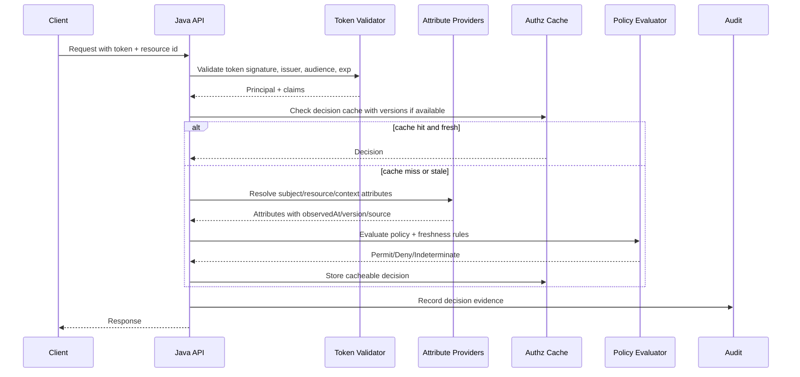
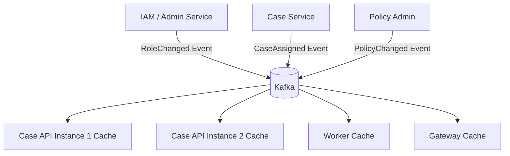

# Part 017 — Context Staleness: JWT Claims, Cached Attributes, and Revocation Delay

Authorization is not only a question of correctness.

It is also a question of **time**.

A decision can be correct at `10:00:00` and unsafe at `10:00:05` because one of the facts changed:

- the user was disabled,
- a role was revoked,
- a case was reassigned,
- a resource was reclassified as confidential,
- a delegation expired,
- a tenant boundary changed,
- a policy was rolled back,
- a legal hold was applied,
- a device posture changed,
- a fraud/risk score crossed a threshold,
- an emergency break-glass session ended.

This is the hidden problem behind many production authorization failures:

```text
The code checked authorization.
But it checked yesterday's truth.
```

This part is about designing Java authorization systems that explicitly model **freshness**, **drift**, **revocation**, and **bounded inconsistency**.

We are not repeating authentication details. JWT, sessions, and identity provider behavior are discussed only as they affect authorization correctness.

---

## 1. The Core Problem: Authorization Depends on Mutable Facts

A production authorization decision usually consumes multiple facts.



Some facts are relatively stable:

```text
subject.id = user-123
resource.type = CASE
```

Some facts are volatile:

```text
subject.status = ACTIVE
subject.roles = [CASE_REVIEWER]
resource.assignedOfficerId = user-123
resource.classification = INTERNAL
policy.version = 2026-07-03.5
subject.currentRiskLevel = LOW
```

When volatile facts are copied into JWTs, cached in memory, replicated through Kafka, or materialized into read models, they become **time-shifted facts**.

That is not automatically wrong. Distributed systems require caching and propagation. But you must know what kind of staleness you are accepting.

---

## 2. Vocabulary: Staleness, Drift, Revocation, Freshness

Use precise language.

| Term | Meaning |
|---|---|
| **Claim** | A statement carried by token/session, for example `sub`, `tenant_id`, `roles`, `scope`, `iat`, `exp`. |
| **Claim drift** | The claim no longer matches the source of truth. Example: token says `role=APPROVER`, database says role was revoked. |
| **Attribute staleness** | Attribute value used by PDP is older than acceptable for that decision. |
| **Revocation delay** | Time between revoking access and every relevant enforcement point reliably denying it. |
| **Decision freshness** | Maximum age of facts used to produce an authorization decision. |
| **Decision cache** | Cached authorization result, usually keyed by subject/action/resource/context. |
| **Source-of-truth read** | Direct read from authoritative store, or a strongly fresh projection accepted as authoritative. |
| **Bounded staleness** | Staleness is allowed but capped by TTL/version/invalidation. |
| **Fail-closed** | If freshness cannot be proven for a critical decision, deny or return indeterminate. |

The dangerous version is not merely stale data.

The dangerous version is **unmodeled stale data**.

---

## 3. Why JWT Claims Are Not Enough for Object-Level Authorization

JWT access tokens are useful because resource servers can validate them locally and avoid calling the identity provider on every request. RFC 9068 standardizes a JWT profile for OAuth 2.0 access tokens so authorization servers and resource servers can interoperate around common token structure.

But local validation creates a hard boundary:

```text
A valid token proves that the token is valid.
It does not prove every mutable authorization fact inside it is still true.
```

Typical JWT fields:

```json
{
  "iss": "https://idp.example.com",
  "sub": "user-123",
  "aud": "case-api",
  "exp": 1783094400,
  "iat": 1783090800,
  "scope": "case:read case:update",
  "tenant_id": "tenant-a",
  "roles": ["case_reviewer"]
}
```

Good uses of JWT claims:

- identify subject ID,
- identify issuer/audience,
- carry token issuance and expiry time,
- carry coarse-grained scopes,
- carry tenant hint,
- carry authentication context if needed,
- carry immutable or low-risk claims.

Dangerous uses of JWT claims:

- treating roles inside token as always-current truth,
- using token scope as complete object-level authorization,
- trusting tenant claim without checking resource tenant,
- trusting group membership for high-risk actions without freshness control,
- putting massive permission lists into access tokens,
- putting sensitive policy state into tokens,
- using long-lived tokens for admin/approval flows.

A token can answer:

```text
Who is calling?
Was this token issued by a trusted issuer?
Is the token intended for this API?
Is the token still cryptographically valid?
```

It usually cannot safely answer:

```text
Can this subject approve this exact case right now?
Can this subject view this exact evidence attachment right now?
Can this subject export all records matching this query right now?
```

For those, the service must bind the subject to the resource and current context.

---

## 4. Drift Happens in Multiple Dimensions

Do not think only about role revocation.

Claim and context drift can happen on both the subject side and resource side.

### 4.1 Subject Drift

Examples:

```text
user.status changed ACTIVE -> SUSPENDED
user.role CASE_APPROVER revoked
user.department changed Enforcement -> Legal
user.clearance changed CONFIDENTIAL -> INTERNAL
user.manager changed
user.tenant membership removed
user.delegation expired
user.breakGlassSession ended
user.riskScore increased
```

### 4.2 Resource Drift

Examples:

```text
case.assignee changed user-123 -> user-456
case.status changed DRAFT -> CLOSED
case.classification changed INTERNAL -> RESTRICTED
case.tenant changed due to migration
case.jurisdiction changed
case.legalHold applied
case.ownerOrganization changed
case.relatedEntity became politically exposed
```

### 4.3 Relationship Drift

Examples:

```text
user no longer member of team that owns folder
case moved to a unit the user cannot access
document shared link revoked
parent organization changed
case delegated to another region
```

### 4.4 Policy Drift

Examples:

```text
policy now requires maker-checker
policy now forbids self-approval
policy now requires higher clearance for export
policy now blocks access outside office hours
policy version 12 rolled back to version 11
```

### 4.5 Environment Drift

Examples:

```text
device compliance changed
IP risk changed
session age exceeded threshold
network zone changed
maintenance freeze started
incident mode activated
```

Each drift dimension has different acceptable staleness.

---

## 5. Classify Attributes by Freshness Requirement

Not all authorization facts need the same freshness.

A good system classifies attributes by **risk and volatility**.

| Freshness Class | Example Attributes | Acceptable Strategy |
|---|---|---|
| **Immutable** | subject ID, resource ID, resource type | Token/local object acceptable. |
| **Slow-changing** | display name, department label | Cached with longer TTL. |
| **Medium-risk mutable** | team membership, non-admin role | Short TTL + version check/event invalidation. |
| **High-risk mutable** | admin role, approval role, account status, clearance | Fresh read, introspection, or strict bounded staleness. |
| **Resource-critical** | assignee, tenant, legal hold, classification, state | Fresh or transactionally consistent with resource operation. |
| **Policy-critical** | policy version, emergency deny rule | Fast invalidation or central PDP. |
| **Environment-critical** | device posture, risk score, break-glass status | Fresh/short-lived, often no long cache. |

A practical default:

```text
Identity claims may be token-local.
Coarse scopes may be token-local with short lifetime.
Object-level facts must be checked from service-owned data or fresh-enough projections.
High-risk administrative rights must not rely only on long-lived JWT claims.
```

---

## 6. The Freshness Budget

Every protected action should have a freshness budget.

A freshness budget answers:

```text
How stale may the authorization facts be before the decision becomes unsafe?
```

Examples:

| Action | Maximum Acceptable Staleness |
|---|---:|
| View public profile | minutes/hours |
| View internal case summary | seconds/minutes depending on sensitivity |
| Download restricted evidence | near-fresh |
| Approve enforcement decision | fresh inside transaction |
| Grant admin role | fresh inside transaction |
| Export regulated data | fresh + policy version check |
| Break-glass access | fresh + short session + audit |

Represent this explicitly.

```java
public enum FreshnessRequirement {
    TOKEN_LOCAL,
    BOUNDED_STALE,
    FRESH_READ,
    TRANSACTIONAL
}

public record FreshnessPolicy(
        FreshnessRequirement requirement,
        Duration maxAge,
        boolean failClosedWhenUnknown
) {}
```

Then attach it to protected actions.

```java
public enum CaseAction {
    VIEW_SUMMARY(new FreshnessPolicy(FreshnessRequirement.BOUNDED_STALE, Duration.ofSeconds(60), true)),
    UPDATE_DETAILS(new FreshnessPolicy(FreshnessRequirement.FRESH_READ, Duration.ZERO, true)),
    APPROVE_RECOMMENDATION(new FreshnessPolicy(FreshnessRequirement.TRANSACTIONAL, Duration.ZERO, true)),
    EXPORT_EVIDENCE(new FreshnessPolicy(FreshnessRequirement.FRESH_READ, Duration.ZERO, true));

    private final FreshnessPolicy freshnessPolicy;

    CaseAction(FreshnessPolicy freshnessPolicy) {
        this.freshnessPolicy = freshnessPolicy;
    }

    public FreshnessPolicy freshnessPolicy() {
        return freshnessPolicy;
    }
}
```

This forces the design discussion into code.

---

## 7. Token Lifetime Is a Security Control, Not Just a UX Setting

Long-lived access tokens increase revocation delay.

Short-lived access tokens reduce drift exposure but increase refresh traffic and may complicate distributed clients.

A simple model:

```text
Worst-case token-only revocation delay ~= access token lifetime
```

If access tokens live for 60 minutes and roles are only read from token claims, a revoked role may remain effective for almost 60 minutes.

That may be acceptable for low-risk read actions.

It is usually unacceptable for:

- admin actions,
- approval actions,
- money movement,
- case closure,
- evidence export,
- account deletion,
- role management,
- cross-tenant operations,
- legal/regulatory decisions.

The pattern:

```text
Use JWT/token claims for identity and coarse admission.
Use current or bounded-current authorization data for protected decisions.
```

---

## 8. Revocation Strategies

There is no single revocation strategy that is perfect for all systems.

Choose based on risk, latency, scale, and operational complexity.

### 8.1 Short-Lived Access Tokens

```text
Access token TTL: 5-15 minutes
Refresh token/session controlled by identity provider
```

Pros:

- simple resource server logic,
- no central call for every request,
- revocation delay bounded by token lifetime.

Cons:

- not immediate,
- may still be too slow for high-risk actions,
- role changes are delayed unless rechecked.

Use for:

- general API access,
- low/medium-risk actions,
- coarse scopes.

Do not rely on this alone for high-risk object-level authorization.

### 8.2 Token Introspection / Session Check

Resource server asks an authoritative service whether token/session is still active.

Pros:

- faster revocation,
- central control,
- can include dynamic state.

Cons:

- latency,
- availability dependency,
- cache required at scale,
- can create central bottleneck.

Use for:

- admin consoles,
- sensitive internal services,
- high-risk workflows,
- regulated environments.

### 8.3 Subject Version / Session Version

Store a version number in the token and compare against authoritative subject/session version.

```json
{
  "sub": "user-123",
  "session_version": 41,
  "permission_version": 8
}
```

Authoritative store:

```text
subject_id=user-123
current_session_version=42
current_permission_version=9
```

If token version is older, deny or force refresh.

Java sketch:

```java
public final class SubjectVersionGuard {
    private final SubjectVersionRepository repository;

    public void verifyNotStale(TokenPrincipal principal) {
        SubjectVersion current = repository.getCurrentVersion(principal.subjectId());

        if (principal.sessionVersion() < current.sessionVersion()) {
            throw new AccessDeniedException("stale_session");
        }

        if (principal.permissionVersion() < current.permissionVersion()) {
            throw new AccessDeniedException("stale_permissions");
        }
    }
}
```

Pros:

- efficient,
- cacheable,
- supports global revoke-all,
- avoids huge denylist.

Cons:

- requires resource server to read/check version,
- still needs propagation/invalidation design,
- version scope must be clear.

### 8.4 Token Denylist

Store revoked token IDs (`jti`) until expiry.

```text
revoked_jti:{token-id} -> expires at token exp
```

Pros:

- targeted revocation,
- simple mental model.

Cons:

- storage grows with revoked tokens,
- every request may need cache lookup,
- not enough for role drift unless every old token is revoked.

Use for:

- logout,
- compromised token response,
- emergency revocation.

### 8.5 Permission Cache Invalidation Events

Publish events when roles, assignments, delegations, policies, or relationships change.

```json
{
  "eventType": "PermissionChanged",
  "subjectId": "user-123",
  "tenantId": "tenant-a",
  "permissionVersion": 19,
  "occurredAt": "2026-07-03T09:15:30Z"
}
```

Consumers invalidate local caches.

Pros:

- scalable,
- low latency if event system is healthy,
- avoids central calls for every request.

Cons:

- eventual consistency,
- ordering and delivery issues,
- cold-start cache risk,
- must handle missed events.

Use with TTL as a safety net.

### 8.6 Policy Version Check

Attach policy version to decisions.

```java
public record AuthorizationDecision(
        DecisionEffect effect,
        String reasonCode,
        String policyVersion,
        Instant evaluatedAt
) {}
```

For high-risk workflows, require the action to be executed only if policy version remains current.

```text
Read resource + evaluate policy version 15.
Before commit, verify active policy version is still 15.
If version changed, retry or deny.
```

Use for:

- approval workflows,
- legal/regulatory processes,
- financial actions,
- policy rollout safety.

---

## 9. Do Not Cache All Decisions Equally

Decision caching can be safe or catastrophic.

Bad cache key:

```text
user-123:case:update -> permit
```

This ignores:

- resource ID,
- tenant,
- action variant,
- case state,
- classification,
- assignee,
- policy version,
- relationship version,
- time constraints,
- device/risk constraints.

Better cache key:

```java
public record DecisionCacheKey(
        String subjectId,
        String tenantId,
        String action,
        String resourceType,
        String resourceId,
        String resourceAuthzVersion,
        String subjectPermissionVersion,
        String policyVersion,
        String environmentClass
) {}
```

Even this may be unsafe for some actions.

A safe cache design starts with this question:

```text
Which input changes would make the decision different?
```

Every answer belongs in either:

- the cache key,
- the TTL/invalidation strategy,
- the no-cache list.

---

## 10. Decision Cache Rules

Use these rules as defaults.

### Rule 1: Cache Permit More Carefully Than Deny

A stale permit is often more dangerous than a stale deny.

```text
Stale deny -> user annoyance / support ticket
Stale permit -> data breach / unauthorized action
```

Permit cache TTL should usually be shorter than deny cache TTL for sensitive decisions.

### Rule 2: Never Cache High-Risk Permit Without Version Binding

High-risk permit decisions should include versions:

```text
subjectPermissionVersion
resourceAuthzVersion
policyVersion
relationshipVersion
```

When any version changes, cached permit is invalid.

### Rule 3: Cache Query Scopes, Not Just Boolean Decisions

For list/search APIs, the authorization output is not only permit/deny.

It may be a predicate:

```sql
WHERE tenant_id = :tenantId
  AND assignee_id = :subjectId
  AND classification <= :clearance
```

Cache carefully. If role/clearance/assignment changes, predicate changes.

### Rule 4: No Cache for Transactional State Transitions Unless Snapshot Is Bound

For state transitions such as approval:

```text
DRAFT -> REVIEW_PENDING -> APPROVED
```

Authorization depends on current state.

Either:

- recheck inside the same transaction, or
- use optimistic locking/version condition.

### Rule 5: Fail Closed When Freshness Is Unknown

If a critical attribute has no timestamp/version, treat it as stale.

```java
if (attribute.isCritical() && attribute.freshness().isUnknown()) {
    return AuthorizationDecision.deny("critical_attribute_freshness_unknown");
}
```

---

## 11. Attribute Freshness in Code

Do not return raw attribute values without provenance.

Return value plus freshness metadata.

```java
public record AttributeValue<T>(
        String name,
        T value,
        Instant observedAt,
        String source,
        String version,
        boolean authoritative
) {
    public boolean olderThan(Duration maxAge, Clock clock) {
        return observedAt.plus(maxAge).isBefore(clock.instant());
    }
}
```

An ABAC context can carry attribute values with freshness.

```java
public record AuthorizationAttributes(
        AttributeValue<String> subjectStatus,
        AttributeValue<Set<String>> subjectRoles,
        AttributeValue<String> resourceState,
        AttributeValue<String> resourceClassification,
        AttributeValue<String> resourceAssignee,
        AttributeValue<String> policyVersion
) {}
```

The evaluator then enforces freshness.

```java
public final class FreshnessValidator {
    private final Clock clock;

    public FreshnessValidator(Clock clock) {
        this.clock = clock;
    }

    public void requireFresh(AttributeValue<?> attribute, Duration maxAge) {
        if (attribute.observedAt() == null) {
            throw new IndeterminateAuthorizationException(
                    "attribute_freshness_unknown:" + attribute.name()
            );
        }

        if (attribute.olderThan(maxAge, clock)) {
            throw new IndeterminateAuthorizationException(
                    "attribute_stale:" + attribute.name()
            );
        }
    }
}
```

This is more robust than passing a `Map<String, Object>` into policy code and hoping everyone remembers TTL semantics.

---

## 12. Java Authorization Pipeline with Freshness

A production pipeline should separate token validation, attribute resolution, freshness validation, policy evaluation, and audit.



---

## 13. Avoid Token-Only Role Checks in Java

This is common and weak:

```java
@PreAuthorize("hasRole('CASE_APPROVER')")
public void approveCase(String caseId) {
    caseRepository.approve(caseId);
}
```

Problems:

- role may be stale,
- role is not scoped to tenant,
- no object-level binding,
- no maker-checker rule,
- no case state check,
- no classification check,
- no policy version evidence,
- no decision audit.

Better:

```java
public void approveCase(Principal principal, CaseId caseId, ApprovalCommand command) {
    CaseRecord caseRecord = caseRepository.findForUpdate(caseId)
            .orElseThrow(NotFoundException::new);

    AuthorizationDecision decision = authorizationService.authorize(
            AuthorizationRequest.builder()
                    .subject(SubjectRef.user(principal.subjectId()))
                    .action("case.approve")
                    .resource(ResourceRef.of("case", caseId.value()))
                    .tenantId(caseRecord.tenantId())
                    .resourceVersion(caseRecord.authzVersion())
                    .context("caseState", caseRecord.state())
                    .context("classification", caseRecord.classification())
                    .context("createdBy", caseRecord.createdBy())
                    .context("assignedOfficer", caseRecord.assignedOfficerId())
                    .freshnessRequirement(FreshnessRequirement.TRANSACTIONAL)
                    .build()
    );

    decision.requirePermit();

    caseRecord.approve(command.reason(), principal.subjectId());
    caseRepository.save(caseRecord);
}
```

The role may still be an input. It is not the whole decision.

---

## 14. Use Token Claims as Hints, Not Proof, for Mutable Authorization

A practical model:

```java
public record TokenPrincipal(
        String subjectId,
        String issuer,
        String audience,
        Instant issuedAt,
        Instant expiresAt,
        Set<String> scopes,
        Optional<String> tenantHint,
        Optional<Long> permissionVersion,
        Map<String, Object> rawClaims
) {}
```

Then build an authorization subject by resolving current or bounded-current facts.

```java
public final class SubjectAttributeResolver {
    private final SubjectRepository subjectRepository;
    private final PermissionRepository permissionRepository;

    public SubjectAttributes resolve(TokenPrincipal principal, FreshnessPolicy freshnessPolicy) {
        SubjectRecord subject = subjectRepository.findById(principal.subjectId())
                .orElseThrow(() -> new AccessDeniedException("subject_not_found"));

        if (!subject.active()) {
            throw new AccessDeniedException("subject_inactive");
        }

        if (freshnessPolicy.requirement() == FreshnessRequirement.TOKEN_LOCAL) {
            return SubjectAttributes.fromToken(principal, subject.statusVersion());
        }

        EffectivePermissions permissions = permissionRepository.resolveEffectivePermissions(
                principal.subjectId(),
                freshnessPolicy.maxAge()
        );

        return new SubjectAttributes(subject, permissions);
    }
}
```

The token carries identity and coarse facts. The resolver owns mutable authorization state.

---

## 15. Bounded-Stale Authorization Design

Sometimes fresh reads for every request are too expensive.

Then design bounded staleness explicitly.

```text
For case.view.summary:
  - permit cache allowed
  - max decision TTL = 30 seconds
  - key includes subjectPermissionVersion + resourceAuthzVersion + policyVersion
  - role revocation event invalidates subject key
  - case reassignment event invalidates resource key
  - cache miss falls back to DB/PDP
  - cache outage fails closed for restricted resources, degrades for low-risk resources
```

Represent it in code:

```java
public record DecisionCachingPolicy(
        boolean cacheable,
        Duration permitTtl,
        Duration denyTtl,
        Set<String> requiredVersionDimensions,
        boolean failClosedOnCacheUncertainty
) {}
```

Example action registry:

```java
public final class CaseAuthorizationPolicyCatalog {
    public DecisionCachingPolicy cachingPolicy(String action) {
        return switch (action) {
            case "case.view.summary" -> new DecisionCachingPolicy(
                    true,
                    Duration.ofSeconds(30),
                    Duration.ofMinutes(2),
                    Set.of("subjectPermissionVersion", "resourceAuthzVersion", "policyVersion"),
                    true
            );
            case "case.approve", "case.exportEvidence" -> new DecisionCachingPolicy(
                    false,
                    Duration.ZERO,
                    Duration.ZERO,
                    Set.of(),
                    true
            );
            default -> new DecisionCachingPolicy(false, Duration.ZERO, Duration.ZERO, Set.of(), true);
        };
    }
}
```

---

## 16. Handling Eventual Consistency

Distributed authorization state often moves through events.



The failure modes are predictable:

- event delayed,
- event delivered out of order,
- consumer down,
- cache not warmed,
- duplicate event,
- missed event,
- projection lag,
- clock skew,
- split brain policy version.

Do not pretend event-driven invalidation is instantaneous.

Design with both:

```text
invalidation event + TTL safety net + version verification for critical decisions
```

### 16.1 Use Monotonic Versions

Every authorization-relevant entity should have a monotonic version.

```sql
ALTER TABLE subject_permission_state
ADD COLUMN authz_version BIGINT NOT NULL DEFAULT 0;

ALTER TABLE case_record
ADD COLUMN authz_version BIGINT NOT NULL DEFAULT 0;
```

Update version when relevant fields change:

```sql
UPDATE case_record
SET assigned_officer_id = :newOfficer,
    authz_version = authz_version + 1,
    updated_at = now()
WHERE id = :caseId;
```

Decision cache includes `authz_version`.

Old decisions naturally miss.

### 16.2 Use Versioned Events

```json
{
  "eventType": "CaseAuthorizationChanged",
  "caseId": "case-789",
  "tenantId": "tenant-a",
  "authzVersion": 42,
  "changedFields": ["assignedOfficerId", "classification"],
  "occurredAt": "2026-07-03T09:15:30Z"
}
```

Consumer logic:

```java
public void onCaseAuthorizationChanged(CaseAuthorizationChanged event) {
    cache.invalidateResource(event.tenantId(), "case", event.caseId());
    resourceVersionCache.putIfNewer(event.caseId(), event.authzVersion());
}
```

Never move version backward.

---

## 17. Transactional Authorization for State Changes

State-changing operations need stronger rules than reads.

Bad flow:

```text
1. Read case.
2. Authorize case.approve.
3. Another transaction reassigns case or changes state.
4. Approve using old authorization basis.
```

Better flow:

```text
1. Start transaction.
2. Lock or version-check resource.
3. Evaluate authorization against current state.
4. Execute transition with expected version/state condition.
5. Commit.
```

Example with optimistic locking:

```java
@Transactional
public void approveCase(Principal principal, CaseId caseId, long expectedVersion) {
    CaseRecord caseRecord = caseRepository.findById(caseId)
            .orElseThrow(NotFoundException::new);

    if (caseRecord.version() != expectedVersion) {
        throw new ConflictException("case_changed_retry_required");
    }

    authorizationService.authorize(
            AuthorizationRequest.forAction(principal.subjectId(), "case.approve", caseId.value())
                    .withTenant(caseRecord.tenantId())
                    .withResourceVersion(caseRecord.authzVersion())
                    .withContext("state", caseRecord.state())
                    .withContext("assignedOfficerId", caseRecord.assignedOfficerId())
                    .withFreshness(FreshnessRequirement.TRANSACTIONAL)
    ).requirePermit();

    caseRecord.approve(principal.subjectId());
}
```

Example with SQL conditional update:

```sql
UPDATE case_record
SET state = 'APPROVED',
    approved_by = :subjectId,
    version = version + 1,
    authz_version = authz_version + 1
WHERE id = :caseId
  AND tenant_id = :tenantId
  AND version = :expectedVersion
  AND state = 'REVIEW_PENDING'
  AND assigned_officer_id = :subjectId;
```

This pattern makes some authorization constraints executable at the persistence boundary.

---

## 18. Revocation Delay as a Measurable SLO

Do not manage revocation with hope.

Define a revocation SLO.

Examples:

```text
User disabled -> all write actions denied within 10 seconds.
Admin role revoked -> admin actions denied within 5 seconds.
Case reassigned -> old assignee cannot update case within 3 seconds.
Policy emergency deny -> all affected actions denied within 2 seconds.
Break-glass expired -> all break-glass decisions denied immediately at next request.
```

Metrics:

```text
authz.revocation.propagation.delay_ms
authz.cache.hit.count
authz.cache.stale_hit.prevented.count
authz.decision.indeterminate.count
authz.attribute.stale.count
authz.subject_version_mismatch.count
authz.policy_version_mismatch.count
authz.event_invalidation.lag_ms
authz.permit_with_token_only.count
```

Audit fields:

```json
{
  "decisionId": "dec-123",
  "effect": "DENY",
  "reasonCode": "subject_permission_version_stale",
  "subjectId": "user-123",
  "action": "case.approve",
  "resourceType": "case",
  "resourceId": "case-789",
  "tokenIssuedAt": "2026-07-03T09:00:00Z",
  "tokenExpiresAt": "2026-07-03T09:15:00Z",
  "tokenPermissionVersion": 18,
  "currentPermissionVersion": 19,
  "policyVersion": "2026-07-03.5",
  "evaluatedAt": "2026-07-03T09:10:10Z"
}
```

A regulator, auditor, or incident responder should be able to reconstruct why access was permitted or denied.

---

## 19. Fail-Open vs Fail-Closed

Authorization systems often call other systems:

- role service,
- policy engine,
- relationship store,
- cache,
- device posture service,
- risk service,
- tenant service,
- case service.

When one dependency fails, you need explicit behavior.

| Action Class | Recommended Failure Behavior |
|---|---|
| Public read | Degrade carefully if policy allows. |
| Low-risk authenticated read | Often fail closed unless cached safe decision exists. |
| Sensitive read | Fail closed. |
| Write/update | Fail closed. |
| Approval/submit/finalize | Fail closed. |
| Export/download evidence | Fail closed. |
| Admin/role management | Fail closed. |
| Break-glass | Usually fail closed unless emergency offline procedure is explicitly designed and audited. |

`Indeterminate` is not `Permit`.

```java
public enum DecisionEffect {
    PERMIT,
    DENY,
    INDETERMINATE
}

public void requirePermit() {
    if (effect != DecisionEffect.PERMIT) {
        throw new AccessDeniedException(reasonCode);
    }
}
```

Never write this:

```java
if (decision.effect() == DecisionEffect.DENY) {
    throw new AccessDeniedException();
}
// BUG: indeterminate becomes permit
```

---

## 20. Spring Security Pattern: Token Admission + Domain Authorization

Use Spring Security for request admission and coarse checks.

Then perform domain/object authorization in application service.

```java
@Bean
SecurityFilterChain security(HttpSecurity http) throws Exception {
    return http
            .authorizeHttpRequests(authz -> authz
                    .requestMatchers("/actuator/health").permitAll()
                    .requestMatchers(HttpMethod.GET, "/api/cases/**").authenticated()
                    .requestMatchers(HttpMethod.POST, "/api/cases/**").authenticated()
                    .anyRequest().denyAll()
            )
            .oauth2ResourceServer(oauth2 -> oauth2.jwt(Customizer.withDefaults()))
            .build();
}
```

Then:

```java
@Service
public class CaseApplicationService {
    private final CaseRepository caseRepository;
    private final AuthorizationService authorizationService;

    public CaseDto updateCase(Principal principal, CaseId caseId, UpdateCaseCommand command) {
        CaseRecord caseRecord = caseRepository.findById(caseId)
                .orElseThrow(NotFoundException::new);

        authorizationService.authorize(
                AuthorizationRequest.builder()
                        .subject(SubjectRef.user(principal.subjectId()))
                        .action("case.update")
                        .resource(ResourceRef.of("case", caseId.value()))
                        .tenantId(caseRecord.tenantId())
                        .resourceVersion(caseRecord.authzVersion())
                        .context("state", caseRecord.state())
                        .context("classification", caseRecord.classification())
                        .build()
        ).requirePermit();

        caseRecord.update(command);
        return CaseDto.from(caseRepository.save(caseRecord));
    }
}
```

The framework protects the doorway. The domain authorization protects the asset.

---

## 21. Testing Staleness and Revocation

Most teams test happy-path authorization.

Top teams test drift.

### 21.1 Role Revocation Test

```java
@Test
void revokedRoleMustNotPermitApprovalEvenWhenJwtStillContainsRole() {
    TokenPrincipal principal = token(
            "user-123",
            Set.of("case_approver"),
            permissionVersion(7)
    );

    permissionRepository.setCurrentVersion("user-123", 8);
    permissionRepository.removeRole("user-123", "case_approver");

    AuthorizationDecision decision = authorizationService.authorize(
            request(principal, "case.approve", "case-789")
    );

    assertThat(decision.effect()).isEqualTo(DecisionEffect.DENY);
    assertThat(decision.reasonCode()).isEqualTo("subject_permission_version_stale");
}
```

### 21.2 Resource Reassignment Test

```java
@Test
void oldAssigneeCannotUpdateAfterCaseReassigned() {
    caseRepository.save(caseRecord("case-789")
            .assignedTo("user-123")
            .authzVersion(10));

    AuthorizationDecision before = authorizationService.authorize(
            request("user-123", "case.update", "case-789")
    );

    assertThat(before.effect()).isEqualTo(DecisionEffect.PERMIT);

    caseRepository.reassign("case-789", "user-456");

    AuthorizationDecision after = authorizationService.authorize(
            request("user-123", "case.update", "case-789")
    );

    assertThat(after.effect()).isEqualTo(DecisionEffect.DENY);
}
```

### 21.3 Cache Invalidation Test

```java
@Test
void cachedPermitMustBeInvalidatedWhenResourceAuthzVersionChanges() {
    DecisionCacheKey oldKey = key("user-123", "case.update", "case-789", "resourceVersion=10");
    cache.put(oldKey, AuthorizationDecision.permit("policy-v1"));

    caseRepository.updateAuthzVersion("case-789", 11);

    AuthorizationDecision decision = authorizationService.authorize(
            request("user-123", "case.update", "case-789")
    );

    assertThat(decision.cacheHit()).isFalse();
}
```

### 21.4 Time Travel Test

```java
@Test
void staleAttributeMustBecomeIndeterminateAfterMaxAge() {
    MutableClock clock = new MutableClock(Instant.parse("2026-07-03T10:00:00Z"));

    AttributeValue<String> status = new AttributeValue<>(
            "subject.status",
            "ACTIVE",
            clock.instant(),
            "subject-db",
            "v12",
            true
    );

    clock.advance(Duration.ofMinutes(10));

    assertThatThrownBy(() -> freshnessValidator.requireFresh(status, Duration.ofMinutes(5)))
            .isInstanceOf(IndeterminateAuthorizationException.class);
}
```

---

## 22. Failure Modes Checklist

Use this checklist before shipping authorization.

### Token and Claims

- Are mutable roles/permissions inside JWT treated as hints rather than ultimate truth?
- Are high-risk actions protected from long-lived stale tokens?
- Is token `aud` checked?
- Is token `iss` checked?
- Is `exp` enforced?
- Is tenant claim cross-checked against resource tenant?
- Is there a version/session check for revocation-sensitive flows?

### Cache

- Does decision cache key include resource ID?
- Does decision cache key include tenant ID?
- Does permit cache include subject/resource/policy versions?
- Are permit TTLs shorter for sensitive decisions?
- Are negative and positive cache semantics explicit?
- Does cache failure fail closed for sensitive actions?

### Attributes

- Does every critical attribute have source, version, and observed timestamp?
- Are null/unknown attributes denied or indeterminate?
- Are resource attributes read from an authoritative source?
- Is projection lag measured?

### Revocation

- What is worst-case revocation delay?
- Is it acceptable for every protected action?
- Is revocation delay measured in production?
- Are role/policy/resource authorization changes evented?
- Is TTL used as a safety net for missed invalidation?

### Transactions

- Are state-changing actions authorized against current resource state?
- Is authorization rechecked inside the transaction when needed?
- Are optimistic locks or conditional updates used?
- Can resource reassignment race with approval?

### Audit

- Does audit include policy version?
- Does audit include token issued/expiry time?
- Does audit include attribute versions?
- Does audit distinguish deny from indeterminate?
- Can incident response reconstruct stale-permit risk?

---

## 23. Production Design Heuristics

Use these heuristics as defaults.

```text
1. Token claims identify the caller; they do not replace object-level authorization.
2. Every high-risk action must define freshness requirements.
3. Mutable authorization facts need timestamp/version/source.
4. Cache decisions only when all decision-changing dimensions are represented by key, TTL, or invalidation.
5. Prefer version-bound permit cache over blind TTL-only permit cache.
6. Treat indeterminate as deny at the enforcement point.
7. Recheck authorization inside the transaction for state-changing operations.
8. Measure revocation delay as an operational SLO.
9. Use events for fast invalidation but TTL/version checks for correctness.
10. Do not put your entire authorization model inside JWT claims.
```

---

## 24. Mini Case Study: Regulatory Case Reassignment

Scenario:

```text
Officer A is assigned to case C.
Officer A has token issued at 09:00 with role CASE_OFFICER.
At 09:05, case C is reassigned to Officer B.
At 09:06, Officer A attempts to upload evidence to case C.
```

Weak design:

```text
Token has CASE_OFFICER.
Endpoint checks @PreAuthorize("hasRole('CASE_OFFICER')").
Upload succeeds.
```

Correct design:

```text
Token identifies Officer A.
Service loads current case C.
Authorization checks tenant, assignment, state, classification, and policy.
case.assignedOfficerId = Officer B.
Decision = DENY.
Audit reason = not_assigned_to_case.
```

Even better:

```text
Upload command writes through scoped repository or conditional predicate:
WHERE case_id = :caseId
  AND tenant_id = :tenantId
  AND assigned_officer_id = :subjectId
  AND state IN ('OPEN', 'INVESTIGATION')
```

This prevents stale token claim from becoming stale authority.

---

## 25. What to Carry Forward

Context staleness is not an edge case.

It is the normal state of distributed authorization.

A top-tier Java authorization system does not ask only:

```text
Did we check permission?
```

It asks:

```text
Which facts did we check?
How fresh were they?
Who owns them?
What version were they?
What happens when they change?
How fast does revocation propagate?
What happens when freshness cannot be proven?
Can we prove this later from audit evidence?
```

The next part moves from time correctness to the most common API authorization failure class: **object-level authorization**.

---

## References

- OWASP Authorization Cheat Sheet — centralized authorization checks, deny-by-default, validation on every request: https://cheatsheetseries.owasp.org/cheatsheets/Authorization_Cheat_Sheet.html
- OWASP API Security 2023 — API1 Broken Object Level Authorization: https://owasp.org/API-Security/editions/2023/en/0xa1-broken-object-level-authorization/
- RFC 9068 — JSON Web Token Profile for OAuth 2.0 Access Tokens: https://datatracker.ietf.org/doc/html/rfc9068
- Spring Security Authorization Architecture: https://docs.spring.io/spring-security/reference/servlet/authorization/architecture.html
- NIST SP 800-162 — Guide to Attribute Based Access Control: https://csrc.nist.gov/pubs/sp/800/162/upd2/final
