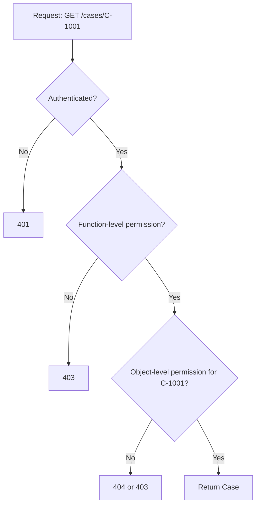

# Part 018 — Object-Level Authorization: The Core of Secure APIs

If you remember only one practical rule from this series, remember this:

```text
Every time a request selects an object, the server must prove that the caller is allowed to act on that object.
```

That is object-level authorization.

It is the difference between:

```text
The user is authenticated.
```

and:

```text
The user may read this exact case, update this exact order, download this exact evidence file, approve this exact workflow task, or export this exact report result.
```

OWASP API Security 2023 ranks Broken Object Level Authorization as API1. The core attack is simple: the attacker changes an object identifier in path, query, header, or body and accesses another user's object.

In enterprise Java systems, object-level authorization is not a small feature. It is the main wall between normal use and data breach.

---

## 1. The Basic BOLA / IDOR Shape

A vulnerable endpoint:

```http
GET /api/cases/CASE-1001
Authorization: Bearer token-of-user-a
```

Attacker changes the ID:

```http
GET /api/cases/CASE-1002
Authorization: Bearer token-of-user-a
```

Weak implementation:

```java
@GetMapping("/api/cases/{caseId}")
public CaseDto getCase(@PathVariable String caseId) {
    return caseRepository.findById(caseId)
            .map(CaseDto::from)
            .orElseThrow(NotFoundException::new);
}
```

This checks only that the case exists.

It does not check that the caller may access it.

A slightly better but still incomplete version:

```java
@PreAuthorize("hasRole('CASE_OFFICER')")
@GetMapping("/api/cases/{caseId}")
public CaseDto getCase(@PathVariable String caseId) {
    return caseRepository.findById(caseId)
            .map(CaseDto::from)
            .orElseThrow(NotFoundException::new);
}
```

This checks that the caller is some kind of case officer.

It still does not check that the caller may access **this** case.

Correct direction:

```java
@GetMapping("/api/cases/{caseId}")
public CaseDto getCase(Principal principal, @PathVariable CaseId caseId) {
    CaseRecord caseRecord = caseRepository.findVisibleCase(
            principal.subjectId(),
            principal.tenantId(),
            caseId
    ).orElseThrow(NotFoundException::new);

    return CaseDto.from(caseRecord);
}
```

Or:

```java
@GetMapping("/api/cases/{caseId}")
public CaseDto getCase(Principal principal, @PathVariable CaseId caseId) {
    CaseRecord caseRecord = caseRepository.findById(caseId)
            .orElseThrow(NotFoundException::new);

    authorizationService.authorize(
            AuthorizationRequest.builder()
                    .subject(SubjectRef.user(principal.subjectId()))
                    .action("case.view")
                    .resource(ResourceRef.of("case", caseId.value()))
                    .tenantId(caseRecord.tenantId())
                    .context("assignee", caseRecord.assignedOfficerId())
                    .context("classification", caseRecord.classification())
                    .context("state", caseRecord.state())
                    .build()
    ).requirePermit();

    return CaseDto.from(caseRecord);
}
```

Which one is better depends on the operation. We will distinguish the patterns carefully.

---

## 2. Object Identifiers Hide Everywhere

Do not check only path parameters.

Object IDs appear in many places.

| Location | Example |
|---|---|
| Path | `/api/cases/{caseId}` |
| Query | `/api/evidence?caseId=CASE-1001` |
| Header | `X-Case-Id: CASE-1001` |
| Request body | `{ "caseId": "CASE-1001" }` |
| Nested body | `{ "items": [{ "evidenceId": "E-1" }] }` |
| Batch body | `{ "caseIds": ["C-1", "C-2"] }` |
| File path/key | `s3://bucket/tenant-a/cases/C-1/evidence/E-1.pdf` |
| Cursor/token | `nextPageToken` that encodes last object state |
| GraphQL global ID | `Q2FzZTpDLTEwMDE=` |
| Event payload | `{ "caseId": "C-1", "command": "APPROVE" }` |
| WebSocket message | `{ "subscribeToCase": "C-1" }` |

A production review should ask:

```text
Where can a caller supply, influence, or infer an object reference?
```

Every answer is an authorization boundary.

---

## 3. Object-Level Authorization Is Not Endpoint-Level Authorization

Endpoint-level authorization asks:

```text
Can this subject call this function?
```

Object-level authorization asks:

```text
Can this subject call this function on this resource instance?
```

Example:

```text
case.view          -> endpoint/function permission
case.view:C-1001   -> object-level decision
```

An endpoint-level permission is necessary but not sufficient.



In most secure APIs:

```text
Authentication admits the caller.
Function authorization admits the operation class.
Object authorization admits the resource instance.
Field authorization shapes what can be seen or changed.
```

---

## 4. The Object-Level Decision Shape

A complete object-level decision needs these inputs:

```text
subject + action + resource + context
```

Example:

```json
{
  "subject": {
    "id": "user-123",
    "type": "USER",
    "tenantId": "tenant-a",
    "roles": ["case_officer"],
    "clearance": "CONFIDENTIAL"
  },
  "action": "case.update",
  "resource": {
    "type": "case",
    "id": "case-789",
    "tenantId": "tenant-a",
    "state": "INVESTIGATION",
    "classification": "INTERNAL",
    "assignedOfficerId": "user-123",
    "jurisdiction": "ID-JK"
  },
  "context": {
    "requestTime": "2026-07-03T10:00:00Z",
    "channel": "WEB",
    "purpose": "case_management"
  }
}
```

The decision may be:

```json
{
  "effect": "PERMIT",
  "reasonCode": "assigned_officer_with_clearance",
  "policyVersion": "2026-07-03.4",
  "obligations": ["audit_case_access"],
  "cacheable": true,
  "maxAgeSeconds": 30
}
```

---

## 5. Two Core Implementation Patterns

There are two common patterns.

### Pattern A: Load Then Authorize

```text
1. Load object by ID.
2. Evaluate authorization against loaded object.
3. Return/modify object only if permitted.
```

Java:

```java
public CaseDto getCase(Principal principal, CaseId caseId) {
    CaseRecord caseRecord = caseRepository.findById(caseId)
            .orElseThrow(NotFoundException::new);

    authorizationService.authorize(
            AuthorizationRequest.forObject(
                    principal.subjectId(),
                    "case.view",
                    "case",
                    caseId.value(),
                    Map.of(
                            "tenantId", caseRecord.tenantId(),
                            "assignedOfficerId", caseRecord.assignedOfficerId(),
                            "classification", caseRecord.classification(),
                            "state", caseRecord.state()
                    )
            )
    ).requirePermit();

    return CaseDto.from(caseRecord);
}
```

Pros:

- simple,
- expressive,
- works for rich ABAC,
- easy to audit,
- works when policy needs many resource attributes.

Cons:

- object existence may be observable,
- easy to forget authorization after load,
- list/search cannot use this naively,
- may load sensitive data before authorization,
- race conditions if object changes before write.

Good for:

- command operations with transaction/recheck,
- rich policy decisions,
- internal APIs with controlled existence handling,
- actions requiring domain state.

### Pattern B: Scoped Load / Authorize by Construction

```text
1. Construct query that includes authorization predicate.
2. Load only objects visible to subject.
3. If no row, return not found.
```

Java:

```java
public Optional<CaseRecord> findVisibleCase(String subjectId, String tenantId, CaseId caseId) {
    return jdbc.query("""
            SELECT c.*
            FROM case_record c
            JOIN case_assignment a ON a.case_id = c.id
            WHERE c.id = :caseId
              AND c.tenant_id = :tenantId
              AND a.subject_id = :subjectId
              AND c.deleted = false
            """, params(subjectId, tenantId, caseId));
}
```

Pros:

- prevents object leakage by construction,
- good for reads,
- good for list/search,
- handles 404 camouflage naturally,
- efficient if indexes are correct.

Cons:

- complex policies become complex SQL,
- hard to centralize reason codes,
- harder to audit detailed deny reasons,
- risks duplicated predicates,
- may not handle ABAC/ReBAC without support layer.

Good for:

- read-by-id,
- list/search,
- exports,
- repository-level tenant isolation,
- simple ownership/assignment/jurisdiction checks.

### The Practical Answer

Use both.

```text
For read/list/search:
  Prefer scoped query.

For state-changing commands:
  Load current object inside transaction, authorize, then mutate with version/state guard.

For sensitive downloads:
  Scoped lookup + explicit decision audit.

For complex policies:
  Use PDP/guard service to produce query scope or decision.
```

---

## 6. The Resource Binding Rule

Every object-level check must bind the user-supplied ID to trusted resource attributes.

Bad:

```java
boolean allowed = principal.tenantId().equals(request.getTenantId());
```

The tenant ID came from the request.

Better:

```java
CaseRecord caseRecord = caseRepository.findById(caseId).orElseThrow(NotFoundException::new);
boolean allowed = principal.tenantId().equals(caseRecord.tenantId());
```

Best for read paths:

```sql
SELECT *
FROM case_record
WHERE id = :caseId
  AND tenant_id = :principalTenantId;
```

The invariant:

```text
Never authorize against caller-supplied resource attributes when those attributes can be loaded from the server-owned resource.
```

Request body may say:

```json
{
  "caseId": "C-1",
  "tenantId": "tenant-a",
  "assignedOfficerId": "user-123"
}
```

Only `caseId` is a reference. The server must load tenant and assignment from trusted storage.

---

## 7. 403 vs 404: Existence Disclosure Strategy

When object authorization fails, should the API return `403 Forbidden` or `404 Not Found`?

There is no universal answer.

Use a deliberate strategy.

| Situation | Common Response |
|---|---|
| Caller is unauthenticated | `401 Unauthorized` |
| Caller authenticated but function not allowed | `403 Forbidden` |
| Object should not be discoverable | `404 Not Found` camouflage |
| Object exists and user knows it but action denied | `403 Forbidden` |
| Admin/reporting tool with audit need | `403` with safe reason code |
| Public object absent | `404` |

For multi-tenant and sensitive object references, use `404` for unauthorized object IDs when existence itself is sensitive.

Example:

```java
public CaseDto getCase(Principal principal, CaseId caseId) {
    return caseRepository.findVisibleCase(principal.subjectId(), principal.tenantId(), caseId)
            .map(CaseDto::from)
            .orElseThrow(NotFoundException::new);
}
```

But internally audit the real reason when possible:

```text
external_response = 404
internal_decision = DENY
reason = case_not_visible_to_subject
```

Do not leak:

```json
{
  "error": "case exists but belongs to tenant-b"
}
```

---

## 8. Object-Level Authorization for CRUD

CRUD is not one permission.

Each operation has different risk and different resource state requirements.

### 8.1 Create

Create does not always have an existing object.

But it usually has a parent or target context.

Examples:

```http
POST /api/cases
POST /api/cases/{caseId}/evidence
POST /api/organizations/{orgId}/users
```

For create, authorize against:

- parent resource,
- target tenant,
- target organization,
- requested classification,
- requested owner,
- requested initial state,
- quota/license/entitlement,
- separation-of-duty constraints.

Bad:

```java
@PostMapping("/api/cases/{caseId}/evidence")
public EvidenceDto upload(@PathVariable String caseId, MultipartFile file) {
    return evidenceService.store(caseId, file);
}
```

Better:

```java
public EvidenceDto uploadEvidence(Principal principal, CaseId caseId, MultipartFile file) {
    CaseRecord caseRecord = caseRepository.findById(caseId)
            .orElseThrow(NotFoundException::new);

    authorizationService.authorize(
            AuthorizationRequest.builder()
                    .subject(SubjectRef.user(principal.subjectId()))
                    .action("evidence.create")
                    .resource(ResourceRef.of("case", caseId.value()))
                    .tenantId(caseRecord.tenantId())
                    .context("caseState", caseRecord.state())
                    .context("caseClassification", caseRecord.classification())
                    .context("assignedOfficerId", caseRecord.assignedOfficerId())
                    .context("fileClassification", classify(file))
                    .build()
    ).requirePermit();

    return evidenceService.store(caseRecord, file);
}
```

### 8.2 Read

Read requires visibility.

```text
Can subject see this object at all?
Which fields may subject see?
Should access be audited?
```

Read often needs scoped query plus field-level redaction.

### 8.3 Update

Update requires:

- object visibility,
- action permission,
- field-level write permission,
- current state permission,
- optimistic lock/version,
- patch validation,
- invariant checks.

```java
public CaseDto patchCase(Principal principal, CaseId caseId, JsonMergePatch patch) {
    CaseRecord caseRecord = caseRepository.findForUpdate(caseId)
            .orElseThrow(NotFoundException::new);

    Set<String> changedFields = patchAnalyzer.changedFields(patch);

    authorizationService.authorize(
            AuthorizationRequest.builder()
                    .subject(SubjectRef.user(principal.subjectId()))
                    .action("case.patch")
                    .resource(ResourceRef.of("case", caseId.value()))
                    .tenantId(caseRecord.tenantId())
                    .context("state", caseRecord.state())
                    .context("changedFields", changedFields)
                    .context("classification", caseRecord.classification())
                    .build()
    ).requirePermit();

    fieldAuthorizationService.requireWritableFields(principal, caseRecord, changedFields);

    caseRecord.apply(patch);
    return CaseDto.from(caseRepository.save(caseRecord));
}
```

### 8.4 Delete

Delete often has special constraints:

- legal hold,
- retention policy,
- ownership,
- soft delete vs hard delete,
- audit preservation,
- cascading access impact.

Never treat delete as just another update.

---

## 9. Object-Level Authorization for Action Endpoints

Real APIs are not only CRUD.

They have action endpoints:

```http
POST /api/cases/{caseId}/submit
POST /api/cases/{caseId}/approve
POST /api/cases/{caseId}/reject
POST /api/cases/{caseId}/assign
POST /api/cases/{caseId}/escalate
POST /api/cases/{caseId}/close
POST /api/cases/{caseId}/reopen
```

Each action has distinct authorization semantics.

```text
case.submit:
  subject must be creator or assigned officer
  case state must be DRAFT

case.approve:
  subject must be approver
  subject must not be creator
  case state must be REVIEW_PENDING
  subject clearance must cover classification

case.assign:
  subject must be supervisor in same jurisdiction
  target assignee must be eligible

case.close:
  subject must be assigned officer or supervisor
  all mandatory evidence must be present
  no unresolved legal hold
```

Implementation should reflect action semantics explicitly.

```java
public void approveCase(Principal principal, CaseId caseId, ApproveCaseCommand command) {
    CaseRecord caseRecord = caseRepository.findForUpdate(caseId)
            .orElseThrow(NotFoundException::new);

    AuthorizationDecision decision = authorizationService.authorize(
            AuthorizationRequest.builder()
                    .subject(SubjectRef.user(principal.subjectId()))
                    .action("case.approve")
                    .resource(ResourceRef.of("case", caseId.value()))
                    .tenantId(caseRecord.tenantId())
                    .context("state", caseRecord.state())
                    .context("createdBy", caseRecord.createdBy())
                    .context("classification", caseRecord.classification())
                    .context("jurisdiction", caseRecord.jurisdiction())
                    .freshnessRequirement(FreshnessRequirement.TRANSACTIONAL)
                    .build()
    );

    decision.requirePermit();
    caseRecord.approve(principal.subjectId(), command.reason());
}
```

Do not model all actions as `case.update`.

That destroys policy clarity.

---

## 10. Query Scoping: Object-Level Authorization for Lists

List endpoints are object-level authorization problems at scale.

```http
GET /api/cases?status=OPEN&page=1
```

The question is not:

```text
Can the user call search?
```

The question is:

```text
Which matching objects may the user see?
```

Bad:

```java
public Page<CaseDto> searchCases(SearchRequest request) {
    return caseRepository.search(request).map(CaseDto::from);
}
```

Better:

```java
public Page<CaseDto> searchCases(Principal principal, CaseSearchRequest request) {
    CaseQueryScope scope = authorizationService.queryScope(
            QueryScopeRequest.builder()
                    .subjectId(principal.subjectId())
                    .tenantId(principal.tenantId())
                    .resourceType("case")
                    .action("case.view")
                    .build()
    );

    return caseRepository.search(request, scope).map(CaseDto::from);
}
```

Query scope:

```java
public record CaseQueryScope(
        String tenantId,
        Set<String> allowedJurisdictions,
        Optional<String> assignedOfficerId,
        Classification maxClassification,
        boolean includeClosedCases
) {}
```

SQL:

```sql
SELECT c.*
FROM case_record c
WHERE c.tenant_id = :tenantId
  AND c.jurisdiction IN (:allowedJurisdictions)
  AND c.classification_rank <= :maxClassificationRank
  AND (:assignedOfficerId IS NULL OR c.assigned_officer_id = :assignedOfficerId)
  AND (:includeClosedCases = true OR c.state <> 'CLOSED')
ORDER BY c.updated_at DESC, c.id DESC
LIMIT :limit OFFSET :offset;
```

Critical invariant:

```text
Authorization predicate must be applied before pagination, aggregation, sorting leak, and export.
```

Bad flow:

```text
1. Query all records.
2. Paginate.
3. Filter unauthorized objects in memory.
```

This causes:

- empty pages,
- count leakage,
- timing leakage,
- accidental data exposure,
- poor performance,
- export bypass.

Correct flow:

```text
1. Build authorization scope.
2. Apply authorization predicate in query.
3. Apply business filters.
4. Sort/paginate.
5. Redact fields.
6. Return result.
```

---

## 11. Repository Patterns in Java

### 11.1 Explicit Scoped Repository Method

```java
public interface CaseRepository {
    Optional<CaseRecord> findVisibleById(SubjectRef subject, TenantId tenantId, CaseId caseId);

    Page<CaseRecord> searchVisible(SubjectRef subject, TenantId tenantId, CaseSearchCriteria criteria, Pageable pageable);
}
```

Pros:

- hard to forget scope,
- easy to review,
- aligns with business language.

Cons:

- many methods,
- can duplicate scope logic.

### 11.2 Scope Object

```java
public interface CaseRepository {
    Optional<CaseRecord> findById(CaseId caseId, CaseQueryScope scope);

    Page<CaseRecord> search(CaseSearchCriteria criteria, CaseQueryScope scope, Pageable pageable);
}
```

Pros:

- reusable scope,
- testable,
- works across read/list/export.

Cons:

- repository must never accept `null` or unrestricted scope by accident.

Make unrestricted scope explicit:

```java
sealed interface CaseQueryScope permits RestrictedCaseScope, SystemCaseScope {}

public record RestrictedCaseScope(
        TenantId tenantId,
        Set<Jurisdiction> jurisdictions,
        Optional<SubjectId> assignedOfficer,
        Classification maxClassification
) implements CaseQueryScope {}

public record SystemCaseScope(
        String reason,
        SubjectId serviceAccount
) implements CaseQueryScope {}
```

Do not use:

```java
CaseQueryScope unrestricted = null;
```

### 11.3 JPA Specification

```java
public final class CaseSpecifications {
    public static Specification<CaseEntity> visibleTo(CaseQueryScope scope) {
        return (root, query, cb) -> {
            List<Predicate> predicates = new ArrayList<>();

            predicates.add(cb.equal(root.get("tenantId"), scope.tenantId().value()));
            predicates.add(root.get("jurisdiction").in(scope.allowedJurisdictions()));
            predicates.add(cb.lessThanOrEqualTo(
                    root.get("classificationRank"),
                    scope.maxClassification().rank()
            ));

            scope.assignedOfficerId().ifPresent(subjectId ->
                    predicates.add(cb.equal(root.get("assignedOfficerId"), subjectId.value()))
            );

            return cb.and(predicates.toArray(Predicate[]::new));
        };
    }
}
```

Usage:

```java
Specification<CaseEntity> spec = Specification
        .where(CaseSpecifications.visibleTo(scope))
        .and(CaseSpecifications.matches(criteria));

return caseJpaRepository.findAll(spec, pageable);
```

### 11.4 MyBatis Dynamic SQL Shape

```xml
<select id="searchVisibleCases" resultMap="CaseRecordMap">
  SELECT c.*
  FROM case_record c
  WHERE c.tenant_id = #{scope.tenantId}
    AND c.jurisdiction IN
    <foreach item="j" collection="scope.allowedJurisdictions" open="(" separator="," close=")">
      #{j}
    </foreach>
    AND c.classification_rank &lt;= #{scope.maxClassificationRank}
    <if test="scope.assignedOfficerId != null">
      AND c.assigned_officer_id = #{scope.assignedOfficerId}
    </if>
    <if test="criteria.status != null">
      AND c.status = #{criteria.status}
    </if>
  ORDER BY c.updated_at DESC, c.id DESC
  LIMIT #{page.limit}
  OFFSET #{page.offset}
</select>
```

Make authorization scope mandatory in mapper signatures.

---

## 12. Batch and Bulk Object Authorization

Batch endpoints are dangerous because they compress many object decisions into one call.

```http
POST /api/cases/bulk-close
Content-Type: application/json

{
  "caseIds": ["C-1", "C-2", "C-3"]
}
```

Bad:

```java
caseRepository.closeAll(request.caseIds());
```

Correct options:

### Option A: All-or-Nothing

If any object is unauthorized, deny the whole operation.

```java
public BulkResult closeCases(Principal principal, List<CaseId> caseIds) {
    List<CaseRecord> visibleCases = caseRepository.findClosableCases(
            principal.subjectId(),
            principal.tenantId(),
            caseIds
    );

    if (visibleCases.size() != caseIds.size()) {
        throw new AccessDeniedException("one_or_more_cases_not_closable");
    }

    caseRepository.closeAll(visibleCases);
    return BulkResult.success(caseIds);
}
```

Pros:

- simpler consistency,
- avoids partial side effects.

Cons:

- less user-friendly.

### Option B: Per-Item Result

Evaluate each object and return per-item status.

```json
{
  "results": [
    { "caseId": "C-1", "status": "CLOSED" },
    { "caseId": "C-2", "status": "DENIED", "reason": "not_assigned" },
    { "caseId": "C-3", "status": "NOT_FOUND" }
  ]
}
```

Pros:

- better UX,
- useful for admin tools.

Cons:

- may leak existence,
- requires careful reason shaping,
- more complex audit.

Use camouflage for sensitive external APIs.

### Batch Invariant

```text
No batch operation may succeed on an object that would fail the equivalent single-object operation.
```

Test this directly.

---

## 13. Attachment, File, and Export Authorization

Files are often where object-level authorization fails.

Bad:

```http
GET /api/files/evidence-123.pdf
```

Weak code:

```java
public ResponseEntity<Resource> download(String fileId) {
    FileRecord file = fileRepository.findById(fileId).orElseThrow(NotFoundException::new);
    return storage.download(file.storageKey());
}
```

Correct:

```java
public DownloadResponse downloadEvidence(Principal principal, EvidenceId evidenceId) {
    EvidenceRecord evidence = evidenceRepository.findById(evidenceId)
            .orElseThrow(NotFoundException::new);

    CaseRecord caseRecord = caseRepository.findById(evidence.caseId())
            .orElseThrow(NotFoundException::new);

    authorizationService.authorize(
            AuthorizationRequest.builder()
                    .subject(SubjectRef.user(principal.subjectId()))
                    .action("evidence.download")
                    .resource(ResourceRef.of("evidence", evidenceId.value()))
                    .tenantId(caseRecord.tenantId())
                    .context("caseId", caseRecord.id())
                    .context("caseClassification", caseRecord.classification())
                    .context("evidenceClassification", evidence.classification())
                    .context("legalHold", caseRecord.legalHold())
                    .build()
    ).requirePermit();

    audit.recordEvidenceDownload(principal.subjectId(), evidenceId, caseRecord.id());
    return storage.download(evidence.storageKey());
}
```

Do not authorize only the file row. Often the file inherits authorization from parent object.

### Pre-Signed URL Warning

If you issue pre-signed URLs, authorization happens before URL creation.

But the URL may remain usable until expiry.

Therefore:

- keep URL TTL short,
- bind URL to content disposition if needed,
- avoid pre-signed URLs for highly sensitive content unless compensating controls exist,
- audit URL issuance,
- consider proxy download for revocation-sensitive content.

---

## 14. Nested Resource Authorization

Nested routes can create false confidence.

```http
GET /api/cases/C-1/evidence/E-9
```

Bad implementation:

```java
Evidence evidence = evidenceRepository.findById(evidenceId).orElseThrow(NotFoundException::new);
return EvidenceDto.from(evidence);
```

This ignores whether `E-9` belongs to `C-1`.

Correct scoped query:

```sql
SELECT e.*
FROM evidence e
JOIN case_record c ON c.id = e.case_id
WHERE c.id = :caseId
  AND e.id = :evidenceId
  AND c.tenant_id = :tenantId
  AND EXISTS (
      SELECT 1
      FROM case_assignment a
      WHERE a.case_id = c.id
        AND a.subject_id = :subjectId
  );
```

Invariant:

```text
Nested child IDs must be bound to their parent IDs and authorized parent context.
```

Do not allow:

```text
/cases/C-1/evidence/E-9
```

where `E-9` actually belongs to `C-2`.

---

## 15. Mass Assignment and Object-Level Authorization

Object-level authorization also applies to references inside update payloads.

Example payload:

```json
{
  "title": "Updated case",
  "assignedOfficerId": "user-999",
  "tenantId": "tenant-b",
  "classification": "PUBLIC"
}
```

If the API blindly maps JSON to entity, attacker may:

- change ownership,
- change tenant,
- downgrade classification,
- assign object to themselves,
- bypass workflow.

Bad:

```java
objectMapper.updateValue(caseEntity, patchDto);
caseRepository.save(caseEntity);
```

Better:

```java
Set<String> changedFields = patchAnalyzer.changedFields(patchDto);
fieldAuthorizationService.requireWritableFields(principal, caseRecord, changedFields);

if (changedFields.contains("assignedOfficerId")) {
    authorizationService.authorize(action("case.assign", caseRecord, principal))
            .requirePermit();
}

if (changedFields.contains("classification")) {
    authorizationService.authorize(action("case.reclassify", caseRecord, principal))
            .requirePermit();
}
```

Some fields should never be client-writable:

```text
id
tenantId
createdBy
createdAt
approvedBy
approvedAt
authzVersion
legalHold
systemClassification
```

Make this executable.

---

## 16. Object-Level Authorization in Event-Driven Flows

Events and workers can bypass API authorization if not designed carefully.

Example:

```json
{
  "commandType": "CloseCase",
  "caseId": "C-1",
  "requestedBy": "user-123"
}
```

A worker consumes it later.

Questions:

```text
Was the command authorized before publication?
Does the worker trust that authorization?
Should the worker recheck at execution time?
What if the case was reassigned after command publication?
What if the user's access was revoked?
```

Pattern:

```text
For low-risk async command:
  authorize before enqueue + include decision evidence.

For high-risk async command:
  authorize before enqueue + recheck before execution.

For delayed/scheduled command:
  always recheck before execution.
```

Command envelope:

```java
public record AuthorizedCommandEnvelope<T>(
        String commandId,
        String requestedBy,
        String action,
        String resourceType,
        String resourceId,
        String tenantId,
        String authorizationDecisionId,
        String policyVersion,
        Instant authorizedAt,
        T payload
) {}
```

Worker:

```java
public void handle(AuthorizedCommandEnvelope<CloseCaseCommand> envelope) {
    CaseRecord caseRecord = caseRepository.findForUpdate(new CaseId(envelope.resourceId()))
            .orElseThrow(NotFoundException::new);

    authorizationService.authorize(
            AuthorizationRequest.builder()
                    .subject(SubjectRef.user(envelope.requestedBy()))
                    .action("case.close")
                    .resource(ResourceRef.of("case", envelope.resourceId()))
                    .tenantId(caseRecord.tenantId())
                    .context("state", caseRecord.state())
                    .context("assignedOfficerId", caseRecord.assignedOfficerId())
                    .freshnessRequirement(FreshnessRequirement.TRANSACTIONAL)
                    .build()
    ).requirePermit();

    caseRecord.close(envelope.payload().reason());
}
```

---

## 17. Object-Level Authorization for Admin Tools

Admin does not mean unrestricted.

Admin actions are often more dangerous because they cross normal boundaries.

Admin object-level checks should include:

- admin's tenant or support scope,
- reason/purpose,
- ticket/reference ID,
- break-glass session,
- supervisor approval,
- sensitive field restrictions,
- customer/data residency boundary,
- audit obligation,
- rate limit.

Example:

```java
authorizationService.authorize(
        AuthorizationRequest.builder()
                .subject(SubjectRef.user(admin.subjectId()))
                .action("case.admin.view")
                .resource(ResourceRef.of("case", caseId.value()))
                .tenantId(caseRecord.tenantId())
                .context("supportTicketId", request.supportTicketId())
                .context("breakGlass", admin.breakGlassActive())
                .context("purpose", request.purpose())
                .context("classification", caseRecord.classification())
                .build()
).requirePermit();
```

Anti-pattern:

```java
if (user.isAdmin()) return caseRepository.findById(caseId);
```

This creates invisible superpowers.

---

## 18. Testing Object-Level Authorization

Object-level authorization must be tested as an attack surface, not just as business logic.

### 18.1 ID Swap Test

```java
@Test
void userCannotReadAnotherUsersCaseByChangingId() {
    Principal alice = principal("alice", "tenant-a");
    CaseRecord aliceCase = caseOwnedBy("C-1", "alice", "tenant-a");
    CaseRecord bobCase = caseOwnedBy("C-2", "bob", "tenant-a");

    caseRepository.save(aliceCase);
    caseRepository.save(bobCase);

    assertThat(api.getCase(alice, new CaseId("C-1"))).isNotNull();
    assertThatThrownBy(() -> api.getCase(alice, new CaseId("C-2")))
            .isInstanceOf(NotFoundException.class);
}
```

### 18.2 Cross-Tenant Test

```java
@Test
void userCannotReadCaseFromAnotherTenantEvenWithKnownId() {
    Principal user = principal("user-123", "tenant-a");
    caseRepository.save(caseInTenant("C-999", "tenant-b"));

    assertThatThrownBy(() -> api.getCase(user, new CaseId("C-999")))
            .isInstanceOf(NotFoundException.class);
}
```

### 18.3 Function Permission Is Not Enough

```java
@Test
void roleDoesNotGrantAccessToUnassignedCase() {
    Principal officer = principalWithRole("officer-1", "tenant-a", "CASE_OFFICER");
    caseRepository.save(caseAssignedTo("C-1", "officer-2"));

    AuthorizationDecision decision = authorizationService.authorize(
            request(officer, "case.update", "C-1")
    );

    assertThat(decision.effect()).isEqualTo(DecisionEffect.DENY);
}
```

### 18.4 List Endpoint Test

```java
@Test
void searchReturnsOnlyVisibleCasesAndAppliesScopeBeforePagination() {
    Principal officer = principal("officer-1", "tenant-a");

    caseRepository.save(caseAssignedTo("C-1", "officer-1"));
    caseRepository.save(caseAssignedTo("C-2", "officer-2"));
    caseRepository.save(caseInTenant("C-3", "tenant-b"));

    Page<CaseDto> result = api.searchCases(officer, searchRequest(), PageRequest.of(0, 10));

    assertThat(result.items()).extracting(CaseDto::id).containsExactly("C-1");
    assertThat(result.totalElements()).isEqualTo(1);
}
```

### 18.5 Batch Equivalence Test

```java
@Test
void bulkCloseCannotCloseObjectsDeniedBySingleClosePolicy() {
    Principal officer = principal("officer-1", "tenant-a");

    CaseId allowed = new CaseId("C-1");
    CaseId denied = new CaseId("C-2");

    assertThat(api.canClose(officer, allowed)).isTrue();
    assertThat(api.canClose(officer, denied)).isFalse();

    assertThatThrownBy(() -> api.bulkClose(officer, List.of(allowed, denied)))
            .isInstanceOf(AccessDeniedException.class);
}
```

### 18.6 Property-Based ID Swap

Generate many users/resources and assert non-owners cannot access.

```java
@Property
void subjectCanOnlyAccessCasesInsideVisibleSet(@ForAll("subjects") Principal subject,
                                               @ForAll("cases") CaseRecord caseRecord) {
    boolean expectedVisible = visibilityOracle.isVisible(subject, caseRecord);

    Try<CaseDto> result = Try.of(() -> api.getCase(subject, caseRecord.id()));

    assertThat(result.isSuccess()).isEqualTo(expectedVisible);
}
```

---

## 19. Object-Level Authorization Review Checklist

Use this for API review.

### Endpoint Shape

- Does endpoint accept object ID in path/query/header/body?
- Does endpoint accept nested object IDs?
- Does endpoint process batch object IDs?
- Does endpoint use cursor/page token containing object state?
- Does endpoint expose file/download/pre-signed URL?
- Does endpoint trigger async work on object ID?

### Binding

- Is object loaded from trusted storage?
- Are caller-supplied resource attributes ignored or validated against stored resource?
- Is tenant ID taken from resource, not request body?
- Is parent-child relationship validated?
- Is object state current for state-changing operations?

### Authorization

- Is there function-level permission?
- Is there object-level permission?
- Is there field-level permission if response/update contains sensitive fields?
- Does authorization include tenant, ownership, assignment, jurisdiction, classification, state?
- Are admin/support flows explicitly constrained?

### Query/List

- Is authorization predicate applied in database query?
- Is it applied before pagination/count/export?
- Are counts and aggregation scoped?
- Are sorting fields safe?
- Are filters prevented from crossing tenant/visibility boundaries?

### Batch

- Is every item authorized?
- Is all-or-nothing vs partial success explicit?
- Are unauthorized items hidden or explained safely?
- Is audit per item?

### Error Handling

- Is `401` used for unauthenticated?
- Is `403` used for function-level denial where appropriate?
- Is `404` camouflage used for sensitive object existence?
- Are reason codes safe externally and detailed internally?

### Testing

- Are ID swap tests present?
- Are cross-tenant tests present?
- Are list/pagination scope tests present?
- Are nested resource binding tests present?
- Are batch equivalence tests present?
- Are stale assignment/state tests present?

---

## 20. Common Anti-Patterns

### Anti-Pattern 1: Role Check Without Resource Binding

```java
@PreAuthorize("hasRole('MANAGER')")
public EmployeeDto getEmployee(String employeeId) { ... }
```

A manager of one department may not be allowed to view every employee.

### Anti-Pattern 2: Tenant from Request Body

```java
if (principal.tenantId().equals(request.tenantId())) permit;
```

The attacker controls `request.tenantId`.

### Anti-Pattern 3: Filter After Fetch

```java
List<CaseRecord> cases = caseRepository.search(criteria);
return cases.stream().filter(c -> canSee(user, c)).toList();
```

This leaks count/performance, breaks pagination, and risks accidental exposure.

### Anti-Pattern 4: Admin Bypass

```java
if (user.isAdmin()) return true;
```

Admin should mean policy-constrained authority, not magic.

### Anti-Pattern 5: UUID as Authorization

```text
IDs are random, so nobody can guess them.
```

Unpredictable IDs reduce guessing. They do not replace authorization.

### Anti-Pattern 6: UI-Hidden Button

```text
The user cannot see the approve button, so they cannot approve.
```

Attackers call APIs directly.

### Anti-Pattern 7: Object-Level Check Only on GET

```text
GET is protected, PATCH/DELETE/POST action endpoints are not.
```

State-changing endpoints are often more important.

### Anti-Pattern 8: Search Endpoint Forgotten

```text
GET /cases/{id} is protected, but GET /cases?query=... returns everything.
```

Search is usually the largest data exfiltration path.

---

## 21. Production Case Study: Regulatory Case Access

Domain:

```text
Case
  - tenantId
  - jurisdiction
  - assignedOfficerId
  - supervisorUnitId
  - classification
  - state
  - legalHold
  - createdBy
  - subjectEntityId
```

Rules:

```text
Officer can view case when:
  - same tenant,
  - case is in officer jurisdiction,
  - officer is assigned OR officer belongs to supervising unit,
  - officer clearance >= case classification,
  - case is not sealed OR officer has sealed-case permission.

Officer can approve recommendation when:
  - can view case,
  - action = case.approve,
  - case state = REVIEW_PENDING,
  - officer is not creator,
  - officer has approver role in tenant,
  - no separation-of-duty conflict,
  - no legal hold blocking approval.
```

Authorization scope for search:

```java
public record RegulatoryCaseScope(
        TenantId tenantId,
        Set<Jurisdiction> jurisdictions,
        Optional<SubjectId> assignedOfficerId,
        Set<UnitId> supervisorUnits,
        Classification maxClassification,
        boolean canViewSealed
) {}
```

SQL shape:

```sql
SELECT c.*
FROM regulatory_case c
WHERE c.tenant_id = :tenantId
  AND c.jurisdiction IN (:jurisdictions)
  AND c.classification_rank <= :maxClassificationRank
  AND (
      c.assigned_officer_id = :subjectId
      OR c.supervisor_unit_id IN (:supervisorUnits)
  )
  AND (:canViewSealed = true OR c.sealed = false)
ORDER BY c.updated_at DESC, c.id DESC
LIMIT :limit OFFSET :offset;
```

Approval check:

```java
public void approveRecommendation(Principal principal, CaseId caseId, ApprovalCommand command) {
    RegulatoryCase c = caseRepository.findForUpdate(caseId)
            .orElseThrow(NotFoundException::new);

    AuthorizationDecision decision = authorizationService.authorize(
            AuthorizationRequest.builder()
                    .subject(SubjectRef.user(principal.subjectId()))
                    .action("case.recommendation.approve")
                    .resource(ResourceRef.of("regulatory_case", c.id().value()))
                    .tenantId(c.tenantId())
                    .context("jurisdiction", c.jurisdiction())
                    .context("assignedOfficerId", c.assignedOfficerId())
                    .context("supervisorUnitId", c.supervisorUnitId())
                    .context("classification", c.classification())
                    .context("state", c.state())
                    .context("createdBy", c.createdBy())
                    .context("legalHold", c.legalHold())
                    .context("sealed", c.sealed())
                    .freshnessRequirement(FreshnessRequirement.TRANSACTIONAL)
                    .build()
    );

    decision.requirePermit();
    c.approveRecommendation(principal.subjectId(), command.reason());
}
```

This is object-level authorization plus domain-state authorization.

---

## 22. Mental Model to Carry Forward

Object-level authorization is the discipline of binding every operation to the exact resource instance being touched.

The safe question is never:

```text
Does this user have role X?
```

The safe question is:

```text
Can this subject perform this action on this resource instance under this context right now?
```

For Java systems, that usually means:

```text
1. Authenticate caller.
2. Authorize endpoint/function class.
3. Bind object ID to server-owned resource attributes.
4. Evaluate object-level policy.
5. Apply query scoping for lists/search/export.
6. Apply field-level authorization for sensitive fields.
7. Recheck inside transactions for state changes.
8. Audit the decision.
```

The next part builds on this with **query scoping** as a first-class implementation pattern: authorizing reads by construction instead of hoping every caller remembers to filter correctly.

---

## References

- OWASP API Security 2023 — API1 Broken Object Level Authorization: https://owasp.org/API-Security/editions/2023/en/0xa1-broken-object-level-authorization/
- OWASP API Security Project — API Top 10 2023 overview: https://owasp.org/www-project-api-security/
- OWASP Authorization Cheat Sheet — validate permissions on every request and prefer centralized authorization mechanisms: https://cheatsheetseries.owasp.org/cheatsheets/Authorization_Cheat_Sheet.html
- Spring Security Authorization Architecture: https://docs.spring.io/spring-security/reference/servlet/authorization/architecture.html
- Spring Security AuthorizationManager API: https://docs.spring.io/spring-security/reference/api/java/org/springframework/security/authorization/AuthorizationManager.html
