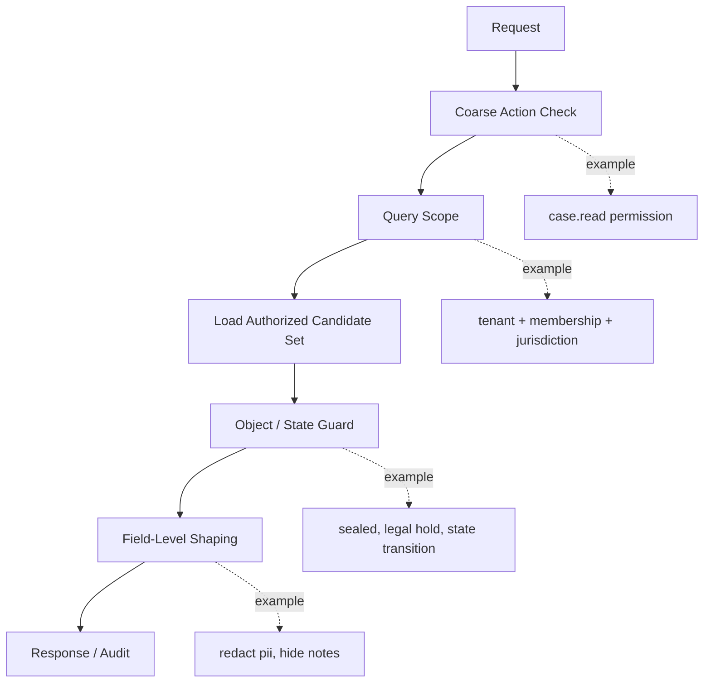
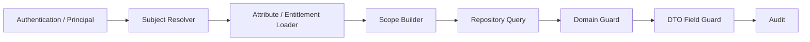
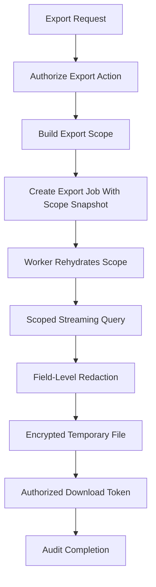

# Part 019 — Query Scoping Pattern: Authorize by Construction

Most authorization bugs are not caused by the absence of a security framework.

They are caused by this shape:

```java
CaseRecord record = caseRepository.findById(caseId);
authorization.check(user, "case.read", record);
return mapper.toDto(record);
```

This looks reasonable. It is often accepted in code review. It is also a dangerous default.

Why?

Because the system has already loaded the object before proving the caller is allowed to see it. The loading path, entity lifecycle hooks, lazy relationships, cache, logs, telemetry, mapper, exception handler, and later refactors can all accidentally observe or leak data before the authorization check becomes effective.

The query scoping pattern flips the default:

```java
Optional<CaseRecord> record = caseRepository.findReadableById(subject, caseId);
return record.map(mapper::toDto)
    .orElseThrow(NotFoundException::new);
```

The authorization predicate is part of the data access shape.

The object is not loaded first and filtered later. The object is only loaded if it belongs to the caller's authorized slice of the world.

That is the core idea.

```text
Do not fetch all possible data and ask authorization to subtract what is forbidden.
Construct the query so forbidden data is never in the result set.
```

This is what I mean by **authorize-by-construction**.

It does not replace all authorization. You still need action checks, state transition checks, field-level checks, and audit. But for reads, lists, search, exports, dashboards, and many updates, query scoping is the practical line between a system that is secure by discipline and a system that is secure by structure.

---

## 1. The Problem Query Scoping Solves

Consider an enforcement case management system.

A case may be readable when the subject satisfies at least one of these rules:

1. The case belongs to the subject's tenant.
2. The subject is assigned to the case.
3. The subject belongs to a team assigned to the case.
4. The subject has jurisdiction over the case's region.
5. The subject's clearance is high enough for the case classification.
6. The case is not sealed, unless the subject has sealed-case authority.
7. The case is not under legal hold, unless the subject has legal-hold access.
8. The subject is not the maker trying to approve their own action.

A naive service might do this:

```java
List<CaseRecord> records = caseRepository.search(filters);
return records.stream()
    .filter(record -> authorization.canRead(subject, record))
    .map(mapper::toDto)
    .toList();
```

This has several production-grade defects.

First, pagination becomes wrong. If the query returns 50 rows and the filter removes 47, the API returns 3 rows and the user thinks there are no more results. If the system fetches more pages until it fills 50 authorized rows, it risks unbounded database work.

Second, counts become wrong. `totalElements` may reveal the existence of forbidden objects.

Third, sorting becomes unstable. Sorting before filtering and filtering before sorting can produce different pages.

Fourth, exports become dangerous. A batch export that filters in memory can temporarily hold unauthorized data in process memory, logs, metrics, traces, error reports, or temporary files.

Fifth, authorization logic becomes duplicated. Each API endpoint must remember to call the same filter. Someone eventually forgets.

Sixth, the database optimizer cannot help. The database sees a broad query, not a permission-aware query.

The correct shape is:

```sql
select c.*
from case_record c
where c.tenant_id = :tenant_id
  and c.deleted_at is null
  and (
       c.assigned_user_id = :user_id
       or exists (
           select 1
           from case_team_assignment cta
           join user_team_membership utm on utm.team_id = cta.team_id
           where cta.case_id = c.id
             and utm.user_id = :user_id
       )
       or exists (
           select 1
           from user_jurisdiction uj
           where uj.user_id = :user_id
             and uj.region_id = c.region_id
       )
  )
  and c.classification <= :clearance
  and (:can_read_sealed = true or c.sealed = false)
order by c.updated_at desc, c.id desc
limit :limit offset :offset;
```

The query returns only data the caller may read.

The authorization logic is not an afterthought. It is part of the retrieval contract.

---

## 2. Query Scoping Is Not “SQL Instead of Authorization”

A common misunderstanding:

```text
If authorization lives in SQL, then business authorization is leaking into persistence.
```

This is partially true and often exaggerated.

A query scope is not the whole authorization policy. It is the **read-side projection** of authorization constraints required to safely select candidates.

Think of authorization as having layers:



Each layer answers a different question.

| Layer | Question | Example |
|---|---|---|
| Action check | Is this action generally available to the subject? | `case.read` |
| Query scope | Which objects are even candidates? | tenant, assignment, membership, jurisdiction |
| Object guard | Is this specific object/action/state combination allowed? | cannot approve own submitted recommendation |
| Field guard | Which fields can be read or written? | redact informant identity |
| Audit | Can we explain why this happened? | policy version, scope reason, decision reason |

Query scoping is the layer that prevents broad data exposure.

It should not contain all domain behavior. It should contain enough authorization logic to guarantee that the database never returns objects outside the subject's authorized object universe.

---

## 3. The Core Invariant

The invariant is simple:

```text
Every data retrieval query for protected resources must include an authorization scope derived from the authenticated subject, requested action, tenant, and resource type.
```

More concrete:

```text
No repository method may return protected domain objects unless it is one of:

1. explicitly scoped by subject/action/resource type;
2. used only by trusted internal repair/migration code with a named bypass reason;
3. used by a background job carrying an authorization snapshot or system authority;
4. used inside an already-authorized transaction boundary and documented as such.
```

This gives you a code review rule.

Bad repository method:

```java
Optional<CaseRecord> findById(UUID id);
```

Better repository method:

```java
Optional<CaseRecord> findReadableById(SubjectRef subject, UUID caseId);
```

Even better when actions vary:

```java
Optional<CaseRecord> findAuthorizedById(
    SubjectRef subject,
    CaseAction action,
    UUID caseId
);
```

For list/search:

```java
Page<CaseSummary> searchAuthorized(
    SubjectRef subject,
    CaseAction action,
    CaseSearchCriteria criteria,
    PageRequest page
);
```

Notice the key change: authorization is not an optional filter added by the service. It is part of the repository API shape.

---

## 4. The Query Scope Object

Do not pass `Authentication`, JWT claims, HTTP request, or framework-specific objects into repositories.

Translate them into an application-owned scope object.

```java
public record SubjectScope(
    UUID subjectId,
    UUID tenantId,
    Set<String> permissions,
    Set<UUID> teamIds,
    Set<String> jurisdictionCodes,
    int clearanceLevel,
    boolean canReadSealedCases,
    boolean canReadLegalHoldCases,
    Instant evaluatedAt,
    long policyVersion,
    long entitlementVersion
) {
    public boolean hasPermission(String permission) {
        return permissions.contains(permission);
    }
}
```

This object is intentionally not named `User`.

A subject may be:

- a human user;
- a service account;
- a scheduled job;
- a support operator with break-glass context;
- an integration acting on behalf of a user;
- a workflow engine executing a previously authorized command.

The repository usually does not need all subject facts. It needs a **scope**: the facts required to constrain data access.

For a case read query, that might be:

```java
public record CaseReadScope(
    UUID tenantId,
    UUID subjectId,
    Set<UUID> teamIds,
    Set<String> jurisdictionCodes,
    int clearanceLevel,
    boolean includeSealed,
    boolean includeLegalHold,
    boolean includeUnassignedQueue,
    long policyVersion
) {}
```

This is valuable because query scope becomes testable independent of HTTP, Spring, OAuth, and JWT.

---

## 5. Scope Derivation Pipeline

A scope should be derived once per request or command boundary.



Example service:

```java
public final class CaseQueryService {
    private final SubjectScopeResolver scopeResolver;
    private final CaseRepository caseRepository;
    private final CaseResponseAssembler responseAssembler;

    public Page<CaseSummaryDto> searchCases(CurrentPrincipal principal, CaseSearchRequest request) {
        SubjectScope subject = scopeResolver.resolve(principal);
        CaseReadScope readScope = CaseReadScopeFactory.from(subject);

        Page<CaseSummary> page = caseRepository.searchReadable(readScope, request.criteria(), request.page());

        return page.map(summary -> responseAssembler.toSummaryDto(subject, summary));
    }
}
```

The service does not say:

```java
if (user.isAdmin()) { ... }
```

It does not manually append a tenant predicate.

It asks for a read scope, then calls a repository method that cannot be called without one.

This is the design pressure you want.

---

## 6. Tenant Scoping

Tenant isolation is the lowest non-negotiable authorization predicate in most SaaS and regulatory platforms.

The rule is not:

```text
Check tenant when convenient.
```

The rule is:

```text
Every protected table must have a tenant boundary, or a documented reason why it is global.
Every protected query must bind the tenant boundary before any user-controlled filter.
```

Bad:

```sql
select *
from case_record
where id = :case_id;
```

Better:

```sql
select *
from case_record
where tenant_id = :tenant_id
  and id = :case_id;
```

For relational joins, every joined protected table must preserve tenant consistency.

```sql
select c.id, c.reference_no, e.file_name
from case_record c
join evidence_file e
  on e.case_id = c.id
 and e.tenant_id = c.tenant_id
where c.tenant_id = :tenant_id
  and c.id = :case_id;
```

Do not rely on `case_id` uniqueness alone unless the schema actually guarantees global uniqueness and you have proven all joins are safe.

A strong schema helps:

```sql
create table case_record (
    tenant_id uuid not null,
    id uuid not null,
    reference_no text not null,
    primary key (tenant_id, id)
);

create table evidence_file (
    tenant_id uuid not null,
    id uuid not null,
    case_id uuid not null,
    primary key (tenant_id, id),
    foreign key (tenant_id, case_id)
        references case_record (tenant_id, id)
);
```

This makes tenant isolation easier to preserve by construction.

If your schema uses globally unique IDs, still keep `tenant_id` as a filterable, indexed column. Global uniqueness prevents accidental object collision; it does not express authorization.

---

## 7. Ownership Scoping

Ownership is the simplest object relationship.

```sql
select *
from report r
where r.tenant_id = :tenant_id
  and r.owner_user_id = :subject_id
  and r.id = :report_id;
```

But ownership is often overused.

In enterprise systems, ownership rarely means “creator only”. It may mean:

- creator;
- assigned officer;
- responsible department;
- accountable supervisor;
- team queue;
- organization unit;
- delegated reviewer;
- case owner role;
- data steward;
- legal custodian.

Avoid using a single column named `owner_id` for all these concepts.

Instead, model the relationship that matters.

```sql
case_record.assigned_user_id
case_record.owning_department_id
case_record.responsible_unit_id
case_record.created_by_user_id
case_record.legal_custodian_user_id
```

Then encode policy intentionally.

```sql
where c.tenant_id = :tenant_id
  and (
      c.assigned_user_id = :subject_id
      or c.owning_department_id = any(:department_ids)
      or c.responsible_unit_id = any(:unit_ids)
  )
```

Naming is authorization design.

A vague relationship name creates vague authorization semantics.

---

## 8. Membership Scoping

Membership scopes rely on join tables.

```sql
select c.*
from case_record c
where c.tenant_id = :tenant_id
  and exists (
      select 1
      from case_team_assignment cta
      join user_team_membership utm
        on utm.tenant_id = cta.tenant_id
       and utm.team_id = cta.team_id
      where cta.tenant_id = c.tenant_id
        and cta.case_id = c.id
        and utm.user_id = :subject_id
        and utm.active = true
  );
```

This pattern is powerful, but it has hidden edge cases.

Membership may be time-bounded:

```sql
and utm.valid_from <= now()
and (utm.valid_until is null or utm.valid_until > now())
```

Membership may be role-specific:

```sql
and utm.team_role in ('INVESTIGATOR', 'SUPERVISOR')
```

Membership may be state-dependent:

```sql
and (
    c.status in ('OPEN', 'UNDER_REVIEW')
    or utm.team_role = 'SUPERVISOR'
)
```

Membership may be inherited through a hierarchy.

That becomes expensive if done recursively at request time. For production systems, consider maintaining a flattened membership projection:

```sql
user_effective_case_access (
    tenant_id,
    user_id,
    case_id,
    reason,
    source_type,
    source_id,
    valid_from,
    valid_until,
    version
)
```

Then query:

```sql
select c.*
from case_record c
join user_effective_case_access a
  on a.tenant_id = c.tenant_id
 and a.case_id = c.id
where a.tenant_id = :tenant_id
  and a.user_id = :subject_id
  and a.valid_from <= now()
  and (a.valid_until is null or a.valid_until > now());
```

This trades write complexity for read performance and simpler query predicates.

The danger is staleness. If membership changes, the projection must be invalidated or rebuilt according to a clear SLO.

---

## 9. Assignment Scoping

Assignment is usually stronger than membership.

A subject may belong to a team, but only assigned users may act on specific cases.

Example:

```sql
select c.*
from case_record c
where c.tenant_id = :tenant_id
  and c.assigned_user_id = :subject_id;
```

Assignment can also be multi-user:

```sql
select c.*
from case_record c
where c.tenant_id = :tenant_id
  and exists (
      select 1
      from case_assignment ca
      where ca.tenant_id = c.tenant_id
        and ca.case_id = c.id
        and ca.assignee_user_id = :subject_id
        and ca.assignment_status = 'ACTIVE'
  );
```

In workflow systems, assignment scopes must distinguish:

| Assignment Type | Meaning |
|---|---|
| Case assignment | User can see or work on case generally |
| Task assignment | User can act on a specific workflow task |
| Review assignment | User can review a submitted artifact |
| Escalation assignment | User can handle escalation path |
| Temporary assignment | User can act for a time window |
| Delegated assignment | User can act on behalf of another subject |

Do not collapse these into one generic table unless the semantics are explicit.

A task authorization query may look like:

```sql
select t.*
from workflow_task t
join case_record c
  on c.tenant_id = t.tenant_id
 and c.id = t.case_id
where t.tenant_id = :tenant_id
  and t.id = :task_id
  and t.status = 'READY'
  and exists (
      select 1
      from task_assignment ta
      where ta.tenant_id = t.tenant_id
        and ta.task_id = t.id
        and ta.assignee_user_id = :subject_id
        and ta.active = true
  )
  and c.classification <= :clearance_level;
```

Notice that the task assignment is not enough. The case classification still matters.

---

## 10. Jurisdiction Scoping

Regulatory, government, financial, and healthcare systems often authorize by jurisdiction.

The subject may access objects in:

- a country;
- a province;
- a branch;
- a court district;
- an enforcement region;
- a product line;
- a regulated entity portfolio;
- a supervision unit.

Simple jurisdiction query:

```sql
select c.*
from case_record c
join user_jurisdiction uj
  on uj.tenant_id = c.tenant_id
 and uj.jurisdiction_code = c.jurisdiction_code
where c.tenant_id = :tenant_id
  and uj.user_id = :subject_id;
```

Hierarchical jurisdiction is harder.

Suppose a national supervisor can see all regional cases. You can model this several ways:

1. recursive SQL over a jurisdiction tree;
2. closure table;
3. materialized path;
4. precomputed effective jurisdiction projection.

Closure table example:

```sql
jurisdiction_closure (
    tenant_id,
    ancestor_code,
    descendant_code,
    depth
)
```

Query:

```sql
select c.*
from case_record c
where c.tenant_id = :tenant_id
  and exists (
      select 1
      from user_jurisdiction uj
      join jurisdiction_closure jc
        on jc.tenant_id = uj.tenant_id
       and jc.ancestor_code = uj.jurisdiction_code
       and jc.descendant_code = c.jurisdiction_code
      where uj.tenant_id = c.tenant_id
        and uj.user_id = :subject_id
  );
```

The closure table gives the database a finite join instead of repeated recursive expansion.

This is a good example of authorization design affecting data modeling.

---

## 11. Classification and Clearance Scoping

Classification is usually object-side. Clearance is usually subject-side.

```sql
where c.classification_level <= :subject_clearance_level
```

This is simple if levels are strictly ordered:

```text
PUBLIC < INTERNAL < CONFIDENTIAL < SECRET < RESTRICTED
```

But many real systems are not strictly ordered. Access may depend on labels:

```text
classification: CONFIDENTIAL
compartments: [MARKET_ABUSE, WHISTLEBLOWER, LEGAL_HOLD]
```

Then the predicate becomes set containment:

```sql
where c.classification_level <= :clearance_level
  and c.compartment_codes <@ :allowed_compartment_codes
```

In PostgreSQL, array containment can be used, but you must index and test it carefully.

Another shape is a join table:

```sql
case_compartment(case_id, compartment_code)
user_compartment(user_id, compartment_code)
```

Query:

```sql
not exists (
    select 1
    from case_compartment cc
    where cc.tenant_id = c.tenant_id
      and cc.case_id = c.id
      and not exists (
          select 1
          from user_compartment uc
          where uc.tenant_id = cc.tenant_id
            and uc.user_id = :subject_id
            and uc.compartment_code = cc.compartment_code
      )
)
```

This says: there must not be any case compartment the user does not have.

It is correct but potentially expensive. For high-volume search, consider denormalized label bitsets, inverted indexes, or a precomputed access projection.

---

## 12. State-Aware Query Scoping

Authorization is often state-dependent.

A subject may read a draft only if they created it, but read a submitted case if they are reviewer.

```sql
where c.tenant_id = :tenant_id
  and (
      (c.status = 'DRAFT' and c.created_by_user_id = :subject_id)
      or
      (c.status = 'SUBMITTED' and exists (
          select 1 from case_review_assignment cra
          where cra.tenant_id = c.tenant_id
            and cra.case_id = c.id
            and cra.reviewer_user_id = :subject_id
      ))
      or
      (c.status in ('APPROVED', 'CLOSED') and :can_read_closed = true)
  )
```

This is where query scoping intersects with state machines.

Do not treat state as a display attribute only.

State is often an authorization dimension.

For write operations, query scoping should select the authorized candidate, then a domain guard should validate the transition.

```java
CaseRecord record = caseRepository.findActionableById(scope, CaseAction.APPROVE, command.caseId())
    .orElseThrow(NotFoundException::new);

caseWorkflowGuard.ensureCanApprove(scope, record, command);
record.approve(command.recommendation(), scope.subjectId());
```

The query scope prevents unauthorized object selection. The workflow guard prevents invalid or conflicted transitions.

---

## 13. Repository API Design

A repository should not expose unsafe methods by default.

Bad:

```java
public interface CaseRepository {
    Optional<CaseRecord> findById(UUID id);
    Page<CaseRecord> search(CaseSearchCriteria criteria, Pageable pageable);
}
```

Better:

```java
public interface CaseRepository {
    Optional<CaseRecord> findReadableById(CaseReadScope scope, UUID caseId);

    Optional<CaseRecord> findActionableById(
        CaseActionScope scope,
        UUID caseId,
        CaseAction action
    );

    Page<CaseSummary> searchReadable(
        CaseReadScope scope,
        CaseSearchCriteria criteria,
        PageRequest page
    );

    Stream<CaseExportRow> streamExportable(
        CaseExportScope scope,
        CaseExportCriteria criteria
    );
}
```

If you still need raw methods, isolate them.

```java
/**
 * Unsafe internal repository. Do not inject into request-facing services.
 * Intended only for migration, repair, and system reconciliation jobs.
 */
interface CaseUnsafeRepository {
    Optional<CaseRecord> findByIdUnsafe(UUID tenantId, UUID id);
}
```

Then use module/package boundaries:

```text
com.example.caseaccess.api
com.example.caseaccess.application
com.example.caseaccess.persistence.safe
com.example.caseaccess.persistence.unsafe
```

Do not rely on comments alone. Use dependency direction and code ownership to make unsafe paths harder to call.

---

## 14. JPA Implementation Pattern

JPA makes query scoping easy to hide and easy to get wrong.

A simple Criteria API predicate builder:

```java
public final class CaseAuthorizationPredicates {

    public static Predicate readableBy(
        CriteriaBuilder cb,
        Root<CaseRecordEntity> caseRoot,
        CaseReadScope scope
    ) {
        Predicate tenant = cb.equal(caseRoot.get("tenantId"), scope.tenantId());
        Predicate notDeleted = cb.isNull(caseRoot.get("deletedAt"));
        Predicate clearance = cb.lessThanOrEqualTo(
            caseRoot.get("classificationLevel"),
            scope.clearanceLevel()
        );

        Predicate assigned = cb.equal(caseRoot.get("assignedUserId"), scope.subjectId());

        Predicate sealed = scope.includeSealed()
            ? cb.conjunction()
            : cb.isFalse(caseRoot.get("sealed"));

        return cb.and(tenant, notDeleted, clearance, sealed, assigned);
    }
}
```

Repository:

```java
@Repository
public class JpaCaseRepository implements CaseRepository {
    @PersistenceContext
    private EntityManager em;

    @Override
    public Optional<CaseRecord> findReadableById(CaseReadScope scope, UUID caseId) {
        CriteriaBuilder cb = em.getCriteriaBuilder();
        CriteriaQuery<CaseRecordEntity> cq = cb.createQuery(CaseRecordEntity.class);
        Root<CaseRecordEntity> root = cq.from(CaseRecordEntity.class);

        Predicate id = cb.equal(root.get("id"), caseId);
        Predicate readable = CaseAuthorizationPredicates.readableBy(cb, root, scope);

        cq.select(root).where(cb.and(id, readable));

        return em.createQuery(cq)
            .setMaxResults(1)
            .getResultStream()
            .findFirst()
            .map(CaseRecordMapper::toDomain);
    }
}
```

This is adequate for simple cases.

But JPA has traps:

1. Lazy relationships may trigger later unscoped queries.
2. Entity graphs may pull sensitive relationships.
3. `@Where` filters can hide behavior and be bypassed by native queries.
4. Hibernate filters are convenient but easy to forget to enable.
5. Post-filtering entities in memory breaks pagination.
6. `@PostAuthorize` after entity load is not query scoping.

For serious systems, prefer explicit repository methods with explicit predicates.

---

## 15. Spring Data Specification Pattern

If you use Spring Data JPA, a specification can represent query scope.

```java
public final class CaseSpecifications {

    public static Specification<CaseRecordEntity> readableBy(CaseReadScope scope) {
        return (root, query, cb) -> {
            Predicate tenant = cb.equal(root.get("tenantId"), scope.tenantId());
            Predicate assigned = cb.equal(root.get("assignedUserId"), scope.subjectId());
            Predicate clearance = cb.lessThanOrEqualTo(
                root.get("classificationLevel"),
                scope.clearanceLevel()
            );
            Predicate sealed = scope.includeSealed()
                ? cb.conjunction()
                : cb.isFalse(root.get("sealed"));

            return cb.and(tenant, assigned, clearance, sealed);
        };
    }

    public static Specification<CaseRecordEntity> matches(CaseSearchCriteria criteria) {
        return (root, query, cb) -> {
            List<Predicate> predicates = new ArrayList<>();
            criteria.status().ifPresent(status -> predicates.add(cb.equal(root.get("status"), status)));
            criteria.referenceNo().ifPresent(ref -> predicates.add(cb.equal(root.get("referenceNo"), ref)));
            return cb.and(predicates.toArray(Predicate[]::new));
        };
    }
}
```

Usage:

```java
Specification<CaseRecordEntity> spec = Specification
    .where(CaseSpecifications.readableBy(scope))
    .and(CaseSpecifications.matches(criteria));

Page<CaseRecordEntity> page = caseJpaRepository.findAll(spec, pageable);
```

Important rule:

```text
Authorization specification must be the first-class mandatory specification.
Business filters are optional.
```

Do not let endpoint code assemble queries without the authorization specification.

Wrap it:

```java
public Page<CaseSummary> searchReadable(CaseReadScope scope, CaseSearchCriteria criteria, Pageable page) {
    Specification<CaseRecordEntity> spec = readableBy(scope).and(matches(criteria));
    return delegate.findAll(spec, page).map(mapper::toSummary);
}
```

The application service should not see `delegate.findAll` directly.

---

## 16. MyBatis Implementation Pattern

MyBatis is explicit. That is good for authorization.

Mapper interface:

```java
@Mapper
public interface CaseMapper {
    Optional<CaseRecordRow> findReadableById(
        @Param("scope") CaseReadScope scope,
        @Param("caseId") UUID caseId
    );

    List<CaseSummaryRow> searchReadable(
        @Param("scope") CaseReadScope scope,
        @Param("criteria") CaseSearchCriteria criteria,
        @Param("limit") int limit,
        @Param("offset") long offset
    );
}
```

Mapper XML:

```xml
<select id="findReadableById" resultMap="CaseRecordMap">
  select c.*
  from case_record c
  where c.tenant_id = #{scope.tenantId}
    and c.id = #{caseId}
    and c.deleted_at is null
    and c.classification_level &lt;= #{scope.clearanceLevel}
    <if test="!scope.includeSealed">
      and c.sealed = false
    </if>
    and (
      c.assigned_user_id = #{scope.subjectId}
      or exists (
        select 1
        from case_team_assignment cta
        join user_team_membership utm
          on utm.tenant_id = cta.tenant_id
         and utm.team_id = cta.team_id
        where cta.tenant_id = c.tenant_id
          and cta.case_id = c.id
          and utm.user_id = #{scope.subjectId}
          and utm.active = true
      )
    )
</select>
```

The main discipline is to centralize reusable fragments.

```xml
<sql id="CaseReadablePredicate">
  c.tenant_id = #{scope.tenantId}
  and c.deleted_at is null
  and c.classification_level &lt;= #{scope.clearanceLevel}
  <if test="!scope.includeSealed">
    and c.sealed = false
  </if>
  and (
    c.assigned_user_id = #{scope.subjectId}
    or exists (...)
  )
</sql>
```

Then:

```xml
<select id="searchReadable" resultMap="CaseSummaryMap">
  select c.id, c.reference_no, c.status, c.updated_at
  from case_record c
  where <include refid="CaseReadablePredicate" />
  order by c.updated_at desc, c.id desc
  limit #{limit} offset #{offset}
</select>
```

Avoid string concatenation for dynamic predicates. Use parameters and controlled fragments.

---

## 17. jOOQ / Query DSL Pattern

A type-safe query DSL is often excellent for authorization because policy predicates can be functions.

```java
public final class CaseScopes {
    public static Condition readableBy(CASE_RECORD c, CaseReadScope scope) {
        return c.TENANT_ID.eq(scope.tenantId())
            .and(c.DELETED_AT.isNull())
            .and(c.CLASSIFICATION_LEVEL.le(scope.clearanceLevel()))
            .and(scope.includeSealed() ? DSL.trueCondition() : c.SEALED.eq(false))
            .and(
                c.ASSIGNED_USER_ID.eq(scope.subjectId())
                .orExists(
                    DSL.selectOne()
                       .from(CASE_TEAM_ASSIGNMENT)
                       .join(USER_TEAM_MEMBERSHIP)
                       .on(USER_TEAM_MEMBERSHIP.TEAM_ID.eq(CASE_TEAM_ASSIGNMENT.TEAM_ID))
                       .where(CASE_TEAM_ASSIGNMENT.CASE_ID.eq(c.ID))
                       .and(USER_TEAM_MEMBERSHIP.USER_ID.eq(scope.subjectId()))
                )
            );
    }
}
```

Then:

```java
return dsl.selectFrom(CASE_RECORD)
    .where(CaseScopes.readableBy(CASE_RECORD, scope))
    .and(CASE_RECORD.ID.eq(caseId))
    .fetchOptional(mapper::toDomain);
```

The benefit is composability without losing type safety.

The risk is the same: someone can still write a query without the authorization condition. Solve that with repository boundaries and code review rules.

---

## 18. PostgreSQL Row-Level Security as a Defense Layer

Database Row-Level Security, or RLS, lets PostgreSQL apply row visibility policies inside the database.

Example:

```sql
alter table case_record enable row level security;

create policy case_tenant_policy
on case_record
using (tenant_id = current_setting('app.tenant_id')::uuid);
```

Then the application sets session context:

```sql
select set_config('app.tenant_id', :tenant_id, true);
```

A more detailed policy:

```sql
create policy case_read_policy
on case_record
for select
using (
    tenant_id = current_setting('app.tenant_id')::uuid
    and classification_level <= current_setting('app.clearance_level')::int
    and (
        assigned_user_id = current_setting('app.subject_id')::uuid
        or current_setting('app.can_read_all_cases')::boolean = true
    )
);
```

RLS is valuable because it protects against accidental broad queries.

But do not assume RLS removes the need for application authorization.

RLS is best as a lower-level guardrail, especially for tenant isolation and simple row visibility. Complex workflow rules, obligations, policy explainability, and field-level response shaping usually still belong in application authorization.

Important RLS cautions:

1. You must set session variables safely per transaction/request.
2. Connection pooling can leak session state if not reset.
3. Superusers and table owners may bypass policies unless configured carefully.
4. Debugging can become harder without good observability.
5. Policy changes affect all queries immediately.
6. Complex policies can create performance surprises.

A robust pattern:

```java
@Transactional(readOnly = true)
public Page<CaseSummaryDto> searchCases(CurrentPrincipal principal, CaseSearchRequest request) {
    SubjectScope scope = scopeResolver.resolve(principal);
    databaseSessionContext.apply(scope);
    return caseRepository.searchReadable(CaseReadScopeFactory.from(scope), request.criteria(), request.page())
        .map(dtoAssembler::toDto);
}
```

Application query scope and database RLS can coexist.

Use application scope for clear domain semantics. Use RLS as a database-level safety net.

---

## 19. Pagination Must Happen After Scoping

This is a hard invariant:

```text
Authorization scope must be applied before limit, offset, cursor, count, aggregation, sorting, and export.
```

Bad:

```java
Page<CaseRecord> raw = repository.search(criteria, page);
List<CaseRecord> allowed = raw.stream()
    .filter(c -> canRead(subject, c))
    .toList();
```

Correct:

```sql
select c.*
from case_record c
where <authorization_scope>
  and <business_filters>
order by c.updated_at desc, c.id desc
limit :limit;
```

Cursor pagination:

```sql
select c.*
from case_record c
where <authorization_scope>
  and (
      c.updated_at < :cursor_updated_at
      or (c.updated_at = :cursor_updated_at and c.id < :cursor_id)
  )
order by c.updated_at desc, c.id desc
limit :limit;
```

The cursor must not encode unauthorized state. Sign or encrypt cursor tokens if they expose internal IDs or sorting facts.

Count query:

```sql
select count(*)
from case_record c
where <authorization_scope>
  and <business_filters>;
```

Never compute total count from unscoped query. Counts leak existence.

---

## 20. Search Must Be Scoped Too

Search endpoints are BOLA factories.

Bad:

```http
GET /cases?referenceNo=ENF-2026-00091
GET /cases?regulatedEntityId=...
GET /cases?email=...
GET /cases?status=SEALED
```

If search is not scoped, the user can discover objects they cannot access.

Search query shape:

```sql
select c.id, c.reference_no, c.status, c.updated_at
from case_record c
where <authorization_scope>
  and (:reference_no is null or c.reference_no = :reference_no)
  and (:status is null or c.status = :status)
  and (:regulated_entity_id is null or c.regulated_entity_id = :regulated_entity_id)
order by c.updated_at desc, c.id desc
limit :limit;
```

For full-text search:

```sql
select c.id, c.reference_no, ts_rank(c.search_vector, q.query) as rank
from case_record c,
     websearch_to_tsquery('english', :search_text) q(query)
where <authorization_scope>
  and c.search_vector @@ q.query
order by rank desc, c.id desc
limit :limit;
```

The search index must not become a side channel.

If using Elasticsearch/OpenSearch/Solr, include authorization filters in the search request, or index only per-subject projections if the domain requires it.

Do not search broadly and filter hits in Java after the search engine returns results. That breaks ranking, pagination, and counts.

---

## 21. Aggregations and Dashboards

Aggregations leak information too.

Bad:

```sql
select status, count(*)
from case_record
group by status;
```

Correct:

```sql
select c.status, count(*)
from case_record c
where <authorization_scope>
group by c.status;
```

Dashboards usually combine many queries:

- open cases count;
- overdue cases count;
- high-risk cases count;
- cases by jurisdiction;
- cases by officer;
- escalation queue count.

Every one must be scoped.

A subject who cannot read sealed cases should not see sealed-case counts unless policy explicitly permits aggregate disclosure.

This is not pedantry. Aggregates can reveal investigations, complaints, enforcement actions, or sensitive business events.

---

## 22. Export and Reporting

Exports are high-risk because they multiply data volume and persistence.

A safe export pipeline:



The export job must not run a raw query.

It should carry:

```java
public record ExportAuthorizationSnapshot(
    UUID subjectId,
    UUID tenantId,
    CaseExportScope scope,
    String requestedAction,
    Instant authorizedAt,
    long policyVersion,
    long entitlementVersion,
    String reasonCode
) {}
```

Worker:

```java
public void executeExport(ExportJob job) {
    ExportAuthorizationSnapshot snapshot = job.authorizationSnapshot();

    if (snapshot.isExpired(clock.instant())) {
        throw new AuthorizationSnapshotExpiredException(job.id());
    }

    try (Stream<CaseExportRow> rows = caseRepository.streamExportable(snapshot.scope(), job.criteria())) {
        exportWriter.write(rows.map(row -> fieldRedactor.redact(snapshot.scope(), row)));
    }
}
```

For sensitive domains, consider rechecking authorization at execution time as well.

The trade-off:

| Strategy | Benefit | Risk |
|---|---|---|
| Snapshot only | reproducible decision, stable job | access may be revoked before execution |
| Recheck only | current authorization | job may change semantics mid-flight |
| Snapshot + recheck | strongest safety | more complexity |

For regulatory systems, snapshot + recheck is often worth it.

---

## 23. Update and Delete Queries

For writes, query scoping can prevent unauthorized mutation.

Bad:

```sql
update case_record
set status = 'APPROVED'
where id = :case_id;
```

Better:

```sql
update case_record c
set status = 'APPROVED', approved_by = :subject_id, approved_at = now()
where c.tenant_id = :tenant_id
  and c.id = :case_id
  and c.status = 'SUBMITTED'
  and exists (
      select 1
      from case_review_assignment cra
      where cra.tenant_id = c.tenant_id
        and cra.case_id = c.id
        and cra.reviewer_user_id = :subject_id
        and cra.active = true
  )
  and c.submitted_by <> :subject_id;
```

Then check affected row count:

```java
int updated = caseMapper.approveIfAuthorized(scope, command.caseId(), command.comment());
if (updated == 0) {
    throw new NotFoundException();
}
```

This avoids time-of-check/time-of-use race between `select` and `update`.

But do not put all workflow complexity into SQL updates. If the transition has rich domain rules, use a transaction:

1. scoped select `for update`;
2. domain transition guard;
3. update;
4. audit;
5. event/outbox write.

Example:

```sql
select c.*
from case_record c
where <authorization_scope_for_approve>
  and c.id = :case_id
for update;
```

Then apply domain logic in Java.

---

## 24. Delete Is Just Another Write

Delete endpoints are often under-protected.

Bad:

```http
DELETE /documents/{id}
```

with:

```sql
delete from document where id = :id;
```

Correct shape:

```sql
update document d
set deleted_at = now(), deleted_by = :subject_id
where d.tenant_id = :tenant_id
  and d.id = :document_id
  and d.deleted_at is null
  and d.owner_user_id = :subject_id
  and d.locked = false;
```

Soft delete is not automatically safer. If list queries forget `deleted_at is null`, deleted data leaks. If restore queries are not scoped, deleted data becomes a bypass path.

---

## 25. Nested Resource Scoping

Nested endpoints require validating the parent-child relationship under the same scope.

Bad:

```http
GET /cases/{caseId}/evidence/{evidenceId}
```

with:

```sql
select * from evidence_file where id = :evidence_id;
```

Better:

```sql
select e.*
from evidence_file e
join case_record c
  on c.tenant_id = e.tenant_id
 and c.id = e.case_id
where c.tenant_id = :tenant_id
  and c.id = :case_id
  and e.id = :evidence_id
  and <case_read_scope>
  and <evidence_read_scope>;
```

You must prove:

1. the case is readable;
2. the evidence belongs to that case;
3. the evidence itself is readable;
4. tenant boundaries match.

Never trust nested path parameters to imply containment.

---

## 26. Cross-Entity Impact

Real authorization rarely protects one table.

A case may include:

- allegation;
- evidence;
- regulated entity;
- subject person;
- financial transaction;
- internal note;
- decision memo;
- workflow task;
- attachment;
- audit trail;
- correspondence.

A query returning a case summary might join multiple entities.

Each entity can have different visibility.

Safe pattern:

```sql
select
    c.id,
    c.reference_no,
    c.status,
    re.display_name as regulated_entity_name,
    case
      when :can_read_risk_score then c.risk_score
      else null
    end as risk_score
from case_record c
join regulated_entity re
  on re.tenant_id = c.tenant_id
 and re.id = c.regulated_entity_id
where <case_read_scope>
  and <regulated_entity_visibility_scope>;
```

Query scoping handles rows. Field-level shaping handles sensitive columns. Do both.

---

## 27. The Authorization Predicate as a First-Class Artifact

A mature system treats authorization predicates as named artifacts.

Example:

```java
public interface AuthorizationPredicateFactory<R, S> {
    SqlPredicate predicateFor(S scope, R resourceType, Action action);
}
```

Practical version:

```java
public final class CaseSqlScopes {
    public SqlFragment readable(CaseReadScope scope) { ... }
    public SqlFragment exportable(CaseExportScope scope) { ... }
    public SqlFragment approvable(CaseApproveScope scope) { ... }
}
```

Each predicate should have:

- name;
- intended resource type;
- intended action;
- required scope fields;
- generated SQL or DSL condition;
- test cases;
- performance expectation;
- audit reason mapping.

This is how you avoid hidden authorization sprawl.

---

## 28. Audit for Query-Scoped Decisions

A query returning 50 rows does not necessarily need 50 full decision logs. But it must be auditable.

For list/search:

```json
{
  "eventType": "AUTHZ_QUERY_SCOPE_APPLIED",
  "subjectId": "...",
  "tenantId": "...",
  "resourceType": "case",
  "action": "case.search",
  "scopeName": "case.readable.v7",
  "policyVersion": 42,
  "criteriaHash": "...",
  "resultCount": 50,
  "decision": "ALLOW_SCOPED"
}
```

For object detail:

```json
{
  "eventType": "AUTHZ_OBJECT_DECISION",
  "subjectId": "...",
  "resourceType": "case",
  "resourceId": "...",
  "action": "case.read",
  "decision": "ALLOW",
  "reasonCode": "ASSIGNED_OFFICER_AND_CLEARANCE_OK",
  "policyVersion": 42
}
```

For denied object lookup, be careful not to log sensitive object metadata if the caller is not allowed to know it exists.

---

## 29. Performance Model

Authorization predicates can be expensive.

Common performance risks:

1. `exists` subqueries without indexes.
2. large `IN (...)` lists for team/jurisdiction IDs.
3. recursive hierarchy expansion per request.
4. unindexed classification/tenant/status predicates.
5. low-selectivity tenant filters in huge tenants.
6. OR-heavy predicates that prevent index usage.
7. post-filtering after search engine retrieval.
8. authorization views with hidden complexity.

Index for the actual access path.

Examples:

```sql
create index idx_case_tenant_assigned_updated
on case_record (tenant_id, assigned_user_id, updated_at desc, id desc);

create index idx_case_tenant_region_updated
on case_record (tenant_id, jurisdiction_code, updated_at desc, id desc);

create index idx_case_team_assignment_lookup
on case_team_assignment (tenant_id, case_id, team_id);

create index idx_user_team_membership_lookup
on user_team_membership (tenant_id, user_id, team_id)
where active = true;
```

When OR predicates become too expensive, split into union queries:

```sql
select c.*
from case_record c
where c.tenant_id = :tenant_id
  and c.assigned_user_id = :subject_id

union

select c.*
from case_record c
join case_team_assignment cta ...
where c.tenant_id = :tenant_id
  and ...
```

Then page carefully. Union pagination can be tricky. Test the plan with realistic tenant size.

---

## 30. Precomputed Access Tables

When dynamic predicates become too slow, precompute.

```sql
effective_case_access (
    tenant_id uuid not null,
    subject_id uuid not null,
    case_id uuid not null,
    action text not null,
    reason text not null,
    source_version bigint not null,
    valid_from timestamptz not null,
    valid_until timestamptz,
    primary key (tenant_id, subject_id, case_id, action)
)
```

Query:

```sql
select c.*
from effective_case_access a
join case_record c
  on c.tenant_id = a.tenant_id
 and c.id = a.case_id
where a.tenant_id = :tenant_id
  and a.subject_id = :subject_id
  and a.action = 'case.read'
  and a.valid_from <= now()
  and (a.valid_until is null or a.valid_until > now())
  and c.deleted_at is null;
```

This resembles materialized authorization.

Benefits:

- fast reads;
- simple predicates;
- easy list objects;
- explainable reason column;
- good for complex relationship hierarchies.

Costs:

- write amplification;
- stale access risk;
- rebuild complexity;
- backfill complexity;
- invalidation bugs become authorization bugs.

Use this when dynamic evaluation is too slow or when relationship graph expansion is complex.

---

## 31. Security Review Checklist

For every protected query, ask:

```text
1. Does the query include tenant scope?
2. Does it include subject/resource relationship scope?
3. Does it include classification/clearance scope where relevant?
4. Does it include state restrictions where relevant?
5. Does it include deleted/sealed/legal-hold restrictions?
6. Does pagination happen after authorization scope?
7. Does count/aggregation happen after authorization scope?
8. Does sorting expose sensitive fields?
9. Does search use authorization filters before ranking/counting?
10. Does export stream only authorized rows?
11. Does nested resource lookup prove parent-child relationship?
12. Does update/delete include authorization predicate or scoped select-for-update?
13. Are unsafe repository methods isolated?
14. Are predicates covered by tests?
15. Are indexes designed for the authorization access path?
16. Is deny behavior safe: 404 vs 403 vs empty list?
17. Is the decision/audit trail sufficient?
18. Is cache invalidation defined if using precomputed access?
```

This checklist should be part of API review and schema review.

---

## 32. Tests That Catch Query Scope Bugs

Use at least two users and two tenants.

```java
@Test
void search_doesNotReturnCasesFromOtherTenant() {
    TenantId tenantA = fixtures.tenant("A");
    TenantId tenantB = fixtures.tenant("B");
    SubjectScope alice = fixtures.userInTenant(tenantA);

    fixtures.caseInTenant(tenantA, assignedTo = alice.subjectId());
    fixtures.caseInTenant(tenantB, assignedTo = alice.subjectId()); // malicious-looking cross tenant

    Page<CaseSummary> result = repository.searchReadable(
        CaseReadScopeFactory.from(alice),
        CaseSearchCriteria.empty(),
        PageRequest.first(50)
    );

    assertThat(result.items()).allMatch(c -> c.tenantId().equals(tenantA));
}
```

Test horizontal access:

```java
@Test
void findReadableById_returnsEmptyForCaseAssignedToAnotherUser() {
    SubjectScope alice = fixtures.investigator();
    SubjectScope bob = fixtures.investigatorSameTenant();
    CaseRecord bobCase = fixtures.caseAssignedTo(bob.subjectId());

    Optional<CaseRecord> result = repository.findReadableById(
        CaseReadScopeFactory.from(alice),
        bobCase.id()
    );

    assertThat(result).isEmpty();
}
```

Test pagination:

```java
@Test
void pagination_isAppliedAfterAuthorizationScope() {
    SubjectScope alice = fixtures.investigator();
    fixtures.createCasesAssignedToOtherUsers(100);
    fixtures.createCasesAssignedTo(alice.subjectId(), 3);

    Page<CaseSummary> result = repository.searchReadable(
        CaseReadScopeFactory.from(alice),
        CaseSearchCriteria.empty(),
        PageRequest.of(0, 10)
    );

    assertThat(result.items()).hasSize(3);
    assertThat(result.totalElements()).isEqualTo(3);
}
```

Test nested resource:

```java
@Test
void evidenceLookup_requiresEvidenceToBelongToReadableCase() {
    SubjectScope alice = fixtures.investigator();
    CaseRecord aliceCase = fixtures.caseAssignedTo(alice.subjectId());
    EvidenceFile otherEvidence = fixtures.evidenceInDifferentCase();

    Optional<EvidenceFile> result = repository.findReadableEvidence(
        EvidenceReadScopeFactory.from(alice),
        aliceCase.id(),
        otherEvidence.id()
    );

    assertThat(result).isEmpty();
}
```

These tests are more valuable than merely testing annotations.

---

## 33. Anti-Patterns

### Anti-Pattern 1: `findById` Everywhere

A generic `findById` method is convenient and dangerous.

Prefer action-specific retrieval methods.

### Anti-Pattern 2: Filter After Pagination

This breaks counts, ranking, and page fullness. It also leaks broad query behavior.

### Anti-Pattern 3: UI-Only Search Filtering

Hiding unauthorized filters in the UI does not protect the API.

### Anti-Pattern 4: Admin Flag Bypass in SQL

```sql
or :is_admin = true
```

This may be acceptable only if admin authority is scoped, audited, and tested. Most systems need admin constraints too.

### Anti-Pattern 5: Authorization Scope Hidden in ORM Magic

Magic filters are easy to bypass through native SQL, background jobs, or reporting code.

### Anti-Pattern 6: Unscoped Count Queries

Counts are data.

### Anti-Pattern 7: Export Uses Different Query Path

Export must not call a broader reporting query than the API list endpoint.

### Anti-Pattern 8: Relationship Expansion in Java After Broad Query

If you load all cases and then check membership, you already lost the authorization boundary.

### Anti-Pattern 9: Treating UUIDs as Authorization

Unpredictable IDs reduce enumeration risk. They do not prove permission.

### Anti-Pattern 10: No Performance Tests for Policy Predicates

A correct predicate that times out under real data volume becomes an availability risk. Under pressure, teams remove the predicate. That becomes a security risk.

---

## 34. Production Rule of Thumb

Use this decision table.

| Scenario | Preferred Pattern |
|---|---|
| Single object read | `findReadableById(scope, id)` |
| List/search | scoped query before pagination/count |
| Nested resource | scoped parent + child relationship proof |
| Update with simple rule | scoped conditional update + row count |
| Update with complex workflow | scoped `select for update` + domain guard |
| Export | scope snapshot + scoped streaming query + field redaction |
| Dashboard | scoped aggregation |
| Complex relationship graph | precomputed access table or ReBAC engine |
| Database safety net | PostgreSQL RLS for tenant/simple row policy |
| Highly sensitive fields | field-level authorization after row scoping |

---

## 35. Closing Mental Model

A secure API does not ask:

```text
Did the user pass authentication?
```

It asks:

```text
What is the authorized slice of the data graph for this subject, action, resource type, tenant, state, and context?
```

Query scoping is how that slice becomes executable.

The top 1% engineering move is not to sprinkle more `if` statements.

It is to design repositories, schemas, indexes, services, tests, and audit events so unauthorized rows are never normal data flowing through the system.

```text
Authorization should not merely reject forbidden objects.
It should shape the query so forbidden objects are not selected.
```

That is authorize-by-construction.

---

## References

- OWASP Authorization Cheat Sheet — least privilege, deny by default, validate permissions on every request: https://cheatsheetseries.owasp.org/cheatsheets/Authorization_Cheat_Sheet.html
- OWASP API Security 2023 API1 — Broken Object Level Authorization: https://owasp.org/API-Security/editions/2023/en/0xa1-broken-object-level-authorization/
- OWASP API Security 2023 API3 — Broken Object Property Level Authorization: https://owasp.org/API-Security/editions/2023/en/0xa3-broken-object-property-level-authorization/
- PostgreSQL Row Security Policies: https://www.postgresql.org/docs/current/ddl-rowsecurity.html
- PostgreSQL CREATE POLICY: https://www.postgresql.org/docs/current/sql-createpolicy.html
- Spring Security Authorization Architecture: https://docs.spring.io/spring-security/reference/servlet/authorization/architecture.html
