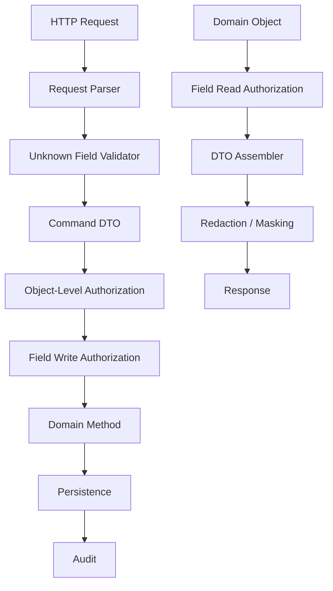

# Part 020 — Field-Level and Property-Level Authorization

Object-level authorization answers:

```text
May this subject access this object?
```

Field-level authorization answers:

```text
Which parts of this object may this subject read or modify?
```

Those are different questions.

A user may be allowed to read a case but not read:

- whistleblower identity;
- internal risk score;
- investigator notes;
- legal advice;
- sealed evidence metadata;
- financial account numbers;
- health information;
- enforcement strategy;
- privileged correspondence;
- system-only state fields.

A user may be allowed to update a case but not update:

- `status`;
- `assignedUserId`;
- `riskScore`;
- `createdBy`;
- `approvedBy`;
- `tenantId`;
- `classification`;
- `legalHold`;
- `deletedAt`;
- `version`.

This is why OWASP API Security 2023 separates Broken Object Level Authorization from Broken Object Property Level Authorization. Object authorization is not enough if object properties are over-exposed or mass-assignable.

In Java systems, this problem often hides inside DTO mapping, JSON serialization, request binding, patch handling, and UI-driven assumptions.

The goal of this part is to build a production-grade model for field-level authorization that is explicit, testable, auditable, and hard to bypass.

---

## 1. The Core Invariant

```text
Every protected object response must be shaped according to the subject's read permissions.
Every protected object mutation must accept only fields the subject is allowed to write.
```

Read-side invariant:

```text
If a field is not readable, it must not be serialized, derived, counted, sorted, searched, exported, logged, cached, indexed, or embedded in error messages for that subject.
```

Write-side invariant:

```text
If a field is not writable, the server must reject or ignore attempts to modify it according to an explicit policy, and the behavior must be consistent and auditable.
```

Do not treat this as a UI concern.

A hidden form field, disabled input, or missing column in a frontend table does not protect the backend.

---

## 2. Object-Level vs Field-Level vs Property-Level

Use precise terms.

| Level | Question | Example |
|---|---|---|
| Function-level | Can the subject call this endpoint/use case? | can access `/admin/reports` |
| Object-level | Can the subject access this exact object? | can read case `C-123` |
| Field-level read | Can the subject see this property? | can see `riskScore` |
| Field-level write | Can the subject modify this property? | can update `assignedUserId` |
| Relationship-level | Can the subject access objects through this relation? | can list evidence under case |
| Derived-field level | Can the subject see computed data? | can see `daysOverdue` or `riskBucket` |
| Export-level | Can the subject export the field outside the app? | can export PII to CSV |

Broken property-level authorization happens when object access is valid but property access is not.

Example:

```json
{
  "id": "case-123",
  "referenceNo": "ENF-2026-000123",
  "status": "OPEN",
  "riskScore": 97,
  "whistleblowerName": "...",
  "internalLegalMemo": "..."
}
```

The caller may be allowed to read the case summary. That does not mean they may read the legal memo.

Write-side example:

```http
PATCH /cases/case-123
Content-Type: application/json

{
  "title": "Updated title",
  "status": "APPROVED",
  "approvedBy": "attacker-user-id",
  "classification": "PUBLIC"
}
```

If the server blindly binds this payload to an entity, authorization is broken even if the endpoint had `case.update` permission.

---

## 3. The Common Java Failure Mode: Entity Binding

This is one of the most dangerous patterns:

```java
@PatchMapping("/cases/{id}")
public CaseDto updateCase(@PathVariable UUID id, @RequestBody CaseEntity incoming) {
    CaseEntity existing = repository.findById(id).orElseThrow();
    BeanUtils.copyProperties(incoming, existing);
    return mapper.toDto(repository.save(existing));
}
```

It fails because the incoming JSON can contain fields the UI never intended to send.

Another dangerous pattern:

```java
@PutMapping("/users/{id}")
public UserDto update(@PathVariable UUID id, @RequestBody UserDto dto) {
    User user = mapper.toEntity(dto);
    user.setId(id);
    return mapper.toDto(repository.save(user));
}
```

If `UserDto` contains `roles`, `tenantId`, `enabled`, or `mfaDisabled`, the caller may be able to escalate privileges.

Production rule:

```text
Never bind external request bodies directly into persistence entities.
Never use a broad DTO as both response model and update command.
Never copy all request properties into an existing domain object.
```

Use command-specific request types.

```java
public record UpdateCaseDetailsCommand(
    UUID caseId,
    String title,
    String summary,
    List<String> tags
) {}
```

Not:

```java
public record CaseDto(
    UUID id,
    UUID tenantId,
    String status,
    String title,
    String summary,
    int riskScore,
    UUID assignedUserId,
    UUID approvedBy,
    boolean legalHold
) {}
```

for every operation.

---

## 4. Response DTO Shaping

Field-level read authorization begins at the response boundary.

Bad:

```java
return caseMapper.toDto(caseRecord);
```

Better:

```java
return caseResponseAssembler.toDto(subject, caseRecord);
```

Example:

```java
public final class CaseResponseAssembler {
    private final FieldAuthorizationService fieldAuthz;

    public CaseDetailDto toDetailDto(SubjectScope subject, CaseRecord record) {
        FieldDecisionSet fields = fieldAuthz.allowedFields(
            subject,
            ResourceRef.caseRecord(record.id(), record.tenantId()),
            FieldAction.READ,
            record
        );

        return new CaseDetailDto(
            record.id(),
            record.referenceNo(),
            record.status().name(),
            fields.canRead("title") ? record.title() : null,
            fields.canRead("summary") ? record.summary() : null,
            fields.canRead("riskScore") ? record.riskScore() : null,
            fields.canRead("whistleblowerName") ? record.whistleblowerName() : null,
            fields.canRead("internalLegalMemo") ? record.internalLegalMemo() : null
        );
    }
}
```

This is explicit but can become verbose.

A more scalable approach uses a field policy catalog.

```java
public enum CaseField {
    ID,
    REFERENCE_NO,
    STATUS,
    TITLE,
    SUMMARY,
    RISK_SCORE,
    WHISTLEBLOWER_NAME,
    INTERNAL_LEGAL_MEMO,
    ASSIGNED_USER,
    CLASSIFICATION,
    LEGAL_HOLD
}
```

```java
public record FieldDecisionSet(
    Set<CaseField> readable,
    Set<CaseField> writable,
    Map<CaseField, RedactionMode> redactionModes
) {
    public boolean canRead(CaseField field) {
        return readable.contains(field);
    }

    public RedactionMode redactionMode(CaseField field) {
        return redactionModes.getOrDefault(field, RedactionMode.HIDE);
    }
}
```

DTO assembler:

```java
public CaseDetailDto toDetailDto(SubjectScope subject, CaseRecord record) {
    FieldDecisionSet fields = fieldAuthz.caseFieldDecisions(subject, record, FieldAction.READ);

    return CaseDetailDto.builder()
        .id(record.id())
        .referenceNo(record.referenceNo())
        .status(record.status())
        .title(read(fields, CaseField.TITLE, record.title()))
        .summary(read(fields, CaseField.SUMMARY, record.summary()))
        .riskScore(read(fields, CaseField.RISK_SCORE, record.riskScore()))
        .whistleblowerName(redact(fields, CaseField.WHISTLEBLOWER_NAME, record.whistleblowerName()))
        .internalLegalMemo(read(fields, CaseField.INTERNAL_LEGAL_MEMO, record.internalLegalMemo()))
        .build();
}
```

The important thing is not the helper style. The important thing is that field decisions are explicit and testable.

---

## 5. Hide, Null, Mask, Redact, or Omit?

When a field is not readable, what should the API return?

You have choices.

| Strategy | Example | Benefit | Risk |
|---|---|---|---|
| Omit field | no `riskScore` property | least disclosure | schema variability |
| Null field | `"riskScore": null` | stable schema | may imply field exists |
| Mask | `"accountNo": "****1234"` | useful partial data | masking can be reversible if weak |
| Redact marker | `"legalMemo": "[REDACTED]"` | explicit | may disclose field sensitivity |
| Derived value | `"riskBand": "HIGH"` | useful abstraction | derived value may leak original |
| Error | reject whole response | strong | poor UX for mixed-visibility objects |

Pick deliberately per field and API contract.

For public APIs, omission is often cleaner.

For internal enterprise UIs, explicit redaction may be better because users need to understand that data exists but is restricted.

For regulated systems, redaction markers can be important for auditability:

```json
{
  "referenceNo": "ENF-2026-000123",
  "status": "OPEN",
  "whistleblowerName": {
    "redacted": true,
    "reason": "FIELD_REQUIRES_WHISTLEBLOWER_CLEARANCE"
  }
}
```

But be careful: reason codes can themselves leak sensitive information. Use coarse reason codes externally and detailed reason codes internally.

---

## 6. Redaction as a Policy, Not a String Replacement

Bad redaction:

```java
dto.setNationalId("***");
```

Better redaction:

```java
public sealed interface RedactedValue<T> permits VisibleValue, HiddenValue, MaskedValue {
    String reasonCode();
}

public record VisibleValue<T>(T value) implements RedactedValue<T> {
    @Override public String reasonCode() { return "VISIBLE"; }
}

public record HiddenValue<T>(String reasonCode) implements RedactedValue<T> {}

public record MaskedValue<T>(String displayValue, String reasonCode) implements RedactedValue<T> {}
```

Use domain-specific policies:

```java
public final class PersonalDataRedactor {
    public RedactedValue<String> nationalId(SubjectScope subject, PersonRecord person) {
        if (subject.hasPermission("person.national-id.read")) {
            return new VisibleValue<>(person.nationalId());
        }
        if (subject.hasPermission("person.national-id.masked-read")) {
            return new MaskedValue<>(maskLast4(person.nationalId()), "MASKED_BY_POLICY");
        }
        return new HiddenValue<>("NATIONAL_ID_RESTRICTED");
    }
}
```

This makes redaction explainable and testable.

Do not implement redaction by post-processing JSON strings. That is fragile and usually misses nested fields.

---

## 7. Derived Fields Can Leak Sensitive Data

A derived field may reveal what a hidden field contains.

Example:

```json
{
  "riskScore": null,
  "riskBand": "CRITICAL"
}
```

If risk band is derived from risk score, hiding `riskScore` but exposing `riskBand` may still be a leak.

Other examples:

| Hidden Field | Leaky Derived Field |
|---|---|
| whistleblower identity | `sourceType = WHISTLEBLOWER` |
| legal hold flag | `editable = false because legal hold` |
| investigation target | `relatedPartyCount` |
| sealed evidence | `attachmentCount` |
| suspicious transaction amount | `riskBucket` |
| internal note | `lastInternalCommentAt` |

Policy must cover derived fields too.

```java
if (!fields.canRead(CaseField.RISK_SCORE)) {
    dto.setRiskBand(null);
}
```

Or define the derived field as a separate policy-controlled field:

```java
CaseField.RISK_BAND
CaseField.RISK_SCORE
```

Do not assume derived means safe.

---

## 8. Serialization-Level Guards: Useful but Not Enough

Jackson gives tools like `@JsonView`, custom serializers, filters, and mixins.

They can help. They should not be your entire authorization model.

Example with `@JsonView`:

```java
public class CaseDto {
    @JsonView(Views.Summary.class)
    public String referenceNo;

    @JsonView(Views.Internal.class)
    public Integer riskScore;
}
```

Problem: views are usually static. Authorization is dynamic.

The same user may read `riskScore` for one case but not another depending on assignment, classification, jurisdiction, state, or break-glass context.

A dynamic Jackson filter:

```java
FilterProvider filters = new SimpleFilterProvider()
    .addFilter("caseFieldFilter", SimpleBeanPropertyFilter.filterOutAllExcept(allowedFields));

return MappingJacksonValue(dto).setFilters(filters);
```

This can work for response shaping, but field decisions should still come from your authorization layer.

Production guidance:

```text
Use serialization filters as an enforcement adapter, not as the policy source.
```

The policy source should be testable without HTTP serialization.

---

## 9. Write Field Authorization

Read authorization prevents data exposure. Write authorization prevents privilege escalation and data corruption.

A write policy should answer:

```text
For this subject, action, object, state, and context, which fields may be modified?
```

Example:

```java
public enum FieldWriteMode {
    ALLOW,
    DENY_REJECT_REQUEST,
    DENY_IGNORE_FIELD
}
```

Prefer reject over ignore for most APIs.

Rejecting makes attacks visible and avoids confusing client behavior.

```java
public final class CasePatchAuthorizer {
    public void ensureWritableFields(
        SubjectScope subject,
        CaseRecord record,
        JsonMergePatchDocument patch
    ) {
        Set<CaseField> attempted = patch.modifiedFields().stream()
            .map(CaseFieldCatalog::fromJsonPointer)
            .collect(Collectors.toSet());

        FieldDecisionSet decisions = fieldAuthz.caseFieldDecisions(subject, record, FieldAction.WRITE);

        Set<CaseField> denied = attempted.stream()
            .filter(field -> !decisions.writable().contains(field))
            .collect(Collectors.toSet());

        if (!denied.isEmpty()) {
            throw new ForbiddenFieldMutationException(denied);
        }
    }
}
```

You want the system to catch this:

```json
{
  "summary": "new summary",
  "status": "APPROVED",
  "classification": "PUBLIC"
}
```

not silently ignore it.

---

## 10. Command-Specific DTOs

The simplest way to prevent mass assignment is to make impossible states unrepresentable at the input boundary.

Bad:

```java
public record CaseDto(
    UUID id,
    UUID tenantId,
    String title,
    String summary,
    CaseStatus status,
    UUID assignedUserId,
    Integer riskScore,
    boolean sealed,
    boolean legalHold,
    UUID approvedBy
) {}
```

Used for:

```java
@PostMapping("/cases")
@PutMapping("/cases/{id}")
@GetMapping("/cases/{id}")
```

Better:

```java
public record CreateCaseRequest(
    String title,
    String summary,
    UUID regulatedEntityId,
    String jurisdictionCode
) {}

public record UpdateCaseDetailsRequest(
    String title,
    String summary,
    List<String> tags
) {}

public record AssignCaseRequest(
    UUID assigneeUserId,
    String reason
) {}

public record ClassifyCaseRequest(
    Classification classification,
    Set<String> compartments,
    String justification
) {}

public record ApproveCaseRequest(
    String decision,
    String comment
) {}
```

Each command has only the fields relevant to that operation.

Then authorization becomes clearer:

| Endpoint | Request DTO | Authorization |
|---|---|---|
| `PATCH /cases/{id}/details` | `UpdateCaseDetailsRequest` | `case.details.update` |
| `POST /cases/{id}/assignment` | `AssignCaseRequest` | `case.assign` |
| `POST /cases/{id}/classification` | `ClassifyCaseRequest` | `case.classify` |
| `POST /cases/{id}/approval` | `ApproveCaseRequest` | `case.approve` |

This is better than one giant `PATCH /cases/{id}` endpoint that updates anything.

---

## 11. Patch Semantics

PATCH is where field-level authorization often breaks.

There are several patch styles:

1. JSON Merge Patch;
2. JSON Patch;
3. partial DTO patch;
4. command-specific patch;
5. GraphQL mutation input.

### JSON Merge Patch

Example:

```json
{
  "title": "New title",
  "riskScore": null
}
```

In merge patch, `null` may mean remove or set null. That matters.

You need to distinguish:

- field absent;
- field present with null;
- field present with value;
- field present but not writable;
- unknown field present.

Use a parsed patch document:

```java
public record PatchField(
    String jsonPointer,
    boolean present,
    JsonNode value
) {}

public record JsonMergePatchDocument(
    Map<String, PatchField> fields
) {
    public Set<String> modifiedPointers() {
        return fields.keySet();
    }
}
```

Do not deserialize merge patch directly into a DTO and lose presence information.

### JSON Patch

Example:

```json
[
  { "op": "replace", "path": "/title", "value": "New title" },
  { "op": "remove", "path": "/legalHold" }
]
```

Every operation path must be authorized.

```java
for (JsonPatchOperation op : patch.operations()) {
    CaseField field = fieldCatalog.resolve(op.path());
    writeGuard.ensureWritable(subject, record, field, op.operationType());
}
```

Also validate path traversal. Do not allow patch paths into nested objects unless explicitly supported.

---

## 12. Unknown Fields Must Be Rejected

Unknown JSON fields are security-relevant.

Bad behavior:

```text
Unknown fields are ignored silently.
```

Why is this bad?

Because attackers can probe field names and you may miss attempted mass assignment. Also, if a future release adds a field with the same name, a previously ignored input may become active.

Prefer:

```java
objectMapper.configure(DeserializationFeature.FAIL_ON_UNKNOWN_PROPERTIES, true);
```

For public APIs, return a safe validation error:

```json
{
  "error": "INVALID_REQUEST",
  "message": "Request contains unsupported fields.",
  "fields": ["/approvedBy", "/tenantId"]
}
```

Do not return:

```json
{
  "message": "Field /approvedBy exists but you are not allowed to update it because only supervisors can approve cases"
}
```

unless that level of detail is safe for the caller.

---

## 13. Immutable Server-Controlled Fields

Some fields should never be client-writable.

Examples:

```text
id
tenantId
createdAt
createdBy
updatedAt
updatedBy
version
deletedAt
deletedBy
approvedAt
approvedBy
riskScore
systemStatus
legalHold
classification source
policyVersion
```

Represent this in code.

```java
public enum CaseFieldWriteClass {
    CLIENT_WRITABLE,
    ROLE_WRITABLE,
    SYSTEM_WRITABLE,
    NEVER_CLIENT_WRITABLE
}
```

Catalog:

```java
public final class CaseFieldCatalog {
    private static final Map<CaseField, CaseFieldPolicy> POLICIES = Map.of(
        CaseField.TITLE, new CaseFieldPolicy(CLIENT_WRITABLE),
        CaseField.SUMMARY, new CaseFieldPolicy(CLIENT_WRITABLE),
        CaseField.ASSIGNED_USER, new CaseFieldPolicy(ROLE_WRITABLE, "case.assign"),
        CaseField.STATUS, new CaseFieldPolicy(SYSTEM_WRITABLE),
        CaseField.TENANT_ID, new CaseFieldPolicy(NEVER_CLIENT_WRITABLE),
        CaseField.APPROVED_BY, new CaseFieldPolicy(SYSTEM_WRITABLE),
        CaseField.RISK_SCORE, new CaseFieldPolicy(ROLE_WRITABLE, "case.risk-score.update")
    );
}
```

This catalog should be used by request validation, mapper, and tests.

---

## 14. Field-Level Authorization and State Machines

Write access may depend on object state.

Example:

| Field | Draft | Submitted | Approved | Closed |
|---|---:|---:|---:|---:|
| title | creator | no | no | no |
| summary | creator | reviewer note only | no | no |
| assignedUser | supervisor | supervisor | no | no |
| riskScore | risk analyst | risk analyst | no | no |
| legalHold | legal | legal | legal | legal |
| finalDecision | no | reviewer | no | no |

Policy code:

```java
public boolean canWrite(CaseField field, SubjectScope subject, CaseRecord record) {
    return switch (field) {
        case TITLE, SUMMARY ->
            record.status() == CaseStatus.DRAFT
                && record.createdBy().equals(subject.subjectId());

        case ASSIGNED_USER ->
            subject.hasPermission("case.assign")
                && record.status().isBefore(CaseStatus.APPROVED);

        case RISK_SCORE ->
            subject.hasPermission("case.risk-score.update")
                && record.status().isOpen();

        case LEGAL_HOLD ->
            subject.hasPermission("case.legal-hold.manage");

        case STATUS, APPROVED_BY, APPROVED_AT, TENANT_ID ->
            false;
    };
}
```

But be careful. If state transition is meaningful, model it as an action, not a field update.

Do not authorize this:

```json
{ "status": "APPROVED" }
```

as a field write.

Prefer:

```http
POST /cases/{id}/approval
```

with:

```java
case.approve(decision, reviewer, clock.instant());
```

`status` is a result of the domain transition, not a client-editable field.

---

## 15. Field-Level Authorization in Domain Methods

DTO validation is not enough. Domain methods should also resist unsafe mutation.

Bad domain model:

```java
public void setStatus(CaseStatus status) {
    this.status = status;
}
```

Better:

```java
public void approve(Reviewer reviewer, ApprovalDecision decision, Instant now) {
    if (status != CaseStatus.SUBMITTED) {
        throw new InvalidCaseTransitionException(status, CaseStatus.APPROVED);
    }
    if (reviewer.userId().equals(submittedBy)) {
        throw new SeparationOfDutyViolationException();
    }
    this.status = CaseStatus.APPROVED;
    this.approvedBy = reviewer.userId();
    this.approvedAt = now;
    this.decision = decision;
}
```

Authorization service checks whether the subject may attempt approval. Domain enforces invariant that approval cannot violate workflow rules.

This prevents bypasses from:

- alternate API endpoints;
- workers;
- admin tools;
- tests;
- scripts;
- future refactors.

---

## 16. Field-Level Authorization in Mappers

Mapping is a security boundary.

Bad MapStruct-style mapper:

```java
@Mapper
public interface CaseMapper {
    CaseRecord toEntity(CaseDto dto);
    CaseDto toDto(CaseRecord entity);
}
```

Better:

```java
@Mapper
public interface CaseCommandMapper {
    UpdateCaseDetailsCommand toCommand(UUID caseId, UpdateCaseDetailsRequest request);
}
```

And explicit application:

```java
public void updateDetails(SubjectScope subject, UpdateCaseDetailsCommand command) {
    CaseRecord record = repository.findActionableById(subject, CaseAction.UPDATE_DETAILS, command.caseId())
        .orElseThrow(NotFoundException::new);

    fieldWriteGuard.ensureWritable(subject, record, command.modifiedFields());

    record.updateDetails(command.title(), command.summary(), subject.subjectId(), clock.instant());
    repository.save(record);
}
```

If using automated mappers, configure ignored fields explicitly.

```java
@Mapping(target = "id", ignore = true)
@Mapping(target = "tenantId", ignore = true)
@Mapping(target = "status", ignore = true)
@Mapping(target = "approvedBy", ignore = true)
@Mapping(target = "approvedAt", ignore = true)
void apply(UpdateCaseDetailsRequest request, @MappingTarget CaseRecordEntity entity);
```

But remember: mapper ignores are not authorization. They are a guardrail.

---

## 17. Field Authorization Decision Contract

A field decision should be structured.

```java
public record FieldAuthorizationRequest(
    SubjectRef subject,
    ResourceRef resource,
    String action,
    Set<String> fields,
    Map<String, Object> context
) {}
```

```java
public record FieldAuthorizationDecision(
    String field,
    Decision decision,
    RedactionMode redactionMode,
    String reasonCode,
    List<String> obligations
) {}
```

For a case detail response:

```json
{
  "resourceType": "case",
  "resourceId": "case-123",
  "action": "case.read.fields",
  "fields": [
    { "field": "referenceNo", "decision": "ALLOW" },
    { "field": "riskScore", "decision": "DENY", "redactionMode": "OMIT" },
    { "field": "whistleblowerName", "decision": "DENY", "redactionMode": "REDACT_MARKER" }
  ],
  "policyVersion": 42
}
```

This can be generated locally or by an external PDP.

For performance, do not call PDP once per field over the network. Batch field decisions.

---

## 18. Field Groups

Field-level policy can become too granular.

Use field groups.

```java
public enum CaseFieldGroup {
    PUBLIC_SUMMARY,
    OPERATIONAL_DETAILS,
    RISK_ASSESSMENT,
    PERSONAL_DATA,
    WHISTLEBLOWER_DATA,
    LEGAL_PRIVILEGED_DATA,
    SYSTEM_METADATA
}
```

Field catalog:

```java
CaseField.REFERENCE_NO -> PUBLIC_SUMMARY
CaseField.STATUS -> PUBLIC_SUMMARY
CaseField.TITLE -> OPERATIONAL_DETAILS
CaseField.RISK_SCORE -> RISK_ASSESSMENT
CaseField.WHISTLEBLOWER_NAME -> WHISTLEBLOWER_DATA
CaseField.INTERNAL_LEGAL_MEMO -> LEGAL_PRIVILEGED_DATA
CaseField.CREATED_BY -> SYSTEM_METADATA
```

Policy:

```java
boolean canReadGroup(SubjectScope subject, CaseRecord record, CaseFieldGroup group) {
    return switch (group) {
        case PUBLIC_SUMMARY -> true;
        case OPERATIONAL_DETAILS -> subject.hasCaseRelationship(record.id());
        case RISK_ASSESSMENT -> subject.hasPermission("case.risk.read");
        case WHISTLEBLOWER_DATA -> subject.hasPermission("case.whistleblower.read");
        case LEGAL_PRIVILEGED_DATA -> subject.hasPermission("case.legal-privileged.read");
        case SYSTEM_METADATA -> subject.hasPermission("case.system-metadata.read");
    };
}
```

This keeps policies readable while preserving field control.

---

## 19. Response Variants

Sometimes the best field authorization is separate response models.

```java
public record CaseSummaryDto(
    UUID id,
    String referenceNo,
    String status,
    String title
) {}

public record CaseOperationalDto(
    UUID id,
    String referenceNo,
    String status,
    String title,
    String summary,
    UUID assignedUserId
) {}

public record CaseRiskDto(
    UUID id,
    String referenceNo,
    Integer riskScore,
    String riskBand,
    List<RiskFactorDto> riskFactors
) {}

public record CaseLegalDto(
    UUID id,
    String referenceNo,
    String legalMemo,
    boolean legalHold,
    List<PrivilegedDocumentDto> documents
) {}
```

Different endpoints:

```text
GET /cases/{id}/summary
GET /cases/{id}/operational
GET /cases/{id}/risk
GET /cases/{id}/legal
```

This can be clearer than one giant response with many conditionally redacted fields.

But it does not remove field authorization. Each endpoint still needs object-level and field-group authorization.

---

## 20. List Views and Table Columns

List endpoints leak through columns.

Example:

```json
[
  {
    "referenceNo": "ENF-2026-000123",
    "status": "OPEN",
    "assignedOfficer": "Jane Doe",
    "riskScore": 97,
    "whistleblower": true
  }
]
```

Even if detail endpoint redacts whistleblower identity, list endpoint may leak that a whistleblower exists.

For list views, define column-level policy.

```java
public enum CaseListColumn {
    REFERENCE_NO,
    STATUS,
    TITLE,
    ASSIGNED_OFFICER,
    RISK_BAND,
    OVERDUE_FLAG,
    WHISTLEBLOWER_FLAG,
    SEALED_FLAG
}
```

Then:

```java
CaseListColumnDecision columns = listColumnAuthz.allowedColumns(subject, criteria.view());
```

The SQL should avoid selecting fields that are not needed.

Bad:

```sql
select * from case_record where <scope>;
```

Better:

```sql
select c.id, c.reference_no, c.status, c.title
from case_record c
where <scope>;
```

If a field is not visible in a list, do not select it just to throw it away.

---

## 21. Sorting and Filtering as Field Access

If a subject cannot read `riskScore`, should they be allowed to sort by it?

Usually no.

```http
GET /cases?sort=riskScore,desc
```

Even if the response hides `riskScore`, the order can reveal relative risk.

Filtering also leaks:

```http
GET /cases?riskScoreGreaterThan=90
```

If the user cannot read risk score, filtering by risk score may disclose sensitive information.

Rule:

```text
A subject may sort, filter, group, or aggregate by a field only if policy permits that field's analytical use.
```

This may be stricter or different from read permission.

Define field actions:

```java
public enum FieldAction {
    READ,
    WRITE,
    FILTER,
    SORT,
    GROUP,
    AGGREGATE,
    EXPORT
}
```

Then validate criteria:

```java
criteria.sortFields().forEach(field ->
    fieldAuthz.ensureAllowed(subject, resourceType, FieldAction.SORT, field)
);

criteria.filterFields().forEach(field ->
    fieldAuthz.ensureAllowed(subject, resourceType, FieldAction.FILTER, field)
);
```

This is often missed.

---

## 22. Exports Need Separate Field Policy

A user may view a field in the application but not export it.

Why?

Export changes risk:

- data leaves controlled UI;
- file may be emailed;
- file may be stored locally;
- audit context is weaker;
- volume is larger;
- redaction must be stable.

Define export policy separately.

```java
public enum CaseFieldAction {
    READ_UI,
    READ_API,
    EXPORT_CSV,
    EXPORT_PDF,
    WRITE
}
```

Export field decision:

```java
Set<CaseField> exportableFields = fieldAuthz.allowedFields(
    subject,
    caseResourceType,
    CaseFieldAction.EXPORT_CSV,
    exportContext
);
```

Do not reuse UI DTOs for exports.

```java
public record CaseExportRow(
    String referenceNo,
    String status,
    String title,
    String redactedRiskBand,
    String jurisdiction
) {}
```

Export should produce audit:

```json
{
  "eventType": "CASE_EXPORT_FIELD_POLICY",
  "subjectId": "...",
  "exportId": "...",
  "allowedFields": ["referenceNo", "status", "title"],
  "redactedFields": ["riskScore", "whistleblowerName"],
  "policyVersion": 42
}
```

---

## 23. Error Messages and Field Leaks

Validation errors can leak hidden fields.

Example:

```json
{
  "error": "VALIDATION_FAILED",
  "fieldErrors": {
    "legalMemo": "must not exceed 10000 characters"
  }
}
```

If the subject is not allowed to know `legalMemo` exists, this is a leak.

Validation order matters.

For write requests:

1. parse request;
2. reject unknown fields;
3. map fields to known field catalog;
4. field-write authorization;
5. then field validation for allowed fields.

Do not run detailed validation on unauthorized fields before authorization.

Safe error:

```json
{
  "error": "FORBIDDEN_FIELD_MUTATION",
  "message": "Request contains fields that cannot be modified."
}
```

Detailed internal audit can include the actual fields.

---

## 24. Caching and Field-Level Authorization

Cache keys must include field visibility.

Bad cache:

```text
case-detail:{caseId}
```

If a supervisor loads a full case and the response is cached, a normal user may receive the supervisor's view.

Better:

```text
case-detail:{tenantId}:{caseId}:view={fieldView}:policy={policyVersion}:entitlements={entitlementVersion}
```

But field-level cache can explode.

Alternatives:

1. cache raw domain data only in trusted internal cache, then shape per request;
2. cache response variants by coarse field group;
3. avoid caching sensitive field responses;
4. cache only public summary fields;
5. include subject-specific key for highly personalized views.

Never cache redacted and unredacted responses under the same key.

---

## 25. Audit Logging Without Leaking Fields

Audit must record field access, but logs must not become a data leak.

Bad:

```json
{
  "event": "CASE_READ",
  "whistleblowerName": "Jane Doe",
  "legalMemo": "..."
}
```

Better:

```json
{
  "event": "CASE_READ",
  "subjectId": "...",
  "caseId": "...",
  "fieldGroupsReturned": ["PUBLIC_SUMMARY", "OPERATIONAL_DETAILS"],
  "fieldGroupsRedacted": ["WHISTLEBLOWER_DATA", "LEGAL_PRIVILEGED_DATA"],
  "policyVersion": 42,
  "reasonCode": "ASSIGNED_OFFICER_NO_WHISTLEBLOWER_CLEARANCE"
}
```

For write:

```json
{
  "event": "CASE_FIELD_UPDATE_DENIED",
  "subjectId": "...",
  "caseId": "...",
  "attemptedFields": ["status", "classification"],
  "decision": "DENY",
  "policyVersion": 42
}
```

Do not log field values unless there is a strong audit requirement and the log store is classified accordingly.

---

## 26. GraphQL Field Authorization

GraphQL makes field-level authorization explicit because clients select fields.

Example query:

```graphql
query {
  case(id: "case-123") {
    referenceNo
    status
    riskScore
    whistleblowerName
  }
}
```

Every requested field must be authorized.

GraphQL risks:

1. hidden fields discoverable through schema introspection;
2. nested object traversal bypasses parent authorization;
3. resolver-level checks inconsistent;
4. batch loaders return unauthorized related objects;
5. error messages reveal fields;
6. fragments request sensitive fields indirectly.

Pattern:

```java
public Object get(DataFetchingEnvironment env) {
    SubjectScope subject = subjectResolver.resolve(env);
    CaseRecord record = caseRepository.findReadableById(scope, caseId)
        .orElseThrow(NotFoundGraphqlException::new);

    Set<CaseField> requestedFields = graphqlFieldExtractor.extract(env.getSelectionSet());
    fieldAuthz.ensureReadable(subject, record, requestedFields);

    return caseGraphqlAssembler.toGraphql(subject, record, requestedFields);
}
```

For nested resolvers, do not assume parent visibility implies child visibility.

---

## 27. Field-Level Authorization and OpenAPI

OpenAPI describes shapes, but it does not automatically enforce object or field authorization.

Still, you can document field policy.

Example extension:

```yaml
components:
  schemas:
    CaseDetail:
      type: object
      properties:
        referenceNo:
          type: string
          x-authz-field-group: PUBLIC_SUMMARY
        riskScore:
          type: integer
          x-authz-field-group: RISK_ASSESSMENT
          x-authz-read-permission: case.risk.read
        whistleblowerName:
          type: string
          x-authz-field-group: WHISTLEBLOWER_DATA
          x-authz-redaction: omit
```

This is documentation unless you generate tests or enforcement from it.

A good production practice:

1. document sensitive fields in OpenAPI;
2. generate a field catalog;
3. compare schema fields against policy catalog in CI;
4. fail build when a response field lacks classification;
5. generate negative tests for restricted fields.

---

## 28. Policy Catalog Example

A policy catalog gives every field a classification.

```yaml
resource: case
fields:
  referenceNo:
    group: PUBLIC_SUMMARY
    read: always
    write: never
    export: allowed

  title:
    group: OPERATIONAL_DETAILS
    read: case.read
    write: case.details.update
    export: allowed

  riskScore:
    group: RISK_ASSESSMENT
    read: case.risk.read
    write: case.risk.update
    sort: case.risk.read
    filter: case.risk.read
    export: case.risk.export
    redaction: omit

  whistleblowerName:
    group: WHISTLEBLOWER_DATA
    read: case.whistleblower.read
    write: never
    export: case.whistleblower.export
    redaction: redacted-marker

  tenantId:
    group: SYSTEM_METADATA
    read: system.debug
    write: never
    export: never
```

This catalog can drive:

- DTO assembler;
- patch validation;
- search criteria validation;
- export column validation;
- audit field groups;
- OpenAPI documentation;
- security tests.

The catalog is not bureaucracy. It is the field-level equivalent of a permission matrix.

---

## 29. Testing Field-Level Authorization

Test read redaction:

```java
@Test
void caseDetail_redactsWhistleblowerNameWithoutClearance() {
    SubjectScope investigator = fixtures.investigatorWithoutWhistleblowerClearance();
    CaseRecord record = fixtures.caseWithWhistleblower();

    CaseDetailDto dto = assembler.toDetailDto(investigator, record);

    assertThat(dto.whistleblowerName()).isNull();
    assertThat(dto.redactions()).contains("WHISTLEBLOWER_DATA");
}
```

Test write denial:

```java
@Test
void patch_rejectsStatusMutationThroughDetailsEndpoint() {
    SubjectScope investigator = fixtures.investigator();
    CaseRecord record = fixtures.openCaseAssignedTo(investigator.subjectId());

    JsonMergePatchDocument patch = patch("""
        {
          "title": "New title",
          "status": "APPROVED"
        }
        """);

    assertThatThrownBy(() -> patchAuthorizer.ensureWritableFields(investigator, record, patch))
        .isInstanceOf(ForbiddenFieldMutationException.class);
}
```

Test unknown fields:

```java
@Test
void updateDetails_rejectsUnknownFields() throws Exception {
    mockMvc.perform(patch("/cases/{id}/details", caseId)
            .contentType(MediaType.APPLICATION_JSON)
            .content("""
                { "title": "x", "approvedBy": "attacker" }
                """))
        .andExpect(status().isBadRequest());
}
```

Test sort leak:

```java
@Test
void search_rejectsSortingByRiskScoreWithoutRiskReadPermission() {
    SubjectScope subject = fixtures.investigatorWithoutRiskRead();
    CaseSearchCriteria criteria = CaseSearchCriteria.sortBy("riskScore");

    assertThatThrownBy(() -> searchValidator.validate(subject, criteria))
        .isInstanceOf(ForbiddenFieldUsageException.class);
}
```

Test export policy:

```java
@Test
void export_usesExportFieldPolicyNotUiReadPolicy() {
    SubjectScope subject = fixtures.userWithUiRiskReadButNoRiskExport();

    Set<CaseField> fields = fieldAuthz.allowedFields(subject, CASE, CaseFieldAction.EXPORT_CSV, context);

    assertThat(fields).doesNotContain(CaseField.RISK_SCORE);
}
```

---

## 30. Review Checklist

For every response model:

```text
1. Are all fields classified?
2. Are sensitive fields omitted, masked, or redacted by explicit policy?
3. Are derived fields covered by policy?
4. Are list columns covered separately from detail fields?
5. Are sorting/filtering/aggregation fields authorized?
6. Are export fields governed separately from UI read fields?
7. Is response caching field-aware?
8. Are logs safe?
9. Are error messages safe?
10. Are nested objects separately authorized?
```

For every mutation endpoint:

```text
1. Is the request DTO command-specific?
2. Are unknown fields rejected?
3. Are server-controlled fields absent from request DTOs?
4. Are attempted patch paths extracted before applying patch?
5. Are attempted fields checked against write policy?
6. Are state-dependent write rules enforced?
7. Are domain invariants enforced behind DTO guards?
8. Are mapper ignored fields explicit?
9. Are forbidden field mutations audited?
10. Are tests covering mass assignment attempts?
```

---

## 31. Anti-Patterns

### Anti-Pattern 1: One DTO for Everything

Using one DTO for create, update, detail, list, export, and admin views guarantees accidental exposure.

### Anti-Pattern 2: Entity as Request Body

Persistence entities are not API contracts.

### Anti-Pattern 3: `BeanUtils.copyProperties`

This is mass assignment with nice syntax.

### Anti-Pattern 4: Redaction in the Frontend

If the API sends it, the user can see it.

### Anti-Pattern 5: Hide Field but Allow Sort

Sorting by hidden fields leaks information.

### Anti-Pattern 6: Hide Field but Validate It Verbosely

Validation messages can reveal field existence and meaning.

### Anti-Pattern 7: Field Policy Buried in Mapper Logic

Mapper logic is hard to audit as policy.

### Anti-Pattern 8: Ignoring Unknown Fields

Ignored unknown fields are attack probes and future vulnerabilities.

### Anti-Pattern 9: Export Reuses Admin DTO

Export is a separate data release event.

### Anti-Pattern 10: No Tests for Forbidden Fields

If you do not test mass assignment attempts, you are relying on hope.

---

## 32. A Practical Java Architecture



Concrete components:

```text
CaseFieldCatalog
CaseFieldAuthorizationService
CaseReadScope
CaseWriteFieldGuard
CaseSearchCriteriaGuard
CaseExportFieldPolicy
CaseResponseAssembler
CaseRedactor
CaseAuditSink
```

This is more code than naive DTO mapping.

It is also the difference between a system that accidentally exposes sensitive properties and a system that can explain every property it releases.

---

## 33. Closing Mental Model

Object-level authorization says:

```text
This subject may enter this room.
```

Field-level authorization says:

```text
Inside the room, these cabinets are open, these drawers are locked, these documents are redacted, and these forms may not be edited.
```

A production-grade Java authorization system needs both.

The object boundary prevents unauthorized object access.

The field boundary prevents over-disclosure and unauthorized mutation inside authorized objects.

The best design is not “hide fields somewhere near serialization”.

The best design is:

```text
classify every field,
make input DTOs operation-specific,
reject unknown and forbidden fields,
shape output through explicit policy,
audit field groups,
and test mass assignment as an attack path.
```

That is how field-level authorization becomes engineering structure, not tribal knowledge.

---

## References

- OWASP API Security 2023 API3 — Broken Object Property Level Authorization: https://owasp.org/API-Security/editions/2023/en/0xa3-broken-object-property-level-authorization/
- OWASP API Security 2023 Top 10 — API3 combines Excessive Data Exposure and Mass Assignment: https://owasp.org/API-Security/editions/2023/en/0x11-t10/
- OWASP Authorization Cheat Sheet — least privilege, deny by default, validate permissions on every request: https://cheatsheetseries.owasp.org/cheatsheets/Authorization_Cheat_Sheet.html
- Spring Security Authorization Documentation: https://docs.spring.io/spring-security/reference/servlet/authorization/index.html
- Jackson Databind DeserializationFeature documentation: https://fasterxml.github.io/jackson-databind/javadoc/2.17/com/fasterxml/jackson/databind/DeserializationFeature.html
