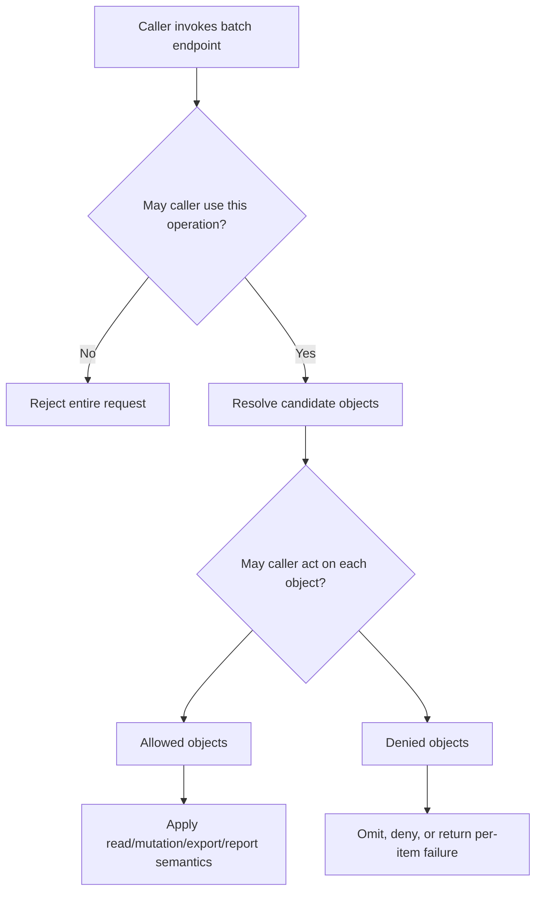
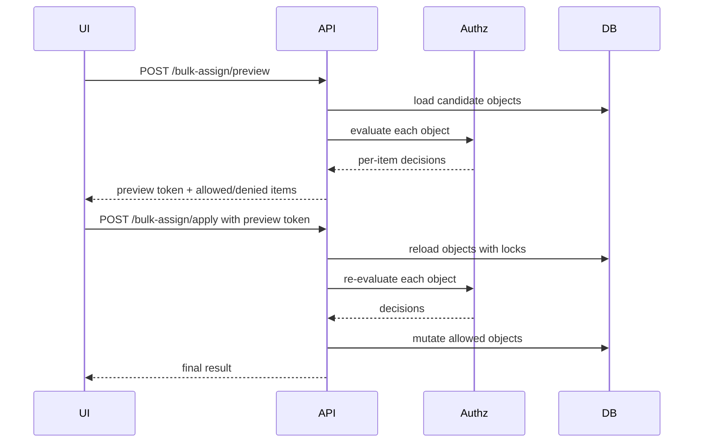
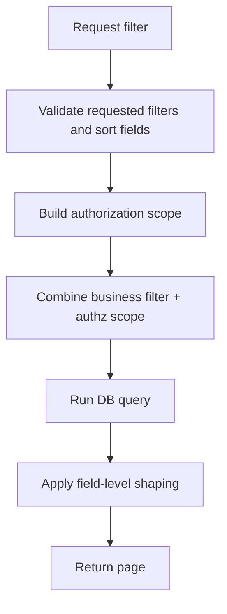
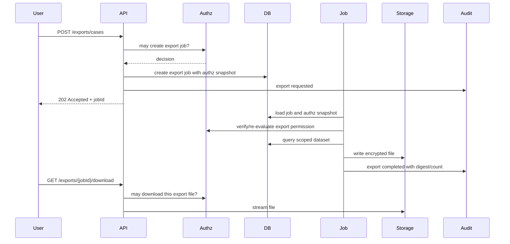
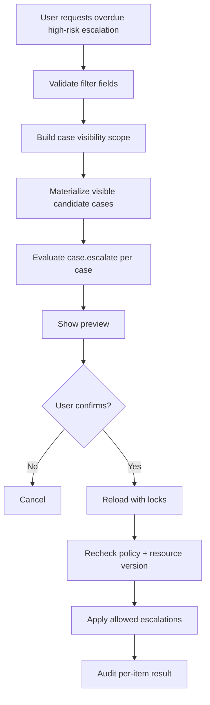

# Part 021 — Batch, Bulk, Search, Export, and Report Authorization

Single-object authorization is not enough.

Most authorization bugs in mature systems move from obvious endpoints like this:

```http
GET /cases/{caseId}
PATCH /cases/{caseId}
```

to less obvious endpoints like this:

```http
POST /cases/batch-get
POST /cases/bulk-assign
GET  /cases/search?status=OPEN&region=WEST
POST /reports/enforcement-backlog
POST /exports/cases.csv
POST /jobs/recalculate-risk
```

The dangerous part is not that these endpoints are complex. The dangerous part is that they often have a different implementation path from the single-object API.

A team may protect `GET /cases/{id}` carefully, but accidentally expose the same case through:

- search result;
- autocomplete endpoint;
- batch lookup;
- CSV export;
- admin report;
- async job status;
- notification payload;
- dashboard count;
- report drill-down;
- attachment manifest;
- event replay endpoint;
- bulk operation preview;
- background worker side effect.

Production-grade authorization must treat batch, bulk, search, export, and report endpoints as first-class authorization surfaces.

OWASP API Security 2023 describes Broken Object Level Authorization as an API risk where object identifiers are manipulated in path/query/header/body payloads. Batch and export APIs multiply that attack surface because one request can carry many object identifiers or return many objects.

The core lesson:

```text
An endpoint that touches N objects requires authorization semantics for N objects.
```

Not one endpoint check. Not one role check. Not one UI button check.

N object decisions, or a query scope that makes unauthorized objects unreachable by construction.

---

## 1. The Core Invariants

For batch, bulk, search, export, and reporting, the minimum invariants are:

```text
1. Every returned object must be individually authorized or produced from an authorized query scope.
2. Every mutated object must be individually authorized for the specific action.
3. Authorization must happen before pagination, counting, aggregation, export, and side effects.
4. Field-level authorization must be applied to every returned/exported object.
5. Async execution must not rely only on the caller's current UI state.
6. Audit must record both the operation-level decision and the object-level result set or an auditable digest.
7. Partial success semantics must be explicit.
8. Unauthorized object existence must not be leaked unless the domain intentionally allows it.
```

The shortest version:

```text
Do not authorize the endpoint. Authorize the dataset and the operation.
```

---

## 2. Endpoint Taxonomy

Batch-like APIs are not one category. They differ by risk and semantics.

| Type | Example | Main Risk |
|---|---|---|
| Batch read | `POST /cases/batch-get` | returns unauthorized objects |
| Bulk mutation | `POST /cases/bulk-assign` | changes unauthorized objects |
| Search/list | `GET /cases?status=OPEN` | leaks objects via result set/count/sort/filter |
| Export | `POST /exports/cases.csv` | leaks large datasets and fields |
| Report | `GET /reports/backlog` | leaks aggregate facts or drill-downs |
| Async job | `POST /jobs/recalculate-risk` | performs side effect after context changes |
| Preview/apply workflow | `POST /bulk/preview`, `POST /bulk/apply` | mismatch between preview authorization and apply authorization |
| Notification/digest | `GET /notifications` | leaks object title or metadata |
| Dashboard | `GET /dashboard` | leaks counts, status, trends, assignment information |

A good authorization design starts by naming which kind of endpoint you are building.

Bad design begins with vague names:

```text
This is just a list endpoint.
This is just an admin report.
This is just a helper endpoint.
This is just export.
```

Those words hide authorization requirements.

---

## 3. Operation-Level vs Object-Level Authorization

A batch endpoint usually needs two levels of authorization.



Operation-level authorization answers:

```text
May this subject use the bulk assignment feature at all?
```

Object-level authorization answers:

```text
May this subject assign this specific case to this specific user?
```

These are different.

A user may be allowed to use the bulk assignment screen but only for cases in their jurisdiction. A user may be allowed to export cases but not sealed cases. A supervisor may bulk close minor cases but not cases under legal hold.

The invariant:

```text
Operation-level authorization never substitutes object-level authorization.
```

---

## 4. Batch Read Pattern

A batch read endpoint accepts multiple IDs and returns multiple resources.

Example request:

```json
{
  "caseIds": ["CASE-100", "CASE-101", "CASE-102"],
  "include": ["summary", "assignee", "risk"]
}
```

The naive implementation:

```java
@PostMapping("/cases/batch-get")
public List<CaseDto> batchGet(@RequestBody BatchGetCasesRequest request) {
    return caseRepository.findAllById(request.caseIds()).stream()
            .map(caseMapper::toDto)
            .toList();
}
```

This is broken.

It bypasses the single-object endpoint guard and returns any object by ID.

### 4.1 Safe Pattern A: Scoped Query

Prefer scoped query when possible:

```java
public List<CaseSummaryDto> batchGet(BatchGetCasesCommand command, Subject subject) {
    CaseReadScope scope = scopeFactory.caseReadScope(subject);

    List<CaseRecord> records = caseRepository.findVisibleByIds(
            scope,
            command.caseIds()
    );

    return records.stream()
            .map(record -> caseFieldPolicy.shapeForRead(subject, record))
            .toList();
}
```

Repository:

```java
public interface CaseRepository {
    List<CaseRecord> findVisibleByIds(CaseReadScope scope, Collection<CaseId> ids);
}
```

SQL shape:

```sql
select c.*
from cases c
where c.id = any(:ids)
  and c.tenant_id = :tenant_id
  and (
       c.assigned_user_id = :subject_id
       or c.owning_unit_id = any(:visible_units)
       or exists (
           select 1
           from case_watchers w
           where w.case_id = c.id
             and w.user_id = :subject_id
       )
  )
```

This pattern has a powerful property:

```text
Unauthorized objects are not loaded into application memory.
```

That is not always possible, but when it is, it reduces bypass risk.

### 4.2 Safe Pattern B: Load Candidates, Then Decide Per Object

Sometimes you need attributes from the object to decide. Then load candidates carefully and decide per object.

```java
public BatchReadResult<CaseSummaryDto> batchGet(BatchGetCasesCommand command, Subject subject) {
    List<CaseRecord> candidates = caseRepository.findAllInTenantByIds(
            subject.tenantId(),
            command.caseIds()
    );

    Map<CaseId, CaseRecord> byId = candidates.stream()
            .collect(Collectors.toMap(CaseRecord::id, Function.identity()));

    List<BatchItemResult<CaseSummaryDto>> results = new ArrayList<>();

    for (CaseId requestedId : command.caseIds()) {
        CaseRecord record = byId.get(requestedId);

        if (record == null) {
            results.add(BatchItemResult.notFoundOrDenied(requestedId));
            continue;
        }

        AuthorizationDecision decision = authorizationService.decide(
                AuthorizationRequest.builder()
                        .subject(subject)
                        .action("case.read")
                        .resource(ResourceRef.of("case", record.id().value()))
                        .attribute("case.status", record.status().name())
                        .attribute("case.classification", record.classification().name())
                        .attribute("case.assignedUserId", record.assignedUserId().value())
                        .build()
        );

        if (!decision.allowed()) {
            results.add(BatchItemResult.notFoundOrDenied(requestedId));
            continue;
        }

        CaseSummaryDto dto = caseFieldPolicy.shapeForRead(subject, record);
        results.add(BatchItemResult.allowed(requestedId, dto));
    }

    return BatchReadResult.of(results);
}
```

The important detail is that tenant restriction happens before loading. Do not load arbitrary global IDs from other tenants unless your data architecture has a stronger isolation mechanism.

### 4.3 Missing vs Denied Semantics

For batch read, the response must decide whether to distinguish missing from denied.

Option A: hide existence.

```json
{
  "results": [
    { "id": "CASE-100", "status": "OK", "value": { "title": "..." } },
    { "id": "CASE-101", "status": "NOT_FOUND" }
  ]
}
```

Option B: show denied.

```json
{
  "results": [
    { "id": "CASE-100", "status": "OK", "value": { "title": "..." } },
    { "id": "CASE-101", "status": "DENIED", "reasonCode": "CASE_NOT_IN_VISIBLE_SCOPE" }
  ]
}
```

Option A is safer for public or cross-tenant APIs. Option B is useful for internal/admin workflows where users need to understand why some items were not processed.

Do not accidentally leak existence through mixed semantics:

```json
{
  "missing": ["CASE-999"],
  "denied": ["CASE-101"]
}
```

That tells the caller that `CASE-101` exists.

Use a domain rule:

```text
External API: denied and missing collapse into NOT_FOUND.
Internal workflow API: denied may be explicit when the caller is allowed to know the object exists.
```

---

## 5. Bulk Mutation Pattern

Bulk mutation is more dangerous than batch read because the endpoint changes state.

Example:

```http
POST /cases/bulk-assign
```

Request:

```json
{
  "caseIds": ["CASE-100", "CASE-101", "CASE-102"],
  "assigneeId": "user-77",
  "reason": "Workload rebalancing"
}
```

The authorization question is not:

```text
May this subject bulk assign cases?
```

The real questions are:

```text
May this subject use bulk assignment?
May this subject assign CASE-100?
May this subject assign CASE-101?
May this subject assign CASE-102?
May this subject assign to user-77?
May this subject assign these cases in their current lifecycle state?
May this subject assign cases of this classification?
May this subject perform this action without violating separation of duties?
```

### 5.1 Bulk Mutation Decision Modes

There are three common modes.

| Mode | Meaning | Use When |
|---|---|---|
| All-or-nothing | if any item denied, no item changes | financial/regulatory sensitive operation |
| Partial success | allowed items change, denied items fail | operational batch workflows |
| Preview-then-apply | caller reviews per-item decision before mutation | high-impact bulk changes |

Do not leave this ambiguous.

### 5.2 All-or-Nothing Example

```java
@Transactional
public BulkAssignResult assignAllOrNothing(BulkAssignCommand command, Subject subject) {
    requireOperation(subject, "case.bulk_assign");

    List<CaseRecord> cases = caseRepository.findForUpdateByIdsInTenant(
            subject.tenantId(),
            command.caseIds()
    );

    if (cases.size() != command.caseIds().size()) {
        throw new AccessDeniedOrNotFoundException();
    }

    List<AuthorizationDecision> decisions = cases.stream()
            .map(caseRecord -> canAssign(subject, caseRecord, command.assigneeId()))
            .toList();

    Optional<AuthorizationDecision> denied = decisions.stream()
            .filter(AuthorizationDecision::denied)
            .findFirst();

    if (denied.isPresent()) {
        audit.deniedBulkOperation(subject, command, denied.get());
        throw new AccessDeniedException("Bulk assign denied");
    }

    for (CaseRecord caseRecord : cases) {
        caseRecord.assignTo(command.assigneeId(), command.reason(), subject.id());
        caseRepository.save(caseRecord);
    }

    audit.allowedBulkOperation(subject, command, cases);
    return BulkAssignResult.success(cases.size());
}
```

All-or-nothing is strict and simple to reason about. Its weakness is user experience: one denied object blocks the whole operation.

### 5.3 Partial Success Example

```java
@Transactional
public BulkAssignResult assignPartial(BulkAssignCommand command, Subject subject) {
    requireOperation(subject, "case.bulk_assign");

    List<CaseRecord> candidates = caseRepository.findForUpdateByIdsInTenant(
            subject.tenantId(),
            command.caseIds()
    );

    Map<CaseId, CaseRecord> byId = candidates.stream()
            .collect(Collectors.toMap(CaseRecord::id, Function.identity()));

    List<BulkItemResult> results = new ArrayList<>();

    for (CaseId id : command.caseIds()) {
        CaseRecord caseRecord = byId.get(id);

        if (caseRecord == null) {
            results.add(BulkItemResult.notFoundOrDenied(id));
            continue;
        }

        AuthorizationDecision decision = canAssign(subject, caseRecord, command.assigneeId());

        if (!decision.allowed()) {
            results.add(BulkItemResult.denied(id, decision.safeReasonCode()));
            continue;
        }

        caseRecord.assignTo(command.assigneeId(), command.reason(), subject.id());
        caseRepository.save(caseRecord);
        results.add(BulkItemResult.changed(id));
    }

    audit.bulkItemResults(subject, command, results);
    return BulkAssignResult.partial(results);
}
```

Partial success must be explicit in the API contract. Otherwise clients will make unsafe assumptions.

Bad response:

```json
{ "success": true }
```

Good response:

```json
{
  "mode": "PARTIAL_SUCCESS",
  "changed": 2,
  "failed": 1,
  "items": [
    { "id": "CASE-100", "status": "CHANGED" },
    { "id": "CASE-101", "status": "DENIED", "reasonCode": "CASE_OUTSIDE_JURISDICTION" },
    { "id": "CASE-102", "status": "CHANGED" }
  ]
}
```

### 5.4 Preview-Then-Apply Pattern

Preview-then-apply is common for sensitive operations.



Do not treat preview as final authorization.

Objects can change between preview and apply:

- case status changes;
- assignment changes;
- legal hold is added;
- user role changes;
- policy changes;
- tenant changes;
- classification changes.

The apply step must re-evaluate or verify a signed snapshot with strict version checks.

Preview token should contain or reference:

```text
previewId
subjectId
tenantId
action
resourceIds
policyVersion
resourceVersionVector
expiresAt
nonce
```

Even with a token, the safest model is:

```text
Preview explains likely result. Apply is authoritative.
```

---

## 6. Search and List Authorization

Search endpoints are often the largest object-level authorization surface.

Example:

```http
GET /cases?status=OPEN&sort=createdAt&limit=50&offset=0
```

Bad pattern:

```java
List<CaseRecord> records = caseRepository.search(filter, page);
return records.stream()
        .filter(record -> authorizationService.canRead(subject, record))
        .map(mapper::toDto)
        .toList();
```

This is wrong because authorization happens after pagination.

Suppose the database returns 50 records, then the application filters 47 unauthorized records. The user sees 3 records and may infer existence patterns. Worse, page 2 may contain a different number of authorized objects. Counts, cursors, and sorting become inconsistent.

Correct invariant:

```text
Authorization scope must be part of the query before pagination, sorting, count, aggregation, and response shaping.
```

### 6.1 Correct Query Flow



### 6.2 Java Shape

```java
public Page<CaseSummaryDto> searchCases(CaseSearchQuery query, Subject subject) {
    validateAllowedFilterFields(query, subject);
    validateAllowedSortFields(query, subject);

    CaseReadScope scope = scopeFactory.caseReadScope(subject);

    Page<CaseRecord> page = caseRepository.searchVisibleCases(
            scope,
            query.filter(),
            query.pageRequest()
    );

    List<CaseSummaryDto> shaped = page.items().stream()
            .map(record -> caseFieldPolicy.shapeForList(subject, record))
            .toList();

    return page.mapItems(shaped);
}
```

Repository contract:

```java
Page<CaseRecord> searchVisibleCases(
        CaseReadScope scope,
        CaseSearchFilter filter,
        PageRequest pageRequest
);
```

### 6.3 Filter Field Authorization

Search filters themselves can leak data.

Example:

```http
GET /cases?whistleblowerId=USER-123
```

Even if the response is empty, the endpoint may reveal whether that filter exists or is accepted.

Filter fields need authorization.

| Field | Risk |
|---|---|
| `classification` | reveals sensitive categories |
| `riskScore` | reveals internal scoring model |
| `whistleblowerId` | reveals protected identity |
| `legalHold` | reveals legal strategy |
| `assignedUserId` | reveals workload and investigation assignment |
| `tenantId` | enables cross-tenant probing |
| `deletedAt` | reveals soft-deleted existence |

Pattern:

```java
public void validateAllowedFilterFields(CaseSearchQuery query, Subject subject) {
    for (String field : query.filter().fields()) {
        if (!fieldPolicy.canFilterBy(subject, "case", field)) {
            throw new AccessDeniedException("Filter field not allowed");
        }
    }
}
```

### 6.4 Sort Field Authorization

Sort can leak hidden fields through ordering.

Example:

```http
GET /cases?sort=riskScore
```

Even if `riskScore` is not returned, the caller can infer relative risk by order.

Rule:

```text
If a subject cannot know a field, they usually cannot sort or filter by it.
```

### 6.5 Count Leakage

Counts are data.

```json
{
  "total": 317,
  "items": []
}
```

A count can reveal that cases exist in a region, organization, class, assignee, or legal state.

For sensitive systems, count must be scoped and sometimes suppressed.

Options:

| Option | Meaning |
|---|---|
| Exact scoped count | safe when count scope equals object visibility |
| Approximate count | useful for performance and leakage reduction |
| No count | use cursor pagination |
| Thresholded count | show `100+` instead of exact |
| Delayed report count | require report permission |

Cursor pagination often reduces count leakage.

---

## 7. Export Authorization

Export endpoints deserve special treatment because they create durable copies.

A normal API response is transient. An export file can be downloaded, forwarded, indexed, uploaded to another system, stored on a laptop, emailed, or attached to a case.

Export authorization must answer:

```text
May this subject export this dataset?
May this subject export these fields?
May this subject export this many rows?
May this subject export this format?
May this subject export outside business hours?
May this subject export without approval?
May this subject export data with this classification?
May this subject access the generated file later?
```

### 7.1 Export Is Not Just Search With CSV

Bad implementation:

```java
@GetMapping("/cases/export.csv")
public void export(CaseSearchQuery query, HttpServletResponse response) {
    List<CaseRecord> records = caseRepository.search(query);
    csvWriter.write(records, response.getOutputStream());
}
```

This bypasses:

- query scoping;
- field-level redaction;
- row limits;
- classification restrictions;
- approval workflow;
- audit trail;
- file access policy;
- retention policy.

### 7.2 Export Flow



### 7.3 Export Job Model

```java
public record ExportJob(
        ExportJobId id,
        TenantId tenantId,
        UserId requestedBy,
        String exportType,
        String filterJson,
        String fieldSet,
        String purpose,
        String policyVersion,
        Instant requestedAt,
        Instant expiresAt,
        ExportStatus status,
        String resultObjectKey,
        String resultSha256,
        long rowCount
) {}
```

The export job itself is a protected resource.

Authorization rules:

```text
Only the requesting user, approved delegates, or export administrators may download an export.
Export file access expires.
Export file access is audited.
Export contents are shaped by the subject's export field policy at creation time.
```

### 7.4 Field Policy for Export

Do not reuse UI DTO blindly.

UI list response may include 20 fields. Export may include 200 fields. Report may include derived fields.

Create explicit export field set:

```java
public enum CaseExportField {
    CASE_ID,
    TITLE,
    STATUS,
    ASSIGNEE,
    CREATED_AT,
    RISK_SCORE,
    CLASSIFICATION,
    WHISTLEBLOWER_IDENTITY,
    INTERNAL_NOTES,
    LEGAL_HOLD
}
```

Policy:

```java
public boolean canExportField(Subject subject, CaseExportField field, ExportPurpose purpose) {
    return switch (field) {
        case CASE_ID, TITLE, STATUS, ASSIGNEE, CREATED_AT -> subject.hasPermission("case.export.basic");
        case RISK_SCORE, CLASSIFICATION -> subject.hasPermission("case.export.sensitive");
        case WHISTLEBLOWER_IDENTITY -> subject.hasPermission("case.export.protected_identity")
                && purpose == ExportPurpose.REGULATORY_SUBMISSION;
        case INTERNAL_NOTES, LEGAL_HOLD -> subject.hasPermission("case.export.legal");
    };
}
```

### 7.5 Export Size Limits Are Authorization Controls

Export size is not only performance. It is data exfiltration control.

Examples:

```text
case.export.basic: max 1,000 rows
case.export.sensitive: max 10,000 rows with approval
case.export.regulatory_submission: max 100,000 rows with case-specific purpose
case.export.full_tenant: break-glass only
```

Model row limit as policy, not config hidden in controller.

```java
public record ExportLimits(
        long maxRows,
        boolean requiresApproval,
        boolean requiresPurpose,
        Duration fileTtl
) {}
```

---

## 8. Report Authorization

Reports are dangerous because they may not expose individual objects but still reveal facts.

Example:

```json
{
  "region": "WEST",
  "openHighRiskCases": 3,
  "overdueCases": 1
}
```

If only three people know about a confidential enforcement action in the West region, this aggregate can leak sensitive information.

Report authorization must cover:

- report definition;
- parameter values;
- row-level scope;
- aggregate fields;
- drill-down links;
- export capability;
- schedule/subscription;
- recipient list;
- minimum cell thresholds;
- suppression rules;
- caching scope.

### 8.1 Report Definition as Protected Resource

```java
public record ReportDefinition(
        String reportKey,
        Set<String> requiredPermissions,
        Set<String> allowedParameters,
        Set<String> sensitiveMetrics,
        boolean supportsDrillDown,
        boolean supportsExport
) {}
```

Authorization:

```java
AuthorizationDecision decision = authorizationService.decide(
        AuthorizationRequest.builder()
                .subject(subject)
                .action("report.run")
                .resource(ResourceRef.of("report", reportKey))
                .attribute("report.parameters", request.parameters())
                .build()
);
```

But this only authorizes the report operation. The query still must be scoped.

### 8.2 Aggregate Scope

Bad report query:

```sql
select region, count(*)
from cases
where status = 'OPEN'
group by region;
```

Correct report query shape:

```sql
select c.region, count(*)
from cases c
where c.status = 'OPEN'
  and c.tenant_id = :tenant_id
  and exists (
      select 1
      from visible_case_scope v
      where v.case_id = c.id
        and v.subject_id = :subject_id
  )
group by c.region;
```

The report must aggregate only over data the subject can see, unless the subject has an explicit aggregate-only permission whose leakage risk has been reviewed.

### 8.3 Small Cell Suppression

Some reports require minimum group thresholds.

```java
public ReportCell renderCount(long count, ReportSensitivity sensitivity) {
    if (sensitivity == ReportSensitivity.PROTECTED && count > 0 && count < 5) {
        return ReportCell.suppressed("LOW_CELL_COUNT");
    }
    return ReportCell.number(count);
}
```

This is common in privacy-sensitive analytics. The exact threshold is domain-specific.

### 8.4 Drill-Down Authorization

A dashboard may show a count. Clicking it may list objects.

Do not assume that because a user may see aggregate count, they may see individual rows.

```text
report.run != case.search
report.view_aggregate != report.drill_down
report.export != report.run
```

Drill-down must reapply object-level query scoping.

---

## 9. Async Job Authorization

Async jobs introduce time.

Authorization at request time may not be valid at execution time.

Example:

```http
POST /jobs/bulk-close-cases
```

The job runs 20 minutes later. During those 20 minutes:

- caller loses role;
- policy changes;
- case enters legal hold;
- case is reassigned;
- tenant is suspended;
- approver revokes approval;
- job payload is modified;
- target object is deleted.

### 9.1 Snapshot vs Recheck

There are two primary strategies.

| Strategy | Meaning | Risk |
|---|---|---|
| Snapshot | authorize once and store proof | stale authorization |
| Recheck | evaluate at execution time | result may differ from preview |
| Snapshot + version check | store proof and reject if facts changed | safest for sensitive flows |

For high-risk systems, prefer:

```text
Authorize at submission.
Store authorization snapshot.
Recheck at execution.
Require resource version match for sensitive operations.
```

### 9.2 Job Record

```java
public record AuthorizedJob(
        JobId id,
        TenantId tenantId,
        UserId requestedBy,
        String action,
        String requestPayloadHash,
        String policyVersionAtSubmission,
        Map<String, Long> resourceVersions,
        Instant submittedAt,
        Instant expiresAt,
        JobStatus status
) {}
```

### 9.3 Worker Guard

```java
public void execute(JobId jobId) {
    AuthorizedJob job = jobRepository.find(jobId);

    Subject subject = subjectRepository.snapshotSubject(job.requestedBy(), job.tenantId());

    if (job.expiresAt().isBefore(clock.instant())) {
        jobRepository.markRejected(jobId, "JOB_AUTHORIZATION_EXPIRED");
        return;
    }

    BulkCloseCommand command = payloadStore.read(jobId, BulkCloseCommand.class);

    BulkAuthorizationPlan plan = bulkAuthorizationPlanner.planCloseCases(subject, command);

    if (!plan.allAllowed()) {
        jobRepository.markRejected(jobId, "AUTHORIZATION_RECHECK_FAILED");
        audit.jobRejected(job, plan);
        return;
    }

    bulkCloseExecutor.execute(command, subject, plan);
}
```

Never let workers execute privileged operations merely because the message is in Kafka or a database queue.

Queue presence is not authorization.

---

## 10. Bulk Authorization Planner

For complex operations, create a planner.

The planner separates decision from side effect.

```java
public final class BulkAuthorizationPlanner {
    private final AuthorizationService authorizationService;
    private final CaseRepository caseRepository;

    public BulkAuthorizationPlan planAssignCases(Subject subject, BulkAssignCommand command) {
        List<CaseRecord> cases = caseRepository.findByIdsInTenant(
                subject.tenantId(),
                command.caseIds()
        );

        Map<CaseId, CaseRecord> byId = cases.stream()
                .collect(Collectors.toMap(CaseRecord::id, Function.identity()));

        List<BulkAuthorizationItem> items = new ArrayList<>();

        for (CaseId id : command.caseIds()) {
            CaseRecord record = byId.get(id);
            if (record == null) {
                items.add(BulkAuthorizationItem.notFoundOrDenied(id));
                continue;
            }

            AuthorizationDecision decision = authorizationService.decide(
                    AuthorizationRequest.builder()
                            .subject(subject)
                            .action("case.assign")
                            .resource(ResourceRef.of("case", id.value()))
                            .attribute("targetAssigneeId", command.assigneeId().value())
                            .attribute("case.status", record.status().name())
                            .attribute("case.classification", record.classification().name())
                            .attribute("case.version", record.version())
                            .build()
            );

            items.add(BulkAuthorizationItem.from(id, decision, record.version()));
        }

        return new BulkAuthorizationPlan("case.assign", subject.id(), items);
    }
}
```

Plan object:

```java
public record BulkAuthorizationPlan(
        String action,
        UserId subjectId,
        List<BulkAuthorizationItem> items
) {
    public boolean allAllowed() {
        return items.stream().allMatch(BulkAuthorizationItem::allowed);
    }

    public List<CaseId> allowedIds() {
        return items.stream()
                .filter(BulkAuthorizationItem::allowed)
                .map(BulkAuthorizationItem::resourceId)
                .toList();
    }
}
```

This makes authorization result testable before mutation.

---

## 11. Policy for Target Objects and Target Users

Bulk operations often involve target objects and target users.

Example:

```text
Assign cases A, B, C to user X.
```

You must authorize both sides:

```text
May caller assign each case?
May caller assign to target user X?
May target user X receive each case?
```

A target assignee may be outside the caller's unit, suspended, unlicensed, conflict-of-interest restricted, or lacking clearance.

Java shape:

```java
AuthorizationDecision targetDecision = authorizationService.decide(
        AuthorizationRequest.builder()
                .subject(subject)
                .action("case.assign_to_user")
                .resource(ResourceRef.of("user", command.assigneeId().value()))
                .attribute("targetUser.status", targetUser.status().name())
                .attribute("targetUser.unitId", targetUser.unitId().value())
                .build()
);
```

Then per case:

```java
AuthorizationDecision itemDecision = authorizationService.decide(
        AuthorizationRequest.builder()
                .subject(subject)
                .action("case.assign")
                .resource(ResourceRef.of("case", caseRecord.id().value()))
                .attribute("targetUserId", targetUser.id().value())
                .attribute("targetUserClearance", targetUser.clearance().name())
                .attribute("caseClassification", caseRecord.classification().name())
                .build()
);
```

This avoids a common bug:

```text
Caller can modify the case, therefore caller can assign it to anyone.
```

False.

---

## 12. Idempotency and Authorization

Bulk APIs should usually support idempotency keys.

But idempotency interacts with authorization.

Scenario:

1. User submits bulk assignment with idempotency key `K`.
2. Request succeeds for 10 cases.
3. User loses permission.
4. User retries with same idempotency key.

What should happen?

Recommended behavior:

```text
If the original operation completed, return the original result for the same subject, same tenant, same payload hash, and same idempotency key.
If payload differs, reject.
If subject differs, reject.
If operation was only reserved but not executed, re-evaluate authorization.
```

Idempotency record:

```java
public record IdempotencyRecord(
        String key,
        TenantId tenantId,
        UserId subjectId,
        String action,
        String payloadHash,
        String resultHash,
        Instant createdAt,
        Instant expiresAt
) {}
```

Do not let one user replay another user's idempotency key.

---

## 13. Error Semantics

Bulk APIs need stable error semantics.

Recommended item statuses:

```java
public enum BulkItemStatus {
    CHANGED,
    UNCHANGED,
    DENIED,
    NOT_FOUND,
    NOT_FOUND_OR_DENIED,
    CONFLICT,
    VALIDATION_FAILED,
    SKIPPED,
    FAILED
}
```

Rules:

```text
Use NOT_FOUND_OR_DENIED when existence must be hidden.
Use DENIED only when caller may know the object exists.
Use CONFLICT for version/state mismatch.
Use VALIDATION_FAILED for request errors unrelated to authorization.
Use FAILED for internal execution failure after authorization.
```

Never return raw policy internals to normal clients:

Bad:

```json
{ "reason": "subject.clearance=LOW < object.classification=SECRET" }
```

Better:

```json
{ "reasonCode": "INSUFFICIENT_CLEARANCE" }
```

Internal audit may store richer diagnostic facts.

---

## 14. Caching Batch Decisions

Batch authorization can be expensive. But caching decisions is risky.

A decision cache key must include enough facts:

```text
subject id
subject version / role version / entitlement version
subject tenant
resource type
resource id
resource version or authorization-relevant version
action
policy version
context digest
```

Bad key:

```text
userId + permissionName
```

This ignores the object.

Better key:

```java
public record DecisionCacheKey(
        TenantId tenantId,
        UserId subjectId,
        long subjectAuthzVersion,
        String action,
        String resourceType,
        String resourceId,
        long resourceAuthzVersion,
        String policyVersion,
        String contextDigest
) {}
```

For bulk operations, cache individual decisions only if invalidation is strong enough.

Often better:

```text
cache attributes and scopes, not final high-risk mutation decisions.
```

---

## 15. Audit Design for Batch Operations

Audit must be useful without becoming impossible to store.

For small operations, log every item.

For large exports, log digest and query facts.

### 15.1 Small Bulk Audit

```json
{
  "eventType": "BULK_AUTHORIZATION_DECISION",
  "tenantId": "T1",
  "subjectId": "U1",
  "action": "case.assign",
  "operationId": "op-123",
  "policyVersion": "2026-07-03.4",
  "mode": "PARTIAL_SUCCESS",
  "items": [
    { "resourceType": "case", "resourceId": "CASE-100", "decision": "ALLOW" },
    { "resourceType": "case", "resourceId": "CASE-101", "decision": "DENY", "reasonCode": "CASE_OUTSIDE_JURISDICTION" }
  ]
}
```

### 15.2 Large Export Audit

```json
{
  "eventType": "EXPORT_AUTHORIZATION_DECISION",
  "tenantId": "T1",
  "subjectId": "U1",
  "action": "case.export",
  "exportJobId": "export-123",
  "policyVersion": "2026-07-03.4",
  "queryHash": "sha256:...",
  "fieldSet": "REGULATORY_BASIC",
  "rowCount": 10432,
  "resultSha256": "sha256:...",
  "storageObjectKey": "exports/T1/export-123.enc",
  "decision": "ALLOW"
}
```

The audit log should answer:

```text
Who requested the operation?
What operation was requested?
Which resource set was affected?
Which policy version made the decision?
Which fields were exposed?
How many rows were exported?
Was the operation approved?
Who downloaded the result?
When did the file expire?
```

---

## 16. Database Constraints and Race Conditions

Authorization is not only a pre-check. Race conditions can invalidate decisions.

Example:

1. Authorization says user may close case because case is `OPEN`.
2. Another transaction puts case under `LEGAL_HOLD`.
3. First transaction closes case anyway.

Use optimistic locking or conditional updates.

```sql
update cases
set status = 'CLOSED', closed_by = :subject_id, closed_at = now()
where id = :case_id
  and tenant_id = :tenant_id
  and status = 'OPEN'
  and legal_hold = false
  and version = :expected_version;
```

Then check affected row count.

```java
int updated = caseRepository.closeIfStillAllowedFacts(
        caseId,
        subject.tenantId(),
        expectedVersion,
        subject.id()
);

if (updated == 0) {
    throw new ConflictException("Case changed before close");
}
```

This does not replace authorization. It protects the authorization-relevant facts from race conditions.

---

## 17. Bulk Delete Is Special

Bulk delete deserves extra constraints.

Deletion can destroy evidence, hide fraud, bypass retention, or break audit chains.

Rules:

```text
Prefer soft delete with retention.
Require explicit delete permission.
Require object-level delete decision per item.
Require legal hold check.
Require tenant check.
Require reason.
Require audit before mutation.
Consider maker-checker for high-risk deletes.
Never allow bulk delete based only on search filters without preview.
```

Dangerous endpoint:

```http
DELETE /cases?status=CLOSED
```

Safer flow:

```text
POST /cases/delete-preview
POST /cases/delete-approval
POST /cases/delete-apply
```

---

## 18. Authorization for Bulk by Filter

Bulk operations often target a filter rather than explicit IDs.

Example:

```json
{
  "filter": {
    "status": "OPEN",
    "region": "WEST",
    "ageDaysGreaterThan": 90
  },
  "operation": "ESCALATE"
}
```

This is high-risk because the target set can change between preview and apply.

Safe approach:

```text
1. Validate filter fields.
2. Build authorization scope.
3. Materialize candidate IDs into a job table.
4. Store query hash, policy version, and resource versions.
5. Show preview count and sample.
6. Require confirmation/approval.
7. Apply to materialized IDs, with recheck/version check.
```

Materialized job item:

```java
public record BulkJobItem(
        JobId jobId,
        String resourceType,
        String resourceId,
        long resourceVersionAtPreview,
        BulkItemStatus previewStatus,
        String previewReasonCode
) {}
```

Do not execute a bulk mutation directly from a user-supplied filter without scoping and materialization.

---

## 19. Cross-Service Bulk Authorization

In microservices, one bulk operation may touch multiple services.

Example:

```text
Bulk close case
- case service changes case state
- task service closes open tasks
- document service locks attachments
- notification service sends messages
- reporting service updates projections
```

Authorization must be decided at the command boundary, then propagated as an authorization context or operation record.

Do not let downstream services blindly trust the upstream service unless your service-to-service contract explicitly says the upstream is an authorized command issuer.

Recommended model:

```text
User-facing service authorizes user command.
Operation ID is created.
Downstream commands include operation ID, tenant ID, subject ID, and authorized action.
Downstream services verify operation record or enforce their own resource-specific guards.
```

Event payload:

```json
{
  "eventType": "CaseBulkClosed",
  "operationId": "op-123",
  "tenantId": "T1",
  "authorizedBy": "U1",
  "policyVersion": "2026-07-03.4",
  "caseIds": ["CASE-100", "CASE-102"],
  "occurredAt": "2026-07-03T10:15:00Z"
}
```

Do not include unauthorized denied IDs in broad event topics unless subscribers are authorized to see them.

---

## 20. Java API Contract Patterns

### 20.1 Batch Read Contract

```java
public record BatchGetRequest<T>(
        List<T> ids,
        Set<String> include
) {}

public record BatchGetResponse<T, V>(
        List<BatchItem<T, V>> items
) {}

public record BatchItem<T, V>(
        T id,
        BulkItemStatus status,
        String reasonCode,
        V value
) {}
```

### 20.2 Bulk Mutation Contract

```java
public record BulkMutationResponse<T>(
        String operationId,
        String mode,
        int requested,
        int changed,
        int failed,
        List<BulkMutationItem<T>> items
) {}

public record BulkMutationItem<T>(
        T id,
        BulkItemStatus status,
        String reasonCode,
        Long previousVersion,
        Long newVersion
) {}
```

### 20.3 Export Contract

```java
public record ExportRequest(
        String reportType,
        Map<String, Object> filter,
        Set<String> fields,
        String purpose,
        String idempotencyKey
) {}

public record ExportAcceptedResponse(
        String exportJobId,
        String status,
        Instant expiresAt
) {}
```

---

## 21. Testing Strategy

Batch authorization requires tests that single-object endpoints do not cover.

### 21.1 Batch Read Tests

```text
Given user can read CASE-1 but not CASE-2
When user batch reads [CASE-1, CASE-2]
Then response includes CASE-1
And response does not expose CASE-2 fields
And response does not leak CASE-2 existence unless policy allows it
```

### 21.2 Search Tests

```text
Given user can see only unit A
When user searches all OPEN cases
Then SQL scope includes unit A constraint
And total count equals visible count
And pagination is applied after authorization scope
```

### 21.3 Sort/Filter Tests

```text
Given user cannot see riskScore
When user sorts by riskScore
Then request is denied
```

### 21.4 Bulk Mutation Tests

```text
Given one allowed case and one denied case
When bulk assign runs in all-or-nothing mode
Then no case changes
```

```text
Given one allowed case and one denied case
When bulk assign runs in partial mode
Then only allowed case changes
And denied case is audited
```

### 21.5 Export Tests

```text
Given user cannot export legal fields
When user exports case data
Then CSV does not contain legal fields
And audit records field set
```

### 21.6 Async Recheck Tests

```text
Given user schedules bulk close
And case enters legal hold before job execution
When job runs
Then case is not closed
And job records authorization recheck failure
```

---

## 22. Anti-Patterns

### Anti-Pattern 1: Endpoint-Level Bulk Role Check

```java
@PreAuthorize("hasRole('SUPERVISOR')")
@PostMapping("/cases/bulk-close")
public BulkCloseResult close(@RequestBody BulkCloseRequest request) {
    return service.close(request.caseIds());
}
```

This checks only operation access. It does not check each case.

### Anti-Pattern 2: Filter After Pagination

```java
Page<Case> page = repository.search(filter, pageable);
return page.items().stream().filter(this::canRead).toList();
```

This creates count and pagination leaks.

### Anti-Pattern 3: Export Uses Entity Directly

```java
csvWriter.write(caseRepository.search(filter));
```

This bypasses field policy.

### Anti-Pattern 4: Async Job Trusts Submitted Payload

```java
worker.closeCases(message.caseIds());
```

The worker must recheck or validate a stored authorization record.

### Anti-Pattern 5: Report Cache Without Subject Scope

```text
cacheKey = reportKey + filterHash
```

If report content depends on authorization scope, cache key must include subject/tenant/scope version or report must be generated from globally safe aggregate data.

### Anti-Pattern 6: Returning Denied IDs to Unauthorized Clients

```json
{ "denied": ["CASE-123"] }
```

This leaks existence unless the caller is allowed to know.

### Anti-Pattern 7: Bulk by Filter Without Preview

```http
POST /cases/bulk-delete?status=CLOSED
```

A user mistake or filter injection can delete thousands of records.

---

## 23. Production Checklist

For each batch/search/export/report endpoint, answer these questions:

```text
What is the operation-level permission?
What is the object-level permission?
Is the target set explicit IDs, query filter, or derived report dataset?
Is authorization applied before pagination and count?
Are filter fields authorized?
Are sort fields authorized?
Are response fields authorized?
Are export fields authorized separately from UI fields?
Are row limits policy-driven?
Is partial success allowed?
Are denied and missing collapsed where necessary?
Is every mutation protected against race conditions?
Does async execution recheck authorization?
Is the job/download/report itself a protected resource?
Does audit capture policy version and resource set digest?
Is cache keyed by authorization-relevant facts?
Are negative tests written for mixed allowed/denied objects?
```

If the answer is unclear, the endpoint is probably not production-ready.

---

## 24. Regulatory Case Management Example

Imagine a regulatory enforcement platform.

Objects:

```text
case
evidence
task
notice
inspection
legal_review
export_job
report
```

Users:

```text
case officer
supervisor
legal reviewer
auditor
regional director
external agency liaison
system worker
```

Bulk operation:

```text
Escalate all overdue high-risk cases in region WEST.
```

Authorization requirements:

```text
Caller must have case.bulk_escalate.
Caller must be allowed to see region WEST cases.
Caller must be allowed to escalate each case.
Cases under legal hold are denied.
Cases assigned to another restricted unit are denied.
Sealed evidence is not exported in preview.
Preview materializes candidate case IDs.
Apply rechecks status/version/legal hold.
Partial success is allowed only if policy says so.
Audit records allowed/denied counts and reason codes.
```

Mermaid flow:



This design is slower than a direct SQL update. It is also defensible.

In regulated systems, defensibility is not optional.

---

## 25. The Mental Model

Batch authorization is not a special case.

It is normal authorization applied to a set.

The trap is that batch endpoints tempt teams to compress many decisions into one decision:

```text
User is supervisor -> allow bulk endpoint.
```

That is not enough.

A correct model says:

```text
User may use this operation.
User may access this dataset.
User may perform this action on each object.
User may see or change each field.
User may persist, export, schedule, or replay the result.
```

When the endpoint touches many resources, authorization must either:

```text
constrain the query so unauthorized resources cannot appear
```

or:

```text
evaluate every resource decision explicitly
```

Everything else is hope.

---

## References

- OWASP API Security 2023 — API1: Broken Object Level Authorization: https://owasp.org/API-Security/editions/2023/en/0xa1-broken-object-level-authorization/
- OWASP API Security 2023 — API3: Broken Object Property Level Authorization: https://owasp.org/API-Security/editions/2023/en/0xa3-broken-object-property-level-authorization/
- OWASP Authorization Cheat Sheet: https://cheatsheetseries.owasp.org/cheatsheets/Authorization_Cheat_Sheet.html
- NIST SP 800-162, Attribute Based Access Control: https://csrc.nist.gov/pubs/sp/800/162/upd2/final
- Spring Security Authorization Architecture: https://docs.spring.io/spring-security/reference/servlet/authorization/architecture.html
