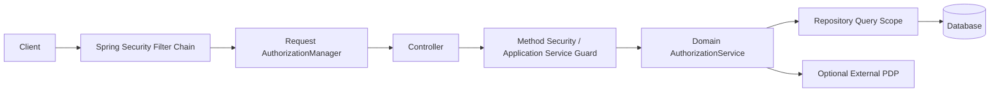

# Part 022 — Spring Security Authorization Architecture

Spring Security is not just a login library.

In production Java systems, it is often the first authorization enforcement layer inside a Spring application. It can protect HTTP requests, method invocations, messages, and reactive flows. Its modern authorization model centers around `AuthorizationManager`, which is responsible for making access-control decisions for a secure object.

But there is a dangerous misunderstanding:

```text
Using Spring Security does not mean your domain authorization is solved.
```

Spring Security is excellent at being a framework-level Policy Enforcement Point. It can route requests through a security filter chain, extract authentication, check authorities, enforce method annotations, integrate with JWT/OAuth2 resource server support, and test security behavior.

But the hardest authorization problems are domain problems:

```text
May this investigator view this case?
May this supervisor assign this case to that user?
May this officer export these fields?
May this user close this case in its current lifecycle state?
May this tenant admin grant this role without violating separation of duties?
```

Those questions require resource attributes, relationships, tenant scope, lifecycle state, field-level policy, audit, and sometimes external policy engines.

The goal of this part is to show how to use Spring Security as a strong authorization foundation without collapsing all authorization into `hasRole('ADMIN')` or scattered SpEL expressions.

---

## 1. Spring Security as PEP, Not Entire Authorization Brain

Map Spring Security to the PDP/PEP model:



Spring Security can enforce at multiple points:

| Layer | Spring Mechanism | Good For | Not Enough For |
|---|---|---|---|
| HTTP request | `SecurityFilterChain`, `authorizeHttpRequests` | route-level access, coarse gates | object-level decisions |
| Request custom decision | `AuthorizationManager<RequestAuthorizationContext>` | tenant/action route guard | deep domain state unless loaded |
| Method invocation | method security annotations/interceptors | application service authorization | query scoping if misused |
| Expression authorization | SpEL with bean guards | concise integration | complex policy readability |
| Testing | `spring-security-test` | MockMvc/method security tests | full domain abuse testing by itself |

Spring Security should usually be your framework guardrail, not your only policy model.

---

## 2. The Core Invariant

For Spring applications:

```text
Every externally reachable endpoint must pass through a Spring Security chain.
Every protected route must have a request-level authorization rule.
Every protected domain action must have a domain-level authorization decision.
Every object-returning query must be scoped before pagination/count/export.
Every method annotation must delegate complex decisions to typed Java code, not become a policy language swamp.
```

The key design is layered enforcement:

```text
HTTP route gate -> application action guard -> repository/query scope -> field shaping -> audit
```

---

## 3. The Mental Model: Authentication, Authorities, and Authorization

In Spring Security, a request typically has an `Authentication` in the security context after authentication.

That `Authentication` may contain:

- principal identity;
- credentials or credential marker;
- granted authorities;
- authentication status;
- token attributes if using JWT/OAuth2 support;
- application-specific principal object if customized.

A common mistake is treating authorities as the entire authorization model.

Example:

```java
@PreAuthorize("hasRole('SUPERVISOR')")
public CaseDto getCase(String caseId) {
    return caseRepository.findById(caseId).map(mapper::toDto).orElseThrow();
}
```

This says:

```text
Any supervisor may read any case.
```

Maybe that is true in a small system. It is usually false in enterprise systems.

Better:

```java
@PreAuthorize("@caseGuard.canRead(authentication, #caseId)")
public CaseDto getCase(String caseId) {
    return caseApplicationService.getCase(caseId);
}
```

Better still, inside the application service:

```java
public CaseDto getCase(CaseId caseId) {
    Subject subject = currentSubject.require();

    CaseRecord record = caseRepository.findVisibleById(subject.caseReadScope(), caseId)
            .orElseThrow(NotFoundOrDeniedException::new);

    return caseFieldPolicy.shapeForRead(subject, record);
}
```

The annotation is not the domain authorization. It is an entry-point guard.

---

## 4. Request Authorization with `SecurityFilterChain`

Modern Spring Security configuration commonly defines one or more `SecurityFilterChain` beans.

Basic shape:

```java
@Configuration
@EnableWebSecurity
class SecurityConfiguration {

    @Bean
    SecurityFilterChain apiSecurity(HttpSecurity http) throws Exception {
        return http
                .csrf(csrf -> csrf.disable())
                .authorizeHttpRequests(authz -> authz
                        .requestMatchers("/actuator/health").permitAll()
                        .requestMatchers(HttpMethod.GET, "/api/v1/public/**").permitAll()
                        .requestMatchers("/api/v1/admin/**").hasAuthority("admin.access")
                        .requestMatchers("/api/v1/**").authenticated()
                        .anyRequest().denyAll()
                )
                .oauth2ResourceServer(oauth2 -> oauth2.jwt(Customizer.withDefaults()))
                .build();
    }
}
```

Notice two important rules:

```text
Use denyAll for unmatched requests.
Use specific matchers before broad matchers.
```

Bad:

```java
.requestMatchers("/**").authenticated()
```

This permits any authenticated user into every newly added route unless method/domain authorization catches it.

Better:

```java
.requestMatchers("/api/v1/cases/**").authenticated()
.requestMatchers("/api/v1/reports/**").hasAuthority("report.access")
.anyRequest().denyAll()
```

Request authorization is a coarse gate. It should prevent anonymous or clearly unprivileged access before the request reaches controllers.

---

## 5. Authority Naming

Spring Security historically used role conventions like `ROLE_ADMIN`. In production systems, prefer explicit permissions/authorities for application authorization.

Examples:

```text
case.read
case.search
case.assign
case.close
case.export
report.run
audit.read
role.grant
```

Then use roles/groups as assignment mechanisms, not hardcoded policy names everywhere.

Bad:

```java
.hasRole("ADMIN")
```

Better coarse route gate:

```java
.hasAuthority("case.access")
```

Better domain action guard:

```java
authorizationService.require(subject, "case.assign", resourceRef, context);
```

A useful convention:

```text
Authorities in Spring are coarse-grained capabilities.
Domain permissions are typed business actions.
Object decisions live in AuthorizationService or PDP.
```

---

## 6. Custom `AuthorizationManager` for Request Authorization

`AuthorizationManager` is the modern Spring abstraction for authorization decisions.

You can implement request-level decisions using `AuthorizationManager<RequestAuthorizationContext>`.

Example: tenant route guard.

```java
@Component
public final class TenantRequestAuthorizationManager
        implements AuthorizationManager<RequestAuthorizationContext> {

    private final TenantAccessService tenantAccessService;

    public TenantRequestAuthorizationManager(TenantAccessService tenantAccessService) {
        this.tenantAccessService = tenantAccessService;
    }

    @Override
    public AuthorizationDecision check(
            Supplier<Authentication> authentication,
            RequestAuthorizationContext context
    ) {
        Authentication auth = authentication.get();

        if (auth == null || !auth.isAuthenticated()) {
            return new AuthorizationDecision(false);
        }

        String tenantId = context.getVariables().get("tenantId");
        if (tenantId == null || tenantId.isBlank()) {
            return new AuthorizationDecision(false);
        }

        boolean allowed = tenantAccessService.canAccessTenant(auth, tenantId);
        return new AuthorizationDecision(allowed);
    }
}
```

Usage:

```java
@Bean
SecurityFilterChain apiSecurity(
        HttpSecurity http,
        TenantRequestAuthorizationManager tenantAuthz
) throws Exception {
    return http
            .authorizeHttpRequests(authz -> authz
                    .requestMatchers("/api/v1/tenants/{tenantId}/**").access(tenantAuthz)
                    .anyRequest().denyAll()
            )
            .oauth2ResourceServer(oauth2 -> oauth2.jwt(Customizer.withDefaults()))
            .build();
}
```

This is useful when the route contains authorization-relevant variables.

But do not load deep domain objects inside request authorization unless you understand the cost and error semantics.

Good request-level checks:

```text
authenticated
has coarse authority
tenant route membership
API audience/scope
service account type
high-level feature access
```

Poor request-level checks:

```text
complex case lifecycle decision
field-level policy
batch item decision
export row-level decision
state transition invariant
```

Those belong deeper.

---

## 7. Method Security

Spring method security protects method invocations, usually service methods.

Enable it:

```java
@Configuration
@EnableMethodSecurity
class MethodSecurityConfiguration {
}
```

Then:

```java
@Service
public class CaseApplicationService {

    @PreAuthorize("hasAuthority('case.search')")
    public Page<CaseSummaryDto> search(CaseSearchQuery query) {
        // still must apply query scoping inside
    }

    @PreAuthorize("@caseGuard.canRead(authentication, #caseId)")
    public CaseDto getCase(CaseId caseId) {
        // still should use scoped loading or domain guard inside
    }
}
```

### 7.1 Method Security Is a Boundary Guard

Method security is strongest when used to guard application service entry points.

Bad placement:

```java
@Repository
public interface CaseRepository {
    @PreAuthorize("hasAuthority('case.read')")
    Optional<CaseRecord> findById(CaseId id);
}
```

This can make query scoping unclear and mix persistence with security behavior.

Better:

```java
@Service
public class CaseApplicationService {
    public CaseDto getCase(CaseId id) {
        Subject subject = currentSubject.require();
        CaseRecord record = caseRepository.findVisibleById(subject.caseReadScope(), id)
                .orElseThrow(NotFoundOrDeniedException::new);
        return fieldPolicy.shapeForRead(subject, record);
    }
}
```

### 7.2 Prefer Bean Guards Over Long SpEL

Bad:

```java
@PreAuthorize("hasAuthority('case.assign') and #case.status.name() == 'OPEN' and #case.tenantId == authentication.principal.tenantId and !#case.legalHold and @clearance.compare(authentication, #case) >= 0")
```

This is unreadable, hard to test, and hard to audit.

Better:

```java
@PreAuthorize("@caseGuard.canAssign(authentication, #caseId, #assigneeId)")
public CaseDto assignCase(CaseId caseId, UserId assigneeId) {
    return caseApplicationService.assignCase(caseId, assigneeId);
}
```

Guard:

```java
@Component("caseGuard")
public final class CaseGuard {
    private final AuthorizationService authorizationService;
    private final SubjectFactory subjectFactory;
    private final CaseRepository caseRepository;

    public boolean canAssign(Authentication authentication, CaseId caseId, UserId assigneeId) {
        Subject subject = subjectFactory.from(authentication);

        CaseRecord record = caseRepository.findAuthzFactsById(subject.tenantId(), caseId)
                .orElse(null);

        if (record == null) {
            return false;
        }

        AuthorizationDecision decision = authorizationService.decide(
                AuthorizationRequest.builder()
                        .subject(subject)
                        .action("case.assign")
                        .resource(ResourceRef.of("case", caseId.value()))
                        .attribute("case.status", record.status().name())
                        .attribute("case.legalHold", record.legalHold())
                        .attribute("targetAssigneeId", assigneeId.value())
                        .build()
        );

        return decision.allowed();
    }
}
```

Even here, the service should still protect state transitions because method annotations can be bypassed by self-invocation or non-proxied calls if the architecture is careless.

---

## 8. The Self-Invocation Trap

Spring method security is proxy/interceptor-based. A method call from one method to another method inside the same object may not pass through the proxy in common proxy-based configurations.

Example:

```java
@Service
public class CaseService {

    public void outer(CaseId id) {
        inner(id); // may not trigger method security proxy
    }

    @PreAuthorize("@caseGuard.canClose(authentication, #id)")
    public void inner(CaseId id) {
        // protected operation
    }
}
```

Do not make method annotations your only protection for critical domain operations.

Safer pattern:

```java
public void closeCase(CaseId id) {
    Subject subject = currentSubject.require();
    CaseRecord record = caseRepository.findForUpdate(subject.tenantId(), id)
            .orElseThrow(NotFoundOrDeniedException::new);

    authorizationService.require(subject, "case.close", record.toResourceRef(), record.authzContext());

    record.close(subject.id(), clock.instant());
    caseRepository.save(record);
}
```

This remains secure regardless of proxy behavior.

---

## 9. `@PostAuthorize` and `@PostFilter`

Spring supports post-invocation authorization patterns, but they are dangerous if misunderstood.

Example:

```java
@PostAuthorize("returnObject.owner == authentication.name")
public CaseDto getCase(CaseId id) {
    return repository.findById(id).map(mapper::toDto).orElseThrow();
}
```

This loads the object before denying. That may be acceptable for some in-memory object checks, but it can still:

- execute expensive work;
- trigger lazy loading;
- leak timing;
- write logs before denial;
- publish side effects if method is not pure;
- bypass query scoping.

`@PostFilter` is also risky for lists:

```java
@PostFilter("filterObject.owner == authentication.name")
public List<CaseDto> listCases() {
    return repository.findAll();
}
```

This is not acceptable for large datasets. It loads unauthorized data and filters in memory.

Rule:

```text
Use post filtering only for small, already-scoped, side-effect-free collections.
For database-backed object lists, authorization must be in the query.
```

---

## 10. Controller-Level Authorization

Controllers are adapters. They are not the best place for deep policy.

Acceptable controller guard:

```java
@RestController
@RequestMapping("/api/v1/cases")
class CaseController {

    @GetMapping("/{caseId}")
    public CaseDto get(@PathVariable CaseId caseId) {
        return caseApplicationService.getCase(caseId);
    }
}
```

The controller delegates to an application service that performs scoped load and field shaping.

Avoid controller code like:

```java
if (!user.role().equals("ADMIN") && !case.owner().equals(user.id())) {
    throw new AccessDeniedException("denied");
}
```

This creates scattered authorization.

A controller may validate request shape, but policy belongs in a guard/service/PDP that can be tested independently.

---

## 11. Domain Authorization Service

A robust Spring application usually has a typed domain authorization service.

```java
public interface DomainAuthorizationService {
    AuthorizationDecision decide(AuthorizationRequest request);

    default void require(AuthorizationRequest request) {
        AuthorizationDecision decision = decide(request);
        if (!decision.allowed()) {
            throw new AccessDeniedException(decision.safeReasonCode());
        }
    }
}
```

Usage:

```java
public CaseDto closeCase(CaseId caseId, CloseCaseCommand command) {
    Subject subject = currentSubject.require();

    CaseRecord record = caseRepository.findForUpdateByIdInTenant(subject.tenantId(), caseId)
            .orElseThrow(NotFoundOrDeniedException::new);

    authorizationService.require(
            AuthorizationRequest.builder()
                    .subject(subject)
                    .action("case.close")
                    .resource(ResourceRef.of("case", caseId.value()))
                    .attribute("case.status", record.status().name())
                    .attribute("case.legalHold", record.legalHold())
                    .attribute("case.assignedUserId", record.assignedUserId().value())
                    .attribute("reason", command.reason())
                    .build()
    );

    record.close(subject.id(), command.reason(), clock.instant());
    caseRepository.save(record);

    return mapper.toDto(record);
}
```

This pattern avoids putting all authorization in Spring annotations.

Spring Security gets the request to the service safely. The service protects the business operation.

---

## 12. Current Subject Adapter

Do not scatter direct `SecurityContextHolder` reads throughout domain code.

Create an adapter.

```java
@Component
public final class CurrentSubject {

    private final SubjectFactory subjectFactory;

    public CurrentSubject(SubjectFactory subjectFactory) {
        this.subjectFactory = subjectFactory;
    }

    public Subject require() {
        Authentication authentication = SecurityContextHolder.getContext().getAuthentication();
        if (authentication == null || !authentication.isAuthenticated()) {
            throw new AuthenticationCredentialsNotFoundException("No authenticated subject");
        }
        return subjectFactory.from(authentication);
    }
}
```

Then application services use `Subject`, not raw Spring internals.

This gives you:

- cleaner tests;
- ability to support service accounts;
- ability to support batch/async subject snapshots;
- central mapping from JWT/authorities/claims to domain subject;
- less coupling between Spring Security and domain model.

---

## 13. JWT, Scopes, and Authorities

For resource servers, Spring Security can map JWT claims into authorities. A common OAuth2 pattern is to map scopes to authorities.

But remember:

```text
JWT scopes are coarse grants, not object-level authorization proof.
```

Example claims:

```json
{
  "sub": "user-123",
  "tenant_id": "tenant-a",
  "scope": "case.read case.write",
  "roles": ["supervisor"],
  "authz_version": 42
}
```

Mapping to authorities:

```java
@Bean
JwtAuthenticationConverter jwtAuthenticationConverter() {
    JwtGrantedAuthoritiesConverter scopes = new JwtGrantedAuthoritiesConverter();
    scopes.setAuthorityPrefix("");
    scopes.setAuthoritiesClaimName("scope");

    JwtAuthenticationConverter converter = new JwtAuthenticationConverter();
    converter.setJwtGrantedAuthoritiesConverter(scopes);
    return converter;
}
```

This lets route-level checks use `case.read` or `case.write`.

But mutable facts like assignment, clearance, tenant membership, and case state should usually be resolved from authoritative stores or versioned caches.

Do not put every authorization fact into a long-lived JWT and assume it stays correct.

---

## 14. Multi-Tenant Spring Security Pattern

A tenant-aware API often has route shape:

```http
/api/v1/tenants/{tenantId}/cases/{caseId}
```

Authorization must ensure:

```text
The authenticated subject can access tenantId.
The object belongs to tenantId.
The subject can perform action on that object.
```

Controller:

```java
@GetMapping("/api/v1/tenants/{tenantId}/cases/{caseId}")
public CaseDto getCase(
        @PathVariable TenantId tenantId,
        @PathVariable CaseId caseId
) {
    return caseApplicationService.getCase(tenantId, caseId);
}
```

Service:

```java
public CaseDto getCase(TenantId routeTenantId, CaseId caseId) {
    Subject subject = currentSubject.require();

    if (!subject.tenantId().equals(routeTenantId)) {
        throw new AccessDeniedException("TENANT_MISMATCH");
    }

    CaseRecord record = caseRepository.findVisibleById(subject.caseReadScope(), caseId)
            .orElseThrow(NotFoundOrDeniedException::new);

    if (!record.tenantId().equals(routeTenantId)) {
        throw new AccessDeniedException("TENANT_MISMATCH");
    }

    return fieldPolicy.shapeForRead(subject, record);
}
```

The route tenant is not trusted by itself. It is a requested scope that must match subject and resource.

---

## 15. Error Handling: 401, 403, 404

In Spring APIs:

```text
401 Unauthorized: caller is not authenticated or token is invalid.
403 Forbidden: caller is authenticated but not allowed.
404 Not Found: object missing or existence intentionally hidden.
```

For object-level authorization, many APIs collapse denied object access into 404 to avoid existence leaks.

Example:

```java
@ResponseStatus(HttpStatus.NOT_FOUND)
public final class NotFoundOrDeniedException extends RuntimeException {
}
```

Global mapping:

```java
@RestControllerAdvice
class ApiExceptionHandler {

    @ExceptionHandler(NotFoundOrDeniedException.class)
    ResponseEntity<ProblemDetail> notFoundOrDenied() {
        ProblemDetail problem = ProblemDetail.forStatus(HttpStatus.NOT_FOUND);
        problem.setTitle("Resource not found");
        return ResponseEntity.status(HttpStatus.NOT_FOUND).body(problem);
    }

    @ExceptionHandler(AccessDeniedException.class)
    ResponseEntity<ProblemDetail> accessDenied(AccessDeniedException ex) {
        ProblemDetail problem = ProblemDetail.forStatus(HttpStatus.FORBIDDEN);
        problem.setTitle("Access denied");
        return ResponseEntity.status(HttpStatus.FORBIDDEN).body(problem);
    }
}
```

Be careful not to leak reason codes to public clients. Keep detailed reason codes in audit logs.

---

## 16. Spring Security + Query Scoping

Spring Security method annotations do not solve list/search authorization by themselves.

Bad:

```java
@PreAuthorize("hasAuthority('case.search')")
public Page<CaseDto> search(CaseSearchQuery query) {
    return repository.search(query).map(mapper::toDto);
}
```

This allows searching all cases if repository search is not scoped.

Good:

```java
@PreAuthorize("hasAuthority('case.search')")
public Page<CaseDto> search(CaseSearchQuery query) {
    Subject subject = currentSubject.require();

    CaseReadScope scope = scopeFactory.caseReadScope(subject);

    Page<CaseRecord> page = repository.searchVisible(scope, query);

    return page.map(record -> fieldPolicy.shapeForList(subject, record));
}
```

The rule:

```text
Spring route/method authorization decides whether the user may attempt the operation.
Repository scoping decides which objects are reachable.
Field policy decides what object properties are exposed.
```

---

## 17. Spring Data Repository Boundaries

Avoid generic repository methods in application services for protected resources.

Dangerous:

```java
Optional<CaseRecord> findById(CaseId id);
List<CaseRecord> findAll();
Page<CaseRecord> findAll(Pageable pageable);
```

For protected aggregate access, expose scoped methods:

```java
Optional<CaseRecord> findVisibleById(CaseReadScope scope, CaseId id);
Page<CaseRecord> searchVisible(CaseReadScope scope, CaseSearchQuery query);
Optional<CaseRecord> findMutableById(CaseWriteScope scope, CaseId id);
```

You can still keep internal methods package-private or in infrastructure modules, but application services should be pushed toward safe APIs.

This is authorization by construction.

---

## 18. Service Accounts and Machine Authorization

Spring applications often receive requests from other services, not only users.

Model this explicitly.

```java
public sealed interface Subject permits UserSubject, ServiceSubject {
    TenantId tenantId();
    Set<String> authorities();
}

public record UserSubject(
        UserId userId,
        TenantId tenantId,
        Set<String> authorities,
        long authzVersion
) implements Subject {}

public record ServiceSubject(
        String clientId,
        TenantId tenantId,
        Set<String> authorities,
        Set<String> allowedDelegations
) implements Subject {}
```

A service account with `case.write` should not automatically perform every user action.

Distinguish:

```text
service acting as itself
service acting on behalf of a user
service executing previously authorized operation
service performing system maintenance
```

Spring Security can authenticate the service. Your authorization model must define what the service is allowed to do.

---

## 19. `hasRole` vs `hasAuthority`

Spring Security roles are often represented as authorities with a prefix convention.

In application authorization, prefer `hasAuthority` for explicit permissions.

```java
.requestMatchers("/api/v1/cases/**").hasAuthority("case.access")
```

Use roles mainly when they are stable coarse identities:

```text
ROLE_PLATFORM_ADMIN
ROLE_TENANT_ADMIN
ROLE_SUPPORT_AGENT
```

But avoid domain logic like:

```text
ROLE_CASE_CLOSER_REGION_WEST_HIGH_RISK_TEMPORARY_DELEGATED
```

That is a symptom of role explosion. Use attributes/relationships/policies instead.

---

## 20. Custom Permission Evaluator: When to Use

Spring has expression integration patterns such as permission evaluators. They can be useful, especially in legacy Spring Security code.

Example expression style:

```java
@PreAuthorize("hasPermission(#caseId, 'case', 'read')")
public CaseDto getCase(CaseId caseId) {
    return service.getCase(caseId);
}
```

Potential implementation:

```java
@Component
public final class DomainPermissionEvaluator implements PermissionEvaluator {

    private final CurrentSubject currentSubject;
    private final AuthorizationService authorizationService;

    @Override
    public boolean hasPermission(
            Authentication authentication,
            Object targetDomainObject,
            Object permission
    ) {
        return false; // prefer ID/type-based evaluation for remote/resource lookup
    }

    @Override
    public boolean hasPermission(
            Authentication authentication,
            Serializable targetId,
            String targetType,
            Object permission
    ) {
        Subject subject = currentSubject.require();
        AuthorizationDecision decision = authorizationService.decide(
                AuthorizationRequest.builder()
                        .subject(subject)
                        .action(targetType + "." + permission)
                        .resource(ResourceRef.of(targetType, String.valueOf(targetId)))
                        .build()
        );
        return decision.allowed();
    }
}
```

But for new code, a named bean guard is often more explicit and easier to test.

```java
@PreAuthorize("@caseGuard.canRead(authentication, #caseId)")
```

---

## 21. Auditing Spring Security Decisions

Spring request authorization failures often produce 403 responses. Domain authorization decisions should also produce audit events.

Do not rely only on web access logs.

Audit event example:

```json
{
  "eventType": "AUTHORIZATION_DECISION",
  "layer": "APPLICATION_SERVICE",
  "subjectId": "user-123",
  "tenantId": "tenant-a",
  "action": "case.close",
  "resourceType": "case",
  "resourceId": "CASE-123",
  "decision": "DENY",
  "reasonCode": "CASE_UNDER_LEGAL_HOLD",
  "policyVersion": "2026-07-03.4",
  "requestId": "req-789"
}
```

For request-level decisions, log carefully. Do not log secrets, bearer tokens, full JWTs, or sensitive payloads.

---

## 22. Testing Request Authorization with MockMvc

Spring Security provides testing support for web and method security.

Example request authorization test:

```java
@SpringBootTest
@AutoConfigureMockMvc
class CaseControllerSecurityTest {

    @Autowired
    MockMvc mockMvc;

    @Test
    void anonymousCannotReadCase() throws Exception {
        mockMvc.perform(get("/api/v1/cases/CASE-1"))
                .andExpect(status().isUnauthorized());
    }

    @Test
    void authenticatedWithoutAuthorityCannotSearchCases() throws Exception {
        mockMvc.perform(get("/api/v1/cases")
                        .with(jwt().authorities(new SimpleGrantedAuthority("profile.read"))))
                .andExpect(status().isForbidden());
    }

    @Test
    void authenticatedWithCaseSearchCanReachSearchEndpoint() throws Exception {
        mockMvc.perform(get("/api/v1/cases")
                        .with(jwt().authorities(new SimpleGrantedAuthority("case.search"))))
                .andExpect(status().isOk());
    }
}
```

These tests verify route gates. They do not verify object-level query scoping unless assertions check returned data.

---

## 23. Testing Method Security

Example:

```java
@SpringBootTest
class CaseApplicationServiceSecurityTest {

    @Autowired
    CaseApplicationService service;

    @Test
    @WithMockUser(authorities = "case.search")
    void userWithSearchAuthorityCanCallSearch() {
        service.search(new CaseSearchQuery());
    }

    @Test
    @WithMockUser(authorities = "profile.read")
    void userWithoutSearchAuthorityCannotCallSearch() {
        assertThatThrownBy(() -> service.search(new CaseSearchQuery()))
                .isInstanceOf(AccessDeniedException.class);
    }
}
```

For domain object authorization, prefer tests around the domain authorization service and repository scoping.

```java
@Test
void userCannotReadCaseOutsideAssignedUnit() {
    Subject subject = fixtures.userInUnit("UNIT-A");
    CaseRecord caseInUnitB = fixtures.caseInUnit("UNIT-B");

    Optional<CaseRecord> result = caseRepository.findVisibleById(
            scopeFactory.caseReadScope(subject),
            caseInUnitB.id()
    );

    assertThat(result).isEmpty();
}
```

---

## 24. Testing Negative Authorization Paths

For every protected endpoint, write tests for:

```text
anonymous request
authenticated but missing coarse authority
authenticated with authority but wrong tenant
authenticated with authority but wrong object relationship
authenticated with authority but denied lifecycle state
authenticated with authority but denied field
batch request with mixed allowed and denied objects
search with unauthorized sort field
export with unauthorized field
self-invocation or internal call path when relevant
```

A single positive test with `@WithMockUser(roles = "ADMIN")` proves almost nothing.

---

## 25. Common Spring Security Anti-Patterns

### Anti-Pattern 1: `authenticated()` Everywhere

```java
.anyRequest().authenticated()
```

This is useful as a default baseline only if deeper authorization is complete. Otherwise it creates a false sense of security.

### Anti-Pattern 2: `ROLE_ADMIN` as Policy

```java
@PreAuthorize("hasRole('ADMIN')")
```

This is too coarse for most domain operations.

### Anti-Pattern 3: Long SpEL Policies

Authorization becomes unreadable and untestable.

### Anti-Pattern 4: Method Annotation Without Domain Guard

Annotations are framework-level. Domain transitions still need protection.

### Anti-Pattern 5: `@PostFilter` on Large Database Results

This loads unauthorized data and filters too late.

### Anti-Pattern 6: Trusting JWT Claims as Fresh Truth

JWT validity is not the same as current authorization correctness.

### Anti-Pattern 7: Exposing Raw Access Denied Reasons

Safe reason codes for clients. Detailed diagnostics for audit.

### Anti-Pattern 8: Repository `findAll` in Protected Use Cases

Protected resources need scoped access APIs.

---

## 26. Migration from Naive Spring Security

Many applications start here:

```java
@PreAuthorize("hasRole('ADMIN')")
```

Migration path:

```text
1. Inventory all routes and method security annotations.
2. Replace role names with explicit authorities where easy.
3. Create central permission catalog.
4. Introduce CurrentSubject adapter.
5. Introduce AuthorizationService and typed AuthorizationRequest.
6. Move complex SpEL into named guard beans.
7. Replace repository findById/findAll use in protected paths with scoped methods.
8. Add object-level negative tests.
9. Add field-level policy for sensitive DTOs.
10. Add audit for domain decisions.
11. Add policy version and decision reason codes.
```

Do not rewrite everything at once. Start with high-risk endpoints:

```text
GET by ID
PATCH/DELETE by ID
search/list
batch/bulk
export/report
admin role grants
```

---

## 27. Suggested Package Structure

```text
com.example.security
  SecurityConfiguration.java
  JwtSubjectFactory.java
  CurrentSubject.java

com.example.authorization
  AuthorizationService.java
  AuthorizationRequest.java
  AuthorizationDecision.java
  ResourceRef.java
  ReasonCode.java
  PolicyVersion.java

com.example.authorization.spring
  TenantRequestAuthorizationManager.java
  CaseGuard.java
  ReportGuard.java

com.example.caseapp
  CaseApplicationService.java
  CaseReadScope.java
  CaseScopeFactory.java
  CaseFieldPolicy.java

com.example.caseapp.persistence
  CaseRepository.java
  JdbcCaseRepository.java

com.example.audit
  AuthorizationAuditSink.java
```

The boundary is intentional:

```text
Spring-specific adapters stay near Spring.
Domain authorization contracts stay framework-neutral.
Application services use Subject and AuthorizationService, not random Spring primitives.
```

---

## 28. Production Configuration Checklist

```text
Are all routes covered by SecurityFilterChain?
Does unmatched route behavior deny by default?
Are public endpoints explicit?
Are admin endpoints separated and strongly guarded?
Are authorities named as capabilities, not UI labels?
Is JWT claim-to-authority mapping centralized?
Is CurrentSubject centralized?
Are object-level decisions delegated to typed Java code or PDP?
Are list/search/export queries scoped before pagination/count?
Are method security annotations tested?
Are domain service guards tested without web framework?
Are access denied responses safe?
Are authorization decisions audited?
Are stale claims handled with versioning or short TTL/recheck?
Are service accounts modeled separately from users?
```

---

## 29. Regulatory Case Management Example

Route security:

```java
@Bean
SecurityFilterChain api(HttpSecurity http) throws Exception {
    return http
            .authorizeHttpRequests(authz -> authz
                    .requestMatchers("/actuator/health").permitAll()
                    .requestMatchers(HttpMethod.GET, "/api/v1/cases/**").hasAuthority("case.access")
                    .requestMatchers(HttpMethod.POST, "/api/v1/cases/*/close").hasAuthority("case.close")
                    .requestMatchers("/api/v1/reports/**").hasAuthority("report.access")
                    .requestMatchers("/api/v1/admin/**").hasAuthority("admin.access")
                    .anyRequest().denyAll()
            )
            .oauth2ResourceServer(oauth2 -> oauth2.jwt(Customizer.withDefaults()))
            .build();
}
```

Application service:

```java
@Transactional
public CaseDto closeCase(CaseId caseId, CloseCaseCommand command) {
    Subject subject = currentSubject.require();

    CaseRecord record = caseRepository.findForUpdateByIdInTenant(subject.tenantId(), caseId)
            .orElseThrow(NotFoundOrDeniedException::new);

    AuthorizationRequest request = AuthorizationRequest.builder()
            .subject(subject)
            .action("case.close")
            .resource(ResourceRef.of("case", caseId.value()))
            .attribute("case.status", record.status().name())
            .attribute("case.assignedUserId", record.assignedUserId().value())
            .attribute("case.region", record.region())
            .attribute("case.classification", record.classification().name())
            .attribute("case.legalHold", record.legalHold())
            .attribute("command.reason", command.reason())
            .build();

    AuthorizationDecision decision = authorizationService.decide(request);

    auditSink.record(request, decision);

    if (!decision.allowed()) {
        throw new AccessDeniedException(decision.safeReasonCode());
    }

    record.close(subject.id(), command.reason(), clock.instant());
    caseRepository.save(record);

    return caseFieldPolicy.shapeForRead(subject, record);
}
```

Search:

```java
@Transactional(readOnly = true)
public Page<CaseSummaryDto> searchCases(CaseSearchQuery query) {
    Subject subject = currentSubject.require();

    authorizationService.require(
            AuthorizationRequest.builder()
                    .subject(subject)
                    .action("case.search")
                    .resource(ResourceRef.collection("case"))
                    .build()
    );

    CaseReadScope scope = caseScopeFactory.readScope(subject);

    Page<CaseRecord> page = caseRepository.searchVisible(scope, query);

    return page.map(record -> caseFieldPolicy.shapeForList(subject, record));
}
```

This is the layered model:

```text
Spring route gate: may reach case API.
Application service guard: may perform case.close or case.search.
Repository scope: which cases are reachable.
Field policy: which properties are visible.
Audit: why decision was made.
```

---

## 30. The Mental Model

Spring Security gives you a strong enforcement framework.

But authorization quality depends on the policy model you build on top.

Bad mental model:

```text
Spring Security is enabled, therefore authorization is done.
```

Better mental model:

```text
Spring Security protects entry points.
Domain authorization protects business operations.
Query scoping protects datasets.
Field policy protects properties.
Audit protects explainability.
Tests protect future changes.
```

When using Spring Security for production-grade authorization, keep these boundaries clear:

```text
SecurityFilterChain: coarse route access
AuthorizationManager: framework decision hook
Method security: application boundary guard
AuthorizationService: domain decision model
Repository scope: authorize-by-construction for data access
Field policy: response/mutation shaping
Audit sink: defensibility and investigation
```

That is how Spring Security becomes part of a serious authorization architecture instead of a decoration around controllers.

---

## References

- Spring Security Reference — Authorization Architecture: https://docs.spring.io/spring-security/reference/servlet/authorization/architecture.html
- Spring Security API — `AuthorizationManager`: https://docs.spring.io/spring-security/reference/api/java/org/springframework/security/authorization/AuthorizationManager.html
- Spring Security Reference — Testing Method Security: https://docs.spring.io/spring-security/reference/servlet/test/method.html
- Spring Security Reference — Testing: https://docs.spring.io/spring-security/reference/servlet/test/index.html
- OWASP Authorization Cheat Sheet: https://cheatsheetseries.owasp.org/cheatsheets/Authorization_Cheat_Sheet.html
- OWASP API Security 2023 — Broken Object Level Authorization: https://owasp.org/API-Security/editions/2023/en/0xa1-broken-object-level-authorization/
