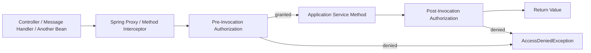
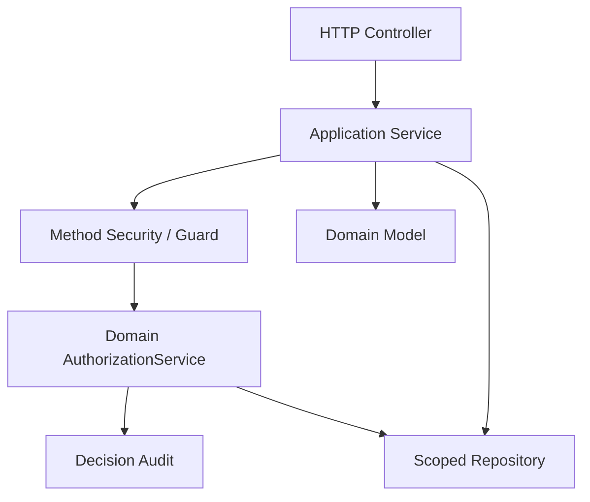

# Part 023 — Spring Method Security Patterns

Method security is where Spring authorization starts to look deceptively powerful.

You can put an annotation on a method:

```java
@PreAuthorize("hasRole('ADMIN')")
public CaseFile getCase(UUID caseId) {
    return repository.findById(caseId).orElseThrow();
}
```

It compiles. It works in demos. It makes reviewers feel safe.

But in a production system, this is not enough.

The hard problem is rarely:

```text
Is the caller an admin?
```

The hard problem is:

```text
Can this caller perform this exact operation on this exact resource,
inside this tenant, at this lifecycle state, with this assignment relation,
without violating separation of duties, while leaving an audit trail?
```

Spring Method Security is a strong **Policy Enforcement Point**. It is not automatically a complete policy model. Treat it as a precise hook into your application service boundary, then delegate the real decision to a typed domain authorization service.

The goal of this part is to show how to use method security without turning your codebase into a pile of string-based policy fragments.

---

## 1. What Method Security Actually Protects

Spring Method Security protects method invocations.

That means the secure object is not an HTTP route. It is a Java method call:

```text
caller -> proxy/interceptor -> target method
```

Spring Security can run authorization logic:

1. before the method executes;
2. after the method returns;
3. before filtering input collections;
4. after filtering return collections;
5. through custom authorization managers or expression handlers.



The important boundary:

```text
Method security protects calls that go through Spring-managed security interception.
```

That has consequences:

| Concern | Production Implication |
|---|---|
| Self-invocation | A method calling another method in the same class may bypass proxy-based advice. |
| Non-Spring objects | Objects created with `new` are not protected by Spring method security. |
| Private methods | Method security is normally applied to public/proxied methods, not arbitrary private helpers. |
| Async execution | Security context propagation must be deliberate. |
| Repository access | Method security does not automatically scope SQL queries. |
| Return filtering | Filtering after retrieval can leak performance, count, pagination, or timing information. |

---

## 2. The Right Mental Model

Method security is best placed at the **application service boundary**.



A good method-security annotation should usually express **which operation is being protected**, not encode the whole business rule inline.

Bad:

```java
@PreAuthorize("hasRole('SUPERVISOR') and #tenantId == authentication.token.claims['tenant_id'] and #caseId != null")
public CaseDetail getCase(UUID tenantId, UUID caseId) { ... }
```

Better:

```java
@PreAuthorize("@caseAuthz.canView(authentication, #tenantId, #caseId)")
public CaseDetail getCase(UUID tenantId, UUID caseId) { ... }
```

Best for complex systems:

```java
@RequiresPermission(action = CaseAction.VIEW, resource = ResourceType.CASE)
public CaseDetail getCase(CaseId caseId) { ... }
```

Then a custom interceptor or authorization manager builds a typed `AuthorizationRequest` and sends it to the domain PDP.

---

## 3. Enabling Method Security

Modern Spring Security enables annotation-based method security with:

```java
@Configuration
@EnableMethodSecurity
class SecurityConfig {
}
```

This enables annotations such as:

| Annotation | Timing | Typical Use |
|---|---:|---|
| `@PreAuthorize` | before method | most application-service authorization |
| `@PostAuthorize` | after method | rare return-object checks |
| `@PreFilter` | before method | filtering input collections |
| `@PostFilter` | after method | filtering returned collections |
| `@Secured` | before method | legacy/simple role checks |
| `@RolesAllowed` | before method | JSR-250 style role checks |

Prefer `@PreAuthorize` with a typed bean guard for most production use.

---

## 4. Pattern: Thin Annotation, Fat Guard

### Problem

SpEL expressions are easy to add and hard to govern.

If every method has a different hand-written expression, your policy is distributed across the codebase:

```java
@PreAuthorize("hasRole('SUPERVISOR') or hasAuthority('case:read')")
@PreAuthorize("hasAnyRole('ADMIN','CASE_MANAGER')")
@PreAuthorize("authentication.name == #ownerId")
@PreAuthorize("#case.tenantId == principal.tenantId")
```

This causes drift:

```text
same business action -> different checks -> inconsistent access
```

### Solution

Use SpEL only as a bridge into a typed guard.

```java
@Service("caseAuthz")
public class CaseAuthorizationGuard {
    private final AuthorizationService authorizationService;

    public boolean canView(Authentication authentication, UUID tenantId, UUID caseId) {
        SubjectRef subject = SubjectRef.from(authentication);

        AuthorizationRequest request = AuthorizationRequest.builder()
            .subject(subject)
            .action("case.view")
            .resource(ResourceRef.of("case", caseId.toString()))
            .tenantId(tenantId.toString())
            .context(ContextMap.from(Map.of(
                "entryPoint", "method-security",
                "method", "CaseApplicationService.getCase"
            )))
            .build();

        AuthorizationDecision decision = authorizationService.decide(request);
        return decision.granted();
    }
}
```

Use it like this:

```java
@PreAuthorize("@caseAuthz.canView(authentication, #tenantId, #caseId)")
@Transactional(readOnly = true)
public CaseDetail getCase(UUID tenantId, UUID caseId) {
    return caseRepository.findVisibleCase(tenantId, caseId)
        .map(caseMapper::toDetail)
        .orElseThrow(NotFoundException::new);
}
```

Important: the method still uses a scoped repository query. The method annotation is not the only defense.

---

## 5. Pattern: Application Service Guard

For complex operations, prefer explicit authorization inside the application service instead of burying everything in annotation strings.

```java
@Transactional
public void escalateCase(EscalateCaseCommand command) {
    CaseFile caseFile = caseRepository.findForUpdate(command.tenantId(), command.caseId())
        .orElseThrow(NotFoundException::new);

    authorization.require(AuthorizationRequest.builder()
        .subject(CurrentSubject.require())
        .action("case.escalate")
        .resource(ResourceRef.caseFile(caseFile.id()))
        .tenantId(caseFile.tenantId())
        .resourceAttributes(Map.of(
            "status", caseFile.status().name(),
            "assignedTeamId", caseFile.assignedTeamId().toString(),
            "classification", caseFile.classification().name()
        ))
        .context(Map.of(
            "reason", command.reason(),
            "entryPoint", "application-service"
        ))
        .build());

    caseFile.escalate(command.reason(), command.now());
    caseRepository.save(caseFile);
}
```

Why this is often better:

1. it can use loaded aggregate state;
2. it can run inside the same transaction as the state transition;
3. it can produce domain-specific audit records;
4. it can recheck after lock acquisition;
5. it is easier to test without Spring proxy magic.

A practical rule:

```text
Use method annotations for coarse operation entry checks.
Use explicit guards for object/state/transition authorization.
Use repository scoping for read visibility.
```

---

## 6. Pattern: Custom Composed Annotation

String-based annotations are fragile.

Instead of repeating this:

```java
@PreAuthorize("@caseAuthz.canPerform(authentication, #caseId, 'case.close')")
```

Create a semantic annotation:

```java
@Target({ElementType.METHOD, ElementType.TYPE})
@Retention(RetentionPolicy.RUNTIME)
@PreAuthorize("@caseAuthz.canPerform(authentication, #caseId, 'case.close')")
public @interface CanCloseCase {
}
```

Then:

```java
@CanCloseCase
@Transactional
public void closeCase(UUID caseId, CloseCaseCommand command) {
    // still recheck state-sensitive rules inside the transaction if needed
}
```

This works for simple patterns, but it still has limitations:

| Limitation | Consequence |
|---|---|
| Parameter name assumptions | `#caseId` must exist and be discoverable. |
| Static expression | Hard to vary action dynamically. |
| Hidden policy | Reviewers must inspect annotation definitions. |
| Complex domain state | Still needs explicit guard or scoped load. |

For high-value operations, use composed annotations only as a first gate.

---

## 7. Pattern: Custom Authorization Annotation + Interceptor

For large systems, a custom authorization annotation can be more maintainable than SpEL.

```java
@Target(ElementType.METHOD)
@Retention(RetentionPolicy.RUNTIME)
public @interface RequiresPermission {
    String action();
    String resourceType();
    String idParameter() default "id";
}
```

Usage:

```java
@RequiresPermission(
    action = "case.view",
    resourceType = "case",
    idParameter = "caseId"
)
public CaseDetail getCase(UUID tenantId, UUID caseId) {
    return caseRepository.findVisibleCase(tenantId, caseId)
        .map(caseMapper::toDetail)
        .orElseThrow(NotFoundException::new);
}
```

Interceptor sketch:

```java
@Component
@Aspect
public class RequiresPermissionAspect {
    private final AuthorizationService authorization;
    private final ParameterNameDiscoverer parameterNames = new DefaultParameterNameDiscoverer();

    @Around("@annotation(requiresPermission)")
    public Object authorize(ProceedingJoinPoint pjp, RequiresPermission requiresPermission) throws Throwable {
        MethodSignature signature = (MethodSignature) pjp.getSignature();
        Method method = signature.getMethod();

        String[] names = parameterNames.getParameterNames(method);
        Object[] values = pjp.getArgs();

        Object resourceId = findArgument(names, values, requiresPermission.idParameter());

        AuthorizationRequest request = AuthorizationRequest.builder()
            .subject(CurrentSubject.require())
            .action(requiresPermission.action())
            .resource(ResourceRef.of(requiresPermission.resourceType(), String.valueOf(resourceId)))
            .context(Map.of(
                "method", method.toGenericString(),
                "entryPoint", "method-annotation"
            ))
            .build();

        authorization.require(request);
        return pjp.proceed();
    }

    private Object findArgument(String[] names, Object[] values, String targetName) {
        for (int i = 0; i < names.length; i++) {
            if (targetName.equals(names[i])) {
                return values[i];
            }
        }
        throw new IllegalArgumentException("Missing parameter: " + targetName);
    }
}
```

This makes authorization metadata explicit, searchable, and easier to lint.

But do not let this become a magical bypass:

```text
Any method that mutates protected state must still be protected by service/domain/repository constraints.
```

---

## 8. Pattern: Custom `AuthorizationManager` for Method Invocation

Spring Security's modern authorization architecture revolves around `AuthorizationManager`. For method security, Spring integrates authorization managers with method invocation interceptors.

A simplified custom manager can look like this:

```java
public final class CaseMethodAuthorizationManager
        implements AuthorizationManager<MethodInvocation> {

    private final AuthorizationService authorization;

    public CaseMethodAuthorizationManager(AuthorizationService authorization) {
        this.authorization = authorization;
    }

    @Override
    public AuthorizationDecision check(
        Supplier<Authentication> authentication,
        MethodInvocation invocation
    ) {
        Method method = invocation.getMethod();
        RequiresPermission annotation = AnnotationUtils.findAnnotation(method, RequiresPermission.class);

        if (annotation == null) {
            return new AuthorizationDecision(true);
        }

        AuthorizationRequest request = MethodAuthorizationRequestFactory.from(
            authentication.get(),
            invocation,
            annotation
        );

        boolean granted = authorization.decide(request).granted();
        return new AuthorizationDecision(granted);
    }
}
```

This is more advanced than bean guards, but it gives stronger standardization.

Use it when:

1. many services need the same authorization metadata model;
2. you want consistent audit fields;
3. you want static scanning for unprotected methods;
4. you want integration tests against authorization annotations;
5. SpEL policy has become unreviewable.

---

## 9. `@PreAuthorize`: The Workhorse

`@PreAuthorize` is usually the safest method security annotation because it runs before business logic.

Good uses:

```java
@PreAuthorize("hasAuthority('case:create')")
public CaseId openCase(OpenCaseCommand command) { ... }
```

```java
@PreAuthorize("@caseAuthz.canAssign(authentication, #command.caseId(), #command.assigneeId())")
public void assignCase(AssignCaseCommand command) { ... }
```

```java
@PreAuthorize("@tenantAuthz.belongsToTenant(authentication, #tenantId)")
public Page<CaseSummary> listCases(UUID tenantId, CaseSearchCriteria criteria, Pageable pageable) { ... }
```

But remember the boundary:

```text
@PreAuthorize can validate the caller and method arguments.
It cannot validate resource state that has not yet been loaded.
```

For state-sensitive decisions:

```java
@PreAuthorize("hasAuthority('case:close')")
@Transactional
public void closeCase(UUID caseId, CloseCaseCommand command) {
    CaseFile caseFile = caseRepository.findForUpdate(caseId)
        .orElseThrow(NotFoundException::new);

    authorization.require(CasePolicies.close(CurrentSubject.require(), caseFile, command));

    caseFile.close(command.reason());
}
```

---

## 10. `@PostAuthorize`: Use Sparingly

`@PostAuthorize` runs after the method returns. It can inspect `returnObject`.

Example:

```java
@PostAuthorize("returnObject.ownerId == authentication.name")
public Profile getProfile(UUID profileId) {
    return profileRepository.findById(profileId).orElseThrow();
}
```

This looks convenient but has real risks:

| Risk | Why It Matters |
|---|---|
| Sensitive object already loaded | Database, ORM, cache, and logs may have touched data. |
| Timing side channel | Denied objects may have different latency. |
| Transactional side effects | Method may have already performed work before returning. |
| Lazy loading | Expression may trigger extra queries. |
| Error ambiguity | `returnObject` shape may not match expression assumptions. |
| Audit confusion | Denial happens after application logic starts. |

Use `@PostAuthorize` only for narrow cases where:

1. method is read-only;
2. returned object is small;
3. no side effects happen before the check;
4. no collection/pagination semantics are involved;
5. the repository cannot easily scope the query earlier.

Prefer this:

```java
public Profile getProfile(UUID profileId) {
    return profileRepository.findVisibleProfile(CurrentSubject.id(), profileId)
        .orElseThrow(NotFoundException::new);
}
```

Over this:

```java
@PostAuthorize("returnObject.ownerId == authentication.name")
public Profile getProfile(UUID profileId) {
    return profileRepository.findById(profileId).orElseThrow();
}
```

---

## 11. `@PreFilter`: Rarely the Right Tool

`@PreFilter` filters collection arguments before method execution.

Example:

```java
@PreFilter("filterObject.ownerId == authentication.name")
public void bulkUpdate(List<CaseUpdateCommand> commands) { ... }
```

This is almost always weaker than explicit batch authorization.

Problems:

| Problem | Explanation |
|---|---|
| Silent dropping | User submits 10 objects; 4 are silently removed. That can be dangerous. |
| Bad UX | Caller may not know which objects were denied. |
| Weak audit | Denied items may not be explicitly logged. |
| Incomplete context | Filtering command objects does not prove current DB state. |
| Race condition | Ownership/assignment may have changed since command creation. |

Prefer explicit batch authorization:

```java
@Transactional
public BulkResult assignCases(List<AssignCaseCommand> commands) {
    Subject subject = CurrentSubject.require();

    List<CaseFile> cases = caseRepository.findAllForUpdate(
        commands.stream().map(AssignCaseCommand::caseId).toList()
    );

    BulkAuthorizationDecision decisions = authorization.decideBatch(
        commands.stream()
            .map(command -> CasePolicies.assign(subject, findCase(cases, command.caseId()), command))
            .toList()
    );

    decisions.requireAllGranted();

    // mutate only after explicit authorization
    ...
}
```

---

## 12. `@PostFilter`: Dangerous for Lists, Search, and Pagination

`@PostFilter` filters a returned collection after method execution:

```java
@PostFilter("filterObject.ownerId == authentication.name")
public List<CaseSummary> listCases() {
    return caseRepository.findAll();
}
```

This is a classic production anti-pattern.

Why?

```text
The database already returned unauthorized rows.
```

It also breaks pagination:

```text
Database returns 20 rows -> @PostFilter removes 17 -> user sees 3 rows.
Next page may overlap or skip records.
Total count becomes misleading.
```

It can also leak:

1. count differences;
2. timing differences;
3. sort behavior;
4. presence of restricted objects;
5. aggregate statistics.

Prefer query scoping:

```java
public Page<CaseSummary> listCases(CaseSearchCriteria criteria, Pageable pageable) {
    Subject subject = CurrentSubject.require();
    CaseVisibilityScope scope = caseScopeFactory.forSubject(subject, criteria.tenantId());
    return caseRepository.searchVisible(scope, criteria, pageable);
}
```

Use `@PostFilter` only for small in-memory collections where:

1. the complete set is not sensitive;
2. there is no pagination/count/export;
3. filtering is a presentation convenience, not the main authorization boundary.

---

## 13. Pattern: Method Security + Query Scoping

For read APIs, the strongest pattern is:

```text
coarse method guard + scoped repository query
```

Example:

```java
@PreAuthorize("hasAuthority('case:read')")
@Transactional(readOnly = true)
public Page<CaseSummary> searchCases(CaseSearchCommand command, Pageable pageable) {
    Subject subject = CurrentSubject.require();

    CaseQueryScope scope = caseQueryScopeFactory.scopeFor(subject, command.tenantId());

    return caseRepository.search(command.criteria(), scope, pageable)
        .map(caseMapper::toSummary);
}
```

The method guard answers:

```text
Can the caller use the case search capability at all?
```

The query scope answers:

```text
Which exact rows can this caller see?
```

Do not confuse the two.

---

## 14. Pattern: Method Security + Domain State Transition Guard

For mutations, the strongest pattern is:

```text
coarse method guard + transactional resource load + domain authorization + state transition
```

```java
@PreAuthorize("hasAuthority('case:escalate')")
@Transactional
public void escalate(UUID caseId, EscalateCaseCommand command) {
    CaseFile caseFile = caseRepository.findForUpdate(caseId)
        .orElseThrow(NotFoundException::new);

    authorization.require(CaseAuthorizationRequests.escalate(
        CurrentSubject.require(),
        caseFile,
        command
    ));

    caseFile.escalate(command.reason(), command.now());
}
```

This prevents a stale pre-check from authorizing a now-invalid transition.

For example:

```text
T1: caller is authorized because case is ASSIGNED
T2: another transaction closes the case
T1: caller escalates closed case if no transactional recheck exists
```

The fix is to recheck after loading/locking the aggregate.

---

## 15. Pattern: Method Security for Command Intent, Not Domain Truth

A command object represents caller intent.

It is not the truth.

```java
public record ApproveCaseCommand(
    UUID caseId,
    String reason,
    boolean supervisorConfirmed
) {}
```

Never trust command attributes as authorization facts.

Bad:

```java
@PreAuthorize("#command.supervisorConfirmed")
public void approve(ApproveCaseCommand command) { ... }
```

Better:

```java
@PreAuthorize("hasAuthority('case:approve')")
@Transactional
public void approve(ApproveCaseCommand command) {
    CaseFile caseFile = caseRepository.findForUpdate(command.caseId())
        .orElseThrow(NotFoundException::new);

    authorization.require(CasePolicies.approve(CurrentSubject.require(), caseFile, command));

    caseFile.approve(command.reason());
}
```

Authorization facts should come from trusted sources:

1. server-side database state;
2. verified authentication context;
3. trusted attribute providers;
4. policy store;
5. trusted relationship store;
6. system-generated workflow state.

---

## 16. Self-Invocation Trap

Proxy-based method security can be bypassed when a method calls another secured method on the same object.

```java
@Service
public class CaseService {

    public void closeAndArchive(UUID caseId) {
        close(caseId);     // may bypass method security if self-invocation
        archive(caseId);   // may bypass method security if self-invocation
    }

    @PreAuthorize("hasAuthority('case:close')")
    public void close(UUID caseId) { ... }

    @PreAuthorize("hasAuthority('case:archive')")
    public void archive(UUID caseId) { ... }
}
```

Better options:

1. move secured operations to separate Spring beans;
2. enforce explicit guards inside methods;
3. design orchestration method with its own combined authorization;
4. avoid relying on internal method annotations for critical authorization.

Preferred:

```java
@Transactional
public void closeAndArchive(UUID caseId) {
    CaseFile caseFile = caseRepository.findForUpdate(caseId)
        .orElseThrow(NotFoundException::new);

    authorization.require(CasePolicies.closeAndArchive(CurrentSubject.require(), caseFile));

    caseFile.close();
    caseFile.archive();
}
```

---

## 17. Transaction Ordering and Authorization

Authorization often depends on database state.

Transaction boundaries matter.

Common bad sequence:

```text
1. PreAuthorize grants based on stale/cached fact
2. method starts transaction
3. method mutates resource
4. no recheck occurs
```

Safer sequence for stateful mutation:

```text
1. method enters transaction
2. load resource using tenant/object scope
3. lock resource if needed
4. build authorization request from current state
5. require decision
6. apply domain transition
7. save
8. audit decision and domain event
```

Code:

```java
@Transactional
public void reassignCase(ReassignCaseCommand command) {
    CaseFile caseFile = caseRepository.findForUpdate(command.caseId())
        .orElseThrow(NotFoundException::new);

    User assignee = userRepository.findActiveInTenant(command.tenantId(), command.assigneeId())
        .orElseThrow(InvalidAssigneeException::new);

    authorization.require(CasePolicies.reassign(
        CurrentSubject.require(),
        caseFile,
        assignee,
        command.reason()
    ));

    caseFile.reassignTo(assignee.id());
}
```

Method security remains useful as an outer gate:

```java
@PreAuthorize("hasAuthority('case:assign')")
@Transactional
public void reassignCase(ReassignCaseCommand command) { ... }
```

But the final decision should happen with current resource state.

---

## 18. Lazy Loading and `@PostAuthorize`

This is subtle.

```java
@PostAuthorize("returnObject.owner.id == authentication.name")
@Transactional(readOnly = true)
public CaseFile getCase(UUID id) {
    return caseRepository.findById(id).orElseThrow();
}
```

Depending on ORM configuration, evaluating `returnObject.owner.id` may trigger lazy loading. That means authorization expression execution can perform database queries.

Risks:

1. unexpected N+1 queries;
2. access to fields not intended for authorization;
3. transaction/session dependency;
4. confusing performance profile;
5. exception masking as access denial.

Better:

```java
public Optional<CaseFile> findVisibleCase(Subject subject, UUID caseId) {
    return queryFactory
        .selectFrom(caseFile)
        .where(caseFile.id.eq(caseId))
        .where(caseFile.tenantId.eq(subject.tenantId()))
        .where(caseVisibilityPredicate(subject))
        .fetchOptional();
}
```

---

## 19. Security Context Propagation

Method security depends on the current `Authentication`.

In synchronous HTTP code, this usually comes from `SecurityContextHolder`.

But async execution is different:

```java
@Async
public void generateReport(UUID reportId) {
    Authentication auth = SecurityContextHolder.getContext().getAuthentication();
    // may be null or unexpected depending on configuration
}
```

For production async flows, do not rely blindly on ambient thread-local authentication.

Prefer an explicit authorization snapshot:

```java
public record AuthorizedJobRequest(
    UUID jobId,
    SubjectRef requestedBy,
    String action,
    String resourceType,
    UUID resourceId,
    Instant authorizedAt,
    String policyVersion
) {}
```

Then worker execution can:

1. verify the snapshot was created by the server;
2. check expiry;
3. recheck current policy for destructive actions;
4. audit both original authorization and execution-time authorization.

---

## 20. PermissionEvaluator: Useful, But Often Legacy-Shaped

Spring has historically supported `PermissionEvaluator` for expressions like:

```java
@PreAuthorize("hasPermission(#caseId, 'CASE', 'VIEW')")
public CaseDetail getCase(UUID caseId) { ... }
```

Implementation sketch:

```java
@Component
public class DomainPermissionEvaluator implements PermissionEvaluator {
    private final AuthorizationService authorization;

    @Override
    public boolean hasPermission(
        Authentication authentication,
        Object targetDomainObject,
        Object permission
    ) {
        AuthorizationRequest request = PermissionRequestFactory.from(
            authentication,
            targetDomainObject,
            permission
        );
        return authorization.decide(request).granted();
    }

    @Override
    public boolean hasPermission(
        Authentication authentication,
        Serializable targetId,
        String targetType,
        Object permission
    ) {
        AuthorizationRequest request = AuthorizationRequest.builder()
            .subject(SubjectRef.from(authentication))
            .action(String.valueOf(permission))
            .resource(ResourceRef.of(targetType, String.valueOf(targetId)))
            .build();
        return authorization.decide(request).granted();
    }
}
```

This can be useful when integrating with older Spring Security expression code.

But for new systems, prefer one of these:

1. explicit bean guard;
2. custom annotation;
3. custom authorization manager;
4. explicit application service guard.

Why?

Because `hasPermission` can hide too much behind generic parameters.

---

## 21. Method Security and Multi-Tenancy

A common mistake:

```java
@PreAuthorize("hasAuthority('case:read')")
public CaseDetail getCase(UUID caseId) { ... }
```

The permission is global unless scoped.

A better method signature carries tenant context explicitly:

```java
@PreAuthorize("@tenantAuthz.canAccessTenant(authentication, #tenantId)")
public CaseDetail getCase(UUID tenantId, UUID caseId) { ... }
```

But the repository must also enforce tenant:

```java
public Optional<CaseFile> findVisibleCase(UUID tenantId, UUID caseId, Subject subject) {
    return jdbc.query("""
        select *
        from case_file c
        where c.tenant_id = :tenant_id
          and c.case_id = :case_id
          and exists (
              select 1
              from case_assignment a
              where a.case_id = c.case_id
                and a.user_id = :subject_id
          )
        """, params(tenantId, caseId, subject.id()));
}
```

Tenant authorization invariant:

```text
No method-level annotation may be the only tenant isolation mechanism.
```

---

## 22. Method Security and Error Semantics

When method security denies access, Spring commonly throws `AccessDeniedException`.

Your API layer must map this intentionally.

| Situation | Recommended Response |
|---|---:|
| caller authenticated but lacks capability | `403 Forbidden` |
| caller unauthenticated | `401 Unauthorized` |
| object existence must be hidden | `404 Not Found` from scoped repository |
| policy service unavailable | usually fail closed with `403` or `503`, depending semantics |
| malformed request | `400 Bad Request` |

Do not leak policy internals:

Bad response:

```json
{
  "error": "Denied because user is not assigned to case CASE-7782 in tenant T-994"
}
```

Better public response:

```json
{
  "error": "access_denied",
  "message": "You are not allowed to perform this action."
}
```

Audit can contain richer server-side detail.

---

## 23. Method Security Audit Pattern

Every important decision should be auditable.

But avoid sprinkling audit calls everywhere.

Centralize inside `AuthorizationService`:

```java
public AuthorizationDecision decide(AuthorizationRequest request) {
    AuthorizationDecision decision;
    try {
        decision = evaluator.evaluate(request);
    } catch (Exception ex) {
        decision = AuthorizationDecision.indeterminate(
            "AUTHZ_ENGINE_ERROR",
            ex.getClass().getSimpleName()
        );
    }

    auditSink.record(AuthorizationAuditRecord.from(request, decision));
    return decision;
}
```

Audit fields:

| Field | Reason |
|---|---|
| subject ID | who attempted |
| action | what operation |
| resource type/id | target |
| tenant ID | boundary |
| decision | granted/denied/indeterminate |
| reason code | explainability |
| policy version | reproducibility |
| enforcement point | route/method/repository/worker |
| correlation ID | traceability |
| timestamp | timeline |

For method security, include:

```text
class name, method name, annotation, argument resource IDs, request ID
```

Do not log sensitive method arguments wholesale.

---

## 24. Testing Method Security

Method security requires tests at multiple levels.

### 24.1 Unit Test the Guard

```java
@Test
void investigatorCanViewAssignedCase() {
    Authentication auth = authWith("case:read", "tenant:T1", "user:U1");

    when(authorizationService.decide(any())).thenReturn(AuthorizationDecision.granted());

    boolean allowed = guard.canView(auth, UUID.fromString("00000000-0000-0000-0000-000000000001"), CASE_ID);

    assertThat(allowed).isTrue();
}
```

### 24.2 Integration Test the Proxy

Make sure the method call goes through Spring.

```java
@SpringBootTest
class CaseServiceMethodSecurityTest {

    @Autowired CaseApplicationService service;

    @Test
    @WithMockUser(authorities = "case:read")
    void allowsCallerWithCaseReadAuthority() {
        assertThatCode(() -> service.getCase(TENANT_ID, CASE_ID)).doesNotThrowAnyException();
    }

    @Test
    @WithMockUser(authorities = "case:create")
    void deniesCallerWithoutCaseReadAuthority() {
        assertThatThrownBy(() -> service.getCase(TENANT_ID, CASE_ID))
            .isInstanceOf(AccessDeniedException.class);
    }
}
```

### 24.3 Test Self-Invocation Risk

Write a test that proves orchestration methods enforce combined policy directly, not by accidental proxy behavior.

```java
@Test
void closeAndArchiveRequiresCombinedPermission() {
    assertThatThrownBy(() -> service.closeAndArchive(CASE_ID))
        .isInstanceOf(AccessDeniedException.class);
}
```

### 24.4 Test Query Scoping Separately

```java
@Test
void searchCasesDoesNotReturnOtherTenantRows() {
    Page<CaseSummary> page = service.searchCases(
        new CaseSearchCommand(TENANT_A, Criteria.empty()),
        PageRequest.of(0, 20)
    );

    assertThat(page.getContent())
        .allMatch(row -> row.tenantId().equals(TENANT_A));
}
```

---

## 25. Static Review Rules

A mature codebase can scan for authorization mistakes.

Rules worth enforcing:

```text
1. Public application-service methods that mutate protected resources must have authorization.
2. No @PostFilter on pageable search methods.
3. No repository.findById inside controller for protected resources.
4. No hasRole('ADMIN') except in admin-boundary package.
5. No direct string permissions outside permission catalog.
6. No method security annotation without test coverage.
7. No @PreAuthorize expression longer than a threshold without bean guard.
8. No unscoped tenant methods for tenant-owned resources.
```

You can implement this with:

1. ArchUnit;
2. Error Prone custom checks;
3. Semgrep;
4. OpenRewrite recipes;
5. CI grep rules as a temporary baseline.

Example ArchUnit-style rule:

```java
@AnalyzeClasses(packages = "com.example.caseapp")
class AuthorizationArchitectureTest {

    @ArchTest
    static final ArchRule application_mutations_should_be_secured = methods()
        .that().arePublic()
        .and().areDeclaredInClassesThat().resideInAPackage("..application..")
        .and().haveNameMatching("^(create|update|delete|assign|close|approve|reject|escalate).*")
        .should().beAnnotatedWith(PreAuthorize.class)
        .orShould().beAnnotatedWith(RequiresPermission.class);
}
```

---

## 26. Production Pattern Matrix

| Use Case | Best Pattern | Avoid |
|---|---|---|
| Coarse operation gate | `@PreAuthorize` authority check | controller-only checks |
| Object read | scoped repository query | `@PostAuthorize` after `findById` |
| Search/list | query scoping | `@PostFilter` |
| Field-level response | DTO mapper/redaction policy | returning entity then filtering JSON casually |
| State transition | transaction + loaded aggregate + explicit guard | pre-check only |
| Bulk mutation | batch authorization decision | `@PreFilter` silent dropping |
| Admin operation | method guard + admin scope + SoD check | hidden super admin |
| Async job | authorization snapshot + recheck | thread-local auth in worker |
| Cross-service call | propagated subject + downstream enforcement | trusting gateway only |
| Legacy role migration | bean guard backed by permission service | replacing every role with huge SpEL |

---

## 27. Anti-Patterns

### 27.1 `hasRole('ADMIN')` Everywhere

```java
@PreAuthorize("hasRole('ADMIN')")
```

This turns admin into a universal bypass.

Refactor to explicit permissions:

```java
@PreAuthorize("hasAuthority('case:assign')")
```

Then add contextual checks:

```java
authorization.require(CasePolicies.assign(subject, caseFile, assignee));
```

### 27.2 Business Rules in SpEL

Bad:

```java
@PreAuthorize("hasAuthority('case:approve') and #command.amount < 10000 and !@caseService.isMaker(authentication.name, #command.caseId)")
```

Better:

```java
@PreAuthorize("hasAuthority('case:approve')")
public void approve(ApproveCommand command) {
    authorization.require(CasePolicies.approve(subject, caseFile, command));
}
```

### 27.3 Post-Filtering Database Results

Bad:

```java
@PostFilter("filterObject.tenantId == authentication.details.tenantId")
public List<CaseSummary> listAllCases() { ... }
```

Better:

```java
public Page<CaseSummary> listCases(CaseQueryScope scope, Pageable pageable) { ... }
```

### 27.4 Guarding Controller but Not Service

Bad:

```java
@GetMapping("/cases/{id}")
@PreAuthorize("hasAuthority('case:read')")
public CaseDetail get(@PathVariable UUID id) {
    return service.getCase(id);
}
```

If another entry point calls `service.getCase(id)`, the method may be unprotected.

Better:

```java
@PreAuthorize("hasAuthority('case:read')")
public CaseDetail getCase(UUID id) { ... }
```

### 27.5 Annotation Without Repository Scope

Bad:

```java
@PreAuthorize("hasAuthority('case:read')")
public CaseDetail getCase(UUID id) {
    return repository.findById(id).map(mapper::toDetail).orElseThrow();
}
```

Better:

```java
@PreAuthorize("hasAuthority('case:read')")
public CaseDetail getCase(UUID tenantId, UUID id) {
    return repository.findVisibleCase(tenantId, id, CurrentSubject.require())
        .map(mapper::toDetail)
        .orElseThrow(NotFoundException::new);
}
```

---

## 28. Reference Implementation Skeleton

A production-style method security stack:

```mermaid
flowchart TD
    MethodAnnotation[@PreAuthorize / @RequiresPermission]
    Guard[Guard Bean / AuthorizationManager]
    Factory[AuthorizationRequestFactory]
    AuthzService[AuthorizationService]
    LocalPolicy[Local Policy Evaluator]
    ExternalPDP[Optional External PDP]
    Audit[Decision Audit]
    Repo[Scoped Repository]

    MethodAnnotation --> Guard
    Guard --> Factory
    Factory --> AuthzService
    AuthzService --> LocalPolicy
    AuthzService --> ExternalPDP
    AuthzService --> Audit
    Guard --> Repo
```

Core types:

```java
public record AuthorizationRequest(
    SubjectRef subject,
    String action,
    ResourceRef resource,
    String tenantId,
    Map<String, Object> context,
    Map<String, Object> resourceAttributes,
    String enforcementPoint
) {}

public record AuthorizationDecision(
    boolean granted,
    String reasonCode,
    String policyVersion,
    Map<String, Object> obligations
) {
    public static AuthorizationDecision granted(String policyVersion) {
        return new AuthorizationDecision(true, "GRANTED", policyVersion, Map.of());
    }

    public static AuthorizationDecision denied(String reasonCode) {
        return new AuthorizationDecision(false, reasonCode, null, Map.of());
    }
}
```

Service:

```java
public interface AuthorizationService {
    AuthorizationDecision decide(AuthorizationRequest request);

    default void require(AuthorizationRequest request) {
        AuthorizationDecision decision = decide(request);
        if (!decision.granted()) {
            throw new AccessDeniedException(decision.reasonCode());
        }
    }
}
```

Guard:

```java
@Service("authz")
public class MethodAuthorizationBean {
    private final AuthorizationService authorization;

    public boolean can(Authentication authentication, String action, String resourceType, UUID resourceId) {
        return authorization.decide(AuthorizationRequest.builder()
            .subject(SubjectRef.from(authentication))
            .action(action)
            .resource(ResourceRef.of(resourceType, resourceId.toString()))
            .enforcementPoint("spring-method-security")
            .build()
        ).granted();
    }
}
```

Usage:

```java
@PreAuthorize("@authz.can(authentication, 'case.view', 'case', #caseId)")
public CaseDetail getCase(UUID caseId) { ... }
```

---

## 29. Final Engineering Rules

Method security is powerful when used as a boundary, not as a policy dumping ground.

Use these rules:

```text
1. Keep method annotations short.
2. Delegate complex policy to typed guard services.
3. Do not use @PostFilter for database authorization.
4. Do not rely on @PostAuthorize for sensitive object retrieval.
5. Recheck stateful mutations inside the transaction.
6. Use scoped repository queries for reads.
7. Test method security through Spring proxies.
8. Treat self-invocation as a bypass risk.
9. Include method authorization decisions in audit.
10. Prefer permissions and actions over broad roles.
```

The best Spring Method Security design is boring at the annotation layer and rich at the policy layer.

That is the point.

---

## References

- Spring Security Reference — Method Security: https://docs.spring.io/spring-security/reference/servlet/authorization/method-security.html
- Spring Security Reference — Authorization Architecture: https://docs.spring.io/spring-security/reference/servlet/authorization/architecture.html
- Spring Security Reference — Domain Object Security ACLs: https://docs.spring.io/spring-security/reference/servlet/authorization/acls.html
- OWASP Authorization Cheat Sheet: https://cheatsheetseries.owasp.org/cheatsheets/Authorization_Cheat_Sheet.html
- OWASP API Security 2023 — Broken Object Level Authorization: https://owasp.org/API-Security/editions/2023/en/0xa1-broken-object-level-authorization/
