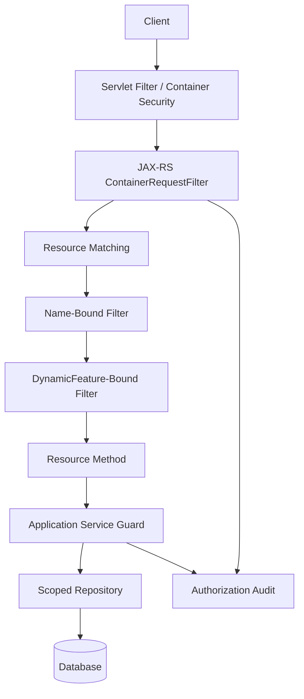
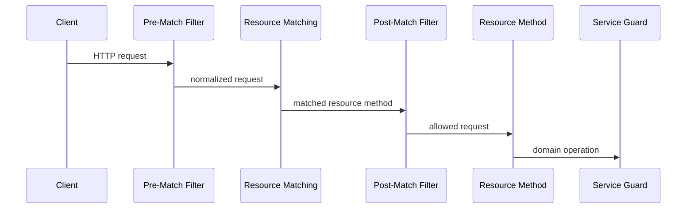
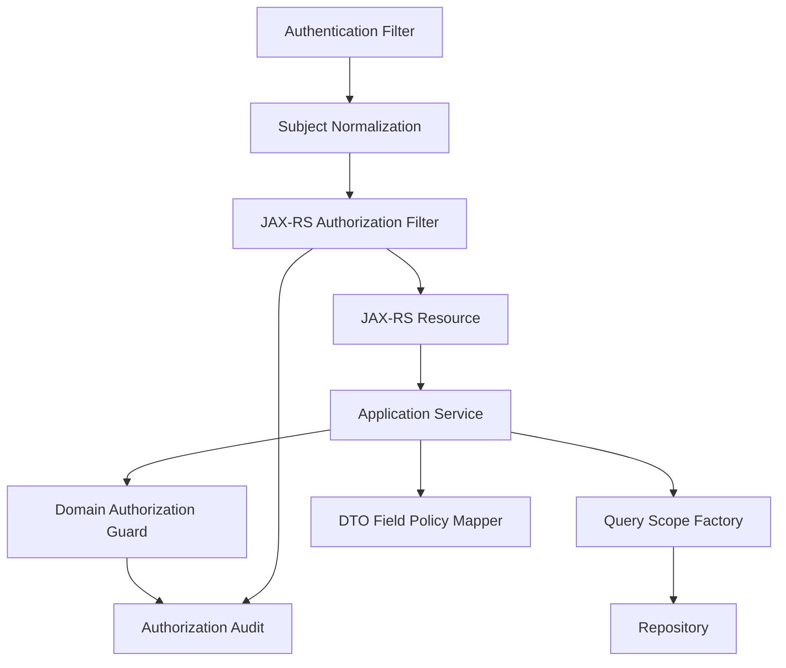

# Part 024 — JAX-RS and Jakarta Authorization Patterns

JAX-RS is deliberately smaller than Spring Security.

That is both a strength and a trap.

It gives you clean HTTP resource methods, filters, interceptors, provider binding, request context, and integration points. But it does not magically solve authorization for your domain. In JAX-RS/Jakarta REST/Jersey systems, you must design authorization architecture explicitly.

The dangerous version looks like this:

```java
@GET
@Path("/cases/{caseId}")
public CaseDto getCase(@PathParam("caseId") UUID caseId) {
    return repository.findById(caseId)
        .map(mapper::toDto)
        .orElseThrow(NotFoundException::new);
}
```

It is clean.

It is also likely vulnerable unless the repository query is scoped or the method is guarded.

The production version answers:

```text
Who is the subject?
What action is being attempted?
Which resource is targeted?
Which tenant, assignment, relationship, lifecycle state, and field policy apply?
Where is the enforcement point?
What was logged for audit?
```

This part shows how to implement those answers in JAX-RS/Jakarta/Jersey applications.

---

## 1. JAX-RS Authorization Mental Model

A JAX-RS authorization stack has several possible enforcement points:



Each layer has a different job:

| Layer | Good For | Not Enough For |
|---|---|---|
| Servlet filter | authentication, correlation ID, global request rejection | resource method metadata |
| `ContainerRequestFilter` pre-match | global normalization, early rejection | knowing matched method/resource |
| `ContainerRequestFilter` post-match | route/method authorization | loaded domain state |
| Name-bound filter | annotation-driven route guards | dynamic resource-specific rules |
| `DynamicFeature` | bind filters based on resource metadata | full domain authorization alone |
| resource method | explicit guards, input validation | query/data visibility if not scoped |
| application service | domain authorization | transport concerns |
| repository | object/list visibility by construction | high-level policy intent |
| database RLS | defense-in-depth tenant/row isolation | business workflow decisions |

A mature JAX-RS service uses multiple layers, not one giant filter.

---

## 2. Request Filter Timing: Pre-Match vs Post-Match

JAX-RS request filters can run before or after resource matching.

Pre-match filters run before JAX-RS chooses a resource method. They are useful for request normalization, authentication extraction, correlation IDs, and early hard rejects.

Post-match filters run after the resource method is selected. They are better for authorization because they can use resource metadata.



Practical rule:

```text
Authenticate early. Authorize with resource metadata after matching. Authorize domain state inside service/repository.
```

---

## 3. Basic `ContainerRequestFilter`

A simple global filter:

```java
@Provider
@Priority(Priorities.AUTHORIZATION)
public class AuthorizationFilter implements ContainerRequestFilter {

    @Context
    ResourceInfo resourceInfo;

    @Inject
    AuthorizationService authorizationService;

    @Override
    public void filter(ContainerRequestContext requestContext) {
        Method method = resourceInfo.getResourceMethod();
        Class<?> resourceClass = resourceInfo.getResourceClass();

        RequiresPermission permission = findPermission(method, resourceClass);
        if (permission == null) {
            return;
        }

        SubjectRef subject = SubjectRef.from(requestContext.getSecurityContext());

        AuthorizationRequest request = AuthorizationRequest.builder()
            .subject(subject)
            .action(permission.action())
            .resource(extractResource(permission, requestContext))
            .tenantId(extractTenant(requestContext))
            .context(Map.of(
                "httpMethod", requestContext.getMethod(),
                "path", requestContext.getUriInfo().getPath(),
                "resourceMethod", method.toGenericString(),
                "entryPoint", "jaxrs-container-request-filter"
            ))
            .build();

        AuthorizationDecision decision = authorizationService.decide(request);
        if (!decision.granted()) {
            requestContext.abortWith(forbidden(decision));
        }
    }

    private RequiresPermission findPermission(Method method, Class<?> resourceClass) {
        RequiresPermission methodLevel = method.getAnnotation(RequiresPermission.class);
        if (methodLevel != null) return methodLevel;
        return resourceClass.getAnnotation(RequiresPermission.class);
    }

    private Response forbidden(AuthorizationDecision decision) {
        return Response.status(Response.Status.FORBIDDEN)
            .entity(Map.of(
                "error", "access_denied",
                "reason", "You are not allowed to perform this action."
            ))
            .build();
    }
}
```

This gives you central route-level enforcement.

But it still cannot handle all object-level rules unless it can extract reliable resource IDs and fetch trusted attributes.

---

## 4. Custom Authorization Annotation

Define an annotation for resource methods:

```java
@Target({ElementType.METHOD, ElementType.TYPE})
@Retention(RetentionPolicy.RUNTIME)
public @interface RequiresPermission {
    String action();
    String resourceType();
    String idPathParam() default "";
    boolean hideExistence() default true;
}
```

Usage:

```java
@Path("/tenants/{tenantId}/cases")
public class CaseResource {

    @GET
    @Path("/{caseId}")
    @RequiresPermission(
        action = "case.view",
        resourceType = "case",
        idPathParam = "caseId",
        hideExistence = true
    )
    public CaseDto getCase(
        @PathParam("tenantId") UUID tenantId,
        @PathParam("caseId") UUID caseId
    ) {
        return caseService.getCase(tenantId, caseId);
    }
}
```

This makes route-level authorization visible and searchable.

But do not stop there:

```java
public CaseDto getCase(UUID tenantId, UUID caseId) {
    SubjectRef subject = CurrentSubject.require();

    return caseRepository.findVisibleCase(tenantId, caseId, subject)
        .map(mapper::toDto)
        .orElseThrow(NotFoundException::new);
}
```

The filter is the first gate. The scoped query is the object-level defense.

---

## 5. Extracting Path Parameters Safely

JAX-RS path parameters are available from `UriInfo`.

```java
private ResourceRef extractResource(RequiresPermission permission, ContainerRequestContext ctx) {
    if (permission.idPathParam().isBlank()) {
        return ResourceRef.collection(permission.resourceType());
    }

    String rawId = ctx.getUriInfo()
        .getPathParameters()
        .getFirst(permission.idPathParam());

    if (rawId == null || rawId.isBlank()) {
        throw new BadRequestException("Missing resource id");
    }

    return ResourceRef.of(permission.resourceType(), rawId);
}
```

Do not parse arbitrary body fields inside a generic filter unless you have a reliable buffering strategy and clear performance limits.

For body-driven authorization, prefer service-level guards:

```java
@POST
@Path("/bulk-assign")
@RequiresPermission(action = "case.bulk_assign", resourceType = "case")
public BulkResult bulkAssign(BulkAssignRequest request) {
    return caseService.bulkAssign(request);
}
```

Then authorize each target explicitly inside `caseService.bulkAssign`.

---

## 6. Name Binding Pattern

`@NameBinding` lets you bind filters to specific resource methods/classes with custom annotations.

Define binding:

```java
@NameBinding
@Target({ElementType.TYPE, ElementType.METHOD})
@Retention(RetentionPolicy.RUNTIME)
public @interface SecuredEndpoint {
}
```

Filter:

```java
@Provider
@SecuredEndpoint
@Priority(Priorities.AUTHORIZATION)
public class SecuredEndpointFilter implements ContainerRequestFilter {
    @Inject AuthorizationService authorization;
    @Context ResourceInfo resourceInfo;

    @Override
    public void filter(ContainerRequestContext ctx) {
        // authorize only resources annotated with @SecuredEndpoint
    }
}
```

Resource:

```java
@SecuredEndpoint
@Path("/cases")
public class CaseResource {
    ...
}
```

Use name binding when:

1. a filter should apply only to selected endpoints;
2. endpoint groups have distinct security behavior;
3. you want to separate public and protected resources clearly.

But name binding alone is not enough for action/resource-specific policy. Combine it with a richer annotation such as `@RequiresPermission`.

---

## 7. DynamicFeature Pattern

`DynamicFeature` allows programmatic binding based on `ResourceInfo`.

This is useful when you want to inspect annotations and register a specialized filter only for protected methods.

```java
@Provider
public class AuthorizationDynamicFeature implements DynamicFeature {

    @Override
    public void configure(ResourceInfo resourceInfo, FeatureContext context) {
        RequiresPermission permission = findPermission(
            resourceInfo.getResourceMethod(),
            resourceInfo.getResourceClass()
        );

        if (permission != null) {
            context.register(new PermissionFilter(permission));
        }
    }
}
```

Filter:

```java
public class PermissionFilter implements ContainerRequestFilter {
    private final RequiresPermission permission;

    public PermissionFilter(RequiresPermission permission) {
        this.permission = permission;
    }

    @Inject AuthorizationService authorization;

    @Override
    public void filter(ContainerRequestContext ctx) {
        AuthorizationRequest request = AuthorizationRequestFactory.from(permission, ctx);
        AuthorizationDecision decision = authorization.decide(request);

        if (!decision.granted()) {
            ctx.abortWith(Response.status(Response.Status.FORBIDDEN).build());
        }
    }
}
```

In practice, pay attention to injection behavior when registering filter instances. Some runtimes handle CDI injection differently for manually created instances. Register classes or use an injection-aware factory when needed.

---

## 8. ResourceInfo Pattern

`ResourceInfo` exposes the matched resource class and method.

Use it to retrieve:

1. method annotations;
2. class annotations;
3. Java method metadata;
4. parameter annotations if you need custom extraction;
5. package/class naming conventions.

Example:

```java
@Context
ResourceInfo resourceInfo;

@Override
public void filter(ContainerRequestContext ctx) {
    Method method = resourceInfo.getResourceMethod();
    Class<?> resourceClass = resourceInfo.getResourceClass();

    RequiresPermission permission = AnnotationResolver.resolve(
        method,
        resourceClass,
        RequiresPermission.class
    );

    if (permission == null) {
        return;
    }

    ...
}
```

Use clear resolution rules:

```text
method-level annotation overrides class-level annotation
absence of annotation means either public endpoint or configuration error
```

For high-security services, avoid silent public-by-default behavior.

Prefer:

```text
Every resource method must be explicitly annotated as @PublicEndpoint or @RequiresPermission.
```

---

## 9. Explicit Public Endpoint Pattern

Default-open APIs are risky.

Define two annotations:

```java
@Target({ElementType.METHOD, ElementType.TYPE})
@Retention(RetentionPolicy.RUNTIME)
public @interface PublicEndpoint {
}

@Target({ElementType.METHOD, ElementType.TYPE})
@Retention(RetentionPolicy.RUNTIME)
public @interface RequiresPermission {
    String action();
    String resourceType();
    String idPathParam() default "";
}
```

Then enforce annotation coverage:

```java
if (permission == null && publicEndpoint == null) {
    ctx.abortWith(Response.status(Response.Status.INTERNAL_SERVER_ERROR)
        .entity(Map.of("error", "security_configuration_error"))
        .build());
    return;
}
```

This is strict, but it catches forgotten authorization early.

For production rollout, use a migration mode:

```text
phase 1: log missing annotations
phase 2: fail CI on missing annotations
phase 3: fail runtime for unclassified endpoints
```

---

## 10. Principal Extraction

JAX-RS gives access to `SecurityContext`:

```java
SecurityContext securityContext = requestContext.getSecurityContext();
Principal principal = securityContext.getUserPrincipal();
```

But production authorization usually needs a richer subject model:

```java
public record SubjectRef(
    String subjectId,
    String tenantId,
    Set<String> authorities,
    Map<String, Object> claims,
    boolean serviceAccount,
    Optional<String> actorSubjectId
) {
    public static SubjectRef from(SecurityContext context) {
        Principal principal = context.getUserPrincipal();
        if (principal == null) {
            throw new NotAuthorizedException("Missing principal");
        }
        return SubjectContextHolder.require();
    }
}
```

The better pattern is to normalize authentication earlier into a request-scoped subject:

```java
@RequestScoped
public class CurrentSubject {
    private SubjectRef subject;

    public SubjectRef require() {
        if (subject == null) throw new NotAuthorizedException("Missing subject");
        return subject;
    }

    public void set(SubjectRef subject) {
        this.subject = subject;
    }
}
```

Then filters and resources use the same normalized subject.

---

## 11. CDI Interceptor Pattern

If you want method-level authorization independent from HTTP-specific JAX-RS filters, use CDI interceptors.

Binding:

```java
@InterceptorBinding
@Target({ElementType.TYPE, ElementType.METHOD})
@Retention(RetentionPolicy.RUNTIME)
public @interface Authorized {
    String action();
    String resourceType();
}
```

Interceptor:

```java
@Authorized(action = "", resourceType = "")
@Interceptor
@Priority(Interceptor.Priority.APPLICATION)
public class AuthorizationInterceptor {

    @Inject AuthorizationService authorization;
    @Inject CurrentSubject currentSubject;

    @AroundInvoke
    public Object authorize(InvocationContext ctx) throws Exception {
        Authorized annotation = resolveAnnotation(ctx);
        AuthorizationRequest request = buildRequest(annotation, ctx, currentSubject.require());
        authorization.require(request);
        return ctx.proceed();
    }
}
```

Usage:

```java
@Authorized(action = "case.close", resourceType = "case")
public void closeCase(CloseCaseCommand command) {
    ...
}
```

This helps when the same application service is called from:

1. JAX-RS resource;
2. message consumer;
3. scheduled job;
4. internal admin tool.

But the same warning applies: stateful object transitions still need transactional domain guards.

---

## 12. Resource Method Guard Pattern

Sometimes the clearest authorization is explicit inside the resource method.

```java
@POST
@Path("/{caseId}/assign")
public Response assign(
    @PathParam("tenantId") UUID tenantId,
    @PathParam("caseId") UUID caseId,
    AssignCaseRequest body
) {
    SubjectRef subject = currentSubject.require();

    authorization.require(AuthorizationRequest.builder()
        .subject(subject)
        .action("case.assign")
        .resource(ResourceRef.of("case", caseId.toString()))
        .tenantId(tenantId.toString())
        .context(Map.of(
            "assigneeId", body.assigneeId().toString(),
            "entryPoint", "jaxrs-resource-method"
        ))
        .build());

    caseService.assign(tenantId, caseId, body.toCommand());
    return Response.noContent().build();
}
```

This is acceptable for simple APIs, but do not duplicate complex policy per resource method.

Use explicit resource guard when:

1. the rule is endpoint-specific;
2. the action is simple;
3. service layer also protects domain state;
4. audit is centralized in the authorization service.

---

## 13. Application Service Guard Pattern

For serious systems, resource methods should mostly orchestrate transport concerns.

```java
@POST
@Path("/{caseId}/close")
public Response close(
    @PathParam("tenantId") UUID tenantId,
    @PathParam("caseId") UUID caseId,
    CloseCaseRequest request
) {
    caseApplicationService.closeCase(new CloseCaseCommand(
        tenantId,
        caseId,
        request.reason(),
        request.requestId()
    ));
    return Response.noContent().build();
}
```

Service:

```java
@Transactional
public void closeCase(CloseCaseCommand command) {
    SubjectRef subject = currentSubject.require();

    CaseFile caseFile = caseRepository.findForUpdate(command.tenantId(), command.caseId())
        .orElseThrow(NotFoundException::new);

    authorization.require(CasePolicies.close(subject, caseFile, command));

    caseFile.close(command.reason(), clock.instant());
}
```

This is stronger because it uses trusted database state.

---

## 14. Query Scoping in JAX-RS Applications

JAX-RS filters can block route access, but they cannot safely filter database results after the fact.

For list/search endpoints:

```java
@GET
public PageDto<CaseSummaryDto> search(
    @PathParam("tenantId") UUID tenantId,
    @BeanParam CaseSearchParams params
) {
    Page<CaseSummary> page = caseService.searchCases(
        tenantId,
        params.toCriteria(),
        params.toPageRequest()
    );
    return PageDto.from(page.map(mapper::toSummaryDto));
}
```

Service:

```java
@Transactional(readOnly = true)
public Page<CaseSummary> searchCases(
    UUID tenantId,
    CaseSearchCriteria criteria,
    PageRequest pageRequest
) {
    SubjectRef subject = currentSubject.require();

    authorization.requireCapability(subject, "case.search", tenantId);

    CaseQueryScope scope = caseScopeFactory.scopeFor(subject, tenantId);

    return caseRepository.searchVisible(criteria, scope, pageRequest);
}
```

Repository:

```sql
select c.case_id, c.title, c.status, c.priority
from case_file c
where c.tenant_id = :tenant_id
  and (
    c.assigned_user_id = :subject_id
    or exists (
      select 1
      from team_membership tm
      where tm.team_id = c.assigned_team_id
        and tm.user_id = :subject_id
    )
  )
order by c.created_at desc
limit :limit offset :offset
```

Authorization invariant:

```text
List/search/export endpoints must apply visibility before pagination, sorting, aggregation, and export generation.
```

---

## 15. Field-Level Authorization in JAX-RS

JAX-RS resource methods often return DTOs.

That is good. Use DTO mapping as an enforcement point for field-level authorization.

```java
public CaseDto toDto(CaseFile caseFile, FieldAccessPolicy fieldPolicy) {
    return new CaseDto(
        caseFile.id(),
        fieldPolicy.canRead("title") ? caseFile.title() : null,
        fieldPolicy.canRead("summary") ? caseFile.summary() : null,
        fieldPolicy.canRead("evidenceNotes") ? caseFile.evidenceNotes() : null,
        fieldPolicy.canRead("riskScore") ? caseFile.riskScore() : null
    );
}
```

Better redaction model:

```java
public sealed interface FieldValue<T> permits VisibleField, RedactedField, HiddenField {}

public record VisibleField<T>(T value) implements FieldValue<T> {}
public record RedactedField<T>(String reasonCode) implements FieldValue<T> {}
public record HiddenField<T>() implements FieldValue<T> {}
```

This avoids confusing `null` with redacted.

For write APIs, never deserialize directly into entities:

```java
public record UpdateCaseRequest(
    String title,
    String summary,
    String priority
) {}
```

Then whitelist writable fields based on action and context.

---

## 16. Mass Assignment Defense

Bad:

```java
@PUT
@Path("/{caseId}")
public CaseDto update(@PathParam("caseId") UUID caseId, CaseEntity entity) {
    entity.setCaseId(caseId);
    return mapper.toDto(repository.save(entity));
}
```

This allows the client to set fields that should be server-controlled:

1. `tenantId`;
2. `ownerId`;
3. `status`;
4. `assignedUserId`;
5. `classification`;
6. `closedAt`;
7. `approvedBy`.

Better:

```java
public record UpdateCaseRequest(
    Optional<String> title,
    Optional<String> summary,
    Optional<Priority> priority
) {}
```

Service:

```java
@Transactional
public CaseDto updateCase(UUID tenantId, UUID caseId, UpdateCaseRequest request) {
    CaseFile caseFile = caseRepository.findForUpdate(tenantId, caseId)
        .orElseThrow(NotFoundException::new);

    FieldWritePolicy writePolicy = authorization.fieldWritePolicy(
        CurrentSubject.require(),
        "case.update",
        caseFile
    );

    if (request.title().isPresent()) {
        writePolicy.requireWritable("title");
        caseFile.changeTitle(request.title().get());
    }

    if (request.priority().isPresent()) {
        writePolicy.requireWritable("priority");
        caseFile.changePriority(request.priority().get());
    }

    return mapper.toDto(caseFile, authorization.fieldReadPolicy(CurrentSubject.require(), caseFile));
}
```

---

## 17. Error Mapping

Authorization failures must map to consistent HTTP responses.

JAX-RS exception mapper:

```java
@Provider
public class AccessDeniedExceptionMapper implements ExceptionMapper<AccessDeniedException> {

    @Override
    public Response toResponse(AccessDeniedException exception) {
        return Response.status(Response.Status.FORBIDDEN)
            .entity(new ErrorResponse(
                "access_denied",
                "You are not allowed to perform this action."
            ))
            .type(MediaType.APPLICATION_JSON)
            .build();
    }
}
```

Object-hiding lookup:

```java
return caseRepository.findVisibleCase(tenantId, caseId, subject)
    .map(mapper::toDto)
    .orElseThrow(NotFoundException::new);
```

Rules:

| Case | Response |
|---|---:|
| no authentication | `401` |
| authenticated but lacks action | `403` |
| object not visible and existence should be hidden | `404` |
| malformed ID | `400` |
| PDP timeout | usually `503` or fail-closed `403` depending contract |

Do not return raw policy reason to clients.

---

## 18. Audit and Correlation

The authorization service should record decisions centrally.

```java
public AuthorizationDecision decide(AuthorizationRequest request) {
    AuthorizationDecision decision = evaluator.evaluate(request);
    audit.record(AuthorizationAuditRecord.from(request, decision));
    return decision;
}
```

For JAX-RS, include:

| Field | Source |
|---|---|
| HTTP method | `ContainerRequestContext#getMethod` |
| path | `UriInfo#getPath` |
| resource method | `ResourceInfo#getResourceMethod` |
| subject | normalized subject context |
| action | annotation or service guard |
| resource ID | path/body/service state |
| tenant ID | path/header/subject/resource |
| decision | authorization service |
| reason code | policy result |
| correlation ID | request filter |

Correlation filter:

```java
@Provider
@Priority(Priorities.HEADER_DECORATOR)
public class CorrelationIdFilter implements ContainerRequestFilter, ContainerResponseFilter {
    public static final String HEADER = "X-Correlation-Id";

    @Override
    public void filter(ContainerRequestContext requestContext) {
        String correlationId = Optional.ofNullable(requestContext.getHeaderString(HEADER))
            .filter(id -> id.length() <= 128)
            .orElse(UUID.randomUUID().toString());
        requestContext.setProperty("correlationId", correlationId);
    }

    @Override
    public void filter(ContainerRequestContext requestContext, ContainerResponseContext responseContext) {
        responseContext.getHeaders().putSingle(HEADER, requestContext.getProperty("correlationId"));
    }
}
```

---

## 19. Async JAX-RS and Authorization Snapshot

JAX-RS supports asynchronous processing. Authorization still must be deliberate.

Bad pattern:

```java
@POST
@Path("/reports")
public void createReport(@Suspended AsyncResponse response, ReportRequest request) {
    executor.submit(() -> {
        // current request context may not be available here
        reportService.generate(request);
        response.resume(Response.accepted().build());
    });
}
```

Better:

```java
@POST
@Path("/reports")
public Response createReport(ReportRequest request) {
    SubjectRef subject = currentSubject.require();

    AuthorizationDecision decision = authorization.requireAndReturn(
        ReportPolicies.create(subject, request)
    );

    AuthorizedReportJob job = AuthorizedReportJob.create(
        request,
        subject,
        decision.policyVersion(),
        clock.instant()
    );

    reportQueue.enqueue(job);
    return Response.accepted(new JobCreatedResponse(job.id())).build();
}
```

Worker:

```java
public void handle(AuthorizedReportJob job) {
    authorization.require(ReportPolicies.execute(job));
    reportGenerator.generate(job);
}
```

Do not assume request-scoped auth context survives async boundaries.

---

## 20. Service-to-Service Authorization

JAX-RS services often call other JAX-RS services.

Do not treat internal network calls as trusted by default.

A downstream service should receive enough context to enforce its own policy:

```text
end-user subject
actor service
tenant
requested action
resource identifier
correlation id
purpose
```

For high-trust internal APIs, use signed tokens or mTLS identities, but still distinguish:

```text
service is authenticated != service is authorized for every resource
```

Downstream invariant:

```text
Every service enforces authorization for resources it owns.
Gateway authorization is not sufficient for owned data mutation.
```

---

## 21. OpenAPI-First Authorization Metadata

In OpenAPI-first systems, describe coarse authorization requirements in the contract.

Example extension:

```yaml
paths:
  /tenants/{tenantId}/cases/{caseId}:
    get:
      operationId: getCase
      x-authorization:
        action: case.view
        resourceType: case
        resourceIdParam: caseId
        tenantParam: tenantId
        objectLevelRequired: true
        fieldPolicyRequired: true
```

Then generate or validate JAX-RS annotations:

```java
@RequiresPermission(
    action = "case.view",
    resourceType = "case",
    idPathParam = "caseId"
)
```

This reduces drift between API design and implementation.

CI rule:

```text
Every protected OpenAPI operation must map to a JAX-RS authorization annotation or explicit service guard.
```

---

## 22. Testing JAX-RS Authorization

### 22.1 Unit Test Filter

```java
@Test
void deniesWhenDecisionIsDenied() throws Exception {
    AuthorizationService authorization = mock(AuthorizationService.class);
    when(authorization.decide(any())).thenReturn(AuthorizationDecision.denied("NOT_ASSIGNED"));

    AuthorizationFilter filter = new AuthorizationFilter(authorization, resourceInfoForGetCase());
    ContainerRequestContext ctx = mockRequest("GET", "/tenants/T1/cases/C1");

    filter.filter(ctx);

    verify(ctx).abortWith(argThat(response -> response.getStatus() == 403));
}
```

### 22.2 Resource Integration Test

```java
@Test
void getCaseReturns404ForInvisibleCase() {
    Response response = target("/tenants/T1/cases/C-other-tenant")
        .request()
        .header("Authorization", tokenFor("user:U1"))
        .get();

    assertEquals(404, response.getStatus());
}
```

### 22.3 Search Visibility Test

```java
@Test
void searchDoesNotLeakOtherTenantRows() {
    Response response = target("/tenants/T1/cases")
        .queryParam("q", "fraud")
        .request()
        .header("Authorization", tokenFor("user:U1"))
        .get();

    PageDto page = response.readEntity(PageDto.class);
    assertTrue(page.items().stream().allMatch(item -> item.tenantId().equals("T1")));
}
```

### 22.4 Annotation Coverage Test

```java
@Test
void everyResourceMethodIsClassified() {
    List<Method> unclassified = ResourceScanner.findResourceMethods("com.example")
        .stream()
        .filter(method -> !hasAnnotation(method, RequiresPermission.class))
        .filter(method -> !hasAnnotation(method, PublicEndpoint.class))
        .toList();

    assertTrue(unclassified.isEmpty(), "Unclassified endpoints: " + unclassified);
}
```

---

## 23. Anti-Patterns

### 23.1 Resource Filter as the Only Authorization

Bad:

```text
filter checks user has case:read
resource method loads case by ID
```

This still allows object-level access unless the filter or repository binds the user to the object.

### 23.2 Trusting Path Tenant ID

Bad:

```java
UUID tenantId = UUID.fromString(ctx.getUriInfo().getPathParameters().getFirst("tenantId"));
// assume this tenant belongs to user
```

The tenant path parameter is caller-controlled input. It must be checked against subject/resource membership.

### 23.3 Reading Request Body in Generic Filter

Generic body parsing inside filters can break entity streams and create subtle bugs.

Prefer body-specific service authorization unless you have a deliberate buffering/filter design.

### 23.4 Public-by-Default Resource Methods

Bad:

```text
No annotation means no authorization.
```

Better:

```text
No annotation means security configuration error.
```

### 23.5 Returning Entities Directly

Bad:

```java
public CaseEntity getCase(...) { ... }
```

This risks exposing fields unintentionally.

Return DTOs shaped by field policy.

### 23.6 Client-Visible Policy Internals

Bad:

```json
{"reason":"DENIED_NOT_ASSIGNED_TO_CASE_IN_TEAM_X"}
```

Better client response:

```json
{"error":"access_denied"}
```

Keep detailed reason in audit logs.

---

## 24. Production Design Checklist

Use this checklist during review:

```text
1. Are all resource methods classified as public or protected?
2. Is authentication normalized into a trusted SubjectRef?
3. Are route-level checks centralized with filters/features/interceptors?
4. Are object-level reads scoped in repositories?
5. Are list/search/export queries scoped before pagination and aggregation?
6. Are stateful mutations authorized after loading trusted resource state?
7. Are writeable fields explicitly whitelisted?
8. Are response fields redacted or omitted based on policy?
9. Are async jobs created from authorization snapshots?
10. Are service-to-service calls reauthorized downstream?
11. Are denied decisions audited with correlation IDs?
12. Are sensitive policy reasons hidden from clients?
13. Are missing annotations caught by tests or CI?
14. Are tenant IDs treated as untrusted input until verified?
15. Is there a clear fail-closed policy for PDP errors?
```

---

## 25. Recommended Layering for JAX-RS Services

A production-grade JAX-RS authorization design usually looks like this:



Layer responsibilities:

| Layer | Responsibility |
|---|---|
| Authentication filter | verify token/session/mTLS |
| Subject normalization | convert identity into trusted subject model |
| JAX-RS authorization filter | enforce endpoint/action-level policy |
| Resource method | parse request, call application service, map response |
| Application service | enforce business operation authorization |
| Repository | enforce object/list visibility |
| DTO mapper | enforce field-level visibility |
| Audit sink | record decisions and evidence |

---

## 26. Final Engineering Rules

JAX-RS gives you primitives. You must build the authorization system.

Use these rules:

```text
1. Do not load protected objects with repository.findById from resource methods.
2. Treat path, query, header, and body IDs as untrusted references.
3. Use ContainerRequestFilter for route/action enforcement.
4. Use ResourceInfo or DynamicFeature to bind authorization metadata to resource methods.
5. Use application service guards for domain decisions.
6. Use scoped repository queries for object/list visibility.
7. Use DTO mapping for field-level authorization.
8. Use exception mappers for safe error semantics.
9. Use audit records for every important decision.
10. Make public endpoints explicit.
```

A secure JAX-RS service is not secure because it has a filter.

It is secure because every layer knows exactly what it is responsible for, and no layer pretends to solve the whole authorization problem alone.

---

## References

- Jakarta RESTful Web Services 3.0 Specification: https://jakarta.ee/specifications/restful-ws/3.0/jakarta-restful-ws-spec-3.0.html
- Jakarta RESTful Web Services API — `ContainerRequestFilter`: https://jakarta.ee/specifications/restful-ws/3.0/apidocs/jakarta/ws/rs/container/containerrequestfilter
- Jakarta RESTful Web Services API — 3.1 API Docs: https://jakarta.ee/specifications/restful-ws/3.1/apidocs/
- Jersey User Guide — Filters and Interceptors: https://eclipse-ee4j.github.io/jersey.github.io/documentation/latest/filters-and-interceptors.html
- Jersey User Guide 3.1 — Entity Filtering: https://eclipse-ee4j.github.io/jersey.github.io/documentation/latest31x/entity-filtering.html
- OWASP Authorization Cheat Sheet: https://cheatsheetseries.owasp.org/cheatsheets/Authorization_Cheat_Sheet.html
- OWASP API Security 2023 — Broken Object Level Authorization: https://owasp.org/API-Security/editions/2023/en/0xa1-broken-object-level-authorization/
