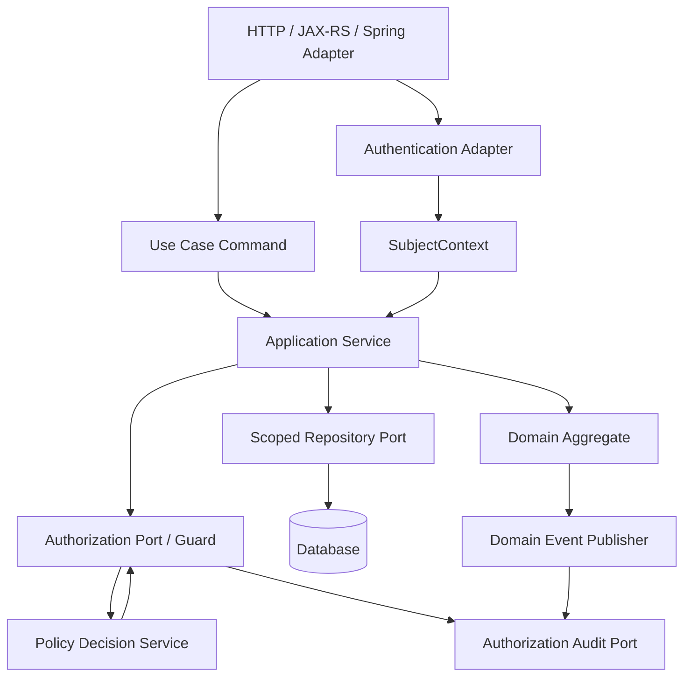
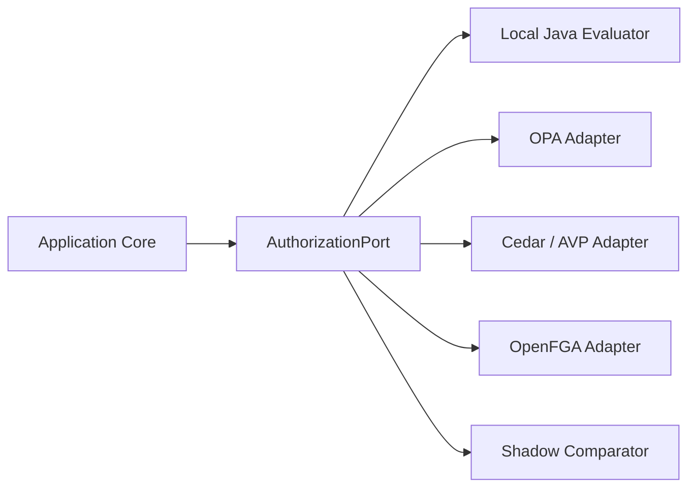
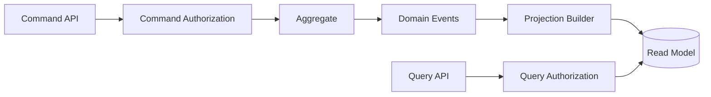

# Part 025 — Authorization in Clean Architecture, DDD, and Hexagonal Java

Authorization is not a framework annotation problem.

Framework annotations are useful, but they sit near the edge of the system. Real authorization lives in the use case, aggregate, repository scope, policy model, and audit trail.

A secure Java system must answer one question consistently:

```text
Can this subject perform this domain action on this domain resource in this context?
```

Clean Architecture, DDD, and Hexagonal Architecture give us the right language to place this question correctly.

The mistake is to treat authorization as a web concern:

```java
@PreAuthorize("hasRole('ADMIN')")
@PostMapping("/cases/{id}/close")
public CaseDto close(@PathVariable UUID id) {
    return caseService.close(id);
}
```

This only asks:

```text
Does the caller have ADMIN?
```

It does not ask:

```text
Is this case in the caller's tenant?
Is the case assigned to the caller or their unit?
Is the case in a state where close is allowed?
Is the caller the same person who opened the case?
Is maker-checker required?
Is the resource under legal hold?
Is this a normal close, supervisory close, or forced close?
Which policy version made the decision?
```

A production system does not scatter those checks inside controllers. It models authorization as a first-class architectural concern.

---

## 1. Target Architecture

The clean version looks like this:



The edge adapter translates HTTP into a use-case command.

The application service coordinates authorization, loading, domain transition, persistence, and audit.

The domain aggregate enforces domain invariants.

The repository scopes data access so unauthorized objects cannot be fetched accidentally.

The authorization service or PDP evaluates explicit domain actions, not vague endpoint names.

---

## 2. The Core Rule

Do not let external framework concepts leak into your domain.

Bad domain model:

```java
public final class CaseFile {
    public void close(Authentication authentication) {
        if (!authentication.getAuthorities().contains(new SimpleGrantedAuthority("ROLE_ADMIN"))) {
            throw new AccessDeniedException("Denied");
        }
        this.status = CaseStatus.CLOSED;
    }
}
```

This couples the domain to Spring Security.

Better:

```java
public final class CaseFile {
    public void close(CaseClosureCommand command) {
        requireOpen();
        requireClosureReason(command.reason());
        requireNoActiveLegalHold();
        this.status = CaseStatus.CLOSED;
        this.closedBy = command.actorId();
        this.closedAt = command.closedAt();
        this.closureReason = command.reason();
    }
}
```

Authorization happens before the domain mutation, using domain language.

```java
AuthorizationDecision decision = authorizationService.check(
    AuthorizationRequest.builder()
        .subject(subject)
        .action(Action.CASE_CLOSE)
        .resource(ResourceRef.caseFile(command.caseId()))
        .context(Map.of(
            "tenantId", subject.tenantId(),
            "reason", command.reason(),
            "workflowSource", command.source()
        ))
        .build()
);

decision.requirePermit();
```

The aggregate enforces business validity. The authorization layer enforces access validity.

Both are required.

---

## 3. Layer Responsibilities

| Layer | Responsibility | Authorization Role | Should Know About |
|---|---|---|---|
| HTTP/JAX-RS/Spring adapter | Parse request, map identity, map errors | Coarse route guard, authentication presence, public/private endpoint | HTTP, headers, token, path |
| Application service | Execute use case | Main use-case authorization, audit, orchestration | Subject, command, action, resource |
| Domain aggregate | Enforce domain invariants | No framework auth; may expose state needed for policy | Business rules, state transitions |
| Repository port | Load/save resource | Query scoping, object binding | Tenant, subject visibility, filters |
| Database | Persist data | Optional row-level security / constraints | Physical data isolation |
| External PDP | Policy decision | Central policy evaluation | Policy, attributes, relationships |
| Audit adapter | Record evidence | Decision log and access trail | Decision, reason, policy version |

The highest-quality systems use multiple layers deliberately. They do not rely on exactly one magic place.

---

## 4. Authorization Is a Use-Case Concern

A use case is not the same as an endpoint.

These are different use cases:

```text
POST /cases/{id}/close              -> close case normally
POST /cases/{id}/force-close        -> force close exceptional case
POST /cases/{id}/approve-closure    -> approve another user's closure
POST /cases/{id}/reopen             -> reopen closed case
```

They may target the same aggregate but require different policies.

A clean application service names the use case directly:

```java
public final class CloseCaseUseCase {
    private final CaseRepository caseRepository;
    private final AuthorizationService authorizationService;
    private final Clock clock;
    private final AuditSink auditSink;

    public CloseCaseResult handle(SubjectContext subject, CloseCaseCommand command) {
        CaseFile caseFile = caseRepository.findVisibleCaseForUpdate(
            subject,
            command.caseId()
        ).orElseThrow(CaseNotFoundOrDeniedException::new);

        AuthorizationDecision decision = authorizationService.check(
            AuthorizationRequest.builder()
                .subject(subject)
                .action(Action.CASE_CLOSE)
                .resource(ResourceRef.caseFile(caseFile.id(), caseFile.tenantId()))
                .resourceAttributes(caseAttributes(caseFile))
                .context(Map.of(
                    "now", Instant.now(clock),
                    "reason", command.reason(),
                    "source", command.source()
                ))
                .build()
        );

        auditSink.record(decision.toAuditEvent());
        decision.requirePermit();

        caseFile.close(new CaseClosureCommand(
            subject.userId(),
            command.reason(),
            Instant.now(clock),
            command.source()
        ));

        caseRepository.save(caseFile);

        return CloseCaseResult.from(caseFile);
    }
}
```

Notice the sequence:

```text
1. Load through scoped repository.
2. Build authorization request with real resource attributes.
3. Evaluate policy.
4. Audit decision.
5. Enforce decision.
6. Mutate aggregate.
7. Persist.
```

This is slower to write than `@PreAuthorize("hasRole('ADMIN')")`.

It is also the difference between application security and security theater.

---

## 5. Use Route Guards for Coarse Authorization Only

Route-level guards are useful for broad checks:

```text
Is the endpoint public?
Is a valid principal required?
Does the caller belong to the right coarse authority family?
Is this endpoint restricted to service accounts?
Is this admin API blocked from normal users?
```

Example Spring edge rule:

```java
@Bean
SecurityFilterChain security(HttpSecurity http) throws Exception {
    return http
        .authorizeHttpRequests(auth -> auth
            .requestMatchers(HttpMethod.GET, "/health").permitAll()
            .requestMatchers("/internal/**").hasAuthority("SCOPE_internal")
            .requestMatchers("/admin/**").hasAuthority("PERM_ADMIN_PORTAL_ACCESS")
            .anyRequest().authenticated()
        )
        .oauth2ResourceServer(oauth2 -> oauth2.jwt(Customizer.withDefaults()))
        .build();
}
```

This does not replace use-case authorization.

It only ensures the request reaches the application with a valid subject and coarse capability.

---

## 6. Application Service Guard Pattern

The application service guard is the most important pattern in Clean Architecture authorization.

```java
public interface AuthorizationService {
    AuthorizationDecision check(AuthorizationRequest request);

    default void require(AuthorizationRequest request) {
        check(request).requirePermit();
    }
}
```

Use-case code calls it explicitly:

```java
authorizationService.require(
    AuthorizationRequest.forAction(subject, Action.EVIDENCE_UPLOAD)
        .on(ResourceRef.caseFile(caseId))
        .with("contentType", file.contentType())
        .with("sizeBytes", file.size())
        .build()
);
```

This is intentionally explicit.

Why explicit is better:

```text
- Code review sees the exact authorization action.
- Tests can assert the guard exists.
- Audit receives domain-level action names.
- Policy can evolve without changing controller annotations.
- Use cases invoked from HTTP, CLI, Kafka, scheduler, and admin tools all share the same guard.
```

---

## 7. Domain Policy vs Authorization Policy

DDD often uses the word “policy” for domain behavior.

Authorization also uses the word “policy”.

Do not mix them casually.

| Policy Type | Question | Example |
|---|---|---|
| Domain policy | Is this business action valid? | A closed case cannot receive new evidence. |
| Authorization policy | May this subject perform it? | Investigator may upload evidence only for assigned open cases. |
| Compliance policy | Is this permitted by regulation? | Sensitive evidence requires supervisory approval. |
| Operational policy | How should system behave? | Deny if PDP times out after 100 ms. |

Example domain policy:

```java
public final class ClosureEligibilityPolicy {
    public boolean canClose(CaseFile caseFile) {
        return caseFile.status() == CaseStatus.IN_REVIEW
            && caseFile.hasFinalRecommendation()
            && !caseFile.hasActiveLegalHold();
    }
}
```

Example authorization policy:

```java
public final class CloseCaseAuthorizationPolicy {
    public AuthorizationDecision evaluate(SubjectContext subject, CaseFile caseFile) {
        if (!subject.tenantId().equals(caseFile.tenantId())) {
            return AuthorizationDecision.deny("TENANT_MISMATCH");
        }
        if (!subject.hasPermission("case.close")) {
            return AuthorizationDecision.deny("MISSING_PERMISSION");
        }
        if (!caseFile.isAssignedTo(subject.userId()) && !subject.hasPermission("case.close.any")) {
            return AuthorizationDecision.deny("NOT_ASSIGNED");
        }
        return AuthorizationDecision.permit();
    }
}
```

Both can be used in one application service:

```java
if (!closureEligibilityPolicy.canClose(caseFile)) {
    throw new BusinessRuleViolation("Case is not eligible for closure");
}

authorizationService.require(closeCaseRequest(subject, caseFile));
```

Authorization denial is not the same as domain invalidity.

Keep the errors separate.

---

## 8. The Aggregate Should Not Know the Entire Principal

A domain aggregate should not usually know:

```text
- JWT claims
- OAuth scopes
- HTTP headers
- Spring Authentication
- JAX-RS SecurityContext
- session attributes
- request IP
```

But it may know a minimal actor identity if needed for domain history:

```java
public record ActorId(UUID value) {}

public final class CaseFile {
    public void assignTo(ActorId actor, InvestigatorId newAssignee, Instant now) {
        requireAssignable();
        this.assigneeId = newAssignee;
        this.assignmentHistory.add(new AssignmentChanged(actor, newAssignee, now));
    }
}
```

The aggregate records who changed state, but does not decide whether the actor was allowed.

That decision has already happened in the application service.

---

## 9. But Domain Invariants Are Still Security-Relevant

Do not overcorrect by removing all security-relevant logic from the domain.

This is wrong:

```java
// Bad: aggregate accepts impossible transition because authorization was checked elsewhere
caseFile.setStatus(CaseStatus.CLOSED);
```

The aggregate must reject impossible states:

```java
public void approveClosure(ActorId approver, Instant approvedAt) {
    if (status != CaseStatus.PENDING_CLOSURE_APPROVAL) {
        throw new InvalidCaseState("Case is not waiting for closure approval");
    }
    if (closureRequestedBy.equals(approver)) {
        throw new SeparationOfDutyViolation("Requester cannot approve own closure");
    }
    this.status = CaseStatus.CLOSED;
    this.closedAt = approvedAt;
    this.closedBy = approver;
}
```

This looks like authorization, but it is a domain invariant: a maker cannot approve their own work.

Whether the approver has the authority to approve is still an authorization question.

---

## 10. State Machine Authorization

Regulatory and enterprise workflows are stateful.

Authorization must be tied to transitions, not just CRUD verbs.

Bad action model:

```text
case.update
case.approve
case.admin
```

Better action model:

```text
case.draft.edit
case.submit_for_review
case.review.assign
case.recommendation.add
case.closure.request
case.closure.approve
case.reopen
case.escalate
case.evidence.upload
case.evidence.seal
case.export.redacted
case.export.full
```

The application service can model transition authorization as follows:

```java
public void transition(SubjectContext subject, TransitionCaseCommand command) {
    CaseFile caseFile = caseRepository.findVisibleCaseForUpdate(subject, command.caseId())
        .orElseThrow(CaseNotFoundOrDeniedException::new);

    CaseTransition transition = transitionCatalog.resolve(
        caseFile.status(),
        command.targetStatus(),
        command.reasonCode()
    );

    authorizationService.require(
        AuthorizationRequest.builder()
            .subject(subject)
            .action(transition.requiredAction())
            .resource(ResourceRef.caseFile(caseFile.id(), caseFile.tenantId()))
            .resourceAttributes(caseAttributes(caseFile))
            .context(Map.of(
                "fromStatus", caseFile.status().name(),
                "toStatus", command.targetStatus().name(),
                "transition", transition.name()
            ))
            .build()
    );

    caseFile.applyTransition(transition, subject.actorId(), clock.instant());
    caseRepository.save(caseFile);
}
```

The authorization action is derived from the state transition.

This prevents accidental use of generic `case.update` for sensitive transitions.

---

## 11. Repository Port: Load Only What the Subject Can See

A Clean Architecture repository should not expose unsafe loading methods to application use cases.

Bad:

```java
Optional<CaseFile> findById(CaseId id);
```

Better:

```java
Optional<CaseFile> findVisibleCaseForRead(SubjectContext subject, CaseId id);

Optional<CaseFile> findVisibleCaseForUpdate(SubjectContext subject, CaseId id);

Page<CaseSummary> searchVisibleCases(SubjectContext subject, CaseSearchCriteria criteria, PageRequest page);
```

The implementation can use SQL scoping:

```sql
select c.*
from case_file c
left join case_assignment a
  on a.case_id = c.id
 and a.user_id = :subject_user_id
where c.id = :case_id
  and c.tenant_id = :tenant_id
  and (
        c.owner_user_id = :subject_user_id
     or a.user_id is not null
     or exists (
          select 1
          from user_unit_membership uum
          where uum.user_id = :subject_user_id
            and uum.unit_id = c.responsible_unit_id
     )
  )
for update;
```

This repository method does not decide every policy.

It enforces the baseline object visibility boundary.

---

## 12. Repository Scoping Is Not a Replacement for Action Authorization

A scoped repository answers:

```text
Can the subject see/load this resource?
```

It does not necessarily answer:

```text
Can the subject close it?
Can the subject export it?
Can the subject assign it to someone else?
Can the subject edit sealed evidence?
Can the subject override a legal hold?
```

That means this is incomplete:

```java
CaseFile caseFile = caseRepository.findVisibleCaseForUpdate(subject, command.caseId())
    .orElseThrow(CaseNotFoundOrDeniedException::new);

caseFile.close(...); // Missing action authorization
```

Production code needs both:

```text
visibility scope + action policy
```

Use repository scoping to prevent object enumeration and tenant breakout.

Use authorization service to evaluate action-level permission.

---

## 13. Port Design for Authorization

Hexagonal Architecture says the application core talks to ports, not infrastructure details.

Authorization should be a port:

```java
public interface AuthorizationPort {
    AuthorizationDecision decide(AuthorizationRequest request);

    BatchAuthorizationDecision decideBatch(List<AuthorizationRequest> requests);
}
```

Implementations can vary:

```text
- In-process Java policy evaluator
- Spring Security adapter
- OPA REST adapter
- Cedar / Amazon Verified Permissions adapter
- OpenFGA adapter
- Test fake
- Shadow decision comparator
```

The core application does not care.



This is how you keep authorization evolvable.

---

## 14. Authorization Request Type in the Application Core

Define a framework-neutral request type:

```java
public record AuthorizationRequest(
    SubjectContext subject,
    Action action,
    ResourceRef resource,
    Map<String, Object> resourceAttributes,
    Map<String, Object> environment,
    Map<String, Object> requestContext,
    RequestMetadata metadata
) {
    public static Builder builder() {
        return new Builder();
    }
}
```

Subject must be already normalized:

```java
public record SubjectContext(
    SubjectId subjectId,
    TenantId tenantId,
    SubjectType type,
    Set<String> authorities,
    Set<String> groups,
    Set<String> scopes,
    Map<String, Object> attributes,
    Instant authenticatedAt
) {}
```

Resource should be explicit:

```java
public record ResourceRef(
    ResourceType type,
    String id,
    TenantId tenantId,
    Optional<String> parentId
) {
    public static ResourceRef caseFile(CaseId id, TenantId tenantId) {
        return new ResourceRef(ResourceType.CASE_FILE, id.value().toString(), tenantId, Optional.empty());
    }
}
```

Do not pass ORM entities blindly to external PDPs.

Build a safe attribute projection.

---

## 15. Safe Resource Attribute Projection

Bad:

```java
authorizationPort.decide(requestWithFullEntity(caseFile));
```

This can leak sensitive fields to logs, external PDPs, or policy traces.

Better:

```java
private Map<String, Object> caseAttributes(CaseFile caseFile) {
    return Map.of(
        "tenantId", caseFile.tenantId().value().toString(),
        "status", caseFile.status().name(),
        "classification", caseFile.classification().name(),
        "responsibleUnitId", caseFile.responsibleUnitId().value().toString(),
        "assigneeId", caseFile.assigneeId().map(InvestigatorId::value).map(UUID::toString).orElse(null),
        "legalHold", caseFile.hasActiveLegalHold(),
        "createdBy", caseFile.createdBy().value().toString()
    );
}
```

Projection has three benefits:

```text
- policy only sees what it needs
- audit log remains bounded
- schema can be versioned independently from domain entity internals
```

---

## 16. Anti-Corruption Layer for Identity and Claims

Do not pass raw JWT claims through your application.

Bad:

```java
String tenant = jwt.getClaimAsString("tid");
String user = jwt.getSubject();
List<String> roles = jwt.getClaimAsStringList("roles");
```

Scattered claim parsing creates inconsistent semantics.

Use an adapter:

```java
public final class JwtSubjectContextMapper {
    public SubjectContext fromJwt(Jwt jwt) {
        return new SubjectContext(
            new SubjectId(jwt.getSubject()),
            new TenantId(requiredClaim(jwt, "tenant_id")),
            SubjectType.USER,
            normalizeAuthorities(jwt),
            normalizeGroups(jwt),
            normalizeScopes(jwt),
            Map.of(
                "assuranceLevel", claim(jwt, "acr"),
                "departmentId", claim(jwt, "department_id"),
                "jurisdiction", claim(jwt, "jurisdiction")
            ),
            jwt.getIssuedAt()
        );
    }
}
```

Now the application deals with `SubjectContext`, not token details.

---

## 17. Adapter Boundary for Spring Security

Spring Security should sit at the adapter edge.

```java
@RestController
@RequestMapping("/cases")
public final class CaseController {
    private final CloseCaseUseCase closeCaseUseCase;
    private final SubjectContextFactory subjectContextFactory;

    @PostMapping("/{caseId}/close")
    public ResponseEntity<CaseDto> close(
        @AuthenticationPrincipal Jwt jwt,
        @PathVariable UUID caseId,
        @RequestBody CloseCaseHttpRequest body
    ) {
        SubjectContext subject = subjectContextFactory.fromJwt(jwt);

        CloseCaseResult result = closeCaseUseCase.handle(
            subject,
            new CloseCaseCommand(new CaseId(caseId), body.reason(), CommandSource.HTTP)
        );

        return ResponseEntity.ok(CaseDto.from(result));
    }
}
```

The controller maps transport to use-case command.

The use case performs authorization.

The domain remains ignorant of Spring.

---

## 18. Adapter Boundary for JAX-RS/Jersey

The same shape applies to JAX-RS:

```java
@Path("/cases")
@Produces(MediaType.APPLICATION_JSON)
@Consumes(MediaType.APPLICATION_JSON)
public final class CaseResource {
    private final CloseCaseUseCase closeCaseUseCase;
    private final SubjectContextProvider subjectContextProvider;

    @POST
    @Path("/{caseId}/close")
    public Response close(
        @PathParam("caseId") UUID caseId,
        CloseCaseHttpRequest body
    ) {
        SubjectContext subject = subjectContextProvider.currentSubject();

        CloseCaseResult result = closeCaseUseCase.handle(
            subject,
            new CloseCaseCommand(new CaseId(caseId), body.reason(), CommandSource.HTTP)
        );

        return Response.ok(CaseDto.from(result)).build();
    }
}
```

Again, JAX-RS is not the center of authorization.

It is only an inbound adapter.

---

## 19. Command Objects Should Be Safe by Design

Never accept client-controlled authorization facts as trusted command fields.

Bad:

```json
{
  "caseId": "...",
  "tenantId": "tenant-a",
  "createdBy": "admin",
  "classification": "PUBLIC",
  "force": true
}
```

Better:

```java
public record CloseCaseCommand(
    CaseId caseId,
    ClosureReason reason,
    CommandSource source
) {}
```

Server-derived facts come from trusted sources:

```text
- subject.tenantId from authenticated subject mapping
- resource.tenantId from database
- classification from database
- force privilege from policy
- actor from subject context
```

Command design is part of authorization design.

---

## 20. Separate Read Model Authorization from Write Model Authorization

Read use cases often use query scoping and field filtering.

Write use cases use action authorization and aggregate invariants.

Example read model:

```java
public Page<CaseSummary> search(SubjectContext subject, CaseSearchCriteria criteria, PageRequest page) {
    CaseSearchScope scope = caseSearchScopeFactory.forSubject(subject);
    Page<CaseSummary> results = caseReadRepository.search(scope, criteria, page);
    return fieldAuthorization.redactCaseSummaries(subject, results);
}
```

Example write model:

```java
public void assign(SubjectContext subject, AssignCaseCommand command) {
    CaseFile caseFile = caseRepository.findVisibleCaseForUpdate(subject, command.caseId())
        .orElseThrow(CaseNotFoundOrDeniedException::new);

    authorizationService.require(assignCaseRequest(subject, caseFile, command.newAssignee()));

    caseFile.assignTo(subject.actorId(), command.newAssignee(), clock.instant());
    caseRepository.save(caseFile);
}
```

Do not reuse write authorization for search.

Do not reuse search scope for sensitive state transitions.

---

## 21. CQRS and Authorization

In CQRS systems, authorization must exist on both sides.



Command side:

```text
- can the subject perform the mutation?
- can the transition happen?
- should the event be emitted?
```

Query side:

```text
- which rows can the subject see?
- which fields must be redacted?
- which filters/sorts are allowed?
```

Projection builders are not normally subject-specific. They build read models. Query authorization is still required.

---

## 22. Domain Events Must Not Become Authorization Bypasses

This is a common failure:

```text
HTTP endpoint checks authorization.
Endpoint publishes event.
Consumer performs sensitive update without checking authorization or without a trusted authorization snapshot.
```

Use one of these designs:

### Design A — Authorize Before Command Event

```java
authorizationService.require(requestFor(subject, Action.CASE_ESCALATE, caseFile));
caseFile.escalate(...);
eventPublisher.publish(new CaseEscalated(...));
```

The event is a fact that already passed authorization.

### Design B — Authorize Consumer Operation

```java
public void handle(ExportRequested event) {
    AuthorizationSnapshot snapshot = event.authorizationSnapshot();
    snapshot.requireAction(Action.CASE_EXPORT_FULL);
    exportService.generate(event.exportId());
}
```

### Design C — Recheck on Execution

```java
public void handle(DelayedClosureRequested event) {
    SubjectContext subject = subjectContextStore.load(event.subjectId());
    CaseFile caseFile = repository.findById(event.caseId()).orElseThrow();
    authorizationService.require(closeCaseRequest(subject, caseFile));
    caseFile.close(...);
}
```

Recheck is safer when permissions may change before execution.

Snapshot is useful when you need a record of what was approved at request time.

---

## 23. Authorization Snapshot Value Object

For async commands, use a bounded snapshot:

```java
public record AuthorizationSnapshot(
    SubjectId subjectId,
    TenantId tenantId,
    Action action,
    ResourceRef resource,
    Decision decision,
    String policyVersion,
    Instant decidedAt,
    Instant expiresAt,
    List<String> reasonCodes
) {
    public void requireUsableFor(Action expectedAction, ResourceRef expectedResource, Instant now) {
        if (decision != Decision.PERMIT) {
            throw new AccessDeniedException("Original decision was not permit");
        }
        if (!action.equals(expectedAction)) {
            throw new AccessDeniedException("Snapshot action mismatch");
        }
        if (!resource.equals(expectedResource)) {
            throw new AccessDeniedException("Snapshot resource mismatch");
        }
        if (now.isAfter(expiresAt)) {
            throw new AccessDeniedException("Authorization snapshot expired");
        }
    }
}
```

Do not put entire token claims in the event.

Do not let snapshots live forever.

---

## 24. Multi-Tenant Authorization in the Core

Tenant must not be an optional request filter.

Make tenant part of the type model:

```java
public record TenantId(String value) {
    public TenantId {
        if (value == null || value.isBlank()) {
            throw new IllegalArgumentException("tenant id is required");
        }
    }
}
```

Subject must always have a tenant or an explicit global/system tenant:

```java
public record SubjectContext(
    SubjectId subjectId,
    TenantId tenantId,
    SubjectType type,
    Set<String> permissions,
    Map<String, Object> attributes
) {}
```

Resource references must include tenant when tenant-scoped:

```java
public record ResourceRef(ResourceType type, String id, TenantId tenantId) {}
```

Repository methods require subject/scope:

```java
Optional<CaseFile> findVisibleCaseForRead(SubjectContext subject, CaseId id);
```

This makes cross-tenant access difficult to express accidentally.

---

## 25. Global Admin Is Not a Shortcut

Enterprise systems often need platform administrators.

Do not model them as unlimited bypasses.

Bad:

```java
if (subject.hasRole("GLOBAL_ADMIN")) {
    return AuthorizationDecision.permit();
}
```

Better:

```java
if (subject.hasPermission("platform.support.impersonate")) {
    return requireBreakGlass(
        subject,
        request,
        "Global support access requires ticket, reason, expiration, and audit"
    );
}
```

Global access should be:

```text
- purpose-bound
- time-bound
- tenant-bound when possible
- reason-required
- ticket-linked
- separately audited
- visible in access review
- excluded from normal user policy paths
```

---

## 26. Application Error Mapping

Clean Architecture separates internal error from external response.

Internal authorization outcomes:

```java
public sealed interface UseCaseError permits NotFoundOrDenied, AccessDenied, BusinessViolation {}

public record NotFoundOrDenied(String resourceType) implements UseCaseError {}
public record AccessDenied(String reasonCode) implements UseCaseError {}
public record BusinessViolation(String code) implements UseCaseError {}
```

External mapping:

```java
public final class ErrorMapper {
    public HttpResponse map(Throwable error) {
        return switch (error) {
            case CaseNotFoundOrDeniedException ignored -> HttpResponse.notFound();
            case AccessDeniedException denied -> HttpResponse.forbidden(publicMessage(denied));
            case BusinessRuleViolation violation -> HttpResponse.unprocessableEntity(violation.publicCode());
            default -> HttpResponse.internalServerError();
        };
    }
}
```

Do not leak sensitive reason codes to clients.

Audit can store:

```text
TENANT_MISMATCH
NOT_ASSIGNED
INSUFFICIENT_CLEARANCE
LEGAL_HOLD
POLICY_TIMEOUT
```

Client may only see:

```json
{"error":"not_found"}
```

or:

```json
{"error":"forbidden"}
```

depending on endpoint semantics.

---

## 27. Testing the Authorization Boundary

Test the architecture, not just policy logic.

### Use-Case Guard Test

```java
@Test
void closeCase_requiresClosePermission() {
    SubjectContext subject = fixtures.investigatorWithout("case.close");
    CaseFile caseFile = fixtures.caseInReviewAssignedTo(subject.userId());

    caseRepository.save(caseFile);

    assertThatThrownBy(() -> useCase.handle(subject, new CloseCaseCommand(caseFile.id(), reason(), HTTP)))
        .isInstanceOf(AccessDeniedException.class);
}
```

### Repository Scope Test

```java
@Test
void findVisibleCaseForRead_doesNotReturnOtherTenantCase() {
    SubjectContext subject = fixtures.subjectInTenant("tenant-a");
    CaseFile otherTenantCase = fixtures.caseInTenant("tenant-b");

    assertThat(repository.findVisibleCaseForRead(subject, otherTenantCase.id()))
        .isEmpty();
}
```

### Architecture Test

With ArchUnit-style rules:

```java
@ArchTest
static final ArchRule domainMustNotDependOnSpringSecurity = noClasses()
    .that().resideInAPackage("..domain..")
    .should().dependOnClassesThat().resideInAnyPackage("org.springframework.security..")
    .because("domain must not know transport/framework security types");
```

### Use-Case Coverage Test

Create a test that asserts each protected use case calls authorization.

```java
@Test
void closeCase_callsAuthorizationWithDomainAction() {
    useCase.handle(subject, command);

    verify(authorizationService).check(argThat(request ->
        request.action().equals(Action.CASE_CLOSE)
            && request.resource().type() == ResourceType.CASE_FILE
    ));
}
```

This is not paranoia.

It prevents future refactors from silently deleting authorization.

---

## 28. Architecture Fitness Function

For a large Java codebase, define fitness rules:

```text
1. Controllers must not call repositories directly for protected resources.
2. Application services must not use raw JWT or Spring Authentication.
3. Domain must not depend on web/security framework classes.
4. Repositories for protected aggregates must expose scoped methods.
5. Use cases mutating protected resources must call AuthorizationPort.
6. Authorization decisions must be auditable.
7. Bulk/list/export use cases must use query scope before pagination/export.
8. Admin/break-glass use cases must require reason and ticket.
9. Field redaction must happen before DTO leaves application boundary.
10. Async commands must carry authorization snapshot or recheck plan.
```

These rules can be enforced through code review, tests, static analysis, and build checks.

---

## 29. Common Clean Architecture Authorization Mistakes

### Mistake 1 — Controller-Centric Authorization

```java
@PreAuthorize("hasRole('SUPERVISOR')")
```

Then CLI, Kafka consumer, scheduled job, and internal service call bypass the controller.

### Mistake 2 — Domain Coupled to Framework

```java
public void approve(Authentication auth) { ... }
```

This makes the model hard to test and hard to reuse.

### Mistake 3 — Repository Exposes Unsafe Load

```java
repository.findById(id)
```

Then every caller must remember to authorize.

### Mistake 4 — Generic Actions

```text
case.update
```

This hides important state transitions.

### Mistake 5 — Policy Reads Too Much

Passing whole entities to PDP leaks data and couples policy to persistence internals.

### Mistake 6 — Authorization and Business Errors Collapsed

A business-invalid operation is not the same as unauthorized access.

### Mistake 7 — Async Bypass

A use case checks authorization, but the worker performs a different operation later without snapshot or recheck.

---

## 30. Case Study: Regulatory Case Closure

Requirement:

```text
A case can be closed only if:
- caller belongs to the case tenant
- caller has case.closure.request or case.closure.approve depending on transition
- caller is assigned investigator or supervisor of responsible unit
- case is in IN_REVIEW or PENDING_CLOSURE_APPROVAL
- case has final recommendation
- case has no active legal hold
- maker cannot approve own closure
- highly sensitive cases require supervisor clearance
- all decisions must be auditable
```

Clean use-case split:

```text
RequestClosureUseCase
ApproveClosureUseCase
RejectClosureUseCase
ForceCloseCaseUseCase
```

Each use case has different action:

```java
public enum Action {
    CASE_CLOSURE_REQUEST,
    CASE_CLOSURE_APPROVE,
    CASE_CLOSURE_REJECT,
    CASE_FORCE_CLOSE
}
```

Request closure:

```java
public void requestClosure(SubjectContext subject, RequestClosureCommand command) {
    CaseFile caseFile = caseRepository.findVisibleCaseForUpdate(subject, command.caseId())
        .orElseThrow(CaseNotFoundOrDeniedException::new);

    authorizationService.require(
        request(subject, Action.CASE_CLOSURE_REQUEST, caseFile)
            .with("reason", command.reason())
            .build()
    );

    caseFile.requestClosure(subject.actorId(), command.reason(), clock.instant());
    caseRepository.save(caseFile);
}
```

Approve closure:

```java
public void approveClosure(SubjectContext subject, ApproveClosureCommand command) {
    CaseFile caseFile = caseRepository.findVisibleCaseForUpdate(subject, command.caseId())
        .orElseThrow(CaseNotFoundOrDeniedException::new);

    authorizationService.require(
        request(subject, Action.CASE_CLOSURE_APPROVE, caseFile)
            .with("requestedBy", caseFile.closureRequestedBy().value().toString())
            .with("classification", caseFile.classification().name())
            .build()
    );

    caseFile.approveClosure(subject.actorId(), clock.instant());
    caseRepository.save(caseFile);
}
```

Domain aggregate:

```java
public void approveClosure(ActorId approver, Instant now) {
    if (status != CaseStatus.PENDING_CLOSURE_APPROVAL) {
        throw new InvalidCaseState("Case is not pending closure approval");
    }
    if (closureRequestedBy.equals(approver)) {
        throw new SeparationOfDutyViolation("Requester cannot approve own closure");
    }
    if (hasActiveLegalHold()) {
        throw new InvalidCaseState("Case has active legal hold");
    }

    this.status = CaseStatus.CLOSED;
    this.closedBy = approver;
    this.closedAt = now;
}
```

The system now has layered protection:

```text
repository scope -> action policy -> domain invariant -> audit
```

---

## 31. Internal Engineering Review Checklist

Before approving a use case that touches protected resources, ask:

```text
1. What is the domain action name?
2. Is this endpoint merely a transport adapter?
3. Is the subject normalized before reaching the use case?
4. Is resource tenant bound in the type model?
5. Is object visibility enforced by scoped repository/load?
6. Is action authorization explicit in the application service?
7. Are resource attributes projected safely for policy?
8. Are domain invariants enforced inside the aggregate?
9. Are authorization denial and business invalidity separated?
10. Are list/search/export endpoints scoped before pagination?
11. Are field-level redaction and writable-field checks handled?
12. Does async execution use snapshot or recheck?
13. Are decisions audited with policy version and reason code?
14. Are admin/break-glass paths separately modeled?
15. Are architecture tests preventing framework leakage into domain?
```

---

## 32. Production Heuristics

Use these heuristics when designing Java authorization in Clean Architecture:

```text
If authorization depends only on route shape -> edge guard is enough.
If authorization depends on object ownership -> repository scope and object-level guard.
If authorization depends on lifecycle state -> use-case action policy and aggregate invariant.
If authorization depends on field sensitivity -> DTO/mapper field authorization.
If authorization depends on relationship graph -> ReBAC/OpenFGA-style model.
If authorization must be centrally governed -> external PDP/policy-as-code.
If authorization must be regulatory-defensible -> decision audit is mandatory.
```

---

## 33. What Top Engineers Do Differently

Average implementation:

```text
Add @PreAuthorize and hope tests pass.
```

Strong implementation:

```text
Model action, resource, subject, context, scope, decision, and audit explicitly.
```

Top-tier implementation:

```text
Make unauthorized states hard to express.
Make protected loads scoped by default.
Make policy decisions observable and testable.
Make framework security an adapter, not the architecture.
Make async and batch paths obey the same authorization invariants.
Make every sensitive transition defensible under audit.
```

---

## 34. Summary

Clean Architecture, DDD, and Hexagonal Architecture do not reduce the need for authorization.

They make it possible to place authorization correctly.

The practical model is:

```text
- Edge adapter authenticates and performs coarse route guards.
- SubjectContext normalizes identity into application language.
- Application service performs use-case authorization.
- Repository scopes object access by construction.
- Domain aggregate enforces business invariants.
- AuthorizationPort hides PDP implementation.
- AuditPort records decision evidence.
- Async flows carry snapshot or recheck.
```

The result is a system where authorization is not hidden inside framework decoration.

It becomes part of the system's executable design.

---

## References

- OWASP Authorization Cheat Sheet — https://cheatsheetseries.owasp.org/cheatsheets/Authorization_Cheat_Sheet.html
- OWASP API Security 2023 — Broken Object Level Authorization — https://owasp.org/API-Security/editions/2023/en/0xa1-broken-object-level-authorization/
- Spring Security Authorization Architecture — https://docs.spring.io/spring-security/reference/servlet/authorization/architecture.html
- Spring Security Method Security — https://docs.spring.io/spring-security/reference/servlet/authorization/method-security.html
- NIST SP 800-162, Guide to Attribute Based Access Control — https://csrc.nist.gov/pubs/sp/800/162/upd2/final
- OPA Documentation — https://www.openpolicyagent.org/docs/latest/
- Cedar Documentation — https://docs.cedarpolicy.com/
- Amazon Verified Permissions — https://docs.aws.amazon.com/verifiedpermissions/latest/userguide/what-is-avp.html
