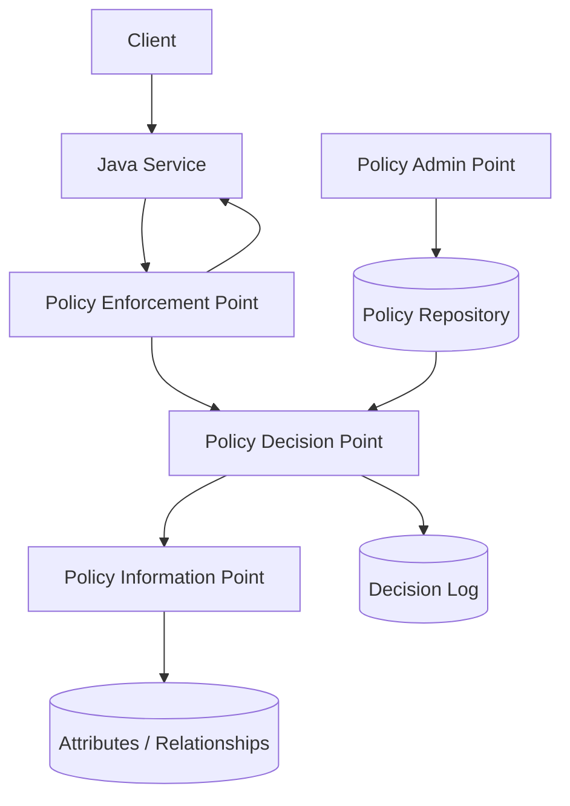
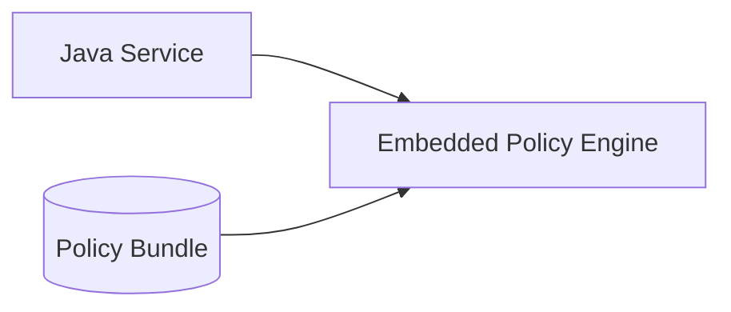
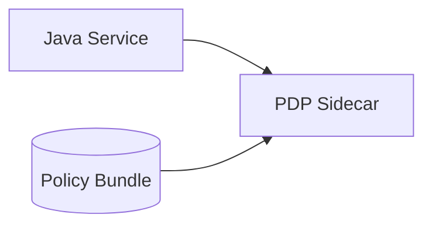
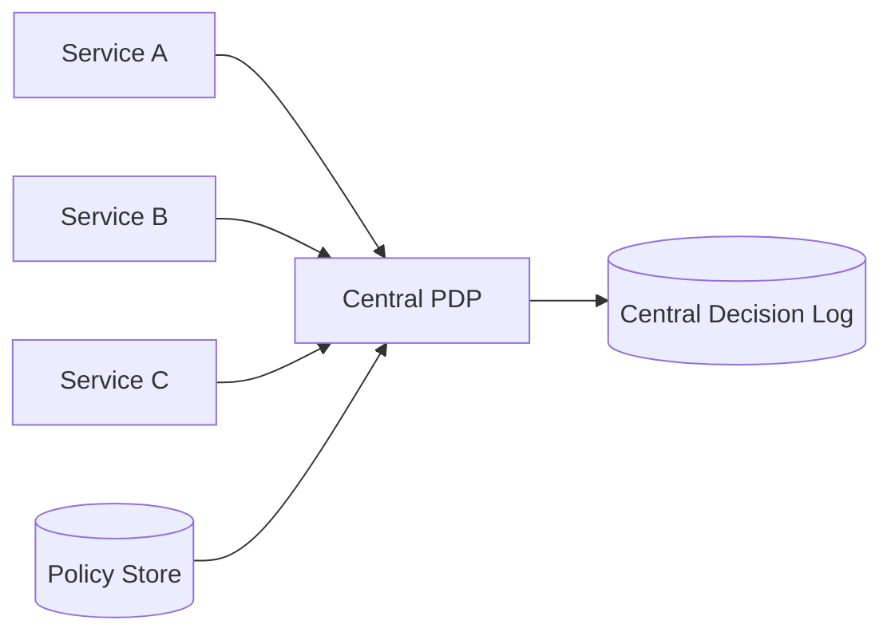
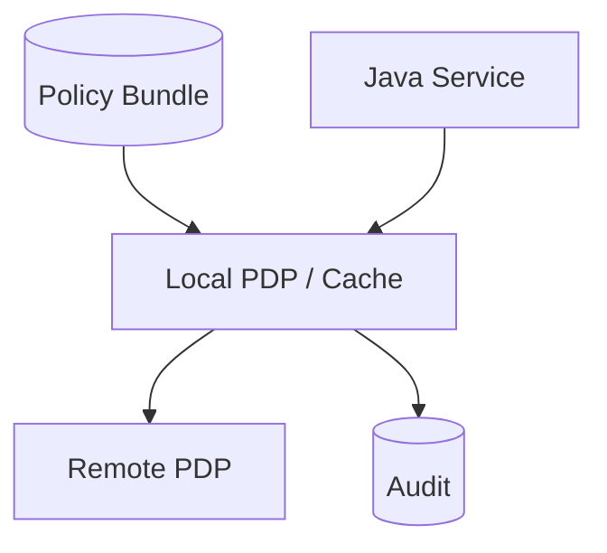
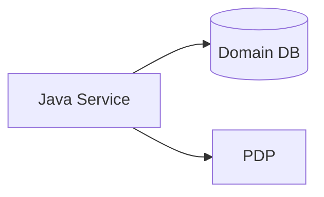
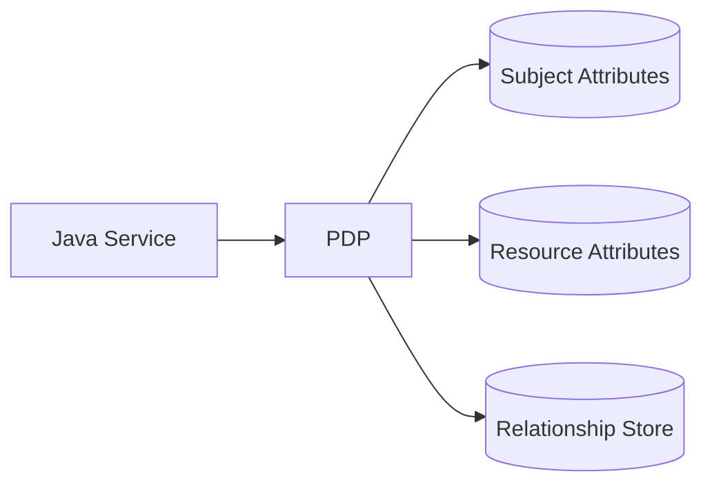
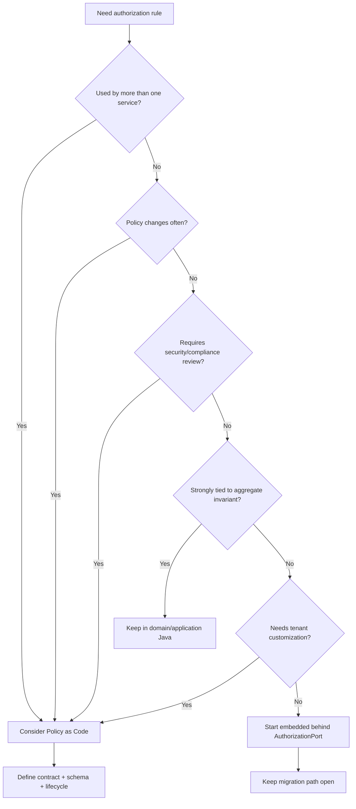

# Part 026 — Policy as Code: When Authorization Leaves Application Code

At small scale, authorization starts as Java code.

```java
if (subject.hasPermission("case.close") && caseFile.isAssignedTo(subject.userId())) {
    return permit();
}
```

At enterprise scale, the same logic becomes harder to manage:

```text
- multiple services need the same rule
- policy must change faster than application release cycles
- audit teams need visibility into who can do what
- compliance wants reviewable policy diffs
- product teams need fine-grained entitlements
- platform teams need consistent enforcement across Java, Node, Go, data, and infrastructure
- security needs deny-by-default and provable coverage
```

Policy as Code is the move from invisible authorization scattered in application logic to explicit, versioned, testable, reviewable, deployable policy artifacts.

But this move is not free.

Externalized policy can improve governance and consistency. It can also create latency, complexity, semantic drift, operational coupling, and confusing failure modes.

This part explains when authorization should leave Java application code, when it should not, and how to design the boundary without losing domain clarity.

---

## 1. What Policy as Code Means

Policy as Code means policy is represented as machine-readable artifacts that can be:

```text
- versioned
- reviewed
- tested
- deployed
- rolled back
- audited
- diffed
- promoted across environments
- evaluated consistently by a policy engine
```

Examples:

```rego
package authz.case

default allow := false

allow if {
  input.action == "case.close"
  input.subject.tenant_id == input.resource.tenant_id
  input.subject.permissions[_] == "case.close"
  input.resource.status == "IN_REVIEW"
  input.resource.assignee_id == input.subject.id
}
```

Cedar-style example:

```cedar
permit(
  principal,
  action == CaseAction::"close",
  resource
)
when {
  principal.tenant == resource.tenant &&
  principal has permission &&
  principal.permission.contains("case.close") &&
  resource.status == "IN_REVIEW" &&
  resource.assignee == principal
};
```

The exact language matters less than the architectural shift:

```text
Policy becomes an artifact, not just imperative application code.
```

---

## 2. What Policy as Code Is Not

Policy as Code is not:

```text
- replacing application authorization entirely
- removing the need for object-level authorization
- letting security team write all domain rules alone
- passing entire domain entities to a policy engine
- moving every if-statement into Rego/Cedar
- adding a central PDP and assuming the system is secure
- a reason to skip tests
```

The Java service still needs:

```text
- enforcement point
- safe request construction
- resource loading/scoping
- attribute projection
- error handling
- audit emission
- fallback behavior
- policy version awareness
```

Policy engine decides.

Application enforces.

That separation is non-negotiable.

---

## 3. Embedded Authorization vs Policy as Code

| Dimension | Embedded Java Authorization | Policy as Code |
|---|---|---|
| Change speed | tied to service release | can be policy release |
| Governance | code review by app team | policy review by app/security/compliance |
| Cross-service consistency | manual duplication risk | central/shared policy possible |
| Type safety | strong Java types | depends on schema/validation |
| Latency | local call | local engine, sidecar, or remote PDP |
| Observability | must be built | often decision-log friendly |
| Domain clarity | close to code | can drift from domain if poorly modeled |
| Failure mode | app bug | app + policy + PDP + distribution bugs |
| Testing | normal Java tests | policy tests + integration tests |
| Ownership | engineering team | shared engineering/security/product |

Policy as Code is valuable when governance and consistency outweigh added complexity.

---

## 4. When to Keep Authorization in Java

Keep authorization embedded when:

```text
- system is small or single-service
- policies change rarely
- domain rules are highly coupled to aggregate behavior
- policy is simple and easy to test in Java
- latency budget is extremely tight
- security/compliance does not require central policy governance
- team lacks operational maturity for external PDP
```

Example:

```java
public AuthorizationDecision canEditOwnDraft(SubjectContext subject, Draft draft) {
    if (!subject.userId().equals(draft.createdBy())) {
        return deny("NOT_OWNER");
    }
    if (draft.status() != DraftStatus.DRAFT) {
        return deny("NOT_EDITABLE_STATE");
    }
    return permit();
}
```

This may be perfectly fine.

Do not externalize policy because it sounds modern.

Externalize because it solves a real governance, consistency, or scale problem.

---

## 5. When Authorization Should Leave Application Code

Externalize policy when several of these are true:

```text
1. Multiple services need the same policy semantics.
2. Policy changes are more frequent than service deployments.
3. Non-application teams must review or approve policy changes.
4. You need consistent decision logging across services.
5. You need dry-run/shadow evaluation.
6. Authorization is fine-grained and cross-cutting.
7. Tenant-specific or customer-specific policy is required.
8. You need formal policy diff and approval workflow.
9. You need to combine RBAC, ABAC, and relationship data.
10. You need regulatory defensibility: who changed policy, when, why, and what effect.
```

Typical examples:

```text
- enterprise SaaS authorization
- regulatory case management
- document sharing
- healthcare record access
- financial approval flows
- cloud control plane authorization
- internal platform entitlement systems
- multi-tenant admin consoles
```

---

## 6. Externalized Authorization Architecture

The canonical model:



In code, the Java service owns PEP behavior:

```java
AuthorizationDecision decision = authorizationPort.decide(request);

auditSink.record(decision.toAuditEvent());

decision.requirePermit();
```

The PDP owns policy evaluation.

The PAP owns policy administration and lifecycle.

The PIP owns attribute or relationship lookup.

---

## 7. PDP Deployment Topologies

### Topology A — In-Process Policy Engine



Pros:

```text
- low latency
- fewer network failure modes
- easier local testing
- service autonomy
```

Cons:

```text
- policy bundle distribution required
- memory footprint per service
- language/runtime support may vary
- central decision logging requires extra work
```

Use when latency and availability matter more than centralized runtime control.

### Topology B — Sidecar PDP



Pros:

```text
- low-latency local network call
- policy engine isolated from app process
- common in Kubernetes/service mesh environments
- easy to update policy independently
```

Cons:

```text
- sidecar lifecycle management
- local network still can fail
- version skew between app and sidecar
- more deployment complexity
```

OPA sidecar deployment often fits this model.

### Topology C — Central Remote PDP



Pros:

```text
- central governance
- central decision logging
- consistent runtime behavior
- easier policy administration
```

Cons:

```text
- network latency
- shared dependency blast radius
- availability engineering required
- requires strict API compatibility
```

Use for enterprise control planes, SaaS administration, and systems where central governance is dominant.

### Topology D — Hybrid



Common design:

```text
- local PDP for low-latency common decisions
- remote PDP for admin/governed decisions
- cached policy bundle
- central audit pipeline
- fail-closed for sensitive actions
```

---

## 8. Decision Contract First

The most important artifact is not the policy language.

It is the decision contract.

```json
{
  "subject": {
    "id": "user-123",
    "type": "USER",
    "tenantId": "tenant-a",
    "permissions": ["case.close"],
    "groups": ["unit:enforcement-west"],
    "attributes": {
      "clearance": "CONFIDENTIAL"
    }
  },
  "action": "case.close",
  "resource": {
    "type": "case_file",
    "id": "case-456",
    "tenantId": "tenant-a",
    "attributes": {
      "status": "IN_REVIEW",
      "classification": "CONFIDENTIAL",
      "assigneeId": "user-123",
      "legalHold": false
    }
  },
  "environment": {
    "time": "2026-07-03T10:00:00Z",
    "channel": "HTTP",
    "ipRisk": "LOW"
  },
  "metadata": {
    "requestId": "req-789",
    "service": "case-service",
    "schemaVersion": "authz-request-v1"
  }
}
```

If this contract is sloppy, every policy language will produce sloppy authorization.

---

## 9. Java Contract Types

Use typed builders to avoid accidental malformed decisions.

```java
public record PolicyDecisionRequest(
    PolicySubject subject,
    String action,
    PolicyResource resource,
    PolicyEnvironment environment,
    PolicyRequestMetadata metadata
) {}

public record PolicySubject(
    String id,
    String type,
    String tenantId,
    Set<String> permissions,
    Set<String> groups,
    Map<String, Object> attributes
) {}

public record PolicyResource(
    String type,
    String id,
    String tenantId,
    Map<String, Object> attributes
) {}

public record PolicyEnvironment(
    Instant time,
    String channel,
    Map<String, Object> risk
) {}
```

Decision response:

```java
public record PolicyDecisionResponse(
    Decision decision,
    List<String> reasonCodes,
    List<Obligation> obligations,
    List<Advice> advice,
    String policyVersion,
    String decisionId,
    CacheDirective cacheDirective
) {
    public boolean permitted() {
        return decision == Decision.PERMIT;
    }
}
```

Do not return only boolean.

Boolean decisions cannot support audit, debugging, policy diffing, obligations, or safe caching.

---

## 10. Policy Schema Is a Security Boundary

Without schema, policy authors can accidentally reference missing attributes.

Example bug:

```rego
allow if input.resource.classification == "PUBLIC"
```

But actual input uses:

```json
{"resource":{"attributes":{"classification":"PUBLIC"}}}
```

The policy condition may silently fail or behave unexpectedly depending on language semantics.

Define schema:

```text
subject.id: string required
subject.tenantId: string required
subject.permissions: array[string] required
resource.type: string required
resource.id: string required
resource.tenantId: string required
resource.attributes.status: enum required for case_file
resource.attributes.classification: enum required for case_file
action: enum required
environment.time: timestamp required
```

Schema gives you:

```text
- validation before decision
- safer policy authoring
- compatibility checks
- migration path
- contract tests between app and PDP
```

---

## 11. Policy as Code Lifecycle

Policy must move through a controlled lifecycle:

```mermaid
flowchart LR
    Author[Author Policy]
    Unit[Policy Unit Tests]
    Schema[Schema Validation]
    Static[Static Analysis]
    Review[Code Review / Approval]
    Build[Build Bundle]
    Stage[Staging Evaluation]
    Shadow[Shadow Mode]
    Canary[Canary Rollout]
    Prod[Production]
    Observe[Decision Logs]
    Rollback[Rollback]

    Author --> Unit --> Schema --> Static --> Review --> Build --> Stage --> Shadow --> Canary --> Prod --> Observe
    Observe --> Rollback
```



Treat policies like production code.

Even better: treat them like database migrations plus production code.

Because changing a policy changes who can do what.

---

## 12. Policy Repository Structure

A practical repository layout:

```text
policy/
  README.md
  schemas/
    authz-request-v1.schema.json
    case-resource-v1.schema.json
  policies/
    common/
      deny-default.rego
      tenant-boundary.rego
    case/
      close-case.rego
      assign-case.rego
      export-case.rego
    evidence/
      upload-evidence.rego
      seal-evidence.rego
  tests/
    case/
      close-case_test.rego
      assign-case_test.rego
  fixtures/
    subjects/
      investigator.json
      supervisor.json
    resources/
      case-in-review.json
      sealed-case.json
  bundles/
  decisions/
    golden/
      close-case-matrix.json
```

For Cedar:

```text
policy/
  schema/
    case.cedarschema
  policies/
    case-close.cedar
    case-export.cedar
    evidence-seal.cedar
  tests/
    case-close-tests.json
  fixtures/
    entities/
      investigator.json
      case-file.json
```

The exact format depends on the engine.

The lifecycle discipline is the same.

---

## 13. Policy Ownership Model

Policy ownership is usually the hardest part.

A mature ownership model separates roles:

| Role | Owns |
|---|---|
| Application team | enforcement points, request contract, domain attributes |
| Security team | policy review, deny-by-default, sensitive action controls |
| Product/domain team | business meaning of permissions and roles |
| Compliance/legal | regulatory constraints and audit needs |
| Platform team | PDP availability, policy distribution, observability |
| SRE | latency, fallback, incident response |

Bad ownership model:

```text
Security owns policy, application team owns code, nobody owns semantics.
```

Better:

```text
Domain team defines meaning.
Security reviews risk.
Application team implements enforcement.
Platform team operates PDP.
Compliance reviews audit evidence.
```

---

## 14. Policy Naming Discipline

Policy names should be domain-specific.

Bad:

```text
admin_policy.rego
case_rules.rego
allow_users.rego
```

Better:

```text
case.closure.request
case.closure.approve
case.assignment.change
case.evidence.upload
case.evidence.seal
case.export.full
case.export.redacted
```

The action catalog should be shared between Java and policy.

```java
public enum Action {
    CASE_CLOSURE_REQUEST("case.closure.request"),
    CASE_CLOSURE_APPROVE("case.closure.approve"),
    CASE_ASSIGNMENT_CHANGE("case.assignment.change"),
    CASE_EVIDENCE_UPLOAD("case.evidence.upload"),
    CASE_EVIDENCE_SEAL("case.evidence.seal"),
    CASE_EXPORT_FULL("case.export.full"),
    CASE_EXPORT_REDACTED("case.export.redacted");

    private final String policyName;

    Action(String policyName) {
        this.policyName = policyName;
    }

    public String policyName() {
        return policyName;
    }
}
```

Policy drift often begins with bad naming.

---

## 15. Do Not Externalize Domain Invariants Blindly

Some rules belong in the aggregate:

```text
- closed case cannot be edited
- closure requester cannot approve own closure
- sealed evidence cannot be modified
- legal hold prevents deletion
- invoice total cannot be negative
```

These are not just authorization policies.

They are domain validity rules.

Even if policy denies most bad actions, aggregate invariants should still protect impossible states.

```java
public void sealEvidence(ActorId actor, Instant now) {
    if (status == EvidenceStatus.SEALED) {
        throw new InvalidEvidenceState("Evidence is already sealed");
    }
    if (hash == null) {
        throw new InvalidEvidenceState("Evidence hash is required before sealing");
    }
    this.status = EvidenceStatus.SEALED;
    this.sealedBy = actor;
    this.sealedAt = now;
}
```

Policy says who may seal.

Domain says what sealing means and when the object can be sealed.

---

## 16. OPA-Style Java Adapter Shape

Later parts will go deep into OPA. Here we focus on boundary shape.

```java
public final class OpaAuthorizationAdapter implements AuthorizationPort {
    private final HttpClient httpClient;
    private final URI decisionEndpoint;
    private final ObjectMapper mapper;
    private final Duration timeout;

    @Override
    public AuthorizationDecision decide(AuthorizationRequest request) {
        PolicyDecisionRequest input = PolicyDecisionRequestMapper.from(request);

        try {
            HttpRequest httpRequest = HttpRequest.newBuilder(decisionEndpoint)
                .timeout(timeout)
                .header("Content-Type", "application/json")
                .POST(HttpRequest.BodyPublishers.ofString(mapper.writeValueAsString(Map.of("input", input))))
                .build();

            HttpResponse<String> response = httpClient.send(httpRequest, HttpResponse.BodyHandlers.ofString());

            if (response.statusCode() != 200) {
                return AuthorizationDecision.indeterminate("PDP_HTTP_" + response.statusCode());
            }

            return OpaDecisionMapper.fromJson(response.body());
        } catch (IOException | InterruptedException e) {
            Thread.currentThread().interrupt();
            return AuthorizationDecision.indeterminate("PDP_UNAVAILABLE");
        }
    }
}
```

The adapter should not decide fail-open by itself.

It should return `INDETERMINATE`.

The enforcement policy decides how to handle indeterminate outcomes per action sensitivity.

---

## 17. Fail-Closed, Fail-Open, and Degraded Authorization

Never say “PDP failure means deny” without thinking.

Never say “PDP failure means allow” either.

Classify actions:

| Action Class | Example | PDP Failure Behavior |
|---|---|---|
| Public read | read public status page | allow through public path |
| Low-risk self read | read own profile | maybe allow from local cache |
| Normal business write | update case note | fail closed or use fresh cached permit |
| Sensitive write | close case, approve payment | fail closed |
| Bulk/export | export case data | fail closed |
| Break-glass | emergency access | separate local emergency flow with audit |
| System maintenance | rotate internal key | fail closed or operator-approved fallback |

Represent this explicitly:

```java
public enum FailureMode {
    FAIL_CLOSED,
    ALLOW_IF_FRESH_CACHED_PERMIT,
    LOCAL_EMERGENCY_POLICY,
    PUBLIC_BYPASS_ONLY
}
```

And bind it to action metadata:

```java
public record ActionMetadata(
    Action action,
    Sensitivity sensitivity,
    FailureMode failureMode,
    Duration maxCachedDecisionAge
) {}
```

---

## 18. Decision Cache Design

Policy decisions are tempting to cache.

Cache carefully.

Bad cache key:

```text
userId + action
```

Better cache key:

```text
subjectId
subjectVersion
tenantId
action
resourceType
resourceId
resourceVersion
policyVersion
contextHash
```

Example:

```java
public record DecisionCacheKey(
    String subjectId,
    long subjectAuthzVersion,
    String tenantId,
    String action,
    String resourceType,
    String resourceId,
    long resourceAuthzVersion,
    String policyVersion,
    String contextHash
) {}
```

Do not cache decisions involving:

```text
- one-time approvals
- rapidly changing risk signals
- emergency access
- legal hold overrides
- very sensitive exports
- time-window decisions unless expiration matches window
```

---

## 19. Shadow Evaluation

Shadow evaluation compares old and new policy without enforcing the new result.

```java
AuthorizationDecision primary = primaryPolicy.decide(request);
AuthorizationDecision candidate = candidatePolicy.decide(request);

if (!primary.samePermitDeny(candidate)) {
    shadowDiffSink.record(new PolicyDiff(
        request.metadata().requestId(),
        request.action(),
        request.resource(),
        primary.summary(),
        candidate.summary()
    ));
}

return primary;
```

Use shadow mode for:

```text
- migration from Java policy to OPA/Cedar
- policy refactor
- role model cleanup
- tenant-specific policy rollout
- tightening policy without surprise outage
```

Shadow logs should answer:

```text
Which requests would change from permit to deny?
Which requests would change from deny to permit?
Which tenants/users/actions are affected?
Is the change expected?
```

---

## 20. Policy Diff Is Not Text Diff

A text diff can show what changed.

It cannot tell you the effect.

Policy semantic diff asks:

```text
For this corpus of authorization requests, did decisions change?
```

Golden decision matrix:

```json
[
  {
    "name": "assigned investigator may close in-review case",
    "input": "fixtures/close/assigned-investigator.json",
    "expected": "PERMIT"
  },
  {
    "name": "investigator from other tenant denied",
    "input": "fixtures/close/other-tenant.json",
    "expected": "DENY"
  },
  {
    "name": "requester cannot approve own closure",
    "input": "fixtures/close/maker-checker-violation.json",
    "expected": "DENY"
  }
]
```

Policy promotion should require semantic diff approval for sensitive actions.

---

## 21. Attribute Ownership and Freshness

Policy correctness depends on attribute correctness.

Attribute questions:

```text
Who owns this attribute?
Where is it sourced from?
How often does it change?
Can it be trusted from token claims?
Does it require database lookup?
Can it be cached?
What is its freshness budget?
What happens if it is missing?
```

Example:

| Attribute | Owner | Source | Freshness Budget | Trust Token? |
|---|---|---|---|---|
| subject.id | IAM | token | token lifetime | yes |
| subject.tenantId | IAM/app membership | token + membership DB | minutes | maybe |
| subject.permissions | authorization service | DB/cache | seconds-minutes | risky if mutable |
| case.status | case service | database | transaction fresh | no |
| case.classification | case service | database | transaction fresh | no |
| current risk score | risk service | API/cache | seconds | no |
| legal hold | legal/compliance service | database/API | immediate | no |

Never treat every claim in a JWT as current authorization truth.

---

## 22. PIP Design: Push vs Pull Attributes

Policy Information Point can work two ways.

### Push Model

Java application gathers attributes and sends them to PDP.



Pros:

```text
- app knows domain data
- transactionally fresh resource state
- PDP simpler
- fewer PDP integrations
```

Cons:

```text
- services may build inconsistent inputs
- more data passed over boundary
- policy cannot query extra data unless included
```

### Pull Model

PDP queries attributes from PIPs.



Pros:

```text
- central attribute lookup
- app sends minimal request
- consistent policy-side enrichment
```

Cons:

```text
- PDP becomes integration-heavy
- latency increases
- harder transaction consistency
- ownership boundaries blur
```

Most Java domain systems start with push model for resource attributes and pull model for shared relationships/groups.

---

## 23. Tenant-Specific Policy

Tenant-specific policy is powerful and dangerous.

Use it only when the product requires it.

Patterns:

```text
- tenant configuration controls policy parameters
- tenant can assign roles but not write arbitrary policy
- tenant can enable stricter constraints
- platform owns base deny rules
- customer policy runs inside bounded schema and sandbox
```

Avoid letting tenants write arbitrary policy that can weaken platform invariants.

Base policy:

```text
deny if tenant mismatch
forbid if legal hold deletion
forbid if action requires platform-only privilege
```

Tenant policy may refine:

```text
require supervisor approval for exports above threshold
restrict access by business hours
require local department membership for sensitive cases
```

Tenant policy should not override platform forbids.

---

## 24. Permit and Forbid Semantics

Policy systems differ in how they combine allow/deny.

Be explicit:

```text
default deny
explicit permit grants access
explicit forbid overrides permit
indeterminate does not permit
```

Example decision merge:

```java
public AuthorizationDecision combine(List<AuthorizationDecision> decisions) {
    if (decisions.stream().anyMatch(AuthorizationDecision::isForbid)) {
        return AuthorizationDecision.deny("EXPLICIT_FORBID");
    }
    if (decisions.stream().anyMatch(AuthorizationDecision::isIndeterminate)) {
        return AuthorizationDecision.indeterminate("POLICY_INDETERMINATE");
    }
    if (decisions.stream().anyMatch(AuthorizationDecision::isPermit)) {
        return AuthorizationDecision.permit();
    }
    return AuthorizationDecision.deny("DEFAULT_DENY");
}
```

Do not let an allow from one policy accidentally override a deny from another.

---

## 25. Obligations and Advice

A policy decision may include obligations:

```json
{
  "decision": "PERMIT",
  "obligations": [
    {"type":"REDACT_FIELDS", "fields":["ssn", "medicalHistory"]},
    {"type":"REQUIRE_AUDIT", "level":"SENSITIVE"}
  ],
  "advice": [
    {"type":"DISPLAY_WARNING", "message":"Sensitive case access is monitored"}
  ]
}
```

Obligations must be enforced by the PEP.

```java
for (Obligation obligation : decision.obligations()) {
    obligationHandlerRegistry.handle(obligation, responseContext);
}
```

If the PEP cannot satisfy an obligation, the safe result is deny.

```java
if (!obligationHandlerRegistry.canSatisfyAll(decision.obligations())) {
    throw new AccessDeniedException("Unsatisfied authorization obligation");
}
```

Advice is optional guidance.

Obligation is mandatory.

---

## 26. Policy Logging and Audit

Decision logs should include:

```text
- decision id
- request id / correlation id
- subject id/type/tenant
- action
- resource type/id/tenant
- decision: permit/deny/forbid/indeterminate
- reason codes
- policy version
- policy bundle version
- input schema version
- PDP instance/version
- latency
- obligations
- enforcement outcome
- timestamp
```

Do not log sensitive resource attributes unless necessary.

Use redaction:

```java
public final class DecisionAuditSanitizer {
    public Map<String, Object> sanitize(PolicyDecisionRequest request) {
        Map<String, Object> safe = new LinkedHashMap<>();
        safe.put("subjectId", request.subject().id());
        safe.put("tenantId", request.subject().tenantId());
        safe.put("action", request.action());
        safe.put("resourceType", request.resource().type());
        safe.put("resourceId", request.resource().id());
        safe.put("resourceTenantId", request.resource().tenantId());
        safe.put("classification", request.resource().attributes().get("classification"));
        return safe;
    }
}
```

Audit should prove the decision without leaking the protected data.

---

## 27. Migration from Java Checks to Policy as Code

Migration path:

```mermaid
flowchart LR
    A[Inventory Existing Checks]
    B[Define Action Catalog]
    C[Define Decision Contract]
    D[Wrap Existing Java Checks Behind AuthorizationPort]
    E[Create Policy Fixtures]
    F[Implement External Policy in Shadow Mode]
    G[Compare Decisions]
    H[Canary Enforcement]
    I[Full Enforcement]
    J[Remove Dead Checks]

    A --> B --> C --> D --> E --> F --> G --> H --> I --> J
```



Do not rewrite everything at once.

First, introduce a single Java `AuthorizationPort`.

```java
public final class ExistingJavaAuthorizationAdapter implements AuthorizationPort {
    @Override
    public AuthorizationDecision decide(AuthorizationRequest request) {
        return switch (request.action()) {
            case CASE_CLOSE -> closeCasePolicy.evaluate(request);
            case CASE_ASSIGN -> assignCasePolicy.evaluate(request);
            case CASE_EXPORT_FULL -> exportPolicy.evaluate(request);
            default -> AuthorizationDecision.deny("UNKNOWN_ACTION");
        };
    }
}
```

Then add shadow external policy:

```java
public final class ShadowingAuthorizationPort implements AuthorizationPort {
    private final AuthorizationPort primary;
    private final AuthorizationPort shadow;
    private final PolicyDiffSink diffSink;

    @Override
    public AuthorizationDecision decide(AuthorizationRequest request) {
        AuthorizationDecision primaryDecision = primary.decide(request);
        AuthorizationDecision shadowDecision = shadow.decide(request);

        if (!primaryDecision.samePermitDeny(shadowDecision)) {
            diffSink.record(request, primaryDecision, shadowDecision);
        }

        return primaryDecision;
    }
}
```

Only enforce external policy after diffs are understood.

---

## 28. Policy Release Safety

Policy release needs guardrails:

```text
- test coverage for every sensitive action
- deny-by-default tests
- cross-tenant negative tests
- maker-checker negative tests
- high-sensitivity resource tests
- old-vs-new semantic diff
- emergency rollback
- decision log sampling
- production canary by tenant/action
- dashboards for permit/deny rate changes
```

Dashboard metrics:

```text
authz.decisions.total{decision,action,tenant}
authz.denies.total{reason_code,action}
authz.indeterminate.total{reason_code,pdp}
authz.latency.p95{pdp,action}
authz.policy.version{service}
authz.shadow.diff.total{action,diff_type}
authz.obligation.unsatisfied.total{obligation_type}
```

If a policy release suddenly changes deny rate from 2% to 40%, you want to know before customers do.

---

## 29. Policy Testing Strategy

Testing must happen at multiple layers.

### Policy Unit Tests

Input fixture -> expected decision.

```text
assigned investigator closing in-review case -> permit
other tenant investigator closing case -> deny
same requester approving closure -> deny
supervisor exporting sealed evidence without clearance -> deny
```

### Java Contract Tests

Application produces expected decision input.

```java
@Test
void closeCase_requestContainsCaseStatusAndClassification() {
    PolicyDecisionRequest input = mapper.from(closeCaseAuthorizationRequest(subject, caseFile));

    assertThat(input.resource().attributes())
        .containsEntry("status", "IN_REVIEW")
        .containsEntry("classification", "CONFIDENTIAL");
}
```

### Integration Tests

Java service calls actual PDP test instance.

```java
@Test
void closeCase_deniedByPolicyEngineForOtherTenant() {
    assertThatThrownBy(() -> useCase.handle(otherTenantSubject, command))
        .isInstanceOf(AccessDeniedException.class);
}
```

### Regression Matrix

Historical production decisions replayed against new policy.

```text
Do not replay sensitive raw data; replay sanitized decision fixtures.
```

---

## 30. Policy Versioning

Version all three things separately:

```text
- policy bundle version
- request schema version
- action catalog version
```

Example decision metadata:

```json
{
  "decision": "DENY",
  "reasonCodes": ["NOT_ASSIGNED"],
  "policyVersion": "case-authz-2026.07.03-3",
  "schemaVersion": "authz-request-v1",
  "actionCatalogVersion": "case-actions-v4"
}
```

Do not deploy a policy that expects `resource.attributes.lifecycleState` if Java still sends `resource.attributes.status`.

Compatibility matrix:

| App Version | Request Schema | Policy Bundle | Compatible? |
|---|---|---|---|
| case-service 2.1 | v1 | policy 2026.07.01 | yes |
| case-service 2.1 | v1 | policy 2026.07.03 requiring v2 | no |
| case-service 2.2 | v1+v2 | policy 2026.07.03 | yes |

---

## 31. Policy Rollback

Rollback must be fast and rehearsed.

Rollback options:

```text
- revert policy bundle version
- switch PDP route to previous bundle
- disable tenant-specific policy overlay
- switch enforcement to previous primary in shadowing port
- emergency fail-closed for sensitive actions
```

Do not make rollback depend on redeploying every Java service.

One reason to externalize policy is independent rollback.

Use that benefit intentionally.

---

## 32. Runtime Failure Modes

Externalized policy introduces new failures:

```text
- PDP unavailable
- PDP slow
- PDP returns malformed decision
- policy bundle missing
- policy bundle incompatible with request schema
- attribute source unavailable
- policy engine memory pressure
- network partition
- stale policy cache
- sidecar version mismatch
- decision log sink unavailable
```

Each failure needs a defined behavior.

Example:

```java
public AuthorizationDecision enforceFailureMode(
    AuthorizationRequest request,
    AuthorizationDecision decision
) {
    if (!decision.isIndeterminate()) {
        return decision;
    }

    ActionMetadata metadata = actionCatalog.metadata(request.action());

    return switch (metadata.failureMode()) {
        case FAIL_CLOSED -> AuthorizationDecision.deny("PDP_INDETERMINATE_FAIL_CLOSED");
        case ALLOW_IF_FRESH_CACHED_PERMIT -> cachedPermit(request, metadata.maxCachedDecisionAge())
            .orElseGet(() -> AuthorizationDecision.deny("NO_FRESH_CACHED_PERMIT"));
        case LOCAL_EMERGENCY_POLICY -> emergencyPolicy.evaluate(request);
        case PUBLIC_BYPASS_ONLY -> request.action().isPublicRead()
            ? AuthorizationDecision.permit("PUBLIC_BYPASS")
            : AuthorizationDecision.deny("PDP_INDETERMINATE");
    };
}
```

---

## 33. Latency Budget

Authorization must fit inside request latency.

Example budget:

```text
Total API p95 budget: 200 ms
Authentication/token parsing: 5 ms
Resource load: 30 ms
Authorization decision: 20 ms
Business operation: 80 ms
DB write: 40 ms
Serialization/logging: 25 ms
```

If remote PDP p95 is 80 ms, you have a design problem.

Options:

```text
- sidecar PDP
- local policy engine
- decision caching
- batch decision API
- push attributes to avoid PDP lookups
- precompute relationship/entitlement data
- reduce policy complexity
- move low-risk policies local
```

Do not discover authorization latency after production rollout.

---

## 34. Batch Decision API

Avoid one PDP call per row.

Bad:

```java
for (CaseSummary caseSummary : page.items()) {
    decision = authorizationPort.decide(canViewCase(subject, caseSummary));
}
```

Better:

```java
BatchAuthorizationDecision decisions = authorizationPort.decideBatch(
    page.items().stream()
        .map(caseSummary -> canViewCase(subject, caseSummary))
        .toList()
);
```

But for search/list, prefer query scoping before retrieval.

Batch decisions are useful for:

```text
- field-level actions on already scoped rows
- UI action availability
- small object collections
- post-query refinement when policy cannot be expressed as SQL
```

They are not a replacement for safe query scoping.

---

## 35. UI Action Availability

Policy as Code is often used to drive UI button visibility.

That is useful.

It is not enforcement.

```java
Map<Action, AuthorizationDecision> availableActions = authorizationPort.decideBatch(
    ActionCatalog.caseActions().stream()
        .map(action -> request(subject, action, caseFile))
        .toList()
).byAction();
```

Response:

```json
{
  "caseId": "case-456",
  "status": "IN_REVIEW",
  "availableActions": {
    "case.closure.request": true,
    "case.closure.approve": false,
    "case.export.full": false,
    "case.export.redacted": true
  }
}
```

The write endpoint must still enforce authorization.

Never rely on button hiding.

---

## 36. Policy as Code and OpenAPI

Authorization metadata can be documented in OpenAPI, but not enforced by documentation alone.

Example extension:

```yaml
paths:
  /cases/{caseId}/close:
    post:
      operationId: closeCase
      x-authorization:
        action: case.closure.request
        resource: case_file
        objectLevel: true
        fieldPolicy: false
        failureMode: fail_closed
```

This helps:

```text
- API review
- documentation
- test generation
- coverage analysis
- gateway coarse rules
```

It does not replace application enforcement.

---

## 37. Security Review Checklist

Before externalizing authorization, ask:

```text
1. What problem are we solving: speed, governance, consistency, tenant customization, audit, or scale?
2. What remains in Java after policy externalization?
3. What is the decision request schema?
4. Who owns each attribute?
5. Which attributes must be transactionally fresh?
6. What is the action catalog?
7. What is the policy test strategy?
8. What is the rollout and rollback plan?
9. What happens if PDP is slow or unavailable?
10. Are obligations supported and enforced?
11. How are decisions audited?
12. How are policy changes approved?
13. How are semantic diffs reviewed?
14. How are tenant-specific policies constrained?
15. How do we prevent policy drift from domain model changes?
```

---

## 38. Anti-Patterns

### Anti-Pattern 1 — External PDP as Magic Security Layer

Adding OPA/Cedar/OpenFGA does not secure endpoints that do not call it.

### Anti-Pattern 2 — Boolean-Only Decision

```json
{"allow": true}
```

No reason code, no policy version, no obligation, no audit value.

### Anti-Pattern 3 — Passing Full Domain Entity

PDP receives more data than needed and policy couples to internals.

### Anti-Pattern 4 — No Schema

Policy references attributes that Java does not send.

### Anti-Pattern 5 — Fail-Open by Accident

PDP timeout becomes permit because exception handling defaults to success.

### Anti-Pattern 6 — Policy Team Without Domain Context

Security writes policy that does not match business semantics.

### Anti-Pattern 7 — No Shadow Mode

Policy migration changes behavior in production without measured diff.

### Anti-Pattern 8 — Tenant Policy Can Override Platform Deny

Customer customization bypasses base security invariant.

### Anti-Pattern 9 — Decision Cache Without Version Key

User permission changes but cached permit remains valid.

### Anti-Pattern 10 — UI-Only Policy Consumption

Policy controls visible buttons but backend write endpoint accepts direct calls.

---

## 39. Practical Decision Framework

Use this decision tree:



The best default for serious Java systems:

```text
Put all authorization behind AuthorizationPort early.
Start with embedded Java policy if needed.
Externalize later when governance and consistency require it.
```

---

## 40. Summary

Policy as Code is not about using a fashionable policy engine.

It is about making authorization:

```text
- explicit
- versioned
- testable
- reviewable
- observable
- governable
- deployable
- reversible
```

The Java application still owns enforcement.

The PDP owns decision.

The contract between them is the real architecture.

A good Policy as Code system has:

```text
- domain-specific action catalog
- stable request/decision schema
- safe attribute projection
- tested policy fixtures
- shadow evaluation
- semantic diff
- explicit failure modes
- decision audit
- rollout/rollback process
- clear ownership
```

Externalize policy when it gives you real leverage.

Do not externalize your confusion.

---

## References

- OWASP Authorization Cheat Sheet — https://cheatsheetseries.owasp.org/cheatsheets/Authorization_Cheat_Sheet.html
- OPA Documentation — https://www.openpolicyagent.org/docs/latest/
- OPA Policy Language / Rego — https://www.openpolicyagent.org/docs/latest/policy-language/
- OPA Management and Bundles — https://www.openpolicyagent.org/docs/latest/management-bundles/
- Cedar Documentation — https://docs.cedarpolicy.com/
- Amazon Verified Permissions — https://docs.aws.amazon.com/verifiedpermissions/latest/userguide/what-is-avp.html
- AWS Verified Permissions product page — https://aws.amazon.com/verified-permissions/
- Spring Security Authorization Architecture — https://docs.spring.io/spring-security/reference/servlet/authorization/architecture.html
- NIST SP 800-162, Guide to Attribute Based Access Control — https://csrc.nist.gov/pubs/sp/800/162/upd2/final
