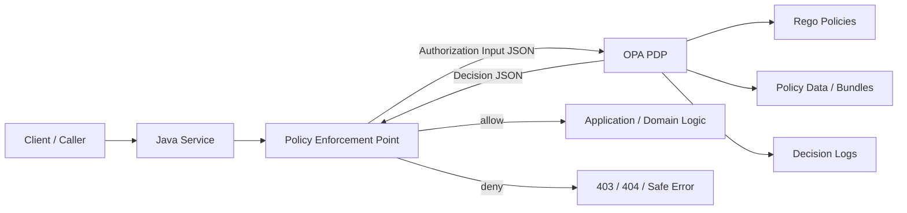
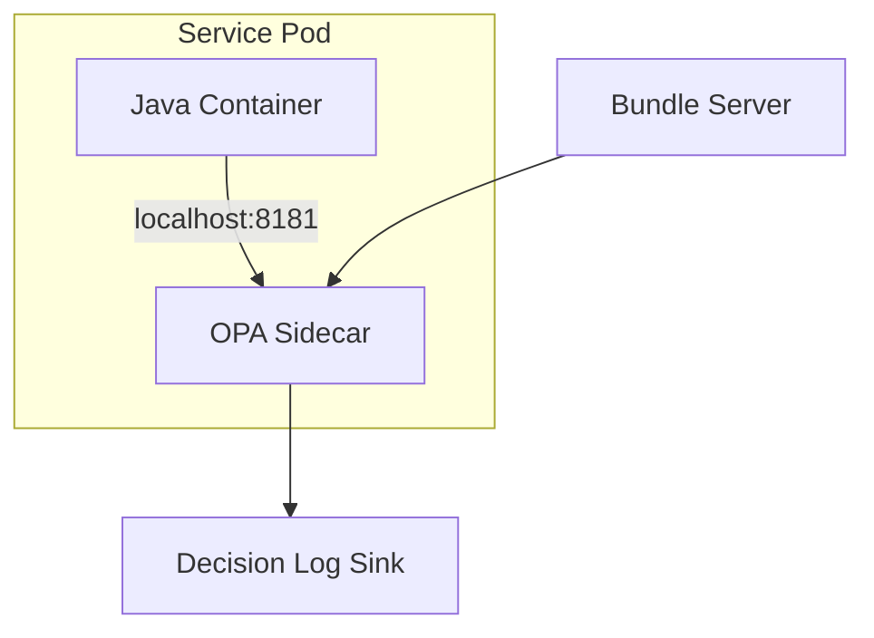
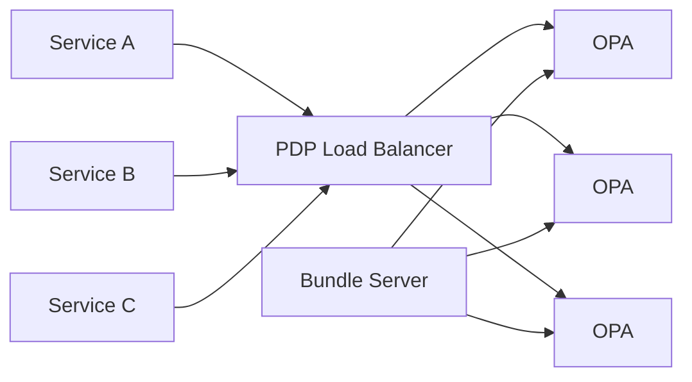
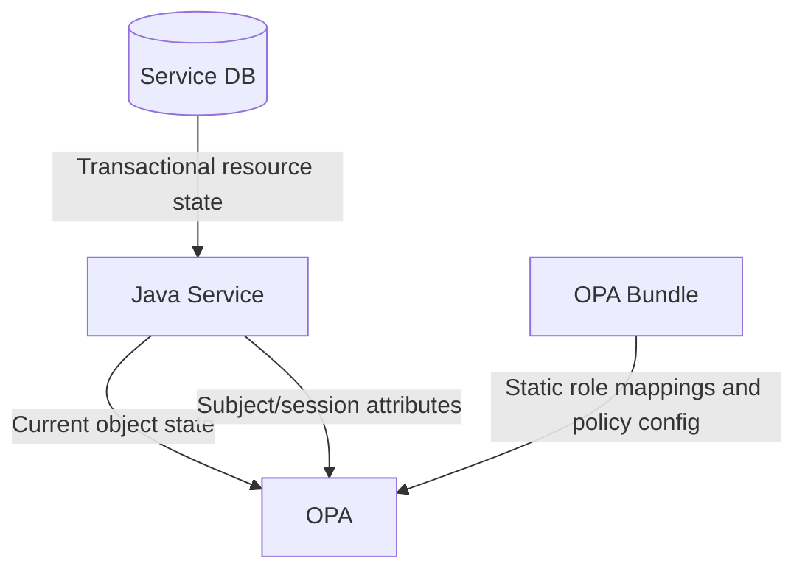
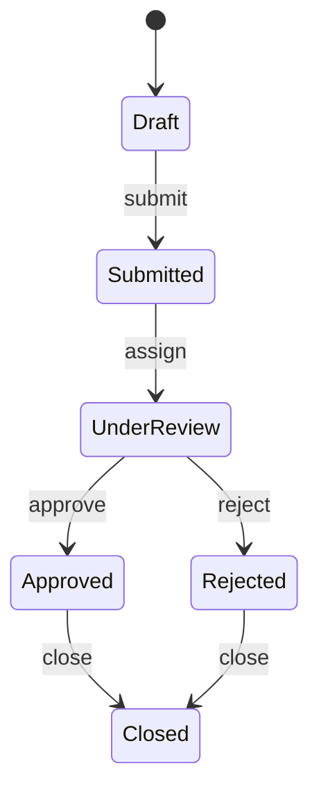
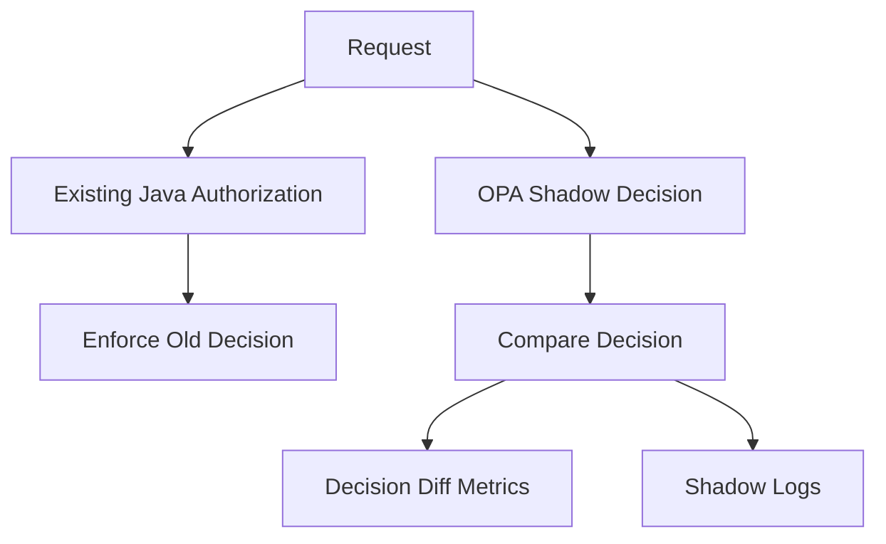
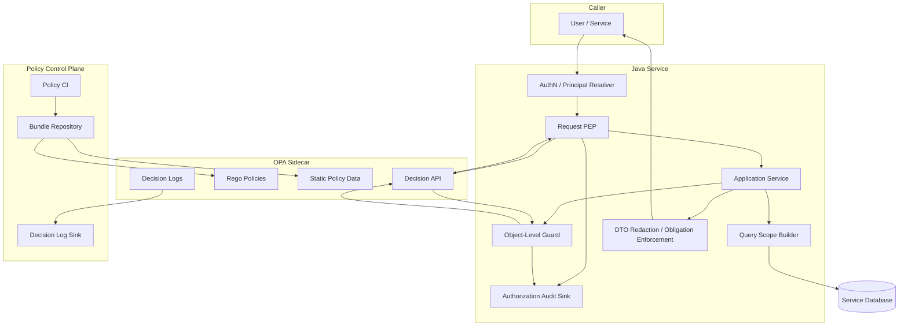

# Part 027 — OPA with Java: Rego, Sidecar, Bundle, and Decision API

This part is about using **Open Policy Agent (OPA)** as a Policy Decision Point for Java services.

Not as a buzzword.

Not as “move all `if` statements to Rego”.

The target is sharper: build a Java authorization boundary where application code owns business execution, OPA owns policy evaluation, and both sides communicate through a stable, typed, auditable decision contract.

OPA is useful when authorization logic needs to be managed, tested, shipped, and audited independently from service binaries. It is dangerous when teams use it to hide domain complexity behind an untyped JSON blob.

The core question for this part:

> Given a Java service receiving a request from a caller, how do we ask OPA a precise authorization question, enforce the answer safely, and operate the integration under real latency, failure, deployment, and audit constraints?

---

## 1. What OPA Is in an Authorization Architecture

OPA is a general-purpose policy engine. In an authorization system, it commonly acts as the **PDP**.

The Java service remains the **PEP**.



OPA does not automatically secure the Java service. It only returns a decision. The Java code must still:

1. build the correct input;
2. call the correct policy path;
3. enforce the decision at the correct boundary;
4. deny when the decision is absent, invalid, timeout, or indeterminate;
5. audit the decision;
6. keep object-level authorization and query scoping intact.

A good OPA integration makes unsafe code hard to write.

A bad integration creates a remote `if` statement service.

---

## 2. Mental Model: OPA Answers Questions, It Does Not Own Reality

OPA should answer a narrowly scoped question:

```text
Can subject S perform action A on resource R under context C?
```

In practical Java terms:

```text
Can user:123 submit case:456 in tenant:t-1 from branch:B21 with riskLevel=normal?
```

OPA should not become the system of record for everything. It should receive enough facts to evaluate policy, but the Java system still owns:

- transactional state;
- domain aggregate loading;
- command execution;
- persistence;
- event publication;
- business validation;
- workflow progression;
- idempotency;
- audit event durability.

The policy engine evaluates access. It does not replace domain modeling.

---

## 3. OPA Integration Topologies

There are four common topologies.

### 3.1 Library-Like Local Evaluation

Java calls an embedded policy evaluator or compiled policy artifact in-process.

With OPA/Rego, this is less common in Java application services than HTTP evaluation, but the concept matters.

Use when:

- latency budget is extremely tight;
- policy distribution can be solved cleanly;
- operational simplicity matters more than centralized decision logging;
- policy surface is stable.

Risk:

- policy runtime lifecycle becomes coupled to the Java process;
- rollout and rollback are harder;
- teams may accidentally fork policy behavior per service version.

### 3.2 Sidecar OPA

Each Java service instance has a local OPA process.



Use when:

- low latency is important;
- services are deployed on Kubernetes;
- policy can be distributed by bundles;
- service should keep working without a central authorization network hop;
- decision logs can be shipped asynchronously.

Trade-off:

- more moving parts per pod;
- sidecar health must be monitored;
- bundle consistency must be understood;
- local OPA outage equals local authorization outage.

### 3.3 Centralized OPA PDP

Java services call one or more central OPA servers.



Use when:

- centralized decision logging is required;
- policy operations team wants central control;
- service count is moderate;
- network latency is acceptable;
- PDP fleet can be made highly available.

Trade-off:

- PDP becomes a critical dependency;
- timeout/fail-closed behavior becomes visible to users;
- cross-region latency can be painful;
- blast radius is larger.

### 3.4 Gateway-Only OPA

API gateway calls OPA before forwarding requests.

Use for coarse checks:

- authenticated route access;
- subscription tier;
- tenant membership existence;
- method/path-level permission;
- public/private endpoint classification.

Do **not** rely on gateway-only authorization for object-level checks unless the gateway has enough resource context. Most gateways do not know whether `case:456` belongs to tenant `t-1` or whether the caller is the assigned investigator.

Gateway authorization is useful but insufficient for deep domain authorization.

---

## 4. Recommended Baseline for Java Services

For most production Java microservices, a strong baseline is:

```text
Java service as PEP
OPA sidecar as PDP
Bundles for policy distribution
Decision logs enabled
Typed input/decision contract in Java
Deny-by-default on invalid/timeout/error
Repository query scoping remains in Java/data layer
```

This gives a good balance:

- local low-latency decisions;
- centralized policy distribution;
- policy testing outside Java;
- safe service-level enforcement;
- clear audit trail.

---

## 5. Decision API Shape

OPA’s REST decision API is usually called like:

```http
POST /v1/data/<package>/<rule>
Content-Type: application/json

{
  "input": {
    "subject": { ... },
    "action": "case.submit",
    "resource": { ... },
    "context": { ... }
  }
}
```

A common response shape:

```json
{
  "result": {
    "allow": true,
    "reason": "CASE_ASSIGNED_INVESTIGATOR",
    "obligations": [
      { "type": "AUDIT", "level": "SECURITY" }
    ]
  }
}
```

OPA itself is flexible about output. Your service should not be flexible. Define one decision contract and enforce it everywhere.

---

## 6. Java Contract First

Start with Java records.

```java
package com.acme.authz.contract;

import java.time.Instant;
import java.util.List;
import java.util.Map;
import java.util.Set;

public record AuthorizationInput(
        Subject subject,
        String action,
        Resource resource,
        RequestContext context
) {}

public record Subject(
        String type,
        String id,
        String tenantId,
        Set<String> roles,
        Set<String> permissions,
        Map<String, Object> attributes
) {}

public record Resource(
        String type,
        String id,
        String tenantId,
        String ownerId,
        String lifecycleState,
        String classification,
        Map<String, Object> attributes
) {}

public record RequestContext(
        String requestId,
        String correlationId,
        String sourceIp,
        String userAgent,
        String channel,
        Instant requestTime,
        Map<String, Object> attributes
) {}

public record AuthorizationDecision(
        boolean allow,
        String reason,
        List<Obligation> obligations,
        DecisionMetadata metadata
) {}

public record Obligation(
        String type,
        Map<String, Object> parameters
) {}

public record DecisionMetadata(
        String policyVersion,
        String decisionId,
        boolean cacheable,
        long cacheTtlMillis
) {}
```

Do not pass raw JWT claims directly to OPA. Normalize them.

Bad:

```json
{
  "input": {
    "jwt": {
      "sub": "123",
      "scp": "openid profile email case:write",
      "custom:tenant": "t-1",
      "realm_access": { "roles": ["admin"] }
    }
  }
}
```

Better:

```json
{
  "input": {
    "subject": {
      "type": "user",
      "id": "123",
      "tenantId": "t-1",
      "roles": ["case_investigator"],
      "permissions": ["case.submit"],
      "attributes": {
        "branchId": "B21",
        "clearance": "restricted"
      }
    },
    "action": "case.submit",
    "resource": {
      "type": "case",
      "id": "456",
      "tenantId": "t-1",
      "ownerId": "123",
      "lifecycleState": "UNDER_REVIEW",
      "classification": "restricted"
    },
    "context": {
      "requestId": "req-789",
      "channel": "web",
      "requestTime": "2026-07-03T10:30:00Z"
    }
  }
}
```

The authorization contract should be independent of identity provider quirks.

---

## 7. Minimal Rego Policy

Create `case_authz.rego`:

```rego
package app.authz.case

import rego.v1

default decision := {
  "allow": false,
  "reason": "DENY_BY_DEFAULT",
  "obligations": [],
  "metadata": {
    "policyVersion": data.policy.version,
    "cacheable": false,
    "cacheTtlMillis": 0
  }
}

decision := {
  "allow": true,
  "reason": "CASE_ASSIGNED_INVESTIGATOR_CAN_SUBMIT",
  "obligations": [
    {"type": "AUDIT", "parameters": {"level": "SECURITY"}}
  ],
  "metadata": {
    "policyVersion": data.policy.version,
    "cacheable": false,
    "cacheTtlMillis": 0
  }
} if {
  input.action == "case.submit"
  input.subject.type == "user"
  input.resource.type == "case"
  same_tenant
  has_permission("case.submit")
  input.resource.lifecycleState == "UNDER_REVIEW"
  input.resource.attributes.assignedInvestigatorId == input.subject.id
}

same_tenant if {
  input.subject.tenantId == input.resource.tenantId
}

has_permission(permission) if {
  permission in input.subject.permissions
}
```

Notice several deliberate choices:

1. `default decision` denies.
2. Decision output is structured.
3. Tenant check is explicit.
4. The policy requires permission and object relationship.
5. The policy refers to lifecycle state.
6. Audit obligation is part of the decision.

This is already better than `allow if role == "admin"`.

---

## 8. Java OPA Client

A minimal OPA client using Java 21 `HttpClient`:

```java
package com.acme.authz.opa;

import com.acme.authz.contract.AuthorizationDecision;
import com.acme.authz.contract.AuthorizationInput;
import com.fasterxml.jackson.databind.JsonNode;
import com.fasterxml.jackson.databind.ObjectMapper;

import java.io.IOException;
import java.net.URI;
import java.net.http.HttpClient;
import java.net.http.HttpRequest;
import java.net.http.HttpResponse;
import java.time.Duration;
import java.util.Map;

public final class OpaAuthorizationClient {

    private final HttpClient httpClient;
    private final ObjectMapper objectMapper;
    private final URI decisionUri;

    public OpaAuthorizationClient(
            HttpClient httpClient,
            ObjectMapper objectMapper,
            URI opaBaseUri,
            String policyPath
    ) {
        this.httpClient = httpClient;
        this.objectMapper = objectMapper;
        this.decisionUri = opaBaseUri.resolve("/v1/data/" + policyPath);
    }

    public AuthorizationDecision decide(AuthorizationInput input) {
        try {
            byte[] body = objectMapper.writeValueAsBytes(Map.of("input", input));

            HttpRequest request = HttpRequest.newBuilder(decisionUri)
                    .timeout(Duration.ofMillis(80))
                    .header("Content-Type", "application/json")
                    .POST(HttpRequest.BodyPublishers.ofByteArray(body))
                    .build();

            HttpResponse<String> response = httpClient.send(
                    request,
                    HttpResponse.BodyHandlers.ofString()
            );

            if (response.statusCode() != 200) {
                return deny("OPA_HTTP_" + response.statusCode());
            }

            JsonNode root = objectMapper.readTree(response.body());
            JsonNode result = root.get("result");
            if (result == null || result.isNull()) {
                return deny("OPA_EMPTY_RESULT");
            }

            return objectMapper.treeToValue(result, AuthorizationDecision.class);
        } catch (IOException e) {
            return deny("OPA_IO_ERROR");
        } catch (InterruptedException e) {
            Thread.currentThread().interrupt();
            return deny("OPA_INTERRUPTED");
        } catch (RuntimeException e) {
            return deny("OPA_DECISION_PARSE_ERROR");
        }
    }

    private static AuthorizationDecision deny(String reason) {
        return new AuthorizationDecision(
                false,
                reason,
                java.util.List.of(),
                new com.acme.authz.contract.DecisionMetadata(
                        "unknown",
                        null,
                        false,
                        0
                )
        );
    }
}
```

Important details:

- timeout is short;
- non-200 denies;
- empty result denies;
- parse failure denies;
- interruption preserves interrupt flag;
- Java code does not assume OPA is always healthy.

Fail-closed is an engineering behavior, not a slogan.

---

## 9. Authorization Service Wrapper

Never let controllers call OPA directly.

Wrap it.

```java
package com.acme.authz;

import com.acme.authz.contract.AuthorizationDecision;
import com.acme.authz.contract.AuthorizationInput;

public final class AuthorizationService {

    private final PolicyDecisionClient decisionClient;
    private final AuthorizationAuditSink auditSink;

    public AuthorizationService(
            PolicyDecisionClient decisionClient,
            AuthorizationAuditSink auditSink
    ) {
        this.decisionClient = decisionClient;
        this.auditSink = auditSink;
    }

    public AuthorizationDecision check(AuthorizationInput input) {
        AuthorizationDecision decision = decisionClient.decide(input);
        auditSink.record(input, decision);
        return decision;
    }

    public void requireAllowed(AuthorizationInput input) {
        AuthorizationDecision decision = check(input);
        if (!decision.allow()) {
            throw new AccessDeniedException(decision.reason());
        }
        enforceObligations(input, decision);
    }

    private void enforceObligations(
            AuthorizationInput input,
            AuthorizationDecision decision
    ) {
        for (var obligation : decision.obligations()) {
            switch (obligation.type()) {
                case "AUDIT" -> auditSink.recordObligation(input, decision, obligation);
                default -> throw new AccessDeniedException("UNKNOWN_AUTHZ_OBLIGATION");
            }
        }
    }
}
```

Unknown obligations should usually deny. If a policy says “allow only if you mask field X” and the Java service ignores the obligation, the policy was not enforced.

---

## 10. Spring Security PEP

OPA can be used behind a Spring Security `AuthorizationManager`.

```java
@Component
public final class OpaRequestAuthorizationManager
        implements AuthorizationManager<RequestAuthorizationContext> {

    private final AuthorizationInputFactory inputFactory;
    private final AuthorizationService authorizationService;

    public OpaRequestAuthorizationManager(
            AuthorizationInputFactory inputFactory,
            AuthorizationService authorizationService
    ) {
        this.inputFactory = inputFactory;
        this.authorizationService = authorizationService;
    }

    @Override
    public AuthorizationDecision check(
            Supplier<Authentication> authentication,
            RequestAuthorizationContext context
    ) {
        var input = inputFactory.fromHttpRequest(
                authentication.get(),
                context.getRequest()
        );

        var decision = authorizationService.check(input);
        return new AuthorizationDecision(decision.allow());
    }
}
```

Configuration:

```java
@Bean
SecurityFilterChain securityFilterChain(
        HttpSecurity http,
        OpaRequestAuthorizationManager opaAuthorization
) throws Exception {
    return http
            .authorizeHttpRequests(registry -> registry
                    .requestMatchers("/actuator/health").permitAll()
                    .anyRequest().access(opaAuthorization)
            )
            .oauth2ResourceServer(oauth2 -> oauth2.jwt(Customizer.withDefaults()))
            .build();
}
```

This is good for request-level checks. It is not enough for object-level checks if the object is not loaded yet.

For object-level authorization, use application-service guards:

```java
@Transactional
public void submitCase(String caseId, PrincipalRef principal) {
    CaseRecord record = caseRepository.getByIdForUpdate(caseId);

    AuthorizationInput input = authzInputFactory.forCaseAction(
            principal,
            "case.submit",
            record
    );

    authorizationService.requireAllowed(input);

    record.submit(principal.userId());
    caseRepository.save(record);
}
```

Do not pretend the filter can authorize what only the service layer can know.

---

## 11. JAX-RS PEP

For JAX-RS/Jersey:

```java
@Provider
@Priority(Priorities.AUTHORIZATION)
public final class OpaAuthorizationFilter implements ContainerRequestFilter {

    @Context
    ResourceInfo resourceInfo;

    private final AuthorizationInputFactory inputFactory;
    private final AuthorizationService authorizationService;

    public OpaAuthorizationFilter(
            AuthorizationInputFactory inputFactory,
            AuthorizationService authorizationService
    ) {
        this.inputFactory = inputFactory;
        this.authorizationService = authorizationService;
    }

    @Override
    public void filter(ContainerRequestContext requestContext) {
        if (isPublicEndpoint(resourceInfo)) {
            return;
        }

        AuthorizationInput input = inputFactory.fromJaxRs(
                requestContext,
                resourceInfo
        );

        AuthorizationDecision decision = authorizationService.check(input);
        if (!decision.allow()) {
            throw new ForbiddenException(safeMessage(decision.reason()));
        }
    }

    private boolean isPublicEndpoint(ResourceInfo info) {
        return info.getResourceMethod().isAnnotationPresent(PublicEndpoint.class)
                || info.getResourceClass().isAnnotationPresent(PublicEndpoint.class);
    }

    private String safeMessage(String reason) {
        return "access_denied";
    }
}
```

Again: request-level filter handles coarse enforcement. Service/repository layers still handle object-level and query-scope enforcement.

---

## 12. OPA Input Design Rules

### Rule 1 — Avoid Raw Application Objects

Do not serialize your entire JPA entity to OPA.

Bad:

```java
Map.of("input", caseEntity)
```

Why:

- leaks fields to policy engine;
- couples policy to persistence shape;
- exposes lazy-loading surprises;
- makes policy unstable during refactors;
- can include sensitive data not needed for authorization.

Better: build a policy view.

```java
public record CasePolicyView(
        String id,
        String tenantId,
        String lifecycleState,
        String assignedInvestigatorId,
        String branchId,
        String classification
) {}
```

### Rule 2 — Stable Action Names

Use domain action names, not HTTP methods.

Better:

```text
case.submit
case.assign
case.close
case.evidence.download
case.export
```

Worse:

```text
POST /cases/{id}/submit
PATCH /cases/{id}
GET /cases/{id}/attachments/{attachmentId}
```

HTTP routes change. Capabilities should be stable.

### Rule 3 — No Ambiguous Null Semantics

Define whether missing attributes deny or mean unknown.

In production, missing required authorization attributes should normally deny:

```rego
required_case_attrs_present if {
  input.resource.tenantId != ""
  input.resource.lifecycleState != ""
  input.resource.attributes.assignedInvestigatorId != ""
}
```

Then require it:

```rego
allow if {
  required_case_attrs_present
  ...
}
```

### Rule 4 — Include Evaluation Metadata

Include correlation data:

```json
{
  "context": {
    "requestId": "req-123",
    "correlationId": "corr-456",
    "service": "case-service",
    "endpoint": "POST /cases/{caseId}/submit"
  }
}
```

This makes decision logs usable during incident response.

---

## 13. Rego Package Design

Avoid one giant policy file.

A useful layout:

```text
policy/
  app/
    authz/
      common.rego
      case.rego
      evidence.rego
      report.rego
      admin.rego
  data/
    roles.json
    policy_version.json
```

Example `common.rego`:

```rego
package app.authz.common

import rego.v1

same_tenant if {
  input.subject.tenantId == input.resource.tenantId
}

has_permission(permission) if {
  permission in input.subject.permissions
}

is_break_glass if {
  input.subject.attributes.breakGlass == true
  input.context.attributes.breakGlassTicket != ""
}
```

Example `case.rego`:

```rego
package app.authz.case

import rego.v1
import data.app.authz.common

default allow := false

allow if {
  input.action == "case.view"
  common.same_tenant
  common.has_permission("case.view")
}

allow if {
  input.action == "case.submit"
  common.same_tenant
  common.has_permission("case.submit")
  input.resource.lifecycleState == "UNDER_REVIEW"
  input.resource.attributes.assignedInvestigatorId == input.subject.id
}
```

For a service API, prefer one top-level decision rule with structured output, not many ad hoc booleans.

---

## 14. Policy Data: What Belongs in OPA Data?

OPA can evaluate against data loaded into its store. The design question is: what data should be in that store?

Good candidates:

- static role-to-permission mappings;
- policy version metadata;
- route-to-action mapping;
- low-cardinality reference data;
- classification hierarchy;
- environment constants;
- tenant policy configuration if not too large or too volatile.

Bad candidates:

- millions of case assignments;
- constantly changing workflow state;
- high-churn ownership relations;
- large document ACLs;
- transactional facts that must be read with current database isolation.

Those should usually be provided as input from Java or evaluated via query scoping in the database.

A common split:



Keep high-churn transactional facts close to the system of record.

---

## 15. Bundles

OPA bundles are a common way to distribute policies and static data.

A bundle might contain:

```text
bundle.tar.gz
  /app/authz/case.rego
  /app/authz/common.rego
  /data/roles.json
  /.manifest
```

OPA sidecar config example:

```yaml
services:
  policy-control-plane:
    url: https://policy-bundles.internal.example.com

bundles:
  authorization:
    service: policy-control-plane
    resource: bundles/case-service.tar.gz
    polling:
      min_delay_seconds: 10
      max_delay_seconds: 60

decision_logs:
  service: policy-control-plane
  reporting:
    min_delay_seconds: 5
    max_delay_seconds: 30
```

Bundle rollout rules:

1. every bundle has a version;
2. every decision emits policy version;
3. Java and policy contract versions are compatible;
4. rollback is tested;
5. staging uses the same bundle mechanism as production;
6. bundle validation runs in CI;
7. bundle signature/integrity is verified if your environment requires it.

Do not `curl -X PUT` policies manually in production.

---

## 16. Local Development with Docker Compose

```yaml
services:
  case-service:
    image: acme/case-service:local
    environment:
      OPA_BASE_URL: http://opa:8181
    ports:
      - "8080:8080"
    depends_on:
      - opa

  opa:
    image: openpolicyagent/opa:latest
    command:
      - "run"
      - "--server"
      - "--addr=0.0.0.0:8181"
      - "--set=decision_logs.console=true"
      - "/policy"
    volumes:
      - ./policy:/policy:ro
    ports:
      - "8181:8181"
```

Example call:

```bash
curl -s \
  -X POST http://localhost:8181/v1/data/app/authz/case/decision \
  -H 'Content-Type: application/json' \
  -d @input.json | jq
```

Local dev must mimic production semantics:

- same policy paths;
- same default deny;
- same decision shape;
- same test fixture schema.

---

## 17. Kubernetes Sidecar Example

```yaml
apiVersion: apps/v1
kind: Deployment
metadata:
  name: case-service
spec:
  replicas: 3
  selector:
    matchLabels:
      app: case-service
  template:
    metadata:
      labels:
        app: case-service
    spec:
      containers:
        - name: case-service
          image: registry.example.com/case-service:1.42.0
          env:
            - name: OPA_BASE_URL
              value: http://127.0.0.1:8181
          ports:
            - containerPort: 8080
          readinessProbe:
            httpGet:
              path: /actuator/health/readiness
              port: 8080
        - name: opa
          image: openpolicyagent/opa:latest
          args:
            - run
            - --server
            - --addr=127.0.0.1:8181
            - --config-file=/config/opa.yaml
          volumeMounts:
            - name: opa-config
              mountPath: /config
      volumes:
        - name: opa-config
          configMap:
            name: case-service-opa-config
```

Important production detail: Java readiness should consider whether OPA is reachable and whether the policy bundle is loaded.

But be careful: if every pod becomes unready during policy control-plane outage, you can create a cascading outage. A common model:

- startup requires OPA and initial bundle;
- runtime allows old bundle for a bounded time;
- if bundle becomes too stale, fail closed for high-risk actions and degrade low-risk reads if explicitly approved by risk policy.

---

## 18. Decision Logging

Decision logs are valuable because they answer:

- who asked;
- what action;
- which resource;
- which context;
- which policy version;
- allowed or denied;
- why;
- what obligation was returned.

But decision logs can leak sensitive data if input is too broad.

Policy input should be minimal and redacted by construction.

Bad input for logs:

```json
{
  "resource": {
    "type": "case",
    "id": "456",
    "complainantName": "...",
    "medicalDetails": "...",
    "evidenceText": "..."
  }
}
```

Better:

```json
{
  "resource": {
    "type": "case",
    "id": "456",
    "tenantId": "t-1",
    "classification": "restricted",
    "lifecycleState": "UNDER_REVIEW"
  }
}
```

Auditability starts at input design.

---

## 19. OPA Testing

Policy tests should run in CI.

Example `case_authz_test.rego`:

```rego
package app.authz.case

import rego.v1

test_assigned_investigator_can_submit if {
  result := decision with input as {
    "subject": {
      "type": "user",
      "id": "u-1",
      "tenantId": "t-1",
      "permissions": ["case.submit"],
      "attributes": {}
    },
    "action": "case.submit",
    "resource": {
      "type": "case",
      "id": "c-1",
      "tenantId": "t-1",
      "lifecycleState": "UNDER_REVIEW",
      "attributes": {
        "assignedInvestigatorId": "u-1"
      }
    },
    "context": {}
  }

  result.allow == true
  result.reason == "CASE_ASSIGNED_INVESTIGATOR_CAN_SUBMIT"
}

test_cross_tenant_submit_denied if {
  result := decision with input as {
    "subject": {
      "type": "user",
      "id": "u-1",
      "tenantId": "t-1",
      "permissions": ["case.submit"],
      "attributes": {}
    },
    "action": "case.submit",
    "resource": {
      "type": "case",
      "id": "c-1",
      "tenantId": "t-2",
      "lifecycleState": "UNDER_REVIEW",
      "attributes": {
        "assignedInvestigatorId": "u-1"
      }
    },
    "context": {}
  }

  result.allow == false
}
```

CI command:

```bash
opa fmt --check policy
opa check policy
opa test policy
```

Policy tests should cover:

- positive allowed cases;
- cross-tenant denial;
- missing attributes;
- wrong lifecycle state;
- wrong assignment;
- absent permission;
- break-glass with ticket;
- break-glass without ticket;
- service-account cases;
- batch/list/export edge cases.

---

## 20. Java Contract Tests Against OPA

Do not only test Rego. Test the Java client and policy together.

```java
@Testcontainers
class OpaAuthorizationContractTest {

    @Container
    static GenericContainer<?> opa = new GenericContainer<>("openpolicyagent/opa:latest")
            .withExposedPorts(8181)
            .withFileSystemBind("src/test/opa", "/policy", BindMode.READ_ONLY)
            .withCommand("run", "--server", "--addr=0.0.0.0:8181", "/policy");

    @Test
    void submitCaseIsAllowedForAssignedInvestigator() {
        URI baseUri = URI.create("http://" + opa.getHost() + ":" + opa.getMappedPort(8181));
        var client = new OpaAuthorizationClient(
                HttpClient.newHttpClient(),
                new ObjectMapper().findAndRegisterModules(),
                baseUri,
                "app/authz/case/decision"
        );

        AuthorizationInput input = Fixtures.assignedInvestigatorSubmitInput();

        AuthorizationDecision decision = client.decide(input);

        assertThat(decision.allow()).isTrue();
        assertThat(decision.reason()).isEqualTo("CASE_ASSIGNED_INVESTIGATOR_CAN_SUBMIT");
    }
}
```

This catches:

- wrong policy path;
- JSON shape mismatch;
- missing Jackson module;
- decision parsing errors;
- changes in Rego output;
- unexpected default deny.

Policy-only tests are necessary. Java-policy contract tests are also necessary.

---

## 21. Decision Cache

Authorization decision caching is tempting. Be precise.

A decision cache key must include every fact that can change the decision.

```java
public record DecisionCacheKey(
        String subjectId,
        String subjectTenantId,
        String action,
        String resourceType,
        String resourceId,
        String resourceTenantId,
        String resourceVersion,
        String policyVersion,
        String attributeVersion
) {}
```

Do not cache decisions based only on `userId + action`.

Bad:

```text
u-1 + case.view = allow
```

This ignores resource, tenant, assignment, classification, state, and policy version.

Useful caching targets:

- static role-to-permission resolution;
- route-to-action mapping;
- low-risk read decisions with short TTL;
- relationship checks with versioned relation state;
- policy bundle metadata.

Dangerous caching targets:

- high-risk write decisions;
- break-glass decisions;
- revoked users;
- rapidly changing assignment;
- decisions involving lifecycle state transitions.

A safe baseline: cache attributes and relationship data more often than final allow/deny decisions.

---

## 22. Failure Semantics

OPA call can fail.

Failure modes:

- timeout;
- connection refused;
- DNS failure;
- OPA process down;
- OPA has no bundle;
- OPA has stale bundle;
- invalid decision shape;
- policy compile error;
- policy returns no result;
- Java serialization failure;
- decision log sink down;
- network partition.

Define behavior before production.

Recommended default:

```text
For protected operations, OPA decision failure => deny.
```

But production systems may need refined behavior:

| Operation Class | Example | Failure Behavior |
|---|---|---|
| Public | health, static metadata | does not call OPA |
| Low-risk read | view own dashboard summary | short stale cache may be acceptable |
| Normal read | view case | deny on missing decision |
| Write | submit/approve/close case | deny on missing decision |
| Export | CSV/report download | deny on missing decision |
| Admin | role assignment | deny on missing decision |
| Break-glass | emergency access | require local emergency policy + audit |

Fail-open must be explicit, bounded, and approved. It should never be accidental.

---

## 23. Timeout Budget

OPA call sits inside the user request path.

A practical latency budget:

```text
API request p95 budget: 300 ms
Database read: 60 ms
Business logic: 80 ms
Downstream call: 80 ms
Authorization decision: 10-30 ms target, 50-100 ms timeout
```

With sidecar, decision latency is often low, but not free. JSON serialization, network stack, policy evaluation, and logging still cost time.

Engineering guidance:

- set tight timeouts;
- use connection reuse;
- avoid huge input;
- keep policy complexity bounded;
- benchmark policy with realistic input;
- monitor p50/p95/p99;
- use bulk decision APIs carefully for batch operations;
- prefer query scoping for large list/search operations.

---

## 24. Batch Authorization with OPA

For batch operations, do not loop blindly with one OPA call per object if the batch can be large.

Options:

### Option A — Query Scoping First

For search/list/export, prefer database scoping:

```sql
select c.*
from cases c
where c.tenant_id = :tenant_id
  and c.assigned_investigator_id = :user_id
```

OPA can authorize the high-level action:

```text
Can subject perform case.search in tenant t-1?
```

The database enforces object selection.

### Option B — Batch Input

For small bounded batch mutations:

```json
{
  "input": {
    "subject": { ... },
    "action": "case.bulk_close",
    "resources": [
      { "type": "case", "id": "c-1", "tenantId": "t-1" },
      { "type": "case", "id": "c-2", "tenantId": "t-1" }
    ]
  }
}
```

Rego can return per-resource decisions.

But enforce size limits. An authorization API is not a big-data processing engine.

---

## 25. Partial Evaluation

OPA supports advanced evaluation strategies such as partial evaluation. In authorization architecture, the most relevant use is generating or precomputing parts of policy evaluation when some inputs are known and others are unknown.

For Java teams, the practical lesson is:

> Use partial evaluation only when the team can operate, test, and explain it.

Most application services do not need it on day one. They need:

- clean input contracts;
- fast policies;
- query scoping;
- decision logs;
- safe fallback;
- tests.

Partial evaluation becomes interesting for:

- generating SQL-like predicates;
- optimizing high-volume decisions;
- API gateway constraints;
- static analysis of policies;
- precomputing tenant-specific policy fragments.

Do not introduce it before the simpler architecture is healthy.

---

## 26. OPA Is Not a Substitute for Query Scoping

Suppose a user searches cases:

```http
GET /cases?status=OPEN
```

Bad design:

1. load 50,000 matching cases;
2. call OPA for each case;
3. filter unauthorized results;
4. return first page.

This leaks counts, breaks pagination, and burns CPU.

Better design:

1. authorize `case.search` at action/tenant level;
2. build authorized SQL predicate;
3. execute scoped query;
4. apply field redaction on result DTO.

OPA can help decide whether the user can search. Java/database must still enforce the object selection efficiently.

---

## 27. OPA and Domain State Machines

Authorization frequently depends on lifecycle state.

Example:



Policy:

```rego
allow_submit if {
  input.action == "case.submit"
  input.resource.lifecycleState == "DRAFT"
  input.resource.attributes.createdBy == input.subject.id
}

allow_approve if {
  input.action == "case.approve"
  input.resource.lifecycleState == "UNDER_REVIEW"
  "case.approve" in input.subject.permissions
  input.resource.attributes.createdBy != input.subject.id
}
```

Domain code still validates the transition:

```java
record.approve(principal.userId());
```

Authorization says the caller may attempt the transition. The aggregate enforces whether the transition is valid.

Keep both.

---

## 28. Separation of Duties

Maker-checker is a classic authorization case.

Rego:

```rego
allow if {
  input.action == "case.approve"
  input.resource.lifecycleState == "PENDING_APPROVAL"
  "case.approve" in input.subject.permissions
  input.resource.attributes.createdBy != input.subject.id
}
```

Java must supply `createdBy` accurately. If the field is missing and policy treats missing as not equal, the rule can become unsafe.

Safer:

```rego
creator_known if {
  input.resource.attributes.createdBy != ""
}

allow if {
  input.action == "case.approve"
  creator_known
  input.resource.attributes.createdBy != input.subject.id
  "case.approve" in input.subject.permissions
}
```

In authorization, null semantics are security semantics.

---

## 29. Break-Glass Access

Break-glass should not be `role == admin`.

Policy:

```rego
break_glass_allowed if {
  input.action in {"case.view", "evidence.view"}
  input.subject.attributes.breakGlassEligible == true
  input.context.attributes.breakGlassTicket != ""
  input.context.attributes.breakGlassReason != ""
  input.context.attributes.mfaFresh == true
}
```

Decision:

```rego
decision := {
  "allow": true,
  "reason": "BREAK_GLASS_ALLOWED",
  "obligations": [
    {"type": "AUDIT", "parameters": {"level": "CRITICAL"}},
    {"type": "NOTIFY", "parameters": {"channel": "security"}}
  ],
  "metadata": {
    "policyVersion": data.policy.version,
    "cacheable": false,
    "cacheTtlMillis": 0
  }
} if {
  break_glass_allowed
}
```

Java enforcement must understand `NOTIFY`. Unknown obligation should deny.

---

## 30. Policy Versioning

Each decision should include policy version.

Data file:

```json
{
  "policy": {
    "version": "case-authz-2026.07.03-001"
  }
}
```

Decision output includes:

```json
{
  "metadata": {
    "policyVersion": "case-authz-2026.07.03-001"
  }
}
```

Audit record:

```json
{
  "subjectId": "u-1",
  "action": "case.approve",
  "resourceId": "c-1",
  "allow": false,
  "reason": "MAKER_CANNOT_APPROVE_OWN_CASE",
  "policyVersion": "case-authz-2026.07.03-001",
  "requestId": "req-123"
}
```

Without policy version, future incident analysis becomes guesswork.

---

## 31. Shadow Evaluation

Before switching production enforcement to OPA, run shadow evaluation.



Shadow mode:

- old Java decision is enforced;
- OPA decision is computed but not enforced;
- differences are logged;
- policy gaps are fixed;
- only then traffic is migrated.

Diff categories:

| Old | OPA | Meaning |
|---|---|---|
| allow | allow | compatible |
| deny | deny | compatible |
| allow | deny | OPA stricter; may break users |
| deny | allow | OPA weaker; security risk |

The most dangerous diff is old deny / OPA allow.

---

## 32. Migration Path from Hardcoded Java Authorization

A safe migration sequence:

1. inventory existing guards;
2. define canonical action names;
3. define `AuthorizationInput` and `AuthorizationDecision`;
4. wrap old authorization behind `PolicyDecisionClient`;
5. add audit for old decisions;
6. implement OPA policies for one bounded domain;
7. run shadow decision;
8. compare decisions;
9. migrate low-risk endpoints;
10. migrate object-level write endpoints;
11. remove old scattered guards;
12. add architecture fitness tests preventing new scattered checks.

Do not migrate by replacing all `if` statements in one sprint.

---

## 33. Architecture Fitness Tests

Prevent regression.

Example with ArchUnit:

```java
@AnalyzeClasses(packages = "com.acme.caseapp")
class AuthorizationArchitectureTest {

    @ArchTest
    static final ArchRule controllers_should_not_call_opa_directly =
            noClasses()
                    .that().resideInAPackage("..api..")
                    .should().dependOnClassesThat()
                    .resideInAPackage("..authz.opa..");

    @ArchTest
    static final ArchRule application_services_may_use_authorization_service =
            classes()
                    .that().resideInAPackage("..application..")
                    .should().onlyDependOnClassesThat()
                    .resideOutsideOfPackage("..authz.opa..");
}
```

The rule is not “never authorize in application services”. The rule is “application services use the stable authorization port, not the OPA implementation”.

---

## 34. Anti-Patterns

### Anti-Pattern 1 — OPA as a Global God Policy

One package with all domains:

```rego
package authz
```

Everything depends on everything. No domain ownership. No clean tests.

Better: policy packages per bounded context.

### Anti-Pattern 2 — Raw JWT as Input

This couples policy to identity provider implementation.

Normalize identity first.

### Anti-Pattern 3 — OPA for Per-Row Filtering at Scale

OPA is not your database query planner.

Use query scoping.

### Anti-Pattern 4 — Ignoring Obligations

If the policy says allow with masking and Java returns full data, the enforcement is broken.

### Anti-Pattern 5 — Fail-Open by Accident

Examples:

```java
catch (Exception e) {
    return true;
}
```

or:

```java
return decision == null || decision.allow();
```

This is not resilience. This is an access-control bypass.

### Anti-Pattern 6 — Policy Without Schema Discipline

JSON input shape changes silently. Rego starts reading missing attributes. Decisions change.

Use contract tests and required-attribute checks.

### Anti-Pattern 7 — Authorization Only at Gateway

Gateway cannot enforce deep object-level rules without object state.

### Anti-Pattern 8 — Policy Owner Without Domain Owner

Security team owns syntax. Domain team owns semantics. Operations owns rollout. Audit owns evidence. If no one owns the full chain, production behavior drifts.

---

## 35. Production Checklist

Before using OPA for Java authorization in production, answer these questions:

- What is the canonical authorization input schema?
- What is the canonical decision output schema?
- Which Java layer is the PEP?
- Which operations are request-level only?
- Which operations require object-level service guard?
- Which list/search/export operations use query scoping?
- What is the OPA topology: sidecar, central PDP, gateway, or hybrid?
- What is the timeout?
- What happens on timeout?
- What happens on invalid decision shape?
- What happens when no bundle is loaded?
- What is the maximum acceptable bundle staleness?
- Are decision logs enabled?
- Are sensitive fields excluded from policy input?
- Are policy tests part of CI?
- Are Java-policy contract tests part of CI?
- Is policy version recorded in audit?
- Is rollback tested?
- Are obligations enforced?
- Is shadow evaluation available for migration?
- Is query scoping still enforced for collections?

---

## 36. Reference Architecture



This architecture does not rely on a single magic layer. It combines:

- request authorization;
- object-level authorization;
- query scoping;
- field-level enforcement;
- policy-as-code;
- decision audit;
- operational rollout.

That is the difference between an OPA demo and a production-grade authorization system.

---

## 37. Key Takeaways

OPA is best understood as a **decision engine**, not an authorization architecture by itself.

The architecture is the full chain:

```text
Principal normalization
→ Authorization input construction
→ OPA decision
→ Java enforcement
→ obligations
→ audit
→ query scoping
→ tests
→ deployment lifecycle
```

Strong rules:

1. Java is the PEP; OPA is the PDP.
2. Never call OPA with raw domain entities or raw JWTs.
3. Use a stable input/decision contract.
4. Deny on timeout, invalid output, or empty result unless explicitly risk-approved otherwise.
5. Do not use OPA as a substitute for query scoping.
6. Policy tests and Java contract tests are both mandatory.
7. Every production decision should carry policy version and audit metadata.
8. Obligations are part of enforcement, not decoration.
9. Shadow evaluation is the safest migration strategy.
10. OPA is powerful only when the surrounding Java architecture is disciplined.

---

## References

- Open Policy Agent Documentation — https://www.openpolicyagent.org/docs/
- OPA REST API Reference — https://www.openpolicyagent.org/docs/rest-api
- OPA Integration Guide — https://www.openpolicyagent.org/docs/integration
- OPA Bundles — https://www.openpolicyagent.org/docs/management-bundles
- OPA Policy Testing — https://www.openpolicyagent.org/docs/policy-testing
- OWASP Authorization Cheat Sheet — https://cheatsheetseries.owasp.org/cheatsheets/Authorization_Cheat_Sheet.html
- OWASP API Security 2023 — Broken Object Level Authorization — https://owasp.org/API-Security/editions/2023/en/0xa1-broken-object-level-authorization/
- Spring Security Authorization Architecture — https://docs.spring.io/spring-security/reference/servlet/authorization/architecture.html
