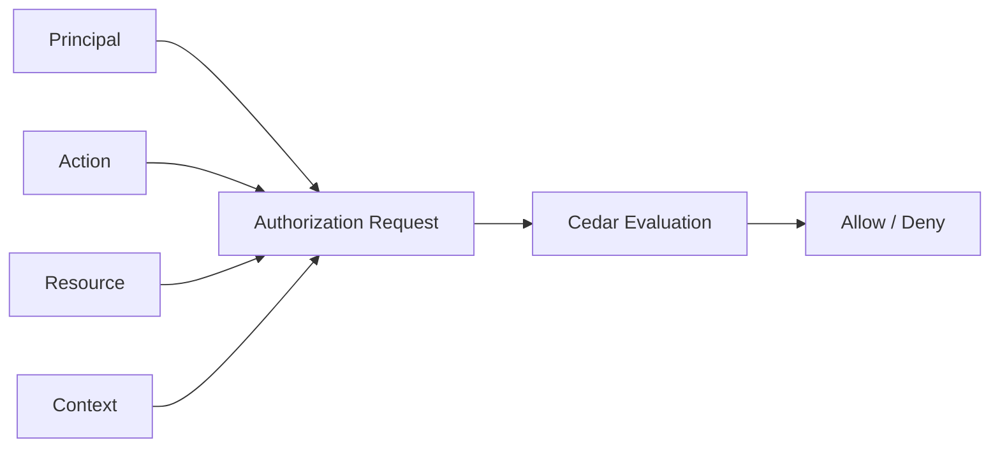
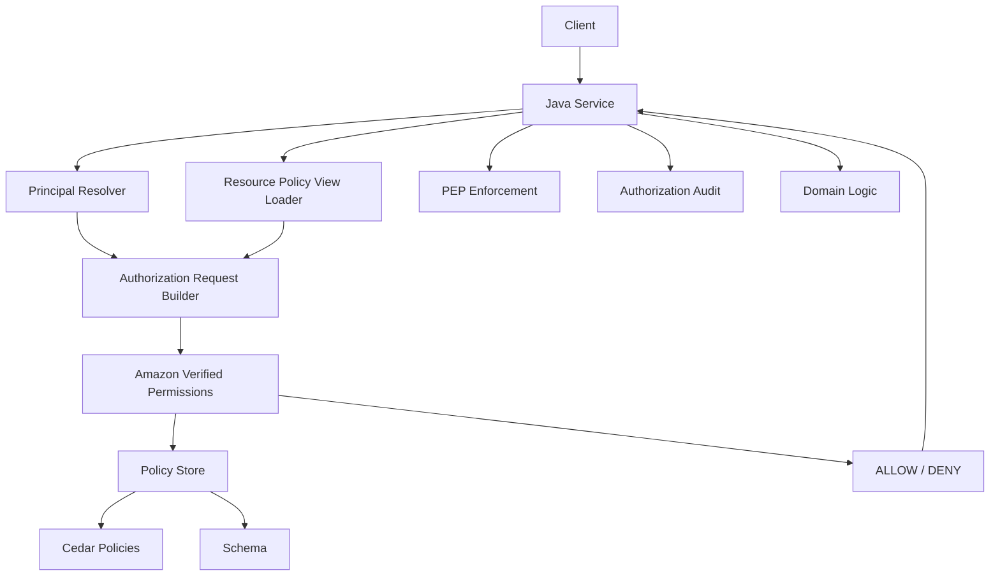
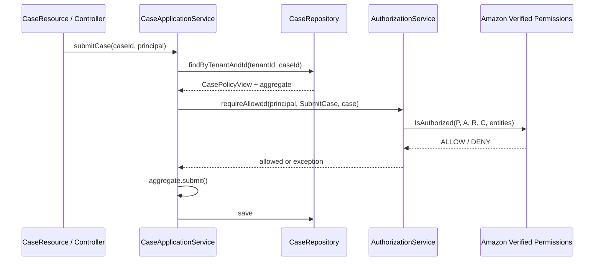
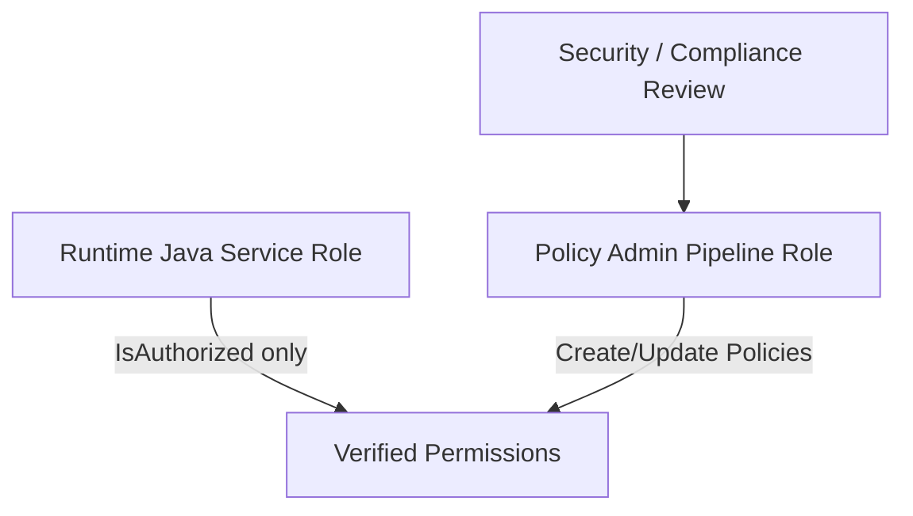
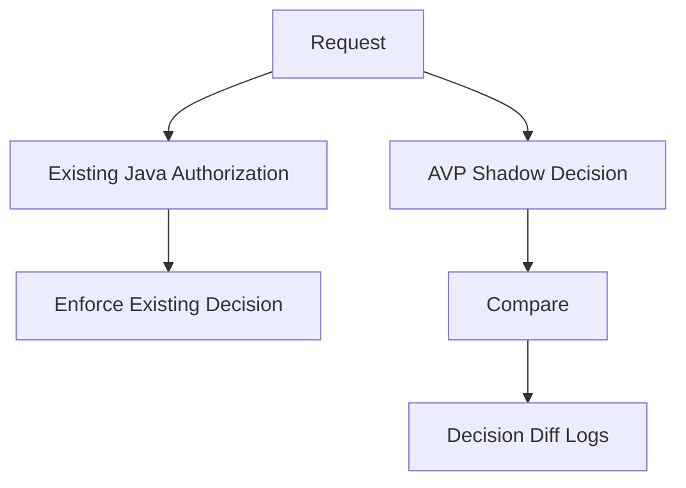
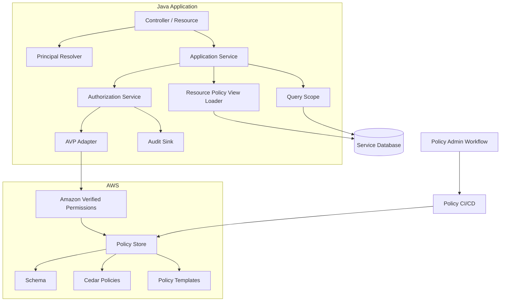

# Part 028 — Cedar and Amazon Verified Permissions for Java Systems

This part is about **Cedar** and **Amazon Verified Permissions** in Java systems.

Cedar is an authorization policy language. Amazon Verified Permissions is a managed authorization service that uses Cedar policies. They are not the same thing:

- **Cedar** is the policy language and evaluation model.
- **Amazon Verified Permissions** is the AWS managed service around policy stores, schemas, policies, identity sources, and authorization APIs.

The practical Java question is:

> How do we model principal, action, resource, and context so that a Java application can make safe, explainable, production-grade authorization decisions with Cedar or Amazon Verified Permissions?

This part is not a console tutorial. It is an implementation handbook.

---

## 1. Why Cedar Exists as a Different Shape from Rego

OPA/Rego is general-purpose policy-as-code.

Cedar is more specialized for authorization. Its core shape is intentionally close to the authorization question:

```text
Can principal P perform action A on resource R in context C?
```

Cedar often feels less like writing arbitrary rules and more like writing authorization statements.

Example:

```cedar
permit(
  principal in CaseApp::Role::"Investigator",
  action == CaseApp::Action::"SubmitCase",
  resource is CaseApp::Case
)
when {
  resource.tenant == principal.tenant &&
  resource.assignedInvestigator == principal
};
```

The policy is centered on four things:

- principal;
- action;
- resource;
- context.

This is often abbreviated as **PARC**.



---

## 2. Cedar vs Amazon Verified Permissions

Keep the boundary clear.

| Concern | Cedar | Amazon Verified Permissions |
|---|---|---|
| Policy language | Yes | Uses Cedar |
| Local evaluation model | Yes, via Cedar implementations | No, managed service API |
| Policy store | Language concept only | Managed policy store |
| Schema validation | Cedar supports schemas | AVP stores and validates schema |
| Authorization API | Library/runtime dependent | `IsAuthorized`, `BatchIsAuthorized`, etc. |
| Managed audit/control plane | No | Yes, via AWS service integration |
| AWS IAM/service integration | No | Yes |

If you use AVP from Java, your Java service calls AWS Verified Permissions APIs. If you use Cedar directly, you embed or run a Cedar-compatible evaluator in your own infrastructure.

This part focuses mostly on AVP from Java, while keeping the Cedar model explicit.

---

## 3. Cedar Decision Model

Cedar policies are either `permit` or `forbid`.

A simplified model:

```text
Decision = ALLOW if at least one permit applies and no forbid applies.
Decision = DENY otherwise.
```

That means deny-by-default is built into the model.

Example permit:

```cedar
permit(
  principal,
  action == CaseApp::Action::"ViewCase",
  resource is CaseApp::Case
)
when {
  resource.tenant == principal.tenant &&
  resource.assignedInvestigator == principal
};
```

Example forbid:

```cedar
forbid(
  principal,
  action == CaseApp::Action::"ApproveCase",
  resource is CaseApp::Case
)
when {
  resource.createdBy == principal
};
```

The `forbid` handles maker-checker / separation-of-duties. Even if another policy permits approval, the forbid blocks it.

This is important. In many Java systems, deny rules are scattered and easy to bypass. Cedar gives explicit deny semantics a first-class place.

---

## 4. Mapping Java Authorization Concepts to Cedar

| Java / Domain Concept | Cedar Concept |
|---|---|
| User, service account, organization role | Principal entity |
| Domain operation | Action entity |
| Case, evidence, report, tenant | Resource entity |
| Request time, IP, MFA freshness, reason code | Context |
| Role assignment | Entity hierarchy or attributes |
| Ownership | Resource attribute or relationship |
| Tenant boundary | Principal/resource attribute condition |
| Break-glass reason | Context attribute |
| Maker-checker | `forbid` policy or condition |

Do not map HTTP endpoint directly as action if the domain has a clearer capability.

Better:

```text
CaseApp::Action::"SubmitCase"
```

Worse:

```text
CaseApp::Action::"POST_/cases/{id}/submit"
```

The action should survive API refactoring.

---

## 5. Example Domain: Regulatory Case Management

Assume a regulatory enforcement platform:

- users belong to tenants;
- users have branch/jurisdiction assignments;
- cases have lifecycle states;
- cases have classifications;
- evidence can be more sensitive than the case;
- makers cannot approve their own submissions;
- emergency access exists but must be audited;
- exports are high-risk.

Entities:

```text
CaseApp::User::"u-123"
CaseApp::Role::"Investigator"
CaseApp::Tenant::"t-1"
CaseApp::Case::"c-456"
CaseApp::Evidence::"e-789"
CaseApp::Action::"ViewCase"
CaseApp::Action::"SubmitCase"
CaseApp::Action::"ApproveCase"
CaseApp::Action::"DownloadEvidence"
CaseApp::Action::"ExportCase"
```

A realistic authorization model must answer object-specific questions, not just role questions.

---

## 6. Cedar Entity Modeling

Cedar works with entities. An entity has:

- type;
- id;
- optional parent relationships;
- attributes.

Conceptual entity document:

```json
{
  "uid": {
    "type": "CaseApp::User",
    "id": "u-123"
  },
  "attrs": {
    "tenant": {
      "__entity": {
        "type": "CaseApp::Tenant",
        "id": "t-1"
      }
    },
    "branch": "B21",
    "clearance": "restricted",
    "mfaFresh": true
  },
  "parents": [
    {
      "type": "CaseApp::Role",
      "id": "Investigator"
    }
  ]
}
```

Case resource:

```json
{
  "uid": {
    "type": "CaseApp::Case",
    "id": "c-456"
  },
  "attrs": {
    "tenant": {
      "__entity": {
        "type": "CaseApp::Tenant",
        "id": "t-1"
      }
    },
    "lifecycleState": "UNDER_REVIEW",
    "classification": "restricted",
    "assignedInvestigator": {
      "__entity": {
        "type": "CaseApp::User",
        "id": "u-123"
      }
    },
    "createdBy": {
      "__entity": {
        "type": "CaseApp::User",
        "id": "u-999"
      }
    }
  },
  "parents": []
}
```

Modeling rule:

> Put stable facts about principal/resource as entity attributes. Put request-specific facts in context.

Examples:

| Fact | Location |
|---|---|
| User tenant | Principal entity attribute |
| Case tenant | Resource entity attribute |
| Case assigned investigator | Resource entity attribute or relationship |
| Request IP | Context |
| MFA freshness for this request | Context |
| Break-glass ticket | Context |
| Case lifecycle state | Resource entity attribute |
| User department | Principal entity attribute |
| User clicked “emergency access” | Context |

Do not overload context with persistent domain state.

---

## 7. Cedar Schema

A Cedar/AVP schema describes entity types, actions, and applicable principal/resource combinations.

A simplified conceptual schema:

```cedar
namespace CaseApp {
  entity Tenant;

  entity User {
    tenant: Tenant,
    branch: String,
    clearance: String
  };

  entity Role;

  entity Case {
    tenant: Tenant,
    lifecycleState: String,
    classification: String,
    assignedInvestigator: User,
    createdBy: User
  };

  entity Evidence {
    tenant: Tenant,
    case: Case,
    classification: String
  };

  action ViewCase appliesTo {
    principal: [User],
    resource: [Case],
    context: {
      mfaFresh: Bool
    }
  };

  action SubmitCase appliesTo {
    principal: [User],
    resource: [Case],
    context: {}
  };

  action ApproveCase appliesTo {
    principal: [User],
    resource: [Case],
    context: {
      mfaFresh: Bool
    }
  };
}
```

In Amazon Verified Permissions, schema is managed in the policy store and commonly represented in JSON form. The important engineering idea is the same:

- type the entities;
- type the actions;
- constrain which principals can invoke which actions on which resources;
- validate policy references;
- catch typos before production.

Schema is one of Cedar’s biggest advantages for large teams. Without schema, policy authoring becomes stringly typed authorization.

---

## 8. Basic Cedar Policies

### 8.1 View Assigned Case

```cedar
permit(
  principal in CaseApp::Role::"Investigator",
  action == CaseApp::Action::"ViewCase",
  resource is CaseApp::Case
)
when {
  principal.tenant == resource.tenant &&
  resource.assignedInvestigator == principal
};
```

### 8.2 Submit Own Draft Case

```cedar
permit(
  principal in CaseApp::Role::"Investigator",
  action == CaseApp::Action::"SubmitCase",
  resource is CaseApp::Case
)
when {
  principal.tenant == resource.tenant &&
  resource.createdBy == principal &&
  resource.lifecycleState == "DRAFT"
};
```

### 8.3 Approver Can Approve Pending Case

```cedar
permit(
  principal in CaseApp::Role::"Approver",
  action == CaseApp::Action::"ApproveCase",
  resource is CaseApp::Case
)
when {
  principal.tenant == resource.tenant &&
  resource.lifecycleState == "PENDING_APPROVAL" &&
  context.mfaFresh == true
};
```

### 8.4 Maker Cannot Approve Own Case

```cedar
forbid(
  principal,
  action == CaseApp::Action::"ApproveCase",
  resource is CaseApp::Case
)
when {
  resource.createdBy == principal
};
```

### 8.5 High-Risk Export Requires Elevated Context

```cedar
permit(
  principal in CaseApp::Role::"Supervisor",
  action == CaseApp::Action::"ExportCase",
  resource is CaseApp::Case
)
when {
  principal.tenant == resource.tenant &&
  context.mfaFresh == true &&
  context.exportReason != "" &&
  resource.classification != "sealed"
};
```

---

## 9. Policy Stores in Amazon Verified Permissions

A policy store is the managed container for:

- policies;
- schema;
- authorization model;
- identity sources;
- policy templates;
- authorization decisions.

Design choice: one policy store per application or per tenant.

| Model | Pros | Cons |
|---|---|---|
| One policy store per application | simpler deployment, shared policy model, easier global changes | tenant-specific policy isolation must be modeled carefully |
| One policy store per tenant | stronger isolation, tenant-specific policy lifecycle | operational overhead, policy rollout multiplied by tenant count |
| Hybrid | base store/model plus tenant-specific stores for high-isolation tenants | more complex control plane |

For many enterprise SaaS systems:

```text
One policy store per application is the starting point.
Tenant isolation is encoded in entities and policies.
Move to per-tenant stores only when isolation, customization, or compliance requires it.
```

But for regulated environments with strict tenant isolation and custom policy lifecycle, per-tenant policy stores can be justified.

---

## 10. AVP Runtime Architecture with Java



The Java service must still:

- normalize identity;
- load resource policy view;
- build principal/action/resource/context;
- call AVP;
- enforce deny-by-default;
- handle API errors safely;
- audit local request context;
- enforce query scoping for list/search;
- enforce field-level obligations if modeled separately.

AVP centralizes policy decision. It does not remove the need for disciplined Java architecture.

---

## 11. Maven Dependency

Use AWS SDK for Java v2.

```xml
<dependencyManagement>
  <dependencies>
    <dependency>
      <groupId>software.amazon.awssdk</groupId>
      <artifactId>bom</artifactId>
      <version>${aws.sdk.version}</version>
      <type>pom</type>
      <scope>import</scope>
    </dependency>
  </dependencies>
</dependencyManagement>

<dependencies>
  <dependency>
    <groupId>software.amazon.awssdk</groupId>
    <artifactId>verifiedpermissions</artifactId>
  </dependency>
</dependencies>
```

Keep SDK version managed centrally. Authorization client behavior is infrastructure-critical and should not drift randomly across services.

---

## 12. Java Authorization Port

Do not expose AWS SDK classes across your domain/application layer.

Create a port:

```java
package com.acme.authz;

public interface PolicyDecisionClient {
    AuthorizationDecision decide(AuthorizationRequest request);
}
```

Application-facing contract:

```java
package com.acme.authz;

import java.time.Instant;
import java.util.Map;

public record AuthorizationRequest(
        PrincipalRef principal,
        ActionRef action,
        ResourceRef resource,
        AuthorizationContext context
) {}

public record PrincipalRef(
        String type,
        String id,
        String tenantId,
        Map<String, Object> attributes
) {}

public record ActionRef(String id) {}

public record ResourceRef(
        String type,
        String id,
        String tenantId,
        Map<String, Object> attributes
) {}

public record AuthorizationContext(
        String requestId,
        String correlationId,
        Instant requestTime,
        Map<String, Object> attributes
) {}

public record AuthorizationDecision(
        boolean allow,
        String reason,
        String policyStoreId,
        String determiningPolicyId
) {}
```

The AVP adapter maps this contract into AWS SDK requests.

---

## 13. AVP Java Adapter Shape

The exact SDK model types should be checked against your pinned AWS SDK version. The high-level shape is:

```java
package com.acme.authz.avp;

import com.acme.authz.AuthorizationDecision;
import com.acme.authz.AuthorizationRequest;
import com.acme.authz.PolicyDecisionClient;
import software.amazon.awssdk.services.verifiedpermissions.VerifiedPermissionsClient;
import software.amazon.awssdk.services.verifiedpermissions.model.IsAuthorizedRequest;
import software.amazon.awssdk.services.verifiedpermissions.model.IsAuthorizedResponse;

public final class AvpPolicyDecisionClient implements PolicyDecisionClient {

    private final VerifiedPermissionsClient client;
    private final String policyStoreId;
    private final AvpRequestMapper mapper;

    public AvpPolicyDecisionClient(
            VerifiedPermissionsClient client,
            String policyStoreId,
            AvpRequestMapper mapper
    ) {
        this.client = client;
        this.policyStoreId = policyStoreId;
        this.mapper = mapper;
    }

    @Override
    public AuthorizationDecision decide(AuthorizationRequest request) {
        try {
            IsAuthorizedRequest avpRequest = mapper.toIsAuthorizedRequest(
                    policyStoreId,
                    request
            );

            IsAuthorizedResponse response = client.isAuthorized(avpRequest);

            boolean allowed = "ALLOW".equals(response.decisionAsString());
            String reason = allowed ? "AVP_ALLOW" : "AVP_DENY";

            String determiningPolicyId = response.determiningPolicies().isEmpty()
                    ? null
                    : response.determiningPolicies().getFirst().policyId();

            return new AuthorizationDecision(
                    allowed,
                    reason,
                    policyStoreId,
                    determiningPolicyId
            );
        } catch (RuntimeException e) {
            return new AuthorizationDecision(
                    false,
                    "AVP_ERROR",
                    policyStoreId,
                    null
            );
        }
    }
}
```

The important behavior is not the exact builder syntax. It is the failure rule:

```text
AVP error => deny unless explicitly risk-approved otherwise.
```

---

## 14. Mapping Principal, Action, and Resource

Conceptual mapper:

```java
public final class AvpRequestMapper {

    public IsAuthorizedRequest toIsAuthorizedRequest(
            String policyStoreId,
            AuthorizationRequest request
    ) {
        return IsAuthorizedRequest.builder()
                .policyStoreId(policyStoreId)
                .principal(principal(request))
                .action(action(request))
                .resource(resource(request))
                .context(context(request))
                .entities(entities(request))
                .build();
    }

    private EntityIdentifier principal(AuthorizationRequest request) {
        return EntityIdentifier.builder()
                .entityType("CaseApp::" + request.principal().type())
                .entityId(request.principal().id())
                .build();
    }

    private ActionIdentifier action(AuthorizationRequest request) {
        return ActionIdentifier.builder()
                .actionType("CaseApp::Action")
                .actionId(request.action().id())
                .build();
    }

    private EntityIdentifier resource(AuthorizationRequest request) {
        return EntityIdentifier.builder()
                .entityType("CaseApp::" + request.resource().type())
                .entityId(request.resource().id())
                .build();
    }
}
```

Again, check exact SDK class names/builders against your pinned version. The architectural rule is stable:

> The application contract owns domain naming. The AVP adapter owns AWS SDK mapping.

Do not let controllers build `IsAuthorizedRequest` directly.

---

## 15. Entities: Inline vs Stored Facts

AVP authorization requests can include entity data needed for evaluation. You must decide what facts are supplied per request and what facts are modeled through identity source or persistent policy constructs.

Typical per-request entity facts:

- current case lifecycle state;
- assigned investigator;
- creator;
- resource tenant;
- resource classification;
- request-specific group membership if not in identity source;
- relationship facts needed for this resource.

Do not send entire domain objects.

Use a policy view:

```java
public record CasePolicyView(
        String id,
        String tenantId,
        String lifecycleState,
        String classification,
        String assignedInvestigatorId,
        String createdById
) {}
```

Then build entities from that.

This mirrors the same principle from OPA:

```text
Authorization input must be minimal, typed, and stable.
```

---

## 16. Context Design

Cedar context is for request-specific facts.

Good context fields:

```json
{
  "mfaFresh": true,
  "sourceIp": "203.0.113.10",
  "channel": "web",
  "requestTimeEpochSeconds": 1783072800,
  "breakGlassReason": "urgent safety review",
  "exportReason": "monthly regulatory report"
}
```

Bad context fields:

```json
{
  "caseTenant": "t-1",
  "caseOwner": "u-123",
  "caseClassification": "restricted"
}
```

Those are resource attributes, not request context.

Why this matters:

- policy is easier to reason about;
- schema can validate expected fields;
- audit logs distinguish persistent state from request facts;
- stale context mistakes are reduced;
- policy authors do not accidentally treat request data as source-of-truth resource data.

---

## 17. Tenant Isolation in Cedar

Tenant isolation should be explicit in policies.

```cedar
permit(
  principal,
  action == CaseApp::Action::"ViewCase",
  resource is CaseApp::Case
)
when {
  principal.tenant == resource.tenant &&
  resource.assignedInvestigator == principal
};
```

But also enforce tenant isolation in Java query scoping.

Do both:

```java
CaseRecord record = caseRepository.findByTenantIdAndCaseId(
        principal.tenantId(),
        caseId
).orElseThrow(NotFoundException::new);
```

Then call AVP.

Why both?

- repository scoping prevents object discovery;
- Cedar policy provides explicit access decision;
- audit records the policy reason;
- defense-in-depth reduces blast radius of a bug in either layer.

---

## 18. Object-Level Authorization Flow



The critical invariant:

```text
No domain mutation occurs before authorization succeeds.
```

For state-changing operations, load current resource state inside the same transaction where practical.

---

## 19. Method-Level Integration

Spring method security can wrap AVP, but do not pass only strings.

Bad:

```java
@PreAuthorize("hasAuthority('case.submit')")
public void submit(String caseId) { ... }
```

Better:

```java
@Transactional
public void submit(String caseId, PrincipalRef principal) {
    CaseRecord record = caseRepository.getForUpdate(principal.tenantId(), caseId);
    authorizationService.requireAllowed(
            AuthorizationRequests.submitCase(principal, record.policyView())
    );
    record.submit(principal.id());
}
```

If using annotations, make them domain-aware:

```java
@RequiresAuthorization(action = "SubmitCase", resourceType = "Case")
public void submit(String caseId) { ... }
```

Then the interceptor must load or receive the resource policy view. Otherwise it cannot do object-level authorization.

---

## 20. Query Scoping Still Matters

AVP is an authorization decision service, not a database row filter.

For search:

```http
GET /cases?status=OPEN
```

Do not call AVP for every row after loading all cases.

Better:

1. AVP check: can principal perform `SearchCases` in tenant?
2. Java builds scoped predicate based on user assignments/jurisdiction.
3. Database executes scoped query.
4. DTO mapper applies field-level redaction if needed.

Example:

```java
public Page<CaseSummary> searchCases(CaseSearchQuery query, PrincipalRef principal) {
    authorizationService.requireAllowed(
            AuthorizationRequests.searchCases(principal, principal.tenantId())
    );

    CaseScope scope = caseScopeFactory.forPrincipal(principal);
    return caseRepository.search(query, scope)
            .map(caseRedactor.forPrincipal(principal));
}
```

Cedar/AVP answers “may search”. Query scope answers “which rows”. Both are needed.

---

## 21. Batch Authorization

AVP supports batch-style authorization APIs. Use batch decisions for bounded sets, not unbounded result filtering.

Good uses:

- render action buttons for 20 cases on a page;
- validate 10 selected cases for bulk close;
- check small bounded resource list before mutation.

Bad uses:

- check 100,000 cases for export after loading all of them;
- authorize every search result row one API call at a time;
- replace database predicates with remote authorization loops.

Batch authorization should have:

- maximum item count;
- per-item decision result;
- partial success semantics;
- deterministic audit;
- rate-limit strategy;
- idempotency for mutation flows.

---

## 22. Policy Templates

Policy templates are useful when many similar policies exist with different principals/resources.

Example use cases:

- user-specific sharing;
- team access to a case category;
- tenant-specific grant;
- temporary delegated access;
- customer-specific custom role.

Conceptual template:

```cedar
permit(
  principal == ?principal,
  action in [CaseApp::Action::"ViewCase"],
  resource == ?resource
);
```

Instantiate for:

```text
principal = CaseApp::User::"u-123"
resource = CaseApp::Case::"c-456"
```

But be careful: template sprawl can become ACL sprawl.

Use templates for explicit grants. Use role/group/entity hierarchy for broad patterns. Use resource attributes for contextual policy.

---

## 23. Roles in Cedar

Role modeling can use entity hierarchy:

```cedar
permit(
  principal in CaseApp::Role::"Investigator",
  action == CaseApp::Action::"ViewCase",
  resource is CaseApp::Case
)
when {
  principal.tenant == resource.tenant
};
```

This reads cleanly, but role assignment must be supplied accurately.

Questions to answer:

- Are roles global or tenant-scoped?
- Can one user hold different roles per tenant?
- Who can assign roles?
- Are roles inherited from groups?
- Are roles temporary?
- Are roles subject to access review?
- Are role assignments in identity provider, service DB, or AVP policy store?

Do not hide tenant-scoped roles in global groups.

Bad:

```text
principal in Role::"Admin"
```

Better:

```cedar
principal in CaseApp::Role::"TenantAdmin" &&
principal.tenant == resource.tenant
```

Or model tenant-specific role entities if your domain requires it.

---

## 24. ABAC in Cedar

Cedar naturally supports ABAC-style conditions.

```cedar
permit(
  principal,
  action == CaseApp::Action::"DownloadEvidence",
  resource is CaseApp::Evidence
)
when {
  principal.tenant == resource.tenant &&
  principal.clearance == "restricted" &&
  resource.classification in ["public", "internal", "restricted"] &&
  context.mfaFresh == true
};
```

But avoid encoding complex classification logic as string comparisons everywhere.

Better: model classification levels consistently.

Example policy helper via action/resource design or normalized attribute:

```text
public = 1
internal = 2
restricted = 3
sealed = 4
```

Then policy can compare numeric levels if supported by your schema/modeling approach.

The deeper rule: policy language is not a substitute for a clean domain vocabulary.

---

## 25. ReBAC-Like Modeling in Cedar

Cedar can express relationships through entity parents and attributes.

Example folder/document relationship:

```cedar
permit(
  principal,
  action == CaseApp::Action::"ViewEvidence",
  resource is CaseApp::Evidence
)
when {
  resource.case.assignedInvestigator == principal
};
```

But for deep, high-cardinality, graph-heavy relationship authorization, OpenFGA/Zanzibar-style systems may fit better.

Cedar is strong when:

- policies are readable;
- entity graph depth is manageable;
- authorization uses roles + attributes + bounded relationships;
- schema validation matters;
- AWS managed service is acceptable.

OpenFGA/Zanzibar-style systems are often stronger when:

- relationship tuples are huge;
- graph traversal is central;
- sharing/collaboration is the main model;
- list objects/users from relationships is a key query.

Choose based on domain shape, not fashion.

---

## 26. Deny Reasons and Explainability

AVP responses include decision information and determining policies. Your application should map that into safe reason codes.

Do not expose detailed policy internals to end users.

Internal audit:

```json
{
  "allow": false,
  "reason": "AVP_DENY",
  "determiningPolicies": ["policy-abc123"],
  "principal": "User::u-123",
  "action": "ApproveCase",
  "resource": "Case::c-456",
  "requestId": "req-789"
}
```

User-facing response:

```json
{
  "error": "access_denied"
}
```

Do not tell an attacker:

```text
Denied because case belongs to tenant t-2 and assigned investigator is u-999.
```

Explainability is for operators and auditors. Error messages are for safe client behavior.

---

## 27. Caching AVP Decisions

AVP is a network call. Caching can reduce latency and cost. It can also break authorization.

Cache only when you can define freshness.

Cache key must include:

```text
principal entity id
principal tenant
principal role/attribute version
action id
resource entity id
resource version
resource tenant
policy store id
policy/schema version if available
context fields that affect policy
```

Bad key:

```text
u-123 + ViewCase
```

Better key:

```text
u-123|t-1|roleVersion=91|ViewCase|Case:c-456|caseVersion=17|mfaFresh=true|policyStore=ps-abc
```

Do not cache:

- break-glass decisions;
- admin role assignment decisions;
- high-risk writes;
- export approvals;
- decisions involving rapidly changing lifecycle state;
- decisions involving revocation-sensitive users.

A conservative default:

```text
Cache low-risk read decisions for a very short TTL only when resource and subject versions are included.
Do not cache high-risk write decisions.
```

---

## 28. Resilience and Failure Behavior

AVP call can fail due to:

- network timeout;
- AWS service throttling;
- credentials failure;
- region outage;
- invalid request shape;
- missing policy store;
- schema mismatch;
- malformed entity data;
- SDK retry exhaustion.

Default behavior:

```text
Protected operation + no valid authorization decision = deny.
```

For availability-sensitive systems, define operation classes:

| Operation | Example | AVP Failure Behavior |
|---|---|---|
| Public | health check | no AVP call |
| Low-risk cached read | own dashboard summary | optionally use bounded stale decision |
| Normal object read | view case | deny |
| Write | submit/approve/close | deny |
| Admin | grant role | deny |
| Export | export evidence/report | deny |
| Break-glass | emergency access | local emergency fallback only if formally approved and heavily audited |

SDK retries must not turn a 100 ms authorization budget into a 3 second user-facing stall.

Set timeouts deliberately.

---

## 29. IAM and Credential Boundary

The Java service needs AWS credentials to call Verified Permissions.

Keep IAM permissions narrow:

- allow `verifiedpermissions:IsAuthorized` for the required policy store;
- allow `BatchIsAuthorized` if needed;
- do not allow policy write APIs from runtime service unless the service is a policy administration component;
- separate runtime decision role from policy administration role.

Runtime service should not casually create, update, or delete policies.

Architecture:



Separate data plane from control plane.

---

## 30. Policy Administration Lifecycle

Treat Cedar policies like production code.

Lifecycle:

```mermaid
flowchart LR
    Draft[Draft Policy] --> Validate[Schema Validation]
    Validate --> Test[Policy Tests]
    Test --> Review[Security + Domain Review]
    Review --> Stage[Staging Policy Store]
    Stage --> Shadow[Shadow / Compare]
    Shadow --> Prod[Production Rollout]
    Prod --> Monitor[Decision Metrics]
    Monitor --> Rollback[Rollback if Needed]
```



Policy CI should check:

- schema validity;
- policy syntax;
- positive examples;
- negative examples;
- tenant isolation cases;
- maker-checker cases;
- missing attribute behavior;
- forbid precedence;
- regression fixtures;
- policy diff risk.

Policy review should include both security and domain owners. Security may understand access control. Domain owners understand whether the rule is correct.

---

## 31. Shadow Migration to AVP

When migrating from Java hardcoded authorization:



Start in shadow mode.

Decision diff categories:

| Existing Java | AVP | Interpretation |
|---|---|---|
| allow | allow | compatible |
| deny | deny | compatible |
| allow | deny | AVP stricter; possible user impact |
| deny | allow | AVP weaker; security risk |

Do not enforce AVP until the diff is understood.

Migration path:

1. define canonical actions;
2. create policy schema;
3. map Java policy views to Cedar entities;
4. write policies for one bounded context;
5. run policy tests;
6. run Java contract tests;
7. run production shadow evaluation;
8. fix diffs;
9. enforce for low-risk reads;
10. enforce for object writes;
11. migrate admin/export/break-glass last.

---

## 32. Testing Cedar Policies

Test cases should describe business scenarios, not just syntax.

Example matrix:

| Scenario | Expected |
|---|---|
| investigator views assigned case in same tenant | allow |
| investigator views assigned case in different tenant | deny |
| investigator submits own draft case | allow |
| investigator submits submitted case | deny |
| approver approves pending case with MFA | allow |
| approver approves own case | deny |
| supervisor exports restricted case with reason and MFA | allow |
| supervisor exports sealed case | deny |
| user with missing tenant attribute | deny |
| break-glass without reason | deny |

A test fixture should include:

- principal entity;
- action;
- resource entity;
- context;
- expected decision;
- expected determining policy if stable;
- risk classification.

For Java integration, use contract tests against a test policy store or local Cedar evaluator if your toolchain supports it.

---

## 33. Field-Level Authorization with Cedar

Cedar/AVP decision APIs are commonly used for action/resource authorization. Field-level authorization can be modeled in several ways.

### Option A — Separate Actions per Field Group

Actions:

```text
ViewCasePublicFields
ViewCaseRestrictedFields
ViewCaseSealedFields
```

Java mapper checks each field group:

```java
CaseDto toDto(CaseRecord record, PrincipalRef principal) {
    boolean canViewRestricted = authorizationService.isAllowed(
            AuthorizationRequests.viewRestrictedCaseFields(principal, record.policyView())
    );

    return new CaseDto(
            record.id(),
            record.referenceNo(),
            canViewRestricted ? record.sensitiveSummary() : null
    );
}
```

### Option B — Return Coarse Decision, Java Applies Static Redaction Rules

Cedar decides `ViewCase`. Java redacts based on local field policy.

Use when field rules are stable and strongly tied to DTO shape.

### Option C — Policy Determines Field Groups as Metadata

AVP/Cedar is less naturally obligation-oriented than custom PDP output like OPA. If you need rich obligations, you may keep a local obligation layer or model action checks per field group.

Do not let “allow ViewCase” mean “return every property”.

---

## 34. Admin UX and Access Review

AVP can centralize policies, but human governance remains.

Admin UX must answer:

- who can grant access;
- what exactly is being granted;
- for which tenant/resource;
- for how long;
- with whose approval;
- with what separation-of-duties constraint;
- how it will be reviewed;
- how it will be revoked.

Policy templates can support user-visible grants, but the UX must avoid dangerous abstractions like:

```text
Give John admin access.
```

Better:

```text
Grant John Supervisor role for Tenant t-1 from 2026-07-03 to 2026-07-10, excluding approval of cases he created.
```

Authorization is a lifecycle, not just a decision API.

---

## 35. Cedar vs OPA vs OpenFGA: Selection Guide

| Need | Strong Fit |
|---|---|
| General policy-as-code across many domains | OPA/Rego |
| Fine-grained app authorization with typed policy language | Cedar/AVP |
| AWS managed policy store and authorization service | AVP |
| Massive relationship tuple graph and sharing model | OpenFGA/Zanzibar-style |
| SQL predicate/query scoping | Java/data layer, sometimes generated policy |
| Rich custom decision output/obligations | OPA or custom PDP |
| Strong schema validation for app authorization | Cedar/AVP |
| Policy owned by security/compliance in AWS environment | AVP |

No tool eliminates modeling work.

Tool choice follows authorization shape:

```text
Roles + attributes + bounded relationships + AWS managed service => Cedar/AVP
Arbitrary policy-as-code + custom output + platform-wide policy => OPA
Huge relationship graph + collaboration sharing => OpenFGA/Zanzibar-style
High-volume list/search filtering => query scoping/data layer
```

---

## 36. Anti-Patterns

### Anti-Pattern 1 — Treating AVP as IAM for Your App

IAM authorizes AWS API calls. AVP authorizes application actions. Do not confuse cloud infrastructure authorization with business-domain authorization.

### Anti-Pattern 2 — Endpoint Names as Cedar Actions

Endpoint paths are transport implementation. Cedar actions should be domain capabilities.

### Anti-Pattern 3 — Context as Junk Drawer

Putting persistent resource facts in context makes policy harder to reason about and easier to spoof incorrectly.

### Anti-Pattern 4 — Missing Schema

Without schema validation, policy typos become runtime behavior.

### Anti-Pattern 5 — Runtime Service Can Modify Policies

The service that asks for authorization should not normally have permission to rewrite authorization policy.

### Anti-Pattern 6 — AVP Call per Search Result

Use query scoping. Do not remote-call your way through a table scan.

### Anti-Pattern 7 — Caching Without Versioning

Caching `user + action = allow` is not authorization caching. It is a future incident.

### Anti-Pattern 8 — Deny Reason Leakage

Internal deny reasons are for audit. Client-facing messages should be safe.

### Anti-Pattern 9 — Ignoring Forbid Semantics

Forbid is powerful for separation-of-duties and safety constraints. Use it deliberately.

### Anti-Pattern 10 — Policy Store Sprawl

One policy store per tenant can be right. It can also become operational debt. Choose based on isolation requirement, not aesthetics.

---

## 37. Production Checklist

Before using Cedar/AVP from Java in production:

- Are domain actions named independently from HTTP routes?
- Is there a schema for principals, resources, actions, and context?
- Are tenant boundaries explicit in policy and query scoping?
- Are resource policy views minimal and stable?
- Are request-specific facts in context, not resource attributes?
- Does the Java service deny on AVP error/timeout?
- Are SDK retries and timeouts bounded?
- Is runtime IAM limited to authorization decision APIs?
- Is policy administration separated from runtime service roles?
- Are policy tests part of CI?
- Are Java contract tests part of CI?
- Are deny-by-default and forbid semantics tested?
- Are maker-checker cases tested?
- Are cross-tenant cases tested?
- Are missing attributes tested?
- Is decision audit recorded locally?
- Are determining policies captured for internal audit?
- Are client-facing deny messages safe?
- Is query scoping still used for list/search/export?
- Is caching versioned and bounded?
- Is shadow migration available?
- Is rollback tested?

---

## 38. Reference Architecture



The architecture has two planes:

1. **Runtime decision plane**: Java service calls AVP for authorization decisions.
2. **Policy control plane**: policy authors validate, review, test, and deploy Cedar policies.

Keep them separate.

---

## 39. Key Takeaways

Cedar/AVP is a strong fit for Java systems that need fine-grained, centrally managed, policy-based authorization with typed schemas and readable policies.

But the success condition is not “we called AVP”.

The success condition is:

```text
Domain action model
+ typed entity schema
+ minimal policy views
+ safe Java PEP
+ explicit tenant/object checks
+ query scoping
+ tested policies
+ audited decisions
+ controlled rollout
```

Strong rules:

1. Model principal, action, resource, and context explicitly.
2. Use domain capabilities as actions.
3. Use schemas in production.
4. Keep persistent facts as entity attributes, request facts as context.
5. Treat `forbid` as a first-class safety mechanism.
6. Do not replace query scoping with remote decision loops.
7. Deny on AVP errors unless a bounded fallback is explicitly approved.
8. Separate runtime decision permissions from policy administration permissions.
9. Test policies with business scenarios, not only syntax checks.
10. Choose Cedar/AVP, OPA, or OpenFGA based on authorization shape, not trend.

---

## References

- Cedar Policy Language Reference — https://docs.cedarpolicy.com/
- Cedar Authorization Requests — https://docs.cedarpolicy.com/auth/authorization.html
- Cedar Entities — https://docs.cedarpolicy.com/policies/syntax-entity.html
- Cedar Best Practices: Context — https://docs.cedarpolicy.com/bestpractices/bp-using-the-context.html
- Amazon Verified Permissions — https://aws.amazon.com/verified-permissions/
- Amazon Verified Permissions User Guide: Terminology — https://docs.aws.amazon.com/verifiedpermissions/latest/userguide/terminology.html
- Amazon Verified Permissions User Guide: Policy Store Schema — https://docs.aws.amazon.com/verifiedpermissions/latest/userguide/schema.html
- AWS SDK for Java v2: VerifiedPermissionsClient — https://docs.aws.amazon.com/java/api/latest/software/amazon/awssdk/services/verifiedpermissions/VerifiedPermissionsClient.html
- AWS SDK for Java v2: IsAuthorizedRequest — https://docs.aws.amazon.com/java/api/latest/software/amazon/awssdk/services/verifiedpermissions/model/IsAuthorizedRequest.html
- OWASP Authorization Cheat Sheet — https://cheatsheetseries.owasp.org/cheatsheets/Authorization_Cheat_Sheet.html
