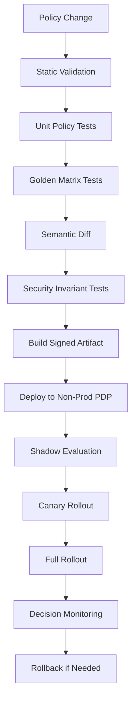
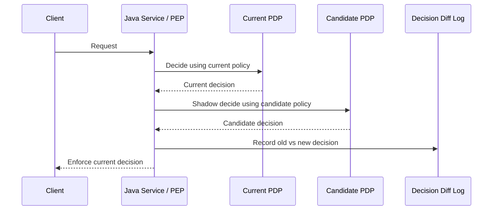
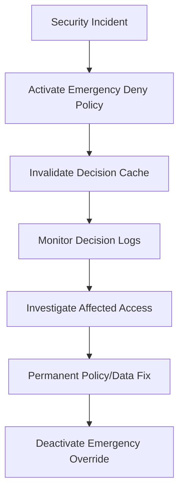
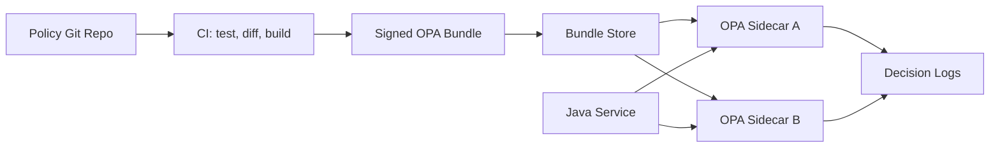

# Part 029 — Policy Versioning, Rollout, Testing, and Safe Deployment

Authorization policy is production code.

That statement is not rhetoric. A wrong authorization policy can leak data, block legal work, bypass separation of duties, break tenant isolation, or silently grant admin capability to the wrong audience. If application code deserves version control, CI, release gates, canary, monitoring, rollback, and incident response, authorization policy deserves the same treatment.

This part answers the practical engineering question:

> How do we change authorization behavior safely without turning every policy update into a security incident?

We will treat policy release as an engineering system.

Not as a JSON file copied into production.
Not as a SQL update against a permissions table.
Not as a dashboard toggle.

As a governed, testable, observable, reversible deployment pipeline.

---

## 1. The Core Problem

Most teams start with this model:

```text
Change role/permission/policy -> deploy -> hope tests pass -> production behavior changes
```

That is too weak for authorization.

A safe policy lifecycle must answer these questions before production users are affected:

1. **What changed?**
2. **Who approved it?**
3. **Which subjects/resources/actions are affected?**
4. **Does the change widen or narrow access?**
5. **Is any deny turning into allow?**
6. **Is any allow turning into deny for critical operations?**
7. **Can we compare old vs new decisions on real traffic?**
8. **Can we roll back without redeploying all services?**
9. **Can we explain a decision after the fact?**
10. **Can we prove tenant and object-level invariants still hold?**

Authorization releases are dangerous because a policy diff is rarely obvious from text diff alone.

Example:

```rego
allow if {
  input.subject.department == input.resource.department
}
```

changed to:

```rego
allow if {
  input.subject.region == input.resource.region
}
```

The text diff is small.

The semantic diff may be massive.

A regional rule might grant access to thousands of resources previously restricted by department.

The policy pipeline must therefore operate on **semantic decision impact**, not only line changes.

---

## 2. Policy Artifacts That Need Versioning

Do not think of policy versioning as only versioning `policy.rego` or `policy.cedar`.

A production authorization system has multiple versioned artifacts.

| Artifact | Why it matters |
|---|---|
| Policy code | The rules that decide allow/deny |
| Policy schema | Defines valid principal, action, resource, context shape |
| Decision contract | Java request/response format between PEP and PDP |
| Resource model | Object types, relations, attributes, lifecycle states |
| Action catalog | Canonical action names and semantics |
| Reason code catalog | Stable deny/allow explanations |
| Obligation catalog | Required post-decision behaviors |
| Attribute provider contract | Which PIP supplies which attributes |
| Relationship model | ReBAC/OpenFGA/Zanzibar-style object graph rules |
| Test corpus | Examples, abuse cases, golden decisions |
| Migration scripts | Transform old assignments/policies to new shape |
| Rollout config | Which policy version applies to which tenant/service/traffic slice |

A service should be able to record:

```json
{
  "decisionId": "dec_01J...",
  "policyEngine": "opa",
  "policyBundleVersion": "authz-bundle-2026.07.03.12",
  "policySchemaVersion": "case-authz-schema-v4",
  "decisionContractVersion": "authz-decision-v2",
  "resourceModelVersion": "case-model-v9",
  "result": "DENY",
  "reasonCode": "CASE_NOT_ASSIGNED"
}
```

Without this metadata, audit becomes storytelling.

With this metadata, audit becomes reconstruction.

---

## 3. Versioning Dimensions

A policy version number alone is insufficient.

Authorization behavior depends on the combination of:

```text
Decision = f(policy, schema, data, attributes, relationships, engine version, contract version, time)
```

This means there are several version dimensions.

### 3.1 Policy Source Version

The Git commit or artifact version of the policy source.

Example:

```text
policySourceVersion = git:8f7a2c1
```

Useful for traceability.

Not sufficient for runtime diagnosis, because generated bundles or deployed stores may differ from source.

### 3.2 Policy Bundle Version

The deployable artifact consumed by the PDP.

For OPA, this may be a signed bundle containing Rego modules and data.

```text
policyBundleVersion = case-authz-bundle-2026.07.03.12
```

This is what runtime decisions should log.

### 3.3 Policy Store Version

For managed systems such as Amazon Verified Permissions or graph authorization services, the deployed policy store or model version matters.

```text
policyStoreId = ps-abc123
schemaVersion = v4
policyTemplateVersion = approval-template-v7
```

### 3.4 Decision Contract Version

Java services need a stable contract for authorization requests and decisions.

```java
public record AuthorizationRequestV2(
    SubjectRef subject,
    ActionRef action,
    ResourceRef resource,
    AuthorizationContext context,
    EvaluationOptions options
) {}
```

If this changes, every PEP and PDP adapter must be compatible.

### 3.5 Attribute Version

ABAC policies depend on attributes.

If `case.riskLevel` changes meaning from `LOW/MEDIUM/HIGH` to `1..5`, policies may still compile but become semantically wrong.

Version attribute semantics explicitly.

```text
attribute.case.riskLevel.version = v2
```

### 3.6 Relationship Model Version

ReBAC depends on relation definitions.

Example:

```text
viewer = owner or assignee or reviewer from parent
```

If `reviewer from parent` is added, access expands even if no tuples change.

Version the authorization model separately from the relationship tuples.

### 3.7 Engine Version

Policy engines can change behavior across versions, especially around parsing, built-ins, validation, or partial evaluation.

Pin the engine version in production.

```text
opaVersion = 1.7.0
cedarEvaluatorVersion = 4.x
openfgaModelVersion = 01J...
```

---

## 4. Policy Repository Layout

A mature policy repository should make the domain explicit.

Example:

```text
authorization-policies/
  README.md
  catalog/
    actions.yaml
    resource-types.yaml
    reason-codes.yaml
    obligations.yaml
  schemas/
    authz-request-v2.schema.json
    case-authz-schema.cedar.json
    openfga-model.dsl
  opa/
    case/
      policy.rego
      data.json
      tests/
        policy_test.rego
        golden-decisions.yaml
    export/
      policy.rego
  cedar/
    case/
      schema.cedar.json
      policies/
        investigator.cedar
        supervisor.cedar
      tests/
        cases.yaml
  openfga/
    case-model.fga
    tuples/
      seed-tuples.yaml
    tests/
      access-tests.yaml
  fixtures/
    subjects.yaml
    resources.yaml
    contexts.yaml
  impact-analysis/
    production-samples/
  migrations/
    2026-07-03-add-case-reviewer-relation.sql
  ci/
    semantic-diff.yml
    policy-release.yml
```

The repository should not only store rules. It should store the **language of authorization** for the organization.

If `CASE_APPROVE_ESCALATION` exists in Java but not in the action catalog, the build should fail.

If a policy emits `DENIED_UNKNOWN_BRANCH` but the reason code catalog does not define it, the build should fail.

If an authorization request contains `resource.type = "CaseFile"` but the schema only knows `Case`, the build should fail.

---

## 5. Policy Release Pipeline

A robust pipeline has stages.



Each stage catches a different class of failure.

| Stage | Catches |
|---|---|
| Static validation | Syntax, schema, unknown action/resource/attribute |
| Unit tests | Individual policy rule mistakes |
| Golden matrix tests | Regression in known access scenarios |
| Semantic diff | Unexpected allow/deny changes |
| Invariant tests | Tenant leaks, SoD breaks, object-level bypass |
| Artifact signing | Unauthorized policy tampering |
| Shadow evaluation | Real traffic divergence before enforcement |
| Canary | Production-only data/freshness issues |
| Monitoring | Runtime drift, latency, deny spikes |
| Rollback | Containment when change is wrong |

---

## 6. Static Validation

Static validation answers:

> Is this policy structurally valid before we evaluate a single request?

Examples:

- unknown action;
- unknown resource type;
- unknown subject type;
- typo in attribute name;
- invalid condition type;
- unused policy;
- unreachable policy;
- policy with no tests;
- deny/forbid with too broad scope;
- obligation emitted without catalog definition.

For Cedar/Verified Permissions, schema validation is a major production safety tool. Schemas let the system validate that policies reference valid entity types, actions, and attributes.

For OPA/Rego, the equivalent guard is a combination of schema checking, static analysis, Regal-style linting, custom CI checks, and policy tests.

For OpenFGA/ReBAC, validation includes model parsing, relation existence, type restrictions, and test tuples.

### 6.1 Example Action Catalog Check

```yaml
actions:
  CASE_VIEW:
    resourceType: CASE
    mutating: false
    risk: medium
  CASE_APPROVE_ESCALATION:
    resourceType: CASE
    mutating: true
    risk: critical
    requiresAudit: true
```

A CI script can parse policy files and fail if an action is not in this catalog.

Why it matters:

```text
CASE_APROVE_ESCALATION
```

A typo like that should not become a silently dead policy.

---

## 7. Policy Unit Tests

Policy tests are small, explicit examples.

They prove that a specific rule behaves as expected.

Example in pseudo-yaml:

```yaml
- name: assigned investigator can view open case
  request:
    subject:
      id: user:alice
      roles: [investigator]
      tenant: tenant:a
    action: CASE_VIEW
    resource:
      id: case:100
      tenant: tenant:a
      assignedTo: user:alice
      status: OPEN
  expect:
    effect: ALLOW
    reason: CASE_ASSIGNED_TO_SUBJECT

- name: investigator cannot view case from another tenant
  request:
    subject:
      id: user:alice
      roles: [investigator]
      tenant: tenant:a
    action: CASE_VIEW
    resource:
      id: case:200
      tenant: tenant:b
      assignedTo: user:alice
      status: OPEN
  expect:
    effect: DENY
    reason: TENANT_MISMATCH
```

Good authorization tests include both positive and negative cases.

A policy suite with only allow tests is a vulnerability generator.

---

## 8. Golden Decision Matrix

A golden matrix is a table of known authorization scenarios.

It becomes the regression contract for policy evolution.

Example:

| Subject | Action | Resource State | Relationship | Expected |
|---|---|---|---|---|
| Investigator | View | Open | Assigned | Allow |
| Investigator | View | Open | Not assigned | Deny |
| Supervisor | View | Open | Same branch | Allow |
| Supervisor | Approve escalation | Draft | Same branch | Deny |
| Supervisor | Approve escalation | Pending approval | Same branch | Allow |
| Supervisor | Approve own escalation | Pending approval | Creator | Deny |
| Admin | Delete evidence | Any | Any | Deny unless break-glass |

Turn this into executable data.

```java
@ParameterizedTest
@MethodSource("goldenAuthorizationCases")
void policyMustMatchGoldenMatrix(GoldenCase c) {
    AuthorizationDecision decision = authorizationService.decide(c.request());

    assertThat(decision.effect()).isEqualTo(c.expectedEffect());
    assertThat(decision.reasonCode()).isEqualTo(c.expectedReasonCode());
}
```

The important move is this:

> Do not let the permission matrix live only in Confluence.

A non-executable permission matrix becomes stale.

An executable matrix becomes a regression suite.

---

## 9. Semantic Policy Diff

Text diff answers:

```text
What lines changed?
```

Semantic diff answers:

```text
Which decisions changed?
```

That is what matters.

Example semantic diff report:

```text
Policy change: PR-1842
Old bundle: case-authz-2026.06.29.3
New bundle: case-authz-2026.07.03.1

Decision changes over test corpus:
  ALLOW -> DENY: 12
  DENY  -> ALLOW: 3
  DENY  -> DENY: 8,912
  ALLOW -> ALLOW: 1,044

New ALLOW decisions:
  - supervisor can CASE_EXPORT high-risk case in same branch
  - investigator can CASE_VIEW archived assigned case
  - service account can CASE_REINDEX sealed case

Required approval:
  - Security approval required because DENY -> ALLOW exists
  - Data owner approval required because export action changed
```

For authorization, `DENY -> ALLOW` is a **privilege expansion**.

`ALLOW -> DENY` is a **business disruption risk**.

Both matter, but they have different governance paths.

---

## 10. Policy Invariant Tests

Some authorization rules must never be broken.

They are stronger than normal test cases.

Example invariants:

1. A user from tenant A must never access tenant B resource.
2. A user must never approve their own request.
3. A deleted/suspended user must never be allowed.
4. A sealed case must not be exported except by break-glass.
5. A draft case must not be visible outside creator/assignee group.
6. A field marked `SECRET` must never appear in response for `PUBLIC_VIEW`.
7. Service account access must be action-specific, never wildcard.
8. Bulk operation must not include unauthorized object silently.

Write invariants as generated tests.

```java
@Property
void crossTenantAccessIsAlwaysDenied(
    @ForAll("subjects") Subject subject,
    @ForAll("caseResources") CaseResource resource,
    @ForAll("caseActions") Action action
) {
    assumeThat(subject.tenantId()).isNotEqualTo(resource.tenantId());

    AuthorizationDecision decision = authorizationService.decide(
        AuthorizationRequest.of(subject, action, resource)
    );

    assertThat(decision.effect()).isEqualTo(Effect.DENY);
}
```

Property-based authorization tests are powerful because they attack the shape of the policy, not only curated examples.

---

## 11. Shadow Evaluation

Shadow evaluation means:

```text
Production request -> enforce old policy -> evaluate new policy in parallel -> log difference -> do not enforce new result yet
```



Shadow mode is one of the safest ways to deploy authorization policy.

It reveals:

- unexpected allow expansion;
- deny spikes;
- missing attributes in real traffic;
- latency increase;
- policy engine errors;
- schema mismatch;
- tenant-specific behavior;
- untested action/resource pairs.

### 11.1 Java Shadow Evaluator

```java
public final class ShadowAuthorizationService implements AuthorizationService {

    private final AuthorizationService active;
    private final AuthorizationService candidate;
    private final DecisionDiffSink diffSink;

    @Override
    public AuthorizationDecision decide(AuthorizationRequest request) {
        AuthorizationDecision activeDecision = active.decide(request);

        try {
            AuthorizationDecision candidateDecision = candidate.decide(request);
            if (!sameDecision(activeDecision, candidateDecision)) {
                diffSink.record(request, activeDecision, candidateDecision);
            }
        } catch (Exception e) {
            diffSink.recordCandidateFailure(request, activeDecision, e);
        }

        return activeDecision;
    }

    private boolean sameDecision(AuthorizationDecision a, AuthorizationDecision b) {
        return a.effect() == b.effect()
            && Objects.equals(a.reasonCode(), b.reasonCode())
            && Objects.equals(a.obligations(), b.obligations());
    }
}
```

Shadow evaluation must not change production behavior.

It is observational.

---

## 12. Canary Rollout

After shadow mode, roll out enforcement gradually.

Examples:

```text
0% enforce candidate policy, 100% shadow
1% enforce candidate policy for internal users
5% enforce candidate policy for low-risk tenants
25% enforce candidate policy for non-mutating actions
50% enforce candidate policy for selected services
100% enforce candidate policy
```

Do not canary only by random request percentage if authorization risk is tenant/domain-specific.

Better rollout dimensions:

| Dimension | Use case |
|---|---|
| Tenant | Reduce blast radius |
| Action | Start with read-only decisions |
| Resource type | Roll out per domain aggregate |
| User group | Internal users first |
| Region | Jurisdiction-specific policy |
| Service | One Java service at a time |
| Risk class | Low-risk permissions first |

---

## 13. Rollback Strategy

Authorization rollback must be faster than application rollback.

If a policy incorrectly grants access, waiting for a full application redeploy is too slow.

A good system has:

- previous policy artifact retained;
- PDP can switch policy version quickly;
- PEP can force fail-closed for risky actions;
- decision cache can be invalidated;
- policy deployment can be paused;
- emergency deny policy can be activated;
- audit log can identify affected decisions.

### 13.1 Rollback Metadata

Every rollout should record:

```yaml
releaseId: authz-release-2026-07-03-001
oldVersion: case-authz-bundle-2026.06.30.4
newVersion: case-authz-bundle-2026.07.03.1
rolloutStartedAt: 2026-07-03T10:12:00Z
approvedBy:
  - security-reviewer
  - domain-owner
rollbackPlan:
  type: pointer-switch
  maxExpectedTime: immediate
cacheInvalidation:
  decisionCache: required
  attributeCache: not-required
```

Avoid ad-hoc rollback.

Write rollback as a first-class release artifact.

---

## 14. Signed Policy Artifacts

Policy artifacts should be tamper-evident.

At minimum:

- build artifact from CI only;
- store immutable artifact digest;
- record Git commit;
- require code review;
- prevent direct production editing;
- use deployment identity separate from developer identity;
- log policy publish event.

Example metadata:

```json
{
  "artifact": "case-authz-bundle.tar.gz",
  "sha256": "d6ab...",
  "gitCommit": "8f7a2c1",
  "builtBy": "ci/authz-policy-release",
  "approvedBy": ["security", "case-domain-owner"],
  "createdAt": "2026-07-03T10:10:00Z"
}
```

If an incident happens, this tells you exactly what policy was running.

---

## 15. Decision Logs as Release Feedback

Policy release monitoring requires decision logs.

A decision log should include enough to debug without leaking sensitive data.

Example:

```json
{
  "decisionId": "dec_01J...",
  "timestamp": "2026-07-03T10:15:42Z",
  "service": "case-api",
  "subject": {
    "type": "USER",
    "idHash": "sha256:...",
    "tenant": "tenant-a"
  },
  "action": "CASE_APPROVE_ESCALATION",
  "resource": {
    "type": "CASE",
    "idHash": "sha256:...",
    "tenant": "tenant-a",
    "state": "PENDING_APPROVAL"
  },
  "effect": "DENY",
  "reasonCode": "MAKER_CHECKER_VIOLATION",
  "policyVersion": "case-authz-bundle-2026.07.03.1",
  "decisionLatencyMs": 8,
  "obligations": ["AUDIT_HIGH_RISK_DENY"]
}
```

Do not log raw secrets, raw token, full PII, confidential case notes, or full resource payload.

### 15.1 Metrics to Watch

| Metric | Why it matters |
|---|---|
| Allow rate by action | Detect privilege expansion |
| Deny rate by action | Detect business breakage |
| Indeterminate rate | Detect PDP/PIP/schema failures |
| Decision latency | Detect policy performance regression |
| Timeout rate | Detect availability risk |
| Missing attribute rate | Detect PIP drift |
| Unknown action/resource rate | Detect contract mismatch |
| Old/new shadow divergence | Detect rollout risk |
| Break-glass usage | Detect governance risk |

---

## 16. Handling Policy Data Migrations

Policy release often requires data migration.

Examples:

- add new permission assignments;
- split a role into two roles;
- introduce new resource classification;
- add ReBAC relationship tuples;
- migrate from role to policy template;
- create default tenant admin assignment;
- backfill jurisdiction relationship;
- mark existing cases with sensitivity label.

The migration must be consistent with policy rollout.

Bad sequence:

```text
Deploy policy requiring resource.classification
But classification is null for old resources
Policy denies critical work or allows through default
```

Better sequence:

```text
1. Add nullable attribute
2. Backfill data
3. Add policy in shadow mode
4. Validate missing attribute rate
5. Enforce candidate policy
6. Make attribute required
```

Authorization migrations need expand/contract discipline, just like database migrations.

---

## 17. Backward and Forward Compatibility

During rollout, old services and new services may coexist.

Therefore:

- new PDP must accept old request contract for a transition window;
- new PEP must handle old decision responses if rollback occurs;
- new policy should not require attributes that old services cannot supply;
- decision reason code additions must be backward compatible;
- obligations must be optional or safely ignored only when designed that way.

### 17.1 Contract Compatibility Rule

```text
A policy can require a new input field only after all enforcing PEPs can supply it.
```

If this rule is broken, the system will create random denies or fail-open fallbacks.

---

## 18. Policy Approval Model

Not all policy changes require the same approval.

Use risk-based governance.

| Change type | Required approval |
|---|---|
| Text cleanup, no semantic diff | Policy owner |
| ALLOW -> DENY only for low-risk operation | Domain owner |
| DENY -> ALLOW for read access | Domain owner + security |
| DENY -> ALLOW for export/admin/write | Security + data owner + compliance if regulated |
| Break-glass policy change | Security lead + audit/compliance |
| Tenant isolation model change | Architecture/security review |
| Policy engine/version upgrade | Platform + security testing |
| New wildcard permission | Usually reject or escalate heavily |

Governance should not become bureaucracy.

It should match blast radius.

---

## 19. Emergency Policy Change

Sometimes you need to block access immediately.

Example:

- compromised service account;
- leaked admin role;
- tenant breakout bug;
- legal hold;
- emergency regulatory freeze;
- known bad integration client.

Design an emergency path.



Emergency policy must be:

- narrower than possible;
- time-bound;
- audited;
- separately approved if time allows;
- reviewed after incident;
- removed after permanent fix.

Never let emergency policy become permanent invisible authorization logic.

---

## 20. OPA Release Pattern

OPA commonly receives policy through bundles.

A Java service should not know about raw Rego files. It should know about authorization decision semantics.

Example OPA rollout topology:



Key rules:

1. Java PEP logs bundle version.
2. OPA sidecar exposes health and bundle status.
3. Bundle download failure does not automatically mean use unknown policy.
4. New policy version runs in shadow before enforcement.
5. Decision cache key includes policy version.

---

## 21. Cedar / Amazon Verified Permissions Release Pattern

For Cedar/AVP-style authorization, release safety depends heavily on schema and policy store discipline.

Safe sequence:

1. Update schema in non-production policy store.
2. Validate policies against schema.
3. Run policy test corpus.
4. Deploy candidate policies/templates.
5. Run shadow decision evaluation from Java.
6. Roll out per tenant/action/resource.
7. Monitor decision logs and AVP call errors.
8. Roll back by switching active policy/template/store pointer.

Important:

```text
Do not let console-edited policies bypass repository and CI.
```

Managed policy stores are useful.

But direct manual edits can destroy release traceability.

---

## 22. OpenFGA / ReBAC Model Release Pattern

ReBAC has two separate moving parts:

1. authorization model;
2. relationship tuples.

Changing the model can change access without changing any tuple.

Example:

```text
viewer = assignee
```

changed to:

```text
viewer = assignee or reviewer from parent
```

This expands access for every resource whose parent has reviewers.

Safe OpenFGA/ReBAC model release requires:

- model versioning;
- tuple migration plan;
- check/list tests;
- expansion tests;
- semantic diff over sample tuples;
- canary by tenant or object type;
- watch for list-object result changes;
- rollback model version.

---

## 23. Cache and Version Interaction

Every cache must know policy version.

Bad cache key:

```text
subjectId + action + resourceId
```

Better cache key:

```text
policyVersion + subjectVersion + resourceVersion + relationshipVersion + action + resourceId + contextFingerprint
```

If the policy changes but cached allow remains, rollback and rollout become meaningless.

### 23.1 Cache Rule

```text
A decision cache entry is valid only under the exact authorization semantics that produced it.
```

When policy version changes, either:

- invalidate decision cache; or
- include policy version in cache key; or
- use very short TTL for low-risk decisions only.

Do not cache high-risk admin/write/export decisions casually.

---

## 24. Fail-Closed During Policy Release

Policy release introduces transient failures:

- PDP not ready;
- sidecar not downloaded latest bundle;
- schema mismatch;
- attribute missing;
- network timeout;
- candidate evaluator throws exception;
- decision response cannot be parsed.

The default behavior for protected operations should be fail-closed.

But fail-closed must be designed, not improvised.

Example decision mapping:

```java
public AuthorizationDecision decideOrFailClosed(AuthorizationRequest request) {
    try {
        return pdp.decide(request);
    } catch (PdpTimeoutException e) {
        return AuthorizationDecision.deny(
            "AUTHZ_PDP_TIMEOUT",
            AuditLevel.SECURITY_RELEVANT
        );
    } catch (PolicyContractException e) {
        return AuthorizationDecision.deny(
            "AUTHZ_CONTRACT_ERROR",
            AuditLevel.SECURITY_RELEVANT
        );
    }
}
```

Some systems define limited degrade mode for read-only, low-risk, cached decisions.

If you do that, document it as an explicit risk decision.

Never hide it in catch blocks.

---

## 25. Production Readiness Checklist

Before enforcing a new authorization policy version, check:

- [ ] Policy source is reviewed.
- [ ] Artifact is built by CI.
- [ ] Artifact has immutable digest.
- [ ] Schema validation passes.
- [ ] Action/resource/reason/obligation catalogs match.
- [ ] Unit policy tests pass.
- [ ] Golden decision matrix passes.
- [ ] Security invariants pass.
- [ ] Semantic diff is reviewed.
- [ ] Privilege expansion is approved.
- [ ] Breaking denies are approved by domain owner.
- [ ] Data migration is complete.
- [ ] PEP/PDP contract compatibility is verified.
- [ ] Shadow evaluation divergence is understood.
- [ ] Rollout scope is limited.
- [ ] Rollback plan is tested.
- [ ] Decision logs include policy version.
- [ ] Cache invalidation/versioning is ready.
- [ ] Monitoring dashboard is live.
- [ ] Emergency deny path exists.

---

## 26. Anti-Patterns

### 26.1 Editing Production Policy by Hand

This bypasses review, tests, and traceability.

If emergency edit is unavoidable, backport it to source control immediately and open an incident/change record.

### 26.2 Treating Policy Diff as Text Diff Only

Authorization change is semantic.

A small text diff can grant massive access.

### 26.3 No Negative Tests

A policy suite with only allow tests proves only that someone can do something.

It does not prove that the wrong people cannot.

### 26.4 Caching Decisions Without Policy Version

This makes rollout unsafe and rollback incomplete.

### 26.5 Direct Role SQL Updates

Changing `user_roles` manually without audit and recomputation can create invisible entitlement drift.

### 26.6 Policy Without Reason Codes

A deny without reason is hard to debug.

An allow without reason is hard to audit.

### 26.7 Shadow Mode Without Diff Review

Collecting old/new decisions is useless if nobody reviews the divergence.

### 26.8 Fail-Open During Migration

This is one of the worst patterns:

```java
catch (Exception e) {
    return allow();
}
```

It turns policy release bugs into security bypasses.

---

## 27. Final Mental Model

Policy release is not only deployment.

It is controlled change to the set of possible actions in the system.

Think of every policy change as modifying this function:

```text
Allowed(subject, action, resource, context, time) -> true/false
```

A production-grade organization asks:

```text
How did this function change?
Who approved the change?
Which real users/resources are affected?
Can we detect unexpected behavior?
Can we roll back immediately?
Can we explain decisions later?
```

That is the bar for safe authorization policy delivery.

---

## References

- OWASP Authorization Cheat Sheet — Access control design, deny-by-default, every-request validation.
- OPA Documentation — Policy as code, REST API, bundles, decision logs, policy testing.
- Cedar Documentation — Policy language, schemas, validation, authorization request model.
- Amazon Verified Permissions Documentation — Policy stores, schemas, policy templates, authorization model.
- OpenFGA Documentation — Authorization models, relationship tuples, testing models, consistency.
- Google Zanzibar Paper — Global relationship-based authorization model and consistency considerations.
