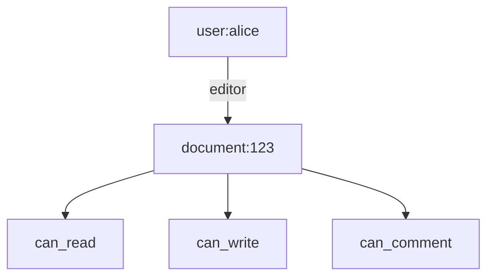
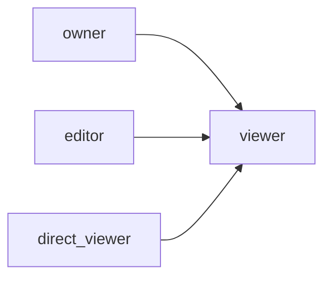
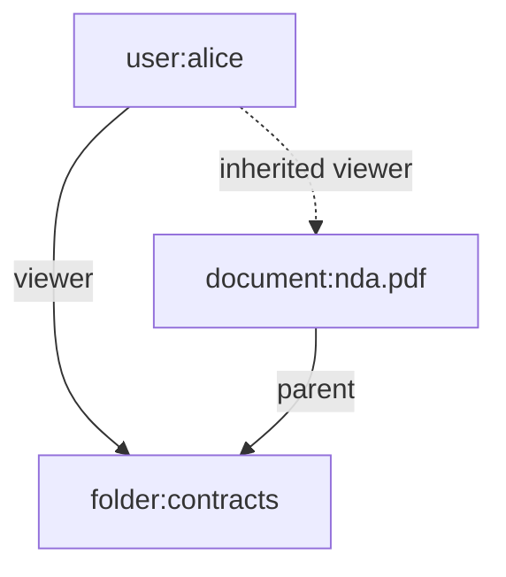
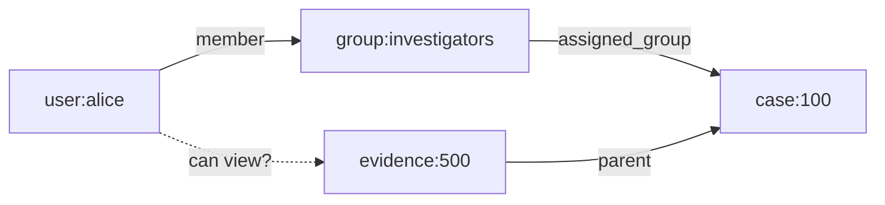
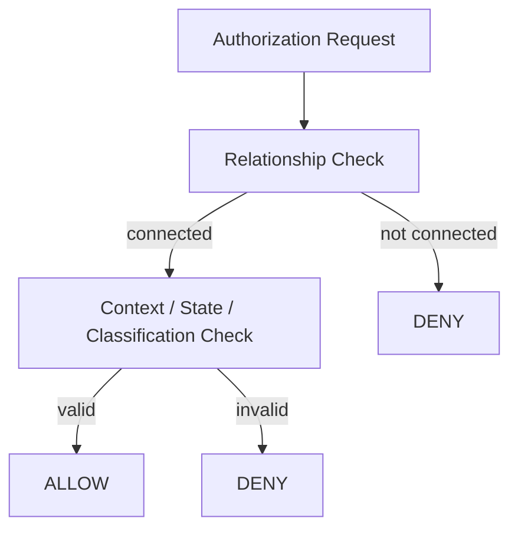
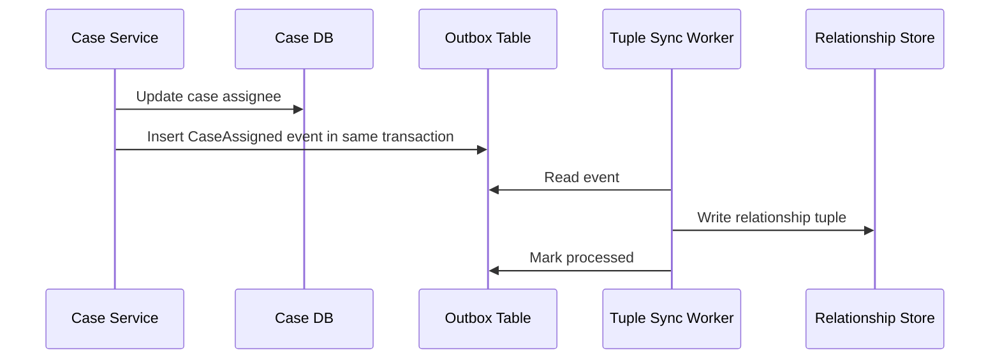
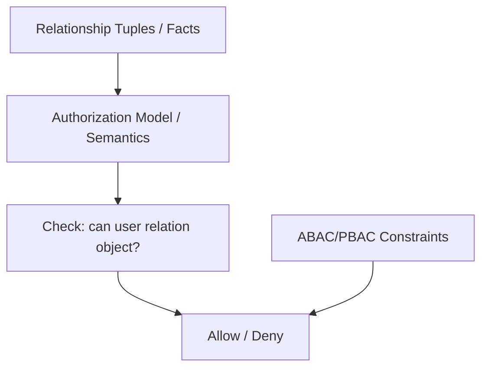

# Part 030 — ReBAC Mental Model: Relationship-Based Authorization

Most engineers first learn authorization as roles and permissions.

```text
User has role ADMIN.
ADMIN has permission DOCUMENT_READ.
Therefore user can read document.
```

That works for coarse-grained systems.

It starts failing when authorization depends on **relationships**:

```text
Alice can view document D because Alice is a viewer of folder F and document D is inside folder F.
Bob can approve case C because Bob supervises the branch that owns case C.
Carol can edit evidence E because Carol is assigned to the investigation that contains E.
A service can reindex file X because the service owns the indexing job linked to that file.
```

Relationship-Based Access Control, or **ReBAC**, models authorization as a graph of relationships between users, groups, resources, organizations, folders, cases, tasks, and other objects.

The central question becomes:

> Is there a valid relationship path from this subject to this permission on this object?

This part builds the mental model.

Implementation details with OpenFGA from Java come later in Part 032. Here we focus on how to think.

---

## 1. Why RBAC and ABAC Are Not Enough

RBAC answers:

```text
What role does the subject have?
```

ABAC answers:

```text
Do subject/resource/context attributes satisfy policy?
```

ReBAC answers:

```text
How is the subject related to the resource?
```

A document sharing product is the classic example.

You do not want a role named:

```text
VIEWER_OF_DOCUMENT_123
```

That creates role explosion.

You also do not want every shared document copied into a giant JWT claim.

That creates token bloat and staleness.

Instead, you model relationships:

```text
user:alice viewer document:123
user:bob editor document:123
group:legal viewer folder:contracts
document:123 parent folder:contracts
user:carol member group:legal
```

Then the authorization model says:

```text
A user can view a document if:
  - user is direct viewer of the document, or
  - user is editor of the document, or
  - user is member of a group that is viewer of the document, or
  - user can view the parent folder.
```

This is not a role table anymore.

It is relationship graph evaluation.

---

## 2. Relationship Tuple

The smallest ReBAC fact is usually a relationship tuple.

```text
user relation object
```

Examples:

```text
user:alice viewer document:doc-123
user:bob editor document:doc-123
group:finance member user:carol
folder:folder-1 parent organization:org-a
document:doc-123 parent folder:folder-1
```

Many systems write it as:

```text
<object>#<relation>@<user>
```

Example:

```text
document:doc-123#viewer@user:alice
document:doc-123#editor@user:bob
group:finance#member@user:carol
folder:folder-1#parent@organization:org-a
```

OpenFGA-style tuple shape is conceptually:

```json
{
  "user": "user:alice",
  "relation": "viewer",
  "object": "document:doc-123"
}
```

The tuple does not say whether Alice can `read`, `comment`, `share`, or `delete`.

The tuple says Alice has a **relationship**.

The authorization model determines what that relationship means.

---

## 3. Relation vs Permission

This distinction matters.

A **relation** is a fact.

A **permission** is a derived capability.

Example:

```text
relation: editor
permission: can_write
```

Model:

```text
can_write = editor
can_read  = viewer or editor
```

This means `editor` is not merely a permission. It can imply multiple permissions.



In Java terms, do not flatten ReBAC too early into a list of permissions.

Keep the relationship model explicit.

---

## 4. Userset

A userset is a set of users described by a relation.

Example:

```text
document:doc-123#viewer
```

means:

```text
All users who are viewers of document doc-123.
```

A userset can include:

- direct users;
- groups;
- members of groups;
- users inherited from parent resource;
- users connected by computed relationship;
- users satisfying a condition.

Example:

```text
document:doc-123#viewer includes group:legal#member
```

Meaning:

```text
Every member of group legal is a viewer of document doc-123.
```

This is why ReBAC scales better than one tuple per user per object in many sharing scenarios.

---

## 5. Computed Relationship

A computed relationship derives one relation from another.

Example:

```text
viewer = owner or editor or direct_viewer
```

This means a direct `owner` tuple can imply `viewer`.



In a regulatory case system:

```text
case_viewer = case_owner or assigned_investigator or branch_supervisor
case_editor = assigned_investigator
case_approver = branch_supervisor but not case_creator
```

The last rule introduces a constraint not purely expressible as a simple relationship in every ReBAC engine. Some engines support conditions/caveats. Others require ABAC or application-side constraint.

Do not force every rule into ReBAC.

Hybrid modeling is normal.

---

## 6. Inheritance from Parent Resource

One of ReBAC's strongest features is inherited access.

Example:

```text
folder viewer -> document viewer
```

If Alice can view folder F, and document D is inside folder F, Alice can view D.



Model:

```text
document.viewer = direct_viewer or viewer from parent
```

This pattern appears everywhere:

| Domain | Parent relation |
|---|---|
| Drive/docs | Folder -> document |
| Project management | Workspace -> project -> task |
| Regulatory enforcement | Organization -> case -> evidence |
| Commerce | Account -> order -> invoice |
| Support platform | Customer -> ticket -> attachment |
| IAM | Organization -> account -> resource |
| Code hosting | Organization -> repository -> branch |

The design question is:

```text
Which permissions should inherit, and where must inheritance stop?
```

Not all permissions should inherit.

Example:

```text
viewer from folder -> document viewer
```

is usually fine.

```text
admin from organization -> delete evidence
```

is dangerous.

---

## 7. ReBAC as a Graph

A relationship tuple is an edge.

A resource/user/group is a node.

A check asks whether a path exists under the model.



The model might say:

```text
case.viewer = assigned_investigator or member of assigned_group
 evidence.viewer = viewer from parent
```

Then Alice can view evidence 500 because:

```text
Alice member group:investigators
Group assigned_group case:100
Evidence parent case:100
Therefore Alice viewer evidence:500
```

This graph-path style is the mental shift.

---

## 8. Relationship Tuple Is Data, Not Policy

A common mistake is mixing tuple data with policy semantics.

Tuple:

```text
case:100#assigned_investigator@user:alice
```

Policy/model:

```text
case.can_view = assigned_investigator or branch_supervisor
case.can_edit = assigned_investigator
case.can_approve = branch_supervisor
```

The tuple states a fact:

```text
Alice is assigned investigator of case 100.
```

The model states what that fact allows.

This separation is powerful.

Changing model semantics can change access globally without changing tuple data.

That is why model versioning and semantic diff matter.

---

## 9. Example: Document Sharing Model

A simple document sharing model:

```text
type user

type group
  relations
    define member: [user]

type folder
  relations
    define owner: [user]
    define viewer: [user, group#member] or owner
    define editor: [user, group#member] or owner

type document
  relations
    define parent: [folder]
    define owner: [user]
    define viewer: [user, group#member] or owner or editor or viewer from parent
    define editor: [user, group#member] or owner or editor from parent
```

This expresses:

- document owner can view/edit;
- direct viewer can view;
- direct editor can view/edit;
- group members can receive access;
- folder viewer can view child documents;
- folder editor can edit child documents.

The model is compact.

The tuple data carries the real sharing facts.

---

## 10. Example: Regulatory Case Management Model

A regulatory platform is more nuanced than document sharing.

Resources:

```text
organization
branch
case
evidence
task
report
```

Relations:

```text
organization.admin
branch.supervisor
branch.investigator
case.assigned_investigator
case.creator
case.reviewer
case.parent_branch
evidence.parent_case
task.assignee
report.parent_case
```

Possible derived permissions:

```text
case.can_view = assigned_investigator or reviewer or supervisor from parent_branch
case.can_update = assigned_investigator
case.can_submit_for_review = assigned_investigator
case.can_approve = reviewer or supervisor from parent_branch
case.can_export = reviewer or supervisor from parent_branch

evidence.can_view = can_view from parent_case
evidence.can_update = can_update from parent_case
report.can_view = can_view from parent_case
```

But this is not enough.

Regulatory authorization often includes constraints:

```text
- user cannot approve case they created;
- case must be in PENDING_REVIEW state;
- evidence with classification SECRET requires clearance;
- export requires purpose code;
- sealed cases require break-glass.
```

Those are ABAC/PBAC constraints layered on top of ReBAC.

A realistic model:

```text
Relationship decides who is connected to the resource.
Attribute policy decides whether the operation is allowed in this context.
```



---

## 11. Relationship-Based Roles

ReBAC does not eliminate roles.

It often localizes them.

Bad global role:

```text
ROLE_SUPERVISOR
```

Better relationship:

```text
branch:jakarta#supervisor@user:alice
```

This means Alice is supervisor **of a specific branch**.

Then:

```text
case.can_approve = supervisor from parent_branch
```

Now Alice can approve cases in her branch, not every case in the system.

This is how ReBAC reduces global-role overreach.

---

## 12. Ownership Is Just One Relationship

Many systems overuse ownership.

```text
resource.owner_id = current_user_id
```

This is useful but narrow.

Real systems also need:

- creator;
- assignee;
- reviewer;
- approver;
- supervisor;
- member;
- delegate;
- parent;
- custodian;
- data steward;
- legal hold officer;
- service owner;
- tenant admin;
- external collaborator.

Ownership is only one edge in the graph.

Do not collapse all access into `owner_id`.

---

## 13. ReBAC Check Operation

A check asks:

```text
Can user U have relation/permission R on object O?
```

Example:

```text
check(user:alice, can_view, document:doc-123)
```

The engine evaluates the authorization model plus tuple data.

Possible outcomes:

```text
ALLOW
DENY
ERROR / INDETERMINATE
```

A Java abstraction might look like:

```java
public record RelationshipCheckRequest(
    String subject,
    String relation,
    String object,
    Map<String, Object> context
) {}

public record RelationshipCheckResult(
    boolean allowed,
    String modelVersion,
    String reason
) {}
```

Do not expose engine-specific tuple syntax across your whole codebase.

Wrap it behind a domain-oriented adapter.

```java
public interface RelationshipAuthorizationClient {
    boolean canViewCase(UserId userId, CaseId caseId);
    boolean canApproveCase(UserId userId, CaseId caseId);
    boolean canViewEvidence(UserId userId, EvidenceId evidenceId);
}
```

The application service should speak domain language.

The adapter can translate to OpenFGA/Zanzibar-style checks.

---

## 14. Check, Expand, and List

ReBAC systems usually support different query shapes.

### 14.1 Check

```text
Can Alice view document 123?
```

Use for single object operation.

### 14.2 Expand

```text
Who can view document 123?
```

Useful for debugging, audit, and sharing UI.

Be careful: expansion can be expensive or incomplete in large graphs.

### 14.3 List Objects

```text
Which documents can Alice view?
```

Useful for search/list endpoints.

But list-object queries can be hard at scale.

You may need:

- precomputed access indexes;
- database-side scoping;
- search index integration;
- async materialization;
- bounded relation paths;
- pagination-aware access filters.

### 14.4 List Users

```text
Which users can approve case 100?
```

Useful for assignment workflow, access review, and UI suggestions.

Again, watch scale and privacy.

---

## 15. ReBAC and Query Scoping

Single-object check is not enough for list endpoints.

Bad pattern:

```java
List<Case> cases = caseRepository.search(criteria);
return cases.stream()
    .filter(c -> rebac.canViewCase(userId, c.id()))
    .toList();
```

Problems:

- loads unauthorized data before filtering;
- pagination becomes wrong;
- count becomes wrong;
- performance collapses;
- search ranking leaks existence;
- filtering after DB query can leak timing/metadata.

Better pattern:

```text
Ask relationship system or access index for accessible case IDs/scope.
Use that scope in repository query before pagination.
```

Example:

```java
AccessibleScope scope = relationshipAccessIndex.accessibleCasesFor(userId, CasePermission.VIEW);

Page<CaseSummary> page = caseRepository.searchVisibleCases(userId, scope, criteria, pageable);
```

ReBAC list/query scoping is one of the hardest production problems.

Do not leave it until the end.

---

## 16. Tuple Lifecycle

Relationship tuples are authorization data.

They need lifecycle discipline.

Examples:

| Business event | Tuple change |
|---|---|
| User added to group | Add `group#member@user` |
| User removed from team | Delete `team#member@user` |
| Case assigned | Add `case#assigned_investigator@user` |
| Case reassigned | Delete old assignment tuple, add new tuple |
| Folder moved | Update `document#parent@folder` relation |
| Organization merge | Rebuild parent/member relations |
| User suspended | Delete/disable subject access or add deny constraint |
| Temporary delegation expires | Remove delegation tuple or condition expires |

Tuple update must be transactionally aligned with domain state.

If case assignment changes in the database but tuple update fails, authorization becomes stale.

### 16.1 Outbox Pattern for Tuple Sync



This avoids losing tuple updates when the service crashes between database update and relationship-store write.

---

## 17. Consistency Model

ReBAC systems involve distributed state.

Questions:

- After removing a user from a group, how fast must access disappear?
- Is stale allow acceptable for 5 seconds?
- Do critical operations require fresh check?
- Can read operations use eventually consistent relation data?
- Do we need consistency token/version from previous write?
- How does cache interact with tuple deletion?

For high-risk operations, require stronger consistency.

Example:

```text
CASE_EXPORT_SECRET_EVIDENCE requires fresh relationship and attribute check.
```

For low-risk read of public-ish data, a short stale window may be acceptable.

Make this a policy decision, not an accident.

---

## 18. Conditions and Caveats

Some ReBAC engines support conditional relationships.

Example:

```text
document:123#viewer@user:alice if current_time < 2026-08-01T00:00:00Z
```

Use cases:

- temporary access;
- time-bounded sharing;
- IP/device restriction;
- purpose-of-use;
- region-specific access;
- emergency delegation.

But conditions can turn ReBAC into ABAC.

That is not bad, but it must be controlled.

Rules of thumb:

1. Use relationships for stable graph facts.
2. Use conditions for small contextual constraints on a relationship.
3. Use ABAC/PBAC for broader policy over subject/resource/environment attributes.
4. Do not encode large dynamic business logic into tuple conditions.

---

## 19. Negative Relationships and Deny

Pure ReBAC models often express positive access paths.

But real systems need deny semantics:

```text
- blocked user cannot access shared folder;
- suspended user cannot access anything;
- legal hold prevents deletion;
- conflict-of-interest prevents case access;
- sealed evidence denies normal viewer access;
- maker cannot approve own case.
```

There are several strategies:

| Strategy | Example |
|---|---|
| ABAC/PBAC deny overlay | `if subject.suspended then deny` |
| Explicit deny relation | `case#blocked@user:alice` |
| Cedar forbid policy | `forbid` overrides permit |
| Application guard | Maker-checker check in domain service |
| Attribute classification | `resource.sealed == true` denies export |

Do not assume ReBAC alone handles every deny requirement.

Deny rules often belong in a higher-level policy layer.

---

## 20. ReBAC Modeling Process

A practical modeling process:

```text
1. Identify protected resources.
2. Identify business relationships.
3. Identify user/group/org entities.
4. Identify direct relations.
5. Identify derived permissions.
6. Identify inheritance boundaries.
7. Identify constraints not expressible as relationships.
8. Define tuple lifecycle events.
9. Define consistency requirements.
10. Build golden check/list tests.
```

### 20.1 Step 1 — Protected Resources

Example:

```text
case, evidence, report, branch, organization, task
```

### 20.2 Step 2 — Business Relationships

Example:

```text
case assigned to investigator
case reviewed by reviewer
case belongs to branch
branch belongs to organization
user supervises branch
evidence belongs to case
```

### 20.3 Step 3 — Direct Relations

Example:

```text
case#assigned_investigator@user
case#reviewer@user
case#parent_branch@branch
branch#supervisor@user
evidence#parent_case@case
```

### 20.4 Step 4 — Derived Permissions

Example:

```text
case#can_view = assigned_investigator or reviewer or supervisor from parent_branch
evidence#can_view = can_view from parent_case
```

### 20.5 Step 5 — Non-ReBAC Constraints

Example:

```text
case.status must be PENDING_REVIEW for approval
subject.id must not equal case.creator
subject.clearance >= evidence.classification
```

These go to ABAC/PBAC or domain guard.

---

## 21. Java Domain Adapter Design

Do not spread raw tuple checks everywhere.

Bad:

```java
openFgaClient.check("user:" + userId, "viewer", "document:" + docId);
```

everywhere.

Better:

```java
public interface CaseAccessGraph {
    boolean canViewCase(UserId userId, CaseId caseId);
    boolean canUpdateCase(UserId userId, CaseId caseId);
    boolean canApproveCase(UserId userId, CaseId caseId);
    boolean canViewEvidence(UserId userId, EvidenceId evidenceId);
}
```

Implementation:

```java
public final class FgaCaseAccessGraph implements CaseAccessGraph {

    private final RelationshipClient client;

    @Override
    public boolean canViewCase(UserId userId, CaseId caseId) {
        return client.check(new RelationshipCheckRequest(
            "user:" + userId.value(),
            "can_view",
            "case:" + caseId.value(),
            Map.of()
        )).allowed();
    }

    @Override
    public boolean canApproveCase(UserId userId, CaseId caseId) {
        return client.check(new RelationshipCheckRequest(
            "user:" + userId.value(),
            "can_approve",
            "case:" + caseId.value(),
            Map.of()
        )).allowed();
    }

    @Override
    public boolean canUpdateCase(UserId userId, CaseId caseId) {
        return client.check(new RelationshipCheckRequest(
            "user:" + userId.value(),
            "can_update",
            "case:" + caseId.value(),
            Map.of()
        )).allowed();
    }

    @Override
    public boolean canViewEvidence(UserId userId, EvidenceId evidenceId) {
        return client.check(new RelationshipCheckRequest(
            "user:" + userId.value(),
            "can_view",
            "evidence:" + evidenceId.value(),
            Map.of()
        )).allowed();
    }
}
```

Application service then composes ReBAC with ABAC/domain checks:

```java
public void approveCase(UserId userId, CaseId caseId) {
    Case caseFile = caseRepository.getById(caseId);

    if (!caseAccessGraph.canApproveCase(userId, caseId)) {
        throw new AccessDeniedException("CASE_APPROVER_RELATION_REQUIRED");
    }

    if (!caseFile.isPendingReview()) {
        throw new AccessDeniedException("CASE_NOT_PENDING_REVIEW");
    }

    if (caseFile.createdBy().equals(userId)) {
        throw new AccessDeniedException("MAKER_CHECKER_VIOLATION");
    }

    caseFile.approve(userId);
    caseRepository.save(caseFile);
}
```

This is hybrid authorization by design.

---

## 22. ReBAC Testing

Test ReBAC with graph scenarios.

### 22.1 Direct Relation Test

```text
Given user alice is assigned investigator of case 100
Expect alice can_view case 100
```

### 22.2 Inherited Relation Test

```text
Given alice supervises branch jakarta
And case 100 belongs to branch jakarta
Expect alice can_view case 100
```

### 22.3 Group Membership Test

```text
Given alice member of group investigators
And group investigators assigned to case 100
Expect alice can_view case 100
```

### 22.4 Negative Test

```text
Given bob is investigator in branch bandung
And case 100 belongs to branch jakarta
Expect bob cannot_view case 100
```

### 22.5 Boundary Test

```text
Given alice can_view case 100
And evidence 500 belongs to case 100
Expect alice can_view evidence 500

Given report 900 belongs to another case
Expect alice cannot_view report 900
```

### 22.6 Model Change Test

When changing:

```text
case.can_view = assigned_investigator
```

into:

```text
case.can_view = assigned_investigator or reviewer
```

Run semantic diff over fixtures.

Ask:

```text
Which users newly gain access to which cases?
```

---

## 23. Performance Considerations

Graph authorization can be expensive.

Watch for:

- deep inheritance chains;
- group nesting;
- cyclic relationships;
- high-cardinality group membership;
- list-object queries;
- repeated checks in loops;
- cross-service checks per row;
- unbounded expansion;
- cache invalidation after tuple deletion.

### 23.1 Batch Checks

Avoid:

```java
for (Case c : cases) {
    if (accessGraph.canViewCase(userId, c.id())) {
        result.add(c);
    }
}
```

Prefer:

```java
Map<CaseId, Boolean> allowed = accessGraph.batchCanViewCases(userId, caseIds);
```

Even better for listing:

```text
query with accessible scope before loading cases
```

### 23.2 Model Depth Budget

Define maximum practical depth.

Example:

```text
organization -> branch -> case -> evidence -> attachment
```

This may be fine.

But unbounded nesting like:

```text
folder -> folder -> folder -> ... -> document
```

needs cycle/depth control and performance testing.

---

## 24. Security Failure Modes

ReBAC introduces specific failures.

### 24.1 Orphaned Tuple

A relationship tuple remains after business state changes.

Example:

```text
case reassigned from Alice to Bob, but Alice assignment tuple remains
```

Result: Alice retains access.

### 24.2 Missing Delete on Group Removal

User removed from group in HR system, but group membership tuple remains.

Result: access persists.

### 24.3 Overbroad Inheritance

Adding `admin from organization` accidentally grants destructive permission across child resources.

### 24.4 Wrong Parent Edge

Document moved to another folder, but old parent tuple remains.

Result: users of old folder still have access.

### 24.5 Post-Filter Listing

Service loads all objects and filters with ReBAC check after pagination.

Result: incorrect pages, leaks, performance collapse.

### 24.6 Relationship Sync Lag

Tuple update lags domain update.

Result: stale allow or stale deny.

### 24.7 Group Nesting Explosion

Nested groups create expensive graph expansion or unexpected access paths.

### 24.8 Model Rollout Without Semantic Diff

A model change expands access globally without tuple changes.

---

## 25. ReBAC Anti-Patterns

### 25.1 Encoding Every Permission as Direct Tuple

Bad:

```text
document:1#can_read@user:alice
document:1#can_write@user:alice
document:1#can_comment@user:alice
```

Better:

```text
document:1#editor@user:alice
can_read = viewer or editor
can_write = editor
can_comment = viewer or editor
```

### 25.2 Using ReBAC for Everything

Not every rule is a relationship.

```text
current time < expiry
risk score < threshold
case status == PENDING_REVIEW
subject clearance >= resource classification
```

These are attributes/context.

Use ABAC/PBAC or conditions.

### 25.3 No Tuple Ownership

Every tuple should have a source of truth.

Example:

```text
case#assigned_investigator tuple comes from case assignment table
branch#supervisor tuple comes from org management system
```

Without ownership, nobody knows who can change access.

### 25.4 Raw Tuple Syntax Everywhere

Hide engine syntax behind domain adapter.

Otherwise model migration becomes painful.

### 25.5 Assuming Check Solves Search

Single-object authorization does not automatically solve list/search/export authorization.

### 25.6 No Model Version in Audit Log

If you cannot tell which model evaluated a decision, you cannot reconstruct access after a model change.

---

## 26. When ReBAC Is a Good Fit

Use ReBAC when access depends on relationships like:

- user is member of group;
- user belongs to organization;
- resource belongs to folder/project/case;
- permission inherits from parent;
- collaboration/sharing is object-specific;
- role is local to a resource or tenant;
- subject can access object through assignment;
- access is derived from graph paths;
- authorization must answer “who has access to this object?”

Examples:

- document sharing;
- repository/project membership;
- case management;
- ticketing systems;
- multi-tenant SaaS with local admins;
- organization hierarchy;
- data room access;
- delegated administration;
- workflow task assignment;
- enterprise resource collaboration.

---

## 27. When ReBAC Is Not Enough

ReBAC is not enough when the critical rule is mostly:

- time;
- risk;
- state;
- classification;
- environmental context;
- transaction amount;
- purpose of use;
- consent scope;
- legal basis;
- rate/frequency;
- dynamic fraud score;
- device posture.

Those need ABAC/PBAC and domain constraints.

Example:

```text
Alice is reviewer of case 100.
```

ReBAC says Alice is connected.

But approval still needs:

```text
case.status == PENDING_REVIEW
alice.id != case.creator
case.riskLevel <= alice.approvalLimit
current_time within business_hours
```

The final decision is hybrid.

---

## 28. Final Mental Model

ReBAC is about graph reachability under an authorization model.

Think in three layers:

```text
1. Facts: relationship tuples
2. Semantics: model defines what relationships imply
3. Decision: check/list/expand under policy and context
```



The production-grade lesson is:

> ReBAC is not “better RBAC”. It is a different way to model object-specific, inherited, and collaborative access. It shines when access follows relationships, but it must be combined with context, lifecycle state, audit, query scoping, and safe model release.

---

## References

- Google Zanzibar Paper — Consistent global authorization system based on relationship tuples and ACL evaluation.
- OpenFGA Documentation — Relationship tuples, usersets, modeling, conditions, checks, list objects, and contextual tuples.
- Auth0 / OpenFGA Concepts — Fine-grained authorization and ReBAC concepts.
- OWASP API Security 2023 — Broken Object Level Authorization and object-property authorization risks.
- NIST ABAC — Attribute-based constraints that often complement ReBAC.
