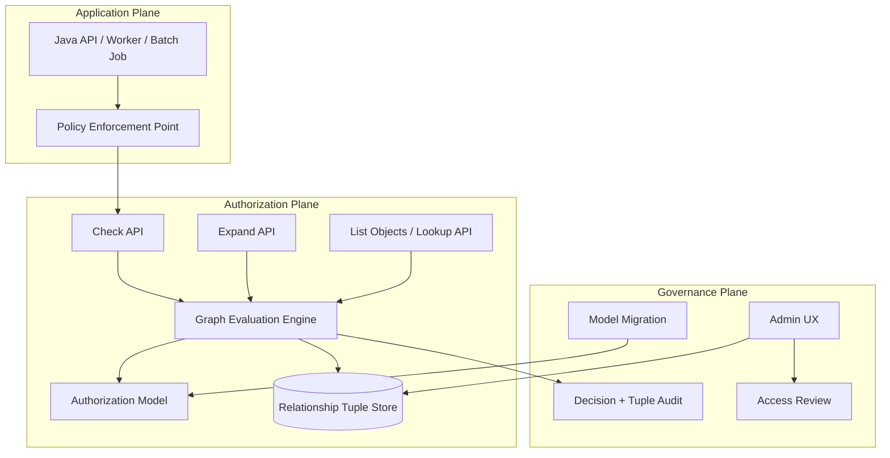
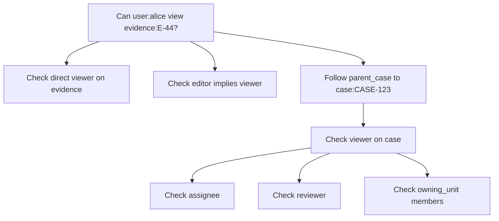
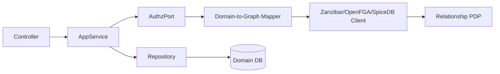
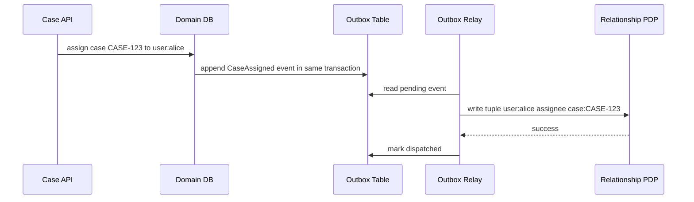

# Part 031 — Zanzibar-Style Authorization Architecture

Authorization becomes structurally harder when the question is no longer:

> Does this user have role `CASE_MANAGER`?

but instead:

> Can this user view this specific evidence file because they are assigned to the case, or they supervise an assignee, or they belong to the enforcement unit that owns the case, or the case is inherited from a parent investigation, or a temporary delegation is active?

That is the point where role checks begin to collapse.

Zanzibar-style authorization is a pattern for answering object-specific relationship questions at scale. It is not merely “store ACLs in a table”. The deeper idea is:

> Model authorization as a graph of relationships, define how relationships imply permissions, and evaluate access by traversing that graph under explicit consistency rules.

Google's Zanzibar paper describes a global authorization system for storing and evaluating permissions/ACLs across many products. The paper introduced a shared authorization service built around relation tuples, namespace configuration, userset rewrites, consistency tokens, and graph-based permission checks.

OpenFGA, SpiceDB/Authzed, and several internal enterprise authorization systems are inspired by this model.

This part builds the architecture-level mental model before the next part implements it with OpenFGA from Java.

---

## 1. The Problem Zanzibar-Style Authorization Solves

Many enterprise systems start with local logic like this:

```java
if (user.hasRole("CASE_OFFICER") && caseRecord.assigneeId().equals(user.id())) {
    return true;
}
```

Then the domain grows:

- supervisors may access subordinate cases;
- legal reviewers may access evidence but not financial data;
- external agency users may access shared cases;
- case access may inherit from parent investigations;
- attachments inherit access from case records;
- team membership changes must take effect quickly;
- batch exports must not leak objects outside the user's reachable graph;
- audit must explain why access was allowed;
- multiple services must enforce the same rules.

At that point, scattered Java code becomes a distributed authorization bug farm.

The failure is not just technical. It is modeling failure.

You need a way to represent facts like:

```text
user:alice member unit:fraud
unit:fraud owner case:CASE-123
case:CASE-123 parent investigation:INV-9
evidence:E-44 parent case:CASE-123
```

and rules like:

```text
case viewer = assignee OR reviewer OR owner from owning_unit OR viewer from parent_investigation
evidence viewer = viewer from parent_case
case editor = assignee AND case is not closed
```

The first group is **relationship data**. The second group is **authorization model**.

Zanzibar-style systems separate them.

---

## 2. Core Vocabulary

### 2.1 Object

An object is a protected thing in the authorization graph.

Examples:

```text
case:CASE-123
evidence:E-44
investigation:INV-9
unit:FRAUD
organization:OJK
folder:F-88
document:D-77
```

The format is usually:

```text
<object_type>:<object_id>
```

The type is not cosmetic. It controls which relations and permissions exist.

Bad:

```text
CASE-123
```

Good:

```text
case:CASE-123
```

Great in multi-tenant systems:

```text
tenant:t-7/case:CASE-123
```

or, if the authorization system expects type and id separately, tenant becomes part of the object namespace or a parent relation.

---

### 2.2 User

A user is an actor in the graph.

Examples:

```text
user:alice
user:42
service:case-indexer
group:legal-reviewers#member
unit:fraud#member
```

A critical point: in Zanzibar-style systems, the `user` position of a tuple can often be either a concrete subject or a **userset**.

Concrete user:

```text
user:alice
```

Userset:

```text
group:legal-reviewers#member
unit:fraud#officer
```

A userset means “all users related to this object by this relation.”

---

### 2.3 Relation

A relation is a named edge between a user/userset and an object.

Examples:

```text
assignee
viewer
editor
owner
member
parent
reviewer
supervisor
```

A direct tuple says:

```text
user:alice assignee case:CASE-123
```

Meaning:

> Alice is directly related to case `CASE-123` as `assignee`.

A relation is not always a permission. Sometimes it is a structural relation.

Permission-like:

```text
viewer
editor
approver
```

Structural:

```text
parent_case
owning_unit
member
supervisor
```

The architecture becomes much cleaner when you do not force every relation to be a permission.

---

### 2.4 Relationship Tuple

A relationship tuple is the atomic authorization fact.

Canonical shape:

```text
(user, relation, object)
```

Example:

```text
(user:alice, assignee, case:CASE-123)
```

This is not a log event. It is current authorization state.

In a table it might look like:

| user | relation | object |
|---|---|---|
| `user:alice` | `assignee` | `case:CASE-123` |
| `unit:fraud#member` | `owner` | `case:CASE-123` |
| `case:CASE-123` | `parent_case` | `evidence:E-44` |

However, the tuple table alone is not enough. The engine also needs to know what each relation means.

---

### 2.5 Authorization Model / Namespace Configuration

The authorization model defines object types, relations, and how relations imply other relations or permissions.

Conceptually:

```text
type case
  relations
    assignee: [user]
    reviewer: [user, group#member]
    owning_unit: [unit]
    viewer: assignee or reviewer or member from owning_unit
    editor: assignee
```

This model says:

- a `case` may have direct `assignee` users;
- a `case` may have direct `reviewer` users or group members;
- a `case` may point to an owning unit;
- `viewer` is computed from assignee, reviewer, or members of the owning unit;
- `editor` is computed from assignee.

This is the difference between a tuple store and an authorization engine.

A tuple store answers:

> Does this exact tuple exist?

A Zanzibar-style engine answers:

> Is this relationship true, including all implied relationships defined by the model?

---

## 3. The Three Planes

A production Zanzibar-style system has three planes.



### 3.1 Application Plane

Java services enforce authorization by calling the authorization system.

Typical places:

- controller/resource method;
- Spring `AuthorizationManager`;
- JAX-RS `ContainerRequestFilter`;
- application service guard;
- repository query scope;
- worker command handler;
- export/report generator.

The Java application should not reimplement graph traversal logic locally.

It should construct typed authorization questions.

```java
boolean allowed = authz.can(
    Subject.user(currentUser.id()),
    Relation.VIEW,
    ObjectRef.caseRecord(caseId),
    AuthzContext.currentRequest()
);
```

---

### 3.2 Authorization Plane

The authorization service stores relationship tuples and evaluates relationship checks.

The common APIs are:

| API | Question |
|---|---|
| Check | Can `user:alice` have relation `viewer` on `case:CASE-123`? |
| Expand | Who is included in `viewer` on `case:CASE-123`? |
| List Objects / Lookup | Which `case` objects can `user:alice` view? |
| Write Tuples | Add/delete relationship facts. |
| Read Changes | Read tuple changes for sync/audit/indexing. |
| Write Model | Publish a new authorization model. |

Do not treat these APIs as interchangeable.

A `Check` is usually the safest primitive for point authorization. `List Objects` is useful for query scoping but must be understood carefully because listing every accessible object may be expensive or incomplete depending on system limits.

---

### 3.3 Governance Plane

The governance plane manages:

- model versioning;
- policy/model review;
- tuple admin UX;
- emergency access;
- access recertification;
- decision logs;
- tuple change logs;
- migration and backfill;
- operational dashboards.

Without governance, ReBAC becomes another invisible permission database that nobody can reason about.

---

## 4. Check API: The Fundamental Runtime Question

The canonical check question is:

```text
Can USER have RELATION on OBJECT?
```

Example:

```text
Can user:alice view case:CASE-123?
```

The engine evaluates:

1. Is there a direct tuple?
2. Is the relation computed from another relation?
3. Does the object inherit the relation from a parent object?
4. Does a userset grant access?
5. Are there caveats/conditions that must be satisfied?
6. Which consistency point should be used?

A Java endpoint might look like this:

```java
@Path("/cases/{caseId}/evidence/{evidenceId}")
public final class EvidenceResource {
    private final EvidenceApplicationService service;
    private final RelationshipAuthorization authz;

    @GET
    public EvidenceDto getEvidence(
            @PathParam("caseId") String caseId,
            @PathParam("evidenceId") String evidenceId,
            @Context SecurityContext securityContext
    ) {
        Subject subject = Subjects.from(securityContext);
        ObjectRef evidence = ObjectRef.evidence(evidenceId);

        authz.require(subject, Relation.VIEW, evidence, AuthzContext.request());

        return service.getEvidence(caseId, evidenceId, subject);
    }
}
```

This is necessary but not sufficient. The service must still bind the evidence to the case path to prevent nested-resource confusion.

```java
Evidence evidence = evidenceRepository.findByIdAndCaseId(evidenceId, caseId)
    .orElseThrow(NotFoundException::new);
```

Authorization answers whether the subject can view the evidence. Domain loading answers whether the requested object actually belongs to the requested parent.

Both are required.

---

## 5. Relationship Modeling Patterns

### 5.1 Direct Assignment

The simplest pattern:

```text
user:alice assignee case:CASE-123
```

Model:

```text
type case
  relations
    define assignee: [user]
    define viewer: assignee
    define editor: assignee
```

Good for:

- case assignee;
- document owner;
- ticket requester;
- task approver.

Weakness:

- direct tuples grow quickly;
- organizational changes require many tuple updates;
- sharing with groups becomes awkward without usersets.

---

### 5.2 Group Membership

Instead of assigning every user directly:

```text
user:alice member group:legal-reviewers
group:legal-reviewers#member reviewer case:CASE-123
```

Meaning:

> All members of the legal reviewers group are reviewers of the case.

Model:

```text
type group
  relations
    define member: [user]

type case
  relations
    define reviewer: [user, group#member]
    define viewer: reviewer
```

This is the bridge from RBAC-style grouping to ReBAC.

---

### 5.3 Parent Inheritance

A document may inherit access from a folder. Evidence may inherit access from a case.

```text
case:CASE-123 parent_case evidence:E-44
user:alice viewer case:CASE-123
```

Model:

```text
type evidence
  relations
    define parent_case: [case]
    define viewer: viewer from parent_case
```

Meaning:

> A user can view evidence if they can view its parent case.

This pattern is extremely useful, but dangerous if parent links are wrong. A single incorrect parent tuple can expose a whole subtree.

Invariant:

> Parent relationship tuples must be written from the domain aggregate that owns the parent-child relationship, not from arbitrary admin screens.

---

### 5.4 Organizational Ownership

```text
unit:fraud owning_unit case:CASE-123
user:alice member unit:fraud
```

Model:

```text
type unit
  relations
    define member: [user]
    define manager: [user]

type case
  relations
    define owning_unit: [unit]
    define viewer: member from owning_unit or manager from owning_unit
```

This handles cases where access follows an organization structure.

Be careful: organization hierarchies are not static. When someone moves units, effective access changes across many objects.

That is the point of using usersets: you update membership once, not every case tuple.

---

### 5.5 Relationship-Based Role

A user can be an admin of a specific organization without being global admin.

```text
user:alice admin organization:org-7
organization:org-7 parent_org case:CASE-123
```

Model:

```text
type organization
  relations
    define admin: [user]

type case
  relations
    define parent_org: [organization]
    define admin: admin from parent_org
    define viewer: admin or assignee
```

This avoids `ROLE_ADMIN` becoming a universal bypass.

---

### 5.6 Delegation

Delegation can be modeled as a relationship:

```text
user:budi delegate_of user:alice
```

But most production delegation needs constraints:

- start time;
- expiry time;
- allowed actions;
- tenant scope;
- reason;
- approval evidence;
- revocation.

Pure Zanzibar-style models do not always express time/context constraints natively. Some systems add caveats/conditions. Others combine ReBAC with ABAC.

A safe hybrid design:

```text
relationship graph: budi is delegate of alice
ABAC context: delegation is active for action=view_case and tenant=t-7
```

Do not encode temporary delegation only as permanent tuples unless there is a reliable expiry/reaper mechanism and audit trail.

---

## 6. Userset Rewrites: The Real Power

A userset rewrite defines how one relation is computed from other relations.

Example:

```text
viewer = assignee OR reviewer OR viewer from parent_case
```

This means `viewer` is not necessarily directly stored. It can be derived.



Userset rewrites let you describe access as a graph. The engine performs the traversal.

The engineering trap is graph explosion.

A clean model is usually shallow and predictable:

```text
evidence -> case -> unit -> user
```

A dangerous model is unbounded:

```text
resource -> folder -> folder -> folder -> group -> group -> group -> organization -> organization -> user
```

The model can still work, but latency and explainability become harder.

---

## 7. Consistency: The Part Most Tutorials Skip

Authorization correctness is not only about whether your graph model is logically correct.

It is also about **which version of the graph** your check sees.

Imagine this timeline:

```text
10:00:00 Alice has viewer on case:CASE-123.
10:00:01 Alice is removed from the case.
10:00:02 Alice calls GET /cases/CASE-123.
```

If the authorization service is distributed and replicated, a nearby replica might still see the old tuple.

That creates a stale allow.

In privacy/security systems, stale allow is usually worse than stale deny.

Zanzibar introduced consistency tokens, often discussed as “zookies”, to let clients request checks at a known consistency point. The practical model you need to remember:

> Relationship writes produce or imply a version. Later checks can request at least that version to achieve read-your-writes or causal consistency where needed.

### 7.1 Common Consistency Modes

| Mode | Behavior | Use Case | Risk |
|---|---|---|---|
| Minimize latency | Serve from nearest/fastest replica | Low-risk reads | Stale allow/deny |
| Read-your-writes | Check after a known write point | Admin changes, sharing flow | More latency |
| Fully consistent / high consistency | Check against freshest state | Revocation-sensitive operations | Higher latency / lower availability |
| Bounded staleness | Accept state within a freshness budget | Large-scale read APIs | Needs risk budget |

Not every product/API exposes exactly these names, but the trade-off appears in any distributed authorization service.

---

### 7.2 Consistency Decision Matrix

Use stricter consistency when:

- access was just revoked;
- a user was disabled;
- tenant membership changed;
- sensitive evidence is accessed;
- export/report is requested;
- admin operation is performed;
- legal hold/compliance boundary is involved.

Use latency-optimized consistency when:

- data is low sensitivity;
- access changes are rare;
- stale deny is acceptable;
- the endpoint is read-heavy and non-critical;
- there are compensating controls.

Do not make this implicit. Encode it in the authorization request.

```java
public enum ConsistencyMode {
    LOW_LATENCY,
    READ_YOUR_WRITES,
    HIGH_CONSISTENCY
}
```

Then choose intentionally:

```java
AuthzOptions options = AuthzOptions.builder()
    .consistency(ConsistencyMode.HIGH_CONSISTENCY)
    .reason("sensitive_evidence_download")
    .build();
```

---

## 8. Java Architecture Around a Zanzibar-Style PDP

A Java service should not leak raw tuple strings everywhere.

Bad:

```java
fga.check("user:" + userId, "viewer", "case:" + caseId);
```

Better:

```java
relationshipAuthz.require(
    Subject.user(userId),
    Permission.VIEW,
    Resource.caseRecord(caseId),
    AuthzContext.forRequest(correlationId, tenantId)
);
```

Internally, the adapter maps domain vocabulary to graph vocabulary.



### 8.1 Port Interface

```java
public interface RelationshipAuthorization {
    AuthorizationDecision check(AuthorizationQuery query);

    default void require(AuthorizationQuery query) {
        AuthorizationDecision decision = check(query);
        if (!decision.allowed()) {
            throw new ForbiddenException(decision.safeReason());
        }
    }
}
```

### 8.2 Query Object

```java
public record AuthorizationQuery(
    SubjectRef subject,
    Permission permission,
    ResourceRef resource,
    TenantId tenantId,
    AuthzContext context,
    ConsistencyMode consistencyMode
) {}
```

### 8.3 Decision Object

```java
public record AuthorizationDecision(
    boolean allowed,
    String reasonCode,
    String modelId,
    String consistencyToken,
    Duration latency,
    Map<String, String> diagnostics
) {
    public String safeReason() {
        return allowed ? "allowed" : "access_denied";
    }
}
```

Do not return raw graph paths to untrusted clients. Keep detailed explanation in audit/debug logs.

---

## 9. Tuple Lifecycle: Domain State Is the Source of Truth

A common mistake is treating the relationship tuple store as the primary domain database.

Usually, it should not be.

The domain database owns facts like:

- case assignee;
- team membership;
- organization hierarchy;
- document parent;
- sharing grant;
- delegation status.

The authorization tuple store materializes those facts for fast graph checks.



### 9.1 Why Outbox Matters

If you update the domain database and then call the authorization service directly, you can fail between the two operations.

Bad sequence:

```text
1. DB case assignee updated.
2. Service crashes before tuple write.
3. Domain says Alice is assignee, authz graph says she is not.
```

The outbox pattern gives you reliable propagation.

But it introduces temporary inconsistency.

That means your application must decide:

- Should the command wait for tuple write before returning?
- Should the command return immediately and tolerate propagation delay?
- Should the next check use a consistency token?
- Should domain service fallback to DB for just-written state?

There is no universal answer. Sensitive grant/revoke flows usually need stricter semantics.

---

## 10. Tuple Write Semantics

Tuple writes are not just CRUD. They are security state transitions.

### 10.1 Grant

```text
write user:alice viewer case:CASE-123
```

Before granting, authorize the grant itself:

```text
Can current_user share case:CASE-123?
```

Never let users write arbitrary tuples directly.

### 10.2 Revoke

```text
delete user:alice viewer case:CASE-123
```

Revocation is more sensitive than grant because stale allows can persist.

For high-risk revocation:

- write the domain change;
- write/delete tuple immediately or through high-priority outbox;
- invalidate local decision cache;
- use stricter consistency for subsequent checks;
- record audit evidence.

### 10.3 Replace

Changing access often means deleting one tuple and adding another.

Example:

```text
delete user:alice assignee case:CASE-123
write user:budi assignee case:CASE-123
```

The tuple update should be atomic from the authorization service perspective where possible.

Otherwise you can create a moment where both users have access or neither does.

---

## 11. Modeling Regulatory Case Management

Let's model a simplified regulatory enforcement platform.

Domain objects:

- organization;
- unit;
- case;
- evidence;
- task;
- report.

Relationships:

- users belong to units;
- units own cases;
- cases have assignees and reviewers;
- evidence belongs to cases;
- tasks belong to cases;
- reports may aggregate cases.

Conceptual model:

```text
type user

type unit
  relations
    member: [user]
    manager: [user]

type case
  relations
    owning_unit: [unit]
    assignee: [user]
    reviewer: [user, unit#member]
    viewer: assignee or reviewer or member from owning_unit or manager from owning_unit
    editor: assignee
    approver: manager from owning_unit

type evidence
  relations
    parent_case: [case]
    viewer: viewer from parent_case
    editor: editor from parent_case

type task
  relations
    parent_case: [case]
    assignee: [user]
    viewer: viewer from parent_case or assignee
    completer: assignee
```

This model captures object relationships better than roles alone.

But notice what it does not capture:

- case status;
- evidence classification;
- emergency access reason;
- jurisdiction boundary;
- time-limited delegation;
- conflict of interest.

Those are often ABAC constraints layered on top.

```java
boolean graphAllows = relationshipAuthz.check(user, VIEW, evidence).allowed();
boolean attributesAllow = abacPolicy.check(user, VIEW, evidence, context).allowed();

return graphAllows && attributesAllow;
```

Hybrid authorization is normal in serious systems.

---

## 12. Graph Checks vs Query Scoping

A point check is easy:

```text
Can Alice view case CASE-123?
```

A list query is harder:

```text
List all cases Alice can view, sorted by lastUpdated desc, filtered by status=open, paginated 50 at a time.
```

There are three common strategies.

### 12.1 Check After Query

```java
List<CaseRecord> page = repository.search(filter, pageable);
return page.stream()
    .filter(c -> authz.can(user, VIEW, Resource.caseRecord(c.id())))
    .toList();
```

This is almost always wrong for production list APIs.

Problems:

- pagination becomes incorrect;
- page sizes become unstable;
- counts become wrong;
- unauthorized rows may be loaded into memory;
- latency becomes `N` checks per page;
- sorting is applied before authorization.

Use only for small admin tools, never as the default for API search.

### 12.2 List Objects From Authorization Engine

```text
authorization service returns case IDs Alice can view
application queries WHERE case_id IN (...)
```

Good when:

- object count is manageable;
- authorization graph can enumerate objects efficiently;
- filters are simple;
- cache can help.

Bad when:

- user has millions of accessible objects;
- query requires complex DB predicates;
- sorting/pagination must be database-native;
- list objects API has limits.

### 12.3 Materialized Access Table

Create an application-side table:

```sql
case_access_subject (
    subject_id text not null,
    case_id text not null,
    relation text not null,
    tenant_id text not null,
    source_version bigint not null,
    primary key (subject_id, case_id, relation)
)
```

Then query:

```sql
select c.*
from case_record c
join case_access_subject a
  on a.case_id = c.id
where a.subject_id = :subjectId
  and a.relation = 'viewer'
  and c.status = :status
order by c.last_updated_at desc
limit :limit offset :offset
```

Good when:

- list/search performance is critical;
- filtering/sorting/pagination must be correct;
- access graph is large but materializable;
- you can tolerate sync complexity.

Bad when:

- access changes very frequently;
- graph expansion is huge;
- sync correctness is hard;
- stale materialized access creates unacceptable risk.

Top-tier systems often combine:

- relationship PDP for point checks;
- database scoping for list/search;
- periodic/access-index materialization for high-volume views;
- final point check for sensitive mutation/download.

---

## 13. Decision Cache Design

Caching authorization decisions is tempting and dangerous.

Cache key must include at least:

```text
subject
relation/permission
object
model version
consistency mode/token
relevant context/caveat values
tenant
```

Bad key:

```text
alice:CASE-123
```

Better key:

```text
tenant=t-7|subject=user:alice|relation=viewer|object=case:CASE-123|model=01H...|consistency=low_latency
```

Do not cache high-risk decisions for long.

Recommended default:

| Decision Type | Cache TTL |
|---|---:|
| Public low-risk read allow | seconds/minutes |
| Sensitive read allow | very short or none |
| Mutation allow | usually none |
| Deny | short negative cache if safe |
| Admin/break-glass | none |
| Revocation-sensitive subject | none or forcibly invalidated |

A stale allow is a security incident. Treat it as such.

---

## 14. Failure Modes

### 14.1 Tuple Sync Lag

Domain DB says user is assigned, graph does not.

Effect:

- false deny after grant;
- false allow after revoke.

False deny hurts UX. False allow hurts security.

Design grants and revokes differently. Revokes often need priority propagation.

---

### 14.2 Overbroad Parent Relation

A file is linked to the wrong folder/case.

Effect:

- all inherited viewers get access.

Mitigation:

- write parent tuple only from domain aggregate;
- validate parent belongs to same tenant;
- add invariant tests;
- audit parent tuple changes;
- prohibit manual parent tuple edits unless emergency-only.

---

### 14.3 Graph Explosion

A check traverses too many groups, folders, or inherited relations.

Effect:

- high latency;
- timeouts;
- degraded availability;
- inconsistent behavior under load.

Mitigation:

- limit nesting;
- avoid unbounded recursive groups;
- benchmark realistic graph depth;
- precompute hot access paths;
- monitor dispatch count / resolution depth.

---

### 14.4 Cycles

Groups include each other.

```text
group:a member group:b#member
group:b member group:a#member
```

A good engine handles cycles safely. Your model should still avoid them where possible because they destroy human explainability.

---

### 14.5 Public Wildcard Misuse

Many ReBAC systems support some form of public access.

Conceptually:

```text
user:* viewer document:D-1
```

Danger:

- accidental public exposure;
- tenant boundary bypass;
- hard-to-review grants.

Mitigation:

- require explicit policy and approval for public grants;
- store public grants as high-risk objects;
- audit separately;
- add CI checks blocking wildcard grants in sensitive object types.

---

### 14.6 Authorization Service Down

If the relationship PDP is unavailable, should the app fail open or fail closed?

For most protected APIs:

> fail closed.

But real systems may need limited degradation.

Examples:

- allow already-open user session to access cached non-sensitive navigation;
- deny exports/downloads/mutations;
- allow internal health checks;
- route admin emergency access through separate break-glass path.

Make failure policy explicit by endpoint risk.

---

## 15. Observability and Audit

For every check, capture:

- subject;
- relation/permission;
- object;
- tenant;
- decision;
- model id/version;
- consistency mode/token;
- latency;
- reason code;
- correlation ID;
- caller service;
- endpoint/action;
- whether cache was used.

For tuple changes, capture:

- tuple written/deleted;
- actor;
- source domain event;
- request ID;
- approval ID if admin-initiated;
- model version;
- timestamp;
- reason.

Audit should let you answer:

> Why did Alice have access to Evidence E-44 on 2026-07-03 at 10:14?

For regulated systems, “because OpenFGA said allowed” is not enough. You need the domain reason and graph path, at least internally.

---

## 16. Testing Strategy

### 16.1 Golden Authorization Matrix

Create a matrix:

| Scenario | Tuple Facts | Query | Expected |
|---|---|---|---|
| Assignee views case | Alice assignee CASE-1 | Alice viewer CASE-1 | allow |
| Unit member views owned case | Alice member Fraud, Fraud owner CASE-1 | Alice viewer CASE-1 | allow |
| Non-member denied | Bob no relation | Bob viewer CASE-1 | deny |
| Evidence inherits case access | Evidence parent CASE-1 | Alice viewer Evidence | allow |
| Cross-tenant parent rejected | Evidence tenant mismatch | Alice viewer Evidence | deny |

Run this matrix against:

- model compiler/validator;
- local engine/test container;
- Java adapter;
- service integration tests.

---

### 16.2 Property-Based Invariants

Useful invariants:

```text
A user from tenant A must never access object from tenant B.
Removing the last relationship path must deny access.
Adding a viewer relationship must not grant editor.
Parent inheritance must not cross tenant boundary.
Closed cases must not become editable through relationship graph alone.
```

The last invariant is important because lifecycle state may not live in the graph. It must be enforced by ABAC/domain policy.

---

### 16.3 Migration Tests

When changing the model:

- replay representative tuples;
- run old and new model side by side;
- diff decisions;
- classify diffs as intended/unintended;
- block rollout on unexpected allow expansion.

Unexpected deny expansion may be operationally painful. Unexpected allow expansion is a security risk.

---

## 17. Design Heuristics

### 17.1 Keep Graph Vocabulary Domain-Native

Bad:

```text
relation: access
relation: permission
relation: role
```

Better:

```text
assignee
reviewer
member
manager
parent_case
owning_unit
viewer
editor
approver
```

Domain-native relations produce explainable decisions.

---

### 17.2 Separate Structural Relations from Permissions

Structural:

```text
parent_case
owning_unit
member
```

Permission-like:

```text
viewer
editor
approver
```

This makes the model more maintainable.

---

### 17.3 Prefer Shallow Inheritance

One or two inheritance hops are easy to reason about.

Unbounded inheritance is powerful but dangerous.

---

### 17.4 Do Not Put Everything in ReBAC

Use ReBAC for relationship truth:

```text
Alice belongs to unit Fraud.
Evidence E-44 belongs to case CASE-123.
Unit Fraud owns case CASE-123.
```

Use ABAC/domain policy for contextual truth:

```text
Case is closed.
Evidence is classified secret.
Access is during emergency mode.
Delegation is not expired.
```

Use RBAC for coarse global gates:

```text
User may access case-management module.
User may create a new case.
User may manage unit membership.
```

The strongest architecture is usually hybrid.

---

## 18. Java Production Checklist

Before adopting a Zanzibar-style authorization system, ensure:

- [ ] every object type has a stable ID format;
- [ ] tenant isolation is represented in the model or enforced before tuple write;
- [ ] tuple writes originate from domain events, not arbitrary UI actions;
- [ ] relationship model is versioned and reviewed;
- [ ] Java adapter hides raw tuple strings from business code;
- [ ] point checks and list/search scoping are designed separately;
- [ ] revocation path has stricter consistency/invalidation;
- [ ] decision logs include model ID and consistency metadata;
- [ ] graph depth and check latency are monitored;
- [ ] model migration has decision diff tests;
- [ ] emergency/break-glass access is not hidden as a wildcard tuple;
- [ ] authorization service outage behavior is explicit per endpoint risk.

---

## 19. Common Anti-Patterns

### Anti-Pattern: Treating ReBAC as a Role Database

```text
user:alice has_role role:admin
```

This misses the point. ReBAC shines when roles are relative to objects.

Better:

```text
user:alice admin organization:org-7
organization:org-7 parent_org case:CASE-123
```

---

### Anti-Pattern: Application Reimplements Graph Traversal

If each service computes group inheritance differently, you are back to distributed authorization drift.

The whole point is centralizing graph semantics.

---

### Anti-Pattern: Check After Pagination

Filtering unauthorized objects after fetching a page creates broken pagination and potential data exposure.

List authorization must be part of query planning.

---

### Anti-Pattern: No Tuple Ownership

If nobody owns tuple lifecycle, stale grants accumulate.

Every tuple type needs an owner:

| Tuple | Owner |
|---|---|
| `user member unit` | IAM/org service |
| `unit owning_unit case` | case service |
| `case parent_case evidence` | evidence service |
| `user reviewer case` | case workflow service |
| `user delegate_of user` | delegation service |

---

### Anti-Pattern: No Model Diff

Changing a relationship model without decision diff is equivalent to deploying unreviewed security code.

---

## 20. Closing Mental Model

Zanzibar-style authorization gives you a powerful abstraction:

```text
authorization = relationship facts + relationship model + graph evaluation + consistency semantics
```

But it does not remove responsibility from the application.

The Java system must still:

- construct correct authorization questions;
- bind route IDs to actual domain objects;
- enforce ABAC/domain constraints not represented in the graph;
- scope list/search queries safely;
- manage tuple lifecycle transactionally;
- observe and audit decisions;
- test invariants aggressively.

The best way to think about this architecture:

> ReBAC decides whether a relationship path exists. The application decides whether that relationship path is sufficient for the operation being attempted.

In the next part, we will implement this model with OpenFGA from Java.

---

## References

- Google Research — Zanzibar: Google's Consistent, Global Authorization System: https://research.google/pubs/zanzibar-googles-consistent-global-authorization-system/
- USENIX ATC 2019 paper PDF: https://www.usenix.org/system/files/atc19-pang.pdf
- OpenFGA Concepts: https://openfga.dev/docs/concepts
- OpenFGA Configuration Language: https://openfga.dev/docs/configuration-language
- OpenFGA Getting Started: https://openfga.dev/docs/getting-started
- Authzed Zanzibar annotated paper: https://authzed.com/zanzibar
