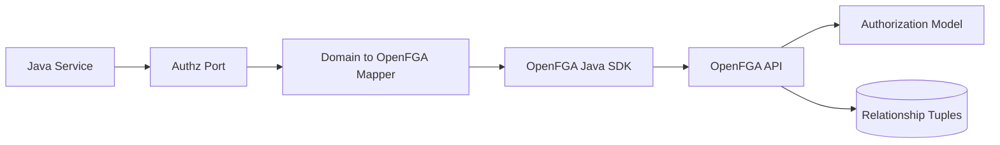
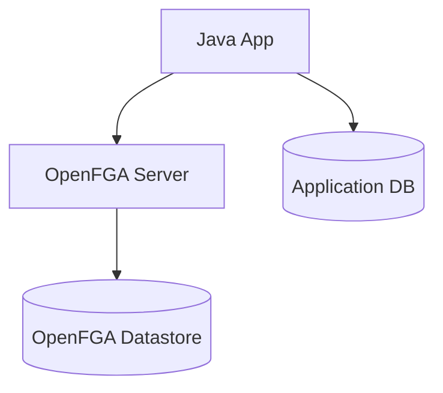
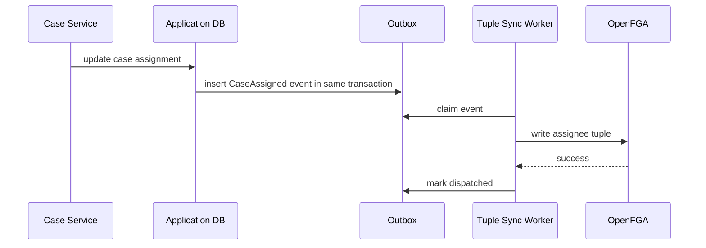
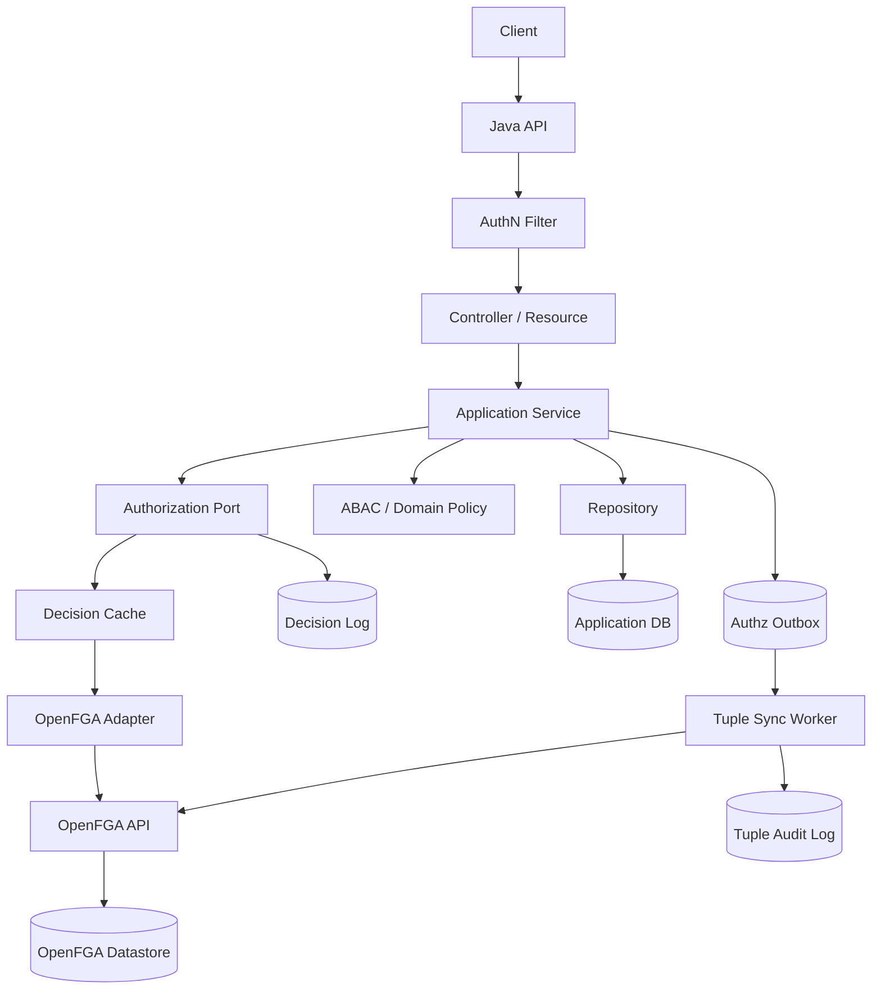

# Part 032 — OpenFGA with Java: Modeling, Tuple Writes, Checks, and Expansion

OpenFGA is an open-source fine-grained authorization engine inspired by Google Zanzibar. It lets you define an authorization model, write relationship tuples, and ask questions like:

```text
Can user:alice view case:CASE-123?
```

This part focuses on implementation from a Java system.

The goal is not merely to call the OpenFGA SDK. The goal is to place OpenFGA correctly inside a production Java architecture:

- domain model remains the source of truth;
- OpenFGA stores materialized relationship facts;
- Java code uses a typed authorization port;
- tuple writes follow domain events/outbox;
- checks are observable, timeout-bounded, and fail-closed;
- list/search authorization is designed deliberately;
- model changes are versioned and diff-tested.

---

## 1. OpenFGA Runtime Model

OpenFGA revolves around a few concepts.

| Concept | Meaning |
|---|---|
| Store | Isolation boundary containing authorization models and relationship tuples. |
| Authorization Model | Definition of object types, relations, and how relations imply permissions. |
| Relationship Tuple | Fact in the shape `user relation object`. |
| Check API | Determines whether a user has a relation on an object. |
| Write API | Adds/deletes relationship tuples. |
| List Objects API | Lists objects of a type a user has a relation to. |
| List Users API | Lists users that have a relation to an object. |
| Authorization Model ID | Immutable model version used for checks/writes. |

Conceptually:



The Java service should not scatter OpenFGA tuple strings throughout the codebase. It should depend on a domain-level port.

---

## 2. Local Development Topology

For local development, the simplest topology is:



For production, OpenFGA should be treated as an external authorization dependency with:

- explicit timeout;
- retry policy only where safe;
- circuit breaker;
- metrics;
- audit/decision logging;
- model version control;
- secure service-to-service authentication;
- tenant/store isolation strategy;
- backup/restore strategy for authorization data.

---

## 3. Store Strategy

You have three common store strategies.

### 3.1 One Store Per Environment

```text
prod-main-store
```

All tenants share one store. Tenant is represented in object IDs or object hierarchy.

Pros:

- simpler operations;
- easier cross-tenant administration if needed;
- fewer OpenFGA stores to manage.

Cons:

- tenant isolation relies on model/ID discipline;
- large stores can grow operationally complex;
- tenant-specific model changes are harder.

### 3.2 One Store Per Tenant

```text
tenant-a-store
tenant-b-store
```

Pros:

- strong logical isolation;
- easier tenant-level export/delete;
- tenant-specific configuration possible.

Cons:

- operational explosion;
- harder global analytics;
- more model rollout complexity;
- more client routing logic.

### 3.3 One Store Per Product/Bounded Context

```text
case-management-authz-store
document-management-authz-store
```

Pros:

- aligns with bounded contexts;
- avoids one giant authorization graph;
- model is easier to reason about.

Cons:

- cross-context authorization requires composition;
- shared objects need careful identity mapping.

For many enterprise Java systems, a practical starting point is:

> one store per bounded context per environment, with tenant encoded in object IDs and enforced by tuple-write invariants.

---

## 4. Object ID Strategy

Object IDs must be stable, typed, and tenant-safe.

Bad:

```text
CASE-123
```

Good:

```text
case:CASE-123
```

Better for multi-tenant systems:

```text
case:t-7/CASE-123
unit:t-7/FRAUD
user:t-7/alice
```

But be careful with users. A human user may belong to multiple tenants. You may need:

```text
identity:alice
membership:t-7/alice
```

or:

```text
user:alice
organization:t-7#member
```

The right answer depends on whether a principal's authorization is tenant-relative.

Invariant:

> Every tuple write must prove subject and object are in compatible tenant scope before writing.

---

## 5. A Regulatory Case Management Model

Let's define a simplified model in OpenFGA DSL.

```text
model
  schema 1.1

type user

type unit
  relations
    define member: [user]
    define manager: [user]

type case
  relations
    define owning_unit: [unit]
    define assignee: [user]
    define reviewer: [user, unit#member]
    define viewer: assignee or reviewer or member from owning_unit or manager from owning_unit
    define editor: assignee
    define approver: manager from owning_unit

type evidence
  relations
    define parent_case: [case]
    define viewer: viewer from parent_case
    define editor: editor from parent_case

type task
  relations
    define parent_case: [case]
    define assignee: [user]
    define viewer: viewer from parent_case or assignee
    define completer: assignee
```

This model says:

- a unit has members and managers;
- a case is owned by a unit;
- a case can have direct assignees and reviewers;
- case viewers include assignees, reviewers, unit members, and unit managers;
- case approvers are managers of the owning unit;
- evidence inherits viewer/editor from its parent case;
- tasks inherit case visibility but completion belongs to the task assignee.

This is already stronger than typical RBAC because roles are relative to objects.

But this model still does not enforce:

- case lifecycle state;
- evidence classification;
- conflict of interest;
- temporary delegation expiry;
- jurisdiction boundary;
- emergency access reason.

Those constraints should be added through ABAC/domain policy around the OpenFGA check.

---

## 6. Mapping Domain Operations to OpenFGA Relations

Do not let HTTP verbs map directly to graph relations.

Bad:

```text
GET -> viewer
POST -> editor
PATCH -> editor
DELETE -> owner
```

Better:

| Domain Operation | OpenFGA Relation | Additional Java/ABAC Constraint |
|---|---|---|
| View case summary | `viewer` on `case` | Tenant and classification. |
| Edit case narrative | `editor` on `case` | Case state is editable. |
| Approve escalation | `approver` on `case` | Maker-checker: actor is not creator. |
| Download evidence | `viewer` on `evidence` | Evidence classification <= clearance. |
| Replace evidence file | `editor` on `evidence` | Case not closed; evidence not locked. |
| Complete task | `completer` on `task` | Task state is assigned/in-progress. |
| Export case report | `viewer` on `case` | Export permission, field redaction policy. |

OpenFGA answers relationship-based eligibility. Java still enforces operation-specific invariants.

---

## 7. Java SDK Setup

The official Java SDK uses `OpenFgaClient` and `ClientConfiguration`.

The exact dependency version changes over time, so pin the version through your dependency management and read the release notes before upgrading.

Conceptual Maven shape:

```xml
<dependency>
  <groupId>dev.openfga</groupId>
  <artifactId>openfga-sdk</artifactId>
  <version>${openfga.sdk.version}</version>
</dependency>
```

Client initialization follows this shape:

```java
import dev.openfga.sdk.api.client.OpenFgaClient;
import dev.openfga.sdk.api.configuration.ClientConfiguration;

public final class OpenFgaClients {
    public static OpenFgaClient create(OpenFgaProperties properties) {
        ClientConfiguration config = new ClientConfiguration()
            .apiUrl(properties.apiUrl())
            .storeId(properties.storeId())
            .authorizationModelId(properties.authorizationModelId());

        return new OpenFgaClient(config);
    }
}
```

In production, configuration should include authentication, TLS, timeout, retry/circuit-breaker integration, and telemetry. Do not instantiate clients per request.

---

## 8. Wrap the SDK Behind a Domain Port

Application code should not call `fgaClient.check(...)` directly.

Define a port:

```java
public interface AuthorizationPort {
    AuthorizationDecision check(AuthorizationQuery query);

    default void require(AuthorizationQuery query) {
        AuthorizationDecision decision = check(query);
        if (!decision.allowed()) {
            throw new AccessDeniedException(decision.reasonCode());
        }
    }
}
```

Domain query:

```java
public record AuthorizationQuery(
    SubjectRef subject,
    DomainPermission permission,
    ResourceRef resource,
    TenantId tenantId,
    AuthorizationContext context,
    ConsistencyRequirement consistency
) {}
```

Decision:

```java
public record AuthorizationDecision(
    boolean allowed,
    String reasonCode,
    String provider,
    String modelId,
    Duration latency,
    boolean cacheHit
) {
    public static AuthorizationDecision allow(String provider, String modelId, Duration latency) {
        return new AuthorizationDecision(true, "allowed", provider, modelId, latency, false);
    }

    public static AuthorizationDecision deny(String reasonCode, String provider, String modelId, Duration latency) {
        return new AuthorizationDecision(false, reasonCode, provider, modelId, latency, false);
    }
}
```

Adapter maps domain language to OpenFGA language.

```java
public final class OpenFgaAuthorizationAdapter implements AuthorizationPort {
    private final OpenFgaClient client;
    private final OpenFgaMapper mapper;
    private final String authorizationModelId;
    private final Clock clock;

    public OpenFgaAuthorizationAdapter(
            OpenFgaClient client,
            OpenFgaMapper mapper,
            String authorizationModelId,
            Clock clock
    ) {
        this.client = client;
        this.mapper = mapper;
        this.authorizationModelId = authorizationModelId;
        this.clock = clock;
    }

    @Override
    public AuthorizationDecision check(AuthorizationQuery query) {
        Instant start = clock.instant();

        OpenFgaCheck mapped = mapper.toCheck(query);

        try {
            boolean allowed = performCheck(mapped);
            Duration latency = Duration.between(start, clock.instant());

            if (allowed) {
                return AuthorizationDecision.allow("openfga", authorizationModelId, latency);
            }
            return AuthorizationDecision.deny("relationship_not_satisfied", "openfga", authorizationModelId, latency);
        } catch (Exception ex) {
            // Default for protected resources: fail closed.
            Duration latency = Duration.between(start, clock.instant());
            return AuthorizationDecision.deny("authorization_provider_unavailable", "openfga", authorizationModelId, latency);
        }
    }

    private boolean performCheck(OpenFgaCheck mapped) throws Exception {
        // Actual SDK call shown in next section.
        throw new UnsupportedOperationException("wire to SDK");
    }
}
```

The adapter becomes the only place where OpenFGA-specific syntax exists.

---

## 9. Performing a Check

OpenFGA check asks whether a user has a relation on an object.

SDK shape:

```java
import dev.openfga.sdk.api.client.model.ClientCheckOptions;
import dev.openfga.sdk.api.client.model.ClientCheckRequest;

var options = new ClientCheckOptions()
    .authorizationModelId("01HVMMBCMGZNT3SED4Z17ECXCA");

var body = new ClientCheckRequest()
    .user("user:alice")
    .relation("viewer")
    ._object("case:CASE-123");

var response = fgaClient.check(body, options).get();
boolean allowed = Boolean.TRUE.equals(response.getAllowed());
```

Wrap it:

```java
private boolean performCheck(OpenFgaCheck mapped) throws Exception {
    var options = new ClientCheckOptions()
        .authorizationModelId(mapped.authorizationModelId());

    var body = new ClientCheckRequest()
        .user(mapped.user())
        .relation(mapped.relation())
        ._object(mapped.object());

    var response = client.check(body, options).get();
    return Boolean.TRUE.equals(response.getAllowed());
}
```

### 9.1 Safe Timeout Boundary

Do not let request threads hang indefinitely.

```java
CompletableFuture<Boolean> checkFuture = CompletableFuture.supplyAsync(() -> {
    try {
        return performCheck(mapped);
    } catch (Exception e) {
        throw new CompletionException(e);
    }
}, executor);

try {
    return checkFuture.get(150, TimeUnit.MILLISECONDS);
} catch (TimeoutException e) {
    throw new AuthorizationUnavailableException("OpenFGA check timed out", e);
}
```

In production, prefer a proper HTTP client timeout/circuit breaker rather than only wrapping futures.

---

## 10. Mapping Domain Permission to OpenFGA Relation

```java
public enum DomainPermission {
    CASE_VIEW,
    CASE_EDIT,
    CASE_APPROVE,
    EVIDENCE_VIEW,
    EVIDENCE_EDIT,
    TASK_COMPLETE
}
```

Mapper:

```java
public final class OpenFgaMapper {
    private final String authorizationModelId;

    public OpenFgaMapper(String authorizationModelId) {
        this.authorizationModelId = authorizationModelId;
    }

    public OpenFgaCheck toCheck(AuthorizationQuery query) {
        return new OpenFgaCheck(
            toUser(query.subject(), query.tenantId()),
            toRelation(query.permission()),
            toObject(query.resource(), query.tenantId()),
            authorizationModelId
        );
    }

    private String toRelation(DomainPermission permission) {
        return switch (permission) {
            case CASE_VIEW, EVIDENCE_VIEW -> "viewer";
            case CASE_EDIT, EVIDENCE_EDIT -> "editor";
            case CASE_APPROVE -> "approver";
            case TASK_COMPLETE -> "completer";
        };
    }

    private String toUser(SubjectRef subject, TenantId tenantId) {
        return switch (subject.kind()) {
            case HUMAN_USER -> "user:" + subject.id();
            case SERVICE_ACCOUNT -> "service:" + subject.id();
        };
    }

    private String toObject(ResourceRef resource, TenantId tenantId) {
        return switch (resource.kind()) {
            case CASE -> "case:" + tenantId.value() + "/" + resource.id();
            case EVIDENCE -> "evidence:" + tenantId.value() + "/" + resource.id();
            case TASK -> "task:" + tenantId.value() + "/" + resource.id();
            case UNIT -> "unit:" + tenantId.value() + "/" + resource.id();
        };
    }
}
```

Important: mapping must be deterministic. If two services map the same domain object to different OpenFGA IDs, authorization becomes inconsistent.

---

## 11. Spring Security Integration

Use Spring Security for coarse request authentication and module-level gates, then call your authorization port for object-specific authorization.

### 11.1 Controller-Level Explicit Guard

```java
@RestController
@RequestMapping("/api/cases")
public final class CaseController {
    private final CaseApplicationService cases;
    private final AuthorizationPort authz;

    @GetMapping("/{caseId}")
    public CaseDto getCase(@PathVariable String caseId, Authentication authentication) {
        SubjectRef subject = SpringSubjects.from(authentication);
        TenantId tenantId = SpringTenants.from(authentication);

        authz.require(new AuthorizationQuery(
            subject,
            DomainPermission.CASE_VIEW,
            ResourceRef.caseRecord(caseId),
            tenantId,
            AuthorizationContext.httpRequest(),
            ConsistencyRequirement.lowLatency()
        ));

        return cases.getCase(caseId, tenantId, subject);
    }
}
```

This is explicit and testable.

### 11.2 Bean Guard with `@PreAuthorize`

```java
@Component("caseAuthz")
public final class CaseAuthorizationBean {
    private final AuthorizationPort authz;

    public boolean canView(Authentication authentication, String caseId) {
        SubjectRef subject = SpringSubjects.from(authentication);
        TenantId tenantId = SpringTenants.from(authentication);

        return authz.check(new AuthorizationQuery(
            subject,
            DomainPermission.CASE_VIEW,
            ResourceRef.caseRecord(caseId),
            tenantId,
            AuthorizationContext.methodInvocation(),
            ConsistencyRequirement.lowLatency()
        )).allowed();
    }
}
```

Usage:

```java
@PreAuthorize("@caseAuthz.canView(authentication, #caseId)")
@GetMapping("/{caseId}")
public CaseDto getCase(@PathVariable String caseId) {
    return cases.getCase(caseId);
}
```

This can be useful, but do not put complex business authorization logic in SpEL. Keep SpEL as a thin call into a typed bean.

---

## 12. JAX-RS / Jersey Integration

A JAX-RS resource can call the same port explicitly.

```java
@Path("/cases/{caseId}")
public final class CaseResource {
    private final CaseApplicationService cases;
    private final AuthorizationPort authz;

    @GET
    public CaseDto getCase(
            @PathParam("caseId") String caseId,
            @Context SecurityContext securityContext
    ) {
        SubjectRef subject = Subjects.from(securityContext);
        TenantId tenantId = Tenants.from(securityContext);

        authz.require(new AuthorizationQuery(
            subject,
            DomainPermission.CASE_VIEW,
            ResourceRef.caseRecord(caseId),
            tenantId,
            AuthorizationContext.jaxRs(),
            ConsistencyRequirement.lowLatency()
        ));

        return cases.getCase(caseId, tenantId, subject);
    }
}
```

You can also build a custom annotation + `ContainerRequestFilter`, but object-level authorization often needs route params and domain context. Avoid making the filter too magical.

---

## 13. Writing Relationship Tuples

Tuple writes should happen from domain events, not directly from controllers.

Example domain event:

```java
public record CaseAssigned(
    TenantId tenantId,
    CaseId caseId,
    UserId assigneeId,
    Instant occurredAt,
    String eventId
) implements DomainEvent {}
```

Tuple mapping:

```java
public final class CaseAssignedTupleMapper {
    public ClientTupleKey toTuple(CaseAssigned event) {
        return new ClientTupleKey()
            .user("user:" + event.assigneeId().value())
            .relation("assignee")
            ._object("case:" + event.tenantId().value() + "/" + event.caseId().value());
    }
}
```

Write call:

```java
import dev.openfga.sdk.api.client.model.ClientTupleKey;
import dev.openfga.sdk.api.client.model.ClientWriteOptions;
import dev.openfga.sdk.api.client.model.ClientWriteRequest;

var options = new ClientWriteOptions()
    .authorizationModelId(modelId);

var body = new ClientWriteRequest()
    .writes(List.of(
        new ClientTupleKey()
            .user("user:alice")
            .relation("assignee")
            ._object("case:t-7/CASE-123")
    ));

fgaClient.write(body, options).get();
```

### 13.1 Delete Tuple

```java
var body = new ClientWriteRequest()
    .deletes(List.of(
        new ClientTupleKey()
            .user("user:alice")
            .relation("assignee")
            ._object("case:t-7/CASE-123")
    ));

fgaClient.write(body, options).get();
```

### 13.2 Replace Tuple

For reassignment:

```java
var body = new ClientWriteRequest()
    .deletes(List.of(
        new ClientTupleKey()
            .user("user:alice")
            .relation("assignee")
            ._object("case:t-7/CASE-123")
    ))
    .writes(List.of(
        new ClientTupleKey()
            .user("user:budi")
            .relation("assignee")
            ._object("case:t-7/CASE-123")
    ));

fgaClient.write(body, options).get();
```

Atomic replace avoids transient states where both or neither are assignees, depending on API semantics and backend guarantees.

---

## 14. Outbox-Based Tuple Synchronization

A reliable integration should use the outbox pattern.



### 14.1 Outbox Table

```sql
create table authz_outbox_event (
    id uuid primary key,
    aggregate_type text not null,
    aggregate_id text not null,
    event_type text not null,
    payload jsonb not null,
    occurred_at timestamptz not null,
    dispatched_at timestamptz,
    attempt_count integer not null default 0,
    last_error text
);
```

### 14.2 Worker Rules

- idempotent writes where possible;
- bounded retry with dead-letter queue;
- high-priority lane for revocation;
- metrics for lag;
- alert when lag exceeds security budget;
- exact domain event ID in tuple audit log;
- no manual tuple mutation outside governed path.

---

## 15. Tuple Ownership Matrix

Every tuple must have a source of truth.

| Tuple | Source of Truth | Writer |
|---|---|---|
| `user member unit` | Organization/IAM service | Org sync worker |
| `user manager unit` | HR/org hierarchy | Org sync worker |
| `unit owning_unit case` | Case aggregate | Case service outbox |
| `user assignee case` | Case assignment | Case service outbox |
| `unit#member reviewer case` | Case sharing/review workflow | Case service outbox |
| `case parent_case evidence` | Evidence aggregate | Evidence service outbox |
| `user assignee task` | Task workflow | Task service outbox |

If a tuple has no owner, it will eventually become stale.

---

## 16. List Objects for Search APIs

OpenFGA can answer list-style questions, such as:

```text
Which cases can user:alice view?
```

SDK shape depends on current SDK version, but the conceptual request is:

```java
var request = new ClientListObjectsRequest()
    .user("user:alice")
    .relation("viewer")
    .type("case");

var response = fgaClient.listObjects(request, options).get();
List<String> objectIds = response.getObjects();
```

Then query domain DB:

```java
List<String> caseIds = objectIds.stream()
    .map(OpenFgaIds::extractDomainId)
    .toList();

return caseRepository.findByIdsScoped(caseIds, filter, pageable);
```

### 16.1 Limitation

This works only when object enumeration is manageable.

If Alice can view 2 million cases, pulling IDs from OpenFGA before querying the database is not acceptable.

Alternative strategies:

- materialized access table;
- database query scoping from domain relationships;
- search index with access tokens/subjects;
- hybrid prefilter + final OpenFGA check for sensitive operations.

---

## 17. List Users and Expansion

List users/expand is useful for admin UX and audit:

```text
Who can view case CASE-123?
Why can Alice view evidence E-44?
```

But use carefully.

Expansion can be large or sensitive. Do not expose full expansion to ordinary users.

Recommended usage:

- internal admin review;
- access certification;
- debugging authorization incidents;
- audit evidence generation;
- migration validation.

Do not build normal request authorization by expanding every user.

A check is cheaper and safer for point decisions.

---

## 18. Consistency and Model ID

OpenFGA models are immutable once written; checks can specify an authorization model ID.

This is important because your Java service, tuple writer, and model deployment pipeline must agree on the model.

### 18.1 Rules

- pin model ID in application config;
- deploy model before app uses it;
- run migration/backfill before switching checks if new relation requires new tuples;
- log model ID on every decision;
- include model ID in cache key;
- run old/new model decision diff before rollout.

Cache key example:

```text
provider=openfga|model=01HV...|tenant=t-7|subject=user:alice|relation=viewer|object=case:t-7/CASE-123
```

---

## 19. Decision Caching

An OpenFGA check is network I/O. You may need caching, but cache only after risk classification.

```java
public final class CachingAuthorizationPort implements AuthorizationPort {
    private final AuthorizationPort delegate;
    private final Cache<AuthzCacheKey, AuthorizationDecision> cache;

    @Override
    public AuthorizationDecision check(AuthorizationQuery query) {
        if (!isCacheable(query)) {
            return delegate.check(query);
        }

        AuthzCacheKey key = AuthzCacheKey.from(query);
        return cache.get(key, ignored -> delegate.check(query));
    }

    private boolean isCacheable(AuthorizationQuery query) {
        return query.permission() == DomainPermission.CASE_VIEW
            && query.consistency().allowsCaching()
            && !query.context().isSensitiveDownload()
            && !query.context().isMutation();
    }
}
```

Never use the same cache policy for:

- read summary;
- sensitive evidence download;
- mutation;
- admin operation;
- revocation-sensitive users.

---

## 20. Fail-Closed Error Handling

If OpenFGA fails, protected operation should usually deny.

```java
try {
    return delegate.check(query);
} catch (OpenFgaUnavailableException ex) {
    audit.authorizationProviderFailure(query, ex);
    return AuthorizationDecision.deny(
        "authorization_provider_unavailable",
        "openfga",
        configuredModelId,
        Duration.ZERO
    );
}
```

But user-facing response must not leak internal provider details.

Return:

```json
{
  "code": "access_denied",
  "message": "You are not allowed to perform this operation."
}
```

Internal audit can store:

```json
{
  "reason": "authorization_provider_unavailable",
  "provider": "openfga",
  "timeoutMs": 150,
  "modelId": "01HV...",
  "correlationId": "..."
}
```

---

## 21. Combining OpenFGA with ABAC

OpenFGA should not be forced to model every contextual rule.

Example:

```java
public AuthorizationDecision canDownloadEvidence(
        SubjectRef subject,
        Evidence evidence,
        TenantId tenantId,
        AuthorizationContext context
) {
    AuthorizationDecision relationship = openFga.check(new AuthorizationQuery(
        subject,
        DomainPermission.EVIDENCE_VIEW,
        ResourceRef.evidence(evidence.id()),
        tenantId,
        context,
        ConsistencyRequirement.highForSensitiveRead()
    ));

    if (!relationship.allowed()) {
        return relationship;
    }

    if (!clearancePolicy.canRead(subject, evidence.classification())) {
        return AuthorizationDecision.deny("insufficient_clearance", "abac", relationship.modelId(), Duration.ZERO);
    }

    if (evidence.isSealed() && !context.hasLegalHoldAccessReason()) {
        return AuthorizationDecision.deny("sealed_evidence_requires_reason", "domain_policy", relationship.modelId(), Duration.ZERO);
    }

    return relationship;
}
```

The effective policy is:

```text
OpenFGA relationship allow
AND classification allow
AND legal/domain state allow
```

This is a normal hybrid authorization architecture.

---

## 22. Query Scoping with OpenFGA

For `GET /cases/{id}`, use point check.

For `GET /cases?status=open`, do not fetch all cases and then check one by one.

Options:

### 22.1 OpenFGA List Objects First

```text
1. Ask OpenFGA: list case objects Alice can viewer.
2. Query DB: WHERE case_id IN (:ids) AND status = 'open'.
3. Sort/paginate in DB if ID set is small enough.
```

Works for small/medium access sets.

### 22.2 Domain Query Scope

```text
1. Derive accessible units/assignments from domain DB.
2. Build SQL predicates.
3. Optionally final-check sensitive row/action with OpenFGA.
```

Works when domain relationships are already queryable.

### 22.3 Materialized Access Index

```text
1. Expand relationships into case_access_subject.
2. Query DB/index directly with subject_id.
3. Update index from tuple/domain change stream.
```

Works for large search/export workloads.

The correct design depends on access cardinality, latency budget, and freshness requirements.

---

## 23. Migration from Local ACL Table

Suppose you have:

```sql
create table case_acl (
    case_id uuid not null,
    user_id uuid not null,
    permission text not null,
    primary key (case_id, user_id, permission)
);
```

### 23.1 Migration Steps

1. Inventory current ACL semantics.
2. Classify direct permissions vs derived permissions.
3. Design OpenFGA model.
4. Backfill tuples from ACL table.
5. Run dual-write for new grants/revokes.
6. Shadow-check OpenFGA against legacy ACL.
7. Diff decisions.
8. Fix semantic mismatch.
9. Switch read path to OpenFGA for point checks.
10. Keep legacy path read-only for rollback window.
11. Remove legacy ACL only after audit sign-off.

### 23.2 Backfill Example

Legacy:

```text
case_acl(case_id=CASE-123, user_id=alice, permission=VIEW)
```

Tuple:

```text
user:alice viewer case:t-7/CASE-123
```

But do not blindly migrate every permission as direct tuple. If the permission really comes from unit membership, model it as unit ownership and membership instead.

Bad migration:

```text
write direct viewer tuple for every member of Fraud unit on every Fraud case
```

Better migration:

```text
write user member unit once
write unit owning_unit case once
model viewer = member from owning_unit
```

This is how you avoid tuple explosion.

---

## 24. Testing the Integration

### 24.1 Model Tests

Use an OpenFGA test setup or CLI to verify scenarios:

```text
Given:
  user:alice member unit:t-7/FRAUD
  unit:t-7/FRAUD owning_unit case:t-7/CASE-123
Expect:
  user:alice viewer case:t-7/CASE-123 = true
```

### 24.2 Java Adapter Unit Tests

Test mapping:

```java
@Test
void mapsCaseViewToViewerRelation() {
    OpenFgaCheck check = mapper.toCheck(new AuthorizationQuery(
        SubjectRef.user("alice"),
        DomainPermission.CASE_VIEW,
        ResourceRef.caseRecord("CASE-123"),
        TenantId.of("t-7"),
        AuthorizationContext.test(),
        ConsistencyRequirement.lowLatency()
    ));

    assertThat(check.user()).isEqualTo("user:alice");
    assertThat(check.relation()).isEqualTo("viewer");
    assertThat(check.object()).isEqualTo("case:t-7/CASE-123");
}
```

### 24.3 Integration Tests

Run OpenFGA in a test container or ephemeral environment:

```text
1. Create store.
2. Write model.
3. Write tuples.
4. Call Java authorization port.
5. Assert decisions.
```

### 24.4 Negative Tests

Mandatory cases:

- cross-tenant object ID denied;
- unassigned user denied;
- viewer does not imply editor unless model says so;
- editor implies viewer only if intended;
- evidence access inherits only through correct parent case;
- closed case cannot be edited even if OpenFGA editor allows;
- revoked tuple denies after revocation consistency boundary;
- provider timeout fails closed.

---

## 25. Observability

Record metrics:

```text
authz.openfga.check.count
authz.openfga.check.allowed
authz.openfga.check.denied
authz.openfga.check.error
authz.openfga.check.timeout
authz.openfga.check.latency
authz.openfga.write.count
authz.openfga.write.error
authz.openfga.outbox.lag
authz.openfga.model_id
```

Decision log fields:

```json
{
  "provider": "openfga",
  "modelId": "01HVMMBCMGZNT3SED4Z17ECXCA",
  "subject": "user:alice",
  "relation": "viewer",
  "object": "case:t-7/CASE-123",
  "tenant": "t-7",
  "allowed": true,
  "latencyMs": 18,
  "cacheHit": false,
  "endpoint": "GET /api/cases/{caseId}",
  "correlationId": "req-..."
}
```

Never log sensitive object payloads in authorization decision logs.

---

## 26. Security Review Checklist

Before shipping OpenFGA integration:

- [ ] Java code never builds raw tuple strings outside mapper classes.
- [ ] Every tuple type has an owner service.
- [ ] Tuple writes are authorized and audited.
- [ ] Domain DB remains source of truth.
- [ ] Outbox lag is monitored.
- [ ] Revocation has priority path and cache invalidation.
- [ ] OpenFGA model ID is pinned and logged.
- [ ] Cache key includes model ID, tenant, subject, relation, object, and relevant context.
- [ ] Provider timeout fails closed for protected APIs.
- [ ] List/search authorization is not check-after-pagination.
- [ ] Model changes have decision diff tests.
- [ ] Cross-tenant tuple writes are rejected.
- [ ] Wildcard/public access is blocked or separately governed.
- [ ] Admin tuple mutation UI has maker-checker and access review.

---

## 27. Common Anti-Patterns

### Anti-Pattern: Direct SDK Everywhere

```java
fgaClient.check(...)
```

in controllers, services, workers, and repositories creates duplicated mapping and inconsistent behavior.

Use a port.

---

### Anti-Pattern: OpenFGA as Source of Truth

If case assignment changes only in OpenFGA and not in the case database, your domain is broken.

OpenFGA is the authorization graph, not the case management database.

---

### Anti-Pattern: One Relation Called `access`

```text
define access: [user]
```

This loses business meaning.

Prefer:

```text
viewer
editor
approver
assignee
reviewer
member
manager
```

---

### Anti-Pattern: Migrating RBAC Literally

Bad:

```text
user:alice member role:admin
```

Better:

```text
user:alice manager unit:t-7/FRAUD
unit:t-7/FRAUD owning_unit case:t-7/CASE-123
```

Authorization becomes object-relative.

---

### Anti-Pattern: Treating `allowed=false` and provider error the Same Internally

Externally both may become `403` or safe denial.

Internally they are different:

- real deny means policy evaluated;
- provider error means authorization system failed.

Alert on provider errors.

---

## 28. Production Reference Architecture



The key property of this architecture:

> Authorization check path and authorization state mutation path are both explicit, observable, and independently testable.

---

## 29. Final Mental Model

OpenFGA integration is not a library task. It is an architecture task.

Think in four mappings:

```text
Domain relationship -> OpenFGA tuple
Domain permission -> OpenFGA relation
Domain object -> OpenFGA object ID
Domain state/context -> ABAC/domain policy
```

And three runtime paths:

```text
Point authorization -> Check API
List/search authorization -> List Objects, query scope, or access index
Authorization state changes -> domain event/outbox -> tuple write
```

If those mappings and paths are clean, Java services remain understandable even when authorization becomes graph-based.

If they are scattered, OpenFGA becomes another source of authorization drift.

---

## References

- OpenFGA Documentation: https://openfga.dev/docs/getting-started
- OpenFGA Concepts: https://openfga.dev/docs/concepts
- OpenFGA Configuration Language: https://openfga.dev/docs/configuration-language
- OpenFGA Perform a Check: https://openfga.dev/docs/getting-started/perform-check
- OpenFGA Update Relationship Tuples: https://openfga.dev/docs/getting-started/update-tuples
- OpenFGA Java SDK: https://github.com/openfga/java-sdk
- Google Zanzibar paper: https://research.google/pubs/zanzibar-googles-consistent-global-authorization-system/
