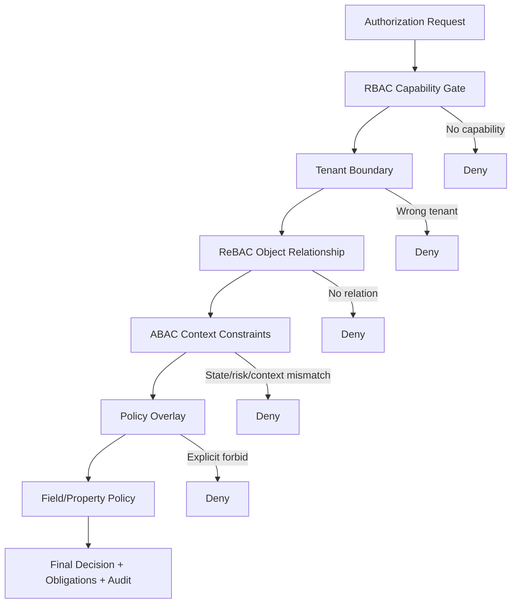
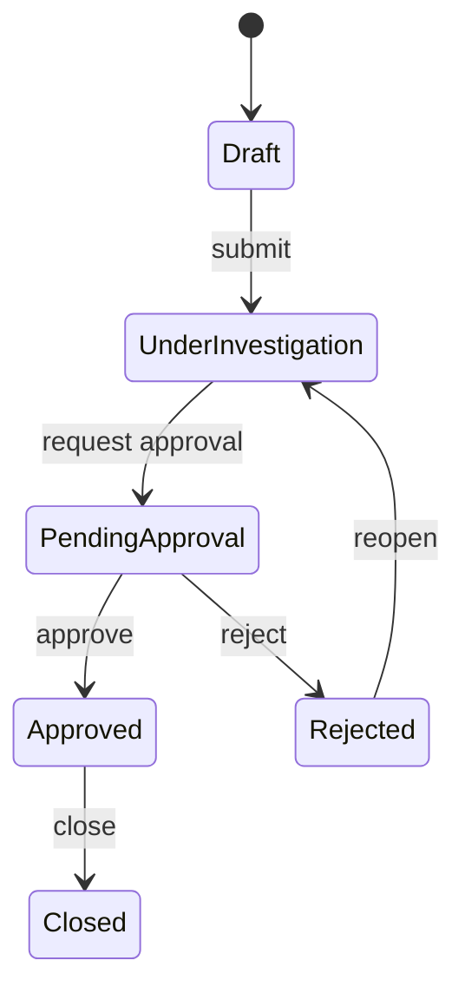
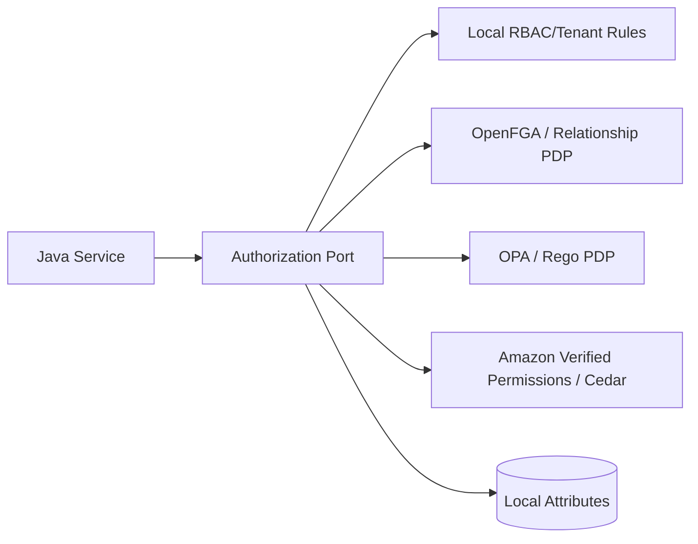

# Part 033 — Hybrid Authorization: RBAC + ABAC + ReBAC in One System

Most serious enterprise systems do not use pure RBAC, pure ABAC, or pure ReBAC.

They use a hybrid model because real access decisions usually combine several independent questions:

```text
Is this user generally allowed to perform this kind of operation?
Is this user related to this specific object?
Is this operation allowed under the current object state and environment?
Is there a policy override, regulatory restriction, delegation, or separation-of-duty rule?
What fields may be seen or changed?
How should the decision be audited?
```

A production Java system should not force all of those questions into one overloaded role, one giant `if` statement, one JWT claim, or one external policy engine.

The mental model for this part:

```text
RBAC answers: what capability does the subject generally have?
ReBAC answers: how is the subject connected to this object?
ABAC answers: under what contextual conditions is the operation valid?
PBAC answers: what governed policy says allow, deny, obligations, and advice?
Query scoping answers: how do we make unauthorized rows unreachable by construction?
Field authorization answers: which parts of the object are visible or writable?
```

A top-tier engineer does not ask, “Which model is best?”

They ask:

```text
Which access-control fact belongs to which model, at which layer, with which consistency, latency, audit, and failure semantics?
```

---

## 1. Why Hybrid Authorization Exists

Pure models fail in predictable ways.

| Pure Model | What It Does Well | Where It Breaks |
|---|---|---|
| RBAC | Coarse capability and administration | Role explosion, poor object-specific semantics |
| ABAC | Contextual constraints and policy expressiveness | Attribute sprawl, hard-to-explain decisions, policy chaos |
| ReBAC | Sharing, ownership, hierarchy, object relationship | Poor at risk/time/device/state constraints unless extended |
| ACL | Simple per-object grants | Hard to govern globally, hard to model inheritance cleanly |
| OAuth scopes | Client/API-level permission | Not enough for object-level or domain-state authorization |
| Feature flags | Product exposure | Not a security authorization system |

A regulatory case platform is a good example.

To decide whether Alice may approve an enforcement action on `CASE-123`, the system may need to check:

- Alice has the business capability `case.enforcement.approve`.
- Alice belongs to the same tenant as the case.
- Alice is assigned to the enforcement division, or is a delegated approver.
- Alice is not the maker of the same action.
- The case state is `PENDING_APPROVAL`.
- The case classification is not above Alice's clearance.
- The action is inside Alice's jurisdiction.
- The approval window has not expired.
- Break-glass access is not active, or if active, it creates special obligations.
- The field `confidentialInformantNotes` remains hidden even if the case itself is visible.

No single naive model expresses that cleanly.

---

## 2. The Core Decomposition

Hybrid authorization becomes manageable when each model owns a narrow semantic responsibility.



A useful production decomposition:

| Concern | Best Model | Example |
|---|---|---|
| General business capability | RBAC | `CASE_APPROVER` grants `case.approve` |
| API/client privilege | OAuth scope | Client has `cases.write` |
| Object-specific relationship | ReBAC | Alice is `assigned_reviewer` of `case:123` |
| Organization hierarchy | ReBAC or ABAC | Branch inherits region access |
| Object state | ABAC | Case must be `PENDING_APPROVAL` |
| Classification/clearance | ABAC | `subject.clearance >= resource.classification` |
| Time/risk/device posture | ABAC | Export only from managed device |
| Hard compliance rule | PBAC | Same person cannot create and approve |
| Field visibility | Field policy | Mask protected witness details |
| Search/list access | Query scoping | `WHERE tenant_id = ? AND jurisdiction IN (...)` |
| Emergency access | PBAC + audit obligation | Break-glass requires reason and review |

The strongest hybrid systems treat authorization as **multiple orthogonal gates**, not as one giant boolean expression.

---

## 3. Do Not Confuse Role, Relationship, and Attribute

One common failure is encoding everything as a role.

```text
ROLE_JAKARTA_SENIOR_CASE_APPROVER_FOR_HIGH_RISK_CASES_TEMPORARY_DELEGATE
```

This is not authorization design. This is a compressed incident report.

Split it:

| Fact | Correct Home |
|---|---|
| User is a case approver | RBAC role/permission |
| User covers Jakarta | ABAC subject jurisdiction or ReBAC org relation |
| User is senior | Attribute or role, depending on governance |
| Case is high risk | Resource attribute |
| User is delegated | ReBAC relation or delegation table |
| Access is temporary | Attribute with expiry or relationship caveat |

Bad systems create role explosion because they use roles to store every dimension.

Good systems isolate dimensions.

---

## 4. Hybrid Decision Contract

A hybrid authorization engine needs a decision contract that preserves intermediate evidence.

```java
public enum DecisionEffect {
    ALLOW,
    DENY,
    INDETERMINATE
}

public enum DecisionSource {
    RBAC,
    TENANT,
    REBAC,
    ABAC,
    PBAC,
    FIELD_POLICY,
    QUERY_SCOPE
}

public record DecisionReason(
        DecisionSource source,
        String code,
        String message,
        Map<String, Object> evidence
) {}

public record Obligation(
        String type,
        Map<String, Object> parameters
) {}

public record AuthorizationDecision(
        DecisionEffect effect,
        List<DecisionReason> reasons,
        List<Obligation> obligations,
        String policyVersion,
        boolean cacheable,
        Duration maxTtl
) {
    public boolean allowed() {
        return effect == DecisionEffect.ALLOW;
    }
}
```

The decision should not merely return `true` or `false`.

It should answer:

- which gate decided;
- why access was denied;
- which obligations must be executed;
- whether the result can be cached;
- which policy/model version was used;
- what audit evidence must be stored.

A boolean authorization API is too weak for production.

---

## 5. Java Domain Model for Hybrid Authorization

Start with domain language.

```java
public enum CaseAction {
    VIEW,
    VIEW_RESTRICTED_FIELDS,
    UPDATE_SUMMARY,
    ASSIGN_INVESTIGATOR,
    SUBMIT_FOR_APPROVAL,
    APPROVE_ENFORCEMENT_ACTION,
    REJECT_ENFORCEMENT_ACTION,
    EXPORT_CASE_FILE,
    CLOSE_CASE
}

public enum CaseState {
    DRAFT,
    UNDER_INVESTIGATION,
    PENDING_APPROVAL,
    APPROVED,
    REJECTED,
    CLOSED
}

public enum Classification {
    PUBLIC,
    INTERNAL,
    CONFIDENTIAL,
    RESTRICTED,
    SECRET
}

public record SubjectRef(
        String subjectId,
        String tenantId,
        Set<String> roles,
        Set<String> permissions,
        Set<String> jurisdictions,
        Classification clearance,
        boolean breakGlassActive
) {}

public record CaseResource(
        String caseId,
        String tenantId,
        CaseState state,
        Classification classification,
        String jurisdiction,
        String createdBy,
        String assignedTeam,
        boolean legalHold,
        boolean sealed
) {}

public record AuthorizationContext(
        Instant now,
        String requestId,
        String clientId,
        String ipAddress,
        String deviceTrustLevel,
        boolean interactiveUser,
        Map<String, Object> extra
) {}

public record CaseAuthorizationRequest(
        SubjectRef subject,
        CaseAction action,
        CaseResource resource,
        AuthorizationContext context
) {}
```

This shape is deliberately explicit.

Do not pass a raw JWT, raw HTTP request, ORM entity, or `Map<String, Object>` through the entire authorization pipeline.

Normalize authorization input into a stable domain contract.

---

## 6. Pipeline Evaluator Pattern

A clean implementation is a chain of small evaluators.

```java
public interface AuthorizationRule<R> {
    AuthorizationDecision evaluate(R request);
}

public final class HybridAuthorizationEngine<R> {
    private final List<AuthorizationRule<R>> rules;
    private final DecisionCombiner combiner;

    public HybridAuthorizationEngine(List<AuthorizationRule<R>> rules,
                                     DecisionCombiner combiner) {
        this.rules = List.copyOf(rules);
        this.combiner = combiner;
    }

    public AuthorizationDecision decide(R request) {
        List<AuthorizationDecision> partials = new ArrayList<>();

        for (AuthorizationRule<R> rule : rules) {
            AuthorizationDecision partial = rule.evaluate(request);
            partials.add(partial);

            if (combiner.canShortCircuit(partial)) {
                return combiner.combine(partials);
            }
        }

        return combiner.combine(partials);
    }
}
```

Decision combination must be explicit.

---

## 7. Combining Decisions

You need a deterministic conflict strategy.

Common options:

| Strategy | Semantics | Usage |
|---|---|---|
| Deny overrides | Any deny wins | Secure default for most systems |
| Permit overrides | Any allow wins | Rare; dangerous for security |
| First applicable | Order matters | Simple but fragile |
| All must allow | Every mandatory gate must allow | Good for layered hybrid auth |
| Weighted/risk-based | Risk score influences decision | Advanced contextual access |

For enterprise Java systems, use this baseline:

```text
Explicit deny > indeterminate in mandatory gate > missing mandatory allow > allow
```

Example combiner:

```java
public final class DenyOverridesCombiner implements DecisionCombiner {
    @Override
    public boolean canShortCircuit(AuthorizationDecision decision) {
        return decision.effect() == DecisionEffect.DENY;
    }

    @Override
    public AuthorizationDecision combine(List<AuthorizationDecision> decisions) {
        List<DecisionReason> reasons = decisions.stream()
                .flatMap(d -> d.reasons().stream())
                .toList();

        List<Obligation> obligations = decisions.stream()
                .flatMap(d -> d.obligations().stream())
                .toList();

        boolean hasDeny = decisions.stream().anyMatch(d -> d.effect() == DecisionEffect.DENY);
        boolean hasIndeterminate = decisions.stream().anyMatch(d -> d.effect() == DecisionEffect.INDETERMINATE);

        if (hasDeny) {
            return new AuthorizationDecision(
                    DecisionEffect.DENY,
                    reasons,
                    obligations,
                    latestPolicyVersion(decisions),
                    false,
                    Duration.ZERO
            );
        }

        if (hasIndeterminate) {
            return new AuthorizationDecision(
                    DecisionEffect.DENY,
                    List.of(new DecisionReason(
                            DecisionSource.PBAC,
                            "AUTHZ_INDETERMINATE_FAIL_CLOSED",
                            "One or more mandatory authorization checks could not be evaluated",
                            Map.of("partialReasons", reasons)
                    )),
                    obligations,
                    latestPolicyVersion(decisions),
                    false,
                    Duration.ZERO
            );
        }

        return new AuthorizationDecision(
                DecisionEffect.ALLOW,
                reasons,
                obligations,
                latestPolicyVersion(decisions),
                decisions.stream().allMatch(AuthorizationDecision::cacheable),
                minimumTtl(decisions)
        );
    }

    private String latestPolicyVersion(List<AuthorizationDecision> decisions) {
        return decisions.stream()
                .map(AuthorizationDecision::policyVersion)
                .filter(Objects::nonNull)
                .max(String::compareTo)
                .orElse("unknown");
    }

    private Duration minimumTtl(List<AuthorizationDecision> decisions) {
        return decisions.stream()
                .map(AuthorizationDecision::maxTtl)
                .filter(Objects::nonNull)
                .min(Duration::compareTo)
                .orElse(Duration.ZERO);
    }
}
```

Do not allow ambiguous combination rules to emerge accidentally from code order.

---

## 8. RBAC Capability Gate

RBAC should answer a coarse-grained question:

```text
Does this subject generally have this business capability within this scope?
```

Example:

```java
public final class CaseRbacRule implements AuthorizationRule<CaseAuthorizationRequest> {
    private final Map<CaseAction, String> requiredPermissionByAction = Map.of(
            CaseAction.VIEW, "case.view",
            CaseAction.UPDATE_SUMMARY, "case.update_summary",
            CaseAction.SUBMIT_FOR_APPROVAL, "case.submit_for_approval",
            CaseAction.APPROVE_ENFORCEMENT_ACTION, "case.approve_enforcement_action",
            CaseAction.EXPORT_CASE_FILE, "case.export"
    );

    @Override
    public AuthorizationDecision evaluate(CaseAuthorizationRequest request) {
        String required = requiredPermissionByAction.get(request.action());
        if (required == null) {
            return deny("RBAC_UNKNOWN_ACTION", "No permission mapping exists for action " + request.action());
        }

        if (!request.subject().permissions().contains(required)) {
            return deny("RBAC_PERMISSION_MISSING", "Subject lacks permission " + required);
        }

        return allow("RBAC_PERMISSION_PRESENT", Map.of("permission", required));
    }

    private AuthorizationDecision deny(String code, String message) {
        return new AuthorizationDecision(
                DecisionEffect.DENY,
                List.of(new DecisionReason(DecisionSource.RBAC, code, message, Map.of())),
                List.of(),
                "rbac-v1",
                false,
                Duration.ZERO
        );
    }

    private AuthorizationDecision allow(String code, Map<String, Object> evidence) {
        return new AuthorizationDecision(
                DecisionEffect.ALLOW,
                List.of(new DecisionReason(DecisionSource.RBAC, code, "RBAC gate passed", evidence)),
                List.of(),
                "rbac-v1",
                true,
                Duration.ofMinutes(5)
        );
    }
}
```

RBAC should not decide object ownership, state machine validity, field masking, or separation-of-duty alone.

---

## 9. Tenant Boundary Gate

Tenant isolation is not just another permission.

It is an invariant.

```java
public final class TenantBoundaryRule implements AuthorizationRule<CaseAuthorizationRequest> {
    @Override
    public AuthorizationDecision evaluate(CaseAuthorizationRequest request) {
        if (!Objects.equals(request.subject().tenantId(), request.resource().tenantId())) {
            return new AuthorizationDecision(
                    DecisionEffect.DENY,
                    List.of(new DecisionReason(
                            DecisionSource.TENANT,
                            "TENANT_MISMATCH",
                            "Subject tenant does not match resource tenant",
                            Map.of(
                                    "subjectTenant", request.subject().tenantId(),
                                    "resourceTenant", request.resource().tenantId()
                            )
                    )),
                    List.of(),
                    "tenant-boundary-v1",
                    false,
                    Duration.ZERO
            );
        }

        return new AuthorizationDecision(
                DecisionEffect.ALLOW,
                List.of(new DecisionReason(
                        DecisionSource.TENANT,
                        "TENANT_MATCH",
                        "Tenant boundary passed",
                        Map.of("tenantId", request.subject().tenantId())
                )),
                List.of(),
                "tenant-boundary-v1",
                true,
                Duration.ofMinutes(10)
        );
    }
}
```

Treat cross-tenant access as a separate audited path.

Do not hide it inside `ROLE_SUPER_ADMIN`.

---

## 10. ReBAC Object Relationship Gate

ReBAC should answer:

```text
Is this subject related to this resource in a way that grants this relation/permission?
```

Example abstraction:

```java
public interface RelationshipAuthorizationPort {
    boolean check(String user, String relation, String object, Map<String, Object> context);
}

public final class CaseRebacRule implements AuthorizationRule<CaseAuthorizationRequest> {
    private final RelationshipAuthorizationPort relationships;

    public CaseRebacRule(RelationshipAuthorizationPort relationships) {
        this.relationships = relationships;
    }

    @Override
    public AuthorizationDecision evaluate(CaseAuthorizationRequest request) {
        String relation = switch (request.action()) {
            case VIEW -> "viewer";
            case UPDATE_SUMMARY -> "editor";
            case SUBMIT_FOR_APPROVAL -> "editor";
            case APPROVE_ENFORCEMENT_ACTION -> "approver";
            case EXPORT_CASE_FILE -> "exporter";
            default -> "unknown";
        };

        if (relation.equals("unknown")) {
            return deny("REBACL_UNKNOWN_RELATION", "No relation mapping exists for action " + request.action());
        }

        boolean ok = relationships.check(
                "user:" + request.subject().subjectId(),
                relation,
                "case:" + request.resource().caseId(),
                Map.of("tenant", request.resource().tenantId())
        );

        if (!ok) {
            return deny("REBACL_RELATION_MISSING", "Subject lacks relation " + relation + " on case");
        }

        return allow("REBACL_RELATION_PRESENT", Map.of("relation", relation));
    }

    private AuthorizationDecision deny(String code, String message) {
        return new AuthorizationDecision(
                DecisionEffect.DENY,
                List.of(new DecisionReason(DecisionSource.REBAC, code, message, Map.of())),
                List.of(),
                "rebac-v1",
                false,
                Duration.ZERO
        );
    }

    private AuthorizationDecision allow(String code, Map<String, Object> evidence) {
        return new AuthorizationDecision(
                DecisionEffect.ALLOW,
                List.of(new DecisionReason(DecisionSource.REBAC, code, "ReBAC gate passed", evidence)),
                List.of(),
                "rebac-v1",
                true,
                Duration.ofSeconds(30)
        );
    }
}
```

In a real system, `RelationshipAuthorizationPort` may be backed by OpenFGA, a local ACL table, a materialized relationship table, or a domain-specific relationship service.

Keep the Java domain contract independent from the external engine.

---

## 11. ABAC Context Constraint Gate

ABAC should answer:

```text
Given the subject, object, action, and environment, is this operation allowed now?
```

Example:

```java
public final class CaseAbacRule implements AuthorizationRule<CaseAuthorizationRequest> {
    @Override
    public AuthorizationDecision evaluate(CaseAuthorizationRequest request) {
        CaseResource resource = request.resource();
        SubjectRef subject = request.subject();

        if (resource.sealed() && !subject.permissions().contains("case.sealed.access")) {
            return deny("ABAC_SEALED_CASE", "Sealed cases require explicit sealed-case permission");
        }

        if (resource.legalHold() && request.action() == CaseAction.CLOSE_CASE) {
            return deny("ABAC_LEGAL_HOLD", "Case under legal hold cannot be closed");
        }

        if (subject.clearance().ordinal() < resource.classification().ordinal()) {
            return deny("ABAC_CLEARANCE_TOO_LOW", "Subject clearance is lower than resource classification");
        }

        if (!subject.jurisdictions().contains(resource.jurisdiction())) {
            return deny("ABAC_JURISDICTION_MISMATCH", "Subject is outside resource jurisdiction");
        }

        if (request.action() == CaseAction.EXPORT_CASE_FILE
                && !"MANAGED".equals(request.context().deviceTrustLevel())) {
            return deny("ABAC_UNTRUSTED_DEVICE", "Case export requires a managed device");
        }

        return new AuthorizationDecision(
                DecisionEffect.ALLOW,
                List.of(new DecisionReason(
                        DecisionSource.ABAC,
                        "ABAC_CONSTRAINTS_PASSED",
                        "ABAC constraints passed",
                        Map.of(
                                "classification", resource.classification().name(),
                                "jurisdiction", resource.jurisdiction(),
                                "deviceTrustLevel", request.context().deviceTrustLevel()
                        )
                )),
                List.of(),
                "abac-v1",
                false,
                Duration.ZERO
        );
    }

    private AuthorizationDecision deny(String code, String message) {
        return new AuthorizationDecision(
                DecisionEffect.DENY,
                List.of(new DecisionReason(DecisionSource.ABAC, code, message, Map.of())),
                List.of(),
                "abac-v1",
                false,
                Duration.ZERO
        );
    }
}
```

ABAC decisions are often less cacheable because they depend on mutable object state, time, risk, device posture, or external context.

---

## 12. PBAC Overlay and Obligations

PBAC is useful for rules that are explicitly governed as policy.

Examples:

- same user cannot create and approve the same enforcement action;
- high-risk export requires a reason code;
- break-glass access requires immediate audit notification;
- blocked organization cannot be assigned new cases;
- regulator access must be limited to active mandate period.

Example rule:

```java
public final class SeparationOfDutyRule implements AuthorizationRule<CaseAuthorizationRequest> {
    private final CaseHistoryRepository caseHistoryRepository;

    public SeparationOfDutyRule(CaseHistoryRepository caseHistoryRepository) {
        this.caseHistoryRepository = caseHistoryRepository;
    }

    @Override
    public AuthorizationDecision evaluate(CaseAuthorizationRequest request) {
        if (request.action() != CaseAction.APPROVE_ENFORCEMENT_ACTION) {
            return allowNotApplicable();
        }

        boolean userSubmitted = caseHistoryRepository.wasSubmittedBy(
                request.resource().caseId(),
                request.subject().subjectId()
        );

        if (userSubmitted) {
            return new AuthorizationDecision(
                    DecisionEffect.DENY,
                    List.of(new DecisionReason(
                            DecisionSource.PBAC,
                            "PBAC_SOD_MAKER_CHECKER_VIOLATION",
                            "The maker of an enforcement action cannot approve the same action",
                            Map.of("caseId", request.resource().caseId())
                    )),
                    List.of(),
                    "sod-policy-v3",
                    false,
                    Duration.ZERO
            );
        }

        return new AuthorizationDecision(
                DecisionEffect.ALLOW,
                List.of(new DecisionReason(
                        DecisionSource.PBAC,
                        "PBAC_SOD_PASSED",
                        "Separation-of-duty policy passed",
                        Map.of()
                )),
                List.of(),
                "sod-policy-v3",
                false,
                Duration.ZERO
        );
    }

    private AuthorizationDecision allowNotApplicable() {
        return new AuthorizationDecision(
                DecisionEffect.ALLOW,
                List.of(new DecisionReason(
                        DecisionSource.PBAC,
                        "PBAC_NOT_APPLICABLE",
                        "Policy not applicable to action",
                        Map.of()
                )),
                List.of(),
                "sod-policy-v3",
                true,
                Duration.ofMinutes(5)
        );
    }
}
```

Policy-as-code engines such as OPA or Cedar can own this layer when policies need independent lifecycle, review, or governance.

---

## 13. Hybrid Query Scoping

A hybrid `can(action, object)` check is not enough for list/search/report/export.

You need a scoped query.

```java
public record CaseScope(
        String tenantId,
        Set<String> allowedJurisdictions,
        Set<String> allowedTeamIds,
        boolean includeSealed,
        boolean includeRestricted,
        Set<CaseState> allowedStates
) {}

public interface CaseScopeResolver {
    CaseScope resolveScope(SubjectRef subject, CaseAction action, AuthorizationContext context);
}
```

Example SQL shape:

```sql
SELECT c.*
FROM regulatory_case c
WHERE c.tenant_id = :tenant_id
  AND c.jurisdiction IN (:allowed_jurisdictions)
  AND c.assigned_team_id IN (:allowed_team_ids)
  AND (:include_sealed = true OR c.sealed = false)
  AND (:include_restricted = true OR c.classification <> 'RESTRICTED')
  AND c.state IN (:allowed_states)
ORDER BY c.updated_at DESC
LIMIT :limit OFFSET :offset;
```

The scope itself is hybrid:

| Scope Dimension | Source |
|---|---|
| tenant | tenant boundary invariant |
| allowed jurisdictions | ABAC subject attributes or org relationship |
| allowed teams | ReBAC relationship graph |
| include sealed | RBAC permission + ABAC resource attribute |
| include restricted | clearance ABAC |
| allowed states | workflow policy |

Do not retrieve unscoped rows and filter in Java after pagination.

That creates data leakage, wrong counts, timing leakage, and unstable pagination.

---

## 14. Hybrid Field Authorization

Object access does not imply field access.

```java
public enum CaseField {
    CASE_ID,
    TITLE,
    SUMMARY,
    STATUS,
    ASSIGNED_TEAM,
    EVIDENCE_SUMMARY,
    WITNESS_DETAILS,
    CONFIDENTIAL_NOTES,
    INTERNAL_RISK_SCORE,
    LEGAL_HOLD_REASON
}

public record FieldDecision(
        CaseField field,
        boolean readable,
        boolean writable,
        String reasonCode
) {}

public interface CaseFieldPolicy {
    List<FieldDecision> decideFields(CaseAuthorizationRequest request);
}
```

Field policy often combines:

- RBAC: only case investigators may edit evidence summary;
- ABAC: clearance must cover classification;
- ReBAC: assigned team members may view team notes;
- PBAC: legal hold reason visible only to legal role;
- context: export from unmanaged device removes sensitive fields.

Example:

```java
public final class CaseDtoAssembler {
    private final CaseFieldPolicy fieldPolicy;

    public CaseResponse toResponse(CaseAuthorizationRequest request, Case caseEntity) {
        Map<CaseField, FieldDecision> decisions = fieldPolicy.decideFields(request).stream()
                .collect(Collectors.toMap(FieldDecision::field, Function.identity()));

        return new CaseResponse(
                caseEntity.id(),
                readable(decisions, CaseField.TITLE) ? caseEntity.title() : null,
                readable(decisions, CaseField.SUMMARY) ? caseEntity.summary() : null,
                readable(decisions, CaseField.WITNESS_DETAILS) ? caseEntity.witnessDetails() : "[REDACTED]",
                readable(decisions, CaseField.CONFIDENTIAL_NOTES) ? caseEntity.confidentialNotes() : "[REDACTED]"
        );
    }

    private boolean readable(Map<CaseField, FieldDecision> decisions, CaseField field) {
        return decisions.getOrDefault(field, new FieldDecision(field, false, false, "FIELD_DEFAULT_DENY"))
                .readable();
    }
}
```

Make field policy explicit and testable.

Do not rely on frontend hiding.

---

## 15. State Machine Authorization

Domain lifecycle state should be part of authorization.



A transition is valid only when both the domain invariant and authorization policy pass.

```java
public final class CaseWorkflowService {
    private final HybridAuthorizationEngine<CaseAuthorizationRequest> authz;
    private final CaseRepository cases;

    public void approve(String caseId, SubjectRef subject, AuthorizationContext context) {
        CaseResource resource = cases.loadResourceForAuthorization(caseId);

        AuthorizationDecision decision = authz.decide(new CaseAuthorizationRequest(
                subject,
                CaseAction.APPROVE_ENFORCEMENT_ACTION,
                resource,
                context
        ));

        if (!decision.allowed()) {
            throw new AccessDeniedException(decision.reasons().toString());
        }

        Case aggregate = cases.loadForUpdate(caseId);
        aggregate.approve(subject.subjectId(), context.now());
        cases.save(aggregate);
    }
}
```

The domain aggregate still validates state transition invariants.

Authorization determines who may attempt the transition.

The aggregate determines whether the transition is valid in the domain.

---

## 16. External PDP Integration in Hybrid Systems

Hybrid systems often use more than one engine.



This is acceptable only if you define ownership:

| Engine | Should Own | Should Not Own |
|---|---|---|
| Local Java | tenant invariant, simple stable checks, typed domain guard | cross-service global policy chaos |
| OpenFGA | relationship graph, sharing, hierarchy | resource mutable state unless modeled carefully |
| OPA | organizational rules, infrastructure/service policy, flexible policy-as-code | high-volume graph traversal |
| Cedar/AVP | fine-grained app policy, permit/forbid, validated schema | arbitrary data querying |
| Database | query scoping, RLS, transactional object state | global authorization governance alone |

Externalize deliberately, not reflexively.

---

## 17. Do Not Double-Authorize Inconsistently

A common microservice failure:

```text
API says allow.
Service says allow using different logic.
Repository scopes differently.
Async worker rechecks differently.
Audit logs a fourth version.
```

This creates non-deterministic authorization.

Better:

```text
One canonical authorization request contract.
One canonical permission/action catalog.
One canonical reason-code catalog.
Layer-specific enforcement points, same decision model.
Policy/model version included everywhere.
```

Multiple PEPs are good.

Multiple inconsistent authorization semantics are not.

---

## 18. Caching Hybrid Decisions

Hybrid decisions have different freshness requirements.

| Decision Component | Typical Cacheability |
|---|---|
| static permission catalog | high |
| role assignment | medium, invalidation required |
| tenant membership | medium, invalidation required |
| relationship check | low-to-medium |
| resource state | low |
| risk/device posture | low |
| break-glass | usually no decision cache |
| field policy | low-to-medium |
| policy version | cache only by version |

Cache key must include all decision-changing inputs.

```java
public record AuthorizationCacheKey(
        String subjectId,
        String tenantId,
        String action,
        String resourceType,
        String resourceId,
        String resourceVersion,
        String policyVersion,
        String relationshipModelVersion,
        String deviceTrustLevel
) {}
```

Never cache an `ALLOW` decision without knowing what inputs make it valid.

Deny caching can also be dangerous if role/assignment changes must take effect quickly.

---

## 19. Audit Design for Hybrid Decisions

A decision log should record enough evidence to reconstruct the decision.

```json
{
  "decisionId": "dec-20260703-000001",
  "requestId": "req-abc",
  "subject": "user:alice",
  "tenant": "tenant:regulator-id",
  "action": "case.approve_enforcement_action",
  "resource": "case:CASE-123",
  "effect": "DENY",
  "reasons": [
    {
      "source": "PBAC",
      "code": "PBAC_SOD_MAKER_CHECKER_VIOLATION"
    }
  ],
  "policyVersion": "sod-policy-v3",
  "relationshipModelVersion": "case-authz-model-2026-07",
  "resourceVersion": "case-v17",
  "timestamp": "2026-07-03T10:15:30Z"
}
```

Avoid logging sensitive attributes directly.

Log reason codes and evidence references.

---

## 20. Testing Hybrid Authorization

Hybrid authorization requires more than unit tests.

### 20.1 Permission Matrix Tests

```java
@ParameterizedTest
@MethodSource("cases")
void authorization_matrix_is_enforced(TestCase tc) {
    AuthorizationDecision decision = engine.decide(tc.request());
    assertThat(decision.effect()).isEqualTo(tc.expectedEffect());
    assertThat(decision.reasons())
            .extracting(DecisionReason::code)
            .contains(tc.expectedReasonCode());
}
```

Matrix dimensions:

- role;
- tenant;
- relation;
- state;
- classification;
- jurisdiction;
- device trust;
- maker/checker relation;
- break-glass;
- field access;
- bulk/list/search/export.

### 20.2 Invariant Tests

Examples:

```text
No non-break-glass user can access cross-tenant resource.
No maker can approve own enforcement action.
No user below classification can view restricted fields.
No unscoped repository method is used by list endpoints.
No exported report contains fields denied by field policy.
```

### 20.3 Differential Tests

When migrating from local rules to OPA/Cedar/OpenFGA:

```text
old_engine(request) == new_engine(request)
```

Run this in shadow mode before switching enforcement.

### 20.4 Mutation Tests

Intentionally remove one gate and prove tests fail.

If removing tenant check does not fail a test, your tests are not protecting the invariant.

---

## 21. Anti-Patterns

### 21.1 Giant Role Names

Encoding every condition in role names creates role explosion.

### 21.2 One External PDP for Everything

OPA/Cedar/OpenFGA are powerful, but none should become a dumping ground for all domain logic without clear ownership.

### 21.3 Token Claims as Authorization Truth

JWT claims are snapshots.

They are not a live authorization database.

### 21.4 Filtering After Fetch

Post-filtering lists after pagination leaks counts, creates unstable pages, and may leak data through timing or error behavior.

### 21.5 UI-Only Hybrid Authorization

Frontend checks are usability hints, not enforcement.

### 21.6 Conflicting Decision Semantics

If one service uses deny-overrides and another uses permit-overrides, incidents are inevitable.

### 21.7 Missing Reason Codes

Without reason codes, denial handling, audit, user support, and policy debugging become expensive.

### 21.8 No Policy Ownership

Hybrid authorization spans security, product, compliance, and engineering.

If nobody owns the policy catalog, it decays.

---

## 22. Design Checklist

Use this checklist before implementing hybrid authorization:

- [ ] Is the action catalog explicit?
- [ ] Is the resource model explicit?
- [ ] Are tenant boundaries invariants, not optional permissions?
- [ ] Are roles limited to coarse capability?
- [ ] Are relationships modeled separately from roles?
- [ ] Are mutable context constraints modeled as ABAC?
- [ ] Are hard compliance rules represented as governed policy?
- [ ] Is field-level authorization separate from object-level authorization?
- [ ] Are list/search/export queries scoped before pagination?
- [ ] Are decision reasons structured?
- [ ] Is conflict resolution deterministic?
- [ ] Is cacheability explicit per decision?
- [ ] Are stale claims and revocation handled?
- [ ] Are policy/model versions logged?
- [ ] Are negative tests stronger than positive tests?
- [ ] Is migration covered by shadow/differential evaluation?

---

## 23. Summary

Hybrid authorization is not an advanced trick.

It is the normal shape of serious systems.

The key is decomposition:

```text
RBAC = capability
ABAC = context and attributes
ReBAC = object relationship
PBAC = governed policy
Query scoping = authorize by construction
Field policy = safe representation
Audit = defensibility
```

A strong Java authorization architecture does not ask every layer to solve every problem.

It gives every model a precise responsibility, then combines decisions through a deterministic, observable, testable pipeline.

---

## References

- OWASP Authorization Cheat Sheet — deny by default, validate permission on every request, prefer centralized authorization routines.
- OWASP API Security Top 10:2023 — BOLA, BOPLA, BFLA.
- NIST SP 800-162 — Attribute Based Access Control.
- NIST RBAC project and RBAC model references.
- Spring Security Reference — Authorization Architecture and `AuthorizationManager`.
- OpenFGA Documentation — relationship tuples, authorization models, ReBAC concepts.
- Google Zanzibar paper — global relationship-based authorization model.
- Open Policy Agent documentation — policy-as-code and decision API.
- Cedar Policy documentation and Amazon Verified Permissions documentation.
