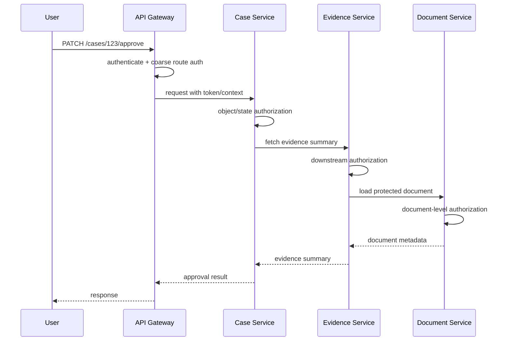
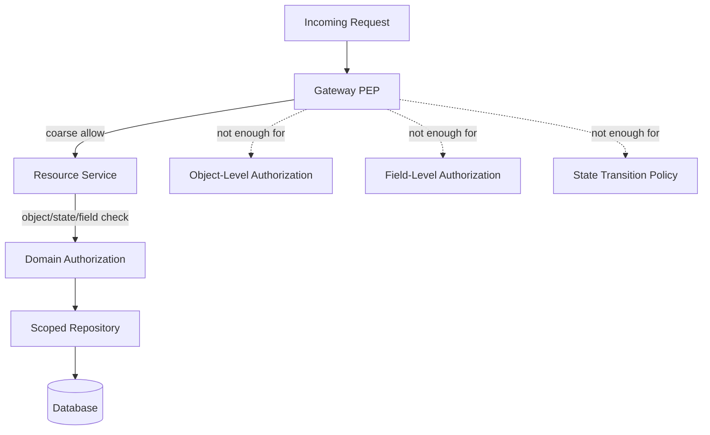
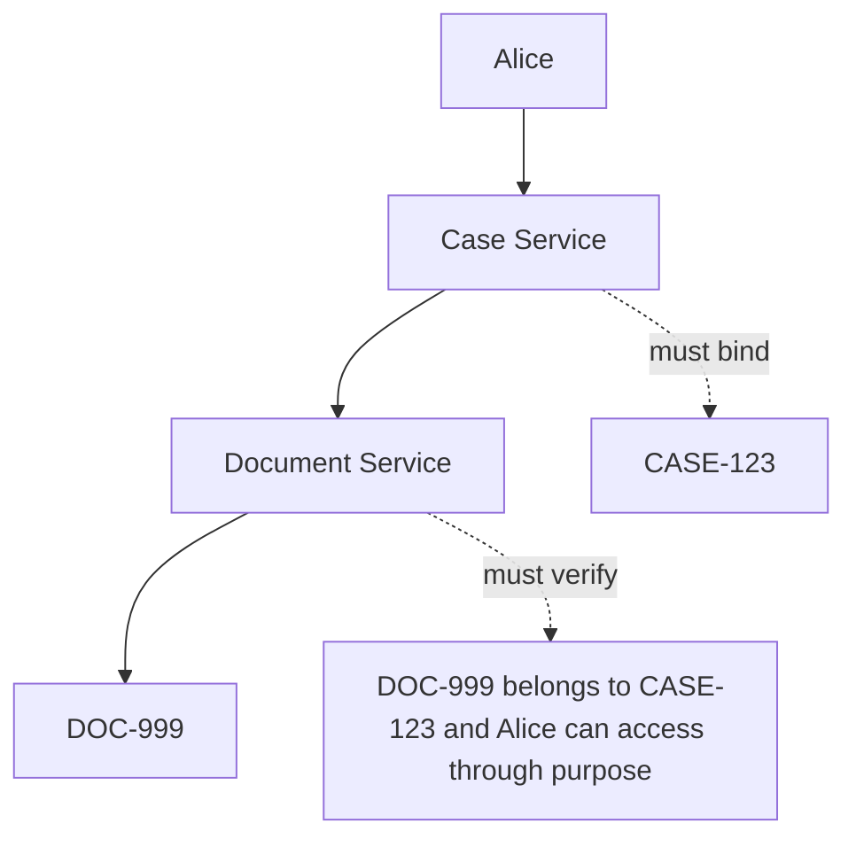
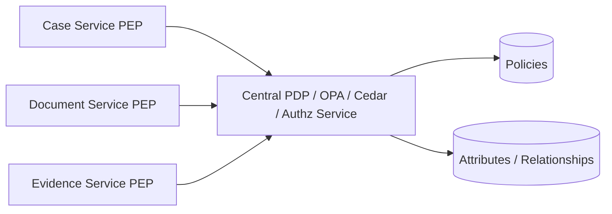
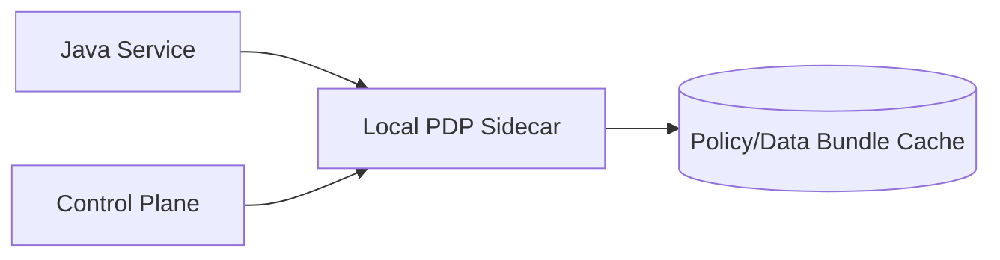

# Part 034 — Authorization in Java Microservices

Authorization becomes harder in microservices because the request is no longer a single stack frame.

It becomes a distributed call graph.

```text
Browser -> Gateway -> Case API -> Evidence Service -> Document Service -> Search Service -> Audit Service
```

The central question changes from:

```text
Can this user call this method?
```

to:

```text
Which service is acting, on behalf of whom, for what purpose, against which object, under which policy version, with what downstream authority?
```

A microservice architecture does not remove the need for authorization.

It multiplies enforcement points.

---

## 1. The Core Microservices Problem

A monolith can often pass a typed `Subject` and domain object through local method calls.

A microservice system must preserve authorization context across:

- HTTP calls;
- gRPC calls;
- Kafka messages;
- background workers;
- scheduled jobs;
- retries;
- sagas;
- search indexes;
- caches;
- exports;
- admin tools;
- cross-service database projections.

Every hop can lose context, over-trust upstream systems, or accidentally expand privilege.



If only the gateway authorizes, downstream services become confused-deputy targets.

If every service invents its own authorization logic, decisions drift.

The goal is **consistent decentralized enforcement over a shared authorization model**.

---

## 2. Zero Trust Mental Model

In a microservice architecture, internal network location should not imply authorization.

A service request should be treated as a resource access attempt requiring identity, policy, and context.

NIST Zero Trust Architecture states the relevant principle clearly: no implicit trust is granted merely because an asset or user is on a particular network location or is enterprise-owned; authentication and authorization are discrete functions before access to an enterprise resource.

For Java microservices, this means:

```text
Do not trust a request because it came from inside Kubernetes.
Do not trust a request because it passed through the gateway.
Do not trust a request because it has a user ID header.
Do not trust a service account to do every action.
Do not let downstream services infer authorization from route names.
```

Instead:

```text
Authenticate service identity.
Authenticate or verify end-user identity where present.
Validate token audience and issuer.
Check business authorization near the resource.
Propagate only the authority needed for the next hop.
Audit both user and service actor.
```

---

## 3. Actor, Subject, Client, Service, and Resource Owner

Microservices authorization fails when all identities are collapsed into `userId`.

You need distinct identity concepts.

| Concept | Meaning | Example |
|---|---|---|
| End user / subject | Human or principal whose business authority is being used | `user:alice` |
| Client | Application that initiated OAuth flow or API call | `web-portal` |
| Calling service | Service making the immediate request | `case-service` |
| Target service | Service receiving the request | `document-service` |
| Resource owner | Principal or tenant owning the resource | `tenant:regulator-a` |
| Actor | Entity performing the current technical action | `service:evidence-service` |
| On-behalf-of subject | User whose authority is delegated downstream | `user:alice` |

A downstream service decision may need both:

```text
actor = service:evidence-service
subject = user:alice
resource = document:DOC-789
action = document.read_summary
purpose = case.approval
```

Do not overwrite the user subject with the service account.

Do not pretend the service account has every user's authority.

---

## 4. Three Kinds of Microservice Calls

### 4.1 User-Delegated Call

A service calls another service on behalf of an end user.

Example:

```text
Case Service -> Document Service
subject = user:alice
actor = service:case-service
purpose = case.view
```

The target service should check:

- actor is allowed to call this endpoint;
- token audience is correct;
- subject is authorized for the object;
- actor is allowed to act on behalf of subject for this purpose;
- requested fields/actions match downstream purpose.

### 4.2 Service-Owned Call

A service acts under its own authority.

Example:

```text
Retention Service -> Document Service: purge expired temporary files
subject = service:retention-service
actor = service:retention-service
purpose = retention.purge
```

No user authority exists.

Authorization is based on service role, policy, and job scope.

### 4.3 Administrative or Break-Glass Call

A privileged support/admin operation.

Example:

```text
Support Tool -> Case Service: view restricted case for incident response
```

This needs:

- explicit admin permission;
- reason code;
- ticket reference;
- additional approval or workflow;
- short-lived access;
- strong audit;
- possibly step-up authentication;
- post-access review.

---

## 5. Gateway Authorization Is Necessary but Not Sufficient

API gateways are useful for:

- token validation;
- issuer/audience validation;
- coarse route authorization;
- rate limiting;
- request normalization;
- blocking unauthenticated traffic;
- coarse OAuth scope enforcement;
- tenant extraction;
- correlation ID injection.

They are weak for:

- object-level authorization;
- resource lifecycle state;
- field-level authorization;
- business separation of duty;
- downstream object relationship;
- data returned from internal joins;
- async continuation;
- service-owned operations.



Gateway rule:

```text
The gateway can reject early.
The owning service must still authorize near the protected resource.
```

---

## 6. Service Ownership of Authorization

The service that owns the resource should own final resource authorization.

| Resource | Owning Service | Final Authorization Location |
|---|---|---|
| Case aggregate | Case Service | Case Service |
| Evidence metadata | Evidence Service | Evidence Service |
| Document binary | Document Service | Document Service |
| Report export | Report Service + data owners | Report Service and source services |
| Search index | Search Service | Search query scope derived from source auth model |
| Audit log | Audit Service | Audit-specific policy |

Do not let Service A authorize object access to Service B's resources unless Service B explicitly exposes a policy contract for that.

Otherwise Service A will encode stale assumptions about Service B's domain.

---

## 7. Token Propagation Is Not Authorization Propagation

Forwarding a JWT downstream does not magically preserve correct authorization.

A token can be:

- valid but stale;
- valid for the wrong audience;
- valid for authentication but insufficient for object authorization;
- missing actor identity;
- missing delegation purpose;
- too broad for downstream service;
- replayed in an unintended context.

Correct downstream authorization needs a contract.

Example authorization context header shape:

```json
{
  "requestId": "req-123",
  "subject": "user:alice",
  "actor": "service:case-service",
  "tenant": "tenant:regulator-a",
  "purpose": "case.approval",
  "sourceAction": "case.approve_enforcement_action",
  "policyVersion": "case-policy-v12",
  "authTime": "2026-07-03T10:15:30Z"
}
```

This context must be integrity-protected.

Do not accept arbitrary `X-User-Id` or `X-Tenant-Id` headers from untrusted clients.

---

## 8. Audience and Scope Discipline

Each token should be intended for the service receiving it.

```text
aud = document-service
scope = document.read_summary
subject = user:alice
actor = service:case-service
```

Bad pattern:

```text
One access token valid for every internal service.
```

Better:

```text
Token exchange or constrained delegation creates a downstream token with narrower audience and purpose.
```

OAuth 2.0 Token Exchange, defined in RFC 8693, gives a standard pattern for requesting and obtaining security tokens from an authorization server, including impersonation and delegation use cases.

A Java system does not need token exchange everywhere.

But it does need the design principle:

```text
Downstream authority should be explicitly constrained, not accidentally inherited.
```

---

## 9. Delegation vs Impersonation

These are not the same.

| Mode | Meaning | Risk |
|---|---|---|
| Delegation | Service acts on behalf of user while retaining actor identity | Safer, auditable |
| Impersonation | Service receives token making it appear as the user | Higher risk, harder audit |
| Service account | Service acts as itself | Can become overprivileged |

Prefer delegation with both subject and actor recorded.

```text
subject = user:alice
actor = service:case-service
```

Avoid downstream systems seeing only:

```text
subject = user:alice
```

because the audit trail loses the fact that `case-service` performed the call.

---

## 10. Confused Deputy Problem

The confused deputy occurs when a privileged service is tricked into using its authority for a caller who lacks authority.

Example:

```text
Alice cannot read DOC-999.
Alice can call Case Service.
Case Service has broad access to Document Service.
Alice sends caseId/docId combination that causes Case Service to fetch DOC-999.
Document Service trusts Case Service and returns the document.
```

Defense:

- downstream services authorize both actor and subject;
- actor authority is constrained by purpose;
- object IDs are bound to parent resources;
- services use scoped load, not arbitrary ID load;
- tokens have correct audience;
- context is integrity-protected;
- authorization decision logs contain subject and actor;
- source service does not fetch arbitrary downstream objects by caller-provided IDs.



---

## 11. Parent-Child Binding Across Services

Nested resource authorization must be checked across service boundaries.

Bad endpoint behavior:

```http
GET /cases/CASE-123/documents/DOC-999
```

Implementation only checks Alice can view `CASE-123`, then loads `DOC-999` by ID.

Correct behavior:

```text
Alice can view CASE-123.
DOC-999 belongs to CASE-123.
Alice's case-view purpose permits the requested document fields.
Document is not sealed beyond Alice's clearance.
```

In Java:

```java
public DocumentSummary loadDocumentForCase(
        SubjectContext subject,
        String caseId,
        String documentId
) {
    CaseAccess caseAccess = caseServiceClient.checkCaseAccess(
            subject,
            caseId,
            CaseAction.VIEW
    );

    if (!caseAccess.allowed()) {
        throw new AccessDeniedException("case access denied");
    }

    DocumentResource document = documentRepository.loadForAuthorization(documentId)
            .orElseThrow(NotFoundException::new);

    if (!document.caseId().equals(caseId)) {
        throw new NotFoundException();
    }

    AuthorizationDecision decision = documentAuthorization.decide(
            new DocumentAuthorizationRequest(
                    subject,
                    DocumentAction.READ_SUMMARY,
                    document,
                    AuthorizationPurpose.CASE_VIEW
            )
    );

    if (!decision.allowed()) {
        throw new AccessDeniedException("document access denied");
    }

    return documentRepository.loadSummary(documentId);
}
```

The parent-child binding check is not optional.

---

## 12. Local PEP, Central PDP

A common production topology:



Each service enforces locally.

The PDP centralizes decision logic.

This gives:

- consistent policy;
- service-local fail-closed behavior;
- centralized audit/decision logs;
- shared reason codes;
- easier policy rollout;
- independent service ownership.

But it adds:

- latency;
- availability dependency;
- schema evolution complexity;
- caching complexity;
- blast radius if PDP fails.

Do not centralize authorization without defining timeout and failure semantics.

---

## 13. Sidecar PDP

Another topology:



OPA sidecar is the classic example.

Benefits:

- low local latency;
- fewer network hops during decision;
- policy can be distributed as bundles;
- service fails independently if sidecar is local.

Risks:

- bundle staleness;
- operational overhead;
- version skew;
- memory duplication;
- data synchronization complexity.

Sidecar works best when policies are mostly static and required attributes are local or bundled safely.

---

## 14. Authorization Context Contract Between Services

Define a stable contract.

```java
public record DistributedAuthorizationContext(
        String requestId,
        String traceId,
        String tenantId,
        String subjectType,
        String subjectId,
        String actorType,
        String actorId,
        String clientId,
        String purpose,
        String sourceAction,
        Instant authenticatedAt,
        String authnMethod,
        String policyVersionHint,
        Map<String, String> attributes
) {}
```

Rules:

- do not put secrets in context;
- do not trust context from external clients;
- validate issuer/audience/signature of token;
- reject missing tenant for tenant-bound resources;
- reject unknown purpose;
- include actor and subject separately;
- include trace/request ID for audit correlation;
- version the context schema.

---

## 15. Spring Security Resource Server Pattern

At the edge of each Spring service, authenticate the token and map authorities carefully.

```java
@Configuration
@EnableWebSecurity
public class SecurityConfig {

    @Bean
    SecurityFilterChain security(HttpSecurity http,
                                 AuthorizationManager<RequestAuthorizationContext> authzManager)
            throws Exception {
        return http
                .oauth2ResourceServer(oauth2 -> oauth2.jwt(Customizer.withDefaults()))
                .authorizeHttpRequests(registry -> registry
                        .requestMatchers("/internal/health").permitAll()
                        .requestMatchers("/cases/**").access(authzManager)
                        .anyRequest().denyAll()
                )
                .build();
    }
}
```

Important:

- route-level authorization is coarse;
- method/domain authorization still required;
- `denyAll` unknown routes;
- validate `aud` and `iss`;
- do not map every JWT claim to a trusted permission;
- avoid treating OAuth scope as object authorization.

Example custom request manager:

```java
public final class ServiceRouteAuthorizationManager
        implements AuthorizationManager<RequestAuthorizationContext> {

    @Override
    public AuthorizationDecision check(Supplier<Authentication> authentication,
                                       RequestAuthorizationContext context) {
        Authentication auth = authentication.get();
        HttpServletRequest request = context.getRequest();

        boolean authenticated = auth != null && auth.isAuthenticated();
        boolean routeAllowed = authenticated && hasRequiredRouteScope(auth, request);

        return new AuthorizationDecision(routeAllowed);
    }

    private boolean hasRequiredRouteScope(Authentication auth, HttpServletRequest request) {
        String path = request.getRequestURI();
        if (path.startsWith("/cases") && request.getMethod().equals("GET")) {
            return auth.getAuthorities().stream()
                    .anyMatch(a -> a.getAuthority().equals("SCOPE_cases.read"));
        }
        if (path.startsWith("/cases") && request.getMethod().equals("POST")) {
            return auth.getAuthorities().stream()
                    .anyMatch(a -> a.getAuthority().equals("SCOPE_cases.write"));
        }
        return false;
    }
}
```

This is only the first gate.

The service layer must still authorize resource access.

---

## 16. JAX-RS/Jersey Service Boundary Pattern

For JAX-RS services, use a request filter to authenticate and normalize context.

```java
@Provider
@Priority(Priorities.AUTHORIZATION)
public class ServiceAuthorizationFilter implements ContainerRequestFilter {

    private final TokenVerifier tokenVerifier;
    private final RouteAuthorizationService routeAuthorization;

    public ServiceAuthorizationFilter(TokenVerifier tokenVerifier,
                                      RouteAuthorizationService routeAuthorization) {
        this.tokenVerifier = tokenVerifier;
        this.routeAuthorization = routeAuthorization;
    }

    @Override
    public void filter(ContainerRequestContext requestContext) {
        String authorization = requestContext.getHeaderString(HttpHeaders.AUTHORIZATION);
        VerifiedToken token = tokenVerifier.verify(authorization);

        DistributedAuthorizationContext ctx = DistributedAuthorizationContextMapper.from(token, requestContext);

        if (!routeAuthorization.allowed(ctx, requestContext.getMethod(), requestContext.getUriInfo().getPath())) {
            throw new ForbiddenException();
        }

        requestContext.setProperty("authzContext", ctx);
    }
}
```

Then application services consume the normalized context, not raw headers.

---

## 17. Service-to-Service Authorization

Service-to-service calls need two checks:

```text
Can caller service invoke this endpoint?
Can the effective subject/purpose access the resource?
```

Example policy table:

| Caller Service | Target Service | Allowed Purpose | Allowed Action |
|---|---|---|---|
| case-service | document-service | case.view | document.read_summary |
| case-service | document-service | case.approve | document.read_evidence_bundle |
| report-service | case-service | report.export | case.export_projection |
| retention-service | document-service | retention.purge | document.delete_expired_temp |

Do not grant `document-service:*` to every internal service.

Service accounts should be least-privileged.

---

## 18. Downstream Purpose Limitation

Purpose limitation prevents authority expansion.

```java
public enum DownstreamPurpose {
    CASE_VIEW,
    CASE_APPROVAL,
    REPORT_EXPORT,
    RETENTION_PURGE,
    AUDIT_INVESTIGATION
}
```

Document Service can apply different rules by purpose:

```java
public final class DocumentPurposePolicy {
    public boolean allowed(DocumentAction action, DownstreamPurpose purpose) {
        return switch (purpose) {
            case CASE_VIEW -> action == DocumentAction.READ_SUMMARY;
            case CASE_APPROVAL -> action == DocumentAction.READ_EVIDENCE_BUNDLE;
            case REPORT_EXPORT -> action == DocumentAction.READ_EXPORTABLE_FIELDS;
            case RETENTION_PURGE -> action == DocumentAction.DELETE_EXPIRED_TEMP;
            case AUDIT_INVESTIGATION -> action == DocumentAction.READ_AUDIT_METADATA;
        };
    }
}
```

This is how a downstream service avoids becoming a general-purpose data exfiltration endpoint.

---

## 19. Distributed Query Scoping

Query scoping is harder in microservices because the data needed for authorization may be spread across services.

Options:

| Pattern | Description | Trade-off |
|---|---|---|
| Ask owner service | Target service asks source-of-truth service for scope | Consistent, more latency |
| Materialized auth projection | Maintain local table of access facts | Fast, eventual consistency |
| Central relationship engine | Use OpenFGA/Zanzibar-style graph | Good for relationships, still needs object attributes |
| Policy sidecar with bundles | Bundle static or slow-changing auth data | Fast, can be stale |
| Database RLS | Enforce scoped queries at DB layer | Strong, but service/context integration required |

Example materialized access table:

```sql
CREATE TABLE case_access_projection (
    tenant_id text NOT NULL,
    subject_id text NOT NULL,
    case_id text NOT NULL,
    can_view boolean NOT NULL,
    can_edit boolean NOT NULL,
    can_approve boolean NOT NULL,
    source_version bigint NOT NULL,
    updated_at timestamptz NOT NULL,
    PRIMARY KEY (tenant_id, subject_id, case_id)
);
```

This is fast for query scoping:

```sql
SELECT c.*
FROM regulatory_case c
JOIN case_access_projection cap
  ON cap.tenant_id = c.tenant_id
 AND cap.case_id = c.case_id
WHERE cap.subject_id = :subject_id
  AND cap.can_view = true
  AND c.tenant_id = :tenant_id
ORDER BY c.updated_at DESC
LIMIT :limit;
```

But projection staleness must be modeled.

---

## 20. Staleness in Distributed Authorization

Distributed authorization facts are often stale.

Sources of staleness:

- JWT token lifetime;
- role assignment cache;
- relationship tuple propagation;
- search index refresh;
- materialized access projection lag;
- policy bundle rollout;
- service local cache;
- event processing delay.

For each authorization fact, define a freshness budget.

| Fact | Freshness Requirement |
|---|---|
| user disabled | immediate or near-immediate deny |
| role revoked | seconds/minutes depending on risk |
| case assignment changed | short TTL, invalidation event |
| case sealed | immediate deny for sensitive reads |
| policy rollback | immediate or canary-safe |
| report export eligibility | recheck at execution time |

High-risk actions should recheck live state.

```text
Do not approve, export, delete, close, or publish using only a stale snapshot.
```

---

## 21. Async Continuation Boundary

This part focuses on synchronous microservice calls, but microservices often create async work.

A request may create a job:

```text
POST /reports/export
```

The job runs later.

The service must decide whether to:

- authorize at submission only;
- authorize again at execution;
- store an authorization snapshot;
- store purpose and policy version;
- fail the job if access changes.

Safe baseline:

```text
Authorize at submission.
Store subject, actor, purpose, resource scope, policy version, and requested fields.
Recheck high-risk mutable facts at execution.
Audit both submission and execution.
```

Part 035 goes deeper into event-driven and async authorization.

---

## 22. Error Semantics Across Services

Downstream authorization failures must not leak sensitive object existence.

Options:

| Situation | External Response |
|---|---|
| route permission missing | 403 |
| object not found or not visible | often 404 |
| field denied | omit/mask field |
| downstream service denied | translate carefully |
| policy engine unavailable | 503 or 403 depending fail-closed strategy |
| invalid token/audience | 401 |

A service should not expose:

```text
Document exists but you cannot access it.
```

unless the business explicitly wants that behavior.

---

## 23. Observability

Distributed authorization needs correlation.

Every decision log should include:

- trace ID;
- request ID;
- subject;
- actor;
- client;
- tenant;
- action;
- resource;
- purpose;
- caller service;
- target service;
- decision effect;
- reason code;
- policy version;
- model version;
- PDP latency;
- cache hit/miss;
- staleness/version evidence.

Example metrics:

```text
authz_decision_total{service="case-service",effect="allow"}
authz_decision_total{service="case-service",effect="deny",reason="TENANT_MISMATCH"}
authz_pdp_latency_ms{service="document-service",pdp="opa"}
authz_cache_hit_total{component="relationship-check"}
authz_fail_closed_total{service="evidence-service"}
authz_downstream_denied_total{caller="case-service",target="document-service"}
```

Without observability, distributed authorization bugs are almost impossible to investigate.

---

## 24. Testing Microservice Authorization

### 24.1 Service Contract Tests

Each service should publish authorization contract expectations.

```text
Given subject X, actor Y, purpose Z, resource R,
Document Service must allow action A and deny action B.
```

### 24.2 Consumer-Driven Authorization Tests

Case Service should test that it sends correct downstream purpose and subject/actor context.

Document Service should test it rejects missing or overbroad context.

### 24.3 Confused Deputy Tests

Test attack paths:

- caller provides document ID from another case;
- caller uses allowed case ID and unauthorized nested resource ID;
- internal service tries unsupported purpose;
- service token lacks correct audience;
- user token is valid but subject is not related to object;
- gateway allows route but service denies object;
- downstream call omits actor.

### 24.4 Policy Drift Tests

If multiple services share an action catalog, test compatibility.

```text
No service accepts an action not present in the canonical catalog.
No deprecated permission remains used by runtime code.
No downstream purpose is accepted without owner approval.
```

### 24.5 Chaos and Failure Tests

Simulate:

- PDP timeout;
- relationship engine unavailable;
- stale policy bundle;
- token introspection failure;
- cache outage;
- authorization projection lag;
- partial downstream denial.

Every high-risk path should fail closed.

---

## 25. Implementation Checklist

Use this checklist for Java microservice authorization:

- [ ] Every service validates issuer and audience.
- [ ] Gateway authorization is not the only enforcement point.
- [ ] Resource-owning service performs final object authorization.
- [ ] Actor and subject are modeled separately.
- [ ] Service-to-service calls are least-privileged.
- [ ] Downstream purpose is explicit.
- [ ] Delegation is auditable.
- [ ] Impersonation is avoided or strictly controlled.
- [ ] Internal headers are not trusted unless integrity-protected.
- [ ] Tenant context is verified, not merely accepted.
- [ ] Parent-child resource binding is enforced.
- [ ] List/search/export use query scoping.
- [ ] Field-level authorization is enforced by the owning service.
- [ ] High-risk async jobs recheck at execution.
- [ ] PDP timeout and fail-closed behavior are defined.
- [ ] Policy/model versions are included in logs.
- [ ] Confused-deputy tests exist.
- [ ] Downstream denial semantics do not leak object existence.

---

## 26. Anti-Patterns

### 26.1 “The Gateway Already Authorized It”

The gateway cannot know every object state, field restriction, nested resource binding, or domain invariant.

### 26.2 Overpowered Service Account

`case-service` with universal `document.read_all` becomes an exfiltration channel.

### 26.3 Raw User Headers

`X-User-Id: alice` is not authentication or authorization.

### 26.4 One Token for All Services

Tokens should have audience and purpose discipline.

### 26.5 Downstream Blind Trust

A downstream service must not assume the caller already checked everything correctly.

### 26.6 Lost Actor Identity

Audit that only records `user:alice` loses the technical actor that performed the operation.

### 26.7 Synchronous Decision with Undefined Timeout

A central PDP without timeout and fallback semantics creates outage ambiguity.

### 26.8 Search Index as Authorization Source

Search indexes are projections, not primary authorization truth unless intentionally designed with access projection and staleness control.

---

## 27. Summary

Microservices authorization is distributed systems authorization.

The core invariants:

```text
Authenticate every caller.
Validate audience and issuer.
Separate subject from actor.
Constrain downstream purpose.
Authorize near the resource.
Do not trust internal network location.
Do not rely only on gateway checks.
Scope queries before data leaves the owner boundary.
Audit decisions across service hops.
Fail closed on high-risk paths.
```

A production Java microservice system should make authorization context explicit, typed, versioned, and observable.

The engineering standard is not “the request has a token.”

The standard is:

```text
Every service can explain why this actor, on behalf of this subject, was allowed to perform this action on this resource through this path at this time.
```

---

## References

- NIST SP 800-207 — Zero Trust Architecture.
- RFC 8693 — OAuth 2.0 Token Exchange.
- RFC 9068 — JWT Profile for OAuth 2.0 Access Tokens.
- OWASP Authorization Cheat Sheet — deny by default and validate permissions on every request.
- OWASP API Security Top 10:2023 — Broken Object Level Authorization and Broken Function Level Authorization.
- Spring Security Reference — Resource Server and Authorization Architecture.
- Open Policy Agent documentation — externalized policy decision and sidecar patterns.
- OpenFGA documentation — relationship-based authorization concepts.
