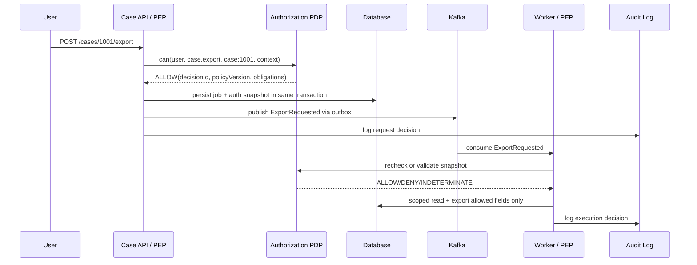
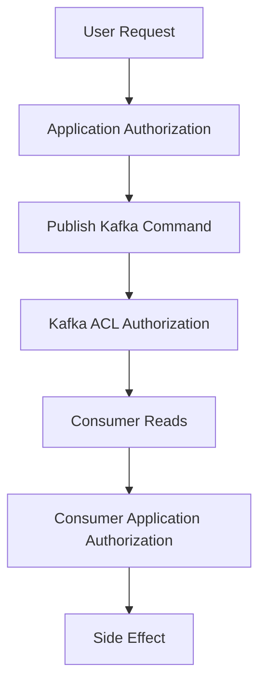
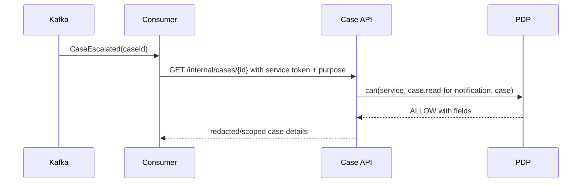

# Part 035 — Authorization in Kafka, Workers, Schedulers, and Async Flows

> Goal part ini: kamu bisa mendesain authorization untuk operasi asynchronous tanpa bergantung pada asumsi naif bahwa “kalau command sudah masuk queue berarti pasti aman”.

Di synchronous HTTP request, authorization biasanya terlihat jelas:

```text
client -> API -> authorize -> execute -> response
```

Di event-driven system, garis itu pecah:

```text
client -> API -> authorize? -> publish event/command -> wait -> consume -> execute -> emit more events
```

Masalahnya: waktu antara `authorize` dan `execute` bisa detik, menit, jam, atau hari. Dalam jeda itu, user bisa kehilangan role, resource bisa pindah tenant, case bisa berubah state, policy bisa berubah, assignment bisa dicabut, atau event bisa direplay. Jadi authorization async bukan sekadar “copy JWT ke Kafka header”.

Authorization async adalah desain tentang **siapa yang meminta**, **siapa yang menjalankan**, **atas resource apa**, **berdasarkan fakta authorization versi kapan**, **boleh replay atau tidak**, **harus recheck atau pakai snapshot**, dan **bagaimana audit membuktikan keputusan itu benar**.

---

## 1. Mental Model: Intent, Execution, and Authority

Di sistem async, pisahkan tiga hal:

| Konsep | Pertanyaan | Contoh |
|---|---|---|
| Intent authority | Siapa yang berhak meminta operasi ini? | Investigator boleh submit escalation request |
| Execution authority | Komponen mana yang berhak mengeksekusi efeknya? | `case-escalation-worker` boleh update case status |
| Data authority | Data mana yang boleh dibaca/ditulis saat eksekusi? | Worker boleh membaca case dan evidence yang termasuk escalation package |

Kesalahan klasik adalah mencampur semuanya.

Misalnya:

```text
User A boleh klik tombol export.
API publish ExportRequested.
Worker export semua data karena worker punya DB credential penuh.
```

User memang boleh meminta export, tetapi worker tetap harus dibatasi oleh **authorization scope dari request itu**. Kalau tidak, worker menjadi superuser proxy.

Itulah bentuk **confused deputy**: service berotoritas tinggi menjalankan operasi atas nama caller tanpa memvalidasi batas caller.

---

## 2. Event Is Not Permission

Event hanya fakta atau instruksi. Event bukan permission.

```json
{
  "type": "CaseExportRequested",
  "caseId": "CASE-1001",
  "requestedBy": "user:alice"
}
```

Payload ini tidak membuktikan bahwa Alice boleh export case tersebut. Ini hanya klaim bahwa seseorang meminta export.

Minimal, event/command async butuh metadata authorization:

```json
{
  "eventId": "evt-01JABC...",
  "type": "CaseExportRequested",
  "occurredAt": "2026-07-03T10:10:00Z",
  "actor": {
    "type": "USER",
    "id": "user:alice",
    "tenantId": "tenant:bank-a"
  },
  "resource": {
    "type": "case",
    "id": "CASE-1001",
    "tenantId": "tenant:bank-a"
  },
  "authorization": {
    "decisionId": "dec-789",
    "policyVersion": "case-policy@2026.07.03",
    "authorizedAction": "case.export",
    "decisionTime": "2026-07-03T10:10:00Z",
    "mode": "SNAPSHOT_AND_RECHECK",
    "allowedFields": ["caseId", "summary", "publicFindings"],
    "deniedFields": ["whistleblowerIdentity", "sealedEvidence"]
  },
  "trace": {
    "correlationId": "corr-123",
    "causationId": "cmd-456"
  }
}
```

Payload ini masih bukan “izin abadi”, tetapi memberi worker konteks untuk menentukan eksekusi aman.

---

## 3. Command vs Event: Authorization Semantics Berbeda

Bedakan command dan event.

| Type | Makna | Authorization rule |
|---|---|---|
| Command | Permintaan melakukan aksi | Harus diauthorize sebelum diterima dan sering recheck saat eksekusi |
| Event | Fakta yang sudah terjadi | Tidak “diotorisasi ulang” sebagai aksi yang sama, tetapi consumer tetap harus authorize efek lanjutannya |

Contoh command:

```text
ApproveCaseCommand
GenerateExportCommand
AssignCaseCommand
```

Contoh event:

```text
CaseApproved
CaseAssigned
ExportGenerated
```

Rule penting:

> Authorize command before enqueue. Authorize side effects before execution. Do not treat past events as future permissions.

Kalau `CaseAssigned` diterima oleh notification-service, service itu tidak perlu mengecek ulang apakah assignment dulu sah untuk sekadar mengirim notifikasi internal. Tetapi kalau consumer menggunakan event itu untuk membuka akses baru, misalnya membuat tuple `user:alice viewer case:1001`, maka consumer harus memvalidasi bahwa event berasal dari authority yang sah dan transisi state/relationship valid.

---

## 4. Async Authorization Flow



Ada dua decision:

1. **Request-time decision** — apakah caller boleh meminta operasi.
2. **Execution-time decision** — apakah operasi masih boleh dieksekusi saat worker benar-benar memproses.

Jangan anggap decision pertama selalu cukup.

---

## 5. Snapshot vs Recheck

Ini trade-off utama async authorization.

### 5.1 Snapshot Authorization

Snapshot berarti kamu menyimpan hasil authorization dan konteksnya saat request diterima.

Cocok untuk:

- operasi yang harus menghormati fakta saat user submit;
- long-running workflow yang legally harus preserve original approval basis;
- sistem dengan policy versioning kuat;
- audit/regulatory evidence.

Contoh:

```java
public record AuthorizationSnapshot(
    String decisionId,
    String policyVersion,
    Instant decidedAt,
    String subjectId,
    String action,
    String resourceType,
    String resourceId,
    String tenantId,
    Set<String> allowedFields,
    Map<String, String> reasonCodes
) {}
```

Risiko snapshot:

- user dicabut aksesnya tetapi job masih lanjut;
- resource berubah state sehingga action tidak lagi valid;
- policy baru melarang action tetapi snapshot lama masih allow;
- snapshot terlalu besar dan bocor data sensitif.

### 5.2 Recheck Authorization

Recheck berarti worker mengevaluasi lagi authorization saat eksekusi.

Cocok untuk:

- operasi berisiko tinggi;
- mutation yang mengubah state penting;
- export/download;
- operasi setelah delay panjang;
- akses yang harus immediate revocation.

Contoh:

```java
AuthorizationDecision decision = authorizationService.decide(
    AuthorizationRequest.builder()
        .subject(job.requestedBy())
        .action("case.export.execute")
        .resource(ResourceRef.of("case", job.caseId(), job.tenantId()))
        .context(Map.of(
            "jobId", job.id(),
            "requestedAt", job.requestedAt(),
            "snapshotDecisionId", job.authorizationSnapshot().decisionId()
        ))
        .build()
);

if (!decision.allowed()) {
    job.failAsDenied(decision.reasonCode());
    audit.logDeniedExecution(job, decision);
    return;
}
```

Risiko recheck:

- hasil bisa berbeda dari saat user submit;
- job bisa gagal karena policy berubah;
- user experience perlu menjelaskan “request accepted but execution denied”; 
- worker perlu akses PDP/attributes yang reliable.

### 5.3 Snapshot and Recheck

Untuk production-grade, default terbaik sering:

```text
request-time authorize -> store snapshot -> execution-time recheck critical facts -> execute with snapshot obligations
```

Recheck tidak harus mengulang semua. Bisa recheck subset:

- tenant masih sama;
- resource masih ada dan accessible;
- lifecycle state masih mengizinkan;
- user belum disabled;
- delegation belum revoked;
- policy version belum superseded oleh deny-critical rule;
- field/export scope tetap valid.

---

## 6. Operation Risk Matrix

| Operation | Request-time check | Execution-time recheck | Snapshot needed | Notes |
|---|---:|---:|---:|---|
| Send notification | Yes | Usually no | Minimal | Validate event source |
| Generate report | Yes | Yes | Yes | Field scope and filters matter |
| Export case data | Yes | Yes | Yes | High leakage risk |
| Bulk update | Yes | Yes per item/query | Yes | Avoid partial unauthorized mutation |
| Assign case | Yes | Yes | Optional | Recheck state and SoD |
| Approve workflow | Yes | Yes | Yes | Maker-checker and state transition |
| Rebuild search index | Service auth | Resource scope | Optional | Avoid indexing hidden data |
| Replay event | Service auth | Yes | Original decision metadata | Replay must not create new authority |

Rule praktis:

> The more durable, sensitive, irreversible, or externally visible the side effect, the more you need execution-time recheck and auditable snapshot.

---

## 7. Kafka Authorization Is Not Application Authorization

Kafka ACL membatasi producer/consumer terhadap cluster resources seperti topic, consumer group, transactional id, atau cluster operation. Itu penting, tetapi berbeda dari domain authorization.

Contoh Kafka-level ACL:

```text
service case-api may WRITE topic case-commands
service case-worker may READ topic case-commands
service case-worker may WRITE topic case-events
```

Domain-level authorization:

```text
user alice may approve case CASE-1001 only if:
- same tenant
- assigned investigator
- case state = UNDER_REVIEW
- not creator of recommendation
- not under conflict-of-interest restriction
```

Keduanya wajib.



Kafka ACL menjawab:

```text
May this client write/read this topic?
```

Application authorization menjawab:

```text
May this subject perform this action on this domain resource now?
```

Jangan mengganti application authorization dengan topic ACL.

---

## 8. Java Event Envelope

Buat event envelope standar. Jangan biarkan setiap team membuat metadata sendiri.

```java
public record EventEnvelope<T>(
    String eventId,
    String eventType,
    int schemaVersion,
    Instant occurredAt,
    Actor actor,
    ResourceRef primaryResource,
    AuthorizationSnapshot authorization,
    TraceContext trace,
    T payload
) {}

public record Actor(
    ActorType type,
    String id,
    String tenantId,
    Set<String> effectivePermissions
) {
    public enum ActorType { USER, SERVICE, SYSTEM }
}

public record ResourceRef(
    String type,
    String id,
    String tenantId
) {}

public record TraceContext(
    String correlationId,
    String causationId,
    String requestId
) {}
```

Jangan masukkan seluruh JWT mentah ke event payload kecuali benar-benar perlu. JWT bisa berisi data sensitif, claim basi, dan lifetime yang tidak cocok dengan event retention.

Simpan metadata minimal yang auditable:

- subject id;
- tenant id;
- action;
- resource id;
- decision id;
- policy version;
- decided at;
- obligations;
- allowed field set;
- reason code.

---

## 9. Outbox Pattern and Authorization Atomicity

Masalah:

```text
API authorize -> update DB -> publish Kafka
```

Kalau DB update berhasil tetapi Kafka publish gagal, state dan event diverge. Kalau Kafka publish berhasil tetapi DB commit gagal, event palsu tersebar.

Gunakan outbox:

```text
transaction:
  - authorize
  - write domain state
  - write outbox event with authorization metadata
commit
outbox publisher:
  - publish event to Kafka
  - mark outbox published
```

```java
@Transactional
public void requestExport(RequestExportCommand command, Subject subject) {
    CaseRecord caze = caseRepository.findScopedById(
        command.caseId(),
        AccessScope.forSubject(subject)
    ).orElseThrow(NotFoundException::new);

    AuthorizationDecision decision = authorizationService.requireAllowed(
        AuthorizationRequest.of(subject, "case.export.request", caze.ref())
    );

    ExportJob job = ExportJob.requested(
        command.caseId(),
        subject.id(),
        decision.snapshot()
    );

    exportJobRepository.save(job);

    outboxRepository.save(OutboxMessage.of(
        "CaseExportRequested",
        job.id(),
        EventEnvelope.of(subject.actor(), caze.ref(), decision.snapshot(), job.toPayload())
    ));
}
```

Authorization snapshot harus ikut ditulis dalam transaksi yang sama dengan job/outbox record. Kalau tidak, kamu bisa punya job tanpa basis authorization yang dapat diaudit.

---

## 10. Consumer-Side PEP

Worker juga PEP. Jangan berpikir worker cuma “trusted backend”.

```java
public final class ExportRequestedConsumer {
    private final ExportJobRepository jobs;
    private final AuthorizationService authorization;
    private final CaseExportService exporter;
    private final AuditSink audit;

    public void handle(EventEnvelope<ExportRequestedPayload> event) {
        ExportJob job = jobs.findById(event.payload().jobId())
            .orElseThrow(() -> new IllegalStateException("missing job"));

        AuthorizationDecision executionDecision = authorization.decide(
            AuthorizationRequest.builder()
                .subject(Subject.fromActor(event.actor()))
                .action("case.export.execute")
                .resource(event.primaryResource())
                .context(Map.of(
                    "jobId", job.id(),
                    "originalDecisionId", event.authorization().decisionId(),
                    "requestedAt", job.requestedAt()
                ))
                .build()
        );

        if (!executionDecision.allowed()) {
            jobs.markDenied(job.id(), executionDecision.reasonCode());
            audit.authorizationDenied(event, executionDecision);
            return;
        }

        exporter.export(job, event.authorization(), executionDecision.obligations());
        jobs.markCompleted(job.id());
    }
}
```

Consumer-side PEP harus mengecek:

- event berasal dari trusted producer;
- schema version valid;
- event id idempotent;
- tenant di envelope cocok dengan resource;
- actor/resource/action cocok dengan job;
- authorization snapshot tidak hilang;
- policy version acceptable;
- side effect masih valid.

---

## 11. Replay Safety

Kafka membuat replay mudah. Replay bagus untuk recovery, rebuild, analytics, dan migration. Tetapi replay berbahaya kalau event lama membawa authority lama.

Pertanyaan replay:

1. Apakah replay hanya membangun projection?
2. Apakah replay akan menghasilkan side effect eksternal?
3. Apakah replay akan membuat permission/relationship baru?
4. Apakah replay harus memakai policy saat event terjadi atau policy saat replay?
5. Apakah event lama masih boleh dieksekusi ulang?

Pattern:

| Replay type | Authorization rule |
|---|---|
| Rebuild read model | Validate event source, no user reauth needed |
| Rebuild search index | Apply current visibility/filtering rules |
| Recreate export file | Recheck current access unless legally preserved snapshot says otherwise |
| Re-emit external notification | Require idempotency and side-effect authorization |
| Recreate ACL/tuple | Validate original event authority and current model compatibility |

Invariant:

> Replay must not create new authority that did not exist in the original event or current policy.

Gunakan mode eksplisit:

```java
public enum ReplayMode {
    PROJECTION_ONLY,
    SIDE_EFFECTS_DISABLED,
    CURRENT_POLICY_RECHECK,
    ORIGINAL_SNAPSHOT_REPLAY
}
```

Jangan biarkan consumer behavior berbeda hanya karena environment variable samar.

---

## 12. Delayed Execution and Expiring Authority

Delayed jobs perlu authority expiry.

Contoh: user meminta export, worker baru memproses 12 jam kemudian.

Tambahkan:

```java
public record AuthorizationSnapshot(
    String decisionId,
    String policyVersion,
    Instant decidedAt,
    Instant expiresAt,
    String action,
    String resourceId,
    Set<String> allowedFields
) {
    boolean expired(Clock clock) {
        return expiresAt != null && Instant.now(clock).isAfter(expiresAt);
    }
}
```

Rule:

```text
If snapshot expired, recheck. If recheck impossible, fail closed for sensitive operation.
```

Untuk operation low-risk, kamu bisa pakai degradation rule. Untuk export, approval, delete, entitlement grant, role assignment, dan financial side effect: fail closed.

---

## 13. Scheduler and System Actor Authorization

Scheduler bukan manusia. Tetapi scheduler tetap subject.

Buruk:

```java
@Scheduled(cron = "0 0 * * * *")
void autoCloseCases() {
    caseRepository.closeAllExpiredCases();
}
```

Lebih baik:

```java
@Scheduled(cron = "0 0 * * * *")
void autoCloseCases() {
    Subject system = Subject.service(
        "service:case-lifecycle-scheduler",
        "tenant:system",
        Set.of("case.auto-close.execute")
    );

    List<CaseRecord> candidates = caseRepository.findAutoCloseCandidates(
        LifecycleScope.expiredAndNotOnHold()
    );

    for (CaseRecord caze : candidates) {
        AuthorizationDecision decision = authorization.decide(
            AuthorizationRequest.of(system, "case.auto-close.execute", caze.ref())
        );
        if (decision.allowed()) {
            lifecycleService.autoClose(caze.id(), decision);
        } else {
            audit.denied(system, caze.ref(), decision);
        }
    }
}
```

Scheduler policy harus eksplisit:

- service account identity;
- allowed action;
- allowed resource class;
- lifecycle state constraints;
- tenant constraints;
- dry-run mode;
- audit reason.

---

## 14. Service Account and Least Privilege

Jangan memberi worker DB/service permission global hanya karena “internal”.

Pisahkan service accounts:

```text
case-export-worker
case-assignment-worker
case-notification-worker
case-indexer-worker
case-retention-worker
```

Masing-masing punya:

- Kafka ACL berbeda;
- database credential atau role berbeda;
- application permission berbeda;
- outbound API permission berbeda;
- audit identity berbeda.

Kalau semua worker memakai `case-service-admin`, investigasi incident menjadi kabur.

---

## 15. Authorization Snapshot Design

Snapshot bukan dump semua attribute. Snapshot adalah bukti decision.

```java
public record AuthorizationEvidence(
    String decisionId,
    String decisionEngine,
    String policyVersion,
    Instant decidedAt,
    String subjectId,
    String tenantId,
    String action,
    String resourceType,
    String resourceId,
    DecisionResult result,
    List<String> reasonCodes,
    Map<String, String> evaluatedFacts,
    List<Obligation> obligations,
    CacheDirective cacheDirective
) {}
```

Jangan simpan data sensitif sebagai `evaluatedFacts` kalau tidak perlu. Simpan hash atau reference bila cukup:

```json
{
  "evaluatedFacts": {
    "case.assignmentHash": "sha256:...",
    "case.state": "UNDER_REVIEW",
    "subject.clearance": "CONFIDENTIAL",
    "policy.version": "case-authz@2026.07.03"
  }
}
```

---

## 16. Idempotency and Authorization

Idempotency bukan hanya reliability. Ia juga security control.

Kalau attacker/replay mengirim command yang sama berkali-kali, sistem tidak boleh memberi efek berulang.

```java
public record IdempotencyKey(
    String actorId,
    String action,
    String resourceId,
    String clientKey
) {}
```

Key harus mengikat actor/action/resource. Jangan hanya pakai random client key global.

Buruk:

```text
Idempotency-Key: abc
```

Lebih aman:

```text
hash(actorId + tenantId + action + resourceId + clientKey)
```

Kalau key tidak mengikat subject/resource, user bisa mencoba collision/reuse untuk action lain.

---

## 17. Batch Consumer Authorization

Consumer sering memproses banyak item sekaligus untuk throughput. Jangan authorize batch secara terlalu kasar.

Buruk:

```java
if (subject.has("case.bulk-update")) {
    repository.updateAll(ids, patch);
}
```

Lebih baik:

```java
BulkAuthorizationResult result = authorization.decideBulk(
    ids.stream()
        .map(id -> AuthorizationRequest.of(subject, "case.update", ResourceRef.caseId(id)))
        .toList()
);

List<String> allowedIds = result.allowedResources();
List<String> deniedIds = result.deniedResources();

repository.updateScoped(allowedIds, patch, AccessScope.forSubject(subject));
audit.bulkDecision(subject, allowedIds, deniedIds, result.decisionIds());
```

Untuk batch besar, jangan panggil PDP per item secara naif. Gunakan:

- query scoping;
- precomputed access table;
- relationship list objects;
- batch PDP API;
- policy partial evaluation;
- SQL predicate dari policy yang aman;
- chunking dengan audit summary.

---

## 18. Async Field-Level Authorization

Export/report/indexing sering bocor bukan karena row salah, tapi field salah.

Worker harus membawa allowed field set atau melakukan field authorization ulang.

```java
public final class CaseExportMapper {
    public ExportRow toExportRow(CaseRecord caze, FieldPolicy fields) {
        return new ExportRow(
            fields.canRead("caseId") ? caze.id() : null,
            fields.canRead("summary") ? caze.summary() : null,
            fields.canRead("whistleblowerIdentity") ? caze.whistleblowerIdentity() : Redacted.value(),
            fields.canRead("sealedEvidence") ? caze.sealedEvidenceRef() : Redacted.value()
        );
    }
}
```

Rule:

> Async worker must not use internal entity serialization as output serialization.

Jangan export JPA entity langsung ke CSV/JSON.

---

## 19. Search Indexing Authorization

Search index sering menjadi bypass authorization.

Kalau indexer menyalin semua field ke Elasticsearch/OpenSearch/Solr dan API search hanya filter tenant, field sensitif bisa bocor lewat snippet, highlight, sort, aggregation, atau autocomplete.

Pattern:

1. Index only searchable fields allowed for intended audience.
2. Split index by classification/tenant if needed.
3. Store visibility predicates in document.
4. Enforce query scoping at search API.
5. Apply field-level response shaping after search result.
6. Prevent unauthorized sort/filter/aggregation on hidden fields.

Document visibility example:

```json
{
  "caseId": "CASE-1001",
  "tenantId": "tenant:bank-a",
  "classification": "CONFIDENTIAL",
  "visibleToAssignments": ["team:enforcement-a"],
  "visibleToJurisdictions": ["jurisdiction:id-jkt"],
  "searchableText": "...",
  "redactedSummary": "..."
}
```

---

## 20. Saga Authorization

Saga terdiri dari beberapa local transactions. Authorization bisa berubah di tengah saga.

Contoh:

```text
1. Submit enforcement action
2. Reserve case number
3. Create approval task
4. Notify supervisor
5. Lock evidence package
```

Pertanyaan:

- Action mana yang perlu caller authorization?
- Action mana yang service-internal?
- Jika authorization berubah pada step 3, saga harus cancel atau continue?
- Compensation action butuh authorization siapa?
- Audit harus menunjukkan decision per step atau hanya decision awal?

Saga command envelope sebaiknya punya:

```java
public record SagaStepAuthorization(
    String sagaId,
    int stepNumber,
    String stepAction,
    String actorId,
    String serviceActorId,
    String originalDecisionId,
    String executionDecisionId,
    StepAuthorizationMode mode
) {}

public enum StepAuthorizationMode {
    ORIGINAL_CALLER_AUTHORITY,
    SERVICE_INTERNAL_AUTHORITY,
    SERVICE_WITH_CALLER_CONSTRAINT,
    SYSTEM_POLICY_AUTHORITY
}
```

Gunakan mode eksplisit. Jangan biarkan semua step berjalan sebagai service superuser tanpa caller constraint.

---

## 21. Dead Letter Queue and Sensitive Payloads

DLQ sering menyimpan payload penuh, termasuk authorization snapshot, actor info, dan resource data.

Security rule:

- DLQ access harus dibatasi ketat.
- Payload DLQ harus redacted bila mungkin.
- Replay dari DLQ harus memerlukan explicit authorization.
- DLQ viewer bukan otomatis boleh melihat data payload sensitif.
- DLQ reprocessor harus memakai recheck mode.

DLQ operation juga harus diauthorize:

```text
dlq.message.view
 dlq.message.redrive
 dlq.message.delete
 dlq.message.export
```

Jangan memberi semua engineer akses plaintext ke DLQ production.

---

## 22. Topic Design and Authorization Boundary

Topic design mempengaruhi authorization.

### 22.1 Topic by Domain Event

```text
case-events
case-commands
```

Pro:

- sederhana;
- consumer mudah subscribe semua event domain.

Kontra:

- ACL coarse-grained;
- consumer bisa membaca event yang tidak diperlukan;
- payload harus lebih hati-hati.

### 22.2 Topic by Sensitivity

```text
case-public-events
case-confidential-events
case-restricted-events
```

Pro:

- Kafka ACL lebih sesuai data sensitivity;
- blast radius lebih kecil.

Kontra:

- routing lebih kompleks;
- event schema bisa terduplikasi;
- consumer subscription lebih rumit.

### 22.3 Topic by Tenant

```text
tenant-a.case-events
 tenant-b.case-events
```

Pro:

- isolasi kuat;
- operational blast radius kecil per tenant.

Kontra:

- topic explosion;
- deployment/observability lebih kompleks;
- cross-tenant analytics sulit.

Untuk regulatory/enterprise case management, topik by sensitivity sering lebih realistis daripada per-tenant untuk semua domain, kecuali tenant count kecil dan isolation requirement sangat tinggi.

---

## 23. Event Payload Minimization

Jangan publish data sensitif kalau consumer bisa fetch scoped data sendiri.

Buruk:

```json
{
  "type": "CaseCreated",
  "payload": {
    "caseId": "CASE-1001",
    "summary": "...",
    "whistleblowerIdentity": "...",
    "sealedEvidence": "..."
  }
}
```

Lebih baik:

```json
{
  "type": "CaseCreated",
  "payload": {
    "caseId": "CASE-1001",
    "tenantId": "tenant:bank-a",
    "classification": "CONFIDENTIAL"
  }
}
```

Consumer yang perlu detail harus memanggil Case API dengan service authorization dan caller/tenant constraints.

Rule:

> Events should carry facts needed for routing and consistency, not every field convenient for every future consumer.

---

## 24. Consumer Fetch-Back Pattern

Consumer fetch-back berarti event hanya membawa ID, consumer mengambil detail dari authoritative service dengan authorization.



Pro:

- payload event lebih minim;
- field-level authorization central;
- consumer tidak menyimpan data yang tidak perlu.

Kontra:

- coupling ke API availability;
- latency lebih tinggi;
- replay butuh authoritative state saat replay, bukan state saat event occurred.

Gunakan untuk data sensitif. Jangan gunakan untuk event yang harus menjadi immutable evidence of fact tanpa dependency ke current state.

---

## 25. Authorization for Internal APIs Used by Workers

Internal endpoint sering menjadi bypass.

Buruk:

```http
GET /internal/cases/CASE-1001
Authorization: Bearer service-token
```

Endpoint mengembalikan semua data karena caller service trusted.

Lebih baik:

```http
GET /internal/cases/CASE-1001?purpose=notification.render
Authorization: Bearer service-token
X-Original-Actor: user:alice
X-Correlation-Id: corr-123
```

Server memutuskan:

```text
service may call internal API
AND purpose is allowed
AND original actor/resource constraints are satisfied if needed
AND returned fields match purpose
```

Purpose harus enum, bukan string bebas.

```java
public enum DataAccessPurpose {
    NOTIFICATION_RENDER,
    EXPORT_GENERATION,
    SEARCH_INDEXING,
    AUDIT_RECONCILIATION,
    REGULATORY_RETENTION
}
```

---

## 26. Event Source Authenticity

Consumer harus percaya pada producer yang sah, bukan pada payload.

Controls:

- Kafka ACL: hanya producer tertentu boleh write topic;
- mTLS/SASL identity untuk producer;
- schema registry compatibility;
- event signature untuk high-risk cross-boundary event;
- producer service identity di envelope;
- event type allowlist per producer;
- audit producer id.

Consumer validation:

```java
public void validateEnvelope(EventEnvelope<?> event) {
    requireNonNull(event.eventId());
    requireAllowedProducer(event.eventType(), event.trace().producerService());
    requireKnownSchema(event.eventType(), event.schemaVersion());
    requireTenantMatch(event.actor(), event.primaryResource());
    requireDecisionMetadataForSensitiveEvents(event);
}
```

---

## 27. Ordering, Race Conditions, and Authorization

Kafka order biasanya per partition, bukan global.

Authorization-relevant facts bisa datang out-of-order:

```text
1. UserRoleRevoked
2. ExportRequested
3. AssignmentRemoved
```

Consumer mungkin melihat `ExportRequested` sebelum `UserRoleRevoked` tergantung topic/partition.

Strategies:

- use authoritative read/recheck for high-risk operations;
- include version numbers in events;
- use resource version preconditions;
- partition by resource id for lifecycle events;
- reject stale commands if resource version changed;
- use monotonic policy/relationship version where possible.

Example:

```java
if (!job.expectedCaseVersion().equals(currentCase.version())) {
    AuthorizationDecision decision = authorization.recheckBecauseResourceChanged(job, currentCase);
    if (!decision.allowed()) {
        job.markDenied("RESOURCE_VERSION_CHANGED");
        return;
    }
}
```

---

## 28. Authorization in Event Sourcing

Event sourcing stores state as events. Authorization must not be modeled as casual read of current aggregate only.

Patterns:

1. Authorize command before appending event.
2. Store command metadata/decision id with event metadata.
3. Do not expose event stream without stream-level and event-level authorization.
4. Redact or encrypt sensitive event payloads.
5. For replay, distinguish domain reconstruction from user-facing read.
6. For projections, apply current visibility rules at query time.

Event metadata:

```json
{
  "eventId": "evt-1",
  "streamId": "case-CASE-1001",
  "eventType": "CaseApproved",
  "metadata": {
    "actorId": "user:supervisor-1",
    "decisionId": "dec-1",
    "policyVersion": "case-policy@2026.07.03",
    "correlationId": "corr-1"
  }
}
```

Do not assume event store admin UI is safe for broad access. Event store often contains more sensitive historical facts than current API responses.

---

## 29. Materialized Views and Authorization Drift

Read models can become stale.

Example:

```text
case_search_view.visible_to_team_ids = [team:A]
```

If user removed from team A, search API must not rely only on stale denormalized field without rechecking user/team membership freshness.

Options:

- recompute projection on relationship changes;
- include relationship version in query;
- use join to current membership table;
- use short TTL visibility cache;
- recheck detail endpoint before returning sensitive fields;
- maintain access index with invalidation events.

Invariant:

> A materialized authorization view must have an explicit freshness model.

---

## 30. Audit Model for Async Authorization

Audit async decision in two layers.

### Request-time audit

```json
{
  "event": "AUTHZ_DECISION",
  "phase": "REQUEST_ACCEPTANCE",
  "decisionId": "dec-req-1",
  "subject": "user:alice",
  "action": "case.export.request",
  "resource": "case:CASE-1001",
  "result": "ALLOW",
  "policyVersion": "case-policy@2026.07.03",
  "correlationId": "corr-1"
}
```

### Execution-time audit

```json
{
  "event": "AUTHZ_DECISION",
  "phase": "ASYNC_EXECUTION",
  "decisionId": "dec-exec-1",
  "originalDecisionId": "dec-req-1",
  "subject": "user:alice",
  "serviceActor": "service:case-export-worker",
  "action": "case.export.execute",
  "resource": "case:CASE-1001",
  "result": "ALLOW",
  "policyVersion": "case-policy@2026.07.03",
  "jobId": "job-1",
  "correlationId": "corr-1"
}
```

Jika incident terjadi, kamu harus bisa menjawab:

- siapa meminta;
- kapan diizinkan;
- policy versi apa;
- worker mana mengeksekusi;
- data apa yang dibaca/ditulis;
- apakah recheck dilakukan;
- apakah ada stale decision;
- siapa redrive/replay;
- apa hasil akhir.

---

## 31. Testing Strategy

### 31.1 Unit Tests

Test decision logic:

```java
@Test
void exportExecutionDeniedWhenSnapshotExpiredAndUserNoLongerAssigned() {
    ExportJob job = jobWithExpiredSnapshot("CASE-1", "user:alice");
    caseAssignments.remove("CASE-1", "user:alice");

    AuthorizationDecision decision = authorization.decide(
        requestFrom(job, "case.export.execute")
    );

    assertThat(decision.allowed()).isFalse();
    assertThat(decision.reasonCode()).isEqualTo("ASSIGNMENT_REVOKED");
}
```

### 31.2 Consumer Contract Tests

Test envelope validation:

- missing decision id;
- tenant mismatch;
- unknown producer;
- stale schema version;
- event type not allowed for producer;
- snapshot expired;
- replay mode disabled.

### 31.3 Integration Tests

Simulate:

```text
request accepted -> role revoked -> worker executes -> must deny
```

```text
request accepted -> case state changed -> worker executes -> must deny or re-evaluate
```

```text
event replayed -> external side effect disabled
```

### 31.4 Chaos Tests

- PDP timeout;
- attribute store unavailable;
- outbox delayed;
- duplicate event;
- out-of-order relationship event;
- cache invalidation lost;
- DLQ redrive by unauthorized operator.

---

## 32. Common Anti-Patterns

### Anti-pattern 1 — Copy JWT into Kafka and trust it forever

JWT lifetime and event lifetime differ. Claims become stale.

### Anti-pattern 2 — Worker runs as global admin

Worker becomes confused deputy and makes audit meaningless.

### Anti-pattern 3 — Authorize only at HTTP boundary

Async side effect can happen long after authorization facts changed.

### Anti-pattern 4 — Export/report worker serializes entity directly

Field-level authorization bypass.

### Anti-pattern 5 — Replay creates side effects

Reprocessing should not send external emails, grant access, or mutate state unless explicit and authorized.

### Anti-pattern 6 — DLQ has broad engineer access

DLQ becomes sensitive data lake.

### Anti-pattern 7 — Materialized view treated as always current

Authorization drift creates stale allow.

### Anti-pattern 8 — Topic ACL treated as domain auth

Kafka ACL controls topic access, not case/resource/action permission.

---

## 33. Engineering Checklist

Before shipping async authorization, answer:

- [ ] Which operations are commands and which are events?
- [ ] Is command authorized before enqueue?
- [ ] Is worker executing as explicit service actor?
- [ ] Does worker recheck sensitive operations?
- [ ] Is request-time decision snapshot stored?
- [ ] Does snapshot have policy version and expiry?
- [ ] Are tenant/resource/action bound in event envelope?
- [ ] Is event source authenticity validated?
- [ ] Are Kafka ACLs least-privilege?
- [ ] Are payloads minimized?
- [ ] Are DLQ access and redrive authorized?
- [ ] Is replay mode explicit?
- [ ] Are idempotency keys bound to actor/action/resource?
- [ ] Are field-level rules applied in exports/reports/indexes?
- [ ] Is audit available for request and execution decisions?
- [ ] Are stale claims/cache invalidation tested?
- [ ] Does PDP timeout fail closed for sensitive operations?

---

## 34. Top 1% Mental Model

A mature engineer does not ask only:

```text
Can this endpoint publish an event?
```

They ask:

```text
What authority is being transformed across time, process, service, queue, retry, replay, and side effect?
```

That is the essence of async authorization.

Event-driven architecture creates temporal distance between intent and execution. Authorization must travel across that distance without becoming a forged passport, stale privilege, or unbounded service superpower.

Use this rule:

> In async systems, authorization is not a one-time gate. It is a chain of authority preservation, revalidation, scoping, and evidence.

---

## References

- OWASP Authorization Cheat Sheet — deny by default, least privilege, validate permissions on every request: https://cheatsheetseries.owasp.org/cheatsheets/Authorization_Cheat_Sheet.html
- OWASP API Security 2023 — Broken Object Level Authorization: https://owasp.org/API-Security/editions/2023/en/0xa1-broken-object-level-authorization/
- Apache Kafka Documentation — security, authorization, ACLs, topics, producer/consumer model: https://kafka.apache.org/documentation/
- Apache Kafka Authorization and ACLs: https://kafka.apache.org/documentation/#security_authz
- Spring Security Authorization Architecture — `AuthorizationManager`: https://docs.spring.io/spring-security/reference/servlet/authorization/architecture.html
- Open Policy Agent Decision Logs: https://openpolicyagent.org/docs/management-decision-logs
- Open Policy Agent Bundles: https://openpolicyagent.org/docs/management-bundles
